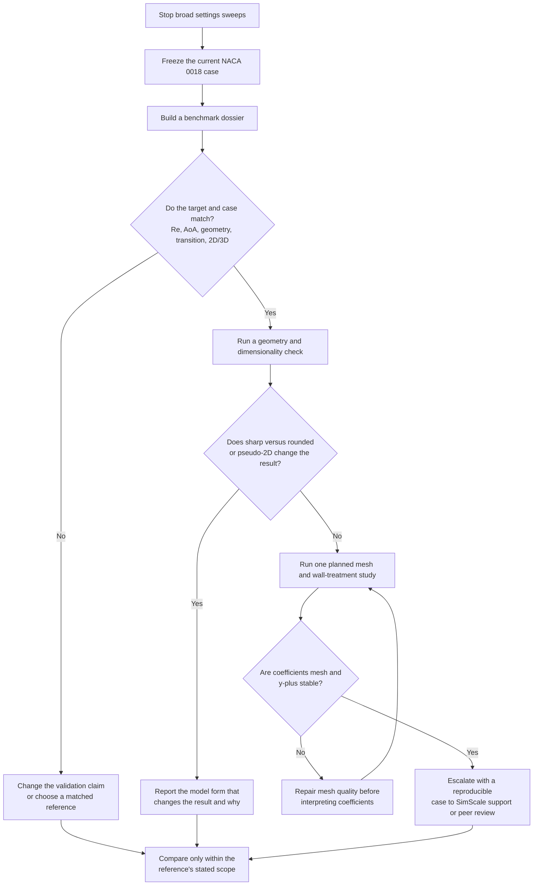

# NACA 0018 Validation Decision Matrix

## Current Position

Do not run another broad sweep of solver settings in an effort to force the NACA 0018 result to match AirfoilTools. The recorded rounded NACA 0018 case at `Re = 50,000` and `5 deg` produced approximately `Cl = 0.57` and `Cd = 0.028`, while the rounded NACA 0012 control using the same key setup produced `Cl = 0.614` and `Cd = 0.028`, close to its target. This makes a general coefficient-normalization, domain, or shared-workflow error less likely, but it does not validate the NACA 0018 case. (source: active/documentation/CFD log/Airfoil Validation Studies.md)

The key conflict is the reference target. The AirfoilTools-based NACA 0018 target is approximately `Cl = 0.75`, while the project's low-turbulence NACA 0018 experiment reports a maximum `Cl = 0.435` at `Re = 50,000` and `3 deg`. These sources do not establish the same result, so matching only the AirfoilTools curve is not a sound definition of success. (source: active/documentation/CFD log/Airfoil Validation Studies.md; source: sources/cj9.md)

The NACA 0010 result should not be treated as a fully clean validation control: the recorded run had high non-orthogonality of about `87`. The NACA 0015 result also missed its expected lift, and the log notes that disagreement increased with thickness. This pattern makes airfoil-specific geometry and mesh behavior worth investigating before changing more solver settings. (source: active/documentation/CFD log/Airfoil Validation Studies.md)

## Visual Decision Flow

## Decision Matrix

| Priority | Decision or Test                                                                                | Why It Comes Next                                                                                                                                                                                                                                                                                                                                                                                         | What to Record                                                                                                                                                                                                                                                                                            | Decision Rule                                                                                                                                                                                                                      |
| -------- | ----------------------------------------------------------------------------------------------- | --------------------------------------------------------------------------------------------------------------------------------------------------------------------------------------------------------------------------------------------------------------------------------------------------------------------------------------------------------------------------------------------------------- | --------------------------------------------------------------------------------------------------------------------------------------------------------------------------------------------------------------------------------------------------------------------------------------------------------- | ---------------------------------------------------------------------------------------------------------------------------------------------------------------------------------------------------------------------------------- |
| 1        | Freeze the current NACA 0018 case as a baseline.                                                | Repeated untracked changes make it impossible to identify what caused a difference. The existing `Cl ~ 0.57` and `Cd ~ 0.028` case already has a documented setup. (source: active/documentation/CFD log/Airfoil Validation Studies.md)                                                                                                                                                                   | CAD file hash/name, solver version, mesh settings, mesh statistics, y+ plot, residuals, coefficient histories, force directions, reference area, and screenshots of boundary conditions.                                                                                                                  | Do not modify this baseline. Clone it for every controlled test.                                                                                                                                                                   |
| 2        | Create a one-page benchmark dossier before any rerun.                                           | The available NACA 0018 references disagree at low Reynolds number, and the simulated rounded profile is not necessarily the same as a sharp ideal profile or a tunnel model. (source: sources/cj9.md; source: active/documentation/CFD log/Airfoil Validation Studies.md)                                                                                                                                | For every target: source, Reynolds number, angle of attack, airfoil coordinates/trailing edge, tunnel or free-air condition, turbulence/transition information, dimensionality, and reported uncertainty.                                                                                                 | If any item is unknown or differs, label the comparison as qualitative or conditional, not validated.                                                                                                                              |
| 3        | Use the low-Re experiment as an independent comparison, not only AirfoilTools.                  | `cj9` is direct NACA 0018 experimental evidence at low Reynolds number and reports strong agreement between two lift-measurement techniques, but it also notes measurement and tunnel sensitivity. (source: sources/cj9.md)                                                                                                                                                                               | Digitize or obtain the experimental `Cl(alpha)` values at the exact available Reynolds number and compare a curve, not a single coefficient. Keep AirfoilTools as a second benchmark with its unknown assumptions stated.                                                                                 | If the two targets remain incompatible, report a reference spread rather than tuning CFD to either one.                                                                                                                            |
| 4        | Run a geometry-only A/B check: sharp ideal NACA 0018 versus the current rounded-tail NACA 0018. | The current model has a rounded trailing edge, which prevents a strict comparison with an ideal sharp-profile reference. The existing control does not prove both profiles respond equally to rounding. (source: active/documentation/CFD log/Airfoil Validation Studies.md)                                                                                                                              | Overlay or measure chord, thickness distribution, trailing-edge radius, and the two meshes. Change only geometry; hold Reynolds number, domain, force reference, and solver settings fixed.                                                                                                               | If coefficients move materially, treat trailing-edge geometry and meshing as part of the explanation. If the sharp case cannot mesh cleanly, record that as a model limitation rather than substituting a rounded result silently. |
| 5        | Run one dimensionality check using a documented pseudo-2D method.                               | The current case uses a `0.5 m` wetted span with slip faces. Its area normalization is documented as correct, but a finite-span 3D case is not directly equivalent to a 2D sectional polar. The documented SimScale NACA 0012 workflow uses a single-cell extrusion and `Empty2D` lateral faces. (source: active/documentation/CFD log/Airfoil Validation Studies.md; source: sources/cj10.md)            | Same airfoil, same Reynolds number, same angle, same reference area definition, one-cell spanwise extrusion, and appropriate `Empty2D` faces.                                                                                                                                                             | If the pseudo-2D and current thin-span result differ, compare references only with the dimensionality that matches them. Do not transfer `cj10`'s high-Re numerical values to this case.                                           |
| 6        | Run a planned mesh and wall-treatment study, not isolated mesh edits.                           | The existing NACA 0018 mesh work improved drag and reduced y+ below `5`, but did not resolve lift. Forum guidance recommends verifying generated layers and using a wall treatment consistent with the achieved y+ rather than assuming input mesh values are realized. (source: active/documentation/CFD log/Airfoil Validation Studies.md; source: wiki/CFD/SimScale Forum Airfoil Validation Notes.md) | At least three systematically refined meshes; actual first-layer height; y+ distribution; trailing-edge cell quality and non-orthogonality; `Cl`, `Cd`, and coefficient histories. Compare a low-y+ full-resolution path with a wall-function path only when each mesh is appropriate for that treatment. | Do not interpret the result as converged until coefficient changes across the final two meshes are acceptably small and the force histories are stable.                                                                            |
| 7        | Inspect the trailing-edge mesh and CAD directly before changing turbulence models.              | High non-orthogonality was recorded near the original trailing edge; rounded tails helped reduce y+ but alter the reference geometry. A thick-airfoil accuracy trend in the log warrants checking this local geometry/mesh interaction. (source: active/documentation/CFD log/Airfoil Validation Studies.md)                                                                                              | Close-up images of the leading and trailing edges, prism layers, non-orthogonality, skewness, and any layer collapse.                                                                                                                                                                                     | If local quality is poor, repair geometry or local mesh controls first. A different turbulence model cannot establish that the same flawed mesh is valid.                                                                          |
| 8        | Test solver-model sensitivity only after Steps 2-7 are documented.                              | The low-Re NACA 0018 experiment says turbulence-model calibration is difficult. Another NACA 0018 source reports case-specific limitations of both fully turbulent and transition models, so no source supports a universal model choice here. (source: sources/cj9.md; source: sources/ca39.md)                                                                                                          | One alternate, clearly named model or transient approach; identical geometry and mesh study level; coefficient histories and flow fields.                                                                                                                                                                 | Treat a model difference as uncertainty information, not proof that the model closest to one target is correct.                                                                                                                    |
| 9        | Escalate with a minimal reproducible package.                                                   | The current evidence points to an airfoil-specific or benchmark-specific issue that generic LLM advice has not resolved. A reproducible case lets SimScale support, an instructor, or a CFD-experienced peer inspect concrete inputs rather than guess. (source: active/documentation/CFD log/Airfoil Validation Studies.md)                                                                              | CAD/STEP, project link or export, benchmark dossier, mesh and y+ images, coefficient history, force-control setup, current result, and the exact question: why does 0012 agree while 0018 does not?                                                                                                       | Ask reviewers to identify the first mismatch in geometry, dimensionality, reference definition, mesh, or model scope. Do not ask them only for "better settings."                                                                  |

## Recommended Next Action

The highest-value next step is a benchmark and geometry audit, not another numerical-setting adjustment:

1. Freeze Run 13 or its current equivalent as the NACA 0018 baseline.
2. Make the benchmark dossier for AirfoilTools and `cj9`.
3. Run one controlled sharp-versus-rounded NACA 0018 comparison, if the sharp geometry can be meshed without unacceptable quality.
4. Run one pseudo-2D comparison using the documented single-cell/`Empty2D` pattern, recalculated for `Re = 50,000` rather than copied from the high-Re NACA 0012 case. (source: sources/cj10.md)
5. If neither comparison explains the gap, package the case for a human CFD review instead of continuing to tune toward `Cl = 0.75`.

## What Can Be Reported Now

The defensible current statement is: the steady `k-omega SST`, rounded NACA 0018 SimScale case at the documented conditions predicts approximately `Cl = 0.57` and `Cd = 0.028`; a shared rounded NACA 0012 control is close to its selected target; and the NACA 0018 lift difference cannot currently be assigned to one general workflow error. (source: active/documentation/CFD log/Airfoil Validation Studies.md)

> Uncertainty: the available project records do not establish whether the remaining NACA 0018 difference is primarily caused by benchmark mismatch, trailing-edge geometry, pseudo-2D versus thin-span modeling, local mesh quality, transition behavior, or steady-RANS model limits. The next checks above are designed to discriminate among those possibilities rather than assume one is the cause. (source: active/documentation/CFD log/Airfoil Validation Studies.md; source: sources/cj9.md; source: sources/cj10.md; source: sources/ca39.md)
