# Evaluation of CFD to Determine Two-Dimensional Airfoil Characteristics for Rotorcraft Applications

Marilyn J. Smith  
Associate Professor  
marilyn.smith@ae.gatech.edu  
Georgia Institute of Technology, Atlanta, GA

Tin-Chee Wong  
Aerospace Engineer  
tinchee.wong@us.army.mil  
U.S. Army Research Development and Engineering Command, Redstone Arsenal, AL

Mark Potsdam  
Aerospace Engineer  
mpotsdam@mail.arc.nasa.gov  
U.S. Army Research Development and Engineering Command, Moffett Field, CA

James Baeder  
Associate Professor  
baeder@eng.umd.edu  
University of Maryland, College Park, MD

Sujeet Phanse  
Graduate Research Assistant  
gtg767c@mail.gatech.edu  
Georgia Institute of Technology, Atlanta, GA

Presented at the American Helicopter Society 60th Annual Forum, Baltimore, MD, June 7-10, 2004. Copyright © 2004 by the American Helicopter Society International, Inc. All rights reserved.

## Abstract

The efficient prediction of helicopter rotor performance, vibratory loads, and aeroelastic properties still relies heavily on the use of comprehensive analysis codes by the rotorcraft industry. These comprehensive codes utilize look-up tables to provide two-dimensional aerodynamic characteristics. Typically these tables are comprised of a combination of wind tunnel data, empirical data and numerical analyses. The potential to rely more heavily on numerical computations based on Computational Fluid Dynamics (CFD) simulations has become more of a reality with the advent of faster computers and more sophisticated physical models. The ability of five different CFD codes applied independently to predict the lift, drag and pitching moments of rotor airfoils is examined for the SC1095 airfoil, which is utilized in the UH-60A main rotor. Extensive comparisons with the results of ten wind tunnel tests are performed. These CFD computations are found to be as good as experimental data in predicting many of the aerodynamic performance characteristics. Four turbulence models were examined (Baldwin-Lomax, Spalart-Allmaras, Menter SST, and k-omega).

## Notation

`c` chord  
`cd` section drag coefficient  
`cd0` section drag coefficient at zero lift  
`cl` section lift coefficient  
`clmax` maximum section lift coefficient  
`cl0` section lift coefficient at zero angle of attack  
`clalpha` section lift curve slope, `dcl/dalpha`, deg^-1  
`cm` section pitching moment coefficient  
`cm0` section pitching moment coefficient at zero lift  
`cmalpha` section pitching moment slope, `dcm/dalpha`, deg^-1  
`L` lift, lbs/ft  
`D` drag, lbs/ft  
`M` Mach number  
`Mdd` drag divergence Mach number  
`Re` Reynolds number  
`alpha` angle of attack, deg  
`alpha0` angle of attack at zero lift, deg  
`beta` Prandtl-Glauert compressibility correction factor, `beta = sqrt(1-M^2)`  
`Delta n` 1st grid normal spacing above the airfoil surface  
`mu` advance ratio

## Introduction

The efficient prediction of helicopter rotor performance, vibratory loads, and aeroelastic properties is a major concern to the rotorcraft community. The prediction of these characteristics is only as accurate as the weakest component of an overall analysis that comprises aerodynamics, structural mechanics, and dynamics. The problem is exacerbated by the highly dynamic and complex rotor flow field in which the main rotor operates. The majority of these simulations still relies heavily on the use of comprehensive codes. These comprehensive codes utilize look-up tables to provide two-dimensional aerodynamic characteristics, which are then corrected by a number of theoretical and empirical factors for sweep, unsteady aerodynamics, finite wing tip effects, etc. Typically these tables are comprised of a combination of wind tunnel data, empirical data and numerical analyses. The potential to rely more heavily on Computational Fluid Dynamics (CFD) simulations can be realized with the advent of faster computers and more sophisticated physical models.

This research is a collaboration of the U.S. Army, academia and industry partners who are concerned with the accuracy of blade airload predictions currently utilized in rotorcraft applications. The first step in this process was a determination of the capabilities of current RANS CFD methods to predict the two-dimensional characteristics of the SC1095 airfoil, which is utilized in the UH-60A main rotor. This airfoil was chosen because of the wealth of data available from the UH-60A airloads flight test program [1], as well as the current evaluation of the UH-60A rotor loads by a number of researchers (for example, Refs. 2, 3, and 4). The ability of five different CFD codes applied independently to predict the lift, drag and pitching moment of rotor airfoils has been examined and extensive correlations of these simulations with the results of ten wind tunnel tests have been performed. In addition, results from an efficient analysis tool that couples the Euler equations with a boundary layer method were compared with the Reynolds-Averaged Navier-Stokes (RANS) results to determine when these more efficient tools may be utilized without undue loss of accuracy.

## Flow Solver Selection

The different participants in this project independently developed grids and selected their RANS flow solvers and turbulence models. The participant codes and turbulence models are shown in Table 1. Each of the CFD codes selected is utilized by the rotorcraft research and industrial community, thereby ensuring that the results are pertinent to the community. AFDD is the Army Aeroflightdynamics Directorate and represents the work of the third author. AED is the Aviation Engineering Directorate and represents the work of the second author. Both are directorates within the U.S. Army Research Development and Engineering Command. GIT is the Georgia Institute of Technology, School of Aerospace Engineering. GIT 1 indicates the fifth author's results and GIT 2 indicates the first author's results. U of M designates the fourth author at the University of Maryland.

Table 1. Participants and Solution Models

| Organization | CFD Code | Turbulence Model |
| --- | --- | --- |
| AFDD | OVERFLOW [5] | Spalart-Allmaras |
| AED | FUN2D [6] | Spalart-Allmaras |
| GIT 1 | CFL3D [7] | Baldwin-Lomax |
| GIT 2 | Cobalt UCB [8] | Spalart-Allmaras |
| U of M | TURNS [9] | Spalart-Allmaras |

In addition to the Spalart-Allmaras turbulence model, the U of M performed simulations with TURNS using the Baldwin-Lomax turbulence model. Comparative results of aerodynamic coefficients over the angle of attack ranges were significantly poorer compared with the Spalart-Allmaras model, as illustrated in Ref. 3. Because the trends shown in Ref. 3 are consistent with the GIT 1 results, only the U of M Spalart-Allmaras model results are presented here.

In addition to the RANS CFD analyses, industry has interest in the use of less costly aerodynamic methods to provide airfoil characteristics over the portions of the angle of attack and Mach regimes for which their physics permits. The code chosen for this evaluation was MSES [10]. MSES is a multi-element airfoil design/analysis code developed by the Massachusetts Institute of Technology. It solves the steady Euler equations on a streamline grid using a finite-volume discretization. Boundary layers are simulated with a two-equation integral coupled with the inviscid external flow using displacement thickness. Angles of attack and Mach number sweeps can be automated to make the process less user-intensive. This method is significantly more computationally efficient than solving the RANS equations. Its efficacy to predict airfoil characteristics both in the linear and nonlinear angle of attack range and the subsonic-transonic Mach regime is evaluated in conjunction with the RANS analysis.

## SC1095 Geometry and Computational Grid

The SC1095 geometry for this problem was obtained from several sources, and in some cases required modification to run in some of the CFD codes. The geometry was typically modified by the closing of the trailing edge. The different geometries run for this project are shown in Figure 1a. The configuration marked experiment was obtained from Bousman's comparative wind tunnel report [11], where he reported that all of the 10 wind tunnel tests evaluated used a configuration that could be referenced to the identical nondimensional chord line. As seen in the associated close-ups (Figs. 1b and 1c) of the airfoil, the AED participant ran the most exact representation of the airfoil geometry, which included the finite trailing edge. Both participants at Georgia Tech utilized the same geometry with a closed trailing edge, which correlated well with the closed trailing edge geometry utilized by the AFDD participant, where the variation with the finite trailing edge configuration occurred over the final three percent of the chord. The largest geometrical variation occurred for the University of Maryland configuration. Their closed trailing edge shows both thickness and camber differences beginning at the 70% chord location. The closure of the trailing edge was performed using the lower trailing edge point rather than the midpoint of the trailing edge surface points, resulting in a slightly increased camber line over the final 30% of the airfoil.

Figure 1. Comparison of the SC1095 airfoil geometries utilized by participants.

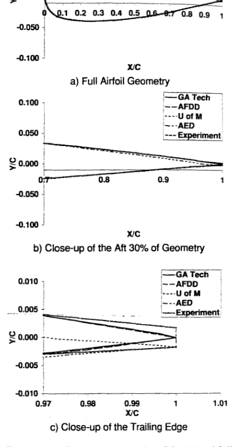

Table 2 provides the details of the grids utilized by the group. All grids used structured C-grid topologies, with the exception of the AED unstructured grid. Some participants chose to run a grid that they believed would be comparable to a typical industry grid, while others chose to run a finer grid more appropriate to capturing detailed physics of the flow field.

Table 2. Grid Details

| Group | Grid Typea | Grid Sizeb | Surface Points | Normal Offset (chords) |
| --- | --- | --- | --- | --- |
| AFDD | S | 297x81 | 225 | 2x10^-6 |
| AED | U | 29,000 | 314 | 1x10^-5 |
| GIT 1 | S | 257x129 | 193 | 1x10^-5 |
| GIT 2 | S | 600x150 | 400 | 1x10^-6 |
| U of M | S | 217x91 | 145 | 5x10^-5 |

a `S = Structured, U = Unstructured`  
b streamwise x normal nodes except for unstructured grids where the total number of nodes is given.

## Test Configuration and Conditions

The data set for this project was set to include the range of angles-of-attack and Mach numbers found in Table 3. This data set included points that extended into the stall and transonic regions of interest. CFD calculations were performed at even values of angle of attack for the Mach ranges in Table 3. Different investigators scaled Reynolds number differently. A Reynolds number per foot or chord scaled by the local station Mach number was utilized by most, though University of Maryland utilized a constant 6.5 million Reynolds number. All of the runs were fully turbulent, with the exception of the MSES runs that included free transition up to a maximum of 10% chord.

Table 3. Data Range

| Mach Number | Angle of Attack Range |
| --- | --- |
| 0.3 | -10° to 22° |
| 0.4 | -10° to 22° |
| 0.5 | -8° to 20° |
| 0.6 | -8° to 16° |
| 0.7 | -6° to 12° |
| 0.8 | -6° to 10° |
| 0.9 | -4° to 8° |
| 1.0 | -4° to 6° |

Of these Mach and angle of attack ranges, all points were run by the participants with the following exceptions:

1. GIT 1 did not run cases above Mach 0.8, and angles of attack at other Mach numbers were not completely filled out for the range of interest.
2. U of M did not run the 18 and 20-degree cases at Mach 0.5.

## Experimental Data Correlation

The experimental data in this study were extracted from a comprehensive NASA report by Bill Bousman [11]. In this report, ten wind tunnel tests were evaluated and compared to determine fundamental aerodynamic performance parameters of the SC1095 and SC1094 R8 airfoils. For the current study, the data pertaining to the SC1095 airfoil were utilized. The ten wind tunnel tests that were evaluated in the Bousman report are listed in Table 4, along with a reference report date.

Table 4. Correlation Wind Tunnel Tests (Extracted from Ref. 11)

| Test | Wind Tunnel | Report Date |
| --- | --- | --- |
| Exp. 1 | UTRC Large Subsonic | 10/73 |
| Exp. 2 | UTRC Large Subsonic | 12/75 |
| Exp. 3 | OSU 6- by 22-in. Transonic | 11/85 |
| Exp. 4 | NRC 12- by 12-in. Icing | 1985 |
| Exp. 5 | NSRDC 7- by 12-ft. Transonic | 4/77 |
| Exp. 6 | Langley 6- by 28-in. Transonic | 9/80 |
| Exp. 7 | Ames 2- by 2-ft. Transonic | 8/85 |
| Exp. 8 | Ames 11 ft. Transonic | 4/82 |
| Exp. 9 | Ames 7- by 10-ft. Subsonic | 7/82 |
| Exp. 10 | Umd 8- by 11-ft. Subsonic | 9-10/98 |

Bousman utilized the procedures developed by McCroskey [12] who analyzed and filtered NACA 0012 airfoil performance characteristics from a similar series of wind tunnel tests. Totah [13] has also done a similar analysis of the SC1095 airfoil; however, Bousman's efforts extend Totah's results by examining pitching moments and including the results of Experiment 10 from Table 4. Because the group of test data included only ten separate tests rather than the forty NACA 0012 tests utilized by McCroskey, the separation into groups that define the overall quality of the data was not possible. Instead, Bousman provides an assessment of the accuracy of each data set with respect to the type of data analysis (e.g., correlated well for lift curve slope, but poorly in zero-lift pitching moment). Based on Bousman's assessments, different groups of experimental data provided upper and lower limits of correlation for individual performance parameter evaluation in this effort.

## Results

The aerodynamic and performance characteristics of the SC1095 airfoil are presented with reference to the experimental results tabulated by Bousman in Ref. 11. In addition, the data were correlated, where possible, with MSES to determine when more efficient methods other than Navier-Stokes are possible.

### Sectional Lift Coefficient

Lift correlations were performed on the variation of lift with respect to angle of attack. For all of the Mach numbers examined, there was excellent correlation between the CFD results, an existing UH-60A look-up table, and the MSES simulations for angles of attack prior to stall. Examples of the numerical lift correlations with the look-up table are shown for a subsonic and transonic case in Figure 2. The correlation of the linear portion of the curves for all of the methods appears to be very close to one another, excepting the prediction of the negative stall in Figure 2a. Only U of M predicted the negative stall location, as shown by the look-up table. Further analysis found that the early separation was an error in the look-up table. Additional investigation by U of M showed that the early separation predicted by their CFD code was due to the coarseness of the grid. When they refined the grid, the early separation was not predicted. As a check, Cobalt predictions using a similarly coarse grid were also conducted. These results also indicated this early separation. These results point out the need for grid refinement studies in order to have confidence in any particular CFD analysis.

Figure 2. Comparison of the numerically predicted and experimental lift coefficient of the SC1095 airfoil. Look-up table results are from Ref. 3, MSES results are from Ref. 10.

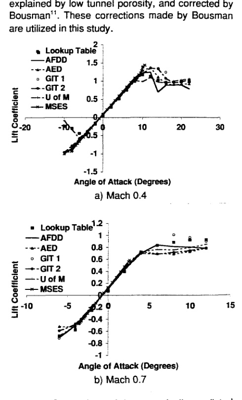

A more rigorous indication of current CFD capabilities can be seen via further comparison of the sectional lift characteristics in the linear range. The lift curve slope multiplied by the Prandtl-Glauert subsonic correction is weakly dependent on Reynolds number for values above about 1 million and independent of subcritical Mach number. Correlations of experimental data by McCroskey [12] and Bousman [11] have shown the corrected lift curve slope to be a good indication, in part, for repeatable data. McCroskey proposed an equation for this relationship for the NACA 0012 airfoil:

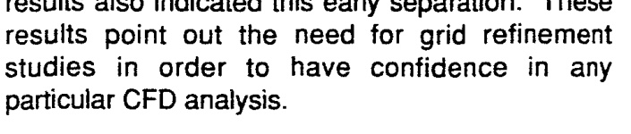

with an error band of +/- 0.004 for Group 2 correlation. Bousman reported that five experiments fell within this band (Exp. 2, 3, 5, 6, and 10). Several other experiments fell below this band, and the lower lift curve slopes were explained by low tunnel porosity, and corrected by Bousman [11]. These corrections made by Bousman are utilized in this study.

Figure 3. Comparison of lift curve slope multiplied by Prandtl-Glauert compressibility correction to Log(Re).

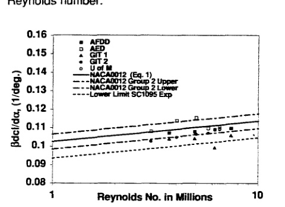

Figure 3 compares the experimental bands with the CFD simulations. Different Reynolds numbers were utilized in the simulation: Re/chord scaled by Mach number (`Re/chord = M x 12.5 x 10^6`), Re/ft scaled by Mach number (`Re/ft = M x 12.5 x 10^6 / 1.67`), and a constant Re. Note that the Re/ft and Re/chord were not identical because the chord was assumed by some of the authors to be 1 ft rather than 1.67 ft in the full-scale rotor. With the exception of the AED simulations, all of the CFD-predicted lift curve slopes fall below McCroskey's equation (Eq. 1) from Ref. 12. The scatter seen by Bousman [11] in the experimental data is approximately the same as that seen in the CFD simulations. For a constant Reynolds number, the scatter using the same code and grid is approximately 0.003, as demonstrated by the U of M results at 6.5 million Reynolds number.

Figure 4. Comparison of lift curve slope with Mach number.

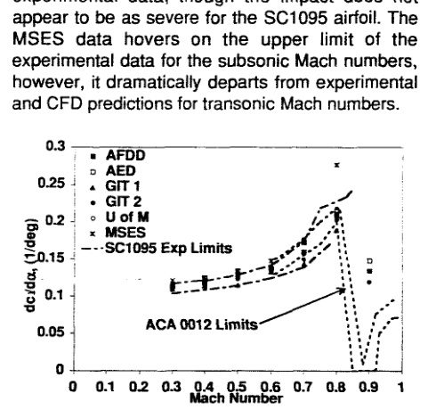

The suggestion that the SC1095 lift curve slope grouping be shifted lower than that of the NACA 0012 airfoil is given credence by the comparison of the lift curve slope with Mach number, as shown in Figure 4. The same experimental data used in the Reynolds number versus corrected lift curve slope evaluation is utilized here. SC1095 experimental data is available to approximately 0.7 Mach number, but above Mach 0.7, the NACA 0012 experimental limits per Ref. 12 were utilized. All of the CFD data falls on or within the “Group 2” SC1095 experimental limits. As with the experimental data, the CFD predictions tend to spread out as the transonic Mach regime is reached. McCroskey's estimate of the limits for the “better” NACA 0012 airfoil tests are shown to provide the trends expected during the transonic regime as there was no data available from the SC1095 experimental data. The same large decrease in the lift curve slope is seen for the SC1095 CFD results as the NACA 0012 experimental data, though the impact does not appear to be as severe for the SC1095 airfoil. The MSES data hovers on the upper limit of the experimental data for the subsonic Mach numbers; however, it dramatically departs from experimental and CFD predictions for transonic Mach numbers.

Figure 5. Comparison of zero lift angle of attack with Mach number.

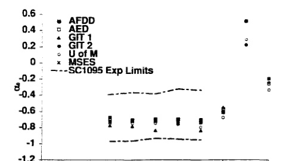

The zero lift angles of attack are compared in Figure 5 with the SC1095 data. The zero lift angle of attack was computed using the same linear equation used to evaluate the lift curve slope. The zero lift angle of attack for the SC1095 experimental data showed a large spread from about -0.4 to -1 degree. This large spread was attributed by Bousman [11] to be largely due to rigging errors in the tunnels. The zero lift angles of attack predicted by the CFD codes do not have these problems and they fall within 0.2° of one another for the subsonic range. Both the experimental and CFD results indicate an insensitivity with Mach number for subcritical and low transonic Mach numbers, as expected. As transonic flow becomes stronger (Mach 0.8 and 0.9), there is a shift of the zero lift angle of attack to more positive angles of attack as the shock travels over the latter half of the chord. It returns to its negative value at Mach 1.0.

The maximum lift coefficient is another parameter of interest that can be correlated. For Mach numbers at or below a Mach number of 0.55, the experimental maximum lift coefficient was determined by a second-order polynomial fit of the data in the region of the maximum lift. For Mach numbers above 0.55, the break was not clearly defined. For those Mach numbers, the visual break point or the maximum lift (if there was no obvious break point) was used as `clmax`. Scatter from Experiments 4 and 7 was excessive and these datasets were excluded from the limits determination shown here. Similar methods of analysis were used for the CFD data. For these data, the second-order polynomial curve fit method worked to a Mach number of 0.7. For Mach numbers 0.8, 0.9 and 1.0, there was no obvious break point. Because estimation of both the CFD and experimental data `clmax` are arbitrary above 0.7, these data are not evaluated.

Figure 6. Comparison of maximum lift coefficient with Mach number.

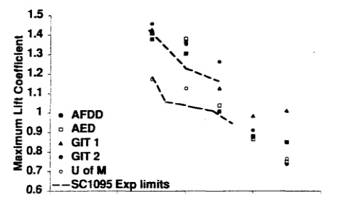

The comparison of the maximum lift coefficient with the change in Mach number is shown in Figure 6. The overall scatter is large, with varying CFD codes correlating better with one another and experimental data at different Mach numbers. Correlation within experimental limits occurs for two of the three Mach numbers available. The overall trend in maximum lift reduction with Mach number is observed. As the experimental data encountered a similar scattering problem the average and standard deviation for the maximum lift coefficient was computed for Mach 0.4. The mean was 1.19 with a standard deviation of 0.07. The numerical simulations had a mean of 1.355 with a standard deviation of 0.10.

Figure 7. Comparison of angle of attack for the maximum lift coefficient with Mach number.

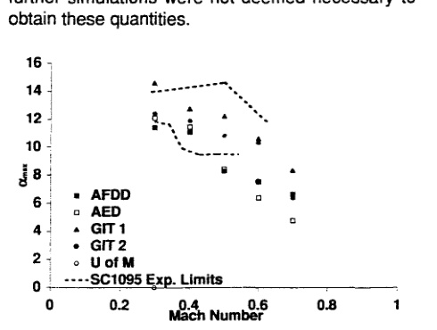

The angle of attack location of the maximum lift coefficient is also an important indicator of stall characteristic predictions. As with the experimental data, the scatter shown in Figure 7 is up to 5 to 6 degrees. An evaluation was undertaken with one of the CFD methods to determine the impact of making simulations at every two degrees angle of attack, as compared with more frequent simulations. Curve fits of the more frequent data (per degree, per 0.5 degree), indicated that the maximum lift coefficient was within +/- 0.02 and the angle of maximum lift was within +/- 0.2 degree. Thus, further simulations were not deemed necessary to obtain these quantities.

### Sectional Moment Coefficient

The section pitching moment of airfoils is particularly important for helicopter applications as it contributes to vibratory loads over each rotor revolution. Comparisons of the CFD results are shown in Figure 8 for Mach 0.4 and Mach 0.7. For the linear range, all of the simulations appear to have similar results, but as stall is reached, the differences of the maximum pitching moment and the break location vary significantly, in particular for the transonic Mach number.

Figure 8. Comparison of the numerically predicted and experimental moment coefficient of the SC1095 airfoil. Look-up table results are from Ref. 3, MSES results are from Ref. 10.

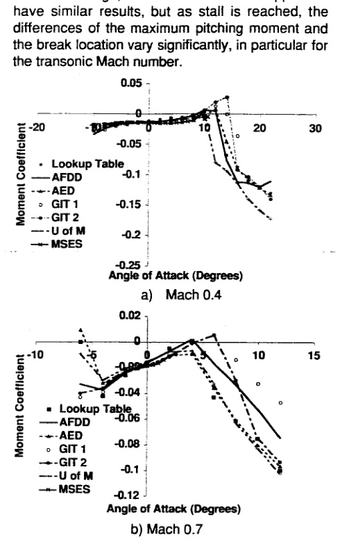

Further analysis of the data yields some insight into the differences and the correlation with their experimental counterparts. The pitching moment at zero lift is shown in Figure 9. The experimental data, which includes all the tests, show large scatter of 0.02 in moment coefficient. The CFD simulations show tighter correlation, as seen in Figure 9. The scatter is an order of magnitude smaller - about 0.002. All of the CFD data follows the lower limit of the experimental data throughout the subsonic Mach numbers, corresponding with Exp. 1. These data were determined by interpolating between the two angle of attack values that bracket the zero lift. As the Mach number increases into the transonic range, trends similar to the zero-lift angle in Figure 5 are apparent. The scatter also expands corresponding to the data from Figure 8b.

Figure 9. Comparison of zero-lift pitching moment with Mach number.

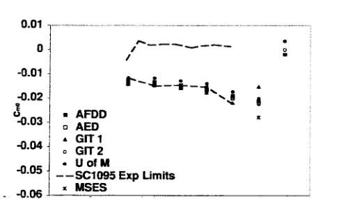

The change of the pitching moment with angle of attack provides an indication of the change in the aerodynamic center. In Figure 10, the slope is close to zero, indicating an aerodynamic center near the quarter chord for subsonic Mach numbers. As the Mach number increases into the transonic Mach regime, the pitching moment breaks and goes negative, indicating that the aerodynamic center moves aft. The pitching moment break occurs between Mach 0.7 and 0.8, as also indicated by the experimental data. In Figure 10, all of the experimental data contributes to the limits, but it should be noted that most of the data is between -0.02 and -0.03 at Mach 0.9, as is the CFD data.

Figure 10. Comparison of pitching moment-alpha slope with Mach number.

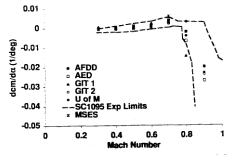

### Sectional Drag Coefficient

The section drag coefficients, along with the lift and pitching moment coefficients, show excellent correlation between the CFD results and the original look-up table for the linear portion of the angle of attack sweep. For higher angles of attack, especially for the transonic Mach numbers, the CFD data begins to deviate from the original look-up data.

Figure 11. Comparison of the numerically predicted and experimental drag coefficient of the SC1095 airfoil. Look-up results are from Ref. 3, MSES results are from Ref. 10.

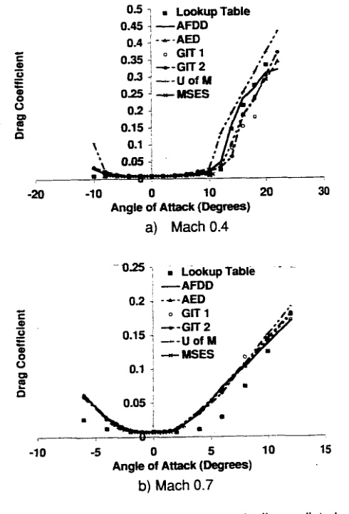

McCroskey has utilized the zero-lift drag coefficient as the second test for the accuracy of the NACA 0012 wind tunnel tests. As with the lift curve slope, the data is dependent on Reynolds number until higher Mach numbers (Mach 0.7) are reached. There is a significant difference in the zero-lift drag coefficient for tripped and untripped boundary layers. The tripped drag values are higher than untripped values. For the SC1095 experiments, only Exp. 3 included tripped data; the remainder were untripped. In addition, the NACA 0012 zero-lift drag is different than that of the SC1095, so that the values should not be used, but the Group 2 bounds denoted by McCroskey can still prove useful. Figure 12 shows the CFD results compared with the experimental zero-lift SC1095 data fitted with the function (Eq. 17 from Ref. 11) and given the Group 2 bounds of +/- 0.001 set by McCroskey in Ref. 12. Equation (2) was developed similarly to the method McCroskey utilized for the NACA 0012 data.

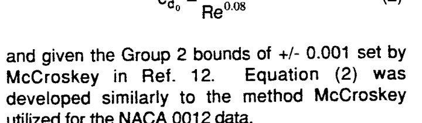

The experimental data fit fairly well within these limits, in particular for the higher Reynolds numbers. The CFD data all tend to be slightly high with respect to the Group 2 bounds; GIT 1 is the only data that is out of the bounds for the entire Reynolds number range. Only as the Mach number approaches 0.6 and 0.7 do the effects of compressibility become distinctive. These results tend to confirm that the CFD data is acceptable within McCroskey's experimental guidelines.

Figure 12. Comparison of the numerically predicted zero-lift drag coefficient of the SC1095 airfoil with Log(Re).

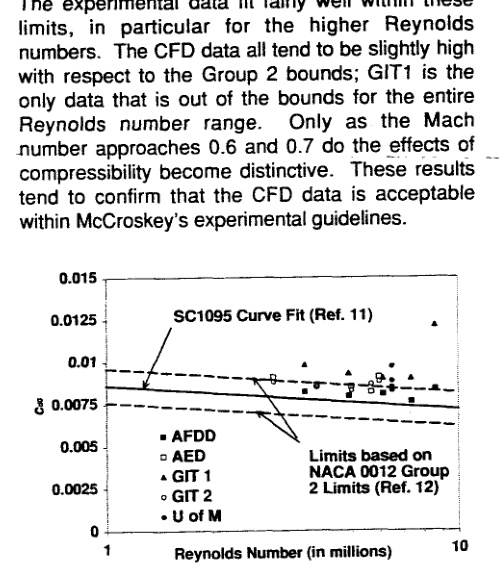

The zero-lift drag can also be examined with respect to the Mach number. Figure 13 depicts the experimental data (except Exp. 4) compared with the CFD results. For the lower Mach numbers all of the CFD predictions are in good agreement with experimental limits. As the transonic effects come into play between Mach 0.7 and 0.8, the predictions begin to show scatter and at Mach 0.9, the CFD values are slightly above the experimental values. Similar results are obtained for the minimum drag coefficient, but as both the experimental and numerical results are so close to the zero-lift drag values, they will not be presented here.

Figure 13. Comparison of the numerically predicted zero-lift drag coefficient of the SC1095 airfoil with Mach number.

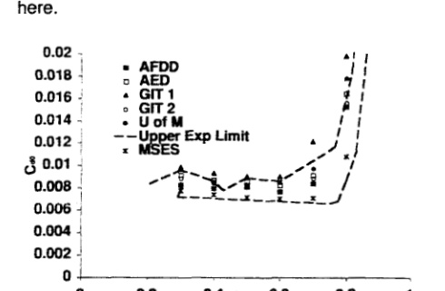

Another key performance parameter of interest is the drag divergence Mach number. The drag divergence Mach number is determined where the slope of the zero-lift drag coefficient reaches 0.01 or the change in drag is 0.002 (20 counts) above its incompressible value. These two methods were used to determine the CFD drag divergence Mach values shown in Table 5. As expected from Figure 13, the drag divergence Mach values are somewhat lower than those computed from experimental data. To minimize correlation errors, the drag divergence Mach numbers were recomputed for the experimental data by both methods and appear to be slightly lower than the prior computed values. Bousman applied the slope method to obtain his values, while the method(s) used for the originally published data are not known. Improvements in the CFD value may be obtained by further simulations near the drag rise Mach region.

Table 5. SC1095 Drag Divergence Mach Number

| Source | Mdd | Std Dev |
| --- | --- | --- |
| Bousman (Ref. 11) | 0.809 | 0.011 |
| Exp. Computed Here | 0.814 | 0.022 |
| Orig. Publishedb | 0.799 | 0.019 |
| AFDD | 0.77 | |
| AED | 0.762 | |
| GIT 1a | 0.68 | |
| GIT 2 | 0.77 | |
| U of M | 0.752 | |
| MSESb | 0.765 | |
| CFD Meanc | 0.764 | 0.008 |

a Not enough points to perform slope method.  
b Method to obtain these was not listed in Ref. 11.  
c Mean and standard deviation does not include GIT 1 or MSES data.

### Lift-to-Drag Ratio

Finally, the maximum lift to drag provides a combinatory measure of the performance of the airfoil. The maximum L/D was determined by plotting the L/D and fitting a 2nd-order polynomial about the maximum location, similar to the method utilized for the maximum lift coefficient computations. As expected from the prior results, the L/D for the computed values is typically below the experimental values, as seen in Figure 14. This is due to the larger drag predictions by the CFD codes, which is potentially due to fully turbulent assumptions. This is supported by the fact that MSES results that take boundary layer transition into account, therefore developing some laminar flow, show reduced drag (Figure 13) and therefore higher L/D values compared with the other analyses. Additionally, the modified S-A model in OVERFLOW is known [14] to generate larger regions of laminar flow, even in a fully turbulent simulation, and its L/D values are generally higher than the other S-A results using the standard model. Recall that most of the test data is untripped. Fully turbulent CFD methods can significantly under predict the L/D experimental value.

Figure 14. Comparison of the numerically predicted maximum L/D of the SC1095 airfoil.

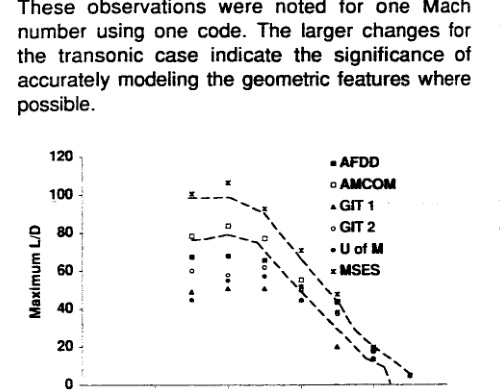

## Influence of Geometry

The different CFD codes utilized different geometries based on the need of some computational methods to have a closed or zero-thickness trailing edge. FUN2D was run for both an open and closed trailing edge to evaluate this difference. Two cases (subsonic and transonic) were run using the same grid size on the different trailing edges. The results of the comparative study shows that the closed trailing edge does not tend to significantly affect the aerodynamic predictions (1-3% change) for the subcritical linear region, when compared with the finite trailing edge. Differences are exacerbated when the transonic region is encountered. Specific changes which were noted for the trailing edge differences were that the closed trailing edge tended to:

1. have a higher lift curve slope;
2. have a more negative zero lift angle of attack;
3. reach a maximum lift coefficient sooner;
4. have a higher maximum lift coefficient at the transonic Mach number;
5. have a lower minimum drag coefficient at the transonic Mach number, but a smaller drag bucket;
6. shift the minimum drag coefficient to a lower angle of attack for the transonic Mach number;
7. have a higher shift in moment for an angle of attack change.

These observations were noted for one Mach number using one code. The larger changes for the transonic case indicate the significance of accurately modeling the geometric features where possible.

## Influence of Grid and Turbulence Models

A study using the Cobalt and FUN2D codes was undertaken to evaluate the impact of refining the grid and also the impact of the selection of the turbulence model. For the original study, most of the participants chose the Spalart-Allmaras turbulence model due to its current popularity in CFD simulations.

Cobalt simulations were re-evaluated using a coarser grid (500x100, `Delta n = 1x10^-5`) and compared with the finer grid results. Here, there was a substantial change in many parameters such that the coarser grid results were no longer within the experimental bounds as the original fine grid results had been. This also indicates the need for a grid refinement study before attempting simulations.

The same refined grid was utilized in both the FUN2D and Cobalt codes for the turbulence model evaluations. The new results from the fine grid were compared with the original FUN2D grid results. Minimal change (no visual change) was found when comparing the Spalart-Allmaras and k-omega turbulence model results from FUN2D results using the fine grid. Small changes (visual) could be seen between the original and the refined grid in FUN2D; however, the changes were small enough (+/- 1 to 2%) for the performance parameters that the additional computational time required for the refined grid was deemed not appropriate.

Three turbulence models were also compared using Cobalt for the finer grid: Spalart-Allmaras (SA), Menter SST (SST), and k-omega (k-w). The Mach range 0.3 to 0.9 was evaluated. Because of the lack of space, these conclusions are summarized using average percentage differences between the simulations rather than repeating the entire suite of figures shown prior to this section. These differences are summarized here:

1. Lift curve slope - minimal (<1%) change except at Mach 0.8 where there was a 5% spread (k-w high, SST low).
2. Zero lift angle of attack - 1-2% difference.
3. Maximum lift coefficient - 5-7% difference. SA tends be the best overall when compared with the SC1095 experimental limits.
4. Angle of attack at maximum lift shows significant differences at Mach 0.6 and 0.7; Spalart-Allmaras and k-w tend to be more consistent.
5. Zero-lift moment coefficient - minimal change.
6. Change in moment with angle of attack - minimal changes below Mach 0.7; 40-70% differences above Mach 0.7; all remain within experimental limit band; SA and SST are more consistent.
7. Zero-lift drag - minimal change.
8. Maximum L/D - SA has highest values with an average 6-8% difference between the models.

Overall there is little difference in turbulence models in the linear angle of attack range. Stall and transonic conditions do cause discrepancies.

## CFD-Based Look-up Tables

The average of all of the aerodynamic characteristics predicted by the researchers was used to replace the SC1095 and SC1094 R8 data in a look-up table for the UH-60A helicopter. A high-speed flight case (`mu = 0.368`) was then run using CAMRAD II [15], a comprehensive rotor code, trimming to the measured thrust and shaft roll and pitching moments. The results obtained using this table were compared with a run made previously with a typical look-up table derived using one of the experimental tests, empirical and theoretical data (Current C81 Deck), and a look-up table made by extracting the most reliable results of the 10 SC1095 wind tunnel tests and 5 wind tunnel tests for the SC1094 R8 airfoil discussed in Ref. 11. For this run, there was no discernable difference in the normal force (Figure 15), and only minimal differences for the pitching moment (Figure 16) at the tip between the typical look-up table and the CFD look-up table. The test-based airfoil table gave slightly different results; however, these results do not significantly change the results of the comprehensive analysis when compared to the UH-60A flight test data.

Figure 15. Normal Force Comparisons for the UH-60A rotor at an advance ratio of mu=0.368 using CAMRAD II. (Courtesy of Dr. Hyeonsoo Yeo)

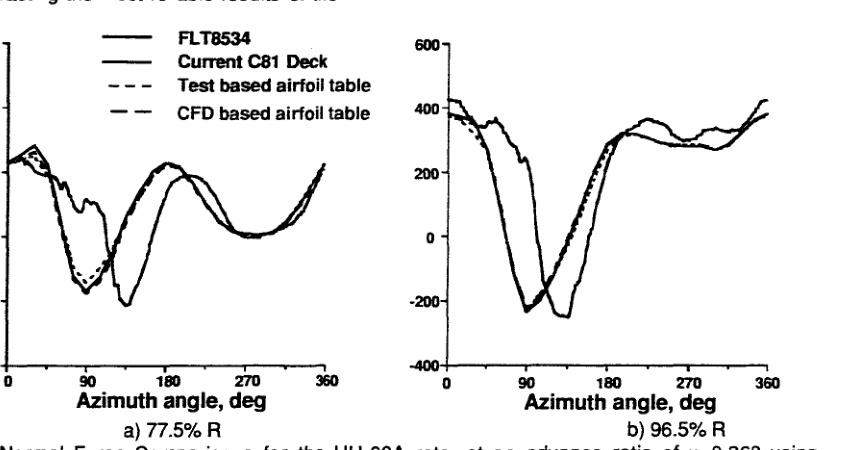

Figure 16. Pitching Moment Comparisons for the UH-60A rotor at an advance ratio of mu=0.368 using CAMRAD II. (Courtesy of Dr. Hyeonsoo Yeo)

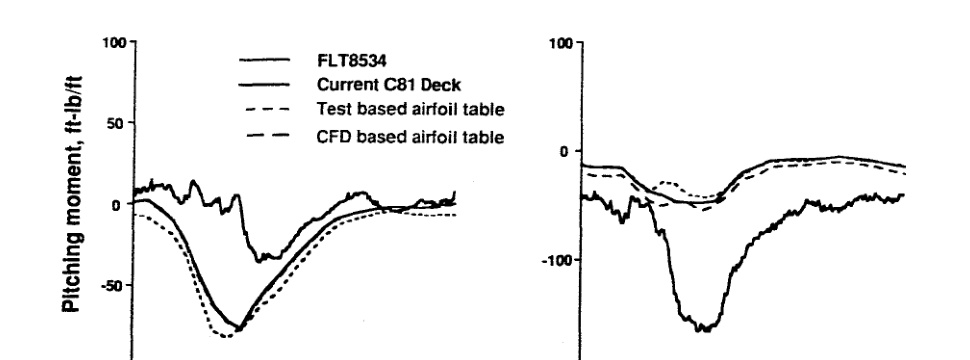

## Conclusions

Five different researchers independently computed CFD simulations of the SC1095 airfoil. The researchers utilized codes that they are familiar with and a typical grid. Extensive comparisons between the methods were made, as well as correlation of aerodynamic performance characteristics with experimental data. In addition, comparisons with the MSES code were made to determine the efficacy of utilizing less expensive analyses for the linear aerodynamics regime at reduced cost.

Comparisons of lift, moment and drag aerodynamic performance data yield the following specific conclusions:

1. All of the CFD simulations meet the experimental “Group 2” criteria set forth by McCroskey [12] for the NACA 0012 airfoil and Bousman [11] for the SC1095 airfoil, with the exception of the CFD simulations that use the Baldwin-Lomax model.
2. While there are occasional exceptions (e.g., `clmax` and L/D), the CFD data fall within the range of SC1095 experimental data for subcritical Mach numbers. An exception to this is the L/D comparison, which due to the combination of CFD drag predictions near the higher limits and CFD lift predictions near the lower limits of experiment, fall 50 to 100% below experimental values at lower Mach numbers.
3. For airfoils at moderate Reynolds numbers with laminar flow, accurate drag and L/D prediction requires modeling of boundary layer transition.
4. Grids can be an issue if the numbers of grid points on the surface are low and the first points normal to the surface are not within the recommended y+ values for a specific code and turbulence model. Until confidence in a code and experience with grid density effects is obtained, grid refinement studies are warranted.
5. One- and two-equation turbulence models (Spalart-Allmaras, Menter SST, k-omega), behave similarly on a fine grid in the region of linear aerodynamics. There is some difference in transonic and post-stall regions, but the different data tend to fall within the experimental scatter. The Baldwin-Lomax turbulence model performed poorly in these comparisons and is not recommended.
6. The more efficient aerodynamic method MSES (Euler coupled with boundary layer) performed well at subcritical Mach numbers (Mach 0.6 and lower) for the linear angle of attack range. It is recommended for these regions to reduce the simulation costs.

Given these comparisons, and based on a single comparison using a comprehensive rotor code using tabulated predicted airfoil characteristics, CFD appears to be a viable alternative to extensive wind tunnel testing to generate two-dimensional look-up tables for use in comprehensive helicopter codes provided that an adequate grid and turbulence model are utilized.

## Acknowledgements

The first, fourth and fifth authors gratefully acknowledge the support provided by the National Rotorcraft Technology Centers at the Georgia Institute of Technology and the University of Maryland. Dr. Yung Yu is the technical monitor of these centers. The second author would like to acknowledge the computer resources provided by the Department of Defense, Air Force Aeronautical System Center and Army Engineer Research and Development Center of the Major Shared Resources Center.

The authors would also like to acknowledge the following people who have helped make this work possible: William G. Bousman from AFDD who provided feedback and guidance on the use of the experimental data; Eddie Mayda from the University of California-Davis who provided MSES results for comparison; Professor Lakshmi Sankar from Georgia Tech who provided guidance in obtaining the CFL3D results; Dr. Hyeonsoo Yeo of Raytheon ITSS who ran and compared the CFD look-up table for a UH-60A test case using CAMRAD II; and the participants of the NRTC/RITA Airloads Workshop series.

There are many students who contributed to this effort: Jennifer Abras, a graduate research assistant at Georgia Tech; Diane Barney, a SHARP research assistant at Georgia Tech in the summer of 2003, now a high school senior in New York; Karthikeyan Duraisamy, a graduate research assistant at University of Maryland; Mela Johnson, a SURE research assistant at Georgia Tech in the summer of 2003, now an undergraduate at University of Maryland, Baltimore; and Jayanarayanan Sitaraman, a graduate research assistant at University of Maryland.

## References

1. Bousman, W. G., and Kufeld, R. M., Balough, D., Cross, J. L., Studebaker, K. F., Jennison, C. D., “Flight Testing the UH-60A Airloads Aircraft,” 50th Annual Forum of the American Helicopter Society, Washington, D.C., May, 1994.
2. Potsdam, M., Yeo, H., and Johnson, W., “Rotor Airloads Prediction using Loose Aerodynamic/Structural Coupling,” 60th Annual Forum of the American Helicopter Society, Baltimore, MD, June 2004.
3. Sitaraman, J., Baeder, J. D., and Chopra, I., “Validation of UH-60A Rotor Blade Aerodynamic Characteristics using CFD,” 59th Annual Forum of the American Helicopter Society, Phoenix, AZ, May, 2003.
4. Yeo, H., “Calculation of Rotor Performance and Loads Under Stalled Conditions,” 59th Annual Forum of the American Helicopter Society, Phoenix, AZ, May, 2003.
5. Buning, P. G., Jespersen, D. C., Pulliam, T. H., Chan, W., M., Slotnick, J. P., Krist, S. E., and Renze, K. J., “OVERFLOW User's Manual, Version 1.8s,” NASA Langley Research Center, 1998.
6. Anderson, W. K., and Bonhaus, D. L., “An Implicit Upwind Algorithm for Computing Turbulent Flows on Unstructured Grids,” Computers and Fluids, Vol. 23, No. 1, 1994, pp. 1-21.
7. Rumsey, C., Biedron, R., and Thomas, J., “CFL3D: Its History and Some Recent Applications,” NASA TM-112861, May 1997; presented at the Godunov's Method for Gas Dynamics Symposium, Ann Arbor, MI, May 1-2, 1997.
8. Strang, W. Z., Tornaro, R. F., and Grismer, M. J., “The Defining Methods of Cobalt60: a Parallel, Implicit, Unstructured Euler/Navier-Stokes Flow Solver,” AIAA 99-0786, 1999. See also http://www.cobaltcfd.com.
9. Srinivasan, G. R., and Baeder, J. D., “TURNS: A Free Wake Euler/Navier-Stokes Numerical Method for Helicopter Rotors,” AIAA Journal, Vol. 31, No. 5, May 1993.
10. Mayda, E. A., “A CFD-based Methodology to Automate the Generation of C81 Airfoil Performance Tables,” M.S. Thesis, University of California, Davis, December 2003.
11. Bousman, William G., “Aerodynamic Characteristics of SC1095 and SC1094 R8 Airfoils,” NASA TP-212265, September 2003.
12. McCroskey, W. J., “A Critical Assessment of Wind Tunnel Results for the NACA 0012 Airfoil,” AGARD Fluid Dynamics Panel Symposium on “Aerodynamic Data Accuracy and Quality; Requirements and Capabilities in Wind Tunnel Testing,” Naples, Italy, September 28-October 2, 1987; also NASA TM 100019, USAAVSCOM TR 870A05, October 1987.
13. Totah, Joseph, “A Critical Assessment of UH-60 Main Rotor Blade Airfoil Data,” 11th AIAA Applied Aerodynamics Conference, Monterey, CA, August 9-11, 1993.
14. Lee-Rausch, E. M., Buning, P. G., Mavriplis, D., Morrison, J. H., Park, M. A., Rivers, S. M., and Rumsey, C. L., “CFD Sensitivity Analysis of a Drag Prediction Workshop Wing/Body Transport Configuration,” AIAA Paper 2003-3400, 21st AIAA Applied Aerodynamics Conference, Orlando, FL, June 2003.
15. Johnson, W., “Rotorcraft Aerodynamic Models for a Comprehensive Analysis,” American Helicopter Society 54th Annual Forum, Washington, D.C., May 1998.
