# Airfoil Design Framework for Optimized Boundary-Layer Integral Parameters

Armando R. Collazo Garcia, III∗
The Boeing Company, Saint Louis, Missouri 63134
and
Phillip J. Ansell†
University of Illinois Urbana-Champaign, Urbana, Illinois 61801
https://doi.org/10.2514/1.C037713

## Abstract

An airfoil design framework is introduced in which boundary-layer integral parameters serve as the driving design
mechanism. The method consists of generating a parameterized pressure distribution capable of producing the
desired boundary-layer characteristics for inverse design use. Additionally, by deduction from the Squire–Young
theory, the method allows for the determination of the pressure distribution that results in the minimum theoretical
drag. To assess this design framework, several airfoils were developed based on the mission requirements of the RQ-
4B Global Hawk aircraft. Numerical results obtained using a viscous-inviscid solver of the integral boundary
layer and Euler equations showed that the optimized airfoils achieved profile drag reductions of 9.06 and 6.00%,
respectively, for α  0° and L∕Dmax designpoints.A validationexperimental campaignwas also performedusing the
optimized CA5427-72 airfoil. The acquired data produced the expected pressure distribution characteristics and
aerodynamic performance improvements, typifying the efficacy of the design framework.

## Nomenclature

CD
=
dissipation coefficient
Cd
=
profile drag coefficient
Cf;x
=
skin friction coefficient
Cl
=
lift coefficient
Clmax
=
maximum lift coefficient
Cm
=
pitching moment coefficient about aerodynamic
center
Cp
=
pressure coefficient
CpTE
=
pressure coefficient at trailing edge
Cτ
=
shear stress coefficient
CτEQ
=
equivalent shear stress coefficient
c
=
airfoil chord
H
=
shape factor
Hk
=
kinematic shape parameter
H
=
kinetic energy shape parameter
H
=
density shape parameter
L∕D
=
lift-to-drag ratio
L∕Dmax
=
maximum lift-to-drag ratio
l, m
=
empirical formulas
M
=
Mach number
Mcrit
=
critical Mach number
Me
=
boundary-layer edge Mach number
M∞
=
freestream Mach number
n
=
amplification factor
ncrit
=
critical amplification factor
Re
=
Reynolds number
Reθ
=
momentum thickness Reynolds number
t∕cmax
=
maximum thickness-to-chord ratio
ue
=
boundary-layer edge velocity
u∞
=
freestream velocity
x
=
streamwise coordinate
x0
=
Stratford and pressure recovery onset location
x1
=
minimum pressure location
x2
=
transition location
α
=
angle of attack
δ
=
boundary-layer thickness
δ
=
boundary-layer displacement thickness
δ
TE
=
boundary-layer displacement thickness at trailing
edge
θ
=
boundary-layer momentum thickness
θTE
=
boundary-layer momentum thickness at trailing edge
ξ
=
shear layer coordinates
# I. Introduction
A
IRFOIL design has been of interest since the early days of
aviation, when flight pioneers sought inspiration from birds,
recognizing the importance of their wing sections for sustaining flight.
Since then, the field has matured in such a way that standard methods
are in place for the design and analysis of airfoil sections used on
aerodynamic vehicles and other applications. Airfoil sections are
simply characterized by their lift, drag, and pitching moment perfor-
mance, which is highly dependent on physical design properties
(e.g., thickness, pressure distribution, and surface orientation) as well
as on their operating conditions (e.g., Mach and Reynolds numbers).
For this reason, new airfoil design methods and approaches are still of
great interest, as they can be utilized to enhance the aerodynamic
efficiency for specific applications and operating regimes.
Inverse design is a common method used for the generation of
airfoil sections. Through this approach, the designer specifies general
aerodynamic characteristics a priori to obtain the corresponding air-
foil geometry that satisfies such constraints. One of the first design
methods that showed great success was that developed by Lighthill
[1] using conformal mapping, which only required a velocity distri-
bution to be defined. Lighthill went on to suggest that the benefit of
such a design tool would be to control boundary-layer properties by
imposing conditions on the velocity distributions through classical
potential theory. Perhaps the most canonical example of conformal
mapping used for the generation of airfoils is the Joukowski trans-
form. In this approach, Joukowski began with the potential flow
solution past a cylinder and conformally mapped the circular shape
onto a flat plate using the complex plane, resulting in an airfoil
geometry [2]. Other single-point inverse design methods still func-
tion under the same basic principle of mathematically generating a
geometry based on potential pressure or velocity constraints.
Received12 September2023;revisionreceived3 March2024;accepted for
publication 9 March 2024; published online 16 April 2024. Copyright © 2024
by the American Institute of Aeronautics and Astronautics, Inc. All rights
reserved. All requests for copying and permission to reprint should be sub-
mitted to CCC at www.copyright.com; employ the eISSN 1533-3868 to
initiate your request. See also AIAA Rights and Permissions www.aiaa.org/
randp.
*Aerodynamics Engineer, Phantom Works. Member AIAA.
†Associate Professor, Department of Aerospace Engineering. Associate
Fellow AIAA.
1412

Another common approach used in airfoil design is the multipoint
methodology, which aims to satisfy multiple operating requirements
at different angles of attack. This theory, which was first presented by
Eppler [3,4] and later expanded by Selig [5,6], requires the designer
to define a velocity-function or velocity-constant segment along
the airfoil surface at specific angles of attack. Defining the velocity
constraints in this manner allows the multipoint design objectives to
be satisfied simultaneously throughout the airfoil generation process.
While the multipoint theory offers a more direct and inexpensive
airfoil design approach, single-point inverse design methods such as
those initially introduced have still been successfully used to generate
airfoil geometries that also achieve off-design operational constraints
[5]. Furthermore, the single-point inverse design process provides
better direct control of the boundary-layer behavior through the
specification of a desired velocity or pressure distribution [7]. The
greater measure of boundary-layer control offered by this method
is also likely to have the greatest capacity to further enhance the
aerodynamic performance of air vehicles at their most critical oper-
ating condition. It should be noted, however, that performance gains
at a single design point may come at the expense of performance at
other conditions.
A very useful and effective inverse design methodology that has
been used for airfoil design is that introduced by Giles and Drela
[8]. This method consists of the simultaneous solution of multiple
streamtubes that are coupled to the location and pressure values of
the streamline interfaces. This process allows the airfoil shape to
be specified in a direct design mode and, perhaps of most interest, the
pressure distribution in the inverse design mode. In addition, the
method is formulated in a conservative manner, such that airfoil
flows with shocks in the transonic environment are simulated effec-
tively. More specifically, this inverse design tool is coupled with the
viscous-coupled solver of Drela and Giles [9] into the well-known
program MSES, which allows the geometry that produces a desired
pressure distribution to be simultaneously identified through the flow
solution using a global Newton method. The mixed-inverse design
routine also gives the option to include viscous effects through the
coupled integral boundary-layer method featured in MSES. To val-
idate this methodology, a transonic airfoil was designed for operation
at M  0.70 and Cl  1.0 using a seed geometry, and its perfor-
mance was improved at off-design conditions through the specifica-
tion of a pressure distribution that significantly reduced the shock
intensity [8].
Integral boundary-layer methods have traditionally been coupled
to inviscid solutions as a means to provide predictions of the viscous
aerodynamic characteristics of airfoils, as previously described in the
case of MSES, for example. However, different integral boundary-
layer methods have also been successfully used in a more general
airfoil design framework. For instance, the geometry that is obtained
from an inverse design method is expected to produce the velocity or
pressure distribution that was originally prescribed. Such a condition
cantypically be achievedfor an inviscid solution where thevelocity is
governed directly by the airfoil contour. However, some definitions
of pressure distributions can lead to airfoil sections that even though
mathematically correct, are not realistic since they feature intersect-
ing curves, for example. In part, this problem results from blindly
defining pressure distributions without considering the viscosity
effects within the boundary layer close to the airfoil surface that alter
the apparent geometry as would be observed by a potential flow. To
address this challenge, Henderson [10] considered the incorpora-
tion of an inverse boundary-layer technique to the inverse design
process of airfoils. This approach consisted of defining a desired
shape factor and its type of variation along the pressure recovery
region to obtain its corresponding incompressible pressure distri-
bution [10]. Even though the boundary layer, and hence the per-
formance of the airfoil, could be defined to a limited extent, the
objective of this study was not primarily to develop novel airfoil
designs for desired performance. Rather, the primary purpose was
to obtain pressure distributions that ensured realistic sections
would be obtained from the inverse design process by considering
boundary-layer parameters.
It is well known that the performance of an airfoil is highly
dependent on the boundary-layer characteristics produced at a certain
operating condition. Therefore, the primary purpose of this study
is to introduce a new airfoil design framework that considers the
boundary-layer parameters, namely δ, θ, Cfx, and n, to drive the
design of an airfoil. The method being introduced consists of
the generation of a parameterized pressure distribution that is capable
of producing desired boundary-layer characteristics, which is then
used to obtain a corresponding airfoil geometry through an inverse
design routine. First, the design framework is introduced alongside
underlying assumptions and implications. Next, a family of airfoils
that were developed using the proposed design methodology is
presented with the intent of highlighting the advantages associated
with a design framework that incorporates integral boundary-layer
parameters. The mission profile of a high-altitude, long-endurance
(HALE) unmanned vehicle was considered to define target airfoil
design constraints. The MSES theoretical results of the airfoil geom-
etries, for which different target operating conditions and boundary-
layer design constraints were considered, are then discussed in great
detail. Lastly, the experimental results are analyzed for the CA5427-
72 airfoil, which was specifically designed for HALE operating
constraints that could be achieved in an experimental environment
to validate the design method being proposed.
# II. Airfoil Design Methodology
## A. Overview
The design methodology for the current study considers the
boundary-layer performance as the driving mechanism for the airfoil
inverse design process. In particular, the pressure distribution is
configured to achieve a desired parameter condition at the trailing
edge (e.g., θTE and δ
TE) that ultimately dictates the upstream skin-
friction distribution and influences the airfoil drag characteristics and
off-design performance. For instance, the design of laminar flow
airfoils commonly features extensive regions of favorable pressure
gradient (FPG) across most of the upper surface to delay boundary-
layer transition and minimize the skin friction drag component. The
pressure recovery of these airfoils across the adverse pressure gra-
dient (APG) region is usually designed to occur over a short distance
and also have a low skin-friction characteristic, such as that produced
by the Stratford distribution [11–14]. Nevertheless, a factor that
might be overlooked in trying to minimize the skin friction drag
component, particularly across the recovery region, is the growth
of the boundary-layer displacement thickness, which could lead
to higher pressure drag. Hence, a method that considers both skin
friction and pressure drag contributions from any given pressure
distribution based on the trailing edge boundary-layer parameters
would aid in determining the distribution that results in the minimum
profile drag condition.
A key component in the methodology being considered is the
tailoring of the boundary-layer development through the variation
of a parameterized pressure distribution. Thus, an integral boundary-
layer code is incorporated into the design routine to help identify
the optimal inviscid pressure distributions based on the predicted
boundary-layer states. These types of methods have been tradition-
ally used to predict the aerodynamic characteristics of airfoils when
coupled to inviscid flow solutions. In lieu of carrying out an exact
solution of the boundary-layer differential equations for every fluid
particle, integral methods present an approximation of the mean
boundary layer by satisfying the boundary conditions at a single
location near the wall [15]. This can be performed since the Prandtl
boundary-layer formulation shows that the pressure gradient normal
to the surface is negligible, and therefore the airfoil pressure gradient
resulting from an inviscid solution can be considered to be a driving
parameter in the boundary-layer development [16]. Consequently,
the approximation is very useful when the pressure distribution can
be predicted separately through means of an inviscid analysis method
[16]. Examples of such analysis tools include PROFIL, PROFOIL,
XFOIL, and MSES [9,17–19], all of which are coupled to an integral
boundary-layer solver.

Another canonical application of the integral boundary-layer
theory for the direct calculation of profile drag is that presented by
Squire and Young [20]. By considering a control volume analysis of
the wake far downstream of the airfoil where the static pressure
equaled freestream conditions, Squire and Young related the profile
drag calculation to the momentum thickness of the wake at the same
freestream location. The momentum thickness of the wake at the
airfoil trailing edge was then assumed to be simply the sum of the
momentum thickness of the upper- and lower-surface boundary
layers. Through the use of the momentum equation, the far down-
stream wake momentum thickness was then calculated from the
momentum thickness at the airfoil trailing edge and used to predict
the profile drag [20]. From this theory it can be deduced that to obtain
the minimum profile drag generated by an airfoil for a fixed Cl
condition, the value of θ at the trailing edge of both surfaces must
be minimum. Hence, identifying the pressure distribution that mini-
mized θTE through an integral boundary-layer solution became the
primary objective of this study.
As is common to airfoil design problems, the first step in the
current methodology is to identify the relevant flow operating
conditions and target airfoil performance parameters such as Mach
number, Reynolds number, and lift coefficient. The upper surface of
the airfoil is then assumed to consist of three distinct segments,
including an initial FPG, a region of linear pressure variation, and
subsequent pressure recovery. An array of pressure recovery onset
locations are then considered based on a Cl constraint to generate
different pressure distributions with varying transition locations. The
family of pressure distributions generated is then analyzed using the
integral boundary-layer code developed, considering both the lami-
nar and turbulent regions. The boundary-layer solutions are then
analyzed to identify the pressure distribution that provides the most
preferred boundary-layer condition at the trailing edge of the airfoil.
Once the target Cp distribution is selected, the airfoil geometry that
produces such a distribution is obtained through an inverse design
routine. Figure 1 shows a flow diagram outlining the different steps
and processes in the design methodology just mentioned, which are
explained in greater detail in the following subsections.
## B. Integral Boundary-Layer Method
Theboundary-layercharacteristicsoftheairfoilpressuredistributions
were modeled via a two-equation integral method based on the formu-
lation provided by Drela and Giles [9]. The equations for the integral
momentum and kinetic energy shape parameters are as follows [9]:
dθ
dξ  1  H −M2e θ
ue
due
dξ  Cf;x
2
(1)

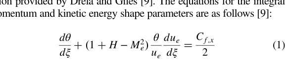
θ dH
dξ  2H  H1 −H θ
ue
due
dξ  2CD −H Cf;x
2
(2)

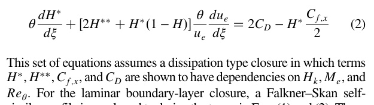
This set of equations assumes a dissipation type closure in which terms
H, H, Cf;x, and CD are shown to have dependencies on Hk, Me, and
Reθ. For the laminar boundary-layer closure, a Falkner–Skan self-
similar profile is employed to derive the terms in Eqs. (1) and (2). These
terms are obtained for the turbulent boundary-layer closure by consid-
ering the skin-friction and velocity profile formulas of Swafford [21].
The expressions for the closure parameters used can be found in
Refs. [22,23].
In comparison to the laminar boundary layer, the dissipation
coefficient for the turbulent boundary layer has an additional depend-
ency on the shear stress coefficient Cτ. Furthermore, Cτ depends on
transport behaviors associated with the Reynolds stresses in the wake
layer, which respond relatively slowly to changing conditions. This
behavior is modeled through the following rate equation [19], which
has been modified from that originally presented in Ref. [9] and
found to produce better predictions near stall:
δ
Cτ
dCτ
dξ  5.6 C1∕2
τEQ −C1∕2
τ
 2δ
4
3δ
Cf;x
2
−
Hk −1
6.7Hk
2
−1
ue
due
dξ
(3)

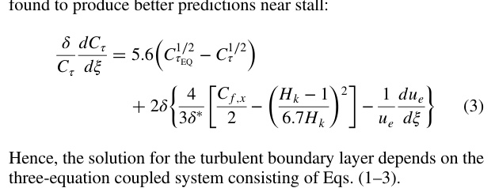
Hence, the solution for the turbulent boundary layer depends on the
three-equation coupled system consisting of Eqs. (1–3).
The transition location was also considered to properly model the
boundary-layer development across the airfoil pressure distributions.
Prediction of this location was performed by applying spatial-
amplification theory to the Orr–Sommerfeld equation, which results
in the ubiquitous en method. This method assumes that the boundary
layer transitions once the most unstable Tollmien–Schlichting (T-S)
wave in the boundary layer has grown by a factor of en, where n is an
empirical constant [9]. Traditionally, a value of n  9 is used as it is
representative of the low-freestream turbulence intensity encoun-
tered in atmospheric flight. The solution for the amplification factor
n is obtained through the following differential equation [9]:
dn
dx Hk; θ  dn
dReθ
Hk mHk  1
2
lHk 1
θ
(4)

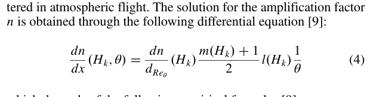
which depends of the following empirical formulas [9]:
dn
dReθ
Hk  0.01f2.4Hk −3.7  2.5 tanh1.5Hk −4.652
 0.25g1∕2
(5)

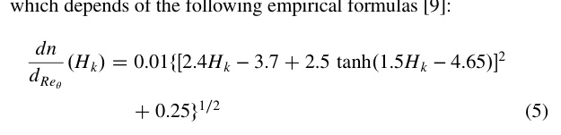
lHk  6.54Hk −14.07
H2
k
(6)

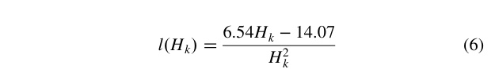
mHk 
0.058 Hk −42
Hk −1
−0.068
1
lHk
(7)

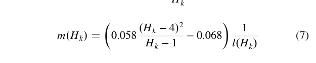
Similar to the turbulent boundary layer, the laminar boundary-layer
solution depends on the three-equation coupled system comprised of
Eqs. (1), (2), and (4).
The actual solution of the nonlinear, ordinary differential system of
equations is carried out using a Newton numerical integration method
through a code developed in MATLAB. The equations are discretized
using a Crank–Nicolson numerical integration scheme in the form
providedby Smithet al. [24].This finite-difference scheme is second-
order, implicit, and numerically stable, which provides better con-
sistency for varying step sizes. The method simply requires that an
edge-velocity (ue) distribution is provided (obtained from the Cp
distribution), as well as initial conditions for θ, δ, and Cτ. These
values are obtained from a viscous MSES solution of the initial seed
airfoil, which is typically a fair assumption considering that these
Fig. 1
Flow diagram for the airfoil design process being proposed.
1414
COLLAZO GARCIA AND ANSELL

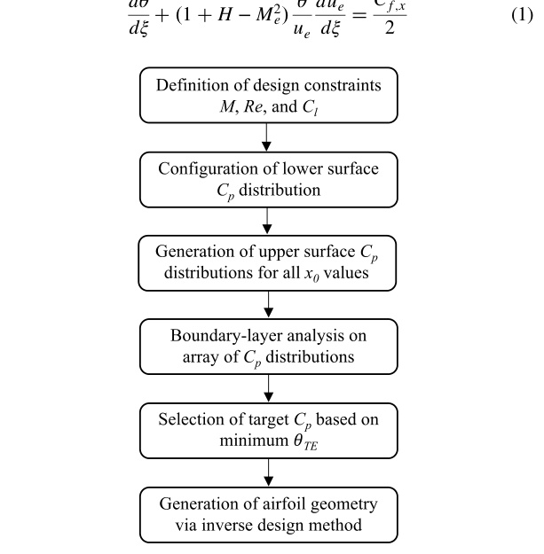

parameters are initially close to zero and both the seed and modified
airfoils are expected to have very similar pressure gradients across
their leading edge regions. Lastly, the code solves for the distributions
of θ, δ, and Cτ across the chord, from which all other important
boundary-layer parameters can be determined.
## C. Pressure Distribution Parameterization
As is common in the operation and design of airfoils, the upper
surface was assumed to serve the predominant role in dictating
the net airfoil loads. Therefore, the optimization of the upper sur-
face pressure distribution was only considered in this study, and the
lower surface pressure distribution was designed to remain fixed.
However, the current design framework could also be utilized
across this surface to further extend upon results presented here.
The upper surface distribution was assumed to consist of three
main segments: an initial FPG, a linear distribution, and a concave
pressure recovery region, which are shown in Fig. 2. Specific details
regarding the design of each segment are provided in the following
subsections.
1.
Segment I: Favorable Pressure Gradient
The first segment in the pressure distribution considers an FPG up
to a specified chordwise location (x1) as observed in Fig. 2. The
distribution across this region was designed to provide a minimum θ
growth that incurred the smallest possible profile drag contribution at
the beginning of segment II. More specifically, the distribution was
obtained by implementing an optimization routine on the boundary-
layer solver discussed in Sec. II.B, where the laminar boundary-layer
formulation was considered to be the objective function. The non-
linear optimization function in MATLAB, fmincon, was used to
obtain the pressure distribution up to the point where the local
gradient of the distribution approached a value of zero. This function
employs a gradient-based method and is designed to identify the
minimum of a problem for which both objective and constraint
functions are continuous and have continuous first derivatives. Alter-
natively, when the problem is unfeasible, the fmincon function iden-
tifies a solution that minimizes the maximum constraint value [25]. A
constraint that the local slope (between two adjacent points in the
Newton-system domain) had to be equal to or less than the previous
was implemented in the optimization to ensure that the resulting
pressure distribution would provide a feasible airfoil geometry and a
θ distribution with a positive growth rate. Figure 2 shows a repre-
sentation of the optimized FPG region at a given operating condition.
The location of x1, which is associated with a pressure value in the
optimized FPG distribution, is not directly selected but rather chosen
to meet the design Cl constraint based on the distributions in seg-
ments II and III.
2.
Segment II: Linear Distribution
The second segment considers a linear pressure distribution up to
the onset of pressure recovery. Furthermore, the pressure gradient
across this segment ensures that transition occurs at a desired location
using the en method to prevent boundary-layer separation. Figure 2
shows the transition location x2 occurring upstream of the pressure
recovery onset location x0. The transition can also be designed to
coincide with the pressure recovery onset location; however, this is
likely to result invery aggressive recoveries close to separation limits
that present convergence difficulties. In addition, placing the tran-
sition location slightly upstream prevents the risk of boundary-layer
separation when the interface between segments II and III is blended
to avoid discontinuities in the airfoil generation. The gradient across
this linear segment is defined from x1 to x0 and its value is determined
through an iterative process using the boundary-layer solver dis-
cussed in Sec. II.B, such that a transition is predicted to occur at
the x2 location.
Airfoils designed to produce extensive regions of laminar flow
generally feature regions of FPG that are known to inhibit the growth
of T-S waves that instigate the natural boundary-layer transition
process. Counterintuitively, Fig. 2 displays a distribution with an
APG that leads to a natural transition at a chordwise location similar
to those achieved by laminar flow airfoils designed with regions
of FPG. This is due to the stabilizing influence effects imposed
by compressible Mach numbers on T-S disturbances due to greater
acceleration and change in density observed in the boundary layer
[26–28]. A lower freestream Mach number would therefore require a
higher FPG, resulting in a different distribution than that observed in
Fig. 2. In addition, the chordwise Reynolds number has a role in
dictating the natural transition location. Hence, for a particular oper-
ating Mach number, a higher chordwise Reynolds number condition
will be associated with an increasingly high FPG across segment II in
order to delay transition up to the desired location. Nevertheless, the
current framework can still be used for these higher Re applications
as well, which, similar to a low-Mach-number design, would result in
a higher FPG than that shown in Fig. 2.
3.
Segment III: Pressure Recovery
The third segment consists of the pressure recovery region, which
is critical in dictating the attached condition of the boundary layer
and, as a result, ensures that the static pressure returns to the approxi-
mate freestream value. Initially, the Stratford pressure recovery dis-
tribution was considered as it provides the minimum skin friction
contribution to the profile drag by producing a flow in which the
boundary layer is on the verge of separation, where the Cf;x distri-
bution asymptotes to zero [13,14]. First used on airfoil design by
Liebeck, the Stratford recovery was observed to provide the shortest
unassisted chordwise recovery region, which allowed a pressure
distribution to be configured that achieved the theoretical maximum
lift for a single-element airfoil. From experimental observations that
proved the ability of this pressure distribution to produce recoveries
with minimal skin friction, Stratford and Liebeck went on to suggest
that its application was also likely to result in airfoils that produced
minimum drag [12,14]. However, a practical aspect that also requires
consideration is that the pressure distribution required to pro-
duce the marginally separated boundary layer across a short chord-
wise distance results in a substantial growth of the boundary layer
when compared to other types. The rapid momentum loss across the
boundary layer augments the growth of the displacement thickness,
which alters the effective camber observed by the potential flow,
limiting the pressure recovery magnitude. Hence, the Stratford
distribution reduces the skin friction drag to a minimum at the cost
of increasing the pressure drag, which could potentially offset any
net profile drag benefits. In order to identify what type of pressure
recovery provided the minimum growth in θ, a parametric study was
performed in which the degree of concavity was varied from a
Stratford distribution to a linear distribution. Only concave pressure
recoveries were considered, as they better prevent separation by
decelerating the flow more aggressively when the boundary layer
has more energy [27]. In addition, the Stratford distributions were
0
0.1
0.2
0.3
0.4
0.5
0.6
0.7
0.8
0.9
1
-2
-1.5
-1
-0.5
0
0.5
1
Segment I
Segment II
Segment III
x1
x2
x0
Fig. 2
Pressure distribution segments considered in the airfoil design
methodology.

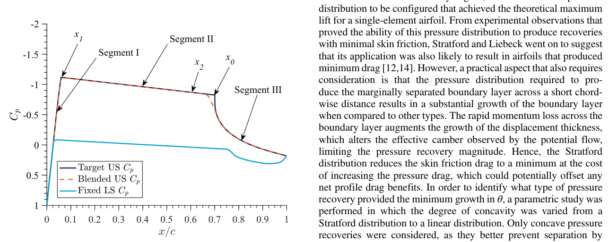

modified by stretching them in such a way that the onset of recovery
would begin upstream of the Stratford theoretical limit. The varia-
tions in the pressure recoveries considered are presented in Fig. 3a.
The edge-velocity distributions, used by the boundary-layer solver
discussed in Sec. II.B, were calculated for the different recoveries and
used to predict the corresponding distributions of θ. As observed
in Fig. 3, a selected example of a modified Stratford distribution
stretched to recover 0.20c upstream of the Stratford limit produced
the lowest growth in θ at the trailing edge when compared to the other
less concave recoveries. This behavior results from the modified
Stratford having the highest growth in θ near the recovery onset,
which then asymptotes to a linear distribution when compared to the
less concave recoveries in which the θ growth displays a parabolic-
type behavior across the recovery region. The better θTE performance
identified for the modified Stratford in contrast to the other recovery
types was consistent regardless of the stretch factor applied. Further-
more, Fig. 4 shows that a greater stretch factor for a Stratford distri-
bution will also result in a lower θTE condition. However, it is evident
that the pressure distributions in Fig. 4a would not result in the same
Cl condition if a constant lower surface distribution for an airfoil were
assumed. This observation suggests that the stretch factor applied to a
modified Stratford recovery on an airfoil will be determined based
on the lift and transition location constraints. Additionally, it can be
expected that these Stratford-type recoveries will limit the maximum
operating angle of attack of an airfoil as more aggressive pressure
gradients upstream of the recovery produce thicker boundary layers
that are unable to withstand further inertial opposition and result in
separation.
4.
Pressure Distribution Generation Algorithm
The generation of the pressure distributions consisting of the three
segments previously described is an iterative process that considers
several constraints. First, a gradient for the linear region of segment II
and a corresponding Cp value at x1 are assumed. With these param-
eters, x1 and the Cp at the x0 location being considered are calculated.
A Stratford distribution is then computed from the Cp at x0 to a
definedCpTE usingthecodeandsolutionprocessoutlinedinRef.[29].
The resulting Stratford pressure distribution is stretched by the
necessary factor for the recovery to extend from x0 to the trailing
edge of the airfoil. All three segments are then combined to produce
the target upper surface distribution shown in Fig. 2. The distribution
is then interpolated at the segment interfaces, also shown in Fig. 2, as
the blended distribution. This step was implemented to ensure a
smooth transition between the different segments and avoid any
discontinuities that would prevent the generation of realistic airfoil
geometries. The interpolation was performed using a cubic Hermite
spline algorithm since this method ensures a continuous function and
first derivative without altering the intended form of the pressure
distribution [30].
Also shown in Fig. 2, the prescribed lower surface distribution is
then considered to calculate the Cl value that would be produced by
the pressure distribution. If the calculated Cl is not within a defined
0
0.1
0.2
0.3
0.4
0.5
0.6
0.7
0.8
0.9
1
0.8
0.9
1
1.1
1.2
1.3
1.4
1.5
a) ue velocity distributions
0
0.1
0.2
0.3
0.4
0.5
0.6
0.7
0.8
0.9
1
0
1
2
3
4
5
6
7
10-3
b) θ distributions
Fig. 3
Example of pressure recovery distributions considered where x0 is stretched 20%c upstream of the Stratford limit.
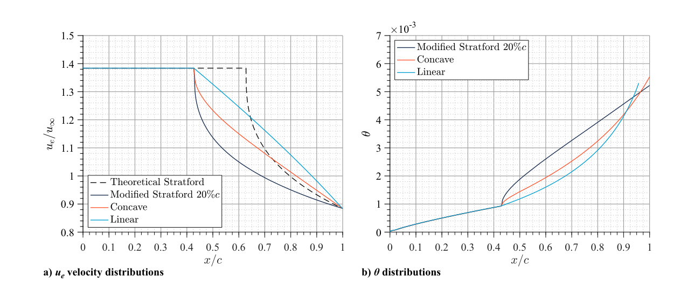
0
0.1
0.2
0.3
0.4
0.5
0.6
0.7
0.8
0.9
1
0.8
0.9
1
1.1
1.2
1.3
1.4
1.5
a) ue velocity distributions
0
0.1
0.2
0.3
0.4
0.5
0.6
0.7
0.8
0.9
1
0
1
2
3
4
5
6
7
10-3
b) θ distributions
Fig. 4
Modified Stratford pressure recovery distributions with different chordwise stretch factors.
1416
COLLAZO GARCIA AND ANSELL

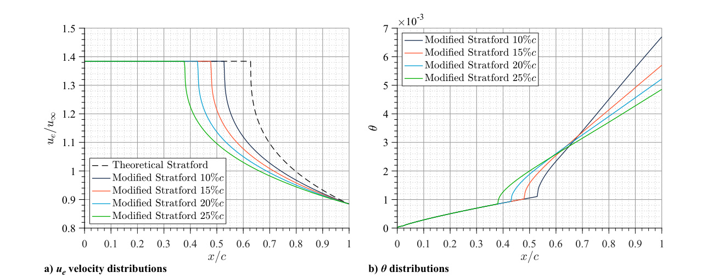

threshold of the target condition, a higher or lower value of Cp at x1 is
determined and used to generate a new target distribution accord-
ingly. This intermediate step shifts the distribution of segment II to
higher or lower pressures and determines the corresponding distri-
butions in segments I and III until the Cl threshold is met for the x0
constraint being enforced.
At this stage, the pressure distributions across segments I and II are
analyzed using the boundary-layer solver developed for this study
and discussed in Sec. II.B to determine the transition location. If the
predicted transition location is not within a defined threshold of x2, or
the boundary layer fails to transition, the gradient across segment II is
updated accordingly. The process of determining the target distribu-
tion considering the Cl and x0 constraints is repeated until the addi-
tional transition constraint at x2 is met. Target pressure distributions
can be generated based on any x0 location that is upstream of the
theoretical limit of a Stratford distribution, after which a shorter
recovery would result in separation.
## D. Inverse Design Process
Target Cp distributionsbased on desired boundary-layer character-
istics were used to obtain airfoil geometries using the Euler viscous-
coupled solver MSES [9]. This software, also capable of effectively
simulating airfoil flows within the transonic environment, features a
mixed-inverse design routine that allows the geometry that produces
a desired pressure distribution to be simultaneously identified with
the flow solution [8,31].
The inverse design was performed using an inviscid analysis at the
specified M∞, similar to that presented by Olson [31]. The process
began by obtaining a viscous solution (at the operating Re condition
and with forced transition at x2) of a seed airfoil with com-
parable performance characteristics to the one desired. The target
Cp distribution previously designed was then used for the inviscid
mixed-inverse design routine. Initially, the upper and lower surfaces
downstream of the pressure recovery onset location were modified
independently. The regions upstream of the pressure recovery up to
the leading-edge suction peaks were then considered, also independ-
ently for the upper and lower sections. After each modification, a new
viscous solution of the updated geometry was obtained before per-
forming further inverse design iterations. This step ensured that the
current flow solution being used to modify the geometry was repre-
sentative of the viscous decambering effect observed across an air-
foil surface. The process was repeated until the viscous solution
of the modified airfoil matched the target Cp distribution. It is worth
mentioning that, as is common for inverse design methods, geometry
modifications close to the leading edge due to significant target
pressure differences are usually unattainable or can lead to unrealistic
geometries. Therefore, the design must begin with a leading edge that
already matches the desired behavior near that region. Once a con-
verged design was obtained, the coordinates were smoothed using
a fourth-order B-spline to ensure slope continuity along the air-
foil curve.
# III. Airfoil Development
To evaluate the airfoil design methodology being proposed, a
HALE aircraft was considered to identify an exemplary set of airfoil
design constraints and operating conditions. HALE aircraft, designed
to operate for long periods of time at target altitudes of up to 35 km
[22], have gained research interest in aerospace design sectors as
they offer less expensive and serviceable solutions for intelligence,
surveying, and reconnaissance (ISR), communications relaying,
weather and agricultural monitoring, and other applications requiring
satellite-based structures [32–37]. These aircraft are characterized
by low wing loadings, which pose a need for highly efficient air-
foil sections at an unconventional condition of low Reynolds and
compressible-subsonic Mach numbers. Numerous design efforts
have been tailored to HALE vehicles; however, the airfoil sections
typically result in high t∕cmax from the low-density operating con-
straint rendering Mcrit to low values. In addition, the performance of
these airfoils is often limited by the presence of laminar separation
bubbles (LSBs) [22,32]. Hence, the method being considered in this
study can be used to improve the performance of airfoil sections
that meet the stringent operating conditions encountered by HALE
vehicles.
Table 1 shows the general operating conditions of the Northrop
Grumman RQ-4B Global Hawk, which was selected to define the
airfoil performance requirements based on its mission profile. The
LRN1015 airfoil used on the RQ-4B Global Hawk was also used as
the seed geometry from which the optimized airfoils were generated.
To further showcase the applicability of the design framework across
a wider operating range, two additional design cases were con-
sidered, consisting of high Re and incompressible M conditions. A
summary of all the airfoils developed in this study is presented in
Sec. III.A. Section III.B outlines an example of the airfoil design
process using the CA5427-72 airfoil, which was specifically
designed for experimental validation. It should also be emphasized
that the airfoils developed in this study have a point design constraint
that limits their off-design performance when compared to the base-
line seed geometry. Nevertheless, the intent of these designs is to
showcase the implementation of and highlight the advantages asso-
ciated with an airfoil design methodology that leverages integral
boundary-layer parameters as the main design driver. Lastly, addi-
tional discussion on the development of the remaining airfoils, as
well as geometrical coordinates, can be found in Ref. [38].
## A. Summary of All Airfoils
Table 2 shows a summary of all the airfoils developed in this study,
alongside their corresponding design constraints. Target Cl parame-
ters for all airfoils were obtained by performing an MSES solution on
the LRN1015 airfoil at the desired operating condition (e.g., α  0°
and L∕Dmax). For the CA5488 airfoils, α  0° was selected as it
would be representative of a normal-cruise flight condition. The
target M and Re conditions for the CA5488 airfoils were chosen
using the performance parameters in Table 1 and assuming a mean
geometric chord. To assess the effect of optimizing target pressure
distributions using different integral boundary-layer parameters, the
CA5488-88 was configured for minimum θTE and the CA5488-76
was configured for minimum δ
TE. The lower surface for these airfoils
was designed to resemble that of the LRN1015, with a natural
transition predicted at the 0.70c location. As previously mentioned
in Sec. II.C, this lower surface pressure distribution remained fixed
throughout the design optimization. Lastly, as can be observed in
Table 2, the maximum freestream Mach number considered was
0.54, which, while compressible, produced shockless upper surface
distributions. Based on previous work that explored the behavior of
Stratford pressure distributions in compressible transonic flows, it is
expected that this methodology can be effectively used at higher
Table 1
Operating parameters
for the RQ-4B Global Hawk [39]
Parameter
Value
Service ceiling
60,000 ft
Loitering speed
310 kt
Wing span
130.9 ft
Wing area
685 ft2
Table 2
Airfoil configurations considered
throughout the investigation
Airfoil
Design
point
Boundary-layer
constraint
Target Cl
M∞
Re ×106
CA5488-85
α  0°
θTE
0.71
0.54
1.88
CA5488-76
α  0°
δ
TE
0.71
0.54
1.88
CA5427-72
L∕Dmax
θTE
1.12
0.54
1.27
CA5427-76
L∕Dmax
x0
1.12
0.54
1.27
CA5410-85
α  0°
θTE
0.75
0.54
10.00
CA1000-89
α  0°
θTE
0.58
0.10
1.00

freestream Mach numbers if the pressure rise induced by transonic
shocks is effectively integrated with the APG produced by the
subsequent recovery [29,38].
Similarly, the CA5427 airfoils were designed based on the operat-
ing conditions of the RQ-4B Global Hawk while considering a lower
Reynolds number that could be produced during experimental test-
ing. The target Cl was based on the L∕Dmax for the LRN1015, as this
parameter would coincide with the best loiter condition. Addition-
ally, the lower surface was configured with a forced transition at
0.70c and also remained fixed throughout the optimization. This
design choice was implemented to maintain a similar lower surface
distribution among the other design cases considered in this study
which intrinsically helped to achieve the high Cl constraint without
requiring significant modification of the lower surface. To showcase
the effect of θTE on the profile drag minimization, the CA5427-72
was optimized with minimum θTE, while the CA5427-76 was pur-
posefully designed with a Stratford pressure recovery to assess the
airfoil design using the asymptotic limits of attached flow across the
recovery region.
While not discussed in this paper, two additional airfoils were
developed to illustrate the applicability of the method across a
broader range of freestream operating conditions. Therefore, the
parameters for the CA5410-85 and the CA1000-89 were simply
selected to represent an expanded envelope of high Re and incom-
pressible M conditions, respectively. Target Cl values were also
generated using MSES at the corresponding operating conditions
of interest. Both airfoils were optimized for minimum θTE and with
forced transition across the lower surfaces at 0.50c, which were,
respectively, held fixed throughout the airfoil optimization process.
The authors of Refs. [38,40] discuss in detail the specific design
considerations, operating implications, and performance predictions
for these two airfoils.
## B. CA5427-72: Airfoil Generation
A design point that targeted the L∕Dmax condition of the baseline
LRN1015 airfoil was of interest in this study since it represented the
best loiter condition of the RQ-4B. In addition, a lower chordwise Re
than that expected for actual flight was used in the development of
this airfoil to better match experimental conditions that could be
achieved in a wind tunnel environment. Following the process out-
lined in Sec. II.C, a series of Cp distributions were generated with
varying x0 locations from 0.60c to 0.76c at intervals of 0.01c. The
resulting Cp distribution sweep is presented in Fig. 5a, along with the
corresponding boundary-layer predictions in Figs. 5b–5d.
The minimum θTE condition in Fig. 5b was identified for the x0 
0.72c distribution and was used to produce the CA5427-72 airfoil.
Figure 6 shows the resulting geometry of the CA5427-72 alongside
its boundary-layer characteristics, also compared to data for the
LRN1015 at the same flow and angle-of-attack conditions. Variations
between the design target and MSES data, particularly across the δ
and Cf;x distributions, are mostly attributed to the differences in the
numerical solution algorithms of both integral boundary-layer solv-
ers. However, the other design cases considered displayed better
agreement since the boundary layer was subject to lower loadings
and less-aggressive recoveries. The airfoil ncrit value at the desired
0
0.1
0.2
0.3
0.4
0.5
0.6
0.7
0.8
0.9
1
-2
-1.5
-1
-0.5
0
0.5
1
a) Cp distributions
0
0.1
0.2
0.3
0.4
0.5
0.6
0.7
0.8
0.9
1
0
1
2
3
4
5
6
10-3
0.9
0.92 0.94 0.96 0.98
1
3
3.5
4
10-3
b) θ distributions
0
0.1
0.2
0.3
0.4
0.5
0.6
0.7
0.8
0.9
1
0
0.2
0.4
0.6
0.8
1
1.2
10-2
c) δ* distributions
0
0.1
0.2
0.3
0.4
0.5
0.6
0.7
0.8
0.9
1
0
0.5
1
1.5
2
2.5
10-2
d) Cf,x distributions
Fig. 5
Variations considered for the L∕Dmax design point.
1418
COLLAZO GARCIA AND ANSELL

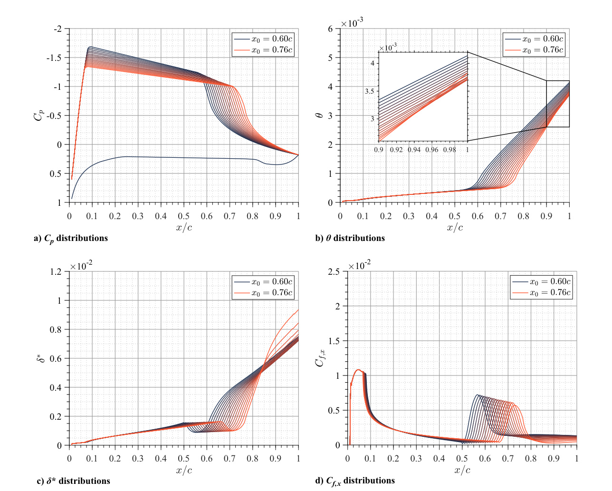

transition location shows very good agreement with that predicted by
the boundary-layer solver, as observed in Fig. 6d. The pressure
distribution of the CA5427-72 airfoil in Fig. 6a produced a Cl value
of 1.1256, showing excellent agreement with the target Cl condition
of 1.12. It can also be observed in Fig. 6a that the CA5427-72 target
and MSES Cp distributions show excellent agreement with minor
variations near the leading-edge region. As was previously discussed
in Sec. II.D, these observed differences are due to the smoothing
required to ensure a continuous curve, especially near the leading
edge of the airfoil.
At this design condition, the LRN1015 still displays an LSB, as
can be identified in Fig. 6c by a small chordwise region displaying
values of Cf;x below zero. The optimized CA5427-72 airfoil elimi-
nates this separated region and also displays better trailing edge
boundary-layer performance when compared to the LRN1015, as
observedinFig.6b.AninterestingobservationwasmadefromFig.6a
in which, without any prior knowledge, the upper-surface pressure
distribution shape of the LRN1015 at the L∕Dmax condition closely
resembled that of the optimized CA5427-72. This observed similar-
ity provides confidence in the assumptions made for the design of the
upper-surface pressure distribution outlined in Sec. II.C. The obser-
vation also suggests that, even though unconventional, the intentional
use of an APG in certain flow conditions can lead to airfoils that
produce low drag and feature extensive regions of laminar flow.
# IV. MSES Performance Predictions
The following section presents the MSES performance predictions
obtained for all the HALE-configuration airfoils designed using
the present method and previously described in Sec. III.A. Special
0
0.1
0.2
0.3
0.4
0.5
0.6
0.7
0.8
0.9
1
0
0.2
0.4
0.6
0.8
1
1.2
10-2
0
0.1
0.2
0.3
0.4
0.5
0.6
0.7
0.8
0.9
1
-2
-1.5
-1
-0.5
0
0.5
1
a) Cp distributions
b) θ & δ* distributions
0
0.1
0.2
0.3
0.4
0.5
0.6
0.7
0.8
0.9
1
0
0.5
1
1.5
2
10-2
c) Cf,x distributions
0
0.1
0.2
0.3
0.4
0.5
0.6
0.7
0.8
0.9
1
0
2
4
6
8
10
12
d) n distributions
e) Airfoil geometries
Fig. 6
CA5427-72 airfoil characteristics for minimum θTE at the L∕Dmax design point.

emphasis is given to the airfoil operational implications and perfor-
mance influences associated with the design conditions and target
boundary-layer constraint.
A.
The α  0° Design Condition
Figure 7 shows the lift, moment, and aerodynamic polar distribu-
tions produced for the CA5488-85 and LRN1015 airfoils using
MSES. Considering the design point of α  0°, M  0.54, and
Re  1.88 × 106, with a constraint of Cl  0.71, the CA5488-85
is observed to produce a Cd reduction of 9.06% and an L∕D increase
of 10.07% relative to the LRN1015 airfoil. This improved aerody-
namic performance helps to validate the proposed methodology of
associating the minimum drag condition with the θ development
across the surface of the airfoil. It can be determined that, at higher
angles of attack immediately following the design condition, the
airfoil contains regions of separated flow. This is reflected in the
slope decrease along the Cl versus α curve in Fig. 7a, in the sharp Cd
increase observedin Fig. 7b, and was also confirmed in the off-design
pressure distributions not shown. At these high angle-of-attack val-
ues, no appreciable difference is observed between the free- and
fixed-transition analyses, especially when considering the airfoil
Cd, which is more sensitive than other performance coefficients to
transitional flow. This observation results from the Cp distributions
displaying greater suction peaks and greater APGs as the angle of
attack is increased. Hence, transition naturally occurs upstream of
the design location that would be used to force transition in the
solution. On the contrary, the lower angles of attack show significant
changes in the drag performancewhen comparing the fixed- and free-
transition data. As the angle of attack is reduced, the severity of the
APG across the upper surface is also reduced, and hence, if the
transition is not fixed, the boundary layer is likely to separate and
form an LSB at the onset of the pressure recovery. Nevertheless, even
for the free-transition cases, the CA5488-85 airfoil shows slightly
better performance for the lower region of the LRN1015 drag bucket.
It should be noted that the off-design characteristics just described are
associated with, and show the limitations of, point-design airfoils.
The MSES aerodynamic performance results for the CA5488-76
are shown in Fig. 8a, also compared to the LRN1015. The design
point of α  0°, M  0.54, Re  1.88 × 106, and Cl  0.71 for this
airfoil was observed to produce a Cd reduction of 6.19% and an L∕D
increase of 3.80%. The minimum δ
TE condition represented by this
airfoil shows an aerodynamic performance improvement, but the
drag reduction is less than that observed for the CA5488-85, repre-
senting the minimum θTE.
Aerodynamic polars for the fixed transition case of both CA5488-
85 and CA5488-76 airfoils are presented in Fig. 9 to allow for direct
comparison. The CA5488-85 is shown to produce marginally lower
drag values when compared to the CA5488-76 across the drag bucket
produced by these two airfoils. A smoother separation behavior
towards a stalled condition can be inferred for the CA5488-76 as it
shows a more gradual increase in drag across the upper limit of the
drag bucket in Fig. 9. Similarly, the CA5488-76 achieves higher Cl
values immediately following the design angle of attack when con-
sidering Figs. 7a and 8a. This behavior is expected as the CA5488-85
-8
-6
-4
-2
0
2
4
6
8
-0.5
0
0.5
1
1.5
2
a) Cl vs. α
0
0.01
0.02
0.03
0.04
-0.5
0
0.5
1
1.5
2
b) Cl vs. Cd
Fig. 7
Lift, moment, and aerodynamic polar curves for the CA5488-85 airfoil obtained using MSES.
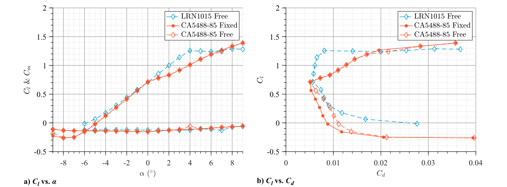
-8
-6
-4
-2
0
2
4
6
8
-0.5
0
0.5
1
1.5
2
a) Cl vs. α
0
0.01
0.02
0.03
0.04
-0.5
0
0.5
1
1.5
2
b) Cl vs. Cd
Fig. 8
Lift, moment, and aerodynamic polar curves for the CA5488-76 airfoil obtained using MSES.
1420
COLLAZO GARCIA AND ANSELL

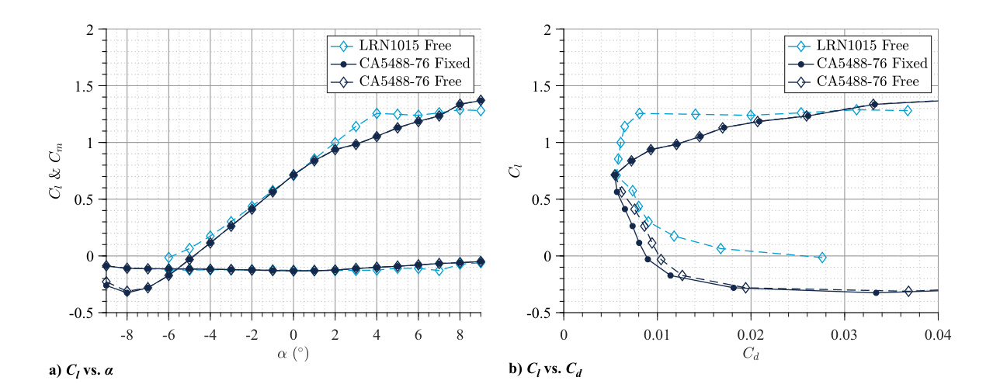

airfoil has a more aggressive recovery with a Cf;x distribution closer
to zero. Hence, as compared to the CA5488-76, the boundary layer of
the CA5488-85 has a limited ability to withstand further inertial
opposition imposed by a more substantial off-design loading, result-
ing in earlier separation. Another interesting observation can be made
when comparing the optimized polars to those of the LRN1015,
which, as previously described, is associated with point-design lim-
itations. Even though the design was performed at the same angle of
attack for which the seed airfoil produced the target Cl, the design
point results in the upper limit of the drag bucket for the optimized
airfoils. Hence, even though the L∕D for this angle of attack is
improved when compared to the seed airfoil, the optimized airfoils
could not achieve the L∕Dmax produced by the LRN1015. Lastly, as
can be observed in Figs. 7a and 8a, the pitching moment distributions
for both optimized airfoils retain the same overall characteristics as
those of the LRN1015.
B.
The L∕Dmax Design Condition
Aerodynamic data produced using MSES for the CA5427-72 and
LRN1015 airfoils are presented in Fig. 10. The design α for this
airfoil was considered to be 3°, since it corresponded to the L∕Dmax
of the seed airfoil. At this angle of attack, the optimized CA5427-72
for the M  0.54, Re  1.27 × 106, and Cl  1.12 condition was
found to produce a Cd reduction of 6.00% and an L∕D increase of
6.59% when compared to the LRN1015. Similar to the observation
made for the CA5488 airfoil variants in Sec. IV.A, the design point of
the optimized airfoil also resulted in the L∕Dmax condition and the
upper Cl edge of the drag bucket. Hence, for this particular airfoil, the
optimized polar retains the same shape as that of the LRN1015, with
the L∕Dmax occurring at the same angle of attack. In addition,
pitching moment characteristics were also observed to remain rela-
tively unchanged when compared to the performance of the seed
airfoil.
The airfoil is inferred to contain separated regions at conditions
immediately above the design angle of attack, as was also discussed
in Sec. IV.A, resulting from the imminent separation characteristic of
Stratford-type recoveries. Another interesting observation resulting
from this behavior is that, even though the curves for the optimized
airfoil in Fig. 10 follow closely the trends produced by the LRN1015,
the CA5427-72 fails to achieve the same Clmax as the LRN1015, as
observed in Fig. 10a. Based on the previous observations made in
Sec. IV.A, that would not likely be the case if the airfoil were
optimized for a minimum δ
TE condition which displayed better
robustness to separation at off-design points. The polar region cor-
responding to angles of attack lower than the design point shows
notable drag increases for the free-transition case, as was similarly
identified in Sec. IV.A for the α  0° design case. Nevertheless, the
fixed-transition condition of the CA5427-72 in Fig. 10b displays
notable drag reductions when compared to the LRN1015 across the
Cl region of 0.39–1.13.
Figure 11 presents the MSES aerodynamic performance data
obtained for the CA5427-76 airfoil, which are also compared to
the data for the minimum θTE optimized CA5427-72 airfoil. The
CA5427-76 airfoil was purposefully designed to feature a Stratford
recovery, as indicated in Table 2. Considering the design point in the
aerodynamic polar of Fig. 11b, it can be observed that both airfoils
achieve a very similar target Cl value, while the CA5427-76 produces
a drag increase of 0.5 counts when compared to the CA5427-72 at
Cl  1.12. Even though it might be considered a negligible incre-
ment, it does provide validation to the proposed theory that, after a
certain chordwise location, further laminar flow will offset the theo-
retical minimum profile drag that can be achieved.
The new airfoil with a shorter chordwise pressure recovery dis-
plays a stall at a lower angle of attack, as indicated by the sudden loss
in Cl observed in Fig. 11a at α  4°. This characteristic is attributed
to the CA5427-76 airfoil having a pressure recovery closer to the
theoretical Stratford distribution, which, as outlined by Liebeck
[41,42], results in immediate separation when the airfoil is subjected
to additional off-design loading. The Cd values for the CA5427-76
immediately following the design angle of attack α  3° display
greater drag values than the CA5427-72 in Fig. 11b due to the more
aggressive separation characteristic just described. The lower angles
of attack, however, display an interesting behavior for the fixed-
transition cases in which the CA5427-76 achieves lower drag values
than the CA5427-72, also on the order of less than 1 count, and a
broadening of the drag bucket. As the airfoil loading across the upper
0
0.01
0.02
0.03
0.04
-0.5
0
0.5
1
1.5
2
Fig. 9
Polar comparison for the CA5488 airfoil variants.
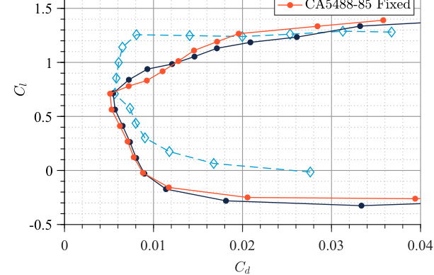
-8
-6
-4
-2
0
2
4
6
8
-0.5
0
0.5
1
1.5
2
0
0.01
0.02
0.03
0.04
-0.5
0
0.5
1
1.5
2
a) Cl vs. α
b) Cl vs. Cd
Fig. 10
Lift, moment, and aerodynamic polar curves for the CA5427-72 airfoil obtained using MSES.

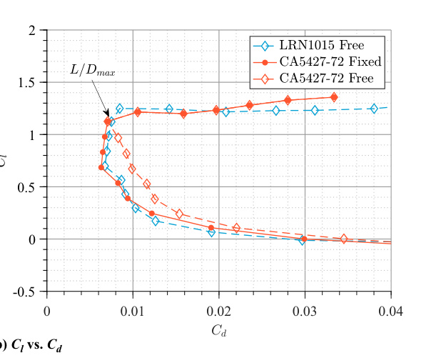

surface is reduced at these lower angles of attack, the additional
laminar flow and less severe recovery result in a reduction in skin
friction drag, with a relieved penalty of pressure drag associated with
the aggressive recovery profile at the design point. This observation
provides insights into the relationship between the optimal x0 and
loading of the airfoil, as well as weighing different operational con-
ditions when considering multipoint applications. Finally, the free
transition data for the lower angles of attack (below the design Cl
of 1.12) of the CA5427-76 airfoil display similar behavior to the
CA5427-72 data, where substantial drag rises are observed.
# V. Experimental Validation of the CA5427-72 Airfoil
As previously discussed in Sec. III.A, the CA5427-72 airfoil was
intentionally established for experimental validation of the design
method being proposed. The following section describes the exper-
imental methods and results obtained from this effort.
## A. Experimental Methods
1.
Experimental Airfoil Models
The CA5427-72 and LRN1015 airfoil geometries were used to
design and build experimental models with a chord of 4.5 in.,
representative of the target Reynolds number conditions previously
outlined in Table 2. Since airfoils generally require a finite-thickness
trailing edge for manufacturing, the LRN1015 was modifiedto have a
trailing edge thickness equal to 1% of the chord, blended upstream to
the x∕c  0.50c location using the GDES function in XFOIL. No
modification was required for the CA5427-72 airfoil since a finite
trailing edge thickness of 0.01c was already considered in its design.
A multipiece assembly was considered for the design, which con-
sisted of a main airfoil body that interfaced with supporting inserts on
its sides. The main body, featuring a span of 5.2 in., was manufac-
tured using SLA 3D printing, which allowed to internally route taps
across the airfoil for surface pressure data acquisition. The pressure
taps were configured with a 0.041 in. diameter and were arranged to
interface with hypodermic tubing at both ends of the model. Addi-
tionally, the pressure taps were strategically swept along the span by
considering a constant spacing to prevent premature boundary-layer
transition from disturbances produced by upstream pressure taps.
The placement of the pressure taps in this sweep configuration was
also constrained to 50% of the semispan of the assembled model
measured from the center to help mitigate sidewall influences that
could affect the pressure measurements. In total, both models fea-
tured 47 pressure taps, with 23 and22 distributed across the upperand
lower surfaces, respectively, and two additional taps placed at the
leading and trailing edges of the airfoil. The chordwise placement of
the taps was purposely selected to capture the important pressure
distribution characteristics of each airfoil surface under the design
operating conditions.
Side inserts of the airfoil contours with a thickness of 0.25 in. were
manufactured from stainless steel using wire electrical discharge
machining (EDM). These inserts interfaced with the main body
through threaded heat-set inserts that were previously installed.
Additionally, a stainless steel shaft with a diameter of 0.375 in. was
welded at the quarter chord location of each side insert, serving as a
spar to control the angle of attack of the models during testing. The
hypodermic tubing on the sides of the main body was also routed out
of the wind tunnel through the inside of these shafts. Lastly, Teflon
covers with 0.15 in. thickness were cut to match the airfoil profiles
and glued on the external sides of the metal inserts to prevent
damaging the wind tunnel windows. When fully assembled, each
experimental model featured a span of 6 in. covering the entire length
of the test section to help mitigate three-dimensional wing effects
during testing. The details just described can be observed in Fig. 12
for the CA5427-72 experimental model.
As has been discussed in Secs. III.A and IV.B, the CA5427-72
airfoil was designed with forced transition across the lower surface
and off-design performance implications with upper-surface forced
transition were also considered. To experimentally achieve this
forced transition condition, an array of vinyl trip dots with a diameter
of 0.1 in. andcenter spacing of 0.2 in. was placed along the span of the
experimental model at the desired chordwise location. The vinyl
thickness of approximately 0.004 in. ensured that the trip dots
produced the required disturbances to force bypass transition in the
boundary layer.
-8
-6
-4
-2
0
2
4
6
8
-0.5
0
0.5
1
1.5
2
0
0.01
0.02
0.03
0.04
-0.5
0
0.5
1
1.5
2
a) Cl vs. α
b) Cl vs. Cd
Fig. 11
Comparison of lift, moment, and aerodynamic polar curves for the CA5427-72 and CA5427-76 airfoils obtained using MSES.
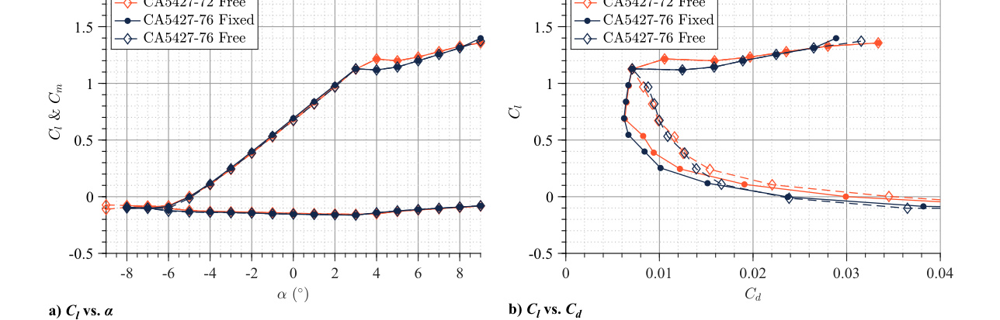
Fig. 12
CA5427-72 experimental model.
1422
COLLAZO GARCIA AND ANSELL

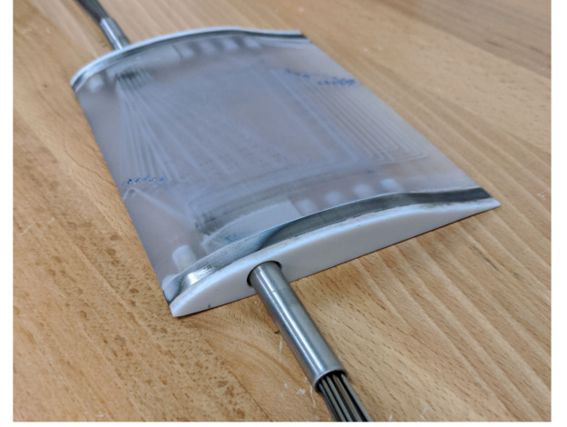

2.
Wind Tunnel Data Acquisition
Experiments were conducted at the Transonic Wind Tunnel Facility
at the University of Illinois Urbana-Champaign. This suction-type,
open-return wind tunnel features a test section with a cross-sectional
area measuring 6 in. × 9 in. and running 18 in. in the streamwise
direction. The test section is also fitted with porous walls having a 12%
open-arearatioata60°inclinationangleinastaggeredconfigurationto
mitigate interference effects and shock reflections [43]. Data acquis-
ition was performed at the design Mach number of 0.54 and angle-of-
attack range of −5° to 10°. In total, three airfoil cases were tested,
consisting of the LRN1015 and the CA5427-72 configured with free
and forced transition.
A DTC Initium Data Acquisition system with an ESP-64HD
Miniature Pressure Scanner with a 15 psid range was used for the
acquisition of the airfoil surface and wake pressure measurements. A
pitot-static wake traverse was installed in the test section to capture
the pressure deficit in the wake generated by the airfoil models. The
probe with an external diameter of 0.125 in. was located at the center
of the test section and approximately 5 in. behind the airfoil model.
Pressure measurements were acquired at 0.05 in. intervals at a fre-
quency of 100 Hz and averaged across 6.35 s. The mean airfoil
pressure measurements across all wake survey locations were used
to obtain the lift and moment coefficients. Wake pressure data were
then used to calculate the profile drag coefficient using the method of
Betz in Ref. [44] after Pankhurst and Holder.
3.
Uncertainty Analysis
As with all experimental investigations, the data acquired were
associated with uncertainties that must be characterized to allow for
proper interpretation of the results. Bias errors, associated with the
uncertainty in measurement capabilities or accuracyof an instrument,
were determined using the methods presented by Kline and McClin-
tock [45] and Coleman and Steele [46]. Table 3 showcases sample
uncertainties calculated for experiments conducted on the CA5427-
72 airfoil and discussed in Sec. V.B, at its design operating conditions
of M  0.54 and α  3°. Most importantly, the uncertainties pre-
sented for all values lie within tolerable margins of the observations
and comparisons made using the experimental data.
## B. Experimental Results for the CA5427-72 and LRN1015 Airfoils
1.
Pressure Distribution at Design Angle of Attack
Figure 13 shows the pressure distributions obtained for the three
airfoil configurations tested, consisting of the LRN1015, CA5427-72
transition-fixed, and CA5427-72 transition-free at the design con-
ditions of α  3° and M  0.54. Table 4 also presents the calculated
freestream and performance values corresponding to the experimen-
tal pressure distributions. While the observed Mach numbers for the
three airfoils show excellent agreement with the design condition,
the test Reynolds numbers consistently display lower values than
the design target of Re  1.27 × 106. The target Re for this design
case was calculated based on standard conditions in the laboratory
environment. However, the experimental facility has no means of
directly controlling the ambient temperature or pressure, which
directly influences the freestream Reynolds number. As a result,
the measured experimental Reynolds numbers shown were affected
by the atmospheric conditions and laboratory temperature at the time
of testing. Nevertheless, the recorded Re values are within 1 × 105
from the target, which still represent valid and acceptable flow
conditions for which the intended design features of the airfoils can
be demonstrated.
The experimental pressure distributions in Fig. 13 produce the
general trends that were expected from the design predictions in
Fig. 6a. For instance, the upper surface of both geometries follows
the intended distribution contour with the CA5427-72 having more
positive Cp values across the linear segment and a shorter recovery
region, the lower surfaces achieve a very similar distribution, and a
slightly lower trailing edge Cp value is observed for the CA5427-72
when compared to the baseline LRN1015. However, the experimen-
tal evaluation of both airfoils failed to capture the Clmax conditions that
were produced by MSES. This observed trait is a widely known
limitation of potential-flow/integral boundary-layer coupled solvers
and has been well documented by Coder and Maughmer [47,48]. In
their study, they identified that all of the theoretical models consid-
ered, including MSES [48], consistently overpredicted the maximum
lift coefficient of airfoils and that the differences observed were
influenced by the airfoil geometry and operating flow conditions.
Other studies in the literature that used MSES for similar airfoil
analysis applications have also identified the same limiting character-
istic [49–52]. As is later explained in greater detail, the wind tunnel
environment was also associated with higher turbulent intensities
than those considered in the design. The combined influence of these
factors prevented the airfoil configurations from exactly producing
the design distributions in Fig. 6a. Consequently, as shown in Table 4,
the experimental L∕Dmax is reached at an operating condition of
Cl  0.87, as compared to the Cl  1.12 target.
With these considerations in mind, the analysis of the case study
presented here was focused on the conditions for the experimentally
achieved L∕Dmax parameter. This approach allowed us to directly
assess the impact on L∕D between the two airfoils and to identify
performance benefits produced by the new airfoil design framework.
Comparing analytical distributions at this experimental condition of
interest can further assist in understanding the validity of the design
environment towards the design objectives. Thus, the experimental
Table 3
Sample uncertainties for experimental measurements of the
CA5427-72 airfoil at M  0.54, α  3°, and fixed transition
Parameter
Reference
value
Absolute
uncertainty
Relative
uncertainty, %
M
0.5410
	1.1588 × 10−3
	0.2142
Re
1.1687 × 106
	2.6056 × 102
	0.2230
Cp x∕c  0.54
−0.8853
	4.2698 × 10−3
	0.4823
Cl
0.8823
	5.4236 × 10−3
	0.6147
Cm
−0.1367
	2.5746 × 10−3
	1.8834
Cd
0.0074
	2.5844 × 10−4
	3.4925
L∕D
119.2297
	4.2281
	3.5462
0
0.1
0.2
0.3
0.4
0.5
0.6
0.7
0.8
0.9
1
-2
-1.5
-1
-0.5
0
0.5
1
Fig. 13
Experimental Cp
distributions for the CA5427-72 and
LRN1015 airfoils at the design condition of M  0.54 and α  3°.
Table 4
Experimental results for the CA5427-72 and LRN1015
airfoils at the design angle of attack of α  3°
Airfoil
M
Re×106
Cl
Cd
Cm
LRN1015
0.5435
1.1772
0.8642
0.00874
−0.1231
CA5427-72 fixed
0.5410
1.1687
0.8823
0.00738
−0.1367
CA5427-72 free
0.5467
1.1754
0.8713
0.00734
−0.1342

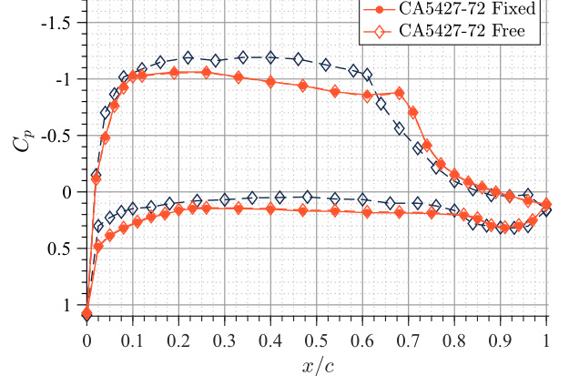

Re, M, and Cl values recorded for each airfoil at their corresponding
operating point of interest were used to generate MSES predictions,
assuming the ncrit  9 design constraint. The resulting pressure
distributions are presented in Fig. 14, all showing remarkable sim-
ilarity to the experimental data. The MSES predictions indicate that
the prescribed experimental Cl and flow operating constraints corre-
spond to angles of attack of 0.867°, 1.346°, and 1.305°, respectively,
for the LRN1015, CA5427-72 fixed transition, and CA5427-72 free
transition airfoil configurations. Similar results can be identified in
the literature, where MSES often correlates Cl operating conditions
to α values that are lower than experimental observations [48,51].
These angle-of-attack differences appear to be case dependent, with
increases in differences observed as the airfoil approaches stall.
When looking at the pressure distributions in Fig. 14 more closely,
the predictions for the LRN1015 in Fig. 14a and CA5427-72 with
fixed transition in Fig. 14b display recovery processes that begin at
the intended design location and coincide with the experimentally
observed recovery distributions. The drag predicted by MSES for
the LRN1015 of Cd  0.00777 is 9.7 counts lower than the exper-
imental value reported in Table 4. Similarly, the CA5427-72 fixed
transition MSES prediction produced a drag coefficient of Cd 
0.00675 which is just 6.3 counts lower than the experimental result.
This disagreement between the experimental and predicted Cd
values at the same Cl condition is not unexpected, as models based
on potential-viscous coupled theory, such as MSES, are commonly
known to underpredict drag [49–54]. Figure 14c, corresponding to
the CA5427-72 free transition case, shows a predicted pressure
recovery that begins downstream of the experimentally observed
location and is preceded by a small region of constant Cp, suggesting
the presence of an LSB. A limited, separated region was confirmed at
this location by a negative Cf;x observed in the simulated result,
which produced a predicted Cd value of 0.00949. The disparity
between the MSES predicted Cd and the experimentally calculated
values in Table 4 for this particular case implies that the slight
disagreement in Cp distributions between MSES and the experiment
results in differences in the natural transition process at the condition
being considered, or that transition is occurring at lower ncrit values
corresponding to higher experimental turbulence intensities. If the
latter is the case, the premature boundary-layer transition at the
design condition might also be a contributor to the inability of
the airfoils to achieve their maximum lift conditions observed in
MSES. This prediction agrees with past observations made at the
experimental facility, in which measured turbulence intensity values
at various Mach numbers corresponded to ncrit values less than 9 [43].
Thus, a natural transition is achieved at the intended design location,
but with a higher FPG than what was initially intended for the airfoil
design.
To explore the impact of the critical amplification factor assumed
for transition modeling, additional MSES analyses were performed
using the CA5427-72 free transition experimental Cl data with
varying ncrit values. Figure 15 shows the Cp distribution for the
MSES prediction corresponding to ncrit  3.05, which achieved an
upper surface transition at x∕c  0.620 matching the design con-
straint and shows better overall agreement with the experiment. The
prediction driven by the experimentally achieved Cl corresponds
to an angle of attack of 1.235° and produces a drag coefficient
of Cd  0.00700, just 2.5 counts higher than the fixed transition
0
0.1
0.2
0.3
0.4
0.5
0.6
0.7
0.8
0.9
1
-2
-1.5
-1
-0.5
0
0.5
1
Exp. Cd = 0.00874
MSES Cd = 0.00777
a) LRN1015
0
0.1
0.2
0.3
0.4
0.5
0.6
0.7
0.8
0.9
1
-2
-1.5
-1
-0.5
0
0.5
1
Exp. Cd = 0.00738
MSES Cd = 0.00675
b) CA5427-72 with fixed transition
0
0.1
0.2
0.3
0.4
0.5
0.6
0.7
0.8
0.9
1
-2
-1.5
-1
-0.5
0
0.5
1
Exp. Cd = 0.00734
MSES Cd = 0.00949
c) CA5427-72 with free transition
Fig. 14
MSES Cp predictions at the measured experimental conditions of each airfoil.
1424
COLLAZO GARCIA AND ANSELL

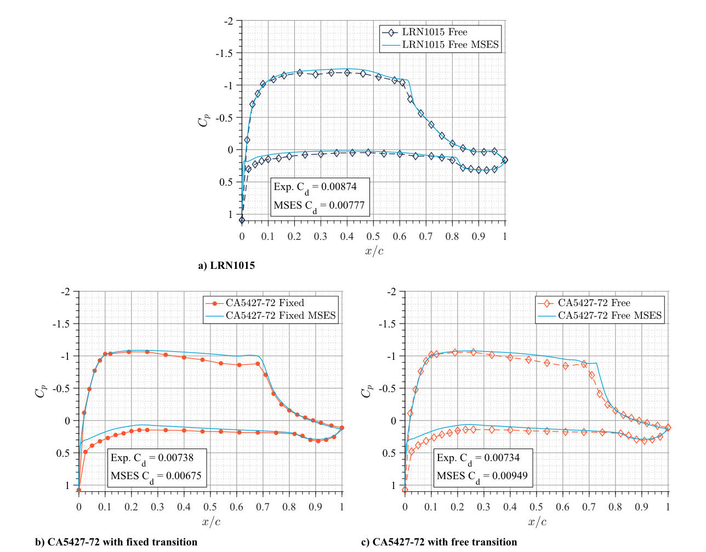

prediction in Fig. 14b. Similarities observed in the data produced by
the pressure distributions in Figs. 14b and 15 imply that the turbu-
lence intensity present in the wind tunnel environment does have a
significant influence on the measured airfoil performance. The ncrit
value of 3.05 corresponds to a turbulence intensity of 0.837%, which
is higher but generally agrees with previously recorded values for the
wind tunnel facility used [43]. This higher turbulence intensity is
attributed to the motor operating speed required to produce the
desired Mach number, which coincided with the switching boundary
of the variable frequency drive and incurred in greater-than-normal
velocity variations.
2.
Aerodynamic Performance
Ventilated walls used in transonic wind tunnels generally have
large interference influences on the effective angle of attack, to
the extent that their experimental value is usually disregarded
and the section normal force coefficient is emphasized [55]. There-
fore, the experimental performance discussion for the LRN1015
and CA5427-72 airfoils is based on the aerodynamic polars pre-
sented in Fig. 16. Due to the inherent limitations associated with the
porous test section, the Cl operating range achieved experimentally
was also reduced relative to the MSES predictions in Fig. 10b. In
particular, the low-drag bucket achieved for the optimized airfoil
was limited to a Cl range between 0.7935 and 0.9450. Nevertheless,
the experimental polar characteristics in Fig. 16 produced by the
three airfoils considered closely follow the outlined behaviors that
were expected from the predictions in Sec. IV.B.
Both fixed- and free-transition configurations of the CA5427-72
displayed drag reductions of 15.56 and 16.01% over the LRN1015,
respectively, at the intended design conditions. Similarly, L∕D
improvements of 20.91% for the fixed transition case and 20.05%
for the free transition case were calculated. The measurable drag
benefit obtained, which outperforms the MSES prediction, agrees
with the same improvement trends that were outlined for this Re and
M design condition during the airfoil development in Sec. IV.B.
Additionally, the similarity in the data produced by the fixed- and
free-transition configurations at this operating condition provides an
indication of a natural boundary-layer transition occurring at or very
near the design location.
Immediately above the design angle of attack, an abrupt drag
rise is observed for the CA5427-72 airfoil when compared to the
LRN1015. In agreement with the discussion in Sec. IV.B., this
observation results from the imminent separation characteristics of
Stratford-type recoveries previously described. Experimental data
across this higher angle-of-attack region do not reveal a significant
difference between the fixed- and free-transition cases. This charac-
teristic is expected since the transition on the lower surface is fixed
and more aggressive APGs across the upper surface result in up-
stream movement of the transition location from its design point.
Therefore, the array of vinyl dots downstream of the transition
location has no significant influence on an already turbulent boun-
dary layer.
At the lower angles of attack, the fixed transition cases do display
better drag performance across a wide Cl range, as expected from the
predictions in Sec. IV.B. However, the free transition case does not
immediately show a drag increase after the angle of attack is reduced
from its design condition, as observed in Fig. 10b. This property is
indicative of an inconsistency between the experimental observations
and the ability of MSES predictions to effectively capture off-design
transitional behavior and LSB development. Nevertheless, the Cd
differences between the fixed and free transition cases that show
improvement are in agreement with the MSES polar in Fig. 10b.
# VI. Conclusions
A new airfoil design methodology has been successfully intro-
duced in which the boundary-layer physics were considered to
optimize pressure distributions based on target constraints. Extension
of the Squire–Young theory allowed the design framework to be used
in identifying the pressure distribution corresponding to the mini-
mum drag condition for the assumed pressure distribution. The
proposed design theory has been verified through the development
of several airfoil geometries considering HALE aircraft operating
conditions as well as different target boundary-layer performance
constraints. All airfoils showed better performance over the seed
geometry at the design conditions, alluding to the advantages of a
boundary-layer, performance-based design approach. The airfoils
optimized to have minimum θTE characteristics displayed the lowest
drag when compared to the other pressure distributions generated
through the same parameterization, suggesting a viable approach
to the minimum drag solution for an airfoil based on boundary-
layer theory. Other boundary-layer constraints revealed important
implications when considering tradeoffs in drag minimization and
off-design performance. For instance, the δ
TE design example still
produced a notable drag reduction over the seed geometry and
displayed less aggressive stall characteristics than the θTE case at
the same operating conditions. This behavior resulted from the ability
of a less aggressive recovery to accommodate stronger off-design
pressure gradients. Based on these observations, it is also expected
that a minimum shape factor constraint could be useful in achieving
robust separation airfoils.
The experimental assessment of an optimized airfoil developed
under this design framework indicated a 20.91% increase in L∕Dmax
relative to the reference LRN1015 airfoil for a representative HALE
aircraft application. This improved aerodynamic performance, as
well as the observed pressure distribution design characteristics,
0
0.1
0.2
0.3
0.4
0.5
0.6
0.7
0.8
0.9
1
-2
-1.5
-1
-0.5
0
0.5
1
Exp. Cd = 0.00734
MSES Cd = 0.00700
Fig. 15
MSES Cp prediction for the CA5427-72 free transition case with
ncrit  3.05.
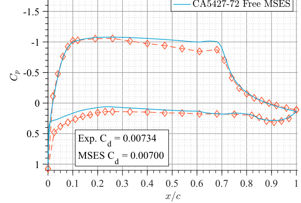
0
0.01
0.02
0.03
0.04
-0.5
0
0.5
1
1.5
2
Fig. 16
Experimental aerodynamic polar curves for the CA5427-72 and
LRN1015 airfoils.

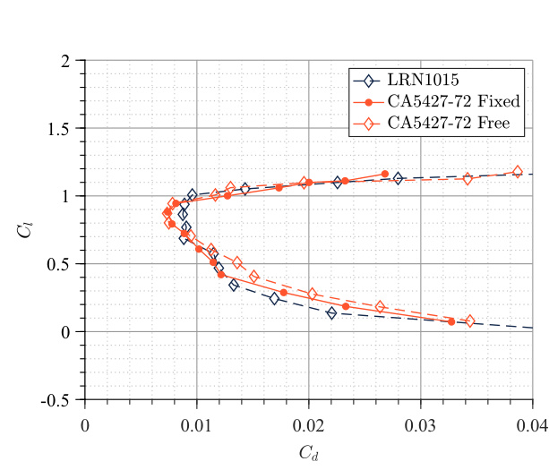

served to satisfactorily validate the design methodology. The perfor-
mance differences between both geometries agreed with the MSES
predictions but were found to be slightly higher, which was attributed
to known characteristics of the flow solver. Fixed transition devices
were observed to have an inconsequential influence on the design
operating conditions. At off-design conditions, trends in the airfoil
performance agreed with the MSES predictions made throughout
the airfoil development process for both fixed- and free-transition
cases. Discrepancies observed between the MSES predictions for
the CA5427-72 fixed- and free-transition cases were attributed
to differences in the natural transition location produced due to
the likely presence of higher turbulent intensities in the testing
environment.
While several optimized airfoils have been developed, the funda-
mental contribution of this study is intended to be the design ideology
itself, in which a pressure distribution is intentionally configured
to achieve desired boundary-layer characteristics that ultimately gov-
ern the drag produced by an airfoil. Through this approach, the
boundary-layer integral parameters drive the inverse design process
in lieu of the pressure distribution, which is iteratively modified until a
desired performance is obtained. Furthermore, the methodology that
has been introduced provides an increased physical understanding
regarding the main performance drivers in an airfoil inverse design
process that would otherwise be explicitly unknown in more con-
ventional methods. It is also recognized that airfoil design involves
the consideration of multiple operating conditions. Thus, the pro-
posed framework should also be expanded to account for multipoint
design applications where cost functions involving weighted inte-
gral boundary-layer parameter data across a range of conditions are
considered. Additionally, the methodology should be assessed with
common geometrical constraints (i.e., thickness and leading-edge
radius) applied to airfoil designs that could limit the performance
gains that were discussed. A more elaborate parametric variation of
the pressure distribution should also be considered, in which functions
can be introduced across different segments. This would allow to find
optimum solutions independently across different regions and address
off-design limitationsthrough the intentionaldesignoffeatures suchas
transition ramps. Lastly, further consideration should be given to the
natural transition location and its influence on optimal solutions and
off-design performance.
# References
[1] Lighthill, M. J., “A New Method of Two-Dimensional Aerodynamic
Design,” Aeronautical Research Council, R&M 2112, 1945.
[2] Nakayama, Y., Introduction to Fluid Mechanics, 2nd ed., Butterworth–
Heinemann, Cambridge, MA, 2018, Chap. 12.
[3] Eppler, R., andSomers,D. M., “AComputerProgram for the Designand
Analysis of Low-Speed Airfoils,” NASA TM-80210, 1980, Chap. 3.
[4] Eppler, R., Airfoil Design and Data, Springer–Verlag, Berlin, 1990.
[5] Selig, M. S., and Maughmer, M. D., “Multipoint Inverse Airfoil Design
Method Based on Conformal Mapping,” AIAA Journal, Vol. 30, No. 5,
1992, pp. 1162–1170.
https://doi.org/10.2514/3.11046
[6] Selig, M. S., and Maughmer, M. D., “Generalized Multipoint Inverse
Airfoil Design,” AIAA Journal, Vol. 30, No. 11, 1992, pp. 2618–2625.
https://doi.org/10.2514/3.11276
[7] Volpe, G., “Inverse Airfoil Design: A Classical Approach Updated
for Transonic Applications,” Applied Computational Aerodynamics,
Vol. 125, AIAA, Washington, D.C., 1990, pp. 191–220.
[8] Giles, M. B., and Drela, M., “Two-Dimensional Transonic Aerody-
namic Design Method,” AIAA Journal, Vol. 25, No. 9, 1987,
pp. 1199–1206.
https://doi.org/10.2514/3.9768
[9] Drela, M., and Giles, M. B., “Viscous-Inviscid Analysis of Transonic
and Low Reynolds Number Airfoils,” AIAA Journal, Vol. 25, No. 10,
1987, pp. 1347–1355.
https://doi.org/10.2514/3.9789
[10] Henderson, M. L., “Inverse Boundary-Layer Technique for Airfoil
Designs,” NASA TR-N79-20054, 1973.
[11] Liebeck, R. H., and Ormsbee, A. I., “Optimization of Airfoils for
Maximum Lift,” Journal of Aircraft, Vol. 7, No. 5, 1970, pp. 409–416.
https://doi.org/10.2514/3.44192
[12] Liebeck, R. H., “Optimization of Airfoils for Maximum Lift,”
Ph.D. Dissertation, Dept. of Aeronautical and Astronautical Engi-
neering, Univ. of Illinois at Urbana-Champaign, Champaign, IL,
1968.
[13] Stratford, B. S., “The Prediction of Separation of the Turbulent Boun-
dary Layer,” Journal of Fluid Mechanics, Vol. 5, No. 1, 1959, pp. 1–16.
https://doi.org/10.1017/S0022112059000015
[14] Stratford, B. S., “An Experimental Flow with Zero Skin Friction
Throughout Its Region of Pressure Rise,” Journal of Fluid Mechanics,
Vol. 5, No. 1, 1959, pp. 17–35.
https://doi.org/10.1017/S0022112059000027
[15] Schlichting, H., Boundary-Layer Theory, 7th ed., McGraw–Hill,
New York, 1979, Chap. 15.
[16] Coder, J. G., and Maughmer, M. D., “Numerical Validation of the
Squire-Young Formula for Profile-Drag Prediction,” Journal of Air-
craft, Vol. 52, No. 3, 2015, pp. 948–955.
https://doi.org/10.2514/1.C033021
[17] Coder, J. G., and Maughmer, M. D., “Comparisons of Theoretical
Methods for Predicting Airfoil Aerodynamic Characteristics,” Journal
of Aircraft, Vol. 51, No. 1, 2014, pp. 183–191.
https://doi.org/10.2514/1.C032232
[18] Selig, M. S., and Maughmer, M. D., “Generalized Multipoint Inverse
Airfoil Design,” AIAA Journal, Vol. 30, No. 11, 1992, pp. 2618–2625.
https://doi.org/10.2514/3.11276
[19] Drela, M., “XFOIL: An Analysis and Design System for Low Reynolds
Number Airfoils,” Low Reynolds Number Aerodynamics, Lecture Notes
in Engineering, Vol. 54, Springer–Verlag, Berlin, 1989.
[20] Squire, H. B., and Young, A. D., “The Calculation of the Profile
Drag of Aerofoils,” Aeronautical Research Committee, R&M No.
1838, 1938.
[21] Swafford, T. W., “Analytical Approximation of Two-Dimensional Sep-
arated Turbulent Boundary-Layer Velocity Profiles,” AIAA Journal,
Vol. 21, No. 6, 1983, pp. 923–926.
https://doi.org/10.2514/3.8177
[22] Drela, M., “Transonic Low-Reynolds Number Airfoils,” Journal of
Aircraft, Vol. 29, No. 6, 1992, pp. 1106–1113.
https://doi.org/10.2514/3.46292
[23] Drela, M., “Two-Dimensional Transonic Aerodynamic Design and
Analysis Using the Euler Equations,” Ph.D. Dissertation, Dept. of
Aeronautics and Astronautics, Massachusetts Inst. of Technology,
Cambridge, MA, 1985.
[24] Smith, L., Meyer, J. P., Oxtoby, O. F., and Malan, A. G., “An Interactive
Boundary Layer Modeling Methodology for Aerodynamic Flows,”
IMECE2011-62075, 2011.
[25] “fmincon,” The MathWorks Inc., 2024, https://www.mathworks.com/
help/optim/ug/fmincon.html#busp5fq-7.
[26] Viken, J. K., “Boundary-Layer Stability and Airfoil Design,” NASA
TR-N88-23738, 1986.
[27] Viken, J. K., Viken,S. A., Pfenninger, W., Morgan, H. L., and Campbell,
R. L., “Design of the Low-Speed NLF(1)-0414F and the High-Speed
HSNLF(1)-0213 Airfoils with High-Lift Systems,” NASA TR-N90-
12540, 1987.
[28] Viken, J., and Wagner, R. D., “Design Limits of Compressible NLF
Airfoils,” AIAA Paper 1991-0067, 1991.
[29] Collazo Garcia, A. R., III., and , and Ansell, P. J., “Design of Control-
Assisted Transonic Pressure Recovery Profiles Using Vortex Genera-
tors,” AIAA Journal, Vol. 60, No. 4, 2022, pp. 2207–2222.
https://doi.org/10.2514/1.J060875
[30] Fritsch, F. N., and Carlson, R. E., “Monotone Piecewise Cubic Inter-
polation,” SIAM Journal on Numerical Analysis, Vol. 17, No. 2, 1980,
pp. 238–246.
https://doi.org/10.1137/0717021
[31] Olson, E. D., “Robust Conceptual Design of Transonic Airfoils,” AIAA
Paper 2020-0269, 2020.
https://doi.org/10.2514/6.2020-0269
[32] Maughmer, M. D., and Somers, D. M., “Design and Experimental
Results for a High-Altitude, Long-Endurance Airfoil,” Journal of Air-
craft, Vol. 26, No. 2, 1989, pp. 148–153.
https://doi.org/10.2514/3.45736
[33] Morrisey, B., and McDonald, R., “Multidisciplinary Design Optimiza-
tion for an Extreme Aspect Ratio HALE UAV,” AIAA Paper 2009-6949,
2009.
https://doi.org/10.2514/6.2009-6949
[34] Biber, K., and Tilmann, C. P., “Supercritical Airfoil Design for Future
HALE Concepts,” AIAA Paper 2003-1095, 2003.
https://doi.org/10.2514/6.2003-1095
[35] Cera, D. F., and Katz, J., “Design and Evaluation of a High-Lift, Thick
Airfoil for UAVApplications,” AIAA Paper 2008-0292, 2008.
https://doi.org/10.2514/6.2008-292
1426
COLLAZO GARCIA AND ANSELL

[36] Phillips, W. H., “Some Design Considerations for Solar-Powered Air-
craft,” NASA TP-1675, 1980.
[37] Johnson, F. P., “Sensor Craft, ‘Tomorrow’s Eyes and Ears of the
Warfighter’,” AIAA Paper 2001-4370, 2001.
https://doi.org/10.2514/6.2001-4370
[38] Collazo Garcia, A. R., III, “Airfoil Design Framework for Optimized
Boundary-Layer Integral Parameters,” Ph.D. Dissertation, Dept. of Aero-
space Engineering, Univ. of Illinois Urbana-Champaign, Champaign, IL,
2022.
[39] Jane’s All The World’s Aircraft: Unmanned,IHS Global,2021, pp. 366–
372.
[40] Collazo Garcia, A. R., III, and Ansell, P. J., “Design of Laminar-Flow
Airfoils Based on Boundary-Layer Integral Parameters,” AIAA Paper
2023-2608, 2023.
https://doi.org/10.2514/6.2023-2608
[41] Liebeck, R. H., “Design of Subsonic Airfoils for High Lift,” Journal of
Aircraft, Vol. 15, No. 9, 1978, pp. 547–561.
https://doi.org/10.2514/3.58406
[42] Liebeck, R. H., “Wind Tunnel Tests of Two Airfoils Designed for High
Lift Without Separation in Incompressible Flow,” Douglas Aircraft Co.,
Report MDC J5667/01 (Restricted Distribution), 1972.
[43] Collazo Garcia, A. R., III, and Ansell, P. J., “Development and Vali-
dation of a Continuous, Open-Return Transonic Wind Tunnel,” AIAA
Paper 2019-2858, 2019.
https://doi.org/10.2514/6.2019-2858
[44] Pankhurst, R. C., and Holder, D. W., Wind-Tunnel Technique: An
Account of Experimental Methods in Low- and High-Speed Wind Tun-
nels, Sir Isaac Pitma & Sons, London, 1952.
[45] Kline, S. J., and McClintock, F. A., “Describing Uncertainties in Single
Sample Experiments,” Mechanical Engineering, Vol. 75, No. 1, 1953,
pp. 3–8.
[46] Coleman, H. W., and Steele, W. G., Experimentation and Uncertainty
Analysis for Engineers, 3rd ed., Wiley, Hoboken, NJ, 2009, pp. 40–118.
[47] Coder, J. G., and Maughmer, M. D., “Comparisons of Theoretical
Methods for Predicting Airfoil Aerodynamic Characteristics,” Journal
of Aircraft, Vol. 51, No. 1, 2014, pp. 183–191.
https://doi.org/10.2514/1.C032232
[48] Maughmer, M. D., and Coder, J. G., “Comparisons of Theoretical
Methods for Predicting Airfoil Aerodynamic Characteristics,” RDE-
COM TR 10-D-106, U.S. Army Research, Development and Engineer-
ing Command, 2010.
[49] Somers, D. M., and Maughmer, M. D., “Design and Experimental
Results for the S406 Airfoil,” RDECOM TR 10-D-107, U.S. Army
Research, Development and Engineering Command, 2010.
[50] Somers, D. M., and Maughmer, M. D., “Design and Experimental
Results for the S411 Airfoil,” RDECOM TR 10-D-111, U.S. Army
Research, Development and Engineering Command, 2010.
[51] Lim, J. W., McAlister, K. W., and Johnson, W., “Hover Performance
Correlation for Full-Scale and Model-Scale Coaxial Rotors,” Journal
of the American Helicopter Society, Vol. 54, No. 3, 2009, Paper
32005.
https://doi.org/10.4050/JAHS.54.032005
[52] Peerlings, B., “A Review of Aerodynamic Flow Models, Solution
Methods and Solvers—And Their Applicability to Aircraft Conceptual
Design,” MS Thesis, Delft Univ. of Technology, Delft, The Netherlands,
2018.
[53] Fujino, M., Yoshizaki, Y., and Kawamura, Y., “Natural-Laminar-Flow
Airfoil Development for a Lightweight Business Jet,” Journal of Air-
craft, Vol. 40, No. 4, 2003, pp. 609–615.
https://doi.org/10.2514/2.3145
[54] Ramanujam, G., Özdemir, H., and Hoeijmakers, H. W. M., “Improving
Airfoil Drag Prediction,” Journal of Aircraft, Vol. 53, No. 6, 2016,
pp. 1844–1852.
https://doi.org/10.2514/1.C033788
[55] Blackwell, J. A., Jr., “Experimental Testing at Transonic Speeds,”
Transonic Aerodynamics, Progress in Astronautics and Aeronautics,
Vol. 81, AIAA, New York, 1982.
R. M. Cummings
Associate Editor
