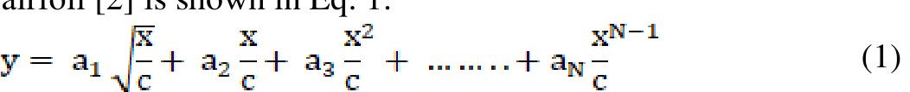
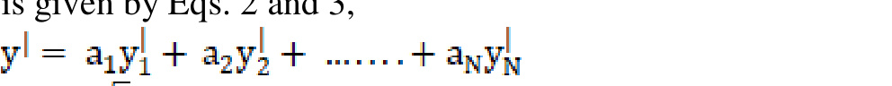
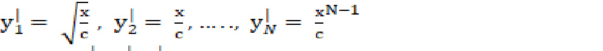
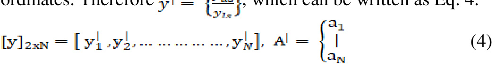
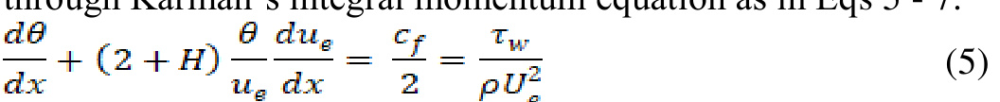
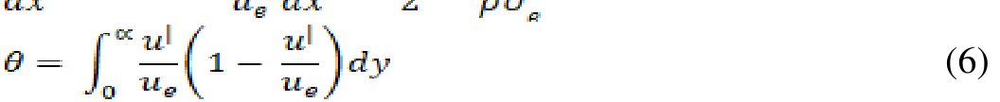
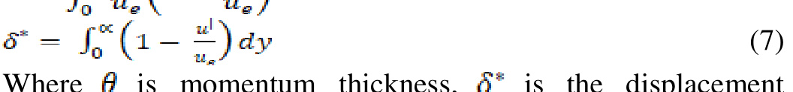
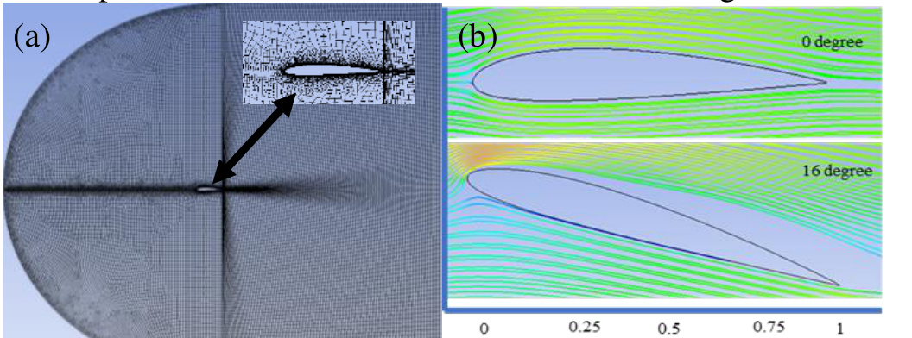
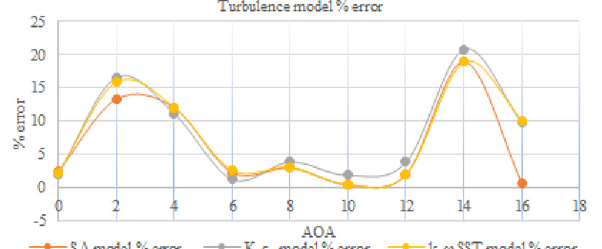
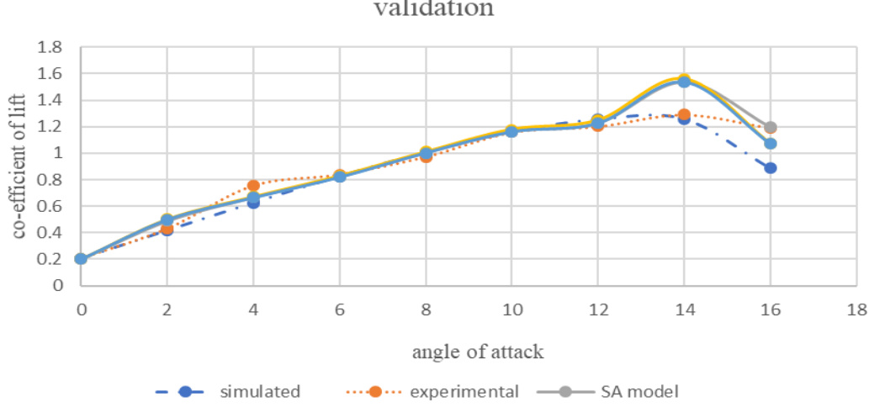

# CFD Validation of NACA 2412 Airfoil

Samuel Merryisha  
School of Aerospace Engineering  
Universiti Sains Malaysia  
Nibong Tebal, Malaysia  
merryishagracia@gmail.com

Parvathy Rajendran  
School of Aerospace Engineering  
Universiti Sains Malaysia  
Nibong Tebal, Malaysia  
aeparvathy@usm.my

## Abstract

The NACA 2412 cambered airfoil experimental model of has been analyzed and validated to determine the impact of aerodynamic performance at lower Reynolds number and constant velocity. Validation has been carried out with steady state flow around NACA 2412 airfoil with 230 mm chord length at 30m/s from 0° to 16° angle of attack (AOA) using commercially available CFD software. The main aim of this study is to understand the flow behavior around the airfoil in the flow separation region (or) stalling region solved under Navier Stroke equation. The aerodynamic efficiency depends on the linearity of the shape and dimension of the object piercing through air. C- type topology intended with 70,000 – 80,000 cells in un-structured manner, emerged with non-slip far-field is employed. Fine grid reinforcement is given to the airfoil walls and surrounding areas in-order to enclose boundary layer approach.

**Keywords—** aerodynamic performance, airfoil, flow behavior, lower Reynolds number, validation

## I. INTRODUCTION

Boundary layer flow separation control is one of the predominant techniques for achieving better L/D at higher AOA for low speed and low Reynolds number driven aircraft. Flow over airfoil at transition region from laminar to turbulent plays the vital role in determining the airfoil performance at certain AOA and velocity. The efficiency of CFD simulation are hindered by the turbulence factor. Thus, turbulence modelling was developed to determine the primary focus. The main classes of turbulence simulations are 1) Reynolds Average Navier Strokes (RANS), 2) Large Eddy Simulations (LED), 3) Detached Eddy simulations (DES).

In this study RANS turbulence model has been chosen to determine time-average fluid flow to determine Reynolds stresses. The steady state governing equation is solved by coupling with any one of the following RANS turbulence model 1) Spalart-Allmaras, 2) K–ε Realizable, and 3) K–ω SST model, aiming to show comparison to the free field experimental measurements for NACA 2412 airfoil. Proper onset and extent of transition modelling will improve the aerodynamic performance accuracy [1]. The most common and feasible methods of determining the upper and lower co-ordinates of the airfoil [2] is shown in Eq. 1.

This is the simple algebraic sum where a₁, a₂, a₃, aN are treated as design variables but the curve defined at J chordwise location is determined by the vector of y-co-ordinates, yˡ of airfoil shape is given by Eqs. 2 and 3,

where yˡ₁, yˡ₂,..., yˡN are constant upper and lower airfoil co-ordinates. Therefore yˡ = (y₁, y₂,..., yN)ᵀ, which can be written as Eq. 4.

The flow separation of the airfoil is indulged at higher AOA, creating a huge wake and drop in aerodynamic performance [3]. According to NASA experimental report on NACA 2412 airfoil [4], the flow separation moves aft of the airfoil, as the AOA increases, where at 12.4° AOA the flow separates at 0.92C, followed up for 14.4° AOA at 0.80C and for 16.4° AOA at 0.40C. further increasing the angle, the stalling point is attained. The reattachment of the flow is possible through region of reverse flow that lies between 0.05C to 0.2C at lower angle of attack.

## II. METHODOLOGY

The theoretical methods of flow separation can be predicted through Karman’s integral momentum equation as in Eqs 5 - 7.

Where θ is momentum thickness, δ* is the displacement thickness, and H is momentum shape that equals to δ*/θ.

The aerodynamic performance of individual RANS model has been investigated and validated in conjunction with the performance outcome of Matsson [5] on NACA 2412 airfoil.

## III. MODELLING AND SIMULATION SETTINGS

### A. Computational domain

The domain is modelled based on the number of reference frame. As in the case of 2D airfoil, C-type 2 frame domain with aft and forward far field enclosure is designed around the airfoil with dimension of 10C. Both structural [8] and unstructured [9] meshing has been incorporated in order to eliminate the skewness on the wall nearer to the model. The domain is then projected into 4 divisions in order to study the flow behavior over the airfoil.

Fine and smooth tetrahedral mesh is given to the complete domain topology where the surface is face meshed separately. In order to study the boundary layer separation the airfoil wall is meshed separately with very fine refinement [9] by dividing the airfoil surface into 320 divisions. The walls are assumed to have non-slip condition. The meshed view is shown in Fig. 1a.

Fig. 1. a) C- Topology fine mesh and no slip far field view  
b) Flow separation behavior.

### B. Boundary conditions

Turbulence were maintained at 1% to 5% [9] under RANS model coupled with Spalart-Allmaras model. In order to match the validation, result to the experimental data the following boundary conditions are implemented, where the air density is 1.225kg/m³, dynamic viscosity at 1.7894x10⁻⁵ kg/ms, gauge pressure at 0 Pa and operating pressure of 101325 Pa. Followed up with pressure velocity coupled with SIMPLE scheme first order upwind, to generate the reasonable solution and the simulation is generated from inlet. These boundary conditions have been implemented in all the three-turbulence model. The drastic change in flow separation from 0° to 16° AOA is shown in Fig. 1b.

## IV. RESULT AND DISCUSSIONS

### A. Validation of NACA 2412 airfoil

In-order to validate the model, simulations were done on steady state incompressible flow on Reynolds number 4.4 x 10⁵ at various AOA ranging from 0° to 16°. Single turbulence model is used due to the limitation of computational fluctuation in Navier Stroke equation. The Spalart-Allmaras turbulence model showed linear performance to that of the literature experimental result, whereas the K–ε and K–ω models produced inaccurate results as the AOA increases (Fig 2).

Fig. 2. Turbulence models error difference.

### B. Turbulence model comparison

There is a minimal error observed between the article experimental result and validation numerical result, that is mainly due to the high correspondence of wind tunnel outflow disturbance. The validation result of NACA 2412 airfoil for certain AOA to that of the experimental result is compared and shown in Fig. 3. The Spalart-Allmaras model projects out the average minimal error compared to other turbulence model.

Fig. 1 Lift to AOA curves showing the variation between the turbulence models to the experimental model.

It is observed that the stalling point incidence angle increases the mean CL and CD, thereby shows greater performance for numerical validation when compared to experimental results. Performance of the lift shows good and constant hike up till 14° AOA, then falls by 22% creating a stalling point beyond that. From the constant study, result shows increasing the AOA increases the wake and separates the boundary layer far apart towards the aft section.

## V. CONCLUSION

In this study, CFD simulation is used to predict the lift and drag by analyzing 2D external airflow. The validation study was successfully carried out with RANS turbulence model coupled with Spalart-Allmaras model, which represented better physical flow behavior to the experimental work than other models with least error of 6.04%. The maximum error to that of the experimental work is recorded at 14° AOA of 19% due to its numerical stalling point. After attaining the critical AOA (i.e) 14°, the flow over the airfoil get detached before 0.25C resulting in a huge wake formation. The observed validated result on smooth airfoil will be used in the future studies on modified airfoil surface, with an aim to generated better aerodynamic performance at higher AOA by neglecting flow separation bubbles. Future work will be incorporated with the current addressed issues.

## REFERENCES

[1] D. C. Eleni, T. I. Athanasios, and M. P. Dionissios, "Evaluation of the Turbulence Models for the Simulation of the Flow over a National Advisory Committee for Aeronautics (NACA) 0012 Airfoil," *Journal of Mechanical Engineering Research*, vol. 4, no. 3, pp. 100-111, March 2012.

[2] G. N. Vanderplaats and R. M. Hicks, "Numerical Airfoil Optimization Using a Reduced Number of Design Coordinates," NASA, Moffett field, CaliforniaJuly 1976.

[3] B. Rajasai, R. Tej, and S. Srinath, "Aerodynamic Effects of Dimples on Aircraft Wing," in *Intl. Conf. On Advances in Mechanical, Aeronautical and Production Techniques-MAPT*, 2015.

[4] H. Seetharam, E. Rodgers, and W. Wentz Jr, "Experimental Studies of Flow Separation of the NACA 2412 Airfoil at Low Speeds," presented at the ASEE Annual Conference & Exposition, Orleans, June 26 - 29, 1997.

[5] J. E. Matsson, J. A. Voth, C. A. McCain, and C. McGraw, "Aerodynamic Performance of the NACA 2412 Airfoil at Low Reynolds Number," in *2016 ASEE Annual Conference & Exposition*, 2016.

[6] A. S. Al-Obaidi and Z. Pei Soh, "Numerical Analysis of the Shape of Dimple on the Aerodynamic Efficiency of NACA 0012 Airfoil," presented at the International Grand Challenges Engineering Research Conference (6th eureca), Kuala Lumpur, Malaysia, 2016.

[7] M. T. Islam, A. M. Arefin, M. Masud, and M. Mourshed, "The Effect of Reynolds Number on the Performance of a Modified NACA 2412 Airfoil," in *AIP Conference Proceedings*, 2018, vol. 1980, no. 1, p. 040015: AIP Publishing.

[8] L. Manni, T. Nishino, and P.-L. Delafin, "Numerical Study of Airfoil Stall Cells Using a Very Wide Computational Domain," *Computers & Fluids*, vol. 140, pp. 260-269, 30 september 2016.

[9] A. Lopes, "A 2D Software System for Expedite Analysis of CFD Problems in Complex Geometries," *Computer Applications in Engineering Education*, vol. 24, no. 1, pp. 27-38, 2016.
