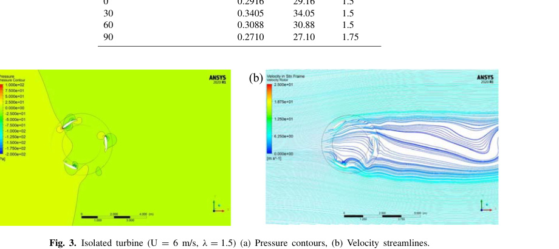
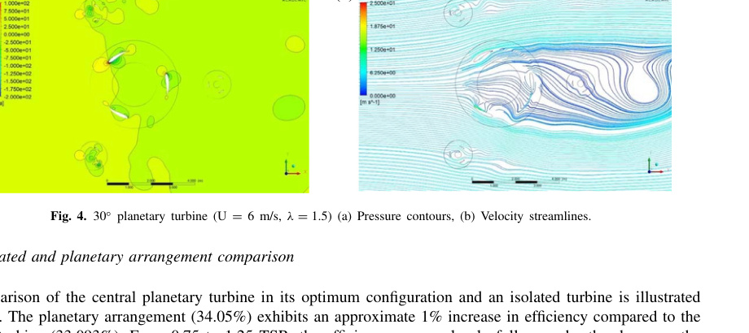
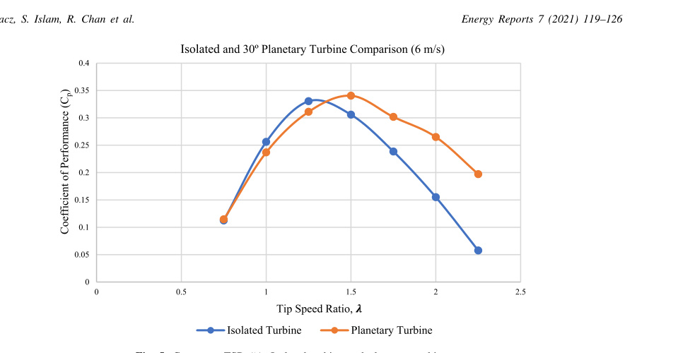
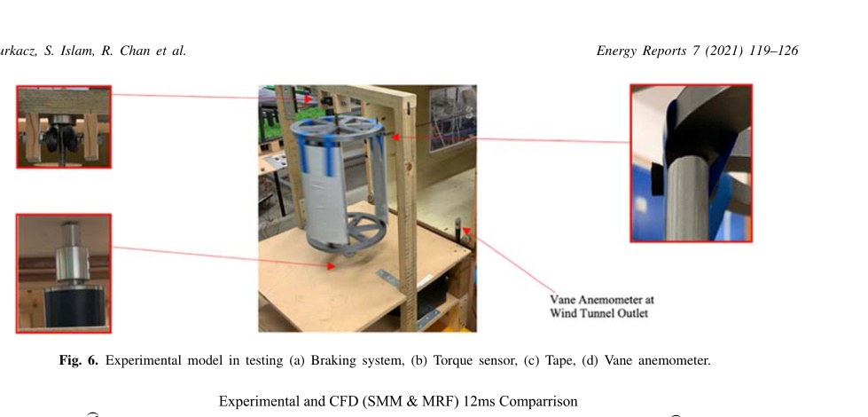

# CFD modelling and prototype testing of a Vertical Axis Wind Turbines in planetary cluster formation

Jack Durkacz, Sheikh Islam, Ryan Chan, Ethan Fong, Hamish Gillies, Aditya Karnik, Thomas Mullan

Robert Gordon University, Garthdee Road, Aberdeen AB10 7JG, United Kingdom

Received 21 May 2021; accepted 9 June 2021

## Abstract

This study aims to improve the applicability of Vertical Axis Wind Turbines (VAWTs) by investigating their feasibility in a novel planetary cluster configuration by observing its effect on efficiency and overall power density. Computational Fluid Dynamics (CFD) simulations were carried out using a two-dimensional vertical axis wind turbine model in ANSYS Fluent 2020 R1. This software was used to solve the transient k-omega (SST) turbulence model. For the isolated VAWT the wind velocity, rotor radius and tip speed ratio were varied to find the optimum turbine performance at a given parameter. A peak efficiency of 34.05% was attained and equivalent configuration used as the “sun” turbine in the novel planetary design. The parametric study of the novel set up was conducted with the PCD (Pitch Circle Diameter) and oblique angular (phi) position of the smaller “planet” turbines being varied in relation to the “sun” turbine. The planetary system was then evaluated in terms of efficiency improvements against the isolated VAWT model. Use of the “planet” turbines resulted in power extraction from the free stream which in turn creates varying wind velocities and improved the efficiency of the central “sun” turbine. The optimal PCD was found to be 5D (3.75 m) and the optimum angular position of the “planets” was discovered at 30 degrees. Ultimately this gave a percentage increase of 1.01% from 33.04% to 34.05% when comparing the “sun” turbine of the planetary arrangement to the optimum isolated respectively. An average improvement of 4% over the range of tip speed ratios (TSR) was found. Lastly, a scale model of the isolated VAWT was constructed and tested through wind tunnel experiments. The characteristic curve correlation was found between the CFD and experimental results which allowed validation of the CFD models.

Keywords: Vertical Axis Wind Turbine (VAWT); Novel planetary turbine cluster; CFD; Wind tunnel

## 1. Introduction

With fossil fuels being one of the main contributors to the destruction of the environment and combined with the finite capacity of oil and gas reserves, the world is looking for a sustainable alternative energy source to help meet the global energy demand [1]. Wind energy has emerged as one of the most viable options in terms of power generation and commerciality, as turbine technology advancements lead to increased performance. The majority of the research has currently been invested into horizontal axis wind turbines (HAWTs) due to the large power output and increased efficiencies when compared against Vertical Axis Wind Turbines (VAWTs). Despite this, VAWTs do have a number of advantages over the HAWT and thus have in recent times become subject to interest as more options for sustainable power generation are required.

The VAWT can be configured in two different set ups, lift turbine (Darrieus) and drag turbine (Savonius) which refer to the aerodynamic force component which generates the driving force. Savonius VAWTs utilize half cylindrical blades attached at either side which generate a drag differential between the convex and concave parts of the blade. However, Darrieus VAWTs utilize typical airfoil shape blades which result in a pressure differential between the airfoil surfaces which in turn generates a lift forces, turning the central shaft and generating power [2].

The main benefit of the VAWT when compared against the HAWT is the omni-directional capabilities allowing it to utilize the winds energy in any wind direction and consequently do not require a yaw and pitch system which add significantly to the cost [2]. One limitation of VAWTs is the lower efficiency due to only a fraction of the blades generating torque during rotation resulting in lower efficiencies but to combat this lower performance the idea of clustering VAWTs has been introduced [3]. VAWTs can interact synergistically when placed in close proximity to each other as the turbines extract power from the free stream which can create areas of varying wind velocity, leading to improved efficiency of the whole farm [4].

Dabiri [5] investigated the use of counter rotating VAWTs to achieve enhanced power density compared to HAWT farms. Field tests indicate that arranging VAWTs in this layout may allow significant improvement of the power density when compared to the current HAWT range of 2 to 3 W/m2. This was found to be due to the VAWTs extracting energy from adjacent wakes and wind flowing above the farm. Further studies from Brownstein, Kinzel and Dabiri [6] were carried out to test the hypothesis that downstream VAWT performance enhancement was the consequence of flow acceleration adjacent to upstream turbine due to bluff body blockage, which provides appropriately positioned downstream turbines with higher freestream velocity. The work positioned a turbine at the inlet of a wind tunnel and positioned a second turbine in various downstream positions. This gave the downstream turbine a 120% peak performance increase compared to the upstream and ultimately displayed that the downstream turbine is impacted positively on the basis that it was not in the direct wake of the upstream.

Computational fluid dynamics (CFD) is the preferred testing method due to in-depth analysis combined with low cost and flexibility. It is especially useful in the initial design stage as it allows configurations to be altered and optimized for performance, this was previously done through physical prototype testing which increased initial costs. CFD simulations are the common approach for testing VAWT cluster arrangements for these reasons and can be validated through experimental testing also.

Zheng, Zheng and Zhao [4] used CFD to study four different rotor arrangements to indicate the wake effect on power production of the set up. The study found that the cluster arrangement significantly impacts each of the turbine’s performances differently with both positive and negative outcomes. The arrangement with one upstream rotor and two parallel downstream rotors enhanced the downstream rotors by 11.3% but negatively impacted the upstream. The configuration with two upstream parallel rotors and one downstream only gave efficiency increases to the downstream due to the accelerated flow. Similarly, Mohammed, Ibrahim and Elbaz [7] found that a three VAWT cluster configuration with two downstream resulted in increased efficiencies for the two downstream rotors and reduced efficiencies for the upstream singular rotor. The paper found that this was a result of blockage caused by the two downstream rotors which reduced the flow rate, resulting in the wake of the upstream rotor not developing fully.

It must also be noted that there are often discrepancies between 2D CFD and experimental results. Franchina [8] states that this is mainly due models’ inability to investigate crucial features such as trailing vortices and related tip losses. Experimental results are also known to have inconsistencies due to recirculating flow, sensor vibration and human error which cause differences between CFD and experimental.

The purpose of this study is to investigate the fluid flow around a planetary VAWT cluster arrangement to analyse the impact of the smaller “planet” turbines on the “sun” turbine efficiency and overall power density. Initially, numerical analysis is completed using CFD to validate the chosen airfoil geometry, then the design is optimized for both the isolated VAWT [9] and novel planetary VAWT designs. A small-scale prototype model was then manufactured and tested though wind tunnel experiments to verify the CFD results of the isolated VAWT configuration.

## 2. Numerical analysis

| Model parameter | Symbol and value | Model parameter | Symbol and value |
| --- | --- | --- | --- |
| Domain Length (m) | L = 45 | Pitch Circle Diameter (m) | PCD = Variable (3.75, 5.25, 7.5) |
| Inlet Length (m) | Li = 15 | Planetary Oblique Angles (degrees) | phi = Variable (0, 30, 60, 90) |
| Outlet Length (m) | Lo = 30 | Inlet velocity (m/s) | U = Variable |
| Domain Width (m) | W = 30 | Angular Velocity (rad/s) | omega = Variable |
| Airfoil NACA Type | NACA 7715 | Solver Type | Pressure-Based |
| Chord Length (m) | c = 1 | Turbulence model | K-Omega SST |
| Airfoil Radius (m) | R = 1.5 | Inlet: turbulence Intensity | 2% |
| Rotor Radius (m) | Rr = 2 | Inlet: Turbulence Length Scale (m) | 3 |
| Core Radius (m); Rotor Height (m) | Rc = 1; H = 1 | Outlet: Backflow Turbulent Intensity | 2.2 |
| Planetary Scale | PS = 0.25 | Outlet: Backflow Turbulent Viscosity Ratio | 0.1 |

Table 1. Model parameters used for rotor numerical CFD simulations.

The CFD simulations performed for this investigation were carried out using two dimensional ANSYS Fluent 2020 R1. Design Modeller was used to model the geometry and mesh for the isolated and cluster VAWT models. Figs. 1 and 2 display the numerical model geometry for the VAWT models and the boundary conditions for these models. Table 1 provides additional model parameter values and settings. The governing equations for the simulation are based on continuity and momentum equations and are solved using the k-omega (SST) turbulence model combined with the sliding mesh motion (SMM) transient modelling technique [10,11]. The accuracy of predictions within a 2D simulation are very grid/mesh sensitive and so an extensive mesh sensitivity analysis was performed to achieve a suitable agreement between computational cost and result accuracy. The numerical investigation included an in-depth validation of an isolated rotor follow by the study of a planetary cluster arrangement.

Fig. 1. (a) Computational domain; (b) Boundary conditions.

Fig. 2. (a) Isolated turbine (b) Planetary arrangement setup.

### 2.1. Isolated rotor and planetary cluster arrangement

Firstly, the isolated rotor model was validated by performing a range of simulations for varying TSR’s. Then the planetary arrangement was made using the same rotor dimensions for the sun turbine of the planetary arrangement to evaluate the effectiveness of the cluster setup.

The lift-based Darrieus-turbine design consisted of three NACA 7715 airfoil blades of 1 m chord length. The design has a rotor diameter of 3 m, and the grid dimensions were chosen appropriately as to allow proper analysis of fluid flow during the turbine’s performance. The distance from the inlet to the rotor was five rotor diameters to allow flow to stabilize before entering the rotor region. The distance from the rotor to the outlet was ten rotor diameters to allow proper formation of the downstream wake. The width of the domain was a total of ten rotor diameters and the symmetry boundary condition setting was applied to minimize the blockage and recirculation effects on the recorded results. To evaluate the turbine performances, report definitions were created to record the torque every time step, these files were then accessed and exported to find the average torque over one rotation for each rotor.

## 3. CFD modelling results and discussion

### 3.1. Planetary arrangement optimization

Three different planetary spacing variations (PCD) were simulated with four oblique angles (phi), all of which had a “Sun” turbine radius (R) of 1.5 m. The peak coefficient of performance values for a PCD of 3.75 m with varying oblique angles (phi) are shown in Table 2. These results are compared against the optimum isolated turbine efficiency of 33.04%. The findings have shown that a planetary set up with oblique angles of 0, 60 degrees and 90 degrees decreases the efficiency of the turbine by 3.88%, 2.96% and 5.97% respectively. Whereas the oblique angle of 30 degrees gave an increase in performance by 1.01%. The tip speed ratio (lambda_CP.MAX) at which the peak efficiency occurred was 1.5 for the planetary with oblique angles of 0 degrees, 30 degrees, 60 degrees and 1.75 for an angle of 90 degrees. The isolated VAWT has a lambda_CP.MAX at TSR of 1.25.

| Angular arrangement, phi (degrees) | CP.MAX | eta (%) | lambda_CP.MAX |
| --- | --- | --- | --- |
| 0 | 0.2916 | 29.16 | 1.5 |
| 30 | 0.3405 | 34.05 | 1.5 |
| 60 | 0.3088 | 30.88 | 1.5 |
| 90 | 0.2710 | 27.10 | 1.75 |

Table 2. Maximum coefficient of performance for varying angular arrangements for 5 diameters C2C distance, U = 6 m/s.

Fig. 3. Isolated turbine (U = 6 m/s, lambda = 1.5) (a) Pressure contours, (b) Velocity streamlines.

It is apparent that an improvement in performance was not witnessed at all arrangements, a range of results are shown in Table 3, this is due to the aerodynamic influence that the planetary rotors have on the sun rotors. The isolated turbine results were used for a comparison and are displayed in Fig. 3 below. The 90 degrees arrangement gives the lowest peak efficiency due to the position of the upstream planetary turbine being located directly upstream of the sun. This situates the sun turbine directly within downstream wake formation of the first planetary rotor which greatly reduces the suns performance. Thereafter the 0 degrees and 60 degrees arrangements also experience reduced peak performance when compared against isolated results. These two arrangements are similar in setup but are mirrored around the x-axis. These arrangements appear to impact the pressure field on the upper side of the closest blade which disrupts the pressure gradient. Therefor due to this pressure distribution alteration around the blades the induced lift force is reduced.

The highlight of this study was the 30 degrees arrangement which achieved an increased peak performance of 34.05% which is 3.48% higher than its isolated counterpart. This arrangement consists of two equally spaced upstream planetary rotors accompanied by a downstream planetary rotor which is situated directly in the wake of the sun. Due the location of the downstream planetary rotor it is obsolete in this setup. However as shown in Fig. 4, the two upstream rotors have a positive impact, by increasing the pressure on the upper side of the top blade therefor increasing the pressure gradient which is desirable for generation of lift force. Meanwhile the second upstream planetary rotor appears to stabilize the pressure around the blade allowing it to rotate with ease around the rest of its rotation. This allows for improved performance of the sun turbine.

Fig. 4. 30 degrees planetary turbine (U = 6 m/s, lambda = 1.5) (a) Pressure contours, (b) Velocity streamlines.

### 3.2. Isolated and planetary arrangement comparison

| TSR, lambda | Isolated, CP | Planetary 30 degrees, CP | CP difference |
| --- | --- | --- | --- |
| 0.75 | 0.1125 | 0.1146 | 0.0021 |
| 1 | 0.2562 | 0.2363 | -0.0199 |
| 1.25 | 0.3304 | 0.3111 | -0.0198 |
| 1.5 | 0.3057 | 0.3405 | 0.0348 |
| 1.75 | 0.2385 | 0.3018 | 0.0633 |
| 2 | 0.15498 | 0.2649 | 0.10992 |
| 2.25 | 0.0576 | 0.1976 | 0.14 |

Table 3. Coefficient of performance for varying TSR for 5 diameters C2C distance, U = 6 m/s.

Comparison of the central planetary turbine in its optimum configuration and an isolated turbine is illustrated in Fig. 5. The planetary arrangement (34.05%) exhibits an approximate 1% increase in efficiency compared to the isolated turbine (33.093%). From 0.75 to 1.25 TSR, the efficiency curves closely follow each other however the planetary turbine exhibits a peak at 1.5 TSR whist the isolated peaks at 1.25. At a TSR greater than 1.35 the planetary turbine can produce higher efficiencies which suggests that the surrounding turbines are able to benefit the central turbine. A peak efficiency increase of 14.02% is seen at a TSR of 2. Much of the key characteristics of the pressure contours are preserved from the isolated turbine to the planetary arrangement (Figs. 3a and 4a respectively). Notable differences are especially prominent on the returning blade of the planetary turbine highlighted by higher pressure behind the trailing edge and the absence of a low-pressure gradient on the inside edge of the blade. The blade approaching the oncoming airstream experiences a larger region of high pressure at its leading edge which may be due to the convergence of the airstream between the central turbine and the planet turbine above it. Observations of the isolated and planetary streamlines show that flow behind the sun turbine is more unstable and turbulent which is highlighted by a large vortex adjacent to the planet turbine (Fig. 4b). General downstream flow disturbance from the front two planet turbines is minimal.

Fig. 5. Cp versus TSR (lambda): Isolated turbine and planetary turbine.

## 4. Isolated VAWT experimental testing

### 4.1. Experimental setup and design

To validate numerical CFD predictions for an isolated VAWT, the use of an experimental setup was developed and tested using a wind tunnel in laboratory settings. The three-bladed Darrieus VAWT design can be seen in Fig. 6 and detailed dimensions and specifications shown Table 4. The turbine experimental setup incorporated a Datum Electronics M425 Rotary Torque Sensor, shown in Fig. 6, through which torque (T), power (Ps) and angular velocity (omega) could be monitored and recorded. Windspeed was measured using a vane anemometer at five points across the outlet area and averaged to give a wind tunnel velocity (Uave). Using the recorded parameters, wind power (Pw), coefficient of power (Cp) and subsequently efficiency (eta) were calculated.

| Parameter | Symbol and value | Parameter | Symbol and value |
| --- | --- | --- | --- |
| Airfoil Type | NACA 7715 | Blade Length (mm) | L = 260 |
| Chord Length (mm) | c = 100 | Rotor Diameter (mm) | D = 200 |
| Number of Blades | N = 3 | Wind Tunnel Outlet Area (mm) | 460 x 460 |

Table 4. Experimental VAWT Model Parameters and Dimensions.

### 4.2. Experimental testing results and discussion

A comparison of the experimental results was also made with those from SMM & Moving Reference Frame (MRF) CFD models with matching dimensions at 12 ms-1, displayed in Fig. 7. Experimental data points were produced by averaging the output power at each RPM which occurred at least five times over a two-minute period recorded by the torque sensor. The results showed that while underpredicting, the efficiency the CFD results also had an increasing efficiency with TSR that did not reach a peak within the given range, clarifying why a ‘traditional’ power curve was not exhibited by the experimental data.

Fig. 6. Experimental model in testing (a) Braking system, (b) Torque sensor, (c) Tape, (d) Vane anemometer.

Fig. 7. Cp versus TSR (lambda): Experimental turbine and CFD.

## 5. Future work

Ongoing study into the design of the planetary turbine cluster is being conducted by the authors including the use of drag turbines for the planetary turbines to investigate the increased wake effect on the sun turbine. Further parametric studies include the investigation of increased outer turbine sizes to increase the overall power density of the setup. An experimental model of the planetary cluster is also being designed to further validate the work conducted. An artificial neural network model is also being investigated to rapidly reduce the time between simulation to results. Finally, suggestions on further work include the implementation of the planetary cluster in a farm setting to investigate the commercial viability of the design.

## 6. Conclusion

The novel planetary turbine was successfully modelled and simulated on ANSYS 2020 R1 to solve the SST k-omega turbulence model and Navier-Stokes equations. The study found an optimal parameter configuration of 30 degrees, 5 diameter spacings at 6m/s inlet velocity giving a peak efficiency of approximately 34%. The upstream turbines were found to work synergistically with the sun turbine by increasing the pressure gradient and stabilizing the pressure field as the blades rotate providing a 1% improvement in peak efficiency. Experimental analysis was conducted to validate the simulations of the isolated turbine. A good agreement in trends was observed between the CFD predicted results and experimental analyses carried out.

## References

1. Hand B, Kelly G, Cashman A. Aerodynamic design and performance parameters of a lift-type vertical axis wind turbine: A comprehensive review. Renew Sustain Energy Rev 2021;139(2021):110699.
2. Möllerström E, et al. A historical review of vertical axis wind turbines rate 100kW and above. Renew Sustain Energy Rev 2019;105(1):1–13.
3. Barnes A, Hughes B. Determining the impact of VAWT farm configurations on power output. Renew Energy 2019;143(1):1111–20.
4. Zheng HD, Zheng XY, Zhao SX. Arrangement of clustered straight-bladed wind turbines. Energy 2020;200(2020):117563.
5. Dabiri JO. Potential order-of-magnitude enhancement of wind farm power density via counter-rotating vertical-axis wind turbine arrays. J Renew Sustain Energy 2010;3(4):1–24.
6. Brownstein ID, Kinzel M, Dabiri JO. Performance enhancement of downstream vertical-axis wind turbines. J Renew Sustain Energy 2016;8(1):1–18.
7. Mohamed OS, Ibrahim A, Elbaz AM. CFD Investigation of the multiple rotors darrieus type turbine performance. In: Branchini L, et al., editors. Turbo expo: Power for land, sea, and air. Pheonix, AZ: ASME; 2019.
8. Manshadi MD. The importance of turbulence reduction in assessment of wind tunnel flow quality. In: Lerner JC, Boldes U, editors. Wind tunnels and experimental fluid dynamics research. London: IntechOpen; 2011.
9. Stout C, et al. Efficiency improvement of vertical axis wind turbines with an upstream deflector. Energy Procedia 2017;118(2017):141–8.
10. Rezaeiha A, Montazeri H, Blocken B. On the accuracy of turbulence models for CFD simulations of vertical axis wind turbines. Energy 2019;180(Aug):838–57.
11. Könözsy L. The k-omega shear-stress transport (SST) turbulence model. In: A new hypothesis on the anisotropic Reynolds stress tensor for turbulent flows. Cham: Springer; 2019, p. 57–66.
