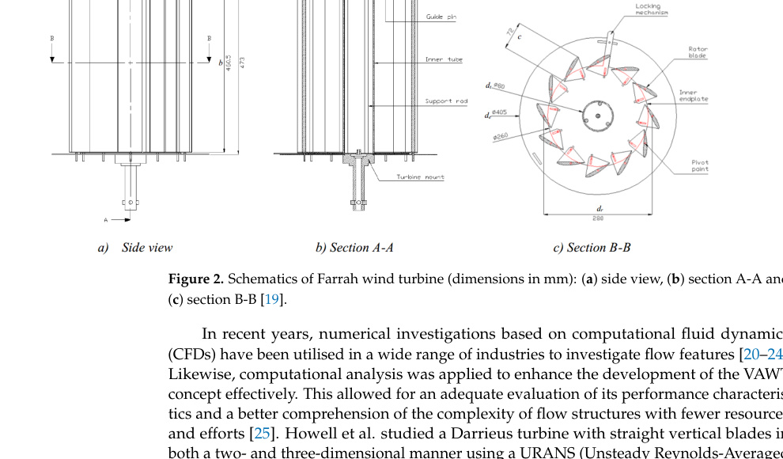
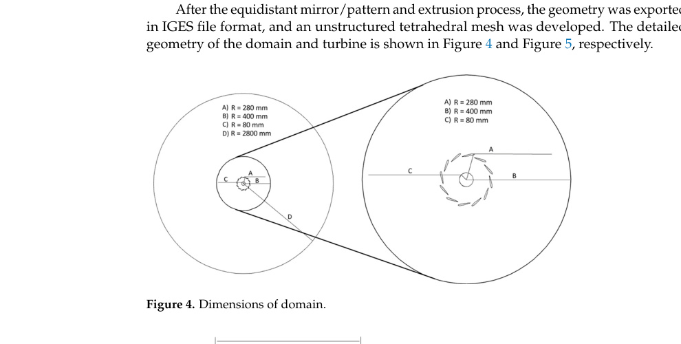
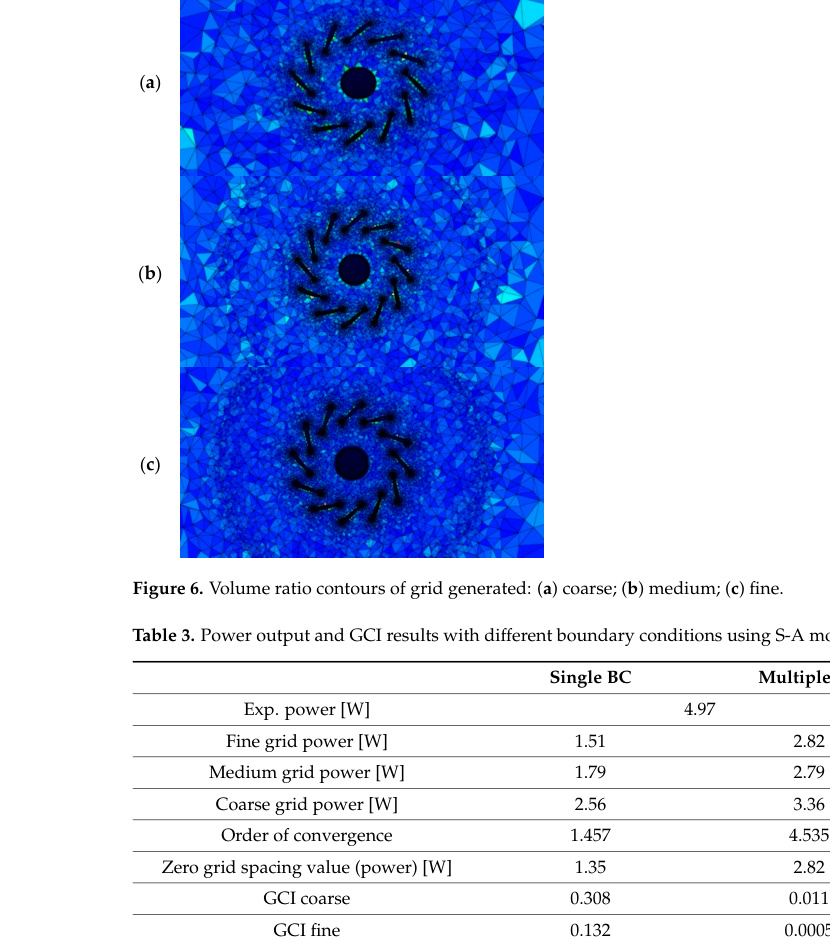
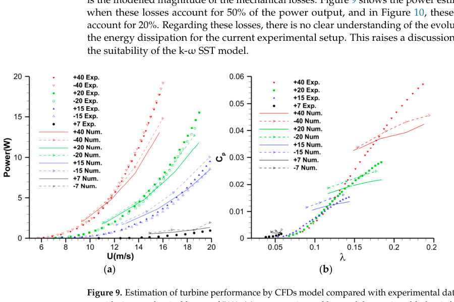
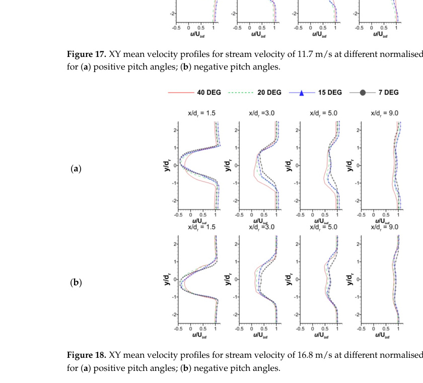
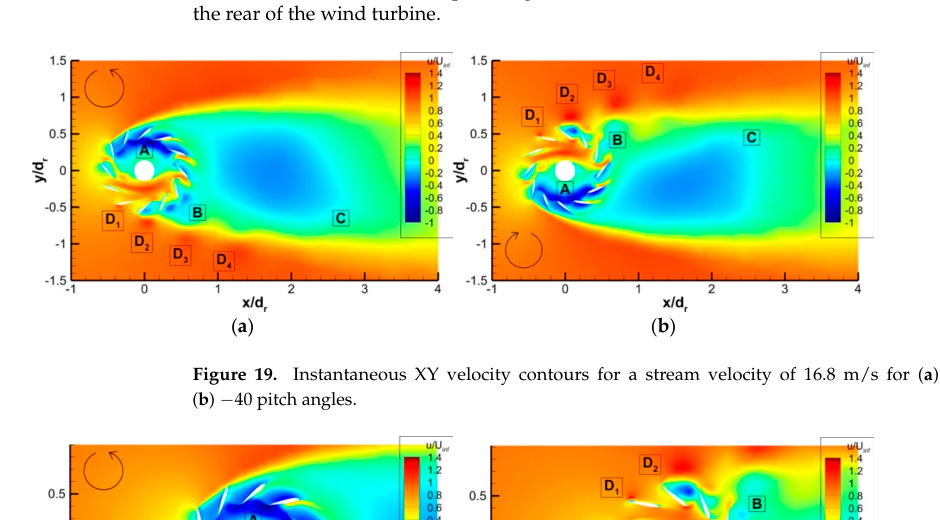
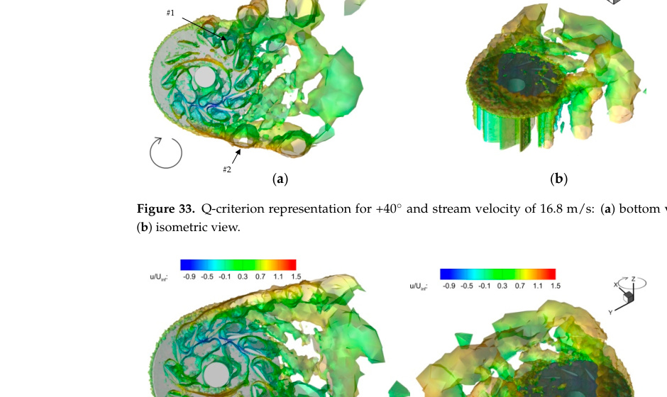

# CFD Analysis on Novel Vertical Axis Wind Turbine (VAWT)

Chris Sungkyun Bang, Zeeshan A. Rana and Simon A. Prince

Citation: Bang, C.S.; Rana, Z.A.; Prince, S.A. CFD Analysis on Novel Vertical Axis Wind Turbine (VAWT). *Machines* **2024**, *12*, 800. https://doi.org/10.3390/machines12110800

## Abstract

The operation of vertical axis wind turbines (VAWTs) to generate low-carbon electricity is growing in popularity. Their advantages over the widely used horizontal axis wind turbine (HAWT) include their low tip speed, which reduces noise, and their cost-effective installation and maintenance. A Farrah turbine equipped with 12 blades was designed to enhance performance and was recently the subject of experimental investigation. However, little research has been focused on turbine configurations with more than three blades. The objective of this study is to employ numerical methods to analyse the performance of the Farrah wind turbine and to validate the findings in comparison with experimental results. The investigated blade pitch angles included both positive and negative angles of 7, 15, 20 and 40 degrees. The k-omega SST model with the sliding mesh technique was used to perform simulations of a 14.4 million element unstructured mesh. Comparable trends of power output results in the experimental investigation were obtained and the assumptions of mechanical losses discussed. Wake recovery was determined at an approximate distance of nine times the turbine diameter. Two large complex quasi-symmetric vortical structures were observed between positive and negative blade pitch angles, located in the near wake region of the turbine and remaining present throughout its rotation. It is demonstrated that a number of recognised vortical structures are transferred towards the wake region, further contributing to its formation. Additional notable vortical formations are examined, along with a recirculation zone located in the turbine’s core, which is described to exhibit quasi-symmetric behaviour between positive and negative rotations.

Keywords: VAWT; Farrah wind turbine; computational analysis; vortical structures

## 2. Materials and Methods

### 2.1. Meshing Strategy

The geometrical design process of the VAWT was achieved through SpaceClaim 2021 R2 software. Using the NACA 5 Series aerofoil online generator, the authors imported airfoil coordinates including 1000 points and used a Bezier curve fit to define the surface. The trailing edge was chamfered and defined as two separate surfaces. This alteration supported greater orthogonality within the mesh generation of boundary layer cells and improved the geometrical representation of the mesh. The geometry was exported in IGES file format and an unstructured tetrahedral mesh was developed.

Figure 2. Schematics of Farrah wind turbine (dimensions in mm): (a) side view, (b) section A-A and (c) section B-B [19].

Figure 4. Dimensions of domain.

| Mesh property | Coarse | Medium | Fine |
| --- | ---: | ---: | ---: |
| Cell count | 3,603,118 | 7,243,248 | 14,438,984 |
| Static-mesh cells | 100,110 | 201,545 | 398,947 |
| Sliding-mesh cells | 3,503,008 | 7,041,703 | 14,040,037 |
| Points per airfoil | 84 | 124 | 164 |
| Airfoil y+ | 5 | 2 | 1 |
| Inflation layers | 10 | 15 | 20 |

Table 1. Selected comparison of grid resolution.

The grid-independent study used the `k-omega SST` turbulence model and monitored power output. Treating the 12 airfoils as separate wall boundary conditions produced a fine-grid power of 4.77 W against the reported experimental power of 4.97 W; treating them as a single boundary produced 2.64 W. The authors state that the Spalart-Allmaras model showed a minimum 43.25% error for the fine mesh and did not produce the expected sinusoidal torque signal, whereas `k-omega SST` was suitable for this study.

Figure 6. Volume ratio contours of grid generated: (a) coarse; (b) medium; (c) fine.

### 2.2. Boundary Conditions

The model uses airfoil and endplate wall conditions, interfaces between rotating and static fluid volumes, pressure farfield, and a symmetry-plane boundary condition. The sliding mesh uses a simple rotational velocity specification. The authors model half the turbine and mirror the results across the horizontal midplane.

Figure 8. Boundary conditions for the computational domain.

### 2.3. Simulation Setup

The selected solver was pressure-based with a transient formulation. The RANS turbulence model was Menter's `k-omega SST`; enhanced wall treatment was used for the k equation and the low-Reynolds formulation was applied to fine meshes. The turbine rotates through a matching interface between rotating and static domains. The pressure-farfield condition uses `Pabs = 101,325 Pa`, `T = 293.15 K`, and freestream Mach number `0.06`; the authors treat compressibility effects as negligible.

Variables use second-order discretisation and least-squares cell-based gradients. The pressure-velocity coupling is `SIMPLEC` with distance-based Rhie-Chow interpolation, and the transient formulation uses a second-order implicit scheme. The adopted angular time step is 0.3 degrees, with 50 iterations per time step and four simulated revolutions. Simulations used 64 cores per case.

### 2.4. Numerical Cases

The study compares positive and negative pitch angles of 7, 15, 20, and 40 degrees with earlier wind-tunnel data. It evaluates cases from approximately 9.35 to 19.88 m/s and tip-speed ratios below 0.2. The reported results focus on 11.7 and 16.8 m/s; the 7-degree cases could not rotate experimentally at 11.7 m/s.

## 3. Results

The authors compare CFD power with experiment after assuming mechanical losses of either 50% or 20%. The 50% adjustment arises from their half-turbine symmetry model; the 20% adjustment comes from prior experimental-loss comparisons. They state that the loss evolution is not well understood. The model captures essential flow trends especially above TSR 0.15, but the authors suggest a transition SST model may improve the result over the full TSR range.

Figure 9. Estimation of turbine performance by CFDs model compared with experimental data when considering mechanical losses of 50%; (a) power estimated by model at various blade pitch angles and wind speed U; (b) power coefficient versus tip speed ratio at various blade pitch angles.

At nine turbine diameters downstream, the paper reports wake recovery with a constant stream-velocity profile. In the XY plane, the wake exceeds the turbine diameter by roughly 200%. At 40 degrees, recirculation is oriented to opposite sides for the opposite pitch orientations.

Figure 18. XY mean velocity profiles for stream velocity of 16.8 m/s at different normalised distances for (a) positive pitch angles; (b) negative pitch angles.

For the plus and minus 40-degree cases at 16.8 m/s, the authors identify an inner-turbine recirculation zone, leeward eddies, a wake recirculation region, and four shed vortical structures. They report a recirculation region behind the turbine to approximately 2.6 diameters and describe two large interacting near-wake vortical centres.

Figure 19. Instantaneous XY velocity contours for a stream velocity of 16.8 m/s for (a) +40, (b) -40 pitch angles.

Figure 22. Symmetry plane streamlines for a stream velocity of 16.8 m/s for (a) +40; (b) -40 pitch angles.

## 4. Conclusions

The study examines turbulent flow around a Farrah VAWT over Reynolds numbers `5 x 10^3` to `1 x 10^5`. A 14-million-element mesh and `k-omega SST` are reported to give a 4.02% error for this particular comparison, versus 43.25% for Spalart-Allmaras. Negative pitch angles resulted in slightly higher power output. The paper reports wake recovery at nine diameters, wake recirculation to 2.6 diameters, and high turbulent kinetic energy near the upstream endplate, downstream aerofoils, and wake recirculation zones. It recommends a transitional `k-omega SST` model for future work because the fully turbulent model may overestimate power in the transitional Reynolds-number range.

Figure 33. Q-criterion representation for +40 degrees and stream velocity of 16.8 m/s: (a) bottom view; (b) isometric view.

> Conversion note: the PDF includes duplicated peer-review text layers on several pages. This source record preserves the clean final-version content relevant to the VAWT CFD setup, validation, results, tables, and cited figures; the original PDF remains the authoritative complete document.
