# Aerodynamic performance analysis of NACA 0018 airfoil at low Reynolds numbers in a low-turbulence wind tunnel

Krzysztof Rogowski, Robert Flemming Mikkelsen, Jan Michna, Jan Wiśniewski

Published in: *Advances in Science and Technology Research Journal*

Link to article, DOI:
10.12913/22998624/195556

Publication date:
2025

Citation (APA):
Rogowski, K., Mikkelsen, R. F., Michna, J., & Wiśniewski, J. (2025). Aerodynamic performance analysis of NACA 0018 airfoil at low Reynolds numbers in a low-turbulence wind tunnel. *Advances in Science and Technology Research Journal, 19*(2), 136-150. https://doi.org/10.12913/22998624/195556

## ABSTRACT

The objective of this study was to measure the aerodynamic characteristics of the NACA 0018 airfoil across a range of low Reynolds numbers, with a particular focus on the unique behaviours observed in this regime. The experiments were conducted primarily in a low-turbulence wind tunnel using wall pressure taps, a pressure rake, and a force gauge. The Reynolds numbers investigated ranged from 30.000 to 160.000, with angles of attack spanning from -190 to +20 degrees. A major achievement of this research was the successful acquisition of data at Re = 30.000, where the lift behaviour significantly deviated from that observed at higher Reynolds numbers. The results demonstrated a strong dependency of aerodynamic characteristics on Reynolds number, with the drag coefficient at zero angle of attack decreasing by over 700 percent when Re increased from 30.000 to 160.000. Additionally, two independent techniques for measuring lift force were employed, both yielding consistent results despite the low Reynolds number. The experimental results were also compared with XFOIL and 2-D CFD simulations, which, although not perfectly accurate, provided reasonably good predictions.

Keywords: NACA 0018 airfoil, Lift and drag characteristics, low Reynolds number, wind tunnel, XFOIL, Small-scale wind turbine design.

Received: 2024.08.28
Accepted: 2024.12.15
Published: 2025.01.01

## INTRODUCTION

As awareness of the consequences of fossil fuel exploitation continues to rise globally, there has been a significant expansion in the development of renewable energy sources. Since the fuel crisis of the 1970s, the wind energy sector has predominantly focused on horizontal-axis wind turbines (HAWT). This type of turbine has been extensively studied, and enhancing the rotor power coefficient characteristics across a broad range of tip speed ratios presents a significant challenge. Increasing attention is now being directed toward improving the aerodynamic performance of vertical-axis wind turbines (VAWT) to narrow the efficiency gap between these two turbine types [1, 2].

Currently, many researchers propose solutions based on the so-called upscaling. This approach aims to study the aerodynamic characteristics of a turbine rotor at a small scale, calibrate more or less reduced aerodynamic models based on these results, and then simulate wind turbines, often several hundred meters in scale [3]. However, the problem lies in the vastly different conditions present in modern wind tunnels compared to those in Earth's atmosphere [4-6]. This paper does not address the topic of upscaling but instead focuses on issues within the scale of the wind tunnel itself, where the flow should be minimally disturbed. It turns out, however, that calibrating numerical models is a challenging task, and even the most advanced contemporary numerical models struggle to handle such conditions effectively [7]. Most importantly, there is still an insufficient amount of experimental data in the literature to even begin calibrating the turbulence models used in CFD. Currently, the only numerical techniques capable of providing reliable data are Large Eddy Simulation (LES) or even Direct Numerical Simulation (DNS) [8]. However, these techniques are still too computationally expensive to be used across a wide range of angles of attack and under different flow conditions.

The main problem with simulations using Reynolds-Averaged Navier-Stokes (RANS) techniques is the occurrence of laminar separation near the surface of the airfoil. RANS models do not simulate such phenomena based on the solution of the N-S equations but instead rely on correlations. This means that the position of the laminar-turbulent transition is determined based on local flow conditions (such as local turbulence intensity), which is tracked by one of the transport equations in the Transition SST model and compared with an appropriate database developed experimentally. However, this approach is insufficient and often lacks accuracy [9].

In recent years, there have even been studies on wind turbines at a laboratory scale, where the chord-based Reynolds number reaches values in the range of 20.000-30.000 [3]. These are extremely small ranges. Moreover, in such cases, airfoils from the four-digit NACA series are quite often used. However, these airfoils perform poorly under such flow conditions. The reason why many contemporary engineers and researchers continue to use them is due to several factors. One of these is the aforementioned lack of airfoil characteristics across a wide range of Reynolds numbers and, more importantly, over a broad spectrum of angles of attack. As a result, up until almost 2011, the only available database of airfoils was the one created by Sheldahl and Klimas [10], which mainly contained characteristics of airfoils from the four-digit NACA series. For low Reynolds numbers, the results published in this report differ significantly from those found in more recent studies [11].

In recent years, several modern wind tunnel studies have been conducted on the NACA 0018 airfoil at low Reynolds numbers [12-16]. The first modern experimental studies of the NACA 0018 airfoil at such low Reynolds numbers were conducted by Timmer [12]. The author emphasizes that at low Reynolds numbers, the NACA 0018 airfoil is predominantly affected by laminar separation on the lower surface, which significantly influences its aerodynamic characteristics and the noise it generates. The application of zigzag tape effectively reduces this noise. Timmer also observed large post-stall hysteresis loops, which increase in size with rising Reynolds numbers. Timmer's research covered a range of Reynolds numbers from 150.000 to 1,000.000. However, Timmer noted that at the lowest Reynolds number of 150.000, the pressures were insufficient for wake measurements. Consequently, the drag curve at this Reynolds number was inferred using data for parasitic drag and aspect ratio from tests conducted at Re 300.000. Unique studies using the PIV technique were conducted by Nakano et al. [13]. The main accomplishments of this research include a thorough experimental investigation of the flow and noise characteristics of the NACA 0018 airfoil at a moderate Reynolds number of 160.000. The research effectively uncovered the connection between flow separation, reattachment, and the generation of tonal noise, offering significant insights into the aerodynamic performance of the airfoil under these specific conditions. Significant advancements in measurement techniques for the NACA 0018 airfoil and other airfoils from the four-digit NACA series have been made by the University of Waterloo. A prime example is the publication by Gerakopulos et al. [14]. Their study made notable contributions through the experimental analysis of the NACA 0018 airfoil at low Reynolds numbers, specifically within the range of 80.000 to 200.000. The researchers effectively characterized the airfoil's lift and separation bubble behaviour, uncovering two distinct regions in the lift curve associated with varying angles of attack. Additionally, their work highlighted how the separation bubble's position and length adjust with changes in Reynolds numbers and angles of attack, offering essential insights into the aerodynamic performance of the airfoil in low Reynolds number conditions. Following the work of Gerakopulos et al., another significant study in this research area was conducted by Longhuan Du in 2016 [15]. Du's study involved an in-depth experimental and numerical analysis of the NACA 0018 airfoil, focusing on its aerodynamic characteristics at low Reynolds numbers, specifically ranging from 60.000 to 140.000. The research utilized sophisticated measurement techniques, including Particle Image Velocimetry (PIV) for detailed flow visualization and pressure distribution analysis, to explore flow separation, reattachment, and the airfoil's overall aerodynamic behaviour. This work provided additional insights into low Reynolds number aerodynamics, contributing significantly to the existing knowledge in the field. Other independent measurements were conducted at Imperial College in a low-turbulence wind tunnel [16]. Pressure distribution measurements were employed to capture the aerodynamic characteristics of the airfoils. The experimental studies were carried out within a Reynolds number range of 60.000 to 300.000 and angles of attack from 0 degrees to 180 degrees. The results provided empirical data that validated the hypothesis of virtual camber effects, showing significant differences in performance between the standard and transformed airfoils.

Against the backdrop of the existing state of knowledge, our research provides an additional contribution. Specifically, we extended the study to even lower Reynolds numbers, down to 30.000, where the lift coefficient (CL) exhibits a completely different behaviour compared to higher Reynolds number values. Moreover, to accurately measure the lift coefficient, we successfully employed two techniques: force gauge and wall pressure taps, which were not utilized by the previously mentioned authors.

In recent years, the use of composite materials has gained prominence across various engineering applications, including aerospace, automotive, and energy industries. This trend reflects a broader shift toward materials that offer high strength-to-weight ratios, thermal stability, and resistance to environmental factors. Such advancements have enhanced the performance and durability of structures, as seen in both civil and military aviation applications. For instance, Setlak et al. highlight the substantial benefits of composite materials in reducing weight and increasing the structural integrity of military aircraft, such as the F-35, where composite components contribute to improved durability and reduced radar detectability due to their unique mechanical and electromagnetic properties [17]. Our study builds on this foundation by examining the aerodynamic performance of the NACA 0018 airfoil at low Reynolds numbers, with a focus on its behaviour in low-turbulence environments. By comparing experimental data with computational predictions, we aim to contribute valuable insights into the optimization of airfoil designs for both small-scale wind turbines and low-speed aircraft, where composite airfoils have shown potential in enhancing efficiency and reducing structural loads. The findings provide further data critical for advancing turbulence models and adapting composite airfoils in applications demanding reliable performance in varied operational conditions.

## EXPERIMENTAL SETUP AND METHODOLOGY FOR AERODYNAMIC LOAD MEASUREMENT IN A LOW-TURBULENCE WIND TUNNEL

The experimental investigations were conducted in a low-turbulence wind tunnel at the Technical University of Denmark (DTU) in Lyngby. This is the so-called Red Wind Tunnel (Fig. 1), belonging to the DTU Wind Energy Department. The open-loop wind tunnel is equipped with a test section measuring H x W = 0.5 x 0.75 m, with a total length of L = 2 m. The tunnel is capable of reaching a maximum flow velocity of 40 m/s while maintaining a turbulence intensity of less than 0.1%. The reference pressure is determined using a standard Pitot tube. Aerodynamic loads were assessed using wall-mounted pressure taps (Fig. 2b) to determine lift coefficients, and a wake rake setup was employed to measure drag coefficients. The pressure measurements were conducted using Pressure Systems scanners, with a total range of +/- 2.5 kPa for wall pressures and +/- 7 kPa for wake pressures. Data acquisition was performed at a sampling rate of 125 Hz, with measurements taken for 10 seconds at each angle of attack. In addition, a load cell was used to measure the lift force.

Figure 1. (a) Schematic diagram of the DTU Red Wind Tunnel configuration, (b) photograph of the measurement section of the DTU Red Wind Tunnel

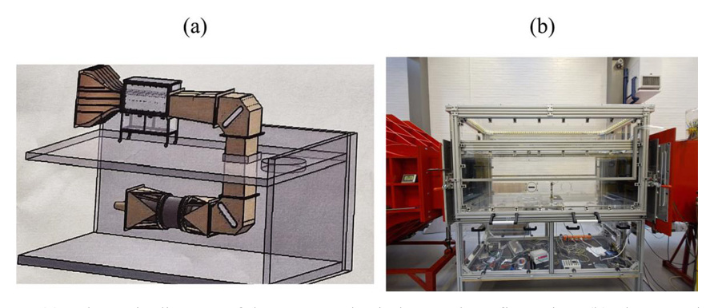

The experimental study utilized two rectangular foils (Fig. 2a) with a symmetrical NACA0018 airfoil. Most of the wind tunnel tests were conducted using a foil with a chord length of 60 mm, which was extruded from aluminium - shown in the top illustration in Figure 2a. The aluminium foil was made from an actual blade of the TU Delft VAWT rotor [18]. The rotor blade was cut to a length of 500 mm, matching the height of the wind tunnel's test section, and was sanded down with very fine sandpaper.

The second wing (bottom image in Fig. 2a) had a chord length of 106 mm and was produced on a 3D printer using PLA RE from Smartfill - a slightly stiffer material than standard PLA made from recycled PLA. The NACA 0018 blade featured one cylindrical inner spar and three shear webs with 3 mm edge blends and a middle section thickness of 5 mm each. The total length of the blade was 500 mm, divided into three sections. The final model chord was 106 mm after blunting the trailing edge by 3 mm. The final surface roughness of the blade was achieved by wet sanding with P800 sandpaper.

Figure 2. (a) Two foils used in the experimental study: the upper foil is made of aluminium, while the lower one is 3D printed using PLA; (b) the experimental setup inside the DTU Red Wind Tunnel shows the mounted foil, wall pressure taps, wake rake, and motor and gauge used for measurements

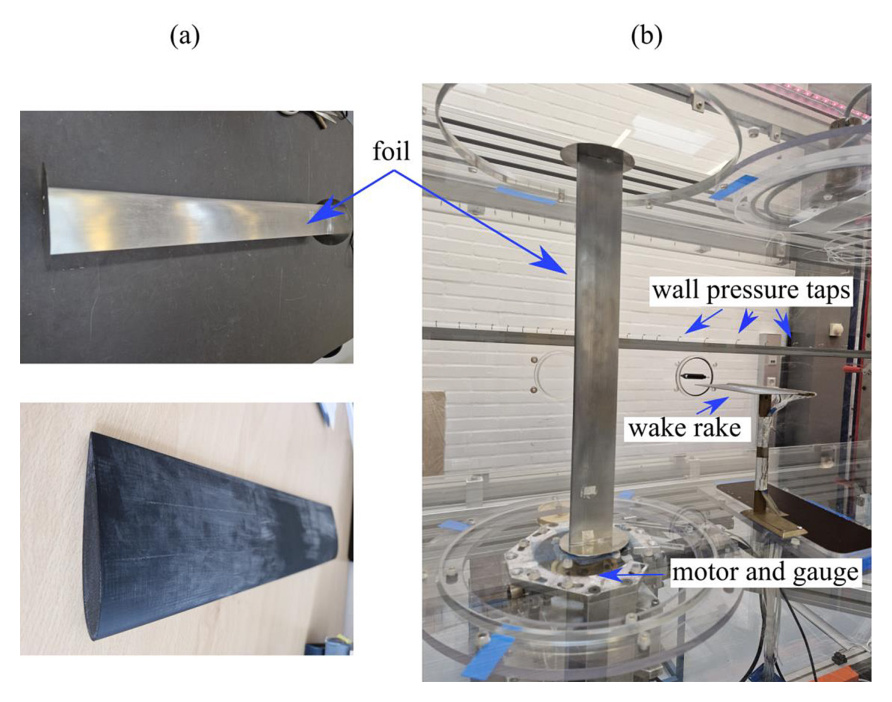

## EXPERIMENTAL ANALYSIS OF AERODYNAMIC CHARACTERISTICS UNDER VARYING REYNOLDS NUMBERS AND ANGLES OF ATTACK

This paper presents the results of several measurement series. Most of the tests were conducted on the aluminium foil due to its lower chord length (resulting in lower blockage effects) and larger stiffness, which allowed for force measurements over a wide range of angles of attack. The following measurement series were conducted for this foil. For Reynolds numbers of 100.000 and 160.000, both components of the aerodynamic force were measured over an angle of attack range of +/- 17 degrees. Two measurement techniques were used in these cases: wall pressure taps and a force gauge. The drag coefficient was determined based on wake velocity measurements. For Reynolds numbers of 30 k, 50 k, 80 k, 100 k, and 160 k, the lift component was measured over a wide range of angles of attack, from -190 degrees to +20 degrees. Since the wake rake used in our studies was not sufficiently wide, we present results for the drag coefficient only within the +/- 20-degree range. For the 3D-printed wing, we present data only for a Reynolds number of Re = 100 k as an additional validation of the results presented here. Wall interference correction was considered [20] and being proportional to chord/width ratio c/w = 60 mm/750 mm and 106 mm/750 mm, which for both foils is very small, correction on aoa, lift and drag coefficients are less than 0.5% for attack range of +/- 17 degrees. Blockage ratio for the attack range of 30 to 150 deg is at max 8% which is considered acceptable for separated flow.

Figure 3 compares the aerodynamic characteristics of the NACA0018 airfoil for a Reynolds number of 100 k, obtained using three independent measurement systems. The measurements indicate significant hysteresis in both the lift and drag coefficients in the region of the critical angle of attack. Such behaviour of the aerodynamic characteristics is typical for these aerodynamic conditions. Both measurement techniques confirm a high level of agreement in the lift force results. In addition to the hysteresis, a certain asymmetry in the lift force relative to the zero angle of attack is also noticeable. Similar phenomena were observed in the famous report [19] when investigating various airfoils at low Reynolds numbers. Timmer's research [12] also confirms this kind of behaviour, particularly at the lowest Reynolds number he studied - 150 k. The strong agreement between both measurements is further confirmed by comparing the same results as a CL versus CD relationship, as shown in the graph in Figure 4.

During the lift force measurements while increasing the angle of attack, a maximum lift coefficient of 0.948 was recorded (Fig. 3). On the return path (while decreasing the angle of attack), this value decreased by approximately 12%.

The zero angle of attack and its close vicinity proved to be extremely challenging to measure. While passing through this region, noticeable aerodynamic noise was observed, resulting from the shedding of vortex structures from both the suction and pressure sides. These structures are a consequence of laminar boundary layer separation and the formation of bubbles, which then evolve into the flow in the aerodynamic wake. The existence of such bubbles has also been documented in studies by other authors [13]. The presence of laminar separation bubbles results in significant nonlinearities in the lift force characteristics up to the critical angle of attack. The drop in lift force observed in the obtained characteristics after exceeding this critical angle of attack appears to be substantial. The loss of lift in the considered case is approximately 58.4%.

Figure 3. Comparison of the lift coefficient obtained using wall pressure taps (CLp) and a force gauge (CLg), along with the drag coefficient (CDw) measured using a wake rake. These results are for a Reynolds number of Re = 100 k.

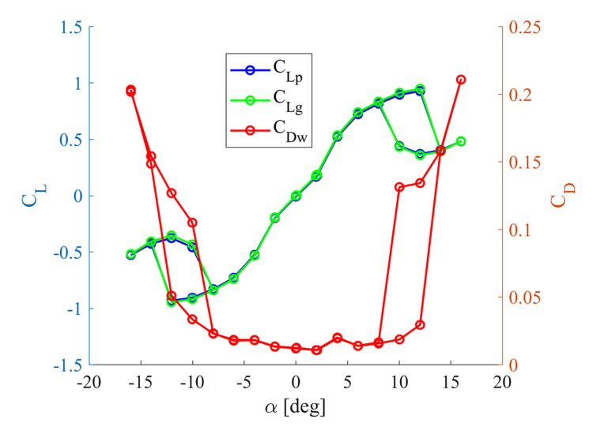

Figure 4. Polar plots of the lift coefficient (CL) versus the drag coefficient (CD) for a Reynolds number of Re = 100 k. The plot compares the results obtained from pressure taps (CLp), a force gauge (CLg), and a wake rake (CDw).

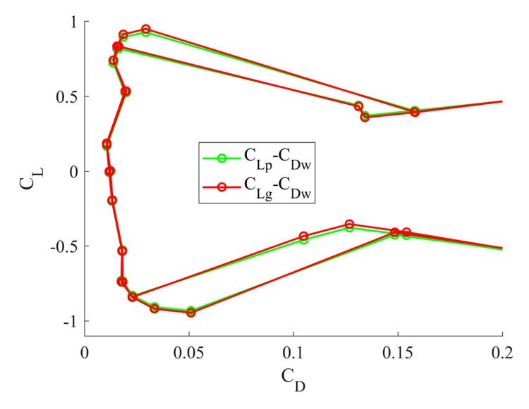

Up to this point, the lift force has been measured using two techniques: a force gauge measurement and a pressure measurement. The purpose of the next figure (Fig. 5) is to examine how both techniques perform when measuring over a much wider range of angles of attack at a Reynolds number of 100.000. The measurements were conducted starting from an angle of attack of -190 degrees and then increasing the angle up to 20 degrees. In this case, the measurements were performed in only one direction, so hysteresis is not observed.

As can be observed from Figure 5, there is strong agreement between the two measurement techniques, except in the range from -149 to -25 degrees. These differences are attributed to the limited number of pressure taps. In our case, the number of pressure taps was 64-32 on each side wall of the tunnel. When the angles of attack are low, the sensors 'see' a larger area of the wing. It should also be noted that at large angles of attack, the wing, supported at a single point, experiences increasing vibrations. With a small wing chord of 6 cm, the undisturbed flow velocity must be sufficiently high. For the highest Reynolds number we tested, 160 k, we used nearly the maximum achievable flow velocity in our wind tunnel (approximately 40 m/s). In the case of the highest Reynolds number we examined, 160 k, to avoid vibrations, the wing was additionally supported with a pin attached to the ceiling of the wind tunnel's test section. Therefore, in this case (Re = 160 k), only the results obtained using the pressure measurement technique could be used. Conducting this test at Re = 100 k to verify the lift force measurement using both the force gauge and wall pressure taps was therefore necessary. Despite the differences in the CL results visible in the angle of attack range from -149 to -25 degrees (Fig. 5), both curves are acceptable. The largest discrepancy is observed at an angle of attack around -50 degrees. The pressure sensors recorded a lift coefficient of -1.021 in this case, with the lift force prediction from the second measurement system differing by approximately 12.3%.

Figure 5. Comparison of the lift coefficient (CL) over a wide range of angles of attack (alpha) for Re = 100 k, using two different measurement techniques. The green line (CLp) represents the results obtained from wall pressure taps, while the red line (CLg) represents the results from the force gauge.

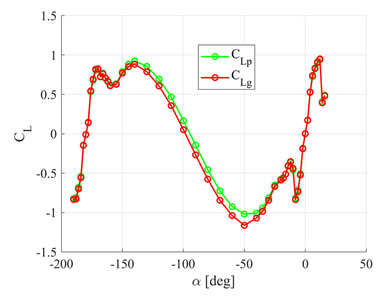

Figures 6, 7, and 8 present the results of the aerodynamic force coefficients for five different Reynolds numbers over a wide range of angles of attack, from -190 to 20 degrees. Figure 7 shows the same lift coefficient results as in Figure 6 but within a narrower range of angles of attack, from -20 to 20 degrees. The characteristics displayed in Figures 6 and 7 were obtained solely from pressure measurements for reasons discussed in the previous paragraph. Figure 8, on the other hand, presents the drag coefficient characteristics only within the angle of attack range from -20 to 20 degrees. The wake rake used had too short a span to capture all the details in the wide aerodynamic wake and integrate them. The presented results indicate that the largest discrepancies are observed at the lowest Reynolds numbers tested in this measurement campaign, specifically for Re 30 k and 50 k. At the lowest Reynolds number, the lift force is practically negligible, while at 50 k, it is tiny, with a maximum lift coefficient, CLmax, of only 0.435 at an angle of attack of just 3 degrees. The results indicate that the most significant discrepancies are observed at the lowest Reynolds numbers tested in this measurement campaign, specifically for Re 30 k and 50 k. Even a slight increase in the Reynolds number from 80k to 100k leads to a 14% increase in lift from 0.803. Similarly, an increase from Re = 100 k to 160 k results in a further 9.6% increase. A similar strong dependency on the Reynolds number is observed for the drag coefficient. For Re = 160 k, the drag coefficient at a zero angle of attack is 0.0084. In contrast, at Re = 30 k, this coefficient is as much as 586% higher at the same zero angle of attack.

Figure 6. The lift coefficient (CL) as a function of angle of attack (alpha) for different Reynolds numbers shows the significant impact of Reynolds number on the aerodynamic characteristics.

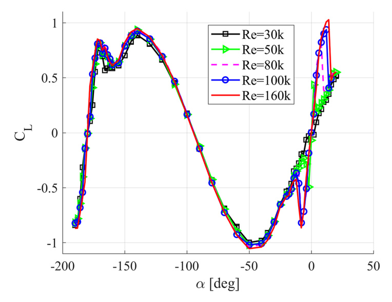

Figure 7. The lift coefficient (CL) as a function of angle of attack (alpha) for different Reynolds numbers shows the significant impact of Reynolds number on the aerodynamic characteristics.

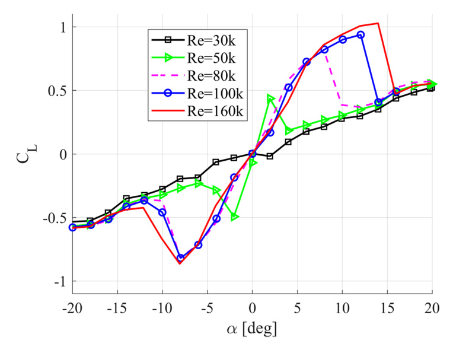

Figure 8. The drag coefficient (CD) as a function of angle of attack (alpha) for different Reynolds numbers shows the significant impact of Reynolds number on the aerodynamic characteristics.

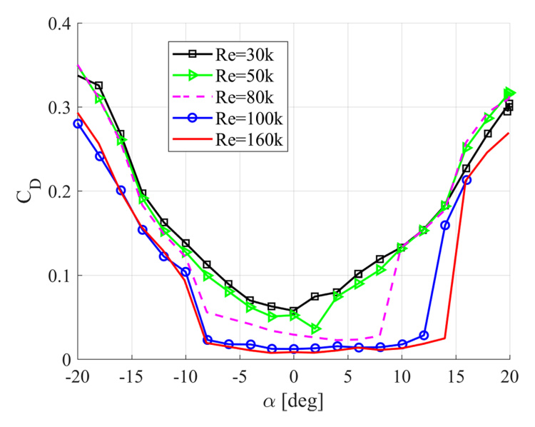

In this paper, two types of measurement series were conducted for the aluminum foil. The tests primarily differed in that, in one case, the range of angles of attack varied within a shorter range of +/- 20 degrees (in both directions), while in the other case, it ranged from -190 degrees to 20 degrees (in only one direction). To demonstrate that in both tests, the results are generated similarly for the +/- 20 degree range, a separate graph was prepared (Fig. 9). This figure shows the comparison of results for Test A corresponding to the shorter range of angles of attack and Test B corresponding to the longer range. The figure clearly shows that for the angle of attack range from -20 to 20 degrees, the results are the same when the angle of attack increases.

Figure 9. Comparison of the drag coefficient CD as a function of the angle of attack alpha for two types of tests at a Reynolds number of 100 000. Test A (red curve) corresponds to a shorter range of angles of attack (+/- 20 degrees), whereas Test B (blue curve) corresponds to a wider range (-190 degrees to 20 degrees). The results show the consistency of drag coefficient behaviour in the overlapping range of angles.

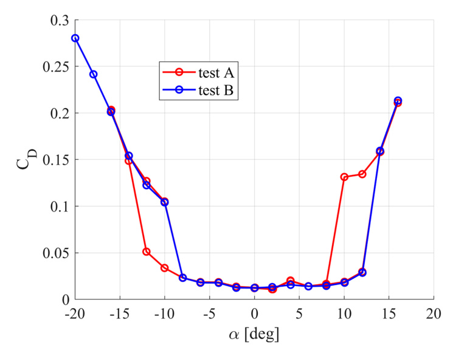

Figure 10 compares the lift force results for a Reynolds number of 100k for two foils: an aluminium foil and a printed foil. Both foils are made from different materials, and their roughness slightly differs. Despite these minor imperfections in both wings, the obtained lift force results are surprisingly almost identical. This suggests a high reliability of the measurement system used.

Figure 10. Lift coefficient (CL) as a function of the angle of attack (alpha) for two airfoils with different chord lengths and materials at a Reynolds number of 100.000. The solid lines with markers represent measurements for the aluminium foil with a shorter chord length (c = 0.06 m), while the dashed lines represent measurements for the 3D-printed foil with a longer chord length (c = 0.106 m).

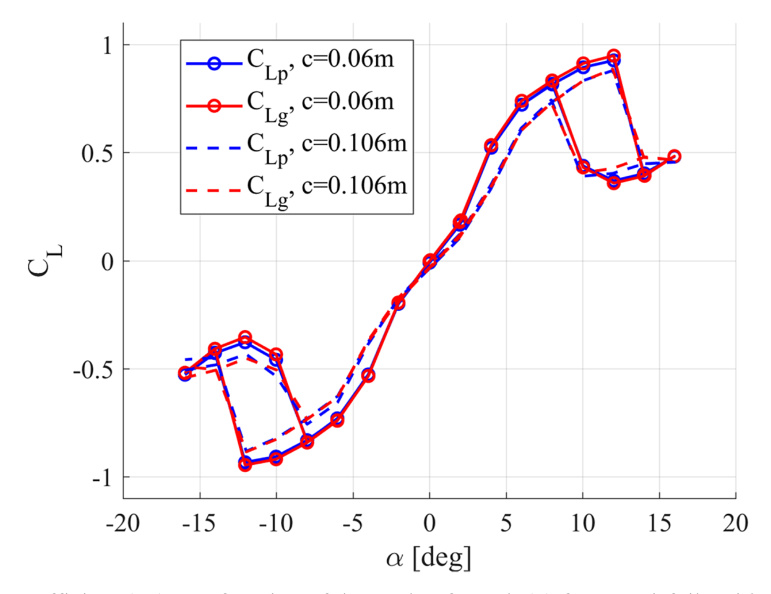

Figures 11 and 12 illustrate the dependence of the aerodynamic characteristics of the airfoil on the Reynolds number. Two Reynolds numbers, 100 k and 160 k, are compared in these figures. In this case, we focused primarily on the quantitative and qualitative comparison of the hysteresis loops. As previously indicated, the loss of lift force after exceeding the critical angle of attack is rapid and occurs for both Reynolds numbers presented in Figure 11. For Re = 160 k, the maximum lift coefficient CLmax was recorded as 1.012 at an angle of attack of 14.02 degrees. During the wing's movement in the opposite direction (decreasing angle of attack), the lift coefficient CL was 0.421 at the same angle of attack, indicating a decrease in lift force by approximately 58.4%. In the case of Re = 100 k, the maximum lift coefficient CLmax was 0.926 at an angle of attack of 12.04 degrees, with a corresponding drop in lift force of about 60%. Visually, the lift force hysteresis loops for both Reynolds numbers are similar and almost linearly shifted.

The shape of the drag coefficient hysteresis (Fig. 12) is also similar and shifted; however, the differences in value increments are much larger than for the lift force and are strongly dependent on the Reynolds number. During the increase in the angle of attack for Re = 100 k, there is a sharp rise in drag starting from an angle of attack of 12.04 degrees. At this angle, the drag coefficient is 0.0294. An increase in the angle of attack by two degrees results in a rise in the drag coefficient by about 453%. In the case of Re = 160 k, the sharp increase in lift force begins slightly later, at an angle of attack of 14.03 degrees. An increase in the angle of attack by two degrees (from 14.03 to 15.95 degrees) generates an increase in the drag coefficient by approximately 769.5%. The sudden drop in the lift coefficient during the wing's movement in the opposite direction (from positive to negative angles of attack) is similar: 92% for Re = 160 k (for angles between 12.01 and 10.02 degrees) and 87.5% for Re = 100 k (for angles between 10.04 and 8.02 degrees).

Figure 11. Comparison of lift coefficient hysteresis loops for the NACA 0018 airfoil at two Reynolds numbers (Re = 100 k and Re = 160 k).

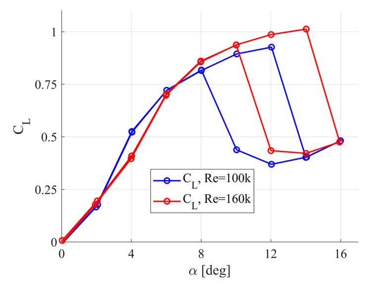

Figure 12. Comparison of drag coefficient hysteresis loops for the NACA 0018 airfoil at two Reynolds numbers (Re = 100 k and Re = 160 k).

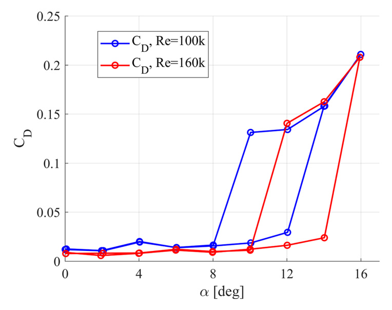

## ASSESSMENT OF AERODYNAMIC PERFORMANCE USING EXPERIMENTAL AND NUMERICAL METHODS

Figures 13 and 14 compare the lift and drag characteristics obtained experimentally with the results from XFOIL. The calculations with this tool were performed using the parameter N = 9. Despite the low Reynolds numbers, a strong similarity was observed between the experimental and computational results. For the lowest Reynolds number examined, XFOIL confirmed an almost linear lift characteristic. The difference in drag between Re = 30 k and Re = 160 k calculated using this tool is also similar. For the two highest Reynolds numbers investigated in the measurement campaign, the XFOIL results show a significant increase in drag for similar angles of attack. The maximum lift coefficient values obtained with XFOIL are overestimated compared to the experimental results, which is an expected outcome. The lift characteristics obtained with this numerical tool are also strongly nonlinear within the range of angles of attack up to the critical angle of attack.

Figure 13. Lift coefficient as a function of the angle of attack. Comparison of experimental results with XFOIL.

Figure 14. Drag coefficient as a function of the angle of attack. Comparison of experimental results with XFOIL.

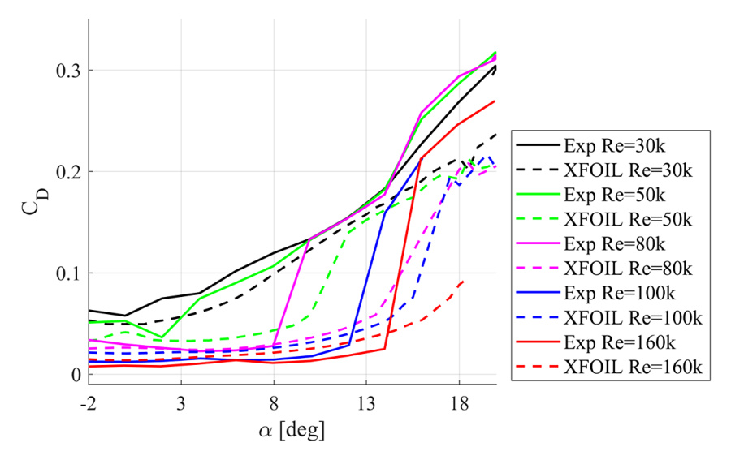

Figure 15 compares the aerodynamic characteristics of the airfoil at Re = 160 k obtained using the 2-D CFD approach. The numerical calculations were performed using the model discussed and described in [4]. This referenced publication contains a detailed description of the model, methodology, as well as a mesh sensitivity test. In this study, the range of angles of attack was extended to 20 degrees. Figure 15 clearly shows that the 2-D CFD approach underestimates the lift force. In contrast to XFOIL, the Transition SST model more accurately predicts the significant increase in drag.

Figure 15. Comparison of airfoil characteristics at Re = 160 k obtained from experiments and 2-D CFD using the Transition SST model.

A reliable scientific paper should also refer to the results of experimental studies by other authors if such exist. Contemporary measurement results for the NACA0018 profile at Re approximately 150 k, starting from Timmer's publication, do not differ significantly from each other. All of them show a nonlinear range of CL characteristics as a function of the angle of attack. Most of the existing experimental studies have been compared in previous publications by the first author of this paper. The differences between the existing studies were also pointed out by Melani et al. [11]. Therefore, in this publication, we compare only the results of three contemporary experimental studies available in the literature. To the best of our knowledge, only Timmer has published the characteristics of the NACA0018 profile considering hysteresis. However, it should be noted that this author mentioned that for this Reynolds number (150k), he was only able to measure the lift force reliably. Therefore, the drag force results are extrapolated in this case. The results shown in Figures 16 and 17 indicate that Timmer's hysteresis is smaller than in our case. This, of course, does not imply an error in our measurements. We have already informed the reader that measuring aerodynamic loads at such low Reynolds numbers can be subject to various errors primarily related to the measurement technique used and the flow conditions in the wind tunnel. Figure 17 also illustrates the significant differences in drag coefficients obtained by various independent authors. It is also worth emphasizing that two independent tests, ours and the one published by Bianchini et al. [16], show a high degree of consistency in the lift coefficient results for a wide range of angles of attack (Fig. 18).

Figure 16. Comparison of lift coefficients obtained in our study with experimental results from other authors. The data shows results for Reynolds numbers Re = 100 k and Re = 160 k compared to the experimental findings of Timmer [12] at Re = 150 k, Bianchini et al. [16] at Re = 150 k, and Du et al. [15] at Re = 140 k.

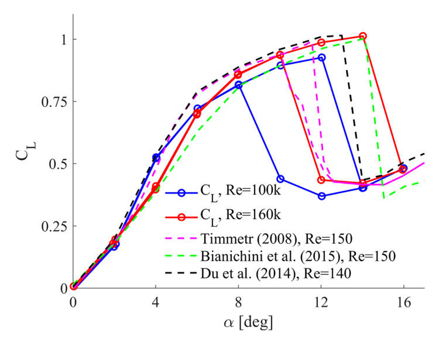

Figure 17. Comparison of drag coefficients obtained in our study with experimental results from other authors.

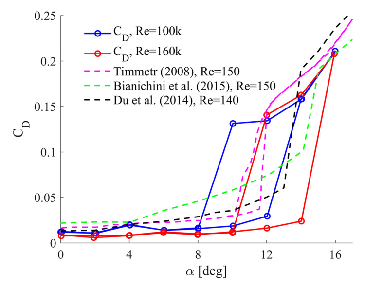

Figure 18. Comparison of drag coefficients obtained in our study with experimental results from Bianchini et al. [16] at Re = 150 k.

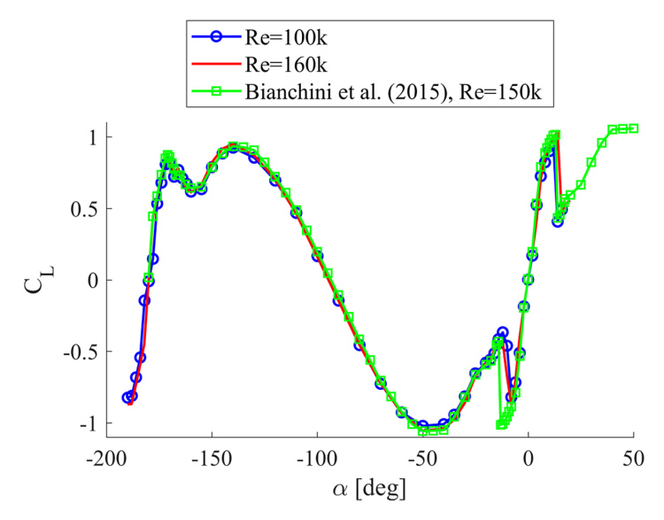

## CONCLUSIONS

This study focused on investigating the aerodynamic characteristics of the NACA 0018 airfoil across a range of low Reynolds numbers, emphasizing the distinct behaviours observed within this flow regime. The experiments were primarily conducted in a low-turbulence wind tunnel, utilizing wall pressure taps, a pressure rake, and a force gauge to gather data. The Reynolds numbers examined spanned from 30.000 to 160.000, with angles of attack ranging from -190 to +20 degrees. Based on the conducted research, the following conclusions can be drawn:

The comparison of the two measurement techniques (pressure taps and force gauge) for lift force at Re = 100 000 shows strong agreement across most of the tested angle of attack range, despite some discrepancies in specific regions, confirming the reliability of both methods under varying conditions. In the study, tests were also conducted using two different foils. These tests demonstrated the proper functioning of two independent systems for measuring lift force, confirming the reliability and accuracy of the measurement methodologies employed. The comparison of the three measurement systems for the NACA 0018 airfoil at Re = 100 k demonstrates significant hysteresis and asymmetry in the aerodynamic coefficients, with a strong agreement in the lift and drag measurements, confirming the reliability of the methods used for determining the lift coefficient. A decrease of approximately 12% in the maximum lift coefficient was observed when reducing the angle of attack.

Challenges in measuring around the zero angle of attack were noted, with significant aerodynamic noise associated with vortex shedding from both sides of the airfoil, highlighting the complexity of laminar boundary layer separation and bubble formation in this region.

The formation of laminar separation bubbles leads to considerable nonlinearities in lift force behaviour, with a significant loss of lift - around 58.4% at Re = 100 k - occurring after surpassing the critical angle of attack.

In the case of such low Reynolds numbers, both lift and drag characteristics are highly dependent on the Reynolds number. This dependency is particularly evident in the drag coefficient, which shows significant variation, increasing substantially as the Reynolds number decreases.

This paper also investigated the effect of the Reynolds number on the geometry of the stationary hysteresis loop. The comparison was conducted for Reynolds numbers 100 k and 160 k. Our study showed that an increase in Reynolds number causes almost a linear shift of the entire loop towards higher angles of attack and slightly higher lift coefficients. The shape of the drag coefficient loop is also similar with the increase in Reynolds number. However, a two-degree increase in the angle of attack results in a significant rise in drag.

The comparison between experimental results and XFOIL simulations reveals a strong agreement in both lift and drag characteristics, even at low Reynolds numbers. While XFOIL tends to overestimate the maximum lift coefficient, it accurately captures the overall trends, including the linear lift behaviour at the lowest Reynolds number and the significant drag increase at higher Reynolds numbers. These findings validate the reliability of XFOIL as a predictive tool for aerodynamic analysis within the tested parameter range.

The 2-D CFD approach, utilizing the Transition SST model, provides a more accurate prediction of drag increase compared to XFOIL but tends to underestimate lift values. This highlights the importance of selecting appropriate models for accurate aerodynamic simulations, especially at higher angles of attack.

## Acknowledgements

This work was supported by the POB Energy program of Warsaw University of Technology, under the Excellence Initiative: Research University (IDUB) scheme (Grant No. 1820/355/Z01/POB7/2021). Additionally, the research benefited from resources provided by the Interdisciplinary Centre for Mathematical and Computational Modelling (ICM) at the University of Warsaw, through computational grants no. G93-1588 and G92-1487. I would also like to extend my sincere thanks to Mr. Eng. Tomasz Szuster, a retired academic from Warsaw University of Technology, for his invaluable support and mentorship.

## REFERENCES

1. Kumar R., Raahemifar K., Fung A.S. A critical review of vertical axis wind turbines for urban applications. *Renewable and Sustainable Energy Reviews*. 2018, 89, 281-91. https://doi.org/10.1016/j.rser.2018.03.033
2. Bianchini A., Ferrara G., Ferrari L. Pitch optimization in small-size Darrieus wind turbines. *Energy Procedia*. 2015, 81, 122-32. https://doi.org/10.1016/j.egypro.2015.12.067
3. Huang M. Wake and wind farm aerodynamics of vertical axis wind turbines. Doctoral dissertation, Technische Universiteit Delft, 2023. https://doi.org/10.4233/uuid:14619578-e44f-45bb-a213-a9d179a54264
4. Michna J, Rogowski K. Numerical study of the effect of the reynolds number and the turbulence intensity on the performance of the NACA 0018 Airfoil at the low Reynolds Number Regime: Processes. 2022, 10(5), 1004. https://doi.org/10.3390/pr10051004
5. Rogowski K, Krolak G, Bangga G. Numerical Study on the Aerodynamic Characteristics of the NACA 0018 Airfoil at Low Reynolds Number for Darrieus Wind Turbines Using the Transition SST Model. *Processes*. 2021, 9(3), 477. https://doi.org/10.3390/pr9030477
6. Bangga G., Dessoky A., Wu Z., Rogowski K., Hansen M.O.L. Accuracy and consistency of CFD and engineering models for simulating vertical axis wind turbine loads. *Energy*. 2020, 206. https://doi.org/10.1016/j.energy.2020.118087
7. Carreno Ruiz M., D'ambrosio D. Validation of the gamma-Re theta transition model for airfoils operating in the very low Reynolds number regime. *Flow, Turbulence and Combustion*. 2022, 109(2), 279-308. https://doi.org/10.1007/s10494-022-00331-z
8. Zhang W., Samtaney R. Assessment of spanwise domain size effect on the transitional flow past an airfoil. *Computers & Fluids*. 2016, 124, 39-53. https://doi.org/10.1016/j.compfluid.2015.10.008
9. Langtry R.B., Menter F.R. Correlation-based transition modeling for unstructured parallelized computational fluid dynamics codes. *AIAA Journal*. 2009, 47(12), 2894-2906. https://doi.org/10.2514/1.42362
10. Sheldahl R.E., Klimas P.C. *Aerodynamic characteristics of seven symmetrical airfoil sections through 180-Degree Angle of Attack for Use in Aerodynamic Analysis of Vertical Axis Wind Turbines*. Technical Report; Sandia National Laboratories: Albuquerque, NM, USA, 1981. https://doi.org/10.2172/6548367
11. Melani P.F., Balduzzi F., Ferrara G., Bianchini A. An annotated database of low Reynolds aerodynamic coefficients for the NACA0018 airfoil. In *AIP Conference Proceedings*. 2019, 2191(1), AIP Publishing. https://doi.org/10.1063/1.5138843
12. Timmer W.A. Two-Dimensional Low-Reynolds Number Wind Tunnel Results for Airfoil NACA 0018. *Wind Engineering*. 2008, 32, 525-537. https://doi.org/10.1260/030952408787548848
13. Nakano T., Fujisawa N., Oguma Y., Takagi Y., Lee S. Experimental study on flow and noise characteristics of NACA0018 airfoil. *Journal of Wind Engineering and Industrial Aerodynamics*. 2007, 95, 511-531. https://doi.org/10.1016/j.jweia.2006.11.002
14. Gerakopulos R., Boutilier M.S.H., Yarusevych S. Aerodynamic Characterization of a NACA 0018 Airfoil at Low Reynolds Numbers. In Proceedings of the AIAA 2010-4629, 40th Fluid Dynamics Conference and Exhibit, Chicago, IL, USA, 28 June-1 July 2010. https://doi.org/10.2514/6.2010-4629
15. Du L. *Numerical and Experimental Investigations of Darrieus Wind Turbine Start-up and Operation* [doctoral thesis]. Durham, UK: Durham University; 2016. Available at: http://etheses.dur.ac.uk/11384/
16. Bianchini A., Balduzzi F., Rainbird J.M., Peiro J., Graham J.M.R., Ferrara G., Ferrari L. An experimental and numerical assessment of airfoil polars for use in Darrieus wind turbines: Part 1-Flow curvature effects. In *Turbo Expo: Power for Land, Sea, and Air* 56802, V009T46A006. American Society of Mechanical Engineers. 2015. https://doi.org/10.1115/GT2015-42284
17. Setlak L., Kowalik R., Lusiak T. Practical use of composite materials used in military aircraft. *Materials*, 2021, 14, 4812. https://doi.org/10.3390/ma14174812
18. Tescione G., Ragni D., He C., Ferreira C.S., Van Bussel, G.J.W. Near wake flow analysis of a vertical axis wind turbine by stereoscopic particle image velocimetry. *Renewable Energy*. 2014, 70, 47-61. https://doi.org/10.1016/j.renene.2014.02.042
19. Althaus D. *Profilpolaren fur den Modellflung, Band 1*. Necktar-Verlag, Vs-Villingen. Institut fur Aerodynamik und Gasdynamik der Universitat Stuttgart, 1980. (in German).
20. Allen H.J., Vincenti W.G. *Wall interference in a two-dimensional-flow wind tunnel, with consideration of the effect of compressibility*. NACA report no. 782. 1944.
