# A review on the wake aerodynamics of H-rotor vertical axis wind turbines

H.Y. Peng, H.J. Liu, J.H. Yang

a School of Civil and Environmental Engineering, Harbin Institute of Technology, Shenzhen, China
b College of Civil Engineering and Architecture, Guangxi University, Nanning, China

## Article Info

Article history:
Received 1 November 2020
Received in revised form 10 March 2021
Accepted 19 May 2021
Available online 26 May 2021

Keywords:
Wake
Aerodynamics
VAWT
Wind tunnel test
PIV
CFD

## Abstract

Vertical axis wind turbines (VAWTs) have distinctive attributes, for example, exceptional performance in built environments and high packing density in wind farms. This study reviews recent research in the wake aerodynamics of H-rotor VAWTs. The general mathematical expressions for the analysis of the rotor aerodynamics of VAWTs are presented, followed by a classic aerodynamic model. Velocity deficit and turbulence increase are common features of wind turbine wakes, and the deep dynamic stall of operational VAWTs further complicates their wakes. This study systematically compiles the investigations of the wake flow fields and vortical structures of VAWTs. In these investigations, a wide range of research methods have been used, for instance, wind tunnel testing, particle image velocimetry (PIV) tests, field tests, computational fluid dynamics (CFD) simulations, and theoretical development. The results of these studies suggest that the wakes of VAWTs are characterized by distinctive features, such as strong asymmetry and counter-rotating vortical motion. Based on these characteristics, researchers have developed various wake models. The proposed wake models can be used to design standalone VAWTs or layouts for multiple VAWTs. Finally, this paper provides discussions and suggestions pertaining to the investigations of the wakes of VAWTs.

## 1. Introduction

In recognition of the precipitous depletion of fossil fuels and the alarming deterioration of the global climate, nations worldwide are strongly supporting the development of renewable energy sources such as wind and solar energy. Among renewable energy sources, wind energy, which is clean and environmentally friendly, is considered the most cost-effective source [1e4]. The installed capacity of wind power worldwide has increased remarkably in the past decade [5e9]. For many centuries, ingeniously designed wind turbines have harnessed wind energy. Modern wind turbines are categorized into two main groups depending on the orientation of rotational axis: horizontal axis wind turbines (HAWTs) and vertical axis wind turbines (VAWTs) [10]. HAWTs have dominated the wind power industry for several decades. However, HAWTs have some inherent problems, such as size ceiling due to gravity-induced reversing stress at blade roots [11] and deficiencies under turbulent flows [12,13]. Recent research suggests that VAWTs have great potential for use in urban installations [14e16] and exhibit fast wake recovery, which means high packing densities [17e19]. This has led to a resurgence of interest in VAWTs [20,21]. Although VAWTs have simple structural configurations, analyzing their aerodynamics has been challenging the wind energy community for decades [22,23,130]. The primary difficulty lies in the fact that the angle of attack (AOA, a) of VAWTs experiences constant changes within each revolution, unlike that of HAWTs [24]. The rapidly changing AOA induces strong vortex shedding from the leading and trailing edges of blades, thus inducing highly unsteady lift fluctuations and fatigue loads on blades [25e27]. This phenomenon is widely known as dynamic stall characterized by vortex formation and its release to the wake, and, to a great extent, it defines the aerodynamics and wake of VAWTs. Dynamic stall theories were originally developed for analyzing helicopter rotors [28e30], and dynamic stall of VAWTs has been studied since the early 1980s. Dynamic stall is affected by various parameters such as Reynolds number [31], turbulence intensity [32,33], blade geometry [27,34], rotation rates [35], and reduced frequency [23,36].

## Nomenclature

## Acronyms

HAWT Horizontal axis wind turbines VAWT Vertical axis wind turbines AOA Angle of attack BSR Blade speed ratio PIV Particle image velocimetry CFD Computational fluid dynamics CFR Counter-forward-rotating CBR Counter-backward-rotating SST Shear stress transport ABL Atmospheric boundary layer LES Large eddy simulation RANS Reynolds-averaged Navier-Stokes DES Detached eddy simulation DMS Double multiple streamtube RNG Re-normalization group SeA SpalarteAllmaras SGS Sub-grid scale ALM Actuator line model 2-D Two-dimensional 3-D Three-dimensional

## List of symbols

D Turbine diameter U Freestream velocity Tr Thrust force Uw Wake velocity A Projected frontal area of VAWT H Blade depth S Wake area b Spreading constant kW Spreading rate along the windward kL Spreading rate along the leeward kU Spreading rate along the upward kD Spreading rate along the downward vD Velocity deficit at the turbine center v0 Wake velocity at the turbine center DU(x) Velocity deficit at downstream distance x DU(x)max Maximum velocity deficit at x r(x) Radius of the wake region Cr Thrust force coefficient CP Power coefficient Uw Wake velocity rW Semi-axes of ellipse along the windward rL Semi-axes of ellipse along the leeward rU Semi-axes of ellipse along the upward rD Semi-axes of ellipse along the downward k Turbulence kinetic energy || || Norm operator Greek letters seq(x) Standard deviation of Gaussian velocity profile sx Standard deviation of Gaussian distribution in x direction sy Standard deviation of Gaussian distribution in y direction ε Turbulence dissipation u Angular rotation speed l Blade speed ratio q Azimuthal angle a Angle of attack r Air mass density sD Dynamic solidity h Turbine aspect ratio

Noll and Ham [37] developed a dynamic stall theory by using an empirical representation of the dynamic stall angle to analyze loads on and dynamic responses of rotor blades. Their results indicated that the peak lift loads (CL z 3.0) and moments (CM z 0.65) acting on rotor blades during dynamic stall were around 3 and 5 times higher than the respective static values (CL z 0.9, CM z 0.13). Laneville and Vittecoq [38] conducted an experimental investigation of the dynamic stall of a VAWT at different blade speed ratios (BSRs, l = VB/U with VB for blade speed and U for freestream velocity). They concluded that helicopter rotor aerodynamics could be applied to the dynamic stall behaviors of VAWT blades. Fujisawa and Shibuya [39] combined flow visualizations and particle image velocimetry (PIV) tests to investigate dynamic stall of VAWT blades. They observed two pairs of counter-rotating vortices evolving toward the wake. To further understand the BSR effect on dynamic stall, the process of the roll-up, release and interaction with blades passing downwind passage was visualized using PIV tests [22,130]. In recent years, computational fluid dynamics (CFD) simulations have emerged as a suitable technique to examine the complex dynamic stall features (Ferreira et al., 2007; [40,131]. Almohammadi et al. [25] carried out two-dimensional (2-D) CFD simulations using two turbulence models to analyze dynamic stall of a VAWT. The transition shear stress transport (SST) model [41] outperformed the SST keu model [42] in predicting the flow transition. Here the transition means the laminar-to-turbulent transition, the onset of which is determined by the intermittency and momentum thickness. The transition significantly affected the turbine performance by up to 20%. Rosado Hau et al. [23] conducted CFD simulations to analyze the influence of VAWT parameters on the moment of stall inception. The stall-onset angle was observed to increase linearly with the non-dimensional pitch rate. Huang et al. [33] assessed the effect of freestream turbulence on dynamic stall using large eddy simulation (LES) and revealed that freestream of 5% turbulence level improved the aerodynamic performance of blades. Research on VAWTs can be classified into two major categories [43]: (a) rotor aerodynamics analysis and (b) wake aerodynamics analysis. In rotor aerodynamics analysis, velocities in the proximity of blades, forces on blades, and power coefficients of turbines are the most concerned parameters. The main objective of rotor aerodynamics analysis is to improve the aerodynamic performance of blades and, thereby, increase the power generated by individual VAWTs. Rotor aerodynamics has been analyzed extensively over the past four decades [44,45]. The pioneering work dates back to the 1970s when Templin [46] derived an analytical streamtube model. Based on the streamtube model [47e49], proposed and developed a more advanced double multiple streamtube (DMS) model. Recently, Saber et al. [50] introduced a new relation to evaluate the equilibrium induced air velocity to improve the power prediction results using the classical DMS model. Moghimi and Motawej [51] developed a low-cost DMS model to assess parametric effects on the performance of VAWTs and found that large chord length contributed to good self-starting performance. Still, the DMS model tends to notably overestimate the power performance of VAWTs [52]. Compared with rotor aerodynamics, wake aerodynamics studies are in their nascency and have only started to attract researchers’ attention in recent years [53e55]. Wake analysis focuses on the development of flow fields and vortical structures downstream, as well as on the modeling of these behaviors. As the wake flows are characterized by large velocity deficits and high turbulence, scholars are working to reduce their mutual interference and maximize the total power output of multiple closely packed turbines. Note that the large velocity deficit means that the freestream velocity may encounter as large as 75% deductions in the wake [53]. As aerodynamic models can determine the mean flow fields but not the turbulent structures [24], experiments, numerical simulations and wake modeling have been used instead in the literature to investigate the wake aerodynamics of VAWTs. This study comprehensively reviews recent progress in the wake aerodynamics analysis of H-rotor VAWTs. Section 1 introduces the research background and the challenges associated with the analysis of VAWTs due to dynamic stall. The general classification of modern VAWTs based on their driven modes and geometrical forms is given in Section 2. Wake investigations have contributed substantially to the development and successful operation of modern wind farms. The literature on the wake aerodynamics of VAWTs is comprehensively examined in Section 3. The review concludes with Section 4, which presents a summary and recommendations for future work.

## 2. Classification of VAWTs

VAWTs are classified into two basic categories based on the forces driving the rotor blades: (a) drag-driven Savonius VAWTs and (b) lift-driven Darrieus VAWTs. In general, Savonius VAWTs are less efficient in harnessing wind energy than Darrieus VAWTs [56,57].

### 2.1. Savonius VAWTs

Savonius VAWTs were invented by and named after the Finnish engineer S.J. Savonius in 1929 [11,58]. Fig. 1 shows the schematic of a Savonius VAWT. As the concave sides of the cup-shaped blades catch the approaching wind, large drag forces are induced (see Fig. 2). In contrast, relatively small drag forces are generated when the oncoming flow blows onto the convex sides. Therefore, a driving torque is formed due to the differences in the drag forces acting on the blades, and this torque drives the blades to rotate around a vertical shaft. Because Savonius VAWTs are driven by drag forces, they cannot rotate faster than wind speed, and their rated blade speed ratios (BSRs) are less than 1.0. They transform the kinetic energy of wind into mechanical energy, generating electric

Fig. 1. Schematic of a savonius VAWT
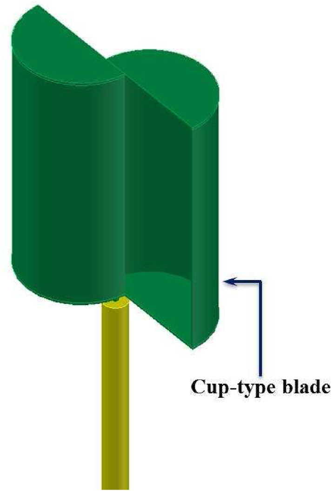

power through turbine rotation. The maximum power coefficients that Savonius VAWTs can achieve are typically smaller than 0.25 [59]. Scholars proposed that Savonius VAWTs could be stacked up to improve power performance [60,61]. The two-stage VAWT obtained a power coefficient of around 0.29 larger than the threestage turbine of 0.23 and the one-stage turbine of 0.18 [60]. Although Savonius VAWTs have poorer power-generation performance than their Darrieus counterparts [62], they are effective at self-starting. Savonius VAWTs are generally used for and have achieved great success in wind-speed-measurement applications rather than electric-power-generation applications [62,63].

### 2.2. Darrieus VAWTs

Darrieus VAWTs were invented by the French engineer G.J. Darrieus [64]. In lift-driven Darrieus VAWTs, oncoming flows are deflected onto the upper and lower surfaces of an airfoil blade as the flows approach the leading edge of the blade (see Fig. 3). Consequently, a lift force is produced on the blade due to the presence of pressure difference. This lift force overcomes the drag force and generates a tangential component. The tangential force, together with the blade radius, forms the driving torque that rotates the turbine to produce electric power. Modern Darrieus VAWTs can be classified into three basic categories: (a) Egg-beater VAWTs, (b) Helical VAWTs and (c) H-rotor VAWTs.

### 2.2.1. Egg-beater VAWT

Egg-beater Darrieus VAWTs containing two or more curved airfoil blades are also called curved-bladed VAWTs [63,65]. The airfoil blade is bent from the blade mid-span toward its two ends (see Fig. 4). This type of blade configuration helps to minimize the bending stress in the blades of egg-beater VAWTs and is beneficial for the structural design. The Eole of 3.8-MW is the largest eggbeater VAWT ever built, thanks to its favorable structural configuration [66]. As wind blows over the airfoil blades, aerodynamic lift is produced. The flow around an egg-beater VAWT is intrinsically erratic, leading to inherently unsteady loadings on blades [24,56]. In the 1980s, several prototypes of egg-beater VAWTs were developed in Canada and the US [10]. However, because of the unfavorable aerodynamic loadings, these turbines suffered from problems such as blade fatigue, cracks in tower foundation, and bottom bearing failure [10]. Moreover, the straight-bladed VAWT is more cost effective than the egg-beater VAWT [62].

### 2.2.2. H-rotor VAWT

An H-rotor VAWT equipped with two or more straight blades is also called a straight-bladed VAWT, giromill, or cycloturbine (see Fig. 5). The straight blades are connected to the central shaft by means of struts. This structural configuration simplifies the manufacture of H-rotor VAWTs relative to the egg-beater VAWTs. Researchers have pointed out that small-scale VAWTs accepting winds from all directions (360) are suitable for urban applications [67e69]. The installations of VAWTs in urban areas can facilitate the

Fig. 2. Operation of a SavoniusVAWT [6].
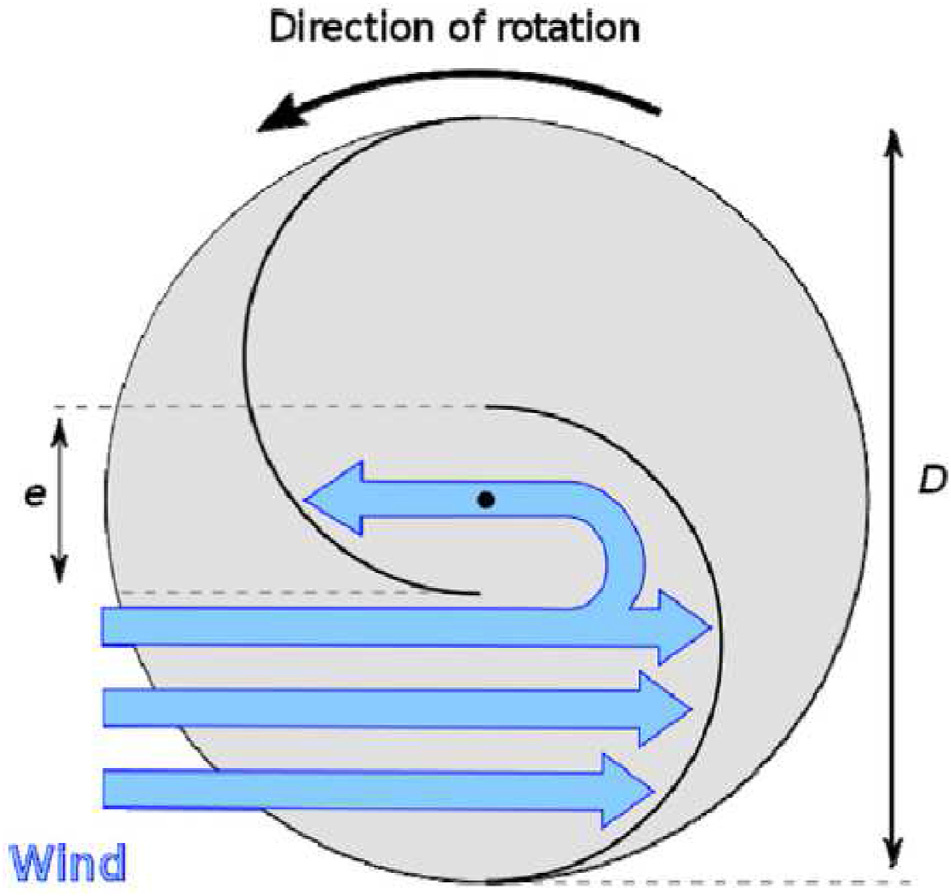

Fig. 3. Operation of a darrieus VAWT [6]. Fig. 4. Schematic of an egg-beater VAWT.
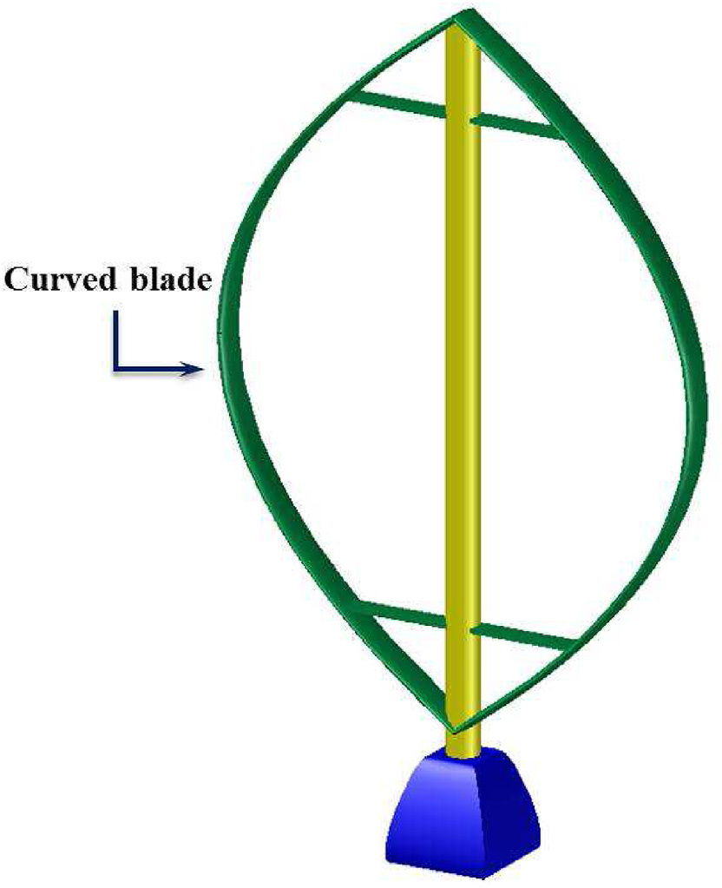

Fig. 4. Schematic of an egg-beater VAWT.
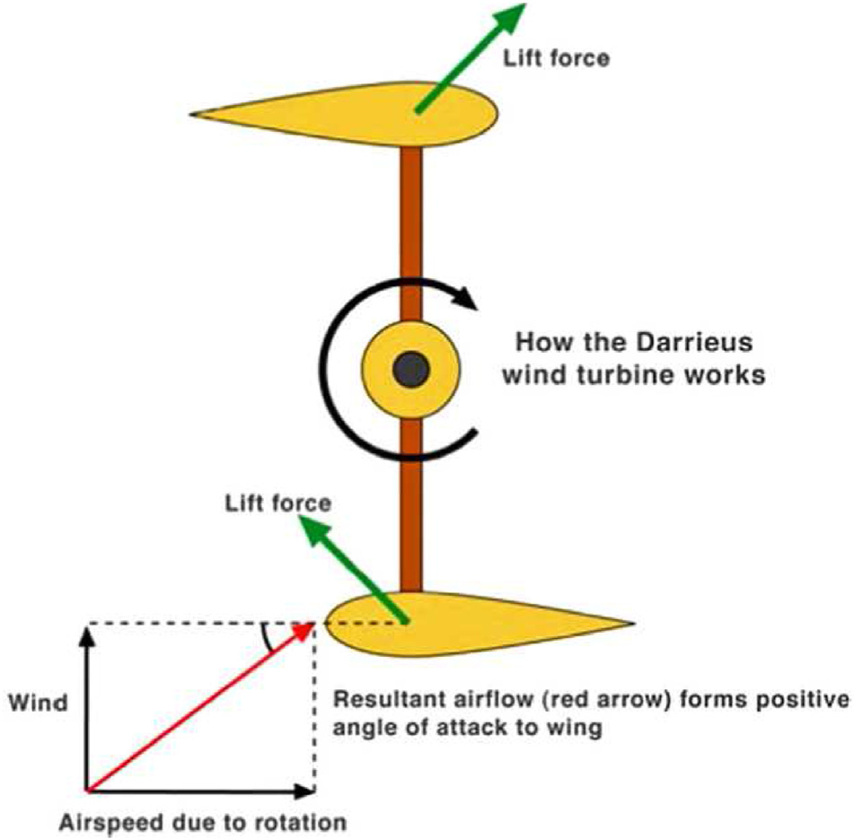

provision of distributed power production, that is, electricity generation directly at the consumption site. The potential benefits of this energy generation system are high energy efficiency, low transmission loss, and stimulation of the economy [70]. Recent studies have demonstrated that the H-rotor VAWTs exhibit excellent and enhanced power performance under turbulent flows [71,72]. Due to these favorable features, there has been a major resurgence of interest in H-rotor VAWTs in the past decade compared to other types of VAWTs [19,43,62,73e75]. Researchers have started to investigate the wake characteristics of H-rotor VAWTs in recent years. However, studying the wake is a rather challenging task due to dynamic stall and the interaction of vortex shedding with downstream blades. There are two different directions in the wake analysis of the H-rotor VAWTs due to their special vortical structures. Some researchers have configured multiple VAWTs as array units according to the vortices casted in the near wake [17,76]. The power outputs of these closely spaced VAWTs units were reported to be an order of magnitude higher than their HAWT counterparts per unit land area. Other scholars have conducted micro-siting analyses of VAWTs based on studies of far-wake aerodynamics [19,77,78]. Encouragingly, these studies found that the wakes of VAWTs recovered to 95% of the upwind velocity at 6D downstream compared to 14D required for HAWTs, suggesting a fast wake recovery [18].

### 2.2.3. Helical VAWT

Helical VAWTs developed by A.M [79,80]. are derivatives from the H-rotor VAWTs and aims mainly for hydraulic power. Helical VAWTs have inclined blades (see Fig. 6), and the inclined angle is named as the helical angle. Note that the helical angle is 90 for an H-rotor VAWT. Helical VAWTs with blades overlaping the entire circumference of the turbine are capable of reducing the torque ripples of H-rotor VAWTs [55]. The helical turbines are mainly used for and demonstrate effectiveness in harnessing hydraulic power [81e83]. The helical tidal turbines showed good starting characteristics while had poor performace in energy production compared to their H-rotor counterparts [84e86]. Castelli and Benini [87] reported a comparative study of the power performance of H-rotor VAWTs and helical VAWTs using CFD simulations. The power of the helical turbine dropped significantly at BSRs of 2.6e4.1 compared to its H-rotor counterpart. Moreover, the helical VAWT caused more flow distortion with affected regions of 4.2D (D for turbine diameter) than did by the H-rotor VAWT with affected regions of 2.5D [88]. Besides, the blades of helical VAWTs are complex and inevitably more expensive to manufacture than their H-rotor counterparts [89].

## 3. Wake aerodynamics of H-rotor VAWTs

### 3.1. Experimental analysis

Experimental measurements under controlled conditions are fundamental for the wake analysis of H-rotor VAWTs. There are three major categories of experimental methods for studying wake characteristics: (1) wind tunnel testing, (2) PIV testing and (3) field testing. In wind tunnel testing, cobra probes or hot-wire anemometers on a traversing system and force measurement system are commonly used. In PIV testing, the flow field is seeded with small particles and illuminated using a laser beam for visualization. Photos of the seeded particles are used to calculate the wind speed and direction. Field testing which reflects the real operating conditions functions as an important fact-checking method for wake analysis.

### 3.1.1. Wind tunnel testing

Wind tunnel testing is a fundamental method for the wake study. McLaren measured the wake velocities of an H-rotor VAWT

Fig. 5. Schematic of an H-rotor VAWT
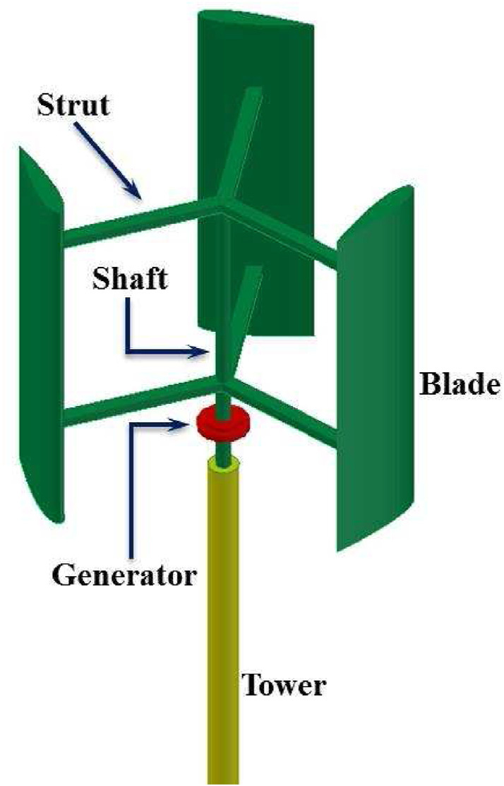

Fig. 6. Schematic of a helical VAWT.
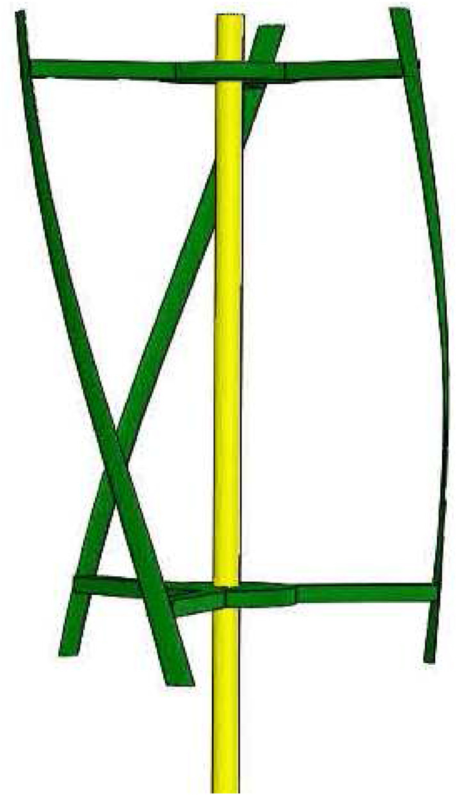

at the blade mid-span level up to 1.5D downstream by wind tunnel testing [24]. The three-bladed turbine had a diameter of 2.8 m, and the wind tunnel had a cross-sectional area of 6.8 m  5.0 m (width by height). The blockage ratio was approximately 24.7%, much larger than 10% [90,91]. Their experimental results indicated a large region of nearly stagnant flow at 1.0D downstream of the turbine centerline, suggesting a substantial reduction in the flow momentum due to the presence of the high-solidity turbine and energy transformation from wind kinetic energy to mechanical energy. Peng et al. [53] systematically investigated the wake aerodynamics of an H-rotor VAWT by wind tunnel testing. The turbine with a 0.3 m diameter was installed in a wind tunnel of 2.5 m  2.0 m (width  height) (Fig. 7). The flow field was measured along several lines both at the blade mid-span level and along the vertical direction up to 10D downstream of the wake. Fig. 8 shows the normalized streamwise velocities (U for streamwise velocity and U0 for freestream velocity). The maximum velocity deficit reached around 75% at x = 2D downstream. Also, significant wake asymmetry was observed along the windward. The underlying windward expansion are induced by two major reasons [43]. First, the occurrence of a deep dynamic stall at windward induced more vortex shedding towards windward. Note that the deep dynamic stall is formed when the blade is rapidly pitched at high AOAs with large vortex structures and considerable hysteresis in airfoil loading [24]. Second, the Magnus force transported the wake flows towards windward. Note that the flow blowing over a spinning cylinder produces the Kutta-Joukowski lift, which is called the Magnus effect [92]. Moreover, a pair of counterrotating vortical structures evolving in the wake was discovered (Fig. 9). Note that Fig. 9 shows the non-dimensional vertical velocity normalized by the freestream velocity. The counter-rotating vortices were believed to contribute to the turbulence flow mixing and, hence, the rapid wake recovery. Li et al. [93] focused on the near flow field of a straight-bladed VAWT. The turbine diameter was 2.0 m, and the wake was measured using a Laser Doppler velocimeter (LDV) system (Fig. 10). The wake was found to be asymmetrical in the horizontal direction, consistent with the findings of Peng et al. [53]. The largest turbulence intensity occurred at x = 0.5D, and it was attributed to the presence of the strong shear layers and helicoidal vortices in that region. Conventionally, research on the wake aerodynamics of VAWTs has been predominantly performed under low-turbulence smooth flows. In fact, the wake characteristics have been determined by both geometrical configurations and approaching flows. Peng and Lam [71] investigated the wake characteristics of an H-rotor VAWT under both low-turbulence smooth and grid-turbulence flows. The wake velocities in the symmetry plane were measured up to x = 8D in these two flow regimes (see Fig. 11, with Ux for streamwise velocity and U for freestream velocity). The streamwise velocities in the wake demonstrated expanded “W” shapes in the smooth flow, whereas they exhibited contracted “V” shapes in the gridturbulence flow. Asymmetrical wake expansion was clearly observed in both flow regimes. Interestingly, turbulence improved the turbine's self-starting performance. A traditional wind farm consisting of multiple individual VAWTs is not necessarily the most efficient option. Under an appropriate layout design, the power density of twin turbine units could potentially be one order of magnitude higher than that of their HAWT counterparts [17]. [94] conducted wake measurements of coand counter-rotating twin VAWTs (see Fig. 12). The counterforward-rotating (CFR) twin unit exhibited a symmetric and contracted wake, and two pairs of counter-rotating vortices would contribute to strong flow mixing and, hence, rapid wake recovery (see Fig. 13). Note that Fig. 13 shows the non-dimensional vertical velocity normalized by the freestream velocity. The CFR unit was believed to be of engineering interest for its regular layout. In comparison, the counter-backward-rotating (CBR) twin unit exhibited a large and symmetrical wake, with regions almost undisturbed between two turbine wakes. Hence, a triangular array unit was proposed for the CBR unit, in which a third turbine was installed right downstream of the twin unit. Vergaerde et al. [95] measured the wake characteristics of paired VAWTs (see Fig. 14). The wake was measured at three heights, i.e., z = 0 m and z = ±0.25 m up to 21D downstream, and was compared with that of an isolated VAWT (Fig.15). Fig.15 shows the streamwise velocity contour normalized by the freestream velocity in the horizontal plane. The wake asymmetry of the isolated VAWT was observed compared to the symmetrical wake of paired VAWTs. Differences were also found further downwind in the mid span as two closely spaced turbines countered the natural deflection of incoming flows. Moreover, the replenishment mechanism was discussed and confirmed the presence of counter-rotating vortex pairs.

### 3.1.2. PIV test

PIV is a useful tool for the comprehensive analysis of flow fields, and serves the turbine wake studies. Ferreira examined the near wake in the mid-section of a single-bladed VAWT via 2-D PIV testing [130]. The approaching flow was continuously seeded with droplets measuring approximately 1.0 mm by a fog machine. The particle tracers at the blade mid-span were illuminated using a laser sheet by a laser instrument. The illuminated field of view was shot by a charge-coupled device camera. Finally, image processing was performed through iterative deformation and translation of the interrogation windows. The PIV results indicated that the counterclockwise and clockwise vortices were shed from the blade trailing and leading edges, respectively. The evolutions of vortex shedding, rolling up, release, and subsequent interaction with the blade passing the downstream passage were examined. Tescione et al. [19] carried out a near-wake flow analysis of an Hrotor VAWT by PIV tests (see Fig. 16). The blade mid-span plane was examined by planar PIV testing up to 2D downstream. In contrast, the vertical planes parallel to the freestream velocity were studied by stereoscopic PIV testing. Asymmetrical wake spreading in the horizontal mid-span plane was observed, with more pronounced expansion towards windward (see Fig. 17, with uz for the angular rotation speed, V∞for freestream velocity and c for blade chord

Fig. 7. VAWT prototype in wind tunnel [53].

length). Note that Fig. 17 shows the non-dimensional vorticity normalized by the freestream velocity, i.e., uzc/V∞. Furthermore, the induction field was found non-constant in the near-wake region and gradually smoothed out with increasing downstream

Fig. 8. Time-averaged normalized streamwise velocity along z = h [] [53].
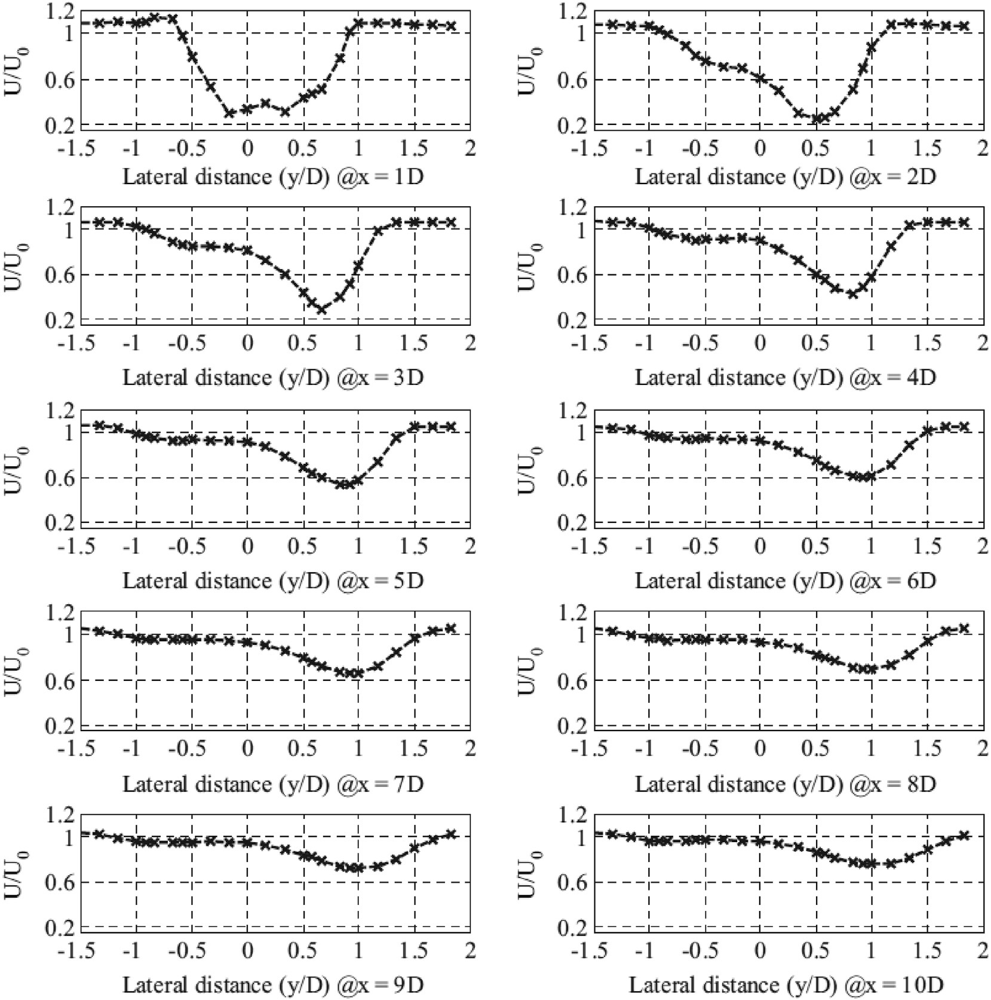

Fig. 9. Time-averaged vertical velocity contour in the y-z plane [] [53].

Fig. 10. VAWT installed in wind tunnel [93].
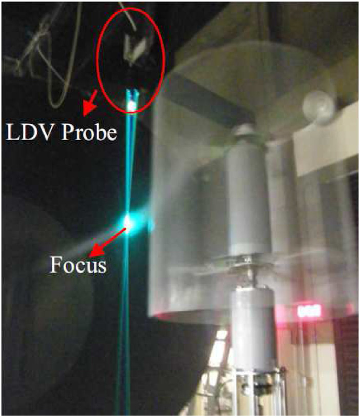

distance. Comparatively, the stereoscopic PIV measurements in the vertical planes presented the release, rolling up, and stretching of the blade-tip vortices. These findings improved the understanding of the flow physics evolving around and in the near wake of an Hrotor VAWT. Araya et al. [96] further extended the range of wake measurements from the near wake to a far wake by 2-D PIV testing. The wake characteristics of four types of models, namely two-bladed, three-bladed, and five-bladed VAWTs, together with a circular cylinder, were measured. Both spectral analysis and proper orthogonal decomposition were adopted to assess the wake flows. The wake was classified into three distinct regions: (1) near wake with periodic vortex shedding, (2) transition region with growing shear-layer instability, and (3) far wake with buff-body wake oscillation. In general, an increase in dynamic solidity induced earlier occurrence of wake transition. An important conclusion was that the flow characteristics in the far wake of turbines could be quantitatively related to those of the circular cylinder. Further analysis suggested that the turbine aspect ratio was critical in the wake recovery process. PIV measurements have been predominantly performed under low-turbulence uniform flows. However, measurements of wake flow fields under simulated atmospheric boundary layer (ABL) flows are equally important for comprehensive understanding of the wake aerodynamics of VAWTs. To this end, the ABL effect on the evolution of wake flows was evaluated. Kadum et al. [54] investigated the wake of an H-rotor VAWT in an ABL flow by 2-D PIV testing. The wake was skewed in the direction of turbine rotation, which caused an imbalance in displacement about the mid-span plane. The center of the wake region tended to shift downward as the downstream distance increased. Further, the occurrence of a transition in the wake at approximately x = 2.5D, after which the spreading rate of the wake decreased. To further examine the wake structures of VAWTs in ABL flows, stereoscopic PIV tests have been conducted [97,98]. Rolin and Porte-Agel [97] measured the wake of an H-rotor VAWT with a diameter of 166 mm by 3-D PIV testing (see Fig. 18). An important conclusion was that there were two pairs of counter-rotating vortices evolving in the wake, consistent with previous findings [53,71]. Analyses of the mean kinetic energy budget and fluxes of momentum suggested that these counter-rotating vortices constituted the most important mechanism for imparting momentum to the wake. The mechanism enhanced the flow mixing and

Fig. 11. Streamwise velocities in both smooth and turbulent flows: (a) x = 2D, (b) x = 4D, (c) x = 6D, and (d) x = 8D [] [71].
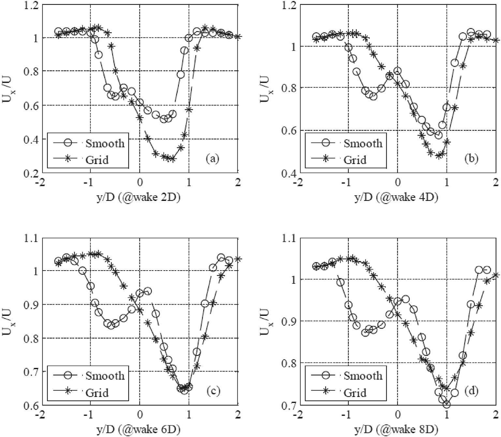

Fig. 12. Twin turbine system in wind tunnel [94].
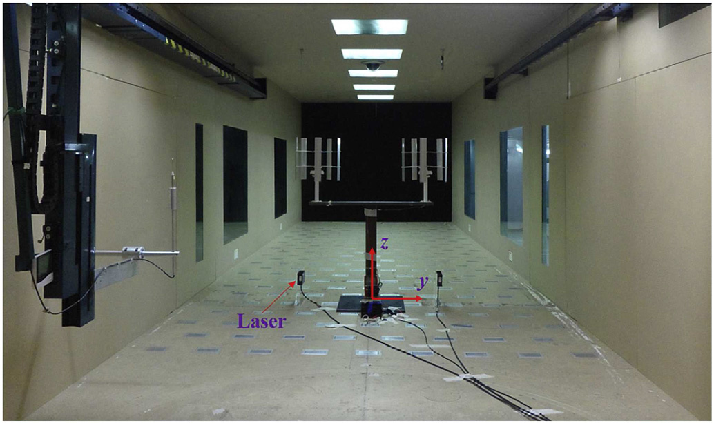

reenergized the wake for recovery. A comparative study of the magnitudes of entrained momentum indicated that the mean flow played a more important role in transporting momentum into the wake than turbulence. Hohman et al. [98] conducted a comprehensive PIV wake study in ABL flows (see Fig. 19). The wake demonstrated highly 3-D and asymmetrical wake structures, with strong deflections in the spanwise and wall-normal directions. The wake was divided into the near wake (0.5 < x/D < 1.5) and the far wake (x/D  1.5) in the wallnormal direction. Comparisons of the vortex structures in uniform and ABL flows revealed that the inflow conditions did not considerably affect the overall wake structures (see Fig. 20, with uz for angular rotation speed, U for freestream velocity and c for blade chord length). Note that Fig. 20 shows the non-dimensional vorticity normalized by the freestream velocity, i.e., uzc/U. A detailed examination of the vortical structures suggested that the

Fig. 13. Contour of vertical velocities in the y-z plane at x = 2D [] [94].
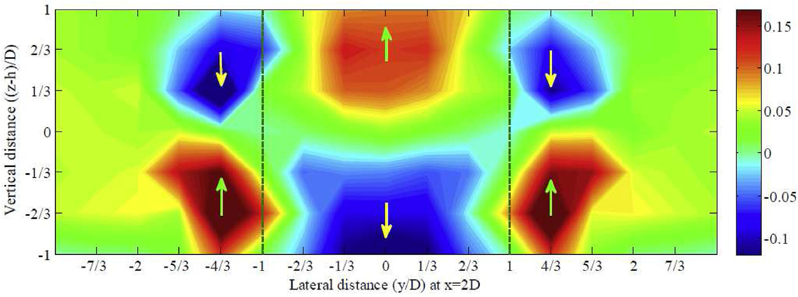

Fig. 14. Experimental setup inside the wind tunnel [95].
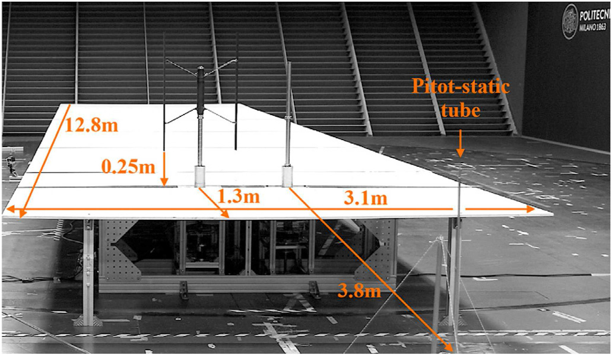

Fig. 15. Normalized streamwise velocities in x-y planes at different heights for isolated configuration (left) and 1.2D inner-downwind configuration (right) [] [95].
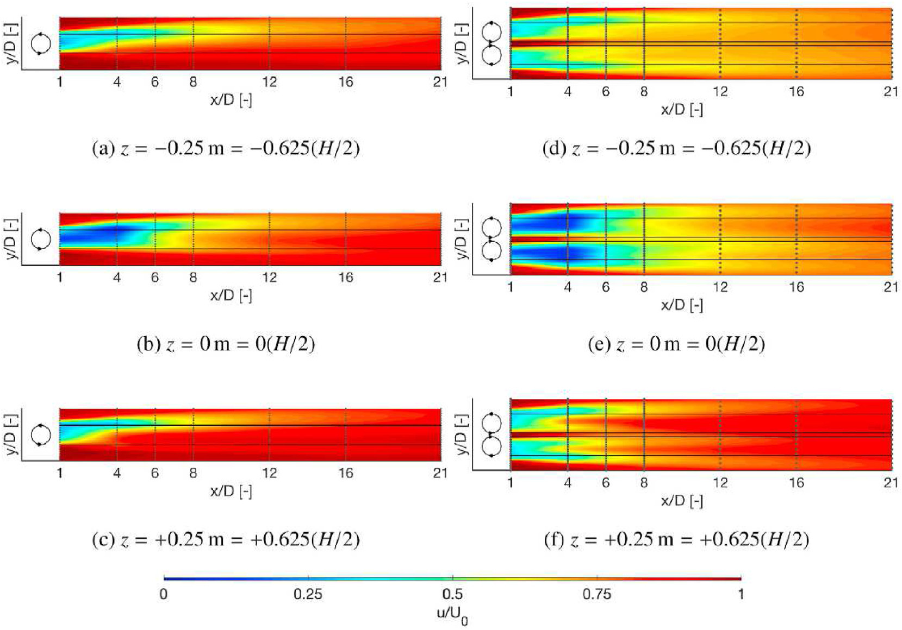

vortices exhibited reduced strength and coherence in ABL flows. In contrast, the velocity deficits increased in ABL flows. Further analysis showed that the spacing between vortex structures was associated with the blade passing frequency.

### 3.1.3. Field test

Compared with a great many of PIV tests and wind tunnel tests, there have been only a few field tests about the wake of VAWTs because of capital costs and technical difficulties. Dabiri conducted a series of field tests to assess the wind farm power density of arrays of VAWTs [17]. Over the testing period from June to September in 2010, the average wind speed and turbulence fluctuation were 7.8 m/s and 2.6 m/s, respectively. The turbine rotational speed and electrical power were measured and recorded at a sampling rate of 1 Hz. Each measurement was assigned a time stamp to synchronize with separately collected meteorological data. A meteorological tower measuring 10 m was erected 15D northwest of the nearest VAWT to avoid any flow interference. Furthermore, the wind flow differences at the meteorological tower and VAWTs were assumed non-significant by typical turbulence fluctuations of 30%e40%. The counter-rotating mechanism (CBR according to Ref. [94] helped to orient the airflow outwards. Hence, a third VAWT could be positioned in the wake of the counter-rotating VAWTs. Moreover, the vertical flux of kinetic energy from above toward the wake of VAWTs further facilitated their close spacing. To investigate the real wake properties, field measurements were performed by erecting masts with three-cup and ultrasonic anemometers (see Fig. 21) [99]. A turbine with a diameter of 2 m was installed. The reference wind speed was measured by averaging data from two ultrasonic anemometers on masts A and B. The velocity field in the wake was measured using five ultrasonic anemometers at 5 m high downstream of the wind turbine. Only the flow data from the prevailing wind direction of 270 ± 30 with a bin width of 2.5 were processed. The field measurements confirmed that the wake of VAWTs spread asymmetrically downstream (see Fig. 22). Note that UN_O denotes the streamwise wake velocity normalized by the freestream velocity. The locations of the maximum wake velocity deficits shifted toward the windward at 0.2 < y/D < 0. Moreover, it was predicted that the wake recovered in the proximity of x/D = 3.3 and x/D = 4.5 downstream at reference wind speeds of 5.0 m/s and 9.0 m/s, respectively. The

Fig. 16. PIV test of near wake of a VAWT [19].
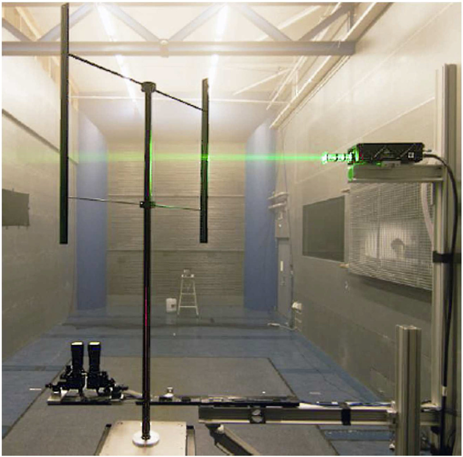

Fig. 17. Contours of normalized out-of-plane vorticity for the combined field of views of the horizontal plane [] [19].
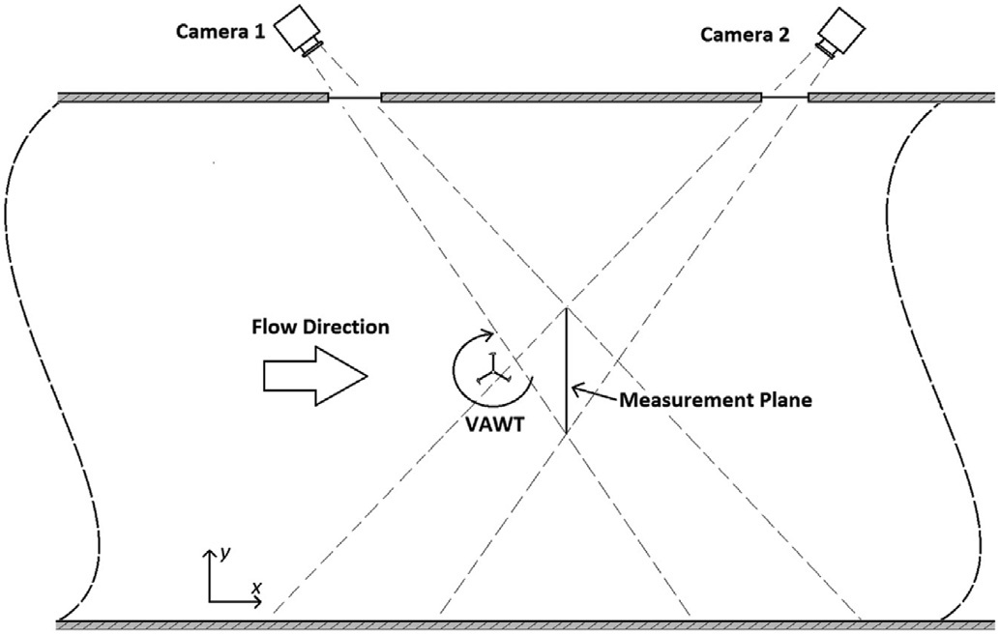

Fig. 18. Top view of stereoscopic PIV setup [97].
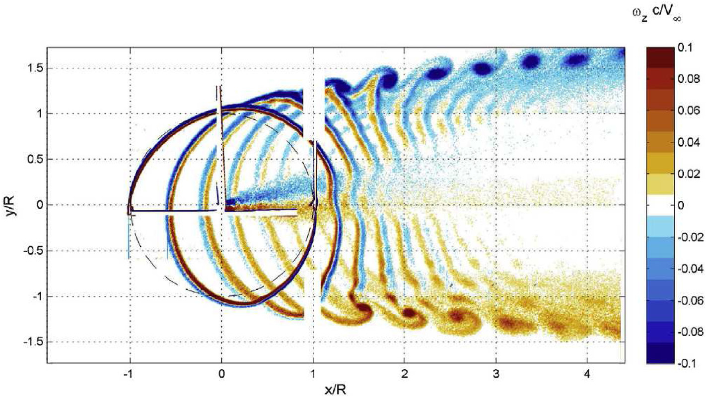

predicted wake recovery was much faster than the results by Peng et al. [53]. Kinzel et al. [18] conducted field tests to investigate the energy exchange for wake recovery in a wind farm consisting of 18 counter-rotating VAWTs in the Antelope valley of California. The velocity field was measured at 11 downwind locations along the centerline of turbine arrays using a portable meteorological tower with 7 vertically-staggered anemometers. The results showed that the freestream velocity slowed down 1.5D upwind of the first turbine pair due to blockage effects. The velocity continued to drop after passing through the first turbine pair due to energy extraction. Afterwards, the velocity gradually recovered as energy transfer from the above and sides of VAWTs occurred. The energy extraction and recovery cycle repeated as the flow went downwind through different turbine pairs. The flow velocity recovered very fast to 95% of the upwind value within 6D compared to 14D required for HAWTs. Results of the planform energy flux per area, -ru<u0w0> with u for streamwise velocity, and u0 and w0 for fluctuating components of streamwise and vertical velocities, respectively, showed that energy was injected into the wake mainly from the top of turbine canopy and partially from below the rotor region. Hence, the total energy available in a wind farm is the sum of the planform energy flux and energy transferred from sides.

### 3.2. Numerical simulation

A CFD method was established based on the conservation laws of physics, namely continuity conservation, momentum

Fig. 19. Experimental setup for stereoscopic PIV testing [98].
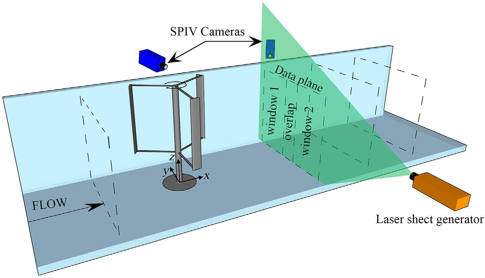

Fig. 20. Vorticity of z component, uzc/U, in uniform and ABL flows at the azimuthal angle of q = 0 and BSRs of l = 1 and l = 3 [-] [98].
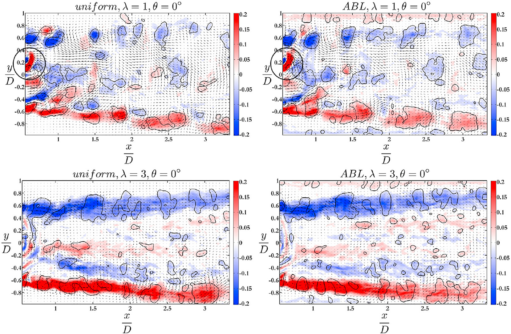

conservation, and energy conservation [100,101]. In CFD analysis, fluids are examined at the macroscopic scale, while molecular properties are ignored. The powerful computational and postprocessing capability of CFD simulations makes it suitable for calculating and visualizing the complex wake flow structures of VAWTs. RANS, LES, and DES were the main modeling methods used in wake studies.

### 3.2.1. RANS modeling

In RANS modeling, the flow properties are written by applying Reynolds decomposition to have the time-averaged quantities and fluctuating terms. With the continuity and momentum equations applied, the RANS equations can be constructed [100,101]. In the literature, Different types of turbulence models have been proposed to resolve the unknown Reynolds stresses in the RANS equations [102,103]. Ferreira et al. conducted 2-D RANS CFD simulations of a singlebladed VAWT to analyze dynamic stall and vortical structures in the near wake [131]. Both the one-equation SpalarteAllmaras (SeA) model [103] and the two-equation Re-normalization group (RNG) keε model [104] were used for turbulence modeling. The moving sub-grid method was used to model the rotor movement. By comparing with PIV results, it was found that the RNG keε model outperformed the S-A model in estimating the average vortical distributions, for instance, the rolling up of the trailing-edge vortices. The study examined the effect of a single blade on the flow field rather than the collateral effects of all blades.

Fig. 21. Field tests for wake measurements [99].
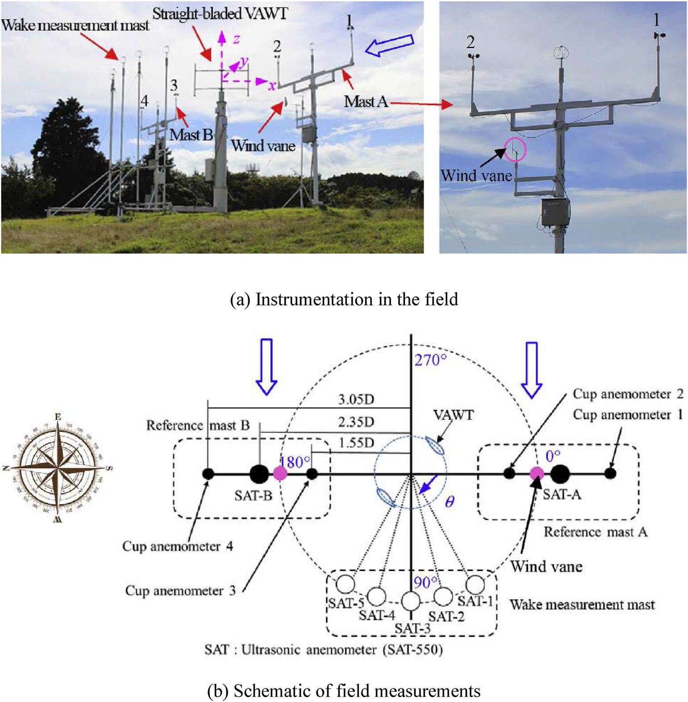

Fig. 22. Normalized wake velocities from field measurements and Gaussian pre- dictions [] [99].
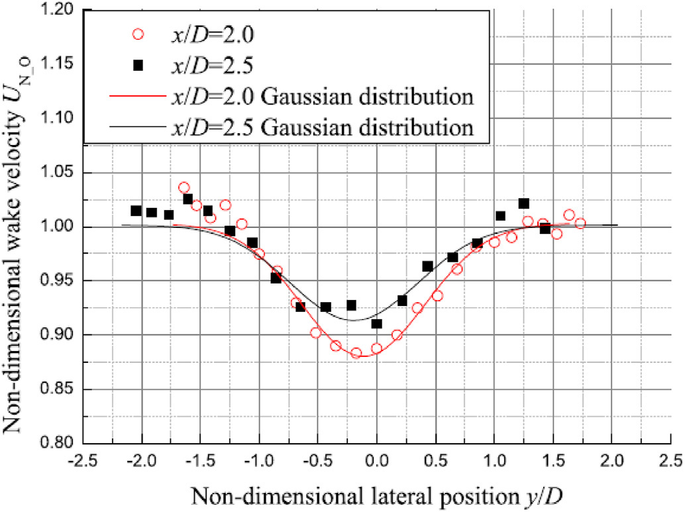

dictions [] [99].

To obtain a comprehensive understanding of the wake, Lam and Peng [52] carried out both 2-D and 3-D CFD simulations of a complete H-rotor VAWT (see Figs. 23 and 24). The sliding mesh technique was used with a structured mesh. The transition SST model [41] was applied for turbulence modeling, and the prediction results were validated against PIV test data [19]. The results confirmed the asymmetrical wake spreading in the horizontal direction. The vorticity magnitude, meaning the magnitude of the curl of velocity vector with units of 1/s to describe the maximum circulation of flows, was obtained (see Figs. 25 and 26). Figs. 25 and 26 show the vorticity magnitude in the blade mid-span and bladetip planes, respectively, together with that in the vertical plane 1D downstream. The color represents the intensity of vorticity. The turbulent structures at the blade tips were far more intense and violent than those at the blade mid-span, and the former induced large drag forces. Because the vortices generated at the blade tips were not considered, the 2-D CFD model inevitably overestimated the power performance. The 3-D CFD simulation was necessary to comprehensively understand the wake structures and accurately predict the power performance. Zuo et al. [77] assessed the power performance of two VAWTs installed in tandem by 2-D CFD simulations. The dynamic grid method was applied to simulate turbine rotation. The distance between the turbines was varied from 5D to 17D in steps of 2D, and the effect of distance was examined. The z-vorticity perpendicular to x-y plane was plotted, and red meant the vortex rotated in counterclockwise while blue indicated the clockwise rotation (see Fig. 27). The wake flow of the downstream VAWT was noticeably influenced by its upstream counterpart, and exhibited strong turbulence with larger-scale vortical structures. As the distance increased to 15D, the wake interference became negligible. Meanwhile, the power performance of the downstream VAWT increased more or less linearly with the interval distance. Sahebzadeh et al. [105] performed CFD simulations using transition SST [41] to investigate the relative spacing (1.25d  R  10d, d for turbine diameter) and relative angle (90 = F  90) of corotating VAWTs for optimal layout design (see Fig. 28). Considering the inevitable variation of wind directions, averaged CP of corotating VAWTs reached 90% of the isolated one at R  1.75d. Hence, the compact arrays of VAWTs with high power density was evidently confirmed. The results served the layout design of VAWT wind farms, supporting the wind energy harnessing in a commercial scale.

Fig. 23. Schematic of 2-D CFD modeling [52].
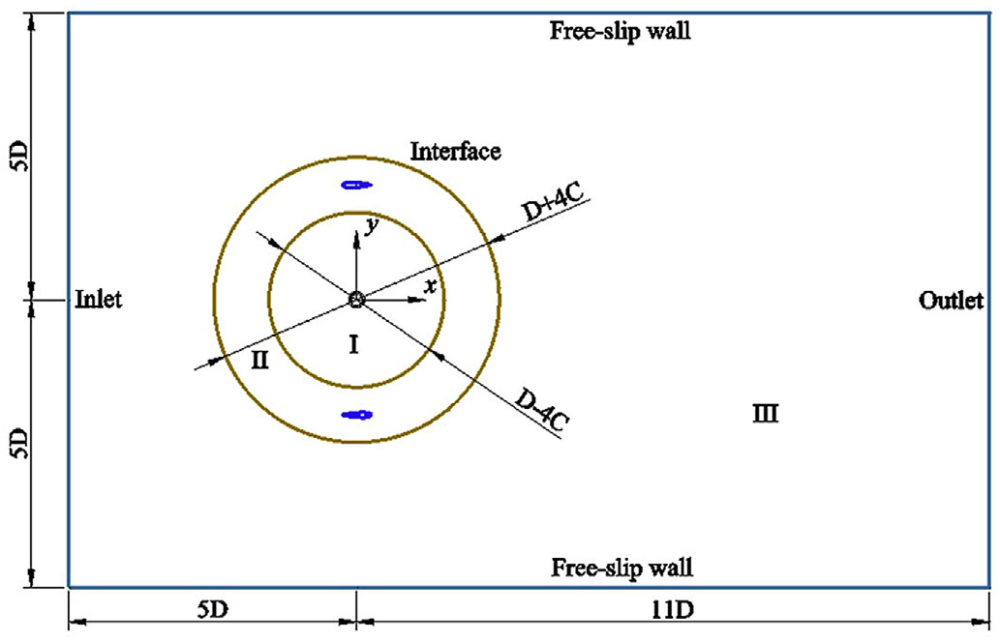

Fig. 24. Schematic of 3-D CFD modeling [52].
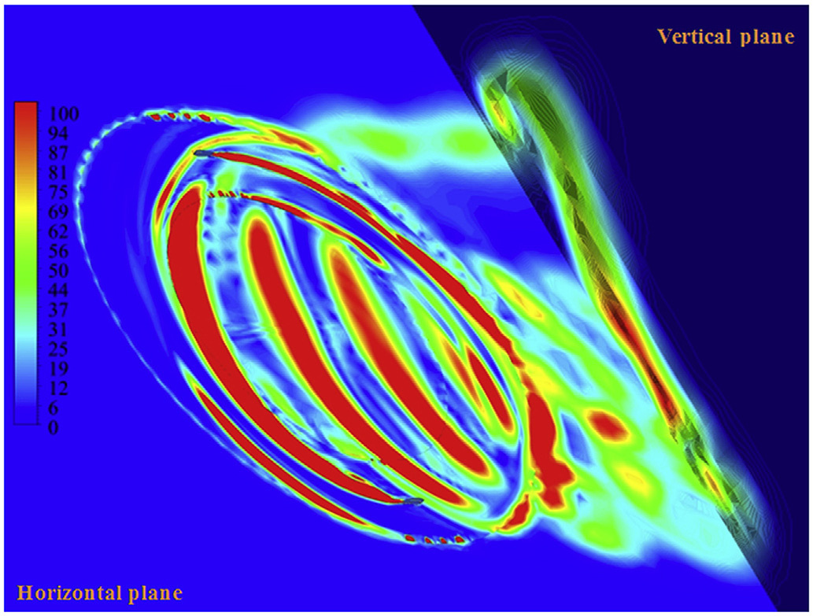

Fig. 25. Vorticity magnitudes in the blade mid-span and vertical planes (units, 1/s) [52].

[52].

Fig. 26. Vorticity magnitudes in the top blade-tip and vertical planes (units, 1/s) [52].

### 3.2.2. LES modeling

In LES models, large-scale eddies (anisotropic) are directly resolved with small-scale eddies (isotropic) modeled using subgrid scale (SGS) models. Unlike the time-averaging method in RANS models, LES performs spatial filtering of the Navier-Stokes equations with a filter width of D [106]. After implementing the filter operation, the flow properties can be decomposed into directly solved quantities and modeled quantities. As a result, the filtered Navier-Stokes equations can be constructed. In the literature, a series of SGS models have been developed to calculate these SGS stresses in the filtered Navier-Stokes equations [106e108]. Shamsoddin and Porte-Agel [109] were among the first scholars to perform LES studies of the wake of H-rotor VAWTs. The Smagorinsky model [106] and the modulated gradient model (MGM) [110] were adopted to model the SGS stresses. Instead of directly resolving the boundary layer flows by LES, the actuator sweptsurface model (ASSM) and the actuator line model (ALM) were developed to calculate the turbine-induced forces. In doing so, the computational cost was substantially reduced. In a comparison with experimental data, the ALM yielded superior wake predictions over the ASSM. The MGM was able to capture the mean and turbulent flow properties more accurately than the Smagorinsky model. The wake structures of an H-rotor VAWT were studied using a complete LES model including blade tips [111]. The wake characteristics were examined at a lower and higher BSRs of 1.35 and 2.21, respectively. The LES prediction results exhibited good qualitative agreement with PIV results. To identify the vortical structures surrounding the turbine, iso-surfaces of low pressures colored by the vorticity magnitude were produced (see Fig. 29). The results revealed that at the lower BSR, larger coherent structures were generated, and these structures exhibited higher asymmetry due to higher AOAs, which further induced a stronger dynamic stall. BSR was a critical parameter for determining wake characteristics, and further research was required to analyze this correlation. Peng et al. [43] comprehensively studied the VAWT wake using a full-scale LES model. The algebraic wall-modeled LES was used [112]. Quantitative comparisons between the LES-predicted and measured wake velocities showed good agreement. At higher BSRs, the occurrence of dynamic stall was suppressed, consistent with the findings of Posa et al. [111]. The causes for wake asymmetry were addressed. First, the deep dynamic stall induced by the advancing rotor caused strong vortex shedding along the windward. Second, the Magnus force helped transport the wake flows towards the windward. The vortex-ring structures, counterrotating vortical motions and wake asymmetry were regarded as the signature features of VAWT wakes. Hezaveh et al. [113] investigated the effects of turbine parameters on the wake development of an H-rotor VAWT by LES. Similar to the work of Shamsoddin and Porte-Agel [109]; ALM was used to capture the blade-to-turbine-scale flow dynamics, while LES was applied to resolve the turbine-to-farm-scale flow structures. The turbine parameters could alter the wake shapes and intensities. Also, the turbine aspect ratio was considered as the most important parameter in the design of cluster configurations. Once the aspect ratio was fixed, the optimal turbine solidity could be inferred. Posa [114] examined the wake interactions of three types of twin VAWTs using LES. The twin turbine configurations were similar to the twin units considered by Ref. [94]. The iso-surfaces of pressures colored by the vorticity magnitude were attained to visualize the vortical structures of three types of coupled VAWTs (see Fig. 30). Subfigures at the left-hand side showed the vorticity field of three coupled VAWTs at a BSR of 2.21 compared with that to the right-hand side at a BSR of 1.35. The computational results indicated that the blockage effect helped increase the momentum flux between twin turbines, even at downstream locations. The blockage effect, rather than mutual vortex suppression, was considered the primary reason for the improved power performance of twin units.

Fig. 27. Vorticity plots of two VAWTs in tandem (units, 1/s) [77].
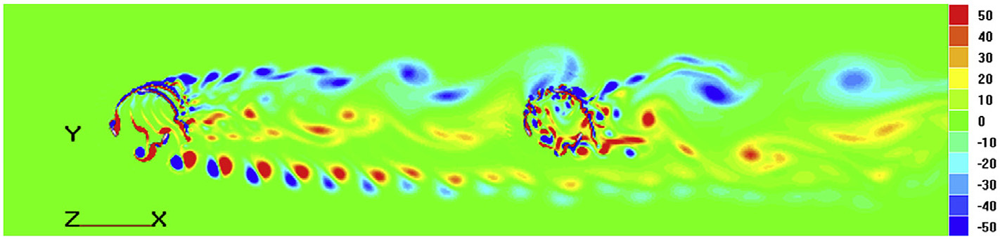

Fig. 28. (a) Computational domain and (b) schematic of R and F [105].
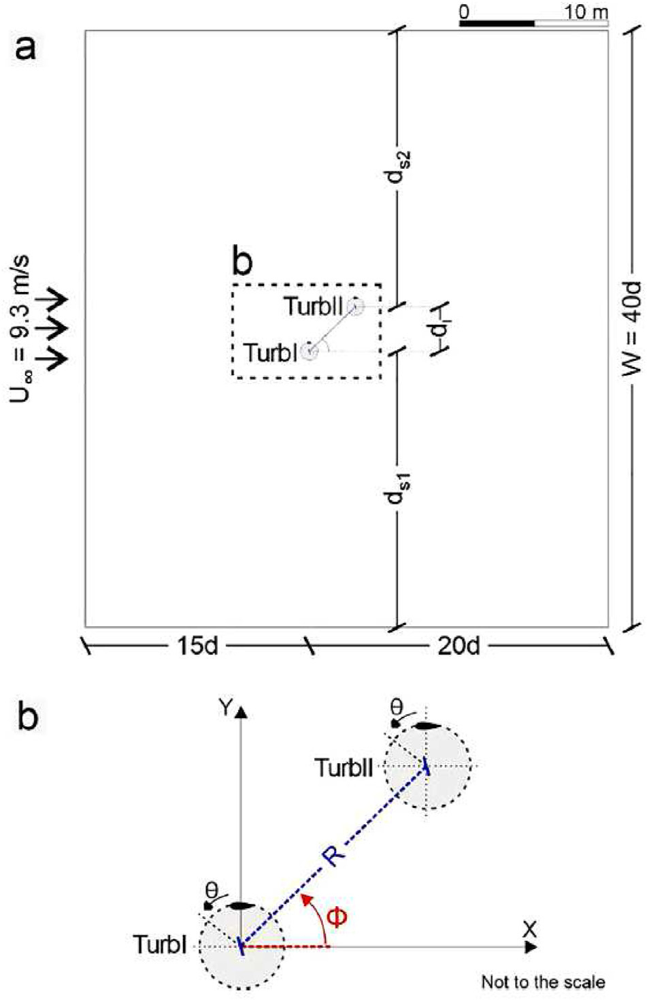

The above LES studies were performed in low-turbulence smooth flows, although researchers have claimed that turbulence benefits VAWTs. In recognition of this, Peng and Lam [71] used LES to investigate the wake in both smooth and turbulent flows. The VAWT exhibited delayed dynamic stall, and its power performance in the turbulent flow was considerably better than in the smooth flow. More importantly, two pairs of counter-rotating vortex-ring structures were found in both flow regimes (see Fig. 31). Fig. 31 is viewed against the wind direction. The turbine rotated counterclockwise (viewing from the top). The yellow arrows show the flow circulation direction, indicating the existence of vortex structures. The counter-rotating vortices contributed to flow entrainment, resulting in fast wake recovery and indicating the high packing density of VAWTs. Tthe counter-rotating vortices exhibited considerably larger deformations in the turbulent flow than in the smooth flow. The strong shear flows and turbulent fluctuations were attributed to the highly distorted vortical structures in the wake (see Fig. 32). Note that the vortical structures spreading downstream in the turbine wake in Fig. 32 was identified by the Q criterion [115]. For small-scale VAWTs, the approaching flows can be assumed to have uniform distributions. Nevertheless, large-scale VAWTs are inevitably operated in ABL flows. Abkar and Dabiri [116] conducted an LES study to examine the wake structure of a large-scale VAWT with a diameter of 26 m and operating in an ABL flow. To assist with LES calculations, the actuator line technique was applied to parameterize the blade-induced forces, namely lift and drag. The wake gradually shifted upward downstream due to ABL. The velocity deficits at different BSRs in the wake exhibited self-similar patterns following a Gaussian distribution. Inspired by the results, a wake model was proposed to predict the velocity deficit downstream, which is presented in detail in Section 3.3. [117] investigated the dependence of momentum recovery on dynamic solidity sD using LES. The momentum deficits were found dominated by negative cross-stream advection and negative pressure transport. The collapse of wake shear layers induced by rotating blades promoted the wake recovery. Moreover, turbines of higher dynamic solidity generally experienced stronger velocity deficits and sharper reductions in deficits (see Fig. 33). Though cases d and f had similar sD, case f recovered faster due to the destabilization of shear layers. Higher velocities of blades like case f would exercise stronger influence on the instability of shear layers and experienced faster wake recovery. As a continued work, the BSR effect on the wake characteristics was assessed based on LES [118]. The wake features were found strongly dependent on the BSR. Increasing BSR caused large velocity deficits and contributed to fast wake recovery. The BSR and dynamic solidity had similar impacts on the velocity deficit and wake recovery. Besides, turbulent kinetic energy downstream in the wake became augmented with increasing BSR. Strengthened turbulence would induce the destabilization of shear layers and hence the wake recovery.

Fig. 29. Iso-surface plots of pressure in the rotor region colored by the vorticity magnitude (units, 1/s): (a) BSR = 1.35 and (b) BSR = 2.21 [111].
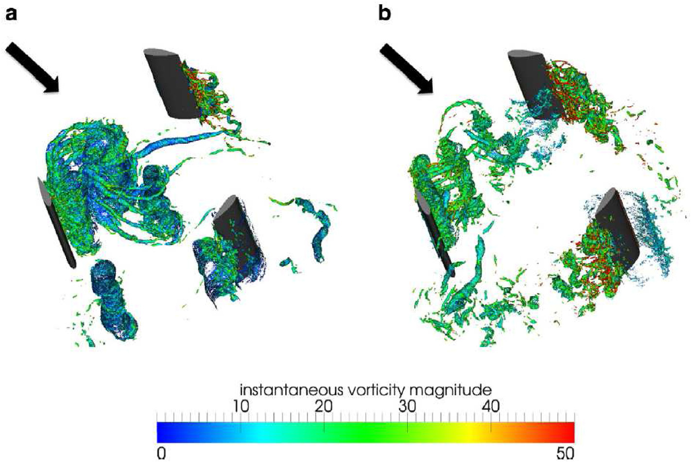

Fig. 30. Iso-surface plot at BSR = 2.21 (left) and BSR = 1.35 (right), colored by vorticity magnitude (units, 1/s): (a) coupled configurations C1, (b) C2, and (c) C3 [114].
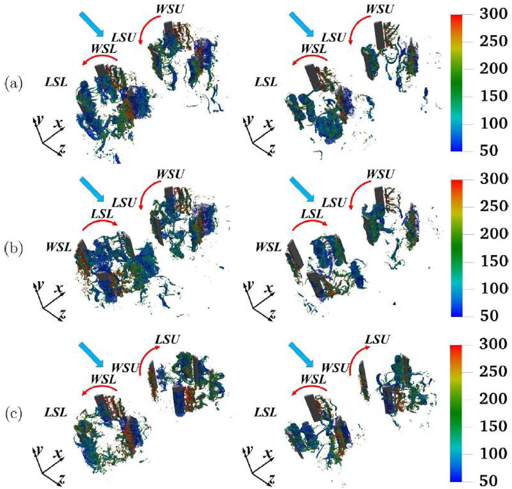

magnitude (units, 1/s): (a) coupled configurations C1, (b) C2, and (c) C3 [114].

### 3.2.3. DES modeling

The standard LES models encountered computational difficulties, particularly in near-wall regions. Spalart et al. [119] proposed a hybrid model that combined the best aspects of RANS and LES methods in one solution strategy. This hybrid technique is named as the detached eddy simulation (DES) approach where the RANS models are employed in boundary layers, while the LES treatment is applied to separated regions [120]. Villeneuve et al. [121] improved the efficiency and wake recovery of H-rotor VAWTs via installing detached end plates (DEPs) below and above blade tip ends (see Fig. 34). The delayed DES model [122] was used for analysis. Though the blade tip vortices were present for turbines with circular and semi-annular DEPs, the vortices were far less intense (see Fig. 34). As the tip vortices were alleviated and redirected towards mid spans, both the power efficiency and the wake recovery of turbines with DEPs were noticeably improved. Scholars extend the wake studies to floating VAWTs. Lei et al. [123] investigated the wake of floating H-rotor VAWTs with pitch and surge motions (see Fig. 35) by the improved delayed DES approach. The wake characteristics were examined under various pitching and surging amplitudes and periods. ‘Spindle’-type of wake structures were produced under the surge motion. The strength and core zone of the ‘Spindle’ structures moved downstream and weakened with the progress of the surge motion (see Fig. 36). The pitch motion significantly altered the wake profiles, which further escalated downwind.

### 3.3. Wake model development

The wake aerodynamics of H-rotor VAWTs are considerably more complex than their HAWT counterpart due to dynamic stall. Hence, further efforts are needed to develop wake models fit for VAWTs. In general, the wake region can be divided into the near wake up to approximately 2D downstream and the far wake region stretching farther away [97,98]. Studies on the near and far wakes aim to improve the performance of standalone and multiple VAWTs, respectively. Studies of the near wake focus primarily on rotor aerodynamics, including dynamic stall and tip vortices. In contrast, studies of the far wake focus on mutual interference of multiple turbines in wind farms.

### 3.3.1. Near-wake model

The near wake involves drastic evolution of turbulence due to dynamic stall and interference of blades. The blades traveling in the downstream half-revolution interact with the vortices shed during the upstream half-revolution, causing interference. Direct modeling of the complex aerodynamics in the near wake would be impractical. Tescione et al. [44] investigated the near wake of an Hrotor VAWT using the panel method coupled with a free-vortex wake. The model was built by assuming an incompressible and potential flow [124]. Given this assumption, the velocity potential can be obtained using a boundary integral equation: 4 = 1 4p ð body 1 r s þ v vn 1 r  m  dS þ 1 4p ð wake v vn 1 r  mdS þ 4∞ (1) where S represents the boundary surface of a body or a wake, r is the distance from the point at which 4 is evaluated to an integration point on the surface S, n is the distance normal to the surface, s denotes the source distribution, m represents the doublet distribution, and 4∞is the freestream potential. In the near-wake model, the wake was modeled as a curved lattice consisting of straight vortex filaments. As shown in Eq. (1) (the second integral), the wake contributed to the velocity potential through the doublet influence m. Given the equivalence of the doublet and vortex distributions [125], the model shifted from doublets to vortex

Fig. 31. Streamline plots at x = 2D downstream: (a) at q = 55 in the smooth flow and (b) at q = 75 in the turbulent flow [71].
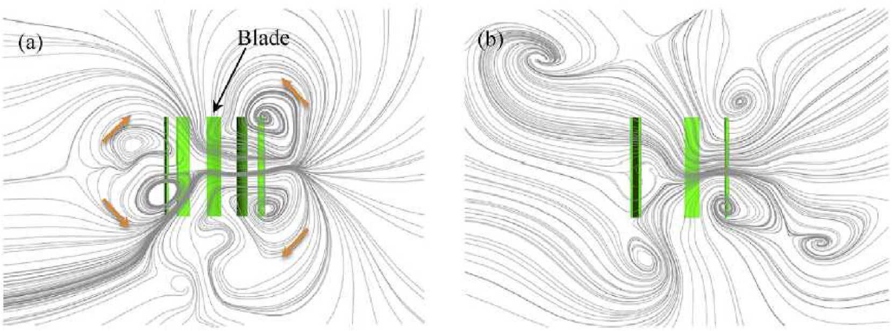

Fig. 32. Iso-surface plot of Q criterion in turbulent flow (units, 1/s2) (Q = 100, q = 75) [71].
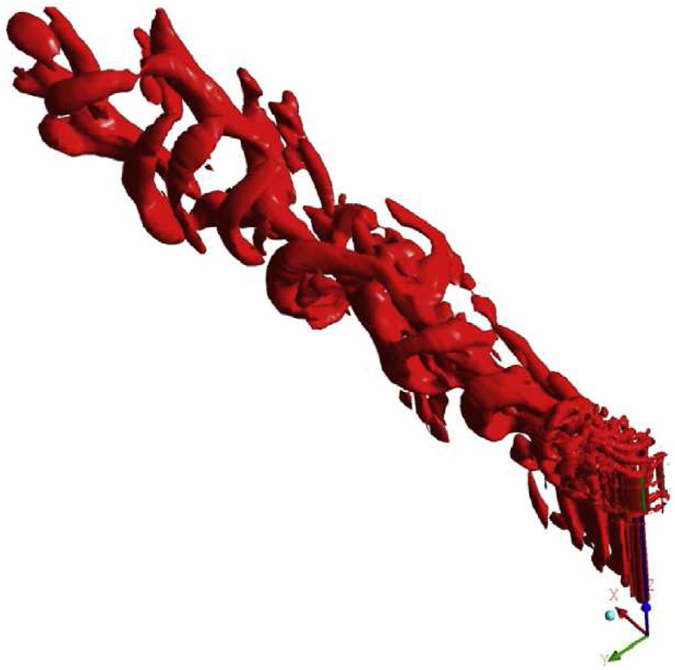

[71].

filaments after a few time steps to better manage the wake deformation. More detailed modeling information can be referred to Ref. [44]. The wake aerodynamics were computed for a VAWT operating at a BSR of 4.5. The calculation results agreed well with the experimental data (see Fig. 37), indicating that the model was able to capture the important near-wake dynamics. Even so, the near-wake model underestimated the horizontal and vertical expansions downstream along the windward. The deep dynamic stall, strong tip vortex shedding, and complex blade-wake interaction in the near wake were the primary challenges hindering accurate predictions.

### 3.3.2. Far-wake model

The far wake refers to the region downstream of the near wake. The far-wake flows are slightly affected by Reynolds number and geometrical effects of turbines, and they demonstrate selfsimilarity [116,126,127]. Hence, the far wake is more suitable for wake modeling than the near wake. Far-wake modeling is useful for designing the layout of wind farms housing multiple turbines via minimizing the mutual wake interference. Abkar and Dabiri [116] conducted LES studies of the far wake of a VAWT and then constructed a far-wake model. The velocity deficits in the far wake exhibited self-similar patterns. Hence, a 2-D Gaussian distribution of the velocity deficit was assumed. Based on mass and momentum conservation, an analytical model was developed to predict the wake velocity. If the viscous and pressure terms in the momentum equation are neglected, the momentum deficit flow rate across the wake is conserved and equals the thrust force over the turbine as follows [116,128,129]: r ð UwðU  UwÞdS = Tr (2) where Uw denotes the wake velocity, U is the freestream velocity, S represents the wake area, and Tr is the thrust force. The velocity deficit DU(x) at a downstream distance x is defined below: DUðxÞ = U  UwðxÞ (3) By applying the self-similarity and 2-D Gaussian assumption to the wake velocity, the following equation can be obtained: DUðxÞ DUðxÞmax = e  rðxÞ2 2seqðxÞ2 (4) where DU(x)max denotes the maximum velocity deficit downstream of x, r(x) is the radius of the wake region at x, and seq(x) represents the equivalent standard deviation of the Gaussian velocity-deficit profile at each x. seq(x) is defined: seqðxÞ = ffiffiffiffiffiffiffiffiffiffiffiffiffiffiffiffiffiffiffiffiffi syðxÞszðxÞ q (5) where sy and sz are the standard deviations of the 2-D multivariate Gaussian distribution in the y and z directions, respectively, fitted to the velocity-deficit fields. By combining Eqs. (3) and (4), the wake velocity is formulated: UwðxÞ = U 

B B @1  DUmax U  e  rðxÞ2 2seqðxÞ2

C C A (6) The thrust force Tr can be expressed: Tr = 1 2CrrAU2 (7) where Cr is the thrust force coefficient obtained via CFD calculations, and A = H  D (blade depth  turbine diameter) is the projected frontal area of the wind turbine. By substituting Eqs. (6) and (7) into Eq. (2) and integrating from 0 to ∞, the maximum velocity deficit can be obtained: DUðxÞmax U = 1  ffiffiffiffiffiffiffiffiffiffiffiffiffiffiffiffiffiffiffiffiffiffiffiffiffiffiffiffiffiffiffiffiffiffiffiffiffiffiffi 1  Cr 2pseqðxÞ2A s (8) For further details about the formulations, please refer to Abkar and Dabiri [116]. In this model, wake asymmetry was not considered. As discussed above, the wake of H-rotor VAWTs is inherently asymmetrical due to dynamic stall and the Magnus effect. To address this problem [78], developed an analytical model to consider the wake asymmetry. In their model, the wake region at a given downstream distance was assumed to be encompassed by

Fig. 33. Contours of normalized streamwise velocity deficits: (a) sD = 0.26, (b) sD = 0.32, (c) sD = 0.55, (d) sD = 0.66, (e) sD = 0.73 and (f) sD = 0.67 [-] [117].
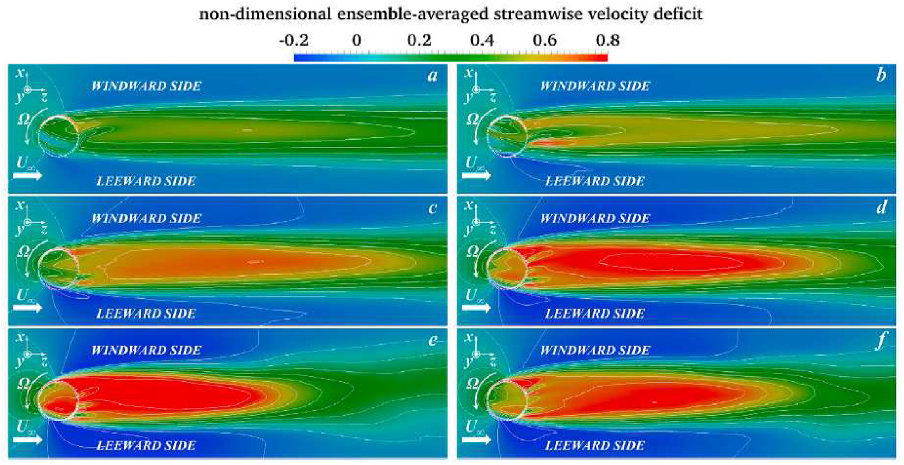

two semi-ellipses expanding linearly downstream (see Fig. 38). In the model, a constant velocity was assumed at a given wake distance. Based on the continuity conservation at the turbine position (x = 0), the following equation can be constructed with elliptical wake area assumption: rp H 2D bv0 þ r 1 2 p  krWðxÞrUðxÞk þ krLðxÞrDðxÞk  H D b  U = r 1 2 pðkrWðxÞrUðxÞk þ krLðxÞrDðxÞkÞUwðxÞ (9) where v0 denotes the wake velocity at x = 0; U is the freestream velocity; Uw is the wake velocity at a downstream distance x; rW, rL, rU, and rD represent the semi-axes of the ellipses along the windward, leeward, upward, and downward directions, respectively, at x (see Fig. 38); D is the turbine diameter; and || || is the norm operator. Based on linear expansion of free shear flows [128] and wake measurement results [53], the wake edges are assumed to spread linearly in horizontal direction in the symmetry plane (z = h) (see Fig. 38): rW = kW x D þ b rL = kL x D  b

> > = > > ; (10) where kW and kL are the spreading rates along the windward and leeward, respectively, and b is a constant. kW, kL and b can be be

Fig. 8. Time-averaged normalized streamwise velocity along z = h [] [53].

the linear expansion assumption in Eq. (10), the wake edges spread linearly in the vertical direction at y = 0: rU = kU x D þ 1 2 h rD = kD x D  1 2 h

> > = > > ; (11) where h = H/D is the turbine aspect ratio, and kU and kD, equal to each other, are the spreading rates along the upward and downward directions, respectively. By using Eqs. (9)e(11), the normalized wake velocity at a given downstream distance can be determined:

Fig. 34. The magnitude of vorticity vector in the wake of three turbines (units, 1/s) [121].
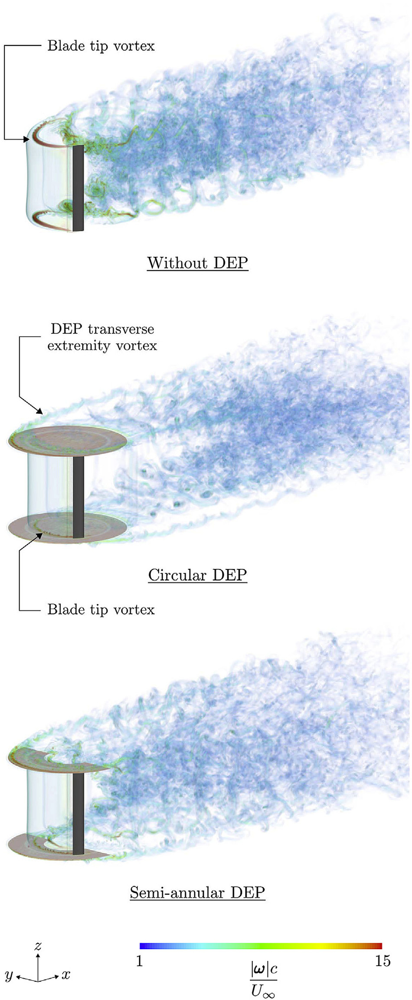

[121].

Fig. 35. Six degrees of freedom for an offshore floating VAWT under wind and wave loads [123].
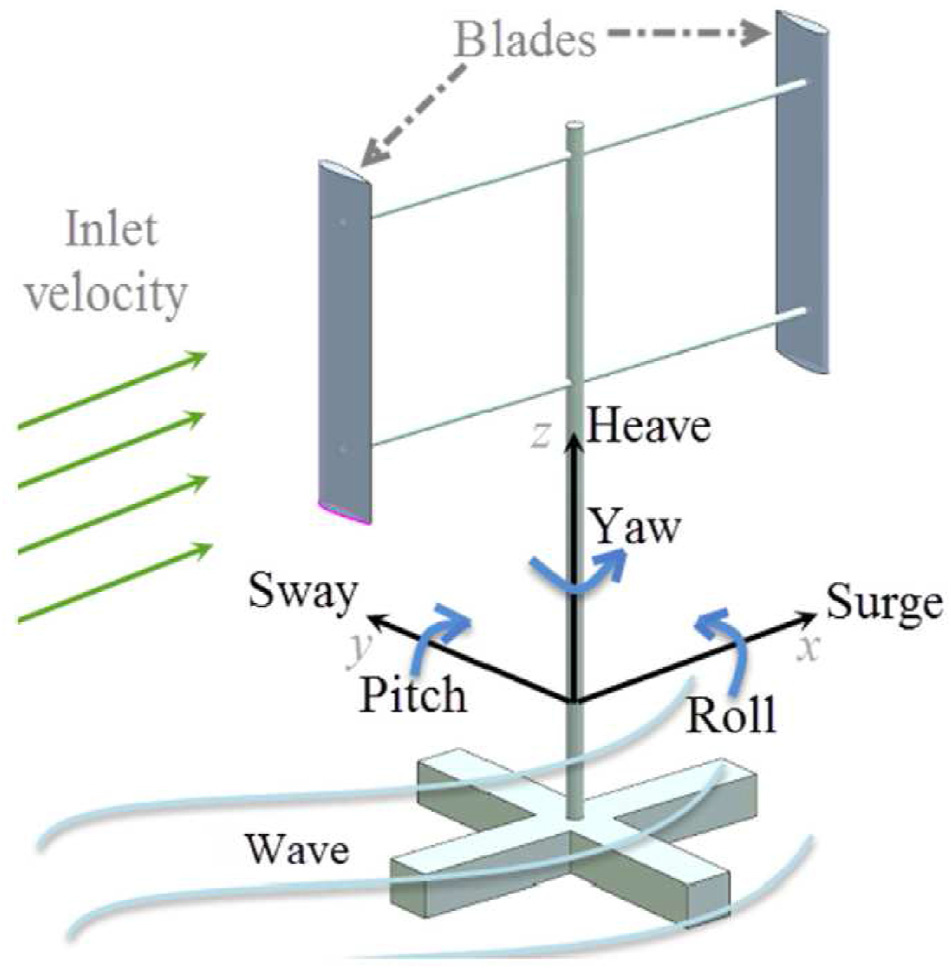

loads [123].

Fig. 36. Contours of the normalized wake velocity in the vertical plane at non-surge condition and four critical surging stages [] [123].
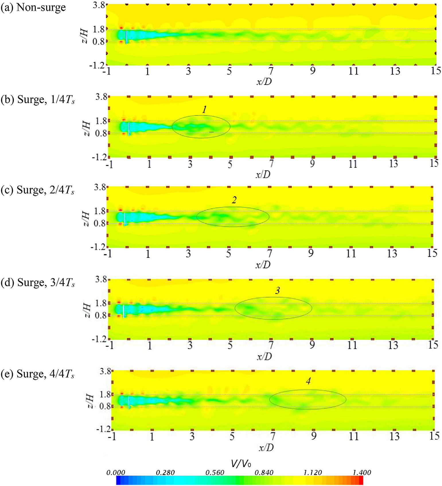

Fig. 37. Comparison of theoretical and experimental normalized streamwise velocity contours in the mid-plane [] [44].
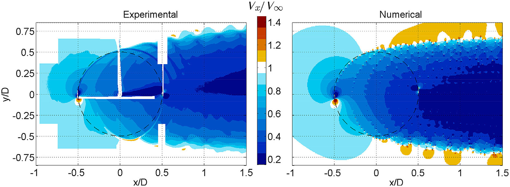

U0 w = 1  2bhv△

ðkW þ kLÞ x D þ 2b

2kU x D þ h

(12) where vD = (Uv0)/U represents the velocity deficit at the turbine center (x = 0). By substituting kW, kL and b to Eq. (12) and thereby fitting Eq. (12) to the measured normalized wake velocity, kU, kD, and vD can be attained. This wake model was further applied to the layout design of VAWTs in a wind farm (see Fig. 39). To use the wake model, parameters from three aspects are required: (1) basic turbine parameters, e.g., turbine diameter, blade depth, power curve, etc., and model factors, e.g., spreading rates, spreading constant, and velocity deficit at the turbine center; (2) wind statistics like wind speed and direction distributions, and wind farm dimensions; and (3) optimization algorithm. The yellow squares represent the initial positions of VAWTs. In contrast, the green circles show the optimized positions of VAWTs after implementing optimization. By using this wake model, the layout of VAWTs can be designed to avoid regions with large velocity deficits. As shown in Fig. 39, turbines in the optimal layout are positioned as far away from each other as possible to minimize mutual interference and thereby maximize their total power outputs. In general, the power output of VAWTs in the optimal layout can be approximately 11% higher than that in the initial layout. For further details about the wake model and the layout design, please refer to Ref. [78].

## 4. Conclusions

This paper reviewed the basic categories of VAWTs and the significant progress in studies of the wake aerodynamics of H-rotor VAWTs. The main purpose of wake studies, which are still in their nascency, is to reduce mutual interference, and thereby maximize the total power output of multiple VAWTs. In this review, the recent progress of wake characteristics of VAWTs is examined in terms of research methods, e.g., experiment analysis, numerical simulation, and theoretical development. The wake region can be divided into the near wake and far wake. The near wake spans approximately two rotor diameters downstream and is characterized by dynamic stall behaviors, e.g., vortex shedding, rolling up, detachment, reattachment, etc. The far wake is less influenced by Reynolds number and geometrical effects and demonstrates self-similarity, and is suitable for wake modeling. The wake demonstrates strong asymmetry in the horizontal direction due to the occurrence of deep dynamic stall at windward and the Magnus effect and shifts slightly downward in the vertical direction. The counter-rotating vortical structures constituted the most important mechanism for imparting momentum to the wake for recovery. Given the special vortical structures, efficient twin and triangular array units of VAWTs can be configured for potential order-of-magnitude enhancement of packing density. Apart from configured array units, far-wake models can be constructed based on either momentum or continuity conservation. To use the asymmetrical far-wake model for layout design, parameters from three aspects are required: (1) basic turbine parameters, e.g., turbine diameter, power curve, etc., and model factors, e.g., spreading rates, velocity deficit at turbine center, etc.; (2) wind statistics and wind farm dimensions; and (3) optimization algorithm. In general, the power output of VAWTs in the optimal layout can be over 10% higher than in the initial layout. The wake studies have been in their nascency, most of which were performed in low-turbulence smooth flows. In the future, significant research efforts will be required to examine the wake aerodynamics, especially in grid-turbulence and ABL flows, to reflect the real operating conditions of VAWTs.

Fig. 38. Schematic of the wake model [78].

Fig. 39. Layout of VAWTs in the wind farm [] [78].
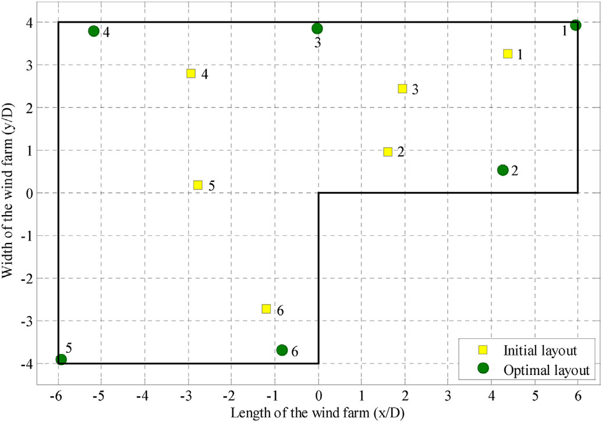

## Declaration of competing interest

The authors declare that they have no known competing financial interests or personal relationships that could have appeared to influence the work reported in this paper.

## Acknowledgements

The work described was supported by grants from the National Natural Science Foundation of China (Project No. 51808174), National Natural Science Foundation of China (Project No. 51978221), and Science and Technology Program of Shenzhen, China (Project No. JCYJ20180306171737796).

## References

[1] Tai FZ, Kang KW, Jang MH, Woo YJ, Lee JH. Study on the analysis method for the vertical-axis wind turbines having Darrieus blades. Renew Energy 2013;54:26e31. [2] AshrafiZN, Ghaderi M, Sedaghat A. Parametric study on off-design aerodynamic performance of a horizontal axis wind turbine blade and proposed pitch control. Energy Convers Manag 2015;93:349e56. [3] Ghasemian M, AshrafiZN, Sedaghat A. A review on computational fluid dynamic simulation techniques for Darrieus vertical axis wind turbines. Energy Convers Manag 2017;149:87e100. [4] Wong KH, Chong WT, Poh SC, Shiah YC, Sukiman NL, Wang CT. 3D CFD simulation and parametric study of a flat plate deflector for vertical axis wind turbine. Renew Energy 2018;129:32e55. [5] Danao LA, Eboibi O, Howell R. An experimental investigation into the influence of unsteady wind on the performance of a vertical axis wind turbine. Appl Energy 2013;107:403e11. [6] Jin X, Zhao G, Gao K, Ju W. Darrieus vertical axis wind turbine: basic research methods. Renew Sustain Energy Rev 2015;42:212e25. [7] Wang L, Tan CC, Gu Y. Comparative study on optimizing the wind farm layout using different design methods and cost models. J Wind Eng Ind Aerod 2015;46:1e10. [8] Tian W, Ozbay A, Hu H. An experimental investigation on the aeromechanics and wake interferences of wind turbines sited over complex terrain. J Wind Eng Ind Aerod 2018;172:379e94. [9] Kumar R, Raahemifar K, Fung AS. A critical review of vertical axis wind turbines for urban applications. Renew Sustain Energy Rev 2018;89:281e91. [10] Eriksson S, Bernhoff H, Leijon M. Evaluation of different turbine concepts for wind power. Renew Sustain Energy Rev 2008;12:1419e34. [11] Peace S. Another approach to wind (cover story). Mech Eng 2004;126:28e31. [12] Ghasemian M, Nejat A. Aero-acoustics prediction of a vertical axis wind turbine using Large Eddy Simulation and acoustic analogy. Energy 2015;88: 711e7. [13] Li Q, Maeda T, Kamada Y, Shimizu K, Ogasawara T, Nakai A, Kasuya T. Effect of rotor aspect ratio and solidity on a straight-bladed vertical axis wind turbine in three-dimensional analysis by the panel method.

2017a;121:1e9. [14] Simic Z, Havelka JG, Vrhovcak MB. Small wind turbinesea unique segment of the wind power market. Renew Energy 2013;50:1027e36. [15] Khorsand I, Kormos C, MacDonald EG, Crawford C. Wind energy in the city: an interurban comparison of social acceptance of wind energy projects. Energy Research and Social Science 2015;8:66e77. [16] Douak M, Aouachria Z, Rabehi R, Allam N. Wind energy systems: analysis of the self-starting physics of vertical axis wind turbine. Renew Sustain Energy Rev 2018;81:1602e10. [17] Dabiri JO. Potential order-of-magnitude enhancement of wind farm power density via counter-rotating vertical-axis wind turbine arrays. J Renew Sustain Energy 2011;3:1e12. [18] Kinzel M, Mulligan Q, Dabiri JO. Energy exchange in an array of vertical-axis wind turbines. J Turbul 2012;13. [19] Tescione G, Ragni D, He C, Sim~ao Ferreira CJ, van Bussel JW. Near wake flow analysis of a vertical axis wind turbine by stereoscopic particle image velocimetry. Renew Energy 2014;70:47e61. [20] Hand B, Cashman A. A review on the historical development of the lift-type vertical axis wind turbine: from onshore to offshore floating application. Sustainable Energy Technologies and Assessments 2020;38:100646. [21] Hand B, Kelly G, Cashman A. Aerodynamic design and performance parameters of a lift-type vertical axis wind turbine: a comprehensive review. Renew Sustain Energy Rev 2021;139:110699. [22] Buchner AJ, Lohry MW, Martinelli L, Soria J, Smits AJ. Dynamic stall in vertical axis wind turbines: comparing experiments and computations. J Wind Eng Ind Aerod 2015;146:163e71. [23] Rosado Hau N, Ma L, Ingham D, Pourkashanian M. A critical analysis of the stall onset in vertical axis wind turbines. J Wind Eng Ind Aerod 2020;204: 104264. [24] McLaren KW, Thesis PhD. A numerical and experimental study of unsteady loading of high-solidity vertical axis wind turbines. Canada: McMaster University; 2011. [25] Almohammadi KM, Ingham DB, Ma L, Pourkashanian M. Modeling dynamic stall of a straight blade vertical axis wind turbine. J Fluid Struct 2015;57: 144e58. [26] Wang Q, Zhao Q. Rotor airfoil profile optimization for alleviating dynamic stall characteristics. Aerospace ence & Technology 2018;72:502e15. [27] Jain S, Saha UK. On the influence of blade thickness-to-chord ratio on dynamic stall phenomenon in H-type Darrieus wind rotors. Energy Convers Manag 2020;218:113024. [28] Ham ND, Garelick MS. Dynamic stall considerations in helicopter rotors. J Am Helicopter Soc 1968;13. [29] Johnson W. The response and airloading of helicopter rotor blades due to dynamic stall. MIT Aeroelastic and Structures Research Laboratory; 1970. p. 130e1. [30] Gormont RE. A mathematical model of unsteady aerodynamics and radial flow for application to helicopter rotors. TR: US Army Air Mobility Research and Development Laboratory; 1973. 72-67. [31] Sangwan J, Sengupta TK, Suchandra P. Investigation of compressibility effects on dynamic stall of pitching airfoil. Phys Fluids 2017;29:076104. [32] Rezaeiha A, Montazeri H, Blocken B. Characterization of aerodynamic performance of vertical axis wind turbines: impact of operational parameters. Energy Convers Manag 2018;169:45e77. [33] Huang X, Albers M, Meysonnat PS, Meinke M, Schr€oder W. Analysis of the effect of freestream turbulence on dynamic stall of wind turbine blades. Int J Heat Fluid Flow 2020;85:108668. [34] Ouro P, Stoesser T, Ramírez L. Effect of blade cambering on dynamic stall in view of designing vertical axis turbines. Journal of Fluids Engingeering 2018;140:061104. [35] Leknys RR, Arjomandi M, Kelso RM, Birzer CH. Dynamic stall flow structure and forces on symmetrical airfoils at high angles of attack and rotation rates. Journal of Fluids Engingeering 2019;141:1e15. [36] Hand B, Kelly G, Cashman A. Numerical simulation of a vertical axis wind turbine airfoil experiencing dynamic stall at high Reynolds numbers. Comput Fluids 2017;149:12e30. [37] Noll RB, Ham ND. Effects of dynamic stall on SWECS. ASME Journal of Solar Energy Engineering 1982;104:96e101. [38] Laneville A, Vittecoq P. Dynamic stall: the case of the vertical axis wind turbine. ASME Journal of Solar Energy Engineering 1986;108:140e5. [39] Fujisawa N, Takeuchi Y. Flow visualization and PIV measurement of flow field around a Darrieus rotor in dynamic stall. J Visual 1999;1:379e86. [40] Kim Y, Xie ZT. Modelling the effect of freestream turbulence on dynamic stall of wind turbine blades. Comput Fluids 2016;129:53e66. [41] Menter FR, Langtry RB, Likki SR, Suzen YB, Huang PG, Volker S. A correlationbased transition model using local variables-Part I: model formulation. J Turbomach 2006;128:413e22. [42] Menter FR. Two-equation eddy-viscosity turbulence models for engineering applications. AIAA J 1994;32:1598e605. [43] Peng HY, Lam HF, Liu HJ. Numerical investigation into the blade and wake aerodynamics of an H-rotor vertical axis wind turbine. J Renew Sustain Energy 2018;10:053305. [44] Tescione G, Sim~ao Ferreira CJ, Van Bussel GJW. Analysis of a free vortex wake model for the study of the rotor and near wake flow of a vertical axis wind turbine. Renew Energy 2016;87:552e63. [45] Hand B, Cashman A. Aerodynamic modeling methods for a large-scale vertical axis wind turbine: a comparative study. Renew Energy 2018;129: 12e31. [46] Templin RJ. Aerodynamic performance theory for the NRC vertical-axis wind turbine. NRC Lab report LTR-LA-190. 1974. [47] Paraschivoiu I. Double-multiple streamtube model for darrieus wind turbines. Second DOE/NASA wind turbines dynamics workshop, NASA CP-2186, Cleveland, OH. 1981. p. 19e25. [48] Paraschivoiu I. Double-multiple streamtube model for studying vertical-axis wind turbines. AIAA Journal of Propulsion and Power 1988;4:370e8. [49] Paraschivoiu I. Wind turbine design with Emphasis on Darrieus Concept. Canada: National Library of Canada; 2002. [50] Saber E, Afify R, Elgamal H. Performance of SB-VAWT using a modified double multiple streamtube model. Alexandria Engineering Journal 2018;57: 3099e110. [51] Moghimi M, Motawej H. Developed DMST model for performance analysis and parametric evaluation of Gorlov vertical axis wind turbines. Sustainable Energy Technologies and Assessments 2020;37:100616. [52] Lam HF, Peng HY. Study of wake characteristics of a vertical Axis wind turbine by twoand three-dimensional computational fluid dynamics simulations. Renew Energy 2016;90:386e98. [53] Peng HY, Lam HF, Lee CF. Investigation into the wake aerodynamics of a fivestraight-bladed vertical axis wind turbine by wind tunnel tests. J Wind Eng Ind Aerod 2016;155:23e35. [54] Kadum H, Friedman S, Camp EH, Cal RB. Development and scaling of a vertical axis wind turbine wake. J Wind Eng Ind Aerod 2018;174:303e11. [55] Hohman TC, Martinelli L, Smits AJ. The effect of blade geometry on the structure of vertical axis wind turbine wakes. J Wind Eng Ind Aerod 2020;207:104328. [56] Gorelov DN, Krivospitsky VP. Prospects for development of wind turbines with orthogonal rotor. Thermophys Aeromechanics 2008;15:153e7.

[57] Roy S, Saha UK. Review on the numerical investigations into the design and development of Savonius wind rotors. Renew Sustain Energy Rev 2013;24: 73e83. [58] Savonius SJ. The S-Rotor and its applications. Mech Eng 1931;53:333e8. [59] Kirke BK. Evaluation of self-starting vertical axis wind turbines for standalone applications. PhD thesis. Australia: Griffith University; 1998. [60] Saha UK, Thotla S, Maity D. Optimum design configuration of Savonius rotor through wind tunnel experiments. J Wind Eng Ind Aerod 2008;96:1359e75. [61] Mahmoud NH, El-Haroun AA, Wahba E, Nasef MH. An experimental study on improvement of Savonius rotor performance. Alexandria Engineering Journal 2012;51:19e25. [62] Islam M, Ting D, Fartaj A. Aerodynamic models for Darrieus-type straightbladed vertical axis wind turbines. Renew Sustain Energy Rev 2008;12: 1087e109. [63] Bhutta MMA, Hayat N, Farooq AU, Ali Z, Jamil SR, Hussain Z. Vertical axis wind turbine-a review of various configurations and design techniques. Renew Sustain Energy Rev 2012;16:1926e39. [64] Darrieus GM. Turbine having its rotating shaft transverse to the flow of the current. US Patent; 1931. 1.835. 018. [65] Islam MR, Mekhilef S, Saidur R. Progress and recent trends of wind energy technology. Renew Sustain Energy Rev 2013;21:456e68. [66] Carlin PW, Laxson AS, Muljadi EB. The history and state of the art of variablespeed wind turbine technology. National Renewable Energy Laboratory;

## 2001. Technical report: NREL/TP-28607.

[67] Balduzzi F, Bianchini A, Carnevale EA, Ferrari L, Magnani S. Feasibility analysis of a Darrieus vertical-axis wind turbine installation in the rooftop of a building. Appl Energy 2012;97:921e9. [68] Danao LA, Edwards J, Eboibi O, Howell R. A numerical investigation into the influence of unsteady wind on the performance and aerodynamics of a vertical axis wind turbine. Appl Energy 2014;116:111e24. [69] Pagnini LC, Burlando M, Repetto MP. Experimental power curve of small-size wind turbines in turbulent urban environment. Appl Energy 2016;154: 112e21. [70] Toja-Silva F, Peralta C, Lopez-Garcia O, Navarro J, Cruz I. On roof geometry for urban wind energy exploitation in high-rise buildings. Computation 2015 2015;3:299e325. [71] Peng HY, Lam HF. Turbulence effects on the wake characteristics and aerodynamic performance of a straight-bladed vertical axis wind turbine by wind tunnel tests and large eddy simulations. Energy 2016;109:557e68. [72] Lam HF, Liu YM, Peng HY, Lee CF, Liu HJ. Assessment of solidity effect on the power performance of H-rotor vertical axis wind turbines in turbulent flows. J Renew Sustain Energy 2018;10:023304. [73] Howell R, Qin N, Edwards J, Durrani N. Wind tunnel and numerical study of a small vertical axis wind turbine. Renew Energy 2010;35:412e22. [74] Li C, Zhu SY, Xu YL, Xiao YQ. 2.5D large eddy simulation of vertical axis wind turbine in consideration of high angle of attack flow. Renew Energy 2013;51: 317e30. [75] Balduzzi F, Bianchini A, Maleci R, Ferrara G, Ferrari L. Critical issues in the CFD simulation of Darrieus wind turbines. Renew Energy 2016;85:419e35. [76] Whittlesey RW, Liska S, Dabiri JO. Fish schooling as a basis for vertical axis wind turbine farm design. Bioinspiration Biomimetics 2010;5. [77] Zuo W, Wang X, Kang S. Numerical simulations on the wake effect of H-type vertical axis wind turbines. Energy 2016;106:691e700. [78] Lam HF, Peng HY. Development of a wake model for a Darrieus-type straight-bladed vertical axis wind turbine and its application to micrositing problems. Renew Energy 2017a;114:830e42. [79] Gorlov AM. The helical turbine: a new idea for low-head hydropower. Hydro Rev 1995;14:44e50. [80] Gorlov AM. Development of the helical reaction hydraulic turbine. Technical report. US Department of Energy; 1998. [81] Yang B, Shu XW. Hydrofoil optimization and experimental validation in helical vertical axis turbine for power generation from marine current. Ocean Eng 2012;42:35e46. [82] Marsh P, Ranmuthugala D, Penesis I, Thomas G. Numerical simulation of the loading characteristics of straight and helical-bladed vertical axis tidal turbines. Renew Energy 2016;94:418e28. [83] Talukdar PK, Kulkarni V, Saha UK. Field-testing of model helical-bladed hydrokinetic turbines for smallscale power generation. Renew

2018;127:158e67. [84] Shiono M, Suzuki K, Kiho S. Output characteristics of Darrieus water turbine with helical blades for tidal current generations. 12th International offshore and polar engineering conference 2002;3:859e64. [85] Niblick AL. Experimental and analytical study of helical cross-flow turbines for a tidal micropower generation system. Ph.D. thesis, University of Washington; 2012. [86] Marsh P, Ranmuthugala D, Penesis I, Thomas G. Numerical investigation of the influence of blade helicity on the performance characteristics of vertical axis tidal turbines. Renew Energy 2015;81:926e35. [87] Castelli MR, Benini E. Effect of blade inclination angle on a Darrieus wind turbine. J Turbomach 2012;134:031016. [88] Karimian SMH, Abdolahifar A. Performance investigation of a new Darrieus vertical Axis wind turbine. Energy 2020;191:116551. [89] Tjiu W, Marnoto T, Mat S, Ruslan MH, Sopian K. Darrieus vertical axis wind turbine for power generation I: assessment of Darrieus VAWT configurations. Renew Energy 2015;75:50e67. [90] Ross I, Altman A. Wind tunnel blockage corrections: review and application to Savonius vertical-axis wind turbines. J Wind Eng Ind Aerod 2011;99: 523e38. [91] Chen TY, Liou LR. Blockage corrections in wind tunnel tests of small horizontal-axis wind turbines. Exp Therm Fluid Sci 2011;35:565e9. [92] Watts RG, Ferrer R. The lateral force on a spinning sphere: aerodynamics of a curveball. Am J Phys 1987;55:40e4. [93] Li Q, Maeda T, Kamada Y, Murata J, Furukawa K, Yamamoto M. Measurement of the flow field around straight-bladed vertical axis wind turbine. J Wind Eng Ind Aerod 2016;151:70e8. [94] Lam HF, Peng HY. Measurements of the wake characteristics of coand counter-rotating twin H-rotor vertical axis wind turbines.

2017b;131:13e26. [95] Vergaerde A, De Troyer T, Muggiasca S, Bayati I, Belloli M, Kluczewska- Bordier J, Parneix N, Silvert F, Runacres MC. Experimental characterisation of the wake behind paired vertical-axis wind turbines. J Wind Eng Ind Aerod 2020;206:104353. [96] Araya DB, Colonius T, Dabiri JO. Transition to blu-body dynamics in the wake of vertical-axis wind turbines. J Fluid Mech 2017;813:346e81. [97] Rolin VF-C, Porte-Agel F. Experimental investigation of vertical-axis windturbine wakes in boundary layer flow. Renew Energy 2018;118:1e13. [98] Hohman TC, Martinelli L, Smits AJ. The effects of inflow conditions on vertical axis wind turbine wake structure and performance. J Wind Eng Ind Aerod 2018;183:1e18. [99] Li Q, Maeda T, Kamada Y, Ogasawara T, Nakai A, Kasuya T. Investigation of power performance and wake on a straight-bladed vertical axis wind turbine with field experiments. Energy 2017b;141:1113e23. [100] Versteeg HK, Malalasekera W. An introduction to computational fluid dynamics: the finite volume method. second ed. England: Pearson Education Limited; 2007. [101] Tu J, Yeoh GH, Liu C. Computational fluid dynamics: a practical approach. second ed. Oxford, UK: Butterworth-Heinemann; 2008. [102] Launder BE, Spalding DB. The numerical computation of turbulent flows. Comput Methods Appl Mech Eng 1974;3:269e89. [103] Spalart PR, Allmaras SR. A one-equation turbulence model for aerodynamic flows. 1992. AIAA Paper 92-0439. [104] Yakhot V, Orszag SA. RENORMALIZATION-GROUP Analysis OF turbulence. Phys Rev Lett 1986;57:1722e4. [105] Sahebzadeh S, Rezaeiha A, Montazeri H. Towards optimal layout design of vertical-axis wind-turbine farms: double rotor arrangements.

Convers Manag 2020;226:113527. [106] Smagorinsky J. General circulation experiments with the primitive equations, I: the basic experiment. Mon Weather Rev 1963;91:99e164. [107] Lilly DK. A proposed modification of the Germano subgrid-scale closure model. Phys Fluids 1992;4:633e5. [108] Germano M, Piomelli U, Moin P, Cabot WH. Dynamic subgrid-scale eddy viscosity model. Summer workshop. Stanford, CA: Center for Turbulence Research; 1996. [109] Shamsoddin S, Porte-Agel F. Large eddy simulation of vertical Axis wind turbine wakes. Energies 2014;7:890e912. [110] Lu H, Porte-Agel F. A modulated gradient model for large-eddy simulation: application to a neutral atmospheric boundary layer. Phys Fluids 2010;22: 015109. [111] Posa A, Parker CM, Leftwich MC, Balaras E. Wake structure of a single vertical axis wind turbine. Int J Heat Fluid Flow 2016;61:75e84. [112] Shur ML, Spalart PR, Strelets MK, Travin AK. A hybrid RANS-LES approach with delayed-DES and wall-modeled LES capabilities. Int J Heat Fluid Flow 2008;29:1638e49. [113] Hezaveh SH, Bou-Zeid E, Lohry MW, Martinelli L. Simulation and wake analysis of a single vertical axis wind turbine. Wind Energy; 2016. [114] Posa A. Wake characterization of coupled configurations of vertical axis wind turbines using Large Eddy Simulation. Int J Heat Fluid Flow 2019;75:27e43. [115] Hunt JCR, Wray AA, Moin P. Eddies, stream, and convergence zones in turbulent flows. Center for Turbulence Research Report CTR-S88; 1988. p. 193e208. [116] Abkar M, Dabiri JO. Self-similarity and flow characteristics of vertical axis wind turbine wakes: an LES study. J Turbul 2017;18:373e89. [117] Posa A. Dependence of the wake recovery downstream of a Vertical Axis Wind Turbine on its dynamic solidity. J Wind Eng Ind Aerod 2020a;202: 104212. [118] Posa A. Influence of tip speed ratio on wake features of a vertical Axis wind turbine. J Wind Eng Ind Aerod 2020b;197:104076. [119] Spalart PR, Jou WH, Stretlets M, Allmaras SR. Comments on the feasibility of LES for wings and on the hybrid RANS/LES approach. Advances in DNS/LES, proceedings of the first AFOSR international conference on DNS/LES. 1997. [120] Strelets M. Detached eddy simulation of massively separated flows. AIAA;

## 2001. 2001-0879.

[121] Villeneuve T, Boudreau M, Dumas G. Improving the efficiency and the wake recovery rate of vertical-axis turbines using detached end-plates. Renew Energy 2020;150:31e45. [122] Spalart PR, Deck S, Shur ML, Squires KD, Strelets MK, Travin A. A new version of detached-eddy simulation, resistant to ambiguous grid densities. Theoretical & Computational Fluid Dynamics, 2006 2006;20:181. [123] Lei H, Su J, Bao Y, Chen Y, Han Z, Zhou D. Investigation of wake characteristics for the offshore floating vertical axis wind turbines in pitch and surge

motions of platforms. Energy 2019;166:471e89. [124] Katz J, Plotkin A. Low-speed aerodynamics: from wing theory to panel methods. New York: McGraw-Hill; 1991. [125] Hess JL, Smith AMO. Calculation of potential flow about arbitrary bodies. Prog Aero Sci 1967;8:1e138. [126] White FM. Fluid mechanics. seventh ed. New York: The McGraw-Hill Companies; 2011. [127] Kang S, Yang X, Sotiropoulos F. On the onset of wake meandering for an axial flow turbine in a turbulent open channel flow. J Fluid Mech 2014;744: 376e403. [128] Pope SB. Turbulent flows. Cambridge, UK: Cambridge University Press; 2000. [129] Bastankhah M, Porte-Agel F. A new analytical model for wind-turbine wakes. Renew Energy 2014;70:116e23. [130] Sim~ao Ferreira JS. The near wake of the VAWT: 2D and 3D views of the VAWT aerodynamics, Ph.D. Thesis. The Netherland: Delft University of Technology; 2009. [131] Sim~ao Ferreira CJ, Bijl H, van Bussel G, van Kuik G. Simulating dynamic stall in a 2D VAWT: modeling strategy, verification and validation with particle image velocimetry data. J Phys Conf 2007;75.
