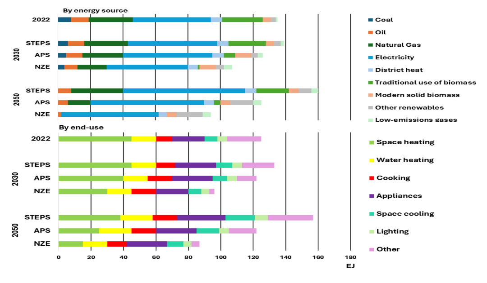
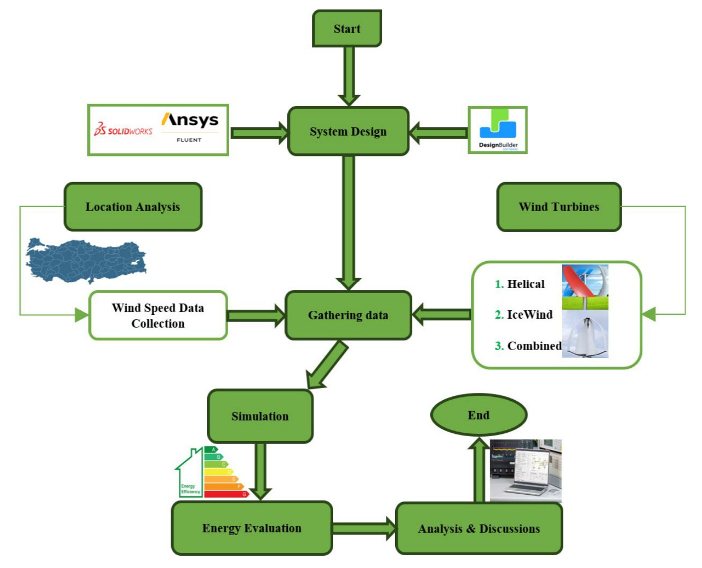
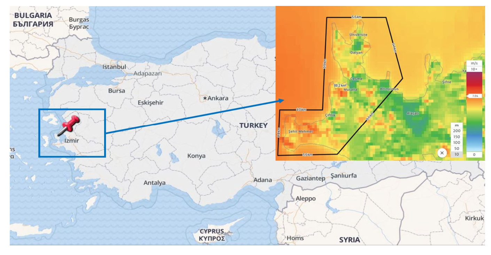
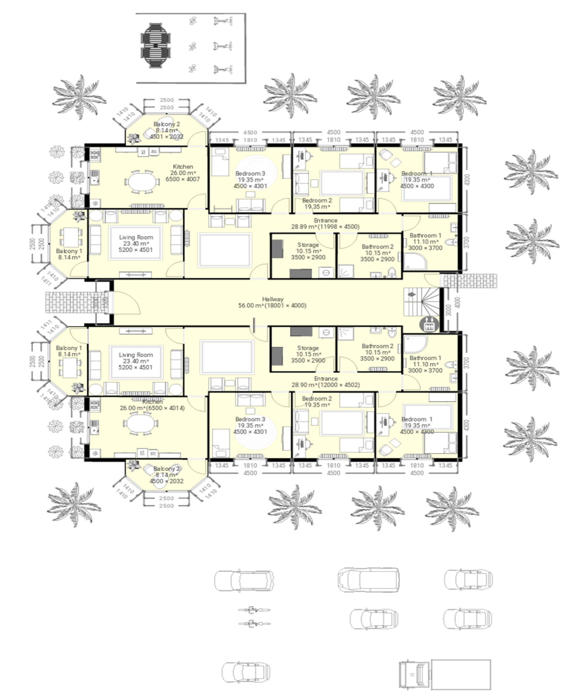
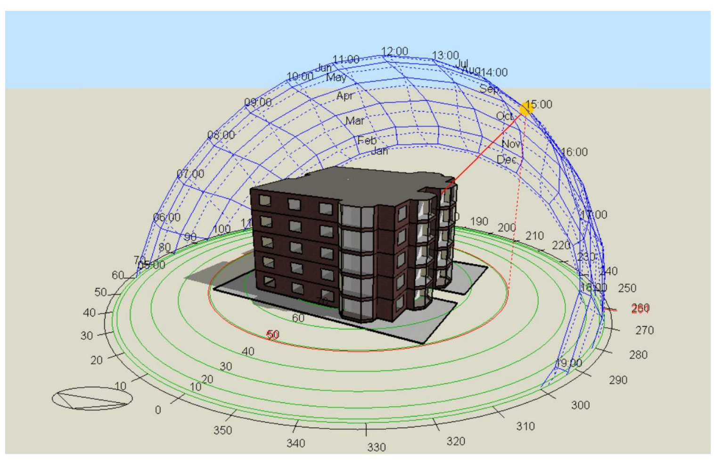
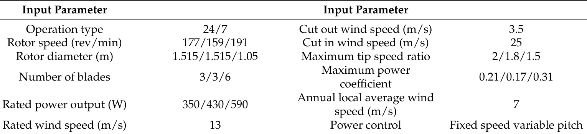
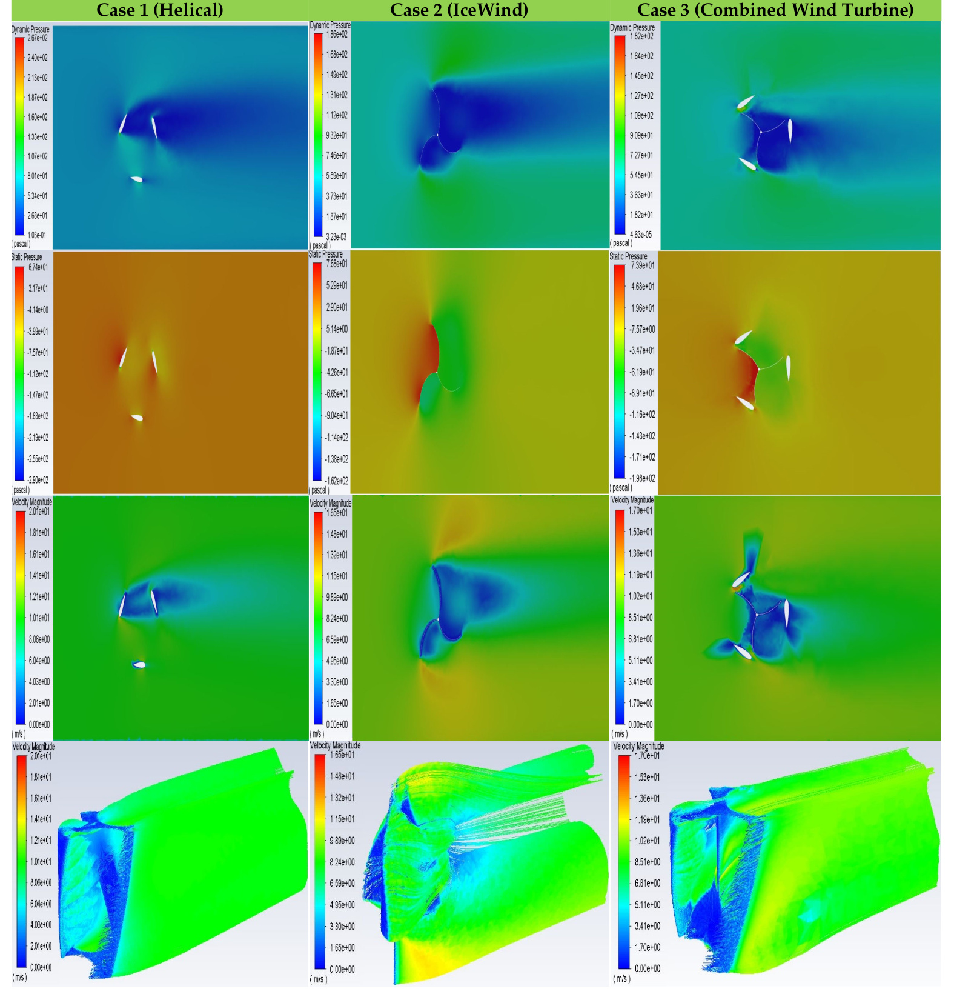
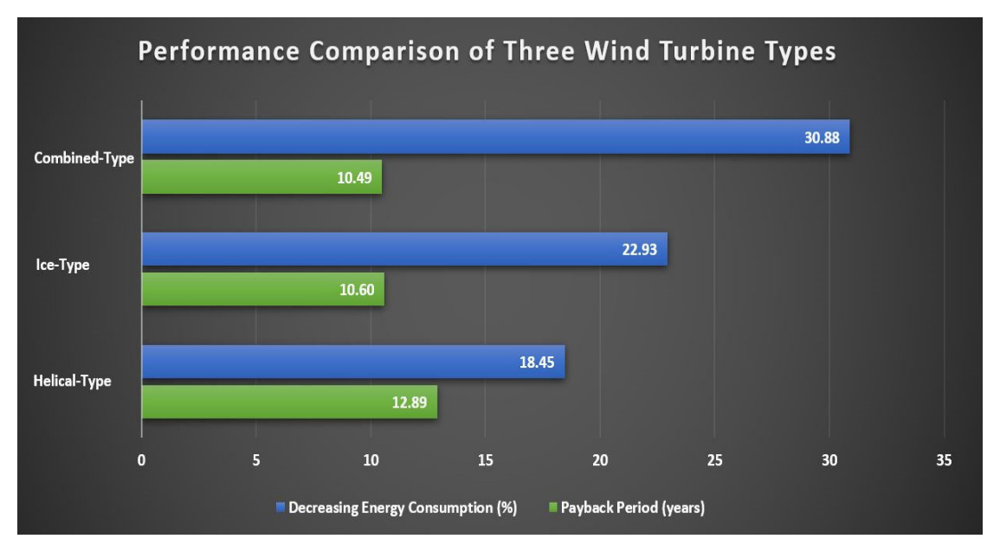

# Enhancing Urban Sustainability with Novel Vertical-Axis Wind Turbines: A Study on Residential Buildings in Çe¸sme

Yousif Abed Saleh Saleh, Murat Durak and Cihan Turhan

1 Mechanical Engineering Department, Atılım University, 06830 Ankara, Türkiye; saleh.yousif@student.atilim.edu.tr
2 The Board of the Turkish Offshore Wind Energy Association, 06800 Ankara, Türkiye; md@enermet.com.tr
3 Energy Systems Engineering Department, Atılım University, 06830 Ankara, Türkiye
* Correspondence: cihan.turhan@atilim.edu.tr

## Abstract

Abstract: This study investigates the integration of three types of vertical-axis wind turbines (VAWTs)—helical, IceWind, and a combined design—on residential buildings in Çe¸sme, Türkiye, a region with an average wind speed of 7 m/s. The research explores the potential of small-scale wind turbines in urban areas, providing sustainable solutions for renewable energy generation and reducing reliance on conventional energy sources. The turbines were designed and analyzed using SolidWorks and ANSYS Fluent, achieving power outputs of 350 W for the helical turbine, 430 W for the IceWind turbine, and 590 W for the combined turbine. A total of 42 turbines were mounted on a five-storey residential building model, and DesignBuilder software was utilized to simulate and evaluate the energy consumption. The baseline energy consumption of 172 kWh/m2 annually was reduced by 18.45%, 22.93%, and 30.88% for the helical, IceWind, and combined turbines, respectively. Furthermore, the economic analysis showed payback periods of 12.89 years for the helical turbine, 10.60 years for the IceWind turbine, and 10.49 years for the combined turbine. These findings emphasize the viability of integrating VAWTs into urban buildings as an effective strategy for reducing energy consumption, lowering costs, and enhancing energy efficiency.

Keywords: energy consumption; residential buildings; payback period; helical wind turbine; IceWind turbine; combined VAWT

## 1. Introduction

1. Introduction
The increasing urgency of environmental sustainability has driven significant interest
in renewable energy and energy-efficient technologies within urban infrastructure. Vertical-
axis wind turbines (VAWTs) have emerged as a promising solution to enhance energy
efficiency in buildings, particularly within urban areas where spatial constraints and wind
variability are major considerations. In contrast to traditional horizontal axis turbines,
VAWTs are suitable for urban settings because they can capture wind from multiple di-
rections, which is essential in city environments where wind patterns are disrupted by
high-rise buildings [1].
Building energy consumption is a major contributor to global greenhouse gas emis-
sions, with the construction sector accounting for about 36% of worldwide energy use and
nearly 40% of energy-related carbon dioxide emissions [2]. Integrating renewable energy
systems, such as VAWTs, into buildings aligns with global sustainability goals by reducing
reliance on fossil fuels and decreasing carbon emissions [3]. For instance, the incorporation
of VAWTs can significantly lower the energy demand from the grid, contributing to a more
sustainable urban energy profile [4].

The economic viability of VAWTs is particularly noteworthy. Studies highlight that
these systems generally require lower maintenance and have long lifespans, making them
a cost-effective option for urban areas with limited space for renewable installations [5].
Additionally, supportive policies and incentives enhance the feasibility of deploying VAWTs.
Government incentives, such as tax credits can offset initial installation costs, making
renewable energy adoption more accessible for building owners [6].
Moreover, integrating VAWTs into urban structures addresses the critical need for
sustainable building practices. As cities continue to grow, adopting technologies that lessen
environmental impacts and enhance energy efficiency becomes increasingly essential [7].
Projects like the Bahrain World Trade Center, which integrates wind turbines into its design,
demonstrate the effectiveness of incorporating renewable energy within architectural frame-
works [8]. This approach not only addresses immediate energy demands but also aligns
with long-term sustainability objectives by decreasing overall energy dependency [9,10].
Furthermore, advancements in VAWT technology have improved their efficiency and
adaptability, making them more suitable for integration into existing buildings [11–13].
Innovative designs and materials have led to quieter operation and better performance at
lower wind speeds, which are common in urban environments [14,15]. These developments
enhance the practicality of VAWTs as a renewable energy solution for cities, contributing to
global efforts to combat climate change [16–19].
Figure 1 presents a comprehensive projection of energy demand in the building sector
from 2022 to 2050, focusing on energy sources and end uses under various scenarios. The
data underscores the increasing importance of renewable energy, particularly in the Net
Zero Emissions (NZE) scenario, where modern solid biomass, electricity from renewables,
and other low-emission sources take precedence. By 2050, renewable energy sources
will play a critical role in reducing dependence on fossil fuels and supporting global
efforts to achieve carbon neutrality. Specifically, the shift toward renewables is evident
in electricity demand for appliances and space cooling, emphasizing their central role in
driving sustainability in the building sector.

Figure 1. Projected energy demand in the building sector by source and usage scenarios (2022–2050) (developed by authors).
 Projected energy demand in the building sector by source and usage scenarios (2022–2050)
(developed by authors).
The use of combined vertical-axis wind turbines (VAWTs) in urban and residential
applications has emerged as a promising strategy for improving energy efficiency and
sustainability. Researchers have explored innovative designs, advanced simulation tech-
niques, and experimental approaches to optimize turbine performance and integrate them

effectively into buildings. The following review discusses key studies that explore the
potential of combined VAWTs and their impact on energy consumption in various settings.
Turhan and Saleh [20] examined the use of small-scale IceWind turbines to reduce
building energy consumption. Integrating 40 three-blade turbines with a 112◦arc angle into
a building at Istanbul Airport, they achieved a 9.3% reduction in annual energy use through
simulations. This study demonstrates the effectiveness of such turbines in urban settings
and highlights their potential for enhancing energy efficiency in buildings. Saleh et al. [21]
explored rebuilding energy-efficient buildings in Hatay, Türkiye, after the 2023 earthquake.
They integrated vertical-axis wind turbines, PV panels, and green walls into a five-storey
building, using simulations to measure energy savings. Results showed reductions of
18% with PV panels, 8.5% with wind turbines, and 4.1% with green walls, totaling 28.5%
when combined, highlighting the potential of these strategies in sustainable reconstruction.
Saleh et al. [22] also evaluated the energy-saving and economic viability of installing
two types of small-scale VAWTs, the IceWind and Savonius turbines, on a residential
building in Karaburun, Izmir. Through simulations, they found that 15 Savonius turbines
achieved a 36% reduction in energy use, with a payback period of 8.93 years, offering
superior efficiency compared to IceWind turbines, which provided a 22.5% reduction with
a payback period of 14.57 years. This study demonstrates that Savonius turbines are a more
cost-effective option for enhancing energy efficiency in urban residential buildings.
Chong et al. [23] developed a cross-axis wind turbine (CAWT) for building integration,
capable of harnessing both horizontal and vertical winds. Tests showed the CAWT had
significantly higher efficiency than a conventional VAWT, with a 266% increase in power
coefficient at 100 mm height. This design improves wind energy capture for urban buildings.
Issac et al. [24] developed a helical cross-axis wind turbine (HCAWT) combining helical
and horizontal blades to harness multi-directional winds. CFD simulations showed a
186% improvement in power coefficient over a straight-bladed VAWT, with the HCAWT
achieving a Cp of 0.43 at a 100 mm height, highlighting its efficiency and suitability
for urban settings. Mohammed et al. [25] evaluated a rooftop-integrated hybrid VAWT
combining Darrieus and Savonius rotors. Their findings showed a 63% increase in energy
output and a 33% RPM boost compared to a standalone setup. Positioned 150 mm above
a vaulted roof, the hybrid VAWT achieved a maximum power coefficient (Cp) of 0.182,
highlighting the benefits of rooftop integration for urban wind energy.
Karadag and Yüksek [26] explored integrating wind turbines into tall buildings using
CFD simulations to optimize turbine performance amid urban wind flows. Their study
emphasized the role of interdisciplinary collaboration to enhance urban wind energy
potential, showing that BIWTs can effectively contribute to sustainable energy in city
environments. Han et al. [27] developed a 100 W helical-blade VAWT for low-noise urban
use, targeting a wind speed of 9 m/s and 170 rpm. Their model predicted 108.34 W,
while wind tunnel tests showed a 5.9% higher output at 114.7 W, confirming the design’s
effectiveness for urban wind applications.
Kavade and Ghanegaonkar [28] examined a small-scale vertical-axis wind turbine
(VAWT) with a variable pitch mechanism to boost efficiency. Testing showed a peak
power coefficient (Cp) of 0.35 at a tip speed ratio of 2.5 and a wind speed of 10 m/s,
demonstrating that variable pitching improves self-starting and performance, making
VAWTs more suitable for residential energy use in windy areas. Ali et al. [29] evaluated six
Darrieus VAWT models with different blade configurations to optimize performance at low
wind speeds. Testing showed that the straight-bladed models with two blades performed
best, achieving high power coefficients and self-starting at 3 m/s, making them suitable for
low-wind environments.

Divakaran et al. [30] analyzed the impact of helix angles (60◦, 90◦, and 120◦) on the
performance of a helical vertical-axis wind turbine (VAWT) using 3D computational fluid
dynamics (CFD) simulations. They found that a 60◦helix angle provided the highest
performance at moderate tip speed ratios (TSRs), while a 120◦angle reduced shaft loading
and improved stability. Their study also showed that increased helix angles caused faster
dissipation of turbine wakes, minimizing interference effects. This research offers insights
into optimizing helix angles for better aerodynamic performance and reduced mechanical
stresses in VAWTs. Suresh et al. [31] analyzed aluminum airfoil profiles (NACA 0012
and NACA 0018) for helical VAWTs, using ANSYS Fluent v.2023 R1 to evaluate stability
and performance under wind speeds up to 20 m/s. NACA 0012 showed superior lift-to-
drag efficiency, supporting its use for energy-efficient turbines. The study confirmed that
these aluminum blades maintain structural integrity, making them viable for urban wind
applications.
Gad et al. [32] tested various IceWind turbine designs, finding that the three-blade
model achieved the highest torque and rotational speed in wind tunnel experiments at
6–14 m/s. This design showed optimal performance, comparable to Savonius turbines, and
is suited for urban wind applications. Suffer and Saleh [33] examined IceWind VAWTs at
two heights (250 mm and 125 mm) using CFD and wind tunnel tests. The 250 mm model
performed better, achieving a power coefficient of 0.0688 and 610 RPM, indicating that
taller turbines enhance energy capture for urban use.
Zheng et al. [34] examined the impact of blade numbers on drag-type VAWT perfor-
mance, finding that power efficiency increased with more blades. The six-blade model
achieved the highest efficiency at 26.82%, followed by the five-blade and three-blade
models, highlighting that additional blades enhance stability and energy capture.
This study presents a novel combined-type VAWT that integrates both helical and
IceWind rotor designs into a single unit to improve energy capture efficiency. Unlike
previous studies, a complete simulation workflow covering 3D modeling, aerodynamic
analysis, and building energy simulation is used to assess performance under the real
climate conditions of Çe¸sme. By comparing the energy and financial outcomes of three
turbine types on a residential building, the study provides practical insights for wind
energy integration in urban environments.
## 2. Methods
This study focuses on the application of wind energy strategies through a detailed case
study of a building located in Çe¸sme, Izmir, Türkiye. To begin, the energy performance of
the building was analyzed in its original, unmodified state, providing a comprehensive
baseline measurement of its fuel and electricity consumption. The research investigates
three vertical-axis wind turbine (VAWT) strategies, each tailored to optimize energy gener-
ation under varying conditions. The first strategy involves the implementation of a helical
three-blade VAWT, selected for its aerodynamic efficiency and compatibility with moderate
wind speeds. The second strategy utilizes three IceWind blade turbines, valued for their
compact design and suitability for urban applications. The third strategy integrates a
combined VAWT system, merging attributes of both IceWind and helical type designs to
enhance overall performance.
Figure 2 outlines the step-by-step process followed in this study, showcasing the
approach to designing, simulating, and evaluating wind turbine systems. The workflow
began with the system design phase, where SolidWorks v.2024 was used for creating
3D models of the turbines, and ANSYS Fluent v.2023 R1 was employed for conducting
computational fluid dynamics (CFD) simulations. DesignBuilder software v7.3.1.003 was
integrated to analyze the impact of the turbines on building energy performance. The next

step involved location analysis and wind speed data collection, focusing on selecting a
suitable site and gathering essential data to optimize the turbines’ performance. Three wind
turbine designs—helical, IceWind, and combined-type—were included in the study, with
their unique configurations evaluated in terms of aerodynamic behavior and energy savings
potential. The data collected were utilized in the simulation phase, where CFD and energy
modeling simulations were performed to assess the turbines’ performance and interaction
with the building’s energy needs. This led to the energy evaluation phase, where the energy
savings and efficiency improvements of the turbine designs were quantified. Finally, the
findings were analyzed in the analysis and discussions phase, providing insights into the
turbines’ overall performance, including their contribution to reducing energy consumption
and their payback periods. This structured approach ensures a comprehensive evaluation
of the proposed retrofitting strategy.

Figure 2. Flow chart of study.
 Flow chart of study.
### 2.1. Climate and Location Analysis
Assessing the energy performance of these strategies, the economic viability of the
proposed systems was examined by calculating the payback periods for each turbine type.
Çe¸sme, a district in Izmir, was specifically selected as the study location due to its consistent
and strong wind conditions, making it a prime candidate for wind energy exploration.
Positioned at 38.42◦N latitude and 27.14◦E longitude, Izmir falls under the Mediterranean
climate classification (Csa) as defined by the widely recognized Köppen–Geiger system [35].
This climate type, characterized by mild, windy winters and dry, hot summers, further

supports the feasibility of wind energy installations in the region. Figure 3 shows the case
study location of the analyzed building. According to the Global Wind Atlas [36], the
location of Çe¸sme in ˙Izmir is identified as an ideal site for wind energy applications due
to its favorable wind conditions. The area experiences a strong local average wind speed
of approximately 7 m/s, particularly in urban settings, making it suitable for integrating
wind turbines into residential or commercial structures to optimize energy generation.

Figure 3. Study location and wind analysis.
 Study location and wind analysis.
### 2.2. Case Building and Energy Simulation Analysis
Weather data from the IZMIR-TUR IWEC database was utilized to enhance the accu-
racy and reliability of the simulation process. Two distinct scenarios were evaluated in this
study: the first scenario involved simulating the baseline model, while the second scenario
included simulations of three cases with different types of wind turbines: helical-type
VAWTs in the first case, IceWind turbines in the second case, and hybrid-type turbines
in the third case. The architectural design of the building, along with the corresponding
model created in DesignBuilder v7.3.1.003, is presented in Figures 4 and 5. These scenarios
were modeled to provide a comparative analysis of the baseline energy consumption and
the potential energy savings achieved through turbine implementation.
The baseline building model simulated in DesignBuilder v7.3.1.003 comprises a five-
storey structure with a total area of 2120 m2, distributed across 115 individual spaces. The
thermal performance of various building envelope components is defined by their U-values.
The external walls indicate a U-value of 0.317 W/m2K, while the internal walls have a
significantly higher U-value of 1.923 W/m2K. For the roof, the thermal transmittance is
calculated at 0.314 W/m2K, and the ground floor shows a U-value of 0.309 W/m2K. The
glazing system incorporates reference materials with a U-value of 1.978 W/m2K.
The flat roof consists of multiple layers aimed at optimizing thermal insulation and
structural integrity. These include a top layer of gravel, measuring 0.03 m thick and
featuring a thermal conductivity of 2 W/mK, followed by a bitumen felt layer of 0.004 m
thickness and 0.23 W/mK conductivity. A screed layer, 0.03 m thick with a conductivity
of 0.41 W/mK, is included, along with an insulating layer of polyurethane foam at 0.08 m
thickness and 0.028 W/mK conductivity. The composition is completed by a reinforced
concrete layer of 0.18 m thickness, which has a thermal conductivity of 2.3 W/mK.

Figure 4. Architectural layouts of residential design plan.
 Architectural layouts of residential design plan.

Figure 5. Case building’s energy performance simulation model.
 Case building’s energy performance simulation model.
The ground floor similarly integrates layers to achieve effective thermal performance.
These include a surface layer of carpet or textile flooring (0.015 m thick, 0.06 W/mK conduc-
tivity), a screed layer (0.05 m thick, 0.41 W/mK), a reinforced concrete slab (0.12 m thick,
2.3 W/mK conductivity), a polyurethane foam insulation layer (0.07 m thick, 0.028 W/mK),
and a base layer of sand and gravel measuring 0.21 m in thickness and featuring a thermal
conductivity of 2 W/mK.
The external walls incorporate a multi-layered construction method to enhance thermal
resistance. The outermost layer consists of a cement–sand render, 0.015 m thick, with a
thermal conductivity of 1 W/mK. Directly below this, a 0.08 m-thick expanded polystyrene
(EPS) insulation layer is included, offering a thermal conductivity of 0.046 W/mK. This is
followed by a medium-density concrete block with a thickness of 0.25 m and a conductivity
of 0.51 W/mK. An additional layer of EPS insulation, measuring 0.03 m thick with the
same thermal conductivity of 0.046 W/mK, is incorporated. The innermost layer is finished
with gypsum insulating plaster, 0.015 m thick, which provides a thermal conductivity of
0.18 W/mK.
### 2.3. Retrofitting Strategies
Retrofitting buildings with renewable energy solutions, such as vertical-axis wind
turbines (VAWTs), presents an effective strategy for reducing energy consumption and pro-
moting sustainability. This study evaluates the performance of three distinct VAWT designs:
helical-type, IceWind, and combined-type mounted on the rooftop of a building. Through
computational fluid dynamics (CFD) simulations, the aerodynamic behavior, energy sav-
ings, and feasibility of these turbines are analyzed under realistic operating conditions.

The first case investigated a helical-type vertical-axis wind turbine (VAWT) featuring
three blades and a rotor diameter of 1.515 m. The turbine’s rated power output is 350 W,
making it suitable for small-scale energy generation applications. The computational
domain for this simulation measures 9 m in length, 5 m in width, and 4 m in height.
This domain size was carefully chosen to minimize boundary effects and ensure accurate
simulation of aerodynamic behavior, with velocity inlet, pressure outlet, and no-slip wall
boundaries placed at adequate distances from the turbine. The mesh used for this case
comprises 777,032 nodes and 4,232,347 elements, balancing computational efficiency with
the resolution required for precise flow analysis.
A static mesh configuration was employed to facilitate steady-state aerodynamic anal-
ysis, capturing critical flow features while maintaining computational feasibility. The Shear
Stress Transport (SST) k-ω turbulence model was utilized to evaluate the turbine’s aero-
dynamic performance, given its reliability in predicting flow separation and aerodynamic
behavior in VAWTs. Simulations were conducted at the rated wind speed of 13 m/s to
emulate real-world operational conditions and predict power output and aerodynamic
performance. Additionally, the analysis accounted for a local annual average wind speed
of 7 m/s to provide a realistic assessment of the turbine’s energy-saving potential when
installed on a building rooftop.
The second case focused on the IceWind turbine, which has a rotor diameter of 1.515 m
and a rated power output of 430 W. The computational domain for this simulation is more
compact, measuring 6 m in length, 3 m in width, and 3 m in height. This domain configu-
ration is tailored to the IceWind turbine’s aerodynamic characteristics while maintaining
sufficient space for accurate modeling of flow separation and wake dynamics. The mesh
consists of 861,882 nodes and 4,790,485 elements, providing the resolution necessary to
capture intricate flow features around the turbine.
As with the first case, the SST k-ω turbulence model was employed to ensure accurate
predictions of aerodynamic performance, particularly in regions of flow separation. The
turbine’s operation was analyzed at its rated wind speed of 13 m/s to evaluate its maximum
energy capture efficiency. Additionally, simulations were conducted at an annual average
wind speed of 7 m/s to assess its real-world applicability. These dual simulations provide
a comprehensive evaluation of the IceWind turbine’s ability to reduce building energy
consumption under varying wind conditions.
The third case explored a hybrid VAWT design that combines an inner IceWind rotor
with semicircular blades and an outer Darrieus (helical) rotor. The IceWind rotor features
a diameter of 0.7575 m and a height of 0.75 m, while the Darrieus rotor has a diameter of
1.05 m and a height of 1.52 m, resulting in a total swept area of 1.45 m2. This dual-rotor
configuration optimizes energy capture by combining the complementary aerodynamic
strengths of the two designs.
The computational domain dimensions for this case are identical to those used in
the first case, measuring 9 m in length, 5 m in width, and 4 m in height, ensuring a
consistent setup for flow development and wake analysis. A high-resolution mesh with
965,768 nodes and 5,419,664 elements was implemented, capturing the complex aerody-
namic interactions between the inner and outer rotors. The SST k-ω turbulence model
was again employed to simulate the flow accurately, focusing on the interaction between
the two blade systems. This case demonstrates the hybrid turbine’s capability to optimize
aerodynamic performance and contribute significantly to reducing energy consumption in
urban building retrofits.

The analysis of the three wind turbine cases is supported by detailed input parameters
and computational setups. Table 1 summarizes the critical input parameters for each
wind turbine, including rotor dimensions, rated power output, and operational charac-
teristics, which serve as the foundation for the CFD simulations conducted in this study.
Figure 6 illustrates the design of each turbine, modeled using SolidWorks v.2024, and their
rooftop-mounted configuration on the building, ensuring optimal placement for efficient
energy capture. Meanwhile, Figure 7 presents the computational domain dimensions and
mesh quality for each case, detailing the boundary conditions, mesh density, and spatial
configuration used to ensure accurate aerodynamic predictions.
Table 1. Input parameters of wind turbine.
 Input parameters of wind turbine.
Input Parameter
Input Parameter
Operation type
24/7
Cut out wind speed (m/s)
3.5
Rotor speed (rev/min)
177/159/191
Cut in wind speed (m/s)
25
Rotor diameter (m)
1.515/1.515/1.05
Maximum tip speed ratio
2/1.8/1.5
Number of blades
3/3/6
Maximum power
coefficient
0.21/0.17/0.31
Rated power output (W)
350/430/590
Annual local average wind
speed (m/s)
7
Rated wind speed (m/s)
13
Power control
Fixed speed variable pitch

Figure 6. Turbine designs for each case and rooftop installation (developed by authors).
 Turbine designs for each case and rooftop installation (developed by authors).

Figure 7. Computational domain and mesh setup.
 Computational domain and mesh setup.
### 2.4. Payback Period Analysis
The economic analysis of the wind turbine system was conducted to evaluate its
feasibility and efficiency in reducing energy costs. Key factors considered include the total
power output of the turbines, annual energy production, electricity savings, and associated
costs such as initial investment and annual maintenance. Using these parameters, the
net annual savings were calculated to determine the system’s payback period, which
indicates the time required to recover the initial investment through energy cost savings.
The following equations outline the methodology used for these calculations, providing a
clear framework for assessing the financial performance of the system.
Ptotal = Pturbine × N
(1)
Eannual = Ptotal × H
1000
(2)
Sannual = Eannual × Celectricity
(3)
Itotal = Cturbine × N
(4)
Cmaintenance = Cmaintenance per turbine × N
(5)
Snet = Sannual −Cmaintenance
(6)
TPayback = Itotal
Snet
(7)
where
Pturbine : Power output of a single turbine (watts)

Ptotal : Total power output (watts)
N : Number of turbines
Eannual : Annual energy production (kWh/year)
Celectricity : Electricity price (USD/kWh)
Cturbine : Cost of a single turbine (USD)
Cmaintenance : Maintenance cost per turbine (USD/year)
Sannual : Annual savings in electricity cost (USD/year)
TPayback : Payback period (years)
Itotal : Total initial investment (USD)
Snet : Net annual savings (USD/year)
## 3. Results and Discussion
The dynamic pressure distribution around the helical-type VAWT highlights criti-
cal aerodynamic behaviors essential to its performance. High dynamic pressure regions,
observed near the leading edges of the blades, indicate effective wind energy capture as
the airflow decelerates upon impact. In contrast, low-pressure wake zones downstream
reflect energy extraction and flow separation. The asymmetry in the pressure field il-
lustrates the influence of blade alignment and rotation relative to the incoming wind,
directly affecting torque generation. Smooth gradients in the pressure distribution suggest
minimal aerodynamic losses, enhancing overall efficiency. With a maximum dynamic
pressure of approximately 267 Pa, the turbine effectively harnesses wind energy under the
given conditions.
The IceWind turbine demonstrates unique aerodynamic characteristics in its dynamic
pressure distribution. High-pressure zones, concentrated along the convex blade surfaces,
result from airflow acceleration due to curvature and flow attachment. These regions,
represented in red and yellow, demonstrate efficient energy capture. Downstream, elon-
gated low-pressure zones in the wake, shown in blue, reflect effective energy extraction
and momentum dissipation. The relatively symmetric pressure distribution highlights
balanced aerodynamic performance. The turbine achieves a maximum dynamic pressure
of approximately 186 Pa, showcasing its effectiveness in simulated conditions.
The combined-type VAWT exhibits a distinctive dynamic pressure distribution arising
from the interaction of its dual blade designs. High-pressure regions near the leading
edges of both blade sets indicate strong flow acceleration and efficient energy capture.
The extended low-pressure wake, visible in blue, signifies enhanced energy extraction
compared to single-blade designs. The asymmetry in pressure distribution results from the
complex interaction between the Darrieus and IceWind components, optimizing aerody-
namic performance. With a peak dynamic pressure of approximately 182 Pa, the turbine
effectively maximizes energy conversion efficiency.
The static pressure distribution around the helical-type VAWT reveals intricate aero-
dynamic interactions between the airflow and the turbine blades. High-pressure regions
near the leading edges result from airflow deceleration upon impact, causing a significant
increase in static pressure. Conversely, low-pressure zones on the trailing edges and within
the wake, depicted in blue and green, reflect flow acceleration and separation. This pressure
differential across the blade surfaces is critical for generating lift and torque. The uniform
gradient in pressure contours indicates balanced aerodynamic loading, contributing to sta-
ble turbine operation. The maximum static pressure of approximately 67.4 Pa underscores
the efficiency of this design under the simulated conditions.
The static pressure distribution of the IceWind turbine highlights its aerodynamic
efficiency. High-pressure regions near the leading edges, shown in red, result from airflow
deceleration against the curved blade surfaces, enabling effective energy capture and torque

generation. Low-pressure zones in the wake, depicted in blue and green, result from flow
acceleration and separation, emphasizing energy extraction. The relatively symmetric
distribution ensures balanced aerodynamic loading and steady performance. A maximum
static pressure of approximately 76.8 Pa demonstrates the turbine’s strong capability to
operate effectively in simulated conditions.
The static pressure distribution for the combined-type VAWT reflects the aerodynamic
synergy of its dual blade designs. High-pressure zones near the leading edges of both
blade types, depicted in red, indicate effective deceleration of airflow and energy capture.
Low-pressure regions, shown in green and blue along the trailing edges and wake, signify
efficient energy extraction and flow separation. The asymmetric pressure distribution
highlights the interplay between the Darrieus and IceWind components, optimizing lift
and torque generation. With a maximum static pressure of approximately 73.9 Pa, the
combined-type VAWT efficiently harnesses wind energy under simulated conditions.
The velocity magnitude and pathline distributions for the helical-type VAWT demon-
strate the aerodynamic efficiency of its blade design. High-velocity regions, shown in
green and yellow, concentrate along the blade surfaces and wake, indicating accelerated
airflow driven by rotational motion. Low-velocity zones, depicted in blue, are observed
near the trailing edges and wake, reflecting energy extraction and flow separation. Smooth
velocity transitions and consistent pathlines across the blade span highlight the turbine’s
ability to maintain stable aerodynamic performance with minimal turbulence. A maximum
velocity magnitude of approximately 20.1 m/s reflects the helical design’s effectiveness in
converting wind energy under simulated conditions.
The velocity magnitude distributions for the IceWind turbine highlight its aerodynamic
performance in both 2D and 3D visualizations. In the 3D pathlines view, high-velocity
regions, concentrated near the blade tips and wake, result from the rotational motion of the
turbine. Surrounding the blade surfaces and downstream wake regions, low-velocity zones
in blue indicate energy extraction and flow separation. The 2D visualization complements
this by showcasing wake development and gradual airflow velocity reduction downstream,
emphasizing efficient energy capture. The turbine achieves a maximum velocity magnitude
of approximately 16.5 m/s, effectively harnessing wind energy while maintaining smooth
aerodynamic behavior.
The velocity magnitude distributions for the combined-type VAWT reveal the aero-
dynamic synergy of its dual blade designs. High-velocity regions, shown in green and
yellow, concentrate along the blade surfaces and wake, demonstrating accelerated airflow
due to the combined effects of the Darrieus and IceWind components. Low-velocity zones
in blue, near the trailing edges and areas of flow separation, reflect effective energy extrac-
tion. The 2D visualization emphasizes the wake’s extension downstream, with reduced
airflow velocity highlighting the turbine’s energy conversion efficiency. The maximum
velocity magnitude of approximately 17.0 m/s underscores the combined design’s ability
to maintain stable and efficient performance under simulated conditions.
Figure 8 below compares the dynamic pressure, static pressure, and velocity magni-
tude distributions for the helical-type, IceWind, and combined-type wind turbine cases.
Figure 9 and Table 2 below provide a comprehensive comparison of the energy savings
and payback periods for the three wind turbine types relative to the baseline model. The
baseline, with an annual energy consumption of 172 kWh/m2, is listed in the table as
the reference point, with no energy savings. Case 1, representing the helical-type VAWTs,
achieves an energy reduction to 140.27 kWh/m2, equivalent to an 18.45% saving, but it has
the longest payback period of 12.89 years. Case 2, featuring the IceWind turbine, performs
better, lowering energy consumption to 132.56 kWh/m2 and achieving a 22.93% energy
saving, with a slightly improved payback period of 10.60 years. Case 3, which utilizes

the combined-type VAWTs, delivers the best results, reducing energy consumption to
118.89 kWh/m2, corresponding to a 30.88% energy saving and the shortest payback period
of 10.49 years. The figure visually presents these differences, showing the combined-type
turbine’s superior performance in both energy efficiency and economic viability.
Case 1 (Helical)
Case 2 (IceWind)
Case 3 (Combined Wind Turbine)

Figure 8. Comparison of pressure and velocity distributions for helical, IceWind, and combined turbines.
 Comparison of pressure and velocity distributions for helical, IceWind, and combined
turbines.

Figure 9. Comparison of energy savings and payback periods for different turbine types.
 Comparison of energy savings and payback periods for different turbine types.
Table 2. Simulation results for all cases.
 Simulation results for all cases.
Model Name
Energy Consumption
(kWh/m2)
Energy Saving %
Payback Period (Years)
Baseline model
172
-
-
Case 1
140.27
18.45
12.89
Cass 2
132.56
22.93
10.60
Case 3
118.89
30.88
10.49
The economic analysis of the turbines revealed distinct differences in their initial costs,
maintenance expenses, and overall payback periods. Across all cases, the local electricity
price of USD 0.07 per kWh and an annual maintenance cost of USD 75 per turbine were
considered in the calculations.
The helical turbine, with an initial cost of USD 1800 per unit, had the lowest upfront
investment but required the longest payback period of 12.89 years. This extended payback
period is attributed to its moderate energy-saving performance of 18.45%, which limits
annual financial returns.
The IceWind turbine, priced at USD 2000 per unit, achieved a payback period of
10.60 years. Its higher energy-saving capacity of 22.93% offset the slightly higher initial
investment, making it a more favorable option compared to the helical turbine.
The combined-type turbine, with an initial cost of USD 3000 per unit, achieved the
shortest payback period of 10.49 years. Its superior energy-saving performance of 30.88%
effectively compensated for the higher upfront cost, making it the most cost-effective
solution over time. These results emphasize the role of initial costs, maintenance expenses,
and energy-saving potential in determining the economic viability of VAWTs for residential
applications.
Integrating these turbines into the case building reduced annual energy consumption
from 172 kWh/m2 to as low as 118.89 kWh/m2, contributing to sustainability goals. Eco-
nomic analysis confirms the feasibility of such systems, with payback periods aligning
with expectations for renewable energy technologies. The average wind speed of 7 m/s
in Çe¸sme provided favorable conditions, but urban wind variability must be considered
for effective implementation. This study demonstrates that VAWTs can be a practical
solution for urban energy challenges. The superior results of the combined-type turbine
point to the benefits of hybrid configurations, and future research could explore additional

optimizations in blade design and integration with other renewable energy systems for
broader applications.
The study includes mesh size, element count, domain dimensions, and turbulence
modeling to ensure simulation reliability. However, mesh sensitivity analysis and exper-
imental validation were not included, as the main objective was to obtain power output
for integration into building-scale energy and economic analysis. The authors recognize
the value of these steps for aerodynamic studies and will consider them in future work to
strengthen the simulation accuracy.
## 4. Conclusions
This study explores the integration of vertical-axis wind turbines (VAWTs) into urban
residential buildings as a sustainable approach to reducing energy consumption and
achieving economic feasibility. Leveraging Çe¸sme’s favorable wind conditions, the research
demonstrates the potential of small-scale turbines to contribute to urban energy demands.
The findings emphasize the importance of selecting and optimizing turbine designs to
maximize energy efficiency while ensuring an economically viable payback period.
•
The helical turbine, while functional, achieved the lowest energy savings of 18.45%
and the longest payback period of 12.89 years. Its design offers stability and moderate
performance, making it a suitable option for applications with limited spatial or
financial constraints. However, the turbine’s lower efficiency suggests the need for
further aerodynamic refinements to enhance its performance in urban wind conditions.
•
The IceWind turbine demonstrated better results, with an energy saving of 22.93% and
a payback period of 10.60 years. Its compact and efficient design makes it well-suited
for urban areas with consistent wind patterns. Despite its promising performance,
there is room for improvement in optimizing its aerodynamic features to further
enhance energy capture and reduce costs.
•
The combined-type turbine outperformed the other designs, achieving the highest
energy savings of 30.88% and the shortest payback period of 10.49 years. By combining
the strengths of Darrieus and IceWind designs, this hybrid configuration proved to
be the most effective in capturing wind energy and reducing aerodynamic losses. Its
success highlights the potential of hybrid turbine systems in urban building retrofits,
offering a robust solution for energy efficiency.
These findings emphasize the practicality of integrating 42 VAWTs into residential
buildings and provide a pathway for advancing urban energy sustainability through
innovative turbine designs.
These results demonstrate the practical advantage of integrating the combined-type
VAWT into residential buildings using real wind conditions. The study uniquely links
CFD-based power predictions with whole-building energy analysis and economic eval-
uation, providing a comprehensive approach that has not been widely addressed in
previous literature.
Author Contributions: Conceptualization, Y.A.S.S. and C.T.; methodology, M.D. and C.T.; software,
Y.A.S.S.; validation, M.D. and C.T; formal analysis, Y.A.S.S., M.D. and C.T.; investigation, Y.A.S.S.
and M.D.; writing—original draft preparation, Y.A.S.S.; writing—review and editing, M.D. and C.T.;
supervision, C.T. All authors have read and agreed to the published version of the manuscript.
Funding: The APC was funded by Enermet Energy Meteorology Engineering Inc.
Institutional Review Board Statement: Not applicable.
Informed Consent Statement: Not applicable.

Data Availability Statement: The data presented in this study are available on request from the
corresponding author due to privacy concerns.
Acknowledgments: The authors would like to thank Enermet Energy Meteorology Engineering Inc.
for their continuous support.
Conflicts of Interest: Author Murat Durak was employed by the Board of the Turkish Offshore Wind
Energy Association, 06800 Ankara, Türkiye. The remaining authors declare that the research was
conducted in the absence of any commercial or financial relationships that could be construed as
a potential conflict of interest. The authors declare that this study received funding from Enermet
Energy Meteorology Engineering Inc.
## References
1.
Hafez, F.S.; Sa’di, B.; Safa-Gamal, M.; Taufiq-Yap, Y.H.; Alrifaey, M.; Seyedmahmoudian, M.; Stojcevski, A.; Horan, B.; Mekhilef,
S. Energy Efficiency in Sustainable Buildings: A Systematic Review with Taxonomy, Challenges, Motivations, Methodological
Aspects, Recommendations, and Pathways for Future Research. Energy Strategy Rev. 2023, 45, 101013. [CrossRef]
2.
Li, Y.; Kubicki, S.; Guerriero, A.; Rezgui, Y. Review of Building Energy Performance Certification Schemes Towards Future
Improvement. Renew. Sustain. Energy Rev. 2019, 113, 109244. [CrossRef]
3.
Di Foggia, G. Energy Efficiency Measures in Buildings for Achieving Sustainable Development Goals. Heliyon 2018, 4, e00953.
[CrossRef]
4.
Turhan, C.; Ghazi, S. Energy Consumption and Thermal Comfort Investigation and Retrofitting Strategies for an Educational
Building: Case Study in a Temperate Climate Zone. J. Build. Des. Environ. 2023, 2, 16869. [CrossRef]
5.
International Energy Agency (IEA). Electricity Market Report 2023; IEA: Wakefield, MA, USA, 2023. Available online: https:
//www.iea.org/reports/electricity-market-report-2023 (accessed on 17 November 2024).
6.
International Renewable Energy Agency (IRENA). World Energy Transitions Outlook 2023: 1.5 ◦C Pathway; IRENA: Abu Dhabi,
United Arab Emirates, 2023. Available online: https://www.irena.org/Publications/2023/Jun/World-Energy-Transitions-
Outlook-2023 (accessed on 17 November 2024).
7.
International Energy Agency (IEA). Key World Energy Statistics 2021; IEA: Wakefield, MA, USA, 2021. Available online: https:
//www.iea.org/reports/key-world-energy-statistics-2021 (accessed on 17 November 2024).
8.
Chen, L.; Hu, Y.; Wang, R.; Li, X.; Chen, Z.; Hua, J.; Osman, A.I.; Farghali, M.; Huang, L.; Li, J.; et al. Green Building Practices to
Integrate Renewable Energy in the Construction Sector: A Review. Environ. Chem. Lett. 2024, 22, 751–784. [CrossRef]
9.
International Energy Agency (IEA); International Renewable Energy Agency (IRENA); UN Climate Change High-Level Cham-
pions. The Breakthrough Agenda Report 2023: Accelerating Sector Transitions Through Stronger International Collaboration.
Marrakech Partnership. 2023. Available online: https://www.iea.org/reports/breakthrough-agenda-report-2023 (accessed on 17
November 2024).
10.
International Energy Agency (IEA). World Energy Outlook 2023; IEA: Wakefield, MA, USA, 2023. Available online: https:
//www.iea.org/reports/world-energy-outlook-2023 (accessed on 17 November 2024).
11.
Watson, S.; Moro, A.; Reis, V.; Baniotopoulos, C.; Barth, S.; Bartoli, G.; Bauer, F.; Boelman, E.; Bosse, D.; Cherubini, A.; et al.
Future Emerging Technologies in the Wind Power Sector: A European Perspective. Renew. Sustain. Energy Rev. 2019, 113, 109270.
[CrossRef]
12.
Global Wind Energy Council (GWEC). Global Wind Report 2024; GWEC: Brussels, Belgium, 2024. Available online: https:
//www.gwec.net/reports (accessed on 17 November 2024).
13.
Kwok, K.C.S.; Hu, G. Wind Energy System for Buildings in an Urban Environment. J. Wind Eng. Ind. Aerodyn. 2023, 234, 105349.
[CrossRef]
14.
Veers, P.; Dykes, K.; Lantz, E.; Barth, S.; Bottasso, C.L.; Carlson, O.; Clifton, A.; Green, J.; Green, P.; Holttinen, H.; et al. Grand
Challenges in the Science of Wind Energy. Science 2019, 366, eaau2027. [CrossRef]
15.
Stathopoulos, T.; Alrawashdeh, H.; Al-Quraan, A.; Blocken, B.; Dilimulati, A.; Paraschivoiu, M.; Pilay, P. Urban Wind Energy:
Some Views on Potential and Challenges. J. Wind Eng. Ind. Aerodyn. 2018, 179, 146–157. [CrossRef]
16.
Bianchini, A.; Bangga, G.; Baring-Gould, I.; Croce, A.; Cruz, J.I.; Damiani, R.; Erfort, G.; Ferreira, C.S.; Infield, D.; Nayeri, C.N.;
et al. Current Status and Grand Challenges for Small Wind Turbine Technology. Wind Energy Sci. 2022, 7, 2003–2037. [CrossRef]
17.
Rezaeiha, A.; Montazeri, H.; Blocken, B. A Framework for Preliminary Large-Scale Urban Wind Energy Potential Assessment:
Roof-Mounted Wind Turbines. Energy Convers. Manag. 2020, 214, 112770. [CrossRef]
18.
Möllerström, E.; Gipe, P.; Beurskens, J.; Ottermo, F. A Historical Review of Vertical Axis Wind Turbines Rated 100 kW and Above.
Renew. Sustain. Energy Rev. 2019, 105, 1–13. [CrossRef]

19.
Ahsan, F.; Griffith, D.T.; Gao, J. Modal Dynamics and Flutter Analysis of Floating Offshore Vertical Axis Wind Turbines. Renew.
Energy 2022, 185, 1284–1300. [CrossRef]
20.
Turhan, C.; Saleh, Y.A.S. A Case Study for Small-Scale Vertical Wind Turbine Integrated Building Energy Saving Potential. J. Build.
Des. Environ. 2024, 3, 28115. [CrossRef]
21.
Saleh, Y.A.S.; Akkurt, G.G.; Turhan, C. Reconstructing Energy-Efficient Buildings after a Major Earthquake in Hatay, Türkiye.
Buildings 2024, 14, 2043. [CrossRef]
22.
Saleh, Y.A.S.; Austin, M.C.; Carpino, C.; Turhan, C. Determining Payback Period and Comparing Two Small-Scale Vertical Axis
Wind Turbines Installed at the Top of Residential Buildings. Int. J. Archit. Eng. Technol. 2024, 11, 1–16. [CrossRef]
23.
Chong, W.T.; Gwani, M.; Tan, C.J.; Muzammil, W.K.; Poh, S.C.; Wong, K.H. Design and Testing of a Novel Building Integrated
Cross Axis Wind Turbine. Appl. Sci. 2017, 7, 251. [CrossRef]
24.
Issac, L.P.; Shivakumar, S.; Umesh, V.; Jangam, S.; Santhosh, N.; Shankar, G.; Praveena, B.A. The Design and Analysis of Helical
Cross-Axis Wind Turbine. AIP Conf. Proc. 2022, 2421, 020004. [CrossRef]
25.
Mohammed, G.; Ibrahim, A.; Kangiwa, U.M.; Wisdom, J.B. Design and Testing of Building Integrated Hybrid Vertical Axis Wind
Turbine. J. Electr. Electron. Eng. 2021, 9, 69–77. [CrossRef]
26.
Karadag, I.; Yuksek, I. Wind Turbine Integration to Tall Buildings. In Renewable Energy—Resources, Challenges and Applications;
IntechOpen: London, UK, 2020. [CrossRef]
27.
Han, D.; Heo, Y.G.; Choi, N.J.; Nam, S.H.; Choi, K.H.; Kim, K.C. Design, Fabrication, and Performance Test of a 100-W
Helical-Blade Vertical-Axis Wind Turbine at Low Tip-Speed Ratio. Energies 2018, 11, 1517. [CrossRef]
28.
Kavade, R.K.; Ghanegaonkar, P.M. Performance Analysis of Small-Scale Variable Pitch Vertical Axis Wind Turbine. FME Trans.
2022, 50, 322–330. [CrossRef]
29.
Ali, N.M.; Aljabair, S.; Abdul Hassan, A.K. An Experimental and Numerical Investigation on Darrieus Vertical Axis Wind Turbine
Types at Low Wind Speed. Int. J. Mech. Mechatron. Eng. (IJMME-IJENS) 2019, 19, 97–110.
30.
Divakaran, U.; Ramesh, A.; Mohammad, A.; Velamati, R.K. Effect of Helix Angle on the Performance of Helical Vertical Axis
Wind Turbine. Energies 2021, 14, 393. [CrossRef]
31.
Suresh, A.B.; Selvan, C.P.; Vinayaka, N.; Gowdru Chandrashekarappa, M.P.; Lakshmikanthan, A.; Rangappa, R.; Shinde, S.; Malik,
V.R. Computational Investigations of Aluminum-Based Airfoil Profiles of Helical Shaped Vertical Axis Wind Turbines Suitable for
Friction Stir Joining and Processing. Int. J. Interact. Des. Manuf. (IJIDeM) 2024, 18, 1491–1506. [CrossRef]
32.
Gad, T.; Shokry, A.; Afify, R.; Saber, E.; Hassan, M. Experimental Study of Two, Two-Reversed, Three and Four Blade IceWind
Turbine. Int. J. Appl. Eng. Res. 2020, 15, 1122–1134.
33.
Suffer, K.H.; Saleh, Y.A.S. Numerical and Experimental Investigation of the Aerodynamics for the IceWind Blades VAWT. Int. J.
Sci. Res. Sci. Eng. Technol. 2024, 11, 139–146. [CrossRef]
34.
Zheng, M.; Li, Y.; Teng, H.; Hu, J.; Tian, Z.; Zhao, Y. Effect of Blade Number on Performance of, Drag Type Vertical Axis Wind
Turbine. Appl. Sol. Energy 2016, 52, 315–320. [CrossRef]
35.
Kottek, M.; Grieser, J.; Beck, C.; Rudolf, B.; Rubel, F. World Map of the Köppen-Geiger climate classification updated. Meteorol. Z.
2006, 15, 259–263. [CrossRef]
36.
Global Wind Atlas. Available online: https://globalwindatlas.info/ar (accessed on 17 November 2024).
Disclaimer/Publisher’s Note: The statements, opinions and data contained in all publications are solely those of the individual
author(s) and contributor(s) and not of MDPI and/or the editor(s). MDPI and/or the editor(s) disclaim responsibility for any injury to
people or property resulting from any ideas, methods, instructions or products referred to in the content.
