# Towards optimal aerodynamic design of vertical axis wind turbines: Impact of solidity and number of blades

Abdolrahim Rezaeiha, Hamid Montazeri, Bert Blocken

a Department of the Built Environment, Eindhoven University of Technology, Eindhoven, the Netherlands
b Department of Civil Engineering, KU Leuven, Leuven, Belgium

## Article Info

Article history:
Received 12 August 2018
Received in revised form 10 September 2018
Accepted 28 September 2018
Available online 1 October 2018

Keywords: Vertical axis wind turbine (VAWT) Characterization study Aerodynamic performance Design guideline Urban wind turbine Offshore wind turbine a b s t r a c t The current study systematically analyzes the impact of solidity (s) and number of blades (n) on the aerodynamic performance of 2-, 3- and 4-bladed Darrieus H-type vertical axis wind turbines (VAWTs). Solidity varies within the wide range of 0.09e0.36. A large number of operational parameters, i.e., tip speed ratio (l), Reynolds number (Re), turbulence intensity and reduced frequency (K) are investigated to provide a deeper insight into the impact of s and n on the dynamic loads on blades, the turbine per- formance and the wake. High-fidelity unsteady Reynolds-averaged Navier-Stokes (URANS) simulations, extensively validated with experiments, are employed. The results show that the turbine optimal tip speed ratio (lopt) is invariant to a newly-introduced parameter ‘sl3’, regardless of the turbine geometrical and operational characteristics. In addition, a new correlation is derived to estimate lopt as a function of s, which can also be employed to predict the optimal s for a turbine with a given l. It is also found that: (i) for constant-speed urban VAWTs, which due to the low mean wind speed in the urban environment, frequently operate at moderate to high l, a relatively-low s is optimal; (ii) an optimal VAWT is a moderately-high-solidity variable-speed rotor maintaining a relatively-low l, where due to the large blade chord length the resulting Re and K are favorably high; (iii) within the turbine optimal operational range, turbine power coefficient (CP) is almost independent of n. The present findings support the optimal aerodynamic design of small-to large-scale VAWTs. © 2018 The Authors. Published by Elsevier Ltd. This is an open access article under the CC BY license (http://creativecommons.org/licenses/by/4.0/).

## Abstract

The current study systematically analyzes the impact of solidity (s) and number of blades (n) on the aerodynamic performance of 2-, 3- and 4-bladed Darrieus H-type vertical axis wind turbines (VAWTs). Solidity varies within the wide range of 0.09e0.36. A large number of operational parameters, i.e., tip speed ratio (l), Reynolds number (Re), turbulence intensity and reduced frequency (K) are investigated to provide a deeper insight into the impact of s and n on the dynamic loads on blades, the turbine per- formance and the wake. High-fidelity unsteady Reynolds-averaged Navier-Stokes (URANS) simulations, extensively validated with experiments, are employed. The results show that the turbine optimal tip speed ratio (lopt) is invariant to a newly-introduced parameter ‘sl3’, regardless of the turbine geometrical and operational characteristics. In addition, a new correlation is derived to estimate lopt as a function of s, which can also be employed to predict the optimal s for a turbine with a given l. It is also found that: (i) for constant-speed urban VAWTs, which due to the low mean wind speed in the urban environment, frequently operate at moderate to high l, a relatively-low s is optimal; (ii) an optimal VAWT is a moderately-high-solidity variable-speed rotor maintaining a relatively-low l, where due to the large blade chord length the resulting Re and K are favorably high; (iii) within the turbine optimal operational range, turbine power coefficient (CP) is almost independent of n. The present findings support the optimal aerodynamic design of small-to large-scale VAWTs. © 2018 The Authors. Published by Elsevier Ltd. This is an open access article under the CC BY license

## 1. Introduction

Vertical axis wind turbines (VAWTs) have recently received
renewed interest for wind energy harvesting in two new potential
locations, i.e., far offshore and in urban and rural environments
[1e6]. In far offshore, VAWTs are promising for deep-water floating
offshore windfarms [7e10]. In the urban and rural environments,
VAWTs can be mounted on the building roof, between the build-
ings, integrated into the urban and rural settings, inside the wind
catchers and ventilation ducts [11e18]. VAWTs have several ad-
vantages compared to horizontal axis wind turbines (HAWTs):
omni-directionality, low noise, simple design, low manufacturing,
installation and maintenance costs, scalability, compactness, small
shadow flickering, less visual aesthetic disturbance and higher bird
and bat safety [19e24]. However, their aerodynamic performance is
currently lower than HAWTs due to the comparatively small
amount of research that they have received and due to their more
complex unsteady aerodynamics [25e31]. Therefore, to benefit
from their many advantages, their aerodynamic performance needs
to be further improved.
The complex aerodynamic performance of VAWTs is influenced
by flow phenomena such as unsteady separation and dynamic stall
[32e40], blade-wake interactions [41], flow curvature effects
[42,43] and rotational and Coriolis effects on boundary layer and
shed vortices [44]. Such complex flow phenomena are driven by
the geometrical and operational characteristics of the turbine,
which therefore necessitate a sound understanding of the indi-
vidual and combined impacts of these characteristics on the aero-
dynamic performance of the turbine. The impact of the operational
characteristics, namely tip speed ratio l, Reynolds number Rec and
turbulence intensity TI for VAWTs have been extensively studied by
Bachant and Wisnik [45], Millet et al. [46] and Rezaeiha et al. [20].
The geometrical characteristics include solidity [47,48], number of
blades, airfoil shape [49,50], blade surface roughness, location of
blade-spoke connection, pitch angle [51], blade aspect ratio [7],
shaft diameter and surface roughness [52].

Solidity and number of blades are two important geometrical
parameters, which significantly affect the aerodynamic perfor-
mance of VAWTs. Solidity shows the ratio of the overall area of the
blades over the swept area of the turbine and is defined as s¼nc/d,
where n, c, and d are number of blades, blade chord length, and
turbine diameter, respectively. An optimal turbine solidity would
maximize the output power where the optimum value could be
dependent on the operational conditions. The impact of solidity
and number of blades has been studied numerically and experi-
mentally [47,48,53e61]. However, to the best of our knowledge, the
existing literature has the following limitations:
(i) The conclusions have been derived using a limited number of
test cases and are dependent on the operational conditions;
(ii) The impact of solidity and number of blades at fixed Rec has
not yet been investigated. It should be noted that as changing
solidity naturally modifies Rec, therefore, the findings in
previous studies could have been influenced by the Reynolds
number effects;
(iii) The dependency of the optimal tip speed ratio on the solidity
has not been yet elucidated;
(iv) The focus has been mainly on the average turbine perfor-
mance, i.e., CP. Detailed analyses of the blade dynamic loads
and the turbine wake, however, has been investigated either
incompletely or not at all.
Therefore, in this paper:
(i) The impact of solidity is studied within a wide range from a
low value of 0.09 to a relatively high value of 0.36 for three
turbines with different number of blades, i.e., 2-, 3- and 4-
bladed turbines;
(ii) A wide range of operational conditions is considered. Tip
speed ratio varies from a low value of 1.5, where the flow is
dominated by the dynamic stall and the blade-wake in-
teractions, to a high value of 5.5, where although the flow is
mostly attached, the rotational effects are significant. Tur-
bulence intensities vary from 0%, representative of high-
quality low-turbulence wind tunnels, to 25%, representative
of relatively high turbulence level environments. The chord
Reynolds number varies from 0.51  105 to 6.41  105, which
covers the relevant range for small-to medium-scale VAWTs.
Reduced frequency (K) varies from 0.02 to 0.18, which covers
weakly-to highly-unsteady flows;
(iii) The dependency of the optimal solidity on tip speed ratio is
comprehensively investigated;
(iv) A new parameter is introduced to which the turbine optimal
tip speed ratio lopt is invariant, regardless of the turbine
geometrical and operational characteristics;
(v) A new correlation is derived to estimate lopt only as a func-
tion of s, which can be helpful during the initial design phase
of VAWTs;
(vi) Detailed analyses are performed at constant Rec to better
clarify the impact of solidity and number of blades, unaf-
fected by any potential Reynolds number effects;
(vii) In addition to the turbine averaged performance, the turbine
wake and dynamic loads on the blades are also investigated
for various solidities and number of blades;
(viii) Reduced frequency is shown to be an influential parameter
on the aerodynamic performance of VAWTs.
The evaluation is based on high-fidelity CFD simulations,
extensively validated with experiments. In total 296 simulations
are performed. The findings of this study are intended to provide an
in-depth understanding of the impact of solidity and number of
## Nomenclature

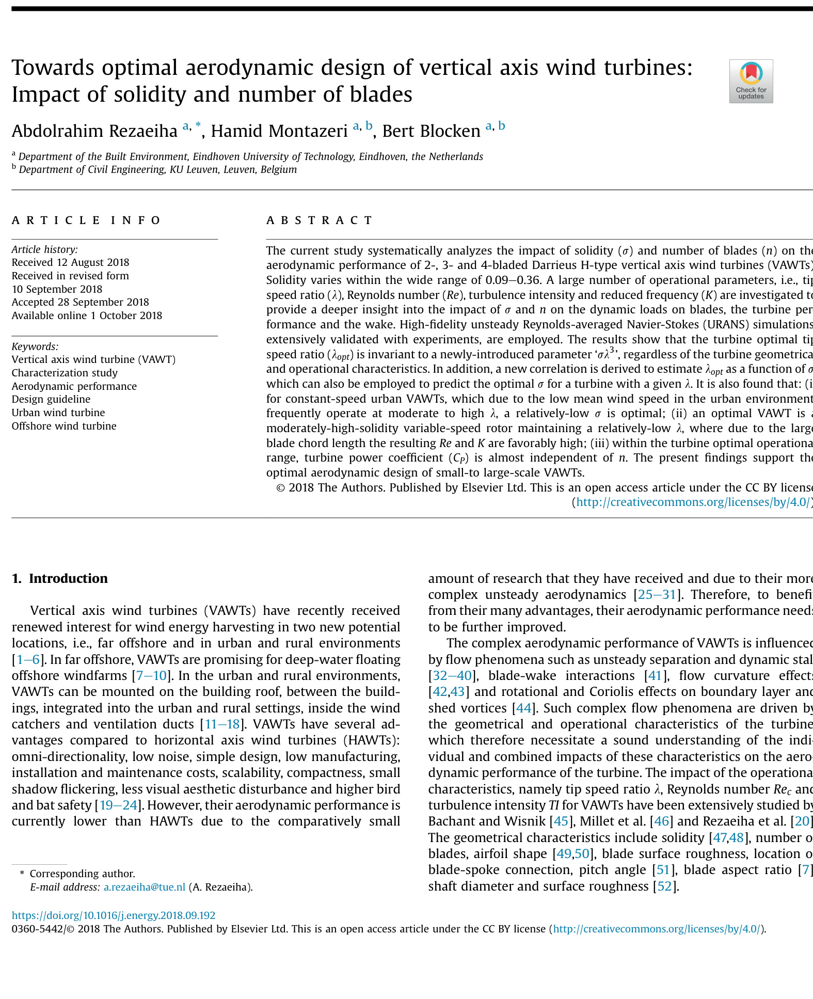

A
Turbine swept area, hd [m2]
c
Blade chord length [m]
Cd
Sectional drag coefficient, D=ð0:5rcV2
relÞ []
Cl
Sectional lift coefficient, L=ð0:5rcV2
relÞ []
Cm
Instantaneous moment coefficient []
CP
Power coefficient, P=ðqAU∞Þ []
CP,max
Maximum power coefficient at lopt []
CT
Thrust coefficient, T=ðqAÞ []
CoP
Pressure coefficient []
D
Sectional drag force [N/m]
d
Turbine diameter [m]
h
Turbine height [m]
k
Turbulence kinetic energy [m2/s2]
K
Reduced frequency, Uc=ð2VrelÞzc=2R []
L
Sectional lift force [N/m]
Lw
Turbine wake length [m]
M
Turbine moment [Nm]
n
Number of blades []
P
Turbine power [W]
q
Dynamic pressure [Pa]
R
Turbine radius [m]
Rec
Airfoil (blade) chord-based Reynolds number,
cU∞
ffiffiffiffiffiffiffiffiffiffiffiffiffiffi
1 þ l2
q
=n []
ReD
Turbine diameter-based Reynolds number, dU∞=n
[]
Req
Momentum-thickness Reynolds number []
T
Turbine thrust force [N]
TI
Approach-flow (i.e. inlet) total turbulence intensity
[%]
TIi
Incident-flow total turbulence intensity [%]
u
Time-averaged streamwise velocity [m/s]
V
Velocity magnitude [m/s]
U∞
Freestream velocity [m/s]
Vrel
Experienced relative velocity [m/s]
W
Domain width [m]
X/c
Dimensionless chordwise position along the blade
[]
a
Experienced angle of attack []
ass
Static stall angle []
g
Intermittency []
q
Azimuth angle []
l
Tip speed ratio, RU=U∞[]
lopt
Optimal tip speed ratio []
n
Kinematic viscosity of air [m2/s]
r
Air density [kg/m3]
s
Solidity, nc=d []
u
Specific dissipation rate [1/s]
U
Turbine rotational speed [rad/s]
BWI
Blade-wake interaction
DSV
Dynamic stall vortex
LE
Leading edge
LSB
Laminar separation bubble
TE
Trailing edge
A. Rezaeiha et al. / Energy 165 (2018) 1129e1148
1130

blades on the aerodynamic performance of VAWTs and to support
the optimal design of VAWTs by elucidating the influence of various
operational parameters.
The outline of the paper is as follows: the computational set-
tings and parameters are described in Section 2. Section 3 briefly
reviews the validation studies. The test cases are described in
Section 4. The results and discussion of the impact of solidity and
number of blades are presented in Sections 5 and 6, respectively.
Conclusions are provided in Section 7.
## 2. Computational settings and parameters

The reference turbine is a Darrieus H-type VAWT with the same
geometrical and operational characteristics as in the wind tunnel
experiment by Tescione et al. [62], (Table 1 and Fig. 1a). The blade
cross-section is the symmetric NACA0018 airfoil. The location of the
blade-spoke connection is half-chord, where a single connection is
used. The shaft rotates at the same rotational velocity and direction
as the turbine, i.e., counter-clockwise.
As the focus of the study is on the midplane of a turbine with
high blade aspect ratio, h/c > 10 [7,62], where the 3D blade tip ef-
fects are avoided, 3D simulations are not considered. An extensive
comparison of 2D and 2.5D results revealed that the 3D boundary
layer effects result in a systematic difference of less than 6% and 2%
in the calculated turbine CP and CT, respectively, where the differ-
ence is weakly sensitive to the operational conditions [20]. There-
fore, with respect to the large number of simulations performed in
the present work for the extensive parametric study, i.e., 296
URANS simulations, 2D simulations are selected in view of limiting
the computational costs.
The 2D computational domain is 35d  20d and consists of a
rotating core and a fixed domain surrounding the core as shown in
Fig. 1b. The 2D blockage ratio (d/W) is 5%. The size of the compu-

tational domain is based on the guidelines for CFD simulations of
VAWTs [63,64].
The computational grid, shown in Fig. 1cee, consists of
approximately 400,000 quadrilateral cells with a maximum and an
average yþ value of 3.8 and 1.4 on the blade surfaces, respectively.
The grid is based on a grid sensitivity analysis using three uniformly
refined grids with a linear refinement factor of √2. The Grid
Convergence Index (GCIfine) [65], calculated using CP values with a
safety factor (Fs) of 1.25, is 3.5  103, which is 0.85% of the
respective CP value. Further detailed information about the grid-
sensitivity analysis is presented in Ref. [64].
The boundary conditions at the inlet and outlet of the domain
are a uniform velocity inlet and zero gauge static pressure outlet.
Symmetry condition is used for the side faces. No-slip condition
holds on the airfoil and shaft walls. Sliding grid interface is
employed for the interface between the rotating and fixed grids.
In the CFD simulations, the approach-flow (i.e. inlet) total tur-
bulence intensity is 5% with a turbulence length scale equal to the
turbine diameter, i.e., 1 m. The incident-flow total turbulence in-
tensity is 4.42% representing the real value experienced by the
turbine.
The
incident-flow
value
corresponds
to
the
total
turbulence intensity at the turbine incidence calculated using an
empty domain and is lower than the approach-flow value due to
the turbulence decay in the computational domain [64,66,67].
The four-equation transition SST model [68], also known as g-
Req model, is employed to model the turbulence. This model is
developed based on the two-equation SST k-u turbulence model
[69,70] which has been further improved to predict the laminar-to-
turbulent transition for wall-bounded flows. The improvement is
obtained by solving two other transport equations, one for the
intermittency g and one for the momentum-thickness Reynolds
number Req. The model includes empirical correlations developed
by Langtry and Menter [68] to trigger the transition model so that
the model can recognize the flows where the laminar-to-turbulent
transition might not be present in the flow, e.g. low freestream
turbulence flows or high turbulence standard bypass transition
flows. Further details of the model can be found in Refs. [68,71].
The intermittency-based transition models have been shown to
improve the flow prediction in transitional regimes of wall-
bounded flows, such as flow on airfoils, cylinders, etc., [71e76].
Previous studies have shown the good performance of such tur-
bulence models for different applications, e.g. Suzen et al. [73,74],
Walters and Leylek [77], Cutrone et al. [78].
Incompressible
unsteady
Reynolds-Averaged
Navier-Stokes
(URANS) simulations are performed using the commercial CFD
software ANSYS Fluent 16.1 [79] with the SIMPLE scheme [80] for
pressure-velocity coupling and the second-order temporal and
spatial discretization. The azimuthal increment, dq, is 0.1, which is
based on CFD guidelines for VAWTs [63,64]. The number of itera-
tions per time step is 20. A number of 20 turbine revolutions are
performed, and the results are sampled at the 21st turbine revo-
lution. This value is based on a comprehensive convergence anal-
ysis and allows the results to reach a statistically steady-state
condition [63,64].
Table 1
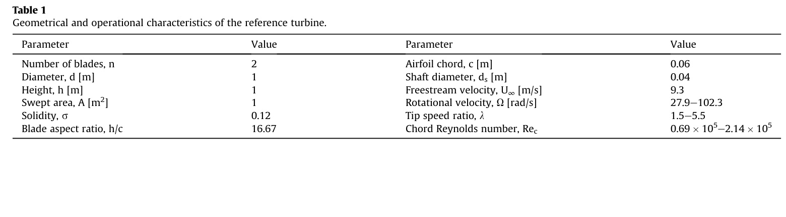

Geometrical and operational characteristics of the reference turbine.
Parameter
Value
Parameter
Value
Number of blades, n
2
Airfoil chord, c [m]
0.06
Diameter, d [m]
1
Shaft diameter, ds [m]
0.04
Height, h [m]
1
Freestream velocity, U∞[m/s]
9.3
Swept area, A [m2]
1
Rotational velocity, U [rad/s]
27.9e102.3
Solidity, s
0.12
Tip speed ratio, l
1.5e5.5
Blade aspect ratio, h/c
16.67
Chord Reynolds number, Rec
0.69  105e2.14  105
Fig. 1. Schematic of (a) the reference turbine, (b) computational domain (both not to
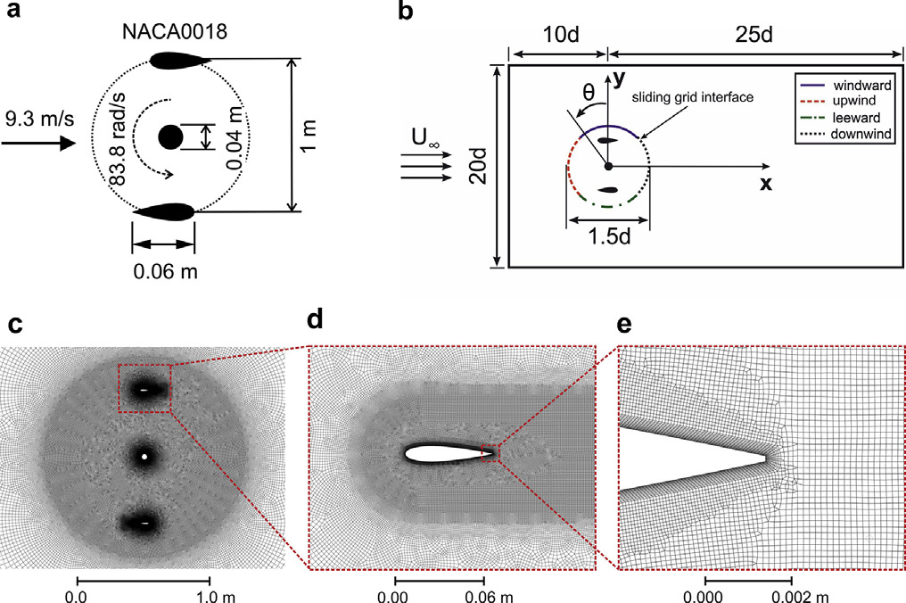

scale); (cee) computational grid near the (c) rotating core, (d) airfoil, and (e) trailing
edge.
A. Rezaeiha et al. / Energy 165 (2018) 1129e1148
1131

## 3. Validation study

Two sets of validations have been performed to ensure the ac-
curacy of the CFD simulations, where the CFD results are compared
with the experimental data by Tescione et al. [62] and Castelli et al.
[81]. The two turbines employed in the two validations have
different number of blades, solidity, airfoil shape, tip speed ratio,
and Reynolds number. A detailed comparison of the CFD results
with the experimental data and a comprehensive explanation of
the possible reasons for the deviations between the numerical and
experimental data are discussed in Refs. [20,51,52,64], which for
brevity are only briefly repeated here:
1) Wake velocity of the 2-bladed reference turbine: the time-
averaged (over one turbine revolution) streamwise and lateral
normalized velocities at different downstream positions, x/
R ¼ 2.0e3.0, along the lateral direction, 0.75  y/R  0.75, in
the wake of a 2-bladed turbine (reference turbine) were
compared with the experimental data by Tescione et al. [62].
The deviations are 8.6%e11.8% for the streamwise velocity
component and 2.3%e2.5% for the lateral velocity component
corresponding to the least and the most downstream positions.
2) Power coefficient of a 3-bladed turbine: the power coefficient of
a 3-bladed turbine with a diameter of 1.03 m, solidity of 0.25 and
blade cross-section of NACA0021 airfoil was compared with the
experimental data by Castelli et al. [81] at different tip speed
ratios from 2.04 to 3.08 (see Table 2). A good agreement be-
tween the numerical results and the experimental data was
achieved where the minimum deviation of 3.42% is present at
l ¼ 2.04. The maximum deviation of 23.2% is observed at the
highest l of 3.08.
## 4. Test cases

The present work is a characterization study aimed at revealing
the previously-unknown aspects of the impact of solidity and
number of blades on the aerodynamic performance of VAWTs.
Therefore, the two parameters are systematically studied within a
wide and meaningful range. Such a systematic analysis is needed to
provide a comprehensive picture of the influence of the two
aforementioned parameters under various operational conditions.
The impact of the turbine solidity on the aerodynamic perfor-
mance of VAWTs is studied for a wide range of solidities from a low
value of 0.09 to a relatively-high value of 0.36 (see Table 3). Note
that, in the present study, the solidity is changed via the blade
chord length, which at a given turbine operational condition,
inevitably modifies Rec. Note that in the present study for turbines
with different solidities but identical number of blades and tip
speed ratio, Rec is kept constant by scaling the blade chord length,
freestream and rotational velocities, see Section 5.3.
The study is performed for turbines with different number of
blades, i.e. 2, 3 and 4, and at different tip speed ratios ranging from a
low value of 1.5, where dynamic stall occurs, to a high value of 5.5,
where the flow is mostly attached but rotational effects are
considerable, in order to analyze the corresponding impact for each
regime. The Rec varies from 0.51  105 to 6.41  105, which covers
the range for the small-to medium-scale VAWTs. Different values of
approach-flow (i.e. inlet) turbulence intensities from 0%, repre-
sentative of low-turbulence wind tunnel tests, to 25%, representa-
tive of relatively-high turbulence operating environments, are
investigated. The incident-flow total turbulence intensities are
presented in Table 4. The K varies from 0.02 to 0.18 covering a wide
range of unsteadiness in the flow.
A detailed analysis of the effect of solidity on the turbine wake
and the dynamic loads on the blades at constant Rec is performed
for a 2-bladed turbine, see Section 5.3.
Table 2
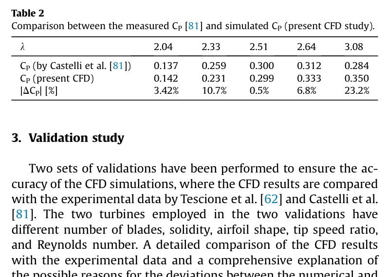

Comparison between the measured CP [81] and simulated CP (present CFD study).
l
2.04
2.33
2.51
2.64
3.08
CP (by Castelli et al. [81])
0.137
0.259
0.300
0.312
0.284
CP (present CFD)
0.142
0.231
0.299
0.333
0.350
|DCP| [%]
3.42%
10.7%
0.5%
6.8%
23.2%
Table 3
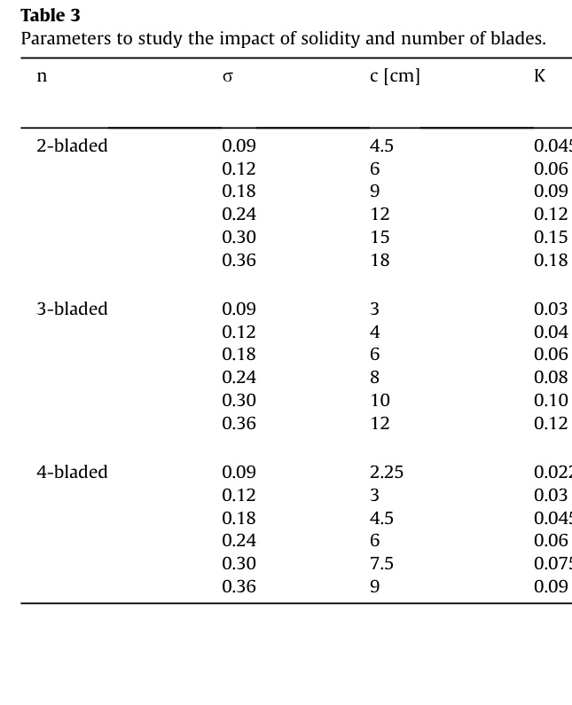

Parameters to study the impact of solidity and number of blades.
n
s
c [cm]
K
l ¼ 1.5e5.5
TI [%]
Rec (  105)
U∞[m/s]
U [rad/s]
2-bladed
0.09
4.5
0.045
0.51e1.60
9.3
27.9e102.3
0, 5, 15, 25
0.12
6
0.06
0.69e2.14
0.18
9
0.09
1.03e3.20
0.24
12
0.12
1.38e4.27
0.30
15
0.15
1.72e5.34
0.36
18
0.18
2.07e6.41
3-bladed
0.09
3
0.03
0.51e1.60
13.95
41.8e153.5
5
0.12
4
0.04
0.69e2.14
0.18
6
0.06
1.03e3.20
0.24
8
0.08
1.38e4.27
0.30
10
0.10
1.72e5.34
0.36
12
0.12
2.07e6.41
4-bladed
0.09
2.25
0.0225
0.51e1.60
18.6
55.8e204.6
5
0.12
3
0.03
0.69e2.14
0.18
4.5
0.045
1.03e3.20
0.24
6
0.06
1.38e4.27
0.30
7.5
0.075
1.72e5.34
0.36
9
0.09
2.07e6.41
Table 4
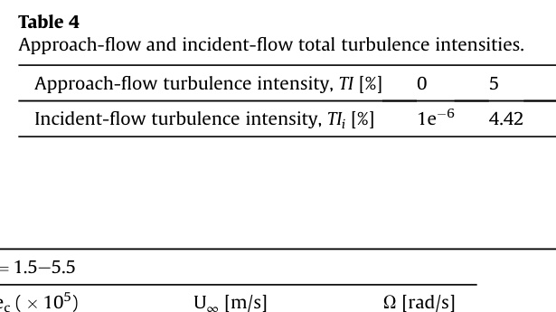

Approach-flow and incident-flow total turbulence intensities.
Approach-flow turbulence intensity, TI [%]
0
5
15
25
Incident-flow turbulence intensity, TIi [%]
1e6
4.42
11.01
15.98
A. Rezaeiha et al. / Energy 165 (2018) 1129e1148
1132

The impact of the number of blades on the aerodynamic per-
formance of VAWTs is studied by comparing 2-, 3-, and 4-bladed
turbines at different tip speed ratios and solidities (see Table 3).
Note that for turbines with different number of blades but identical
solidity and tip speed ratio, Rec is kept constant, by scaling the
freestream and rotational velocities, to avoid the Reynolds number
effects [20].
## 5. Impact of solidity

### 5.1. Turbine performance

Fig. 2a shows the power coefficient versus tip speed ratio for 2-

bladed VAWTs with different solidities from 0.09 to 0.36. It can be
seen that a low-solidity turbine obtains its highest CP (CP,max) at
moderately-high l while a high-solidity turbine works optimally at
relatively-low l. For instance, a turbine with s ¼ 0.09 works opti-
mally at l ¼ 4.5, while the optimal l (lopt) of a turbine with s ¼ 0.36
shifts to l ¼ 2.0. This implies that the geometrical design of a
constant-speed VAWTs, which inevitably has variable l due to the
changes of the incoming flow, is only optimal for one particular l
and the turbine will be working sub-optimally in the majority of the
operating conditions. Fig. 2a also indicates that with the increase of
s from 0.09 to 0.36, CP,max increases by 22.5%.
For constant-speed urban VAWTs, which during their design
condition most frequently operate at moderately-high l regime due
to the low mean wind speed in the urban environment, a low so-
lidity is shown to be optimal, e.g. for a turbine dominantly oper-
ating at 4.0  l  5.5, a solidity range of 0.1  s  0.15 is preferred.
This is while a higher solidity will result in a dramatically unfa-
vorable CP. Note that the design condition, which is the focus of this
study, refers to when the wind speed has already exceeded the
Fig. 2. Power coefficient versus (a) tip speed ratio and (b) solidity for 2-bladed VAWTs
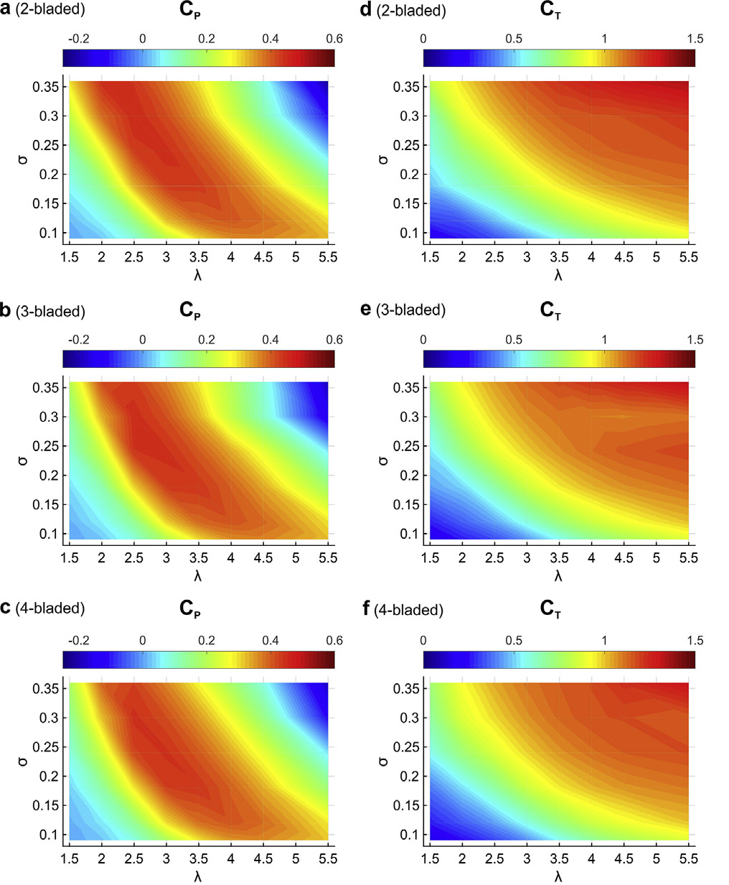

(TI ¼ 5%).
Fig. 3. Contours of power and thrust coefficients in l e s space for 2-, 3- and 4-bladed
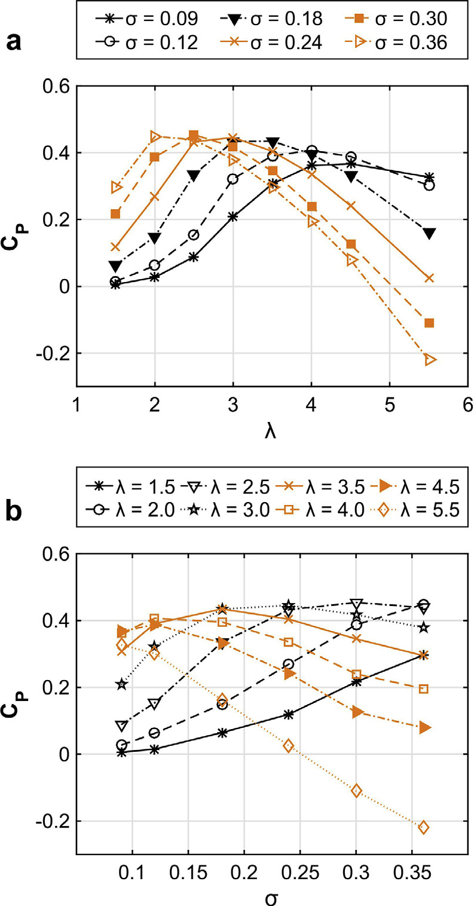

VAWTs with the same Rec at identical l e s positions. Each contour plot is based on 48
simulations (TI ¼ 5%).
Fig. 4. Contours of power coefficient in l e s space for 2-bladed VAWTs with different
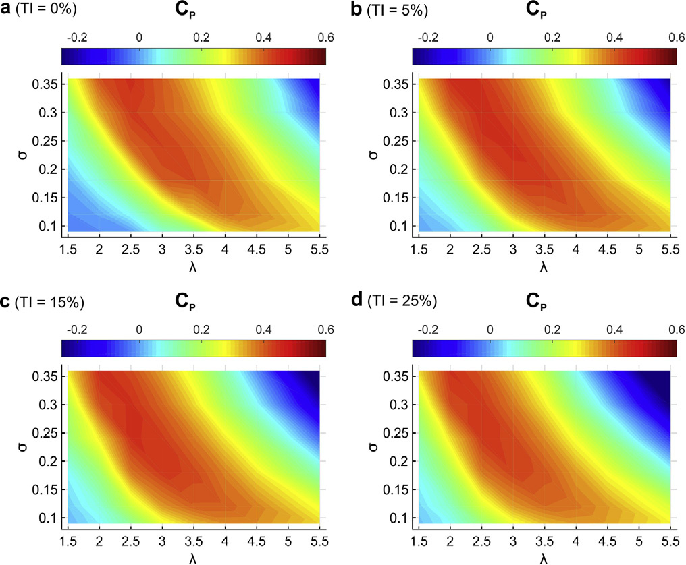

approach-flow turbulence intensities. Each contour plot is based on 48 simulations.
A. Rezaeiha et al. / Energy 165 (2018) 1129e1148
1133

turbine cut-in velocity and the start-up phase, during which the
turbine starts to rotate and reaches the designed rotational speed,
has passed. Also note that for constant-speed urban VAWTs,
moderate to high l is unavoidable because, given their small size
and blade chord length, in order to avoid the undesirable low
Reynolds number effects, they need to rotate relatively fast to keep
a sufficiently high Re (105).
Fig. 2b shows the power coefficient versus solidity for 2-bladed

VAWTs at constant l, which is the case for variable-speed VAWTs. It
can be seen that for variable-speed (constant l) VAWTs, the optimal
s, where CP,max is delivered, decreases with the increase of l. For
instance, the optimal s for a turbine constantly operating at l ¼ 3.0
is s ¼ 0.24. The optimal s reduces to 0.18 when the turbine is
operated at a higher l of 3.5. Moreover, the value of CP,max slightly
increases for turbines with higher optimal s (operating at lower l).
The increment in CP,max for higher s is due to the Reynolds number
effects, i.e., higher Rec of the blades [20]. Detailed analysis provided
in Section 5.3 further confirms this. The finding implies that a
turbine with a higher optimal s slightly benefits from the Reynolds
number effects due to the larger blade chord length. Therefore,
from an aerodynamic point of view, an optimal variable-speed
VAWT
is
a
relatively-high-solidity
turbine
operating
at
a
moderately-low l. In the present study, the optimum occurs for a
turbine with s ¼ 0.3 operating at l ¼ 2.5. However, a turbine with a
higher optimal s ¼ 0.36 operating at l ¼ 2.0 has a comparatively
lower Rec and CP,max.
The optimal design of a VAWT can be more clearly inferred from
the contours of CP illustrated in l e s space shown in Fig. 3a. Fig. 3b
and c show similar CP contours for 3- and 4-bladed turbines where
a similar trend is observed. The contours explicitly highlight the
optimal operation of the turbine with respect to the solidity and tip
speed ratio while also elucidating the regions of the poor turbine
performance which need to be avoided, i.e., a high-solidity turbine
at moderate to high l or a low-solidity turbine at low l. These
figures can serve as a design guide for designers and manufacturers
of VAWTs for different operating conditions.
The turbine thrust coefficient CT in l e s space for 2-, 3- and 4-
bladed VAWTs are exhibited in Fig. 3def. It can be seen that the CT
values grow by increasing both s and l, where the minimum and
the maximum CT values correspond to the lowest and the highest s
and l combinations.
The impact of solidity on the turbine performance as a function
of TI is further investigated at TI ¼ 0%,15%, and 25%. Fig. 4 shows the
contour of power coefficient in l e s space for 2-bladed VAWTs
with turbulence intensity from 0% to 25%. Fig. 4 reveals that the
trend of CP in l e s space is independent of TI. This is of significant
importance for the design of variable-speed (constant l) VAWTs as
the optimal aerodynamic design, irrespective of the turbulence
level, will remain a relatively high-solidity turbine operating at a
moderately-low tip speed ratio regime.
As presented in Figs. 3 and 4, the optimal performance of the
turbine is obtained either at a combination of low solidity and high
tip speed ratio or vice versa. This means that, at a given wind speed,
when the turbine is rotating faster (higher l), the optimal perfor-
mance is achieved with a smaller blade area (lower s) while if the
turbine is rotating slower (lower l) the optimal performance is
obtained for a larger blade area (higher s). The shift could be
correlated with a balance in the output power of the turbine as
follows. One can consider l and s as dimensionless measures of
blade velocity and surface area, respectively. As the power is pro-
portional to area times the cubic velocity P ¼ f ðAV3Þ, the dimen-
sionless power, i.e. CP, can be considered as CP ¼ f ðsl3Þ. Therefore,
the newly-defined parameter, sl3; can be employed to better
investigate the invariance of the turbine CP values. Fig. 5 illustrates
CP versus sl3 for 2-, 3- and 4-bladed turbines. The figure shows that
the sl3 value corresponding to optimal performance, i.e. maximum
CP, is almost independent of the number of blades and solidity. This
is an important finding, which highlights the invariance of the
optimal operation to the newly-defined parameter sl3.
Fig. 5. Power coefficient versus s l3 for turbines with different number of blades
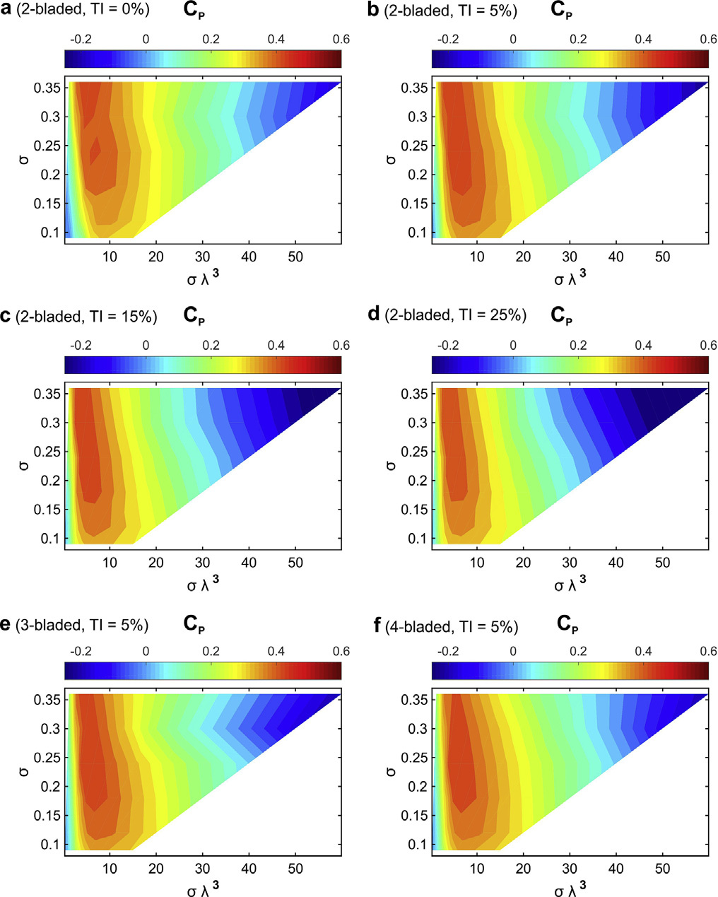

(TI ¼ 5%).
Fig. 6. Contours of power coefficient for turbine with different number of blades and
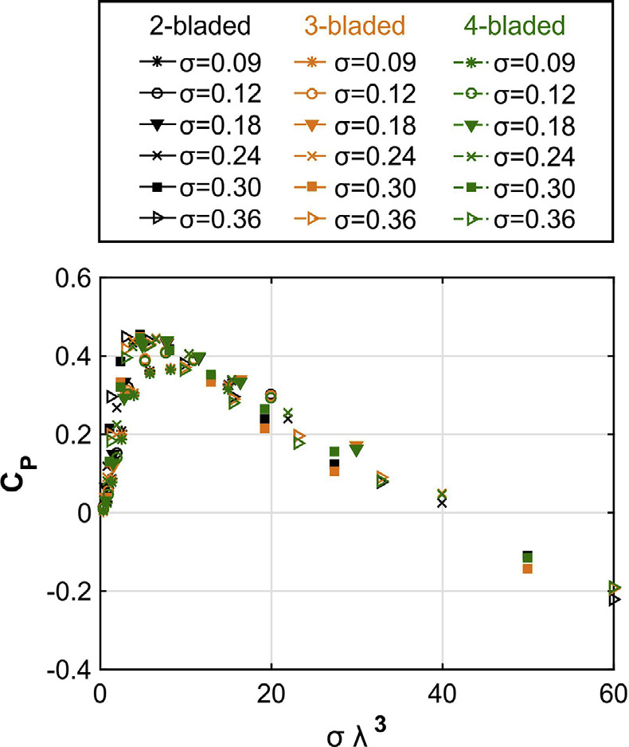

different approach-flow turbulence intensities. Each contour plot is based on 48
simulations.
A. Rezaeiha et al. / Energy 165 (2018) 1129e1148
1134

Fig. 6 presents contours of CP in s  sl3 space illustrating the

sl3 (approximate) invariance of the CP,max for turbines with
different geometrical and operational characteristics.
### 5.2. Optimal tip speed ratio

Optimal tip speed ratio lopt is an important design parameter for
both constant-speed (variable l) and variable-speed (constant l)
VAWTs. For constant-speed VAWTs, the turbine can be designed to
have the lopt in the vicinity of the dominant l to maximize the
power output. For variable-speed VAWTs, the turbine can be
designed to maintain the lopt during the majority of possible
operating conditions. Previous experimental and numerical results
have shown the Re-independency of lopt [20,45,46]. However, lopt
could be dependent on the other parameters, such as solidity.
Therefore, it is of prime importance to analyze such dependencies.
Table 5 presents the optimal performance versus solidity for 2-,
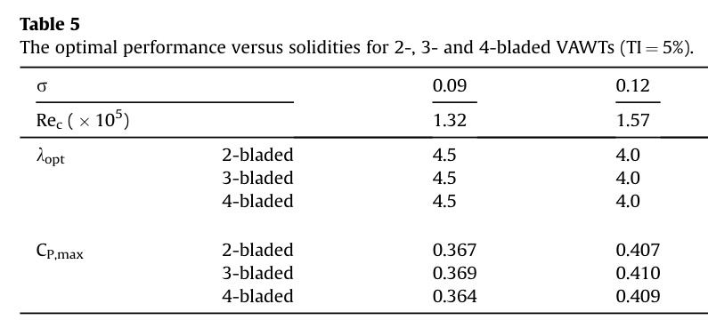

3- and 4-bladed VAWTs based on Fig. 3. The results show that
increasing s decreases lopt for turbines with different number of
blades. The dependency of lopt on the solidity implies that the
optimal geometrical design of the turbine needs to fully consider
the target operating condition.
Table 6 presents the optimal tip speed ratio of the turbine versus
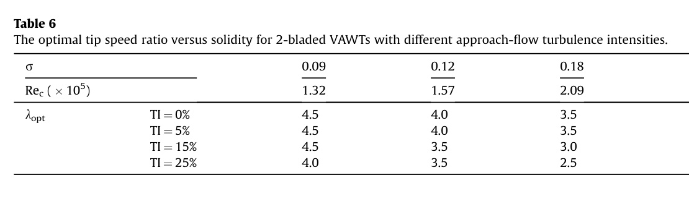

solidity for 2-bladed VAWTs with different levels of freestream
Table 5

The optimal performance versus solidities for 2-, 3- and 4-bladed VAWTs (TI ¼ 5%).
s
0.09
0.12
0.18
0.24
0.30
0.36
Rec (  105)
1.32
1.57
2.09
2.42
2.57
2.56
lopt
2-bladed
4.5
4.0
3.5
3.0
2.5
2.0
3-bladed
4.5
4.0
3.5
3.0
2.5
2.0
4-bladed
4.5
4.0
3.5
3.0
2.5
2.0
CP,max
2-bladed
0.367
0.407
0.435
0.446
0.454
0.445
3-bladed
0.369
0.410
0.438
0.445
0.450
0.432
4-bladed
0.364
0.409
0.439
0.444
0.445
0.427
Table 6

The optimal tip speed ratio versus solidity for 2-bladed VAWTs with different approach-flow turbulence intensities.
s
0.09
0.12
0.18
0.24
0.30
0.36
Rec (  105)
1.32
1.57
2.09
2.42
2.57
2.56
lopt
TI ¼ 0%
4.5
4.0
3.5
3.0
2.5
2.0
TI ¼ 5%
4.5
4.0
3.5
3.0
2.5
2.0
TI ¼ 15%
4.5
3.5
3.0
2.5
2.5
2.0
TI ¼ 25%
4.0
3.5
2.5
2.5
2.5
2.0
Table 7
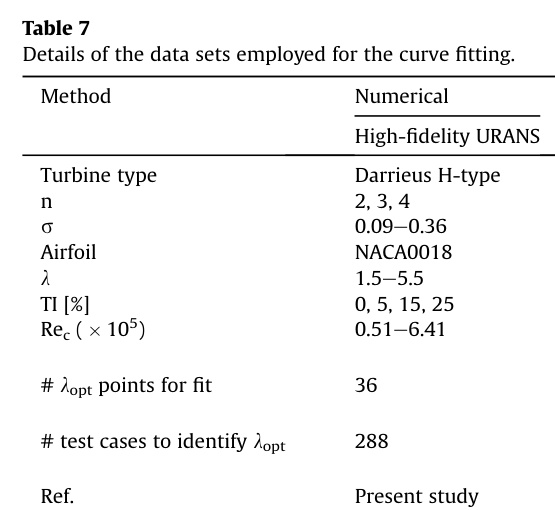

Details of the data sets employed for the curve fitting.
Method
Numerical
Experimental
High-fidelity URANS
Wind tunnel
Water channel
High-pressure tunnel
On-site
Turbine type
Darrieus H-type
n
2, 3, 4
3
3
5
3
s
0.09e0.36
0.48
0.42
1.12
0.125
Airfoil
NACA0018
NACA0015
NACA0020
NACA0021
NACA0021
l
1.5e5.5
0.3e2.2
0.1e3.2
0.8e1.6
1.7e4.5
TI [%]
0, 5, 15, 25
10
e
0.3e1.1
e
Rec (  105)
0.51e6.41
1.6e2.7
0.8e3.4
2.5e25.0
z7.13
# lopt points for fit
36
1
5
3
5
# test cases to identify lopt
288
z100
>100
>100
>500
Ref.
Present study
McLaren et al. [82]
Bachant and Wosnik [45]
Miller et al. [46]
Kjellin et al. [83]
Fig. 7. Optimal tip speed ratio vs. solidity with a curve fit using Eq. (1) based on data
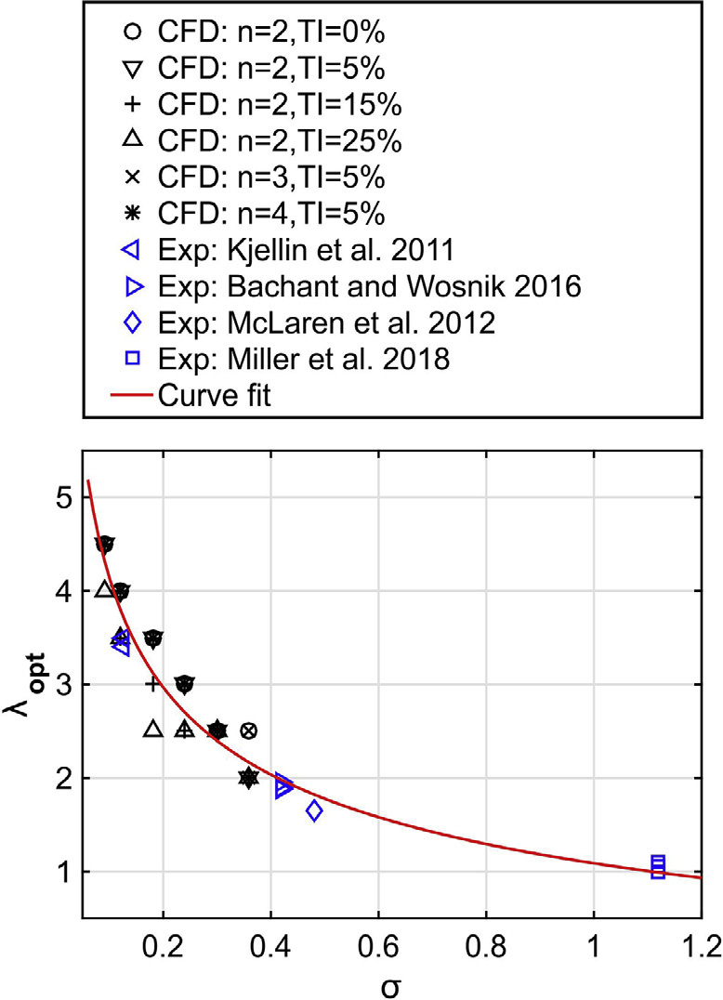

sets in Table 7.
A. Rezaeiha et al. / Energy 165 (2018) 1129e1148
1135

turbulence. At a given solidity, lopt is only weakly dependent on TI.
Given the paramount importance of lopt for design purposes, a
quick first approximation of lopt based on the turbine geometrical
parameters is very much desired by the designers and manufac-
turers of wind turbines. Therefore, in this study, a new correlation
between lopt and s is derived, see Eq. (1). A two-term power
function (with 95% confidence levels) is used to fit the CFD results
(presented in Tables 5 and 6) and four other experimental data sets.
The data sets and the fitted curve are shown in Table 7 and Fig. 7.
lopt ¼ 2:693s0:329  1:605
(1)
The correlation can be employed in the following two ways:
1) To estimate the lopt for a turbine with a known geometrical
design: for instance when the geometrical design of the turbine,
i.e., s, is already constrained by the other design drivers, such as
the structural requirements. In that case, the turbine optimal
rotational velocity can be estimated using the provided corre-
lation for a given wind condition of any potential installation
location.
Table 8
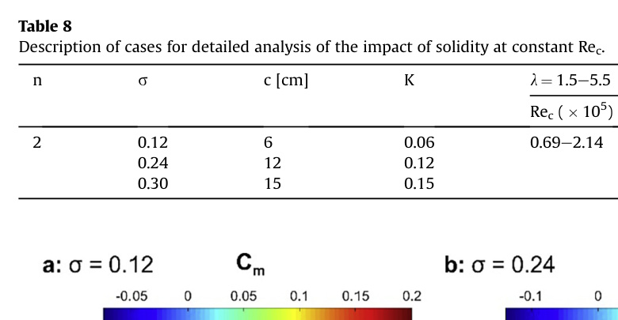

Description of cases for detailed analysis of the impact of solidity at constant Rec.
n
s
c [cm]
K
l ¼ 1.5e5.5
TI [%]
TIi [%]
Rec (  105)
U∞[m/s]
U [rad/s]
2
0.12
6
0.06
0.69e2.14
9.3
27.90e102.30
5
4.42
0.24
12
0.12
4.65
13.95e51.15
0.30
15
0.15
3.72
11.16e40.92
Fig. 8. (aec) Contours of instantaneous moment coefficient versus l (note the different range of colormaps); (def) instantaneous moment coefficient line plot for different l; (g)
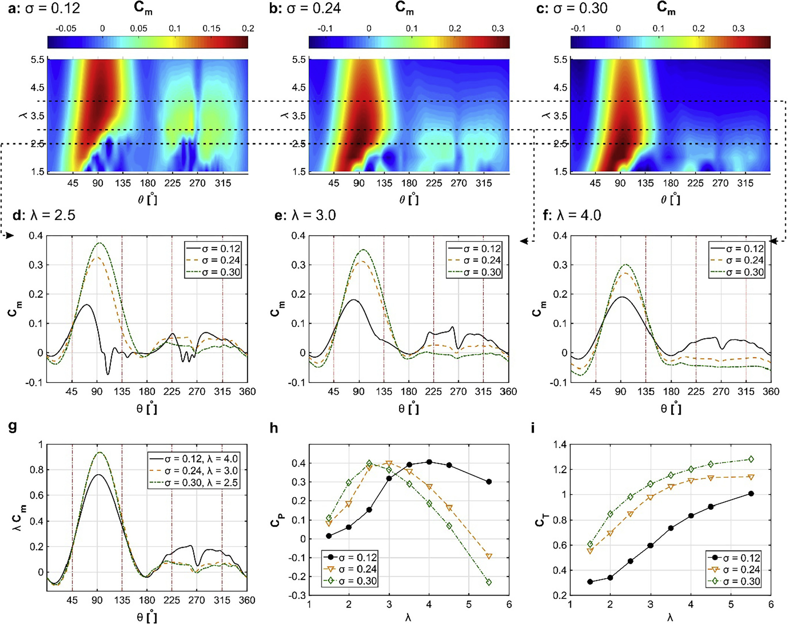

instantaneous power coefficient (lCm) during the last turbine revolution for different s at their lopt; and (hei) resulting power and thrust coefficients. Note that Rec is constant at
identical l.
A. Rezaeiha et al. / Energy 165 (2018) 1129e1148
1136

2) To identify the optimal s for a turbine with a desired lopt: for
instance when the turbine rotational velocity is already con-
strained by the other design drivers, e.g., the drivetrain rota-
tional speed, and thus the dominant l is known for a given wind
condition. In that case, the optimal turbine s can be estimated
using the provided correlation by solving the equation for s.
Given the Re-independency of lopt (see Refs. [20,45,46]), its
weak dependency to TI, and the large diversity of the geometrical
and operational characteristics of the data sets employed for the
curve fitting (Table 7), the proposed correlation can be used for the
Darrieus H-type VAWTs with different geometrical characteristics,
namely number of blades, airfoil shapes, solidities, and operational
conditions, namely l, TI, K and Rec.
### 5.3. Analysis at constant Rec

In order to further elucidate how the solidity influences the
turbine performance and wake, a more detailed analysis is per-
formed for 2-bladed turbines with different solidities of 0.12, 0.24
and 0.30 at constant Rec for identical l. Note that, for a given l, Rec is
kept constant by adjusting both U∞and U in the same manner. For
instance at l ¼ 1.5, for a turbine with s ¼ 0.12 and chord length of
0.06 m, U∞and U are 9.3 m/s and 27.9 rad/s, respectively. This yields
Rec ¼ 0.69  105. For a turbine with s ¼ 0.24 and chord length of
0.12 m, the modified U∞and U are 4.65 m/s and 13.95 rad/s, which
similarly yields Rec ¼ 0.69  105. Table 8 presents the description of
the cases.
Fig. 8aec show contours of the instantaneous moment coeffi-

cient during the last turbine revolution versus l for the different
solidities. To further clarify the contours, three additional typical Cm
e q plots are also presented in Fig. 8dee, corresponding to the lopt
of the different solidities. The following observations are made:
 Increasing the solidity is found to substantially delay the early
drop in Cm and avoid the subsequent fluctuations at low l,
which occur due to the dynamic stall on the blades (see Fig. 8a
and d). For s ¼ 0.12, the load fluctuations due to the dynamic
stall are observable for 1.5  l  2.5 while they are already ab-
sent at l ¼ 2.0 for s ¼ 0.30. This is thought to be due to the
higher reduced frequency, K, for the higher solidity turbine. For
instance, increasing s from 0.12 to 0.30 scales up K from 0.06 to
0.15, resulting in much higher unsteady aerodynamics over the
blade. This consequently delays the flow separation and dy-
namic stall on blades. The observed trend for the reduced fre-
quency is also in line with the studies on pitching airfoils
[84,85]. Further analysis to highlight such impact follows in this
section where the boundary layer events are discussed to
confirm the reduced frequency effect.
 Increasing the solidity substantially reduces the contribution of
the turbine aft half 180  q < 360 in the total power produc-
tion. This is explained as a higher solidity turbine extracts more
energy from the flow in the turbine fore half 0  q < 180,
which therefore leaves less energy in the flow to be exploited
downstream. In addition, higher solidity results in higher
blockage to the incoming flow, which eventually increases the
induction by the turbine and further slows down the incoming
flow. The lesser contribution by the turbine aft half for s ¼ 0.30
is more pronounced for l  3.0 where the turbine aft half yields
zero to negative Cm values (see Fig. 8e and f).
Fig. 8h and i show power and thrust coefficients versus l for the

different solidities. Note that Rec is constant at identical l. As
already discussed in Section 5.2, increasing the solidity shifts lopt to
lower values while interestingly, at constant Rec, CP,max remains
almost independent of s. On the other hand, increasing solidity is
found to substantially increase the CT due to the higher total blade
surface area.
Fig. 8g shows the instantaneous power coefficient (lCm) for the

respective solidities at their optimal operating condition, i.e., lopt.
As already shown, the turbines have almost the same CP,max at lopt,
implying that the integrals of the three curves shown in Fig. 8g are
approximately the same.
Fig. 9 shows the normalized cumulative sum of the instanta-

neous moment coefficient and the contribution of each turbine
quartile for the different solidities at their lopt. It can be seen that a
high solidity turbine at the optimal condition produces more power
in the upwind quartile, benefitting from the larger blade area, while
leaving less energy to be extracted in the downwind quartile. On
the other hand, a low solidity turbine can yield less power in the
upwind quartile allowing more energy extraction further down-
stream in the downwind quartile. This somehow shows that due to
the inherent unsteady nature of VAWTs, the maximum achievable
efficiency using a static design (blades with no active mechanism to
modify the local flow over the blade and to modify the angle of
attack during the revolution) is basically limited, and regardless of
the turbine geometrical design, the optimal efficiency will stay
Fig. 9. (a) Normalized cumulative sum of instantaneous moment coefficient during the
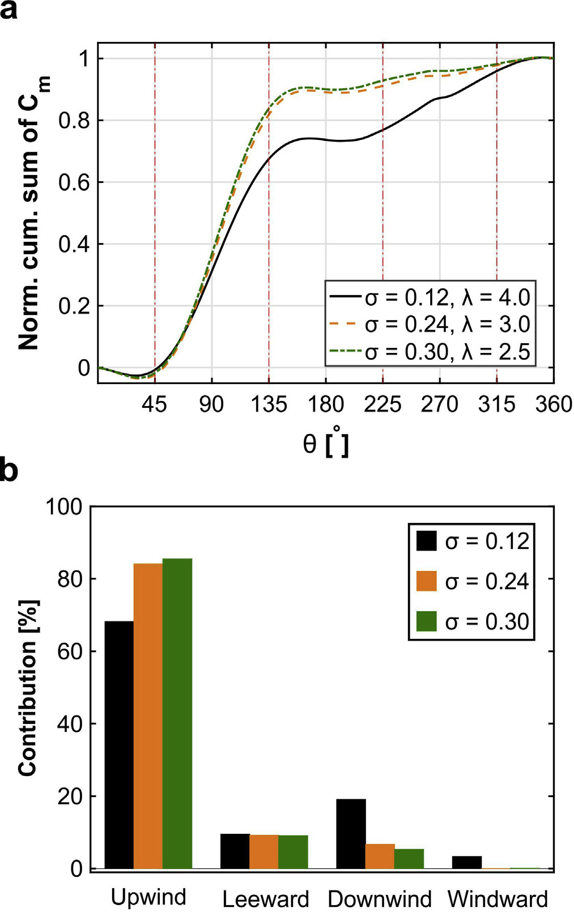

last turbine revolution; (b) contribution of turbine quartiles for different solidities at
their lopt. Rec for the three cases is provided in Table 5.
A. Rezaeiha et al. / Energy 165 (2018) 1129e1148
1137

Fig. 10. Variations of experienced angle of attack, normalized relative velocity, lift and drag coefficients during the last turbine revolution for different s at constant Rec for identical l.
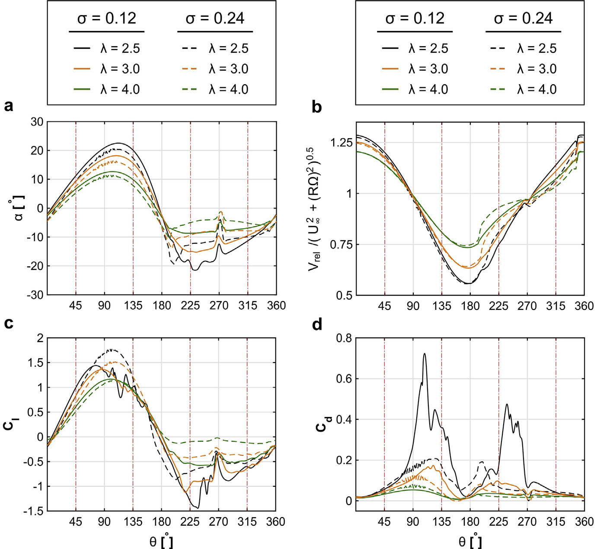

Fig. 11. Spatiotemporal contours of friction coefficient along the blade suction side (denoted with ‘-‘ sign) over the half-revolution for different s with constant Rec at identical l.
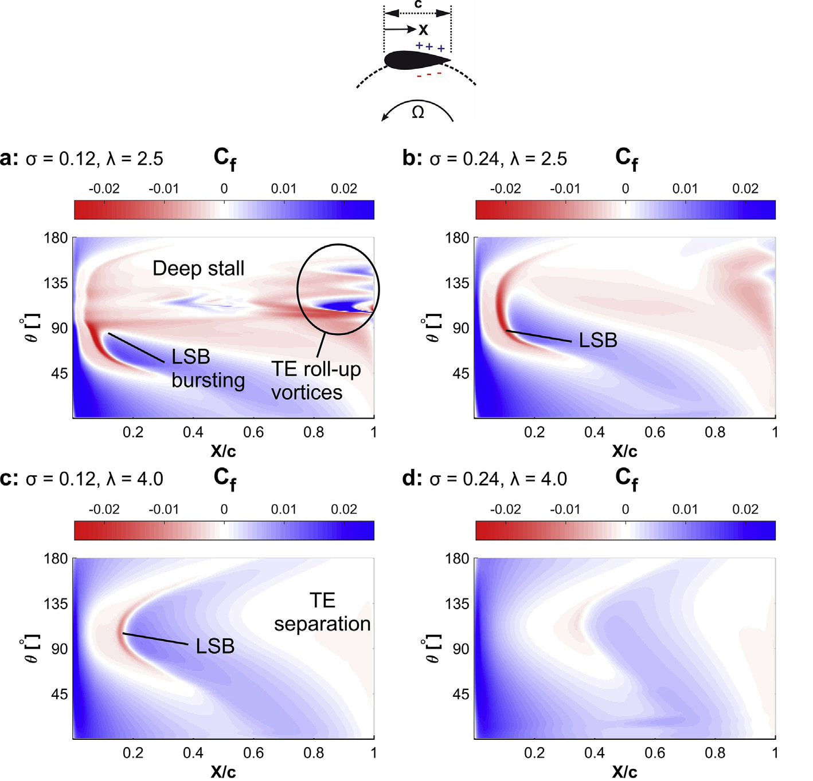

A. Rezaeiha et al. / Energy 165 (2018) 1129e1148
1138

almost constant. This urges the need for active mechanisms for
further improvement of the aerodynamic performance of VAWTs.
Fig. 10 shows the variations of the experienced angle of attack

(a), normalized relative velocity (Vrel), lift and drag coefficients (Cl
and Cd) during the last turbine revolution for different solidities at
various l. The comparison shows that:
 For different l, increasing s decreases the variations of a. This is
due to the comparatively high blockage of a turbine with higher
s, which further decelerates the incoming flow. The compara-
tively high induced velocity by the turbine is also apparent from
the lower (higher) values of relative velocity Vrel at 0  q  180
and 270 < q  360 (180 < q  270). Note that for 180 <
q  270, as the incoming flow is opposing the blade rotational
speed, an incoming flow with lower velocity (due to the higher
induced velocity) will lead to a comparatively high Vrel.
 The reduction in the absolute value of a by increasing s is
observed at both turbine fore and aft halves, where the reduc-
tion for the latter is more pronounced. Higher (absolute) dif-
ferences in Vrel for different l are also apparent in the turbine aft
half.
 Increasing s, at a given Rec, is found to influence the Cl and Cd in
two ways: first due to a reduction in the absolute value of a and
second due to the higher K. The former is more pronounced in
the turbine aft half, where Cl is significantly lower for higher s.
The latter is found to decrease the slope of the Cl e a curve
during the upstroke, delay the flow separation and stall and
diminish the load fluctuations. The load fluctuations occur due
to the blade stall and the blade-wake interactions (BWI). Such
fluctuations are observed for l ¼ 2.5 and 3.0, where separation is
noticeable. In addition, the higher K substantially increases the
Cl,max and significantly reduces the Cd and the Cd,max, which
occurs due to stall and BWI, for all cases except l ¼ 4.0 where the
flow is mostly attached, and stall is avoided.
In order to further elucidate how changing the solidity, at a
given Rec, affects the dynamic loads on the blades, i.e. Cl and Cd, it is
essential to analyze the boundary layer events. Such analysis can
also confirm the role of the reduced frequency in comparison to the
studies on pitching airfoils. Fig. 11 shows the spatiotemporal con-
tours of friction coefficient Cf along the blade over the last turbine
revolution for different solidities at various l. Figs. 12 and 13 show
the contours of dimensionless z-vorticity with superimposed
streamlines during the last turbine revolution at various azimuthal
positions. The figures explicitly show that increasing s: (i) signifi-
cantly delays the formation of the laminar separation bubble (LSB)
to later q as well as further towards the trailing edge along the
blade; (ii) substantially postpones the bursting of the LSB and the
Fig. 12. Contours of dimensionless z-vorticity with superimposed streamlines for different solidities during the last turbine revolution at various azimuthal positions (l ¼ 2.5).
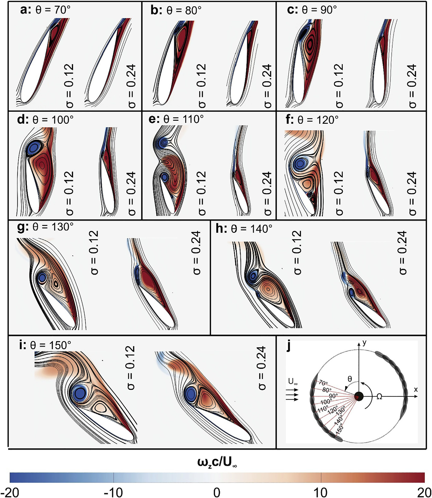

A. Rezaeiha et al. / Energy 165 (2018) 1129e1148
1139

follow-up deep stall, which occurs at l ¼ 2.5; (iii) diminishes the
trailing-edge roll-up vortices; and (iv) delays the trailing-edge
separation. These observations highlight the mechanisms in the
boundary layer through which changing the solidity influences the
turbine aerodynamic performance. Such mechanisms are thought
to occur due to the reduced frequency effect and are in line with the
experimental studies on pitching airfoils [84,85]. The clarification
of the impact of the K due to changing the solidity is an important
aspect of the solidity effect on the turbine aerodynamic perfor-
mance, which to the best of the authors' knowledge, has not yet
been identified in the literature and needs to be considered as a
favorable characteristics of the higher solidity turbines.
Fig. 14 illustrates the time-averaged (over the last turbine rev-

olution) normalized streamwise velocity at different downstream
locations (x/d ¼ 1.0, 1.5, 2.0, 2.5, 3.0 and 4.0) in the turbine wake
along several lateral lines (0.75  y/d  0.75) for different solid-
ities at various l. Fig. 15 illustrates the contours of the instanta-
neous normalized velocity magnitude. The comparison exhibits
that increasing s:
 noticeably increases the velocity deficit in the wake due to much
higher turbine CT (see Fig. 8j) and higher turbine induction (see
Fig. 10b) which tends to much further decelerate the incoming

flow, irrespective of the power extracted from the flow.
 significantly expands the wake, which is thought to be due to
larger blade chord length and, therefore, larger influenced re-
gion in the most windward and leeward sides.
 diminishes the oscillations observed in the near wake for x/
d  1.5 at l ¼ 2.5, which appear due to the presence of the
vortices shed from the stalled blades.
 reduces the impact of the shaft on the mean x-velocity profile in
the wake, which is thought to be due to the comparatively high
relative ratio of the blade chord length to the shaft diameter for
higher s.
 reduces the turbine wake length (see Fig. 15). It should be noted
that in this study the turbine wake length is defined as the
position in which V/U∞¼ 0.95. The reduction could be due to
the lower freestream velocity, and consequently lower ReD,
employed for the turbines with higher solidities to keep Rec
constant, and probably not a direct impact of the turbine so-
lidity. It is found that the turbines with different s have almost
the same wake length at their lopt. Lw/d at lopt remains
approximately 8e12 for various s.
 enlarges the turbine upstream induction field.
Fig. 13. Contours of dimensionless z-vorticity with superimposed streamlines for different solidities during the last turbine revolution at various azimuthal positions (l ¼ 4.0).
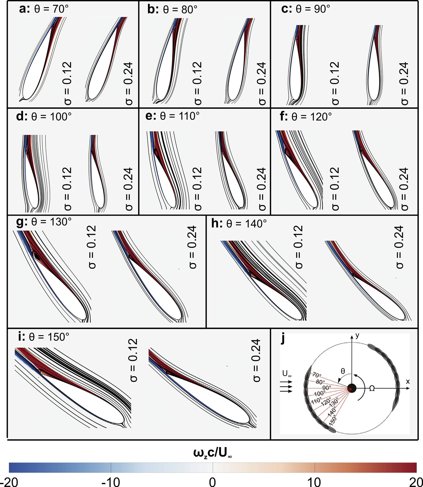

A. Rezaeiha et al. / Energy 165 (2018) 1129e1148
1140

## 6. Impact of number of blades

### 6.1. Turbine performance

Fig. 16 shows the power coefficient versus tip speed ratio and

solidity for 2-, 3-, and 4-bladed VAWTs with constant Rec at iden-
tical solidities and tip speed ratios. It can be seen that except for
l < 2.5, the turbine CP is weakly sensitive to the number of blades. In
the optimal operating range of turbines with different solidities, i.e.
in the vicinity of lopt, CP is almost n-independent. This is an
important finding which implies that for variable-speed VAWTs
maintaining their lopt at a given constant Rec, the number of blades
could be selected based on the other design parameters such as
uniformity of the output power, structural loads and vibrations, and
the cost. The same applies to constant-speed low-solidity urban
VAWTs, at a given constant Rec, frequently operating at moderate to
high l where the CP is almost insensitive to the number of blades.
Note that, as explained in Section 5.1, the urban VAWTs need to
have a low solidity due to their dominant moderate to high l.
However, in practice for small- to medium-scale turbines due to
the low mean wind speed, e.g., in the urban environment, Rec is
typically in the low to moderate regime,  2  105, where Re
number effects are significantly influencing the turbine CP [20].
Therefore, to avoid the low Reynolds number effects, the blade
chord length needs to be sufficiently large. Hence, from an aero-
dynamic point of view and for a given solidity, the smaller number
of blades will yield a higher CP due to the Reynolds number effect.
Therefore, the choice of the optimal number of blades with respect
to the turbine CP needs to consider the Rec. Note that, as already
mentioned, to select the number of blades there exists other
important considerations, i.e., uniformity of structural loads, tur-
bine vibrations, power uniformity, and the cost.
In addition, at a given solidity, the turbine with less number of
blades will operate at a higher K due to the larger blade chord
length. As discussed in Section 5.3, the higher K will improve the
turbine aerodynamic performance at low l by delaying/avoiding
the flow separation and dynamic stall and the consequent load
fluctuations. The higher CP for the turbine with less number of
blades at l < 2.5, therefore, could be a result of the higher K. For
instance, this is more pronounced for the 2-bladed turbine
compared to the 3- and 4-bladed turbines at l ¼ 1.5 and 2.0, see
Fig. 16b. Further discussions are provided in Section 6.2.

### 6.2. Analysis at constant Rec

In order to further elucidate the impact of the number of blades,
a more detailed analysis is performed for a set of cases described in
Fig. 14. Time-averaged (over the last turbine revolution) normalized streamwise ve-
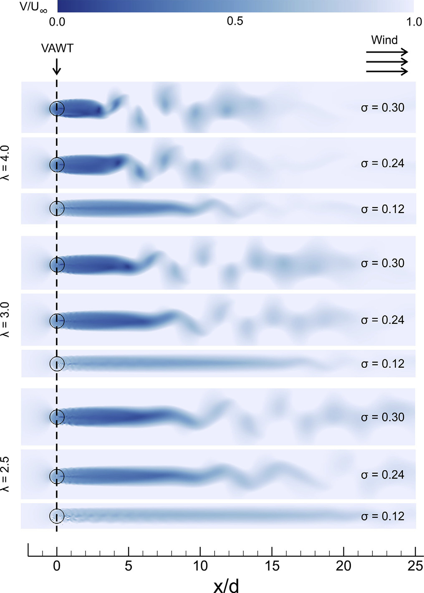

locity at different downstream locations in the turbine wake along lateral lines
(0.75  y/d  0.75) for different s at constant Rec for identical l.
Fig. 15. Contours of instantaneous normalized velocity magnitude for different solid-
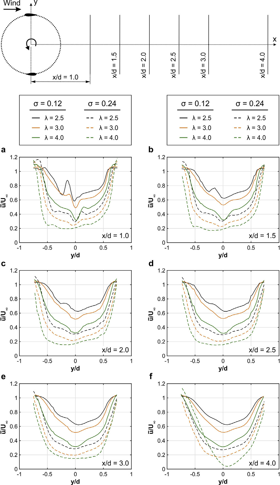

ities at various tip speed ratios.
A. Rezaeiha et al. / Energy 165 (2018) 1129e1148
1141

Table 9. The analysis is performed at two different solidities:
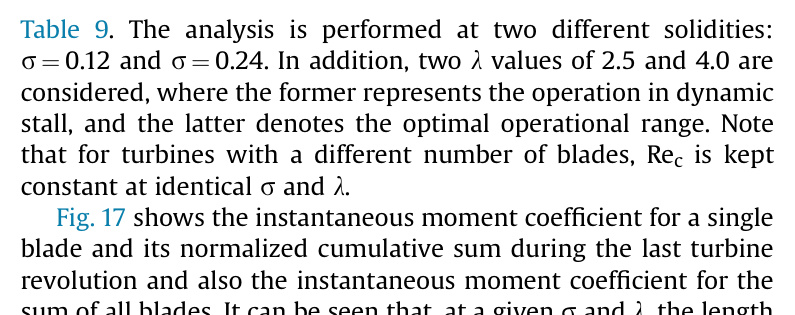
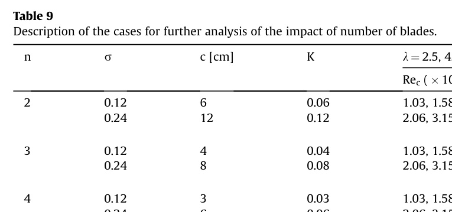

s ¼ 0.12 and s ¼ 0.24. In addition, two l values of 2.5 and 4.0 are
considered, where the former represents the operation in dynamic
stall, and the latter denotes the optimal operational range. Note
that for turbines with a different number of blades, Rec is kept
constant at identical s and l.
Fig. 17 shows the instantaneous moment coefficient for a single

blade and its normalized cumulative sum during the last turbine
revolution and also the instantaneous moment coefficient for the
sum of all blades. It can be seen that, at a given s and l, the length
scale of the load fluctuations, which occurs due to the dynamic stall
on blade and the blade-wake interactions, is larger for the turbine
with smaller number of blades, i.e., n ¼ 2, due to the larger blade
chord length, this is while the frequency of the fluctuations,
consequently, is comparatively lower (Fig. 17aeb).
The Cm plots for all the blades (Fig. 16b and d) shows that a
higher number of blades results in higher uniformity in the
instantaneous output power.
The normalized cumulative sum of Cm values of a single blade
over the last turbine revolution reveals that increasing the number
of blades reduces the contribution of the upwind quartile in the
total power production, which instead grows the contribution of
the downwind quartile. This shift, which is found to occur for
different s and l, implies the more gradual energy extraction from
the flow using more blades, which consequently results in more
uniform output power.
Fig. 18 shows the variations of the experienced angle of attack,

normalized relative velocity, lift and drag coefficients during the
last turbine revolution for turbines with different number of blades.
The comparison shows that:
 The experienced angle of attack a and relative velocity Vrel
experienced by the blade are almost not influenced by the
number of blades. Small differences are observed in 190 <
q < 260, which are due to the differences in the length scale and
frequency of the shed vortices further upstream from the blades
for turbines with different number of blades. This results in
differences in the blade-wake interactions which are more
pronounced for l ¼ 2.5 due to the larger variations of a and the
consequent dynamic stall.
 In the turbine fore half, 0  q < 180, higher Cl values and
delayed drop in Cl is observed for the turbine with less number
of blades at both s ¼ 0.12 and 0.24. This is due to the higher K of
the turbine with less number of blades. Studies on pitching
airfoils and flat plates have revealed that higher K improves the
Cl,max, and delays the stall angle [84,85].
 For l ¼ 2.5 in dynamic stall, due to the smaller blade chord
length for the turbine with a higher number of blades, the post-
stall load fluctuations are of smaller length scale and higher
frequency. This is more pronounced for s ¼ 0.12 at q > 90 and
for s ¼ 0.24 at q > 105.
In order to further elucidate how changing the number of
blades, at a given Rec, affects the dynamic loads on the blades, i.e. Cl
and Cd, the boundary layer events need to be analyzed. Fig. 19
shows the spatiotemporal contours of the friction coefficient Cf
along the blade over the last turbine revolution for turbines with
different number of blades at l ¼ 2.5. It can be seen that by reducing
the number of blades: (i) the laminar separation bubble (LSB) forms
at a later azimuthal position; (ii) for s ¼ 0.12, the LSB bursting is
also postponed (for example, the LSB bursting for n ¼ 3 in Fig. 19b
occurs at q z 74 while it delays to q z 84 for n ¼ 2 in Fig.19a); (iii)
for s ¼ 0.24, the extent of the trailing-edge separation is dimin-
ished; and (iv) for s ¼ 0.24, the dynamic stall vortex (DSV) is shed
later
and
travels
slower
towards
the
trailing
edge.
These
Fig. 16. Power coefficients versus tip speed ratio and solidity for 2-, 3-, and 4-bladed
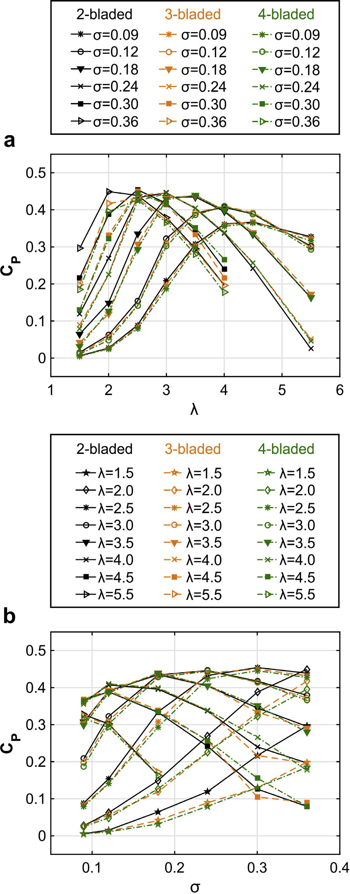

VAWTs with fixed Rec at identical l e s positions (TI ¼ 5%).
A. Rezaeiha et al. / Energy 165 (2018) 1129e1148
1142

observations reveal that changing the number of blades, even at a
given Rec, substantially influences the separation onset and the
chordwise extent of the separated region on the blades. This is an
important finding as it highlights that the chordwise position of any
active flow control device aimed to control the flow separation on
the VAWT blades is dependent on the number of blades even if s
and Rec are kept constant. The delay in separation for the turbine
with less number of blades occurs because of the higher K (see
Table 9). Higher K is known to result in higher resistance to sepa-

ration in the boundary layer [84,85].
In addition, increasing the number of blades is found to increase
the number of the trailing-edge roll-up vortices and their shedding
frequency while reducing their size. This is more pronounced at
s ¼ 0.12.
Fig. 20 illustrates the time-averaged (over the last turbine rev-

olution) normalized streamwise velocity at different downstream
locations (x/d ¼ 1.0, 1.5, 2.0, 2.5, 3.0 and 4.0) in the turbine wake
along several lateral lines (0.75  y/d  0.75) for turbines with a
different number of blades. The comparison reveals that:
 At the windward side (0 > y), increasing the number of blades
also increases the velocity deficit in the wake, while in the
leeward side (0 < y) the reverse applies and a larger velocity
deficit is observed for the less number of blades.
 The wake profile is more sensitive to the number of blades in the
leeward side (0 < y), compared to the windward.
 The sensitivity of the wake profile to the number of blades is
higher for lower l and higher s. The impact of l is more
pronounced.
 The impact of the number of blades on the wake profile persists
as the wake travels downstream to x/d ¼ 4.0.
 The turbine wake length is found to be almost insensitive to the
number of blades (not shown in this paper).
## 7. Summary and conclusions

Solidity (s) and number of blades (n) are the two important
geometrical parameters, which significantly drive the turbine per-
formance. While an optimal solidity can be identified based on an
aerodynamic analysis, the selection of the number of blades for a
turbine is a function of several important parameters, namely
uniformity of output power, turbine loads and vibrations, cost as
well as the turbine aerodynamic performance. The focus of the
present study is, therefore, confined to investigating the impact of s
and n on the aerodynamic performance of the turbine to provide a
profound understanding and to help the designers and the manu-
facturers with this aspect of the design.
In the present study, high-fidelity CFD simulations, extensively
validated with experimental data, are employed to study the
impact of the aforementioned two parameters. s varies by changing
the blade chord length within 0.09  s  0.36 for turbines with 2, 3
and 4 blades. The study covers a wide range of tip speed ratios,1.5 
l  5.5, freestream chord-based Reynolds numbers, 0.51  105 
Rec  6.41  105, approach-flow (i.e. inlet) total turbulence in-
tensities, 0%  TI  25%, and reduced frequencies, 0.02  K  0.18.
The main findings of the study can be summarized as follows:
(1) Solidity:
 Increasing s from 0.09 to 0.36, (i) shifts the optimal tip speed
ratio lopt from 4.5 to 2.0; and (ii) increases the CP,max by 22.5%.
The increment in CP,max is due to the Reynolds number effects.
This is confirmed as the results show that such an increment is
not present when s increases at constant Rec.
Table 9

Description of the cases for further analysis of the impact of number of blades.
n
s
c [cm]
K
l ¼ 2.5, 4.0
TI [%]
TIi [%]
Rec (  105)
U∞[m/s]
U [rad/s]
2
0.12
6
0.06
1.03, 1.58
9.3
46.5, 74.4
5
4.42
0.24
12
0.12
2.06, 3.15
3
0.12
4
0.04
1.03, 1.58
13.95
69.8, 111.6
5
4.42
0.24
8
0.08
2.06, 3.15
4
0.12
3
0.03
1.03, 1.58
18.6
93.0, 148.8
5
4.42
0.24
6
0.06
2.06, 3.15
Fig. 17. Instantaneous moment coefficient and its normalized cumulative sum during
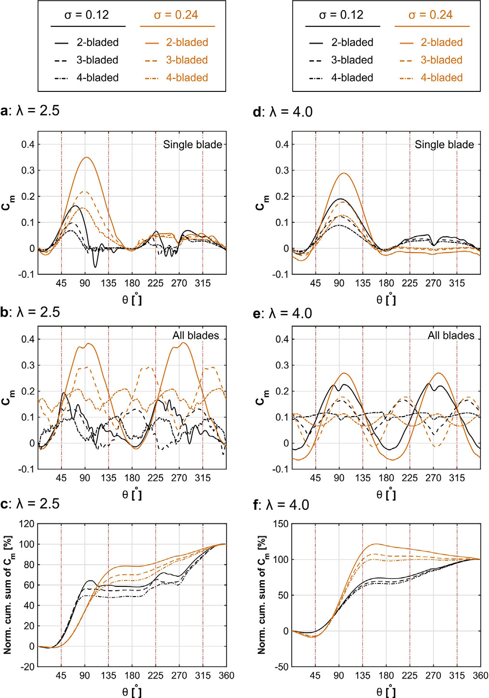

the last turbine revolution for turbines with a different number of blades at constant
Rec for identical s and l.
A. Rezaeiha et al. / Energy 165 (2018) 1129e1148
1143

 The trend of reduction in lopt with the increase of s is similarly
observed for turbines with 2, 3 and 4 number of blades. A
similar trend is also observed for different turbulence
intensities.
 CT grows asymptotically with the increase of s.
 At a given Rec, increasing s is found to: (i) noticeably reduce
the absolute a and increase the induced velocity by the blade.
For instance, when s increases from 0.12 to 0.24, a reduces up
to 2.5, and 6 in the turbine fore and aft halves, respectively;
(ii) increase the Cl,max while reducing the Cd,max, especially for
the lower l values due to the higher K; (iii) increase the tur-
bine upstream induction field, the velocity deficit in the wake,
the wake expansion and diminish the oscillations in the wake
velocity profile, which occur due to shed vortices from the
blades and the shaft wake, and decrease the turbine wake
length.
Fig. 18. Variations of experienced angle of attack, normalized relative velocity, lift and drag coefficients during the last turbine revolution for turbines with a different number of
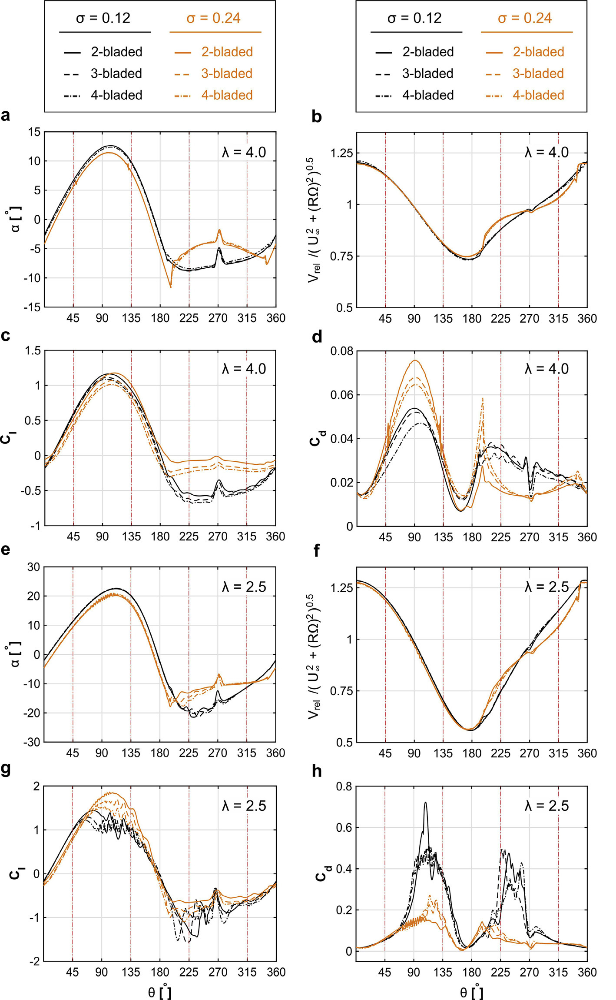

blades at constant Rec for identical solidities and tip speed ratios.
A. Rezaeiha et al. / Energy 165 (2018) 1129e1148
1144

(2) Number of blades:
 At a given Rec, the turbine CP is independent of n within the
optimal operational range, i.e., in the vicinity of lopt.
 For a given s and at low l where dynamic stall is present, CP
values are dependent on the number of blades due to the
impact of K. This means that at a given solidity, the smaller
number of blades (higher chord length) delivers a higher K
and thus a higher CP.
 At a given Rec, a and Vrel are almost independent of number
of blades.
 Decreasing n is found to increase the Cl,max and reduce the
Cd due to the higher K.
The important conclusions are as below:
 It is shown that the lopt is invariant to the newly-defined
parameter ‘sl3’, regardless of the turbine geometrical and
operational conditions.
 A new correlation is derived based on a large set of numerical
and experimental data sets to estimate the lopt solely based on
the turbine solidity: lopt ¼ 2:693s0:329  1:605. The correlation
can be very helpful for the turbine designers and manufacturers
either to estimate the lopt for a given s or vice versa to choose
the optimal s for a desired lopt.
 The optimal geometrical design, namely the optimal solidity, is
highly dependent on the target operating conditions of the
turbine to be designed. For constant-speed small-to medium-
scale (urban) VAWTs, which frequently operate at moderate to
high l due to the low mean wind speeds at the potential sites, a
Fig. 19. Spatiotemporal contours of friction coefficient along the blade suction side (denoted with ‘-‘ sign) over the half-revolution for turbines with different number of blades with
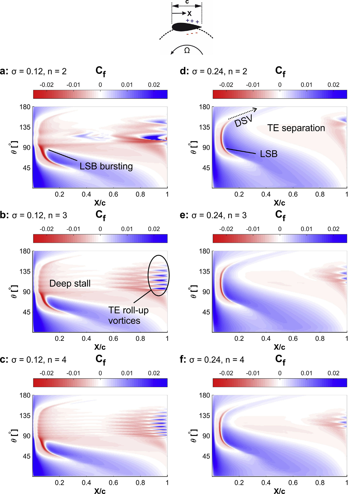

constant Rec at identical s and l (l ¼ 2.5).
A. Rezaeiha et al. / Energy 165 (2018) 1129e1148
1145

low solidity is preferred. On the other hand, variable-speed
VAWTs are optimal with relatively-high solidity maintaining a
moderately-low l.
 For a given turbine diameter and n and under a given operating
condition, changing the s inevitably modifies the Rec and K
where the two parameters have significant influences on the
flow topology and the boundary layer events on the blades,
namely unsteady laminar leading-edge and turbulent trailing-
edge separations, reattachment and laminar-to-turbulent tran-
sition. Such impacts are more pronounced in the low l where
due to the higher variations of a, dynamic stall might occur.
 Increasing s also increases the contribution of the upwind
quartile to the total power production while reducing the
contribution of the downwind quartile. At constant Rec, turbines
with different s yield approximately the same CP,max, where the
instantaneous moment coefficient is only shifted between the
upwind and downwind quartiles. This implies that due to the
unsteady nature of the VAWTs, a non-dynamic geometrical
design for VAWTs can barely further enhance the turbine effi-
ciency and unsteady active mechanisms have to be devised.
 From an aerodynamic point of view, at a given s, the less
number of blades is favorable due to the higher Rec and K.
However, as discussed above, the choice of the number of blades
is also driven by several other important design parameters,
such as uniformity of the output power and structural loads and
the cost. A larger number of blades yields more uniform
instantaneous loads and power during the revolution while the
length scale of the load fluctuations is also comparatively
smaller due to the smaller blade chord length at the given s.
In the present study, the turbine design condition is considered,
which refers to the condition where the wind speed has already
exceeded the turbine cut-in velocity and the start-up phase, during
which the turbine starts to rotate and reaches the designed rota-
tional speed, has passed. A dedicated analysis of the impact of so-
lidity and number of blades at off-design conditions, e.g., start-up,
is recommended.
In addition, a fixed airfoil shape has been considered in the
present analysis. Further investigation should be performed to
study the dependency of the derived conclusions for different
airfoil shapes.
The findings of this study help to better understand the impact
of the geometrical characteristics on the aerodynamic performance
of VAWTs and support to design optimum VAWTs and more
widespread wind energy harvesting.
Acknowledgement
The authors would like to acknowledge support from the Eu-
ropean Commission's Framework Program Horizon 2020, through
the Marie Curie Innovative Training Network (ITN) AEOLUS4FU-
TURE - Efficient harvesting of the wind energy (H2020-MSCA-ITN-
2014: Grant agreement no. 643167) and the TU1304 COST ACTION
“WINERCOST”. The authors gratefully acknowledge the partnership
with ANSYS CFD. This work was sponsored by NWO Exacte
Wetenschappen (Physical Sciences) for the use of supercomputer
facilities, with financial support from the Nederlandse Organisatie
voor Wetenschappelijk Onderzoek (Netherlands Organization for
Scientific Research, NWO). The 2nd author is currently a post-
doctoral fellow of the Research Foundation e Flanders (FWO) and is
grateful for its financial support (project FWO 12M5316N).
References
[1] Pereira TR, Batista NC, Fonseca ARA, Cardeira C, Oliveira P, Melicio R. Darrieus
wind turbine prototype: dynamic modeling parameter identification and
control analysis. Energy 2018;159:961e76.
[2] Patil R, Daroczy L, Janiga G, Thevenin D. Large eddy simulation of an H-Dar-
rieus rotor. Energy 2018;160:388e98.
[3] Meana-Fernandez A, Solís-Gallego I, Fernandez Oro JM, Argüelles Díaz KM,
Velarde-Suarez S. Parametrical evaluation of the aerodynamic performance of
vertical axis wind turbines for the proposal of optimized designs. Energy
2018;147:504e17.
[4] Tian W, Mao Z, An X, Zhang B, Wen H. Numerical study of energy recovery
from the wakes of moving vehicles on highways by using a vertical axis wind
turbine. Energy 2017;141:715e28.
[5] Sobhani E, Ghaffari M, Maghrebi MJ. Numerical investigation of dimple effects
on darrieus vertical axis wind turbine. Energy 2017;133:231e41.
[6] NajafiN, Paulsen US. Operational modal analysis on a VAWT in a large wind
tunnel using stereo vision technique. Energy 2017;125:405e16.
[7] Hand B, Cashman A. Conceptual design of a large-scale floating offshore
vertical axis wind turbine. Energy Procedia 2017;142:83e8.
[8] Borg M, Shires A, Collu M. Offshore floating vertical axis wind turbines, dy-
namics modelling state of the art. Part I: aerodynamics. Renew Sustain Energy
Rev 2014;39:1214e25.
[9] Lei H, Zhou D, Bao Y, Chen C, Ma N, Han Z. Numerical simulations of the
unsteady aerodynamics of a floating vertical axis wind turbine in surge mo-
tion. Energy 2017;127:1e17.
[10] Lei H, Zhou D, Lu J, Chen C, Han Z, Bao Y. The impact of pitch motion of a
Fig. 20. Time-averaged (over the last turbine revolution) normalized streamwise ve-
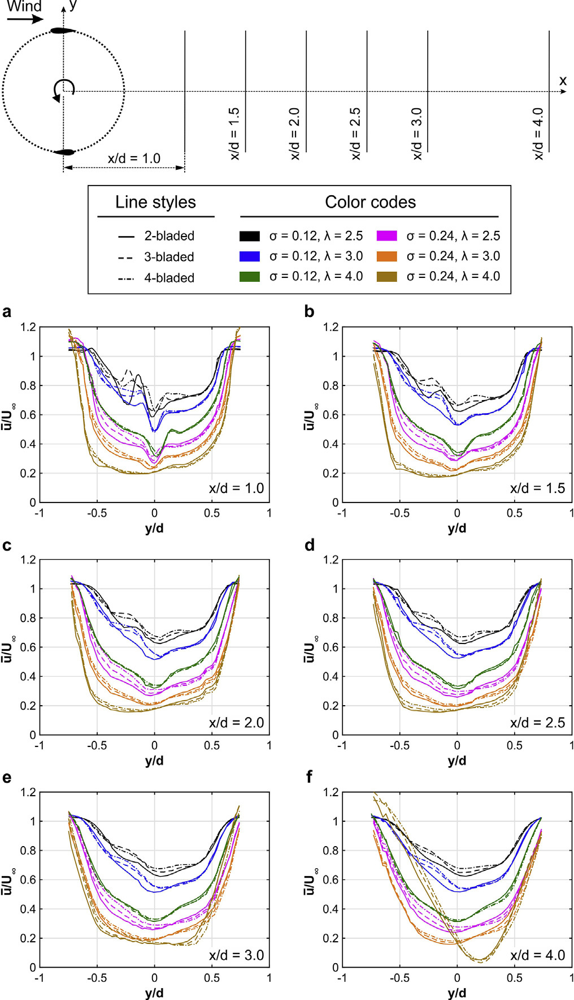

locity at different downstream locations in the turbine wake along the lateral line
(0.75  y/d  0.75) for turbines with a different number of blades at constant Rec for
identical s and l.
A. Rezaeiha et al. / Energy 165 (2018) 1129e1148
1146

platform on the aerodynamic performance of a floating vertical axis wind
turbine.
2017;119:369e83.
j.energy.2016.12.086.
[11] Pitteloud JD, Gs€anger S. Small wind world report summary. World Wind
Energy Association (WWEA); 2017.
[12] Tummala A, Velamati RK, Sinha DK, Indraja V, Krishna VH. A review on small
scale wind turbines. Renew Sustain Energy Rev 2016;56:1351e71.
[13] Montazeri H. Experimental and numerical study on natural ventilation per-
formance of various multi-opening wind catchers. Build Environ 2011;46(2):
370e8.
[14] van Hooff T, Blocken B, Aanen L, Bronsema B. A venturi-shaped roof for wind-
induced natural ventilation of buildings: wind tunnel and CFD evaluation of
different design configurations. Build Environ 2011;46(9):1797e807.
[15] Montazeri H, Montazeri F. CFD simulation of cross-ventilation in buildings
using rooftop wind-catchers: impact of outlet openings. Renew Energy
2018;118:502e20.
[16] Montazeri H, Azizian R. Experimental study on natural ventilation perfor-
mance of one-sided wind catcher. Build Environ 2008;43(12):2193e202.
[17] Montazeri H, Azizian R. Experimental study on natural ventilation perfor-
mance of a two-sided wind catcher. IMechE Part A J Power Energy
2009;223(4):387e400.
[18] Montazeri H, Montazeri F, Azizian R, Mostafavi S. Two-sided wind catcher
performance
evaluation
using
experimental,
numerical
and
analytical
modeling. Renew Energy 2010;35(7):1424e35.
[19] Hui I, Cain BE, Dabiri JO. Public receptiveness of vertical axis wind turbines.
Energy Pol 2018;112:258e71.
[20] Rezaeiha A, Montazeri H, Blocken B. Characterization of aerodynamic per-
formance of vertical axis wind turbines: impact of operational parameters.
Energy Convers Manag 2018;169(C):45e77.
[21] Hashem I, Mohamed MH. Aerodynamic performance enhancements of H-
rotor Darrieus wind turbine. Energy
2018;142:531e45. https://doi.org/
10.1016/j.energy.2017.10.036.
[22] Lam HF, Peng HY. Measurements of the wake characteristics of co- and
counter-rotating twin H-rotor vertical axis wind turbines. Energy 2017;131:
13e26.
[23] Zanforlin S, Deluca S. Effects of the Reynolds number and the tip losses on the
optimal aspect ratio of straight-bladed Vertical Axis Wind Turbines. Energy
2018;148:179e95.
[24] The J, Yu H. A critical review on the simulations of wind turbine aerodynamics
focusing on hybrid RANS-LES methods. Energy 2017;138:257e89.
[25] Rezaeiha A, Pereira R, Kotsonis M. Fluctuations of angle of attack and lift co-
efficient and the resultant fatigue loads for a large horizontal axis wind tur-
bine. Renew Energy 2017;114(B):904e16.
[26] Araya DB, JO Dabiri. A comparison of wake measurements in motor-driven
and flow-driven turbine experiments. Exp Fluid 2015;56(7).
[27] Kinzel M, Araya DB, JO Dabiri. Turbulence in vertical axis wind turbine can-
opies. Phys Fluids 2015;27(11):115102.
[28] Ryan KJ, Coletti F, Elkins CJ, Dabiri JO, Eaton JK. Three-dimensional flow field
around and downstream of a subscale model rotating vertical axis wind
turbine. Exp Fluid 2016;57(3).
[29] Abkar M, Dabiri JO. Self-similarity and flow characteristics of vertical-axis
wind turbine wakes: an LES study. J Turbul 2017;18(4):373e89.
[30] Araya DB, Colonius T, Dabiri JO. Transition to bluff-body dynamics in the wake
of vertical-axis wind turbines. J Fluid Mech 2017;813:346e81.
[31] Araya DB, JO Dabiri. Vertical axis wind turbine in a falling soap film. Phys
Fluids 2015;27(9):091108.
[32] Visbal MR, Garmann DJ. Analysis of dynamic stall on a pitching airfoil using
high-fidelity large-eddy simulations. AIAA J 2018;56(1):46e63.
[33] Müller-Vahl HF, Pechlivanoglou G, Nayeri CN, Paschereit CO, Greenblatt D.
Matched pitch rate extensions to dynamic stall on rotor blades. Renew Energy
2017;105:505e19.
[34] Ferreira C, van Kuik G, van Bussel G, Scarano F. Visualization by PIV of dy-
namic stall on a vertical axis wind turbine. Exp Fluid 2009;46(1):97e108.
[35] Buchner A-J, Soria J, Honnery D, Smits AJ. Dynamic stall in vertical axis wind
turbines: scaling and topological considerations. J Fluid Mech 2018;841:
746e66.
[36] Buchner A-J, Honnery D, Soria J. Stability and three-dimensional evolution of a
transitional dynamic stall vortex. J Fluid Mech 2017;823:166e97.
[37] Buchner AJ, Lohry MW, Martinelli L, Soria J, Smits AJ. Dynamic stall in vertical
axis wind turbines: comparing experiments and computations. J Wind Eng
Ind Aerod 2015;146:163e71.
[38] Karbasian HR, Esfahani JA, Barati E. Effect of acceleration on dynamic stall of
airfoil in unsteady operating conditions. Wind Energy 2016;19(1):17e33.
[39] Schuerich F, Brown RE. Effect of dynamic stall on the aerodynamics of vertical-
axis wind turbines. AIAA J 2011;49(11):2511e21.
[40] Gad-el-Hak
M,
Bushnell
DM.
Separation
control:
review.
J
Fluid
Eng
1991;113(1):5e30.
[41] Amet E, Maître T, Pellone C, Achard JL. 2D numerical simulations of blade-
vortex interaction in a Darrieus turbine. J Fluid Eng 2009;131(11):111103
(1-15).
[42] Bianchini A, Balduzzi F, Ferrara G, Ferrari L. Virtual incidence effect on rotating
airfoils in Darrieus wind turbines. Energy Convers Manag 2016;111:329e38.
[43] Migliore PG, Wolfe WP, Fanucci JB. Flow curvature effects on Darrieus turbine
blade aerodynamics. J Energy 1980;4(2):49e55.
[44] Tsai H-C, Colonius T. Coriolis effect on dynamic stall in a vertical axis wind
turbine. AIAA J 2016;54(1):216e26.
[45] Bachant P, Wosnik M. Effects of Reynolds number on the energy conversion
and near-wake dynamics of a high solidity vertical-axis cross-flow turbine.
Energies 2016;9(73).
[46] Miller MA, Duvvuri S, Brownstein I, Lee M, Dabiri JO, Hultmark M. Vertical-
axis wind turbine experiments at full dynamic similarity. J Fluid Mech
2018;844:707e20.
[47] Lam HF, Liu YM, Peng HY, Lee CF, Liu HJ. Assessment of solidity effect on the
power performance of H-rotor vertical axis wind turbines in turbulent flows.
J Renew Sustain Energy 2018;10(2):023304.
[48] Li Q, Maeda T, Kamada Y, Murata J, Shimizu K, Ogasawara T, Nakai A, Kasuya T.
Effect of solidity on aerodynamic forces around straight-bladed vertical axis
wind turbine by wind tunnel experiments (depending on number of blades).
Renew Energy 2016;96:928e39.
[49] Ferreira C, Geurts B. Aerofoil optimization for vertical-axis wind turbines.
Wind Energy 2014;18(8):1371e85.
[50] Ma N, Lei H, Han Z, Zhou D, Bao Y, Zhang K, Zhou L, Chen C. Airfoil optimi-
zation to improve power performance of a high-solidity vertical axis wind
turbine at a moderate tip speed ratio. Energy 2018;150:236e52.
[51] Rezaeiha A, Kalkman I, Blocken B. Effect of pitch angle on power performance
and aerodynamics of a vertical axis wind turbine. Appl Energy 2017;197:
132e50.
[52] Rezaeiha A, Kalkman I, Montazeri H, Blocken B. Effect of the shaft on the
aerodynamic performance of urban vertical axis wind turbines. Energy
Convers Manag 2017;149(C):616e30.
[53] Eboibi O, Danao LAM, Howell RJ. Experimental investigation of the influence
of solidity on the performance and flow field aerodynamics of vertical axis
wind turbines at low Reynolds numbers. Renew Energy 2016;92:474e83.
[54] Li Q, Maeda T, Kamada Y, Shimizu K, Ogasawara T, Nakai A, Kasuya T. Effect of
rotor aspect ratio and solidity on a straight-bladed vertical axis wind turbine
in three-dimensional analysis by the panel method. Energy 2017;121:1e9.
[55] Xisto CM, Pascoa JC, Trancossi M. Geometrical parameters influencing the
aerodynamic efficiency of a small-scale self-pitch high-solidity VAWT. J Sol
Energy Eng 2016;138(3):031006.
[56] Hassan SMR, Ali M, Islam MQ. The effect of solidity on the performance of. H-
Rotor Darrieus Turbine 2016;1754:040012.
[57] Delafin PL, Nishino T, Wang L, Kolios A. Effect of the number of blades and
solidity on the performance of a vertical axis wind turbine. J Phys Conf
2016;753:022033.
[58] Mohamed MH. Impacts of solidity and hybrid system in small wind turbines
performance. Energy 2013;57:495e504.
[59] Subramanian
A,
Yogesh
SA,
Sivanandan
H,
Giri
A,
Vasudevan
M,
Mugundhan V, Velamati RK. Effect of airfoil and solidity on performance of
small scale vertical axis wind turbine using three dimensional CFD model.
Energy 2017;133:179e90.
[60] Li Qa, Maeda T, Kamada Y, Murata J, Furukawa K, Yamamoto M. Effect of
number of blades on aerodynamic forces on a straight-bladed Vertical Axis
Wind Turbine. Energy 2015;90:784e95.
[61] Sagharichi A, Zamani M, Ghasemi A. Effect of solidity on the performance of
variable-pitch vertical axis wind turbine. Energy 2018;161:753e75.
[62] Tescione G, Ragni D, He C, Ferreira C, van Bussel GJW. Near wake flow analysis
of a vertical axis wind turbine by stereoscopic particle image velocimetry.
Renew Energy 2014;70:47e61.
[63] Rezaeiha A, Montazeri H, Blocken B. Towards accurate CFD simulations of
vertical axis wind turbines at different tip speed ratios and solidities: guide-
lines for azimuthal increment, domain size and convergence. Energy Convers
Manag 2018;156(C):301e16.
[64] Rezaeiha A, Kalkman I, Blocken B. CFD simulation of a vertical axis wind
turbine operating at a moderate tip speed ratio: guidelines for minimum
domain size and azimuthal increment. Renew Energy 2017;107:373e85.
[65] Roache PJ. Quantification of uncertainty in computational fluid dynamics.
Annu Rev Fluid Mech 1997;29:123e60.
[66] Blocken B, Stathopoulos T, Carmeliet J. CFD simulation of the atmospheric
boundary layer: wall function problems. Atmos Environ 2007;41(2):238e52.
[67] Blocken B, Carmeliet J, Stathopoulos T. CFD evaluation of wind speed condi-
tions in passages between parallel buildingsdeffect of wall-function rough-
ness modifications for the atmospheric boundary layer flow. J Wind Eng Ind
Aerod 2007;95(9e11):941e62.
[68] Menter FR, Langtry RB, Likki SR, Suzen YB, Huang PG, V€olker S. A correlation-
based transition model using local variablesdpart I: model formulation.
J Turbomach 2006;128(3):413e22.
[69] Menter FR. Two-equation eddy-viscosity turbulence models for engineering
applications. AIAA J 1994;32(8):1598e605.
[70] Menter FR, Kuntz M, Langtry R. Ten years of industrial experience with the
SST turbulence model. Turbulence, heat and mass transfer, vol. 4; 2003.
[71] Langtry RB, Menter FR, Likki SR, Suzen YB, Huang PG, V€olker S. A correlation-
based transition model using local variablesdpart II: test cases and industrial
applications. J Turbomach 2006;128(3):423e34.
[72] Menter FR, Langtry R, V€olker S. Transition modelling for general purpose CFD
codes. Flow, Turbul Combust 2006;77(1e4):277e303.
[73] Suzen YB, Huang PG, Hultgren LS, Ashpis DE. Predictions of separated and
transitional boundary layers under low-pressure turbine airfoil conditions
using an intermittency transport equation. J Turbomach 2003;125(3):455.
[74] Suzen YB, Huang PG. Modeling of flow transition using an intermittency
transport equation. 1999. NASA/CR-1999-209313.
A. Rezaeiha et al. / Energy 165 (2018) 1129e1148
1147

[75] Blocken B, van Druenen T, Toparlar Y, Malizia F, Mannion P, Andrianne T,
Marchal T, Maas GJ, Diepens J. Aerodynamic drag in cycling pelotons: new
insights by CFD simulation and wind tunnel testing. J Wind Eng Ind Aerod
2018;179:319e37.
[76] Rezaeiha A, Montazeri H, Blocken B. On the accuracy of turbulence models for
CFD simulations of vertical axis wind turbines. 2018. Submitted.
[77] Walters DK, Leylek JH. A new model for boundary layer transition using a
single-point RANS approach. J Turbomach 2004;126(1):193.
[78] Cutrone L, De Palma P, Pascazio G, Napolitano M. Predicting transition in two-
and three-dimensional separated flows. Int J Heat Fluid Flow 2008;29(2):
504e26.
[79] ANSYS. ANSYS® Fluent theory guide, release 16.1. ANSYS, Inc.; 2015.
[80] Patankar SV, Spalding DB. A calculation procedure for heat, mass and mo-
mentum transfer in three-dimensional parabolic flows. Int J Heat Mass Tran
1972;15:1787e806.
[81] Castelli MR, Englaro A, Benini E. The Darrieus wind turbine: proposal for a
new performance prediction model based on CFD. Energy 2011;36(8):
4919e34.
[82] McLaren K, Tullis S, Ziada S. Computational fluid dynamics simulation of the
aerodynamics of a high solidity, small-scale vertical axis wind turbine. Wind
Energy 2012;15(3):349e61.
[83] Kjellin J, Bülow F, Eriksson S, Deglaire P, Leijon M, Bernhoff H. Power coeffi-
cient measurement on a 12 kW straight bladed vertical axis wind turbine.
Renew Energy 2011;36(11):3050e3.
[84] Lee T, Gerontakos P. Investigation of flow over an oscillating airfoil. J Fluid
Mech 2004;512:313e41.
[85] McCroskey WJ, Carr LW, McAlister KW. Dynamic stall experiments on oscil-
lating airfoils. AIAA J 1976;14(1):57e63.
A. Rezaeiha et al. / Energy 165 (2018) 1129e1148
1148
