# Experimental study of the effects of turbine solidity, blade profile, pitch angle, surface roughness, and aspect ratio on the H-Darrieus wind turbine self-starting and overall performance

Longhuan Du | Grant Ingram | Robert G. Dominy

1 College of Architecture and Environment, Sichuan University, Chengdu, China
2 Department of Engineering, Durham University, Durham, UK
3 Faculty of Engineering and Environment, Department of Mechanical & Construction Engineering, Northumbria University, Newcastle, UK

## Abstract

New and comprehensive time‐accurate, experimental data from an H‐Darrieus wind turbine are presented to further develop our understanding of the performance of these turbines with a particular focus on self‐starting. The impact of turbine solid- ity, blade profile, surface roughness, pitch angle, and aspect ratio on the turbine's performance is investigated, parameters that are thought to be critical for small‐scale VAWT operation, particularly when operating in the built environment. It is demon- strated clearly that high turbine solidity (휎≥0.81) is beneficial for turbine self‐start- ing and that the selection of a thick, symmetrical aerofoil set at a low, negative pitch angle (훽≥−2◦) is better than a cambered foil. Increased blade surface roughness is also shown to improve a turbine's self‐starting capability at low tip speed ratios and with high turbine solidity and the associated flow physics are discussed. Finally, it was confirmed that blade span has a significant impact on turbine starting. This paper contributes to the understanding of the turbine characteristics during the start- ing period and provides clear guidance and validation cases for future design and research in order to promote and justify the wider application of this wind turbine configuration.

K E Y W O R D S design parameters, H‐Darrieus, self‐starting, turbine performance, vertical axis wind turbine

## 1. Introduction

Small wind turbines are considered to be one of the most
promising sources of clean electricity generation, particu-
larly in the built environment. However, wind speeds in that
environment are often low and unsteady with high levels of
turbulence resulting in air flows that are characterized by
rapid changes in speed and direction. Under these circum-
stances, vertical axis wind turbines (VAWTs) have been high-
lighted as more appropriate than the more commonly adopted
horizontal axis wind turbines (HAWTs) thanks to several
distinct advantages such as insensitivity to wind direction,
ease of maintenance, simple blade shape, low cost, and low
noise.1-4
The most significant challenges associated with employ-
ing these small machines are to make them self‐starting
(which is defined as the turbine's ability to reach its optimal
power‐extraction operation condition when driven only by
the wind) and more efficient. However, VAWTs are often re-
ported to suffer from low efficiency compared with HAWTs5
Experimental study of the effects of turbine solidity, blade
profile, pitch angle, surface roughness, and aspect ratio on the H‐
Darrieus wind turbine self‐starting and overall performance
Longhuan Du1
|   Grant Ingram2  |   Robert G. Dominy3
Sichuan University, Chengdu, China
University, Durham, UK
Engineering, Northumbria University,
Abstract
New and comprehensive time‐accurate, experimental data from an H‐Darrieus wind
turbine are presented to further develop our understanding of the performance of
these turbines with a particular focus on self‐starting. The impact of turbine solid-
ity, blade profile, surface roughness, pitch angle, and aspect ratio on the turbine's
performance is investigated, parameters that are thought to be critical for small‐scale
VAWT operation, particularly when operating in the built environment. It is demon-
strated clearly that high turbine solidity (휎≥0.81) is beneficial for turbine self‐start-
ing and that the selection of a thick, symmetrical aerofoil set at a low, negative pitch
angle (훽≥−2◦) is better than a cambered foil. Increased blade surface roughness is
also shown to improve a turbine's self‐starting capability at low tip speed ratios and
with high turbine solidity and the associated flow physics are discussed. Finally,
it was confirmed that blade span has a significant impact on turbine starting. This
paper contributes to the understanding of the turbine characteristics during the start-
ing period and provides clear guidance and validation cases for future design and
research in order to promote and justify the wider application of this wind turbine
configuration.
K E Y W O R D S
design parameters, H‐Darrieus, self‐starting, turbine performance, vertical axis wind turbine

2422  |

and the literature provides conflicting conclusions about the
self‐starting capability of an H‐Darrieus wind turbine.6
Improvements in the understanding and prediction of
VAWT performance have been achieved through the use of
analytical models, CFD simulations, and through a small
number of experimental measurements which have recently
begun to use time‐accurate techniques such as particle image
velocimetry (PIV).
Examples of the recent development and application
of analytical models include the work of Saeidi et al7 and
Svorcan et al8 who evaluated the turbine aerodynamic design
and economic aspects of a small‐scale H‐Darrieus wind tur-
bine using the widely adopted double‐multiple streamtube
model (DMST). De Tavernier et al9 applied a genetic algo-
rithm to optimize airfoil shape considering a balance between
the aerodynamic and structural performance. Dumitrescu10
applied a vortex model to predict and analyze the low‐fre-
quency noise produced by H‐Darrieus turbines, while a
low‐order aerodynamic model was applied by Hand and
Cashman11,12 to provide a low‐cost computational design tool
for studying H‐Darrieus turbines to which it is well suited.
In terms of the CFD simulations, numerous aspects of
VAWT performance have been studied. For example, Untaroiu
et al13 numerically studied the H‐Darrieus turbine self‐staring
behavior but both 2D and 3D models failed to accurately pre-
dict the starting characteristic when compared to measured
data. Arab et al14 examined the turbine self‐starting charac-
teristics showing that the turbine's aerodynamic performance
could be affected by the history of the flow field and that the
rotor inertia would affect the turbine starting characteristics.
Howell et al15 demonstrated that although 3D models were
in reasonably good agreement with experimental measure-
ments, their 2D results significantly overestimated the perfor-
mance coefficient. Danao et al16 investigated unsteady wind
effects on the performance of the turbine, and it was demon-
strated that the overall turbine performance could be im-
proved under certain unsteady conditions. Zhu et al17 showed
that the Gurney flap could improve turbine performance in
a certain range of tip speed ratio and Rezaeiha et al18 stud-
ied the impact of solidity and number of blades on the aero-
dynamic performance of H‐Darrieus turbines. Meanwhile,
the impact of a wider variety of operational parameters (λ,
Reynolds number, and turbulence intensity) on the turbine
performance was investigated by Rezaeiha et al19 showing
that turbine performance and wake are highly Re dependent
up to Re = 4.2 × 105 and increasing λ increased the velocity
deficit, wake expansion, and streamwise asymmetry in the
wake. Wang et al20,21 showed that blade leading edge serra-
tions could improve turbine performance and their optimized
turbine showed an 18.3% increase of power output. Zanforlin
and Deluca22 examined the effect of blade aspect ratio and
Reynolds number on turbine power output. According to their
results, both Reynolds number and tip losses would strongly
influence the aerodynamic performance of the rotor and more
advantages seemed to be achieved by limiting tip losses rather
than increasing chord‐based Reynolds number.
With regard to experimental measurements, Mazarbhuiya
et al23 investigated turbine performance using different asym-
metric blades with a focus on the influence of blade thick-
ness. It was demonstrated that thicker blades could improve
the turbine torque and power. Bianchini et al24 studied both
the global turbine performance and the wake structure using
a combination of a torque meter, wind speed, and hot wire
anemometer. The velocity values measured experimentally
in the wake compared well with their CFD predictions and
the experiment provides a useful source of CFD validation
data. Weber et al25 studied turbine noise in the wind tunnel
with a 1/2‐inch free‐field microphones. They showed that the
main sources of the H‐Darrieus sound pressure field were
the separation‐stall and the blade vortex interaction. Battisti
et al26 critically reviewed the main wind tunnel campaigns
conducted on VAWTs during the last 15 years and the aero-
dynamic performance of two different rotor architectures (H‐
shaped and troposkien) was also investigated. Miller et al27
examined the power coefficient of a model turbine at high
Reynolds number but it should be noted that this exceeds
the Re to which the full‐scale turbine is exposed in the field.
Parker and Leftwich28 examined the effect of tip speed ratio
by using the PIV technique and a symmetric wake behind the
turbine is revealed. Tescione et al29 analyzed the wake flow
by using the stereoscopic particle image velocimetry (SPIV),
revealing the evolution of the blade's tip vortices. Rolin and
Porte‐Agel30 also studied the turbine wake using SPIV, and
the presence of two pairs of counter‐rotating vortices at the
edges of the wake was observed. Buchner et al31 compared
their SST simulation results of blade dynamic stall with the
SPIV measurement, which showed good agreement.
It is noted that only limited studies for investigating the
turbine self‐starting behavior are available. In particular,
high‐quality experimental data illustrating the performance
trends associated with parametric design changes remain
scarce and very few studies have been performed at the low
tip speed ratios (λ) which are critical to the understanding of
turbine starting characteristics.
To develop our understanding of turbine starting charac-
teristics, a 3‐bladed, H‐Darrieus turbine was chosen in this
study since it is well documented that 3‐bladed designs have
good self‐starting capability and that they have been reported
to be able to self‐start irrespective of their starting posi-
tion.6,32 Three turbine solidities from low (σ = 0.67), middle
(σ = 0.81), and high (σ = 1.0) were examined with three typ-
ical blade profiles. Small negative pitch angles (β = −2° and
β ≥ −4°) were also investigated in order to understand the
impact on turbine self‐starting. The blade aspect ratio was
modified by changing the blade span and two aspect ratios,
AR = 7 and AR = 6, were selected to present here as they

|
2423
straddle a distinct change in starting characteristic. Finally,
blade surface roughness effects on turbine performance were
also examined in this study.
The overall aim of this paper is to:
•	 Investigate the influence of design features including tur-
bine solidity, blade profile, blade surface roughness, pitch
angle, and aspect ratio on turbine performance especially
at low tip speed ratios in order to fill a gap of the under-
standing of the turbine starting behavior.
•	 Provide high‐quality and comprehensive experimental
data including time‐accurate self‐starting data and overall
Cp ~ λ measurements to expand the currently small base of
experimental data for future numerical validation.
•	 Present clear guidelines for the design of small‐scale H‐
Darrieus wind turbines that can self‐start in the low wind,
built environment and to justify and promote the applica-
tion of the turbine.
2  |
EXPERIMENTAL
CONFIGURATION
### 2.1 The turbine blades

A review of published literature identified three typical
and widely used blade profiles for small‐scale VAWTs that
might be suitable for this study. The blades of interest were
as follows:
•	 NACA0021: The symmetric NACA00xx series has a rel-
atively large thickness and is the most widely used family
of profiles for VAWT applications. They have been shown
to demonstrate relatively good turbine performance.16,33,34
•	 The DU06W200 profile was designed specifically for
VAWT application having 20% thickness with 0.8% cam-
ber. This blade profile demonstrates better turbine perfor-
mance especially during the starting period (low tip speed
ratio) according to Claessens.35
•	 The NACA4415 profile, has a maximum camber of 4%
and was suggested by Kirke and Lazauskas36 as showing
particularly good turbine self‐starting capability.
Each blade was made from laser cut plywood laminates,
each of 10 mm width, which were assembled to produce a
complete blade. Two threaded bars were passed through the
laminates so they could be assembled and clamped tightly to-
gether to form a continuous, uniform section blade. The chord
length was c = 100 mm for all tested blades. In order to re-
duce their mass, the blades had central material removed but
a significant wall thickness was maintained to retain strength
and stiffness. This arrangement leads to the easy modifica-
tion of blade span, S, by the addition or removal of laminates.
Alternative blade spans were investigated in this study, and
the test cases of S = 600 mm and S = 700 mm, correspond-
ing to aspect ratios of AR = 6 and AR = 7, respectively, are
presented here to demonstrate important changes in turbine
performance.
Each blade was secured by two horizontal support arms.
In order to connect the blades to the arms with sufficient
accuracy and strength, two additional laminates made from
perspex were used which included connection points for each
blade as shown in Figure 1. Furthermore, by changing the
relative location of the two attachment points on the perspex
laminates, the blades could be fastened on the support arms
at a preset pitch angle. Three pitch angles were investigated
(β = 0°, β = −2°, and β = −4°) which were selected based
upon evidence of improved performance from previous stud-
ies.37 The definition of blade pitch (β) in this study is shown
in Figure 2. Blade nose out is negative pitch (−β), and nose
in is positive pitch (β).
### 2.2 Testing arrangement

The tests were performed in the Durham University 2 m2, 3/4
open‐jet, open‐return wind tunnel as shown in Figure 3. More
details about this wind tunnel can be found in reference.38
The turbine was centered in the jet in order to reduce shear
layer and ground effects. The assembled turbine rotor was
mounted on a d = 15 mm diameter central shaft which was
supported by bearings at both ends to minimize vibration at
high rotational speeds. The center shaft was aligned verti-
cally using digital inclinometer with a resolution of 0.1°. The
turbine's rotational speed and acceleration rate (or decelera-
tion rate) were measured using an optical sensor and recorded
FIGURE 1 A typical blade showing clamping bars, wood laminates, and perspex mounting pieces
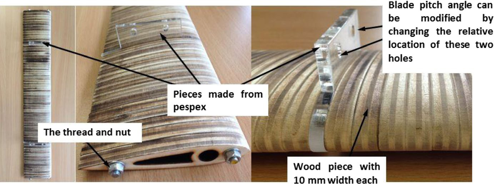

A typical blade showing
clamping bars, wood laminates, and perspex
mounting pieces

2424  |

on a PC via a National Instruments USB‐6218 ADC (details
can be found in reference38).
Although the 3‐bladed VAWT has the potential to start
from all possible starting positions, it is known that the time
to start can be affected by orientation6 so for this study the
same starting position was adopted for all tests for consis-
tency. Furthermore, the concave side of the cambered blade
was always set toward the central shaft.
In the present study, the turbine solidity was modified by
changing the turbine radius, R, while keeping the number of
blades, n, and blade chord length, c, the same. A schematic
drawing of turbine configurations showing different solidities
is presented in Figure 4.
### 2.3 Blade surface roughness measurement

A turbine's blade surface roughness will be expected to in-
crease during its lifetime through erosion or contamination,
potentially affecting the machine's performance. In order
to examine the effects of blade surface roughness on H‐
Darrieus wind turbine performance including its self‐starting
capability, blades with two different surface finishes were
tested and compared. The original turbine blade was laser
cut from high‐grade plywood resulting in a relatively rough
surface. To reduce the surface roughness, a new set of blades
was manufactured and then coated with thin aluminum tape.
The tape thickness was 0.03 mm which increased the blades
thickness by less than 0.5% so the effect was ignored.
To quantify the roughness value, a ZETA‐20 3‐D
profiler39 was employed with a maximum resolution of
0.01 μm. For each surface finish, measurements were re-
peated using three sample pieces (30 mm × 30 mm) in order
to calculate the averaged surface roughness value. The 3D
color imaging is shown in Figure 5, and the test results are
shown in Table 1. By examining the generally used param-
eters of arithmetic mean height, Sa, and root mean squared
height, Sq, that represent an overall measurement of 3‐D
surface roughness, it can be clearly seen that the surface
roughness of the wood sample was approximately 18 times
larger than the one covered with aluminum tape, which en-
sured that the roughness comparison tests were representa-
tive and meaningful.
### 2.4 Power and torque calculation

The method employed in this study to measure and calculate
the blade torque (and power) followed the technique proposed
by Edwards et al.3 The force balance equation of the turbine
system is determined by Equation (1). TB is the net torque gen-
erated by all of the blades, Tres is the resistance torque gener-
ated by the whole system (excluding the blades), IS is the whole
system moment of inertia including blades, and this value is
calculated from the mass and geometry of the rig, which is de-
tailed in reference.38 The angular acceleration, ξ, is calculated
from two readings of rotational speed (ω1 and ω2) measured
using the optical sensor. Knowing the time between the read-
ings taken at t1 and t2, the acceleration (or deceleration) can
be easily calculated by Equation (2) if the time interval is suf-
ficiently short for the acceleration to be taken as linear.
(1)
TB −Tres =Is휉
(2)
휉= 휔2 −휔1
t2 −t1
FIGURE 2 Definition of blade pitch angle, azimuth angle, upwind region, and downwind region
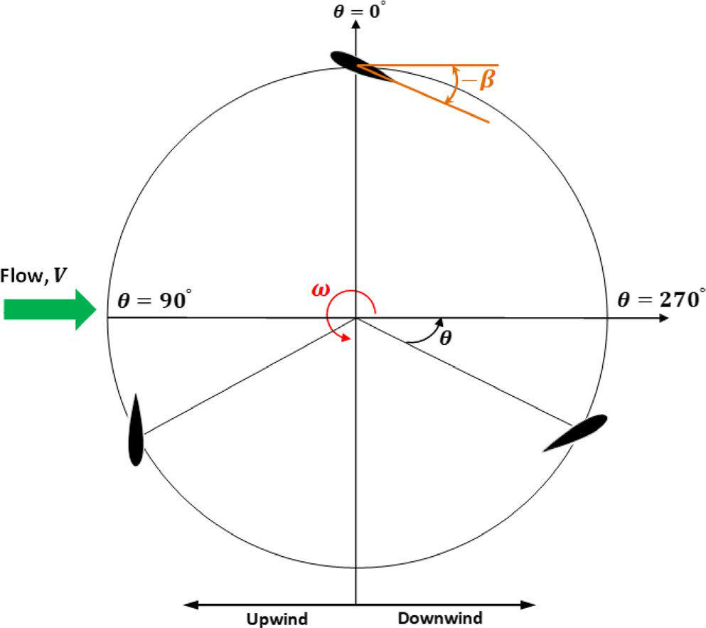

Definition of blade pitch angle, azimuth angle,
upwind region, and downwind region
FIGURE 3 The three-bladed H-Darrieus wind turbine in the Durham 2 m2, 3/4 open-jet, open-return wind tunnel
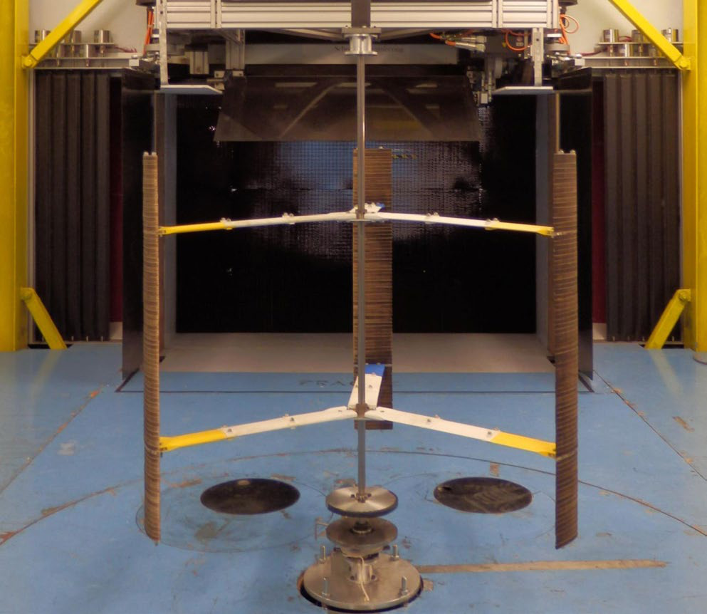

The three‐bladed H‐Darrieus wind turbine in the
Durham 2 m2, 3/4 open‐jet, open‐return wind tunnel

|
2425
Spin‐down tests were performed without the blades in
order to calculate the whole turbine system resistance, Tres.
The turbine was first driven by a motor up to a high rota-
tional speed which exceeded the maximum speed for other
tests. The motor was then disconnected from the turbine
using a clutch mechanism, and the turbine was free to spin
down. The turbine deceleration rate, ξ′, was measured
using the optical sensor, and Tres was then deduced from
Equation (3). It must be noted that the moment of iner-
tia of the rig without blades Irig was calculated from the
FIGURE 4 Schematic drawing of turbine configurations for different solidities
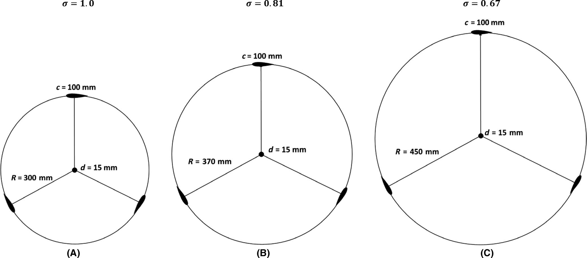

Schematic drawing of turbine configurations for different solidities
FIGURE 5 Local 3D color imaging from ZETA-20. A, Aluminum. B, Wood. Unit: μm
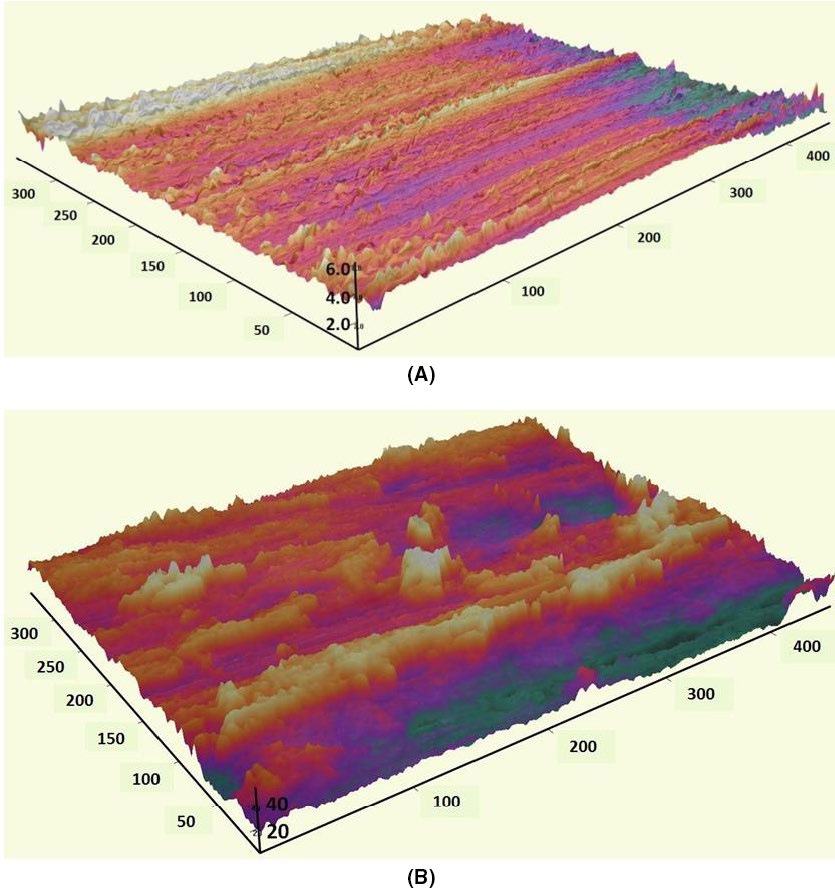

Local 3D color imaging
from ZETA‐20. A, Aluminum. B, Wood.
Unit: μm

2426  |

component masses and geometry of the rig, which is de-
tailed in reference.3,38
Although the system resistance Tres varies continuously
as the turbine spins down, a constant value was assumed
across the time interval of t2 − t1. This assumption was jus-
tified by adopting a sensor sampling frequency of 200Hz
which was much higher than the maximum frequency that
the turbine could reach (<10Hz). A series of readings could
therefore be taken from peak rotational speed to zero, map-
ping out the Tres −휔 curve. Moreover, the spin‐down tests
were repeated 6 times in order to calculate the averaged
Tres −휔 curve. Although the increased mass resulting from
the addition of the blades might alter the bearing friction,
the difference of Tres was negligible as also demonstrated
by Edwards et al.3
Knowing the system resistance Tres, TB can be calculated
from a second test on the complete turbine, which is driven
purely by the wind. The instantaneous turbine acceleration,
휉, is again recorded by the optical sensor.
Knowing the blade torque, TB, the torque coefficient and
power coefficient can then be determined from Equations (4)
and (5), respectively.
where 휌 is air density, A=2R∗S is the frontal area of the
turbine, and V is the wind speed.
2.5  |  Uncertainty
It should be noted that the calculation of moment of inertia
of each turbine component is not exact but the maximum un-
certainty of the calculated power coefficient, Cp, due to geo-
metrical approximation was estimated to be less than 5%.3,38
Since this geometrical approximation was used for all of the
tests in this study, it should not affect the comparison between
experimental results and the conclusions that may be drawn.
Despite the simple blade construction method, the deviation
of blade chord length and span of all the blades manufactured
and used in this study was less than ±1mm and ±5mm, re-
spectively, which resulted in less than ±1% uncertainty for
the calculated turbine solidity and aspect ratio.
It is noted that the central shaft of the turbine could affect
the turbine performance since the blade will interact with the
wake shed from the shaft. According to Rezaeiha et al40 the
power loss of the turbine (reduction in Cp) increases asymp-
totically from 0% to 5.5% for shaft‐to‐turbine diameter ratio
(훿) from 0% to 16%. The influence of shaft diameter becomes
significant when 𝛿>4%. The diameter of the shaft in present
study was 15 mm, which results in 훿=2.5% for turbine ra-
dius, R=300mm, 훿=2.0% for R=370mm, and 훿=1.7% for
R=450mm, respectively. Therefore, the impact of the central
shaft on the reduction of Cp in the present study is estimated
to be approximately ΔCp ≤1%.
3  |
## 3. Data Postprocessing

### 3.1 Turbine self-starting time-varying results

results
The turbine self‐starting behavior was examined by measur-
ing and recording the turbine's time‐varying rotational speed.
For each test configuration, the measurements were repeated
3 times to confirm good repeatability and low standard devia-
tion as demonstrated by the example shown in Figure 6A,B.
The beginning of each dataset was defined as when the tur-
bine rotational speed became greater than 0.5Hz. This format
(averaged value with standard deviation of the mean) will be
used throughout this paper to present the turbine time‐vary-
ing, self‐starting behavior.
### 3.2 System resistance torque calculation

The system resistance torque, Tres, was measured by
spin‐down tests without blades for different turbine radii
(R=300mm,R=370mm and R=450mm) at different free‐
stream wind speeds. For each configuration, 6 runs were per-
formed in order to calculate the averaged Tres −휔 curve based
on Equation (3). Since Irig is determined by the mass of the
system components which is a constant, the relationship be-
tween Tres and 휔 was simplified into 휉−휔. An example of the
raw data is illustrated in Figure 7A.
Since Tres and 휔 have a second‐order relationship, a qua-
dratic polynomial fitting curve was produced based on the
averaged value of the 6 runs as can be seen in Figure 7B.
Finally, by considering the turbine inertia Irig for each sce-
nario, the corresponding Tres −휔 curve can be produced as
can be seen in Figure 7C. This Tres −휔 fitted curve matches
well with the averaged data throughout the rotational speed
range, and therefore, it was used as a “look‐up” table for
(3)
Tres =Irig
(휔2 −휔1
t2 −t1
)
=Irig휉

(4)
CT =TB∕0.5휌ARV2
(5)
Cp =CT휆
TABLE 1 Measured surface roughness (mean value) of the wood sample and the sample covered with thin aluminum tape. Unit: μm

Measured surface roughness (mean value) of the wood
sample and the sample covered with thin aluminum tape. Unit: μm

Sa
Sq
Aluminum
0.22
0.28
Wood
4.02
5.02

|
2427
calculating blade torque (TB) which is detailed in the follow-
ing section.
### 3.3 Experimental measured torque and power coefficient

The instantaneous torque generated by the turbine blades
(TB) during self‐starting was calculated based on Equations
(1) and (2). The instantaneous turbine rotational speed was
measured by the optical sensor, and the mean value from 3
runs was then used to calculate the instantaneous accelera-
tion, 휉. Knowing the instantaneous system resistance, Tres, the
relationship between blade torque and tip speed ratio (TB ∼휆)
can be easily established where the tip speed ratio is defined
as 휆=휔R∕V =2휋fR∕V.
Examples are shown in Figure 8. The measured exper-
imental results are presented with the standard error (stan-
dard deviation of the mean) showing the confidence range of
the mean results from the 3 runs. Meanwhile, a fitted curve
(smoothing spline) is added in order to show the overall trend
of the experimental results against turbine tip speed ratio.
Since under this testing condition, the turbine was purely
driven by the wind, the self‐starting process was highly un-
steady, leading to the scatter in the TB ∼휆 data. The fitted
curve shows very good agreement with the experimental
measurements at low tip speed ratios although some discrep-
ancies exist between the fitted curve and the experimental re-
sults in the turbine's maximum torque region. However, even
here the fitted curve still falls within the standard error range
from the 3 runs for most of the measured points, providing
reasonably good guidance. It should be noted that due to the
limited number of runs, the calculated standard error might
not represent the true value especially in the turbine's least
stable operating region (high tip speed ratios). Therefore,
these discrepancies between the fitted curve and the experi-
mental data are simply due to the relatively small number of
data sets from which the results were averaged.
Once the torque has been determined, the power coef-
ficient can be calculated based on Equations (4) and (5).
Examples are illustrated in Figure 9. The smoothing param-
eter, p, which was used to produce the smoothing spline was
kept constant as p=0.995 in this study in order to keep all the
following results consistent (it should be noted that p=0 pro-
duces a least‐squares straight‐line fit to the data while p=1
produces a cubic spline interpolant).
It is noted that Rezaeiha et al18 recently proposed that Cp
was proportional to a new parameter “휎휆3,” which enables the
maximum Cp to be almost independent of turbine geometrical
and operational characteristics. However, their conclusions
were drawn from a CFD study of just a single blade profile at
one pitch angle so further analysis based on a much broader
range of test conditions needs to be performed before that
parameter can be used with confidence.
4  |
RESULTS
### 4.1 Turbine performance with different blade profiles

blade profiles and solidity
The three different blade profiles and other relevant param-
eters are summarized in Table 2. In this study, the turbine
solidity is modified by changing the turbine radius, R, while
keeping the blade chord length, c, and number of blades, n,
constant. It should be noted that for most of the results shown
in present study, the upstream wind speed is V =7m/s, result-
ing in a blade Reynolds number of Re≈47000 based on wind
speed and blade chord.
The results for solidity, 휎=1.0, are illustrated in Figure
10. Time‐varying data during the starting period is shown
along with the corresponding Cp ∼휆 curves. The experimen-
tal measurements indicate the turbine with NACA0021 or
DU06W200 blades can self‐start at typical built environment
wind speed of V =7m/s but the turbine with NACA4415
blades fails to self‐start. Compared with the NACA0021
blade, as shown in Figure 10A, the recently proposed
FIGURE 6 A, Example of three experimental measurements of turbine self-starting time-varying results. B, Averaged results with standard deviation of the mean (error bar)
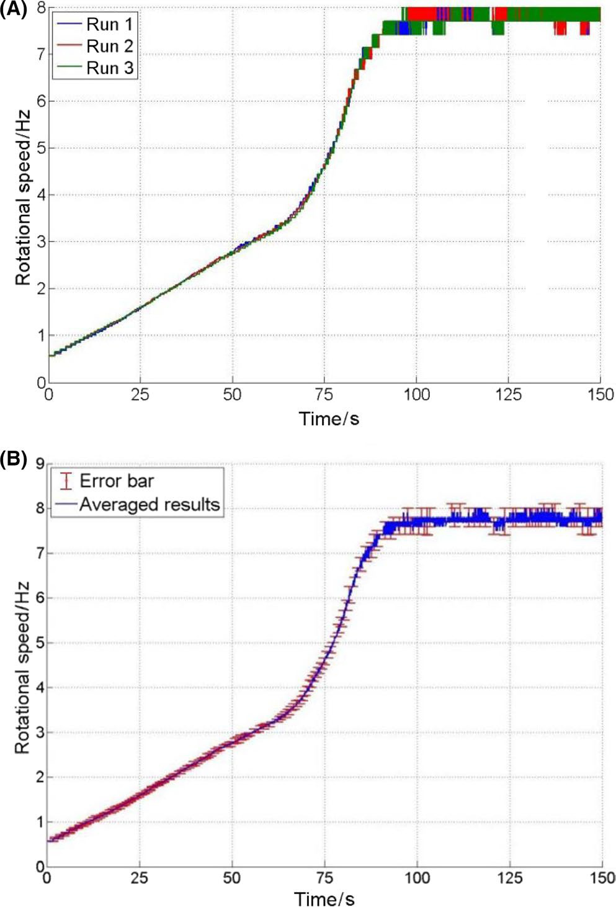

A, Example of three experimental measurements
of turbine self‐starting time‐varying results. B, Averaged results with
standard deviation of the mean (error bar)

2428  |

DU06W200 blade does not improve the turbine self‐starting
capability despite its lighter weight and lower inertia. Fitted
with DU06W200 blades the turbine finally reaches maxi-
mum 휆 after approximately 90  seconds, while the turbine
with NACA0021 profiles peaks 20 seconds earlier after about
70 seconds. The measured Cp from the DU06W200 is lower
than that measured from the NACA0021 at low tip speed ra-
tios, 𝜆<1.2, which is responsible for the longer self‐starting
time. With regard to the turbine's maximum power output,
the DU06W200 peaks at the same tip speed ratio of 휆=1.8 as
NACA0021 and it demonstrates a slightly higher power co-
efficient of approximately Cp =0.23 as shown in Figure 10B.
Although the cambered NACA4415 blade performs better
during the upwind sector as defined in Figure 2, the gain is
more than offset by the loss in the downstream sector be-
cause of its unfavorable incidence angle. As a consequence,
turbines with NACA4415 blades cannot pass the “dead band”
region or plateau stage, where no positive torque can be pro-
duced by the blades as detailed in reference32 and fail to
self‐start. The Cp ∼휆 curve for the NACA4415 blade is not
plotted in Figure 10B since it provides no useful information.
This is the opposite conclusion from that drawn by Kirke and
Lazauskas36 who claimed that a turbine with NACA4415
blades is able to self‐start easily according to their analytical
studies. It has been demonstrated38,41 that mathematical mod-
els are highly sensitive to the quality of the input aerodynamic
dataset which could have had an impact on their results.
Measurements were also performed at a turbine solidity
휎=0.81 and 휎=0.67. By decreasing turbine solidity, the tur-
bine self‐starting capability with any blade profile is reduced
due to the reduced blockage effect and consequently reduced
torque.38 The turbine with DU06W200 and NACA0021
blades self‐starts after about 150 seconds and 130 seconds
respectively at 휎=0.81 (see Figure 11A). However, compar-
ing with the situation at 휎=1.0 shown in Figure 10B, the tur-
bine's maximum power coefficient is increased at 휎=0.81 but
occurs at a higher tip speed ratio of 휆=2.0 (see Figure 11B).
At a turbine solidity 휎=0.67, all of the turbines with wooden
blades fail to self‐start but the NACA0021 still demonstrates
better performance than DU06W200 as shown in Figure 12
and it is possible that given long enough time the turbine
would eventually start. The experimental measurements
FIGURE 7 Example of measured turbine resistance. A, ξ-ω curve, raw data. B, ξ-ω curve, averaged data with quadratic polynomial fitted curve. C, Final Tres-ω curve, averaged data with quadratic polynomial fitted curve. V = 6 m/s, R = 300 mm
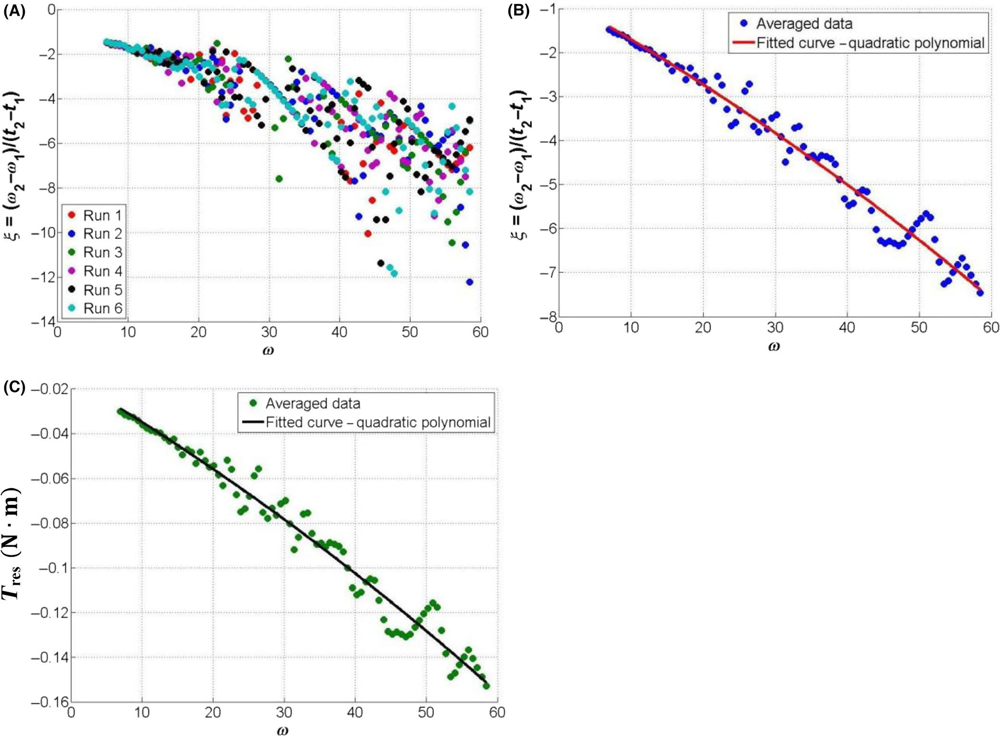

Example of measured turbine resistance. A, ξ‐ω curve, raw data. B, ξ‐ω curve, averaged data with quadratic polynomial fitted
curve. C, Final Tres‐ω curve, averaged data with quadratic polynomial fitted curve. V = 6 m/s, R = 300 mm

|
2429
clearly indicate that faster turbine self‐starting could be
achieved by increasing turbine solidity but at the expense of
lower peak power output.
### 4.2 Turbine performance with different blade pitch angles

blade pitch angles
Three pitch angles were chosen to be examined experimen-
tally: 훽=0◦, 훽=−2◦ and 훽=−4◦ for the NAC0021 profile.
The blade span and chord length were kept the same as those
shown in Table 2. Measurements were conducted at turbine
solidities of 휎=1.0; 휎=0.81; and 휎=0.67.
The results at 휎=1.0 are presented in Figure 13. The
time‐varying data illustrate that the negatively pitched blades
are able to improve turbine self‐starting capability at low
tip speed ratios as shown in Figure 13A. With its blades at
훽=−2◦, the turbine acceleration profile is almost indistin-
guishable from the blade without pitch leading to peak veloc-
ity at the same tip speed ratio. At 훽=−4◦, the acceleration is
reduced and peak turbine speed is achieved about 30 seconds
later. From the Cp ∼휆 curve shown in Figure 13B, it is ob-
served that negatively pitched blades increase the turbine Cp
at 𝜆<0.9. However, when 𝜆>0.9, both 훽=−2◦ and 훽=−4◦
blades produce less power than at 훽=0◦. Although 훽=−2◦
shows similar peak power output with 훽=0◦, 훽=−4◦ signifi-
cantly degrades the turbine maximum performance.
According to previous studies and measurements,42 it is
demonstrated that the majority of the turbine torque is gen-
erated in the upwind region. Especially for the turbine at low
휆 as can be seen in Figure 14A, the blade experiences ex-
tremely high incidence angles and stalls for the majority of
the revolution, producing limited positive torque and only in
the upwind region. Therefore, at low 휆, a negative pitched
blade is able to delay the blade stall and help the blade to
produce more power over a greater portion of the upwind
region thus increasing its overall performance. With an in-
crease of turbine rotational speed, the blade incidence range
is significantly reduced and above a critical 휆 at which the
blade will no longer experience stall at any point in its rev-
olution. At relatively high 휆, a negative pitch angle will de-
crease the blade incidence in the upwind region resulting in
less torque being generated.
Although it is argued that this negative pitch angle will
also increase the blade incidence in the downwind region,
the majority of the driving torque is generated at the up-
wind region and the blade produces lower torque in the
downwind region (see Figure 14B) leading to a decrease
of net torque (or power) when integrated over a whole rev-
olution. Therefore compared with 훽=0◦, the turbine with
훽=−4◦ produces significantly lower power at 1.3<𝜆<2 as
shown in Figure 13B resulting in a much slower turbine
acceleration at high 휆 and the turbine self‐starts much later
(see Figure 13A).
FIGURE 8 Examples of experimental measured torque (TB) with standard error and fitted curves
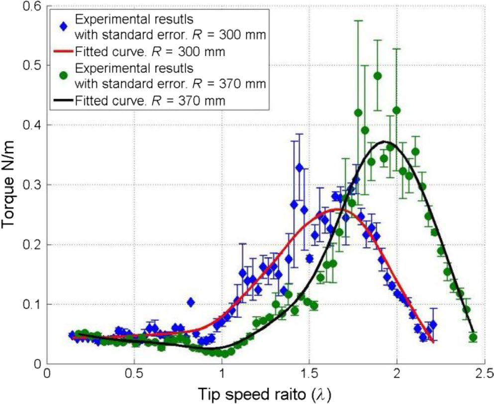

Examples of experimental measured torque (TB)
with standard error and fitted curves
TABLE 2 Testing parameters for studies of turbine performance with different blade profiles
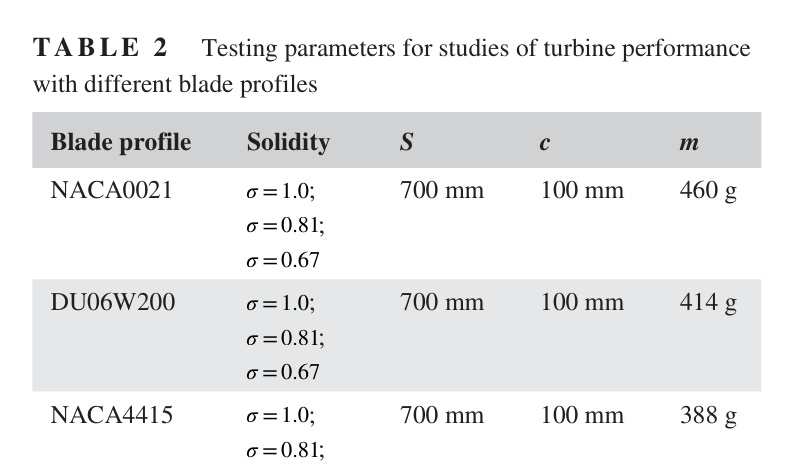

Testing parameters for studies of turbine performance
with different blade profiles
Blade profile
Solidity
S
c
m
NACA0021
휎=1.0;
휎=0.81;
휎=0.67
700 mm
100 mm
460 g
DU06W200
휎=1.0;
휎=0.81;
휎=0.67
700 mm
100 mm
414 g
NACA4415
휎=1.0;
휎=0.81;
휎=0.67
700 mm
100 mm
388 g
Note: m is the mass of the blade.
FIGURE 9 Examples of experimental measured power coefficient (Cp) with standard error and fitted curve
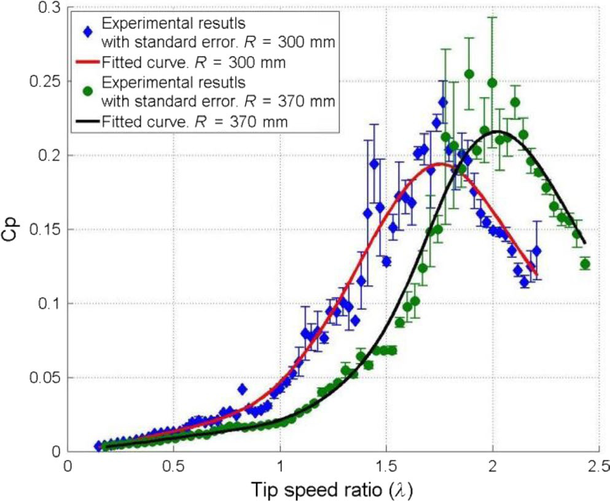

Examples of experimental measured power
coefficient (Cp) with standard error and fitted curve

2430  |

At solidity, 휎=0.81, the advantages and disadvantages of
negatively pitched blade become clearer. As can be seen in
Figure 15, blades of 훽=−2◦ and 훽=−4◦ improve turbine per-
formance only at low tip speed ratios (𝜆<1.3), which leads to
a faster initial acceleration. However a small, negative pitch
angle (훽=−2◦) reduces the turbine acceleration rate when
𝜆>1.3 and too much negative pitch, 훽=−4◦, completely pre-
vents the turbine from self‐starting.
At a solidity of 휎=0.67 (Figure 16), none of the turbines
are able to self‐start at this wind speed but the turbine with
negatively pitched blades still clearly demonstrates a bet-
ter initial turbine performance further supporting the above
results and conclusions that slightly negatively pitched blades
can improve the turbine performance during the first stage of
start‐up (low tip speed ratios).
### 4.3 Turbine performance with different blade surface roughness

blade surface roughness
Experimental tests were performed using NACA0021 blades
with two different surface finishes: wood and aluminum
(Table 1). The blade span and chord length were kept the
same as those shown in Table 2. Measurements were per-
formed at turbine solidities of 휎=1.0; 휎=0.81, and 휎=0.67,
FIGURE 1 A typical blade showing clamping bars, wood laminates, and perspex mounting pieces

Turbine performance with three different blade profiles at σ = 1.0 and V = 7 m/s. A, Self‐starting, time‐varying results. B,
Cp ~ λ curve
FIGURE 1 A typical blade showing clamping bars, wood laminates, and perspex mounting pieces

Turbine performance with three different blade profiles at σ = 0.81 and V = 7 m/s. A, Self‐starting, time‐varying results. B,
Cp ~ λ curve

|
2431
again with special attention paid to the turbine's critical self‐
starting behavior.
The results for a turbine at solidity, 휎=1.0, are illustrated
in Figure 17. Both the rough blade and the smooth blade
demonstrate almost identical starting behavior as shown in
Figure 17A. However, in terms of the Cp ∼휆 performance, as
shown in Figure 17B, the rough blade produces slightly more
power than the smooth blade at low tip speed ratios (approx-
imately 𝜆<1.6), but the smooth surface improves the turbine
performance at high 휆 (𝜆>1.6).
Similar results are observed for the turbine of 휎=0.81
as shown in Figure 18. Although the smooth surface shows
slightly lower turbine performance at low 휆, the turbine peak
Cp and turbine power output at high tip speed ratio 휆≥2.2
are both improved. These test results are consistent with pre-
vious experimental studies performed by Howell et al15 and
Ashwill.43
The improved performance from the rough blade at low
tip speed ratios is explained by an earlier laminar to turbu-
lent boundary layer transition. Therefore, a rough surface is
able to delay the aerofoil stall and reduce the associated large
drag force. However when the turbine rotational speed is in-
creased, the incidence range is significantly reduced and the
range of azimuth angles at which the aerofoil stalls are much
reduced or even eliminated. Here, the increased skin friction
drag resulting from the rough surface will outweigh the ben-
efit from delayed stall resulting in lower performance than a
smooth blade at high 휆.
It is interesting to note that for turbine solidity, 휎=0.67,
the experimental results shown in Figure 19 indicate the op-
posite conclusion from that drawn above. The smooth blade
successfully enables the turbine to self‐start while the rough
blade turbine fails to self‐start. It seems that at this low tur-
bine solidity, the smooth blade actually improves the turbine
performance at low 휆.
One possible explanation for this phenomenon is that by
further reducing the turbine solidity, the flow blockage is
then reduced resulting in blade stall over a larger portion of
azimuth angle in the upstream zone at low tip speed ratios.
The benefit from the delayed stall of a rough surface becomes
limited in this low solidity situation and cannot make up the
loss from the increased skin friction drag. Therefore for a
low solidity turbine blade experiencing stall over much of its
revolution at low 휆, a rough blade might not produce more
net torque compared with a smooth blade. Nevertheless, it
must be noted that the surface roughness effect on a blade's
boundary layer is dependent on the blade Reynolds number,
which varies with the rotational speed and azimuth angle.
FIGURE 1 A typical blade showing clamping bars, wood laminates, and perspex mounting pieces

Turbine self‐starting behavior with different blade
profiles. σ = 0.67 and V = 7 m/s
FIGURE 1 A typical blade showing clamping bars, wood laminates, and perspex mounting pieces

Blade pitch effects on turbine performance at σ = 1.0 and V = 7 m/s. A, Self‐starting, time‐varying results. B, Cp ~ λ curve

2432  |

This varying blade Reynolds number inevitably makes the
problem more complex, and more studies need be performed
to analyze the dynamic effect of blade surface roughness on
turbine performance.
### 4.4 Turbine performance with different blade spans

blade spans
The blade aspect ratio (AR=S∕c) plays a key role in deter-
mining the performance of a three‐dimensional blade. It is
generally acknowledged that the tip loss phenomenon will
degrade the blade performance and this is worsened if the
AR is low. The blade tested here was the NACA0021 and
previous analytical studies44 of turbines with NACA0018
blades at similar Reynolds range indicate an aspect ratio
AR>5.7 (keeping c the same) is a requisite for a turbine
achieving self‐starting at V =7m/s. Therefore, experimen-
tal measurements were performed in the present study to
test that conclusion with blade spans of S=600mm and
S=700mm (resulting in an aspect ratios of 6 and 7, respec-
tively), the latter already having been shown to self‐start. It
should be noted that the blade chord length was kept con-
stant at c=100mm.
It is surprising to find that by reducing the blade aspect
ratio by only 14% to AR=6, the turbine failed to self‐start
under any of the investigated solidities despite lying above
the AR>5.7 threshold. Examples at V =7m/s are illustrated
in Figure 20. As can be seen, the turbine with AR=6 accel-
erates much more slowly from the start even at the highest
solidity of 휎=1.0 and the turbine produces very limited net
positive torque thus achieving a maximum tip speed ratio of
only 휆=0.85. It seems that after removing 100mm (14%) of
FIGURE 1 A typical blade showing clamping bars, wood laminates, and perspex mounting pieces

Three‐bladed H‐Darrieus wind turbine. A, λ = 0.5, torque coefficient and theoretical incidence angle. B, λ = 1.5, torque
coefficient and theoretical incidence angle. R = 300 mm, c = 100 mm, n = 3, λ = 0.5, V = 7 m/s42
FIGURE 1 A typical blade showing clamping bars, wood laminates, and perspex mounting pieces

Blade pitch effects on turbine performance at σ = 0.81 and V = 7 m/s. A, Self‐starting, time‐varying results. B, Cp ~ λ curve

|
2433
blade span, the reduced aerodynamic torque was insufficient
to overcome system resistance thus preventing start‐up. For
the delicate process of H‐Darrieus self‐starting, any small
loss of useful torque might be fatal to the turbine.
The tests were repeated by using the DU06W200 blades
which yielded the same conclusion, that a turbine cannot
self‐start under any test condition with the blade aspect
ratio of AR=6. Therefore, from these results, it might
be expected that increasing the blade span of any VAWT
would lead to better starting performance as a consequence
of increasing the marginal difference between the aerody-
namic torque and the system resistance including blade tip
loss.
5  |
## 5. Conclusions

A three‐bladed H‐Darrieus wind turbine was experimen-
tally tested to investigate the effect of independent design
parameters including blade profile, surface roughness, pitch
angle, aspect ratio, and turbine solidity on turbine perfor-
mance. Three typical blades (NACA0021, DU06W200, and
NACA4415) were tested under three turbine solidities of
휎=0.67 (low) ,휎=0.81 (middle), and 휎=1.0 (high). Blade
pitch angles of 훽=0◦, 훽=−2◦and훽≥−4◦ were also inves-
tigated. Moreover, blades with wooden surface (rough) and
blades coated with thin aluminum tape (smooth) were tested
and compared. Finally, the blade aspect ratio was modified
by changing the blade span and two aspect ratios of AR=7
and AR=6 were examined.
Turbine time‐varying, self‐starting behavior has been pre-
sented together with overall Cp ∼휆 performance data. This
study provides comprehensive experimental data for study-
ing and designing a small‐scale (low Reynolds number)
H‐Darrieus wind turbine. Special attention was paid to the
turbine behavior and performance at low tip speed ratios in
order to gain greater understanding of the factors that influ-
ence the ability of a turbine to self‐start and consequently
to provide clear guidelines for the design of self‐starting H‐
Darrieus wind turbines. Based on the experimental results,
important conclusions can be drawn as follows:
•	 Of the three different blade profiles that were examined,
the DU06W200 profile demonstrates the highest peak Cp.
However, turbine self‐starting time is improved by using
the NACA0021 profile since it generates more power at
low 휆. The cambered NACA4415 profile which has been
recommended by previous researchers failed to self‐start
FIGURE 1 A typical blade showing clamping bars, wood laminates, and perspex mounting pieces

Blade pitch effects on turbine performance at
σ = 0.67 and V = 7 m/s. Self‐starting, time‐varying results
FIGURE 1 A typical blade showing clamping bars, wood laminates, and perspex mounting pieces

Blade surface roughness effect on turbine performance at σ = 1.0 and V = 7 m/s. A, Self‐starting, time‐varying results. B,
Cp ~ λ curve

2434  |

under any test conditions. Thus, the traditional symmet-
rical NACA series with large thickness still presents a
simple but effective choice of blade geometry achieving a
good compromise between good starting performance and
adequate peak power operation.
•	 Turbines with high solidity (휎≥0.81) are able to self‐start
faster than turbines with low solidity due to the increased
flow blockage. However, this is achieved at the expense
of lower peak power output. Therefore, a balance must be
struck between stronger self‐starting capability and larger
peak power output.
•	 Small, negative blade pitch (훽≥−2◦) can delay the
blade stall in the upwind region resulting in more torque
generated at low 휆. Although the blade performance at rel-
atively high 휆 is slightly degraded, it is thought blades with
a small negatively pitched angle can help the turbine pass
through the “dead band”/plateau stage more easily, which
occurs at low tip speed ratios.
•	 The blade surface roughness can affect the turbine perfor-
mance. Rough blades tend to increase the turbine perfor-
mance at low tip speed ratios due to an earlier laminar to
turbulent boundary layer transition, which delays the blade
stall. In contrast, smooth blades perform better at high tip
speed ratios resulting from lower skin friction. An excep-
tional case is observed for a turbine solidity of 휎=0.67,
where the turbine with smooth blades successfully enables
FIGURE 1 A typical blade showing clamping bars, wood laminates, and perspex mounting pieces

Blade surface roughness effect on turbine performance at σ = 0.81 and V = 7 m/s. A, Self‐starting, time‐varying results. B,
Cp ~ λ curve
FIGURE 1 A typical blade showing clamping bars, wood laminates, and perspex mounting pieces

Blade surface roughness effect on turbine
performance at σ = 0.67, V = 7 m/s
FIGURE 2 Definition of blade pitch angle, azimuth angle, upwind region, and downwind region

Self‐starting time‐varying results for turbine with
different blade aspect ratios at σ = 1.0

|
2435
the turbine to self‐start while the rough‐bladed turbine fails
to self‐start. One possible explanation is at this low solidity
(low blockage) the benefit from the delayed stall of a rough
surface becomes limited and cannot make up for the loss
from the increased skin friction drag.
•	 The present study demonstrates that by decreasing the blade
span from S=700mm to S=600mm (14% reduction), the
turbine self‐starting capability is considerably decreased.
Larger blade span resulting in larger blade aspect ratio is
helpful to reduce the blade's 3D effects, enabling faster
turbine self‐starting and increasing the marginal difference
between the aerodynamic torque and the system resistance
including blade tip loss.
## Acknowledgment

The authors would like to thank the technical staff in the
Department of Engineering of Durham University for their
help in setting up the wind turbine. This work was funded
by the Sichuan Science and Technology Program (No.
2018JY0595).
## Nomenclature

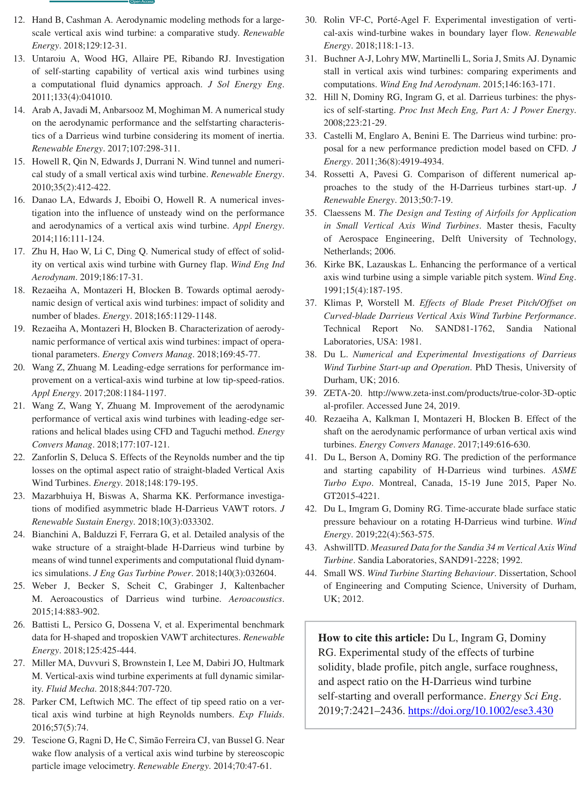
