# Wind power resource assessment in complex urban environments: MIT campus case-study using CFD Analysis

Alex Kalmikov, Guillaume Dupont, Katherine Dykes, Cy Chan

Massachusetts Institute of Technology; Meteodyn

AWEA 2010 WINDPOWER Conference

May 23-26, 2010

## Abstract

Progress in Computational Fluid Dynamics (CFD) methods holds potential for the advancement of wind energy resource assessment in complex urban terrain by modeling wind circulation around urban obstacles. The geometry in urban areas is significantly more complex than for open rural spaces and has a critical influence on wind flow at the micro-meteorological scale. The effects of the buildings on wind flow, such as vortices at the feet of the towers, Venturi effects or Wise effects, make the modeling of urban flows considerably more difficult. We simulate these effects with UrbaWind CFD model by solving the equations of Fluid Mechanics with a method which allows for representation of the turbulence and the wakes around buildings.

CFD simulations have been used to evaluate the wind energy potential on the campus of the Massachusetts Institute of Technology in Cambridge, MA. The assessment has been enhanced by integration of local wind measurements and observations from several nearby reference sites into the CFD model in order to estimate the local long-term climatology. Data from two site specific met masts have been used in direct wind power analysis. Comparisons between the measurements and the simulated results allowed validation of the modeling for mean wind speed, wind power density and wind variability parameterized by Weibull distribution. This analysis provides an improved understanding of the micro-climate of wind resource on the MIT campus and will facilitate the optimal siting of a small turbine on campus.

## 1 Introduction

The recent developments in availability of small-scale wind turbines for dense urban environments highlight the need for detailed wind resource assessment in complex terrain in order to appropriately estimate the expected production for a project. This in turn is necessary in order to assess the commercial viability of a project as well as to appropriately site the turbines within a specific location. Due to the small-scale of the projects, conventional site assessment approaches are not always viable. Firstly, compared to utility-scale or even community-scale wind projects, small-scale urban projects can not typically count on a large amount of fiscal resources for the resource assessment phase of a project. Investment in measurement equipment may be limited.

Compounding this, the traditional methods for wind energy site assessment are technically limited for urban environments. A met tower installed at single location may not be a sufficiently good predictor of the overall resource within a complex environment since the complex geometry can create situations where the resource varies substantially within a small area. In addition, the alternative - the remote sensing technologies such as LiDAR are typically designed to work at 40 m or above and many small-scale urban projects are designed for deployment at lower heights above ground or roof-tops.

Computational Fluid Dynamics (CFD) techniques can be a viable alternative for faster, less expensive resource assessment and in addition provide physical insight on the governing flow mechanisms. Modern CFD tools have already proved essential for modeling wind flows over complex rural terrains. This paper demonstrates a further development of the CFD wind resource assessment approach to complex urban environments for small-scale wind power integration.

## 2 Objectives

The aim of this study is to assess wind energy resource on the MIT campus for potential installation of a small wind turbine. The procedure of resource assessment includes estimation of the average wind power available for energy production on campus and identification of optimal location for turbine installation. We study the local micro-meteorological features of wind flow and the effects of the complex urban topography.

In particular, we identify zones of wind acceleration, channeling, blocking, recirculation and increased turbulence. Localization of zones of wind recirculation and turbulent wakes is important for both high energy production and protection of the turbines from excessive loading from gusts by avoiding installation in a high turbulent area.

Moreover, this study aims to evaluate the methodology for site calibration in urban environment using CFD numerical methods for transfer of long-term climatology from a remote station rather than installing a met tower on-site. This CFD aided climatology transformation technique is compared to climatology measured directly near the site and to the standard MCP normalization technique.

Figure 1. Domain of analysis - West Campus of the Massachusetts Institute of Technology, 3D perspective. Buildings are shown in grey, and idealized smoothed topography is shown in brown. Met tower sites are indicated with arrows.
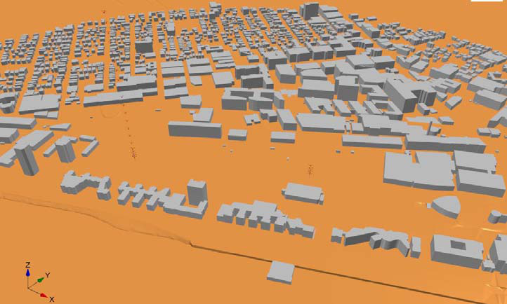

## 3 Methodology

### 3.1 Meteorological data collection and analysis

The CFD study for complex urban environments is part of a larger effort to site a small wind turbine on the Massachusetts Institute of Technology campus. As part of this effort, two meteorological towers were installed at proposed turbine locations on campus (see Figure 1). The equipment for the two towers was donated to MIT by NRG Systems, Inc.

The first set of measurement equipment was installed on a pre-existing light pole near several structures including an indoor tennis facility and courts, various fences and trees as well as the MIT indoor athletics complex. The use of the light pole was necessary to avoid the tower footprint in the highly utilized athletic field environment. The equipment will remain in place post turbine installation for continued monitoring of the resource and analysis of turbine performance. The second location is on the west end of the MIT Brigg's athletic field. During the winter months, in order to again avoid conflict with use of the field for athletic activities, a 34-m free-standing NRG meteorological tower was installed to collect data in order to evaluate the resource at the second location. The site is farther from low-level obstacles and buildings but is closer to the large residential high-rises on the west end of campus. The site was picked such that it would have a somewhat clear path from the Charles River for the South-West wind, which based on the previous studies [7] was believed to be the prevailing direction in the MIT campus area.

In terms of measurement technologies, the first tower was equipped with 3 cup anemometers at 15, 20 and 26 meters and with weather vane sensors at 15 and 20 m. The second tower included four cup anemometers, two at 20 m and two at 34 m with a single vane sensor at each height. Both towers were equipped with ground-level temperature sensors. Data was recorded using standard NRG Systems, Inc. loggers that averaged the data over 10 minutes and stored the maximum, minimum, average and standard deviation for each period.

To date, over five months of data have been collected from the first tower. Three months of data were collected from the second tower before it had to be relocated at the start of the spring sport's season. Three methods were used for data analysis including direct statistical analysis, long-term normalization using advanced measure-correlate-predict methods, and computational fluid dynamics. Each of the three methods will be described in this section. Firstly, direct analysis of the data included processing and filtering as well as statistical analysis of various dimensions of the data. In general, the NREL site assessment handbook was used as a guide for the analysis [2].

Data were filtered for typical measurement error sources such as icing, tower-shadow, and sensor malfunction. Icing events included those where the sensors were locked up due to freezing temperatures. These were identified by using the site temperature and the standard deviation of the wind speed. Tower shadow was determined by plotting the difference in wind speeds between two anemometers as a function of direction. Certain directions were identified to filter the tower effects which were validated using knowledge of the physical direction of the tower with respect to each sensor. Finally, specific malfunction of sensors was filtered through periodic visual inspection of the data in order to monitor for rare events such as lightning hitting the tower or extreme wind speeds. Each month, statistics for the sites were produced that included average wind speeds, average wind power density, Weibull distribution parameters, wind shear coefficients, turbulence intensity, wind direction frequencies, and average temperatures.

### 3.2 Climatological data sources and normalization

The available onsite measurements are limited to the specific period of our experiment. Since we collected data mainly in the winter, our estimates are expected to have a positive seasonal bias and report higher wind resource than available on average. For a proper assessment of the long-term wind resource we extended the time coverage of our analysis using several sources of climatological data. We assimilate this extended climatology in our analysis and normalize our estimates by the multi-annual climatological averages.

#### 3.2.1 Observations

A direct source of background climatology was a long-term wind data record from the automated weather station on the roof of MIT's Green Building. This building is the tallest on the campus, with all the surrounding buildings significantly lower. The automated weather station is located over 90m above the ground and appears to be sufficiently elevated above the surrounding ground and building roughness. Thus, we assume that it represents the local background wind flow and can be used as a climatological reference point for wind analysis on the campus.

#### 3.2.2 MCP normalization

A standard Measure-Correlate-Predict approach was applied to normalize the locally measured wind data by the long-term climatology from a nearby airport. We applied the binned linear regression technique to generate estimates for the long-term seasonal behavior of the potential turbine installation sites. We used data provided by NCDC QCLCD data set for Logan airport from 1997 to 2009 as a long-term reference for making our estimates. Details on the normalization will be made available in a separate publication, here we provide a limited discussion of the MCP results in the Resource Assessment section.

#### 3.2.3 CFD transformation of climatology

Alternative approach for climatological normalization is to transfer the available climatology from a nearby location with a CFD model. We utilize the TopoWind CFD model [1] to make this transformation physically consistent with the equations of fluid mechanics.

### 3.3 CFD Method

UrbaWind solves Reynolds Averaged Navier-Stokes equations (RANS), i.e. the averaged equations of fluid mass and momentum conservation, for steady incompressible flow:

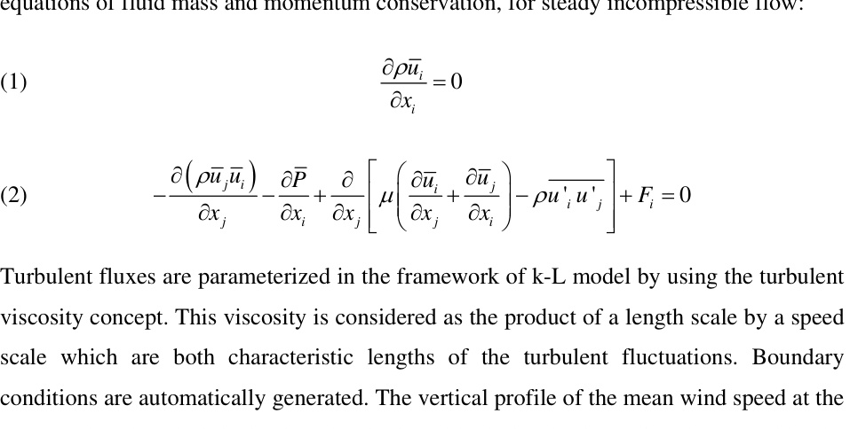

Turbulent fluxes are parameterized in the framework of k-L model by using the turbulent viscosity concept. This viscosity is considered as the product of a length scale by a speed scale which are both characteristic lengths of the turbulent fluctuations. Boundary conditions are automatically generated. The vertical profile of the mean wind speed at the computation domain inlet is given by the logarithmic law in the surface layer, and by the Ekman function [3]. A 'Blasius'-type ground law is implemented to model friction (velocity components and turbulent kinetic energy) at the surfaces (ground and buildings). The effect of porous obstacles is modeled by introducing a sink term in the cells lying inside the obstacle [4].

Where CD is a volumetric drag coefficient, which is proportional to the density of the porous obstacle, and V is the volume of the considered cell.

The turbulence characteristics are given by the standard deviation of the velocity fluctuations, which is globally estimated by the ratio between the square root of the turbulent kinetic energy and the local speed of the flow.

The mesher, integrated in the software, builds for each computed direction a mesh aligned with the wind flow, Cartesian and unstructured (using overlapped meshing), with automatic refinement near the ground, obstacles and the wind turbines.

Figure 2: Unstructured Cartesian meshing grid.
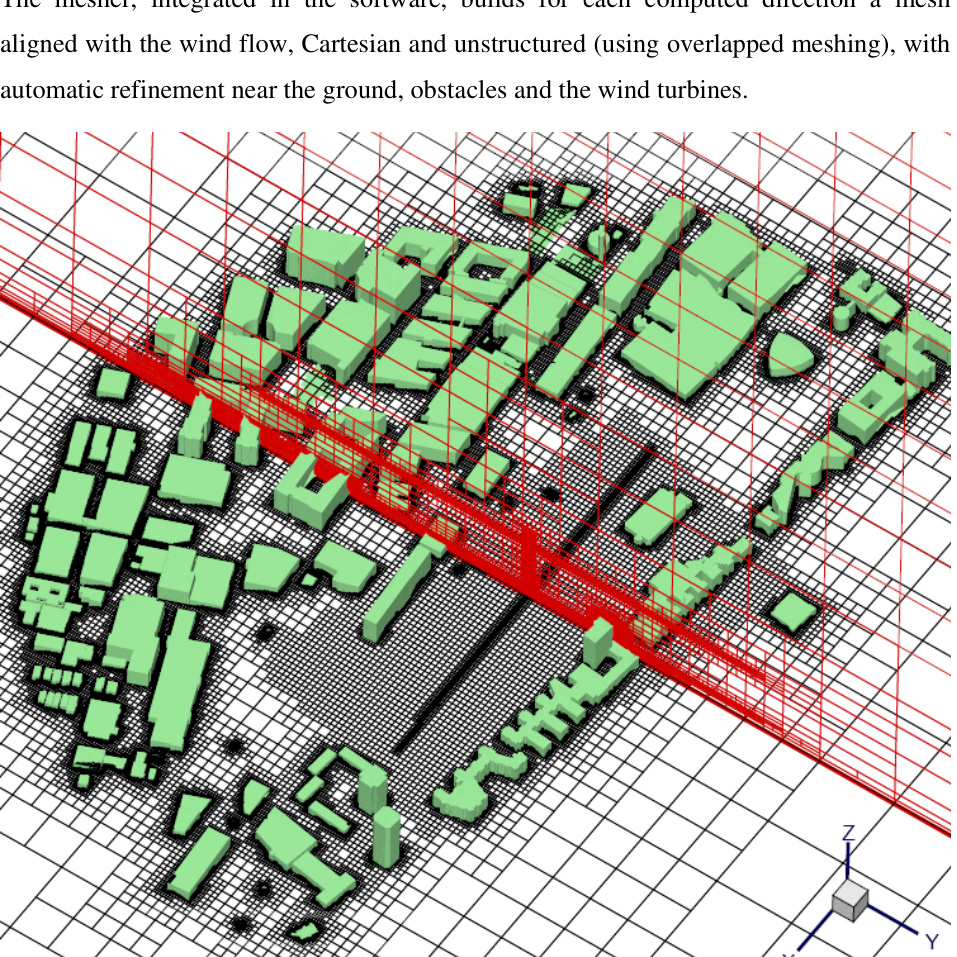

A resolution of 1m x 1m has been applied near the areas of interest resulting in a total of 4 to 5 million cells. 12 directional computations are performed with additional refinement around the prevailing wind direction 280°.

UrbaWind uses the Migal-UNS solver [5] with a GMRES-type preconditioner to improve the robustness and a multi-grid procedure to accelerate the convergence. It completely solves three dimensional equations for fluid mechanics with RANS method. MIGAL employs a Galerkin's projection method for generating the equations on the coarse grid. This technique, known as "Additive Correction Multi-grid", consists of generating the equation on the coarse mesh as the sum of the equations of each corresponding fine cell. Once the solution is obtained on the coarse grid, it is introduced by correcting the values calculated previously on the fine grid with the calculated error.

Figure 3: Scheme of the agglomeration method used by MIGAL-UNS in UrbaWind.
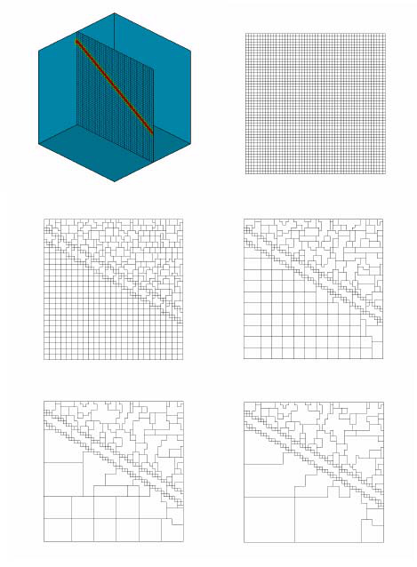

### 3.4 CFD climatological transformation model

The principle of the TopoWind approach is to solve the full Reynolds-Averaged Navier-Stokes equations, which allows to compute detached and recirculating flows that occur over complex terrains. The meshing is mono-block structured boundary fitted which allows modelling large terrains without inherent problems of nesting techniques. But contrary to UrbaWind, TopoWind cannot catch accurately the effects of buildings. The drag effect of forests on the flow is directly computed trough an additional drag term inside the equation of motion. The turbulence closure scheme, based on Yamada and Aritt works [6], is realized by the prognostic equation on the turbulent kinetic energy, k, and a mixing length approach for the diffusivity calculated from atmospheric conditions.

## 4 Physical Site Analysis

### 4.1 Spatial Analysis

Physical site analysis begins with integration of directional wind statistics with urban GIS data. The directional statistics of the wind are presented as wind roses: the radial dimension represents the frequency of wind occurrence in each of the directional sectors. Each sector is divided to represent absolute frequency of observed wind speeds in this direction with speed intervals being represented by a color map consistent between all the figures in this paper. We note that this statistical analysis is based on higher angular resolution (10o), than what is used for directional CFD calculations in this paper (30o). Higher angular resolution analysis, therefore, would be expected to provide better match to the measured data by resolving the fine directional structure of wind flow.

It is seen that the prevailing wind direction at both sites during the 3 months measurement period is West-North-West. This prevailing direction is consistent with Green Building measured statistics for this period but is different from what was found in a previous study [7]. Examination of multi-annual climatology at the Green Building (Figure 15) and at Logan Airport (not shown) confirms the prevalence of Western and North-Western winds but allows an explanation for the earlier observation of South-Western winds if the earlier study considered only limited measurement period during late spring.

Detailed qualitative analysis of the integrated GIS map reveals micro-meteorological differences between the two sites. The western site (MT2) exhibits jet and wind tunneling effects, presumably due to acceleration over the open space upwind and channeling by the surrounding buildings through the narrowing entry to the large open area (MIT Brigg's field). High winds of over 8 m/s are observed for 4.4% of the time with a maximum measured wind speed of 13.5 m/s. At the eastern site (MT1), opposite wind characteristics can be observed. Although the average direction of the wind is the same, the angular spread is higher with sensible reduction of occurrence in the central sector. The speeds are lower, rarely reaching 8 m/s (1.1% of the time), with maximum measured wind speed of 12.6 m/s. These observations suggest that the eastern site is subject to turbulence and wind blocking conditions by the upwind buildings and to stagnation pressure at the upwind side of the leeside building - the MIT Tennis Facility.

Figure 4: Spatial analysis of wind resource - GIS site map with directional wind statistics at met towers locations
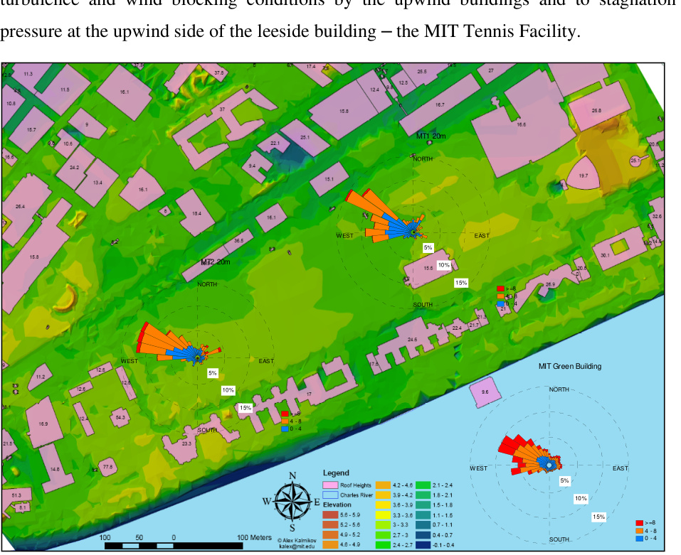

### 4.2 CFD Analysis

CFD simulations confirm these assessments quantitatively for the prevailing synoptic wind direction of 280°. It can be seen that a high winds channel is formed through the sports field. This area is characterized by lower turbulence (Figure 5 (c), green) and higher mean speeds (Figure 5 (a), red). The CFD simulations reveal the 3 dimensional structure of this flow feature. The high wind channel modifies the vertical shear and brings higher winds closer to the ground, Figure 5 (b). The turbulent area is elevated and localized behind tall buildings' roofs, Figure 5 (d). The western site (MT2) is confirmed to be centered in the high winds channel, the eastern site (MT1) is in the turbulent building wake.

Figure 5: Directional calculation of urban wind induction factors, shown for the prevailing wind direction - 280°
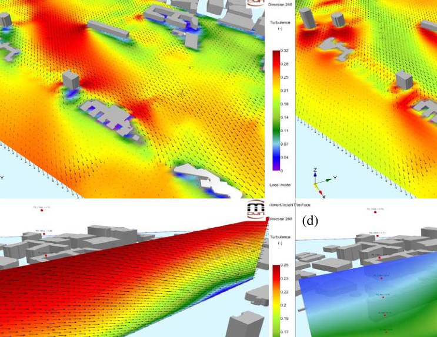
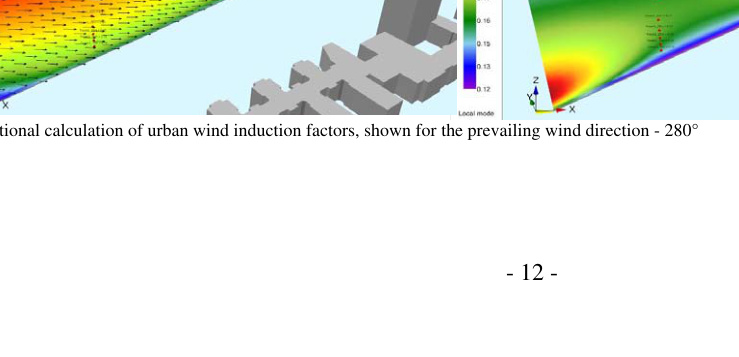

## 5 Resource Assessment

### 5.1 Observations

As a first approach, the met tower data for the two sites on campus were processed according to traditional wind resource analysis techniques [2] and normalized using a set of techniques within the measure-correlate-predict framework. The statistics for the raw filtered data indicated significantly stronger performance of the second test site over the first during the three winter months of data collection. The following plot gives the site measured monthly average wind speeds and diurnal average wind speeds. Only a half month of data is available for October 2009 and March 2010 for met tower 1 as well as for December 2009 and March 2010 for met tower 2. The difference in average wind speeds between subsequent levels is about 0.1 to 0.5 m/s for each month indicating a substantial amount of wind shear (or vertical difference in wind speed) at the sites up to and extrapolated beyond 26 and 34 m respectively for test towers 1 and 2.

Thus, from the limited set of non-normalized data, it would appear that test site 2 has stronger wind speeds than site 1. The 20 m averages for site 2 are similar to the 26 m averages at site 1 which are both substantially lower than the 34 m averages at site 2. This is despite the fact that the towers are near to each other (364 m apart) in relatively open unobstructed area and demonstrates how important such a study as this can be in terms of siting wind turbines in urban and complex terrain environments.

Looking at power density, the difference in site performance becomes even more pronounced. Site 2 power density at 20 m unequivocally outperforms site 1 power density at 20 m. Thus, the raw analysis over the three months data indicates site 2 to be a stronger candidate for turbine installation. However, post normalization, the performance statistics of the two sites for wind speed and power density tended to converge, which triggered the more detailed CFD analysis study in order to explain better this discrepancy.

Figure 6: Measured monthly average wind speeds based on the filtered meteorological tower anemometer data.
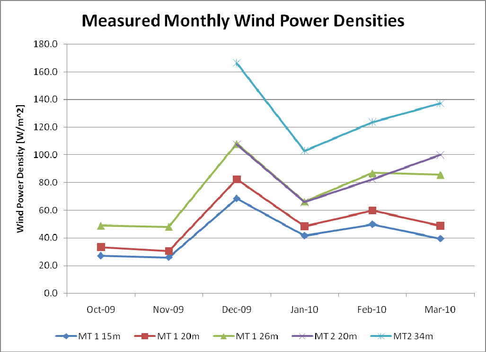

Figure 7: Measured and Calculated Monthly Average Wind Power Density based on filtered meteorological tower data.
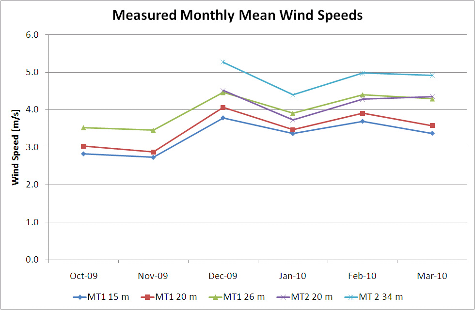

### 5.2 MCP normalized estimates

The binned linear regression technique was applied to generate estimates for the long-term seasonal behavior at MT1 and MT2 sites. We used data provided by NCDC QCLCD data set for Logan airport from 1997 to 2009 as a long-term reference for making our estimates. Separate regression coefficients for each 30 degree direction bin were solved for using data from December 2009 to March 2010 from the two installed met towers. Even though more data was available at site MT1, we wanted to use the exact same date range to ensure a fair comparison between sites. Long-term wind speed profiles at the two potential turbine installation sites were then generated using the regression coefficients and long-term Logan data set.

Figures 8 and 9 show the mean wind speeds and power densities at each site during the period used for training the MCP normalization model. Note that since we only considered data during the time period where both towers were online, only part of the month of December is considered. Thus, the results here differ somewhat from the analysis in the previous section, which presented all available data for each site. Since a whole month of data was available for MT1, while only part of the month was for MT2, comparisons between the two sites during December in the previous graphs can be misleading.

Figures 10 and 11 show the resulting normalized seasonal mean wind speeds and power densities when the model is applied to the long-term Logan airport data set covering 13 years. Note the relative magnitudes of the mean wind speeds and power densities for MT1 20m and MT2 20m in each figure. While the normalized data shows that MT2 20m outperforms MT1 20m by a modest margin (an average of 0.11 m/s over the entire year), during the training period the difference is more significant (an average of 0.32 m/s). The full reasons for this discrepancy is beyond the scope of this paper; however, suffice it to say that the topography of the region yields complex relationships between wind directions and speeds. Since the observed wind direction profile during the training period differed significantly from the long-term climatological averages, this caused the normalized data, which tries to correct for such anomalies, to differ from the measured data. A full analysis of this effect will be presented in a future publication.

Figure 8: Measured mean wind speeds during the overlapping data range used for training the MCP normalization model
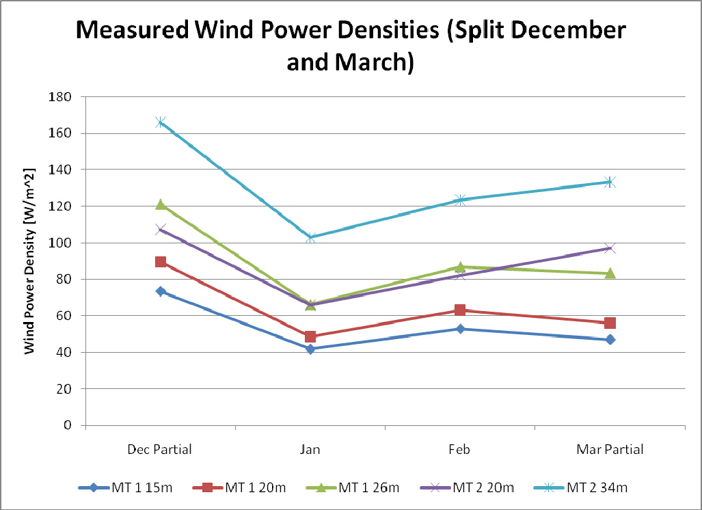

Figure 9: Measured wind power densities during the overlapping data range used for training the MCP normalization model
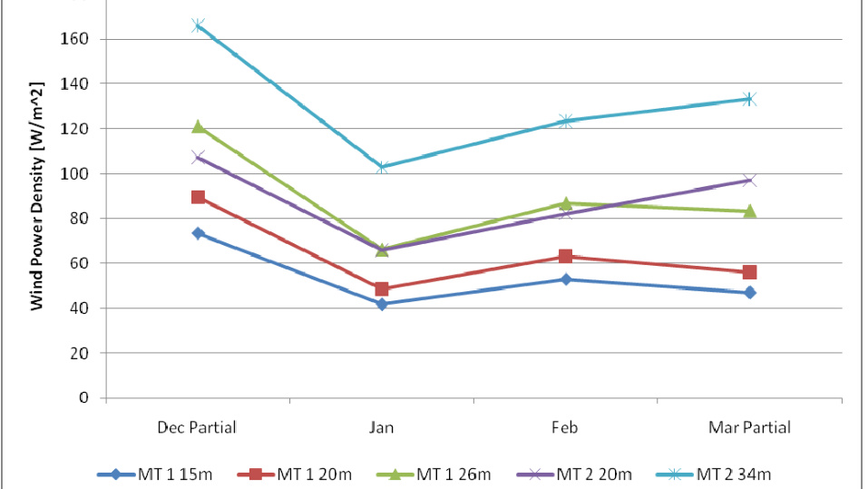

Figure 10: Estimated seasonal mean wind speeds based on MCP normalization. Even after normalization, MT2 appears to be the better candidate.
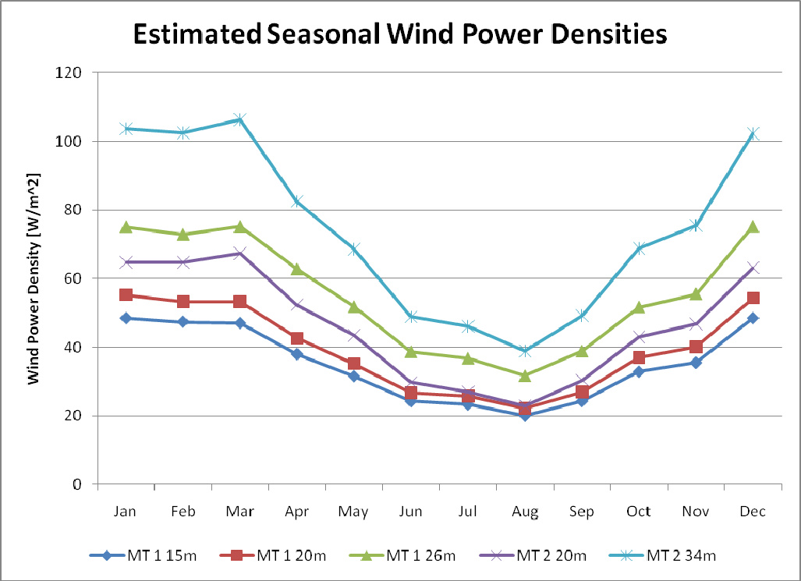

Figure 11: Estimated seasonal wind power densities based on MCP normalization. Even after normalization, MT2 appears to be the better candidate.
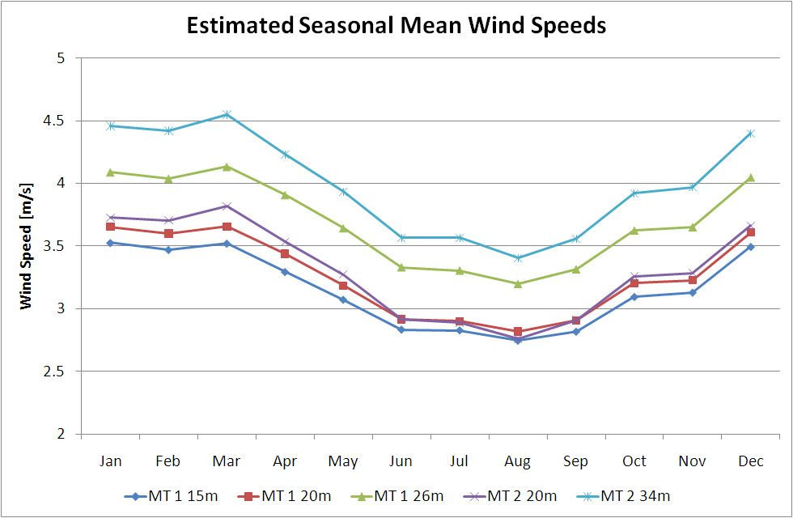

### 5.3 CFD - Local climatology assimilation

We reconstruct the three dimensional structure of wind resource by combining the deterministic CFD calculations with assimilation of real measured wind data statistics. The reconstructed three dimensional wind fields assimilate long term climatology measured at a single location inside the computational domain and extrapolate the statistics of wind resource from this single point to the full extent of the domain. Thus, we obtain the full spatial structure of wind climatology, a four dimensional spatial-stochastic field parameterized in the stochastic dimension by Weibull distribution. The analysis provides three dimensional fields of mean wind speed, Weibull shape (k) and scale (A) parameters, wind power density and turbulence intensity.

To validate this approach we first assimilate climatological data in one of the local measurement points - MT2 20m, and compare the extrapolated estimates for point MT1 20m (located 364m away) with data measured directly at that point. We show the results of assimilation of 3 months of winter measurements data. The input data is shown in Figure 12 (a). On the left side we see a histogram distribution of the measured wind speeds. The mean speed is 4.15 m/s and the corresponding Weibull shape parameter k is 1.963, corresponding to nearly Rayleigh distribution. On the right we see the directional histogram, also known as the wind rose, which shows a clear prevalence of West-North-Westerly winds. Frequency of occurrence of strong winds over 8 m/s is 4.4%. Figure 12 (b) shows the measured statistics at the control point MT1 20m. The directional distribution appears very similar, but the frequency of high winds is reduced from 4.4% to 1.1%. The mean wind speed is reduced to 3.77 m/s and the Weibull shape parameter k is increased to 2.049. The resulting wind power densities are 82.80 and 58.37 W/m2 in the assimilation and the control point, respectively. Next, we compare the measured statistics at the control point to the extrapolated estimate, shown in Figure 12 (c). We see that the directional spread is mainly preserved, the extrapolation captures the reduction in occurrence of high winds to 2.6%, the mean speed decrease to 3.74 m/s and wind power density to 61.45 W/m2.

Since the goal of this study is comparison of the wind resource between the two sites, it is convenient to express their difference as the ratios of mean speeds and power densities. The measured ratios are 1.10 and 1.42, respectively. The simulated ratios between the assimilation point and the control point are 1.11 and 1.35. For convenience, these numbers are summarized in Table 2. We conclude that the result of the assimilation procedure is consistent with the measured trends, which provides a preliminary validation of our approach. We note, however, that the results are not perfect and further work is required to estimate the accuracy of the method and validate the approach against the expected precision.

The method of local Climatology Assimilation (CA) allows extension of the resource assessment procedure from single measurement points to the three dimensional space. Figure 13 (a) shows the horizontal map of wind power density at 20 m above ground, the corresponding vertical cross section of power density is shown in Figure 13 (b). It is seen that site MT2 is located in the region of higher power density. The cross section shows the vertical stratification of the power density and reveals that at the Western site (MT2) the high wind resource is closer to the ground. The mean directionally averaged turbulence intensity is shown in Figure 13 (c). It is seen that the Eastern site (MT1) is located in region that is more turbulent on average. The key characteristic of wind resource is the skewness of its probability distribution. We display it by the corresponding Weibull shape parameter k in the horizontal map and vertical cross section in Figure 14. It is seen that the spatial distribution of this parameter has a complex structure, but at the Western site (MT2) it has clearly lower values, which also explains the higher wind power density at this site.

Figure 12.
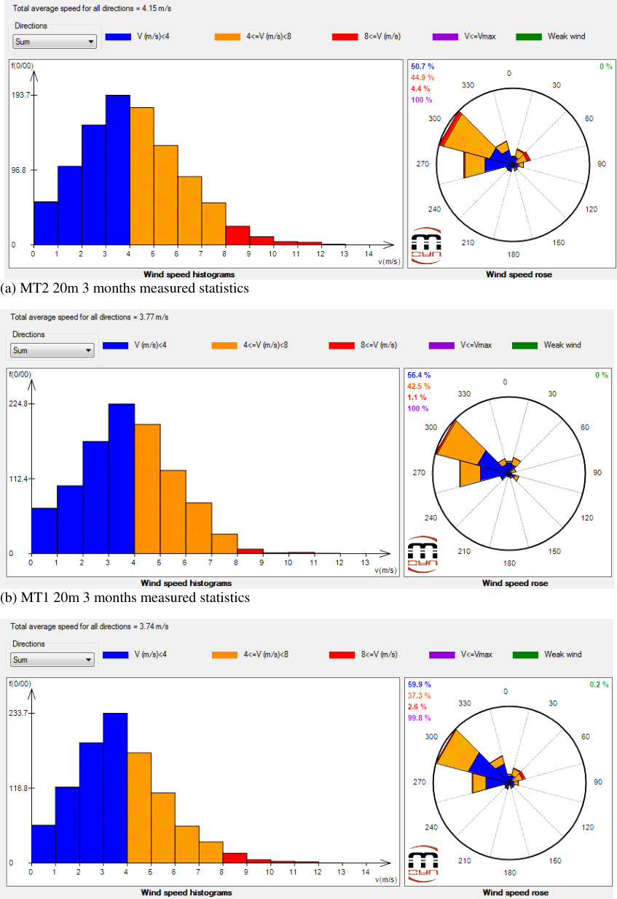

Figure 13: Mean Wind Power Density (W/m2), Horizontal section 20m above the ground; Mean Wind Power Density (W/m2), Vertical cross-section through MT1 and MT2; Mean Turbulence Intensity, Vertical cross-section through MT1 and MT2.
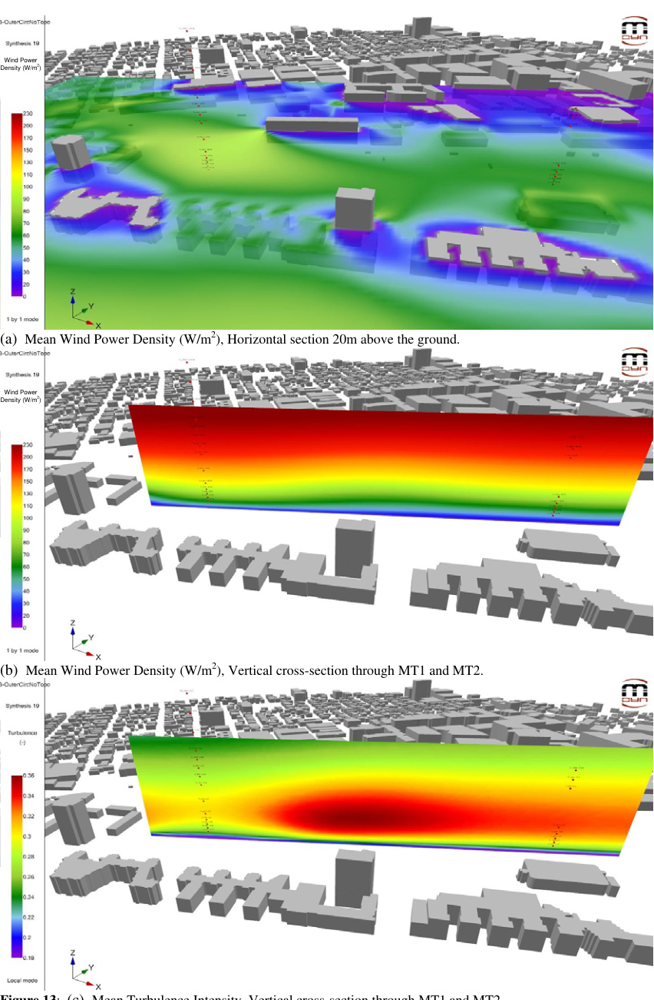

Figure 14: Expected Weibull Shape Parameter k, Horizontal section 20m above the ground; Expected Weibull Shape Parameter k, Vertical cross-section through MT1 and MT2.
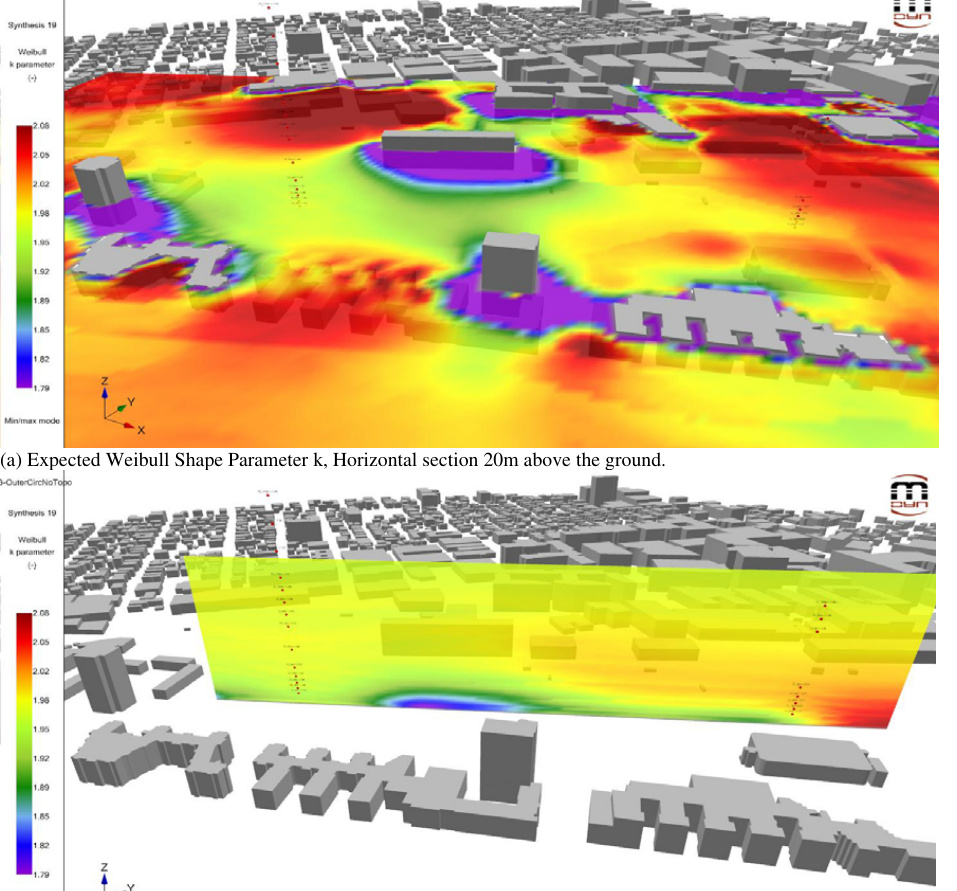

### 5.4 CFD - Background climatology assimilation

The local Climatology Assimilation was performed to reconstruct the best estimate of spatial wind resource statistics and was possible due to existence of locally measured wind climatology. In practical applications, when locally measured wind climatology is not available, the Climatology Assimilation procedure allows reconstruction of spatial wind resource statistics by assimilation of background climatology. We assume that the measurements at the roof MIT's Green Building represent the background climatology for MIT campus area and assimilate it 90 m above the Eastern site MT1. The assimilation was performed for 3 months of local measurement period and for 2 years of data starting from April 2008. The climatological parameters are shown in Table 1. The histogram and the angular distribution of wind speeds for these two periods are shown in Figure 15.

Table 1: Assimilated wind power parameters.

| Period | Power Density (W/m2) | Mean Speed (m/s) | Weibull Shape k |
| --- | ---: | ---: | ---: |
| 3 months | 221.78 | 5.16 | 1.409 |
| 2 years | 126.54 | 3.96 | 1.284 |

Figure 15: Input climatology for background Climatology Assimilation at MT1 90m
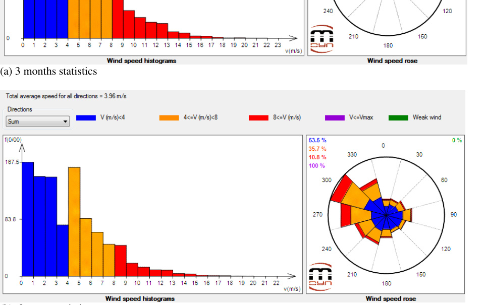

### 5.5 CFD - TopoWind model climatology assimilation

Two years of measurements from April 2008 to March 2010 are available at the Logan airport. The hourly data (wind speed and direction) are checked and quality controlled. The mast is 5.8 m above the ground. The rose is transferred to a point 100m above the site with the CFD code TopoWind [1] by taking into account the local roughness and topography between the airport and the campus. A resolution grid of 4 meters in the vertical direction and 20 meters in the horizontal direction (resulting in approx. 500,000 cells depending on wind direction) was used to model wind flow over the site in 18 sectors every 20 synoptic degrees. The results points are the anemometer at the airport (at 10m height) and a point at 100m upon the MIT campus that will be used as reference point in UrbaWind.

Figure 16: Visualization of the roughness and orography maps (8.5 x 8.5 miles)
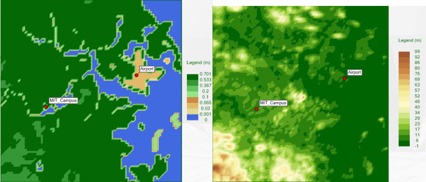

Table 2: Comparison of the measured and the simulated wind power parameters. The first column is the measured data at MT2 20m point and is the input to the Local CA reconstruction procedure at this point. It is compared to the second and the third columns - the measured and the reconstructed data at the control point (MT1 20m), respectively. The next columns present the reconstructed results at the two points for assimilation of the background measured data during 3 winter months (Background CA 3 months), assimilation of CFD transformed airport data for the same period (TopoWind 3 months), MCP normalization to 13 years airport data, assimilation of 2 years of background data and assimilation of CFD transformed airport data for the same 2 years. For convenience of comparison, the ratios of power density and mean speeds between the two points are shown for each reconstructed and measured pair. For further discussion see the text in the next section.
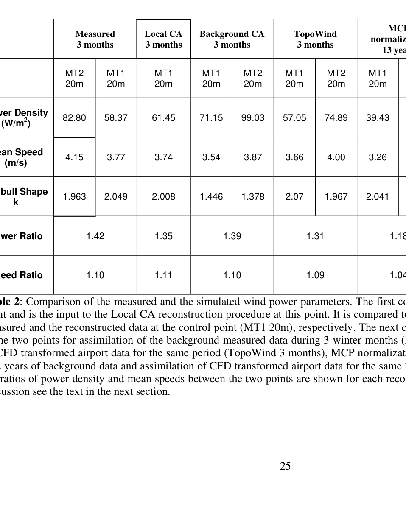

### 5.6 Comparison of Resource Assessment techniques

The results of the different resource assessment techniques are summarized in Table 2. All the methods agree that the wind resource at MT2 is better, the differences can be conveniently quantified by the ratios of the available wind power densities and mean wind speeds. It is seen that the local CA approach gives the best estimates when compared to the measured data. The 3 month background CA recovers the proper ratios although the absolute values of wind power density are higher. The 2 year background CA and 13 year MCP normalization produce comparable ratios and power densities, although the mean wind speed are significantly different. We explain this discrepancy by the different Weibull shape parameters k in these two calculations. The significantly lower values of k in the background CA are the responsible for the skewness of power density distributions and higher values of their integrals. The importance of proper reconstruction of distribution skewness is confirmed by the CFD transformation of climatology (TopoWind), which produces good results for the 3 months data, consistent with the measurements in both the ratios and the absolute values. CFD transformation of 2 year climatology assimilation produces lower ratios and absolute values of power density than any other method shown, which is unexplained at this point.

## 6 Conclusions

We demonstrate the application of CFD analysis for wind power resource assessment in the complex urban environment of the Massachusetts Institute of Technology campus. Meteorological data directly measured at the sites is examined and compared to the results of CFD simulations. Qualitative comparison of the results exhibits satisfactory agreement and reveals the physical mechanisms responsible for the observed and the numerically reconstructed differences in wind power resource between the sites.

We show how the CFD model is integrated into the resource assessment procedure. The extensive available observations from a nearby airport can be transferred from several miles away to the area of interest. Next, calculations of the local speed-up factors with UrbaWind CFD model allow estimation of the mean wind speeds and the energy production at the site. A map of wind resource can be produced to identify the most productive areas as well as low turbulence zones.

Several CFD based computational techniques are employed to quantitatively assess wind resource at the sites. We reconstruct the spatial three dimensional structure of the wind resource climatology with local Climatology Assimilation, background Climatology Assimilation and CFD transformation of climatology from a remote site. The climatological estimates of the resource are compared also to a multi-year MCP normalization and to the direct measurements at the sites. All the techniques agree that the Western site (MT2) has a better wind resource that the Eastern site (MT1). The absolute values of the differences in wind power density and in mean wind speeds depend on the quality of the available data, resolution and accuracy of the computational techniques and are subject of further investigation.

## 7 Acknowledgments

We would like to acknowledge various groups and individuals who have provided support for this work. Firstly, we would like to express many thanks to NRG Systems, Inc. for their generous donation of the measurement equipment. In addition, many thanks to the MIT Energy Initiative for the energy fund grant in support of this project and to various people at MIT facilities who supported the siting and installation of the towers. Many thanks to the staff of MIT GIS Lab and MIT Synoptic Laboratory for their technical support. Special thanks to the Meteodyn Support Team in France for their fast and efficient resolution of the technical issues. Many thanks also to the rest of the MIT Renewable Energy Projects in Action student team who have worked on various aspects of the campus turbine project. Details on the project and its progress can be found at http://windenergy.mit.edu.

## 8 References

[1] TopoWind software, User Manual, Meteodyn.

[2] Wind Resource Assessment Handbook: Fundamentals for Conducting a Successful Wind Monitoring Program, AWS Scientific, Inc., April 1997.

[3] Garratt J.R., 1992, The atmospheric boundary layer, Cambridge Atmospheric and space sciences series.

[4] A.N. Ross, S.B. Vosper 2005, Neutral Turbulent flow over forested hills. Quart. J. Roy. Meteorol. Soc. 131:1841-1862

[5] Ferry M., 2002, New features of the MIGAL solver, Proc. Of the Phoenics Users Int. Conf., Moscow, Sept. 2002

[6] P. J. Hurley. An evaluation of several turbulence schemes for the prediction of mean and turbulent fields in complex terrain; Boundary-Layer Meteorology, 83: 43-73, 1997.

[7] Bates R., S. Fox, K. McCusker, K. Pesce and D. Wesolowski, 2007, Wind Study: Feasibility Study and Recommendations for Implementing Wind Power on MIT's Campus. MIT course 5.92 final report.
