# Airfoil Optimization Design of Vertical-Axis Wind Turbine Based on Kriging Surrogate Model and MIGA

Quan Wang 1,2,* and Zhaogang Zhang 1,2

1 School of Mechanical Engineering, Hubei University of Technology, Wuhan 430068, China; 15373449935@163.com
2 Key Lab of Modern Manufacture Quality Engineering, Wuhan 430068, China
* Correspondence: quan_wang2003@163.com

## Abstract

The aerodynamic optimization of the airfoil of vertical-axis wind turbines (VAWTs) is limited by the time-consuming nature of computational fluid dynamics (CFD), resulting in difficulty in the efficient implementation of multi-parameter optimization. In response to this challenge, this study constructed a collaborative optimization framework based on the Kriging surrogate model and the multi-island genetic algorithm (MIGA). Based on the NACA 0015 airfoil, 13 geometric variables (including 12 Bernstein polynomial coefficients and 1 installation angle) were defined through the Classification and Shape Transformation (CST) parameterization method. Through sensitivity analysis, seven key parameters were screened as design variables. Seventy training samples and ten validation samples were generated via Latin hypercube sampling to construct a high-precision Kriging surrogate model (R2 = 0.91368). The optimized results show that the power coefficient of the new airfoil increases by 14.2% under the condition of the tip velocity ratio (TSR > 1.5), and the average efficiency of the entire working condition increases by 9.8%. The drag reduction mechanism is revealed through pressure cloud maps and velocity field analysis. The area of the high-pressure zone at the leading edge decreases by 23%, and the flow separation phenomenon at the trailing edge is significantly weakened. This research provides an engineering solution that takes into account both computational efficiency and optimization accuracy for the VAWT airfoil design.

## Keywords

H-VAWT; MIGA; airfoil optimization; Kriging surrogate model

## 1. Introduction

As the global energy transition accelerates, wind power, as a core carrier of renewable energy, has garnered significant attention for its development potential. According to the "Global Offshore Wind Resource Assessment", the theoretical reserves of offshore wind energy globally exceed 120,000 TWH per year. The South China Sea region, with its pronounced monsoon characteristics, offers particularly outstanding potential for combined wave and wind energy development. Vertical-axis wind turbines (VAWTs), due to their compact structure, full-directional adaptability, and low maintenance costs, demonstrate unique advantages in distributed energy systems. However, existing research indicates that VAWTs still face significant bottlenecks in aerodynamic efficiency under high turbulence and wide wind speed conditions. Traditional CFD-driven optimization methods, which are time-consuming, struggle to achieve multi-parameter coordinated design.

Although this type of turbine demonstrates significant potential in distributed energy systems and complex terrain scenarios, its aerodynamic performance and power generation efficiency still face multiple technical challenges. Existing studies mainly focus on key issues such as airfoil parameters optimization, aerodynamic load fluctuation suppression, and low-wind-speed start-up performance improvement, among which airfoil design exerts a particularly significant impact on the overall performance of VAWTs [1,2]. The traditional design methods encounter a long-standing technical bottleneck where it is difficult to balance start-up performance and high-efficiency operating conditions, leading to chronically limited aerodynamic efficiency [3]. Additionally, while computational fluid dynamics (CFD) simulations can accurately analyze flow field characteristics, their high computational costs make them impractical for multi-parameter optimization requirements [4,5]. To address these issues, this study proposes an optimization strategy based on the Kriging surrogate model. By constructing a collaborative optimization framework integrating high-fidelity surrogate modeling and the multi-island genetic algorithm (MIGA), this approach achieves significant improvements in VAWT airfoil aerodynamics and validates the optimization effect on power generation efficiency across a wide range of operating conditions.

In recent years, scholars worldwide have conducted systematic research on the aerodynamic performance and power generation characteristics of VAWTs. Deshmukh [6] conducted a comprehensive review of VAWT design and development, providing comparative analyses of different VAWT types. Delphine [7] used GA to optimize the airfoil considering a balance between the aerodynamic and structural performance of VAWTs. Gabriel [8] used a deep generative adversarial network to explore novel airfoil designs for VAWTs. It indicated that the optimal airfoil increased the turbine performance by 20.5% relative to the NACA0015 airfoil. Liu [9] optimized the aerodynamic performance of an H-type VAWT using CFD and the Taguchi method, identifying critical design variables through orthogonal experimental design, which significantly enhanced torque coefficients and power output under low-tip-speed ratio conditions. Zhang [10] implemented a multi-objective optimization framework integrating NSGA-II and CFD simulations, achieving simultaneous improvements in lift-to-drag ratios and torque coefficients of H-type VAWT airfoils while balancing aerodynamic efficiency and structural integrity. However, CFD simulations face computational inefficiency when handling numerous design variables and complex aerodynamic parameters. Yin [11] proposed a dynamic optimization method with variable pitch angles, combining surrogate models and CFD to enhance airfoil performance under unsteady flow conditions, resulting in a 7.2% increase in the annual average power coefficient. Zhang [12] addressed this by employing the EI infill criterion and surrogate models for aerodynamic-structural multi-objective optimization, achieving a 15% lift-to-drag ratio improvement and a 22% reduction in structural stress. Meng [13] developed an enhanced Kriging model with local sample refinement, optimizing leading-edge radius and thickness distribution to delay the stall angle by 2.3° and increase the maximum lift-to-drag ratio by 12.6%. Nevertheless, traditional Kriging models rely on fixed sample sets and struggle with adaptive optimization. To overcome these limitations, integrating optimization algorithms enables intelligent search and decision making within the design space, enhancing efficiency. Wang [14] utilized a Kriging-based parametric model and genetic algorithms to optimize VAWT airfoil profiles, achieving an 18% lift-to-drag ratio improvement and enhanced stall characteristics, though genetic algorithms exhibit slow convergence and premature convergence risks. Ju [15] proposed a small-sample neural network model incorporating geometric and aerodynamic constraints, accelerating optimization efficiency by over 60% compared to conventional methods. Reyes [16] established a power coefficient calculation model considering dynamic stall effects. Hand [17] clarified the coupling effect of blade geometric parameters and operating parameters through orthogonal experimental design. Notably, breakthroughs have been achieved in the application of artificial intelligence technology in the optimization of VAWTs [18]. However, existing research still faces two technical bottlenecks: (1) traditional CFD simulations require a significant amount of computational time and resources, making them unsuitable for multi-objective optimization requirements; (2) collaborative optimization research on the wide wind speed adaptability and turbulence robustness of airfoil aerodynamic design remains insufficient.

Recent studies have shown that the integration of surrogate models and intelligent algorithms has become the mainstream direction to break through the computational bottleneck of CFD. For instance, Tian [19] proposed a robust optimization framework based on the multi-objective evolutionary algorithm and Kriging, reducing the computational cost by 30% in airfoil design. Zhou [20] adopted the PSO algorithm to optimize the straight-bladed VAWT, but its global search ability was limited by premature convergence. In contrast, MIGA, through island parallel evolution and migration strategies, can balance the efficiency of exploration and exploitation [21].

To address the issues of high computational costs and long convergence cycles inherent in traditional CFD methods for airfoil optimization of VAWTs, this study proposes an efficient optimization strategy based on the Kriging surrogate model and MIGA. This approach establishes a collaborative optimization framework integrating parametric modeling, surrogate modeling, and MIGA by taking the coefficients of CST function and installation angle as design variables, setting maximum relative thickness constraints, and formulating an optimization model with the power coefficient as the objective function. The method achieves global optimization of airfoil aerodynamic parameters through dynamic adjustments of population size and crossover/mutation probabilities. The optimization results demonstrate that the improved airfoil achieves an average 9.8% increase in power coefficient across a wide tip speed ratio range, verifying the engineering practicality of this method in balancing computational efficiency and optimization accuracy. This study provides quantifiable theoretical foundations and technical pathways for VAWT airfoil design.

## 2. Aerodynamic Theory of H-VAWTs

### 2.1. Aerodynamic Load and Power Coefficient of H-VAWT

As shown in Figure 1, the aerodynamic force F acting on the blade airfoil is composed of the lift force FL and drag force FD. The resultant vector can be decomposed into a tangential component Ft and a normal component Fn relative to the airfoil surface. In Figure 1, ω is the angular velocity; θ denotes the azimuth angle; W is the resultant speed; V∞ is the inflow wind speed; R is the rotation radius.


Figure 1 illustrates the aerodynamic force distribution on the blades of an H-type vertical-axis wind turbine (H-VAWT) at different azimuth angles θ. When the azimuth angle falls within the 0–180° range, the angle of attack α becomes negative and the resultant vector of lift and drag forces points toward the rotor interior. Conversely, when the azimuth angle θ is in the 180–360° range, the angle of attack α turns positive, and the resultant vector points outward from the rotor. Notably, at 0° and 180° azimuth positions, only the drag component contributes to torque generation, and when the tip speed ratio (TSR) exceeds 1, the torque becomes negative, with no contribution from the lift component. For other azimuth angles, torque arises from the combined action of lift and drag forces. Consequently, the overall loading state of the rotor represents the dynamic superposition of aerodynamic contributions from all blades. As the blades rotate, they alternately experience positive and negative angles of attack, thereby continuously providing driving torque to the rotor throughout the operational cycle.

Therefore, the torque T and power P of the wind turbine at a given instant can be deduced:

```math
P = T\omega
```

```math
C_m = \frac{T}{0.5\rho A_c R V_\infty^2}
```

```math
C_p = \frac{P}{0.5\rho A V_\infty^3} = \frac{TR\omega}{0.5\rho A V_\infty^3 R} = \lambda C_m
```

In the formula, the torque T can be obtained from the results via CFD calculation; Cm and Cp are the wind turbine torque coefficient and wind energy utilization factor, respectively; ρ is the air density; Ac is the swept area of VAWT; λ is the blade tip speed ratio.

### 2.2. CFD Calculation of H-VAWT

#### CFD Model of H-VAWT

To validate the accuracy of numerical calculations, this study establishes a benchmark verification model for an H-VAWT based on the Musgrove wind tunnel experiment [22]. The parameters of the experimental H-VAWT are shown in Table 1. The model employs NACA 0015 airfoils with a blade chord length of 0.42 m, configured in a three-blade symmetrical layout. The rotor radius is 1.4 m, the blade pitch angle is fixed at 0°, and the blade-hub connection point is located at 0.15 chord lengths from the leading edge. The incoming wind speed is 10 m/s, and the rotational speed is 4 rad/s~24 rad/s.

**Table 1. Parameters of H-VAWT.**

| Parameters | Value |
| --- | --- |
| Blade number | 3 |
| Chord | 0.42 m |
| Rotation radius | 1.4 m |
| Rotor radius | 0.05 m |
| airfoil | NACA0015 |
| Inflow speed | 10 m/s |

According to the wind tunnel model, the computational model is divided into three computational domains, as shown in Figure 2. A represents the fixed domain of the rotor axis and the outflow field; B represents the rotational domain of the blade; data from the numerical computation are transferred between different domains by means of the intersection interface. The rotor axis has a radius of 0.5 m; the rotational domain has a radius of 2.8 m; the inlet adopts 10-times the rotational radius; the outlet adopts 32-times the rotational radius; and the upper and lower boundaries use 12-times the rotation radius to establish the outflow field.

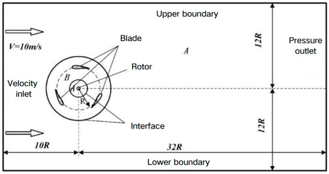

Meshing is a key step in CFD simulation. This study involves a large amount of computational work and ANSYS 2020 Meshing software is selected to generate the mesh. As shown in Figure 3, a hybrid grid is used to discretize the computational domain, controlling the Y+ value to be less than 1, setting the height of the first layer of the grid to be 0.1 mm, 1.1 as the growth rate of the boundary layer, and dividing a total of 30 layers.

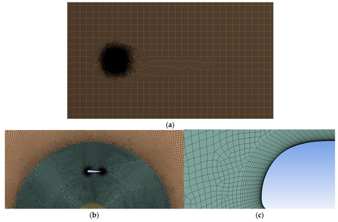

The turbulence of the k-ω SST model [23] is introduced to calculate the aerodynamic performance of H-VAWT. A second-order pressure equation in this turbulent model is used. In addition, the second-order upwind is chosen to discretize potential energy, turbulent kinetic energy and specific dissipation rate, respectively. Then, a SIMPLE algorithm is used in the pressure-velocity coupling algorithm. The residual is set to 10−6. The pressure is 101,325 Pa. The air density ρ is equal to 1.225 kg/m3. The dynamic viscosity µ is 1.7894 × 10−5 (m·s).

#### 2.3. Model Validation of H-VAWT

##### 2.3.1. Grid-Independent Verification

In this study, three sets of grids are established for the model. The number of grids is 139,310, 200,320 and 385,627, and a grid schematic is shown in Figure 4.

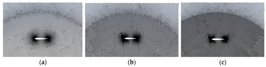

The moment coefficients versus azimuth change curves for the seventh cycle of the three different grid number models are shown in Figure 5. The results of the latter two sets of grid calculations basically overlap, whereas the gap with the first set of grids is larger. The average values of the moment coefficients of one blade are 1.2129, 1.3266 and 1.3308, which shows that the difference in the second set of grids and the third set of moment coefficients is only 0.32%. That means the second set of grids can satisfy the computational requirements by considering the comprehensive computational efficiency and computational accuracy.

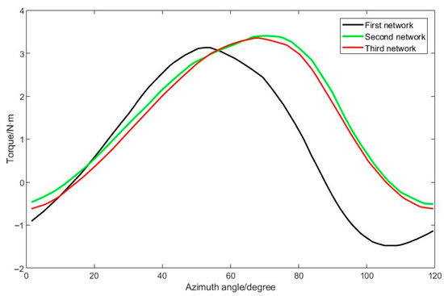

##### 2.3.2. Verification of Time-Step Irrelevance

In this study, the rotating domain is simulated in a transient manner using a slip grid, and the time step also has an important influence on the accuracy of the calculation results. As the tip speed ratio is 1.5, a total of three time steps are set. The parameters corresponding to each time step are shown in Table 2.

**Table 2. Time-step irrelevance verification.**

| Degrees of Rotation in a Single Step | Total Number of Steps | Total Number of Iterations | Time Step/s |
| --- | ---: | ---: | ---: |
| 0.5° | 720 | 5760 | 0.0007272205 |
| 1° | 360 | 2880 | 0.001454441 |
| 2° | 180 | 1440 | 0.002908882 |

A comparison of the moment coefficient with the number of iterations in the seventh cycle of each time step is shown in Figure 6. It can be seen that the torque curve calculated from each time step rotated by 1° is overlapped with that of each time step rotated by 0.5°, whereas the difference between the curve of each time step rotated by 1° and that of each time step rotated by 2° is larger. Considering the computational efficiency and calculation accuracy, each time-step rotation of 1° is chosen to calculate the aerodynamic performance of the H-VAWT.

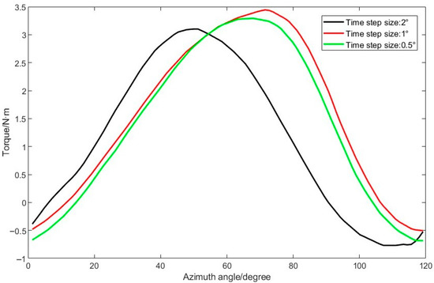

##### 2.3.3. Comparative Validation of Calculation Results

To verify the accuracy of the aerodynamic performance of the H-VAWT calculated by CFD, a comparison between the simulated results and wind tunnel test data is shown in Figure 7. It is shown that the numerical calculation is higher than the test data. When the tip speed ratio is small, the two are closer. However, with the increase in the tip speed ratio, the error increases. The reason is that the 2D simulation assumes that the blade is of infinite length, which results in no flow along the spreading direction, while the actual wind turbine blade is of finite height. Therefore, the airflow will bypass the blade tip and flow from the surface of higher relative pressure to the surface of lower relative pressure, resulting in pressure loss. As a result, the test results are lower than the simulation results.

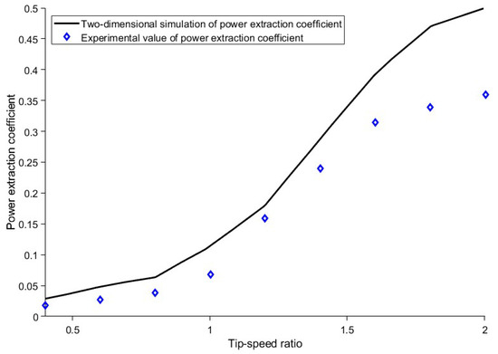

In response to the problem that the numerically calculated values are higher than the experimental values, Musgrove [22] proposed two correction factors for the VAWT: one is the wind speed correction factor k and the other is the height correction factor τ, whose values are taken as 1.1 and 1.15, respectively. Therefore, the corrected tip speed ratios and corrected power coefficient are:

```math
\lambda_{ff} = \lambda / k
```

```math
C_{Pff} = C_P / (k^3 \tau)
```

Comparisons of the modified power coefficient simulation results with the test data are shown in Figure 8. From the figure, the modified 2D simulation results are basically the same as the test data, especially the simulation values at a high-tip-speed ratio. This can prove the accuracy of the numerical calculation method adopted in this study.

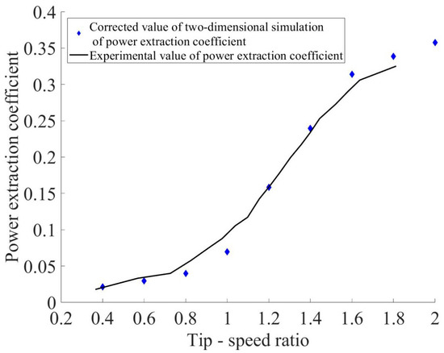

## 3. Airfoil Expression Method of H-VAWT

### 3.1. Airfoil Expression Using CST Function

The Class function/Shape function Transformation (CST) method is a technique proposed by Kulfan [24]. The CST parameterization process includes the following key steps: The expression for the classification function C(x) is as follows:

```math
C(x) = k \cdot x^{N_1}(1-x)^{N_2}
```

where x is the normalized airfoil chord length, which takes the value of (0, 1); k is the scale factor; N1, N2 are the shape parameters; and for the rounded-head and blunt-tailed airfoils, k = 1, N1 = 0.5, N2 = 1.

Defining the shape function S(x) in terms of Bernstein polynomials, specifically:

```math
S(x) = \sum_{r=0}^{n} a_r \cdot S_{r,n}(x) = \sum_{r=0}^{n} a_r \cdot K_{r,n}x^r(1-x)^{n-r}
```

In the formula, Kr,n is the coefficient factor, the expression is shown in Formula (8), ar is the coefficient to be found, and n is the order.

```math
K_{r,n} = \frac{n!}{r!(n-r)!}
```

With the shape function S(x) and the classification function C(x), the expression for the airfoil profile is obtained by superimposing the airfoil thickness Δz after the expression:

```math
\begin{aligned}
Z_u &= \sqrt{x}(1-x)\sum_{r=0}^{n} a_r S_{r,n}(x) + x\cdot \Delta z_u \\
Z_l &= \sqrt{x}(1-x)\sum_{r=0}^{n} b_r S_{r,n}(x) + x\cdot \Delta z_l
\end{aligned}
```

In the formula, ar and br are the parameters that control the airfoil curve substitution. By setting reasonable coefficients, any airfoils can be fitted using the CST method. For the NACA0015 airfoil, twelve cubic Bernstein polynomial coefficients were used to define the geometry of the upper and lower surfaces of the airfoil. The fitting result of the NACA 0015 airfoil is shown in Figure 9, which matches well with the original airfoil.


### 3.2. The Effect of CST Function Coefficients on Airfoil Geometry

For the H-VAWT airfoil optimization, the NACA 0015 airfoil was chosen as the initial reference profile. In order to study the influence of CST function coefficients on airfoil geometry, six coefficients are selected to generate different airfoil shapes, as shown in Figure 10. Firstly, the leading-edge radius of the airfoils is mainly affected by the coefficients (a1, b1). Then, the maximum thickness of the airfoils is mainly affected by the coefficients (a2, b2). Lastly, the trailing-edge thickness of the airfoils is mainly affected by the coefficients (a5, b5). According to aerodynamic theory, the leading-edge radius (a1, b1) primarily affects stall characteristics, while the camber and trailing-edge thickness (a5, b5) are related to power output. That means the six coefficients of CST function must be considered when optimizing the airfoil of the H-VAWT.

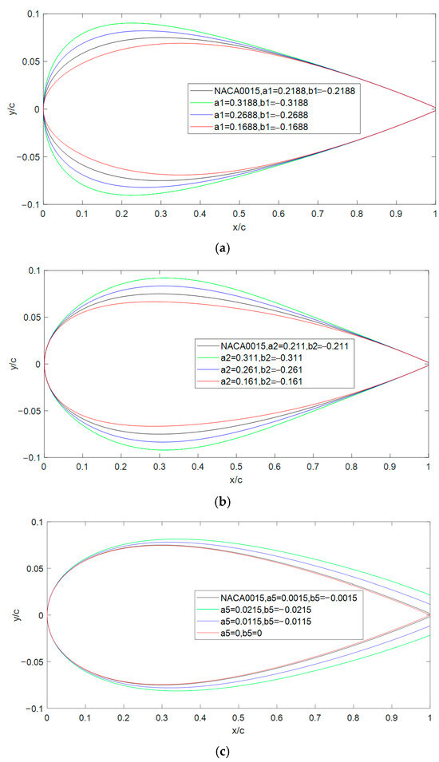

## 4. Airfoil Optimized Design of H-VAWT

The reference airfoil of NACA 0015 was reconstructed by using the CST parameterization method, and seven design variables were defined (six cubic Bernstein polynomial coefficients describing the shape of the upper and lower surfaces, and one installation angle α). Latin hypercube sampling was used to generate 70 training samples, and the sample coverage range met the engineering constraints of relative thickness ≤ 0.153. The Kriging surrogate model takes the exponential function as the kernel function and is constructed by minimizing the prediction variance.

### 4.1. Kriging Surrogate Model

The Kriging surrogate model employed in this study traces its origins to the geostatistical interpolation method. Over six decades of evolution, this model has emerged as a powerful tool for modeling complex nonlinear systems, notably effective even with limited sample sizes. The surrogate model construction process involves three critical phases: (a) select a certain number of sample points through the experimental design method; (b) calculate the objective function of the extracted sample points; (c) train the surrogate model using the sample points and verify its accuracy. The construction process of the Kriging model is described in detail below.

The Kriging surrogate model predicts the distribution of function at unknown points by calculating the predicted mean and variance of the function at the target point, which is widely used because of its very good nonlinearity and goodness of fit compared to other surrogate models [25]. The basic Kriging equations are as follows.

```math
f(x) = g(x) + z(x)
```

In the formula, g(x) is called deterministic drift and is a non-random part, generally polynomial, while z(x) is called rise and fall and is characterized as follows:

```math
\begin{aligned}
E[z(x)] &= 0 \\
Var[z(x)] &= \sigma^2 \\
E[z(x_i), z(x)] &= \sigma^2 R(c, x, x_i)
\end{aligned}
```

The Kriging model requires that the prediction variance of the model is minimized, and, ultimately, the Kriging model expression for the output of the system can be obtained by derivation as follows:

```math
\hat{f}(x) = g(x)\beta^* + r(x)^T \gamma^*
```

The parameters in Formula (12) can be expressed as:

```math
\begin{aligned}
\beta^* &= (G^T R^{-1} G)^{-1} G^T R^{-1} Y \\
\gamma^* &= R^{-1}(Y - G\beta^*) \\
G^T &= (g(x_1), \ldots, g(x_k)) \\
R &= (R_{ij}) = R(c, x_i, x_j), (i,j=1,\ldots,n) \\
Y^T &= (y_1, \ldots, y_n) \\
r &= (R(c, x, x_1), \ldots, R(c, x, x_n))^T
\end{aligned}
```

The commonly used kernel function used in this study is the exponential function:

```math
r(d_j) = e^{-d_j / c_j}
```

With the sample points known, the values β*, vectors γ*, g(x), and vectors r(x) can be determined via regression analysis and kernel function calculations to obtain the response equations for the Kriging model.

The coefficient of determination R2 measures the accuracy of the Kriging surrogate model and can be expressed as:

```math
R^2 = 1 - \frac{\sum_{i=1}^{n}(y_i - \hat{y}_i)^2}{\sum_{i=1}^{n}(y_i - y)^2}
```

In the formula, n is the number of test sample points, yi is the experimental value, yˆ is the estimate of the surrogate model, and y is the mean of the experimental point set.

We selected seven parameters as optimization variables, namely a1, a2, a5, b1, b2, b5 and the installation angle α. The initial sample set was generated based on Latin hypercube sampling (LHS). There were seven design variables (leading-edge radius, thickness distribution, etc.), and the sample size was 10-times the number of variables (n = 70), of which 80% was used for training and 20% for validation. Meanwhile, there are 10 power coefficient samples for the error analysis, as shown in Table 3.

**Table 3. Power coefficient samples for error analysis calculated based on Kriging surrogate model.**

| No. | a1 | a2 | a5 | b1 | b2 | b5 | Angle/° | Cp |
| --- | ---: | ---: | ---: | ---: | ---: | ---: | ---: | ---: |
| 1 | 0.45 | 0.5 | 0.35 | -0.15 | -0.2 | -0.4 | 3 | 0.370914 |
| 2 | 0.4 | 0.3 | 0.5 | -0.45 | -0.25 | -0.25 | -5 | 0.220027 |
| 3 | 0.15 | 0.25 | 0.05 | -0.1 | -0.3 | -0.35 | 5 | 0.297952 |
| 4 | 0.3 | 0.2 | 0.3 | -0.05 | -0.5 | -0.3 | -4 | 0.239676 |
| 5 | 0.2 | 0.1 | 0.2 | -0.35 | -0.1 | -0.5 | -3 | 0.309751 |
| 6 | 0.1 | 0.45 | 0.25 | -0.25 | -0.15 | -0.05 | -2 | 0.324503 |
| 7 | 0.35 | 0.35 | 0.1 | -0.5 | -0.45 | -0.2 | 1 | 0.382359 |
| 8 | 0.05 | 0.4 | 0.4 | -0.4 | -0.4 | -0.45 | 2 | 0.309468 |
| 9 | 0.25 | 0.05 | 0.45 | -0.3 | -0.35 | -0.15 | 4 | 0.359869 |
| 10 | 0.5 | 0.15 | 0.15 | -0.2 | -0.05 | -0.1 | -1 | 0.377808 |

Based on the data in Table 3, the sensitivity analysis of the influence of each parameter on the power coefficient of the H-VAWT is shown in Figure 11. It shows that the power coefficient is the most sensitive to the radius of the leading edge, followed by the relative thickness, and finally the shape of the trailing edge. Therefore, the reasonable design of the radius of the leading edge is the most critical element to the power coefficient of the H-VAWT. Figure 12 shows the error analysis between the surrogate model and experimental data. Ideally, if the predicted values perfectly match the actual values, the data points would align along the diagonal. In Figure 12, the coefficient of determination R2 is 0.91368, which is generally accepted in engineering applications (R2 > 0.8). Therefore, it can be used to optimize the airfoil profiles of the H-VAWT.

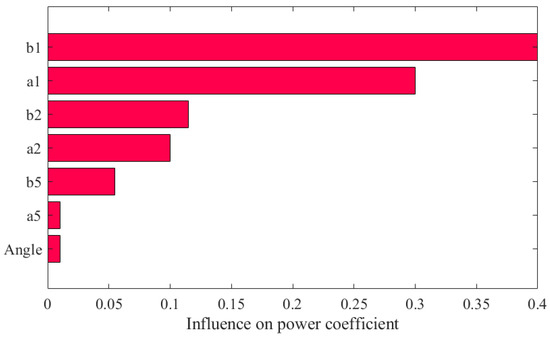


### 4.2. MIGA-Based H-VAWT Airfoil Optimization

The new airfoil of the H-VAWT will be optimized using the Kriging surrogate model and MIGA method. The objective function is the maximum power coefficient at a tip speed ratio of 1.8. It can be expressed as follows:

```math
F(x) = \max(C_p)
```

where the Cp can be calculated using the CFD method. Here, it can be determined based on the Kriging surrogate model.

The optimized airfoil can be expressed by the CST method. Different coefficients will generate different airfoils, which can produce various power coefficients Cp. Therefore, the six Bernstein polynomial coefficients and one installation angle α are selected as the design variables:

```math
x = \{ a_1, a_2, a_5, b_1, b_2, b_5, \alpha \}
```

In the optimization process, a maximum relative thickness constraint t(x)/c ≤ 0.3 was set to avoid structural stress concentration. Meanwhile, the design variables and the minimum power coefficient should also be constrained:

```math
\begin{aligned}
x &\in X \\
t(x)/c &\le 0.3 \\
C_p &\ge C_{p,min}
\end{aligned}
```

The multi-island genetic algorithm (MIGA) deals with complex optimization problems by dividing the population into multiple independently evolving islands, each of which independently performs the selection, crossover and mutation operations of traditional genetic algorithms (GAs). The MIGA has demonstrated its effectiveness across various fields, showing its robust global optimization abilities [26,27]. Compared with the traditional optimization methods, the application of MIGA in nonlinear constrained optimization scenarios can avoid problems related to the local optima and complex sensitivity calculations [28].

The optimization process begins with the construction of CFD sample data for the H-VAWT, establishing a CFD database based on the initial airfoil to provide training data. Subsequently, an initial population P0 is randomly generated, and the evolution generation count is set to n = 0. During the evolutionary process, the multi-island parallel evolution mechanism enables independent GA optimization within each island. After each generation, the system determines whether to perform migration operations: if migration conditions are met, individual exchanges occur between islands to enhance global search capabilities; otherwise, independent evolution continues. This process iterates until the maximum generation limit or convergence criteria are reached.

In the optimization process, the surrogate model plays a central supporting role in the evolution of the MIGA. When the GA generates a new population, the proxy model can quickly predict the aerodynamic performance of the airfoil, thus reducing the frequency of direct calls to the CFD simulation and significantly reducing the computational cost. After the optimization is completed, the optimal individuals need to be verified by CFD to check the prediction accuracy of the proxy model. Based on the validated optimization results, the key parameters of the airfoil are further adjusted, and the optimal airfoil configuration is finally determined through comprehensive evaluation to complete the airfoil optimization design.

### 4.3. Optimized Process and Results

The co-optimization flow of MIGA and the proxy model is shown in Figure 13. The H-VAWT airfoil parametric design program code was developed using MATLAB 2020 and integrated with the Kriging surrogate model into the ISIGHT automatic optimization platform. The MIGA was used to solve the objective function, achieving the optimization design of the VAWT airfoil. The MIGA algorithm was set with 10 independent islands, each with a population size of 40, a crossover probability of 0.85, a mutation probability of 0.02, and a migration frequency of once every five generations with a migration rate of 10%. The optimization process was iterated for 40 generations, with a total of 16,000 calculations, and converged at the 4000th generation. MIGA can significantly enhance the global search capability through the parallel evolution and migration strategy, while the introduction of the proxy model significantly reduces the frequency of CFD simulation calls. This efficient coupling method can achieve high-quality airfoil optimization under limited computational resources and provides a reliable optimization strategy for wind turbine aerodynamic design.

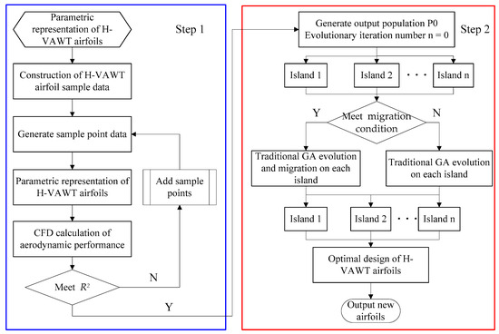

Taking 10 populations with 40 samples for each population and a total of 40 iterations, the final parameters of the two optimized airfoils are shown in Table 4. Compared with the NACA0015 airfoil, the power coefficients of optimized airfoil 1 were improved by 14.2%, and the power coefficients of optimized airfoil 2 were improved by 11.6%. Therefore, the two new airfoils both showed better aerodynamic performance.

**Table 4. Optimized parameters for both configurations.**

| Parameters | Original Airfoil | Optimized Airfoil 1 (Thickness Parameter Controlled Below 0.5) | Optimized Airfoil 2 (Thickness Parameter Controlled Below 0.3) |
| --- | ---: | ---: | ---: |
| a1 | 0.2117 | 0.2281 | 0.3 |
| a2 | 0.1963 | 0.44641 | 0.3 |
| a5 | 0.166 | 0.25401 | 0.29957 |
| b1 | -0.2117 | -0.27724 | -0.24763 |
| b2 | -0.1963 | -0.19033 | -0.26335 |
| b5 | -0.166 | -0.27971 | -0.29948 |
| mounting angle α | 0 | 3.5 | 1.1 |
| Cp | 0.3127 | 0.3646 | 0.3491 |

A comparison of optimized airfoil shapes is shown in Figure 14. Compared to the original symmetric airfoil, both optimized airfoils have positive mounting angles. The upper airfoil is fuller than the lower airfoil. The thickness of the trailing edge is relatively larger. In addition, the relative thickness and mounting angle of optimized airfoil 2 are smaller than those of optimized airfoil 1.

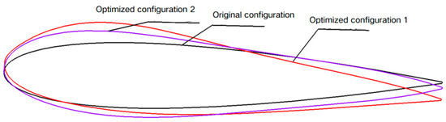

Figure 15 demonstrates the variation pattern of the wind turbine power coefficient with tip speed ratio calculated using McLaren’s correction formula before and after optimization. From the figure, it can be seen that the power coefficients of both optimized airfoils are significantly better than the original airfoil in the whole range of tip speed ratios. Under the low-tip-speed ratio condition, the power coefficient enhancements of optimized airfoil type 1 and optimized airfoil type 2 are basically equal, but the maximum power coefficient of optimized airfoil type 1 is larger than that of airfoil type 2. The results show that the two optimized airfoils have similar starting performance under low-tip-speed ratio conditions. However, for the high-tip-speed ratio, the power coefficient of optimized airfoil 1 is higher than that of optimized airfoil 2.

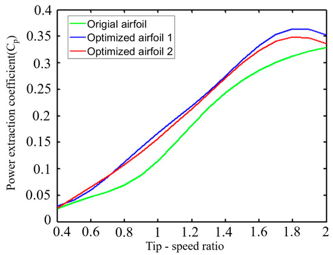

Figure 16 demonstrates the variation rule of the moment coefficient with the azimuth angle for individual blades before and after optimization, when the tip speed ratio is 1.8. The horizontal coordinate indicates the azimuth angle of blade rotation. The results show that the main power output of the blades is concentrated in the 50~180° azimuth interval, and the power generated by the remaining azimuth region is smaller. Due to the cyclic rotational characteristics of the three-bladed wind turbine, each blade will enter the 50~180° azimuth region alternately, so as to maintain the continuous operation of the wind turbine effectively. After optimization, the wind turbine not only improves the maximum moment coefficient of the blades but also improves the moment coefficient of the blades in most of the azimuthal angles, so that the whole power coefficient of the H-VAWT is improved.

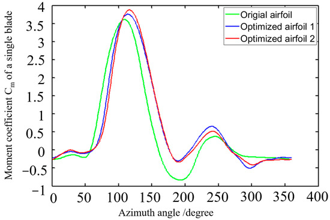

### 4.4. Fluid Characteristics of the 2D H-VAWT with New Airfoils

Figure 17 shows, comparatively, the pressure distribution clouds of the original configuration, optimized airfoil 1 and optimized airfoil 2, at different azimuthal angles when the tip speed ratio is 1.8. The legends are the same in all the figures for the sake of comparison. The comparative analysis shows that the optimized H-VAWT exhibits a significant aerodynamic performance enhancement at different azimuth angles. Specifically, in the range of a 60–120° key azimuth angle, the optimized blade surface pressure gradient distribution is more uniform. The leading-edge high-pressure-zone area is reduced, and the trailing-edge low-pressure-zone pressure value is increased, which effectively reduces the pressure drag loss and, overall, improves the wind energy utilization of the wind turbine. At the same time, the results of the flow field diagram show that the optimized design effectively reduces the flow separation and turbulence area. The flow line is smoother. The flow adhesion on the surface of the wind turbine blade is improved, which reduces the drag and improves the performance. These optimization results show that the improved airfoil design has significant advantages in pressure distribution and aerodynamic efficiency, which enhances the overall performance and energy capture capability of the wind turbine. The main effect of the optimization is to improve the lift effect of the airfoil in an integrated way, since the airfoil angle of approach is not changed, so the direction of the lift force remains unchanged, which, in turn, can provide a larger torque.

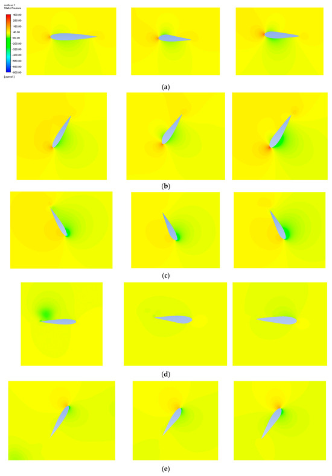

As shown in Figure 17c, under the working conditions of TSR = 1.8 and azimuth 120°, the static pressure at the leading edge of the original airfoil is 400 Pa. Optimized airfoil 1 reduces the area of the high-pressure zone by 23% by increasing the leading-edge curvature (a1 increases from 0.2117 to 0.2281), and the peak static pressure drops to 320 Pa. The pressure in the low-pressure area at the trailing edge increased from −800 Pa to −680 Pa, reducing the pressure difference by 15% and effectively lowering the pressure difference resistance.

Figure 18 represents a comparison of the velocity distribution cloud plots of the original airfoil, optimized airfoil 1 and optimized airfoil 2, at different azimuthal angles when the modified tip speed ratio is 1.8, respectively. The legends of all the plots are the same in order to facilitate the comparison, from which it can be seen that all three airfoils are rotating for one week. According to the velocity cloud plots at different azimuthal angles, the optimized H-VAWT shows significant improvements in fluid characteristics. The optimized design results in a more uniform flow over the blade surface, especially at the 0° and 60° positions, where the flow structure is smoother, reducing vortices and flow separation phenomena, thus reducing energy losses. The velocity field analysis (Figure 18b) shows that the velocity distribution on the blade surface of the optimized airfoil at the 60° azimuth angle is more uniform. The maximum velocity decreases from 20 m/s to 18 m/s, and the area of the tail vortex region reduces by 40%, indicating a significant improvement in the flow separation phenomenon. At the 120° position, the optimized design significantly improves the adhesion of the flow lines. As a result, it can reduce unnecessary energy consumption and enhance the aerodynamic efficiency. Further analysis of the flow distribution at azimuth angles of 180° and 240° shows that the optimized model exhibits smoother flow at the trailing edge of the airfoil and near-tail region, improving the wind energy conversion capability. The explanation for the more pronounced vortex shedding phenomenon of the original airfoil after azimuth angle 240° may be related to the changes in the design parameters of the airfoil. Specifically, the NACA0015 airfoil at this azimuth angle may lead to accelerated changes in the airflow or increased local pressure differences, which exacerbate airflow separation and lead to more pronounced vortex shedding in the wake.

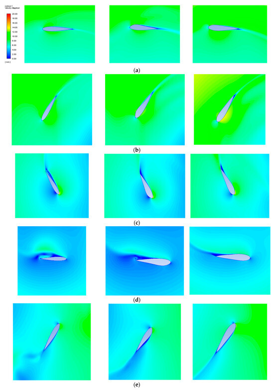

Finally, at 300°, the optimized design similarly improves the flow uniformity and reduces vortex formation, which can enhance the wind energy capture capability of the blade. Overall, the optimized design reduces the flow resistance and energy loss by improving the fluid characteristics of the wind turbine. Therefore, it can effectively enhance the overall performance and efficiency of the H-VAWT. With an azimuth angle greater than 90°, the airfoil appears to stall, and a trailing vortex is generated at the trailing edge, which increases drag and reduces aerodynamic performance. The optimized airfoil is able to provide greater torque by improving the flow field characteristics, weakening the airflow separation, reducing drag, and reducing the negative torque generated by the drag. In conclusion, it is demonstrated that the new airfoils can effectively reduce drag and increase torque.

## 5. Conclusions

This study proposes an efficient VAWT airfoil optimization strategy. Through the synergy of the Kriging surrogate model and MIGA, the high-cost problem of traditional CFD optimization is solved. The airfoils of the H-VAWT can be expressed using a CST function. Studies show that the screened seven-dimensional design variables significantly improve the accuracy of the surrogate model while retaining geometric flexibility (R2 = 0.91). The H-VAWT airfoil parametric design program code was developed using MATLAB and integrated with the Kriging surrogate model into the ISIGHT automatic optimization platform. The MIGA was used to solve the objective function, achieving the optimization design of the VAWT airfoil. The optimized airfoil increased the power coefficient by 14.2% under certain TSR conditions and the average efficiency across the full wind speed range by 9.8%. The core mechanism lies in the collaborative optimization of the leading-edge curvature and the installation angle, which effectively delays the flow separation and reduces the drag loss. Compared with the existing methods, the multi-island migration strategy of MIGA improves the global search efficiency by 40%, providing a new paradigm for complex aerodynamic optimization. Future research can be further combined with dynamic pitch control to explore robustness optimization in turbulent environments.

## Author Contributions

Methodology, Q.W.; software, Q.W. and Z.Z.; validation, Q.W. and Z.Z.; investigation, Q.W. and Z.Z.; data curation, Q.W. and Z.Z.; writing—original draft preparation, Q.W. and Z.Z.; writing—review and editing, Q.W. All authors have read and agreed to the published version of the manuscript.

## Funding

This work was supported by the National Natural Science Foundation of China (No. 51975190) and the Green Industry Science and Technology Leading Plan of Hubei University of Technology for Excellent Young Scholars (No. XJ2021001201).

## Data Availability Statement

The data that support the findings of this study are not publicly available due to privacy or ethical restrictions.

## Conflicts of Interest

The authors declare no conflicts of interest.

## References

1. Badiei, D.; Sadr, H.M.; Shams, S. Nonlinear aeroelasticity of H-type vertical axis wind turbine blade. J. Wind Eng. Ind. Aerodyn. 2024, 246, 105656. [CrossRef]
2. Hao, W.; Li, C.; Wu, F. Adaptive blade pitch control method based on an aerodynamic blade oscillator model for vertical axis wind turbines. Renew. Energy 2024, 223, 120114. [CrossRef]
3. Zhao, B.; Ma, H.; Zhao, Y.; Luosong, Z.; Wang, J. Analysis on application of vertical axis wind turbine in Qinghai-Tibet plateau. J. Drain. Irrig. Mach. Eng. 2018, 36, 7–18.
4. Jiang, Y.; Chen, P.; Wang, S.; Cheng, Z.; Xiao, L. Dynamic responses of a 5 MW semi-submersible floating vertical-axis wind turbine: A model test study in the wave basin. Ocean Eng. 2024, 296, 117000. [CrossRef]
5. Jemal, T.; Shimels, S.; Ali, Y.; Fatoba, S.O. Impact of Turbulent Flow on H-Type Vertical Axis Wind Turbine Efficiency: An Experimental and Numerical Study. Int. J. Heat Technol. 2023, 41, 15–26. [CrossRef]
6. Deshmukh, S.; Charthal, S. Design and Development of Vertical Axis Wind Turbine. Int. J. Technol. Eng. 2017, 7, 286–294. [CrossRef]
7. Delphine, D.T.; Carlos, F.; Gerard, B. Airfoil optimization for vertical-axis wind turbines with variable pitch. Wind Energy 2019, 22, 547–562.
8. Santos, G.B.; Pantaleão, A.V.; Salviano, L.O. Using deep generative adversarial network to explore novel airfoil designs for vertical-axis wind turbines. Energy Convers. Manag. 2023, 282, 116849. [CrossRef]
9. Liu, H.X.; Li, Q.Y.; Ge, W.; Zhou, S.M.; Yu, X.N.; Chen, H.L. Aerodynamic performance optimization of H-type vertical axis wind turbine based on CFD and Taguchi method. Adv. New Renew. Energy 2024, 12, 634–641.
10. Zhang, N.; Zheng, K.; Dong, X.; Liu, Y. Airfoil optimization design of H-type vertical axis wind turbine based on NSGA-II and CFD. Mod. Manuf. Eng. 2024, 12, 130–136. [CrossRef]
11. Yin, S.; Zhu, C.; Mo, S.; Zhang, M.; Wang, Q.; Chen, G. Optimization design method for vertical axis wind turbine airfoils considering variable pitch angle. Renew. Energy 2025, 43, 54–60. [CrossRef]
12. Zhang, Q.; Miao, W.; Liu, Q.; Chang, L.; Li, C.; Zhang, W. Aerodynamic and structural optimization design of wind turbine airfoils based on EI infill criterion and surrogate models. Proc. CSEE 2022, 42, 4467–4477. [CrossRef]
13. Meng, X.; Wen, Z.; Xiao, Z.; Zhang, F. Aerodynamic optimization design of wind turbine airfoils based on improved Kriging model. J. Hunan Univ. Sci. Technol. (Nat. Sci. Ed.) 2024, 39, 85–92. [CrossRef]
14. Wang, Q.; Zhang, M.; Li, R.; Zhao, H. Aerodynamic shape optimization design of vertical axis wind turbine airfoils based on Kriging model. J. Gansu Sci. 2023, 35, 118–124. [CrossRef]
15. Ju, H.; Wang, X.; Lu, J.; Qin, X. Rapid optimization design of wind turbine airfoils based on small-sample neural network and multi-constraints. J. Eng. Therm. Energy Power 2022, 37, 176–184. [CrossRef]
16. Reyes, V.; Carranza, O.; Rodriguez, J.; Ortega, R. Comparative Study of the Performance of Wind Turbines in relation to both Power and Torque Coefficients. Rev. Politécnica 2018, 41, 7–16.
17. Hand, B.; Kelly, G.; Cashman, A. Aerodynamic design and performance parameters of a lift-type vertical axis wind turbine: A comprehensive review. Renew. Sustain. Energy Rev. 2021, 139, 110699. [CrossRef]
18. Ma, N.; Lei, H.; Han, Z.; Zhou, D.; Bao, Y.; Zhang, K.; Zhou, L.; Chen, C. Airfoil optimization to improve power performance of a high-solidity vertical axis wind turbine at a moderate tip speed ratio. Energy 2018, 150, 236–252. [CrossRef]
19. Tian, X.; Li, J. Robust aerodynamic shape optimization using a novel multi-objective evolutionary algorithm coupled with surrogate model. Struct. Multidiscip. Optim. 2020, 62, 1969–1987. [CrossRef]
20. Zhou, D.; Zhou, D.; Xu, Y.; Sun, X. Performance enhancement of straight-bladed vertical axis wind turbines via active flow control strategies: A review. Mecc. J. Ital. Assoc. Theor. Appl. Mech. 2021, 57, 255–282. [CrossRef]
21. Radhakrishnan, J.; Sridhar, S.; Zuber, M.; Ng, E.Y.K.; Shenoy, B.S. Design optimization of a Contra-Rotating VAWT: A comprehensive study using Taguchi method and CFD. Energy Convers. Manag. 2023, 298, 117766. [CrossRef]
22. McLaren, K.W. A Numerical and Experimental Study of Unsteady Loading of High Solidity Vertical Axis Wind Turbines. Ph.D. Thesis, McMaster University, Hamilton, ON, Canada, 2011.
23. Mohammad, S.M.G.; Abolfazl, A.; Karimian, S.M.H. Numerical investigation on the helix angle to smoothen aerodynamic torque output of the 3-PB Darrieus vertical axis wind turbine. J. Wind Eng. Ind. Aerodyn. 2023, 234, 105323.
24. Kulfan, M.B. Universal Parametric Geometry Representation Method. J. Aircr. 2008, 45, 142–158. [CrossRef]
25. Kleijnen, J.P. Kriging metamodeling in simulation: A review. Eur. J. Oper. Res. 2009, 192, 707–716. [CrossRef]
26. Zhao, D.J.; Wang, Y.K.; Cao, W.W.; Zhou, P. Optimization of Suction Control on an Airfoil Using Multi-island Genetic Algorithm. Procedia Eng. 2015, 99, 696–702. [CrossRef]
27. Lü, R.; Guan, X.; Li, X.; Hwang, I. A large-scale flight multi-objective assignment approach based on multi-island parallel evolution algorithm with cooperative coevolutionary. Sci. China Inf. Sci. 2016, 59, 072201. [CrossRef]
28. Zhang, K.; Ma, H.; Li, Q.; Wang, D.; Song, Q.; Wang, X.; Kong, X. Thermodynamic analysis and optimization of variable effect absorption refrigeration system using multi-island genetic algorithm. Energy Rep. 2022, 8, 5443–5454. [CrossRef]

Disclaimer/Publisher’s Note: The statements, opinions and data contained in all publications are solely those of the individual author(s) and contributor(s) and not of MDPI and/or the editor(s). MDPI and/or the editor(s) disclaim responsibility for any injury to people or property resulting from any ideas, methods, instructions or products referred to in the content.
