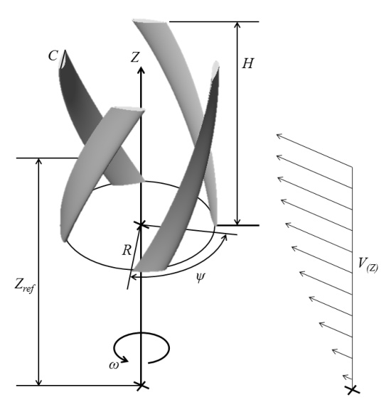
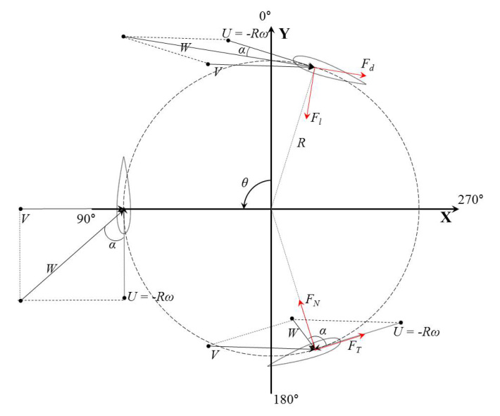
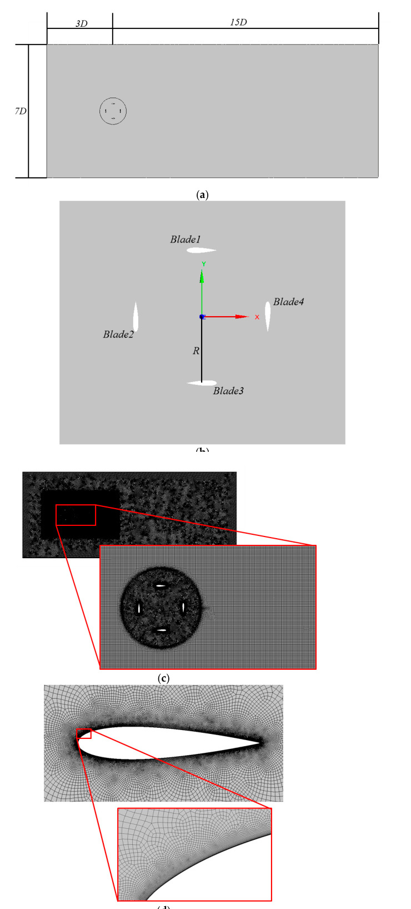
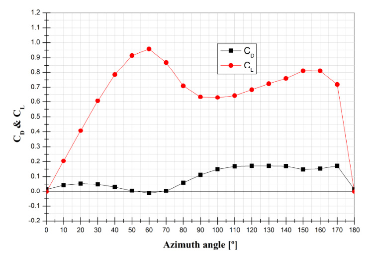
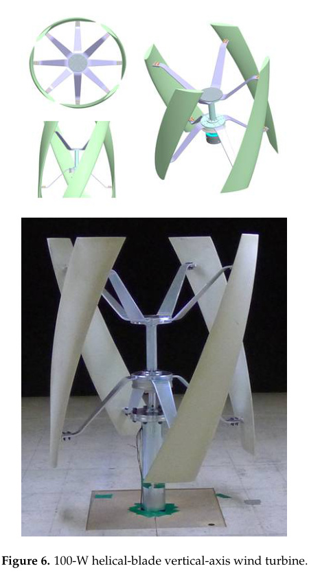
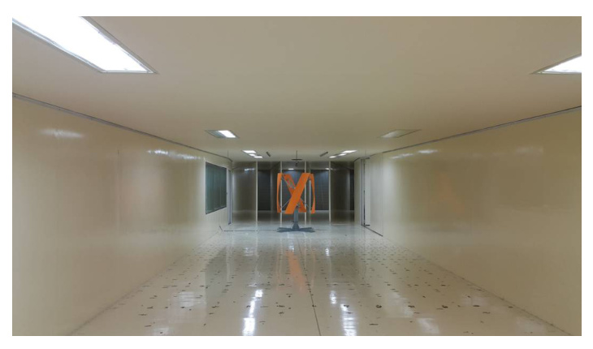
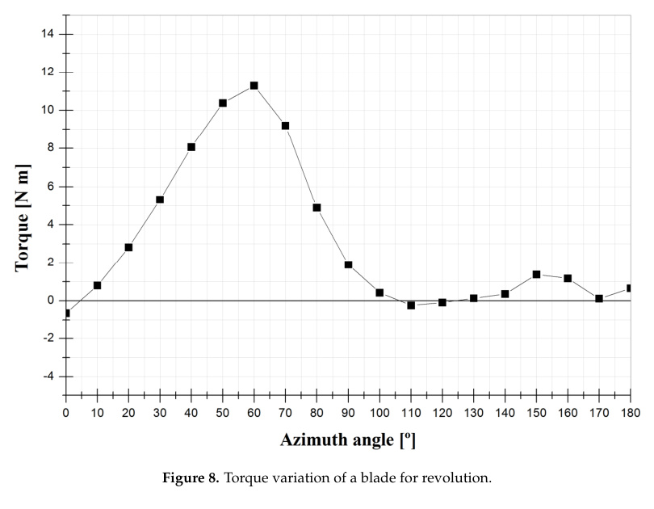

Design, Fabrication, and Performance Test of a 100-W Helical-Blade Vertical-Axis Wind Turbine at Low Tip-Speed Ratio

Dowon Han 1, Young Gun Heo 1,2, Nak Joon Choi 3, Sang Hyun Nam 1, Kyoung Ho Choi 2 and Kyung Chun Kim 1,* ID

1 School of Mechanical Engineering, Pusan National University, Busan 46241, Korea; dowon.han@doosan.com (D.H.); ygheo@dnde.co.kr (Y.G.H.); shnam@kdwin.com (S.H.N.) 2 DNDE Co., Busan 48059, Korea; khchoi@dnde.co.kr 3 ICT Co., Busan 48059, Korea; ict.njchoi@gmail.com * Correspondence: kckim@pusan.ac.kr; Tel.: +82-51-510-2324 Received: 6 May 2018; Accepted: 7 June 2018; Published: 11 June 2018

### Abstract: 
A 100-W helical-blade vertical-axis wind turbine was designed, manufactured, and tested in a wind tunnel. A relatively low tip-speed ratio of 1.1 was targeted for usage in an urban environment at a rated wind speed of 9 m/s and a rotational speed of 170 rpm. The basic dimensions were determined through a momentum-based design method according to the IEC 61400-2 protocol. The power output was estimated by a mathematical model that takes into account the aerodynamic performance of the NACA0018 blade shape. The lift and drag of the blade with respect to the angle of attack during rotation were calculated using 2D computational fluid dynamics (CFD) simulation to take into account stall region. The average power output calculated by the model was 108.34 W, which satisfies the target output of 100 W. The manufactured wind turbine was tested in a large closed-circuit wind tunnel, and the power outputs were measured for given wind speeds. At the design condition, the measured power output was 114.7 W, which is 5.9% higher than that of the mathematical model. This result validates the proposed design method and power estimation by the mathematical model.

Keywords: vertical axis wind turbine; helical blade; low tip-speed ratio; design and fabrication; wind tunnel test

## 1. Introduction

The consumption of fossil fuels has increased, resulting in high CO2 emissions and serious climate change. Research on renewable energy is actively under way to solve these environmental problems and in anticipation of the depletion of fossil fuels [1]. Wind energy is an environmentally friendly renewable energy source that does not cause environmental pollution, and its use is rapidly spreading around the world [2]. From the Kyoto Protocol in 1997 to the Paris Climate Convention in 2015, more countries are becoming concerned with climate change due to industrialization. To solve this problem, specific goals have been set, and wind power generation is regarded as an optimal power generation system. Wind power suppresses CO2 emissions by 828 g/kWh compared to coal power generation. In wind power generation, the emission of pollutants such as carbon dioxide and methane is 1/50 to 1/100 that of other energy sources, assuming that the wind speed is more than 8 m/s [3]. Research on wind power generation has therefore been actively pursued. At first, research on middle-size and large horizontal wind turbine generators was the main focus. However, due to factors affecting the environment such as noise, such wind turbines are difficult to install near residences and

have negative effects on the ecosystem, such as the movement of birds [4]. In contrast, small wind turbines can be installed near residential areas adjacent to power loads, and relevant research has been conducted [5-7]. A wind turbine generator can have a vertical or horizontal rotation axis. A vertical-axis wind power generator is advantageous for installation in city centers because it is not affected by the direction of the wind as much as a horizontal-axis wind power generator. It is easy to maintain because it does not need complicated structure such as yawing devices [8,9]. In the case of horizontal-axis wind turbines, the angle of attack due to the rotation of the wind turbine is constant. Many studies have been conducted on the prediction of the blades' aerodynamic characteristics, and many proprietary technologies have been established [10-13]. However, in the case of vertical-axis wind turbines, the angle of attack due to the rotation of the wind turbine changes continuously. Therefore, it is essential to develop an output verification process for a vertical-axis wind turbine. The most obvious method of verification is experimentation. However, due to spatial limitations, this method is limited to very small wind turbines. Mathematical models have been studied for various output predictions used in the design of horizontal-axis wind turbines, but they do not take into account the pitch angle of the vertical blades or the location of the strut or only partial studies have been done. Darrieus proposed the concept of a vertical-axis wind turbine in 1931 [14]. The first simplified approach is the single-stream-tube numerical model proposed by Templin [15]. The characteristics of the airfoil were calculated using blade element theory [15]. The output of the whole rotor is the same as the performance of a single blade with the chord length of the entire rotor blades. This approach allows us to predict the performance of the rotor in terms of the average torque per revolution of the rotor. Strickland extended multiple single-stream-tube models to reflect small stream tubes that preserve momentum and blade element theory [16]. The performance was determined by considering the local Reynolds number rather than the average, as proposed by Templin. Paraschivoiu proposed a double multiple-stream-tube model (DMST) [17]. The model is divided into the upstream region of the rotor between 0 and 180 degreesand the downstream region after 180 degreesfor each stream tube. DMST can reasonably predict the performance of a vertical-axis wind turbine with a small solidity and a small chord length compared to the rotor radius. Islam et al. compared and analyzed three mechanical models to design a Darrieus wind turbine with straight blades and predict the performance. The DMST model, free vortex model, and cascade model were compared [18]. Sutherland et al. proposed a stream-tube model and a vortex model that can analyze the aerodynamic response of a vertical-axis wind turbine using a mathematical model [19]. Wang et al. applied a 2D vortex panel model (VPM2D) to a straight-blade vertical-axis wind turbine, but this model could not reflect dynamic stall [20]. Brusca et al. analyzed the relationship between the aspect ratio of a vertical-axis wind turbine with straight blades using a calculation code based on a multiple-stream-tube model [21]. They concluded that a low aspect ratio has some advantages over a high aspect ratio and emphasized that the power factor was affected by the solidity and Reynolds number of the rotor. Field tests or wind tunnel tests have also been conducted to verify the performance of wind turbines. Sheldahl conducted a field test on a Darrieus-type vertical-axis wind turbine with a NACA 0012 airfoil and compared it with the results of an ideal wind tunnel test [22]. Bedon et al. reported field test results for a 1-m-diameter helical blade with a NACA 0018 airfoil [23]. Recently, Cheng et al. performed a 2D flow field simulation of a helical VAWT with four blades by means of a large eddy simulation (LES). They showed that the variation of angle of attack (AOA) and blade-wake interaction under different tip speed ratio conditions are the two main reasons for the power output of the helical VAWT [24]. In this study, a wind turbine was designed based on a lift-type vertical-axis wind turbine. The initial design output is 100 W, and the target tip speed ratio is 1.1, which is smaller than the ratio of 4-6 of a conventional vertical-axis wind turbines. For the conventional tip speed ratio, the maximum and minimum angles of attack are reduced. Therefore, the angle of attack does not reach the stall region, so that the lift and drag coefficients can be easily predicted and the conventional DMST model

can be used. However, our target VAWT is designed for urban use, and it has very low tip-speed ratio to reduce noise. At the low tip speed ratio, the angle of attack is subjected to the stall region. To take into account the stall region, the lift and drag coefficient at the corresponding angle of attack were calculated using 2D CFD method. As a result, the predicted power output was confirmed with a good agreement with the experimental data. Without any high-fidelity approach such as 3D CFD design, our DMST model can be applied to design VAWT at a low tip-speed ratio including the stall region. Helical blades were selected for low noise and low output fluctuation. Unlike a horizontal-axis wind turbine, it is difficult to design the size of a vertical-axis wind turbine with a target output because of the constant change of the angle of attack of the airfoil due to the rotation of the rotor. The design formula does not reflect the aerodynamic characteristics of the blade airfoil, so separate output verification is required. The design output of vertical-axis wind turbine blades was analyzed by a mathematical model. An actual rotor was fabricated, and a wind tunnel test was performed to obtain the output curve at different wind speeds. The power output at the design wind speed and the design rotating speed was confirmed by experiments.

## 2. Design of 100-W Helical Blade Vertical-Axis Wind Turbine

In the case of a horizontal-axis wind turbine, a large number of devices are required, such as a yawing device and a pitching device. While the generation efficiency is relatively high, the blade shape is complicated. There is also a disadvantage in that the wind direction is limited. In the case of a vertical-axis wind turbine, the structure is simple, and it is advantageous for installation in a city center because there is no restriction of the wind direction [8]. Typical blade types of vertical-axis wind turbines are Darrieus, gyro-mill, Savonius, and helical blades. The helical type is advantageous in that the fluctuation range of the output is smaller than that of the conventional Darrieus or gyro-mill blades, and the self-starting performance is better. It also has less mechanical load and less noise than a Savonius rotor, which is a drag-type rotor. Equation (1) represents the power of the wind flowing into the wind turbine rotor [25].

Figure 1. Basic design parameters of the vertical wind turbine.

P = 1

2ρAωV3

(1) Equation (2) is the mechanical power output generated by the rotation of the wind turbine rotor.

P = Tω

(2) The ratio of the power converted from the rotor power to the wind power flowing is called the power coefficient, which is a concept of aerodynamic energy conversion efficiency. Theoretically, the maximum value of the power coefficient is 0.593 in a horizontal axis wind turbine, which is known as the Betz limit. The Betz limit is derived from actuator disk momentum theory and is the theoretical maximum assuming that the flow is steady-state, inviscid, and irrotational [26]. The Darrieus turbine is a typical lift-type vertical-axis wind turbine and has a maximum power coefficient of about 0.4 at a tip speed ratio of 5 [9]. Equation (3) shows the power output (P) of the wind turbine considering the power coefficient (CP) and power transmission efficiency (η). Aω is the rotor swept area (see Equation (5)).

P = 1

2ρAωV3ηCP

(3) The tip speed ratio (λ) is closely related to the power coefficient. The tip speed ratio is defined as the ratio of the blade tip speed and the wind speed at which the blade tip moves with rotation, as shown in Equation (4).

λ = Rω

V

(4) All wind turbine rotors have an optimum tip speed ratio with maximum power. The optimal ratio is related to the change of the incoming wind speed. The rotor swept area (Aω) is determined by the radius and height of the wind turbine.

Aω = 2RH

(5) The wind swept area should consider the height of the rotor (H) and the aspect ratio with respect to the radius (R). The longer the rotor radius, the higher the generated torque, but the longer the strut length, the lower the structural stability. However, when the rotor height is greater, the generated torque is lower, and the rotational speed of the rotor should be increased to obtain the same power output. The aspect ratio (AR) can be expressed as

AR = H

2R →H = AR × 2R

(6) Solidity (σ) is an important variable that determines the performance of wind turbines. Solidity is defined as the ratio of the total projected area (NC) of the rotor blade to the rotational area of the wind turbine rotor. The projected area is the projection in the vertical section of the rotating shaft and can be expressed as

σ = NC

2πR

(7) The blade chord length (C) can be calculated using the solidity. The chord length is the length of the airfoil and is an important design variable because the generated torque changes according to the chord length. Urban wind power generators should operate at low speed with low noise. A Savonius wind turbine can rotate with a tip speed ratio of less than 1, but the vibration and noise are severe due to the characteristics of a drag-type rotor. Among the lift type vertical-axis wind turbines, helical-blade

wind turbines have a narrower range of output fluctuation compared to Darrieus and gyro-mill wind turbines, and their efficiency is higher due to the larger wind swept area. The purpose of this study is to design a low-speed vertical-axis wind turbine blade with a tip speed ratio of 1.1 at a rated wind speed of 9 m/s. We designed the wind turbine with the designer-defined Class S after modifying Class 1 identified in IEC 61400-2: "Design requirements for small wind turbines." Figure 2 shows a picture of the basic parameters of the small wind turbine system of IEC 61400-2 [27]. The selected rated wind speed was 9 m/s, which is lower than the rated wind speed corresponding to Class 1. The height of the rotor hub is 8 m. Wind shear is considered, and the velocity profile (V(Z)) is shown in Equation (8).

Figure 2. Force and velocities acting on the vertical wind turbine for various azimuth angles.

V(Z) = Vre f  Z/Zre f a (8) The wind shear power index (a) can be varied according to the surface roughness of the terrain [28]. In this study, 0.23 was selected for the condition of a forest or a small number of buildings. Table 1 summarizes the design parameters applied in this study. The maximum wind speed, turbulence intensity, and dimensionless slope are the same as Class 1. The target output is 100 W, and the air density is 1.225 kg/m3, as specified in IEC 61400-2. The power transmission efficiency was assumed to be 95%, and the average power coefficient turbine was set as 0.15. The design output, air density, design wind speed, and efficiency are defined in Equation (3).

Table 1. Basic parameters of the vertical wind turbine.

| Item | Value |
| --- | --- |
| SWT Class | S |
| Vref [m/s] | 50 |
| Vave [m/s] | 9 |
| I15 [-] | 0.18 |
| a [-] | 2 |

Equation (9) is used for calculating the radius of the wind turbine rotor through the relationship between the wind-swept area and the aspect ratio. A radius of 0.55 m and height of 1.43 m were thus chosen.

R =

r

Aω

4 × AR

(9) A tip speed ratio of 1.1 was chosen. In the case of a Darrieus-type wind turbine, the maximum power coefficient can be achieved at tip speed ratios between 4 and 6. At the designed wind speed of 9 m/s with a rotor radius of 0.55 m, the rotational speed is between 630 and 950 rpm, which is inadequate for use in a city center. A rotational speed of 170 rpm was derived by applying the radius, design wind speed, and tip speed ratio in Equation (4). The number of blades was chosen as 4, and the solidity was set as 0.3, which was substituted into Equation (7) to determine the chord length of 0.25 m. Table 2 shows the specifications of the helical rotor blade. Although the radius and height of the vertical-axis wind turbine rotor can be derived, the output relationship of the blade airfoil, number of blades, and shape of the three-dimensional blade is not reflected in the design formula. Further research on the flow characteristics is required.

Table 2. Blade specifications.

| Item | Description |
| --- | --- |
| Rotor type | Helical |
| Rated power output | 100 W |
| Rated wind speed | 9 m/s |
| Power coefficient | 0.15 |
| Swept area | 1.57 m^2 |
| Aspect ratio | 1.3 |
| Rotor radius | 0.55 m |
| Rotor height | 1.43 m |
| Rotational speed | 170 rpm |
| Solidity | 0.3 |
| Chord length | 0.25 m |
| Number of blades | 4 |
| Airfoil | NACA0018 |

The design equation for the vertical-axis wind turbine does not reflect the factors for the blade airfoil, so an additional prediction of the power output is needed. In this study, the aerodynamic power of the wind turbine rotor was investigated by applying a NACA 0018 airfoil and a mathematical model using the lift and drag forces of the airfoil according to the angle of attack. Unlike the blade of a horizontal-axis wind turbine, which has a fixed angle of attack, the angle of attack varies for a vertical-axis wind turbine depending on the rotation angle of the rotor [29]. Figure 2 presents the tip velocity vector and the lift and the drag vectors generated by the rotation of the turbine blade. The angle of attack changes with the blade tip velocity vector and the influx wind velocity vector. The vector sum (W) of the tip velocity vector and incoming wind velocity vector (V) is calculated by Equation (10). The maximum value occurs at θ = 0 degrees, and the minimum value occurs at θ = 180 degrees.

W =

r

V2

hλ -sin2 θ i

= V

p

1 + 2λ cos θ + λ2

(10) The angle of attack (α) is the angle between the vector sum and the direction of the chord length. As the vector sum changes, the angle of attack has a positive value in the upstream region of the rotor and a negative value in the downstream region. The angle of attack can be expressed as Equation (11).

α = tan-1

 sin θ cos θ + λ  (11)

As shown in the equation, the dominant variable that affects the angle of attack is the tip speed ratio. Figure 3 shows the angle of attack as the blade rotates according to the tip speed ratio. The larger the tip speed ratio, the smaller the range of the angle of attack the airfoil receives during rotation. The larger the blade tip velocity vector is, the larger the tip speed ratio is. This occurs because the vector sum direction approaches the direction of the blade's forward velocity vector, and the angle of attack becomes smaller. The range of the angle of attack of the airfoil is about ±66.5 degreesin one rotation of the rotor.

Figure 3. Angle of attack variation in a blade revolution for different tip speed ratios.

Table 3 shows the angle of attack at rotor rotation angles of 0 degreesto 180 degreeswhen the tip speed ratio is 1.1.

Table 3. Angle of attack in a blade revolution (λ = 1.1).

| Azimuth angle [degrees] | AOA [degrees] |
| --- | --- |
| 0 | 0.000 |
| 10 | 4.789 |
| 20 | 9.575 |
| 30 | 14.354 |
| 40 | 19.122 |
| 50 | 23.875 |
| 60 | 28.607 |
| 70 | 33.311 |
| 80 | 37.976 |
| 90 | 42.589 |
| 100 | 47.127 |
| 110 | 51.558 |
| 120 | 55.828 |
| 130 | 59.840 |
| 140 | 63.400 |
| 150 | 66.069 |
| 160 | 66.568 |
| 170 | 59.298 |
| 180 | 0.000 |

The lift and drag coefficients (CL, CD) of the NACA 0018 in Table 3 are defined in Equations (12) and (13), respectively [30].

CL =

FL

1

2ρcHW2

(12)

CD =

FD

1

2ρcHW2

(13)

In these equations, the lift (FL) and drag (FD) are obtained through 2D CFD analysis, which was performed to investigate the aerodynamic performance of blades of the VAWT. Figure 4 shows the two-dimensional flow analysis domain and the position of the blade. The flow field was expanded to about 15D by the width of 7D based on the rotor diameter (D), 3D from the inlet of the flow field to the center of the rotor, and around the center of the rotor to the outlet. The grid sensitivity analysis was performed before the two-dimensional flow analysis. The selected grid system has 1,162,500 nodes, 575,142 elements, and the maximum Y+ value is 2.86. A denser grid system is built around the rotor including a part of the upstream region of the rotor, so that the flow characteristics generated around the blade can be well described. On the surface of the blade, a prism grid was densely arranged in order to predict the velocity gradient and flow separation due to the viscous effect of the fluid.

Figure 4. 2D geometry of vertical wind turbine and mesh system; (a) 2D flow field geometry including four blades, (b) blades position 2D vertical wind turbine, (c) mesh system of 2D flow field, and (d) mesh system of near the Blade 1.

Table 4 summarizes the boundary conditions applied to 2D CFD analysis. The inlet was set to 9 m/s, which is the design wind speed, and the outlet conditions were pressure boundary conditions. The area around the rotor is divided into separate areas, and the rotor area is given a rotation condition and the rest area is given a stop condition. The rotation speed was 170 rpm and the surface of the blade was subjected to the adhesive condition. The analysis was carried out by transient analysis and the time interval was given a time corresponding to the rotor rotation angle of 1 degrees. For the inlet fluid, air with a density of 1.225 kg/m3 at 1 atm and 25 degrees C specified in IEC 61400-2 was applied and the turbulence intensity was 18%. The URANS analysis was carried out as a transient analysis. The time interval was about 9.8 × 10-4 s corresponding to 1 degrees of rotor rotation. The turbulence model adopted the same SST turbulence model.

Table 4. Boundary conditions for 2D CFD analysis.

| Item | Description |
| --- | --- |
| Inlet | 9 m/s |
| Outlet | Atmospheric pressure (opening condition) |
| Side | Free-slip condition |
| Blade surface | No-slip condition |
| Rotational speed | 170 rpm |
| Rotational direction | Counter-clockwise |

Figure 5. Lift and drag coefficient variation in a blade azimuth angle from 0 degrees to 180 degrees (NACA0018) calculated by 2D CFD simulation.

The normal coefficient (CN) and the tangential coefficient (CT) are generated from the blade by using the lift coefficient and the drag coefficient and calculated using Equations (14) and (15).

CN = CL cos α + CD sin α

(14)

CT = CL sin α -CD cos α

(15) The normal force (FN) and tangential force (FT) of the blade can be calculated through the normal and tangential coefficients using Equations (16) and (17).

FN(θ) = 1

2ρcHW2CN

(16)

FT(θ) = 1

2ρcHW2CT

(17) The power output can finally be calculated using the blade torque (Equation (18)) and the angular velocity using the tangential force:

T(θ) = 1

2ρcHW2CTR

(18)

The instantaneous and average power output of the designed rotor are given by Equations (19) and (20).

P(θ) = T(θ) × ω

(19)

Pave = N

2 π

Z π

0

P(θ)dθ

(20)

## 3. Wind Tunnel Test

A 100-W helical vertical-axis wind turbine rotor was fabricated based on the design dimensions in Table 2. The rotors, hubs, and struts con were designed and are structurally stable according to IEC 61400-2. The axis of rotation connects the upper and lower hubs and is designed to withstand bending caused by wind. A carbon steel pipe (50A × Sch. 40) with an outer diameter of 60.5 mm was used for pressure piping. The strut is an important part for connecting a blade to the hub. It is one of the components that receives the largest load. The strut bears the weight of the rotor and the centrifugal force from the rotation of the blades. The design was made while considering the position of the blade and the position of the hub. The hub is a part that fixes the rotating shaft and the strut. When the rotor is rotated, the strut is designed so that it does not move in the rotating direction. Finally, helical blades were manufactured using FRP material, which has excellent formability. All the parts were designed for manufacturability. Figure 6 shows the manufactured turbine.

Figure 6. 100-W helical-blade vertical-axis wind turbine.

The wind tunnel test was carried out at the large closed-loop wind tunnel center at Chonbuk National University in Korea. The test section dimensions are 5 m (W) × 2.5 m (H) × 20 m (L), and the wind speed can be controlled up to 30 m/s. A honeycomb structure and a square mesh are installed inside the tunnel so that the turbulence intensity of the inflow fluid can be less than 1.5% and the average flow velocity distribution can be less than ±2%. Figure 7 shows a picture of the test section with the manufactured wind turbine installed.

Figure 7. Wind tunnel test section.

The wind speed is controlled through a fan control panel and confirmed through an anemometer installed on the ceiling of the wind tunnel test section. The test was performed after the wind speed was stabilized according to the anemometer. The electric power from the wind turbine generator was measured by a power sink. The voltage and current of electricity from the generator were measured while the power sink absorbs the generated power. In addition, the three-phase frequency, voltage, and current of the generator were measured using an oscilloscope. The rotational speed of the wind turbine can be estimated through the three-phase frequency (fe) of the generator,

fe = NmNP

120

→Nm = 120fe

NP

(21) where Np is the number of generator poles. The wind tunnel test is divided into the starting wind speed measurement and the power generation measurement. The starting wind speed is the wind speed at which the vertical-axis wind turbine is moving from standstill and is measured without electrical resistance. The starting wind speed is measured with a gradual increase of the wind speed with intervals of 0.5 m/s and kept for 5 min for stabilization at each wind speed. At each wind speed, the voltage, current, and three-phase frequency generated by the generator of the wind turbine were measured. Using a multi-meter and an oscilloscope, the voltage and current curves over time were all measured, and the output as calculated. The measured frequency was used to obtain the rotational speed of the wind turbine from Equation (21). The test was conducted with increases in wind speed of 1 m/s from the starting wind speed. In each section of wind speed, the test was performed while changing the duty ratio of the controller. The output range including the maximum power point at a given wind speed was examined. When all conditions were changed, the results were recorded after obtaining a stabilized state. Table 5 provides a brief description of the test conditions.

Table 5. Scenario for wind tunnel test.

| Test condition | Wind speed [m/s] | Smart control meter condition |
| --- | --- | --- |
| Starting wind speed test | 0~ | Duty ratio = 0 |
| Max. power output test | 5 | Duty ratio variation |
| Max. power output test | 6 | Duty ratio variation |
| Max. power output test | 7 | Duty ratio variation |
| Max. power output test | 8 | Duty ratio variation |
| Max. power output test | 9 | Duty ratio variation |
| Max. power output test | 10 | Duty ratio variation |
| Max. power output test | 11 | Duty ratio variation |

## 4. Results and Discussion

During the rotation of the blades, the torque generated was obtained using Equation (18), as shown in Figure 8. The maximum torque occurred between rotation angles of 50 and 70 degrees. After angle of 70 degrees, the angle of attack reaches stall region followed by rapidly decrease of torque. Over 90 degreesof angle, which means backward flow, torque value is almost zero, and the blade does not create any lift force. The final output value calculated from Equations (19) and (20) is 108.34 W, and the power coefficient is 0.154, which shows a discrepancy of 8.34% from the design value but is higher than the target output.

Figure 8. Torque variation of a blade for revolution.

All wind turbine rotors have maximum output points at each wind speed, and the maximum power point tracking (MPPT) method is used to control the maximum wind power at each wind speed. This method minimizes the performance loss of the wind turbine [31]. The maximum output point rises steeply as the wind speed increases because the output increases in proportion to the cube of the wind speed, as shown in Equation (1). Due to structural stability, the test was not performed at operating conditions above 260 rpm. The constructed VAWT is designed to have 100 W power output at a wind speed of 9 m/s at a rotor speed of 170 rpm (TSR = 1.1). Since the experiment has been performed for the validation of power output at the design point, we have generated graphs with power outputs up to 260 rpm.

Figure 9. Graph of power output according to wind velocity obtained from wind tunnel test (symbols: test results; lines: fitting curve).

Table 6 summarizes the maximum power output and the revolutions per minute at each wind speed. The power output occurs when the rotational speed is controlled to maintain the rated revolutions of 170 rpm. The output control and speed control are functions that must be applied in accordance with IEC 61400-12-1: "Power performance measurements of electricity producing wind turbines." They are applied in various ways to reflect the safe operation of wind turbine generators [32-35].

Table 6. Power output and power coefficient according to wind velocity obtained from wind tunnel test.

| Wind velocity [m/s] | Rotation speed [rpm] | Power output [W] | Cp | Remark |
| --- | --- | --- | --- | --- |
| ~4 | 25.6 | 0.05 | 0.001 | starting velocity 3.5 m/s |
| 5 | 111 | 10.44 | 0.087 | - |
| 6 | 131 | 26.30 | 0.127 | - |
| 7 | 161 | 55.74 | 0.169 | - |
| 8 | 182 | 97.92 | 0.199 | 94.7 W (Cp = 0.192) at 170 rpm |
| 9 | 215 | 160.2 | 0.228 | 114.7 W (Cp = 0.16) at 170 rpm |
| 10 | 255 | 251.9 | 0.262 | 135.8 W (Cp = 0.14) at 171 rpm |
| 11 | 258 | 304.4 | 0.238 | 156.2 W (Cp = 0.12) at 170 rpm |

The vertical-axis wind turbine starts at 3.5 m/s, and the power output increases as the wind speed increases. From 8 m/s, the maximum output is generated while exceeding the design rotation speed of 170 rpm. The maximum output at the design wind speed of 9 m/s is 160.2 W, and the rotation speed is 215 rpm. When the load is controlled at 170 rpm, the output is 114.7 W, which is higher than the target output. The design power coefficient of the wind turbine is 0.15, and the output is higher than the designed power coefficient beginning at 7 m/s. When the wind turbine is operated at 9 m/s and 170 rpm, the power coefficient is 0.163, which is larger than the design value of 0.15. Table 7 compares the output power of the wind turbine predicted by the mathematical model with the measured power output from the wind tunnel experiment. At the design condition, the measured power output was 114.7 W, which is 5.9% higher than that of the mathematical model. This result validates the proposed design method and power estimation by the mathematical model can be useful to design a low speed VAWT with a reasonable accuracy. The higher power output of the wind tunnel test could be a result of the confinement effect due to wind tunnel walls.

Table 7. Power output and power coefficient obtained from the mathematical model and wind tunnel test.

| Method | Power [W] | Cp |
| --- | --- | --- |
| Mathematical model | 108.34 | 0.154 |
| Wind tunnel test | 114.7 | 0.163 |

The size of the blade was determined through Equations (1)-(9), but it is impossible to design the change of the airfoil and the twist angle of the blade. In the power output estimation process through the mathematical model, the output can be predicted by reflecting the lift and drag of the airfoil [36]. However, it is impossible to consider the output change due to the wake occurring in the range after 180 degrees of azimuth. Further studies should be done to investigate the flow structures associated with the rotating helical blade.

## 5. Conclusions

The basic design formula yielded the wind turbine rotor dimensions with an aerodynamic power of 100 W at a rated wind speed of 9 m/s and a tip speed ratio of 1.1. The torque due to rotor rotation can be calculated by applying the lift and drag forces derived from the 2D CFD results. The average output was calculated as 108.34 W, and the target output of 100 W was satisfied. The designed turbine was fabricated, and a wind tunnel test was performed. The output variation according to the rotor speed was measured at each wind speed. When the incoming wind speed is 9 m/s at the rotational speed of 170 rpm, the measured power output was 114.7 W, and the design method was validated. However, the design method cannot predict the power output variation due to the number of blades, the twist angle of the helical blade, the pitch angle, and the position of the strut. Further research should be carried out for different geometry details of the helical rotor.

Author Contributions: D.H. designed, manufactured, and tested the VAWT and wrote the paper. Y.G.H.

performed 2D CFD simulation and analyzed the data. N.J.C. provided idea of the project, and S.H.N. carried out wind tunnel experiments. K.H.C. supervised manufacture of VAWT and K.C.K. supervised the project and the paper works.

Acknowledgments: This work was supported by the National Research Foundation of Korea (NRF) grant funded

by the Korean government (MSIT) through the Global Core Research Center for Ships and Offshore Plants (GCRC-SOP, No. 2011-0030013).

Conflicts of Interest: The authors declare no conflict of interest.

References

1.

Tong, K.C. Technical and economic aspects of a floating offshore wind farm. J. Wind Eng Ind. Aerodyn. 1998, 74-76, 399-410. [CrossRef]

2.

Ahmed Shata, A.S.; Hanitsch, R. Evaluation of wind energy potential and electricity generation on the coast of Mediterranean Sea in Egypt. Renew. Energy 2006, 31, 1183-1202. [CrossRef]

3.

European Wind Energy Association. Wind Energy and EU Climate Policy; EWEA: Brussels, Belgium, 2011.

4.

Greening, B.; Azapagic, A. Environmental impacts of micro-wind turbines and their potential to contribute to UK climate change target. Energy 2013, 59, 454-466. [CrossRef]

5.

Syngellakis, K.; Clement, P.; Cace, J. Administrative and Planning Issues for Small Wind Turbines in Urban Areas; European Commission: Brussels, Belgium, 2006.

6.

Ji, H.S.; Qiang, L.; Beak, J.H.; Mieremet, R.; Kim, K.C. Effect of wind direction on the near wake structures of an Archimedes spiral wind turbine blade. J. Vis. 2016, 19, 653-665. [CrossRef]

7.

Kim, K.C.; Ji, H.S.; Kim, Y.K.; Lu, Q.; Beak, J.H.; Mieremet, R. Experimental and numerical study of the aerodynamic characteristics of an Archimedes spiral wind turbine. Energies 2014, 7, 7893-7914. [CrossRef]

8.

Scheurish, F.; Fletcher, T.M.; Brown, R.E. The Influence of Blade Curvature and Helical Blade Twist on the Performance of a Vertical-Axis Wind Turbine. In Proceedings of the 48th AIAA Aerospace Sciences Meeting Including the New Horizons Forum and Aerospace Exposition, Orlando, FL, USA, 4-7 January 2010.

9.

Hau, E. Wind turbines, Fundamentals, Technologies, Application, Economics, 2nd ed.; Springer: Berlin, Germany, 2006.

10.

Manwell, J.F.; McGowan, J.G.; Rogers, A.L. Wind Energy Explained—Theory, Design and Application; John Wiley & Sons Ltd.: Hoboken, NJ, USA, 2002.

11.

Choi, N.J.; Nam, S.H.; Jeong, J.H.; Kim, K.C. Numerical study on the horizontal axis turbines arrangement in a wind farm: Effect of separation distance. J. Wind Eng. Ind. Aerodyn. 2013, 117, 11-17. [CrossRef]

12.

Choi, N.J.; Nam, S.H.; Jeong, J.H.; Kim, K.C. CFD study of aerodynamic power output changes with inter-turbine spacing variation for a 6 MW offshore wind farm. Energies 2014, 17, 7483-7498. [CrossRef]

13.

Heo, Y.G.; Choi, N.J.; Choi, K.H.; Ji, H.S.; Kim, K.C. CFD study on aerodynamic power output of a 110 kW building augmented wind turbine. Energy Build. 2016, 129, 162-173. [CrossRef]

14.

Darrieus, G. Turbine Having its Rotating Shaft Transvers to the Flow of the Current. U.S. Patent 1835018, 8 December 1931.

15.

Templin, R.J. Aerodynamic Performance Theory for the NRC Vertical-Axis Wind Turbine, Laboratory Technical Report; LTR-LA-160; National Research Council, Canada: Ottawa, ON, Canada, 1974.

16.

Strickland, J.H. The Darrieus Turbine: A Performance Prediction Model Using Multiple Streamtubes; Laboratory Technical Report; SAND74-0431; Sandia National Laboratory: Livermore, CA, USA, 1975.

17.

Paraschivoiu, I. Double-Multiple Streamtube Model for Studying Vertical-Axis Wind Turbines. J. Propuls. Power 1988, 4, 370-377. [CrossRef]

18.

Islam, M.; Ting, D.S.-K.; Fartaj, A. Aerodynamic models for Darrieus-type straight-bladed vertical asix wind turbines. Renew. Sus. Energy Rev. 2008, 12, 1087-1109. [CrossRef]

19.

Sutherland, H.J.; Berg, D.E.; Ashwill, T.D. A Retrospective of VAWT Technology, Sandia Report; SAND2012-0304; Sandia National Laboratories: Livermore, CA, USA, 2012.

20.

Wang, L.B.; Zhang, L.; Zeng, N.D. A potential flow 2-D vortex panel model: Applications to vertical axis straight blade tidal turbine. Energy Conv. Manag. 2007, 48, 454-461. [CrossRef]

21.

Brusca, S.; Lanzafame, R.; Messina, M. Design of a vertical-axis wind turbine: How the aspect ratio affects the turbine's performance. Int. J. Energy Environ. Eng. 2014, 5, 330-340. [CrossRef]

22.

Sheldahl, R.E. Comparison of Field and Wind tunnel Darrieus Wind Turbine Data. J. Energy 1981, 5, 254-256. [CrossRef]

23.

Bedon, G.; Castelli, M.R.; Benini, R. Experimental Tests of a Vertical-Axis Wind Turbine with Twisted Blades. ICMIME 2013, 2013, 384-387.

24.

Cheng, Q.; Liu, X.; Ji, H.S.; Kim, K.C.; Yang, B. Aerodynamic analysis of a helical vertical axis wind turbine. Energies 2017, 10, 575. [CrossRef]

25.

Burton, T.; Sharpe, D.; Jenkins, N.; Bossanyi, E. Wind Energy Handbook; John Wiley & Sons, Ltd.: West Sussex, UK, 2001.

26.

Tong, W. Wind Power Generation and Wind Turbine Design; WIT Press: Ashurst, UK, 2010.

27.

IEC 61400-2. Design Requirments for Small Wind Turbines, 2nd ed.; International Standard: Geneva, Switzerland, 2006.

28.

Ray, M.L.; Rogers, A.L.; McGowan, J.G. Analysis of wind shear models and trends in different terrain. In Proceedings of the American Wind Energy Association Windpower, Amherst, MA, USA, 29 January 2014.

29.

El Kasmi, A.; Masson, C. An extended k-ε model for turbulent flow through horizontal-axis wind turbines. J. Wind Eng. Ind. Aerodyn. 2008, 96, 103-122. [CrossRef]

30.

Eriksson, S.; Bernhoff, H.; Leijon, M. Evaluation of different turbine concepts for wind power. Renew. Sus. Energy Rev. 2008, 12, 1419-1434. [CrossRef]

31.

Abo-Khalil, A.G.; Lee, D.-C. MPPT Control of Wind Generation Systems Based on Estimated Wind Speed Using SVR. Ind. Electron. IEEE 2008, 55, 1489-1490. [CrossRef]

32.

IEC 61400-12-1. Wind Turbines: Power Performance Measurements of Electricity Producing Wind Turbines, 1st ed.; International Standard: Geneva, Switzerland, 2005.

33.

Chinchilla, M.; Arnaltes, S.; Burgos, J.C. Control of permanent-magnet generators applied to variable-speed wind-energy systems connected to the grid. Energy Conv. IEEE 2006, 21, 130-135. [CrossRef]

34.

Muljadi, E. Butterfield, Pitch-controlled variable-speed wind turbine generation. Ind. Appl. IEEE 2001, 37, 240-246. [CrossRef]

35.

Wang, Q.; Chang, L. An intelligent maximum power extraction algorithm for inverter-based variable speed wind turbine systems. Power Electron. IEEE 2004, 19, 1242-1249. [CrossRef]

36.

Karbasian, H.R.; Kim, K.C. Numerical investigations on flow structure and behavior of vortices in the dynamic stall of an oscillating pitching hydrofoil. Ocean Eng. 2016, 127, 200-211. [CrossRef] (CC BY) license (http://creativecommons.org/licenses/by/4.0/).
