use, sharing, adaptation, distribution and reproduction in any medium or format, as long as you give appropriate credit to the original
author(s) and the source, provide a link to the Creative Commons licence, and indicate if changes were made. The images or other third
party material in this article are included in the article’s Creative Commons licence, unless indicated otherwise in a credit line to the mate-
rial. If material is not included in the article’s Creative Commons licence and your intended use is not permitted by statutory regulation or
exceeds the permitted use, you will need to obtain permission directly from the copyright holder. To view a copy of this licence, visit http://
creativecommons.org/licenses/by/4.0/. The Creative Commons Public Domain Dedication waiver (http://creativecommons.org/publicdo-
main/zero/1.0/) applies to the data made available in this article, unless otherwise stated in a credit line to the data.
Enhancing vertical-axis wind turbine

self-starting with distinctive blade airfoil
designs
Muhammad Shaaban Abul-Ela1* , Mohamed ElFaisal ElRefaie2 and Ashraf Ibrahim Sayed3

Abstract

The starting issue of the Darrieus vertical-axis wind turbine is a crucial challenge,
particularly at low tip-speed ratios. This paper demonstrates a solution to overcome
the self-starting issue for this turbine type by studying the influence of various blade
airfoils in light of their kind and orientation. The proposed airfoils included symmetric
airfoils NACA0012 (reference model), E474, and S1048 in addition to cambered airfoils
S1210, NACA6712, DU-06-W-200, Clark Y, and FX 63-137. Numerical simulations based
on a finite-volume method software, ANSYS Fluent, were executed utilizing the SST-k-omega
as a turbulence model to solve unsteady Reynolds-averaged Navier-Stokes equations.
The numerical model was validated against available published experimental data.
The results indicated that the cambered-in-oriented NACA6712 airfoil was the most
effective at low tip-speed ratios (TSRs) ranging from 1.2 to 2.4. At a TSR of 2.0, its power
coefficient (Cp) increased by approximately 180% compared to the reference airfoil
at the same TSR. Furthermore, the E474 airfoil performed efficiently at mid-to-high
TSRs (2.0 to 3.3). Its peak power coefficient is enhanced by about 19.5% at TSR = 3.0
relative to the reference model at the same TSR. On the other hand, the S1210, Clark
Y, and FX63-137 cambered-in-oriented airfoils performed poorly at all TSR ranges (1.2
to 3.5). Nevertheless, the flipping of the camber of these airfoils outward provided
a significant improvement in the power coefficient and the torque coefficient relative
to the cambered-in-oriented ones. The Clark Y in the flipped orientation performs best
at all TSR ranges relative to other flipped airfoils. As a result, NACA6712 was the opti-
mum blade profile chosen for low TSRs, whereas E474 was suitable for mid-to-high TSR
zones.
Keywords: Vertical-axis wind turbine, Airfoil designs, Aerodynamic performance, Self-
starting, CFD, Cambered-out airfoils
Small-scale wind turbines could be utilized on building roofs, urban, and boats [1]. The
vertical-axis wind turbines, VAWTs, are suitable to be installed in low-wind speed areas
[2]. It can be classified into two main categories: a lift-type turbine such as the Darrieus
turbine and a drag-type turbine such as the Savonius turbine. The Darrieus wind turbine
type is a lift-type turbine since it depends on the lift, as a rotating driving force, which
muhammadshaaban92@gmail.
com; Muhammad.Shaaban@acu.
edu.eg
1 Mechanical Engineering
Department, Ahram Canadian
University, Giza 12451, Egypt
2 Mechanical Engineering
Department, Al-Azhar University,
Nasr City, Cairo 11884, Egypt
3 Mechanical Engineering
Department, Cairo University,
Giza 12613, Egypt

results from the wind air passing through the turbine blades [3]. One of the crucial chal-
lenges in vertical-axis wind turbines, VAWTs, is self-starting. This problem refers to the
difficulty of the turbine to produce sufficient torque to initialize the turbine rotation [4].
The aerodynamic characteristics of the Darrieus VAWT blade are the main reason for
the self-starting problem. This type of turbine depends on the lift-based airfoil profiles
that are responsible for yielding the power only as the TSR surpasses a certain value.
Additionally, at a low Reynolds number, some aerodynamic issues might arise, such as
laminar separation bubbles [5]. They are formed on the surface of the airfoil and result
in a decline in its performance, ultimately causing it to stall due to an abrupt drop in lift
and an increase in drag particularly for a Reynolds number below 50,000 [6]. Further-
more, at low TSRs, specifically below 2.0, insufficient or negative lift is generated, result-
ing in a blade aerodynamic stall that precludes the turbine from starting rotation from
rest. During low-speed running, the angle of attack changes dramatically, leading to a
reduction in the turbine torque produced [7, 8], and [9].
Several works of literature proposed various methods to mitigate the VAWT starting
issue, such as using cambered airfoils, higher blade solidity, and passive or active pitch
control mechanisms to boost the lift at low TSRs and consequently improve the turbine
self-starting [10].
Self-starting performance literature

Chavoshi et al. [11] investigated the use of plasma actuators1 to enhance the self-start-
ing performance of Darrieus VAWTs. The study found that plasma actuators increased
torque by 128% at low TSRs and by 260% at higher TSRs, reducing the self-starting time.
Y. Celik et al. [12] developed a computational fluid dynamics (CFD) start-up model
to investigate the self-starting behavior of H-type vertical-axis wind turbines (VAWTs)
after performing detailed sensitivity analyses. The model was validated using the self-
starting behavior of a well-known VAWT, and the aerodynamics of the start-up process
were analyzed. The outcomes concluded that for the critical region, TSR < 1, drag signifi-
cantly contributed to torque generation in the second and third quarters of the rotor rev-
olution (azimuthal positions between 100 and 253°). Moreover, increasing the turbine’s
inertia had minimal impact on the start-up performance or the final rotational speed.
However, decreasing turbine inertia increased instantaneous turbine power during start-
up after reaching the optimum TSR. Moreover, increasing the number of blades made
the turbine easier to start while potentially lowering the power coefficient.
T. Micha et al. [13] investigated a study to find the proper blade shape for a VAWT to
start on its own at a low Reynolds number. Two distinguished airfoil profiles are utilized
in this study: NACA 0012 and NACA 4415. The results revealed that, however, NACA
4415 was producing more lift because of its curvature; it was found that NACA 0012,
which is symmetrical, was better for self-starting the VAWT based on how much torque
it produces.
P. M. Kumar et al. [14] demonstrated a comprehensive review of enhancing the Dar-
rieus aerodynamic performance at low wind speed through various aspects such as the
1 Plasma actuators are a type of actuator currently being developed for active aerodynamic flow control.

airfoil characteristics, symmetric and cambered airfoils, blade solidity, blade thickness,
and J-shape blade. It was concluded that the cambered airfoils have better starting abil-
ity and delay the stall, but they result in a reduction in the power due to drag increas-
ing on the down half. Furthermore, the review showed that high solidity increases the
starting torque due to low centrifugal force and low rotation. However, the high solidity
causes high costs due to increasing the number of blades. Additionally, the performance
of a turbine operating at low Re can be enhanced by utilizing a thick blade profile, but it
results in increasing the profile drag at high Re besides increasing the noise. The J-shape
blade, Fig. 1, has excellent starting-up torque in addition to its capability to rotate at low
wind speeds. Nevertheless, the fatigue failure affects the J-shape blade performance at
high Re because of the high form drag. The review paper indicated that the operation of
the H-Darrieus VAWT at low wind speed or at low TSR is still a research interest.
Airfoil performance literature

The performance of a specified VAWT was investigated by Roy et al. [15] after studying
a variety of NACA and S-blade airfoil profiles regarding the blades’ number, blade aspect
ratio, and solidity. However, the pitch angle and the TSR effect were not considered.
T. Tahzib et al. [16] studied numerically a three-bladed H-Darrius wind turbine per-
formance using two different symmetric airfoils: NACA0018 and S1046. The analysis
focused on the effect of blade angle and tip-speed ratio. The results showed that the
S1046 with − 2° pitch angle and operating at tip-speed ratio = 4.0 was the better choice
for low and unstable wind speed areas.
Takahashi et al. [17] demonstrated a numerical simulation using direct numerical
simulation (DNS) that is based on the finite difference method in addition to an experi-
mental wind tunnel test by “wind lens” to study the performance of various airfoils for
straight-bladed vertical-axis wind turbines (SB-VAWT). For the DNS results, sym-
metrical airfoils are more efficient than unsymmetrical ones. Based on the wind tunnel,
NACA0024 has the best performance. The findings showed that the SB-VAWT with a
wind lens can achieve a power augmentation of more than two.
R. A. Ghazalla et al. [18] investigated the aerodynamic performance of conventional
NACA0015 and DU-06-W-200 airfoils, as well as nonconventional J-shaped blades,
utilizing a wind lens. Their findings revealed that J-shaped airfoils exhibited a superior
power coefficient compared to the NACA0015 and DU-06-W-200 airfoils.
Fig. 1 a Rotor J-profile airfoil. b J-profile airfoil geometry. c Installed turbine with J-profiled blade [14]
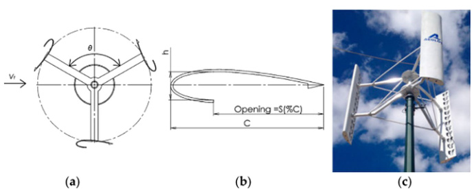

Hashem et al. [19] employed the S1046 airfoil and incorporated a wind lens to improve
the aerodynamic performance of VAWTs. However, the study did not include a com-
parison with the NACA series and overlooked certain parameters, such as varying tip-
speed ratios (TSR), solidity (sigma), and pitch angles (beta).
Jain et al. [20] conducted a 2D incompressible numerical study on how the thickness-
to-chord ratio of various NACA symmetrical airfoils affects dynamic stall in a single-
bladed rotor H-type Darrieus VAWT at a specific operating point (TSR = 2.0). The
thickness-to-chord ratios examined were 9%, 12%, 15%, 18%, and 21%. Their findings
indicated that thinner airfoils experienced leading-edge dynamic stall due to laminar
separation bubbles (LSBs), while LSBs formed at the trailing edge of thicker airfoils.
W. Tjiu et al. [21] suggested enhancing the aerodynamic performance of vertical-axis
wind turbines (VAWTs) by replacing the commonly used NACA series airfoils with
more prevalent horizontal axis wind turbine (HAWT) airfoils, such as the NLF and
hybrid NLF-NACA 4 series. The study also introduced the distinctive design of the Dar-
rieus VAWT.
C. Song et al. [22] investigated the aerodynamic characteristics of Darrieus vertical-
axis wind turbines (VAWTs) with a focus on the often-overlooked influence of airfoil
shape. Using computational fluid dynamics (CFD), they examined four NACA airfoils
with thicknesses of 12%, 15%, 18%, and 21%. The study found that the NACA 0018 air-
foil performed best at tip-speed ratios (TSRs) above the optimum value, while an air-
foil thickness between 15 and 18% offered a higher-power coefficient and a broader
operational range. The research also highlighted that airfoil thickness affected vorticity
strength and blade-vortex interaction, which in turn influenced instantaneous torque
coefficients, with the NACA 0015 displaying weaker and smaller vorticity compared to
the NACA 0021 at a TSR of 2.0.
M. Jason et al. [23] analyzed a variety of symmetrical and nonsymmetrical NACA air-
foils using 2D CFD simulations for a specific vertical-axis wind turbine (VAWT). The
study revealed that the symmetrical NACA0018 airfoil had the highest efficiency among
all airfoils, while the NACA0010 yielded the lowest power coefficient. Even so, the non-
symmetrical NACA2421 recorded the highest power coefficient. The findings concluded
that most nonsymmetrical NACA airfoils operated effectively across a wider range of
tip-speed ratios (TSRs) compared to symmetrical airfoils.
Airfoil orientations literature

B. Viorel et al. [24] conducted experimental studies on the two possible orientations
of the FX 63-137 airfoil: cambered-in and cambered-out (Fig. 2). In the first test,
both orientations were evaluated at a zero-pitch angle. The results showed that the
Fig. 2 Cambered-in and cambered-out airfoil configurations [24]
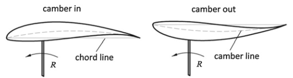

cambered-out orientation performed more efficiently than the cambered-in orienta-
tion. In a second experiment, the cambered-in configuration was tested at pitch angles
of + 8°, − 8°, and − 16°. Although performance improved in the second test, it still did not
match the efficiency of the cambered-out configuration.
Four small-scale VAWTs were examined, each featuring both straight-bladed and heli-
cal-bladed versions by I. Rabei [25]. The results indicated that when using a symmetrical
NACA 0018 airfoil, the helical-bladed turbine performed better, producing 53% more
power at 12 m/s, whereas, with an asymmetrical FX 63-137 airfoil camber out mode,
the straight-bladed turbine showed higher efficiency, generating twice as much power at
11 and 12 m/s compared to the helical version.
L. A. Danao et al. [26] presented a 2D CFD study of blade thickness and cambered
impact on a specified VAWT aerodynamic performance. The studied blade airfoil pro-
files were NACA 0012, NACA 0022, NACA 5522, and LS0421. The results showed that
the NACA0012 blade provided the highest efficiency across various TSRs, making it the
optimal blade choice among those tested. It had a peak coefficient of performance (Cp)
of 0.50 at a TSR of 3.5. The moderate camber, LS0421 blade, enhanced performance with
a maximum Cp of 0.40 at a TSR of 3.5., but excessive camber, NACA 5522, led to poor
performance. It was further found that flipped-cambered profiles provide power mainly
in the upwind region.
Novelty and research gaps

The previous literature survey presented several attempts to enhance the aerodynamic
performance of the Darrieus VAWT using various design parameters such as the blade
airfoil, the number of blades, the pitch angle, the chord length, and the solidity whether
the improvement be experimentally or numerically.
However, improving the self-starting capabilities of the Darrieus VAWT remains an
essential area of research [14]. Key research gaps identified are as follows:
▪ Most studies focus exclusively on symmetrical NACA 00XX airfoils, as seen in
[15-20], and [23]. They did not study the cambered NACA airfoils or symmetric air-
foils from other categories such as S-profiles and Eppler profiles.
▪ While a few studies, such as in [16] and [23], explore cambered NACA airfoils, fur-
ther investigation is needed to include diverse airfoil profiles from other categories,
such as S-profiles.
▪ The S-profile category has been analyzed in a limited number of studies [15, 16],
and [19]. However, the impact of flipped camber has not been explored throughout
these papers.
▪ Flipped airfoils, such as FX63-137, NACA5522, and LS0421, have been examined
in [24, 25], and [26]. However, the flipping of other cambered NACA 4-series airfoils
and categories like S-profiles and Clark Y profiles has not been considered.
▪ There is no documented research on the Clark Y profile, either in its conventional
or flipped orientation.
▪ No studies have investigated the performance of symmetric Eppler profiles.
▪ Although self-starting performance has been explored in [11-13], and [14], these
studies did not utilize airfoils from different categories or orientations specifically

designed for low Reynolds number regimes as a novel approach to enhance turbine
self-starting.
This study contributes uniquely by analyzing the geometric characteristics and ori-
entations of various airfoils in VAWTs, with a particular focus on low tip-speed ratios
(TSRs). By incorporating airfoils from diverse categories, specifically tailored for low
Reynolds number wind turbine applications [27], the research enables a comprehensive
assessment of aerodynamic performance across a broad range of profiles.
Moreover, the study demonstrates significant aerodynamic performance improve-
ments through the strategic reorientation of cambered airfoils. These findings under-
score the potential of innovative blade design modifications to enhance both turbine
efficiency and self-starting capabilities.
The CFD simulations are performed using the finite-volume software ANSYS Fluent,
with the mesh generated through Pointwise software.
Reference model features

A three-bladed H-rotor straight VAWT which was investigated by Castelli et al. [28] is
used as a reference model to be validated against available literature experimental data.
The main geometrical specifications of the reference model are illustrated in Table 1.
Computational domain and boundary conditions

The computational domain comprises a stationary rectangular region measuring
97D × 78D and a concentric rotating circular region with a diameter of 1.5D, as depicted
in Fig. 3. The left boundary of the stationary domain functions as a velocity inlet with
a specified velocity of 9 m/s, as in [28], while the right boundary serves as a pressure
outlet with an outlet gauge pressure of 0 Pa (ambient pressure). The upper and lower
boundaries are set as symmetry planes. The rotating domain is centrally located within
the stationary domain, with its center positioned 37D from the left boundary. The rota-
tional motion is implemented using the sliding mesh technique, with the rotational
Table 1 VAWT reference model geometric features [28]
a The growth rate represents the increase in element edge length with each succeeding layer of elements from the edge or
face
Parameter
Description
VAWT type
Straight-bladed Darrieus
Number of blades N
Blade airfoil profile
NACA0021
Pitch angle beta
0°
Blade airfoil chord c
0.0858 m
Rotor diameter Drotor
1.03 m
Solidity sigma = 2N c/Drotor
0.5
Rotor height H
Unity for 2D simulation
Spoke blade connection
0.25 °C
Installed power
~ 0.2 kW

speed determined according to the tip-speed ratio (TSR) range. The interface between
the rotating and stationary domains facilitates the transfer of data-including mass,
momentum, and energy-at each computational time step. The blades are set as non-
slip-wall rotating relative to the rotating domain. Air enters the computational domain
through the left inlet and exits through the right outlet, enabling the turbine to capture
wind energy during this process.
The width of the computational domain was set to approximately 80 rotor diameters
to ensure that the solid blockage correction factor [29] remained below 0.32%. This con-
figuration limited the increase in wind velocity within the rotor test section to less than
1% relative to the unperturbed wind velocity at the inlet of the computational domain,
thereby minimizing distortion in the velocity cubed term used in power estimation.
where epsilonsb is solid blockage correction factor, Wdomain is the computational domain width,
Hdomain is the computational domain height, Sdomain is the computational domain sec-
tion, As is the rotor swept area, Hrotor is the rotor height, Drotor is the rotor diameter,
Utestsection mean wind velocity at rotor test section, and Uinfinity is the unperturbed wind
velocity at computational domain entrance.
To ensure full wake development, Ferreira et al. [30] set inlet and outlet boundaries 10
diameters upstream and 14 diameters downstream for wind tunnel CFD simulations. As
the present study focuses on simulating turbine operation under open-field conditions,
the inlet and outlet boundary conditions are placed 37 rotor diameters upstream and 60
rotor diameters downstream to minimize solid blockage effects [28]. Also, the blockage
effect was studied in [31].
(1)
epsilonsb = 1
As
Sdomain
= 1
DrotorHrotor
WdomainHdomain
(2)
Utestsection = (1 + epsilonsb)Uinfinity
Fig. 3 Computational domain with specified boundary conditions

Grid independence analysis (GIA)

A grid independence study, GIA, is essential to ensure that the selected grid is an
appropriate and stable mesh for all simulations. Different-quality four grids are exam-
ined at a tip-speed ratio of 2.63, which corresponds to the reference case maximum
power coefficient (0.313) [28].
The quality of the proposed grids, whether coarse or fine, is evaluated depending
on an essential dimensionless parameter named y +. This parameter is defined as a
dimensionless distance perpendicular to the wall and scales with the boundary layer
thickness [32]. Choosing an appropriate y + value is crucial for accurately resolving
the boundary layer around blades, particularly in low-Reynolds number flows [33,
34]. The y + value can be calculated using the following equation:
where rho and mu represent the density and the dynamic viscosity of the air around the
blade airfoil. uf is the friction velocity, and it equals
τw
rho where τw is the wall shear stress.
s reparents the first layer thickness. The boundary layer comprises the laminar sublayer
(y + < 5) and the buffer layer (5 < y + < 30). Maintaining a y + near 1 ensures accurate vis-
cous sublayer simulation with the SST k-omega model that is the selected turbulence model
in the present study [35].
The grid independence analysis is summarized in Table 2, considering the most
important grid properties for distinct four grids.
Grid Convergence Index

The Grid Convergence Index (GCI) is a quantitative measure used to assess the numer-
ical uncertainty in simulations due to discretization errors. It evaluates how closely a
(3)
y+ = rho
suf
µ
Table 2 Grid independence summary
Grid properties
Grid 1
Grid 2
Grid 3
Grid 4
Number of total cells (× 103)
Number of quads cells (× 103)
29.4
67.5
Number of total tris cells (× 103)
112.6
169.5
Number of nodes around the blade per surface
Blade element size, Δx (mm)
0.67
0.335
0.168
0.0838
Number of nodes around the rotating domain
Number of cells in rotating domain (× 103)
53 tris
29.4 quads
105 tris
67.5 quads
237 tris
186 quads
602 tris
665 quads
Number of cells in the sub-domains around blades (× 103)
47 tris
29.4 quads
87.7 tris
67.5 quads
173 tris
186 quads
397 tris
665 quads
Number of cells in the stationary domain (× 103)
59.7 tris
64.3 tris
72.3 tris
88 tris
Max skewness in quads cells
0.058
0.055
0.052
0.061
Max skewness in tris cells
0.563
0.68
0.53
0.563
Number of inflation layer
First-layer thickness (mm)
0.037
0.034
0.031
0.028
Inflation growth rate (GR)a
1.1
1.08
1.05
1.02
Averaged y +
~ 1.2
~ 1.1
~ 1.0
~ 0.9
Averaged power coefficient
0.3387
0.3283
0.3263
0.3261

numerical solution approaches the theoretical exact solution as the mesh is refined [36].
GCI provides a standardized approach to quantify the convergence of results when dif-
ferent grid resolutions are used [37]. F. Ghafoorian et al. [38] evaluated GCI for different
grids starting from the coarsest grid to the finest one according to the formulae intro-
duced in [36]. In the present study, the GCI is performed for Grid 2 and Grid 3. The CGI
is defined as follows:
where f3 represents the fine-grid numerical solution obtained using grid spacing
Δx3, which in the present study corresponds to the average power coefficient Cp. Simi-
larly, f2 represents the same quantity computed on the medium grid.
r : the refinement factor = Δx2/Δx3, and p is the formal order of accuracy of the algo-
rithm ( p = 2 ) in this study. Refer to Table 2 as follows:
The grid is considered independent if GCI values between the two medium and fine
grids (Grid 2 and Grid 3) are sufficiently small (e.g., < 1%).
Therefore, the approved grid utilized in the whole study is “Grid 3.”
Moreover, Fig. 4 shows that the power coefficient value becomes stable around 0.49
million cells. Further discretization results in insignificant accuracy in the power coef-
ficient. Thus, 0.49 million cells that correspond to “Grid 3” have been selected to be uti-
lized for all simulations throughout the study.
The approved mesh, “Grid 3,” consists of approximately 305,000 triangular cells and
185,500 quad cells, with structured grids around the airfoils and unstructured grids else-
where. Control circles, 1.5 times the airfoil chord, are used to refine the mesh near the
airfoils, while the rotating domain is about twice the turbine rotor diameter. To enhance
precision, 512 points discretize the airfoil surfaces, and a half-circle trailing edge reduces
vortex formation. Additionally, 59 inflation layers with a 1.05 growth rate and a first-cell
(4)
CGIfine =
1.25
rp −1
f3 −f2

f3
∴CGIfine =
1.25

0.335
0.168

−1
|0.3263 −0.3283|
0.3263
= 0.26% < 1%
Fig. 4 Average power coefficient at different numbers of cells (lambda = 2.63)
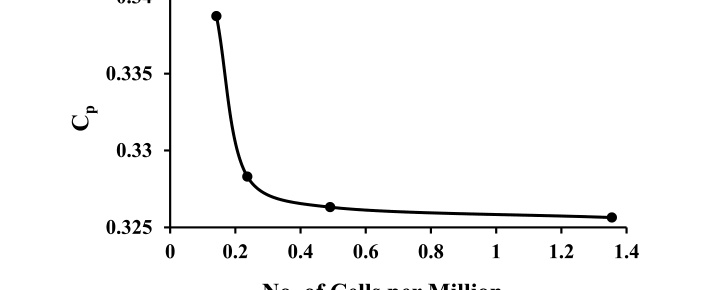

height of 0.031 mm (y + ≅ 1) are applied around the airfoil to accurately capture the
boundary layer [33].
y + contours around the rotating domain are demonstrated in Fig. 5a for the approved
mesh indicating the y + values are in the acceptable range (~ 1).
In addition, Fig. 5b provides more details of the y + distribution around a single rotat-
ing blade. The maximum y + value was about 3.8, which is in the acceptable range of
y + for the laminar sublayer (y + < 5).
Figure 6 depicts the detailed mesh generation for the approved mesh.
Fig. 5 a Wall y + around the rotating domain and b wall y + distribution for a single rotating blade
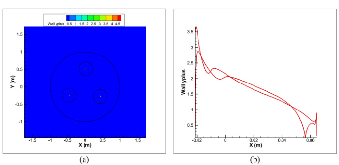

Fig. 6 a Mesh for the stationary domain, b rotating domain mesh, c 59-layer inflation around the blade
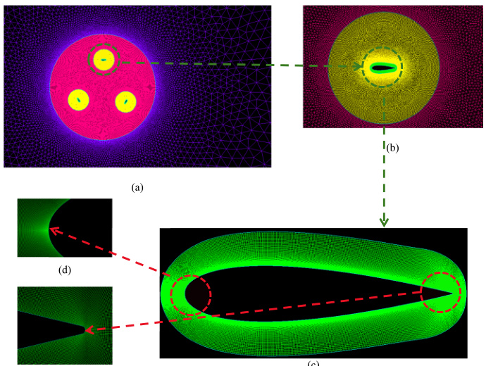

airfoil, d blade airfoil leading edge mesh, and e blade airfoil trailing edge enhancement

Solver computational settings

The numerical simulations are performed using Pointwise 18.3 R2 as a meshing tool
and commercial CFD package ANSYS Fluent V18.0 to solve a 2D, incompressible
unsteady viscous flow by solving the URANS (unsteady Reynolds-averaged Navier-
Stokes) equation using the sliding mesh (SM) technique [39]. The selected turbulence
model is SST-k-omega, all with second-order schemes for spatial and temporal discretiza-
tion. The SIMPLE (Semi-Implicit Method for Pressure-Linked Equations) algorithm
is utilized to couple the velocity and pressure fields in computational fluid dynamics,
ensuring a consistent solution between these two essential parameters [28] and [40].
Employing a time step Δt that corresponds to a 1° increment in azimuth angle
(Δtheta = 1°) is appropriate for the simulations, and further reductions in this time step
do not yield a significant effect on the solution accuracy [28] and [41]. However, the
time-step independence analysis can be performed by considering the Courant-Frie-
drichs-Lewy (CFL) number for the coupled algorithm only as in [42-45].
The time step and the azimuth angle are related as follows:
where N is the rotational speed in rpm and Δtheta is the azimuth angle increment in degrees
(= 1°).
Furthermore, all calculations are performed at a constant inlet air velocity of 9 m/s.
Table 3 provides more details about the simulation settings.
(5)
t = theta
6N
Table 3 Numerical simulation settings
Parameter
Description
TSR, lambda
Varying (1.2 → 4.0)
Free stream velocity Uinfinity
9 m/s
Rotational speed (N)
Varying (200 → 650 rpm)
Solver type
Pressure-based
Flow type
Transient
Solution algorithm
SIMPLE
Turbulence model
SST-k-omega
Residuals
1e-4 for all equations
1e-5 for the momentum equation
Unsteady technique
Sliding mesh
Fluid (air)
Incompressible, rho = 1.225 kg/m3, mu = 1.7894e-5 kg/m/s
Boundary conditions
Inlet: uniform velocity inlet (9 m/s)
Outlet: pressure outlet (ambient pressure)
Sides: symmetry
Rotor interface: interface
Blades: wall with no slip - rotational relative to the
adjacent domain
Reference values
A = 1.03 m2
L = Drotor/2 = 0.515 m
V = 9 m/s (from inlet)
H = unity (for 2D study)
rho = 1.225 kg/m3 (from inlet)
mu = 1.7894e-5 kg/m/s (from inlet)

Mathematical modeling

Governing equations

The unsteady Reynolds-averaged Navier-Stokes (URANS) equation, considering the
turbulence spectrum, is solved using an appropriate turbulence model. This study
addresses 2D, unsteady, incompressible, and Newtonian viscous flow, characterized
by the continuity and momentum equations. Since the heat transfer is out of the study
scope, the energy equation is not involved.
The mass conservation can be written in tensor form as follows:
where ui represents the velocity field in three dimensions, xi represents the coordinates
in three dimensions, and i = 1, 2, and 3.
For Newtonian fluid, the URANS can be written as follows:
where rho is the fluid density, p is the pressure, mu is the dynamic viscosity, and −rhoui′uj′
represents the Reynolds stress [46]. To solve the Reynolds stress term, the SST k-omega
model is used. This model is composed of two equations: the “k” equation represents
the energy in turbulent eddies. The transport equation for k calculates how this energy
evolves in the flow, while the “omega” equation calculates the rate at which turbulent kinetic
energy is dissipated, expressed per unit of turbulent kinetic energy, as shown in Eqs. (3)
and (4).
It has been extensively utilized in the computation and evaluation of vertical-axis
wind turbines [47, 48], and [49]. It is adequate for capturing the transient nature of
the flow around the rotating blades and the dynamic interaction between the blades
and the surrounding flow since it combines the advantages of the k-omega near walls and
the k-epsilon in free stream, providing robust handling of flow separation, adverse pressure
gradients, and the complex vortex dynamics typical of VAWT aerodynamics. The
SST-k-omega model is described in detail in [33, 50], and [51].
Performance parameters

The main performance parameters are the TSR, lambda), the power coefficient (Cp), and the
torque coefficient (Cm). They can be defined as follows:
(6)
∂ui
∂xi
= 0
(7)
rho∂ui
∂t + rhouj
∂ui
∂xj
= −∂p
∂xi
+ µ ∂
∂xj
∂ui
∂xj
+ ∂uj
∂xi

+ ∂
∂xj

−rhou′
iu′
j

(8)
∂k
∂t + Ui
∂k
∂xi
= ∂
∂xi

(ν + sigmakνt) ∂k
∂xi

+ Pk −Cµomegak
(9)
∂omega
∂t + Ui
∂omega
∂xi
= ∂
∂xi

(ν + sigmaomegaνt)∂omega
∂xi

+ γomega
k P
k −betaomega2 + (1 −F1)2sigmaomega
omega
∂k
∂xi
∂omega
∂xi

The tip-speed ratio is defined as the ratio of the tangential velocity of a blade’s tip to
the actual wind speed, while the power coefficient is defined as the ratio between the
power produced by the wind and the total power available by the wind. Its maximum
limit is about 0.593 which corresponds to the Betz limit [52].
The power coefficient and the torque coefficient can be related by inserting the tip-
speed ratio definition as follows:
The azimuth angle theta is defined as the angle measured counterclockwise from a fixed
reference direction, the direction normal to the incoming wind, to the position of a point
on the rotor blade in the plane of the rotor’s rotation as in Fig. 7.
Convergence criterion

If the difference in the average torque coefficient between two successive revolutions
is less than 1%, the simulation converges. That occurs at complete revolutions ranging
(10)
TSR = = omegaDrotor
2Uinfinity
(11)
Cp =
Tomega
0.5rhoU3
infinityH D
(12)
Cm =
T
0.25rhoU2
infinityHD2
(13)
Cp = Cm
Fig. 7 Azimuth angle (theta) definition
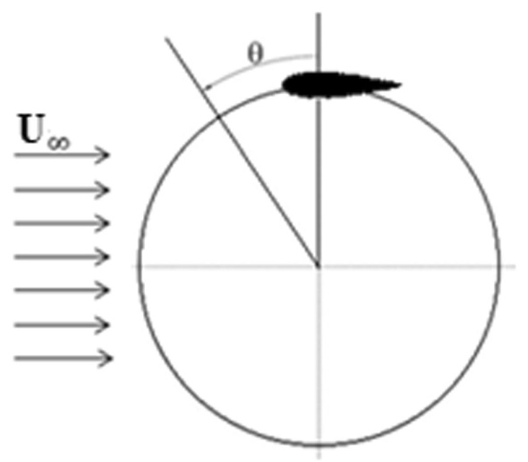

from 8 to 20 revolutions relative to the operation conditions. Furthermore, the accept-
able range for the residuals convergency is 10−4 for the mass conservation equation and
turbulence model variables and 10−5 for the momentum conservation equations.
Model validation

The CFD simulation of the reference model (NACA0021) at various tip-speed ratios was
conducted to validate the results against publicly available experimental data and previ-
ously published CFD simulations [28]. As illustrated in Fig. 8, the current model exhibits
superior agreement with experimental data compared to the CFD results from the lit-
erature, which may be attributed to the use of unstructured grids in those studies. The
maximum percentage error in the power coefficient between the present model and the
experimental data is found to be less than 5%. This relatively small error can be ascribed
to the experimental setup not accounting for wind tunnel blockage effects [28], resulting
in data that approximates a two-dimensional analysis rather than a three-dimensional
one, thus rendering the error acceptable.
Figure 9 depicts the convergence of the power coefficient (Cp) with respect to the
number of revolutions at lambda = 2.63, indicating that after the sixth revolution, the variation
in average Cp becomes negligible, with the percentage error decreasing by 1%.
Results and discussion

The proposed airfoils in this study are NACA0021 (reference model), E474, S1048,
S1210, NACA6712, DU-06-W-200, Clark Y, and FX 63-137. All airfoils share the same
chord length and are analyzed using identical turbine model parameters and computa-
tional settings.
The results are divided into four key sections. The “Introduction” section focuses on
the evaluation of symmetrical airfoils, while the “Methods” section examines airfoils
Fig. 8 Reference model (NACA0021) validation and verification

with a cambered-in configuration. The “Results and discussion” section explores the
impact of reversing the camber for these airfoils, offering a comparison between the
camber-in and camber-out orientations. Lastly, the “Conclusions” section identifies the
airfoil that delivers the best aerodynamic performance at both low and high tip-speed
ratios (TSRs).
Symmetric airfoils

The examined symmetric airfoils are NACA0021 (as reference model), Eppler 474, and
S1048. Table 4 exhibits the main geometric characteristics of the proposed symmetric
airfoils.
The power coefficient, Cp, against the tip-speed ratio, TSR, is plotted in Fig. 10 for the
symmetric airfoils.
Figure 10 deduced that the E474 is the most efficient airfoil at all TSR ranges, spe-
cifically at mid-to-high TSRs (2.0 to 3.3). It has around 9% upgrading in the peak power
coefficient compared to NACA0021 at its optimal TSR (3.0). In addition, it experienced
an enhancement in the power coefficient by about 19.5% relative to the NACA0021 at
TSR = 3.0.
For S1048, its peak power coefficient is higher than that of NACA0021 by about 2%
at its optimal TSR (3.3); however, it performs deficiently relative to NACA0021 at TSR
from 2.2 to 3.0.
On the other hand, although S1048 has almost the same thickness-to-chord ratio as
E474, the location of its maximum thickness is more rearward than E474, with a 27%
chord that leads to drag increasing at high TSRs and hence limits its performance range.
For the reference model, NACA0021, it is the thickest airfoil, 21% chord, and its posi-
tion of maximum thickness is further rearward than the other two profiles, 30% chord,
which results in higher drag and earlier separation and thus limiting its performance
specifically at higher TSRs.
Accordingly, the E474 airfoil has superior aerodynamic performance efficiency among
the symmetric proposed airfoils due to its optimized thickness-to-chord ratio, 14.1%,
and more favorable positioning of its maximum thickness, 21%, which contribute to bet-
ter flow characteristics and delayed flow separation and reduced drag within a range of
operational conditions.
Fig. 9 Cp convergence at TSR = 2.63 for eight successive revolutions (reference model)
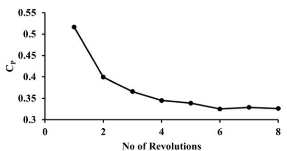

Table 4 Proposed symmetric airfoils geometric characteristics [Airfoil Tools] [27]

Throughout the “Results and discussion” section, the TSR range varies for the pro-
posed turbine blade profiles according to their type, orientation, and aerodynamic char-
acteristics. Accordingly, the TSR range for each turbine blade profile has been carefully
selected to ensure a meaningful comparison, accurately capturing its maximum power
coefficient and corresponding tip-speed ratio. Additionally, the power coefficient, Cp,
represents the total average power coefficient for the entire turbine.
Furthermore, the performance of the proposed symmetric airfoils can be addressed by
inspecting a single turbine blade instantaneous torque coefficient, Cm, distribution over
one complete rotation at the airfoils’ optimal TSR, as provided in Fig. 11.
E474 has a maximum instantaneous torque coefficient (Cm ~ 0.22) at a TSR = 3.0 in the
upstream region (0° → 180°). This leads to drag degression, resulting in higher lift gener-
ation during the upstream region, which is transformed into higher torque. Accordingly,
Fig. 10 Symmetric airfoils Cp vs TSR
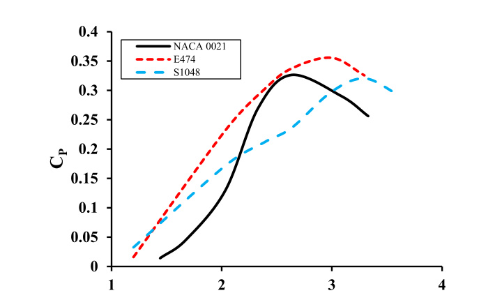

Fig. 11 A single turbine blade instantaneous torque coefficient distribution for one full rotation of symmetric
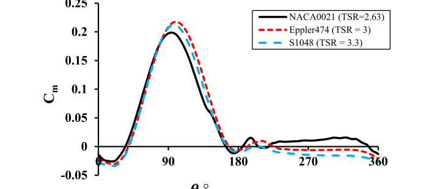

airfoils at their optimal TSR corresponding to max Cp

aerodynamic efficiency is enhanced. However, at the downstream region (180° → 360°),
it had negative torque, indicating a resistive load on the blade rotation, resulting in
energy loss. Nonetheless, overall, it has the superior average torque distribution over
one turbine complete revolution.
For S1048, it produces a slight peak instantaneous torque (Cm ~ 0.21) compared to
NACA0021 in the upstream region at a relatively high TSR, 3.3. In contrast, it experi-
enced negative torque values in the downstream region. S1048 performs nearly as likely
as E474 for all regions, but E474 is more efficient than S1048, mainly in the downstream
region. Although they have almost the same thickness-to-chord ratio, the S1048 maxi-
mum thickness lies aft of the E474, 27% chord, which leads to earlier flow separation
than the E474 airfoil.
The reference model, NACA0021, exhibited the lowest peak torque in the upstream
region at a moderate Tip Speed Ratio (TSR) of 2.63 among the three airfoils. Neverthe-
less, it continued to generate positive torque in the downstream region, as its thick pro-
file helped delay aerodynamic stall, particularly in that part of the cycle.
The performance analysis of the symmetric airfoils revealed that the E474 airfoil pro-
file is the suitable airfoil within a broader range of TSR, specifically the mid-to-high
range (2.0 → 3.3).
Cambered-in orientation airfoils

The examined cambered airfoils are NACA6712, DU-06-W-200, Clark Y, S1210, and
FX-63-137. Table 5 exhibits the main geometric characteristics of the proposed sym-
metric airfoils.
Figure 12 exhibits the power coefficient variation at different TSRs for the examined
cambered airfoils.
The NACA6712 airfoil showed superior performance at low tip-speed ratios (TSRs)
between 1.2 and 2.4, with a peak power coefficient increase of 12% at TSR = 2.0 com-
pared to the reference model at its optimal TSR. It also achieved a power coefficient
180% higher at TSR = 2.0 than the reference model at the same TSR. Performance
declined after this peak, indicating optimal performance near TSR = 2.0. This improve-
ment at low TSRs is due to the airfoil’s configuration, with a maximum camber-to-chord
ratio of 6% at 69.5% of the chord. This configuration functions as a trailing edge flap,
increasing lift and minimizing drag, particularly at high angles of attack that correspond
to low TSRs.
The DU-06-W-200 airfoil exhibits efficient performance across a wide range of tip-
speed ratios (TSR), particularly in the higher TSR range of 2 to 3.5. Its peak power coef-
ficient occurs at TSR = 3.0, demonstrating a 4% improvement over the reference model
at its optimal TSR. Additionally, at TSR = 3.3, the DU-06-W-200 maintains a nearly con-
stant power coefficient compared to the reference model, which peaks at TSR = 3.0. This
stability in power coefficient at a higher tip-speed ratio indicates an enhancement in cir-
culation around the trailing edge, attributed to the reduced camber toward the end of
the airfoil profile.
The Clark Y airfoil performs efficiently within TSR ranges from 2.0 to 3.0, but its over-
all efficiency is lower than the NACA6712 and DU-06-W-200 airfoils. Its peak power
coefficient is 0.15 at TSR = 2.63. Despite its historical use, the Clark Y’s design does

Table 5 Proposed cambered airfoils’ geometric characteristics [27, 53, 54]

not provide sufficient lift at higher speeds, limiting its effectiveness in modern VAWT
applications.
The S1210 airfoil performs effectively within a narrow range of TSR (1.2 to 2.4) but is
still below the performance of NACA 6712 and DU-06-W-200. It reaches a peak power
coefficient of about 0.13 at a TSR of around 2.0, which is somewhat comparable to DU-
06-W-200 but still slightly inferior.
The FX-63-137 airfoil has the worst performance over the TSR range from about 1.2
to 2.6. Its maximum power coefficient is 0.089 at TSR = 2.037. Unlike the S1210 airfoil,
the FX-63-137 airfoil has a more stable power generation within the TSR range of 1.2 to
2.6. Its performance stability suggests that it can adapt to changing wind speeds, which
is crucial for VAWTs that operate in fluctuating environments. Like Clark Y, it may not
be the best choice for maximum aerodynamic performance.
Further explanation of the cambered-in airfoils’ performance can be illustrated
through an examination of a single turbine blade instantaneous torque distribution of
each airfoil over a complete rotation of the turbine at a tip-speed ratio corresponding to
maximum power, as shown in Fig. 13.
NACA6712 airfoil at TSR around 2.0 demonstrates stable and consistent torque pro-
duction, with no major dips in negative torque. The positive torque over a large por-
tion of the rotation means that this airfoil efficiently converts wind energy into rotational
energy, minimizing losses due to negative torque. Its smooth curve indicates balanced
aerodynamic forces throughout the rotation, with reduced fluctuations that could cause
mechanical stress or vibrations.
At a TSR of 3.0, the DU-06-W-200 airfoil reaches a maximum instantaneous torque
coefficient of around 0.21 in the upstream region (0 to 180°). However, at the down-
stream region (180° → 360°), it had negative torque, indicating a resistive load on the
blade rotation, resulting in energy loss. Overall, the DU-06-W-200 experienced stable
torque distribution, maintaining lift and torque production later in the rotation, attrib-
uted to its light camber to chord ratio, 0.5% at most rear chordwise, and 84.6% chord
Fig. 12 Cambered-in airfoils with NACA0021 reference model (Cp vs TSR)
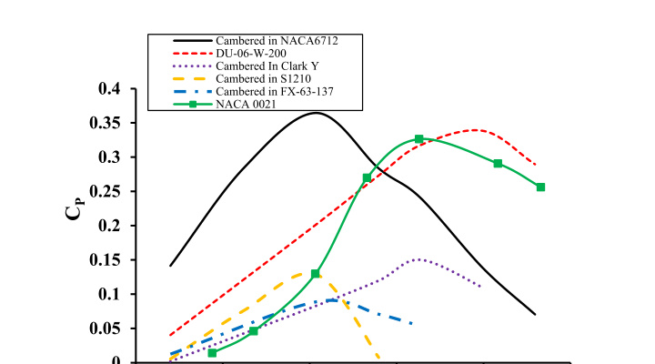

that makes it act as a symmetric airfoil with a slight virtual camber resulting in delayed
flow separation.
At a TSR of 2.63, the Clark Y airfoil exhibits notable negative torque near 90°, likely
due to increased drag or flow separation, which degrades its aerodynamic performance.
This negative torque hinders efficiency, as the turbine must counterbalance it before
generating positive power. Although moderate positive torque is observed downstream
after theta = 180°, the overall torque contribution from the airfoil remains limited, with the
negative torque in the upwind section further reducing the rotor’s efficiency.
However, the S1210 airfoil performs less efficiently in the upstream region as it gen-
erates negative torque; it performs more efficiently in the downstream one, specifically
around theta = 270°, because its max camber approximately lies in 50% of the chord, leading
to increasing the lift, reducing the drag, and delaying the boundary layer separation in
the downstream region, making it well-suited for fast-spinning turbines.
FX63-137 airfoil at TSR = 2.037 has a relatively smooth and consistent torque dis-
tribution across the rotation without dramatic peaks or troughs due to its geometric
nature, referring to its maximum camber-to-chord ratio position, 53.3% chord, result-
ing in torque stability. However, its maximum torque is lower than that of the NACA
6712 and DU-06-W-200 airfoils. While it performs steadily across the entire rotation,
its torque output is moderate rather than high, making it a suitable option for applica-
tions requiring stable, reliable performance, though not as strong as the NACA 6712 or
DU-06-W-200.
In conclusion, NACA 6712 stands out as the most efficient airfoil for maximizing
power output in Darrieus VAWTs at low-to-moderate TSRs, while DU-06-W-200 offers
good versatility at slightly higher TSRs. The choice of airfoil should be guided by the
expected operating TSR range and the wind conditions at the site. Also, as indicated in
Fig. 13, airfoils exhibiting negative torque at the initial azimuth angles are more likely to
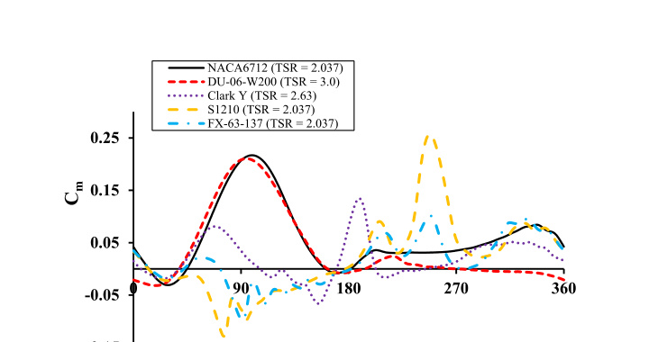

struggle with self-starting.
Furthermore, to overcome the deficiencies of S1210, FX63-137, and Clark Y perfor-
mance, flipping the camber of these airfoils would enhance the performance. While
Fig. 13 A single turbine blade instantaneous torque coefficient distribution for one full rotation of

cambered-in airfoils at their optimal TSR corresponding to max Cp

the NACA 6712 performs well in its cambered-in orientation, exploring its perfor-
mance in a cambered-out (flipped) configuration could also be beneficial.
Cambered-out orientation airfoils

When the proposed cambered airfoils (NACA6712, Clark Y, FX63-137, and S1210)
are cambered outward, they perform better than the inward-cambered ones.
Figure 14 highlights that the cambered-out Clark Y airfoil achieves the best perfor-
mance among the cambered profiles, with a peak power coefficient of 0.3458 at a TSR
of approximately 3.0, reflecting an improvement of about 6% over the NACA0021 ref-
erence model. Additionally, the cambered-out Clark Y airfoil demonstrates the lead-
ing torque coefficient compared to the other cambered profiles at a TSR near 1.2, as
illustrated in Fig. 15.
NACA6712 cambered-out airfoil has a maximum power coefficient of about 0.3397
at TSR ≅ 2.64, such that its performance is enhanced by about 4% relative to the refer-
ence model.
For both the FX63-137 and S1210 cambered-out profiles, their performance has
deficiencies relative to the reference model by about 9.7% at TSR ≅ 3.0 and 19.6% at
TSR ≅ 3.3, respectively.
The Clark Y and NACA 6712 airfoils perform better in a cambered-out configura-
tion because they have more favorable aerodynamic characteristics, such as improved
stall behavior, higher lift-to-drag ratios, and more stable performance across a wide
range of VAWT operating conditions. Although the FX63-137 and S1210 airfoils may
be useful in other applications, their poorer performance in the special circumstances
provided by VAWTs leads to lower power coefficients at equivalent TSRs.
Fig. 14 Total Cp vs. TSR of cambered-out airfoils
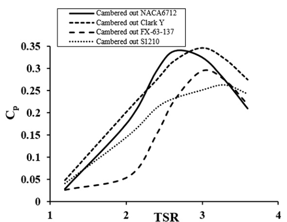

Cambered airfoils orientation comparison

Figure 16 provides a comparative analysis of NACA6712, S1210, FX63-137, and Clark Y
airfoils for different orientations (cambered-in and cambered-out).
Fig. 15 Total Cm vs. TSR of cambered-out airfoils
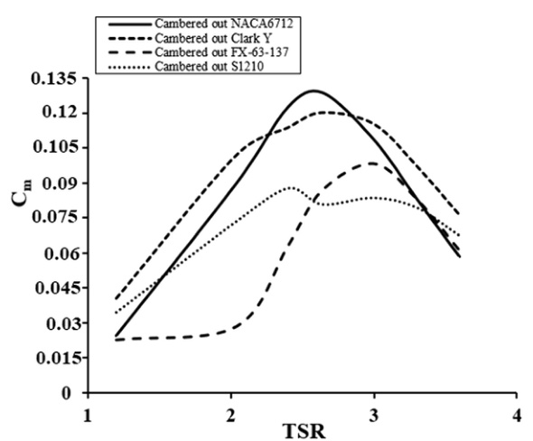

Fig. 16 Cp vs. TSR of the cambered airfoils at different orientations (cambered-in and cambered-out)
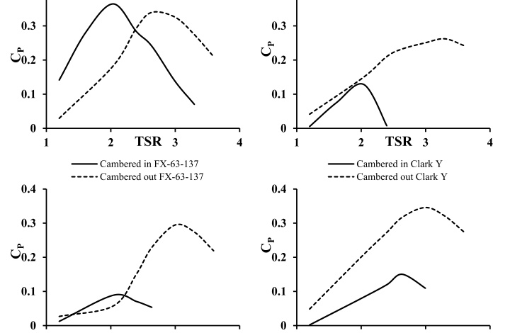

There is an enormous enhancement in the performance of the proposed cambered
airfoils when the camber is flipped. By inspection of Fig. 16, it is observed that NACA
6712 cambered-out orientation has a significant aerodynamic performance, specifi-
cally at high TSRs, while NACA 6712 cambered-in orientation provides a better per-
formance at low TSRs.
For Clark Y airfoil, the cambered-out orientation has a noticeable enhancement in
performance compared to the cambered-in configuration, particularly at mid-to-high
TSRs.
Furthermore, the cambered-out configuration of the FX63-137 airfoil demonstrates
superior performance across the TSR range, with a clear advantage over the cam-
bered-in configuration, which shows limited performance improvement.
The S1210 profile performs better than the cambered-in configuration, although the
improvement is more pronounced at higher TSRs.
In addition, based on the static pressure contours at azimuth angle = 120° at first
TSR = 1.2 in Fig. 17, it is observed that both flipped, cambered-out airfoils, Clark Y
and S1210, exhibit larger high-pressure regions around the pressure side compared to
the cambered-in Clark Y and S1210, which supports their good startup performance.
Furthermore, the cambered-out Clark Y shows a larger high-pressure region around
the pressure side, confirming its superior startup characteristics.
Fig. 17 Static pressure contours for various cambered airfoils’ orientations at theta = 120° and TSR = 1.2. a
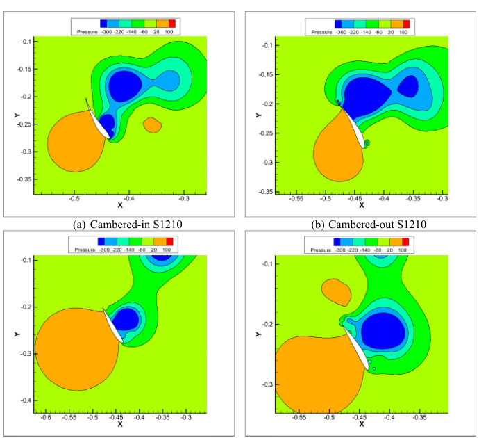

Cambered-in S1210. b Cambered-out S1210. c Cambered-in Clark Y. d Cambered-out Clark Y

To evaluate the startup characteristics of the turbine using cambered-out Clark Y and
S1210 airfoils, a dynamic startup simulation was conducted with a turbine inertia of 0.1
kg.m2. The results in Fig. 18 showed that both cambered-out Clark Y and S1210 airfoils
are capable of self-starting and achieving a suitable TSR.
However, the cambered-out Clark Y airfoil demonstrated superior performance, accel-
erating rapidly to a high TSR in approximately 5.5 s, compared to 7.5 s for the cambered-
out S1210.
Moreover, the cambered-out Clark Y airfoil achieved a higher maximum TSR of 3.77
compared to 3.70 for the cambered-out S1210 airfoil. These findings confirm the supe-
rior startup characteristics of the cambered-out Clark Y airfoil, consistent with previ-
ous analyses based on moment coefficients at low TSRs (Fig. 15) and pressure contours
around the airfoils (Fig. 17).
Comparative analysis

Figure 19 provides various proposed airfoil shapes maximum power coefficient against
the corresponding TSR. It is clarified that the NACA6712 cambered-in airfoil has the
maximum power coefficient (Cp = 0.3645) at a relatively low TSR (2.037), while the
Eppler474 airfoil has a maximum power coefficient of 0.3557 at a relatively large TSR
(3.0). Conversely, the FX63-137 cambered-in airfoil experienced poor aerodynamic per-
formance among all the proposed airfoils. Its maximum power coefficient was 0.08895 at
a TSR = 2.037. Moreover, the S1210 cambered-in configuration experienced a maximum
power coefficient of 0.1287 at TSR = 2.037.
In summary, the NACA6712 cambered-in orientation is an effective solution for Dar-
rieus VAWT operating at low TSR, while the Eppler 474 symmetric airfoil is an adequate
choice for maximizing energy extraction at mid-to-high TSRs. Figures 20 and 21 depict
Fig. 18 Startup analysis of cambered-out Clark Y and S1210
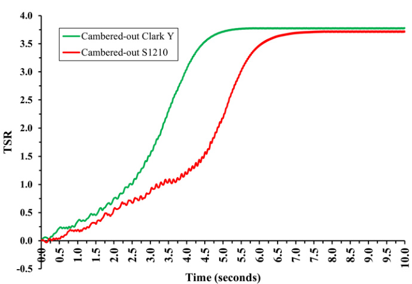

the performance of the two superior airfoils regarding the variation of both power and
torque at the span of TSRs.
This study conducted a comprehensive analysis of the aerodynamic performance of
various airfoils for Darrieus vertical-axis wind turbines (VAWTs), with a specific focus
on addressing the self-starting challenge at low tip-speed ratios (TSRs). Through 2D
CFD numerical simulations, both symmetric airfoils (e.g., NACA 0021, Eppler 474, and
Fig. 19 Max Cp and corresponding lambda for the studied airfoils with their different orientations
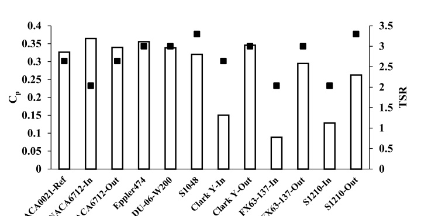

Fig. 20 Most efficient airfoils (Cp vs. TSR)
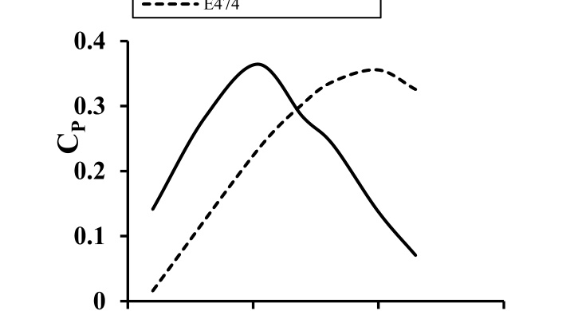

S1048) and cambered airfoils (e.g., DU-06-W200, NACA 6712, S1210, FX63-137, and
Clark Y) were evaluated.
The results indicate that the cambered-in NACA 6712 airfoil demonstrated the best
performance in the low TSR range (1.2 to 2.4). However, its performance diminished
at higher TSRs. For mid-to-high TSRs (2.0 to 3.3), the Eppler 474 airfoil emerged as the
optimal choice, offering superior aerodynamic efficiency. In contrast, the S1210, FX63-
137, and Clark Y airfoils showed poor performance across most TSR ranges in their
cambered-in configuration. When their camber was flipped (cambered-out configura-
tion), these airfoils exhibited significant improvements in aerodynamic performance.
Furthermore, the turbine startup performance was examined through a dynamic sim-
ulation for flipped Clark Y and S1210. The results revealed that the flipped Clark Y had
superior startup performance to the flipped S1210 airfoil.
This comparative analysis highlights the importance of selecting the appropriate airfoil
based on the operating TSR range for optimal performance of Darrieus VAWTs. It is
recommended that the NACA 6712 airfoil be used in low TSR applications, while the
Eppler 474 is better suited for mid-to-high TSR operations.
For future research, these findings can serve as a foundation for analyzing the aero-
dynamic performance of hybrid double-Darrieus VAWTs. Additionally, further inves-
tigations involving 3D CFD simulations and wind tunnel experiments are necessary to
validate the 2D results and ensure the practical applicability of the findings.
Abbreviations

K
Turbulent kinetic energy
epsilon
Dissipation rate of turbulence energy
Ω
Specific rate of dissipation of turbulence energy
Λ
Tip-speed ratio
sigma
Solidity
rho
Fluid density
mu
Fluid viscosity
omega
Angular velocity
𝒩
Number of blades
Fig. 21 Most efficient airfoils (Cm vs. TSR)
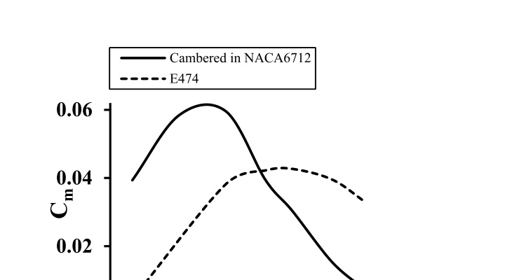

Uinfinity
Free stream velocity
Θ
Azimuth angle
Cm
Torque coefficient
Cp
Power coefficient
Re
Reynolds number
C
Airfoil chord
Drotor
Turbine rotor diameter
L
Characteristic length
A
Area
H
Depth
N
Revolutions per minute
Δt
Time step
VAWT​
Vertical-axis wind turbine
TSR
Tip-speed ratio
SST
Shear stress transport
CFD
Computational fluid dynamics
2D
Two dimensions
3D
Three dimensions
RANS
Reynolds-averaged Navier-Stokes
URANS
Unsteady Reynolds Averaged Navier Stokes
SIMPLE
Semi-Implicit Method for Pressure-Linked Equations
Not applicable.
MS, the first author, wrote the paper, performed the numerical simulations, and analyzed the results. ME developed,
followed up, reviewed, and supervised the work and editing. AI contributed to the numerical work and provided some
interpretation of the numerical results. The authors read and approved the final manuscript.
No funding was obtained for this study.
The data used in this research can be found via the corresponding author.
Not applicable.
Not applicable.
The authors declare that they have no competing interests.
References

1.
Ozgener O, Ozgener L (2007) Exergy and reliability analysis of wind turbine systems: a case study. Renew Sustain
Energy Rev 11(8):1811-1826
2.
Ahmad M, Shahzad A, Qadri MNM (2022) An overview of aerodynamic performance analysis of vertical axis wind
turbines. Energy environ 34(7):2815-2857.
3.
Dessoky A, Bangga G, Lutz T, Krämer E (2019) Aerodynamic and aeroacoustic performance assessment of H-rotor
darrieus VAWT equipped with wind-lens technology. Energy 175:76-97
4.
Arab A, Javadi M, Anbarsooz M, Moghiman M (2017) A numerical study on the aerodynamic performance and
the self-starting characteristics of a Darrieus wind turbine considering its moment of inertia. Renew Energy
107:298-311
5.
Horton HP (1968) Laminar separation bubbles in two and three dimensional incompressible flow. London Univ, PhD
6.
Abul-Ela M, Abdelrahman MM (2021) “Numerical simulation of 2D tandem wing at low Reynolds number using
parametric study,” in 14th International Conference of Fluid Dynamics, 2-3 April 2021, Fairmont Nile City Hotel, Cairo,
EGYPT, no. ICFD14-EG-7059, pp. 1-13
7.
Sutherland HJ, Berg DE, Ashwill TD (2012) A retrospective of VAWT technology. Sandia National Laboratories, Techni-
cal Report SAND2012-0304, p 65
8.
Dominy RG, Lunt P, Bickerdyke A, Dominy J (2007) “Self-starting capability of a Darrieus turbine,” Proc. Inst. Mech.
Eng. Part A J. Power Energy, vol. 221, no. 1, pp. 111-120

9.
Tian W, Ni X, Li B, Yang G, Mao Z (2023)“Improving the efficiency of Darrieus turbines through a gear-like turbine
layout,” Energy, vol. 267, no. December, 2022, pp. 1-14
10. Vishnu V, Namboodiri Goyal R (2023) “Benchmarking the darrieus wind turbine configurations through review
and data envelopment analysis,” Clean Technol. Environ. Policy, vol. 25, no. 7, pp. 2123-2155
11. Zare Chavoshi M, Ebrahimi A (2024) “Self-starting and performance improvement of a Darrieus type wind tur-
bine using the plasma actuator,” Phys. Fluids, vol. 36, no. 5, p. 55127
12. Celik Y, Ma L, Ingham D, Pourkashanian M (2022) Aerodynamic investigation of the start-up process of H-type
vertical axis wind turbines using CFD. J Wind Eng Ind Aerodyn 204(January):2020
13. Micha Premkumar T, Seralathan S, Mohan T Saran Reddy NNP (2015) “Numerical studies on the effect of cam-
bered airfoil blades on self-starting of vertical axis wind turbine part 1: NACA 0012 and NACA 4415.” Appl. Mech.
Mater. 787(June):250-254
14. Kumar PM, Sivalingam K, Lim T (2019) “Clean technologies strategies for enhancing the low wind speed perfor-
mance of H-Darrieus wind turbine - part 1,” clean Technol., pp. 185-204
15. Roy S, Branger H (2017) “2017-ASME-design of an offshore three-bladed vertical axis wind turbine for wind tun-
nel experiments,” in Proceedings of the ASME 2017 36th International Conference on Ocean, Offshore and Arctic
Engineering OMAE2017 June 25-30, 2017, Trondheim, Norway D
16. Tahzib T, Hannan MA, Ahmed YA, Zamil I, Kamal M (2022) Performance analysis of H-Darrieus wind turbine with
NACA0018 and S1046 aerofoils : impact of blade angle and TSR. CFD Lett 2(2):10-23
17. Takahashi S, Ohya Y, Karasudani T, Watanabe K (2006) “Numerical and experimental studies of airfoils suitable for
vertical axis wind turbines and an application of wind-energy collecting structure for higher performance,” in
4th international Symposium on Computational Wing Engineering (CWE2006), Yokohama
18. Ghazalla RA, Mohamed MH, Hafiz AA (2019) “Synergistic analysis of a Darrieus wind turbine using computational
fluid dynamics,” Energy, vol. 189:116214
19. Hashem I, Mohamed MH (2017) “Aerodynamic performance enhancements of H-rotor Darrieus wind turbine,”
Energy vol. 142:531-545
20. Jain S. Saha UK (2020) “On the influence of blade thickness-to-chord ratio on dynamic stall phenomenon in
H-type Darrieus wind rotors,” Energy Convers. Manag., vol. 218
21. Tjiu W, Marnoto T, Mat S, Ruslan MH, Sopian K (2015) Darrieus vertical axis wind turbine for power generation
II: challenges in HAWT and the opportunity of multi-megawatt Darrieus VAWT development. Renew Energy
75:560-571
22. Song C, Wu G, Zhu W, Zhang X (2020) Study on aerodynamic characteristics of Darrieus vertical axis wind turbines
with different airfoil maximum thicknesses through computational fluid dynamics. Arab J Sci Eng 45(2):689-698
23. Jason M et al (2021) “2D CFD simulation study on the performance of various NACA airfoils,” vol. 4, no. 4, pp. 38-50
24. Viorel B, Ion B, Ivan R, Marin G, Valeriu D (2020) “Vertical axis wind turbines. Optimal positioning of the blades
defined by asymmetrical airfoils,” no. October, pp. 207-213
25. Rabei I (2020) Experimental observations on efficiency difference between. J Eng Sci 24(4):37-44
26. Danao LA, Qin N, Howell R (2012) “A numerical study of blade thickness and camber effects on vertical axis wind
turbines,” Proc. Inst. Mech. Eng. Part A J. Power Energy, vol. 226, no. 7, pp. 867-881
27. Miley SJ (1982) Catalog of low-Reynolds-number airfoil data for wind-turbine applications, National Technical Infor-
mation Service (US Commerce), Report RFP-3387:571
28. Raciti Castelli M, Englaro A, Benini E (2011) The Darrieus wind turbine: proposal for a new performance prediction
model based on CFD. Energy 36(8):4919-4934
29. Bradshaw P (1964) Experimental fluid Mechanics. Cambridge University Press
30. Simão Ferreira CJ, Bijl H, Van Bussel G, Van Kuik G (2007) Simulating dynamic stall in a 2D VAWT: modeling strategy,
verification and validation with particle image velocimetry data. J Phys. Conf Ser. 75(1)
31. Akhlaghi M, Mirmotahari SR, Ghafoorian F, Mehrpooya M (2024) Numerical study of control rod’s cross-section
effects on the aerodynamic performance of Savonius vertical axis wind turbine with various installation positions at
suction side. Iran J Sci Technol Trans Mech Eng 48(4):2143-2165
32. Lositaño I. Danao L (2019) “Steady wind performance of a 5 kW three-bladed H-rotor Darrieus vertical axis wind
turbine (VAWT) with cambered tubercle leading edge (TLE) blades,” Energy, vol. 175, Mar
33. Nichols RH 2008 “Turbulence models and their application to complex flows,” no. August
34. Abul-Ela MS, Sayed AI, Elrefaei ME-F (2024) Performance comparative study of low Reynolds number airfoils utilized
in vertical-axis wind turbines. J Al-Azhar Univ Eng Sect 19(72):147-161
35. Marsh P, Ranmuthugala D, Penesis I, Thomas G (2017) The influence of turbulence model and two and three-dimen-
sional domain selection on the simulated performance characteristics of vertical axis tidal turbines. Renew Energy
105:106-116
36. Roache PJ (1997) Quantification of uncertainty in computational fluid dynamics. Annu Rev Fluid Mech 29:123-160
37. Ferziger HJ Perić M (2002) Computational Methods for Fluid Dynamics. Springer, 3th ed. Springer, Berlin
38. Ghafoorian F, Mirmotahari SR, Eydizadeh M, Mehrpooya M (2025) “A systematic investigation on the hybrid Darrieus-
Savonius vertical axis wind turbine aerodynamic performance and self-starting capability improvement by installing
a curtain.” Next Energy 6(July)
39. Fluent Software, “ANSYS FLUENT user ’ s Guide,” 2010.
40. Trivellato F, Castelli MR (2014) On the Courant e Friedrichs e Lewy criterion of rotating grids in 2D vertical-axis wind
turbine analysis. Renew Energy 62:53-62
41. M. R. Castelli, G. Ardizzon, L. Battisti, E. Benini, and G. Pavesi, “Modeling strategy and numerical validation for a Dar-
rieus vertical axis micro-wind turbine,” ASME Int. Mech. Eng. Congr. Expo. Proc., vol. 7, no. PARTS A AND B, pp. 409-418,
2010.
42. Chegini S, Asadbeigi M, Ghafoorian F, Mehrpooya M (2023) An investigation into the self-starting of Darrieus-Savo-
nius hybrid wind turbine and performance enhancement through innovative deflectors: A CFD approach. Ocean
Eng 287:115910

43. Reza Mirmotahary F, Ghafoorian M, Mehrpooya Sina Hosseini Rad Morteza Taraghi, and Mahdi Moghimi, (2024)“A
comprehensive investigation on Darrieus vertical axis wind turbine performance and self-starting capability improve-
ment by implementing a novel semi-directional airfoil guide vane and rotor solidity,” Phys. Fluids, vol. 36, no. 6
44. Ghafoorian F, Mirmotahari SR, Mehrpooya M, Akhlaghi M (2024) Aerodynamic performance and efficiency enhance-
ment of a Savonius vertical axis wind turbine with semi-directional curved guide vane, using CFD and optimization
method. J Brazilian Soc Mech Sci Eng 46(7):443
45. Farajyar S, Ghafoorian F, Mehrpooya M, Asadbeigi M (2023) “CFD investigation and optimization on the aerodynamic
performance of a savonius vertical axis wind turbine and its installation in a hybrid power supply system: a case
study in Iran,” Sustainability vol. 15(6):5318
46. Fluent Software (2001) Modeling turbulent flows, ANSYS Fluent Theory Guide/manual
47. Barnes A, Marshall-Cross D, Hughes BR (2021) Validation and comparison of turbulence models for predicting wakes
of vertical axis wind turbines. J Ocean Eng Mar Energy 7(4):339-362
48. Saryazdi SME, Boroushaki M (2018) 2D numerical simulation and sensitive analysis of H-Darrieus wind turbine. Int J
Renew Energy Dev 7(1):23-34
49. Elsakka MM, Ingham DB, Ma L, Pourkashanian M (2020) “Effects of turbulence modelling on the predictions of the
pressure distribution around the wing of a small scale vertical axis wind turbine,” In: Proceedings of the 6th Euro-
pean Conference on Computational Mechanics (ECCM 2018) & 7th European Conference on Computational Fluid
Dynamics (ECFD 2018), pp. 3921-3931
50. Aftab SMA, Rafie ASM, Razak NA, Ahmad KA (2016) “Turbulence Model Selection for Low Reynolds Number Flows”.
PLoS ONE 11(4)
51. Wauters J, Degroote J (Nov.2018) On the study of transitional low-Reynolds number flows over airfoils operating at
high angles of attack and their prediction using transitional turbulence models. Prog Aerosp Sci 103:52-68
52. Z Lubosny (2003) Wind Turbine Operation in Electric Power Systems, Springer, p 259-272
53. “Index @ Www.Airfoiltools.Com” [Online]. Available: http://​www.​airfo​iltoo​ls.​com/.
54. Marten D, Wendler J (2013) QBlade Guidelines, Version 0.6 technical guide (TU Berlin), p 20-30
Springer Nature remains neutral with regard to jurisdictional claims in published maps and institutional affiliations.
