Effect of airfoil shape on power performance of vertical axis wind turbines in dynamic stall: Symmetric Airfoils
M. Rasoul Tirandaz a, Abdolrahim Rezaeiha b, c, *

a Sharif University of Technology, Tehran, Iran
b KU Leuven, Leuven, Belgium
c Eindhoven University of Technology, Eindhoven, the Netherlands
Article history:
Received 5 January 2021
Received in revised form
16 March 2021
Accepted 30 March 2021
Available online 2 April 2021
Keywords

Smart rotor design; Unsteady aerodynamics; Morphing airfoil; Computational fluid dynamics (CFD); Floating offshore wind turbine (FOWT); Building-integrated wind turbine

Abstract
The current design of vertical axis wind turbines (VAWTs) suffers from inevitable change in tip speed
ratio, l, in variant wind conditions due to fixed rotor speed. At relatively high wind speeds, which are
promising due to high wind power potential, VAWTs operate at low l with poor power coefficient.
Morphing airfoils can be a potential solution by modifying the airfoil shape to optimal at each l. The
optimal airfoil shape for VAWTs at low l, where dynamic stall is present, has not yet been studied in the
literature, therefore, the present study addresses this gap by focusing on this regime to serve as a step
towards designing morphing airfoils for VAWTs by identifying the optimal airfoil shape at low l. The
present study performs a combined analysis of three shape defining parameters, namely the airfoil
maximum thickness and its position as well as the leading-edge radius, to reveal the overall design space.
The analysis is based on 252 high-fidelity transient CFD simulations of 126 identical airfoil shapes. The
simulations are verified and validated with three experiments. The results show that the three shape
defining parameters have a fully coupled impact on the turbine power and thrust coefficients. When l
reduces from 3.0 to 2.5, the optimal airfoil changes from NACA0018e4.5/2.75 to NACA0024e4.5/3.5, that
is increasing the maximum thickness from 18%c to 24%c and shifting its position from 27.5%c to 35%c,
while the leading-edge radius index, I, remains 4.5. In general, reducing I from the default value of 6.0 to
4.5 is found to increase the turbine CP.

1. Introduction

1.1. The state-of-the-art and research gaps

Airfoil shape plays a crucial role in overall performance of
aerodynamic bodies and this has resulted in extensive research to
design dedicated airfoil shapes based on the target design condi-
tion. Some examples are for helicopters [1e3], aircrafts [4e7],
micro-air vehicles [8,9], propellers [10e12], gas turbine blades
[13,14], fans/compressors [15e18] and wind turbines [19e27].
For horizontal axis wind turbines (HAWTs), a few examples of
dedicated airfoil series are S8xx series by NREL, USA [25], FFA W-xxx
series by FOI, Sweden [28], Risø-A1-xxx and also B- and P-series by
Risø, DTU, Denmark [20e22], and DU xx-W-xxx series by TU Delft,
the Netherlands [26,27].
In contrast, vertical axis wind turbines (VAWTs) originally bor-
rowed their airfoil shapes from helicopter industry, i.e. the typical
symmetric NACA four-digit airfoil series, and characterization and
optimization of airfoil shape for VAWTs have received much less
attention [29,30]. The pioneering works on the analysis of the
airfoil shape for VAWTs are the works by Kato et al. [31], Klimas
[32], Galbraith et al. [33], Claessens [34] and Ferreira and Geurts
[35]. To this date, the commercial VAWTs are not yet widely
benefitting from dedicated airfoil shapes and this has contributed
to their comparatively low aerodynamic performance against their
modern horizontal axis counterparts [36e41].
The blade of a VAWT operates in a wide range of positive/
negative angles of attack, a. Due to the cyclic variations of a, the
blade experiences unsteady separation. At low tip speed ratios (l),
the blade could experience both pre- and post-stall regimes in a
complex transient manner. In that case, dynamic stall would
happen resulting in the well-known hysteresis effects on the
aerodynamic loads [42e46]. This further sophisticates the blade

aerodynamics of VAWTs. As a result of this, not a single design
condition exists for VAWTs so that a single optimal airfoil shape can
be designed for and this has significantly hindered the airfoil
optimization efforts for VAWTs.
Instead, a comprehensive characterization of the parameters
defining the airfoil shape would provide a fundamental under-
standing of their individual/combined influences on the power
performance of VAWTs. In addition, the developed knowledge
would be a step forward towards designing improved airfoil shapes
for VAWTs. However, such comprehensive knowledge on the
impact of the airfoil shape defining parameters on the aerodynamic
performance of VAWTs is currently not sufficiently developed in
the literature. Table 1 lists an overview of the literature on char-
acterization of airfoil shape for VAWTs. In the table, summary in-
formation on the investigated airfoil shapes (number of studied
shapes, studied parameters and their range), the method of the
study (numerical/experimental) and the turbine geometrical and
operational characteristics in the study (turbine solidity, tip speed
ratio and Reynolds number) are presented.
Among the presented literature, the momentum-based models,
such as the multiple streamtube models, have been employed by
Healy [47], Migliore [48], Kirke and Lazauskas [49], Bedon et al.
[50], Jafari et al. [51], Fernandez et al. [52]. However, such models
are fundamentally developed for HAWTs and do not correspond to
the underlying physics of VAWTs and their inaccuracies to predict
the power performance of VAWTs are already known in the liter-
ature, see Ref. [53].
Among the high-fidelity CFD studies, a few, e.g. Ref. [54],
randomly selected several studies, therefore, no insight on the in-
fluence of the airfoil shape defining parameters could not be
developed. Detailed analysis of the literature shows that, on the one
hand, the majority of the systematic studies are mainly focused on
Nomenclature

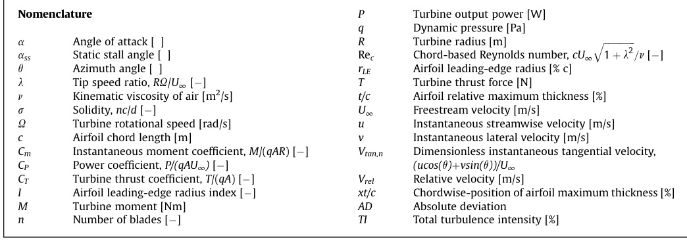

Table 1
Overview of the literature on characterization of airfoil shape for VAWTs.

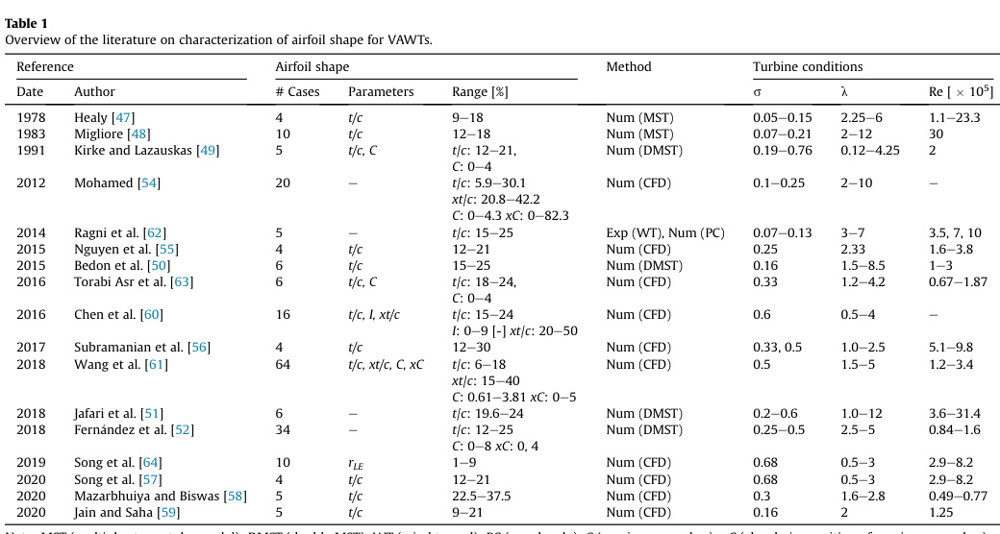
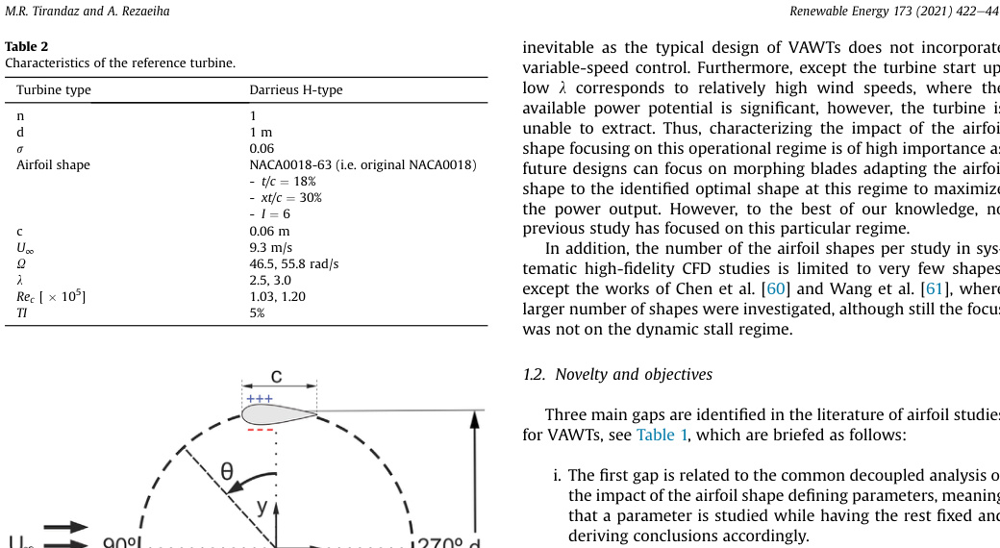

Note: MST (multiple streamtube model); DMST (double MST); WT (wind tunnel); PC (panel code); C (maximum camber); xC (chordwise position of maximum camber).

the impact of a single airfoil shape defining parameter, mostly the
airfoil relative maximum thickness (t/c), see for example the works
of Nguyen et al. [55], Subramanian et al. [56], Song et al. [57],
Mazarbhuiya and Biswas [58], Jain and Saha [59]. This is while the
other shape defining parameters are kept fixed in the study. Note
that some parameters such as the chordwise position of maximum
thickness and the leading-edge radius has received much less
attention.
These factors limit the generality of the provided conclusions
mainly because the airfoil defining shape parameters could have
coupled impacts on the boundary layer events along the blade, the
stall behavior, and the resultant aerodynamic loading. Therefore,
isolated analysis of one parameter, while the others are kept con-
stant, might be misleading by not presenting the global picture.
On the other hand, dynamic stall is an important flow phe-
nomenon associated with VAWTs and its occurrence at low l is
inevitable as the typical design of VAWTs does not incorporate
variable-speed control. Furthermore, except the turbine start up,
low l corresponds to relatively high wind speeds, where the
available power potential is significant, however, the turbine is
unable to extract. Thus, characterizing the impact of the airfoil
shape focusing on this operational regime is of high importance as
future designs can focus on morphing blades adapting the airfoil
shape to the identified optimal shape at this regime to maximize
the power output. However, to the best of our knowledge, no
previous study has focused on this particular regime.
In addition, the number of the airfoil shapes per study in sys-
tematic high-fidelity CFD studies is limited to very few shapes,
except the works of Chen et al. [60] and Wang et al. [61], where
larger number of shapes were investigated, although still the focus
was not on the dynamic stall regime.
1.2. Novelty and objectives

Three main gaps are identified in the literature of airfoil studies
for VAWTs, see Table 1, which are briefed as follows:
i. The first gap is related to the common decoupled analysis of
the impact of the airfoil shape defining parameters, meaning
that a parameter is studied while having the rest fixed and
deriving conclusions accordingly.
ii. The second gap is associated with deriving conclusions based
on limited number of the airfoil shapes studied.
iii. The third gap is with respect to the regime of study, that is
the low tip speed ratios including dynamic stall, which has
not been the focus of the study mainly because the majority
of the studies have focused on the optimal regime. However,
in order to design morphing airfoil shapes adapting their
shape according to the turbine tip speed ratio, all the relevant
tip speed ratios would be important and cannot be neglected.
To address these gaps, the present study has the following aim
and objectives:
i. To understand the individual/combined impact of the airfoil
shape defining parameters on the turbine power and thrust
coefficients (CP and CT) using a coupled analysis, meaning
that all the possible combinations of the studied parameters
within a relevant range will be studied.
ii. To drive generalizable conclusions by basing that on an
extensive systematic analysis including 252 transient simu-
lations corresponding to 126 identical airfoil shapes (6
different airfoil relative maximum thickness t/c, 7 different
chordwise position of the airfoil maximum thickness xt/c,
and 3 different leading-edge radius indexes I) at 2 different
tip speed ratios, l, performed
iii. Identifying the optimal airfoil shapes at low tip speed ratios,
where
the
dynamic
stall
complicates
the
blade
aerodynamics.
The focus of the work will be on symmetric airfoil shapes
Table 2 Characteristics of the reference turbine.

| Parameter | Value |
| --- | --- |
| Turbine type | Darrieus H-type |
| n | 1 |
| d | 1 m |
| sigma | 0.06 |
| Airfoil shape | NACA0018-6 (i.e. original NACA0018) |
| t/c | 18% |
| xt/c | 30% |
| I | 6 |
| c | 0.06 m |
| Uinfinity | 9.3 m/s |
| Omega | 46.5, 55.8 rad/s |
| lambda | 2.5, 3.0 |
| Rec [x 10^5] | 1.03, 1.20 |
| TI | 5% |

Fig. 1. Top view of the reference turbine (not to scale). The (þ) and () signs denote

the pressure and suction sides for 0  q < 180.
Table 3 Details of computational domain, grid and boundary conditions.

| Setting | Value |
| --- | --- |
| Computational domain | 30 d x 30 d (d: turbine diameter) |
| Computational grid | 302,815 quadrilateral cells, 800 cells around the airfoil circumference, max y+ < 2.5 |
| Boundary conditions | Inlet: uniform normal velocity (TI = 5%, turbulence length scale = d); Outlet: zero static gauge pressure; Side boundaries: symmetry; Walls: no-slip |

modified based on the popular NACA four-digit airfoil series. The
analysis is based on unsteady Reynolds-Averaged Navier-Stokes
(URANS) approach, already extensively validated with experi-
mental data.
The provided conclusions will help to characterize the influence
of airfoil shape defining parameters on power performance of
VAWTs and to identify the optimal airfoil shapes at low tip speed
ratios to support designing morphing airfoil shapes for VAWTs.
1.3. The regime of study

Unlike the more common HAWTs, the current design of VAWTs
have fixed rotor rotational speed (excl. the start-up). Therefore,
their tip speed ratio is inevitably varying within a wide range due to
the changes in the incoming flow velocity. More specifically, at
higher wind speeds, which are theoretically more interesting due
to the higher available wind power, they would operate in low tip
speed ratios. However, due to the occurrence of dynamic stall, their
power performance dramatically drops, and this has a significant
impact on their annual energy production (AEP). Thus, towards
improving the design of smart VAWT through identifying the
optimal airfoil shapes for morphing blades, the present study fo-
cuses on low tip speed ratios.
1.4. Paper outline

This paper is organized as follows: Sec. 2 gives a brief overview
of the computational settings and parameters. The solution verifi-
cation and validation studies are also discussed. Sec. 3 describes the
studied airfoil shapes, the equations to generate the modified air-
foils and the list of the test cases. The results are presented and
discussed in Sec. 4, where in 2 sub-sections the impact of each
parameter is separately discussed and then a sub-section discussed
Fig. 2. Schematic of (a) the computational domain (not to scale); (bee) grid.

Fig. 3. Grid sensitivity analysis for the reference turbine: streamwise force coefficient
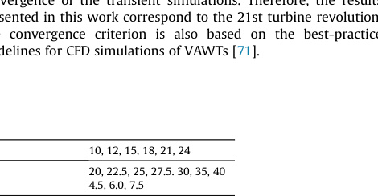

during the last turbine revolution.

their combined impact. Finally, a last sub-section presents an
aerodynamic analysis of the optimal airfoil shapes. Discussion and
conclusions are given in Sec. 5 and 6.
2. Computational settings and parameters

2.1. Turbine characteristics

The reference turbine is a one-bladed Darrieus (lift-based) H-
type VAWT with the geometrical and operational characteristics
given in Table 2. The location of blade-spoke connection is c/2. A
schematic of the reference turbine is depicted in Fig. 1. The refer-
ence turbine is a simplified version of the turbine in the experiment
by Tescione et al. [65], which is used for one of the validation
studies performed by the authors [66]. The simplified version ex-
cludes the shaft and the spokes and only has one blade to reduce
the computational cost associated with the large number of sim-
ulations in the present study, i.e. in total 252 transient simulations.
Please note that this simplification is believed to have negligible
impact on the conclusions of this study because the influence of the
excluded components has been already studied and known in our
previous works [67,68]. For example, regarding the number of
blades, we have found that the power performance of low-solidity
VAWTs is weakly dependent on the number of blades within a wide
range of tip speed ratios. Therefore, in the present study, a one-
bladed low-solidity turbine is selected, which will be highly
beneficial considering the computational cost.
The rest of the turbine geometrical and operational character-
istics are based on our previous studies on characterization of
VAWTs [68,69].
2.2. Computational settings

The simulations are based on solving the incompressible URANS
simulations together with the four-equation transition SST turbu-
lence model, all with the second-order spatial/temporal dis-
cretization. The SIMPLE scheme is used for the pressure-velocity
coupling. The employed solver is the commercial CFD package
ANSYS Fluent v2019R2. Table 3 lists the rest of the computational
settings regarding the computational domain, grid and boundary
conditions. Fig. 2 shows the schematic of the computational
domain and different regions of the computational grid.
The choice of the turbulence model in this work is based on an
extensive critical analysis of seven commonly used Reynolds-
averaged
eddy-viscosity
turbulence
models
against
three
different dissimilar experiments [66] and two more advanced
scale-resolving simulations [45,70]. The conclusions of these
studies showed that the four-equation transition SST turbulence
models is the best-performing eddy-viscosity model for URANS
simulation of complex unsteady aerodynamics of VAWTs in dy-
namic stall.
The transient simulations of turbines utilize an azimuthal
increment of dq ¼ 0.1, corresponding to an absolute time-step of
3.75339546  105 s and 3.12782955  105 s at tip speed ratios of
2.5 and 3.0. This azimuthal increment results in 3600 time-steps
per turbine revolution. The value of dq is selected based on the
best-practice guidelines for CFD simulations of VAWTs, where the
minimum requirement at low tip speed ratios to have time-step
independent results was found to be 0.1.
A number of 20 iterations per time-step is employed to ensure
that the scaled residuals drop below 105. In total, 20 turbine
revolutions, i.e. 72,000 time-steps, are simulated to reach statistical
convergence of the transient simulations. Therefore, the results
presented in this work correspond to the 21st turbine revolution.
The convergence criterion is also based on the best-practice
guidelines for CFD simulations of VAWTs [71].
Table 4
Validation studies: details of the experiments and the absolute deviation (AD) between CFD and experiment in %. Experimental uncertainty (ExUn) is also reported in % where available.

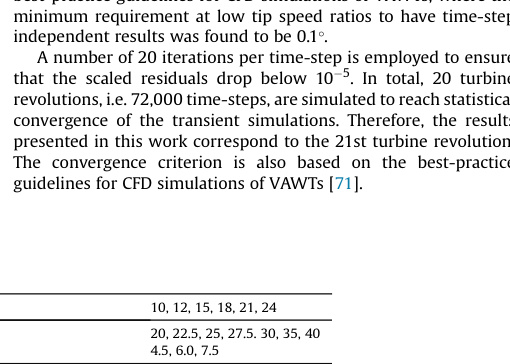
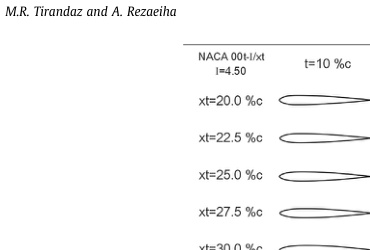

Fig. 4. Symmetric airfoil shape parameters.
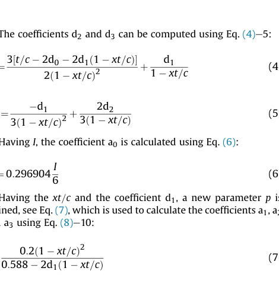

Table 5 Range of studied airfoil shape parameters.

| Parameter | Values |
| --- | --- |
| Relative maximum thickness, t/c [%] | 10, 12, 15, 18, 21, 24 |
| Chordwise position of maximum thickness, xt/c [%] | 20, 22.5, 25, 27.5, 30, 35, 40 |
| Leading-edge radius index, I | 4.5, 6.0, 7.5 |

2.3. Solution verification and validation

The domain size, the azimuthal increment, and the convergence
criterion are based on the best-practice guidelines for CFD simu-
lations of VAWTs [71]. The selection of the domain type is because
our previous comparison with 2.5D URANS simulations showed
negligible systematic difference [69].
The grid is selected based on a grid sensitivity analysis per-
formed for the reference turbine, where the employed grid, coarse
gird, is compared with a grid uniformly doubled in all directions,
resulting in 1,211,260 cells for the fine grid. Fig. 3 shows the turbine
streamwise force coefficient (CFx) during the last turbine revolution
for the coarse and fine grids. The mean and maximum absolute
deviation in CFx between the two grids is 0.01 and 0.07. The Grid
Convergence Index (GCI) by Roache [72] is employed to further
analyze the grid independence of the results. The GCIcoarse calcu-
lated using the turbine thrust coefficient, employing a safety factor
of 1.25, for the coarse-fine grid pair is 0.0073, which is 2.45% of the
Richardson’s extrapolated value. Further details of the grid sensi-
tivity analysis for the reference turbine is given in Ref. [73].
The CFD simulations are validated against three different ex-
periments. The three turbines employed in the validations have
different properties (i. e. different number of blades, solidity, airfoil
shape, tip speed ratio, and Reynolds number). The experiments are
performed in different wind tunnels and they reported dissimilar
flow or turbine quantities. These variety helps to ensure the accu-
racy of the present CFD simulations. A brief overview of the three
validation studies is given below:
Fig. 5. Studied airfoil profiles.
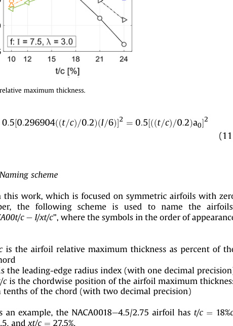

1) Validation study 1: planar PIV measurements by Ferreira et al.
[42] for a one-bladed VAWT equipped with NACA0015 airfoil
operating in dynamic stall is employed for validation study 1. In
the experiment, the blade vorticity evolution was analyzed.
2) Validation study 2: stereoscopic PIV measurements by Tescione
et al. [65] for a two-bladed VAWT equipped with NACA0018
airfoil operating in optimal regime is employed for validation
study 2. The experiment measured the streamwise and lateral
velocities in the turbine near wake.
3) Validation study 3: CP measurements by Castelli et al. [74] for a
three-bladed VAWT equipped with NACA0021 airfoil operating
at a wide range of tip speed ratios is used for validation study 3.
Table 4 presents details of the test and turbine settings and the
absolute deviation (AD) between CFD and experiment in %.
Experimental uncertainty (ExUn) is also reported in % where
available. For brevity, the details of the validation studies are not
repeated here, and the reader is referred to Refs. [66]. For the three
validation studies, acceptable agreement between the CFD and the
experiment was observed.
3. Airfoil shapes

3.1. List of test cases

In the present study, the three main parameters defining the
shape of the symmetric NACA four-digit airfoil series, shown in
Fig. 4, are modified within the ranges given in Table 5.
The selected ranges represent the most practical regimes for the
three parameters, since the typical range for airfoil maximum
thickness is between 10% and 24%; a chordwise position of
maximum thickness greater than 40% results in an undesirable
airfoil shape; and a leading edge with a radius index of smaller than
4.5 and larger than 7.5 would be too sharp and too blunt, respec-
tively. In total, 126 airfoil shapes are generated for the analysis. The
generated airfoil shapes are shown in Fig. 5. The modification of the
airfoil shapes and the related equations are presented in Sec. 3.2.
3.2. Modification of airfoil coordinates

The airfoil shape coordinates (X, Y) for the modified symmetric NACA four-digit airfoil series are defined using Eq. (1) [75]. Taking the airfoil chord as the X-axis ranging from 0 to 1, the equation will provide the ordinates Y using two separate equations for the fore and aft parts of the thickness distribution.

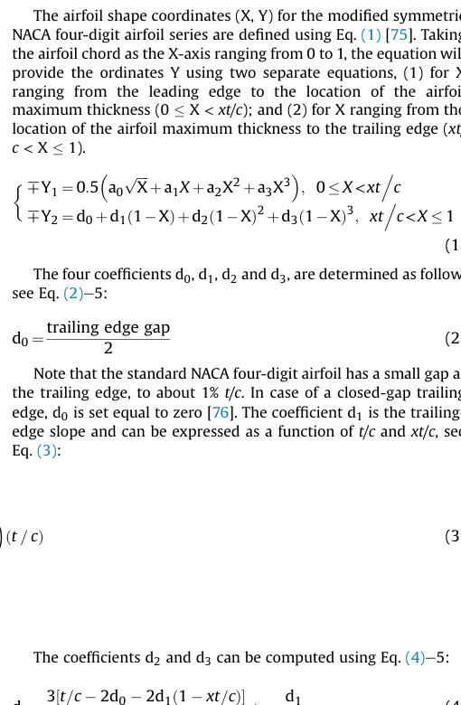

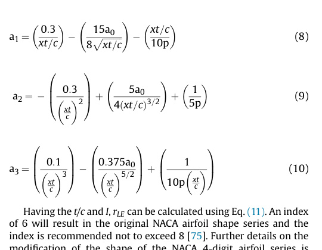

Fig. 6. Angle of attack vs azimuth for tip speed ratios of 2.5 and 3.0. The ass,min and
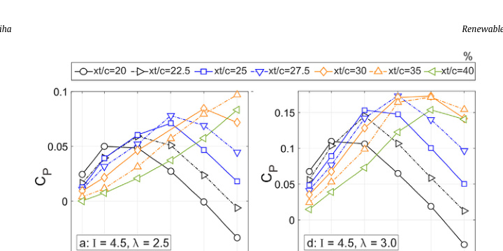

ass,max are the minimum and maximum static stall angles for studied airfoils based on
Xfoil.
3.3. Naming scheme

In this work, which is focused on symmetric airfoils with zero
camber, the following scheme is used to name the airfoils:
“NACA00t/c e I/xt/c”, where the symbols in the order of appearance
are:
- t/c is the airfoil relative maximum thickness as percent of the
chord
- I is the leading-edge radius index (with one decimal precision)
- xt/c is the chordwise position of the airfoil maximum thickness
in tenths of the chord (with two decimal precision)
As an example, the NACA0018e4.5/2.75 airfoil has t/c ¼ 18%c,
I ¼ 4.5, and xt/c ¼ 27.5%.
Fig. 7. Turbine power coefficient versus airfoil relative maximum thickness.
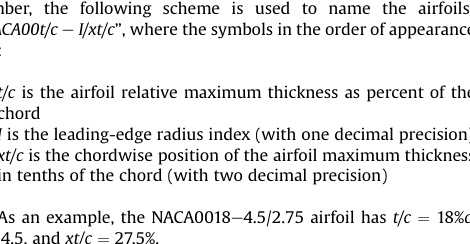

4. Results

The results are classified in three sub-sections, i.e. Sec. 4.1e4.3,
where the impact of the three parameters (t/c, xt/c and I), are
separately discussed. In Sec. 4.4, the overall combined impact of the
airfoil shape parameters on the turbine power performance is
presented. The analysis is performed at two different l of 2.5 and
3.0, where at both l the variations of a exceeds the static stall angle
for all the studied airfoils and the blade experiences deep dynamic
stall. Fig. 6 shows the variations of a during the turbine last revo-
lution at l ¼ 2.5 and 3.0, where the variations of a are more limited
for l ¼ 3.0. Please note that the values of the angle of attack are
directly calculated from the CFD results, applying the method
completely described in Ref. [69].
4.1. Impact of maximum thickness (t/c)

Fig. 7 shows the turbine CP versus t/c for different values of xt/c.
The plots correspond to three different values of I ¼ 4.5, 6.0 and 7.5
(low, moderate and high values), at l ¼ 2.5 and 3.0. Fig. 8 shows the
turbine instantaneous moment coefficient (Cm) during the last
revolution for selected airfoils. It can be seen that:
When the turbine is operating at l ¼ 2.5:
Regarding the airfoils with I ¼ 4.5 (see Fig. 7a): For the airfoils
with xt/c ¼ 20%e30%, a polynomial trend is observed for CP versus t/
c. When t/c increases from 10% to 24%, an initial growth in CP values
is observed. Following that, an optimal t/c (topt/c) exists within the
studied range at which the CP reaches its maximum value (CP,max).
The topt/c is found to gradually increase when xt/c shifts down-
stream towards the trailing edge up to 30%. Higher values of topt/c
for the airfoils with larger xt/c implies that the further downstream
the xt/c is, the thicker the optimal airfoil shape is. For xt/c ¼ 20%,
22.5%, 25%, 27.5% and 30%, topt/c is 12%, 15%, 18%, 18% and 21%,
respectively. Note that increasing t/c also means increasing the
pressure gradient along the airfoil, therefore, to optimally introduce
higher favorable pressure gradient along the airfoil a longer
chordwise extent is shown to be needed. By increasing t/c, the
absolute difference between CP,max and the corresponding CP value
for the thinnest airfoil (t/c ¼ 10%) increases. Such a value for the
airfoils with xt/c ¼ 20%, 22.5%, 25%, 27.5%, and 30% is 0.0254, 0.0426,
0.0585, 0.0672 and 0.0751, respectively. The higher CP,max values for
the thicker blades at their corresponding optimal xt/c (xtopt/c) is due
to the higher level of pressure gradient. This is in good agreement
with the results of the earlier studies which concluded that thicker
blades show a better performance than thinner airfoils [47]. The
observed polynomial trend for CP versus t/c can be explained as
follows. For a fixed xt/c within the discussed range, when t/c in-
creases to the optimal value, at which CP,max occurs, the stall on the
blade is postponed. This can be seen, for example, in Fig. 8a where
the sudden drop in Cm occurs at comparatively higher azimuthal
angles when t/c increases from 10% to 12%. Note that within the
range at which t/c  topt/c, the slope of the Cl e a curve remains
almost invariant to t/c. On the contrary, when t/c > topt/c, the stall on
the blade is promoted, the slope of the Cl e a curve and the Cl,max
value drop and the chordwise extent of the trailing-edge separation
substantially grows due to the higher adverse pressure gradient for
X > xt/c. The comparatively earlier stall can be recognized from the
Cm plots shown in Fig. 8a, where the t/c increases from 12% to 24%.
In contrast to the observed trend for xt/c  30%, for the higher
values of xt/c ¼ 35% and 40%, the CP monotonically grows yielding
the CP,max at the highest thickness of t/c ¼ 24%. The absolute dif-
ference between the CP,max and the corresponding CP value for the
thinnest airfoil (t/c ¼ 10%) for the airfoils with xt/c ¼ 35% and 40% is
0.0657 and 0.083, respectively. The monotonic increase in CP with t/
c is because for the xt/c positions of 35% and 40%, by increasing t/c
the stall on the blade is found to be delayed and the dynamic stall
and the consequent loads fluctuations are alleviated for thicker
airfoils. This can be seen, for example, in Fig. 8b, where increasing t/
c from 10% to 18% results in substantial delay in the sudden drop in
Cm and an increase in the curve peak. By further increase of the t/c
to 24% the Cm drop is altered to a more gradual reduction with more
limited fluctuations due to the diminished dynamic stall. For the
thicker airfoils, e.g. t/c ¼ 24%, (although the slope of the Cl e a curve,
the peak in Cm plot and the Cl,max values are lower) the more
gradual trailing-edge stall results in significantly lower Cd values,
which eventually is reflected as higher turbine CP. Note that due to
the large amount of presented results, the Cl and Cd plots are not
shown and only the turbine Cm plot is shown in Fig. 8.
Regarding the airfoils with I ¼ 6.0 (see Fig. 7b): Similar trend to
that of the smallest I of 4.5 is observed, except that the CP shows a
less sensitivity to t/c. The variations of the CP when t/c changes is
relatively less, compared to I ¼ 4.5, especially for higher values of xt/
c. Note that the topt/c for the airfoils with xt/c ¼ 20% and 25% is 15%,
which is a bit different than that of lower I. The impact of I on the
observed reduction in |DCP| is separately discussed in Sec. 4.3, thus
not elaborated here.
Regarding the airfoils with I ¼ 7.5 (see Fig. 7c): The overall trend
for CP e t/c is similar to those of I ¼ 4.5 and 6.0, although the cor-
responding |DCP| shows noticeably less sensitivity to t/c. For the
airfoils with xt/c ¼ 20%, 22.5%, 25%, 30%, 35% and 40%, the topt/c are
12%, 12%, 15%, 18%, 21% and 15%, respectively.
When the turbine is operating at l ¼ 3.0:
Fig. 8. Turbine instantaneous moment coefficient during the last revolution for
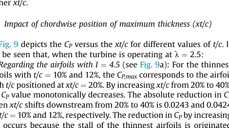

selected airfoils (l ¼ 2.5).

Regarding the airfoils with I ¼ 4.5 (see Fig. 7d): The overall trend
observed for CP e t/c is very similar to that of the lower l of 2.5,
except a noticeable difference that is the CP is found to be signifi-
cantly more sensitive to t/c, leading to comparatively higher values
of |DCP| at l ¼ 3.0. This can be explained as follows. Varying t/c
modifies the pressure gradient distribution along the blade, which
influences the laminar-to-turbulent transition onset and conse-
quently the aerodynamic loads. In the post-stall regime, however,
as the flow over the blade is fully separated, therefore, modification
of t/c will have negligible effect. When l increases from 2.5 to 3.0,
the variation of a reduces, see Fig. 6, and the blade experiences the
post-stall regime within a more limited azimuthal range. Because of
that, the regime within which the t/c and the boundary layer events
are influential expands and this is reflected as the observed higher
sensitivity of the CP to t/c at l ¼ 3.0. Apart from this, the trend for
the xt/c ¼ 35% and 40%, which is monotonic at l ¼ 2.5 within the
studied range, now is changed to polynomial having an optimal t/c
of 21%.
Regarding the airfoils with I ¼ 6.0 (see Fig. 7e): The overall trend
for CP e t/c is similar to both those of the same I at the lower l of 2.5,
and the smallest I of 4.5 at the same l ¼ 3.0. However, the CP is
comparatively less sensitive to t/c (lower values of |DCP|) compared
to that of I ¼ 4.5 at the same l ¼ 3.0 and is found to be noticeably
more sensitive to t/c, compared to I ¼ 4.5 at l ¼ 2.5.
Regarding the airfoils with I ¼ 7.5 (see Fig. 7f): The CP follows the
same trend as those of the smallest and moderate I of 4.5 and 6.0 at
the same l ¼ 3.0, but with comparatively less sensitivity to t/c.
However, comparing to that of the same I ¼ 4.5 at l ¼ 2.5, the |DCP|
is considerably more sensitive to t/c, especially for the airfoils with
higher xt/c.
4.2. Impact of chordwise position of maximum thickness (xt/c)

Fig. 9 depicts the CP versus the xt/c for different values of t/c. It
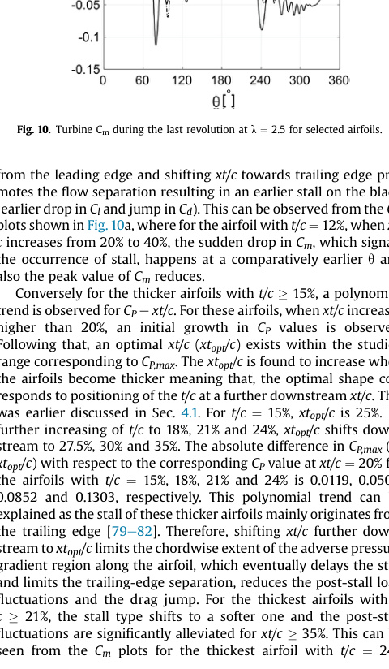

can be seen that, when the turbine is operating at l ¼ 2.5:
Regarding the airfoils with I ¼ 4.5 (see Fig. 9a): For the thinnest
airfoils with t/c ¼ 10% and 12%, the CP,max corresponds to the airfoil
with t/c positioned at xt/c ¼ 20%. By increasing xt/c from 20% to 40%,
the CP value monotonically decreases. The absolute reduction in CP
when xt/c shifts downstream from 20% to 40% is 0.0243 and 0.0424
for t/c ¼ 10% and 12%, respectively. The reduction in CP by increasing
xt/c occurs because the stall of the thinnest airfoils is originated
Fig. 9. Turbine power coefficient versus chordwise position of maximum thickness.

from the leading edge and shifting xt/c towards trailing edge pro-
motes the flow separation resulting in an earlier stall on the blade
(earlier drop in Cl and jump in Cd). This can be observed from the Cm
plots shown in Fig.10a, where for the airfoil with t/c ¼ 12%, when xt/
c increases from 20% to 40%, the sudden drop in Cm, which signals
the occurrence of stall, happens at a comparatively earlier q and
also the peak value of Cm reduces.
Conversely for the thicker airfoils with t/c  15%, a polynomial
trend is observed for CP e xt/c. For these airfoils, when xt/c increases
higher than 20%, an initial growth in CP values is observed.
Following that, an optimal xt/c (xtopt/c) exists within the studied
range corresponding to CP,max. The xtopt/c is found to increase when
the airfoils become thicker meaning that, the optimal shape cor-
responds to positioning of the t/c at a further downstream xt/c. This
was earlier discussed in Sec. 4.1. For t/c ¼ 15%, xtopt/c is 25%. By
further increasing of t/c to 18%, 21% and 24%, xtopt/c shifts down-
stream to 27.5%, 30% and 35%. The absolute difference in CP,max (at
xtopt/c) with respect to the corresponding CP value at xt/c ¼ 20% for
the airfoils with t/c ¼ 15%, 18%, 21% and 24% is 0.0119, 0.0505,
0.0852 and 0.1303, respectively. This polynomial trend can be
explained as the stall of these thicker airfoils mainly originates from
the trailing edge [79e82]. Therefore, shifting xt/c further down-
stream to xtopt/c limits the chordwise extent of the adverse pressure
gradient region along the airfoil, which eventually delays the stall
and limits the trailing-edge separation, reduces the post-stall load
fluctuations and the drag jump. For the thickest airfoils with t/
c  21%, the stall type shifts to a softer one and the post-stall
fluctuations are significantly alleviated for xt/c  35%. This can be
seen from the Cm plots for the thickest airfoil with t/c ¼ 24%
(Fig. 10b), where for higher values of xt/c the turbine Cm improves,
the sudden drop in Cm changes to a more gradual reduction and the
subsequent Cm fluctuations (observed at q values after the drop in
Cm), get less pronounced. The peak in Cm also shifts from q ¼ 60 at
xt/c ¼ 20% to q ¼ 72 at xt/c ¼ 40% (see Fig. 10b). Alleviation of the
stall for the discussed airfoils also results in higher Cm values in the
rotor aft half, 180  q < 360. Further increase of xt/c > xtopt/c, is
found to promote the stall.
Regarding the airfoils with I ¼ 6.0 (see Fig. 9b): The observed
trend for CP e xt/c is very similar to that of I ¼ 4.5 and the xtopt/c for
airfoils with different thickness remain the same. However, the
sensitivity of the CP to the xt/c is more limited as the magnitude of
variations in CP when xt/c changes is comparatively less, especially
for the thicker airfoils. Detailed discussion on the impact of I on the
observed reduction in |DCP| is separately presented in Sec. 4.3, thus
not elaborated here.
Regarding the airfoils with I ¼ 7.5 (see Fig. 9c): The observed
trend for the thinnest airfoils with t/c ¼ 10% and for the thicker
airfoils with t/c > 12%, is similar to those of I ¼ 4.5 and 6.0. For the
airfoils with t/c ¼ 12%, xtopt/c is slightly shifted, i.e. 22.5%. In addi-
tion, |DCP| is found to be noticeably less when xt/c varies.
When the turbine is operating at l ¼ 3.0:
Regarding the airfoils with I ¼ 4.5 (see Fig. 9d): The overall trend
Fig. 10. Turbine Cm during the last revolution at l ¼ 2.5 for selected airfoils.
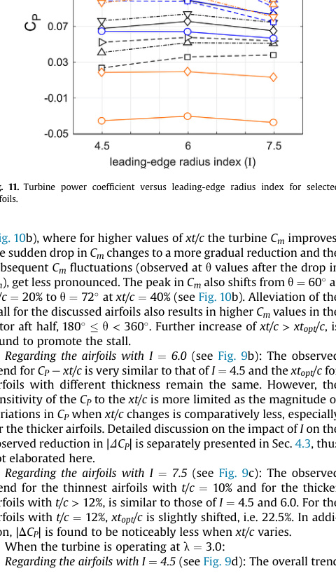

Fig. 11. Turbine power coefficient versus leading-edge radius index for selected
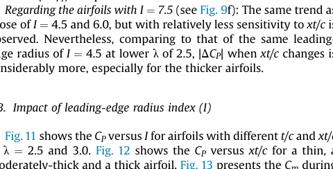

airfoils.

for CP e xt/c is similar to that of the same I at the lower l of 2.5,
except the fact that the CP is comparatively more sensitive to xt/c
(higher values of |DCP| are observed) at l ¼ 3.0, at which the vari-
ation of a is less than that of l ¼ 2.5 (see Fig. 6). This higher
sensitivity can be explained with the same physical reasoning
presented in Sec. 4.1 that is briefed as follows. Varying xt/c modifies
the airfoil pressure gradient distribution, thus influencing the
transition onset and aerodynamic loads. For l ¼ 3.0, the variation of
a reduces (see Fig. 6) and the blade experiences the post-stall
regime within a more limited azimuthal range, thus expanding
the regime within which the variation of the xt/c is influential. This
causes the comparatively higher sensitivity of the CP to xt/c at
l ¼ 3.0. Although the xtopt/c for airfoils with different thickness
remain the same, the CP,max value for the thickest airfoil with t/
c ¼ 24% no longer is higher than that of the airfoil with t/c ¼ 21%, in
contrast to the trend observed at l ¼ 2.5. The fact that at higher l,
the comparatively thinner airfoil of t/c ¼ 21% outperforms the
thicker airfoil of t/c ¼ 24% is because, in general, thicker airfoils have
comparatively lower slope of the Cl e a curve but higher stall angle
and softer stall. Therefore, if the variations of a reduces (higher l),
then what matters most is the superior performance at lower a and
this is where the slope of the Cl e a curve matters more. This results
in the superior performance of the thinner 21%c airfoil over the
thicker 24%c airfoil.
Regarding the airfoils with I ¼ 6.0 (see Fig. 9e): The results for CP
versus xt/c follow a trend similar to those of the same leading-edge
radius at the lower l of 2.5, and also the smallest I of 4.5 at the same
l. However, the CP is noticeably more sensitive to xt/c (higher values
of |DCP|) compared to that of the same leading-edge radius at
l ¼ 2.5 and is found to be comparatively less sensitive to xt/c (lower
values of |DCP|) compared to that of I ¼ 4.5 at l ¼ 3.0.
Regarding the airfoils with I ¼ 7.5 (see Fig. 9f): The same trend as
those of I ¼ 4.5 and 6.0, but with relatively less sensitivity to xt/c is
observed. Nevertheless, comparing to that of the same leading-
edge radius of I ¼ 4.5 at lower l of 2.5, |DCP| when xt/c changes is
considerably more, especially for the thicker airfoils.
4.3. Impact of leading-edge radius index (I)

Fig. 11 shows the CP versus I for airfoils with different t/c and xt/c
at l ¼ 2.5 and 3.0. Fig. 12 shows the CP versus xt/c for a thin, a
moderately-thick and a thick airfoil. Fig. 13 presents the Cm during
Fig. 12. Turbine power coefficient versus chordwise position of maximum thickness (xt/c) for selected airfoils with different leading-edge radius index (I).
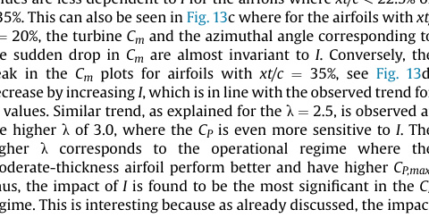

the last turbine revolution for the selected airfoils at l ¼ 2.5. The
observations for these figures are categorized based on t/c as
follows.
Regarding the airfoils with t/c  12% (see Figs. 11 and 12a,d and
13a-b): In general, the CP values of the thin airfoils are found to
be weakly dependent on the leading-edge radius. This can be
explained as changing I will minimally modify the airfoil shape for
thin airfoils due to the geometrical constraints set by the maximum
thickness, thus the aerodynamic loads are marginally influenced by
I. For xt/c ¼ 20%, by increasing I from 4.5 to 7.5, the CP value slightly
decreases. The absolute difference in CP for the airfoil with I ¼ 4.5
with respect to the corresponding value at I ¼ 6.0 and 7.5 is 0.012
and 0.016, respectively. This small reduction in CP is also consistent
with the observed trend for the Cm plots for the thin airfoils with
different I, see Fig. 13a. The analysis shows that by increasing I for
the thin airfoils, the Cd,max slightly increases resulting in the
observed marginal reduction in CP. This is while the slope of the Cl e
a curve and the astall remain almost unchanged and a light increase
in Cl,max for higher values of I is observed. The impact of I on the CP
remains marginal for the thinner airfoils with xt/c further down-
stream as well. Similar trend is observed at the higher l of 3.0,
where the CP is weakly sensitive to I.
Regarding the airfoils with 15%  t/c  18% (see Figs. 11 and 12b,e
and 13c-d): The observed trend for CP e I is different from that of
the thinner airfoils. Firstly, the CP values are found to monotonically
decrease by increasing I, regardless of the t/c and xt/c. This is
thought to be due to the increase in the Cd,max for higher values of I.
Secondly, the CP values are more significantly sensitive to I,
compared to the thinner airfoils. This could be explained as the
comparatively higher t/c of these airfoil imposes less geometrical
constraints and changing the leading-edge radius can more
noticeably influence the airfoil shape, compared to the thinner
airfoils. The higher sensitivity of CP to I is more prominent for
moderate values of xt/c, 22.5%  xt/c  35%. This range approxi-
mately corresponds to the optimal CP range for such airfoils and the
highest sensitivity of CP to I is observed at the CP,max. The absolute
differences between the CP,max values for NACA0018-I/2.75 when I
increases from 4.5 to I ¼ 6.0 and 7.5 are 0.022 and 0.0423. The CP
values are less dependent to I for the airfoils where xt/c < 22.5% or
>35%. This can also be seen in Fig. 13c where for the airfoils with xt/
c ¼ 20%, the turbine Cm and the azimuthal angle corresponding to
the sudden drop in Cm are almost invariant to I. Conversely, the
peak in the Cm plots for airfoils with xt/c ¼ 35%, see Fig. 13d,
decrease by increasing I, which is in line with the observed trend for
CP values. Similar trend, as explained for the l ¼ 2.5, is observed at
the higher l of 3.0, where the CP is even more sensitive to I. The
higher l corresponds to the operational regime where the
moderate-thickness airfoil perform better and have higher CP,max.
Thus, the impact of I is found to be the most significant in the CP
regime. This is interesting because as already discussed, the impact
Fig. 13. Turbine Cm during the last revolution at l ¼ 2.5 for selected airfoils with different I.
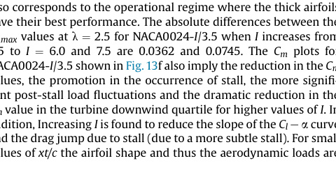

Table 6
Impact of leading-edge radius index on CP for NACA0021-I/3.0.

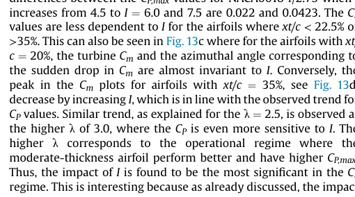

of the I is also more significant at moderate values of xt/c, corre-
sponding to the optimal values. Below it is shown that for the
thicker airfoils where the optimal regime is slightly shifted, the
range of most prominent influence of I is similarly shifted.
Regarding the airfoils with t/c > 18% (see Figs. 11 and 12c,f and
13e-f): The observations for the thicker airfoils are quite similar
to those of the moderate-thickness airfoils. The CP is found to
monotonically decrease by increasing I. Table 6 gives an example
for the airfoil NACA0021-I/3.0, where the increase in CP by reduc-
tion in I is quantified. In addition, the highest sensitivity of CP to I is
found to occur at the optimal range of xt/c, which for thick airfoils
correspond to larger values of xt/c, and at the lower l of 2.5, which
also corresponds to the operational regime where the thick airfoils
have their best performance. The absolute differences between the
CP,max values at l ¼ 2.5 for NACA0024-I/3.5 when I increases from
4.5 to I ¼ 6.0 and 7.5 are 0.0362 and 0.0745. The Cm plots for
NACA0024-I/3.5 shown in Fig.13f also imply the reduction in the Cm
values, the promotion in the occurrence of stall, the more signifi-
cant post-stall load fluctuations and the dramatic reduction in the
Cm value in the turbine downwind quartile for higher values of I. In
addition, Increasing I is found to reduce the slope of the Cl e a curve
and the drag jump due to stall (due to a more subtle stall). For small
values of xt/c the airfoil shape and thus the aerodynamic loads are
Fig. 14. Turbine CP in t/c e xt/c space. Each contour plot is based on 42 simulations. Note the difference in range of colormaps.
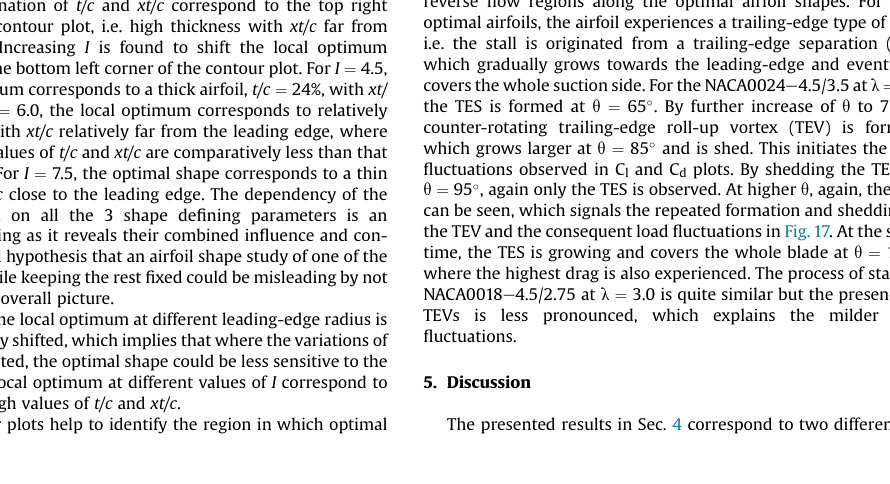

Table 7 Optimal airfoil shapes for lambda = 2.5 and 3.0.

| lambda | Name | t/c [%] | xt/c [%] | I [-] |
| --- | --- | --- | --- | --- |
| 2.5 | NACA0024e4.5/3.5 | 24 | 35 | 4.5 |
| 3.0 | NACA0018e4.5/2.75 | 18 | 27.5 | 4.5 |

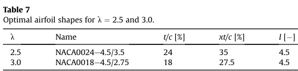
3.0
NACA0018e4.5/2.75
27.5
4.5

insignificantly sensitive to I. As can be seen, for example, in Fig. 13e,
the turbine Cm and the instant of the stall occurrence are almost
invariant to I.
4.4. Overall impact of airfoil shape

This section gives an overall view of the combined impact of the
airfoil shape on the turbine CP and CT at the l of 2.5 and 3.0 in deep
dynamic stall.
Fig. 14 illustrates the CP values in t/c e xt/c space for different I
and l. At both l, the global optimum corresponds to the smallest I
of 4.5. At the lower l of 2.5, where the variations of a are higher, the
global optimum occurs at higher t/c and xt/c, compared to the l of
3.0. Increasing l, results in reduction in the range of variations of a,
which influences the global optimum, by decreasing the optimal
values of t/c and xt/c. Table 7 lists the characteristics of the optimal
airfoils at both l and the optimal airfoils are illustrated in Fig. 15.
The dependency of the global optimal airfoil characteristics shows
the significance of the fact that the airfoil design needs to be with
careful considerations regarding the target operational conditions
of the turbine.
At l ¼ 2.5, for the smallest leading-edge radius, I ¼ 4.5, the
optimal combination of t/c and xt/c correspond to the top right
corner of the contour plot, i.e. high thickness with xt/c far from
leading edge. Increasing I is found to shift the local optimum
diagonally to the bottom left corner of the contour plot. For I ¼ 4.5,
the local optimum corresponds to a thick airfoil, t/c ¼ 24%, with xt/
c ¼ 35%. For I ¼ 6.0, the local optimum corresponds to relatively
thick airfoils with xt/c relatively far from the leading edge, where
both optimal values of t/c and xt/c are comparatively less than that
of the I ¼ 4.5. For I ¼ 7.5, the optimal shape corresponds to a thin
airfoil with xt/c close to the leading edge. The dependency of the
local optimum on all the 3 shape defining parameters is an
important finding as it reveals their combined influence and con-
firms the initial hypothesis that an airfoil shape study of one of the
parameters while keeping the rest fixed could be misleading by not
presenting the overall picture.
At l ¼ 3.0, the local optimum at different leading-edge radius is
less significantly shifted, which implies that where the variations of
a are more limited, the optimal shape could be less sensitive to the
I. Overall, the local optimum at different values of I correspond to
moderate to high values of t/c and xt/c.
The contour plots help to identify the region in which optimal
airfoil characteristics lie, while also revealing the regions of the
poor turbine CP, which need to be avoided. Such plots may aid as a
conceptual reference for VAWT designers and manufacturers to
make the right decisions in the initial design stages, so that they can
achieve the desired goals.
Fig. 16 illustrates the turbine CT values in t/c e xt/c space for
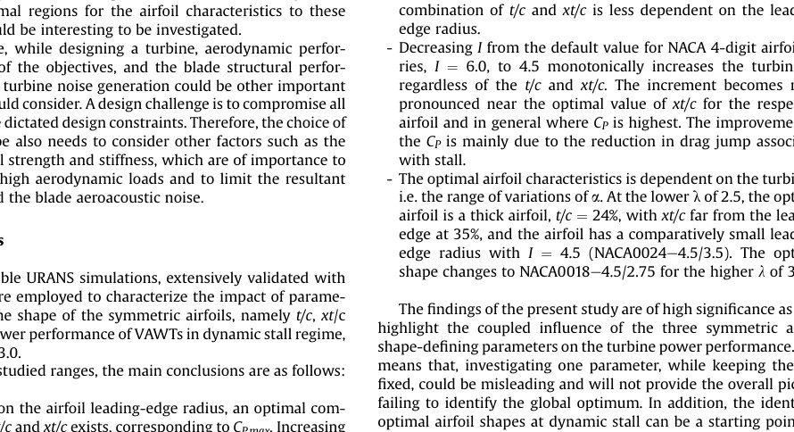

different I at l ¼ 2.5 and 3.0. An important observation is that the
regions of highest CT are not coinciding with the local optimums in
CP plots. The CT,max regions are, consistently for all values of I and l,
corresponding to the bottom left corner of the plots, i.e. thin airfoils
with t/c positioned near the leading edge. This inconsistency in the
regions of the optimal CP and the CT,max is of significant importance
and is contrary to the typical observations for the HAWTs. Typically
for HAWTs, where the turbine exerts higher thrust loads on the
flow, it can also extract more energy, therefore, the optimal points
for CP and CT are correlated, within a range. However, the under-
lying physics of VAWTs is different, and a direct correlation be-
tween the CP and CT values are not present. Therefore, the CT values
are of less importance when analyzing the turbine power perfor-
mance and could be more relevant to the structural analysis of the
turbine and tower. Nevertheless, increasing I is found to increase
the extent of the region of high CT values. In addition, the turbine
experiences higher CT values at higher l of 3.0.
4.5. Aerodynamic analysis of optimal airfoils

Fig. 17 shows the aerodynamic load coefficients, namely lift and
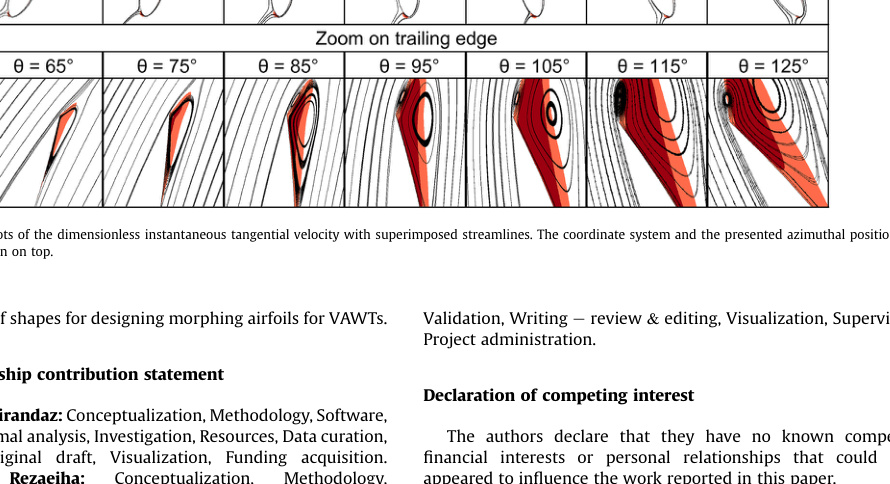

drag coefficients Cl and Cd, versus q and angle of attack a during the
turbine last half-revolution for the optimal airfoil shapes at l ¼ 2.5
and 3.0, which are NACA0024e4.5/3.5 and NACA0018e4.5/2.75,
respectively. For both cases, the occurrence of dynamic stall is
apparent with post-stall load fluctuations, load hysteresis, the lift
drops and the drag jump. The optimal airfoils have a Cl,max of nearly
1.5. The drag jump is less substantial at the higher l of 3.0, where
the range of variation of a is more limited and the airfoil experi-
ences comparatively lighter dynamic stall.
Fig. 18 illustrates contour plots of the dimensionless instanta-
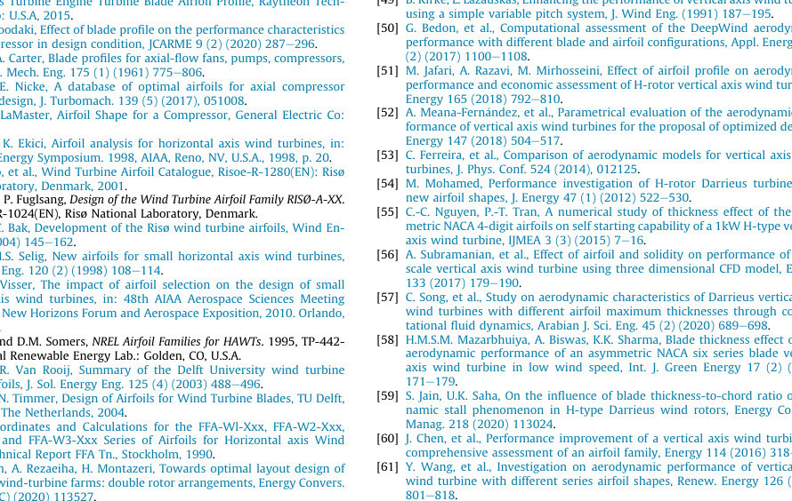

neous tangential velocity (Vtan,n) with superimposed streamlines at
selected azimuthal positions for the optimal airfoils. On top of the
figure the coordinate system and the presented azimuthal positions
are schematically shown. The figure is presented to highlight the
reverse flow regions along the optimal airfoil shapes. For both
optimal airfoils, the airfoil experiences a trailing-edge type of stall,
i.e. the stall is originated from a trailing-edge separation (TES)
which gradually grows towards the leading-edge and eventually
covers the whole suction side. For the NACA0024e4.5/3.5 at l ¼ 2.5,
the TES is formed at q ¼ 65. By further increase of q to 75, a
counter-rotating trailing-edge roll-up vortex (TEV) is forming
which grows larger at q ¼ 85 and is shed. This initiates the load
fluctuations observed in Cl and Cd plots. By shedding the TEV, at
q ¼ 95, again only the TES is observed. At higher q, again, the TEV
can be seen, which signals the repeated formation and shedding of
the TEV and the consequent load fluctuations in Fig. 17. At the same
time, the TES is growing and covers the whole blade at q ¼ 125,
where the highest drag is also experienced. The process of stall for
NACA0018e4.5/2.75 at l ¼ 3.0 is quite similar but the presence of
TEVs
is
less
pronounced,
which
explains
the
milder
load
fluctuations.
5. Discussion

The presented results in Sec. 4 correspond to two different tip
Fig. 15. Optimal airfoil shapes for l ¼ 2.5 and 3.0.
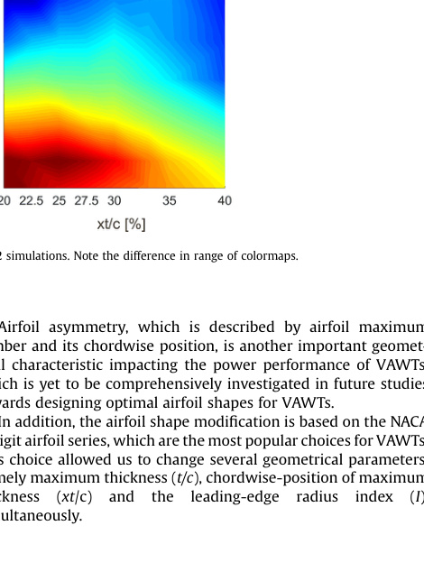

speed ratios of 2.5 and 3, where the turbine blade experiences deep
dynamic stall, with different range of variations of the angle of
attack. The analysis highlights the dependency of the optimal airfoil
shape to the turbine tip speed ratio, i.e. the range of variation of a.
This dependency suggests the importance of continuation of this
work for other tip speed ratios, where a light dynamic stall would
occur, or dynamic stall is avoided. In addition, the study is per-
formed at a fixed Reynolds number, turbulence intensity and
reduced frequency, where the variance of the optimal airfoil char-
acteristics to these operational parameters is also of interest for
future studies.
Airfoil asymmetry, which is described by airfoil maximum
camber and its chordwise position, is another important geomet-
rical characteristic impacting the power performance of VAWTs,
which is yet to be comprehensively investigated in future studies
towards designing optimal airfoil shapes for VAWTs.
In addition, the airfoil shape modification is based on the NACA
4-digit airfoil series, which are the most popular choices for VAWTs.
This choice allowed us to change several geometrical parameters,
namely maximum thickness (t/c), chordwise-position of maximum
thickness
(xt/c)
and
the
leading-edge
radius
index
(I),
simultaneously.
Fig. 16. Turbine CT in t/c e xt/c space. Each contour plot is based on 42 simulations. Note the difference in range of colormaps.

The focus of the analysis in the present study is on the analysis of
the turbine power performance under the influence of the afore-
mentioned airfoil shape defining parameters. However, other pa-
rameters, such as the blade surface roughness, turbine solidity and
the number of blades (esp. for high solidity turbines) could also
influence the airfoil aerodynamic loads and thus could impact the
choice of the optimal airfoil shape. Therefore, the sensitivity of the
identified optimal regions for the airfoil characteristics to these
parameters could be interesting to be investigated.
Furthermore, while designing a turbine, aerodynamic perfor-
mance is one of the objectives, and the blade structural perfor-
mance and the turbine noise generation could be other important
factors one should consider. A design challenge is to compromise all
considering the dictated design constraints. Therefore, the choice of
the airfoil shape also needs to consider other factors such as the
blade structural strength and stiffness, which are of importance to
withstand the high aerodynamic loads and to limit the resultant
deflections, and the blade aeroacoustic noise.
6. Conclusions

Incompressible URANS simulations, extensively validated with
experiments, are employed to characterize the impact of parame-
ters defining the shape of the symmetric airfoils, namely t/c, xt/c
and I, on the power performance of VAWTs in dynamic stall regime,
at l ¼ 2.5 and 3.0.
Within the studied ranges, the main conclusions are as follows:
- Depending on the airfoil leading-edge radius, an optimal com-
bination of t/c and xt/c exists, corresponding to CP,max. Increasing
t/c, shifts the optimal xt/c towards the trailing edge. In addition,
by increasing t/c (i.e. thicker airfoils), the CP becomes more
significantly sensitive to xt/c.
- At l ¼ 2.5, increasing I from 4.5 to 7.5 shifts the optimal com-
bination of t/c and xt/c from high values, i.e. thick airfoils with xt/
c far from the leading edge, to low values, i.e. thin airfoils with
xt/c near the leading edge. At the higher l of 3.0, the optimal
combination of t/c and xt/c is less dependent on the leading-
edge radius.
- Decreasing I from the default value for NACA 4-digit airfoil se-
ries, I ¼ 6.0, to 4.5 monotonically increases the turbine CP,
regardless of the t/c and xt/c. The increment becomes more
pronounced near the optimal value of xt/c for the respective
airfoil and in general where CP is highest. The improvement in
the CP is mainly due to the reduction in drag jump associated
with stall.
- The optimal airfoil characteristics is dependent on the turbine l,
i.e. the range of variations of a. At the lower l of 2.5, the optimal
airfoil is a thick airfoil, t/c ¼ 24%, with xt/c far from the leading
edge at 35%, and the airfoil has a comparatively small leading-
edge radius with I ¼ 4.5 (NACA0024e4.5/3.5). The optimal
shape changes to NACA0018e4.5/2.75 for the higher l of 3.0.
The findings of the present study are of high significance as they
highlight the coupled influence of the three symmetric airfoil
shape-defining parameters on the turbine power performance. This
means that, investigating one parameter, while keeping the rest
fixed, could be misleading and will not provide the overall picture
failing to identify the global optimum. In addition, the identified
optimal airfoil shapes at dynamic stall can be a starting point for
Fig. 17. Variations of lift and drag coefficients versus azimuth and angle of attack during the last turbine half-revolution for the optimal airfoil shapes, i.e. NACA0024e4.5/3.50 and
NACA0018e4.5/2.75 at l ¼ 2.5 and 3.0.

defining a set of shapes for designing morphing airfoils for VAWTs.
CRediT authorship contribution statement
M. Rasoul Tirandaz: Conceptualization, Methodology, Software,

a Sharif University of Technology, Tehran, Iran
b KU Leuven, Leuven, Belgium
c Eindhoven University of Technology, Eindhoven, the Netherlands

Validation, Formal analysis, Investigation, Resources, Data curation,
Writing
e
original
draft,
Visualization,
Funding
acquisition.
Abdolrahim
Rezaeiha:
Conceptualization,
Methodology,
Validation, Writing e review & editing, Visualization, Supervision,
Project administration.
Declaration of competing interest
The authors declare that they have no known competing
financial interests or personal relationships that could have
appeared to influence the work reported in this paper.
Fig. 18. Contour plots of the dimensionless instantaneous tangential velocity with superimposed streamlines. The coordinate system and the presented azimuthal positions are
schematically shown on top.

Acknowledgement

The first author acknowledges the support from his home uni-
versity for the use of supercomputing facilities. The second author
is currently a postdoctoral fellow of the Research Foundation e
Flanders (FWO) and is grateful for the financial support (project
FWO 12ZP520N).
References

[1] M. Aoki, H. Nishimura, E. Yamakawa, Effect of Airfoil on rotational noise of
helicopter rotor, in: Aircraft Symposium vol. 33, Hiroshima, Japan, 1995.
[2] M.A. McVeigh, F.J. McHugh, Influence of tip shape, chord, blade number, and
airfoil on advanced rotor performance, J. Am. Helicopter Soc. 29 (4) (1984)
55e62.
[3] J.J. Thibert, J. Pouradier, Design and test of an helicopter rotor blade with
evolutive profile, in: 12 Th Congress of the International Council of the
Aeronautical Sciences ICAS, 1980 (Munich, Germany).
[4] A. Gopalarathnam, C. McAvoy, Effect of airfoil aharacteristics and trim con-
siderations on aircraft performance, in: 19th AIAA Applied Aerodynamics
Conference, 2001 (Anaheim, CA, U.S.A).
[5] A. Gopalarathnam, C.W. McAvoy, Effect of airfoil characteristics on aircraft
performance, J. Aircraft 39 (3) (2002) 427e433.
[6] W. Letko, J.D. Brewer, Effect of Airfoil Profile of Symmetrical Sections on the
Low-Speed Rolling Derivatives of 45 Degree Sweptback-Wing Models of
Aspect Ratio 2.61, National Advisory Committee for Aeronautics, Washington,
D.C, 1949.
[7] R.M. Wood, D.S. Miller, Impact of airfoil profile on the supersonic aero-
dynamics of delta wings, J. Aircraft 23 (9) (1986) 695e702.
[8] N. Teja, et al., Optimization of micro air vehicle airfoil, IJRET 5 (3) (2016)
217e219.
[9] L. Zhao, S. Yang, Influence of thickness variation on the flapping performance
of symmetric NACA airfoils in plunging motion, Math. Probl Eng. 2010 (2010)
19.
[10] K.A. Ismail, C.V. Rosolen, Effects of the airfoil section, the chord and pitch
distributions on the aerodynamic performance of the propeller, J. Braz. Soc.
Mech. Sci. Eng. 41 (3) (2019) 1e19.
[11] E.N. Jacobs, Characteristics of Propeller Sections Tested in the Variable Density
Wind Tunnel, NACA-TR-259, National Advisory Committee for Aeronautics,
U.S.A., 1928, pp. 125e140.
[12] H. Zhang, Y. Hu, G. Wang, The effect of aerofoil camber on cycloidal propellers,
AEAT 90 (8) (2018) 1156e1167.
[13] S. Abraham, et al., Effect of airfoil shape and turning angle on turbine airfoil
aerodynamic performance at transoniccConditions, in: ASME 2011 Interna-
tional Mechanical Engineering Congress and Exposition, 2011. Denver, Colo-
rado, USA.
[14] T.C. Nash, Gas Turbine Engine Turbine Blade Airfoil Profile, Raytheon Tech-
nologies Corp: U.S.A, 2015.
[15] S. Abbasi, A. Joodaki, Effect of blade profile on the performance characteristics
of axial compressor in design condition, JCARME 9 (2) (2020) 287e296.
[16] A.M. Group, A. Carter, Blade profiles for axial-flow fans, pumps, compressors,
etc, Proc. Inst. Mech. Eng. 175 (1) (1961) 775e806.
[17] M. Schnoes, E. Nicke, A database of optimal airfoils for axial compressor
throughflow design, J. Turbomach. 139 (5) (2017), 051008.
[18] A. Shrum, C. LaMaster, Airfoil Shape for a Compressor, General Electric Co:
U.S.A, 2009.
[19] I. Akmandor, K. Ekici, Airfoil analysis for horizontal axis wind turbines, in:
ASME Wind Energy Symposium. 1998, AIAA, Reno, NV, U.S.A., 1998, p. 20.
[20] F. Bertagnolio, et al., Wind Turbine Airfoil Catalogue, Risoe-R-1280(EN): Risø
National Laboratory, Denmark, 2001.
[21] Dahl, K.S. and P. Fuglsang, Design of the Wind Turbine Airfoil Family RISØ-A-XX.
1998: Risoe-R-1024(EN), Risø National Laboratory, Denmark.
[22] P. Fuglsang, C. Bak, Development of the Risø wind turbine airfoils, Wind En-
ergy 7 (2) (2004) 145e162.
[23] P. Giguere, M.S. Selig, New airfoils for small horizontal axis wind turbines,
J. Sol. Energy Eng. 120 (2) (1998) 108e114.
[24] B. Kanya, K. Visser, The impact of airfoil selection on the design of small
horizontal axis wind turbines, in: 48th AIAA Aerospace Sciences Meeting
Including the New Horizons Forum and Aerospace Exposition, 2010. Orlando,
Florida, U.S.A.
[25] Tangler, J.L. and D.M. Somers, NREL Airfoil Families for HAWTs. 1995, TP-442-
7109, National Renewable Energy Lab.: Golden, CO, U.S.A.
[26] W. Timmer, R. Van Rooij, Summary of the Delft University wind turbine
dedicated airfoils, J. Sol. Energy Eng. 125 (4) (2003) 488e496.
[27] R. van Rooij, N. Timmer, Design of Airfoils for Wind Turbine Blades, TU Delft,
Faculty CiTG, The Netherlands, 2004.
[28] A. Bjorck, Coordinates and Calculations for the FFA-Wl-Xxx, FFA-W2-Xxx,
FFA-W2-Xxx and FFA-W3-Xxx Series of Airfoils for Horizontal axis Wind
Turbines, Technical Report FFA Tn., Stockholm, 1990.
[29] S. Sahebzadeh, A. Rezaeiha, H. Montazeri, Towards optimal layout design of
vertical-axis wind-turbine farms: double rotor arrangements, Energy Convers.
Manag. 226 (C) (2020) 113527.
[30] A. Rezaeiha, H. Montazeri, B. Blocken, A framework for preliminary large-scale
urban wind energy potential assessment: roof-mounted wind turbines, En-
ergy Convers. Manag. 214 (C) (2020) 112770.
[31] Y. Kato, K. Seki, Y. Shimizu, Vertical axis wind turbine designed aero-
dynamically at Tokai University, Period. Polytech. - Mech. Eng. 25 (1) (1981)
47e56.
[32] P.C. Klimas, Tailored Airfoils for Vertical axis Wind Turbines, Sandia National
Laboratories, Albuquerque, NM, USA, 1984. Technical Report SAND84-1062.
[33] R. Galbraith, F. Coton, D. Jiang, Aerodynamic Design of Vertical axis Wind
Turbines, GU Aero Report 9246. Department of Aerospace Engineering, Uni-
versity of Glasgow, Scotland, 1992.
[34] M. Claessens, The design and testing of airfoils for application in small vertical
axis wind turbines, in: Faculty of Aerospace Engineering, Delft University of
Technology, 2006.
[35] C.S. Ferreira, B. Geurts, Aerofoil optimization for vertical-axis wind turbines,
Wind Energy 18 (8) (2015) 1371e1385.
[36] B. Hand, G. Kelly, A. Cashman, Aerodynamic design and performance pa-
rameters of a lift-type vertical axis wind turbine: a comprehensive review,
Renew. Sustain. Energy Rev. 139 (2021), 110699.
[37] S. Zanforlin, Advantages of vertical axis tidal turbines set in close proximity: a
comparative CFD investigation in the English channel, Ocean. Eng. 156 (2018)
358e372.
[38] M. Abkar, Theoretical modeling of vertical-axis wind turbine wakes, Energies
12 (1) (2018) 10.
[39] M. Elkhoury, et al., Wind tunnel experiments and delayed detached eddy
simulation of a three-bladed micro vertical axis wind turbine, Renew. Energy
129 (2018) 63e74.
[40] A. Sagharichi, M. Zamani, A. Ghasemi, Effect of solidity on the performance of
variable-pitch vertical axis wind turbine, Energy 161 (2018) 753e775.
[41] A. Ebrahimi, M. Movahhedi, Power improvement of NREL 5-MW wind turbine
using multi-DBD plasma actuators, Energy Convers. Manag. 146 (2017)
96e106.
[42] C.S. Ferreira, et al., Visualization by PIV of dynamic stall on a vertical axis wind
turbine, Exp. Fluid 46 (1) (2009) 97e108.
[43] B. Hand, G. Kelly, A. Cashman, Numerical simulation of a vertical axis wind
turbine airfoil experiencing dynamic stall at high Reynolds numbers, Comput.
Fluids 149 (2017) 12e30.
[44] K. Mulleners, M. Raffel, The onset of dynamic stall revisited, Exp. Fluid 52 (3)
(2012) 779e793.
[45] A. Rezaeiha, H. Montazeri, B. Blocken, CFD analysis of dynamic stall on vertical
axis wind turbines using Scale-Adaptive simulation (SAS): comparison against
URANS and hybrid RANS/LES, Energy Convers. Manag. 196 (2019) 1282e1298.
[46] A. Rezaeiha, H. Montazeri, B. Blocken, CFD investigation of separation control
on a vertical axis wind turbine: steady and unsteady suction, J. Phys. Conf.
1618 (2020), 052019.
[47] J. Healy, The influence of blade thickness on the output of vertical axis wind
turbines, Wind Eng. 2 (1) (1978) 1e9.
[48] P. Migliore, Comparison of NACA 6-series and 4-digit airfoils for Darrieus wind
turbines, J. Energy 7 (4) (1983) 291e292.
[49] B. Kirke, L. Lazauskas, Enhancing the performance of vertical axis wind turbine
using a simple variable pitch system, J. Wind Eng. (1991) 187e195.
[50] G. Bedon, et al., Computational assessment of the DeepWind aerodynamic
performance with different blade and airfoil configurations, Appl. Energy 185
(2) (2017) 1100e1108.
[51] M. Jafari, A. Razavi, M. Mirhosseini, Effect of airfoil profile on aerodynamic
performance and economic assessment of H-rotor vertical axis wind turbines,
Energy 165 (2018) 792e810.
[52] A. Meana-Fernandez, et al., Parametrical evaluation of the aerodynamic per-
formance of vertical axis wind turbines for the proposal of optimized designs,
Energy 147 (2018) 504e517.
[53] C. Ferreira, et al., Comparison of aerodynamic models for vertical axis wind
turbines, J. Phys. Conf. 524 (2014), 012125.
[54] M. Mohamed, Performance investigation of H-rotor Darrieus turbine with
new airfoil shapes, J. Energy 47 (1) (2012) 522e530.
[55] C.-C. Nguyen, P.-T. Tran, A numerical study of thickness effect of the sym-
metric NACA 4-digit airfoils on self starting capability of a 1kW H-type vertical
axis wind turbine, IJMEA 3 (3) (2015) 7e16.
[56] A. Subramanian, et al., Effect of airfoil and solidity on performance of small
scale vertical axis wind turbine using three dimensional CFD model, Energy
133 (2017) 179e190.
[57] C. Song, et al., Study on aerodynamic characteristics of Darrieus vertical axis
wind turbines with different airfoil maximum thicknesses through compu-
tational fluid dynamics, Arabian J. Sci. Eng. 45 (2) (2020) 689e698.
[58] H.M.S.M. Mazarbhuiya, A. Biswas, K.K. Sharma, Blade thickness effect on the
aerodynamic performance of an asymmetric NACA six series blade vertical
axis wind turbine in low wind speed, Int. J. Green Energy 17 (2) (2020)
171e179.
[59] S. Jain, U.K. Saha, On the influence of blade thickness-to-chord ratio on dy-
namic stall phenomenon in H-type Darrieus wind rotors, Energy Convers.
Manag. 218 (2020) 113024.
[60] J. Chen, et al., Performance improvement of a vertical axis wind turbine by
comprehensive assessment of an airfoil family, Energy 114 (2016) 318e331.
[61] Y. Wang, et al., Investigation on aerodynamic performance of vertical axis
wind turbine with different series airfoil shapes, Renew. Energy 126 (2018)
801e818.

[62] D. Ragni, C.S. Ferreira, G. Correale, Experimental investigation of an optimized
airfoil
for vertical-axis wind turbines, J. Wind Energy 18 (9)
(2015)
1629e1643.
[63] M.T. Asr, et al., Study on start-up characteristics of H-Darrieus vertical axis
wind turbines comprising NACA 4-digit series blade airfoils, Energy 112
(2016) 528e537.
[64] C. Song, et al., Numerical investigation on the effects of airfoil leading edge
radius on the aerodynamic performance of H-Rotor Darrieus vertical axis
wind turbine, Energies 12 (19) (2019) 3794.
[65] G. Tescione, et al., Near wake flow analysis of a vertical axis wind turbine by
stereoscopic particle image velocimetry, Renew. Energy 70 (2014) 47e61.
[66] A. Rezaeiha, H. Montazeri, B. Blocken, On the accuracy of turbulence models
for CFD simulations of vertical axis wind turbines, Energy 180 (2019)
838e857.
[67] A. Rezaeiha, et al., Effect of the shaft on the aerodynamic performance of
urban vertical axis wind turbines, Energy Convers. Manag. 149 (2017)
616e630.
[68] A. Rezaeiha, H. Montazeri, B. Blocken, Towards optimal aerodynamic design of
vertical axis wind turbines: impact of solidity and number of blades, Energy
165 (2018) 1129e1148.
[69] A. Rezaeiha, H. Montazeri, B. Blocken, Characterization of aerodynamic per-
formance of vertical axis wind turbines: impact of operational parameters,
Energy Convers. Manag. 169 (2018) 45e77.
[70] A. Rezaeiha, H. Montazeri, B. Blocken, Scale-adaptive simulation (SAS) of dy-
namic stall on a wind turbine, in: Progress in Hybrid RANS-LES Modelling,
Springer, 2020, pp. 323e333.
[71] A. Rezaeiha, H. Montazeri, B. Blocken, Towards accurate CFD simulations of
vertical axis wind turbines at different tip speed ratios and solidities:
guidelines for azimuthal increment, domain size and convergence, Energy
Convers. Manag. 156 (2018) 301e316.
[72] P.J. Roache, Quantification of uncertainty in computational fluid dynamics,
Annu. Rev. Fluid Mech. 29 (1997) 123e160.
[73] A. Rezaeiha, H. Montazeri, B. Blocken, Active flow control for power
enhancement of vertical axis wind turbines: leading-edge slot suction, Energy
189 (2019) 116131.
[74] M.R. Castelli, A. Englaro, E. Benini, The Darrieus wind turbine: proposal for a
new performance prediction model based on CFD, Energy 36 (8) (2011)
4919e4934.
[75] I.H. Abbott, A.E. Von Doenhoff, Theory of Wing Sections: Including a Summary
of Airfoil Data, McGraw-Hill, New York, 1949.
[76] Pickering, K.A., Recovered Equations and Ordinates of the G€ottingen 765
Airfoil.
[77] P.A. Henne, Applied Computational Aerodynamics. Progress in Astronautics
and Aeronautics, vol. 125, American Institute of Aeronautics and Astronautics
(AIAA), Washington, D.C., 1990.
[78] E.N. Jacobs, K.E. Ward, R.M. Pinkerton, The Characteristics of 78 Related Airfoil
Sections from Tests in the Variable-Density Wind Tunnel, NACA Report 460,
US Government Printing Office, 1933.
[79] W.J. McCroskey, The Phenomenon of Dynamic Stall, NASA TM 81264, NASA,
Moffett Field CA. ARC, 1981.
[80] A. Sharma, M. Visbal, Numerical investigation of the effect of airfoil thickness
on onset of dynamic stall, J. Fluid Mech. 870 (2019) 870e900.
[81] V.A. Frolov, Laminar separation point of flow on surface of symmetrical airfoil,
in: Perm, Russia AIP Conference Proceedings., AIP Publishing LLC, 2016.
[82] J. Meseguer, et al., On the circulation and the position of the forward stag-
nation point on airfoils, Int. J. Mech. Eng. Educ. 35 (1) (2007) 65e75.
