# Global optimization of Savonius-type vertical axis wind turbine with multiple circular-arc blades using validated 3D CFD model

Ivo Marinić-Kragić, Damir Vučina, Zoran Milas

## Abstract

Vertical-axis wind turbines, such as Savonius-type wind turbines (SWT), are an attractive choice for small-scale electricity generation. Some of the advantages of the SWTs are low speed, low noise, and self-starting ability, but the main disadvantage is the low efficiency. In this paper, the efficiency is improved by optimization of a multi-blade SWT (2, 4 and 6), with blades based on circular arc segments. Additional optimization variables were the tip-speed ratio and the aspect ratio. The main novelty of this paper is the global optimization process using genetic algorithm, which analyzed many different designs (~10^5) using a validated 3D CFD model with 4eq SST turbulence model. As large number of designs was investigated, the result may be considered as the global optimal solution. In the 4 and 6-blade cases, the global optimal solution was similar to the previously proposed Scooplet-based design. The design was improved to power coefficient cP=0.32 with aspect ratio 1.5, and additionally to cP=0.34 with increased aspect ratio. For the 2-blade case, the obtained design was significantly different than the classical SWT and achieved 12% relative improvement.

Keywords: Shape optimization; Vertical axis wind turbine; Savonius wind turbine; Global optimization

## 1 Introduction

Savonius wind turbine rotor is simple in design and can be easily fabricated. SWT operation is independent of wind direction, making a yaw system needless. SWT has high starting-torque capability. The low optimal SWT tip-speed ratio, TSR 0.7-1.1, produces lower rotational speed than a same-size HAWT, for which the stated optimal TSR is 6-7. SWT peak power coefficient is reported as about 0.2 for a classical Savonius rotor, while modifications have raised it close to 0.3 while preserving simple design and high starting ability.

SWT modifications include blade shape; blade arrangement, including overlap, spacing, tilting, spiraling, and multistaging; and multi-blade design. Stationary augmenters can significantly increase power coefficient, but at the expense of directional insensitivity and simplicity. The paper notes that 2D CFD resembles mid-plane flow in a rotor with AR tending to infinity and generally over-predicts SWT cP; 3D CFD with the same turbulence model can under-predict it. The current study globally optimizes 2-, 4-, and 6-blade circular-arc configurations with a validated 3D CFD model.

## 2 Vertical Axis Wind Turbine Modeling

### 2.1 Vertical axis wind turbine performance

The tip-speed ratio is defined by rotor radius, angular velocity, and freestream velocity. For this study, TSR is an optimization variable from 0.5 to 1.5. The swept area, torque, power, power coefficient, and torque coefficient are defined by Equations (1)-(5).

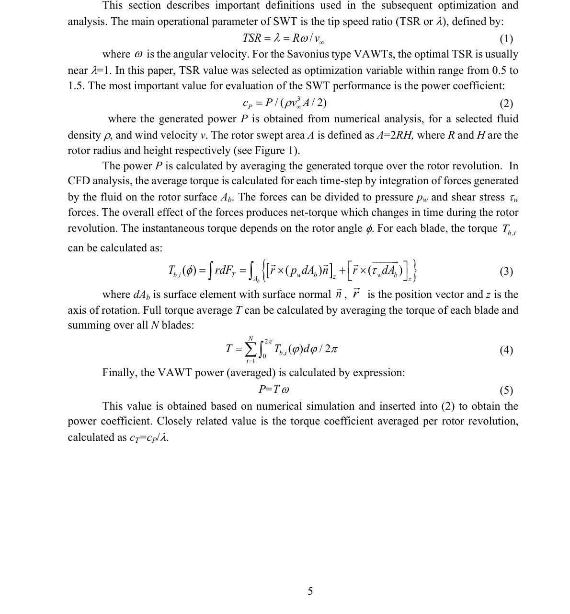

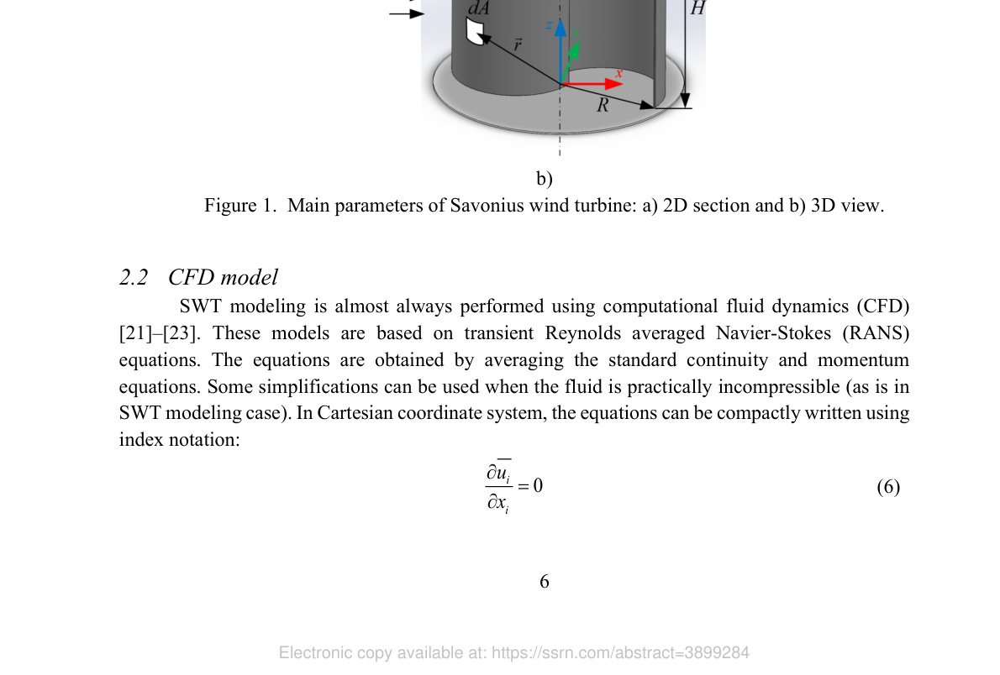

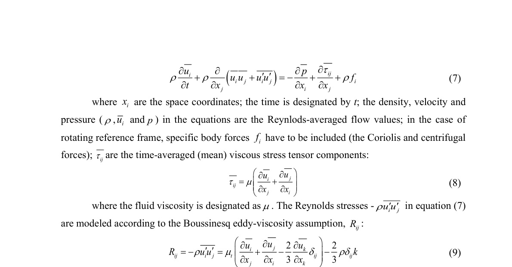

Figure 1. Main parameters of Savonius wind turbine: a) 2D section and b) 3D view.

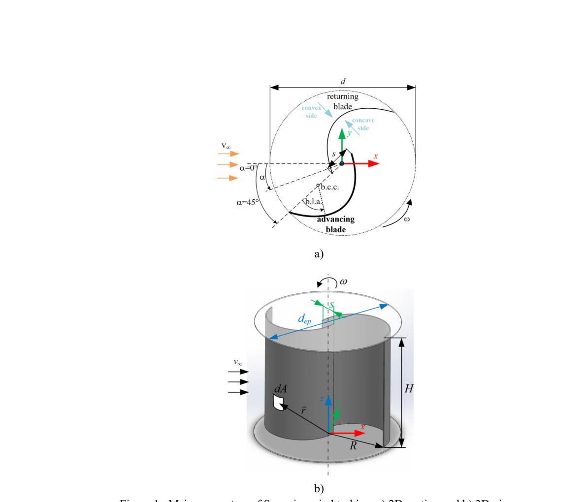

### 2.2 CFD model

SWT modeling uses transient Reynolds-averaged Navier-Stokes equations. The paper used the 4-equation transitional SST turbulence model. One half of the rotor was modeled using a symmetry condition at the rotor mid-plane. The rotating zone had diameter `1.8d`, where `d = 0.68 m`. Overall domain dimensions were `5d` in z, `40d` in x, and `30d` in y. The rotor axis was `15d` from the inlet and `25d` from the outlet. A `3d`-wide high-resolution wake region began `2d` downstream of the rotor axis and continued to the outlet. The initial condition used `v∞ = 12 m/s` and `omega = 31.4 rad/s`, corresponding to TSR `0.9`; TSR varied during optimization. A sliding-mesh interface joined rotating and stationary zones, outlet pressure was zero, and symmetry conditions were used at the lower mid-plane, upper plane, and lateral sides.

Figure 2. Computational zones: a) overall computational domain b) stationary zones near rotor and c) rotor zone

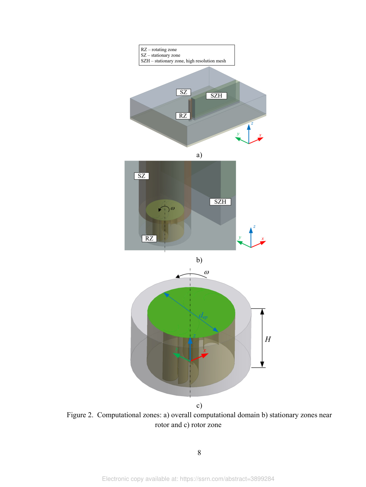

The high-resolution mesh used a thin structured prismatic layer around blade walls: 20 normal layers and a first-layer thickness of `0.01 mm` for `y+ ≈ 1`. Blade-edge, blade, stator, high-resolution-wake, and outer-stator element sizes were `0.5 mm`, `5 mm`, `13 mm`, `125 mm`, and `600 mm`, respectively. Size transitions used growth rate `1.1`; the height used 20 elements.

Figure 3. Mesh elements at different computational: a) overall domain, b) near-rotor zones and c) prismatic layers and blade tip refinement.

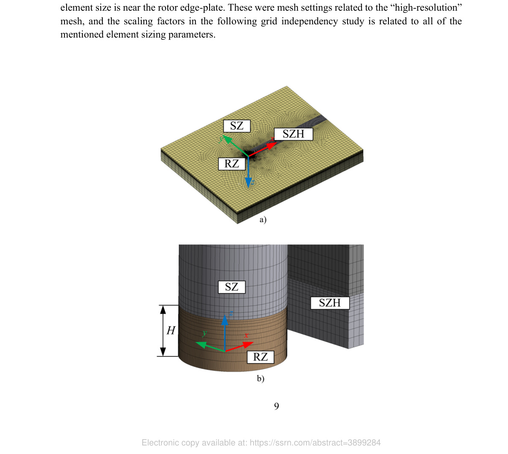

### 2.3 Grid independency study

For the classical turbine, meshes from 175,119 to 1,586,786 elements and timesteps from 4 degrees to 0.5 degrees produced cP from 0.2201 to 0.2168. The complex six-blade study produced cP values of 0.3233, 0.3199, 0.3179, 0.3145, and 0.3143 as resolution increased; the difference between the final two meshes was 1%. The authors used the highest-resolution mesh for results and expected approximately 1% mesh-related error. They used a two-revolution average for cP because the moving average had negligible variation.

Table 1. Mesh test results

| Mesh elements | Time step (degrees) | cP (-) |
|---:|---:|---:|
| 175119 | 4 | 0.2201 |
| 314767 | 2 | 0.2189 |
| 437140 | 1 | 0.2173 |
| 509140 | 0.5 | 0.2168 |
| 886938 | 1 | 0.2184 |
| 1586786 | 1 | 0.2183 |
| 20M [2] | 1 | 0.2187 |

| Mesh elements | Time step (degrees) | cP (-) |
|---:|---:|---:|
| 118358 | 4 | 0.3233 |
| 208242 | 2 | 0.3199 |
| 358822 | 1 | 0.3179 |
| 511116 | 1 | 0.3145 |
| 511116 | 0.5 | 0.3143 |

Figure 4. Instantaneous torque coefficient (cT) and moving average of instantaneous cT(alpha) for half-rotation (180 degrees) and for two rotations (720 degrees).

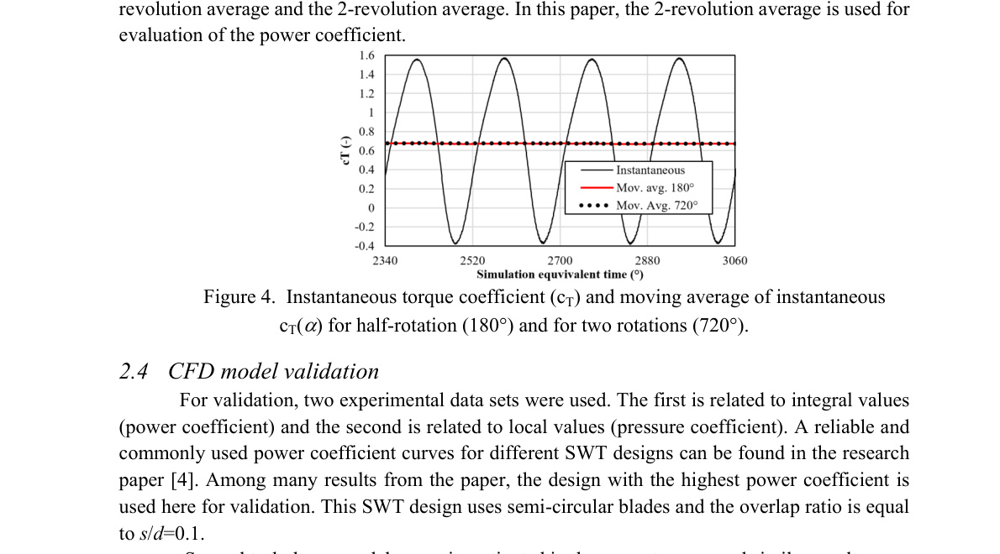

### 2.4 CFD model validation

The CFD model was validated against experimental power-coefficient data for a semicircular rotor with overlap ratio `s/d = 0.1`, and against local pressure-coefficient differences from a second experiment. For the local validation case, the rotor had `s/d = 0.15`, `AR = 1`, `D = 300 mm`, `4 mm` blade thickness, `v∞ = 6 m/s`, and `TSR = 0.9`. The paper states that no tunnel-blockage correction was applied to those measurements. The 4-equation transitional SST model predicted the integral data marginally better than the two-equation SST model, though all models slightly under-predicted the experimental cP values.

Figure 5. Classical Savonius wind turbine (s/d=0.1) performance, comparison of experimental [4] and 3D CFD results for different turbulence models in current paper (SST and 4-eq) and from previous research (Ref. [2]).

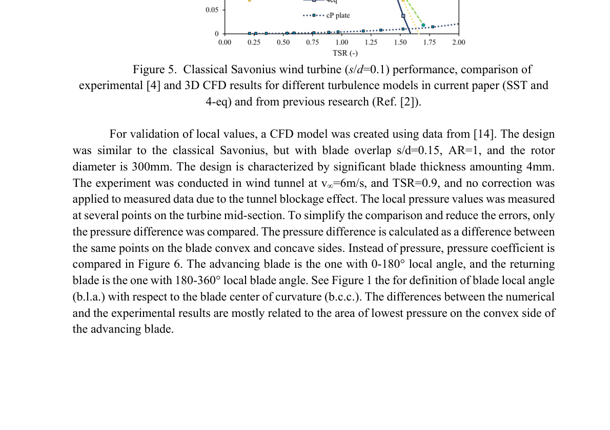

Figure 6. Comparison of CFD with local pressure difference (between convex and concave blade side) using geometry and experimental data from [14] for rotor angles: a) alpha=0 degrees, b) alpha=45 degrees, c) alpha=90 degrees and d) alpha=135 degrees.

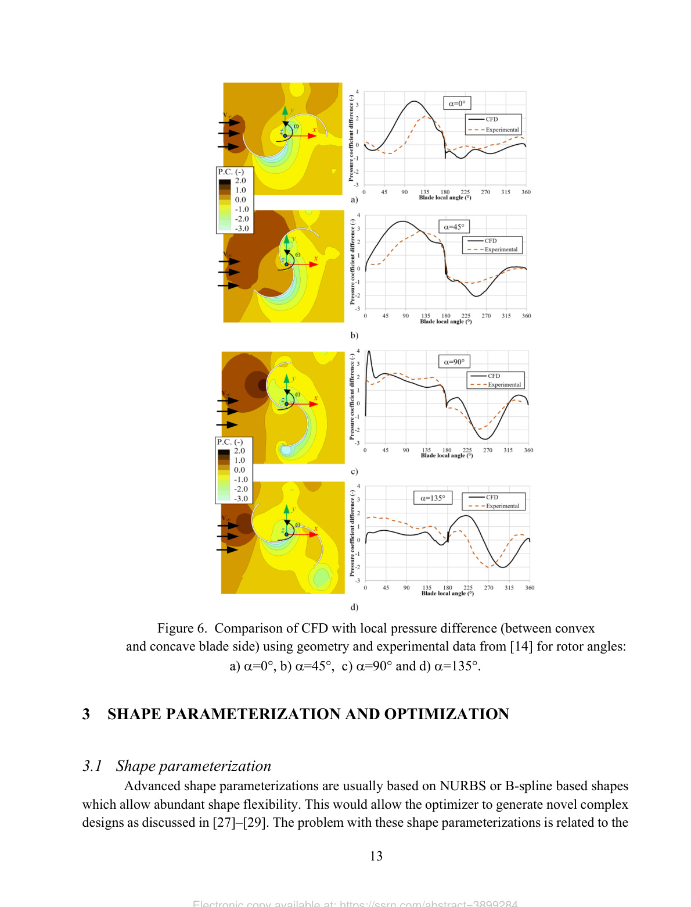

## 3 Shape Parameterization and Optimization

### 3.1 Shape parameterization

The study parameterized blades using up to three circular arcs. Up to three blades, `c1`, `c2`, and `c3`, were independent; the remaining blades repeated these shapes after 180-degree rotation. An individual blade had up to five parameters: x-y coordinates of both blade edges and curvature radius, parameterized as blade thickness `mi`. One point was fixed at the constrained outer rotor radius. A constraint prevented intersecting blades, though blades could be arbitrarily close.

Figure 7. Shape parameterization composed of circular arcs.

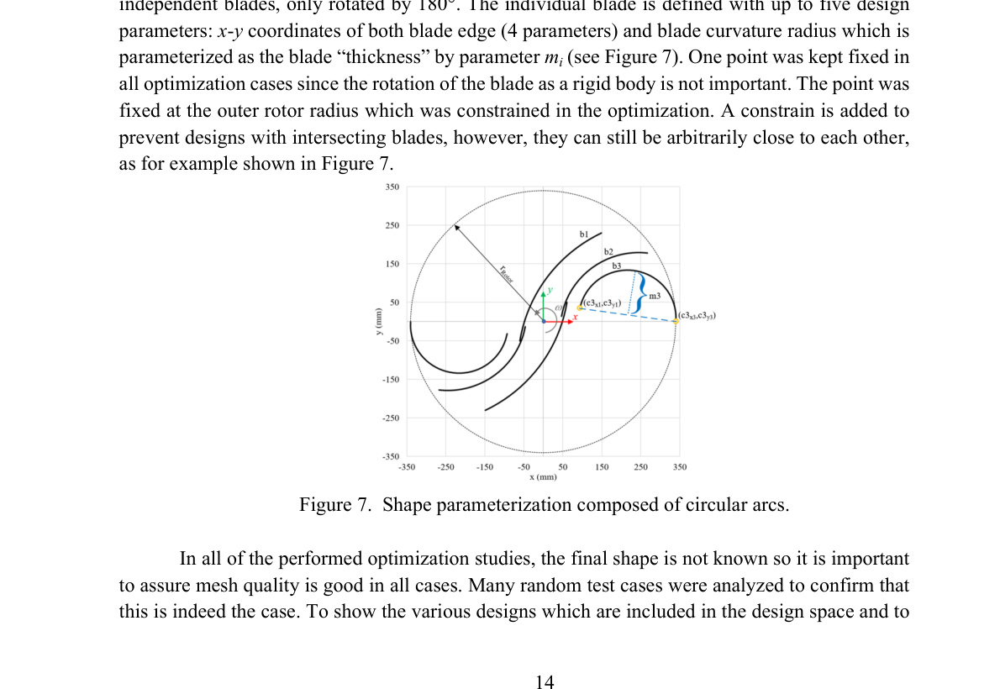

### 3.2 Optimization procedure

The objective was average power coefficient. The 2-, 4-, and 6-blade cases had 4, 9, and 14 optimization variables, respectively, including TSR. ModeFrontier implemented the NSGA-II genetic algorithm. Eight PCs ran 18 CFD simulations in parallel. Sobol sequences generated initial populations of 50, 500, and 2,000 designs for the 2-, 4-, and 6-blade cases. The authors reran the optimization with varying initial populations; reducing initial population could prevent reaching the reported optimum.

Figure 8. Convergence of power coefficient for global optimization cases with 2, 4 and 6 blades.

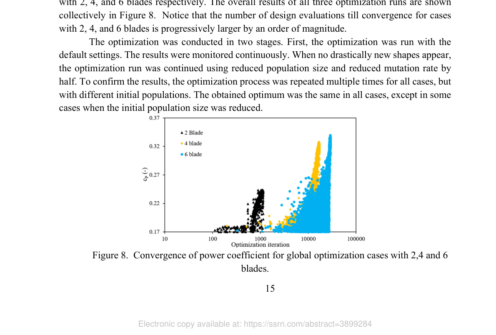

## 4 Results and Discussion

### 4.1 Overall results

All reported results used the same 3D CFD model, 500,000 elements, and a 0.5-degree equivalent timestep. Aspect ratio was initially `1.5`. The optimized two-blade design increased cP by 12% relative to the classical `s/d = 0.1` design and selected TSR `1.2`. The optimized six-blade case produced the highest cP, but only negligibly more than the four-blade case; the authors therefore concluded that further blade-number increases are unlikely to improve performance. The six-blade improvement over the classical design was 48%.

Figure 9. 3D CFD comparison of cP-TSR of globally optimized blade (2, 4, and 6 blade) with semicircular 2-bladed design with s/d=0.1.

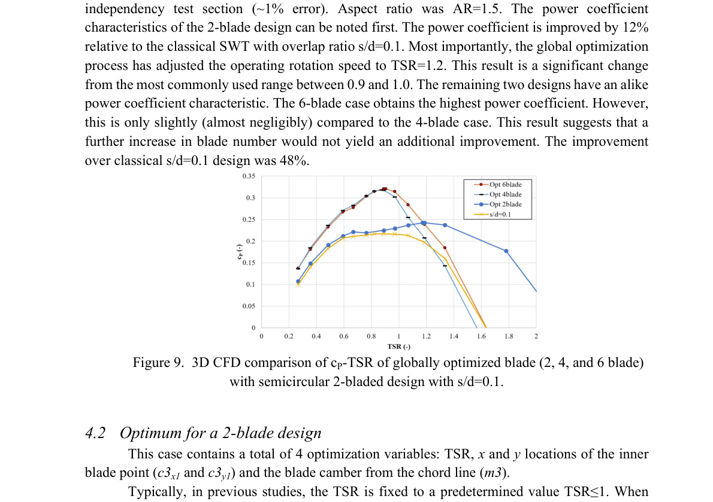

### 4.2 Optimum for a 2-blade design

The two-blade optimum had cP `0.242`, compared with `0.217` for the classical design under the same CFD model. Its overlap was practically zero rather than the typical `s/d ≈ 0.1`, and its optimized TSR was `1.2`. The study reports little performance change across TSR 1.1-1.3 and approximately 10 mm geometric variation.

Figure 10. Optimized 2-blade design.

Figure 11. Parallel coordinates chart from 2-blade design optimization (near-optimal designs).

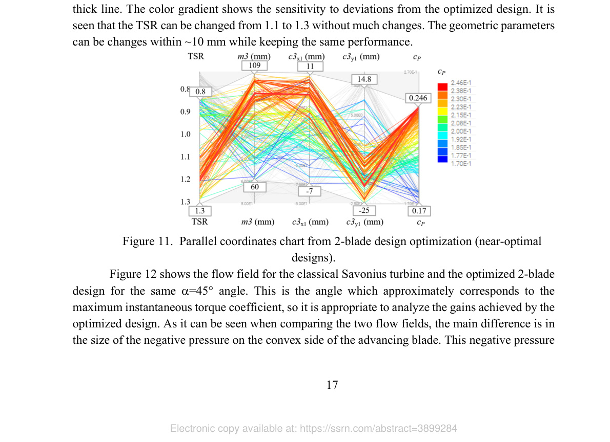

Figure 12. Flow field for alpha=30 degrees for a) classical Savonius with overlap s/d=0.1 and b) optimized 2-blade design.

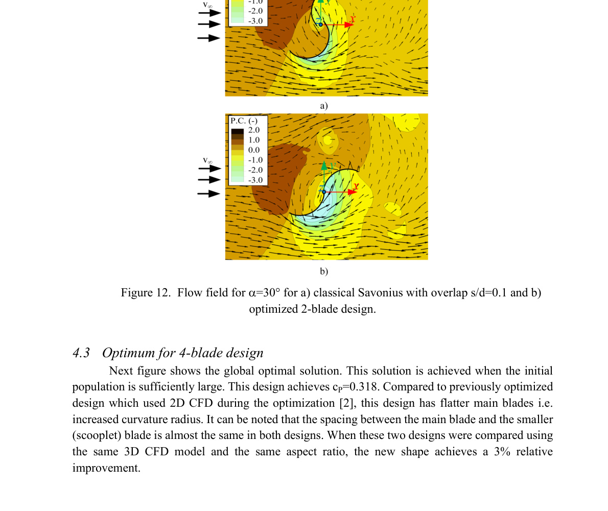

### 4.3 Optimum for a 4-blade design

The four-blade optimum achieved cP `0.318`. Its main blades were flatter than the earlier design optimized with 2D CFD; under matched 3D CFD and aspect ratio, the new shape improved cP by 3%. The paper reports three-dimensional heightwise power-contribution changes, including off-mid-plane maxima for the optimized four- and six-blade designs.

Figure 13. Global optimum for 4-blade design (3D CFD) and comparison with previously optimized design using 2D CFD [2].

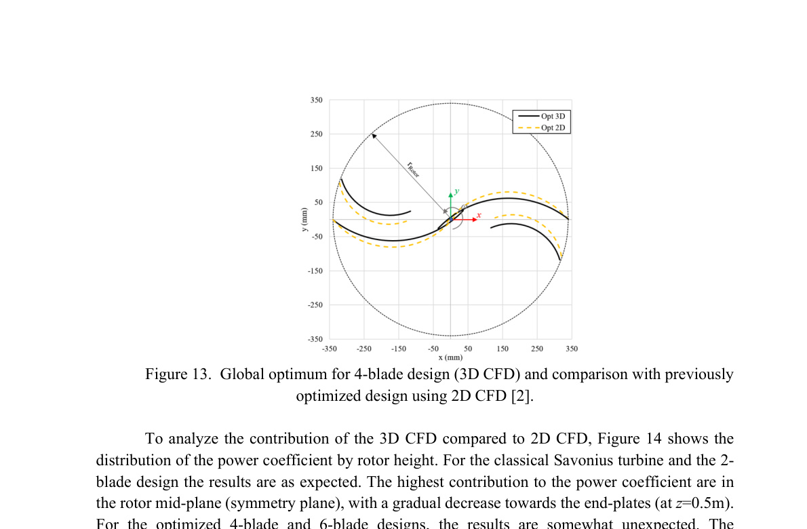

Figure 14. Blade contributions to power coefficient as function of height for different designs at corresponding optimal TSR values.

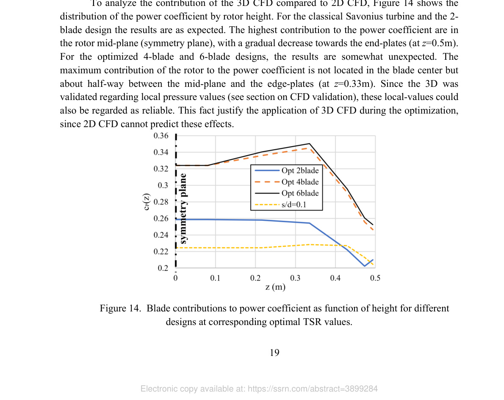

### 4.4 Optimum for a 6-blade design

The six-blade optimum reached cP `0.321` at TSR `0.9`. The authors compare it with a multiple-quarter-blade design, which their model re-evaluated at cP `0.20` and TSR `0.76`; they report a 60% cP improvement for the global optimum relative to that re-evaluation.

Figure 15. Optimized 6-blade design: Power coefficient as function of height for different aspect ratios, (z*=z/(H/2)).

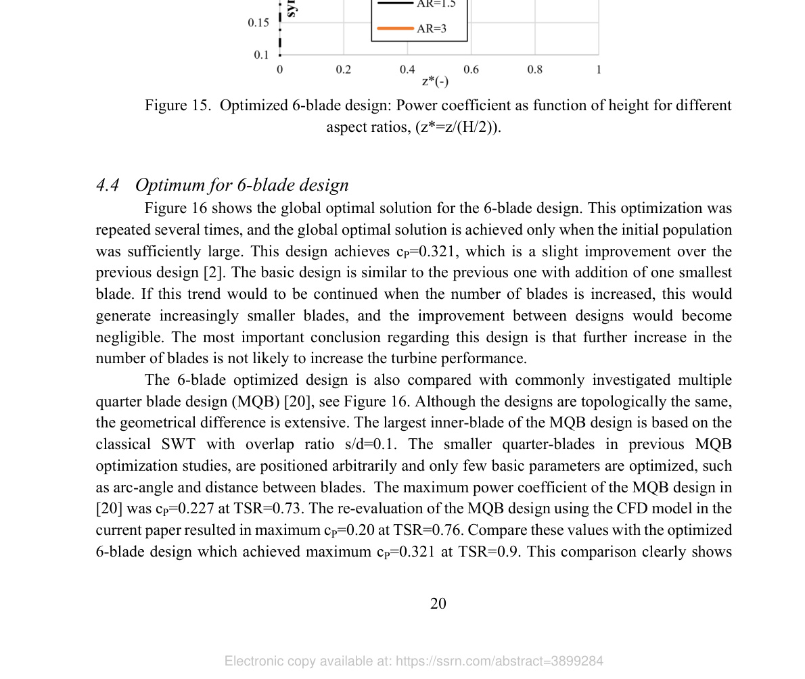

Figure 16. Global optimum for 6-blade design compared to multiple quarter blade design [20].

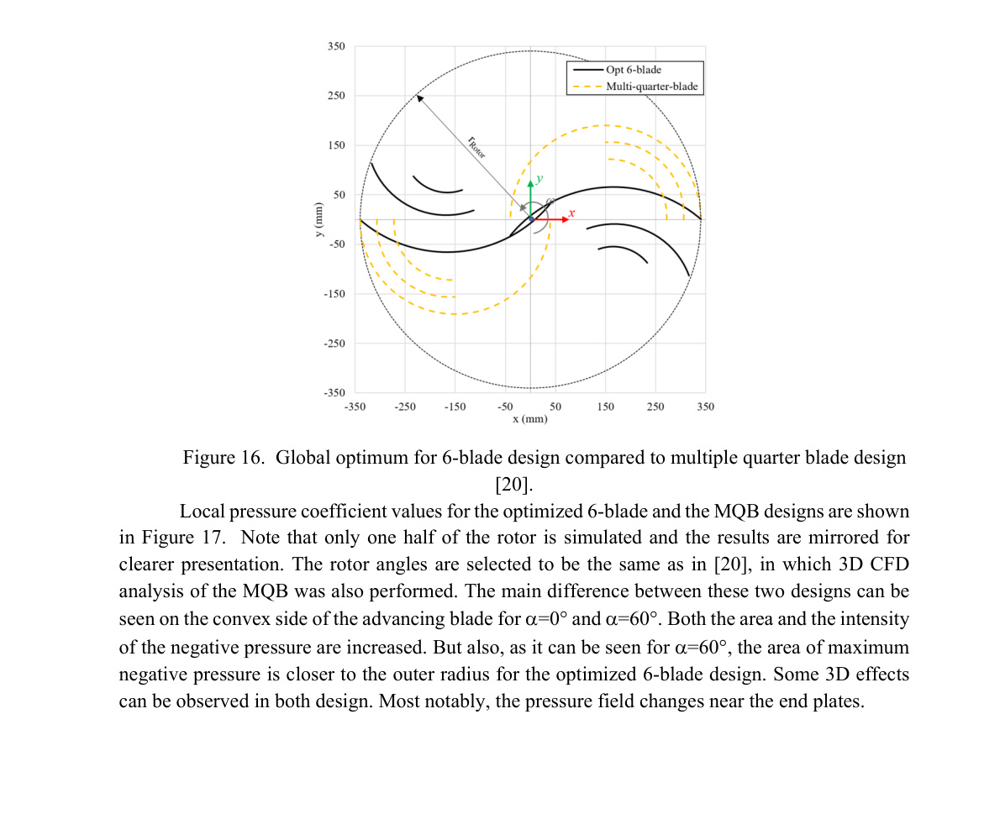

Figure 17. Contours of local pressure coefficient for optimized 6-blade design: a) alpha=0 degrees, b) alpha=60 degrees, c) alpha=120 degrees, and multiple quarter blade design d) alpha=0 degrees, e) alpha=60 degrees, f) alpha=120 degrees.

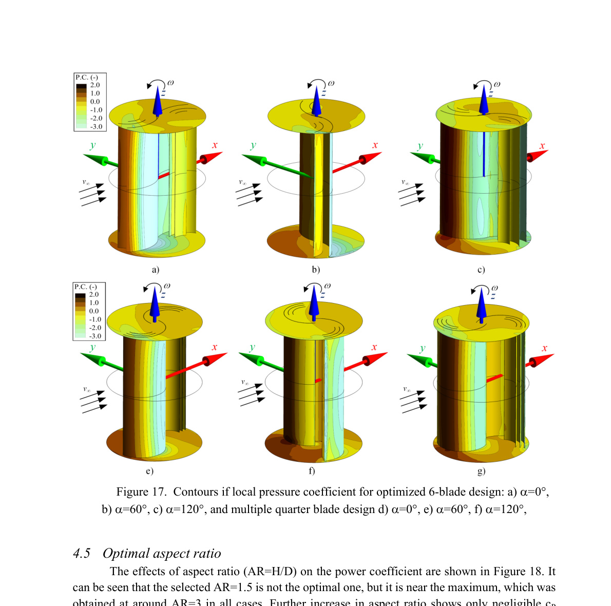

### 4.5 Optimal aspect ratio

For all cases, cP was near its maximum around `AR = 3`; further increases had negligible benefit. The six-blade cP increased from `0.32` to nearly `0.34`. From AR `1` to `2.5`, cP increased 15% for the four- and six-blade designs, compared with 5% for the two-blade design. The paper states cP drops significantly for all designs below `AR = 1`.

Figure 18. Effect of aspect ratio on optimized design power coefficient.

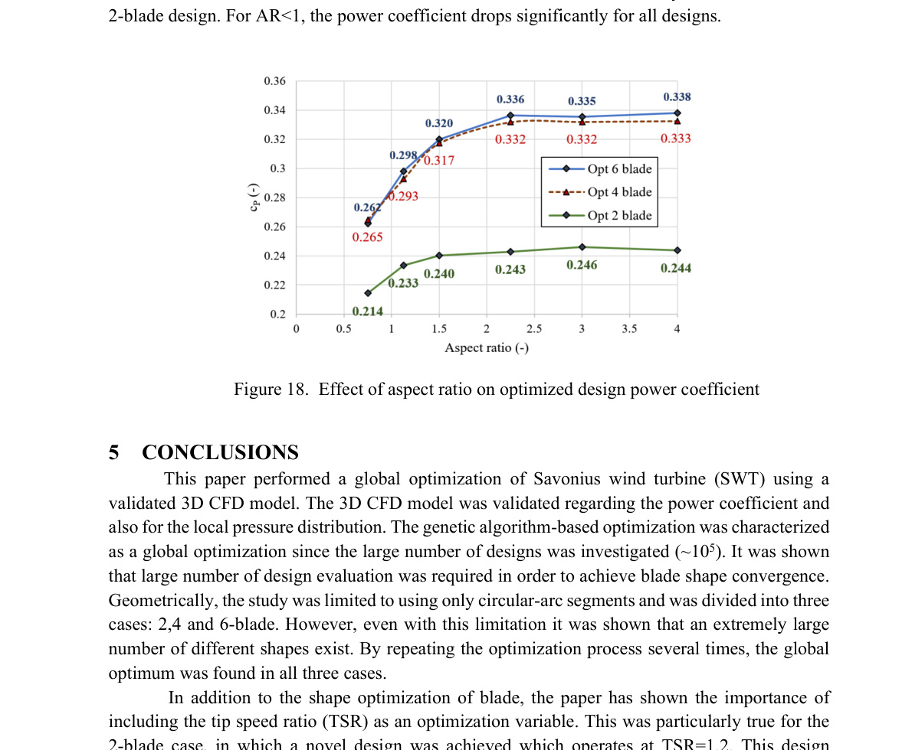

## 5 Conclusions

The study used a validated 3D CFD model and global genetic optimization of circular-arc Savonius rotors with 2, 4, and 6 blades. It states that its large evaluation count, approximately 10^5 designs, was needed for blade-shape convergence. The two-blade design reached TSR `1.2` and a 12% cP improvement over the classical design. The four- and six-blade results were similar to a scooplet-based configuration; additional aspect-ratio consideration reached cP `0.34`, almost 50% above the classical design. The study recommends exploring elliptical or more general spline/surface parameterizations in future work.

## Acknowledgements

This work was supported by the Croatian Science Foundation [HRZZ-IP-2018-01-6774].

## References

[1] S. Roy and U. K. Saha, “Wind tunnel experiments of a newly developed two-bladed Savonius-style wind turbine,” Applied Energy, vol. 137, pp. 117-125, 2015. doi: 10.1016/j.apenergy.2014.10.022.

[2] I. Marinić-Kragić, D. Vučina, and Z. Milas, “Computational analysis of Savonius wind turbine modifications including novel scooplet-based design attained via smart numerical optimization,” Journal of Cleaner Production, 2020. doi: 10.1016/j.jclepro.2020.121310.

[3] N. Alom and U. K. Saha, “Four Decades of Research into the Augmentation Techniques of Savonius Wind Turbine Rotor,” Journal of Energy Resources Technology, 2018. doi: 10.1115/1.4038785.

[4] R. E. Sheldahl, B. F. Blackwell, and L. V. Feltz, “Wind tunnel performance data for two- and three-bucket Savonius rotors,” Journal of Energy, vol. 2, no. 3, pp. 160-164, 1978. doi: 10.2514/3.47966.

[5] I. Ushiyama and H. Nagia, “Optimum design configurations and performances of Savonius rotors,” Wind Engineering, vol. 12, pp. 59-75, 1988.

[6] V. J. Modi and M. S. U. K. Fernando, “On the Performance of the Savonius Wind Turbine,” Journal of Solar Energy Engineering, vol. 111, no. 1, pp. 71-81, 1989. doi: 10.1115/1.3268289.

[7]-[32] References retained in the original PDF include CFD, optimization, turbulence-model, shape-parameterization, software, and Sobol-sequence sources.

## Appendix A. Examples of intermediate designs

Figure 19 shows various designs included in the optimization design space. Designs with 2, 4, and 6 blades represent separate optimization cases.

Figure 19. Examples of intermediate generated design.

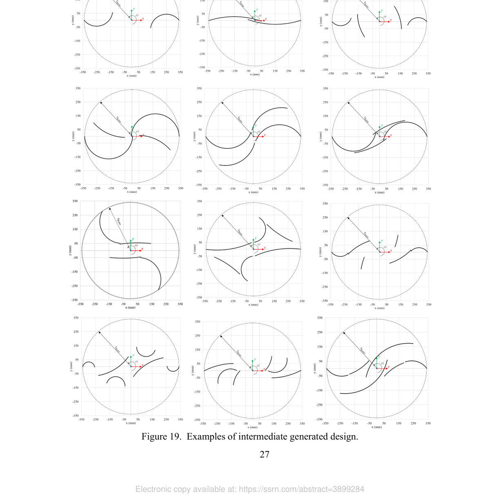
