# Vertical Axis Wind Turbines

> Source: C:\Users\annaf\OneDrive\Documents\Obsidian Vault\Intro-to-Applied-AI-Engineering\sources\Vertical_Axis_Wind_Turbines.pdf

Copyright: M. Ragheb 3/21/2015

## INTRODUCTION

Vertical axis wind turbines are advocated as being capable of catching the wind from all directions,
and do not need yaw mechanisms, rudders or downwind coning. Their electrical generators can be
positioned close to the ground, and hence easily accessible. A disadvantage is that some designs are
not self-starting. There have been two distinct types of vertical axis wind turbines: The Darrieus
and the Savonius types. The Darrieus rotor was researched and developed extensively by Sandia
National Laboratories in the USA in the 1980's. New concepts of vertical axis wind machines are
being introduced such as the helical types particularly for use in urban environments where they
would be considered safer due to their lower rotational speeds avoiding the risk of blade ejection
and since they can catch the wind from all directions. Horizontal axis wind turbines are typically
more efficient at converting wind energy into electricity than vertical axis wind turbines. For this
reason they have become dominant in the commercial utility-scale wind power market. However, small
vertical axis wind turbines are more suited to urban areas as they have a low noise level and
because of the reduced risk associated with their slower rates of rotation. One can foresee some
future where each human dwelling in the world is equipped with wind generators and solar collectors,
as global peak petroleum is reached making them indispensable for human well being. They are well
suited for green buildings architectural projects as well as futuristic aquaponics; where vertical
farming in a skyscraper uses automated farming technologies converting urban sewage into
agricultural products. Their cost will come down appreciably once they are mass produced on a
production line scale equivalent to the automobile industry. The economic development and viable use
of horizontal axis wind turbines would, in the future be limited, partly due to the high stress
loads on the large blades. It is recognized that, although less efficient, vertical axis wind
turbines do not suffer so much from the constantly varying gravitational loads that limit the size
of horizontal axis turbines. Economies of scale dictate that if a vertical axis wind turbine with a
rated power output of 10 MW could be developed, with at least the same availability as a modern
horizontal axis turbine, but at a lower cost per unit of rated power, then it would not matter if
its blade efficiency was slightly lower from 56 to about 19-40 percent.

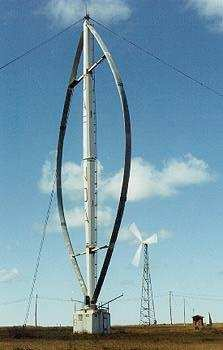

Figure 1. Darrieus vertical wind turbine with the generator positioned at the base of the tower. The
tower is reinforced with guy wires.

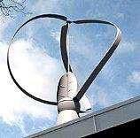

Figure 2. Hybrid Darrieus and Savonius self-starting Neoga turbine on top of a building.

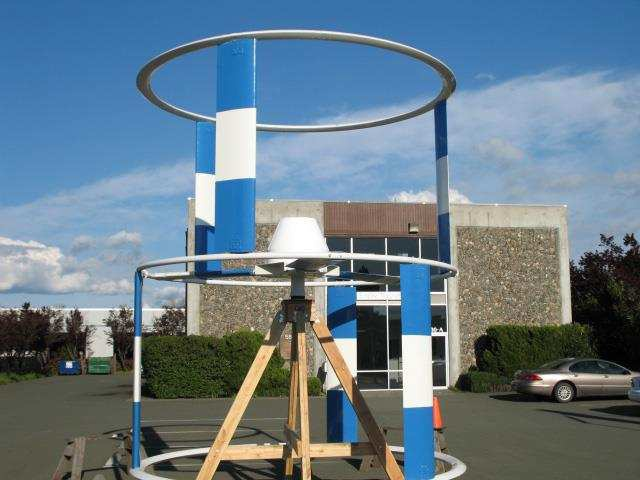

Figure 3. Experimental concept for a vertical sail wind machine with a 3 kW rated output.

## DARRIEUS VERTICAL WIND TURBINE

The first aerodynamic vertical axis wind turbine was developed by Georges Darrieus in France and
first patented in 1927. Its principle of operation depends on the fact that its blade speed is a
multiple of the wind speed, resulting in an apparent wind throughout the whole revolution coming in
as a head wind with only a limited variation in angle. Cyclists will recognize that effect: if they
go fast enough there is always a head wind. From the perspective of the blade, the rotational
movement of the blade generates a head wind that combines with the actual wind to form the apparent
wind. If the angle of attack of this apparent wind on the blade is larger than zero, the lift force
has a forward component that propels the turbine. The angle of attack which varies in a revolution
between -20 to +20 degrees should not exceed 20 degrees since at higher angles the flow along the
blade is no longer laminar, which is a condition required for the generation of a lift force, but
becomes turbulent causing stall. An angle of attack between zero and 20 degrees requires a
sufficiently high blade speed. A Darrieus turbine cannot be self starting; it needs to be brought to
a sufficiently high blade speed by external means. However, the lack of a control system to point
the turbine into the wind compensates for this shortfall. The original Darrieus turbine suffered
from some negative features such as violent vibrations leading to eventual fatigue blade failure, a
high noise level and a relatively low efficiency, which severely limited its success.

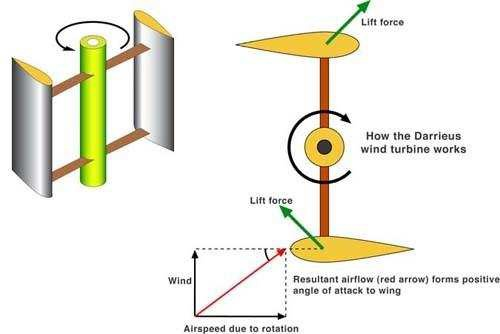

Figure 4. Darrieus vertical axis turbines principle of operation. The resultant of the wind speed
and the air speed due to rotation forms a positive angle of attack of the lift force to the wing.

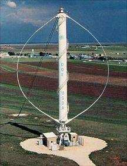

Figure 5. Experimental Department of Energy (DOE) and US Department of Agriculture (USDA) 34 meter
diameter Darrieus wind turbine.

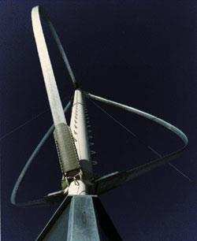

Figure 6. Blade end attachments in a Darrieus wind turbine.

## VARIABLE GEOMETRY VERTICAL AXIS MACHINES

P. J. Musgrove in 1975 led a research project at Reading University in the UK whose purpose was to
attempt to rationalize the geometry of the blades by straightening out the blades of a Darrieus type
wind turbine. This led to the design of a straight bladed vertical axis wind turbine designated as
the H rotor blade configuration. At the time it was thought that a simple H blade configuration
could, at high wind speeds, overspeed and become unstable. It was thus proposed that a reefing
mechanism be incorporated into the machine design thus allowing the blades to be feathered in high
winds. These earlier machines with feathering blades were known as Variable Geometry Vertical Axis
Wind Turbines. There were a number of these designs which had different ways of feathering their
blades. During the late 1970's there was an extensive research program carried out. This included
wind tunnel tests and the building of a few prototype machines in the 40-100 kW range. This work
culminated in a final reefing arrowhead blade design for a large 25 meter, 130 kW rated machine,
located in Carmarthen Bay in South Wales. This machine known as the VAWT 450, was built by a
consortium of Sir Robert McAlpine and Northern Engineering Industries (Vertical Axis Wind Turbines
Limited) in 1986. The project was funded by the UK government’s Department of Trade and Industry.

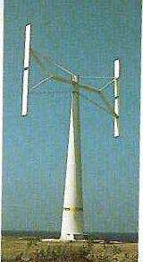
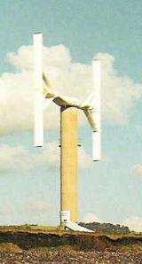

Figure 7. Variable Geometry wind turbine machines.

## H ROTOR STRAIGHT BLADED VERTICAL MACHINE

From the research carried out in the UK during the 1970-1980 time frame it was established that the
elaborate mechanisms used to feather the blades were unnecessary. The drag/stall effect created by a
blade leaving the wind flow would limit the speed that the opposing blade in the wind flow could
propel the whole blade configuration forward. The fixed straight bladed or H Rotor configuration was
therefore self regulating in all wind speeds reaching its optimal rotational speed, early after its
cut in wind speed.

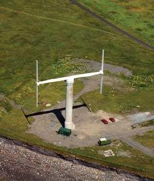
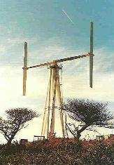

Figure 8. H Rotor wind turbine designs.

There have been a few commercial companies producing H rotor wind turbines since the 1980's. However
turbine designs were aimed at niche areas of the small wind turbine market. Due to the lower and more
predictable stress loading on the blades of vertical axis wind turbines, they are the ideal type of
machine for large scale electricity production. This potential for use for economic multi megawatt
electricity production has not as yet been exploited. This is due partly due to earlier design
failures and partly due to their slightly lower blade efficiency.

## IMPULSE AND AERODYNAMIC VERTICAL TURBINES, TIP SPEED RATIO (TSR)

Aerodynamic wind turbines can be divided into two main classes: horizontal axis wind turbines and
vertical axis turbines. Large wind turbines up to a rated power of 5 MW are horizontal axis engines,
much like the traditional Dutch windmills. This familiarity has given the development of horizontal
turbines a higher priority than that of vertical turbines. Modern horizontal axis wind turbines have
a high efficiency but their capital cost is high. They have to be directed in the direction of the
wind, either manually or by the use of a sensor based yaw-control mechanism, adding to their design
complexity and cost. Vertical axis turbines do not need such a control system; and can catch the
wind from all directions. Vertical axis wind turbines designs can be either impulse (drag) or lift
(aerodynamic) devices. According to Betz’s equation, an aerodynamic turbine has a theoretical
efficiency of 59 percent and an impulse type engine only 19-40 percent. Not all the energy in the
wind can be extracted because if it were possible, the wind speed behind the turbine will be zero
thus clogging any flow through the rotor. Part of the wind will flow through the rotor and part
around it. The ratio of these two components determines the efficiency of the turbine. It might
appear counter intuitive that devices covering the whole swept area have such a low efficiency.
However the ancient mariners have long realized that “Sailing before the wind’ is far less energetic
than “Close hauled” or “Half wind.” Without slip, the maximum rotor speed would be about the same
speed as the wind speed. An example is the three cup anemometers commonly used for measuring wind
speed.

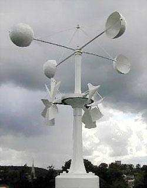

Figure 9. Rotating cup anemometer and drag cup wind turbine.

The tip speed ratio is defined as: rotorwindVTipspeedratioV (1) If the velocity of the cup is
exactly the same as the wind speed, the anemometer has a tip speed ratio of unity. The ends of the
cups can never go faster than the wind, thus: 1anemometer (2) A way of determining whether a
vertical axis turbine design is based on impulse drag or aerodynamic lift is through its tip speed
ratio α. An α > 1 implies some amount of lift, while α < 1 means primarily drag. Aerodynamic lift
based designs can usually output much more power, more efficiently. There have been multiple designs
of vertical axis windmills. In fact there is evidence of the existence of vertical axis wind
turbines, which can be traced back centuries before the more common horizontal axis designs. The
vertical axis machines have evolved and now come in three basic types: the Savonius, the Darrieus,
and the H-Rotor concepts.

## THE SAVONIUS IMPULSE CONCEPT

The Savonius turbine is a vertical axis machine which uses a rotor that was introduced by Finnish
engineer S. J. Savonius in 1922. In its simplest form it is essentially two cups or half drums fixed
to a central shaft in opposing directions. Each cup or drum catches the wind and so turns the shaft,
bringing the opposing cup or drum into the flow of the wind. This cup or drum then repeats the
process, so causing the shaft to rotate further and completing a full rotation. This process
continues all the time the wind blows and the turning of the shaft is used to drive a pump or a
small generator. These types of windmills are also commonly used for wind speed instruments such as
the anemometer. Modern Savonius machines have evolved into fluted bladed devices, which have a
higher efficiency and less vibration than the older twin cup or drum machines.

Figure 10. Evolution of the Savonius design for water pumping from half drums into the fluted spiral
bladed design.

## THE DARRIEUS AERODYNAMIC CONCEPT

In 1931 the French engineer George J. M. Darrieus introduced the Darrieus Vertical Axis Wind
Turbine. The Darrieus type of machine consists of two or more flexible airfoil blades, which are
attached to both the top and the bottom of a rotating vertical shaft. The wind blowing over the
airfoil contours of the blade creates an aerodynamic lift and actually pulls the blades along.
Although nowhere near as much research has been carried out on these types of machine when compared
with the horizontal axis machines, both the USA and Canada did have large research programs working
on the Darrieus design in the 1970's and 1980's. This work culminated with the construction of a 4.2
MW machine designated as “Eole C” at Cap Chat, Québec, Canada.

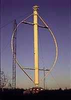

Figure 11. Eole C 4.2 MW Darrieus vertical axis wind turbine, Cap Chat, Québec, Canada.

There were a number of commercial wind farms built in the USA using the Darrieus design, most of
which were built by The Flow Wind Corporation. The machines proved to be efficient and reliable.
However there was a problem with fatigue on the blades. The airfoil blades were designed to flex,
allowing for the extra centrifugal forces in high wind and blade speeds. The flexing of the blades
led to premature fatigue of the blade material, leading to a number of blade failures. The vertical
axis turbines built and tested in the 1970’s and 1980’s, used a symmetrical airfoil blade profile.
Their theory was that, if
the airfoil is symmetric then it will provide lift from both sides of the airfoil, therefore
generating lift through more of the 360º path of the blades rotation. It was also believed at the
time, that lift would only be created by the blade while traveling into the direction of the wind
flow and that the drag created by the opposing blade traveling down wind was an undesirable although
unavoidable effect. A symmetrical airfoil is not the most efficient approach at providing lift. A
design goal was to maximize lift at the same time as utilizing the inevitable drag created by the
opposing blade. There have been a number of attempts using hinged blades attached to the end of the
cross arm, therefore allowing the aerofoil section of blade to maintain its optimum angle of attack
through the maximum portion of its arced rotation. An optimal blade profile and optimal fixing angle
for the blade to the cross arm could achieve the same goal. The wind flowing over the high lift and
low drag blade profile, coupled with the blade areas solidity, gives the machine the initial power
needed to overcome its inertia. Once momentum has been established, the forward movement of the
blade through the air creates its own local wind flow over its contours, creating a varying amount
of lift throughout the full 360º of its rotation. In its down wind stroke, the curved underside of
the blade acts like the sail of a yacht therefore creating usable torque throughout its rotation.
The stalling of the blades at the top and bottom of their arc of rotation is also useful, as it
regulates the speed of the blades rotation, implying that the blades accelerate up to a point of
equilibrium at which they will not increase their speed no matter how hard the wind blows. The more
constant and predictable loadings on a vertical axis turbine blade, coupled with there not being any
need for the blades to twist or taper, not only contribute to the possibility of scale increase, but
will also enables their production in sections using mechanical mass production techniques.

## ROPATEC VERTICAL WIND TURBINE

## INTRODUCTION

The Ropatec wind rotors developed in Italy are neither proper Darrieus nor Savonius but a hybrid
design. The wind rotors are made from airfoil sections like those of an airplane wing. A central
panel between the wings referred to as the turtle back, acts as a diffuser and directs the wind flow
toward the wings, turning the wind rotor at low wind speed.

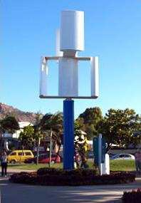

Figure 12. Hybrid Darrieus and Savonius Ropatec vertical axis wind generator.

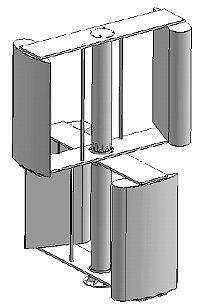
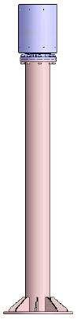

Figure 13. Ropatec rotors without turtle shell diffuser and the columnar tower with the generator on
top.

### DESCRIPTION

The Ropatec wind rotor is a vertically driven wind rotor that could be described as a hybrid
building upon the Savonius and Darrieus principles. The WRE.060 model is associated with the
MSP-Controller, an innovative CPU controlled charge regulator at 48 Volts with an incorporated SMD
DC/AC inverter with 4,500 VA continuous output. A central pole referred to as the axis has the
electrical generator bolted to the top. The axis and generator are inserted into the wind rotor
assembly and the generator is bolted to the inner tube. When the wind rotor turns, it also turns the
generator. The wind rotor will start to turn in a light breeze of about 7 km/hr or 4 knots. The
maximum rpm is reached in winds of 50 km/hr or27 knots. The wind rotor has a distinctive shape that
creates an aerodynamic braking effect causing it to stall at high wind speeds. Winds stronger than
50 km/hr will not increase the wind rotor speed beyond its maximum rotational speed of 90 rpm. The
wind rotor is rated to produce power in winds up to 230 km/hr, the central wind speeds of a Category
2 hurricane or cyclone. It is designed for a maintenance free operation of 15 years.

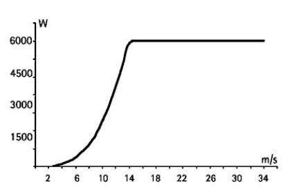

Figure 14. Power curve of Rotapec wind generator showing a low cut in wind speed around 3 m/s.

The Ropatec design possesses the following characteristics: 1. A low cut in wind speed at 2 m/s at
every position. 2. Its operation is independent of the wind direction. 3. It is a low maintenance
system. 4. It generates low noise even at high wind velocities. 5. It does not require a cut off wind
speed. 6. It possesses an aerodynamically auto regulated rotational speed. 7. Its nominal power
output is achieved at wind speeds of 14 m/s and higher. 8. It is not associated with an
electromagnetic field built-up. 9. It has storm suitability up to 56 m/s, with practical experience
up to 75 m/s. 10. It has a reliable, long product life time The system can produce electricity
directly or is expandable to a hybrid system including photovoltaic modules and/or diesel generator
sets.

### TECHNICAL SPECIFICATIONS OF WindRotor WRE.060

WindRotor Rated output on axis (at 14 m/s) 6 kW Cut in wind speed 2 m/s Rated wind speed 14 m/s
Rotor speed control Aerodynamically auto regulated Over speed control Not required Maximum
revolutions/minute 90 rpm at14 m/s Cut off wind speed None Rotor weight 700 kg Rotor blade type
Vertical Axis Wind Turbine (VAWT) Rotor diameter 3.3 m Swept area 14.52 m² (3.3 m x 4.4 m) Gear box
type No gear box, direct driven generator Brake system Not required Generator Generator type
Permanent excited multi pole Electrical transmission Brushless MSP-Controller Battery charger 48 VDC
Output MSP on grid 2x 215VAC/ 230 VAC / 50Hz – 60 Typical performance Average wind 5 m/s Annual
energy output 3.051 MW.hr Sea level, Weibull K 2 Average wind 7 m/s Annual energy output 7.608 MW.hr
Mast 10 m, anemometer 10m Average wind 9 m/s Annual energy output 12.861 MW.hr Average wind 11 m/s
Annual energy output 17.469 MW.hr

## VERTICAL AXIS WIND TURBINE, SOLWIND

### DESCRIPTION

The vertical axis wind turbine by Solwind in New Zealand is designed to start up at 1.5 m/s and
start producing power at a wind speed of just 3.7 m/s and produce their rated output at 10 m/s.
These turbines are extremely quiet in operation. This is due to their special design where the
blades do not create the usual coning noise that occurs with conventional horizontal axis wind
turbines when the blades pass close to the mast at each revolution. The blades are always at the
same distance from the mast. The blades are made from composite fiber glass, stainless steel and
lightweight aluminum, making them extremely strong yet flexible and easy to handle.

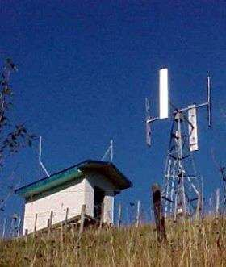

Figure 15. Four rotor vertical axis wind generator for remote sites.

A new Low Speed Magnetic Levitation Alternator (MLA), featuring only one moving part is used. This
keeps the wearing components to a minimum, and so prolongs the longevity of the wind turbine. At high
wind speeds the turbine will start to stall, causing the machine to slow down at around 27 m/s. In
the stalling mode, the turbine will automatically maintain its output speed. This Darrieus based
design lends itself to taking the wind from any direction and does not need a yawing mechanism.

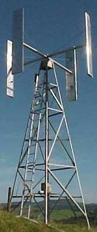
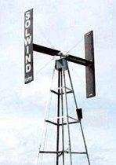

Figure 16. Two and four rotor blades vertical wind generators.

### GENERATOR

The generator is a low speed Magnetic Levitation Alternator (MLA). The output is 3/6 phase up to 415
volt AC. A 3 /6 phase rectifier pack with regulator shunt type is available to suit the end user
voltage such as 12 / 24 / 48 / 120 / 240 / 600 volts DC or any voltage required. The generator is
base mounted at the foot of the mast, and requires no slipping assembly, no dolly bearing assembly,
no brush assembly and has no power cables running up the mast.

### MAST ASSEMBLY

The stayed single pole mast assemblies have been designed for erection with out the aid of any extra
lifting gear for remote area operation. A complete self contained power generation system is
accommodated within the base of the mast which will mean that only the 230/415 Volts AC will need to
be connected to the end user via an underground or poled cable. The mast requires no guide wires and
provides a smaller ground footprint than the stayed single pole mast assembly. The mast is
constructed from high tensile steel, and come in standard lengths of 6.5 meters for easy handling.
The maximum design wind speed is 190 km/hr. For coastal locations stainless steel fasteners are used
throughout.

## EUROWIND WIND TURBINE DESIGN

The concept aims at utilizing an innovative and unique adaptation which allows the turbine to be
mounted on industrial chimneys and other similar tall structures without inhibiting their normal
use. The rotor blade design features an asymmetrical airfoil section selected for its high lift and
low drag characteristics and is mounted to its supporting cross arm at a critical angle to optimize
its performance. The blades are not twisted and their edges are parallel, unlike the twisted
tapering blades of horizontal wind turbines. The simple, regular shape of the blade coupled with the
lower blade stresses experienced by vertical axis turbines allow the blades to be produced
mechanically in sections by extrusion or pultrusion. A directly coupled slow speed alternator
eliminates the need for separate generator sets, gearboxes and clutches.

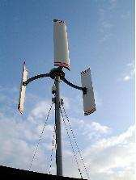
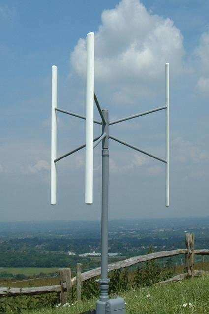

Figure 17. Eurowind wind mill designs.

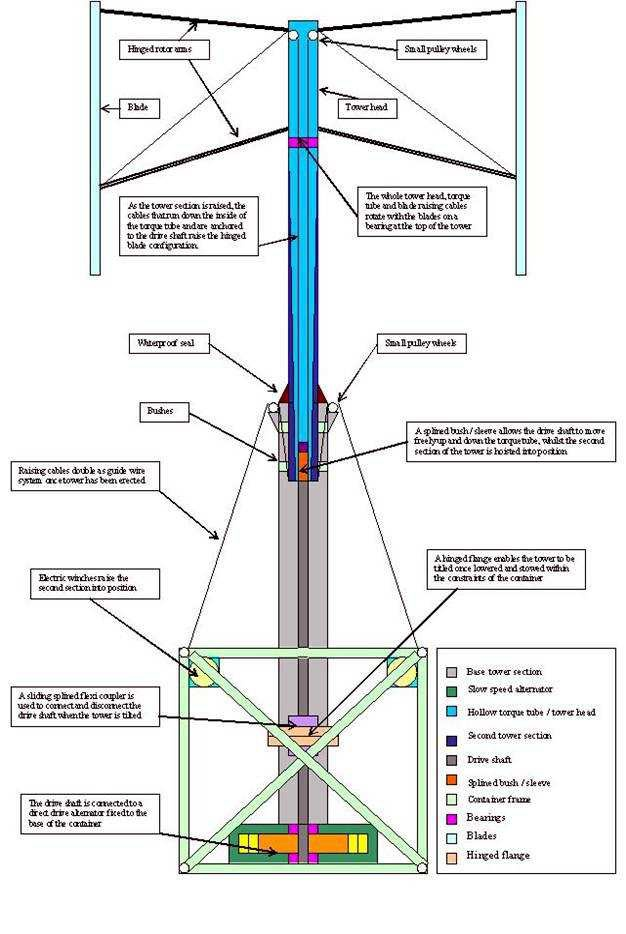

Figure 18. Large Eurowind modular vertical wind mill concept.

The main features of the Eurowind turbines designs are: 1. The turbine is self starting. 2. Vertical
axis turbines are omni directional and do not require pointing in the direction of the wind. 3. The
lower blade rotational speeds imply lower noise levels. 4. Perceived as being more aesthetically
pleasing. 5. The increased blade configuration solidity and torque assists the machine in self
starting. 6. Elimination the risk of the blades reaching equilibrium during start-up rotation by using
3 blades or more. 7. Reduced cyclic loading and power pulsation and fluctuation by using more than 2
blades 8. Easy access to all mechanical and structural elements of the machine. 9. A direct drive,
permanent magnet generator is used and there are no gear boxes with the machine having only one
moving part. These machines have been adapted for use in the marine environment such as at harbors,
on barges or oil rigs.

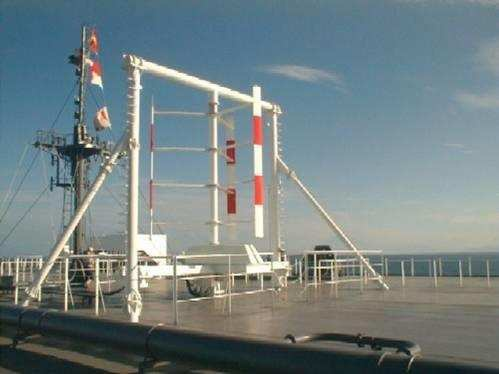

Figure 19. Vertical axis wind turbine in a marine environment.

## VENTURI WIND TURBINES

## INTRODUCTION

In horizontal axis wind turbines the blades rotate and describe a circular surface. The rotor
extracts the energy from the air flowing through this rotor surface and has a theoretical maximum
efficiency of 59 according to Betz’s law. In the Venturi turbine concept, the rotor blades are
attached to the hub at both ends. When rotating, a spherical surface is generated. Because of this
aerodynamic behavior, Venturi effect turbines create a wind flow pattern that converges first, like
rapids in a river. Within the sphere, a low pressure area is generated which attracts the air in
front of the rotor towards the sphere. After the rotor has absorbed energy from the air, the energy
poor air is swung radically outwards through the Venturi planes and is carried away by the
surrounding airflow. The air flowing through the turbine and the air surrounding the rotor are used
more effectively, resulting into the efficiency of the Venturi turbine being higher than the
efficiency of conventional wind turbines.

### DESCRIPTION

Venturi turbines create a wind flow pattern that converges first like rapids in a river. This is
induced by the unique aerodynamic Venturi characteristics. Therefore the turbine experiences a
higher wind speed than other wind turbines would observe. This enables the Venturi turbine to
generate electricity at very low wind speeds. Little gusts can be utilized for electricity
generation where conventional turbines would use these to start rotating. At inland locations, this
characteristic enables the Venturi turbine to generate power during 80 to 90 percent of the time.
Other turbines rotate just 50 percent of the time because they are designed for windy locations.
Windy locations geographically cover only a small part of the land surface such as at mountain
passes and sea sides. When conventional wind turbines are placed inland, energy production is low
and down times are long because they will rotate only about half of the time. Also, they are too
noisy when they run. At such a location, the Venturi turbine will produce 2-3 times as much energy
and down times are short.

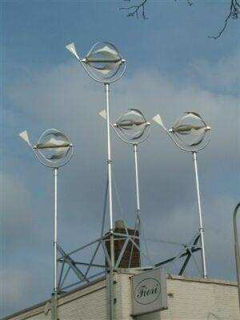

Figure 20. Venturi wind turbines.

Figure 21. Visualisation of the Venturi Effect.

Wind tunnel measurements at the Technical University of Delft have shown that a three blade Venturi
Turbine has a measured efficiency of 85 percent, which is 40 percent higher than the theoretical
maximum efficiency of 59 percent in Betz’s law.

### ADVANTAGES OF VENTURI TURBINES

#### REDUCED SOUND EFFECT

The tips of conventional wind turbines are the main noise generators. Compared with it, the sound
generated by a small Venturi turbine is virtually non existent because it does not have such a tip.
Also, there is no gearbox and the number of blades reduces the speed of rotation.

#### LOW DOWN TIME

The six bladed rotor induces a high start up moment. This enables the turbine to run almost
continuously, unless there is really no wind. The Venturi effect enables the Venturi turbine to
generate a higher level of power at lower wind speeds, which is essential at an inland wind regime,
where most of the applications will be found. This also minimizes the down periods to 10 to 20
percent of time where conventional turbines are known to stand still for 50 percent of the time.
This results in a more constant power supply to a consuming system or a battery than conventional
wind turbines would be able to deliver under the same circumstances. At lower wind speeds the
Venturi turbine will potentially generate three times more energy than comparable small wind
turbines simply because the Venturi turbine will run and absorb energy from gusts while other wind
turbines will require these gusts for their start up. This is of crucial importance for inland
locations.

#### ATTRACTIVE DESIGN AND STYLING

Rotors create visual apprehension. Because the running small wind turbine is visually associated
with a transparent sphere, this unrest is reduced and is recognized as attractive and pleasing to
the eye. The Venturi turbine is a fun object to be placed at locations that are meant to catch the
eye, like billboards or attraction park entrances.

#### HIGH RELIABILITY

Because the blades of the Venturi turbine are attached to the hub at both ends, the feet of the
blade and the flexible blade itself are subjected to non fluctuating tensile stresses only. Wind
gusts and gyroscopic effects barely influence it. This way of rotor construction is so robust that
it practically excludes the failure of the blades. In case a blade would fail, it is still attached
to the turbine at its other end. The generator is integrated into the central hub of the Venturi
turbine. The magnetic field is induced by permanent magnets. The generator dimensions are matched to
the rotor characteristics thus making an expensive and problem prone gearboxes obsolete.

#### COST EFFECTIVENESS

Whist the theoretical background of the blade configuration is very complex, the manufacturing is
utterly simple because the blade can be laser cut from a plate. Because normally the blades
constitute a large part of the cost because special tooling like a mould is required, the Venturi
turbine can be economically produced at relatively low volumes. The cantilevered construction of
conventional blades cause the foot of the blade to be subjected to strongly alternating bending
moments caused by fluctuating wind gusts and gyroscopic effects. Additionally the unsupported tip
end causes the blade as a whole to vibrate. The alternating stress loads are the main cause of blade
failure.

### TECHNICAL SPECIFICATIONS

Data Cut-in wind speed 2 m/s Survival wind speed 40 m/s Rotor speed control Not needed Rated output
at 10 m/s 100 W Maximum output at 17 m/s 500 W Maximum rotational speed at 40 m/s 2,100 rpm Total
weight 30 kg Number of rotor blades 6 Rotor blade type Flat blade polyester Rotor diameter 1.1 m
Swept area 1 m_ Rotor Volume 1 m3 Brake system Electrical brake Gear box type No gear box, direct
driven Generator Electrical transmission Four phase brushless Type Permanent magnet generator
Battery charger Output battery charger 12/24 VDC Typical yearly output at sea level Average
windspeed 4 m/s 100 kW.hr Average windspeed 5 m/s 200 kW.hr Average windspeed 6 m/s 350 kW.hr
Average windspeed 7 m/s 450 kW.hr

## TURBY WIND TURBINE DESIGN

### DESCRIPTION

This design is advocated for construction in an urban environment. The vibrations, high noise levels
and the low efficiency characterizing the Darrieus turbine are caused by the flow of air around the
blade. The angle of attack of the apparent wind is kept below 20 degrees. The rotational speed of
the turbine is for all parts of the blades is constant. In a Darrieus turbine the distance between
blade and shaft varies, accordingly, the blade speed also varies. On the blade parts near the shaft
the self generated head wind is low, whereas at the curve of the blade, at the greatest distance
from the shaft, its reaches a maximum. The low blade speed close to the shaft results in an angle of
attack of the apparent wind that over large parts of a revolution exceeds the allowable limit with
stall as a consequence.

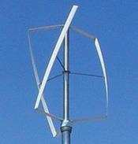

Figure 22. Turby three bladed vertical axis turbine.

There are moments of laminar flow and moments of turbulence resulting in intermittent lift power and
drag on the blades and this causes vibrations. The contribution of these blade parts to the driving
force of the turbine is negligible. In the curve of the blade, the speed of the headwind is high. The
angle of attack of the apparent wind is small, with the consequence that the component of the lift
force in the direction of the rotation also nears zero. These parts of the blades do not contribute
to the driving force. However given their high speed they do generate a high level of noise. This
explains why the Darrieus turbine vibrates heavily, makes a lot of noise and has a low efficiency.
The blades of the Turby concept are designed with a fixed distance to the vertical shaft. To reduce
the inevitable vibrations due to the change of the angle of attack between + 20 and – 20 degrees
resulting in a change of the mechanical stress in the blade two times per revolution, its developers
chose an odd number of 3 blades of a helical shape, making all changes occur gradually.

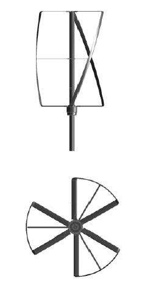

Figure 23. Turby triple blade wind turbine design on top of a building.

### TECHNICAL SPECIFICATIONS

Operation Cut-in wind speed 4 m/s Rated wind speed 14 m/s Cut-out wind speed 14 m/s Survival wind
speed 55 m/s Rated rotational speed 120 - 400 rpm Rated blade speed 42 m/s Rated power at 14 m/s 2.5
kW Turbine Overall height 2890 Weight (inc. blades) 136 kg Base flange Diameter 250 Bolt circle 230
Bolt holes 6 x M10 Rotor Diameter 1999 Height 2650 Rotorblades Number 3 Material composite Weight (3
blades) 14 kg Converter Type 4 -quadrants AC-DC-AC Rated power 2.5 kW Peak power 3.0 kW Output
220-240 V 50 Hz 60 Hz under development Weight 15 kg Integrated functions Control Maximum Power
Point tracker Start Starting is achieved by the generator in motor operation. Brake Electrical,
short circuiting of the generator. Protection Grid failure, anti islanding, system faults, short
circuit, mechanical faults, vibrations, blade rupture, imbalance. Overspeed protection Two
independent detection systems each triggering an independent brake action: 1. Generator frequency
measurement in the converter. 2. Generator voltage measurement on the generator terminals. Generator
Type, rated voltage, rated voltage 250 V 6.3 A, 3 phase synchronous permanent magnet Peak brake
current, rated power 60 A, 2.5 kW During 250 ms Overload 20 percent 120 min 50 percent 30 min 100
percent 10 min

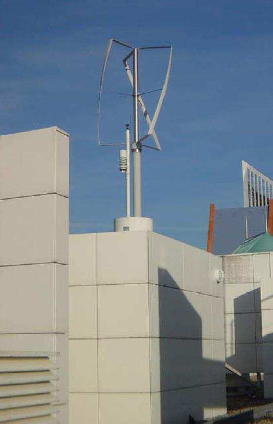

Figure 24. Wind tunnel testing of Turby wind turbine design.

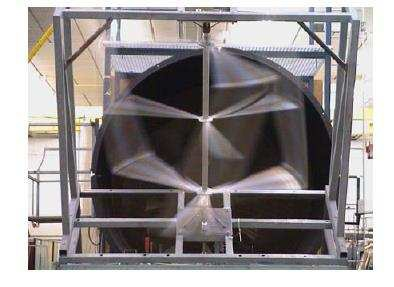

Figure 25. Turby turbine power curve.

### POLES DESIGNS

Two different mast types depending on the required height can be considered. Up to 6 m height,
spring supported masts. From 7.5 m and higher, freestanding tubular masts are used. Both types could
be either made of stainless steel or galvanized steel.

## HELICAL WIND TURBINES

### DESCRIPTION

The Windside Wind Turbine developed in Finland is a vertical wind turbine whose design is based on
sailing engineering principles. The turbine rotor is rotated by two spiral formed vanes. It is
intended for both inland and marine environments. Designs are for use in wind speeds of up to 60
m/s.

Figure 26. Helical wind turbine with generator at its base.

Figure 27. Manufacturing of helical wind blades. The generator is at right.

These designs for battery charging are a unique and ecological solution for energy production in
harsh environments under cold or hot conditions, violent storms, as well as low wind speeds. These
turbines generate almost no noise and are safe to use in population centers, public spaces, parks,
wildlife parks and on top of buildings. They are also aesthetically appealing and in many cases have
been used to combine art and functionality.

## QUIETREVOLUTION QR5 WIND TURBINE

### DESCRIPTION

The QR5 is a wind turbine designed in response to increasing demand for wind turbines that work well
in the urban environment, where wind speeds are lower and wind directions change frequently. It
possesses a sophisticated control system that takes advantage of gusty winds with a predictive
controller that learns about the site’s wind conditions over time to further improve the amount of
energy generated. If the control system determines that sufficient wind exists for operation, the
turbine is actively spun up to operating conditions at which point it enters the lift mode and
starts extracting energy from the wind. It will self-maintain in a steady wind of 4.0-4.5 m/s. The
turbine will brake in high wind events of speeds over 12 m/s and shut down at continuous speeds over
16 m/s. The blade tip speed is much lower than on a similarly rated horizontal axis wind turbine so
less noise is produced. The helical blade design results in a smooth operation that minimizes
vibration and further reduces acoustic noise. It is constructed using a light and durable carbon
fiber structure and is rated at 6kW and has an expected output of 9,600 kWhr per year at an average
annual wind speed of 5.9 m/s. This would provide 10 percent of the energy for a 600 m2 office
building. Its design life is 25 years.

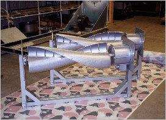

Figure 28. Quiet revolution QR5 wind turbine.

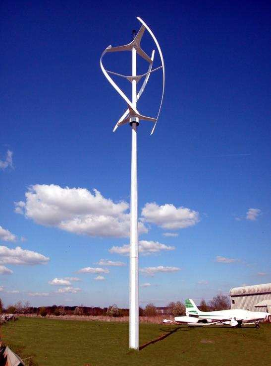

Figure 29. A direct drive in line electrical generator has auto shut down features and peak power
tracking. It is directly incorporated into the mast. The helical design of the blades captures
turbulent winds and eliminates vibration.

As a safety feature, it is designed with a high tensile wire running through all its component parts,
to minimize the risk of any broken parts being flung from the structure in the unlikely event of
structural failure.

### TECHNICAL SPECIFICATIONS

Physical dimensions 5m high x 3.1m diameter Generator Direct drive, mechanically integrated, weather
sealed 6 kW permanent magnet generator Power control Peak power tracking constantly optimizes
turbine output for all sites and wind speeds Operation mode Max wind speed: 16m/s; Min wind speed:
4m/s Design lifetime 25 years Rotor construction Carbon fiber and epoxy resin blades and connection
arms Brake and shutdown Overspeed braking above 14 m/s wind speed Auto shutdown in high wind speeds
above 16m/s Roof mounting Minimum recommended height above buildings: 3 m Tower mounting Minimum
mast height: 9m to bottom of blades Remote monitoring Event log can be accessed via PC. Remote
monitoring stores operation and kW hours of electricity generated

## AEROGENERATOR VERTICAL OFFSHORE WIND TURBINE CONCEPT

The 144 meters high and V-shaped structure would be mounted offshore and capable of generating up to
9 MW of electricity, roughly three times as much power as a conventional turbine of equivalent size.
Instead of being mounted on a tower with egg whisk blades that bow outwards and meet at the top like
a typical Darrieus design, it has two arms jutting out from its base to form a V-shape, with rigid
sails mounted along their length at intervals. As the wind passes over these they act like airfoils,
generating lift which turns the structure as a whole at roughly 3 rpm. No matter how high the two
main structures are made it is relatively simple to make them with a center of gravity at its
bottom. Because of this the technology lends itself to large engineering projects, which is what is
needed with wind power.

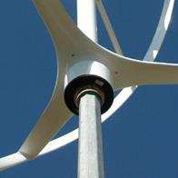

Figure 30. Offshore vertical Aerogenerator concept. Photo: Grimshaw Architects.

## WINDSPIRE WIND TURBINE

The Windspire design is 30 feet tall and 2 feet in radius. It is equipped with a high efficiency
generator, integrated inverter, hinged monopole, and wireless performance monitor. The slender
vertical axis design allows it to operate with a low tip speed ratio, with the edges of the rotor
spinning at 2 - 3 times the speed of the wind, making it virtually silent.

### ROTOR

The rotor is a low speed gyromill or a straight-bladed Darrieus design optimized for energy capture
efficiency by the Ecole Polytechique de Montréal. The rotor has modified the Darrieus high
efficiency configuration into a size and form optimal for small scale power generation. The changes
lowered the operating speed, making it nearly silent, while also improving its self-starting
capabilities. Constructed from aircraft grade aluminum, the rotor is both high strength and low
cost. At 10 mph wind, the noise level is imperceptible, and it is 8.8 dB above the ambient level in
a 50 mph wind; compared with 65-100 dB of other turbine designs. The installation includes a poured
concrete foundation without the need for guy wires.

Figure 31. Winsdspire vertical straight blade or gyromill Darrieus wind turbine design.

### GENERATOR

Double Rotating Air Core motors and generators provide the highest achieved efficiencies ever
attaining 98 percent. New manufacturing technology allows them to be produced with both the highest
possible efficiency at low cost. The Windspire generator technology was dynamometer tested and its
performance verified by Oregon State University and the University of Nevada, Reno, under a program
sponsored by the National Renewable Energy Laboratory (NREL).

Figure 32. Air core generator used with the Windspire turbine.

### INVERTER

The design has its own integrated inverter to convert the raw electrical power from the generator
into regulated electricity that ties in with the grid. The high efficiency inverter was designed to
optimize operation with the rotor and generator over the encountered range of wind speeds.

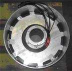

Figure 33. Inverter for the Windspire vertical wind turbine design.

### WIRELESS MONITORING

The Windspire concept is equipped with a wireless modem that is continuously transmitting the power
production information. With the Zigbee dongle modem unit, similar to a flash drive, plugged into a
computer's USB drive, one can monitor the performance of the turbine.

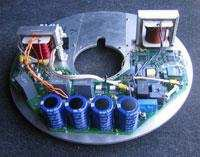

Figure 34. USB connection of wireless modem for monitoring the performance of the Windspire design.

### TECHNICAL SPECIFICATIONS

The Annual Energy Production, AEP is based on a Raleigh wind speed distribution and a sea level air
density. Annual Energy Production (AEP) 2,000 kW.hr Instantaneous Power Rating (IPR) 1.2 kW Standard
Unit Height 30 ft , 9.1 m Total Weight 600 lb , 273 kg Color Soft Silver Sound imperceptible at 10
mph 8.8 dB above ambient at 50 mph Rotor Type Vertical Axis Darrieus Low Speed Gyromill Rotor
Height; Radius 20 ft , 6.1 m 2 ft radius , 0.6 m Swept Area 80 sq ft , 7.43 sq m Maximum Rotor Speed
500 rpm Peak Tip Speed Ratio 2.8 Speed Control Dual Redundant: passive aerodynamic; electronic Wind
Tracking Instantaneous Generator High Efficiency Brushless Permanent Magnet Inverter Custom
Integrated Grid Tie 120 VAC 60 Hz Inverter Certification ETL: Meets IEEE 1547.1; UL 1741 Performance
Monitor Integrated Wireless Zigbee Modem Cut in Wind Speed 9 mph , 4 m/s AEP Average Wind Speed 12
mph , 5.4 m/s IPR Rated Wind Speed 25 mph ,11.2 m/s Survival Wind Speed 100 mph , 45 m/s Foundation
Poured Concrete Foundation Size 2 ft diameter by 6 ft base Rotor Material Aircraft Grade Extruded
Aluminum Monopole/Structure Material Recycled High Grade Steel Coatings Corrosion resistant
industrial grade paint

### POWER CURVE

Figure 35. Power curve of the Windspire flat blade Darrieus turbine.

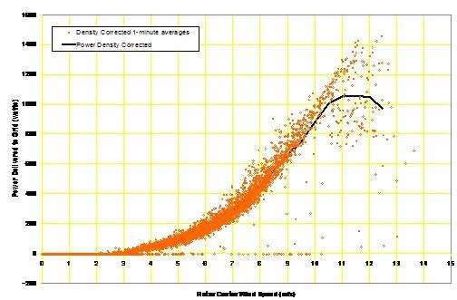

Figure 36. The Beacon: a conceptual design of vertical wind turbines providing power for green
buildings.

## REVOLUTION AIR WIND TURBINES

Pramac, an Italian power generation equipment manufacturer offers wind turbines aimed at domestic
use. A quadrangular 400 WT model with a rated power of 400 Watts, and a helical shape 1kW WT with a
rated power of 1,000 Watts are produced and offered at a price of $3,500.

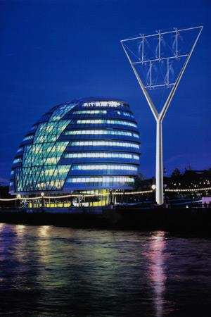
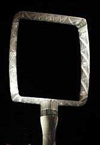

Figure 37. Two and three bladed vertical axis wind turbines. Source: Pramac.

## COUNTER ROTATING TURBINES ARRAYS

Figure 38. Array of counter-rotating vertical-axis wind turbines 10 m tall and 1.2 m in diameter
relative to a person 1.9 m in height. Turbine spacing is 1.6 turbine diameters [2]. Horizontal axis
wind turbines need a lot of space to operate. To avoid interference through turbulence, the spacing
between the towers has to be wide. Turbines have to be made larger and taller and built in high
places in order to catch more of the wind. All this adds to the cost and it impacts heavily on the
visual landscape. An array of counter-rotating Vertical Axis Wind Turbines allows the use of a
configuration has been identified that yields twice as much power per acre as with a Horizontal Axis
Wind Turbines. Averaged over all incident wind directions, the close proximity of the turbines
slightly improved their performance relative to the turbines in isolation. This is in contrast to
typical performance reductions between 20-50 percent for HAWTs at a similar turbine spacing. The
result is consistent with the predictions of simple numerical models which anticipated that
closely-spaced VAWTs can reciprocally enhance the wind field of the adjacent turbines. The wind farm
power flux for a VAWT farm given by: 22footprintfootprint(1)[/]4:footprint diameter [m] = wind
turbines spacing [m]wind turbine diameter [m]C = Capacity factor P = Electrical power generated [W]
windfarmPCLPWmDwhereDSDSDL = Wind farm aerodynamic loss factor (1) is approximately 18 W / m2.
The footprint diameter represents the area around a turbine where other turbines are excluded. This
performance is 6–9 times the power density of modern wind farms that utilize HAWTs. The
counter-rotation of the adjacent VAWTs is important because it ensures that the airflow induced by
each of the turbines in the region between them is oriented in the same direction. The creation of
horizontal wind shear or velocity gradient, which leads to turbulence and energy dissipation in the
region between the turbines, is reduced relative to adjacent turbines that rotate in the same
direction. Since the remaining wind energy between the turbines is not dissipated by turbulence, it
can be subsequently extracted by VAWTs located further downwind. This process is most effective for
VAWTs operating at higher tip speed ratios greater than 2, since in this regime the turbine rotation
can suppress vortex shedding and turbulence in the wake in a manner similar to that observed in
studies of spinning cylinders. At lower tip speed ratios, the VAWTs likely create a larger wake akin
to that of a stationary cylinder with a corresponding reduced performance [2]. This approach is
different from current practices in wind energy harvesting. In this case, a large number of smaller
VAWTs are implemented instead of fewer, large HAWTs. The higher levels of turbulence near the
ground, both naturally occurring and induced by the VAWT configuration, enhance the vertical flux of
kinetic energy delivered to the turbines, thereby facilitating their close spacing. This could
alleviate many of the practical challenges associated with large HAWTs, such as the cost and
logistics of their manufacture, transportation, and installation by using less expensive materials
and manufacturing processes and by exploiting greater opportunities for mass production and general
acceptance by local communities. The optimal configuration of the array can be determined using the
analog of vortices generated in a horizontal water tank with a stream flow simulating the wind
stream.

## SMALL VERTICAL AXIS WIND TURBINES ARRAYS

As the wind passes around and through a wind turbine, it produces turbulence that buffets downstream
turbines, reducing their power output and increasing wear and tear. Vertical-axis turbines produce a
wake that can be beneficial to other turbines, if they are positioned correctly. Since the blades
are arranged vertically, the wind moving around the vertical-axis turbines speeds up, and the
vertical arrangement of the blades on downstream wind turbines allows them to effectively catch that
wind, speed up, and generate more power. Small vertical axis wind turbines that are 10 meters tall
and generate3-5 kWs are easy to manufacture and cost less than conventional ones if produced on a
large scale. The maintenance costs could be less because the generator sits on the ground, rather
than at the top of a 100-meter tower, and thus is easier to access. The noise of horizontal axis
wind turbines has led some communities to campaign to tear them down. These small turbines are
almost inaudible and are less likely to kill birds. Their use on military bases is contemplated
because they are shorter and interfere less with helicopter operations and with radar. Vertical-axis
wind turbines are less efficient than horizontal axis wind turbines since half of the time the
blades are actually moving against the wind, rather than generating the lift needed to spin an
electrical generator. As the blades alternatively catch the wind and then move against it, they
create wear and tear on the structure. Adding half a shield against the return stroke would solve
the problem.

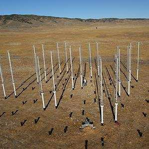
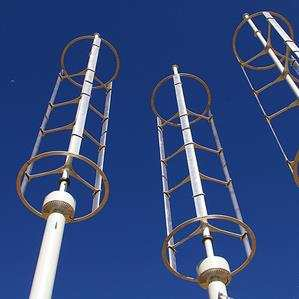

Figure 39. Vertical axis wind turbines, Los Angeles County, California [3].

## DISCUSSION

The idea for Vertical Axis Wind Turbines (VAWTs) has been blowing around for decades, but despite
many advantages the technology has so far attracted little interest. A Darrieus turbine becomes
unstable above a certain height. The largest Horizontal Axis Wind Turbines (HAWTs) are capable of
producing 6 MW of power and stand just short of 100 meters tall, but if made any bigger they start to
become less efficient. One reason is that the weight of the turbine blades becomes prohibitive. As
they turn, this places the blades under enormous stress because gravity compresses them as they rise
and stretches them as they fall. The larger you make these structures, the more robust they must be
in order to withstand these forces. In addition, the cost and difficulty of building the increasingly
large towers needed to keep this top-heavy structure stable lead to a major engineering challenge. An
advantage of VAWTs is that they can catch the wind from all directions eliminating the need for a yaw
mechanism. In addition, they can be built lower, so they are less visible and can withstand much
harsher environments and do not need to be shut down when wind speeds exceed 64 mph, and even then
the structures are claimed to withstand speeds of up to 110 mph.

## REFERENCES

1. Cliff Kuang, “Farming in the Sky,” Popular Science, Vol. 273, No. 3, pp. 43-47, September 2008.
2. John O. Dabiri, “Potential Order-of-magnitude Enhancement of Wind Farm Power Density via
Counter-rotating Vertical-axis Wind Turbine Array,” Journal of Renewable and Sustainable Energy,
Volume 3, Issue 4, July 19, 2011. 3. Kevin Bullis, “Will Vertical Turbines Make More of the Wind?”
Technology Review, April 8, 2013.
