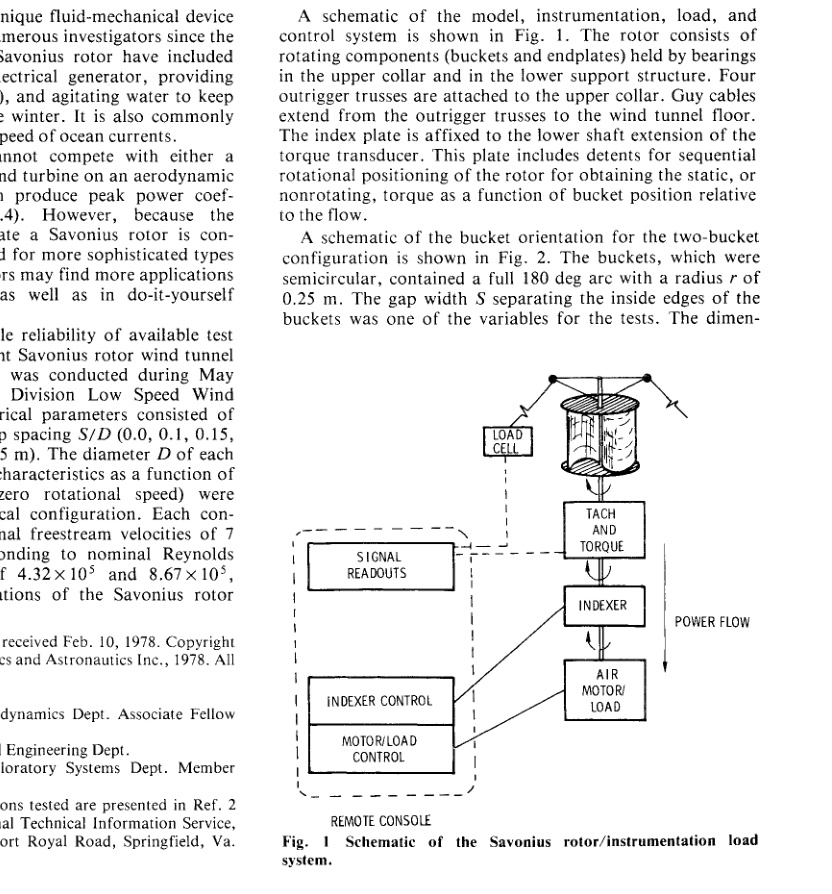
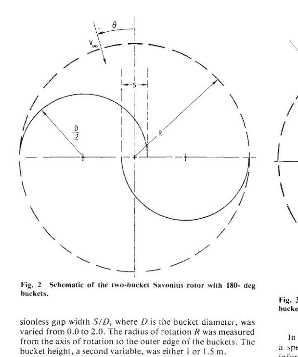
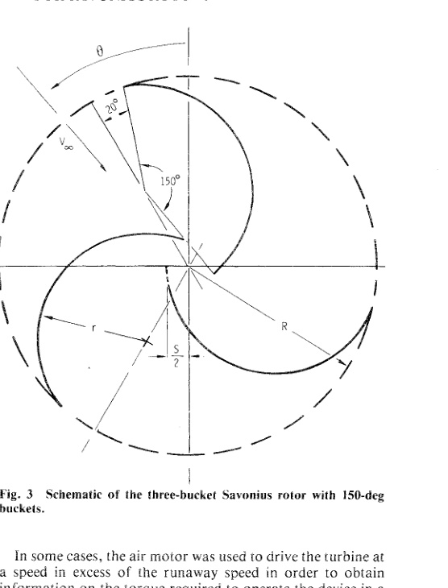
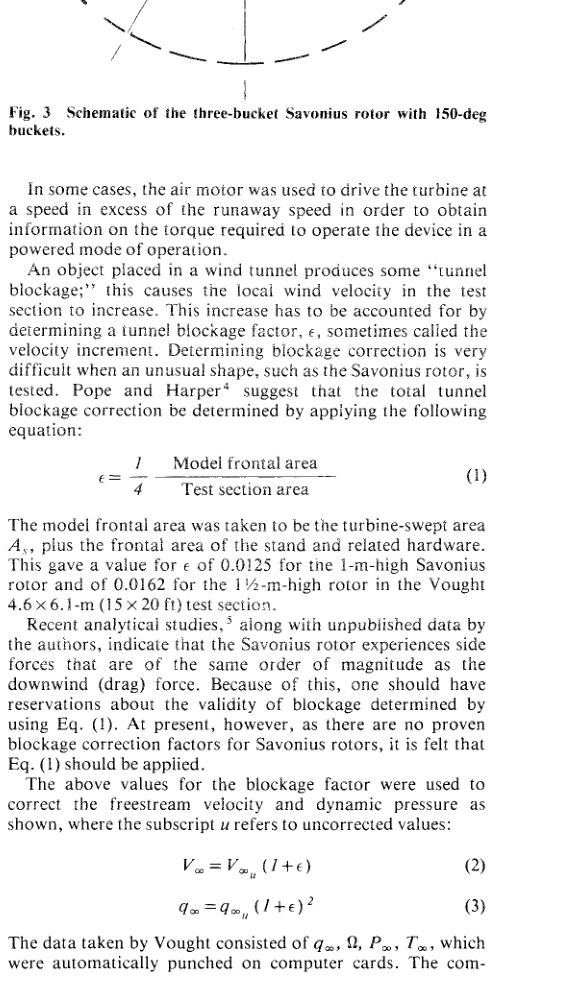
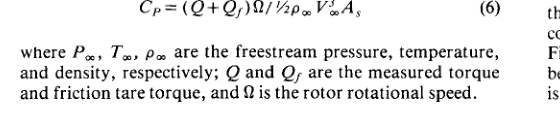
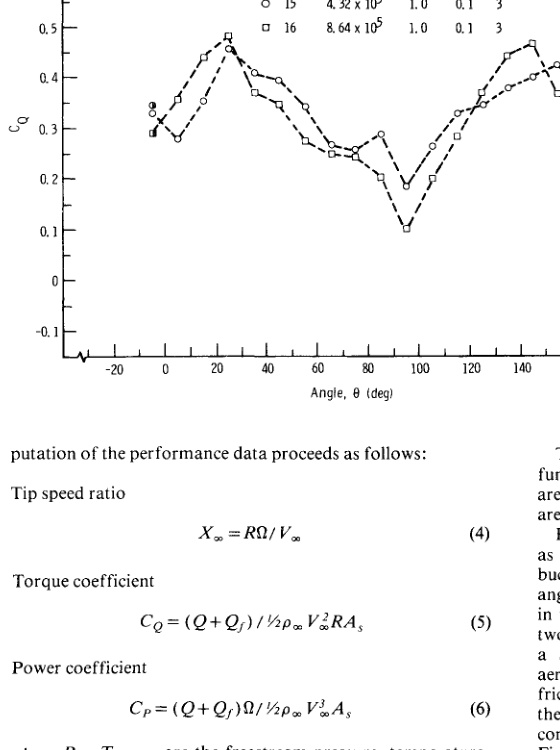
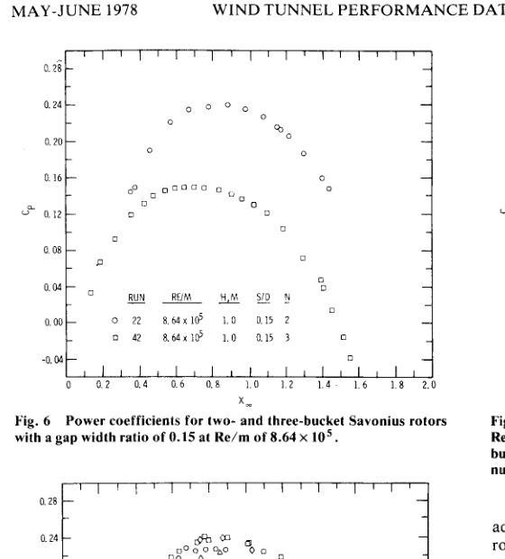
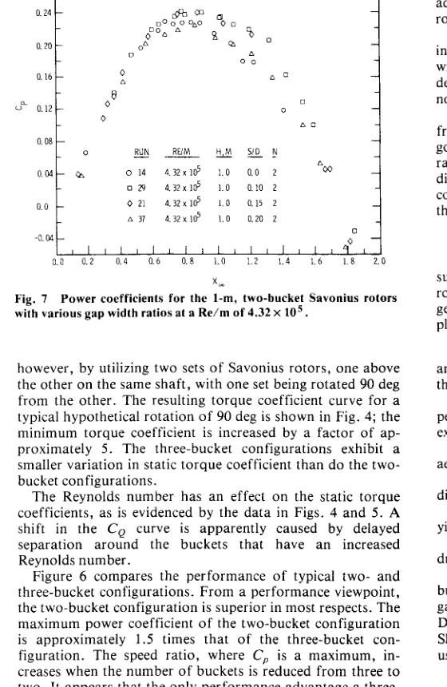
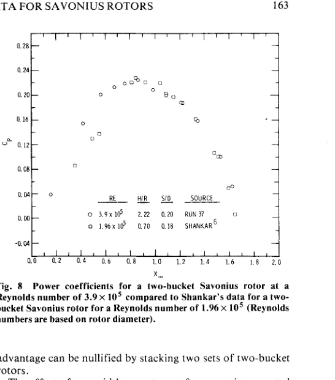

# Wind Tunnel Performance Data for Two- and Three-Bucket Savonius Rotors

Robert E. Sheldahl, Sandia Laboratories, Albuquerque, N. Mex.

Bennie F. Blackwell, Louisiana Tech University, Ruston, La.

Louis V. Feltz, Sandia Laboratories, Albuquerque, N. Mex.

Fifteen configurations of a Savonius rotor wind turbine were tested in the Vought Corporation Systems Division 4.9-x6.1-m Low Speed Wind Tunnel to determine aerodynamic performance. The range of values of the varied parameters was as follows: number of buckets, 2 and 3; nominal freestream velocity, 7 and 14 m/s; Reynolds number per meter, 4.32 x 10^5 and 8.67 x 10^5; rotor height, 1 and 1.5 m; rotor diameter (nominal), 1 m; bucket overlap, 0.0-0.1 m. The measured test variables were torque, rotational speed, and tunnel conditions. It is concluded that increasing Reynolds number and/or aspect ratio improves performance. The recommended configuration consists of two sets of two-bucket rotors, rotated 90 deg apart, with each rotor having a dimensionless gap width of 0.1-0.15.

The Savonius rotor is a unique fluid-mechanical device that has been studied by numerous investigators since the 1920's. Applications for the Savonius rotor have included pumping water, driving an electrical generator, providing ventilation (attic and vehicular), and agitating water to keep stock ponds ice-free during the winter. It is also commonly used as a meter to measure the speed of ocean currents.

Savonius rotors generally cannot compete with either a propeller-type or a Darrieus wind turbine on an aerodynamic performance basis (which can produce peak power coefficients of approximately 0.4). However, because the technology required to fabricate a Savonius rotor is considerably less than that required for more sophisticated types of wind turbines, Savonius rotors may find more applications in the developing countries as well as in do-it-yourself projects.

The scarcity and questionable reliability of available test data gave rise to an independent Savonius rotor wind tunnel test program. The program was conducted during May 1975 at the Vought Systems Division Low Speed Wind Tunnel. The varying geometrical parameters consisted of number of buckets `N` (2, 3), gap spacing `S/D` (0.0, 0.1, 0.15, 0.20), and rotor height `H` (1, 1.5 m). The diameter `D` of each bucket was 0.5 m. The torque characteristics as a function of rotational speed (including zero rotational speed) were determined for each geometrical configuration. Each configuration was tested at nominal freestream velocities of 7 m/s and/or 14 m/s, corresponding to nominal Reynolds number per meter, `Re/m`, of `4.32 x 10^5` and `8.67 x 10^5`, respectively. Fifteen configurations of the Savonius rotor wind turbine were tested.

Figure 1. Schematic of the Savonius rotor/instrumentation load system.

A schematic of the model, instrumentation, load, and control system is shown in Fig. 1. The rotor consists of rotating components (buckets and endplates) held by bearings in the upper collar and in the lower support structure. Four outrigger trusses are attached to the upper collar. Guy cables extend from the outrigger trusses to the wind tunnel floor. The index plate is affixed to the lower shaft extension of the torque transducer. This plate includes detents for sequential rotational positioning of the rotor for obtaining the static, or nonrotating, torque as a function of bucket position relative to the flow.

Figure 2. Schematic of the two-bucket Savonius rotor with 180-deg buckets.

A schematic of the bucket orientation for the two-bucket configuration is shown in Fig. 2. The buckets, which were semicircular, contained a full 180-deg arc with a radius `r` of 0.25 m. The gap width `S` separating the inside edges of the buckets was one of the variables for the tests. The dimensionless gap width `S/D`, where `D` is the bucket diameter, was varied from 0.0 to 2.0. The radius of rotation `R` was measured from the axis of rotation to the outer edge of the buckets. The bucket height, a second variable, was either 1 or 1.5 m.

Figure 3. Schematic of the three-bucket Savonius rotor with 150-deg buckets.

The buckets for all the three-bucket rotors (Fig. 3) with the exception of one configuration were constructed with a 150-deg arc and a radius `r` of 0.25 m. The buckets for the other three-bucket rotor were the same as those used for the two-bucket configurations. For practical design considerations, the arc of the buckets was shortened by 20 deg on the outer edge and 10 deg on the inner edge. The gap distance is defined as for a two-bucket configuration; i.e., the gap distance `S/2` is the distance from the axis of rotation to the end of the bucket arc, assuming the arc is carried to the full 180 deg (Fig. 3).

Before each configuration was tested, the rotor was rotated by the air motor at a very low, but constant, rotational speed to obtain the tare torque of the system caused by friction in the bearings. These values, of the order of `0.7 N-m` (6 in.-lbf), were recorded for each configuration and used in the data reduction.

Two types of tests were performed with the models for all fifteen configurations. The first type consisted of static tests; that is, the turbine rotor was locked at a particular angle relative to the flow of air. The static torque produced by the turbine was recorded. The rotor position was then changed by 10 deg and a new value of static torque was obtained.

In the second type, the dynamic tests, the model itself was rotated and a load was provided by the air motor. The turbine rotational speed was varied from runaway down to a rotational speed at which the torque exceeded the capability of the air motor. For a typical test run, the tunnel wind speed was brought to a steady-state value, nominally 7 or 14 m/s, and the turbine, with a predetermined load provided by the air motor, was allowed to rotate. When steady-state rotation was achieved, a data point was taken. A slight change in the load then caused the turbine to rotate at a new speed. When the new rotational speed was stabilized, another data point was taken.

In some cases, the air motor was used to drive the turbine at a speed in excess of the runaway speed in order to obtain information on the torque required to operate the device in a powered mode of operation.

An object placed in a wind tunnel produces some “tunnel blockage”; this causes the local wind velocity in the test section to increase. This increase has to be accounted for by determining a tunnel blockage factor, `epsilon`, sometimes called the velocity increment. Determining blockage correction is very difficult when an unusual shape, such as the Savonius rotor, is tested. Pope and Harper suggest that the total tunnel blockage correction be determined by applying Eq. (1).

The model frontal area was taken to be the turbine-swept area `As`, plus the frontal area of the stand and related hardware. This gave a value for `epsilon` of `0.0125` for the 1-m-high Savonius rotor and `0.0162` for the 1.5-m-high rotor in the Vought 4.6 x 6.1-m (15 x 20 ft) test section.

Recent analytical studies, along with unpublished data by the authors, indicate that the Savonius rotor experiences side forces that are of the same order of magnitude as the downwind (drag) force. Because of this, one should have reservations about the validity of blockage determined by using Eq. (1). At present, however, as there are no proven blockage correction factors for Savonius rotors, it is felt that Eq. (1) should be applied.

The above values for the blockage factor were used to correct the freestream velocity and dynamic pressure as shown, where the subscript `u` refers to uncorrected values.

The data taken by Vought consisted of `q∞`, `Omega`, `P∞`, `T∞`, which were automatically punched on computer cards. The computation of the performance data proceeds as follows:

where `P∞`, `T∞`, `rho∞` are the freestream pressure, temperature, and density, respectively; `Q` and `Qf` are the measured torque and friction tare torque, and `Omega` is the rotor rotational speed.

The data for torque and power coefficients are plotted as a function of the turbine speed ratio. Static torque coefficients are plotted as a function of rotor angular position. All data are corrected for tunnel blockage and tare torque.

Figure 4. The static torque coefficient as a function of angular position for a two-bucket Savonius rotor with a gap width ratio of 0.10 for `Re/m` of `4.32 x 10^5` and `8.64 x 10^5`.

Figure 5. The static torque coefficient as a function of angular position for a three-bucket Savonius rotor with a gap width ratio of 0.10 for `Re/m` of `4.32 x 10^5` and `8.64 x 10^5`.

Figures 4 and 5 present typical static torque coefficient data as a function of angular position for the two- and three-bucket configurations. Figures 2 and 3 give the origin of the angular position coordinate system. There is a wide variation in the static torque coefficient with angular position for the two-bucket configuration. In order to ensure that it will start a Savonius rotor from any angular position, the static aerodynamic torque must exceed the combined load and friction tare torques. This implies that the minimum value of the static torque coefficient may be the deciding factor in controlling the required size of a Savonius starter. The data in Figs. 4 and 5 suggest that a two-bucket Savonius rotor might be a poor choice for a starter system because the minimum `CQ` is quite small in many cases. This problem can be overcome, however, by utilizing two sets of Savonius rotors, one above the other on the same shaft, with one set being rotated 90 deg from the other. The resulting torque coefficient curve for a typical hypothetical rotation of 90 deg is shown in Fig. 4; the minimum torque coefficient is increased by a factor of approximately 5. The three-bucket configurations exhibit a smaller variation in static torque coefficient than do the two-bucket configurations.

The Reynolds number has an effect on the static torque coefficients, as is evidenced by the data in Figs. 4 and 5. A shift in the `CQ` curve is apparently caused by delayed separation around the buckets that have an increased Reynolds number.

Figure 6. Power coefficients for two- and three-bucket Savonius rotors with a gap width ratio of 0.15 at `Re/m` of `8.64 x 10^5`.

Figure 7. Power coefficients for the 1-m, two-bucket Savonius rotors with various gap width ratios at a `Re/m` of `4.32 x 10^5`.

Figure 6 compares the performance of typical two- and three-bucket configurations. From a performance viewpoint, the two-bucket configuration is superior in most respects. The maximum power coefficient of the two-bucket configuration is approximately 1.5 times that of the three-bucket configuration. The speed ratio, where `Cp` is a maximum, increases when the number of buckets is reduced from three to two. It appears that the only performance advantage a three-bucket configuration has over a two-bucket configuration is that the minimum static torque is greater. However, this advantage can be nullified by stacking two sets of two-bucket rotors.

The effect of gap width on rotor performance is presented in Fig. 7. The data indicate superior performance for a gap width of `S/D = 0.1-0.15`. Both larger and smaller gaps decrease performance. Performance difference is most noticeable at higher speed ratios.

Figure 8. Power coefficients for a two-bucket Savonius rotor at a Reynolds number of `3.9 x 10^5` compared to Shankar's data for a two-bucket Savonius rotor for a Reynolds number of `1.96 x 10^5` (Reynolds numbers are based on rotor diameter).

Figure 8 compares one data set of this report with data from Shankar. Agreement between the two data sets is quite good at high speed ratios but relatively poor at low speed ratios; no satisfactory explanation has been found for this discrepancy. Data for a three-bucket configuration were not compared because of model geometrical differences between this study and Shankar's.

## Conclusions

Tests of 15 configurations of a Savonius rotor included such parameters as number of buckets, freestream velocity, rotor height, and bucket overlap or gap width. The following general conclusions were drawn from the data of the completed test program:

1. The static torque coefficient is much more variable with angular position for a two-bucket configuration than for a three-bucket configuration.
2. The two-bucket configurations have better aerodynamic performance than the three-bucket configurations, with the exception of starting torque.
3. Increasing the test Reynolds number generally improves aerodynamic performance.
4. Performance increases slightly with increasing height-to-diameter ratio.
5. A dimensionless gap width of `S/D = 0.1-0.15` appears to yield optimum performance.
6. For maximum power from a fixed bucket size (as with oil drums), the recommended gap width is `S/D = 0.1-0.15`.
7. The recommended configuration is two sets of two-bucket rotors, rotated 90 deg apart, with each rotor having a gap width of `S/D = 0.1-0.15`.

Data from this test program, along with the data from Shankar, should provide a significant base for the study and use of Savonius rotors.

## Acknowledgment

This work was supported by the Department of Energy.

## References

1. Savonius, S.J., *The Wing Rotor in Theory and Practice*, Savonius Co., Finland, 1928.
2. Blackwell, B.F., Sheldahl, R.E., and Feltz, L.V., “Wind Tunnel Performance Data for Two- and Three-Bucket Savonius Rotors,” Sandia Laboratories, Albuquerque, N.Mex., SAND76-0131, July 1977.
3. Holbrook, J.W., “Low Speed Wind Tunnel Handbook,” LTV Aerospace Corporation, Dallas, Texas, AER-EOR-12995-B, Feb. 1974.
4. Pope, A. and Harper, J.J., *Low Speed Wind Tunnel Testing*, John Wiley, New York, 1966.
5. Wilson, R.E., Lissaman, P.B.S., and Walker, S.N., “Aerodynamic Performance of Wind Turbines,” Oregon State University, June 1976.
6. Shankar, P.N., “The Effects of Geometry and Reynolds Number on Savonius Type Rotors,” National Aeronautical Laboratory, Bangalore, India, AE-TM-3-76, 1976.
