<!-- PDF page 1 -->

Contents lists available at ScienceDirect
Energy Conversion and Management
journal homepage: www.elsevier.com/locate/enconman
Characterization of aerodynamic performance of vertical axis wind turbines:
Impact of operational parameters
Abdolrahim Rezaeihaa,⁎, Hamid Montazeria,b, Bert Blockena,b
a Building Physics and Services, Department of the Built Environment, Eindhoven University of Technology, P.O. Box 513, 5600 MB Eindhoven, The Netherlands
b Building Physics Section, Department of Civil Engineering, KU Leuven, Kasteelpark Arenberg 40 – Bus 2447, 3001 Leuven, Belgium
A R T I C L E I N F O
Keywords:
Darrieus H-type VAWT
Tip speed ratio
Reynolds number
Turbulence intensity
Dynamic loads
Turbine wake
A B S T R A C T
Vertical axis wind turbines (VAWTs) have received growing interest for off-shore application and in the urban
environments mainly due to their omni-directional capability, scalability, robustness, low noise and costs.
However, their aerodynamic performance is still not comparable with their horizontal axis counterparts. To
enhance their performance, the impact of operational parameters such as tip speed ratio (λ), Reynolds number
(Rec) and turbulence intensity (TI) on their power performance and aerodynamics needs to be deeply under-
stood. The current study, therefore, intends to systematically investigate the effect of these parameters in order
to provide a deeper insight into their impact on the aerodynamic performance of VAWTs. For this investigation,
a Darrieus H-type VAWT has been employed. A wide range of the parameters is considered: λ = 1.2–6.0,
Rec = 0.3 × 105–4.2 × 105 and TI = 0%–30% to analyze the turbine performance, turbine wake and dynamic
loads on blades. High-fidelity computational fluid dynamics (CFD), extensively validated with experimental
data, are employed. The results show that (i) variable-speed operation maintaining the optimal λ at different
wind speeds improves the turbine power coefficient, e.g. up to 168% at 4 m/s, while keeping an almost constant
thrust coefficient, (ii) the turbine performance and wake are Re-dependent up to the highest Rec studied, (iii)
large TI (> 5%) improves the turbine performance in dynamic stall by promoting the laminar-to-turbulent
transition and delaying stall on blades, however it deteriorates the optimal performance by introducing extra
skin friction drag. The findings of the current study can support more accurate performance prediction of VAWTs
for various operating conditions and can help the improvement of the aerodynamic performance of VAWTs.
1. Introduction
Vertical axis wind turbines (VAWTs) have received growing interest
[1–7] for off-shore applications [8–10] as well as the built environment
where they have the potential to be installed on the roof [11], included
in the façade [12–15] or between buildings [16]. The installation can
also be integrated in the ventilation ducts [17,18] and wind catchers
[19–22]. The growing interest in the use of VAWTs could be attributed
to several advantages such as [19,23–28]:
• Omni-directional capability: no yaw system is needed.
• Very low noise: due to operating at relatively low tip speed ratios
and small diameters, the blade tip speed is very low.
• Low manufacturing cost: due to simple blade profiles with no taper
and twist as well as simplicity in the control system, i.e. no pitch and
yaw control system.
• Low installation and maintenance costs: due to having the generator
on the ground.
• Scalability: the turbine height can scale up with minimal effect on
performance.
• Robustness and reliability.
• Very small shadow flickering.
• Birds safety: due to their shape and typically low installation height
• Visually attractive.
• Multifaceted installation tower, e.g. telecom towers
• High space efficiency: VAWTs have smaller plan area compared to
HAWT of the same swept area.
However, the aerodynamic performance of VAWTs is currently
lower than HAWTs [29–32]. Research on VAWTs, despite their complex
aerodynamics, has been situated in the shadow of the studies on
HAWTs and hence received comparatively little attention during the
last decades [33]. The underlying physics behind the power generation
of VAWTs is much more complex compared to HAWTs [34–40]. The
complexity could be mainly attributed to the VAWT’s inherent unsteady
power conversion due to the large variations of angle of attack and the
https://doi.org/10.1016/j.enconman.2018.05.042
Received 24 February 2018; Received in revised form 11 May 2018; Accepted 12 May 2018
⁎ Corresponding author.
E-mail address: a.rezaeiha@tue.nl (A. Rezaeiha).
Available online 26 May 2018
0196-8904/ © 2018 The Authors. Published by Elsevier Ltd. This is an open access article under the CC BY license (http://creativecommons.org/licenses/BY/4.0/).
T

<!-- PDF page 2 -->

relative velocity during each turbine revolution [23]. In addition, this
can be accompanied by several complex flow phenomena such as dy-
namic stall [41,42], blade-wake interaction [43], flow curvature effects
[44], Coriolis and centrifugal forces on the boundary layer of the ro-
tating blades and the shed vortices [45]. In order to improve the
aerodynamic performance of VAWTs, therefore, these flow complexities
need to be well understood. In addition, the impact of various geome-
trical parameters and operational parameters on the aerodynamic
performance of VAWTs needs to be comprehensively characterized. The
geometrical parameters include number of blades [46–48], solidity
[49–51], airfoil shape [52–54], blade pitch angle [23] and turbine shaft
[55]. The operational parameters consist of tip speed ratio [56–61],
Reynolds number [61–65] and turbulence intensity [58,66–68]. The
focus of the present study is on the impact of the aforementioned op-
erational parameters.
Tip speed ratio λ is one of the most important operational
Nomenclature
A
turbine swept area, h d
· [m2]
c
blade chord length [m]
Cd
sectional drag coefficient, D
ρcV
/(0.5
)
rel
2
[–]
CFn
instantaneous normal force coefficient [–]
CFt
instantaneous tangential force coefficient [–]
Cl
sectional lift coefficient, [–]
Cm
instantaneous moment coefficient [–]
CP
power coefficient,
∞
P
qAU
/(
) [–]
CT
thrust coefficient, T
qA
/(
) [–]
CoP
pressure coefficient [–]
D
sectional drag force [N/m]
d
turbine diameter [m]
h
turbine height [m]
k
turbulence kinetic energy [m2/s2]
K
reduced frequency,
c
V
Ω /(2
)
rel [–]
L
sectional lift force [N/m]
Lw
turbine wake length [m]
M
turbine moment [Nm]
n
Number of blades [–]
P
turbine power [W]
q
dynamic pressure [Pa]
R
turbine radius [m]
Rec
airfoil (blade) chord-based Reynolds number [–]
Reθ
Momentum-thickness Reynolds number [–]
T
turbine thrust force [N]
TI
approach-flow total turbulence intensity [%]
TIi
incident-flow total turbulence intensity [%]
u
time-averaged streamwise velocity [m/s]
V
velocity magnitude [m/s]
Vn
normal velocity [m/s]
Vt
tangential velocity [m/s]
Ui
induced velocity [m/s]
U∞
freestream velocity [m/s]
v
time-averaged lateral velocity [m/s]
Vrel
relative velocity [m/s]
Vrel,geo
geometrical relative velocity [m/s]
W
domain width [m]
X/c
dimensionless chordwise position along the blade [–]
α
angle of attack [°]
αgeo
geometrical angle of attack [°]
αi
induced angle of attack due to induced velocity [°]
αss
static stall angle [°]
γ
intermittency [–]
θ
azimuth angle [°]
λ
tip speed ratio [–]
ν
kinematic viscosity of air [m2/s]
σ
solidity [–]
ω
specific dissipation rate [1/s]
Γ
circulation [m2/s]
Ω
turbine rotational speed [rad/s]
Ωopt
optimal turbine rotational speed [rad/s]
LSB
laminar separation bubble
Fig. 1. Schematic of velocity triangle on a VAWT blade showing the difference between: (a and b) low versus high tip speed ratio, (c and d) considering versus
ignoring the induced velocity (not to scale).
A. Rezaeiha et al.

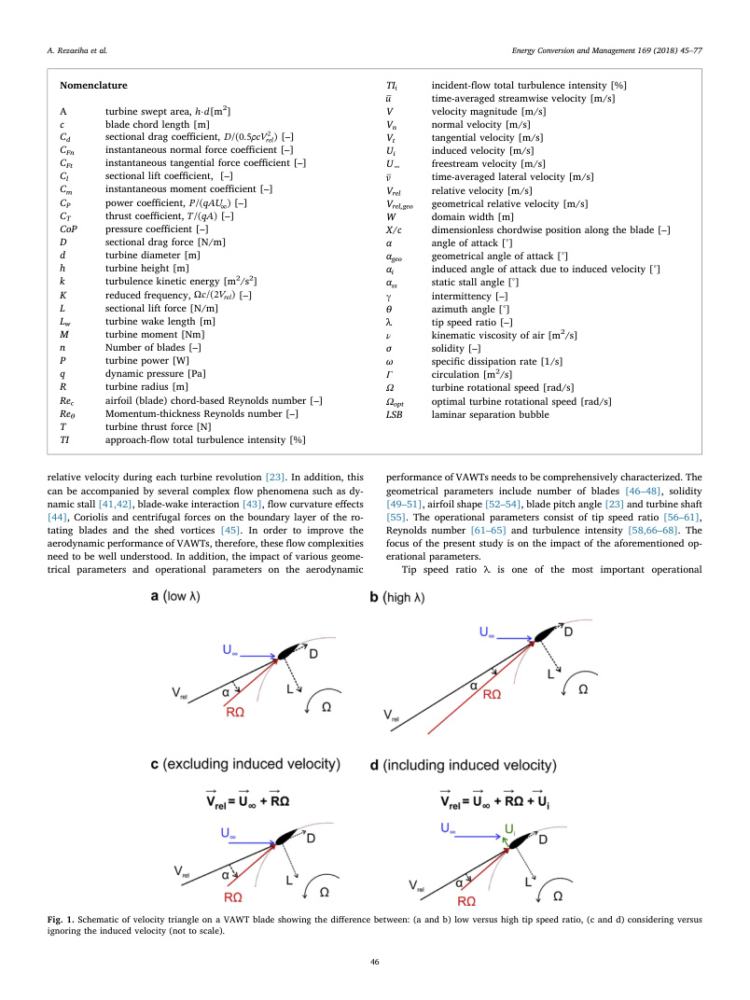

<!-- PDF page 3 -->

parameters for VAWTs as it defines the range of variations of angle of
attack (Δα) on blades during each turbine revolution. Low λ values
correspond to large Δα (Fig. 1a) that could result in significant flow
separation and the consequent power loss, if the stall angle is exceeded.
On the other hand, high λ values correspond to small Δα (Fig. 1b),
which could also mean that the blade is producing less power than its
actual capability. Neither of the two cases are desired. Therefore, it is
very important to deeply clarify the impact of λ on the aerodynamic
performance of VAWTs. Note that the velocity triangle on a VAWT
blade includes the induced velocity Ui. The induced velocity, which is
usually ignored for simplicity, will affect the calculated α and relative
velocity Vrel (see Fig. 1c and d) and consequently the loads on blades.
The importance of considering the induced velocity in the aerodynamic
performance calculations for VAWTs is further discussed in the
Appendix A.
Numerous studies have been performed to provide insight on the
impact of λ for VAWTs [56–61]. However, the vast majority of these
studies focused on the impact of λ on power coefficient CP, while less
attention has been paid to the detailed analysis of aerodynamics and
dynamic loads on turbine blades. In addition, these studies did not in-
vestigate the optimal turbine operation by maintaining the optimal λ
versus wind speed. Such investigations could highlight the benefits of
maintaining the optimal tip speed ratio for VAWTs.
The prime effect of Reynolds number (Re) on boundary layer events
and the aerodynamic performance of static airfoils is well shown in the
literature [69–75]. The performance of VAWTs highly depends on the
flow development over the blades, which have airfoil cross section.
However, the presence of the two sources of unsteadiness, α and Vrel
imposes significant differences in the boundary layer events compared
to the static airfoils [23]. Therefore, the impact of Re on the dynamic
Table 1
Geometrical and operational characteristics of the reference turbine.
Parameter
Value
Number of blades, n
2
Diameter, d [m]
1
Swept area, A [m2]
1
Airfoil
NACA0018
Airfoil chord, c [m]
0.06
Solidity, σ
0.12
Blade aspect ratio, h/c
16.67
Shaft diameter [m]
0.04
Tip speed ratio, λ
4.5
Rotational speed, Ω [rad/s]
83.8
Freestream velocity, U∞[m/s]
9.3
Chord-based Reynolds number, Rec
1.76 × 105
Freestream (approach-flow) total TI [%]
5
Turbulence length scale [m]
1
Reduced frequency, K
0.06
Fig. 2. Schematic of (a) the reference turbine and (b) the computational domain (both not to scale); (c–h) computational grid near the (c) rotating core, (d) airfoil, (e)
leading edge, (f) trailing edge; and along the span for the (g) airfoil and (h) shaft.
A. Rezaeiha et al.

<!-- PDF page 4 -->

loads on blades and the turbine performance cannot be simply adopted
from the knowledge on static airfoils and demands a dedicated in-
vestigation.
For wind turbines, mainly due to size limitations, experiments are
typically performed at small scales. This is especially the case when the
wake effects and optimal arrangement of multiple turbines are in-
vestigated. This further emphasizes that the impact of Re on both tur-
bine performance and wake needs to be well understood in order to
enable a realistic interpretation of the scaled experiments for full-scale
prototypes.
The high sensitivity of the VAWT performance to Re has been stu-
died by Blackwell et al. [62], Polagye et al. [63], Bravo et al. [64],
Bachant and Wosnik [65], Araya and Dabiri [61] and Zanforlin and
Deluca [76]. While these studies have provided valuable findings, they
did not focus on the impact of Re on blade aerodynamics and dynamic
loads.
The importance of freestream turbulence on the separation behavior
and the overall performance of airfoils [77] and HAWTs [78] is well
established. It should be noted that while numerical and experimental
studies of wind turbines are typically performed at a fixed turbulence
level, in a real operating condition, such as in the urban environment,
freestream turbulence intensity is varies widely [70,79–81]. Research
on the impact of turbulence intensity for VAWTs is scarce and limited to
few studies [58,66–68], which narrowed their scope on variations in CP.
To the best of our knowledge, however, a comprehensive study on the
impact of TI on the aerodynamics, power performance and wake of
VAWTs has not yet been performed.
Therefore, the current study intends to address these gaps by
probing into the impact of λ, Rec and TI on:
• Dynamic loads on blades: the variations of geometrical and experi-
enced angle of attack, relative velocity, lift, drag and pressure
coefficients and vorticity fields;
• Turbine performance: turbine power and thrust force, instantaneous
tangential and normal loads on blades and the contribution of each
turbine quartile in power production;
• Turbine wake: the instantaneous wake generation by a single blade
and the mean velocity profiles in the wake.
The findings of this study are of paramount importance as they can
significantly improve the accuracy of the performance predictions of
VAWTs for different operating conditions. In addition, the results sup-
port the improvement of the design of VAWTs with respect to the target
operating conditions.
The outline of the paper is: Section 2 describes the computational
settings and parameters where the details of the studied turbine, the
computational domain and grid and other numerical settings are pre-
sented. Section 3 briefly explains the verification and validation studies.
The impact of tip speed ratio, Reynolds number and turbulence in-
tensity are presented and discussed in Sections 4–6. The summary and
conclusions are provided in Section 7.
2. Computational settings and parameters
A H-type vertical axis wind turbine with the geometrical and op-
erational characteristics described in Table 1 is employed. The blade
cross-section is the typical symmetrical NACA0018 airfoil. The geo-
metrical and operational parameters of the reference turbine are se-
lected with respect to the experimental study by Tescione et al. [82]
employed for the validation (see Section 3). A schematic of the re-
ference turbine is illustrated in Fig. 2a. The turbine and shaft rotate
counter-clockwise with the same rotational velocity.
For the reference case, the approach-flow total TI is 5% (see
Table 1), while the incident-flow total TI is 4.42%. It should be noted
that for CFD simulations of VAWTs the incident-flow TI (the value at
the location of the turbine), rather than the approach-flow TI
(freestream), should be reported as it represents the level of turbulence
that is actually experienced by the turbine blades. The decay of the
turbulence in the computational domains has been already shown for
the urban flows [83–86] and VAWTs [87]. The turbulence length scale
at the inlet of CFD simulations describes the size of the large energy-
containing eddies in a turbulent flow. For the flow around a wind
turbine, the size of such eddies is found to be in the order of the turbine
diameter [88]. Therefore, in the present study, the turbulence length
scale is selected equal to the turbine diameter, i.e. 1 m.
A two-dimensional (2D) and a 2.5D computational domain, as
shown in Fig. 2b, are employed. The three-dimensional (3D) simulation
is not considered as the focus of the present study is on the flow in the
mid-plane of a turbine with high blade aspect ratio (h/c > 10) where
the flow is minimally influenced by the 3D tip effects on the blades
Fig. 3. Comparison of (a) power and (b) thrust coefficients for 2D and 2.5D
simulations; (c) power coefficient against experimental and numerical results
by Castelli et al. [104].
A. Rezaeiha et al.

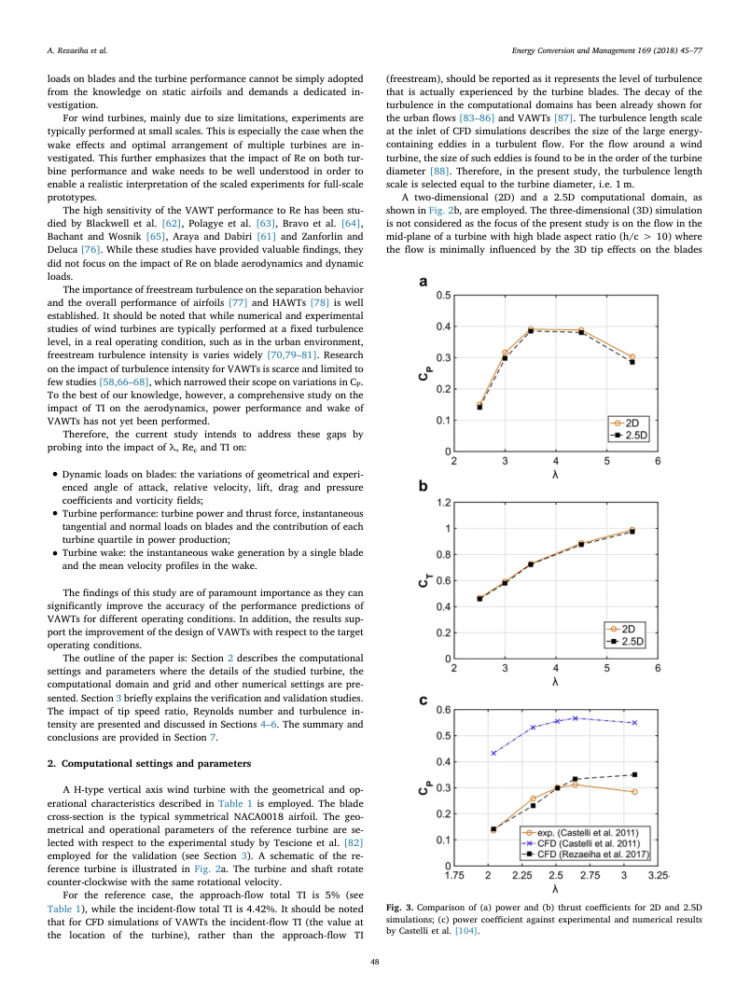

<!-- PDF page 5 -->

[82,89]. The h/c for the reference turbine is 16.67.
The 2D computational domain is 35d × 20d, where the distance
from the turbine center to domain inlet and outlet are 10d and 25d,
respectively. The blockage ratio (d/W) is 5%. The diameter of the ro-
tating core is 1.5d. The computational domain is selected in line with
the recently published guidelines for CFD simulations for VAWTs
[87,90].
For 2.5D simulations, the sufficient spanwise domain size has been
studied for the incompressible flows around airfoils and was found to be
Re-dependent while for higher Rec a smaller domain span would be
required. For a NACA0012 airfoil at 10° angle of attack and Rec = 104 a
domain span of 0.64c was found to be sufficient [91] while for a
NACA0015 airfoil at 16.6° angle of attack and Rec = 8.96 × 105, a
domain span of 0.2c was proved to be adequate [92]. Therefore, for the
present study on VAWTs, a larger spanwise domain length of 1c is se-
lected as a safe choice. The 2.5D domain is only employed for the so-
lution verification study for the 2D domain (see Section 3). The com-
parison of the 2D and 2.5D results for the reference turbine are
provided in Section 3.
The turbine revolution is divided into 4 quartiles as listed below
[93] where θ is defined based on the position of the top blade in Fig. 2.
• Upwind: 45° ≤θ < 135°
• Windward: 315° ≤θ < 45°
• Leeward: 135° ≤θ < 225°
• Downwind: 225° ≤θ < 315°
In addition, the turbine fore half, 0° ≤θ < 180°, and the turbine aft
half, 180° ≤θ < 360°, are used to further assist with the interpretation
of the results.
The computational grid, as shown in Fig. 2c–h, consists of quad-
rilateral cells with maximum and average y+ values of 3.8 and 1.8,
respectively, on the airfoil and 1.4 and 1.0, respectively, on the shaft.
The number of cells are approximately 400,000 in 2D and 28 million in
2.5D. The 2D grid is extruded in spanwise direction to generate the
2.5D grid. The spanwise grid spacing is 0.5 mm and 1 mm for the airfoil
and the shaft, respectively. Boundary conditions are uniform velocity
inlet, zero gauge static pressure outlet, no-slip walls for airfoil and
shaft, symmetry sides, sliding grid interface between the rotating and
fixed grids, and periodic boundary condition on the top and bottom
sides of the 2.5D domain.
Incompressible
unsteady
Reynolds-averaged
Navier-Stokes
(URANS) are performed using the commercial CFD software package
ANSYS Fluent 16.1 with 2nd order discretization in time and space and
SIMPLE scheme for pressure-velocity coupling. The numerical settings
and simulation procedure are selected following extensive solution
verification and validation studies performed by Rezaeiha et al.
[23,55,87,90].
Given the transitional nature of the flow on a VAWT blade, con-
sidering Rec, the transition SST turbulence model is used. This model is
a 4-equation model [94] developed based on the 2-equation k-ω SST
turbulence model [95,96], which additionally solves two more equa-
tions for momentum-thickness Reynolds number Reθ and intermittency
γ. The model, also known as γ-θ SST model, is an intermittency-based
model. Intermittency-based models have been successfully used to im-
prove the prediction of laminar-to-turbulent transition for flows on
airfoils [97–101].
The simulations are initialized with steady RANS. The transient si-
mulations are performed with azimuthal increment of 0.1° for 20 re-
volutions of the turbine. The 20 turbine revolutions are to ensure the
results reach a statistically steady state condition. 20 iterations per time
step is used to ensure scaled residuals drop below 10−5. The results are
sampled at the 21st turbine revolution.
To calculate the dynamic loads on blades, namely lift and drag, the
experienced values of angle of attack and relative velocity, rather than
the typically-used geometrical values, are employed. There exist no-
ticeable differences between the geometrical and experienced values of
the angle of attack, the relative velocity and their resultant loads on the
blades. The calculation method for the experienced values and a com-
parison with the geometrical values are presented and discussed in the
Appendix A.
3. Solution verification and validation
Extensive solution verification and two sets of validation have been
performed to ensure the accuracy of the present CFD results. The results
have been published in Ref. [87,90]. For solution verification studies:
• Grid dependence is analyzed using three uniformly doubled grids
where the refinement factor in each directions is
2. The Grid
Convergence Index (GCI) [102] for the coarse-medium grid pair,
calculated for the turbine CP using a safety factor (Fs) of 1.25, is
GCIcoarse = 0.0061 (1.48% of the CP value) and GCIfine = 0.0035
(0.85% of the CP value), respectively. The medium grid, also shown
in Fig. 2c–f, is selected for the rest of the study.
• A detailed sensitivity analysis is performed for time step and con-
vergence criterion [87,90]. The analysis shows that an azimuthal
increment of 0.1° is the minimum requirement. In addition, a
minimum of 20 turbine revolutions is required to reach a statisti-
cally steady state condition.
• The power and thrust coefficients for 2D and 2.5D simulations are
compared [87] (shown in Fig. 3a and b). The comparison reveals a
systematic but small overestimation of the turbine power perfor-
mance for the 2D simulations. The 2D CP and CT values are ≤6%
and ≤2% higher than that of the 2.5D simulations due to neglecting
the three-dimensional effects in the boundary layer, which affect the
transition and separation onsets on blades [103]. The analysis shows
that the difference between the 2D and 2.5D simulations is weakly
dependent on the operating conditions of the turbine. Note that that
small difference between the 2D and 2.5D (< 6%) is in spite of the
fact that the number of cells for the 2.5D simulations is approxi-
mately 28 million, which is 70 times more than that of the 2D grid,
i.e. approximately 400,000 cells. Therefore, to minimize the com-
putational cost, which is essential for extensive parametric studies
such as the present study including 300 transient simulations each
employing a fine azimuthal increment of 0.1° and continuing for
minimum 20 turbine revolutions, the 2D simulations are selected to
predict the turbine performance.
Two separate sets of validation studies have been performed where
the CFD results have been compared against the experimental data by
Table 2
Comparison of power coefficient from experiment by Castelli et al. [104] and
the present CFD and their relative deviation.
λ
2.04
2.33
2.51
2.64
3.08
CP (exp.)
0.137
0.259
0.300
0.312
0.284
CP (present CFD)
0.142
0.231
0.299
0.333
0.350
|ΔCP| [%]
3.42%
10.7%
0.5%
6.8%
23.2%
Table 3
Operational parameters to study the impact of λ.
λ
2.5
3.0
3.5
4.0
4.5
5.5
U∞[m/s]
18.6
16.275
13.95
11.625
11.625
9.3
Ω [rad/s]
93
97.65
97.65
93
104.625
102.3
TI [%]
5
5
5
5
5
5
TIi [%]
4.42
4.42
4.42
4.42
4.42
4.42
Rec (× 105)
2.06
2.11
2.09
1.97
2.2
2.14
K
0.06
0.06
0.06
0.06
0.06
0.06
A. Rezaeiha et al.

<!-- PDF page 6 -->

Castelli et al. [104] and Tescione et al. [82]. Note that the turbines
employed in the two experiments have different airfoil shape, number
of blades, solidity and tip speed ratios. In addition, the parameters
employed for the two validations are also different. The turbine for the
first validation is a 2-bladed H-type turbine with NACA0018 airfoil, a
solidity of 0.12 and a tip speed ratio of 4.5 (reference turbine). For this
validation, the time-averaged normalized lateral and streamwise velo-
cities at different downstream locations (x/R = 2.0–3.0) in the near
wake of the turbine along the lateral direction are compared with the
experimental results by Tescione et al. [82]. The deviation from the
experiment is 2.3–2.5% and 8.6–11.8% for the lateral and streamwise
velocity components, respectively. Further details and possible ex-
planations for the observed deviation are comprehensively presented in
Ref. [55,87]. The turbine for the second validation is a 3-bladed H-type
turbine with NACA0021 airfoil, a solidity of 0.25 and tip speed ratios
from 2.04 to 3.08. For this validation, the turbine power coefficients at
5 different tip speed ratios (i.e. 2.04, 2.33, 2.51, 2.64 and 3.08) are
compared with experimental and numerical data by Castelli et al. [104]
(see Fig. 3c). An overall good agreement is observed between the CFD
results and the experiment where the quantitative differences, pre-
sented in Table 2, are found to be the largest for the highest λ of 3.08.
The observed deviations could be explained to be a result of:
• The uncertainties associated with the experimental data: several
important geometrical characteristics of the turbine, e.g. the blade
surface roughness and the location of the blade-spoke connection,
and the boundary conditions, e.g. the turbulence intensity and
length scale, are not clearly mentioned in the experiment. For
Fig. 4. Variations of (a) experienced angle of attack, (b) normalized relative velocity, (c) lift and (d) drag coefficients versus azimuth; (e) lift and (f) drag coefficients
versus angle of attack; during the last turbine revolution for different tip speed ratios. αss denotes the inviscid static stall angle from Xfoil [106]. (○) and (◊) denote
θ = 45° and 135°, respectively. (Rec ≈2.0 × 105).
A. Rezaeiha et al.

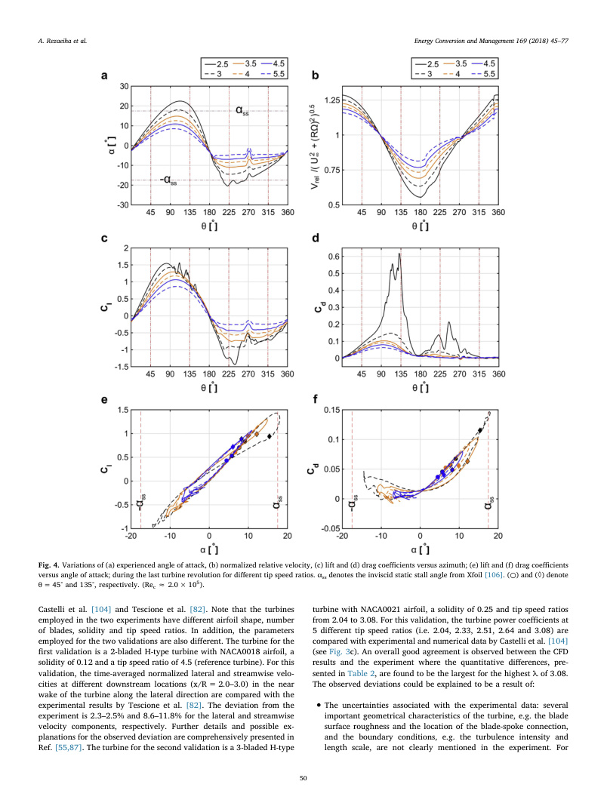

<!-- PDF page 7 -->

instance, the impact of the location of the blade-spoke connection
on the turbine CP is known to be more pronounced at higher tip
speed ratios [105]. This could somehow explain the larger deviation
at higher λ.
• Lack of error analysis for the experiment: the experiment has not
provided an error analysis of the data, therefore, the error associated
with the measurement is not known. For instance, the blockage ratio
for the experiment is considerable large (approximately 10%) while
the measured values were not corrected for the blockage effects.
• Geometrical simplifications: ignoring the turbine spokes and con-
nections in the CFD modeling is possibly contributing to the ob-
served deviation. As these less-aerodynamic structural components
typically result in considerable drag, their impact will be more
pronounced at higher relative velocities, i.e. higher tip speed ratios.
This could also justify the larger deviation at higher λ.
• The two-dimensional modeling: because the turbine is modeled in
2D, the blade tip effects are not considered in the simulations where
ignoring them also partly contributes to the deviation.
• The RANS modeling: the limitations of RANS modeling in predicting
complex flows around VAWTs could be another contributor to the
observed deviation, esp. at lower λ where the flow becomes more
complex due to dynamic stall.
Further information about this validation study with further ex-
planations for the observed deviation is presented in detail in Refs.
[23,90]. The two validation studies performed confirm that the CFD
results can provide accurate predictions of the turbine performance and
wake for different operating conditions.
4. Impact of tip speed ratio
This section provides an extensive analysis of the impact of λ on the
dynamic loads on turbine blades, the turbine performance and the
Fig. 5. The sampling locations discussed in Figs. 6, 7, 16 and 22.
Fig. 6. Pressure coefficient (CoP) over the blade during the last turbine revolution for different tip speed ratios at azimuthal positions set in Fig. 5. X/c represents the
dimensionless chordwise position along the blade. (Rec ≈2.0 × 105).
A. Rezaeiha et al.

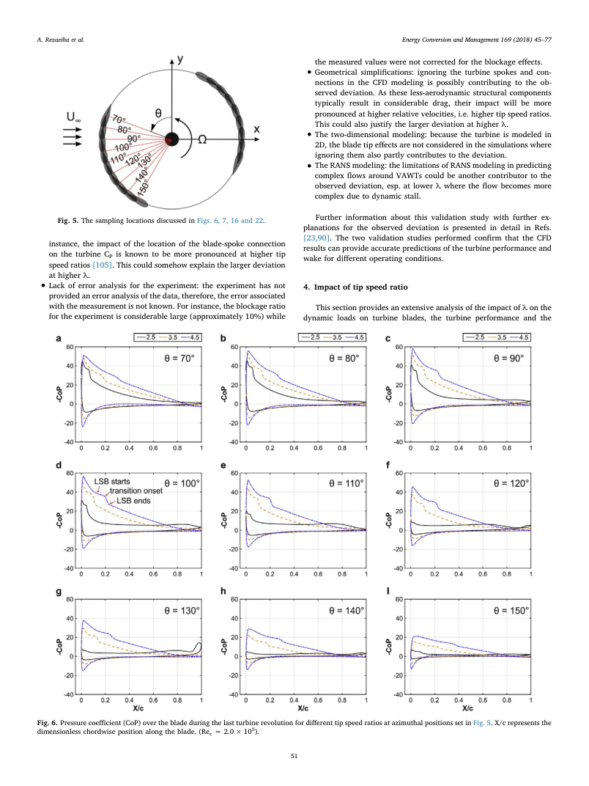

<!-- PDF page 8 -->

Fig. 7. Contours of non-dimensionalized z-vorticity with superimposed streamlines for different tip speed ratios during the last turbine revolution at azimuthal
positions set in Fig. 5. (Rec ≈2.0 × 105).
A. Rezaeiha et al.

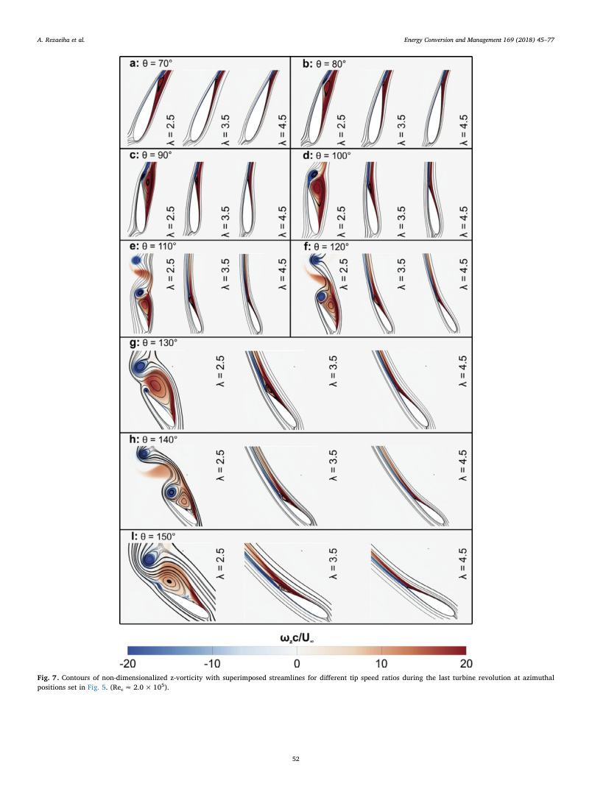

<!-- PDF page 9 -->

wake. Table 3 lists the operational parameters used to study the impact
of λ. The tip speed ratios are selected to range from low, λ = 2.5, to
moderately high, λ = 5.5, values for the given solidity of the reference
turbine. The analysis is performed at a fixed Rec of approximately
2.0 × 105, as a representative value for small- to medium-scale urban
VAWTs [12]. The fixed Rec avoids Reynolds number effects and facil-
itates a detailed analysis of the impact of tip speed ratio. To keep a fixed
Rec for different tip speed ratios, both freestream velocity and turbine
rotational velocity are inevitably adjusted. The turbulence intensity and
reduced frequency are kept the same as in the reference case. The ap-
proach-flow (incident-flow) total TI is 5% (4.42%) and the reduced
frequency (defined as
=
K
c
V
Ω /(2
)
rel ) is 0.06 for all cases.
4.1. Loads on blades
Fig. 4 shows the variations of α, normalized Vrel, lift and drag
coefficients,
Cl
and
Cd,
during
the
last
turbine
revolution
for
2.5 ≤λ ≤5.5. Two sources of flow unsteadiness on VAWT blades,
namely unsteady α and Vrel, are shown in Fig. 4a and b where the
values are calculated following the method described in the Appendix
A. The following observations are made for the angle of attack α:
• In the turbine fore half, almost a half-cycle sinusoidal variation is
observed for all cases.
• In the turbine aft half, the trend deviates from a sinusoidal trend and
becomes nearly flat with increasing λ. The different trend in the
turbine aft half is because the flow in this region is significantly
affected by the blades passing in the turbine fore half and slowed
down due to the turbine thrust force. The increase in flatness can
also be explained by the increase in the thrust force for higher λ (see
Section 4.2).
• A negative non-zero value of α occurs at θ = 0° and 180° due to the
lateral deviation of the incoming flow at the turbine incidence
(streamtube expansion).
• Decreasing λ, as expected, is found to increase the amplitude of
variations of α throughout the revolution. This is simply explained
by comparing the velocity triangles shown in Fig. 1a and b. For
λ > 3.0, the variation of α remains below the static stall angle
αss = 17.5°,
which
is
calculated
from
Xfoil
[106]
at
Rec = 2.0 × 105. Further reduction in λ results in α reaching and
exceeding αss both in fore and aft halves. A deep stall happens for
λ = 2.5 in both halves.
• For λ = 2.5, the ripples observed at θ ≈225° are due to blade-wake
interactions which will be later discussed in this section.
• The ratio of the magnitude of the negative peak, in the turbine aft
half, to that of the positive peak, in the turbine fore half, decreases
from 90% for λ = 2.5 to 54% for λ = 5.5.
• In the turbine aft half, the effect of the turbine shaft wake on α is
also apparent as a sudden reduction near θ = 270°. The impact of
the VAWT turbine shaft is extensively discussed in Ref. [55].
Fig. 4b depicts the other source of flow unsteadiness for VAWT, i.e.
unsteady inflow to the blades. In the turbine fore half, the normalized
Vrel oscillates sinusoidally where the amplitude of the oscillations in-
creases from 17.5% at λ = 5.5 to 36.7% at λ = 2.5. In the turbine aft
half, similar to α, a different trend is observed.
The two co-occurring sources of unsteadiness for VAWTs, namely
unsteady α and Vrel, are known to have a different impact on boundary
layer events, namely laminar-to-turbulent transition and separation, on
airfoils [103], which further highlights the complexity of the dynamic
loads on VAWTs. Fig. 4c and d show the dynamic lift and drag coeffi-
cients (Cl and Cd) versus azimuth θ for the last turbine revolution. The
impact of λ on Cl is similar to that of λ on α although the peak for Cl
occurs earlier for Cl. For λ = 2.5, the fluctuations in Cl and the large
Fig. 8. Coefficients of (a) tangential force, (b) normal force, (c) power and thrust and (d) the normalized cumulative sum of moment coefficient during the last
turbine revolution for different tip speed ratios. (Rec ≈2.0 × 105).
A. Rezaeiha et al.

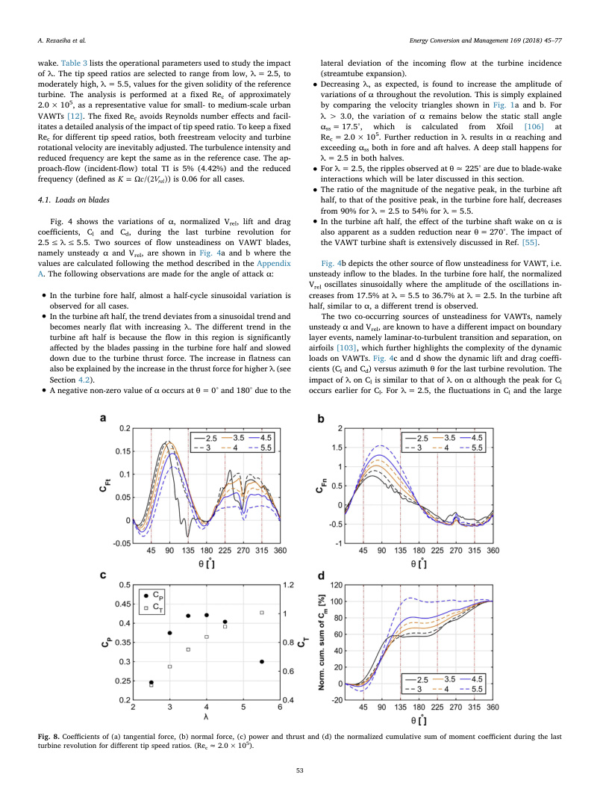

<!-- PDF page 10 -->

jump in Cd at 90° ≤θ ≤170° clearly signal the stall on blades. The
blade-wake interactions can be distinguished as large fluctuations in Cl
and Cd at 220° ≤θ ≤260°. The effect of the shaft wake is also observed
around θ ≈270°.
Fig. 4e and f show the dynamic Cl and Cd versus α for the last
turbine revolution. Note that for better visualization of the impact of λ,
the case of λ = 2.5 is not shown in these figures. The following ob-
servations can be made:
• The upwind quartile is shown using full circles (○) and diamonds
(◊) signaling θ = 45° and 135°, respectively. It is clearly seen that
this quartile is where the blades operate near Cl,max, Cd,max. The
importance of this quartile will be more elaborately discussed in
Section 4.2.
• Decreasing λ increases Cl,max, Cd,max and the respective α for each.
• Decreasing λ marginally influences the hysteresis in the polars of
both Cl and Cd prior to stall while near the stall, i.e. λ = 3.0, the
hysteresis significantly increases. The hysteresis prior to stall is due
to the presence of the unsteady separation on blades and the dif-
ferent resistance of the boundary layer to separation in the upstroke
and downstroke [103]. The observations are in line with the ex-
perimental observations on pitching airfoils by Lee and Gerontakos
[107].
To further analyze the impact of λ, the pressure coefficient on the
blade and the flowfield at different azimuthal positions are compared
for three different λ: 2.5, 3.5 and 4.5. The schematic shown in Fig. 5
illustrates the selected azimuthal positions. The respective positions
along the α, Cl and Cd curves for the three λ can be found in Fig. 4a, c
and d. The focus is on 70° ≤θ ≤150°, which corresponds to the regime
where the blade experiences the maximum α during the upstroke and
downstroke.
Pressure coefficients (CoP) on the blade and contours of non-di-
mensionalized vorticity with superimposed streamlines are compared
for different tip speed ratios in Figs. 6 and 7, respectively. It should be
noted that the pressure distribution on the blade suction side (in the
turbine fore half corresponding to the inner side of the blade) can be
employed to identify the boundry layer events: (i) the sudden change in
the rate of pressure recovery typically signals the beginning of a la-
minar separation bubble (LSB), (ii) the follow-up abrupt increase in
pressure prompts laminar-to-turbulent transition onset (triggered by
the Kelvin-Helmholtz instabilities in the shear layer of LSB) and (iii) the
second sudden change in rate of pressure recovery shows the end of
LSB, from which the length of LSB can also be estimated [108,109]. For
further clarification, the aforementioned boundary layer events are
highlighted with arrows for λ = 4.5 at θ = 100° (see Fig. 6d). The re-
sults show that:
• Laminar-to-turbulent transition onset occurs earlier for lower λ due
to their higher α. This is in agreement with the experimental data
for pitching airfoils where the transition onset is found to move
towards the leading edge when α increases [107]. Previous CFD
simulations ofVAWTs also confirmed similar occurrence, e.g. [23].
• The length of laminar separation bubble is shorter for lower λ due to
higher α.
• For λ = 2.5, the increase of flatness in the CoP curve, which extends
from X/c ≥0.6 at θ = 70° to X/c ≥0.1 at θ = 120°, implies the
growth of the turbulent trailing edge separation over the blade. The
Fig. 9. Contribution of each revolution quartile to total turbine power for different λ.
A. Rezaeiha et al.

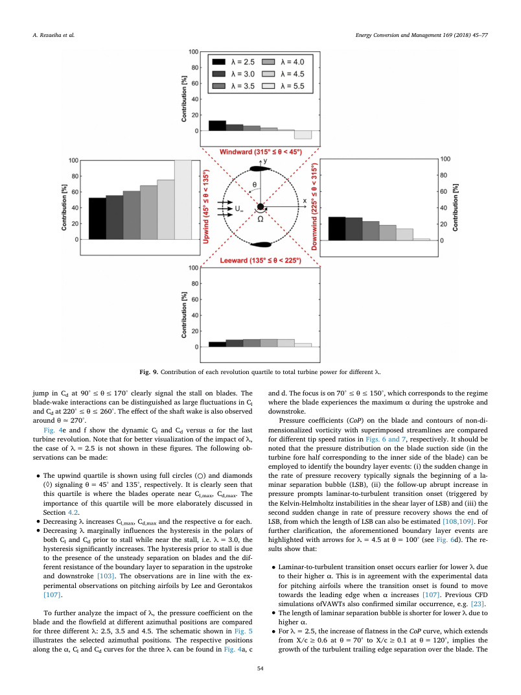

<!-- PDF page 11 -->

growth of the trailing edge separation from θ = 70° to 120° can also
be distinguished from the vorticity field (Fig. 7). For λ = 3.5 and
4.5, the extent of trailing edge separation is limited to X/c ≥0.6
and ≥0.8, respectively. The smaller separation for higher λ is due
to their lower α.
• For λ = 2.5, from θ = 120° to 140°, a small bump is found to grow
near the trailing edge on the CoP curve. This could be due to the
clockwise vortices rolled up from the pressure side towards the
suction side.
• For λ = 2.5, from θ = 100° to 150°, vortex shedding occurs from the
blade. This results in oscillations in loads as already shown in Fig. 4c
and d for Cl and Cd. The interaction of such shed vortices with the
boundary
layer
on
the
blades
passing
downstream
(220° ≤θ ≤260°) causes oscillations in loads as already shown in
Fig. 4c and d for Cl and Cd. The downwind region influenced by the
blade-wake interactions is not straightly downstream of the stalled
region but is slightly drifted towards the center of rotation. This is
attributed to the impact of the Coriolis force on the shed vortices,
which is consistent with the finding of Tsai and Colonis [45].
4.2. Turbine performance
The instantaneous tangential CFt and normal CFn force coefficients
on the blades and the power CP and thrust coefficients CT during the last
turbine revolution for different tip speed ratios are shown in Fig. 8a–c.
It can be seen that:
• Changing λ results in a rather complex change in tangential loads
for both fore and aft turbine halves. In contrast, higher λ simply
results in higher positive normal loads in the turbine fore half. In the
turbine aft half, the effect of λ on normal loads is much less no-
ticeable except for λ = 2.5 where the flow is dominated by the oc-
currence of dynamic stall and blade-wake interactions.
• At the beginning of the revolution (0° ≤θ ≤75°), decreasing λ re-
sults in higher tangential loads. This is a result of higher α and Cl for
lower λ as shown in Fig. 4a and b.
• For 75° < θ ≤170°, the occurrence of a deep stall is observed for
λ = 2.5 where CFt suddenly drops. This associates with the sudden
drop in Cl and the jump in Cd as shown in Fig. 4c and d. The oc-
currence of stall is clearly seen as fluctuations in CFt and CFn. A
negligible difference is observed in the tangential loads for
3 < λ < 5.5.
• In the turbine aft half, and for 220° ≤θ ≤260°, the blade-wake
interactions can be distinguished as fluctuations in CFt and CFn,
especially for λ = 2.5.
• The effect of the shaft is seen as a drop in CFt and a jump in CFn in
θ ≈270°.
• An optimum λ of 4.0 is found to maximize CP.
• CT grows with increasing λ. The trend is linear up to λ = 3.5 while it
becomes asymptotic for λ > 3.5. This is in line with the experi-
mental observations by Bachant and Wosnik [110].
The normalized cumulative sum of the instantaneous moment
coefficients Cm during the last turbine revolution is shown in Fig. 8d.
The values are employed to calculate the contribution of each turbine
quartile in total power production, which is shown in Fig. 9. The con-
tribution is calculated as the difference between the normalized cu-
mulative sum of Cm at the end of each quartile and that at the beginning
of that quartile. For a given λ, for example, if the cumulative sum at the
beginning of a quartile has a negative value, due to prior negative
moment, while high positive value exists at the end of the quartile, the
difference (the contribution of that quartile) can be close to 100% or
even more. In addition, if one quartile has a negative total contribution,
the sum of contribution of the other three quartiles needs to be more
than 100% so that the total contribution of all 4 quartiles is 100%.
• In the windward quartile, the contribution is very small and de-
creases from 12.7% to −9.9% when λ increases from 2.5 to 5.5. A
negative contribution is observed for λ = 5.5 which simply means
that the flow is tending to rotate the turbine in the opposite direc-
tion.
• In the upwind quartile, for all cases, more than 50% of the total
power is produced. The contribution increases from 52.5% to
103.7% for λ from 2.5 to 5.5. The contribution higher than 100% for
λ = 5.5 is due to the negative contribution of the windward quartile
for this λ. For the optimal λ (= 4.0), the contribution of the upwind
quartile is ≈68%.
• In the leeward quartile, the contribution is less than 10% for all
cases. The highest contribution is 9.8% at the optimal λ.
• In the downwind quartile, the contribution decreases from 28.7% to
1.9% for λ from 2.5 to 5.5. The trend is reverse of that in the up-
wind. This is because the flow reaching the downwind quartile is not
fresh as it already passed the blades in the upwind region. Therefore,
if higher energy is extracted from the flow upstream, less is re-
mained to be extracted downstream.
The analysis reveals a very important fact regarding the power
production of VAWTs. The upwind quartile is contributing the most to
the total power production and is by far the most important region for
the turbine operation. As highlighted in Section 4.1 and 4.2, the op-
eration of VAWTs is highly variable during the revolution due to the
unsteady α and Vrel and this inherent unsteadiness occurs for all λ.
From a practical point of view, given the unsteady aerodynamics, it is
extremely difficult to improve the performance during the whole re-
volution. This analysis shows the local power enhancement strategies
functioning in the upwind quartile can grant the maximum benefit,
compared to the other quartiles, because any small improvement in this
region can have large influences on the total power production due to
the significant contribution of this quartile.
4.3. Turbine wake
The turbine wake is generated from the vortices shed from the
blades during the revolution. Based on Kelvin’s circulation theorem
[111], when the strength of the bound vortices along the blade alters, a
new vortex is shed, with the same strength but the opposite sign, which
travels downstream with the incoming flow. The change in the bound
Fig. 10. Shed vorticity by a single blade during the last revolution for different
tip speed ratios. Positive values denote counter-clockwise circulation based on
the Kutta–Joukowski theorem [111]. (Rec ≈2.0 × 105).
A. Rezaeiha et al.

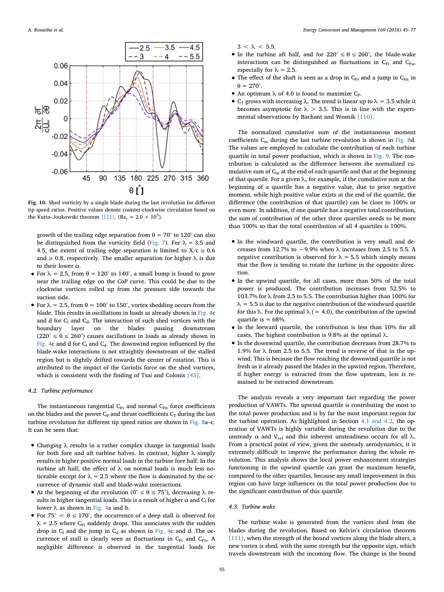

<!-- PDF page 12 -->

Fig. 11. Time-averaged (over the last turbine revolution) normalized (with freestream velocity) streamwise velocity along lateral lines −0.75 ≤y/d ≤0.75 at
several downstream locations for different tip speed ratios. (Rec ≈2.0 × 105).
A. Rezaeiha et al.

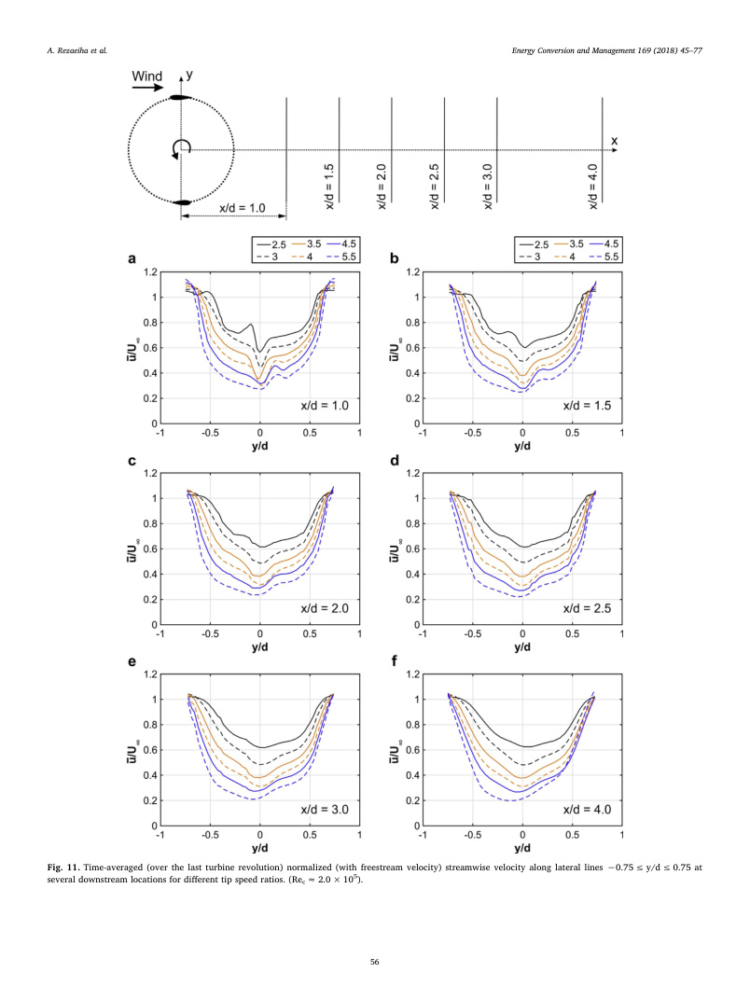

<!-- PDF page 13 -->

vortex system could be due to variations in angle of attack and/or in-
coming flow that both simultaneously occur for VAWTs during each
revolution. This results in a continuous vortex shedding and the fol-
lowing generation of wake. The strength of the shed vorticity by a
single blade can be calculated using Eq. (1) defined as the gradient of
circulation per each azimuthal increment. Based on the Kutta–Jou-
kowski theorem [111], a positive value denotes counter-clockwise cir-
culation. Eq. (2) presents a non-dimensional form of Eq. (1). Fig. 10
shows the strength of the shed vorticity during the last turbine re-
volution for different tip speed ratios. The following observations are
made:
• In the turbine fore half, during the upstroke where the circulation
around the blade and consequently Cl increase, clockwise vortices
(negative sign) are shed. Conversely, during the downstroke where
the circulation around the blade and consequently Cl decrease,
counter-clockwise (positive sign) vortices are shed. The signs re-
verse in the turbine aft half.
• The impact of stall on the blade and blade-wake interactions, for
λ ≤3.0, are aparent as large oscillations in the strength of shed
vorticity.
• Decrease of λ increases the strength of the shed vorticity which is in
line with the higher slope of Cl-α curve for lower λ. This is clearly
shown for 0° ≤θ ≤135°.
• Increase of λ decreases the magnitude of oscillations in the strength
of the shed vorticity. This is due to smaller Δα and subsequently
more limited separation on the blade. Therefore, for larger λ (> 3.0)
where the occurrence of stall is avoided, the variations in the
strength of the shed vorticity is mostly due to the unsteadiness in the
angle of attack and the incoming flow while for lower λ (≤3.0) stall
and the blade-wake interactions also have noticeable effects.
∂
∂
= −
∂
∂
∞
θ
U c C
θ
Γ
0.5
l
(1)
∂
∂
= −∂
∂
∞
π
cU
θ
π C
θ
2
Γ
l
(2)
Fig. 11 shows profiles of the time-averaged (over the last turbine
revolution) streamwise velocities (normalized with respect to the
freestream velocity) along the lateral line, −0.75 ≤y/d ≤0.75, at
different downstream locations in the turbine wake with x/d = 1.0, 1.5,
2.0, 2.5, 3.0, 4.0, for various tip speed ratios. It can be seen that:
• For all downstream locations, the velocity deficit in the turbine
wake grows as λ increases. This is because the turbine thrust force
gets
larger
when
λ
increases
resulting
in
further
velocity
Table 4
Turbine wake length vs. tip speed ratio for the reference turbine.
λ
1.5
2.5
3.0
3.5
4.0
4.5
5.5
Lw/d
40
23
19
16
14
13
10
Table 5
Operational parameters to find the optimal λ at
different U∞.
λ
1.2 – 6.0
U∞[m/s]
2.3 – 22.3
Ω [rad/s]
11.6 – 204.6
TI [%]
5
Rec (× 105)
0.3 – 4.3
Fig. 12. Power and thrust coefficients versus tip speed ratio and freestream velocity for different fixed rotational velocities.
A. Rezaeiha et al.

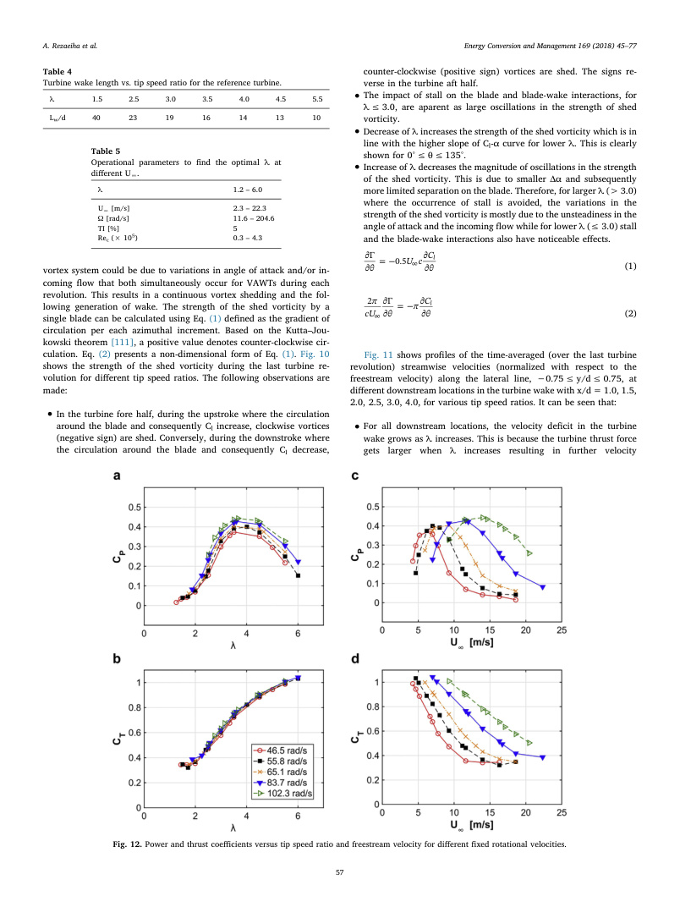

<!-- PDF page 14 -->

deceleration (see Fig. 8c). This is in agreement with the experi-
mental observations by Araya and Dabiri [61].
• Increasing λ is found to increase the wake expansion and stream-
wise asymmetry which is in line with the wind-tunnel measurements
by Araya and Dabiri [61].
• The wake self-induction is found to occur for all λ where this is more
noticed for higher λ. The wake self-induction refers to reduction in
the streamwise velocity as the wake travels downstream. This is
consistent with the experimental observations by Tescione et al.
[82].
• For λ = 2.5, the impact of large oscillations, already observed in the
strength of the shed vorticity for 220° ≤θ ≤< 260° (see Fig. 10), is
also seen in the streamwise velocity for x/d ≤1.5. This fades out as
the wake travels further downstream.
• The influence of the shaft is distinguished as a larger velocity deficit
at y/d ≈0. This is more pronounced for lower λ values at x/
d < 2.0, which also fades out as the wake travels further down-
stream.
Tip speed ratio is also found to significantly influence the length of
the turbine wake Lw, which is defined from the turbine center to a
downstream location along the turbine centerline, y/d = 0, where the
normalized velocity magnitude V/U∞= 0.97. Lw is found to asympto-
tically decrease from 40d to 10d when λ increases from 1.5 to 5.5 for
the reference turbine (see Table 4). The earlier breakdown of the wake
for higher λ is attributed to the closer distance between the shed vor-
tices in the wake, which eventually amplifies the wake instabilities and
results in an earlier wake structure breakdown. More detailed results on
the impact of λ on Lw and comprehensive discussions are provided in
Ref. [90]. The trend is in line with the experimental observations for
HAWTs [112].
4.4. Optimal tip speed ratio
Unlike HAWTs, VAWTs are currently designed to operate at con-
stant
rotational
velocity
mainly
due
to
simplicity
and
costs
[12,113,114]. This means that for a wide range of freestream velocities,
their operation is not optimal and they operate optimally only at a
specific wind speed. Two series of simulations are performed for the
reference turbine covering a wide range of wind speeds (2.3–22.3 m/s),
rotational velocities (11.6–204.6 rad/s) and tip speed ratios (1.2–6.0) in
order to investigate the optimal operation of the reference turbine. The
two series include simulations at fixed rotational velocities and at fixed
freestream velocities. Table 5 lists the operational parameters used to
find the optimal tip speed ratio for different freestream velocities.
Fig. 12 shows the turbine power and thrust coefficients versus tip
speed ratio and freestream velocity for different fixed rotational velo-
cities 46.5 rad/s ≤Ω ≤102.3 rad/s. Fig. 13 shows the turbine power
and thrust coefficients versus tip speed ratio and rotational velocity for
different fixed freestream velocities 2.3 m/s ≤U∞≤18.6 m/s.
At low λ, the turbine has very low CP. Increasing λ results in a
growth of CP to a maximum value with a high slope. CP gradually de-
creases with further increase of λ. This trend is similarly observed at
both fixed rotational and freestream velocities, which implies that
based on λ three operating regimes for VAWTs are typically defined as
follows:
• High wind speed regime: this regime corresponds to low λ where
the flow is largely separated on blades at high α (see Section 4.1)
and the performance is adversely affected by dynamic stall.
• Optimal regime: this regime associates with where the turbine is
producing the maximum CP.
• Low wind speed regime: this regime refers to high λ where the
variations of α on blades are very small, therefore, the blade is
operating inefficiently (see Section 4.1).
Fig. 13. Power and thrust coefficients versus tip speed ratio and rotational velocity for different fixed freestream velocities.
A. Rezaeiha et al.

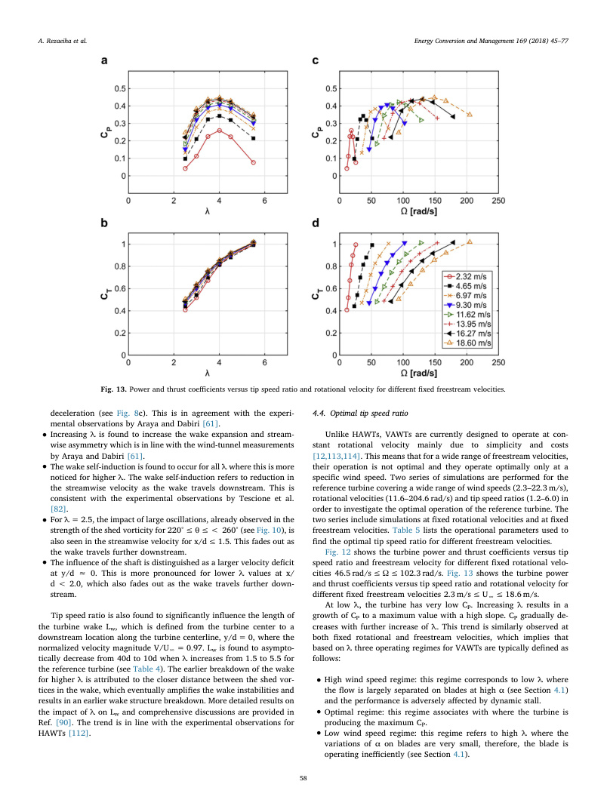

<!-- PDF page 15 -->

The aforementioned regimes can also be shown when considering
the CP-U∞(CP-Ω) curve (Figs. 12c and 13c):
• At low U∞(high Ω), the turbine is performing sub-optimal.
• Increasing U∞(decreasing Ω) improves the turbine performance
where for each fixed Ω (U∞), there exists a specific U∞(Ω) where
the turbine is operating optimally.
• Further increase of U∞(decrease of Ω) deteriorates the performance
due to the growth of separations on blades and the subsequent stall.
CT asymptotically grows as λ increases. This occurs at both fixed
rotational and freestream velocities. This can also be shown by CT-U∞
(CT-Ω) curves where increasing U∞(decreasing Ω) reduces CT. Increase
of CT by increasing λ is in line with the increase of normal forces on
blades shown in Fig. 8b. At high λ due to small α on blades, the gen-
erated force is more contributing to thrust force than the tangential
force, which is responsible for power generation.
Increasing either the freestream or rotational velocity is found to
shift upward the CP-λ curve. This improvement in turbine performance
is attributed to Reynolds number effect which is extensively discussed
in Section 5.
To further generalize the findings and to derive the optimal oper-
ating condition of the turbine, the results presented in Figs. 12 and 13
are employed to construct contours of CP and CT in λ-U∞space as
shown in Fig. 14a and b. Fig. 14a clearly suggests that to keep the
optimal operation of the turbine at different wind speeds, the turbine
needs to maintain a constant λ, which is 4.0. Note that the optimal
value of λ is dependent on the turbine characteristics and will be dif-
ferent for a turbine of different solidity and/or airfoil shape. Therefore,
such analysis will need to be repeated for that case to identify the op-
timal λ. Based on that, the turbine optimal Ω versus U∞is derived and
depicted in Fig. 14c. Therefore, Ω needs to increase linearly with U∞. A
comparison of the turbine performance operating at the optimal λ of
4.0 against the operation at a constant Ω, i.e. 55.8 rad/s, is shown in
Fig. 14d. Table 6 presents the improvement in CP due to maintaining
the optimal λ compared to turbine operating at fixed Ω of 46.5, 55.8
and 65.1 rad/s. The comparison reveals huge enhancement in CP for all
U∞. The improvement in CP would result in large increase in the annual
energy production (AEP) which would, therefore, justify the added
complexity and cost for a variable-speed VAWT.
The CT for the turbine operating at the optimal λ is found to stay
Fig. 14. Contours of coefficients of (a) power and (b) thrust based on 48 simulations described in Table 5; (c) optimal rotational velocity and (d) the power and thrust
coefficients corresponding to the optimal λ and fixed Ω of 55.8 rad/s versus freestream velocity.
Table 6
Improvement in CP due to maintaining optimal λ.
Ω [rad/s]
U∞[m/s]
4
5
6
7
8
9
10
11
12
46.5
ΔCP [%]
24
11
5
11
46
124
220
351
549
55.8
ΔCP [%]
145
63
11
1
4
21
54
122
211
65.1
ΔCP [%]
168
116
42
8
5
4
13
28
57
Table 7
Operational parameters to study the impact of Rec.
λ
2.5
3.0
3.5
4.0
4.5
5.5
U∞[m/s]
2.3
– 37.2
2.3
– 32.5
2.3
– 27.9
2.3
– 25.0
2.3
– 22.3
2.3
– 18.6
Ω [rad/s]
11.6
– 186.0
13.9
– 195.3
16.3
– 195.3
18.6
– 223.0
20.9
– 200.9
25.5
– 204.6
TI [%]
5
5
5
5
5
5
TIi [%]
4.42
4.42
4.42
4.42
4.42
4.42
Rec (× 105)
0.3 – 4.1
0.3 – 4.2
0.3 – 4.2
0.3 – 4.2
0.4 – 4.2
0.5 – 4.3
A. Rezaeiha et al.

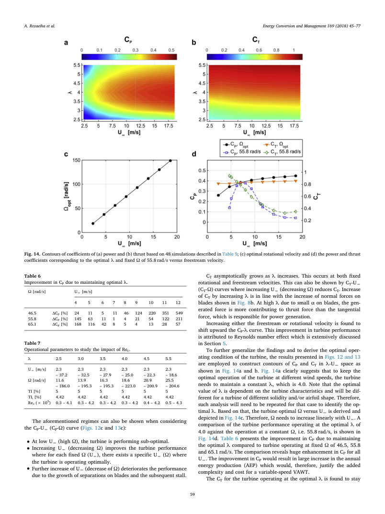

<!-- PDF page 16 -->

almost constant with small increase due to Reynolds number effects
(see Section 5). This can reduce the flapwise fatigue loads on the tur-
bine blades which are caused by the fluctuations in the thrust force.
Such fluctuations occur due to the unsteady incoming flow.
5. Impact of Reynolds number
The current section investigates the impact of Rec, based on the
blade chord length, on the dynamic loads on turbine blades, turbine
performance and wake at different tip speed ratios. A wide range of
Fig. 15. Variations of experienced angle of attack, normalized relative velocity, lift and drag coefficients during the last turbine revolution for different Rec at λ: (a–d)
4.0, (e–h) 2.5.
A. Rezaeiha et al.

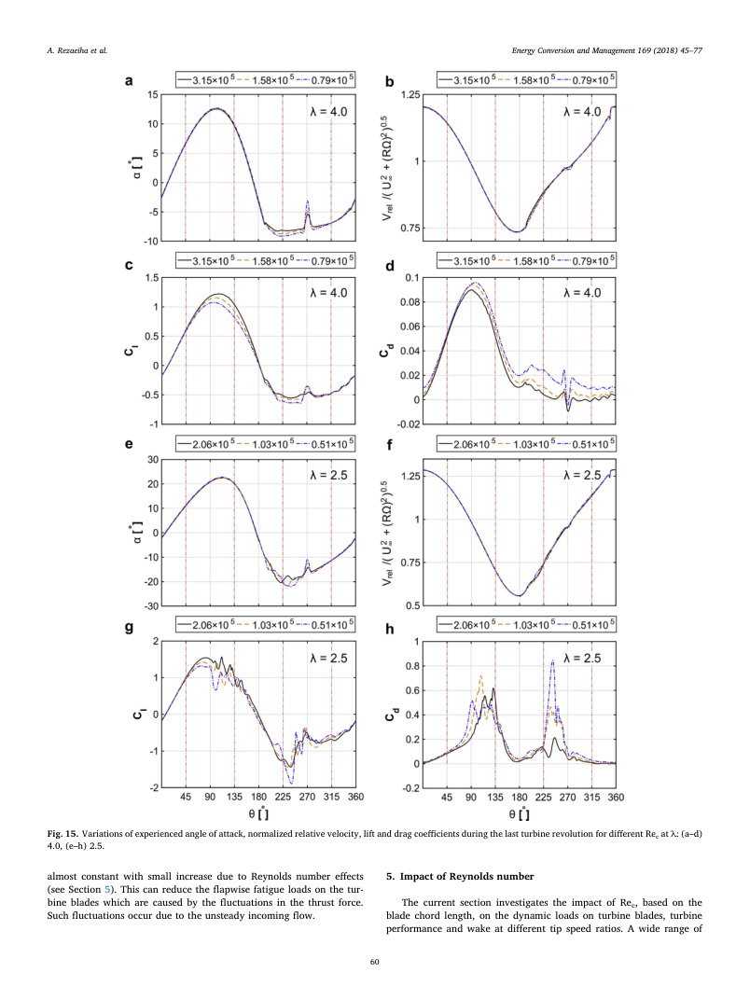

<!-- PDF page 17 -->

Rec = 0.3 × 105 – 4.3 × 105 is considered where the range covers the
values corresponding to small- to medium-scale urban VAWTs [12].
The turbulence intensity and the reduced frequency are kept the same
as in the reference case. The other main operational parameters are
presented in Table 7. An overall analysis is performed for 2.5 ≤λ ≤5.5
covering low to moderately high tip speed ratios while a more detailed
analysis focuses on the optimal λ of 4.0 and λ = 2.5, where the blade is
in dynamic stall. It should be noted that the two selected λ will cover
the two distinctive turbine operation regimes based on the flow physics:
the former corresponds to the regime when the flow is mostly attached
while the latter corresponds to the regime that includes strong se-
paration from the blades. Therefore, these two deserve a dedicated
analysis.
5.1. Loads on blades
The variations of α, Vrel, dynamic Cl and Cd during the last turbine
revolution for different Rec are compared in Fig. 15 for λ = 4.0 and
λ = 2.5.
The
Rec
ranges
between
0.79 × 105
–3.15 × 105
and
0.51 × 105 –2.06 × 105 for λ = 4.0 and 2.5, respectively.
For λ = 4.0 (optimal performance), in the turbine fore half:
• Rec
has
a
negligible
influence
on
α
during
the
upstroke
(0° ≤θ ≤45°).
• Normalized Vrel is Re-independent.
• During the upstroke, Rec has negligible effect on Cl, especially for
Rec ≥105.
• Near Cl,max and during the downstroke, 45° < θ ≤180°, increasing
Rec increases Cl and Cl,max, slightly postpones αcl,max to higher θ and
marginally reduces Cd. Given the constant value of α for different
Rec, these are associated to the delay in trailing-edge separation,
which will be discussed later in this section. This is in agreement
with earlier studies on airfoils in similar Re regime [70].
• Cl is more sensitive to Rec for Rec ≤1.58 × 105. This threshold is
consistent with the findings for static airfoils reported by Lissaman
[74].
In the turbine aft half:
• Rec has noticeable influence on α and Cl mainly in two regions, (i)
235° ≤θ ≤265° where the flow has already slightly lower velocity
due to the improved blade performance and more efficient energy
extraction (less energy is remained in the flow) at higher Rec. The
lower velocity results in lower α and Cl for higher Rec, (ii) θ ≈270°
Fig. 16. Pressure coefficient (CoP) over the blade during the last turbine revolution for different Rec at azimuthal positions set in Fig. 5 for λ = 2.5 and 4.0. X/c
represents the dimensionless chordwise position along the blade.
A. Rezaeiha et al.

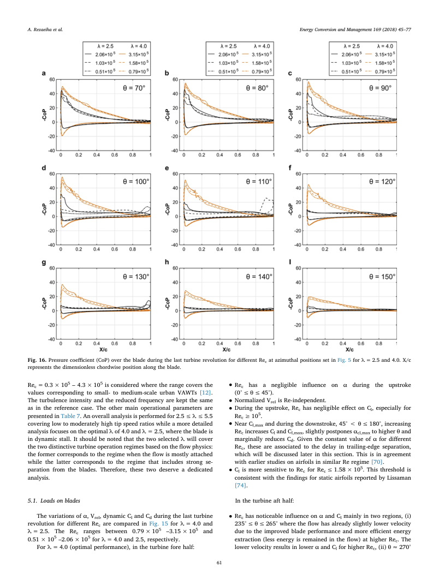

<!-- PDF page 18 -->

where increasing Rec noticeably diminishes the sudden change in all
parameters in the shaft wake. This is due to the strong Reynolds
number effects on shaft, where increasing Re significantly delays the
separation and reduces the wake width. Note that the Re corre-
sponding to the shaft is defined based on its diameter and solely the
incoming flow, which therefore, will be significantly lower than Rec.
An extensive discussion on the effect of the turbine shaft for VAWTs
is provided by Rezaeiha et al. [55].
• Increasing Rec is found to significantly reduce Cd, especially for
Rec ≤1.58 × 105. Note that given the small variations of α, the flow
on the blade is mostly attached in this region. For attached flows on
flat plates and airfoils, increasing Re effectively reduces the turbu-
lent shear stress, and consequently the skin friction drag, while such
an effect becomes less strong by increasing Re above 105 [72].
For λ = 2.5 (dynamic stall), similar observations as the optimal λ
are made while the following points are also noteworthy. In the turbine
fore half, the delay in stall by increasing Rec is evident from the post-
ponement of Cd,max. While increasing Rec visibly increases Cl,max, no
monotonic trend is found for Cd,max. The complexities associated with
the impact of Rec on dynamic stall has also been already reported by
Singleton
and
Yeager
Jr.
[115].
In
the
turbine
aft
half,
for
235° ≤θ ≤265°, increasing Rec is found to reduce fluctuations in α, Cl
and Cd which occurs due to the blade-wake interactions as explained in
Section 4.1.
Plotting the lift and drag coefficients versus angle of attack, which
for brevity is not shown here, implies that the hysteresis in dynamic
loads is marginally increased by Rec prior to stall, i.e. λ = 4.0, while is
weakly influenced by Rec post-stall, i.e. λ = 2.5. This is in line with the
experimental results of Bousman [116], which showed weak Re-de-
pendency for dynamic stall at Rec 1 × 105 – 2.5 × 105.
The pressure coefficients on the blade are shown in Fig. 16. Note
that in this figure the azimuthal positions, and λ and Rec are corre-
sponding to those values already employed in Figs. 5 and 15, respec-
tively. It can be seen that:
• An increase in Rec promotes laminar-to-turbulent transition on the
blade suction side. This is in agreement with the studies on airfoils
and flat plates [72,74,103]. Similar to observations in Section 4.1,
the transition occurs earlier and the length of LSB is shorter for
lower λ due to higher values of α.
• An increase in Rec delays the separation on the blade. For λ = 2.5,
at θ > 90° the blade has already stalled for the lowest Rec of
0.51 × 105 while this occurs at θ > 110° for the highest Rec of
2.06 × 105. The delay in separation is associated to the promotion
in laminar-to-turbulent transition. The turbulent boundary layer has
higher energy, thus, is more resistant to adverse pressure gradient
and will separate later.
• Increasing Rec also slightly increases the pressure difference on the
blade which explains the improvement in Cl shown in Fig. 15. The
increment in pressure difference is found to be present both in la-
minar and turbulent regions of the blade. This can be associated to
the reduction in skin friction by increasing Rec [74].
Fig. 17. Power and thrust coefficients versus tip speed ratio (2.5 ≤λ ≤5.5) and chord-based Reynolds number (0.4 × 105 < Rec < 4.0 × 105).
A. Rezaeiha et al.

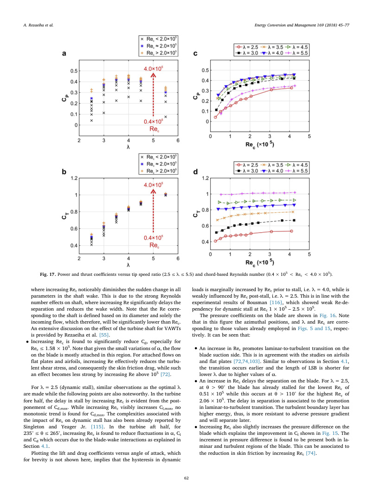

<!-- PDF page 19 -->

5.2. Turbine performance
Fig. 17a and b show the turbine power and thrust coefficients versus
tip speed ratio for different freestream chord-based Reynolds numbers
0.4 × 105 ≤Rec ≤4.0 × 105. The range is selected corresponding to
very small to moderate size VAWTs operating in the urban environ-
ment. Increasing Rec is found to significantly improve the turbine
performance while the optimum λ is Re-independent. The enhancement
in CP at λ = 2.5 (dynamic stall) and the optimal λ of 4.0 is 682% and
77%, respectively, when Rec increases from approximately 0.4 × 105 to
4.0 × 105.
As already shown in Section 5.1, increasing Rec results in two effects
on the blade, i.e. increase in the pressure difference and the promotion
of laminar-to-turbulent transition which eventually delays the separa-
tion. For a given geometrical design and operating condition, Rec will
be fixed. Therefore, if any method can mimic the two effects of Rec, it
could also significantly improve the turbine performance. Flow control
methods have emerged as promising options to introduce the two ef-
fects. For example, circulation control methods can be employed to
increase the pressure difference on airfoils [117]. Separation control
methods have also been shown to successfully delay the blade stall to
higher α [103].
By increasing λ, the effect of Rec on CT becomes less pronounced. As
Rec increases from 0.4 × 105 to 4.0 × 105, CT increases by 30.5% and
4.7% at λ = 2.5 and 4.0, respectively.
In order to further clarify the impact of Reynolds number, the
Fig. 18. Coefficients of tangential and normal forces and the normalized cumulative sum of the moment coefficient during the last turbine revolution for different Rec
for (a–c) λ = 4.0 and (d–f) λ = 2.5.
A. Rezaeiha et al.

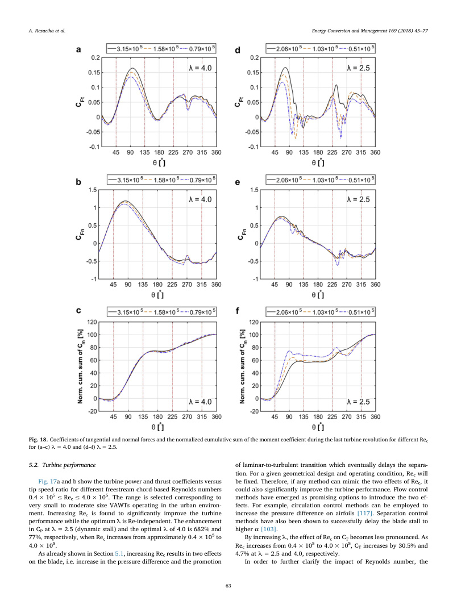

<!-- PDF page 20 -->

turbine power and thrust coefficients versus Rec for different tip speed
ratios 2.5 ≤λ ≤5.5 are illustrated in Fig. 17c and d. It can be seen that
increasing Rec asymptotically improves CP. The asymptotic trend could
be explained as follows: as Rec increases and transition onset shifts
upstream toward the leading edge, at one point flow on a large part of
the blade is already turbulent and further promotion of the transition
will have negligible effect. The asymptotic trend is in agreement with
the experimental observations by Bachant and Wosnik [65] for hydro
turbines. The results of the present study reveal that for Rec up to
4 × 105, the turbine performance is still Re-dependent which is in
contrast with the results of Bachant and Wosnik [65] where they re-
ported a Re-independent performance for Rec ≥2 × 105. The differ-
ence could be associated to the large difference in turbine solidity be-
tween the two studies. In the present study, the turbine has a low
solidity of 0.12 while in the experiment they had a large solidity of 0.42
(which is more relevant for hydro turbines). The comparatively small
impact of Rec on CT is also clearly seen in Fig. 17d. For λ ≥4.0, CT is
almost Re-independent for the whole range studied. For λ < 4.0, the
Re-independence regime is limited to Rec > 2 × 105.
Fig. 18 compares the instantaneous tangential CFt and normal CFn
force coefficients on blades and the normalized cumulative sum of in-
stantaneous moment coefficient Cm during the last turbine revolution
for the optimal λ of 4.0 and λ = 2.5 (dynamic stall) for different Rec.
For λ = 4.0, Rec varies between 0.79 × 105 and 3.15 × 105. For
λ = 2.5, the Rec variation is from 0.51 × 105 to 2.06 × 105. For the
optimal λ of 4.0, the following observations are made:
• Increasing Rec is found to significantly increase the tangential loads
on turbine blades in the turbine fore half. The increment was al-
ready shown to be due to the promotion in laminar-to-turbulent
transition, delay in separation and reduction in drag for higher Rec.
• Increasing Rec improves the loss in tangential loads in the shaft
wake θ ≈270°. As discussed, the improvement corresponds to the
delay in separation on the shaft and the consequent reduction in
shaft wake by increasing Re.
• Normal loads are found to be less sensitive to Rec. In the turbine fore
half, normal loads increase by increasing Rec, while the magnitude
of increment is smaller than the tangential loads. Similar observa-
tion is made in the shaft wake where the reduction in normal loads
is comparatively small.
• Rec is found not to alter the contribution of different turbine quar-
tiles to the total power production.
For λ = 2.5 (dynamic stall), it can be seen that:
• The sudden drop in tangential loads in the turbine fore half occurs
later for higher Rec. This prompts the delay in stall.
• A reduction in tangential and normal load fluctuations, by in-
creasing Rec is noticeable. This occurs due to stall in the turbine fore
half and the blade-wake interactions in the turbine aft half.
• Unlike the optimal λ, increasing Rec notably affects the contribution
of different quartiles to the total power production where the con-
tribution of the upwind quartile lessens and that of the downwind
quartile increases. This is associated to the significant influence of
Rec on delaying the stall and remarkably diminishing the strength of
shed vorticity from the blades, thus weaker blade-wake interactions
at higher Rec (see Section 5.3). As a result, at higher Rec, the
downstream region is still capable of extracting energy from the
flow and contributing to the total power.
5.3. Turbine wake
Fig. 19 shows the strength of the shed vorticity by a single blade
during the last turbine revolution for the λ = 4.0 (optimal value) and
2.5 (dynamic stall). It can be see that at the optimal λ of 4.0, the
strength of the shed vorticity by a single blade is insignificantly affected
by Rec. Small differences by increasing Rec correspond to three regions:
(i) delay in separation on the blade in the turbine fore half; (ii) con-
sequent reduction in fluctuations of the strength of the shed vorticity
due to smaller blade-wake interactions in the turbine aft half; and (iii)
diminishing of the impact of the shaft wake.
At λ = 2.5 (dynamic stall), the influence of Rec is apparent in the
same three regions while the impact is much more pronounced, espe-
cially when increasing Rec from 0.51 × 105 to 1.03 × 105 where
stronger vortex shedding and larger instability in the strength of the
shed vortices are found to occur at the lower Rec. This is in agreement
with the experimental results by Yoon et al. [118].
Fig. 20 presents the time-averaged (over the last turbine revolution)
streamwise velocity (normalized with respect to the freestream velo-
city) along the lateral line, −0.75 ≤y/d ≤0.75, at different down-
stream locations in the turbine wake with x/d = 1.0, 1.5, 2.0, 2.5, 3.0,
4.0, for λ = 4.0 (optimal) and 2.5 (dynamic stall) at various Rec are
shown in. It can be seen that:
• The turbine wake mean velocity profile is much less sensitive to Rec
than λ.
• The sensitivity of the wake mean velocity to Rec does not reduce
with traveling further downstream from x/d = 1.0 to 4.0.
• The velocity deficit and the mean velocity profile in the wake of the
Fig. 19. Shed vorticity by a single blade during the last revolution for different
Rec at λ: (a) 4.0, (b) 2.5. Positive values denote counter-clockwise circulation
based on the Kutta–Joukowski theorem [111].
A. Rezaeiha et al.

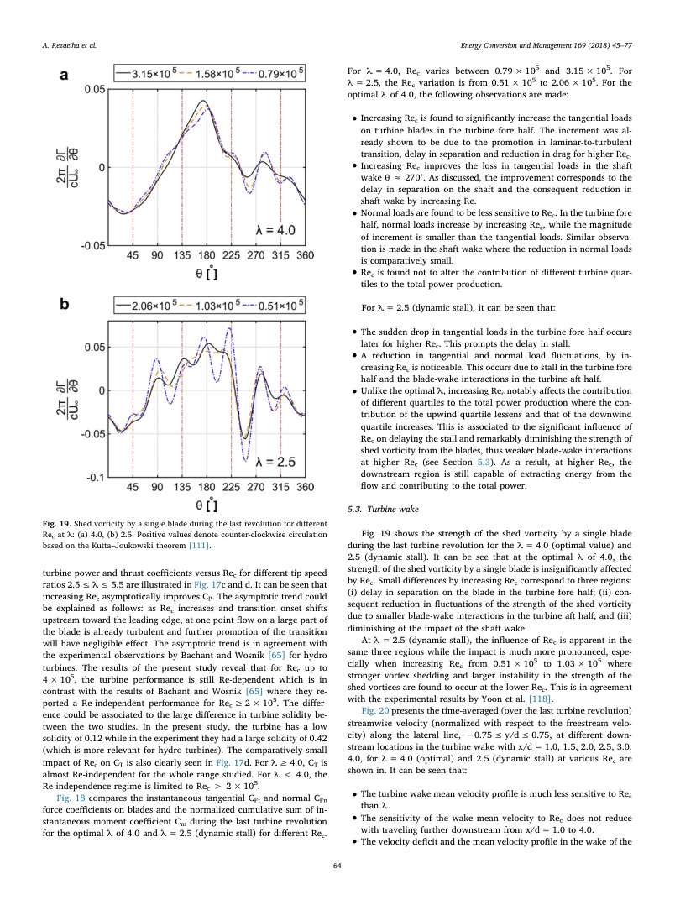

<!-- PDF page 21 -->

Fig. 20. Time-averaged (over the last turbine revolution) normalized (with freestream velocity) streamwise velocity along the lateral line −0.75 ≤y/d ≤0.75 at
several downstream locations for different Rec at λ = 2.5 and 4.0.
A. Rezaeiha et al.

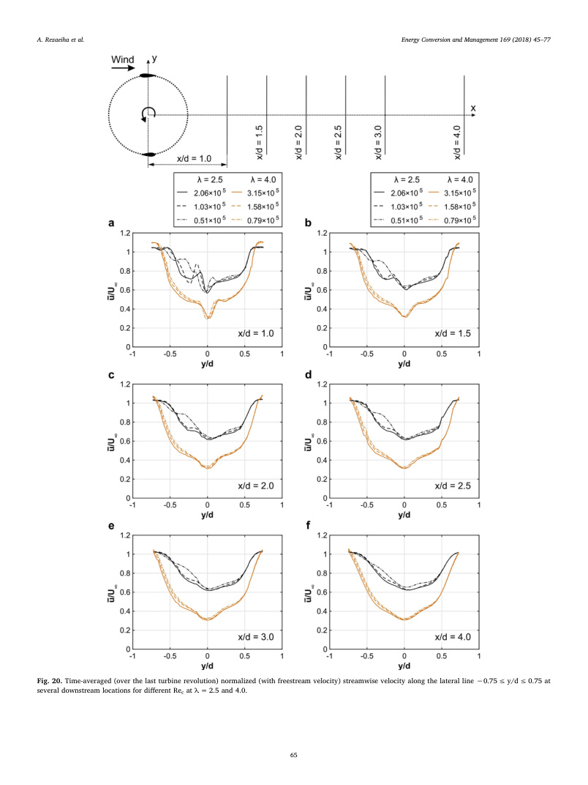

<!-- PDF page 22 -->

VAWT are Re-dependent within the range studied both for λ = 4.0
and = 2.5. For HAWT, Re-independency for the wake mean velocity
is found to occur already at an approximate blade tip Rec of
2.0 × 104 [119].
• Increasing Rec increases the velocity deficit for x/d > 1.0. This
corroborates the observations by Bachant and Wosnik on hydro
turbines [65].
• Increasing Rec expands the turbine wake. Similar observations are
reported for HAWTs by McTavish et al. [120].
• The influence of Rec is more prominent for λ = 2.5, compared to
λ = 4.0, and the impact is larger for Rec increasing from 0.51 × 105
to 1.03 × 105. This is consistent with the comparatively large im-
pact of Rec on the strength of the shed vorticity for the lower λ at the
same Rec as shown in Fig. 19. As the turbine wake is generated by
the shed vorticity from the blades, therefore, the larger influence of
the Rec on the strength of the shed vorticity will also result in a
larger difference in the velocity profiles in the wake.
• For λ = 2.5, at downstream positions x/d < 2.0, the impact of the
local blade aerodynamics (vortex shedding due to stall on blades) is
strongly distinguished as fluctuations in the mean velocity profile in
y/d < 0. The local blade effect fades away as the wake travels
further downstream.
The above findings highlight the facts that (i) there exist important
differences in Re-dependency of wake characteristics for VAWTs and
HAWTs; (ii) in the study of array of reduced-scale VAWTs, Re-de-
pendency of the wake mean velocity and turbulence intensity needs
special attention to avoid wrong conclusions for the full-scale turbines.
6. Impact of turbulence intensity
In this section, the impact of freestream turbulence intensity on the
dynamic loads on blades, the turbine performance and the wake is
systematically investigated. Table 8 lists the operational parameters
employed. TI is selected to vary within 0 to 30%, covering a wide range
from very low values relevant to low turbulence wind tunnels to
moderately high turbulence in the real operating conditions such as
urban environments. An overall analysis is performed for 2.5 ≤λ ≤5.5
covering low to moderately high tip speed ratios while a more detailed
analysis focuses on the optimal λ of 4.0 as well as λ = 2.5 where the
blade is in dynamic stall. Table 9 presents the incident-flow total tur-
bulence intensities for all the cases. The reduced frequency is kept the
same as the reference case.
6.1. Loads on blades
Fig. 21 compares the variations of α, Vrel, dynamic Cl and Cd during
the last turbine revolution for different TI for λ = 4.0 (optimal) and
λ = 2.5 (dynamic stall). For λ = 4.0, the following observations are
made:
• α is found not to be affected by TI except in the shaft wake where
the magnitude of the sudden change in α abates by increasing TI.
This is because increasing TI promotes laminar-to-turbulent transi-
tion on bluffbodies [121], which consequently delays the flow se-
paration and reduces the shaft wake width [55].
• At TI = 0%, fluctuations are present in both Cl and Cd which could
be associated to the long laminar separation bubble (LSB) existing
on the airfoil suction side [109]. Increasing TI damps out such load
fluctuations.
• In the turbine fore half, very small differences in Cl are observed for
TI = 5% and 30%.
• In the turbine fore half, Cd is highest for TI = 30%. In the turbine aft
half, Cd is higher for TI = 30% compared to 5% while strong fluc-
tuations, due the blade-wake interactions and shaft wake, are pre-
sent for TI = 0%.
For λ = 2.5 (dynamic stall), it can be seen that:
• Fluctuations of α corresponding to the blade-wake interactions
downstream of the stall region, already identified in Section 4.1,
reduce as TI increases.
• Increasing TI remarkably reduces the load (Cl and Cd) fluctuations
due to the stall, the blade-wake interactions and the shaft wake
where the difference is much more pronounced from TI of 0% to 5%.
• In contrary to λ = 4.0, increasing TI notably reduces Cd where the
minimum Cd corresponds to TI = 30%.
• The minimum Cd,max occurring due to the stall and the blade-wake
interactions occurs at TI = 30%.
• By increasing TI, stall is delayed. This is apparent from the post-
ponement in Cd,max in the turbine fore half.
• Cl,max is found not to be affected by TI.
In addition, plotting the lift and drag coefficients versus angle of
attack, which for brevity is not shown here, implies that the asymmetry
(hysteresis) in the dynamic loads is barely influenced by TI.
The pressure coefficients on the blade are compared in Fig. 22. The
following observations are made:
• Similar to observations in Sections 4.1 and 5.1, the transition occurs
earlier and the length of LSB is shorter for lower λ due to higher
values of α.
• At TI = 0%, a long LSB is present, where the length of the bubble is
shorter for λ = 2.5 due to higher α, which is thought to be causing
the notable load fluctuations shown in Fig. 21.
• Increasing TI from 0 to 5% significantly decreases the length of LSB.
The reduction in the bubble length has been experimentally shown
to be associated to the stronger velocity fluctuations, at higher TI,
entering the separated boundary layer which tends to reattach the
boundary layer and close the bubble [122].
• At TI = 30%, bypass transition occurs for all cases for λ = 4.0. This
is limited to θ < 90° and > 130° for λ = 2.5. While for other θ, an
early transition within a short LSB at 0 < X/c < 0.1 happens.
• For λ = 2.5 (dynamic stall), the delay in stall by increasing TI is
clearly visible. At TI = 0%, the blade stalls at θ = 80°. This is
postponed for θ = 100° at TI = 5%. This is further postponed at
TI = 30% where separation extends over almost 90% of the blade at
θ = 120°.
• For the optimal λ = 4.0 where the flow is mostly attached, TI = 0%
has the minimum pressure difference on the blade. A slight increase
of pressure difference on the blade by increasing TI from 5 to 30% is
present for θ > 100°.
6.2. Turbine performance
Fig. 23 shows CP and CT versus λ for 0% ≤TI ≤30% and versus TI
for 2.5 ≤λ ≤5.5. It can be seen that CP is strongly sensitive to TI for all
Table 8
Operational parameters to study the impact of freestream turbulence.
λ
2.5
3.0
3.5
4.0
4.5
5.5
U∞[m/s]
9.3
9.3
9.3
9.3
9.3
9.3
Ω [rad/s]
46.5
55.8
65.1
74.4
83.7
102.3
TI [%]
0 – 30
0 – 30
0 – 30
0 – 30
0 – 30
0 – 30
Rec (× 105)
1.03
1.21
1.39
1.58
1.76
2.14
Table 9
Incident total turbulence intensities.
TI [%]
0
5
10
15
20
25
30
TIi [%]
1e-6
4.42
7.99
11.01
13.64
15.98
18.09
A. Rezaeiha et al.

<!-- PDF page 23 -->

λ. For low tip speed ratios (λ ≤3.0), the sensitivity for TI < 10% is
substantial while it quickly decreases for 10% ≤TI ≤30%. Within the
studied range of TI, this sensitivity becomes comparatively small for
moderate to high tip speed ratios, 3.5 ≤λ ≤4.5, while again increases
for higher λ of 5.5. The optimum λ has a small dependence on TI where
it slightly decreases from 4.0 to 3.5 by increasing TI from 0% to 30%.
For λ = 2.5, where the flow is strongly separated and dynamic stall
is present, increasing TI from 0% to 30% dramatically improves the
turbine performance (249%). The improvement is shown to be asso-
ciated with the promotion in laminar-to-turbulent transition and
Fig. 21. Variations of experienced angle of attack, normalized relative velocity, lift and drag coefficients during the last turbine revolution for different TI at λ: (a–d)
4.0, (e–h) 2.5.
A. Rezaeiha et al.

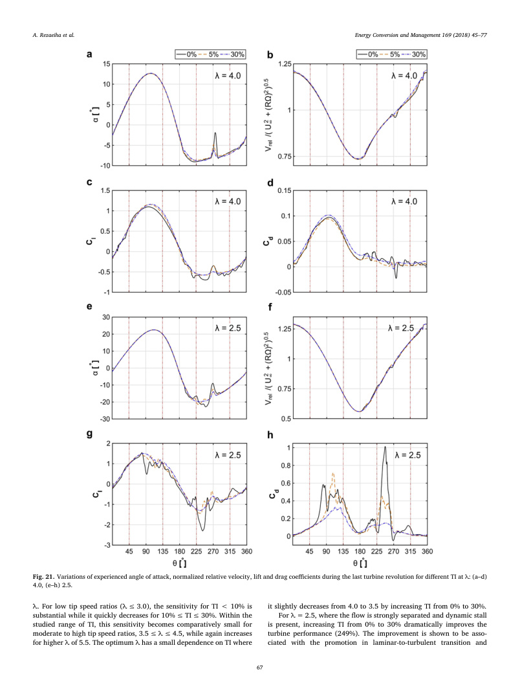

<!-- PDF page 24 -->

considerable delay in stall on blade (see Section 6.1).
For λ > 2.5, where the blade is operating prior or near stall, an
initial increase of TI from 0% improves the CP by promoting laminar-to-
turbulent transition (happening within a shorter LSB) and increasing
the pressure difference on the blade. There exists an optimal TI which
grants the maximum CP. The optimal TI is 15% and 10% for λ = 3.0
and 3.5, respectively, while this reduces to TI = 5% for λ ≥4.0. The
optimal CP compared to that of TI = 0% is 87%, 25%, 7%, 6% and 7%
higher for λ = 3.0, 3.5, 4.0, 4.5 and 5.5, respectively. This highlights
significant influence of TI especially for TI ≤15%. Further increase of
TI deteriorates the CP due to massive increase of Cd as a result of large
growth of skin friction in the attached boundary layer along the blade.
For the optimal λ = 4.0, the maximum CP, which occurs at TI = 5%,
drops by 9% at TI = 30%. The reduction grows to 23% for λ = 5.5. The
comparatively high reduction at λ = 5.5 could be explained as for
higher λ, flow is attached over a larger part of the blade, therefore,
friction drag is playing a more important role. For λ ≥4.0, CP at
TI = 30% is lower than that of TI = 0%. CT can be considered almost
TI-independent.
Fig. 24 presents the instantaneous tangential CFt and normal CFn
force coefficients on the blades and the normalized cumulative sum of
instantaneous moment coefficient Cm during the last turbine revolution
for the optimal λ of 4.0 and λ = 2.5 (dynamic stall) for different TI
values. For the optimal λ of 4.0, it can be seen that:
• Increasing TI from 0% to 5% improves the tangential loads in the
turbine fore half while further increase of TI to 30% decreases the
tangential loads. The explanation is provided in Section 6.1.
• The loads in the shaft wake behave differently where TI = 30%
shows the least reduction in loads. This is because the flow over a
bluffbody, namely the shaft, is driven by large separation and
friction drag plays a minimal role to the total drag. Therefore, in-
crease of TI delays the separation and reduces the shaft wake, which
consequently improves the tangential loads in this region.
• Normal loads are less sensitive to TI. In the turbine fore half, the
normal loads slightly increase due to higher TI, especially during the
downstroke while the reverse occurs in the turbine aft half.
• The contribution of different quartiles are minimally affected by TI
(Fig. 24c).
For λ = 2.5 (dynamic stall) it can be observed that:
• Increasing TI monotonically improves the tangential loads in dy-
namic stall by dramatically delaying the stall. This is clearly
Fig. 22. Pressure coefficient (CoP) over the blade during the last turbine revolution for different TI at azimuthal positions set in Fig. 5 for λ = 2.5 and 4.0. X/c
represents the dimensionless chordwise position along the blade.
A. Rezaeiha et al.

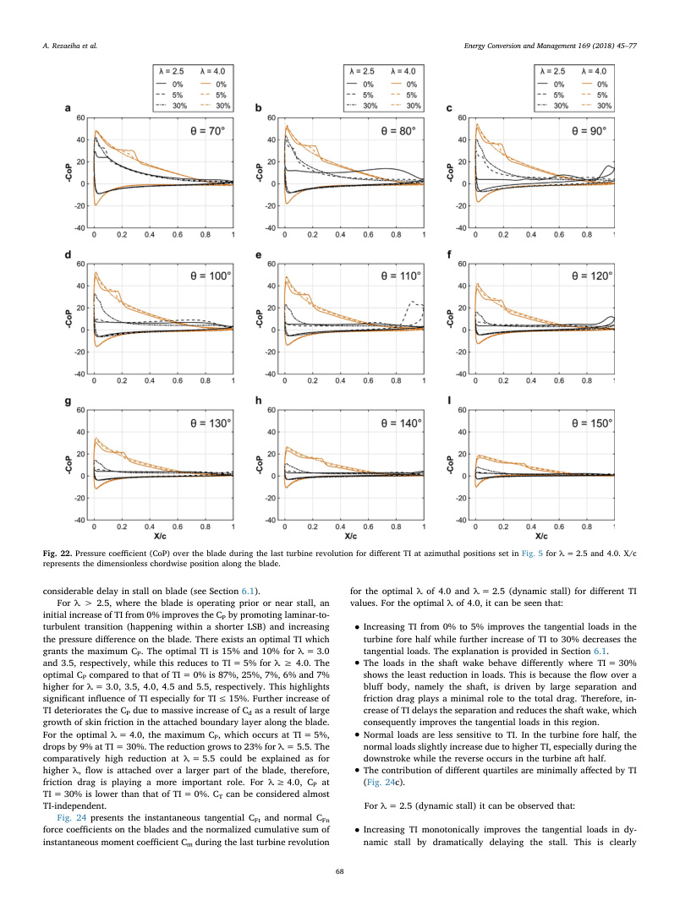

<!-- PDF page 25 -->

distinguished from the postponement in the abrupt drop in tan-
gential loads for higher TI.
• Increasing TI significantly diminishes the fluctuations in tangential
and normal loads.
• Due to the considerable changes in the flow by delaying stall in the
turbine fore half, the contribution of different quartiles to the total
power production is altered.
6.3. Turbine wake
Fig. 25 shows the strength of the shed vorticity by a single blade
during the last turbine revolution for λ = 4.0 (optimal value) and 2.5
(dynamic stall). It can be seen that:
• At the optimal λ of 4.0, increasing TI from 0 to 5% diminishes the
fluctuations in the strength of the shed vorticity while further in-
crease of TI yields to less significant impact.
• At λ = 2.5, the similar observation is made while the impact of TI in
reducing the fluctuations in the strength of the shed vorticity is
much more pronounced.
Fig. 26 indicates the time-averaged (over the last turbine revolu-
tion) streamwise velocity (normalized with respect to the freestream
velocity) along the lateral line, −0.75 ≤y/d ≤0.75, at different
downstream locations in the turbine wake with x/d = 1.0, 1.5, 2.0, 2.5,
3.0, 4.0, for λ = 4.0 (optimal) and 2.5 (dynamic stall) at various TI. It
can be seen that:
• The sensitivity of the mean velocity in the turbine wake to TI is less
than λ but more than Rec.
• The large fluctuations in the strength of the shed vortices for
TI = 0%, shown in Fig. 25, are also clearly distinguished at x/
d ≤1.5 where the wake is strongly influenced by the local aero-
dynamic of blades.
• The fluctuations in the mean velocity are more significant for
λ = 2.5 due to dynamic stall on the blades and stronger fluctuations
in the strength of the shed vorticity.
• As the wake travels further downstream, such fluctuations are
damped out.
• The influence of TI on the mean velocity in the wake is very pro-
minent for both optimal and dynamic stall cases. This remains non-
negligible for downstream locations as far as x/d = 4.0.
• Increasing TI reduces the impact of the shaft on the mean velocity in
the turbine wake. This is attributed to the considerable delay in
separation over the shaft and the subsequent reduction of the shaft
wake.
• By increasing TI, the velocity deficit in the wake and the wake ex-
pansion reduce while the wake recovery increases. The findings are
in line with the role of the turbulence level on the wake of HAWTs
[123].
7. Summary and conclusions
High-fidelity computational fluid dynamics (CFD) simulations, ex-
tensively validated with experiments, are performed to systematically
investigate the impact of operational parameters, i.e. tip speed ratio
(λ), Reynolds number (Rec) and turbulence intensity (TI), on the power
performance and aerodynamics of vertical axis wind turbines. The
study investigates a wide range of the parameters: 1.2 ≤λ ≤6.0,
0.3 × 105 ≤Rec ≤4.2 × 105 and 0% ≤TI ≤30% to comprehensively
Fig. 23. Power and thrust coefficients versus tip speed ratio (2.5 ≤λ ≤5.5) and turbulence intensity (0% < TI < 30%).
A. Rezaeiha et al.

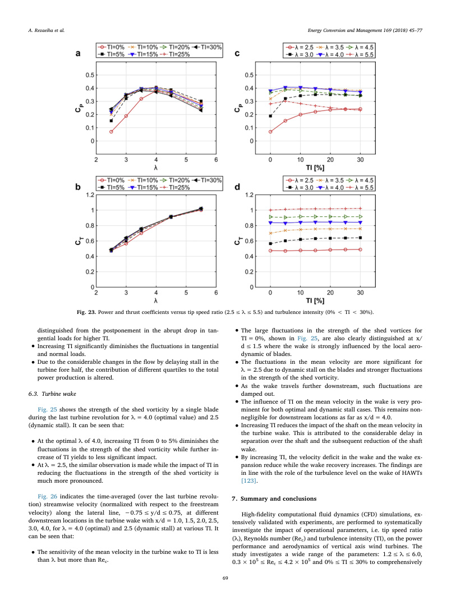

<!-- PDF page 26 -->

clarify their impact on dynamic loads on blades, turbine performance
and wake. The findings from the study can be summarized as follows:
(1) Tip speed ratio:
• In the turbine fore half, the variation of α is half-cycle sinusoidal,
while in the turbine aft half it is notably different due to the strong
impact of the turbine induction, the blade-wake interactions and
the shaft wake. Increase of λ also increases the flatness in α curve in
the turbine aft half.
• The amplitude of the oscillations in the normalized relative velocity
increases from 17.5% at λ = 5.5 to 36.7% at λ = 2.5.
• For λ < 3.0, the variations of α exceed αss which leads to dynamic
stall. This is accompanied by strong fluctuations in Cl and Cd and a
dramatic jump in Cd. The consequent blade-wake interactions also
result in strong load fluctuations in the downwind quartile.
Reducing λ significantly increases Cl,max and Cd,max.
• Reducing λ promotes laminar-to-turbulent transition, decreases the
length of the laminar separation bubble and moves the trailing edge
separation towards the leading edge. These occur due to the higher
α of the blades.
• An optimal λ exists for CP while CT asymptotically increases with λ.
For the studied turbine, the optimal λ is 4.0. The optimal λ stays
constant with Re and reduced frequency, within the studied range.
• The contribution of different turbine quartiles to the total power
production is strongly λ-dependent.
• Increasing λ increases the velocity deficit, wake expansion and
streamwise asymmetry in the wake.
• The length of the turbine wake, defined at V/U∞= 0.97, decreases
asymptotically by increasing λ. The decrease in the wake length is
thought to be due to the amplification of instabilities due to the
closer spacing of the shed vortices in the wake which could lead to
an earlier break down of the wake structure.
(2) Reynolds number:
• α and normalized Vrel are almost Re-independent, esp. in the fore
Fig. 24. Coefficients of tangential and normal force coefficients and the normalized cumulative sum of moment coefficient during the last turbine revolution for
different TI at (a–c) λ = 4.0, (d–f) λ = 2.5.
A. Rezaeiha et al.

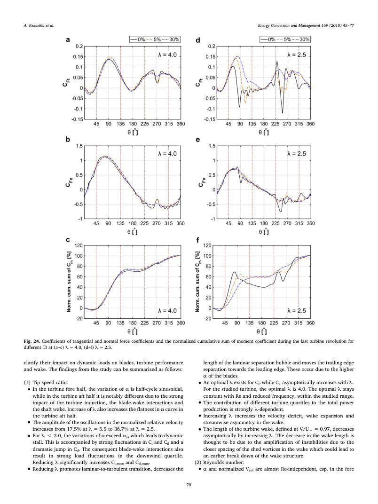

<!-- PDF page 27 -->

turbine half.
• Increase of Rec: (i) promotes the laminar-to-turbulent transition and
postpones the separation on blades, (ii) reduces the fluctuations in
Cl and Cd associated with the dynamic stall and the blade-wake
interactions, (iii) reduces the impact of the shaft on turbine loads,
(iv) improves Cl by increasing Cl,max and delaying stall where the
sensitivity of Cl to Rec decreases for Rec > 105, and (v) reduces Cd,
especially in the turbine aft half, and Cd,max, occurring due to the
blade-wake interactions.
• Within the studied range, CP is strongly Re-dependent where the
sensitivity decreases by the increase of Rec. CT is much less Re-de-
pendent. For high λ, CT is almost Re-independent.
• The optimum λ is Re-independent.
• Unlike the optimal λ of 4.0, in dynamic stall (λ = 2.5) the con-
tribution of different quartiles to the total power production is Re-
dependent.
• Within the studied range, the mean velocity in the wake is Re-de-
pendent, while the sensitivity is lower compared to that of λ and TI.
The sensitivity to Rec does not reduce as the wake travels down-
stream from x/d = 1.0 to 4.0.
• Increasing Rec increases the velocity deficit and the wake expan-
sion.
(3) Turbulence intensity:
• α and normalized Vrel are almost TI-independent, except in the
wake of the shaft.
• Increase of TI: (i) reduces the impact of the shaft on the turbine
loads, (ii) promotes laminar-to-turbulent transition, and (iii) re-
duces the fluctuations in Cl and Cd associated with the dynamic
stall, the blade-wake interactions and presence of the long laminar
separation bubble on the blade at TI = 0%.
• At optimal λ (= 4.0), an increase of TI from 0% to 5%, reduces Cd
while further increase of TI to 30% results in a significant growth in
Cd due to the increased skin friction in the attached boundary layer
on the blade.
• At λ = 2.5 (dynamic stall), an increase of TI to 30% reduces the
Cd,max, associated with the dynamic stall and the consequent blade-
wake interactions, while Cl,max is not affected.
• CP is strongly TI-dependent while CT is almost TI-independent.
• The optimum λ slightly decreases by increasing TI.
• At λ = 2.5 (dynamic stall), increasing TI from 0% to 30% drama-
tically improves CP by 249%. The improvement is associated to the
delay in stall. For higher λ, an optimal value of TI exists. The op-
timal TI reduces from 15% to 5% for λ increasing from 3.0 to 5.5.
At optimal λ (= 4.0), increasing TI from 0% to 5% improves CP by
7% while further increase of TI to 30% drops CP by 9%.
• Unlike the optimal λ of 4.0, in dynamic stall (λ = 2.5) the con-
tribution of different quartiles to the total power production is TI-
dependent.
• Mean velocity in the wake is strongly influenced by TI. The sensi-
tivity is less than that to λ but more than that to Re.
• Increase of TI decreases the velocity deficit and the wake expansion
while increases the wake recovery.
The main conclusions are:
• Two co-occurring sources of unsteadiness, α and Vrel, complicate the
aerodynamics of VAWTs.
• Neglecting the induced velocity, via using the geometrical angle of
attack, can lead to an overestimation of the variations of α up to 8.3°
and the magnitude of Cd and a shift in the Cl-α and Cd-α curves,
which could result in a large uncertainty in the turbine power pre-
diction.
• Maintaining the optimal λ (at different freestream velocities) via a
variable-speed VAWT substantially improves CP compared to a
fixed-speed VAWT. The improvement is 168%, for example, at 4 m/s
compared to a turbine operating at a fixed rotational speed of
65.1 rad/s.
• The upwind quartile is the major contributor to the total power
production with more than 50% contribution in all λ studied.
• Given the inherent unsteady nature of VAWTs, which is due to the
continuous and substantial variations of angle of attack and relative
velocity during each revolution, power enhancement methods such
as individual blade dynamic pitching, trailing edge flaps, microtabs
and other flow control methods, can hardly be made effective during
the whole revolution due to practical difficulties. Therefore, because
the upwind quartile plays the most important role in the turbine
total power production, the use of such power enhancement
methods for this quartile, rather than the whole revolution, would
be less challenging and more practical in terms of energy input,
system complexity and time response.
• Within
the
range
studied,
0.3 × 105 ≤Rec ≤4.3 × 105
and
0 ≤TI ≤30%, the turbine power coefficient CP and wake char-
acteristics (i.e. mean velocity profile, velocity deficit and wake ex-
pansion) are strongly sensitive to Re and TI. Therefore, any ex-
perimental/numerical VAWT study performed for a scaled model
(lower Rec) or at a different turbulence level needs to consider the
strong sensitivity to Rec and TI of any measured/calculated turbine
power and wake data. The influence of these parameters on the
power measurements would lead to unrealistic performance pre-
diction for the full-scale turbine while their influence on the wake
measurements would play a role when the effect of the turbine wake
Fig. 25. Shed vorticity by a single blade during the last revolution for different
TI at λ: (a) 4.0, (b) 2.5. Positive values denote counter-clockwise circulation
based on the Kutta–Joukowski theorem [111].
A. Rezaeiha et al.

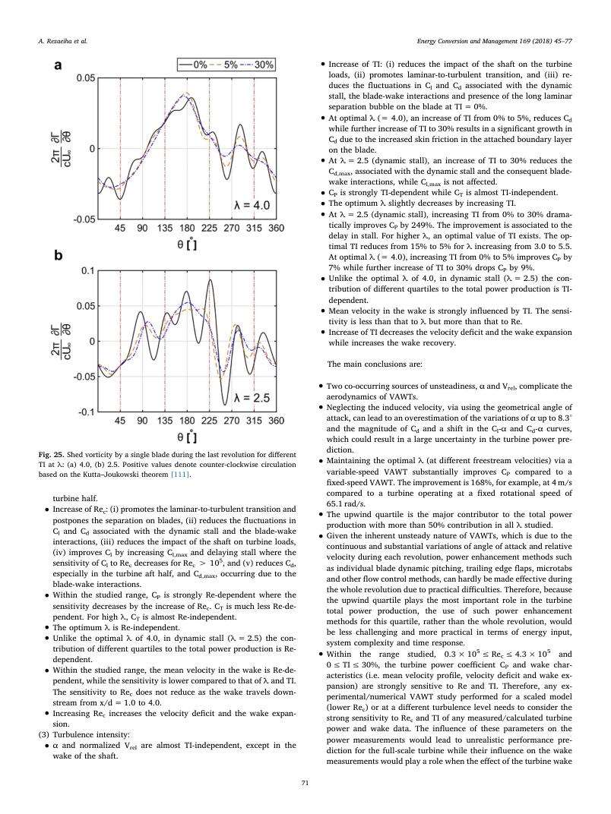

<!-- PDF page 28 -->

Fig. 26. Time-averaged (over the last turbine revolution) normalized (with freestream velocity) streamwise velocity along the lateral line −0.75 ≤y/d ≤0.75 at
several downstream locations for different TI at λ = 2.5 and 4.0.
A. Rezaeiha et al.

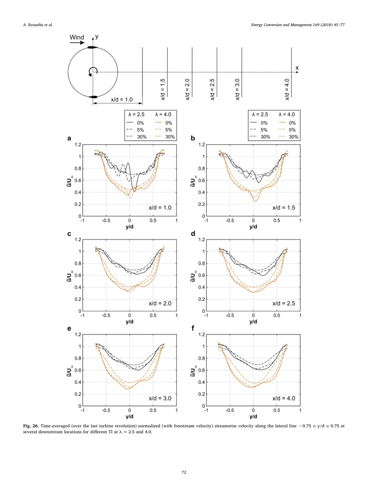

<!-- PDF page 29 -->

on the downstream turbines in an array of turbines is of interest.
The findings of the current study highlight the importance of the
impact of the operational parameters, i.e. λ, Re and TI, on aerodynamic
performance of VAWTs. In the present study, a Darrieus H-type VAWT
has been investigated. Note that the difference between the Darrieus H-
type VAWT and the other types of Darrieus VAWTs, such as the Φ-type,
is limited to the blade shape in spanwise direction: the former has
straight blades while the latter has curved ones. Therefore, neglecting
the 3D tip effects and the variations of circulation along the blade span,
the 2D cross-section of the Darrieus VAWTs have similar aerodynamic
behavior at a given geometrical and operational condition and will also
respond similarly to the variations of the operational parameters in-
vestigated in the present study. Therefore, as the focus of the present
study is on the mid-plane of the turbine, the findings on the dynamic
loads on the blades will be applicable to the other types of Darrieus
VAWTs as well. Considering the impact of operational parameters on
the turbine performance and wake, while the observed trends could be
common between the H-type configuration and the other blade con-
figurations, there could be differences in the absolute values mainly
because the H-type and also the helical blade configurations benefit
from a constant radius along the blade span, which therefore means
that the tip speed ratio and Rec remains constant along the span. This is
while the case is different for the other blade configurations, such Φ-
type, where due to the curved blade configurations each blade section
has a different radius, thus a different tip speed ratio and Rec.
Therefore, extending the current findings for these configurations needs
special attention to their spanwise variations of tip speed ratio and Rec.
Note that the evaluation is based on comprehensive analyses of a
low-solidity turbine with a symmetric airfoil. Dependency of the de-
rived conclusions on the turbine geometrical parameters are worth-
while to be investigated. In addition, the optimal value of λ, identified
in this paper, is dependent on the turbine characteristics and will be
different for a turbine of different solidity and/or airfoil shape.
Therefore, such analysis will need to be repeated for that case to
identify the optimal λ.
The range of Re investigated in this study corresponds to the regime
of interest for urban VAWTs. Extension of the conclusions for higher Re,
applicable to large-scale offshore VAWTs, might demand further re-
search.
Turbulence length scale, together with TI, is another important
parameter which could influence the boundary layer events, VAWT
performance and wake and such investigation is recommended for fu-
ture research. In addition, the use of more advanced methods, i.e. hy-
brid RANS-LES and LES, together with detailed wind tunnel experi-
ments to investigate the impact of turbulence characteristics for VAWT
is also proposed.
The conclusions can significantly support more accurate perfor-
mance
prediction
of
VAWTs
for
various
operating
conditions.
Additionally, the results recommend that the design of VAWTs needs to
steer towards optimal variable-speed operation, similar to HAWTs,
while the cost effectiveness of variable-VAWTs is proposed for future
research.
Acknowledgement
The authors would like to acknowledge support from the European
Commission's Framework Program Horizon 2020, through the Marie
Curie Innovative Training Network (ITN) AEOLUS4FUTURE - Efficient
harvesting of the wind energy (H2020-MSCA-ITN-2014: Grant agree-
ment no. 643167) and the TU1304 COST ACTION “WINERCOST”. The
authors gratefully acknowledge the partnership with ANSYS CFD. This
work
was
sponsored
by
NWO
Exacte
Wetenschappen
(Physical
Sciences) for the use of supercomputer facilities, with financial support
from the Nederlandse Organisatie voor Wetenschappelijk Onderzoek
(Netherlands Organization for Scientific Research, NWO). The 2nd
author is currently a postdoctoral fellow of the Research Foundation –
Flanders (FWO) and is grateful for its financial support (project FWO
12M5316N).
Appendix A. Method for calculation of the experienced angle of attack and relative velocity
For VAWTs, for simplicity it is customary to neglect the turbine induction in the performance analysis. This assumption provides the geometrical
values of the relative velocity Vrel,geo and the angle of attack αgeo, which are defined based on ignoring the induced velocity component of the
incoming flow. Based on Vrel,geo and αgeo, lift and drag coefficients are calculated which are different from the values actually experienced by the
blades. The geometrical relative velocity is defined as a vector sum of the freestream velocity, →
∞
U , and the blade tip speed, →× ⎯→
⎯R
Ω
using Eq. (1).
Based on this assumption, the geometrical values of the tangential and normal velocity components (Vt and Vn) are calculated using Eqs. (2) and (3).
→
= →× ⎯→
⎯
+ →
∞
V
R
U
(Ω
)
rel geo
,
(1)
=
+
∞
R
U
θ
V
Ω
cos( )
t
(2)
=
∞
U
θ
V
sin( )
n
(3)
Finally, the magnitude of the geometrical relative velocity and angle of attack are calculated using Eqs. (4) and (5):
Fig. A1. Monitor points for sampling velocity components to calculate the induced velocity.
A. Rezaeiha et al.

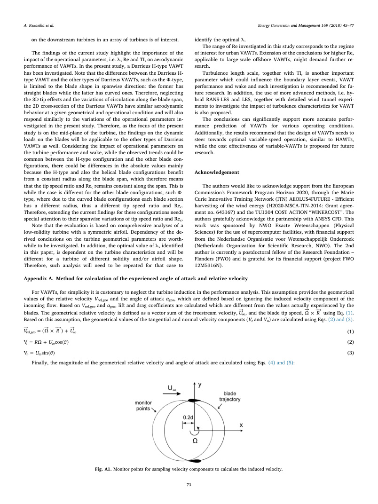

<!-- PDF page 30 -->

=
+
=
+
+
∞
U
λ
λ
θ
V
V
V
2 cos( )
1
rel geo
t
n
,
2
2
2
(4)
⎜
⎟
=
⎛
⎝
⎞
⎠
=
⎛
⎝
+
⎞
⎠
−
−
α
tan
tan
θ
λ
V
V
sinθ
cos
geo
n
t
1
1
(5)
The geometrical lift and drag coefficients are then calculated using Eqs. (6) and (7):
=
+
∞
α
α
U
d
c
C
[C sin(
)
C cos(
)] V
l
Ft
geo
Fn
geo
rel geo
2
,
2
(6)
= −
+
∞
α
α
U
d
c
C
[ C cos(
)
C sin(
)] V
d
Ft
geo
Fn
geo
rel geo
2
,
2
(7)
On the other hand, the experienced values of the relative velocity Vrel and the angle of attack α are defined based on including the induced
velocity Ui in the calculations using Eq. (8):
→= →× ⎯→
⎯
+ →+ →
∞
V
R
U
U
(Ω
)
rel
i
(8)
In practice, obtaining the value of Ui is challenging as the flow in the vicinity of the blade is highly influenced by the local bound circulation
around the blade. Following the method proposed in Ref. [23], Ui is calculated using the flow velocity components sampled at monitoring points on a
circular path with a fixed distance, i.e. 0.2d, upstream of the turbine. In the present study, the distance is found as the minimum distance where the
impact of local bound circulation around the blade is minimally affecting the incoming flow. Note that based on the turbines characteristics, the
monitoring circle could be selected closer to the turbine or might need to be shifted further upstream, to minimize the local blade effects, where the
minimum distance can be figured out by testing a few arbitrary distances in the vicinity of the minimum value obtained in the current study, e.g. 0.1d
and 0.3d. A schematic illustrating the employed monitor points is shown in Fig. A1.
The sampled instantaneous velocity components (u v, ) are then averaged over one turbine revolution (3600 time-steps) both to filter out the local
effects of blades passing and to represent the turbine time-averaged incoming flow over one turbine revolution. The time-averaged velocity com-
ponents (u, v) are then employed to calculate the Ui using Eq. (9):
⎯→
⎯
=
−
∞
U
u U v
(
, )
i
(9)
The experienced values of the tangential and the normal velocities, the relative velocity and the angle of attack can be calculated using Eqs.
(10)–(13):
=
+
+
R
u
θ
v
θ
V
Ω
cos( )
sin( )
t
(10)
=
+
u
θ
v
θ
V
sin( )
cos( )
n
(11)
=
+
V
V
V
rel
t
n
2
2
(12)
⎜
⎟
=
⎛
⎝
⎞
⎠
−
α
tan
V
V
n
t
1
(13)
The experienced lift and drag coefficients are then calculated using Eqs. (14) and (15):
=
+
∞
α
α
U
d
c
C
[C sin( )
C cos( )] V
l
Ft
Fn
rel
2
2
(14)
= −
+
∞
α
α
U
d
c
C
[ C cos( )
C sin( )] V
d
Ft
Fn
rel
2
2
(15)
Fig. A2 presents the experienced and geometrical values of angle of attack, relative velocity, lift and drag coefficients for three different tip speed
ratios. By comparing the geometrical and experienced values, several noticeable differences are observed:
• The overall variations of α are significantly different from a fully sinusoidal function which is the case for αgeo.
• At θ = 0° and 180°, due to the lateral deviation of the flow at the turbine incidence (streamtube expansion), α has a negative non-zero value. This
is while αgeo always predicts zero value at such θ.
• The impact of the shaft wake on α, which is seen as a sudden reduction in magnitude, is neglected by αgeo.
• For all cases, αgeo overestimates the amplitude of variations compared to α. This is due to ignoring the induced velocity by the turbine. In the
turbine fore half, the overestimation is approximately 2.0°, while this value goes up to 8.3° in the turbine aft half. In the turbine fore half, the
trend of αgeo is similar to that of α. However, significant differences are present in the turbine aft half.
• The geometrical and experienced values of relative velocity are also noticeably different, esp. in the turbine aft half.
• During the fore turbine half, the experienced Cl is slightly higher that the geometrical values at the same azimuthal position while the experienced
Cl - α curve is considerably shifted upward compared to the geometrical one.
• The experienced Cd is significantly lower than the geometrical one almost during the whole revolution.
• The slope of Cd curve is lower for the experienced values (Fig. A2f), while no significant difference in slope is observed for Cl (Fig. A2e).
• Cd,max is significantly overestimated by geometrical values while Cl,max is slightly underestimated. Both values occur at higher α compared to the
experienced values.
• The magnitude of asymmetry (hysteresis) in dynamic load variations (the absolute difference between the higher and lower values of Cl and Cd at
selfsame α) is almost the same for geometrical and experienced polars.
A. Rezaeiha et al.

<!-- PDF page 31 -->

Therefore, although αgeo can be employed to provide a first approximation of Δα with respect to the tip speed ratio for VAWTs, special attention
should be paid to the non-negligible differences between the geometrical and experienced angle of attack, relative velocity, lift and drag coefficients.
References
[1] Wang Y, Sun X, Dong X, Zhu B, Huang D, Zheng Z. Numerical investigation on
aerodynamic performance of a novel vertical axis wind turbine with adaptive
blades. Energy Convers Manage 2016;108:275–86.
[2] Tahani M, Babayan N, Mehrnia S, Shadmehri M. A novel heuristic method for
optimization of straight blade vertical axis wind turbine. Energy Convers Manage
2016;127:461–76.
[3] Shahizare B, Nik-Ghazali N, Chong WT, Tabatabaeikia S, Izadyar N, Esmaeilzadeh
A. Novel investigation of the different omni-direction-guide-vane angles effects on
the urban vertical axis wind turbine output power via three-dimensional numerical
simulation. Energy Convers Manage 2016;117:206–17.
[4] Scungio M, Arpino F, Focanti V, Profili M, Rotondi M. Wind tunnel testing of scaled
models of a newly developed Darrieus-style vertical axis wind turbine with aux-
iliary straight blades. Energy Convers Manage 2016;130:60–70.
[5] Bianchini A, Balduzzi F, Ferrara G, Ferrari L. Virtual incidence effect on rotating
airfoils in Darrieus wind turbines. Energy Convers Manage 2016;111:329–38.
[6] Bianchini A, Balduzzi F, Bachant P, Ferrara G, Ferrari L. Effectiveness of two-di-
mensional CFD simulations for Darrieus VAWTs: a combined numerical and ex-
perimental assessment. Energy Convers Manage 2017;136:318–28.
[7] Zanforlin S. Advantages of vertical axis tidal turbines set in close proximity: A
comparative CFD investigation in the English Channel. Ocean Eng
2018;156:358–72.
Fig. A2. Experienced (exp.) and geometrical (geo.) values of angle of attack, relative velocity, lift and drag coefficients during the last turbine revolution for different
tip speed ratios. αss denotes the inviscid static stall angle from Xfoil [106]. (Rec ≈2.0 × 105).
A. Rezaeiha et al.

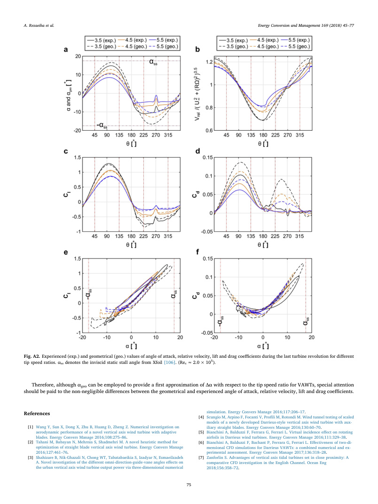

<!-- PDF page 32 -->

[8] Borg M, Shires A, Collu M. Offshore floating vertical axis wind turbines, dynamics
modelling state of the art. Part I: aerodynamics. Renew Sustain Energy Rev
2014;39:1214–25.
[9] Paulsen US, Madsen HA, Kragh KA, Nielsen PH, Baran I, Hattel J, et al. DeepWind-
from idea to 5 MW concept. Energy Procedia 2014;53:23–33.
[10] Bedon G, Schmidt Paulsen U, Aagaard Madsen H, Belloni F, Raciti Castelli M,
Benini E. Computational assessment of the DeepWind aerodynamic performance
with different blade and airfoil configurations. Appl Energy 2017;185(2):1100–8.
[11] van HooffT, Blocken B, Aanen L, Bronsema B. A venturi-shaped roof for wind-
induced natural ventilation of buildings: wind tunnel and CFD evaluation of dif-
ferent design configurations. Build Environ 2011;46(9):1797–807.
[12] Tummala A, Velamati RK, Sinha DK, Indraja V, Krishna VH. A review on small
scale wind turbines. Renew Sustain Energy Rev 2016;56:1351–71.
[13] Toja-Silva F, Colmenar-Santos A, Castro-Gil M. Urban wind energy exploitation
systems: behaviour under multidirectional flow conditions—opportunities and
challenges. Renew Sustain Energy Rev 2013;24:364–78.
[14] Aslam Bhutta MM, Hayat N, Farooq AU, Ali Z, Jamil SR, Hussain Z. Vertical axis
wind turbine – a review of various configurations and design techniques. Renew
Sustain Energy Rev 2012;16(4):1926–39.
[15] Yang A-S, Su Y-M, Wen C-Y, Juan Y-H, Wang W-S, Cheng C-H. Estimation of wind
power generation in dense urban area. Appl Energy 2016;171:213–30.
[16] Blocken B, Moonen P, Stathopoulos T, Carmeliet J. Numerical study on the ex-
istence of the Venturi effect in passages between perpendicular buildings. J Eng
Mech 2008;134(12):1021–8.
[17] Park JH, Chung MH, Park JC. Development of a small wind power system with an
integrated exhaust air duct in high-rise residential buildings. Energy Build
2016;122:202–10.
[18] Antoniou N, Montazeri H, Wigo H, Neophytou MKA, Blocken B, Sandberg M. CFD
and wind-tunnel analysis of outdoor ventilation in a real compact heterogeneous
urban area: evaluation using “air delay”. Build Environ 2017;126:355–72.
[19] Rezaeian M, Montazeri H, and Loonen R, “Science foresight using life-cycle ana-
lysis, text mining and clustering: a case study on natural ventilation,”
Technological Forecasting & Social Change, vol. 118 (C), pp. 270–280, 2017.
[20] Montazeri H, Montazeri F. CFD simulation of cross-ventilation in buildings using
rooftop wind-catchers: impact of outlet openings. Renewable Energy
2018;118:502–20.
[21] Montazeri H, Montazeri F, Azizian R, Mostafavi S. Two-sided wind catcher per-
formance evaluation using experimental, numerical and analytical modeling.
Renewable Energy 2010;35(7):1424–35.
[22] Montazeri H. Experimental and numerical study on natural ventilation perfor-
mance of various multi-opening wind catchers. Build Environ 2011;46(2):370–8.
[23] Rezaeiha A, Kalkman I, Blocken B. Effect of pitch angle on power performance and
aerodynamics of a vertical axis wind turbine. Appl Energy 2017;197:132–50.
[24] Simão Ferreira C, Scheurich F. Demonstrating that power and instantaneous loads
are decoupled in a vertical-axis wind turbine. Wind Energy 2014;17(3):385–96.
[25] Chen W-H, Chen C-Y, Huang C-Y, Hwang C-J. Power output analysis and opti-
mization of two straight-bladed vertical-axis wind turbines. Appl Energy
2017;185:223–32.
[26] Borg M, Collu M. Frequency-domain characteristics of aerodynamic loads of off-
shore floating vertical axis wind turbines. Appl Energy 2015;155:629–36.
[27] Carbó Molina A, Bartoli G, and De Troyer T, “Generation of uniform turbulence
profiles in the wind tunnel for urban VAWT testing,” in Wind Energy Exploitation
in Urban Environment: TUrbWind 2017 Colloquium, ed: Springer International
Publishing, 2018, pp. 27–43.
[28] Carbó Molina A, Bartoli G, de Troyer T. Wind tunnel testing of small vertical-axis
wind turbines in turbulent flows. Procedia Eng 2017;199:3176–81.
[29] Eriksson S, BernhoffH, Leijon M. Evaluation of different turbine concepts for wind
power. Renew Sustain Energy Rev 2008;12(5):1419–34.
[30] Chong W-T, Muzammil WK, Wong K-H, Wang C-T, Gwani M, Chu Y-J, et al. Cross
axis wind turbine: pushing the limit of wind turbine technology with com-
plementary design. Appl Energy 2017;207:78–95.
[31] Govind B. Increasing the operational capability of a horizontal axis wind turbine
by its integration with a vertical axis wind turbine. Appl Energy 2017;199:479–94.
[32] Rezaeiha A, Pereira R, and Kotsonis M, “Fluctuations of angle of attack and lift
coefficient and the resultant fatigue loads for a large horizontal axis wind turbine,”
Renewable Energy, vol. 114 (B), pp. 904–916, 2017.
[33] Joselin Herbert GM, Iniyan S, Sreevalsan E, Rajapandian S. A review of wind en-
ergy technologies. Renew Sustain Energy Rev 2007;11(6):1117–45.
[34] Araya DB, Dabiri JO. Vertical axis wind turbine in a falling soap film. Phys Fluids
2015;27(9):091108.
[35] Kinzel M, Araya DB, Dabiri JO. Turbulence in vertical axis wind turbine canopies.
Phys Fluids 2015;27(11):115102.
[36] Brownstein ID, Kinzel M, Dabiri JO. Performance enhancement of downstream
vertical-axis wind turbines. J Renewable Sustainable Energy 2016;8(5):053306.
[37] Ryan KJ, Coletti F, Elkins CJ, Dabiri JO, and Eaton JK, “Three-dimensional flow
field around and downstream of a subscale model rotating vertical axis wind
turbine,” Experiments in Fluids, vol. 57 (3), 2016.
[38] Abkar M, Dabiri JO. Self-similarity and flow characteristics of vertical-axis wind
turbine wakes: an LES study. J Turbul 2017;18(4):373–89.
[39] Araya DB, Colonius T, Dabiri JO. Transition to bluff-body dynamics in the wake of
vertical-axis wind turbines. J Fluid Mech 2017;813:346–81.
[40] Pope K, Dincer I, Naterer GF. Energy and exergy efficiency comparison of hor-
izontal and vertical axis wind turbines. Renewable Energy 2010;35(9):2102–13.
[41] Simão Ferreira C, van Zuijlen A, Bijl H, van Bussel G, van Kuik G. Simulating
dynamic stall in a two-dimensional vertical-axis wind turbine: verification and
validation with particle image velocimetry data. Wind Energy 2010;13(1):1–17.
[42] Simão Ferreira C, van Kuik G, van Bussel G, Scarano F. Visualization by PIV of
dynamic stall on a vertical axis wind turbine. Exp Fluids 2008;46(1):97–108.
[43] Amet E, Maı̂tre T, Pellone C, and Achard JL, “2D numerical simulations of blade-
vortex interaction in a Darrieus turbine,” Journal of Fluids Engineering, vol. 131
(11), pp. 111103(1–15), 2009.
[44] Bianchini A, Balduzzi F, Rainbird JM, Peiro J, Graham JMR, Ferrara G, and Ferrari
L, “An experimental and numerical assessment of airfoil polars for use in Darrieus
wind turbines—part I: flow curvature effects,” Journal of Engineering for Gas
Turbines and Power, vol. 138 (032602), 2015.
[45] Tsai H-C, Colonius T. Coriolis effect on dynamic stall in a vertical axis wind tur-
bine. AIAA Journal 2016;54(1):216–26.
[46] Delafin PL, Nishino T, Wang L, Kolios A. Effect of the number of blades and solidity
on the performance of a vertical axis wind turbine. J Phys Conf Ser
2016;753:022033.
[47] Cheng Z, Madsen HA, Gao Z, Moan T. Effect of the number of blades on the dy-
namics of floating straight-bladed vertical axis wind turbines. Renewable Energy
2017;101:1285–98.
[48] Li Qa, Maeda T, Kamada Y, Murata J, Furukawa K, and Yamamoto M, “Effect of
number of blades on aerodynamic forces on a straight-bladed Vertical Axis Wind
Turbine,” Energy, vol. 90, pp. 784-795, 2015.
[49] Li Q, Maeda T, Kamada Y, Shimizu K, Ogasawara T, Nakai A, et al. Effect of rotor
aspect ratio and solidity on a straight-bladed vertical axis wind turbine in three-
dimensional analysis by the panel method. Energy 2017;121:1–9.
[50] Li Q, Maeda T, Kamada Y, Murata J, Shimizu K, Ogasawara T, et al. Effect of
solidity on aerodynamic forces around straight-bladed vertical axis wind turbine
by wind tunnel experiments (depending on number of blades). Renewable Energy
2016;96:928–39.
[51] Eboibi O, Danao LAM, Howell RJ. Experimental investigation of the influence of
solidity on the performance and flow field aerodynamics of vertical axis wind
turbines at low Reynolds numbers. Renewable Energy 2016;92:474–83.
[52] Simão Ferreira C, Geurts B. Aerofoil optimization for vertical-axis wind turbines.
Wind Energy 2014;18(8):1371–85.
[53] Bedon G, De Betta S, Benini E. Performance-optimized airfoil for Darrieus wind
turbines. Renewable Energy 2016;94:328–40.
[54] Sengupta AR, Biswas A, Gupta R. Studies of some high solidity symmetrical and
unsymmetrical blade H-Darrieus rotors with respect to starting characteristics,
dynamic performances and flow physics in low wind streams. Renewable Energy
2016;93:536–47.
[55] Rezaeiha A, Kalkman I, Montazeri H, and Blocken B, “Effect of the shaft on the
aerodynamic performance of urban vertical axis wind turbines,” Energy
Conversion and Management, vol. 149 (C), pp. 616–630, 2017.
[56] Alaimo A, Esposito A, Messineo A, Orlando C, Tumino D. 3D CFD analysis of a
vertical axis wind turbine. Energies 2015;8(4):3013–33.
[57] Parker CM and Leftwich MC, “The effect of tip speed ratio on a vertical axis wind
turbine at high Reynolds numbers,” Experiments in Fluids, vol. 57 (5), 2016.
[58] Möllerström E, Ottermo F, Goude A, Eriksson S, Hylander J, BernhoffH.
Turbulence influence on wind energy extraction for a medium size vertical axis
wind turbine. Wind Energy 2016;19:1963–73.
[59] Armstrong S, Fiedler A, Tullis S. Flow separation on a high Reynolds number, high
solidity vertical axis wind turbine with straight and canted blades and canted
blades with fences. Renewable Energy 2012;41:13–22.
[60] Paraschivoiu I, Desy P. Aerodynamics of small-scale vertical-axis wind turbines. J
Propul Power 1986;2(3):282–8.
[61] Araya DB and Dabiri JO, “A comparison of wake measurements in motor-driven
and flow-driven turbine experiments,” Experiments in Fluids, vol. 56 (7), 2015.
[62] Blackwell B, Sheldahl R, Feltz L. “Wind tunnel performance data for the Darrieus
wind turbine with NACA0012 blades; SAND76-0130,” Sandia National
Laboratories: Albuquerque. USA: NM; 1976.
[63] Polagye BL, Cavagnaro RJ, and Niblick AL, “Micropower from tidal turbines,” in
Proceedings of the ASME Fluids Engineering Division Summer Meeting, Incline
Village, NV, USA, 2013.
[64] Bravo R, Tullis S, and Ziada S, “Performance testing of a small vertical-axis wind
turbine,” in Proceedings of the 21st Canadian Congress of Applied Mechanics
CANCAM, Toronto, ON, Canada, 2007.
[65] Bachant P and Wosnik M, “Effects of Reynolds number on the energy conversion
and near-wake dynamics of a high solidity vertical-axis cross-flow turbine,”
Energies, vol. 9 (73), 2016.
[66] Siddiqui MS, Rasheed A, Kvamsdal T, Tabib M. Effect of turbulence intensity on
the performance of an offshore vertical axis wind turbine. Energy Procedia
2015;80:312–20.
[67] Möllerström E, Eriksson S, Goude A, Ottermo F, and Hylander J. Turbulence in-
fluence on optimum tip speed ratio for a 200 kW vertical axis wind turbine.
Journal of Physics: Conference Series, vol. 753 (032048), 2016.
[68] Ahmadi-Baloutaki M, Ting DS-K, Carriveau R. The role of free-stream turbulence
on flow evolution in the wake of a VAWT blade. Wind Eng 2013;37(4):401–20.
[69] Kim D-H, Chang J-W. Low-Reynolds-number effect on the aerodynamic char-
acteristics of a pitching NACA0012 airfoil. Aerosp Sci Technol 2014;32(1):162–8.
[70] Wang S, Zhou Y, Alam MM, Yang H. Turbulent intensity and Reynolds number
effects on an airfoil at low Reynolds numbers. Phys Fluids 2014;26(11):115107.
[71] Kim D-H, Chang J-W, Chung J. Low-Reynolds-number effect on aerodynamic
characteristics of a NACA 0012 airfoil. J Aircraft 2011;48(4):1212–5.
[72] Gad-el-Hak M, Bandyopadhyay PR. Reynolds number effects in wall-bounded
turbulent flows. Appl Mech Rev 1994;47(8):307–65.
[73] Carmichael BH. Low Reynolds number airfoil survey: vol. 1. NASA-CR-165803,
USA, 1981.
[74] Lissaman PBS. Low-Reynolds-number airfoils. Annu Rev Fluid Mech
A. Rezaeiha et al.

<!-- PDF page 33 -->

1983;15:223–39.
[75] Jacobs EN, Sherman A. Airfoil section characteristics as affected by variation of the
Reynolds number, Report No. 586. Langley Field, VA, USA: National Advisory
Committee for Aeronautics; 1937.
[76] Zanforlin S, Deluca S. Effects of the Reynolds number and the tip losses on the
optimal aspect ratio of straight-bladed Vertical Axis Wind Turbines. Energy
2018;148:179–95.
[77] Fransson JHM, Matsubara M, Alfredsson PH. Transition induced by free-stream
turbulence. J Fluid Mech 2005;527:1–25.
[78] Kosasih B, Saleh Hudin H. Influence of inflow turbulence intensity on the perfor-
mance of bare and diffuser-augmented micro wind turbine model. Renewable
Energy 2016;87:154–67.
[79] Sunderland K, Woolmington T, Blackledge J, Conlon M. Small wind turbines in
turbulent (urban) environments: a consideration of normal and Weibull distribu-
tions for power prediction. J Wind Eng Ind Aerodyn 2013;121:70–81.
[80] Brandt L, Schlatter P, Henningson DS. Transition in boundary layers subject to
free-stream turbulence. J Fluid Mech 2004;517:167–98.
[81] Goldstein ME, “Effect of free-stream turbulence on boundary layer transition,”
Philos Trans A Math Phys Eng Sci, vol. 372 (2020), Jul 28 2014.
[82] Tescione G, Ragni D, He C, Simão Ferreira C, van Bussel GJW. Near wake flow
analysis of a vertical axis wind turbine by stereoscopic particle image velocimetry.
Renewable Energy 2014;70:47–61.
[83] Blocken B, Carmeliet J, Stathopoulos T. CFD evaluation of wind speed conditions
in passages between parallel buildings—effect of wall-function roughness mod-
ifications for the atmospheric boundary layer flow. J Wind Eng Ind Aerodyn
2007;95(9–11):941–62.
[84] Blocken B, Stathopoulos T, Carmeliet J. CFD simulation of the atmospheric
boundary layer: wall function problems. Atmos Environ 2007;41(2):238–52.
[85] Blocken B. 50 years of computational wind engineering: past, present and future. J
Wind Eng Ind Aerodyn 2014;129:69–102.
[86] Blocken B. Computational Fluid Dynamics for urban physics: Importance, scales,
possibilities, limitations and ten tips and tricks towards accurate and reliable si-
mulations. Build Environ 2015;91:219–45.
[87] Rezaeiha A, Kalkman I, Blocken B. CFD simulation of a vertical axis wind turbine
operating at a moderate tip speed ratio: guidelines for minimum domain size and
azimuthal increment. Renewable Energy 2017;107:373–85.
[88] Andersen SJ, Sorensen JN, and Mikkelsen RF. Turbulence and entrainment length
scales in large wind farms. Philos Trans A Math Phys Eng Sci, vol. 375 (2091), Apr
13 2017.
[89] Hand B, Cashman A. Conceptual design of a large-scale floating offshore vertical
axis wind turbine. Energy Procedia 2017;142:83–8.
[90] Rezaeiha A, Montazeri H, and Blocken B. Towards accurate CFD simulations of
vertical axis wind turbines at different tip speed ratios and solidities: guidelines for
azimuthal increment, domain size and convergence. Energy Conversion and
Management, vol. 156 (C), pp. 301–316, 2018.
[91] Zhang W, Cheng W, Gao W, Qamar A, Samtaney R. Geometrical effects on the
airfoil flow separation and transition. Comput Fluids 2015;116:60–73.
[92] You D, Ham F, Moin P. Discrete conservation principles in large-eddy simulation
with application to separation control over an airfoil. Phys Fluids
2008;20(10):101515.
[93] Simão Ferreira C. The near wake of the VAWT: 2D and 3D views of the VAWT
aerodynamics. TU Delft: PhD; 2009.
[94] Menter FR, Langtry RB, Likki SR, Suzen YB, Huang PG, Völker S. A correlation-
based transition model using local variables—part I: model formulation. J
Turbomach 2006;128(3):413–22.
[95] Menter FR, Kuntz M, and Langtry R. Ten years of industrial experience with the
SST turbulence model. in Turbulence, Heat and Mass Transfer. vol. 4, ed, 2003.
[96] Menter FR. Two-equation eddy-viscosity turbulence models for engineering ap-
plications. AIAA Journal 1994;32(8):1598–605.
[97] Suzen YB and Huang PG. Modeling of flow transition using an intermittency
transport equation. NASA/CR-1999-209313, 1999.
[98] Langtry RB, Menter FR, Likki SR, Suzen YB, Huang PG, Völker S. A correlation-
based transition model using local variables—part II: test cases and industrial
applications. J Turbomach 2006;128(3):423–34.
[99] Suzen YB, Huang PG, Hultgren LS, Ashpis DE. Predictions of separated and tran-
sitional boundary layers under low-pressure turbine airfoil conditions using an
intermittency transport equation. J Turbomach 2003;125(3):455.
[100] Menter FR, Langtry R, Völker S. Transition modelling for general purpose CFD
codes. Flow, Turbulence Combustion 2006;77(1–4):277–303.
[101] Rezaeiha A, Montazeri H, and Blocken B. CFD simulations of vertical axis wind
turbines: guidelines for the choice of turbulence model. In preparation, 2018.
[102] Roache PJ. Quantification of uncertainty in computational fluid dynamics. Annu
Rev Fluid Mech 1997;29:123–60.
[103] Gad-el-Hak M, Bushnell DM. Separation control: review. J Fluids Eng
1991;113(1):5–30.
[104] Castelli MR, Englaro A, Benini E. The Darrieus wind turbine: proposal for a new
performance prediction model based on CFD. Energy 2011;36(8):4919–34.
[105] Rezaeiha A, Montazeri H, and Blocken B. Impact of geometrical parameters on
aerodynamic performance of vertical axis wind turbines. Submitted, 2018.
[106] Drela M, “XFOIL: an analysis and design system for low Reynolds number airfoils,”
in Low Reynolds Number Aerodynamics: Vol. 54 of the series 'Lecture Notes in
Engineering', ed: Springer, 1989, pp. 1–12.
[107] Lee T, Gerontakos P. Investigation of flow over an oscillating airfoil. J Fluid Mech
2004;512:313–41.
[108] O'Meara M, Mueller TJ. Laminar separation bubble characteristics on an airfoil at
low Reynolds numbers. AIAA J 1987;25(8):1033–41.
[109] Nati A, de Kat R, Scarano F, and van Oudheusden BW. Dynamic pitching effect on
a laminar separation bubble. Experiments in Fluids, vol. 56 (9), 2015.
[110] Bachant P, Wosnik M. Characterising the near-wake of a cross-flow turbine. J
Turbul 2015;16(4):392–410.
[111] Anderson JD. Fundamental of aerodynamics. Boston: McGraw-Hill; 2001.
[112] Vermeer L, Sørensen JN, Crespo A. Wind turbine wake aerodynamics. Prog Aerosp
Sci 2003;39:467–510.
[113] Pitteloud JD and Gsänger S. Small wind world report summary. World Wind
Energy Association (WWEA), 2017.
[114] Islam MR, Mekhilef S, Saidur R. Progress and recent trends of wind energy tech-
nology. Renew Sustain Energy Rev 2013;21:456–68.
[115] Singleton JD, Yeager Jr. WT. Important scaling parameters for testing model-scale
helicopter rotors. J Aircraft 2000;37:396–402.
[116] Bousman WG, “Evaluation of airfoil dynamic stall characteristics for maneuver-
ability,” in Proceedings of the 26th European Rotorcraft Forum, The Hague, The
Netherlands, 26–29 Sep. 2000.
[117] Kotsonis M, Pul R, and Veldhuis L. Influence of circulation on a rounded-trailing-
edge airfoil using plasma actuators. Experiments in Fluids, vol. 55 (7), 2014.
[118] Yoon HS, Hill DF, Balachandar S, Adrian RJ, Ha MY. Reynolds number scaling of
flow in a Rushton turbine stirred tank. Part I—Mean flow, circular jet and tip
vortex scaling. Chem Eng Sci 2005;60(12):3169–83.
[119] Chamorro LP, Arndt REA, Sotiropoulos F. Reynolds number dependence of tur-
bulence statistics in the wake of wind turbines. Wind Energy 2012;15(5):733–42.
[120] McTavish S, Feszty D, Nitzsche F. Evaluating Reynolds number effects in small-
scale wind turbine experiments. J Wind Eng Ind Aerodyn 2013;120:81–90.
[121] Bearman PW, Morel T. Effect of free stream turbulence on the flow around bluff
bodies. Prog Aerosp Sci 1983;20:97–123.
[122] Simoni D, Lengani D, Ubaldi M, Zunino P, and Dellacasagrande M,. Inspection of
the dynamic properties of laminar separation bubbles: free-stream turbulence in-
tensity effects for different Reynolds numbers. Experiments in Fluids, vol. 58 (6),
2017.
[123] Jin Y, Liu H, Aggarwal R, Singh A, Chamorro L. Effects of freestream turbulence in
a model wind turbine wake. Energies 2016;9(10):830.
A. Rezaeiha et al.
