<!-- PDF page 1 -->

Contents lists available at ScienceDirect
Energy Conversion and Management
journal homepage: www.elsevier.com/locate/enconman
Towards accurate CFD simulations of vertical axis wind turbines at different
tip speed ratios and solidities: Guidelines for azimuthal increment, domain
size and convergence
Abdolrahim Rezaeihaa,⁎, Hamid Montazeria,b, Bert Blockena,b
a Building Physics and Services, Department of the Built Environment, Eindhoven University of Technology, P.O. Box 513, 5600 MB Eindhoven, The Netherlands;
b Building Physics Section, Department of Civil Engineering, KU Leuven, Kasteelpark Arenberg 40 – Bus 2447, 3001 Leuven, Belgium
A R T I C L E I N F O
Keywords:
Wind energy
Vertical axis wind turbine (VAWT)
CFD
URANS
Guideline
Aerodynamic performance
A B S T R A C T
The accuracy of CFD simulations of vertical axis wind turbines (VAWTs) is known to be significantly associated
with the computational parameters, such as azimuthal increment, domain size and number of turbine revolu-
tions before reaching a statistically steady state condition (convergence). A detailed review of the literature,
however, indicates that there is a lack of extensive parametric studies investigating the impact of the compu-
tational parameters. The current study, therefore, intends to systematically investigate the impact of these
parameters, on the simulation results to guide the execution of accurate CFD simulations of VAWTs at different
tip speed ratios (λ) and solidities (σ). The evaluation is based on 110 CFD simulations validated with wind-
tunnel measurements for two VAWTs. Instantaneous moment coefficient, Cm, and power coefficient, CP, are
studied for each case using unsteady Reynolds-averaged Navier-Stokes (URANS) simulations with the 4-equation
transition SST turbulence model. The results show that the azimuthal increment dθ is largely dependent on tip
speed ratio. For moderate to high λ, the minimum requirement for dθ is 0.5° while this decreases to 0.1° at low to
moderate λ. The need for finer time steps is associated to the flow complexities related to dynamic stall on
turbine blades and blade-wake interactions at low λ. In addition, the minimum distance from the turbine center
to the domain inlet and outlet is 15 and 10 times the turbine diameter, respectively. It is also shown that 20–30
turbine revolutions are required to ensure statistically converged solutions. The current findings can serve as
guidelines towards accurate and reliable CFD simulations of VAWTs at different tip speed ratios and solidities.
1. Introduction
Vertical-axis wind turbines (VAWTs) have recently received great
interest for wind energy harvesting both for off-shore applications [1,2]
and in the built environment [3–5]. VAWTs have several advantages
compared to horizontal-axis wind turbines (HAWTs) such as omni-di-
rectional
capability,
low
manufacturing/installation/maintenance
costs, robustness, scalability and low noise [6,7]. A detailed evaluation
of the aerodynamic performance of VAWTs is a difficult task as the flow
in such systems is complicated by phenomena such as dynamic stall
[8,9], blade-wake interactions [10] and flow curvature effects [11,12].
Different experimental and numerical approaches have been employed
to investigate this complex flow to evaluate the aerodynamic perfor-
mance of VAWTs. Computational Fluid Dynamics (CFD) is a very useful
tool for such evaluations, and has thus been widely used to investigate
the aerodynamic performance of VAWTs [6,13–21]. Previous CFD
studies included efforts to clarify the underlying physics behind the
unsteady power conversion of the turbine [22–27] and to characterize
the aerodynamic performance of VAWTs under the influence of various
geometrical [28–34] and operational [35–38] parameters. In addition,
several CFD studies focused on improving the aerodynamic perfor-
mance of VAWTs by optimizing the pitch angle [39], minimizing the
turbine power loss due to the presence of the shaft [40], employment of
guide vanes, ducts [41–43] and flow control devices [44–46].
It is widely recognized that the accuracy and reliability of CFD si-
mulations of VAWTs can be very sensitive to the computational set-
tings. For example, earlier studies have shown the significant im-
portance
of
azimuthal
increment
[6,47–51]
and
domain
size
[6,50,52,53]. However, the results of these studies are case-specific and
limited in scope where the conclusions did not (aim to) provide gen-
erally valid recommendations and guidelines to support future CFD
studies of VAWTs. Therefore, there is no consensus on the employed
computational settings for the Unsteady Reynolds-averaged Navier-
Stokes (URANS) simulations of VAWTs in the literature. This is
https://doi.org/10.1016/j.enconman.2017.11.026
Received 20 September 2017; Received in revised form 26 October 2017; Accepted 11 November 2017
⁎ Corresponding author.
E-mail address: a.rezaeiha@tue.nl (A. Rezaeiha).
Available online 01 December 2017
0196-8904/ © 2017 The Author(s). Published by Elsevier Ltd. This is an open access article under the CC BY license (http://creativecommons.org/licenses/BY/4.0/).
T

<!-- PDF page 2 -->

especially the case for azimuthal increment, domain size and con-
vergence criterion (defined as number of turbine revolutions before
reaching a statistically steady state condition), as an extensive review of
CFD studies of VAWTs indicates that:
• The range of the azimuthal increment (which is defined as the
number of degrees that a turbine rotates per time step) varies from
0.03° [6,48] to 10° [6,54,55].
• The size of the computational domains varies from very small to
very large values. For example, for the downstream length the
variation is from less than 10D (D: turbine diameter) [54–57] to
more than 50D [6,50]. For the upstream length the variation is from
less than 5D [54–57] to more than 15D [6,50].
• There is no clear consensus on the convergence criterion. Some
studies [56] considered convergence from the 4th turbine revolution
while other studies considered this from 100th turbine revolution
[6].
To the best of our knowledge, the first study to derive the minimum
requirements for computational settings of CFD simulations was per-
formed by Rezaeiha et al. [6]. The results of that study showed that:
• Employment of an azimuthal increment of 5° would lead to 17%
underprediction of turbine CP.
• Using a computational domain with 5D distance from the turbine
center to domain inlet results in more than 5% overprediction of
turbine CP.
• Sampling data starting after the 5th turbine revolution would result
in more than 20% overprediction of turbine CP.
It should be noted that the study by Rezaeiha et al. [6] was only
performed for a low solidity (σ = 0.12) and moderate tip speed ratio
(λ = 4.5). Those parameters were selected to minimize the flow com-
plexity associated to dynamic stall [8], blade-wake interactions [10]
and flow curvature effects [12]. Nevertheless, the more complex flows
for lower tip speed ratios might bring more challenges to CFD simula-
tions, which might influence the minimum requirements for computa-
tional settings and parameters. To the best of our knowledge, there is a
lack of sensitivity analysis for minimum requirements for computa-
tional settings and parameters for CFD simulations of VAWTs at dif-
ferent tip speed ratios and solidities. The current study, therefore, in-
tends to systematically investigate the impact of azimuthal increment,
domain size and convergence criterion on the simulation results at
different tip speed ratios and solidities to guide the execution of
accurate CFD simulations of VAWTs.
The outline of the paper is as follows: the geometrical and opera-
tional characteristics of the wind turbine and the computational set-
tings are described in Section 2.1–2.3. A reference case for the sensi-
tivity analysis is defined in Section 2.4. Solution verification and
validation studies are presented in Section 3. The sensitivity of the
minimum requirements for azimuthal increment, domain size (distance
from the turbine center to the domain inlet and outlet) and convergence
criterion to tip speed ratio and solidity is extensively discussed in
Sections 4–7, respectively. The discussion and the conclusions are
provided in Section 8–9.
2. Computational settings and parameters
2.1. Geometrical and operational characteristics of the reference case
An H-type vertical axis wind turbine with 2 blades of symmetric
NACA0018 airfoil section is used. The turbine has a diameter (D) of 1 m
and a shaft diameter of 0.04 m. The turbine and the shaft rotate
counter- clockwise with the same rotational speed. The freestream ve-
locity (U∞) is 9.3 m/s with a total turbulence intensity of 5%. The same
freestream velocity as in the validation study for the reference turbine
(see Section 3) is used. The turbine chord-based Reynolds number (Rec)
is 176,000. The turbine for the reference case has a solidity (σ) of 0.12,
a chord length (c) of 0.06 m and a turbine rotational speed (Ω) of
83.8 rad/s (800 rpm), leading to a tip speed ratio (λ) of 4.5. Tip speed
ratio and solidity are defined using Eqs. (1) and (2). The main geo-
metrical and operational characteristics of the turbine for the reference
case are shown in Fig. 1 and described in Table 1. Note that these
characteristics are the same as those used in the earlier study by Re-
zaeiha et al. [6] in which guidelines for the minimum domain size and
azimuthal increment for a low-solidity (σ = 0.12) VAWT operating at a
moderate tip speed ratio of 4.5 were provided.
=
∞
λ
R
U
Ω
(1)
=
σ
nc
D
(2)
2.2. Computational domain and grid
Fig. 2 illustrates the two-dimensional (2D) computational domain
employed in this study. Note that the use of a 2D domain is based on the
results of the study by Rezaeiha et al. [6,38] in which a detailed
Nomenclature
A
swept area, H D
·
[m2]
BR
blockage ratio (D W
/
) [–]
c
blade chord length [m]
Cm
instantaneous moment coefficient [–]
CP
power coefficient,
∞
P
qAU
/(
) [–]
CT
thrust coefficient, T
qA
/(
) [–]
D
turbine diameter [m]
dc
diameter of rotating core [m]
di
distance from turbine center to domain inlet [m]
do
distance from turbine center to domain outlet [m]
dt
time step [s]
dθ
azimuthal increment [°]
H
turbine height [m]
L
domain length [m]
Lw
length of the turbine wake [m]
M
moment [Nm]
n
number of blades [–]
P
turbine power [W]
q
dynamic pressure [Pa]
R
turbine radius [m]
Rec
chord-based Reynolds number,
+
∞
c
U
ν
( · (RΩ)
)/
2
2
[–]
Reθ
momentum-thickness Reynolds number [–]
T
thrust force [N]
U
velocity magnitude [m/s]
U∞
freestream velocity [m/s]
v
lateral velocity [m/s]
W
domain width [m]
γ
intermittency [–]
λ
tip speed ratio,
∞
Ω·R/U
[–]
ν
kinematic viscosity [m2/s]
θ
azimuthal angle [°]
σ
solidity, n·c/D [–]
ω
specific dissipation rate [1/s]
Ω
rotational speed [rad/s]
A. Rezaeiha et al.

<!-- PDF page 3 -->

sensitivity analysis was performed for 2D and 2.5D computational do-
mains with the reference turbine and a systematic difference in the
calculated CP values were observed. The 2D domain represents the mid-
plane of a high blade-aspect-ratio (H/c) turbine where the 3D tip effects
are minimized [26]. In this study, the blade-aspect-ratio for the re-
ference turbine is 16.67.
Earlier studies have shown that for CFD simulations of VAWTs, a
blockage ratio of less than 5% (a minimum domain width of 20D) is
required to minimize the effect of side boundaries on the results [6]. For
2D simulations, the blockage ratio is defined as D/W where D and W
correspond to the turbine diameter and domain width. As the blockage
ratio is defined based on the full diameter of the turbine, it is assumed
to be not significantly affected by the turbine tip speed ratio and so-
lidity. Therefore, in the present study, the domain width of 20D is
employed. In addition, the impact of the diameter of the rotating core
dc (the rotating region of the domain which is connected to the fixed
domain using a sliding grid interface as shown in Fig. 2) was found to
be very negligible (< 0.04%) on the calculated turbine performance
[6]. In the present study, therefore, the diameter of the rotating core is
1.5D. The rotating core is joined to the surrounding fixed domain using
a sliding grid interface. The distance from the turbine center to domain
inlet (di) and outlet (do) for the reference case are 5D, 25D, respec-
tively. Four quartiles are defined on the plane of rotation of the blades
[58], namely windward 315° ≤θ < 45°, upwind 45° ≤θ < 135°,
leeward 135° ≤θ < 225° and downwind 225° ≤θ < 315°. Azimuthal
angle θ is defined based on the position of the top blade (which is
currently positioned the most windward) as shown in Fig. 2.
The computational grid is made up of quadrilateral cells every-
where. The maximum cell skewness in the grid is 0.55 and the
minimum orthogonal quality is 0.21. The maximum y+ values on the
surfaces of the blades and the shaft are 4 and 2, while the average y+
values are 1.37 and 1.02, respectively. The total number of cells is
approximately 400,000. Fig. 3 shows the computational grid. The
boundary conditions are uniform velocity inlet, zero gauge pressure
outlet, symmetry sides and no-slip walls. The turbulent length scale at
the domain inlet and outlet is selected based on the length scale of the
interest, i.e. turbine diameter, 1 m.
2.3. Other numerical settings
Incompressible
unsteady
Reynolds-averaged
Navier-Stokes
(URANS) simulations are performed using the commercial CFD soft-
ware package ANSYS Fluent 16.1. The computational settings are based
on an earlier solution verification and validation study [6]. Second-
order schemes are used for both temporal and spatial discretization.
The SIMPLE scheme is used for pressure-velocity coupling.
Turbulence is modeled using the 4-equation transition SST turbu-
lence model, also known as γ-θ SST turbulence model [59], which is an
improvement over the two-equation k-ω SST turbulence model [60,61].
The model solves two additional equations for intermittency γ and
momentum-thickness Reynolds number Reθ to provide a more accurate
prediction of laminar-to-turbulent transition for wall-bounded flows
where such prediction is critical to correctly model the boundary layer
development and to calculate the loads on the walls [62,63]. Further
details of the γ-θ SST turbulence model are provided by Menter et al.
Fig. 1. Schematic of the turbine for the reference case (not to scale).
Table 1
Geometrical and operational characteristics of the VAWT for the reference case.
Parameter
Value
Parameter
Value
Number of blades, n
2
Blade aspect ratio, H/c
16.67
Diameter, D [m]
1
Shaft diameter [m]
0.04
Swept area, A [m2]
1
Tip speed ratio, λ [–]
4.5
Airfoil
NACA0018
Freestream velocity, U∞[m/s]
9.3
Airfoil chord, c [m]
0.06
Freestream total turbulence intensity
5%
Solidity, σ [–]
0.12
Rotational speed, Ω [rad/s]
83.8
Fig. 2. Schematic of the computational domain: di and do, distance from the turbine
center to the inlet and outlet; dc, diameter of the rotating core; W, width of the domain.
Fig. 3. Computational grid: (a) near the rotating core; (b) near the airfoil; (c) near the airfoil trailing edge.
A. Rezaeiha et al.

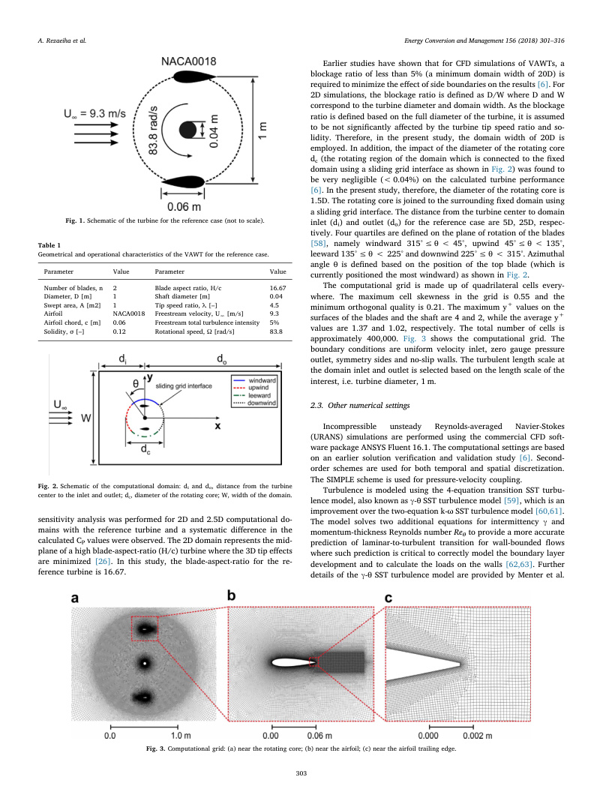

<!-- PDF page 4 -->

[59] and Langtry et al. [63]. Modeling of the laminar-to-turbulent
transition using intermittency-based models has also been proven suc-
cessful by Suzen et al. [64,65], Walters and Leylek [66], Cutrone et al.
[67] and Genç et al. [68–73] for flow on airfoils, which further provides
confidence for application of these models. Note that the ω-based tur-
bulence models benefit from a y+-insensitive formulation which means
that the model, based on the y+ of the cells near the wall, will either opt
for the low-Reynolds modeling, to resolve the buffer layer and viscous
sublayer near the wall, or for wall functions [61,74,75].
The unsteady simulations are initialized with the solutions of steady
RANS simulations and continued for 20 turbine revolutions. The azi-
muthal increment (dθ) employed for the unsteady calculations for the
reference case is 0.1°. Each time step consists of 20 iterations to have
the scaled residuals < 1 × 10−5. The instantaneous moment coefficient
is sampled at the 21st turbine revolution and the values are employed
to calculate the turbine power coefficient.
2.4. Reference case
The computational settings for the reference case is described in
Table 2. The sensitivity analysis is performed for domain size, azi-
muthal increment and convergence criterion (defined as number of
turbine revolutions before reaching a statistically steady state condi-
tion) by applying systematic changes to the reference case. In Sections
4–7, one of the computational settings is varied, while all others are
kept the same as in the reference case. In the current study, tip speed
ratio is modified by altering the turbine rotational speed and solidity is
modified by altering the blade chord length.
Because the flow velocity coming to the blade, the experienced
velocity, is the vector sum of the freestream velocity and the rota-
tional velocity, therefore, modifying the experienced velocity via
changing either of the two is expected to have similar results on the
derived minimum requirements. In the present study, the experi-
enced velocity is modified by changing the rotational velocity. Note
that changing the experienced velocity will change Rec and can also
alter λ. While the impact of λ on the derived minimum requirements
is investigated in the present study, the investigation of the depen-
dence of the derived minimum requirements on Rec is proposed for
future research.
3. Solution verification and validation
Solution verification and two sets of validation studies are per-
formed. Because these studies have been published as separate papers
[6,39], only the headlines are briefly repeated here. The verification
studies were performed for the reference case, described in Section 2.4.
The following observations were made [6]:
• A grid sensitivity analysis was performed using three grids which
were uniformly refined by √2. Grid Convergence Index (GCI) [76]
was calculated based on CP values using a safety factor Fs of 1.25.
For
the
coarse-medium
grid
pair,
GCIcoarse
and
GCIfine
was
6.1 × 10−3 and 3.5 × 10−3, which represent 1.48% and 0.85% of
the respective CP values.
• A time step sensitivity analysis was performed where an azimuthal
increment of 0.5° was found to be sufficient. Further refinement of
the time step to 0.1° had negligible (< 1%) effects on CP values.
• An iterative convergence study was performed where a statistically
steady state solution was obtained after 20–30 turbine revolutions.
The difference between CP values at 20 and 30 revolutions with that
of 100 revolutions was found to be 2.41 and 1.06%, respectively.
• A comparative study was performed where the results of the 2D
domain were compared with that of a 2.5D with span of 6 cm (1
blade chord length). The comparison showed a systematic difference
of approximately 6% in the CP values [38].
The first validation study [6], which was performed for the re-
ference case, compared the CFD results against the experimental data
by Tescione et al. [26]. The comparison of the time-averaged normal-
ized streamwise and lateral velocities in the near wake of the turbine at
different downstream locations from x/R = 2.0–3.0 showed a deviation
of 8.6–11.8% for the streamwise component and 2.3–2.5% for the lat-
eral component, respectively.
The second validation study [39], which was performed for a 3-
bladed VAWT, compared the CFD results against the experimental
measurements by Castelli et al. [77]. The comparison of turbine CP for 8
different tip speed ratios 1.44 ≤λ ≤3.29, shown in Fig. 4a, confirmed
that the CFD results were in line with the experimental data. In addi-
tion, the figure shows that substantial improvement was achieved
compared to the numerical results by Castelli et al. [77]. The good
agreement observed for different tip speed ratios shows that the simu-
lations could provide a reasonable prediction of the turbine perfor-
mance also for lower λ (≤2.33) where the occurrence of dynamic stall
results in a complex flow over the turbine blades. The occurrence of
Table 2
The computational settings for the reference case.
di
do
W
dc
Domain size (L × W)
dθ
# turbine revolutions
5D
25D
20D
1.5D
30D × 20D
0.1°
20
Fig. 4. (a) Comparison of power coefficient from the present study against experiment
[77,78] and other 2D CFD results [77]; (b) instantaneous moment coefficient during the
last turbine revolution for different tip speed ratios.
A. Rezaeiha et al.

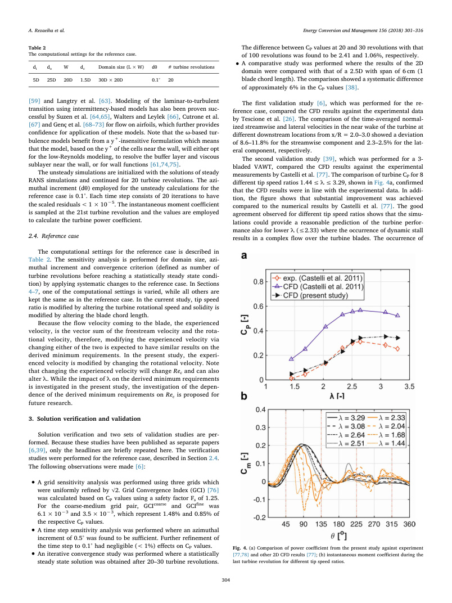

<!-- PDF page 5 -->

dynamic stall for λ ≤2.33 is confirmed from the instantaneous moment
coefficient on the blades as shown in Fig. 4b. The possible explanations
for the observed deviation between the present CFD results and the
experimental data are extensively discussed in Refs. [6,39].
4. Azimuthal increment
The minimum required time step of the URANS simulations is
driven by the time scales of the unsteady complex phenomena occur-
ring in the flow. For the case of wind turbines, it is customary to cor-
relate the time step with the turbine revolution and express it as
azimuthal increment dθ. Azimuthal increment is then defined as the
number of degrees that the turbine rotates per time step. As the com-
plexity of the flow on VAWTs varies with the operating conditions and
geometrical parameters, i.e. λ and σ, therefore, a sensitivity analysis is
performed for dθ by applying systematic changes to the reference case.
In this section, the sensitivity of the minimum requirements for the dθ
to different tip speed ratios and solidities are investigated where the
details of the computational parameters for all the cases are presented
in Table 3.
4.1. Dependency on tip speed ratio
Fig. 5 indicates the instantaneous moment coefficient Cm for the last
turbine revolution versus azimuth θ for tip speed ratios 1.5 ≤λ ≤5.5
calculated using different azimuthal increments 0.05° ≤dθ ≤1.0°. The
turbine solidity is 0.12, which is the same as the reference case. It can
be seen that for relatively high tip speed ratios of 4.5 and 5.5 the dif-
ference between the results for dθ ≤0.5° is negligible (Fig. 5a-b). The
main reason is that moderate to high tip speed ratios of 4.5 and 5.5
correspond to a regime where the flow is mostly attached and the
variations of the angle of attack on the blades during the turbine
Table 3
Description of cases for the study of azimuthal increment dθ.
di/D
do/D
Domain size (L/
D) × (W/D)
dθ [°]
λ
σ
5†
25†
30 × 20†
0.025, 0.05,
0.1†, 0.5, 1.0
1.5, 2.5, 3.0,
3.5, 4.5†, 5.5
0.06, 0.09,
0.12†, 0.18,
0.24
Note: The reference case is shown with ‘†’ sign.
Fig. 5. Instantaneous moment coefficient for the last turbine revolution for different tip speed ratios using various azimuthal increments. (σ = 0.12).
A. Rezaeiha et al.

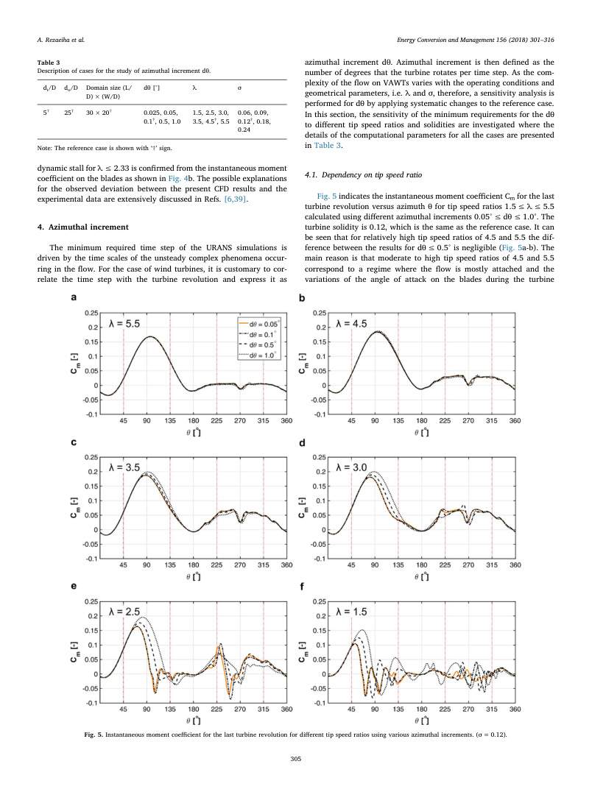

<!-- PDF page 6 -->

revolution are limited below the static stall angle. Consequently, the
flow physics are less complex compared to those at lower λ values due
to the absence of dynamic stall and blades’ wake-blade interactions. A
closer look at Fig. 5a and b indicates small deviations for dθ = 1.0° on
the downwind side around θ = 270°, corresponding to the wake of the
shaft [40]. This confirms that even at relatively high λ values, the in-
teractions between the vortices shed from the shaft and the blades
passing in the shaft wake (shaft’s wake-blade interaction) can make
predictions of the flow more challenging. In this case, finer azimuthal
increments are required.
For low to moderate tip speed ratios λ < 4.5 (Fig. 5c–f), where the
variations of the angle of attack on the blades get larger and conse-
quently dynamic stall and blade-wake interactions would occur, the
results are highly dependent on azimuthal increments. The difference is
mainly observed in two regions: upwind (45° < θ < 135°) and
downwind (225° < θ < 315°). The former is associated with the oc-
currence of the dynamic stall, which happens at such azimuthal angles
and results in a sudden drop in Cm. The latter corresponds to the in-
teractions of the vortices shed from the blades in the upwind and the
shaft with the blades passing downwind (blade-wake interactions) and
results in strong fluctuations in Cm [40,79,80]. The accurate predication
of the flow complexities associated with the two phenomena, therefore,
requires a fine azimuthal increment. The lines corresponding to
dθ = 0.1° and 0.05° almost overlap for all the cases implying that the
solution is no longer dependent on dθ.
Fig. 6a shows how dθ affects the turbine power coefficient for dif-
ferent values of λ. For λ ≥4.5, it can be seen that dθ has limited effects
on the turbine CP, though it can lead to a better prediction of the shaft’s
wake-blade interaction, as shown in Cm curves in Fig. 5a and b.
The increased deviation between the results of simulations using
fine (0.05°–0.1°) and coarse (0.5°–1.0°) dθ with reducing λ (< 4.5) is
also apparent from the predicted turbine CP shown in Fig. 6a. The re-
sults start to deviate at λ = 3.5. The deviation in terms of CP increases
as λ reduces to 2.5 and then stays almost constant when λ further re-
duces to 1.5. This suggests that at 2.5 < λ ≤3.5, the separation is still
growing on the blades by reducing λ, and there is a light stall. For
1.5 ≤λ ≤2.5, the blades have already gone through a deep stall, and
further reduction in λ from 2.5 to 1.5 might not bring more complex-
ities in the flow. This is in line with the trend observed for Cm in Fig. 5c-
f where the typical signatures of the dynamic stall (sudden drop in loads
and
follow-up
fluctuations)
are
pronounced
for
1.5 ≤λ ≤2.5
(Fig. 5e–f) but not present for 2.5 < λ ≤3.5 (Fig. 5c and d). The figure
also confirms that the predicted turbine CP using dθ of 0.1° and 0.05°
are the same for all λ values from 1.5 to 5.5. It can be concluded that for
the solidity of 0.12, dθ = 0.1° is sufficient to capture the complex
phenomena of dynamic stall on the turbine blades and further refine-
ment in time step would not have any significant effects on the results.
Fig. 6b shows the difference between the calculated CP obtained
using different values of dθ and that obtained using the finest dθ. For
λ > 3.5, it can be seen that for dθ = 0.5°, ΔCP is less than 1%.
Therefore, an azimuthal increment of 0.5° is found to be the minimum
requirement for moderate to high λ (> 3.5). The figure shows that ΔCP
drops below 1% using dθ = 0.1° for all λ values, except for λ = 1.5,
which is associated with the very low CP values at such λ. For λ = 1.5,
this is further confirmed by the fact that ΔCP calculated using dθ of
0.05° and 0.025° does not show any further reduction. Based on the
above discussions, the minimum requirements for azimuthal increment
as a function of tip speed ratio is presented in Table 4. Two operating
regimes are considered: (i) low to moderate λ and (ii) moderate to high
λ. For the given turbine with a solidity of 0.12, the former regime
corresponds
to
1.5 ≤λ ≤3.5
while
the
latter
corresponds
to
3.5 < λ ≤5.5. For low to moderate λ, the minimum requirement is
dθ = 0.1° while for moderate to high λ this value can go up to
dθ = 0.5°.
4.2. Dependency on solidity
Fig. 7 shows the instantaneous moment coefficient Cm for the last
turbine
revolution
versus
azimuth
θ
for
different
solidities
0.06 ≤σ ≤0.24 and azimuthal increments 0.05° ≤dθ ≤0.5°. Fig. 8
shows the predicted CP for different solidities calculated using different
values of dθ. The tip speed ratio is 4.5, which is the same as the re-
ference case. To reduce the computational cost, the azimuthal incre-
ment of 1.0° is no longer considered as the minimum requirement de-
rived in Section 4.1 is 0.5° and dθ = 1.0° is thus considered to be too
coarse. It can be seen that for 0.09 ≤σ ≤0.24 (Fig. 7a–d), no sig-
nificant difference is observed for different values of azimuthal incre-
ments. The Cm values in the downwind near θ ≈270° show that as
solidity decreases (airfoil chord-length decreases), the effect of the
shaft’s wake interaction with blades passing downstream becomes more
pronounced. This is due to the increase in the relative length scale of
vortices shed from the shaft to the airfoil chord. The more blade-wake
interactions result in very small deviations in Cm in the shaft wake
Fig. 6. (a) Power coefficient and (b) its relative change with respect to dθ = 0.05° for
different tip speed ratios calculated using various azimuthal increments. (σ = 0.12).
Table 4
The minimum requirement for azimuthal increment as a function of tip speed ratio.
(σ = 0.12 for all cases).
λ
Value
dθ [°]
Rec (×103)
Moderate to high
5.5
0.5
214
4.5
0.5
176
Low to moderate
3.5
0.1
139
3
0.1
121
2.5
0.1
103
1.5
0.1
69
A. Rezaeiha et al.

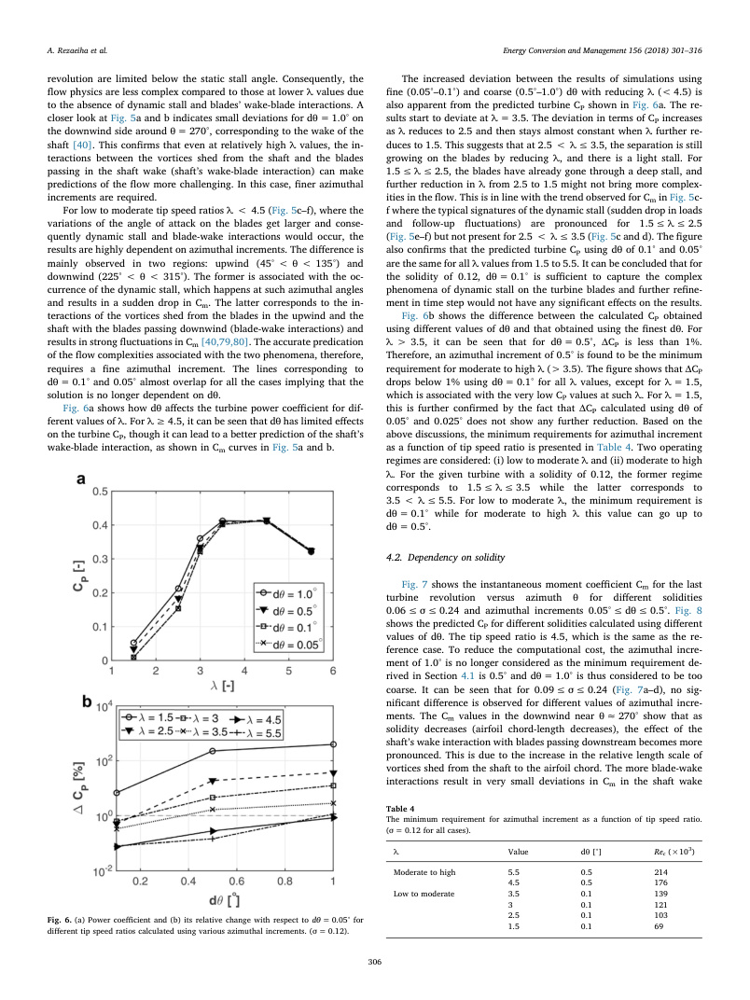

<!-- PDF page 7 -->

(θ ≈270°) between the lines corresponding to dθ = 0.5° and dθ < 0.5°
for σ = 0.09. However, this results in negligible (< 1%) difference in
calculated CP between the simulations with dθ = 0.5° and the finest dθ
(0.05°) for 0.09 ≤σ ≤0.24 (Fig. 8).
For a very low solidity of 0.06, significant differences in Cm (Fig. 7e)
and CP (Fig. 8) are observed for dθ = 0.5° and dθ < 0.5°. The differ-
ence in Cm is mainly apparent in two regions: 90° < θ < 160° and
225° < θ < 300° where the former is associated with the azimuthal
angles where dynamic stall might occur, and the latter corresponds to
the region where the consequent blade-wake interactions would happen
(see Section 4.1).
Contours of instantaneous normalized lateral velocity at θ = 100°
for turbines with solidities of 0.06 and 0.09 are presented in Fig. 9. The
promotion of trailing edge separation and increase of the laminar se-
paration bubble length due to lower Rec for σ = 0.06 is clearly ob-
served. This confirms that the observed deviation in Cm and CP for
σ = 0.06 is a result of the Reynolds number effect. Although at λ = 4.5
dynamic stall is avoided on the turbine blades (see Fig. 5b), the pre-
sence of strong Reynolds number effects could result in an earlier oc-
currence of stall on turbine blades at the same λ but lower chord-based
Reynolds number Rec [81]. The Rec could be a result of the reduction in
the airfoil chord length (which is equivalent to decrease in turbine
solidity for a given n and D), which is also the case here. At λ = 4.5, Rec
for σ = 0.12 (c = 0.06 m) is 170 × 103 while this reduces to 80 × 103
for σ = 0.06. Therefore, regardless of tip speed ratio and solidity, low
Reynolds number regime (Rec < 105) would impose the finer minimum
requirement of dθ = 0.1° to accurately predict the flow.
The impact of solidity on the minimum requirement for dθ is further
investigated at a lower tip speed ratio of 2.5. The simulations are per-
formed for dθ = 0.05° and 0.1°. The instantaneous moment coefficient
Cm for the last turbine revolution versus azimuth θ is shown in Fig. 10.
The comparison shows insignificant differences in CP (< 1%) for
dθ = 0.1°, which was shown to be the minimum requirement for dθ at
such λ, and dθ = 0.05°. This means that in case the temporal resolution
Fig. 7. Instantaneous moment coefficient for
the last turbine revolution for different so-
lidities using various azimuthal increments.
(λ = 4.5).
A. Rezaeiha et al.

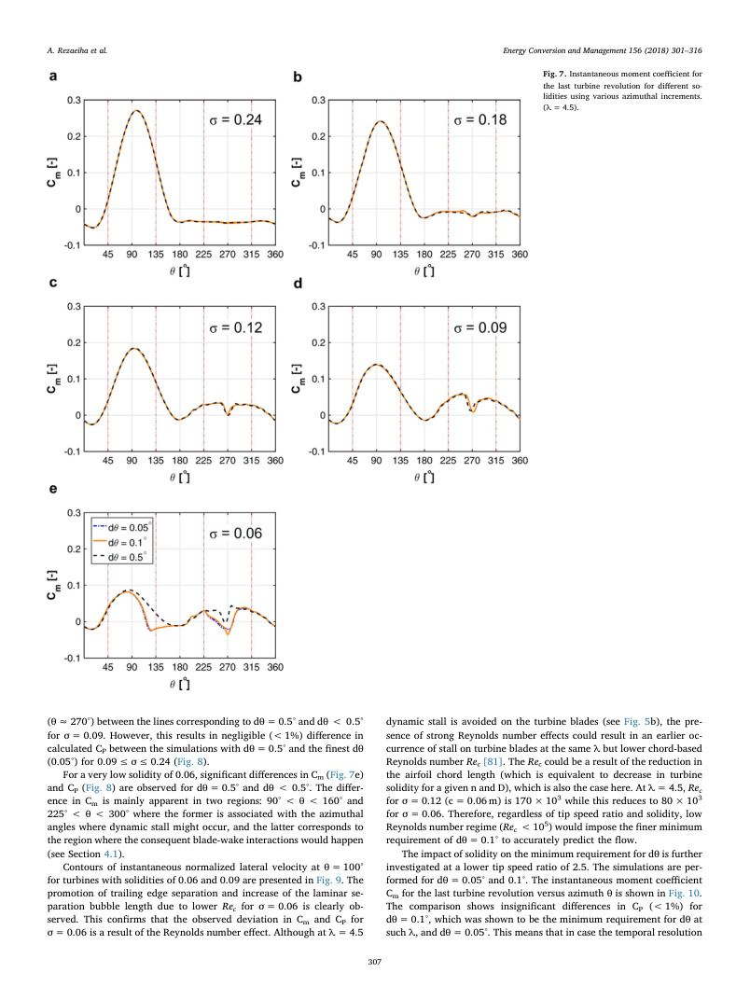

<!-- PDF page 8 -->

of the simulation is adequate to accurately predict the dynamic stall and
blade-wake interactions, the minimum requirement for dθ is in-
dependent of solidity at a given Rec. Therefore, at a given Rec, tip speed
ratio remains the dominant parameter to set the minimum requirement
for dθ while a low Rec (< 105) might need the finer dθ of 0.1°.
It should be noted that in the current study, solidity is modified by
changing the blade chord length, however, modifying the solidity by
changing the number of blades would most likely have negligible effect
on the provided minimum requirements for dθ. This is because chan-
ging the number of blades would neither affect Rec nor the variations of
angle of attack of the blades and consequently the dynamic stall be-
havior on blades while it only influences the frequency of occurrence of
the blade-wake interactions. Nevertheless, more research is required to
further investigate this.
5. Domain size: distance to the inlet
The operation of the turbine results in an induction field upstream
of the turbine where the incoming flow is decelerated to lower velo-
cities than the freestream. Rezaeiha et al. [6] showed that at λ = 4.5
and σ = 0.12 this induction field extends to more than 7.5D upstream.
Therefore, the computational domain should extend far enough up-
stream not to cut this induction field. As the turbine induction field
might change for different tip speed ratios and solidities, the de-
pendency of the minimum requirement for the distance from the tur-
bine center di to the inlet to λ and σ needs to be investigated. Note that
the minimum requirements for domain width and the diameter of the
rotating core are considered to be unaffected by the tip speed ratio and
solidity (see Section 2.2). Dependency on distance to the outlet will be
investigated in Section 6. A list of the main computational parameters
of the cases investigated in the present section is given in Table 5.
5.1. Dependency on tip speed ratio
The instantaneous moment coefficient Cm for the last turbine re-
volution versus azimuth θ for tip speed ratios 2.5, 3.5 and 4.5 and for
domains with different distance from the turbine center to the inlet
2.5D ≤di ≤15D is shown in Fig. 11. The tip speed ratios are selected as
typical moderately low and moderately high values relevant for
VAWTs. The turbine solidity is 0.12, which is the same as the reference
case. It is seen that the simulations using domains with di < 10D
overestimate Cm. This is more pronounced for higher tip speed ratios
(Fig. 11a-b), especially during the upwind quartile 45° ≤θ < 135°.
This is associated with cutting the induction field, which results in
Fig. 8. Power coefficient for different solidities using various azimuthal increments.
(λ = 4.5).
Fig. 9. Contour of instantaneous normalized lateral velocity at θ = 100° for turbines with
solidities of (a) 0.06 and (b) 0.09 at λ = 4.5. (LSB: laminar separation bubble; TE-SP:
trailing edge separation.)
Fig. 10. Instantaneous moment coefficient for the last turbine revolution using different
azimuthal increments (λ = 2.5, σ = 0.24).
Table 5
Description of cases for the study of distance to inlet.
di/D
do/D
Domain size (L/D) × (W/D)
dθ [°]
λ
σ
2.5
25
27.5 × 20
0.1
2.5, 3.5, 4.5†
0.12†, 0.24
5†
25†
30 × 20†
0.1†
2.5, 3.5, 4.5†
0.12†, 0.24
7.5
25
32.5 × 20
0.1
2.5, 3.5, 4.5†
0.12†, 0.24
10
25
35 × 20
0.1
2.5, 3.5, 4.5†
0.12†, 0.24
15
25
40 × 20
0.1
2.5, 3.5, 4.5†
0.12†, 0.24
Note: The reference case is shown with ‘†’ sign.
A. Rezaeiha et al.

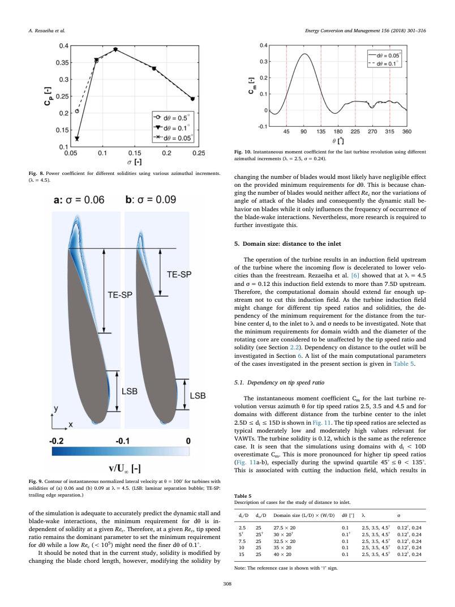

<!-- PDF page 9 -->

higher incoming velocity at the turbine incident and consequently
higher Cm on blades. For higher values of di (10D and 15D), however,
the Cm distribution is almost the same for all tip speed ratios.
Fig. 12 shows the difference between the predicted turbine CP for
different tip speed ratios calculated using domains with different di
compared to the longest domain with di = 15D. Substantial differ-
ences can be observed for domains with di < 15D. The figure illus-
trates that |ΔCP| increases when λ becomes larger. This shows that
the solution is more sensitive to the domain size at higher λ values.
The non-monotonic value of |ΔCP| occurring for λ = 2.5 using do-
mains with di of 5D and 7.5D could be attributed to some error
cancellations in Cm curve. This suggests that comparison of the in-
stantaneous values of Cm is more reliable than the averaged values of
CP for such an analysis.
The value of |ΔCP| for domains with di = 10D with respect to the
domains with di = 15D is 1.9% and 1.3% for λ = 2.5 and 4.5, respec-
tively. The above discussions show that the minimum requirement for
the distance from the turbine center to the domain inlet di in order to
have |ΔCP| < 1% is 15D regardless of the turbine tip speed ratio.
5.2. Dependency on solidity
The instantaneous moment coefficient Cm for the last turbine re-
volution versus azimuth θ for solidity of 0.12 and 0.24 calculated using
domains with different distance from the turbine center to the inlet
5D ≤di ≤15D is shown in Fig. 13. The solidities are selected as two
typical moderately low and moderately high values relevant for
VAWTs. The tip speed ratio is 4.5, which is the same as the reference
case. Note that to reduce the computational cost, the di = 2.5D is no
longer considered as the minimum distance as used in Section 5.1 as it
was already shown to be too small. It can be seen that the simulations
using domains with di < 10D overestimate Cm compared to the do-
mains with di ≥10D. This is more significant for solidity of 0.24
(Fig. 13b) and during the upwind quartile (45° ≤θ < 135°). Similarly,
the observed overestimation of Cm for domains with di < 10D is at-
tributed to cutting the turbine upstream induction field. For higher
values of di, the differences are negligible.
Fig. 11. The instantaneous moment coefficient during the last turbine revolution for tip
speed ratios of (a) 4.5, (b) 3.5 and (c) 2.5 using domains with different di/D values.
(σ = 0.12).
Fig. 12. The change in power coefficient (with respect to the domain with di = 15D) for
various tip speed ratios using domains with different di/D values. (σ = 0.12).
Fig. 13. The instantaneous moment coefficient during the last turbine revolution for
solidities of (a) 0.12 and (b) 0.24 using domains with different di values. (λ = 4.5).
A. Rezaeiha et al.

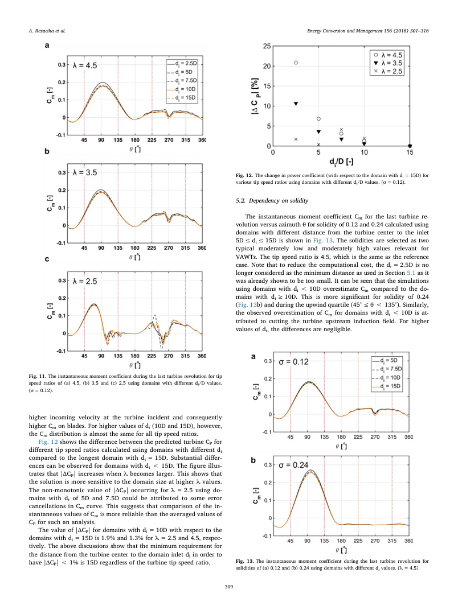

<!-- PDF page 10 -->

Fig. 14 shows the difference between the predicted turbine CP for
different solidities calculated using domains with different di values
compared to the widest domain with di = 15D. Significant differences
can be observed for domains with di ≤10D. This is in line with the
trend observed for Cm in Fig. 13. The figure illustrates that Cm varia-
tions with domain size increases when σ becomes larger. This shows
that the solution is more sensitive to the domain size at higher σ values.
The observations above conclude that the derived minimum re-
quirement for di in Section 5.1, i.e. di = 15D, is valid regardless of the
turbine solidity. This value will ensure that the predicted turbine per-
formance, at different tip speed ratios and solidities, is minimally af-
fected by di and the domain sufficiently contains the induction field
upstream of the turbine.
6. Domain size: distance to the outlet
The operation of the turbine results in the generation of a wake
downstream of the turbine where the flow has lower velocity and
higher turbulence intensity than the freestream. Rezaeiha et al. [6]
showed that at λ = 4.5 and σ = 0.12, the turbine CP is underpredicted
with more than 2% for domains with do < 10D, where do is the dis-
tance from the turbine center to the domain outlet. Therefore, the
computational domain should extend far enough downstream to allow
the turbine wake to sufficiently develop. As the turbine wake length
might alter for different tip speed ratios and solidities [82], a systematic
analysis of the minimum requirement for do for different tip speed ra-
tios and solidities is needed. A list of the main computational para-
meters of the cases investigated in the present section is given in
Table 6.
6.1. Dependency on tip speed ratio
Fig. 15 presents the instantaneous moment coefficient Cm for the
last turbine revolution versus azimuth θ for tip speed ratios of 2.5, 3.5
and 4.5 obtained using domains with different distance from the tur-
bine center to the outlet 6D ≤do ≤55D. Fig. 16 shows the difference
between the CP for different tip speed ratios calculated using domains
with different do compared to the longest domain, i.e. do = 55D. Note
that two tip speed ratios are selected as typical moderately low and
moderately high values relevant for VAWTs. The turbine solidity is
0.12, which is the same as the reference case. It can be seen that for all
λ values the sensitivity of Cm to do is considerably less compared to that
observed for di. In addition, Fig. 15 illustrates that Cm variations with
domain size increases when λ becomes larger. In the downwind quartile
(225° ≤θ < 315°), a small difference between the results of the do-
mains with do < 10D and domains with do ≥10D is observed. This
results in 2.2% deviation in the predicted Cp using domains with
do = 6D and do = 55D for λ = 4.5 (Fig. 16). Moreover, Fig. 16 also
exhibits higher |ΔCP| values when λ becomes larger. This shows that
the solution is more sensitive to the domain size at higher λ. Note that a
similar trend was also observed for di (see Section 5.1). For all the
studied tip speed ratios, the difference between the predicted turbine CP
using the domains with do ≥10D and the domain with do = 55D is less
than 1%. Therefore, do = 10D is considered as the minimum require-
ment for do regardless of the tip speed ratio.
Fig. 14. The change in power coefficient (with respect to the domain with di = 15D) for
various solidities using domains with different di. (λ = 4.5).
Table 6
Description of cases for the study of distance to outlet.
di/D
do/D
Domain size (L/D) × (W/D)
dθ [°]
λ
σ
5
6
11 × 20
0.1
2.5, 3.5, 4.5†
0.12†, 0.24
5
10
15 × 20
0.1
2.5, 3.5, 4.5†
0.12†, 0.24
5
15
20 × 20
0.1
2.5, 3.5, 4.5†
0.12†, 0.24
5†
25†
30 × 20†
0.1†
2.5, 3.5, 4.5†
0.12†, 0.24
5
55
60 × 20
0.1
2.5, 3.5, 4.5†
0.12†, 0.24
Note: The reference case is shown with ‘†’ sign.
Fig. 15. The instantaneous moment coefficient during the last turbine revolution for tip
speed ratios of (a) 4.5, (b) 3.5 and (c) 2.5 using domains with different do/D values.
(σ = 0.12).
A. Rezaeiha et al.

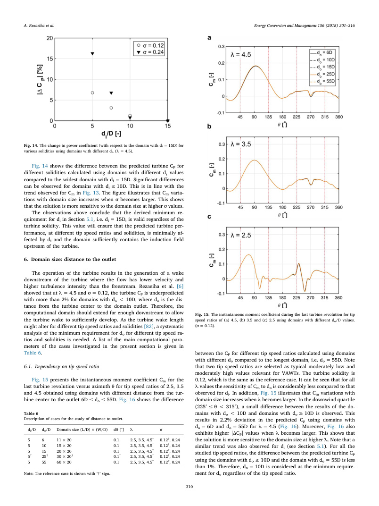

<!-- PDF page 11 -->

Contours of the normalized velocity magnitude illustrating the
turbine wake for different tip speed ratios are shown in Fig. 17. The
length of the turbine wake, defined as the length in which U/
U∞= 0.97, as a function of tip speed ratio (σ = 0.12) is presented in
Fig. 18. The two figures imply that the CFD results could still be suf-
ficiently accurate, though the computational domain might partially cut
the turbine wake at x/D ≥10. This could be associated with strong
velocity gradients occurring at x/D < 10, which is most particularly
observed for higher λ values. This also explains the higher sensitivity of
the predicted turbine Cm (Fig. 15a) and |ΔCp| (Fig. 16) to do for high λ
values.
The decrease in the turbine wake length with increasing λ was
already observed for horizontal axis wind turbines [82]. The detailed
analysis in Ref. [82] has shown that by increasing λ the distance be-
tween the shed vortices in the wake decreases, which leads to am-
plification of instabilities in the wake. This eventually leads to an
earlier breakdown of the wake structure. Contours of instantaneous
normalized lateral velocity for two tip speed ratio of 3.5 and 5.5 are
shown in Fig. 19. The figure illustrates the trace of the blades’ wake
(dashed line) and the shed vortices from the blades on the leeward
region traveling downstream (dotted circles). Two adjacent zones with
different signs for lateral velocity are used to qualitatively identify the
shed vortices. A comparison of Fig. 19a and b shows that the relative
distance between the dashed lines and the center of the dotted circles
has significantly increased for λ = 5.5 suggesting that the aforemen-
tioned mechanism is responsible for the reduction in the VAWT wake
length by increasing λ.
Fig. 16. The change in power coefficient (with respect to the domain with do = 55D) for
various tip speed ratios using domains with different do/D values. (σ = 0.12).
Fig. 17. Contours of instantaneous normalized velocity magnitude illustrating the turbine
wake for different tip speed ratios.
Fig. 18. Length of the turbine wake versus tip speed ratio.
Fig. 19. Contours of instantaneous normalized lateral velocity in the near wake of the
turbine for tip speed ratios of (a) 3.5 and (b) 5.5.
A. Rezaeiha et al.

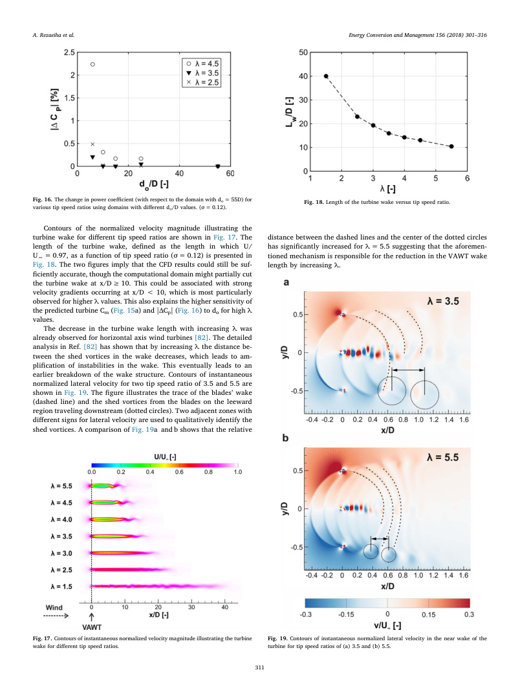

<!-- PDF page 12 -->

6.2. Dependency on solidity
The instantaneous moment coefficient Cm for the last turbine re-
volution versus azimuth θ for solidities of 0.12 and 0.24 calculated
using domains with different distance from the turbine center to the
outlet 6D ≤do ≤25D is shown in Fig. 20. The difference between the
predicted turbine CP for different solidities calculated using domains
with different do compared to the longest domain with do = 25D is
shown in Fig. 21. The solidities are selected as two typical moderately
low and moderately high values relevant for VAWTs. The tip speed ratio
is 4.5, which is the same as the reference case. Note that to reduce the
computational cost, the case with do = 55D is no longer considered
because the minimum requirement derived in Section 6.1 is 10D and
do = 55D is already predicted to be too large. It can be seen that there is
an observable difference in Cm between the values calculated using
domains with do < 10D and do ≥10D while the lines corresponding to
do = 10D and 25D overlap. This difference results in 2.3% deviation
between the calculated CP using domains with do of 6D and 25D while
this deviation is less than 1% for domains with do of 10D and 25D
(Fig. 21). Therefore, the already derived minimum requirement for do
(in Section 6.1) can also be employed regardless of the turbine solidity.
This value (do = 10D) will ensure that the predicted turbine perfor-
mance, at different tip speed ratios and solidities, is not significantly
affected by do and the domain sufficiently allows the turbine wake to
develop so that cutting the wake will have < 1% effect of the predicted
turbine CP.
The turbine wake length as a function of solidity at λ = 4.5 is shown
in Fig. 22. As already discussed in Section 6.1, partial cutting of the
wake at do ≥10D will have < 1% effect on the predicted turbine per-
formance.
A similar explanation can be presented for the decrease in the wake
length with increasing solidity. Increasing solidity (with increasing the
blade chord length) will lead to increase in the length scale of the shed
vortices in the turbine wake, which leads to the smaller relative dis-
tance between the vortices at the given λ. This will amplify the in-
stabilities in the wake and eventually will result in the earlier break-
down of the wake structure. A comparison of the trends observed in
Fig. 22 and Fig. 18 implies that the length of the turbine wake is more
sensitive to tip speed ratio than the solidity.
7. Convergence criterion
For transient simulations, it is importance to initiate the data sam-
pling only after the solution has reached a statistically steady state
condition. For the case of wind turbines, it is customary to correlate the
convergence of the unsteady simulation with the turbine revolution and
to express it as the minimum number of turbine revolutions that the
simulations needs to continue before reaching a statistically steady state
condition. Fig. 23 schematically presents the definition of the statistical
steady state condition employed in the present study. As the complexity
of the flow for VAWTs varies with the operating and geometrical con-
ditions, i.e. λ and σ, therefore, a sensitivity analysis is performed for the
convergence criterion by applying systematic changes to the reference
case. In this section, the sensitivity of the minimum requirements for
the convergence criterion to different tip speed ratios and solidities are
investigated. The details of the main computational parameters of the
cases that are investigated are presented in Table 7.
Fig. 20. The instantaneous moment coefficient during the last turbine revolution for
solidities of (a) 0.12 and (b) 0.24 using domains with different do values (λ = 4.5).
Fig. 21. The change in power coefficient (with respect to the domain with do = 25D) for
various solidities using domains with different do (λ = 4.5).
Fig. 22. Length of the turbine wake versus solidity.
A. Rezaeiha et al.

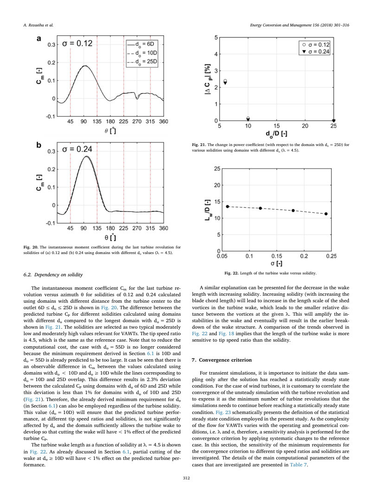

<!-- PDF page 13 -->

7.1. Dependency on tip speed ratio
The convergence of the results as a function of the turbine revolu-
tion is studied for different tip speed ratios. Fig. 24 shows the time
history of CP during 50 turbine revolutions for two different tip speed
ratio of 2.5 and 4.5. The tip speed ratios are selected as typical mod-
erately low and moderately high values relevant for VAWTs. The tur-
bine solidity is 0.12, which is the same as the reference case. It can be
seen that after 20 turbine revolutions a statistically steady state con-
dition is observed for all cases, as the CP variation with respect to 50th
revolution has become < 2%. The difference in CP between two sub-
sequent changes at 20 revolutions onwards is less than 0.2%. This is in
line with the results of the earlier study by Rezaeiha et al. [6], which
shows that 20–30 turbine revolutions is sufficient as the convergence
criterion for a moderate tip speed ratio of 4.5 with a low solidity of
0.12. The results of the present study confirm that this convergence
criterion can be generalized for other tip speed ratios. This suggests that
20–30 turbine revolutions are sufficient to allow the development of the
flow over a VAWT so that statistically steady results are obtained
irrespective of tip speed ratio. Note that at low tip speed ratios due to
the inherent three-dimensional flow complexities associated to dynamic
stall on blades and blade-wake interactions and the limitations of 2D
modeling, the calculated CP might have some small oscillations between
the subsequent turbine revolutions. Nevertheless, after approximately
20th revolution, the difference between the CP, for λ = 2.5, obtained
after 20 revolutions and that after 50 revolutions remains below 2%.
7.2. Dependency on solidity
The convergence of the results as a function of the turbine revolu-
tion is studied for different solidities. Fig. 25 shows the time history of
power coefficient CP during 50 turbine revolutions for two different
solidities of 0.12 and 0.24. The solidities are selected as two typical
moderately low and moderately high values relevant for VAWTs. The
tip speed ratio is 4.5, which is the same as the reference case. It can be
seen that after 20 turbine revolutions a statistically steady state solution
is observed for all cases, as the CP variations with respect to 50th re-
volution is negligible (< 2%). The difference in CP between two sub-
sequent changes at 20 revolutions onwards is less than 0.2%. The re-
sults of the present study confirm that this convergence criterion can be
generalized for other solidities. This suggests that 20–30 turbine re-
volutions are sufficient to allow the development of the flow over a
VAWT so that statistically steady state results are obtained for the two
studied cases with moderately low and moderately high solidities.
8. Discussion
The provided guidelines have been prepared using 110 high-fidelity
CFD simulations each running for approximately 120 h on 24 cores on
the
Dutch
national
supercomputer
SURFSARA,
Cartesius
(www.
surfsara.nl). This corresponds to approximately 320,000 CPU hours.
In total, a wide range of operational (1.5 ≤λ ≤5.5), geometrical
(0.12 ≤σ ≤0.24) and computational parameters (0.025° ≤dθ ≤0.5°;
2.5D ≤di ≤15D; 6D ≤do ≤55D; number of turbine revolutions ≤50)
were studied. This is to strengthen the general character of the guide-
lines.
The CFD simulations are based on two validation studies with wind
tunnel measurements. Note that the presented validation study is per-
formed using the very fine dθ of 0.1°, which is finer than (or equal to)
the derived minimum requirements for all λ values.
The minimum requirements are derived based on limiting the effect
of each studied parameter (azimuthal increment, distance from turbine
center to domain inlet and outlet and number of turbine revolutions) on
turbine CP to less than 1%. However, one should note that this does not
mean that the total error of the CFD simulation associated with such
computational parameters is 1%. A simple numerical error analysis
Fig. 23. Schematic of the time history of CP versus turbine revolutions along with the
statistical steady state condition used in the present study.
Table 7
Description of cases for the study of convergence criterion.
di/D
do/D
Domain size (L/
D) × (W/D)
dθ [°]
λ
σ
# turbine
revolutions
5†
25†
30 × 20†
0.1†
2.5, 4.5†
0.12†, 0.24
50
Note: The reference case is shown with ‘†’ sign.
Fig. 24. Time history of power coefficient for 50 turbine revolutions for different tip
speed ratios in log-scale. (σ = 0.12).
Fig. 25. Time history of power coefficient for 50 turbine revolutions for solidities in log-
scale. (λ = 4.5).
A. Rezaeiha et al.

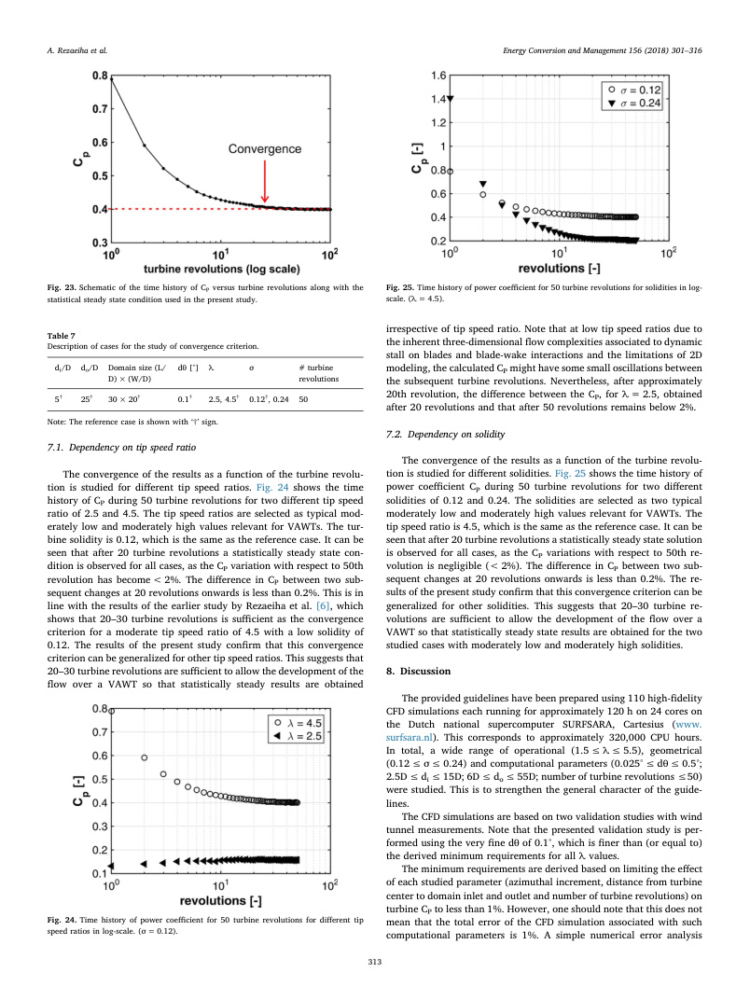

<!-- PDF page 14 -->

would reveal that the aforementioned errors can sum up to higher va-
lues which together with the other numerical errors; i.e. physical ap-
proximation error (e.g. 2D assumption as a representative of the turbine
mid-plane), round-offerror, iterative convergence error, spatial dis-
cretization error; would propagate to the final predicted turbine CP.
Therefore, one should not underestimate the importance of such
minimum requirements to minimize the numerical error.
On the other hand, the findings of this study are limited to URANS
simulations. For scale-resolving simulations (SRS), such as hybrid
RANS-LES and LES, different requirements, specifically for convergence
criterion and azimuthal increment, would be necessary which demands
further investigation. Moreover, for SRS, the difference between con-
secutive turbine revolutions would be significant which, therefore, Cm
and CP values would need to be averaged over multiple turbine re-
volutions to be a representative of the turbine averaged performance.
The number of turbine revolutions for such averaging would require a
dedicated study.
In the current study, solidity was modified by changing the blade
chord length at a given number of blades (n = 2). Although the pro-
vided minimum requirements are most likely not affected by the
number of blades, a detailed investigation of that is proposed for future
research.
Moreover, chord-based Reynolds number Rec was also found to be
influential for determination of dθ. Therefore, a dedicated investigation
of the impact of Rec on the provided minimum requirements for dθ is
proposed for future research.
9. Conclusions
A systematic sensitivity analysis is performed using URANS simu-
lations to provide the minimum requirements for azimuthal increment,
domain size and convergence criterion for CFD simulation of VAWTs at
different tip speed ratios and solidities. The evaluation is based on
validation with wind-tunnel measurements for two VAWTs. The fol-
lowing conclusions are obtained:
(1) Azimuthal increment:
The minimum requirement for azimuthal increment is significantly
dependent on the flow regime over the turbine blades. As the variations
of the angle of attack of the turbine blades are mainly driven by the tip
speed ratio, this parameter is the dominant factor to set the minimum
requirements for azimuthal increment. The derived minimum require-
ments for azimuthal increment are:
• Low to moderate tip speed ratios: dθ = 0.1°
• Moderate to high tip speed ratios: dθ = 0.5°
These values will ensure that the flow complexities such as dynamic
stall and blade-wake interactions are accurately predicted. For the
studied turbine with a solidity of 0.12, the former regime corresponds
to 1.5 ≤λ ≤3.5 while the latter refers to 3.5 < λ ≤5.5. In general,
the low to moderate tip speed ratio regime corresponds to the region
where the variations of the angle of attack of the blades exceed the
static stall angle and dynamic stall and the blade-wake interactions are
thus present. Conversely, the moderate to high tip speed ratios corre-
spond to the regime where the variations of the angle of attack of the
blade are below static stall angle, and the flow is mostly attached.
Therefore, one should have a prior knowledge of the following two
important factors to distinguish between the aforementioned operating
regimes of tip speed ratio:
• Variations of the angle of attack for the operating regime of the
turbine to be studied.
• Static stall angle of the employed airfoil on the turbine blade.
In addition, it is important to note that any change in geometrical
and operational characteristics of the turbine which could induce a
different flow separation behavior over the blades would require the
finer dθ of 0.1°. The change in geometrical parameters includes, but not
limited to:
• Changing the airfoil shape
• Changing the blade chord length (solidity)
• Changing the blade surface roughness
• Introducing pitch angle to blade
• Adding passive/active flow control devices on blades.
The change in operating conditions includes operating the turbine
at:
• Low chord-based Reynolds number (Rec < 10 5)
• Low freestream turbulence intensity (TI < 5%)
Therefore, for any reason, if a user is not certain of the regime of tip
speed ratio of the turbine, an azimuthal increment of 0.1° is always the
safe choice to be employed for URANS simulations of VAWTs.
(2) Domain size:
The minimum distance from the turbine center to the domain inlet
needs to be 15D. This can be a safe choice to let the domain sufficiently
contain the turbine upstream induction field regardless of the tip speed
ratio and solidity.
The minimum distance from the turbine center to the domain outlet
needs to be 10D. This value will ensure that the turbine wake is suffi-
ciently developed inside the domain so that it allows accurate predic-
tion of the turbine performance regardless of the tip speed ratio and
solidity.
(3) Convergence:
The minimum number of turbine revolutions to ensure that the si-
mulations have reached a statistically steady state condition is 20–30
turbine revolutions. This convergence criterion can be employed re-
gardless of tip speed ratio and solidity.
The aforementioned minimum requirements can be employed as
guidelines to ensure the accuracy of CFD simulation of VAWTs.
Acknowledgement
The authors would like to acknowledge support from the European
Commission's Framework Program Horizon 2020, through the Marie
Curie Innovative Training Network (ITN) AEOLUS4FUTURE - Efficient
harvesting of the wind energy (H2020-MSCA-ITN-2014: Grant agree-
ment no. 643167) and the TU1304 COST ACTION “WINERCOST”. The
authors gratefully acknowledge the partnership with ANSYS CFD. This
work
was
sponsored
by
NWO
Exacte
Wetenschappen
(Physical
Sciences) for the use of supercomputer facilities, with financial support
from the Nederlandse Organisatie voor Wetenschappelijk Onderzoek
(Netherlands Organization for Scientific Research, NWO). The 2nd
author, Hamid Montazeri, is currently a postdoctoral fellow of the
Research Foundation – Flanders (FWO) and is grateful for its financial
support (project FWO 12M5316N).
References
[1] Bedon G, Schmidt Paulsen U, Aagaard Madsen H, Belloni F, Raciti Castelli M, Benini
E. Computational assessment of the DeepWind aerodynamic performance with
different blade and airfoil configurations. Appl Energy 2017;185(2):1100–8.
[2] Qa Li, Kamada Y, Maeda T, Murata J, Okumura Y. Fundamental study on aero-
dynamic force of floating offshore wind turbine with cyclic pitch mechanism.
Energy 2016;99:20–31.
A. Rezaeiha et al.

<!-- PDF page 15 -->

[3] Tummala A, Velamati RK, Sinha DK, Indraja V, Krishna VH. A review on small scale
wind turbines. Renew Sustain Energy Rev 2016;56:1351–71.
[4] Gsänger S, Pitteloud JD. Small wind world report summary. World Wind Energy
Association (WWEA); 2015.
[5] Toja-Silva F, Colmenar-Santos A, Castro-Gil M. Urban wind energy exploitation
systems: behaviour under multidirectional flow conditions—opportunities and
challenges. Renew Sustain Energy Rev 2013;24:364–78.
[6] Rezaeiha A, Kalkman I, Blocken B. CFD simulation of a vertical axis wind turbine
operating at a moderate tip speed ratio: guidelines for minimum domain size and
azimuthal increment. Renew Energy 2017;107:373–85.
[7] Rezaeiha A, Pereira R, Kotsonis M. Fluctuations of angle of attack and lift coefficient
and the resultant fatigue loads for a large horizontal axis wind turbine. Renew
Energy 2017;114(B):904–16.
[8] Simão Ferreira C, van Kuik G, van Bussel G, Scarano F. Visualization by PIV of
dynamic stall on a vertical axis wind turbine. Exp Fluids 2008;46(1):97–108.
[9] Yu JM, Leu TS, Miau JJ. Investigation of reduced frequency and freestream tur-
bulence effects on dynamic stall of a pitching airfoil. J Visual 2017;20(1):31–44.
[10] Amet E, Maı̂tre T, Pellone C, Achard JL. 2D numerical simulations of blade-vortex
interaction in a Darrieus turbine. J Fluids Eng 2009;131(11). 111103(1-15).
[11] Bianchini A, Balduzzi F, Rainbird JM, Peiro J, Graham JMR, Ferrara G, et al. An
experimental and numerical assessment of airfoil polars for use in Darrieus wind
turbines—part I: flow curvature effects. J Eng Gas Turbines Power
2015;138(032602).
[12] Bianchini A, Balduzzi F, Ferrara G, Ferrari L. Virtual incidence effect on rotating
airfoils in Darrieus wind turbines. Energy Convers Manage 2016;111:329–38.
[13] Simão Ferreira C, Madsen HA, Barone M, Roscher B, Deglaire P, Arduin I.
Comparison of aerodynamic models for vertical axis wind turbines. J Phys: Conf Ser
2014;524(012125).
[14] Bianchini A, Balduzzi F, Bachant P, Ferrara G, Ferrari L. Effectiveness of two-di-
mensional CFD simulations for Darrieus VAWTs: a combined numerical and ex-
perimental assessment. Energy Convers Manage 2017;136:318–28.
[15] Bianchini A, Balduzzi F, Ferrara G, Ferrari L. A computational procedure to define
the incidence angle on airfoils rotating around an axis orthogonal to flow direction.
Energy Convers Manage 2016;126:790–8.
[16] Ghasemian M, AshrafiZN, Sedaghat A. A review on computational fluid dynamic
simulation techniques for Darrieus vertical axis wind turbines. Energy Convers
Manage 2017;149:87–100.
[17] Lei H, Zhou D, Bao Y, Li Y, Han Z. Three-dimensional Improved Delayed Detached
Eddy Simulation of a two-bladed vertical axis wind turbine. Energy Convers
Manage 2017;133:235–48.
[18] Shen X, Yang H, Chen J, Zhu X, Du Z. Aerodynamic shape optimization of non-
straight small wind turbine blades. Energy Convers Manage 2016;119:266–78.
[19] Tahani M, Babayan N, Mehrnia S, Shadmehri M. A novel heuristic method for op-
timization of straight blade vertical axis wind turbine. Energy Convers Manage
2016;127:461–76.
[20] Blocken B. 50 years of computational wind engineering: past, present and future. J
Wind Eng Ind Aerodyn 2014;129:69–102.
[21] Rezaeiha A, Montazeri H, and Blocken B. CFD simulations of vertical axis wind
turbines: impact of turbulence modeling; 2018 [in preparation].
[22] Araya DB, Colonius T, Dabiri JO. Transition to bluff-body dynamics in the wake of
vertical-axis wind turbines. J Fluid Mech 2017;813:346–81.
[23] Abkar M, Dabiri JO. Self-similarity and flow characteristics of vertical-axis wind
turbine wakes: an LES study. J Turbul 2017;18(4):373–89.
[24] Ryan KJ, Coletti F, Elkins CJ, Dabiri JO, Eaton JK. Three-dimensional flow field
around and downstream of a subscale model rotating vertical axis wind turbine. Exp
Fluids 2016;57(3).
[25] Kinzel M, Araya DB, Dabiri JO. Turbulence in vertical axis wind turbine canopies.
Phys Fluids 2015;27(11):115102.
[26] Tescione G, Ragni D, He C, Simão Ferreira C, van Bussel GJW. Near wake flow
analysis of a vertical axis wind turbine by stereoscopic particle image velocimetry.
Renew Energy 2014;70:47–61.
[27] Simão Ferreira C, Scheurich F. Demonstrating that power and instantaneous loads
are decoupled in a vertical-axis wind turbine. Wind Energy 2014;17(3):385–96.
[28] Qa Li, Maeda T, Kamada Y, Murata J, Furukawa K, Yamamoto M. Effect of number
of blades on aerodynamic forces on a straight-bladed Vertical Axis Wind Turbine.
Energy 2015;90:784–95.
[29] Li Q, Maeda T, Kamada Y, Shimizu K, Ogasawara T, Nakai A, et al. Effect of rotor
aspect ratio and solidity on a straight-bladed vertical axis wind turbine in three-
dimensional analysis by the panel method. Energy 2017;121:1–9.
[30] Subramanian A, Yogesh SA, Sivanandan H, Giri A, Vasudevan M, Mugundhan V,
et al. Effect of airfoil and solidity on performance of small scale vertical axis wind
turbine using three dimensional CFD model. Energy 2017;133:179–90.
[31] Simão Ferreira C, Geurts B. Aerofoil optimization for vertical-axis wind turbines.
Wind Energy 2014;18(8):1371–85.
[32] Ragni D, Simão Ferreira C, Correale G. Experimental investigation of an optimized
airfoil for vertical-axis wind turbines. Wind Energy 2014;18(9):1629–43.
[33] Rezaeiha A, Montazeri H, and Blocken B. Effect of airfoil shape on aerodynamic
performance of vertical axis wind turbines; 2018 [in preparation].
[34] Rezaeiha A, Montazeri H, Blocken B. Characterization of aerodynamic performance
of vertical axis wind turbines: impact of geometrical parameters; 2018 [in pre-
paration].
[35] Bausas MD, Danao LAM. The aerodynamics of a camber-bladed vertical axis wind
turbine in unsteady wind. Energy 2015;93:1155–64.
[36] Peng HY, Lam HF. Turbulence effects on the wake characteristics and aerodynamic
performance of a straight-bladed vertical axis wind turbine by wind tunnel tests and
large eddy simulations. Energy 2016;109:557–68.
[37] Qa Li, Maeda T, Kamada Y, Murata J, Furukawa K, Yamamoto M. The influence of
flow field and aerodynamic forces on a straight-bladed vertical axis wind turbine.
Energy 2016;111:260–71.
[38] Rezaeiha A, Montazeri H, Blocken B. Characterization of aerodynamic performance
of vertical axis wind turbines: impact of operational parameters; 2018 [submitted
for publication].
[39] Rezaeiha A, Kalkman I, Blocken B. Effect of pitch angle on power performance and
aerodynamics of a vertical axis wind turbine. Appl Energy 2017;197:132–50.
[40] Rezaeiha A, Kalkman I, Montazeri H, Blocken B. Effect of the shaft on the aero-
dynamic performance of urban vertical axis wind turbines. Energy Convers Manage
2017;149(C):616–30.
[41] Wong KH, Chong WT, Sukiman NL, Poh SC, Shiah Y-C, Wang C-T. Performance
enhancements on vertical axis wind turbines using flow augmentation systems: a
review. Renew Sustain Energy Rev 2017;73:904–21.
[42] Scungio M, Arpino F, Focanti V, Profili M, Rotondi M. Wind tunnel testing of scaled
models of a newly developed Darrieus-style vertical axis wind turbine with aux-
iliary straight blades. Energy Convers Manage 2016;130:60–70.
[43] Shahizare B, Nik-Ghazali N, Chong WT, Tabatabaeikia S, Izadyar N, Esmaeilzadeh
A. Novel investigation of the different Omni-direction-guide-vane angles effects on
the urban vertical axis wind turbine output power via three-dimensional numerical
simulation. Energy Convers Manage 2016;117:206–17.
[44] Sobhani E, Ghaffari M, Maghrebi MJ. Numerical investigation of dimple effects on
darrieus vertical axis wind turbine. Energy 2017;133:231–41.
[45] Wang Y, Sun X, Dong X, Zhu B, Huang D, Zheng Z. Numerical investigation on
aerodynamic performance of a novel vertical axis wind turbine with adaptive
blades. Energy Convers Manage 2016;108:275–86.
[46] Wang Z, Zhuang M. Leading-edge serrations for performance improvement on a
vertical-axis wind turbine at low tip-speed-ratios. Appl Energy 2017. http://dx.doi.
org/10.1016/j.apenergy.2017.09.034.
[47] Simão Ferreira C, van Zuijlen A, Bijl H, van Bussel G, van Kuik G. Simulating dy-
namic stall in a two-dimensional vertical-axis wind turbine: verification and vali-
dation with particle image velocimetry data. Wind Energy 2010;13(1):1–17.
[48] Trivellato F, Raciti Castelli M. On the Courant–Friedrichs–Lewy criterion of rotating
grids in 2D vertical-axis wind turbine analysis. Renew Energy 2014;62:53–62.
[49] Elkhoury M, Kiwata T, Aoun E. Experimental and numerical investigation of a
three-dimensional vertical-axis wind turbine with variable-pitch. J Wind Eng Ind
Aerodyn 2015;139:111–23.
[50] Balduzzi F, Bianchini A, Maleci R, Ferrara G, Ferrari L. Critical issues in the CFD
simulation of Darrieus wind turbines. Renew Energy 2016;85:419–35.
[51] Shahizare B, Bin Nazri, Nik Ghazali N, Chong W, Tabatabaeikia S, Izadyar N.
Investigation of the optimal omni-direction-guide-vane design for vertical axis wind
turbines based on unsteady flow CFD simulation. Energies 2016;9(3):146.
[52] Biswas A, Gupta R, Sharma KK. Experimental investigation of overlap and blockage
effects on three-bucket Savonius rotors. Wind Eng 2007;31(5):363–8.
[53] Ross I, Altman A. Wind tunnel blockage corrections: review and application to
Savonius vertical-axis wind turbines. J Wind Eng Ind Aerodyn 2011;99(5):523–38.
[54] Beri H, Yao Y. Effect of camber airfoil on self starting of vertical axis wind turbine. J
Environ Sci Technol 2011;4(3):302–12.
[55] Rossetti A, Pavesi G. Comparison of different numerical approaches to the study of
the H-darrieus turbines start-up. Renew Energy 2013;50:7–19.
[56] Mohamed MH. Performance investigation of H-rotor Darrieus turbine with new
airfoil shapes. Energy 2012;47(1):522–30.
[57] Ikoma T, Masuda K, Fujio S, Nakada H, Maeda H. Characteristics of hydrodynamic
forces and torque on darrieus type water turbines for current power generation
systems with CFD computations. In: OCEANS 2008 – MTS/IEEE Kobe Techno-
Ocean, Kobe, Japan; April 8–11 2008.
[58] Simão Ferreira C. The near wake of the VAWT: 2D and 3D views of the VAWT
aerodynamics PhD TU Delft; 2009.
[59] Menter FR, Langtry RB, Likki SR, Suzen YB, Huang PG, Völker S. A correlation-
based transition model using local variables—part I: model formulation. J
Turbomach 2006;128(3):413–22.
[60] Menter FR. Two-equation eddy-viscosity turbulence models for engineering appli-
cations. AIAA J 1994;32(8):1598–605.
[61] Menter FR, Kuntz M, Langtry R. Ten years of industrial experience with the SST
turbulence model. In: Turbulence, heat and mass transfer, vol. 4, ed; 2003.
[62] Menter FR, Langtry R, Völker S. Transition modelling for general purpose CFD
codes. Flow Turbul Combust 2006;77(1–4):277–303.
[63] Langtry RB, Menter FR, Likki SR, Suzen YB, Huang PG, Völker S. A correlation-
based transition model using local variables—part II: test cases and industrial ap-
plications. J Turbomach 2006;128(3):423–34.
[64] Suzen YB, Huang PG. Modeling of flow transition using an intermittency transport
equation. NASA/CR-1999-209313; 1999.
[65] Suzen YB, Huang PG, Hultgren LS, Ashpis DE. Predictions of separated and tran-
sitional boundary layers under low-pressure turbine airfoil conditions using an in-
termittency transport equation. J Turbomach 2003;125(3):455.
[66] Walters DK, Leylek JH. A new model for boundary layer transition using a single-
point RANS approach. J Turbomach 2004;126(1):193.
[67] Cutrone L, De Palma P, Pascazio G, Napolitano M. Predicting transition in two- and
three-dimensional separated flows. Int J Heat Fluid Flow 2008;29(2):504–26.
[68] Genç MS, Kaynak Ü, Lock GD. Flow over an aerofoil without and with leading edge
slat at a transitional Reynolds number. In: Proc IMechE, Part G – journal of aero-
space engineering; 2009. p. 217–31.
[69] Genç MS. Numerical simulation of flow over a thin aerofoil at a high reynolds
number using a transition model. Proc Inst Mech Eng Part C: J Mech Eng Sci
2010:2155–22164.
[70] Genç MS, Kaynak Ü, Yapici H. Performance of transition model for predicting low
A. Rezaeiha et al.

<!-- PDF page 16 -->

aerofoil flows without/with single and simultaneous blowing and suction. Eur J
Mech B Fluids 2011;30(2):218–35.
[71] Genç MS, Karasu I, Açikel HH. Low Reynolds number flows and transition. In: Genç
MS, editor. Low Reynolds number aerodynamics and transition. InTech-Open
Access Publishing; 2012.
[72] Genç MS, Karasu İ, Hakan Açıkel H. An experimental study on aerodynamics of
NACA2415 aerofoil at low Re numbers. Exp Thermal Fluid Sci 2012;39:252–64.
[73] Karasu I, Genç MS, Açikel HH. Numerical study on low Reynolds number flows over
an aerofoil. J Appl Mech Eng 2013;02(05).
[74] Menter FR. Zonal two equation k·omega turbulence models for aerodynamic flows.
24th fluid dynamics conference, Orlando, Florida. 1993.
[75] ANSYS. ANSYS® Fluent theory guide, release 16.1, ANSYS Inc; 2015.
[76] Roache PJ. Quantification of uncertainty in computational fluid dynamics. Annu
Rev Fluid Mech 1997;29:123–60.
[77] Castelli MR, Englaro A, Benini E. The Darrieus wind turbine: proposal for a new
performance prediction model based on CFD. Energy 2011;36(8):4919–34.
[78] Castelli MR, Ardizzon G, Battisti L, Benini E, Pavesi G. Modeling strategy and nu-
merical validation for a Darrieus vertical axis micro-wind turbine. In: ASME 2010
international mechanical engineering congress & exposition. British Columbia,
Canada: Vancouver; 2010.
[79] Lardeau S, Leschziner MA. Unsteady RANS modelling of wake–blade interaction:
computational requirements and limitations. Comput Fluids 2005;34(1):3–21.
[80] Rockwell D. Vortex-body interactions. Annu Rev Fluid Mech 1998;30:199–229.
[81] Bachant P, Wosnik M. Effects of Reynolds number on the energy conversion and
near-wake dynamics of a high solidity vertical-axis cross-flow turbine. Energies
2016;9(73).
[82] Vermeer L, Sørensen JN, Crespo A. Wind turbine wake aerodynamics. Prog Aerosp
Sci 2003;39:467–510.
A. Rezaeiha et al.
