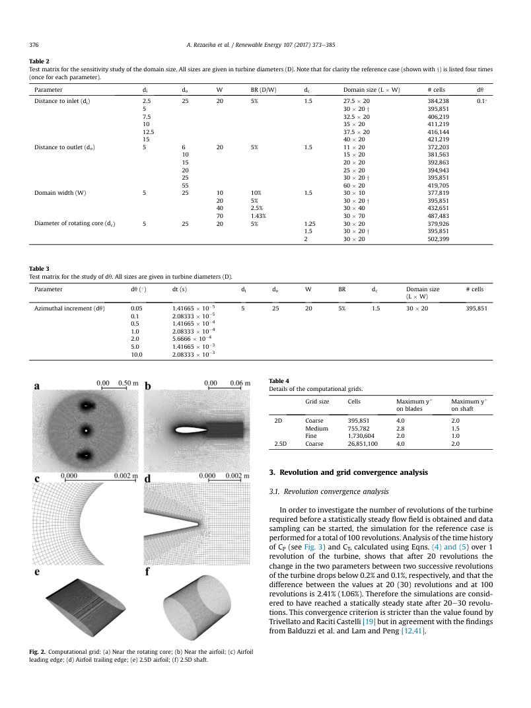
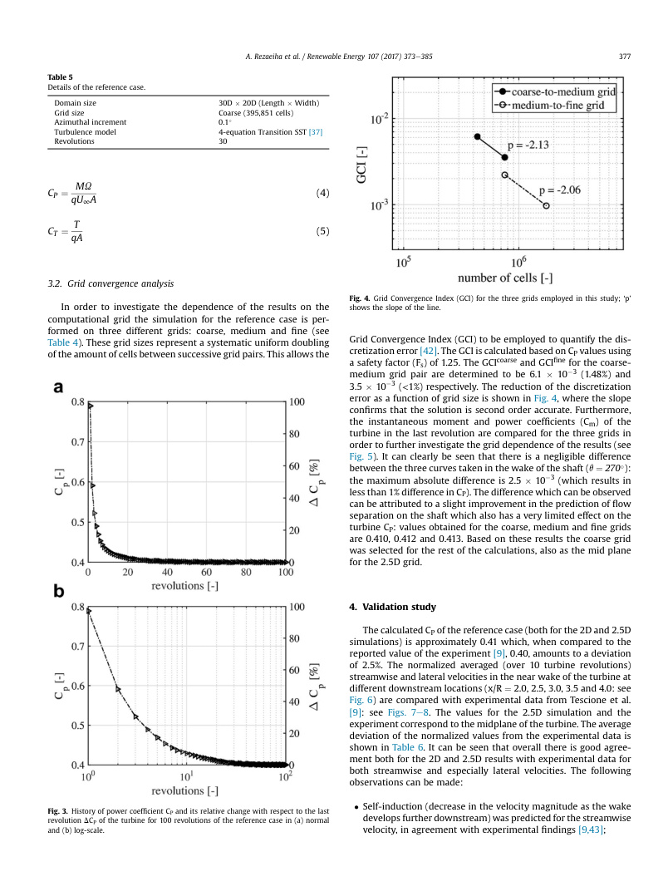
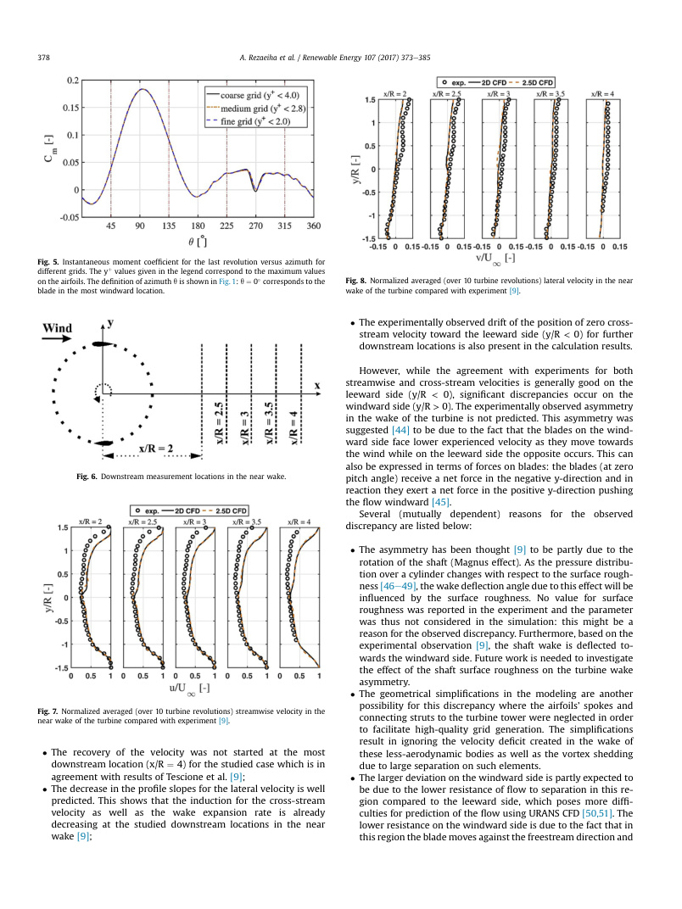
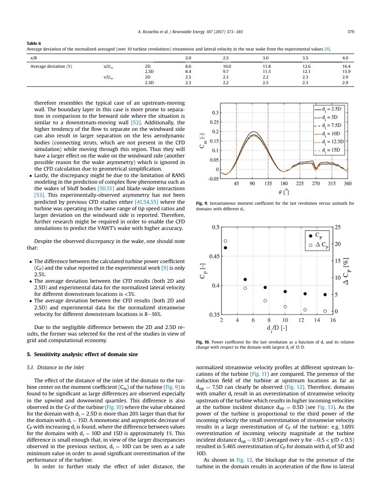
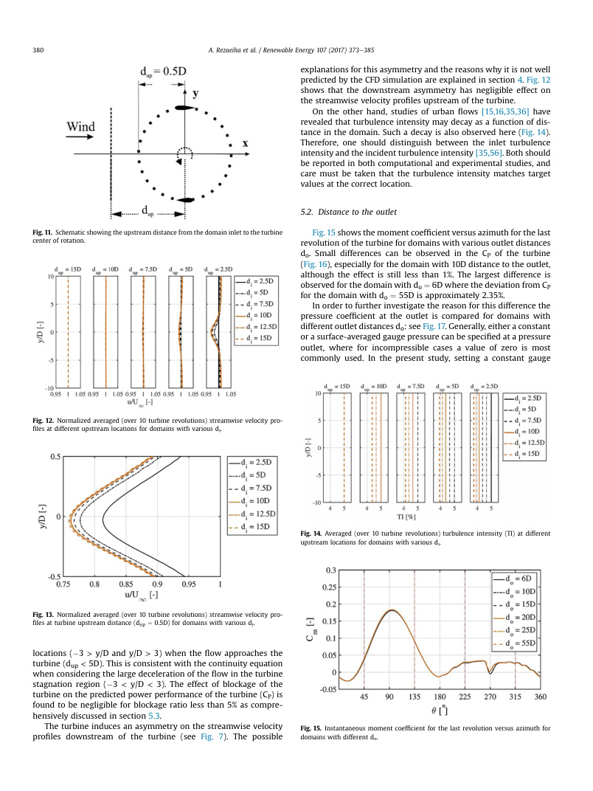
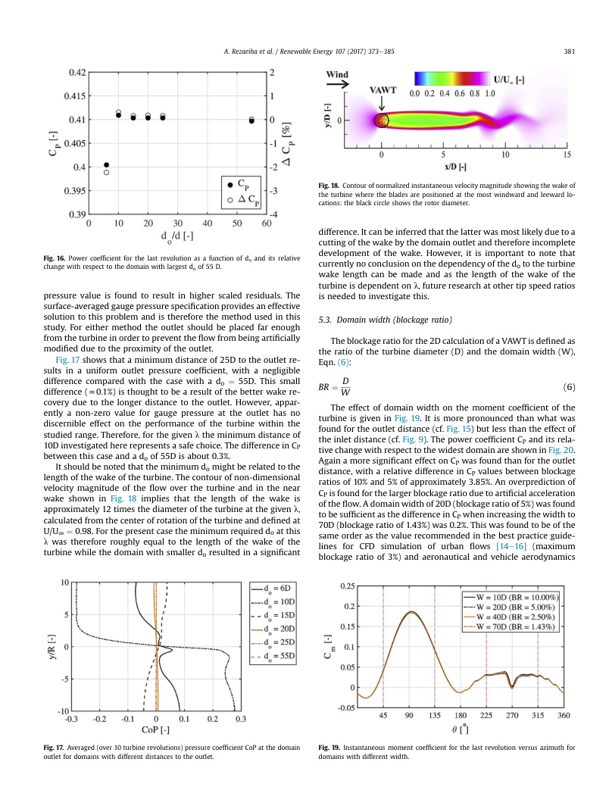
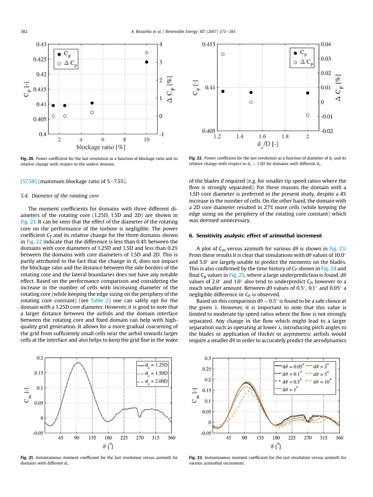
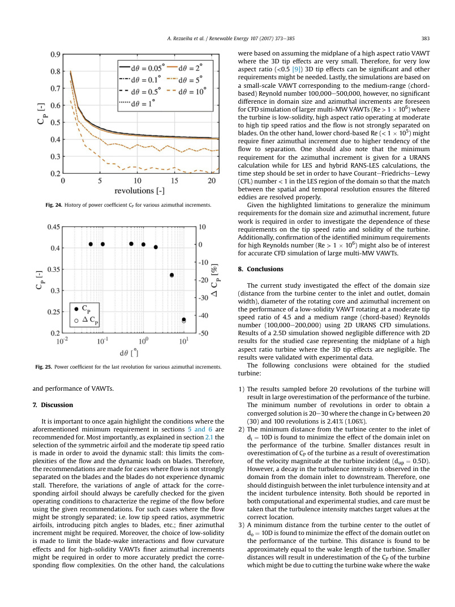

<!-- PDF page 1 -->

CFD simulation of a vertical axis wind turbine operating at a
moderate tip speed ratio: guidelines for minimum domain size
and azimuthal increment
Citation for published version (APA):
Rezaeiha, A., Kalkman, I., & Blocken, B. (2017). CFD simulation of a vertical axis wind turbine operating at a
moderate tip speed ratio: guidelines for minimum domain size and azimuthal increment. Renewable Energy,
107, 373-385. https://doi.org/10.1016/j.renene.2017.02.006
Document license:
CC BY
DOI:
10.1016/j.renene.2017.02.006
Document status and date:
Published: 05/02/2017
Document Version:
Publisher’s PDF, also known as Version of Record (includes final page, issue and volume numbers)
Please check the document version of this publication:
• A submitted manuscript is the version of the article upon submission and before peer-review. There can be
important differences between the submitted version and the official published version of record. People
interested in the research are advised to contact the author for the final version of the publication, or visit the
DOI to the publisher's website.
• The final author version and the galley proof are versions of the publication after peer review.
• The final published version features the final layout of the paper including the volume, issue and page
numbers.
Link to publication
General rights
Copyright and moral rights for the publications made accessible in the public portal are retained by the authors and/or other copyright owners
and it is a condition of accessing publications that users recognise and abide by the legal requirements associated with these rights.
            • Users may download and print one copy of any publication from the public portal for the purpose of private study or research.
            • You may not further distribute the material or use it for any profit-making activity or commercial gain
            • You may freely distribute the URL identifying the publication in the public portal.
If the publication is distributed under the terms of Article 25fa of the Dutch Copyright Act, indicated by the “Taverne” license above, please
follow below link for the End User Agreement:
www.tue.nl/taverne
Take down policy
If you believe that this document breaches copyright please contact us at:
openaccess@tue.nl
providing details and we will investigate your claim.
Download date: 20. Jul. 2026

<!-- PDF page 2 -->

CFD simulation of a vertical axis wind turbine operating at a moderate
tip speed ratio: Guidelines for minimum domain size and azimuthal
increment
Abdolrahim Rezaeiha a, *, Ivo Kalkman a, Bert Blocken a, b
a Building Physics and Services, Department of the Built Environment, Eindhoven University of Technology, P.O. Box 513, 5600 MB, Eindhoven, The
Netherlands
b Building Physics Section, Department of Civil Engineering, KU Leuven, Kasteelpark Arenberg 40 e Bus 2447, 3001, Leuven, Belgium
a r t i c l e i n f o
Article history:
Received 9 August 2016
Received in revised form
9 January 2017
Accepted 4 February 2017
Available online 5 February 2017
Keywords:
Vertical axis wind turbine (VAWT)
CFD
Guideline
Domain size
Azimuthal increment
Number of revolutions
a b s t r a c t
Accurate prediction of the performance of a vertical-axis wind turbine (VAWT) using Computational
Fluid Dynamics (CFD) simulation requires a domain size that is large enough to minimize the effects of
blockage and uncertainties in the boundary conditions on the results. It also requires the employment of
a sufficiently fine azimuthal increment (dq) combined with a grid size at which essential flow charac-
teristics can be accurately resolved. The current study systematically investigates the effect of the domain
size and azimuthal increment on the performance of a 2-bladed VAWT operating at a moderate tip speed
ratio of 4.5 using 2-dimensional and 2.5-dimensional simulations with the unsteady Reynolds-averaged
Navier-Stokes (URANS). The grid dependence of the results is studied using three systematically refined
grids. The turbine has a low solidity of 0.12 and a swept area of 1 m2. Refining dq from 10.0 to 0.5 results
in a significant (z43%) increase in the predicted power coefficient (CP) while the effect is negligible
(z0.25%) with further refinement from 0.5 to 0.05 at the given l. Furthermore, a distance from the
turbine center to the domain inlet and outlet of 10D (D: diameter of turbine) each, a domain width of 20D
and a diameter of the rotating core of 1.5D are found to be safe choices to minimize the effects of
blockage and uncertainty in the boundary conditions on the results.
© 2017 The Authors. Published by Elsevier Ltd. This is an open access article under the CC BY license
(http://creativecommons.org/licenses/by/4.0/).
1. Introduction
Recently, vertical-axis wind turbines (VAWTs) have received
growing interest for wind energy harvesting offshore [1] as well as
in the urban environment [2e5]. For offshore application this can
be attributed to their scalability, reliability and low installation and
maintenance costs, while for environments with frequent changes
in wind direction such as urban environments their omni-
directional capability is their main advantage. However, due to a
comparatively small amount of research on VAWTs in the last 2-3
decades, their performance is currently lower than that of their
horizontal-axis counterparts. The current renewed interest has
resulted in more research and further understanding of VAWT flow
complexities. These complexities include dynamic stall [6,7], flow
curvature effects [8], blade-wake interactions and unsteady 3D
wake dynamics [9]. Increased understanding of the aerodynamics
of VAWTs has enabled further optimization of their performance
which has been conducted using low-to moderate-fidelity inviscid
modeling [10,11], high-fidelity viscous CFD simulations [12,13] and
wind tunnel tests [9].
Accurate prediction of VAWT performance using CFD simulation
requires a sufficiently fine azimuthal increment (dq) and grid res-
olution in order to resolve essential flow details both in time and
space. The domain size with respect to the turbine diameter (D)
also needs to be sufficiently large in order to minimize the influence
of blockage (which is a result of the presence of the turbine in the
domain and the boundary conditions at the lateral boundaries) as
well as the uncertainties regarding flow conditions at the other
boundaries of the domain. Minimum requirements for the domain
size have been studied for several types of flow, e.g. urban flows
[14e16] and best practice guidelines have been published in order
to
minimize
unwanted effects
of
the
boundaries. However,
although numerous CFD studies of VAWTs have recently been
published there is no consistency in the employed domain size and
azimuthal increment, and very few of them have systematically
* Corresponding author.
E-mail address: a.rezaeiha@tue.nl (A. Rezaeiha).
Contents lists available at ScienceDirect
Renewable Energy
journal homepage: www.elsevier.com/locate/renene
http://dx.doi.org/10.1016/j.renene.2017.02.006
0960-1481/© 2017 The Authors. Published by Elsevier Ltd. This is an open access article under the CC BY license (http://creativecommons.org/licenses/by/4.0/).
Renewable Energy 107 (2017) 373e385

<!-- PDF page 3 -->

investigated the sensitivity of the results to these computational
parameters [17]. The few studies which do exist on azimuthal
increment (for HAWTs [18] and VAWTs [12,19e22]) and domain
size (for HAWTs [23,24] and for VAWTs [12,25e27]), although very
valuable, are too limited in scope to derive reliable minimum re-
quirements. Deriving such best practice guidelines is therefore the
topic of the present study.
The current study first investigates the number of revolutions of
the turbine which is needed to obtain a converged solution for a
VAWToperating at a moderate tip speed ratio (l) of 4.5 and sets this
as a convergence criterion for all subsequent simulations. A sensi-
tivity analysis is then performed for the computational grid size, dq
and domain size in order to find minimum values where the VAWT
performance (power and thrust coefficients, CP and CT) can be
considered independent of these parameters. These values can then
be used as guidelines to ensure the accuracy of CFD results in case
the turbine is operating at a moderate l and the flow on the blades
is not strongly separated. It is important to note that the focus of the
current study is merely on an urban-scale VAWT with low solidity
operating at a moderate tip speed ratio. The selected geometrical
and operational characteristics of the turbine simplify the flow
physics and facilitate the identification of guidelines as explained
below.
 The low solidity reduces the complexities associated to blade-
wake interactions and flow curvature effects [8,9].
 The moderate tip speed ratio corresponds to the regime where a
VAWT operates most optimally because the variations of angle
of attack are closer to the design angle of attack of the employed
airfoil and large separation is therefore avoided [7,9]. In the
current study, a symmetric airfoil with zero pitch angle is
employed. Using an asymmetric airfoil or a different pitch angle
might result in large separation on blades even at a moderate tip
speed ratio. Therefore, for each simulation the variations of
angle of attack during the revolution should be taken into ac-
count. Low tip speed ratios can also result in large separation for
a turbine with similar geometrical characteristics (solidity,
airfoil shape and pitch angle) [13]. Furthermore, as a result of the
aforementioned geometrical and operational characteristics of
the turbine, dynamic stall on the blades is avoided [9], which
further limits complexities of the flow and dynamic loads on the
blades.
 The scale of the VAWT investigated corresponds to a chord-
based Reynolds number Re > 105. Due to strong Reynolds
number effects for flow over airfoils [28e30], for very small
turbines where the range of Re is different (Re < 105), separation
can happen earlier and blades might experience large separa-
tion under the same operating conditions.
The paper starts with a description of the methodology in sec-
tion 2 which includes the geometrical and operational character-
istics of the turbine, the computational domain and grid, the
numerical settings and the test matrices describing the details of
the parametric studies. Then, the sensitivity of the results to the
number of revolutions of the turbine before data sampling (section
3.1) and grid resolution (section 3.2) are analyzed. The validation
with experimental data [9] is subsequently performed (section 4).
Finally the results of the sensitivity study on the domain size and dq
are discussed in sections 5 and 6, respectively. Discussion and
conclusions are presented in section 7e8.
2. Methodology
2.1. VAWT geometrical and operational characteristics
A 2-bladed H-type low-solidity VAWT equipped with symmetric
NACA0018 airfoils, a diameter (D) and height (H) of both equal to
1 m, a swept area (A) of 1 m2 and a solidity (s) of 0.12 is simulated in
2D and 2.5D at a constant l of 4.5. The 2D simulation represents the
midplane of a turbine with high aspect ratio; where the 3D tip
effects are small; and is selected after the comparison with results
from a 2.5D simulation showed a negligible (<0.25%) difference in
power and thrust coefficients (CP and CT) for the given tip speed
ratio and solidity (described in section 4). The low-solidity of the
turbine is selected to limit the blade-wake interactions. The l value
is selected to ensure that the angle of attack of the blades remains
below the static stall angle for the airfoil in order to avoid dynamic
stall. In order to check that this is indeed the case the blade Rey-
nolds number for the given l is calculated based on geometrical
relations for VAWTs using Eqns. (1) and (2) [31] and found to be in
Nomenclature
A
swept area, H:D [m2]
BR
blockage ratio (D=W ) []
c
blade chord length [m]
Cm
instantaneous moment coefficient []
CP
power coefficient []
CT
thrust coefficient []
CoP
pressure coefficient []
D
turbine diameter [m]
dc
diameter of rotating core [m]
di
distance to the domain inlet from turbine center [m]
do
distance to the domain outlet from turbine center [m]
dup
upstream distance to the turbine center [m]
dt
time step [s]
dq
azimuthal increment []
Fs
safety factor []
H
turbine height [m]
L
domain length [m]
M
moment [Nm]
q
dynamic pressure [Pa]
R
turbine radius [m]
Re
chord-based Reynolds number []
Req
momentum thickness Reynolds number []
Regeo
Reynolds number from geometrical relations []
T
thrust force [N]
u
time-averaged streamwise velocity [m/s]
U
velocity magnitude [m/s]
U∞
freestream velocity [m/s]
v
time-averaged lateral velocity [m/s]
W
domain width [m]
Wgeo
resultant velocity from geometrical relations [m/s]
ageo
geometrical angle of attack []
g
intermittency []
l
tip speed ratio, U:R=U∞[]
n
kinematic viscosity [m2/s]
q
azimuthal angle []
r
density [kg/m3]
s
solidity, n:c=D []
u
specific dissipation rate [1/s]
U
rotational speed [rad/s]
A. Rezaeiha et al. / Renewable Energy 107 (2017) 373e385

<!-- PDF page 4 -->

the range 100,000 < Regeo < 200,000; in this range the static stall
angle of the airfoil is approximately 14 [32] while the maximum
geometrical angle of attack (calculated using Eqn. (3) [31]) is less
than 13. The experienced angle of attack will be even lower than
the geometrical value as ageo is defined from geometrical relations
based on the assumption of zero induced velocity while a non-zero
value results in a lower experienced streamwise velocity, and
therefore a lower experienced angle of attack. This limits the 3D
effects in the flow in the midplane of the VAWT. Furthermore, this
is the range where the VAWTs operate optimally and is therefore of
greatest interest for practical applications. The turbine has a shaft
with a 0.04 m diameter which is rotating in the same direction as
the turbine. The turbine rotational velocity (U) is 83.8 rad/s
(800 rpm) and the free-stream velocity is 9.3 m/s. The geometrical
and operational characteristics of the VAWT are presented in
Table 1.
Wgeo ¼ U∞
ffiffiffiffiffiffiffiffiffiffiffiffiffiffiffiffiffiffiffiffiffiffiffiffiffiffiffiffiffiffiffiffiffiffiffiffi
l2 þ 2l cos q þ 1
q
(1)
Regeo ¼ Wgeoc
n
(2)
ageo ¼ tan1

sin q
cos q þ l

(3)
2.2. Computational domain and grid
The computational domain shown in Fig. 1 consists of a rotating
core where the turbine is located and a fixed domain surrounding
the core. A non-conformal interface with sliding grid between the
fixed domain and the rotating core enables rotation of the turbine.
The blade orbit is divided into four quartiles [33]: upwind
(45
 q < 135), leeward (135
 q < 225), downwind
(225  q < 315) and windward (315  q < 45).
Through systematic variation of di, do, W and dc (see Fig. 1) the
effect of these parameters on CP and CT of the turbine are investi-
gated: Table 2 describes the details of the studied cases. The effect
of dq is also studied for various cases, as detailed in Table 3; a value
of 0.1 is used for the reference case. The 2.5D domain is based on
the reference case with a span of 0.06 m, equal to the chord of the
airfoil.
For all the cases a computational grid is generated which con-
sists of quadrilateral cells. The boundary layer grid is employed on
the walls (airfoils and shaft). The cell size is equal at both sides of
the interface between the rotating and fixed domains in order to
minimize numerical errors at this interface. The maximum yþ is
below 4 on the airfoils and below 2 on the shaft in order to accu-
rately capture the linear viscous sublayer. Images of the reference
computational grid for the 30D  20D (L  W) domain size high-
lighting different parts of the grid are shown in Fig. 2. The inde-
pendence of the results to the computational grid is studied using 2
finer grids (see Table 4), which also serves to quantify the dis-
cretization error. The computational grid for the 2.5D domain is
based on the coarse grid ground plane which is extruded in the
third dimension in a non-conformal manner with cell sizes of
0.5  103 m, 1.0  103 m and 2.0  103 m on the airfoils, shaft
and fixed domain, respectively (see Fig. 2).
2.3. Numerical settings
The incompressible unsteady Reynolds-averaged Navier-Stokes
(URANS) equations are solved using the commercial CFD software
package ANSYS Fluent 16.1 [34]. The SIMPLE scheme is used for
pressure-velocity
coupling
and
2nd
order
discretization
is
employed both in time and space. The boundary conditions at the
inlet, outlet, side faces and walls are uniform velocity, zero surface-
averaged gauge pressure, symmetry and no slip, respectively. A
freestream velocity (U∞) of 9.3 m/s with a turbulence intensity of
5% is set at the inlet while the incident flow turbulence intensity is
4.42% due to the decay in the domain. The incident value is defined
as the value that would occur at the location of the turbine, if the
turbine would be absent [35,36].
Turbulence is modeled using the 4-equation transition SST
turbulence model [37]. The performance of the turbine is strongly
dependent on the development of the boundary layer on the blades
and therefore an accurate prediction of the transition onset is
essential. In addition to the equations for turbulent kinetic energy k
and specific dissipation rate u employed in the k-u SST model, the
4-equation transition SST model [37] solves two more equations for
the intermittency (g) and momentum thickness Reynolds number
(Req) which should lead to a better prediction of the laminar to
turbulent transition onset [38].
Calculations are initialized with a steady-state RANS calculation
using the realizable k-ε turbulence model [39] with enhanced wall
treatment (EWT) [40]. The unsteady calculations utilize 20 itera-
tions per time step. The scaled residuals for all equations fall below
1  105. Data sampling is started after 20 revolutions of the tur-
bine and continue for another 10 revolutions in order to ensure that
the change in CP between 2 subsequent revolutions is below 0.2%,
as discussed in more detail in section 3.1.
2.4. Reference case
A reference case detailed in Table 5 is defined for the sensitivity
analyses in section 3.
Table 1
Geometrical and operational characteristics of the VAWT.
Characteristics
Turbine
Number of blades, n
2
Diameter, D [m]
1
Height, H [m]
1
Swept area, A [m2]
1
Solidity, s []
0.12
Airfoil
NACA0018
Airfoil chord, c [m]
0.06
Shaft diameter [m]
0.04
Tip speed ratio, l []
4.5
Freestream velocity, U∞[m/s]
9.3
Rotational speed, U [rad/s]
83.8
Fig. 1. Schematic of the computational domain: di, distance from the inlet to the
turbine center; do distance from the turbine center to the outlet; dc, diameter of the
core region; W, width of the computational domain.
A. Rezaeiha et al. / Renewable Energy 107 (2017) 373e385

<!-- PDF page 5 -->

3. Revolution and grid convergence analysis
3.1. Revolution convergence analysis
In order to investigate the number of revolutions of the turbine
required before a statistically steady flow field is obtained and data
sampling can be started, the simulation for the reference case is
performed for a total of 100 revolutions. Analysis of the time history
of CP (see Fig. 3) and CT, calculated using Eqns. (4) and (5) over 1
revolution of the turbine, shows that after 20 revolutions the
change in the two parameters between two successive revolutions
of the turbine drops below 0.2% and 0.1%, respectively, and that the
difference between the values at 20 (30) revolutions and at 100
revolutions is 2.41% (1.06%). Therefore the simulations are consid-
ered to have reached a statically steady state after 20e30 revolu-
tions. This convergence criterion is stricter than the value found by
Trivellato and Raciti Castelli [19] but in agreement with the findings
from Balduzzi et al. and Lam and Peng [12,41].
Table 2
Test matrix for the sensitivity study of the domain size. All sizes are given in turbine diameters (D). Note that for clarity the reference case (shown with y) is listed four times
(once for each parameter).
Parameter
di
do
W
BR (D/W)
dc
Domain size (L  W)
# cells
dq
Distance to inlet (di)
2.5
25
20
5%
1.5
27.5  20
384,238
0.1
5
30  20 y
395,851
7.5
32.5  20
406,219
10
35  20
411,219
12.5
37.5  20
416,144
15
40  20
421,219
Distance to outlet (do)
5
6
20
5%
1.5
11  20
372,203
10
15  20
381,563
15
20  20
392,863
20
25  20
394,943
25
30  20 y
395,851
55
60  20
419,705
Domain width (W)
5
25
10
10%
1.5
30  10
377,819
20
5%
30  20 y
395,851
40
2.5%
30  40
432,651
70
1.43%
30  70
487,483
Diameter of rotating core (dc)
5
25
20
5%
1.25
30  20
379,926
1.5
30  20 y
395,851
2
30  20
502,399
Table 3
Test matrix for the study of dq. All sizes are given in turbine diameters (D).
Parameter
dq ()
dt (s)
di
do
W
BR
dc
Domain size
(L  W)
# cells
Azimuthal increment (dq)
0.05
1.41665  105
5
25
20
5%
1.5
30  20
395,851
0.1
2.08333  105
0.5
1.41665  104
1.0
2.08333  104
2.0
5.6666  104
5.0
1.41665  103
10.0
2.08333  103
Fig. 2. Computational grid: (a) Near the rotating core; (b) Near the airfoil; (c) Airfoil
leading edge; (d) Airfoil trailing edge; (e) 2.5D airfoil; (f) 2.5D shaft.
Table 4
Details of the computational grids.
Grid size
Cells
Maximum yþ
on blades
Maximum yþ
on shaft
2D
Coarse
395,851
4.0
2.0
Medium
755,782
2.8
1.5
Fine
1,730,604
2.0
1.0
2.5D
Coarse
26,851,100
4.0
2.0
A. Rezaeiha et al. / Renewable Energy 107 (2017) 373e385

<!-- PDF page 6 -->

CP ¼ MU
qU∞A
(4)
CT ¼ T
qA
(5)
3.2. Grid convergence analysis
In order to investigate the dependence of the results on the
computational grid the simulation for the reference case is per-
formed on three different grids: coarse, medium and fine (see
Table 4). These grid sizes represent a systematic uniform doubling
of the amount of cells between successive grid pairs. This allows the
Grid Convergence Index (GCI) to be employed to quantify the dis-
cretization error [42]. The GCI is calculated based on CP values using
a safety factor (Fs) of 1.25. The GCIcoarse and GCIfine for the coarse-
medium grid pair are determined to be 6.1  103 (1.48%) and
3.5  103 (<1%) respectively. The reduction of the discretization
error as a function of grid size is shown in Fig. 4, where the slope
confirms that the solution is second order accurate. Furthermore,
the instantaneous moment and power coefficients (Cm) of the
turbine in the last revolution are compared for the three grids in
order to further investigate the grid dependence of the results (see
Fig. 5). It can clearly be seen that there is a negligible difference
between the three curves taken in the wake of the shaft (q ¼ 270):
the maximum absolute difference is 2.5  103 (which results in
less than 1% difference in CP). The difference which can be observed
can be attributed to a slight improvement in the prediction of flow
separation on the shaft which also has a very limited effect on the
turbine CP: values obtained for the coarse, medium and fine grids
are 0.410, 0.412 and 0.413. Based on these results the coarse grid
was selected for the rest of the calculations, also as the mid plane
for the 2.5D grid.
4. Validation study
The calculated CP of the reference case (both for the 2D and 2.5D
simulations) is approximately 0.41 which, when compared to the
reported value of the experiment [9], 0.40, amounts to a deviation
of 2.5%. The normalized averaged (over 10 turbine revolutions)
streamwise and lateral velocities in the near wake of the turbine at
different downstream locations (x/R ¼ 2.0, 2.5, 3.0, 3.5 and 4.0: see
Fig. 6) are compared with experimental data from Tescione et al.
[9]: see Figs. 7e8. The values for the 2.5D simulation and the
experiment correspond to the midplane of the turbine. The average
deviation of the normalized values from the experimental data is
shown in Table 6. It can be seen that overall there is good agree-
ment both for the 2D and 2.5D results with experimental data for
both streamwise and especially lateral velocities. The following
observations can be made:
 Self-induction (decrease in the velocity magnitude as the wake
develops further downstream) was predicted for the streamwise
velocity, in agreement with experimental findings [9,43];
Table 5
Details of the reference case.
Domain size
30D  20D (Length  Width)
Grid size
Coarse (395,851 cells)
Azimuthal increment
0.1
Turbulence model
4-equation Transition SST [37]
Revolutions
30
Fig. 3. History of power coefficient CP and its relative change with respect to the last
revolution DCP of the turbine for 100 revolutions of the reference case in (a) normal
and (b) log-scale.
Fig. 4. Grid Convergence Index (GCI) for the three grids employed in this study; ‘p’
shows the slope of the line.
A. Rezaeiha et al. / Renewable Energy 107 (2017) 373e385

<!-- PDF page 7 -->

 The recovery of the velocity was not started at the most
downstream location (x/R ¼ 4) for the studied case which is in
agreement with results of Tescione et al. [9];
 The decrease in the profile slopes for the lateral velocity is well
predicted. This shows that the induction for the cross-stream
velocity as well
as the wake
expansion rate is already
decreasing at the studied downstream locations in the near
wake [9];
 The experimentally observed drift of the position of zero cross-
stream velocity toward the leeward side (y/R < 0) for further
downstream locations is also present in the calculation results.
However, while the agreement with experiments for both
streamwise and cross-stream velocities is generally good on the
leeward side (y/R < 0), significant discrepancies occur on the
windward side (y/R > 0). The experimentally observed asymmetry
in the wake of the turbine is not predicted. This asymmetry was
suggested [44] to be due to the fact that the blades on the wind-
ward side face lower experienced velocity as they move towards
the wind while on the leeward side the opposite occurs. This can
also be expressed in terms of forces on blades: the blades (at zero
pitch angle) receive a net force in the negative y-direction and in
reaction they exert a net force in the positive y-direction pushing
the flow windward [45].
Several
(mutually
dependent)
reasons
for
the
observed
discrepancy are listed below:
 The asymmetry has been thought [9] to be partly due to the
rotation of the shaft (Magnus effect). As the pressure distribu-
tion over a cylinder changes with respect to the surface rough-
ness [46e49], the wake deflection angle due to this effect will be
influenced by the surface roughness. No value for surface
roughness was reported in the experiment and the parameter
was thus not considered in the simulation: this might be a
reason for the observed discrepancy. Furthermore, based on the
experimental observation [9], the shaft wake is deflected to-
wards the windward side. Future work is needed to investigate
the effect of the shaft surface roughness on the turbine wake
asymmetry.
 The geometrical simplifications in the modeling are another
possibility for this discrepancy where the airfoils’ spokes and
connecting struts to the turbine tower were neglected in order
to facilitate high-quality grid generation. The simplifications
result in ignoring the velocity deficit created in the wake of
these less-aerodynamic bodies as well as the vortex shedding
due to large separation on such elements.
 The larger deviation on the windward side is partly expected to
be due to the lower resistance of flow to separation in this re-
gion compared to the leeward side, which poses more diffi-
culties for prediction of the flow using URANS CFD [50,51]. The
lower resistance on the windward side is due to the fact that in
this region the blade moves against the freestream direction and
Fig. 6. Downstream measurement locations in the near wake.
Fig. 7. Normalized averaged (over 10 turbine revolutions) streamwise velocity in the
near wake of the turbine compared with experiment [9].
Fig. 8. Normalized averaged (over 10 turbine revolutions) lateral velocity in the near
wake of the turbine compared with experiment [9].
Fig. 5. Instantaneous moment coefficient for the last revolution versus azimuth for
different grids. The yþ values given in the legend correspond to the maximum values
on the airfoils. The definition of azimuth q is shown in Fig. 1: q ¼ 0 corresponds to the
blade in the most windward location.
A. Rezaeiha et al. / Renewable Energy 107 (2017) 373e385

<!-- PDF page 8 -->

therefore resembles the typical case of an upstream-moving
wall. The boundary layer in this case is more prone to separa-
tion in comparison to the leeward side where the situation is
similar to a downstream-moving wall [52]. Additionally, the
higher tendency of the flow to separate on the windward side
can also result in larger separation on the less aerodynamic
bodies (connecting struts, which are not present in the CFD
simulation) while moving through this region. Thus they will
have a larger effect on the wake on the windward side (another
possible reason for the wake asymmetry) which is ignored in
the CFD calculation due to geometrical simplification.
 Lastly, the discrepancy might be due to the limitation of RANS
modeling in the prediction of complex flow phenomena such as
the wakes of bluff bodies [50,51] and blade-wake interactions
[53]. This experimentally-observed asymmetry has not been
predicted by previous CFD studies either [41,54,55] where the
turbine was operating in the same range of tip speed ratios and
larger deviation on the windward side is reported. Therefore,
further research might be required in order to enable the CFD
simulations to predict the VAWT’s wake with higher accuracy.
Despite the observed discrepancy in the wake, one should note
that:
 The difference between the calculated turbine power coefficient
(CP) and the value reported in the experimental work [9] is only
2.5%.
 The average deviation between the CFD results (both 2D and
2.5D) and experimental data for the normalized lateral velocity
for different downstream locations is <3%.
 The average deviation between the CFD results (both 2D and
2.5D) and experimental data for the normalized streamwise
velocity for different downstream locations is 8e16%.
Due to the negligible difference between the 2D and 2.5D re-
sults, the former was selected for the rest of the studies in view of
grid and computational economy.
5. Sensitivity analysis: effect of domain size
5.1. Distance to the inlet
The effect of the distance of the inlet of the domain to the tur-
bine center on the moment coefficient (Cm) of the turbine (Fig. 9) is
found to be significant as large differences are observed especially
in the upwind and downwind quartiles. This difference is also
observed in the CP of the turbine (Fig. 10) where the value obtained
for the domain with di ¼ 2.5D is more than 20% larger than that for
the domain with di ¼ 15D. A monotonic and asymptotic decrease of
CP with increasing di is found, where the difference between values
for the domains with di ¼ 10D and 15D is approximately 1%. This
difference is small enough that, in view of the larger discrepancies
observed in the previous section, di ¼ 10D can be seen as a safe
minimum value in order to avoid significant overestimation of the
performance of the turbine.
In order to further study the effect of inlet distance, the
normalized streamwise velocity profiles at different upstream lo-
cations of the turbine (Fig. 11) are compared. The presence of the
induction field of the turbine at upstream locations as far as
dup ¼ 7.5D can clearly be observed (Fig. 12). Therefore, domains
with smaller di result in an overestimation of streamwise velocity
upstream of the turbine which results in higher incoming velocities
at the turbine incident distance dup ¼ 0.5D (see Fig. 13). As the
power of the turbine is proportional to the third power of the
incoming velocity the small overestimation of streamwise velocity
results in a large overestimation of CP of the turbine: e.g. 1.69%
overestimation of incoming velocity magnitude at the turbine
incident distance dup ¼ 0.5D (averaged over y for 0.5 < y/D < 0.5)
resulted in 5.46% overestimation of CP for domain with di of 5D and
10D.
As shown in Fig. 12, the blockage due to the presence of the
turbine in the domain results in acceleration of the flow in lateral
Table 6
Average deviation of the normalized averaged (over 10 turbine revolutions) streamwise and lateral velocity in the near wake from the experimental values [9].
x/R
2.0
2.5
3.0
3.5
4.0
Average deviation (%)
u/U∞
2D
8.6
10.0
11.8
12.6
16.4
2.5D
8.4
9.7
11.5
12.1
15.9
v/U∞
2D
2.5
2.3
2.2
2.3
2.9
2.5D
2.3
2.2
2.5
2.3
2.9
Fig. 9. Instantaneous moment coefficient for the last revolution versus azimuth for
domains with different di.
Fig. 10. Power coefficient for the last revolution as a function of di and its relative
change with respect to the domain with largest di of 15 D.
A. Rezaeiha et al. / Renewable Energy 107 (2017) 373e385

<!-- PDF page 9 -->

locations (3 > y/D and y/D > 3) when the flow approaches the
turbine (dup < 5D). This is consistent with the continuity equation
when considering the large deceleration of the flow in the turbine
stagnation region (3 < y/D < 3). The effect of blockage of the
turbine on the predicted power performance of the turbine (CP) is
found to be negligible for blockage ratio less than 5% as compre-
hensively discussed in section 5.3.
The turbine induces an asymmetry on the streamwise velocity
profiles downstream of the turbine (see Fig. 7). The possible
explanations for this asymmetry and the reasons why it is not well
predicted by the CFD simulation are explained in section 4. Fig. 12
shows that the downstream asymmetry has negligible effect on
the streamwise velocity profiles upstream of the turbine.
On the other hand, studies of urban flows [15,16,35,36] have
revealed that turbulence intensity may decay as a function of dis-
tance in the domain. Such a decay is also observed here (Fig. 14).
Therefore, one should distinguish between the inlet turbulence
intensity and the incident turbulence intensity [35,56]. Both should
be reported in both computational and experimental studies, and
care must be taken that the turbulence intensity matches target
values at the correct location.
5.2. Distance to the outlet
Fig. 15 shows the moment coefficient versus azimuth for the last
revolution of the turbine for domains with various outlet distances
do. Small differences can be observed in the CP of the turbine
(Fig. 16), especially for the domain with 10D distance to the outlet,
although the effect is still less than 1%. The largest difference is
observed for the domain with do ¼ 6D where the deviation from CP
for the domain with do ¼ 55D is approximately 2.35%.
In order to further investigate the reason for this difference the
pressure coefficient at the outlet is compared for domains with
different outlet distances do: see Fig. 17. Generally, either a constant
or a surface-averaged gauge pressure can be specified at a pressure
outlet, where for incompressible cases a value of zero is most
commonly used. In the present study, setting a constant gauge
Fig. 11. Schematic showing the upstream distance from the domain inlet to the turbine
center of rotation.
Fig. 12. Normalized averaged (over 10 turbine revolutions) streamwise velocity pro-
files at different upstream locations for domains with various di.
Fig. 13. Normalized averaged (over 10 turbine revolutions) streamwise velocity pro-
files at turbine upstream distance (dup ¼ 0.5D) for domains with various di.
Fig. 14. Averaged (over 10 turbine revolutions) turbulence intensity (TI) at different
upstream locations for domains with various di.
Fig. 15. Instantaneous moment coefficient for the last revolution versus azimuth for
domains with different do.
A. Rezaeiha et al. / Renewable Energy 107 (2017) 373e385

<!-- PDF page 10 -->

pressure value is found to result in higher scaled residuals. The
surface-averaged gauge pressure specification provides an effective
solution to this problem and is therefore the method used in this
study. For either method the outlet should be placed far enough
from the turbine in order to prevent the flow from being artificially
modified due to the proximity of the outlet.
Fig. 17 shows that a minimum distance of 25D to the outlet re-
sults in a uniform outlet pressure coefficient, with a negligible
difference compared with the case with a do ¼ 55D. This small
difference (z0.1%) is thought to be a result of the better wake re-
covery due to the longer distance to the outlet. However, appar-
ently a non-zero value for gauge pressure at the outlet has no
discernible effect on the performance of the turbine within the
studied range. Therefore, for the given l the minimum distance of
10D investigated here represents a safe choice. The difference in CP
between this case and a do of 55D is about 0.3%.
It should be noted that the minimum do might be related to the
length of the wake of the turbine. The contour of non-dimensional
velocity magnitude of the flow over the turbine and in the near
wake shown in Fig. 18 implies that the length of the wake is
approximately 12 times the diameter of the turbine at the given l,
calculated from the center of rotation of the turbine and defined at
U/U∞¼ 0.98. For the present case the minimum required do at this
l was therefore roughly equal to the length of the wake of the
turbine while the domain with smaller do resulted in a significant
difference. It can be inferred that the latter was most likely due to a
cutting of the wake by the domain outlet and therefore incomplete
development of the wake. However, it is important to note that
currently no conclusion on the dependency of the do to the turbine
wake length can be made and as the length of the wake of the
turbine is dependent on l, future research at other tip speed ratios
is needed to investigate this.
5.3. Domain width (blockage ratio)
The blockage ratio for the 2D calculation of a VAWT is defined as
the ratio of the turbine diameter (D) and the domain width (W),
Eqn. (6):
BR ¼ D
W
(6)
The effect of domain width on the moment coefficient of the
turbine is given in Fig. 19. It is more pronounced than what was
found for the outlet distance (cf. Fig. 15) but less than the effect of
the inlet distance (cf. Fig. 9). The power coefficient CP and its rela-
tive change with respect to the widest domain are shown in Fig. 20.
Again a more significant effect on CP was found than for the outlet
distance, with a relative difference in CP values between blockage
ratios of 10% and 5% of approximately 3.85%. An overprediction of
CP is found for the larger blockage ratio due to artificial acceleration
of the flow. A domain width of 20D (blockage ratio of 5%) was found
to be sufficient as the difference in CP when increasing the width to
70D (blockage ratio of 1.43%) was 0.2%. This was found to be of the
same order as the value recommended in the best practice guide-
lines for CFD simulation of urban flows [14e16] (maximum
blockage ratio of 3%) and aeronautical and vehicle aerodynamics
Fig. 16. Power coefficient for the last revolution as a function of do and its relative
change with respect to the domain with largest do of 55 D.
Fig. 17. Averaged (over 10 turbine revolutions) pressure coefficient CoP at the domain
outlet for domains with different distances to the outlet.
Fig. 18. Contour of normalized instantaneous velocity magnitude showing the wake of
the turbine where the blades are positioned at the most windward and leeward lo-
cations: the black circle shows the rotor diameter.
Fig. 19. Instantaneous moment coefficient for the last revolution versus azimuth for
domains with different width.
A. Rezaeiha et al. / Renewable Energy 107 (2017) 373e385

<!-- PDF page 11 -->

[57,58] (maximum blockage ratio of 5e7.5%).
5.4. Diameter of the rotating core
The moment coefficients for domains with three different di-
ameters of the rotating core (1.25D, 1.5D and 2D) are shown in
Fig. 21. It can be seen that the effect of the diameter of the rotating
core on the performance of the turbine is negligible. The power
coefficient CP and its relative change for the three domains shown
in Fig. 22 indicate that the difference is less than 0.4% between the
domains with core diameters of 1.25D and 1.5D and less than 0.2%
between the domains with core diameters of 1.5D and 2D. This is
partly attributed to the fact that the change in dc does not impact
the blockage ratio and the distance between the side borders of the
rotating core and the lateral boundaries does not have any notable
effect. Based on the performance comparison and considering the
increase in the number of cells with increasing diameter of the
rotating core (while keeping the edge sizing on the periphery of the
rotating core constant) (see Table 2) one can safely opt for the
domain with a 1.25D core diameter. However, it is good to note that
a larger distance between the airfoils and the domain interface
between the rotating core and fixed domain can help with high-
quality grid generation. It allows for a more gradual coarsening of
the grid from sufficiently small cells near the airfoil towards larger
cells at the interface and also helps to keep the grid fine in the wake
of the blades if required (e.g. for smaller tip speed ratios where the
flow is strongly separated). For these reasons the domain with a
1.5D core diameter is preferred in the present study, despite a 4%
increase in the number of cells. On the other hand, the domain with
a 2D core diameter resulted in 27% more cells (while keeping the
edge sizing on the periphery of the rotating core constant) which
was deemed unnecessary.
6. Sensitivity analysis: effect of azimuthal increment
A plot of Cm versus azimuth for various dq is shown in Fig. 23.
From these results it is clear that simulations with dq values of 10.0
and 5.0 are largely unable to predict the moments on the blades.
This is also confirmed by the time history of CP shown in Fig. 24 and
final Cp values in Fig. 25, where a large underprediction is found. dq
values of 2.0 and 1.0 also tend to underpredict CP, however to a
much smaller amount. Between dq values of 0.5, 0.1 and 0.05 a
negligible difference in CP is observed.
Based on this comparison dq ¼ 0.5 is found to be a safe choice at
the given l. However, it is important to note that this value is
limited to moderate tip speed ratios where the flow is not strongly
separated. Any change in the flow which might lead to a larger
separation such as operating at lower l, introducing pitch angles to
the blades or application of thicker or asymmetric airfoils would
require a smaller dq in order to accurately predict the aerodynamics
Fig. 20. Power coefficient for the last revolution as a function of blockage ratio and its
relative change with respect to the widest domain.
Fig. 21. Instantaneous moment coefficient for the last revolution versus azimuth for
domains with different dc.
Fig. 22. Power coefficient for the last revolution as a function of diameter of dc and its
relative change with respect to dc ¼ 1.5D for domains with different dc.
Fig. 23. Instantaneous moment coefficient for the last revolution versus azimuth for
various azimuthal increments.
A. Rezaeiha et al. / Renewable Energy 107 (2017) 373e385

<!-- PDF page 12 -->

and performance of VAWTs.
7. Discussion
It is important to once again highlight the conditions where the
aforementioned minimum requirement in sections 5 and 6 are
recommended for. Most importantly, as explained in section 2.1 the
selection of the symmetric airfoil and the moderate tip speed ratio
is made in order to avoid the dynamic stall: this limits the com-
plexities of the flow and the dynamic loads on blades. Therefore,
the recommendations are made for cases where flow is not strongly
separated on the blades and the blades do not experience dynamic
stall. Therefore, the variations of angle of attack for the corre-
sponding airfoil should always be carefully checked for the given
operating conditions to characterize the regime of the flow before
using the given recommendations. For such cases where the flow
might be strongly separated; i.e. low tip speed ratios, asymmetric
airfoils, introducing pitch angles to blades, etc.; finer azimuthal
increment might be required. Moreover, the choice of low-solidity
is made to limit the blade-wake interactions and flow curvature
effects and for high-solidity VAWTs finer azimuthal increments
might be required in order to more accurately predict the corre-
sponding flow complexities. On the other hand, the calculations
were based on assuming the midplane of a high aspect ratio VAWT
where the 3D tip effects are very small. Therefore, for very low
aspect ratio (<0.5 [9]) 3D tip effects can be significant and other
requirements might be needed. Lastly, the simulations are based on
a small-scale VAWT corresponding to the medium-range (chord-
based) Reynold number 100,000e500,000, however, no significant
difference in domain size and azimuthal increments are foreseen
for CFD simulation of larger multi-MW VAWTs (Re > 1  106) where
the turbine is low-solidity, high aspect ratio operating at moderate
to high tip speed ratios and the flow is not strongly separated on
blades. On the other hand, lower chord-based Re (< 1  105) might
require finer azimuthal increment due to higher tendency of the
flow to separation. One should also note that the minimum
requirement for the azimuthal increment is given for a URANS
calculation while for LES and hybrid RANS-LES calculations, the
time step should be set in order to have CouranteFriedrichseLewy
(CFL) number < 1 in the LES region of the domain so that the match
between the spatial and temporal resolution ensures the filtered
eddies are resolved properly.
Given the highlighted limitations to generalize the minimum
requirements for the domain size and azimuthal increment, future
work is required in order to investigate the dependence of these
requirements on the tip speed ratio and solidity of the turbine.
Additionally, confirmation of the identified minimum requirements
for high Reynolds number (Re > 1  106) might also be of interest
for accurate CFD simulation of large multi-MW VAWTs.
8. Conclusions
The current study investigated the effect of the domain size
(distance from the turbine center to the inlet and outlet, domain
width), diameter of the rotating core and azimuthal increment on
the performance of a low-solidity VAWT rotating at a moderate tip
speed ratio of 4.5 and a medium range (chord-based) Reynolds
number (100,000e200,000) using 2D URANS CFD simulations.
Results of a 2.5D simulation showed negligible difference with 2D
results for the studied case representing the midplane of a high
aspect ratio turbine where the 3D tip effects are negligible. The
results were validated with experimental data.
The following conclusions were obtained for the studied
turbine:
1) The results sampled before 20 revolutions of the turbine will
result in large overestimation of the performance of the turbine.
The minimum number of revolutions in order to obtain a
converged solution is 20e30 where the change in CP between 20
(30) and 100 revolutions is 2.41% (1.06%).
2) The minimum distance from the turbine center to the inlet of
di ¼ 10D is found to minimize the effect of the domain inlet on
the performance of the turbine. Smaller distances result in
overestimation of CP of the turbine as a result of overestimation
of the velocity magnitude at the turbine incident (dup ¼ 0.5D).
However, a decay in the turbulence intensity is observed in the
domain from the domain inlet to downstream. Therefore, one
should distinguish between the inlet turbulence intensity and at
the incident turbulence intensity. Both should be reported in
both computational and experimental studies, and care must be
taken that the turbulence intensity matches target values at the
correct location.
3) A minimum distance from the turbine center to the outlet of
do ¼ 10D is found to minimize the effect of the domain outlet on
the performance of the turbine. This distance is found to be
approximately equal to the wake length of the turbine. Smaller
distances will result in underestimation of the CP of the turbine
which might be due to cutting the turbine wake where the wake
Fig. 24. History of power coefficient CP for various azimuthal increments.
Fig. 25. Power coefficient for the last revolution for various azimuthal increments.
A. Rezaeiha et al. / Renewable Energy 107 (2017) 373e385

<!-- PDF page 13 -->

is not fully developed. Larger distances will not have any un-
wanted effect on the results as they also allow the full devel-
opment of the wake.
4) A domain width of W ¼ 20D is found to minimize the effect of
the blockage on the results. This is equivalent to blockage ratio
(D/W) of 5%.
5) A minimum diameter of the rotating core equal to dc ¼ 1.5D was
found to both minimize the effect of the size of the rotating core
on the results as well ensure ease of meshing and minimum
computational costs.
6) A minimum azimuthal increment of dq ¼ 0.5 was found to
minimize the effect of the temporal resolution on the perfor-
mance of the turbine.
The conclusions above are limited to a low-solidity high-aspect
ratio VAWT operating at a moderate tip speed ratio where the flow
is not strongly separated. Large separation of the flow (and occur-
rence of dynamic stall) on the blades of the turbine due to the
choice of the airfoil, the low tip speed ratio or the pitch angle on the
blades might demand a larger domain size and a finer azimuthal
increment. Furthermore, the high solidity will also increase the
flow complexities and might demand finer azimuthal increment.
Future work is needed to address the limitations of the current
study and further generalize the identified minimum requirements
for the azimuthal increment and domain size.
Acknowledgement
The authors would like to acknowledge support from the Eu-
ropean Commission’s Framework Program Horizon 2020, through
the Marie Curie Innovative Training Network (ITN) AEOLUS4FU-
TURE - Efficient harvesting of the wind energy (H2020-MSCA-ITN-
2014: Grant agreement no. 643167) and the TU1304 COST ACTION
“WINERCOST”. The authors gratefully acknowledge the partnership
with ANSYS CFD. This work was sponsored by NWO Exacte
Wetenschappen (Physical Sciences) for the use of supercomputer
facilities, with financial support from the Nederlandse Organisatie
voor Wetenschappelijk Onderzoek (MP-297-14) (Netherlands Or-
ganization for Scientific Research, NWO).
References
[1] U.S. Paulsen, H.A. Madsen, K.A. Kragh, P.H. Nielsen, I. Baran, J. Hattel, E. Ritchie,
K. Leban, H. Svendsen, P.A. Berthelsen, DeepWind-from idea to 5 MW concept,
Energy Procedia 53 (2014) 23e33.
[2] M.R. Islam, S. Mekhilef, R. Saidur, Progress and recent trends of wind energy
technology, Renew. Sustain. Energy Rev. 21 (2013) 456e468.
[3] A. Tummala, R.K. Velamati, D.K. Sinha, V. Indraja, V.H. Krishna, A review on
small scale wind turbines, Renew. Sustain. Energy Rev. 56 (2016) 1351e1371.
[4] S. Gs€anger, J.D. Pitteloud, Small Wind World Report Summary, World Wind
Energy Association (WWEA), 2015.
[5] B. Blocken, 50 years of computational wind engineering: past, present and
future, J. Wind Eng. Ind. Aerodyn. 129 (2014) 69e102.
[6] A.J. Buchner, M.W. Lohry, L. Martinelli, J. Soria, A.J. Smits, Dynamic stall in
vertical axis wind turbines: comparing experiments and computations,
J. Wind Eng. Ind. Aerodyn. 146 (2015) 163e171.
[7] C. Sim~ao Ferreira, G. van Kuik, G. van Bussel, F. Scarano, Visualization by PIV of
dynamic stall on a vertical axis wind turbine, Exp. Fluids 46 (1) (2008)
97e108.
[8] A. Bianchini, F. Balduzzi, G. Ferrara, L. Ferrari, Virtual incidence effect on
rotating airfoils in Darrieus wind turbines, Energy Convers. Manag. 111 (2016)
329e338.
[9] G. Tescione, D. Ragni, C. He, C. Sim~ao Ferreira, G.J.W. van Bussel, Near wake
flow analysis of a vertical axis wind turbine by stereoscopic particle image
velocimetry, Renew. Energy 70 (2014) 47e61.
[10] C. Sim~ao Ferreira, H.A. Madsen, M. Barone, B. Roscher, P. Deglaire, I. Arduin,
Comparison of aerodynamic models for vertical axis wind turbines, J. Phys.
Conf. Ser. 524 (012125) (2014).
[11] M. Islam, D. Ting, A. Fartaj, Aerodynamic models for Darrieus-type straight-
bladed vertical axis wind turbines, Renew. Sustain. Energy Rev. 12 (4) (2008)
1087e1109.
[12] F. Balduzzi, A. Bianchini, R. Maleci, G. Ferrara, L. Ferrari, Critical issues in the
CFD simulation of Darrieus wind turbines, Renew. Energy 85 (2016) 419e435.
[13] A. Rezaeiha, I.M. Kalkman, B. Blocken, Effect of Pitch Angle on Power Perfor-
mance and Aerodynamics of a Vertical axis Wind Turbine, 2016 (under
review).
[14] J. Franke, A. Hellsten, H. Schluzen, B. Carissimo, Best Practice Guideline for the
CFD Simulation of Flows in the Urban Environment, COST, Hamburg, Ger-
many, 2007.
[15] B. Blocken, Computational Fluid Dynamics for urban physics: importance,
scales, possibilities, limitations and ten tips and tricks towards accurate and
reliable simulations, Build. Environ. 91 (2015) 219e245.
[16] Y. Tominaga, A. Mochida, R. Yoshie, H. Kataoka, T. Nozu, M. Yoshikawa,
T. Shirasawa, AIJ guidelines for practical applications of CFD to pedestrian
wind environment around buildings, J. Wind Eng. Ind. Aerodyn. 96 (10e11)
(2008) 1749e1761.
[17] C.-J. Bai, W.-C. Wang, Review of computational and experimental approaches
to analysis of aerodynamic performance in horizontal-axis wind turbines
(HAWTs), Renew. Sustain. Energy Rev. 63 (2016) 506e519.
[18] A. Bechmann, N.N. Sørensen, F. Zahle, CFD simulations of the MEXICO rotor,
Wind Energy 14 (5) (2011) 677e689.
[19] F. Trivellato, M. Raciti Castelli, On the CouranteFriedrichseLewy criterion of
rotating grids in 2D vertical-axis wind turbine analysis, Renew. Energy 62
(2014) 53e62.
[20] M. Elkhoury, T. Kiwata, E. Aoun, Experimental and numerical investigation of
a three-dimensional vertical-axis wind turbine with variable-pitch, J. Wind
Eng. Ind. Aerodyn. 139 (2015) 111e123.
[21] C. Sim~ao Ferreira, H. Bijl, Gv Bussel, Gv Kuik, Simulating dynamic stall in a 2D
VAWT: modeling strategy, verification and validation with particle image
velocimetry data, J. Phys. Conf. Ser. 75 (012023) (2007).
[22] B. Shahizare, N. Nazri Bin Nik Ghazali, W. Chong, S. Tabatabaeikia, N. Izadyar,
Investigation of the optimal omni-direction-guide-vane design for vertical
axis wind turbines based on unsteady flow CFD simulation, Energies 9 (3)
(2016) 146.
[23] N.N. Sørensen, J.A. Michelsen, S. Schreck, Navier-Stokes predictions of the
NREL phase VI rotor in the NASA Ames 80 ft  120 ft wind tunnel, Wind
Energy 5 (2e3) (2002) 151e169.
[24] H. Sarlak, T. Nishino, L.A. Martínez-Tossas, C. Meneveau, J.N. Sørensen,
Assessment of blockage effects on the wake characteristics and power of wind
turbines, Renew. Energy 93 (2016) 340e352.
[25] I. Ross, A. Altman, Wind tunnel blockage corrections: review and application
to Savonius vertical-axis wind turbines, J. Wind Eng. Ind. Aerodyn. 99 (5)
(2011) 523e538.
[26] T.Y. Chen, L.R. Liou, Blockage corrections in wind tunnel tests of small
horizontal-axis wind turbines, Exp. Therm. Fluid Sci. 35 (3) (2011) 565e569.
[27] A. Biswas, R. Gupta, K.K. Sharma, Experimental investigation of overlap and
blockage effects on three-bucket Savonius rotors, Wind Eng. 31 (5) (2007)
363e368.
[28] C.M. Parker, M.C. Leftwich, The effect of tip speed ratio on a vertical axis wind
turbine at high Reynolds numbers, Exp. Fluids 57 (5) (2016).
[29] Y. Kim, Z.-T. Xie, Modelling the effect of freestream turbulence on dynamic
stall of wind turbine blades, Comput. Fluids 129 (2016) 53e66.
[30] P. Bachant, M. Wosnik, Effects of Reynolds number on the energy conversion
and near-wake dynamics of a high solidity vertical-axis cross-flow turbine,
Energies 9 (73) (2016).
[31] I. Paraschivoiu, Wind Turbine Design: with Emphasis on Darrieus Concept,
Polytechnic International Press, Montreal, Quebec, 2009.
[32] W.A. Timmer, Two-dimensional low-Reynolds number wind tunnel results for
airfoil NACA 0018, Wind Eng. 32 (6) (2008) 525e537.
[33] C. Sim~ao Ferreira, The Near Wake of the VAWT: 2D and 3D Views of the VAWT
Aerodynamics, PhD, TU Delft, 2009.
[34] ANSYS, ANSYS® Fluent Theory Guide, Release 16.1, ANSYS, Inc., 2015.
[35] B. Blocken, J. Carmeliet, T. Stathopoulos, CFD evaluation of wind speed con-
ditions in passages between parallel buildingsdeffect of wall-function
roughness modifications for the atmospheric boundary layer flow, J. Wind
Eng. Ind. Aerodyn. 95 (9e11) (2007) 941e962.
[36] B. Blocken, T. Stathopoulos, J. Carmeliet, CFD simulation of the atmospheric
boundary layer: wall function problems, Atmos. Environ. 41 (2) (2007)
238e252.
[37] F.R. Menter, R.B. Langtry, S.R. Likki, Y.B. Suzen, P.G. Huang, S. Vo€lker,
A correlation-based transition model using local variablesdpart I: model
formulation, J. Turbomach. 128 (3) (2006) 413e422.
[38] R.B. Langtry, F.R. Menter, S.R. Likki, Y.B. Suzen, P.G. Huang, S. Vo€lker,
A correlation-based transition model using local variablesdpart II: test cases
and industrial applications, J. Turbomach. 128 (3) (2006) 423e434.
[39] T. Shih, W.W. Liou, A. Shabbir, Z. Yang, J. Zhu, A new k-epsilon eddy-viscosity
model for high reynolds number turbulent flows - model development and
validation, Comput. Fluids 24 (3) (1995) 227e238.
[40] M. Wolfshtein, The velocity and temperature distribution of one-dimensional
flow with turbulence augmentation and pressure gradient, Int. J. Heat Mass
Transf. 23 (1969) 301e318.
[41] H.F. Lam, H.Y. Peng, Study of wake characteristics of a vertical axis wind
turbine by two- and three-dimensional computational fluid dynamics simu-
lations, Renew. Energy 90 (2016) 386e398.
[42] P.J. Roache, Quantification of uncertainty in computational fluid dynamics,
Annu. Rev. Fluid Mech. 29 (1997) 123e160.
[43] D.B. Araya, J.O. Dabiri, A comparison of wake measurements in motor-driven
A. Rezaeiha et al. / Renewable Energy 107 (2017) 373e385

<!-- PDF page 14 -->

and flow-driven turbine experiments, Exp. Fluids 56 (7) (2015).
[44] V. Rolin, F. Porte-Agel, Wind-tunnel study of the wake behind a vertical axis
wind turbine in a boundary layer flow using stereoscopic particle image
velocimetry, J. Phys. Conf. Ser. 625 (012012) (2015).
[45] C. Sim~ao Ferreira, F. Scheurich, Demonstrating that power and instantaneous
loads are decoupled in a vertical-axis wind turbine, Wind Energy 17 (3)
(2014) 385e396.
[46] D. Lakehal, Computation of turbulent shear flows over rough-walled circular
cylinders, J. Wind Eng. Ind. Aerodyn. 80 (1999) 47e68.
[47] E. Achenbach, Influence of surface roughness on the cross-flow around a
circular cylinder, J. Fluid Mech. 48 (2) (1971) 321e335.
[48] E. Achenbach, E. Heinecke, On vortex shedding from smooth and rough cyl-
inders in the range of Reynolds numbers 6 x103 to 5 x 106, J. Fluid Mech. 109
(1981) 239e251.
[49] A. Rezaeiha, I.M. Kalkman, B. Blocken, Effect of the Shaft on the Aerodynamic
Performance of an Urban Vertical axis Wind Turbine: a Numerical Study, 2017
submitted for publication.
[50] W. Rodi, Comparison of LES and RANS calculations of the flow around bluff
bodies, J. Wind Eng. Ind. Aerodyn. 69e71 (1997) 55e75.
[51] H. Lübcke, S. Schmidt, T. Rung, F. Thiele, Comparison of LES and RANS in bluff-
body flow, J. Wind Eng. Ind. Aerodyn. 89 (2001) 1471e1485.
[52] M. Gad-el-Hak, D.M. Bushnell, Separation control: review, J. Fluids Eng. 113
(1) (1991) 5e30.
[53] S. Lardeau, M.A. Leschziner, Unsteady RANS modelling of wakeeblade inter-
action: computational requirements and limitations, Comput. Fluids 34 (1)
(2005) 3e21.
[54] A. Posa, C.M. Parker, M.C. Leftwich, E. Balaras, Wake structure of a single
vertical axis wind turbine, Int. J. Heat Fluid Flow 61 (A) (2016) 75e84.
[55] S. Shamsoddin, F. Porte-Agel, Large Eddy Simulation of vertical axis wind
turbine wakes, Energies 7 (2) (2014) 890e912.
[56] B. Blocken, T. Stathopoulos, J. Carmeliet, Wind environmental conditions in
passages between two long narrow perpendicular buildings, J. Aerosp. Eng. 21
(4) (2008) 280e287.
[57] S. Perzon, On blockage effects in wind tunnels e a CFD study, in: SAE 2001
World Congress, Detroit, Michigan, 2001.
[58] J.B. Barlow, W.H. Rae, A. Pope, Low Speed Wind Tunnel Testing, third ed., John
Wiley and Sons, Inc, 1999.
A. Rezaeiha et al. / Renewable Energy 107 (2017) 373e385
