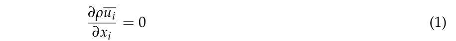
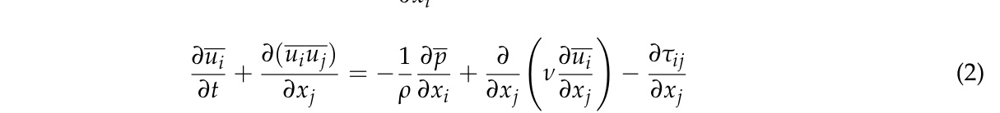
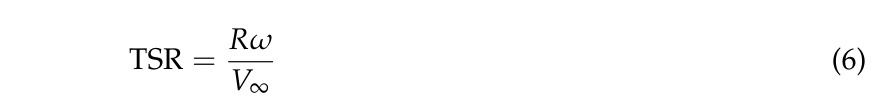
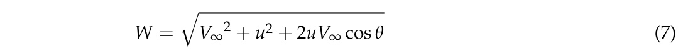
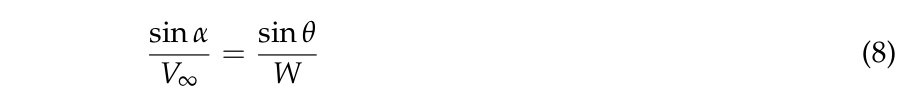
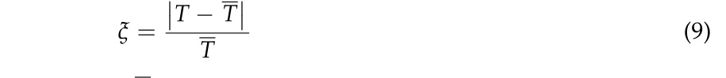
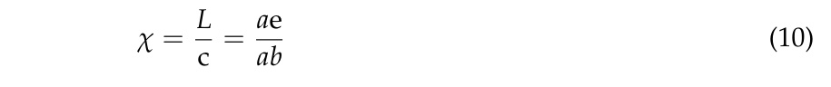

# Aerodynamic Analysis of a Helical Vertical Axis Wind Turbine

> Source: PDFs/va4.pdf
Article
Qian Cheng 1, Xiaolan Liu 1, Ho Seong Ji 2, Kyung Chun Kim 2 and Bo Yang 1,*
School of Mechanical Engineering, Shanghai Jiao Tong University, Shanghai 200240, China;
stu-mike@sjtu.edu.cn (Q.C.); liu_xiaolan@sjtu.edu.cn (X.L.)
School of Mechanical Engineering, Pusan National University, Busan 609-735, Korea;
hsji@pusan.ac.kr (H.S.J.); kckim@pusan.ac.kr (K.C.K.)
*
Correspondence: byang0626@sjtu.edu.cn; Tel.: +86-21-3420-6871
Academic Editor: Frede Blaabjerg
Received: 20 February 2017; Accepted: 16 April 2017; Published: 22 April 2017

## Abstract

Vertical axis wind turbines (VAWTs) are gradually receiving more and more interest due to
their lower sensitivity to the yawed wind direction. Compared with straight blades VAWT, blades
with a certain helicity show a better aerodynamic performance and less noise emission. Nowadays
computational fluid dynamics technology is frequently applied to VAWTs and gives results that
can reflect real flow phenomena. In this paper, a 2D flow field simulation of a helical vertical axis
wind turbine (HVAWT) with four blades has been carried out by means of a large eddy simulation
(LES). The power output and fluctuation at each azimuthal position are studied with different tip
speed ratio (TSR). The result shows that the variation of angle of attack (AOA) and blade-wake
interaction under different TSR conditions are the two main reasons for the effects of TSR on power
output. Furthermore, in order to understand the characteristics of the HVAWT along the spanwise
direction, the 3D full size flow field has also been studied by the means of unsteady Reynold Averaged
Navier-Stokes (U-RANS) and 3D effects on the turbine performance can be observed by the spanwise
pressure distribution. It shows that tip vortex near blade tips and second flow in the spanwise
direction also play a major role on the performance of VAWTs.

## Keywords

helical vertical axis wind turbine (HVAWT); power fluctuation; blade-wake interaction;
three dimensional effects

## 1. Introduction

Due to severe fossil fuel shortages and global warming issues, wind energy is attracting more and
more interest as an environmentally friendly and clean energy source. In general, the turbines used
in wind energy conversion systems can be classified into two groups: horizontal-axis wind turbines
(HAWTs) and vertical-axis wind turbines (VAWTs). There are three different types of VAWTs based on
the rotor shape: straight, canted, or helical. Compared with HAWTs, it is believed that VAWTs have
several advantages, including lower sound emissions, increased power output and higher adaptability
to yaw and so on [1].
However, VAWTs are usually complex rotating systems that represent a great challenge
to researchers and engineers.
Many efforts have been devoted to their study using simplified
mathematical methods. The stream-tube model is one of the methods which is always considered
as the pioneer in predicting the overall aerodynamic performance of a VAWT [2]. Its principle is
based on the streamwise momentum equation. Then, calculations can be performed in a series of
stream-tubes to observe the non-uniform velocity distribution of fluid. Though the model has been
improved to give the multiple stream-tube model [3], it still fails to handle transient simulations at
high blade loading and under high Reynolds number conditions. Another method is the panel method,
which was first adopted by Dixon et al. [4] to study blade-wake interactions, and vortex stretching
and contraction in the wake region of VAWTs. In this method, the flow is assumed as the potential
flow, which is contrary to the real conditions, especially for the low TSR condition under which
viscosity plays a dominant role. With the development of supercomputers and the message passing
interface (MPI) method, overall performance prediction of VAWTs has gradually become possible in
recent years by means of computational fluid dynamics (CFD). Chen and Lian [5] simulated a 2D
VAWT with unsteady RANS (U-RANS) equations. The effects of solidity and TSR on the peak power
performance were studied, and vortex shapes based on 2D calculation were discussed. Zhang et al. [6]
also studied the dynamic performance of a 2D blade with a NACA 0015 profile by the applying the
RNG k-epsilon turbulence model. It was found that the solution accuracy of this method was poor in
the regions where serious flow separation was observed. Meanwhile, Li et al. [7] used a novel large
eddy simulation (LES) method to simulate 2.5D flow field, in which a VAWT was studied at a certain
blade length along the spanwise direction and the periodic boundaries on both top sides were specified.
Though the overall results obtained from the method were much closer to experimental data than 2D
results, the effects of the tip vortex on the turbine performance were omitted. In order to get a deeper
understanding of the mechanism of VAMT, Howell et al. [8] simulated the wind flowing around a
turbine equipped with straight blades using a 3D full-scale model with wind tunnel experiments to
validate the calculation results.
In order to improve performance of the turbine, some new devices have been designed. Gorlov’s
turbine, or helical vertical axis wind turbine (HVAWT), is one of these novel turbine designs, which
differs considerably from conventional straight turbines and was introduced by Gorlov [9]. HVAWT is
believed to have excellent performance due to its curved blades, which are helically twisted around
the rotor axis. Some researchers have studied HVAWTs by CFD simulation. Alaimo et al. [10] analyzed
the aerodynamic difference between VAWTs equipped with straight and helical blades separately by
the application of 3D U-RANS simulation. It was shown that a helical rotor generated less power but
displayed more stable performance in comparison with a straight rotor. Similar results can also be
found in the works of Schuerich and Brown [11,12]. These authors adopted a vorticity transport model
to investigate the 3D performance of turbines with straight, curved, and helical blades under unsteady
wind conditions. The results showed that wind velocity oscillation was the main cause of the power
loss observed on a turbine with non-twisted blades compared with a HVAWT. Some researchers have
also focused on the study of hydrokinetic performance of HVAWTs. A helical vertical axis marine
turbine was studied by Yang and Shu [13], and Particle Image Velocimetry (PIV) measurements were
carried out to get the detailed velocity contours around the rotors. Some comparisons between the
experimental results of marine turbines with helical blades and straight blades have been carried
out to investigate the influence of pitch angle and slatted diffusers on hydrokinetic characteristics by
Kirke [14]. The results showed that the helical blades had little effect on the efficiency of vertical axis
marine turbine but could run much more smoothly than those with traditional straight blades.
Since Gorlov introduced the helical blade concept in 1995, most of the efforts were usually devoted
to the application of helical blades in marine turbines, where the results shows that helical blades do
have several advantages over straight blades, such as lower power fluctuation and so on. However,
the study of the application of helical blades in wind turbines is relatively rare, so in this paper a
HVAWT was chosen as the study object to evaluate the performance of helical blades in a wind
turbine. Meanwhile, most of previous studies were just focused on the overall machine performance
features, such as power coefficient and so on. More data and deeper analysis of detailed turbine
performance seldom can be found in the published materials. Thus, in this study, 2D and 3D unsteady
simulation, by means of LES and U-RANS, have been performed to investigate the flow field of a
HVAWT. The calculation results, with the help of experimental data, have revealed the effects of TSR,
output fluctuation and 3D flowing field on turbine performance in detail.

## 2. Numerical Method Setup

### 2.1. Geometrical Introduction

The HVAWT studied in this paper is shown in Figure 1. It consists of four helical blades with
NACA0018 profile, and a blade phase angle change of 70 degrees was adopted. The shaft and blades
are connected together by several welded arms, so that the energy could be smoothly transferred from
the blades to a generator. In this study, the arms and shaft were simplified in order to focus on the
behavior of the blades as well as reduce the meshing difficulty and computational resource demands.
Some of the main geometrical parameters are listed in Table 1.

Figure 1. The sketch of HVAWT.
Table 1. Main geometrical parameters of the tested model.

| Feature | Quantity/Type |
| --- | --- |
| Blade number | 4 |
| Blade profile | NACA 0018 |
| Chord length (c) | 0.1 m |
| Rotor radius (R) | 0.21 m |
| Blade height (H) | 0.54 m |

### 2.2. Solving Equations

Compared with the 2D LES method, 3D LES can provide more accurate and abundant results by
adapting it to 3D full size HVAWT simulation. However, after considering the space discretization in
the spanwise direction, the total mesh elements were increased to several hundred or even several
thousand times than before. This is a big challenge to computer resources, and will result in months
of time being needed to finish only one simulation. Thus, in this paper 2D LES was adapted for the
following reasons: (1) The total number of mesh elements is more acceptable than in the 3D LES
method; (2) by applying 2D LES to the simulation of HVAWT, the effects of airfoil aerodynamics
performance on total power output can also be precisely captured. The three-dimensional effects, like
tip vortex and second flow, were then studied by 3D U-RANS simulation.
In this paper, LES was adopted in the 2D flowing field simulation. In the LES algorithm, large
scale eddies are explicitly solved, while the effects of smaller eddies are taken into account by a
Sub-Grid-Scale model. The governing equations of LES are defined as:

where τij is the subgrid stress, and can be calculated from ρ(uiuj − uiuj).
The SIMPLEC scheme was used to couple the pressure-velocity field.
For 2D LES spatial
discretization, a least squares cell-based method was used, and second order discretization was
applied for pressure. As for momentum cheme, bounded central differencing was used.
As for the 3D simulation, considering the excessive computational resource and time demands of
LES, the U-RANS method was applied for 3D full scale simulation though some useful information
on the flow field had to be sacrificed. U-RANS has been widely applied for HVAWT performance
analysis. In the turbulent flow simulation, the turbulence model used has a significant effect on the
computational accuracy. The shear stress transport (SST) k-ω model is a model that combines the k-ε
and k-ω models. A weighting function is defined in this model, which can automatically activate
the k-ω model to solve the viscous sublayer near the wall, and then change to k-ε model in far field
flow. The model shows great advantages for the prediction of the phenomena related with adverse
pressure gradients and separating flows according to Qian et al. [15], so it is believed that the model is
appropriate for HVAWT simulation.
For 3D U-RANS simulation, the second-order difference method was applied for pressure
discretization, second-order upwind discretization was used for momentum, turbulent kinetic energy,
and other values. For both 3D and 2D simulation, second-order implicit discretization was applied for
time marching. Thus, both the spatial and temporal accuracy are at least second order to guarantee the
precision of the final results. All of the above equations were solved by ANSYS Fluent 16.0, which is
designed by ANSYS Corporation in the United States, Pennsylvania.

### 2.3. Boundary Condition

The computational domain and boundary conditions are shown in Figure 2. In order to eliminate
the inlet effect as well as to obtain a fully developed wake flow, the computational domain in front of
and behind the HVAWT were extended 15R and 40R, respectively. The inlet velocity is 9 m/s in this
paper, and the rotational speed varied with different TSR condition. The whole domain was divided
into two zones; the rotational inner zone, and the stationary outer zone. These two domains were
connected together by a non-conformal interface. To achieve more accurate data transmission, sliding
mesh method was applied to this interface rather than moving reference frame (MRF) method for
unsteady simulations.

Figure 2. The computational zone division and boundary condition setting.
In order to ensure a good mesh quality, O-block topologies were used to get orthogonal grids
near the blade surface. In the 3D case, the HVAWT needed special treatment due to the fact its blades
are twisted helically in the spanwise direction. The middle domain was divided into four parts, each
of which corresponded to one blade. These four parts were twisted together with the same helical
trend with respect to the rotors in order to generate a finer grid. Since Y+ has a dominant role in
calculating the turbulent boundary layer, a Y+ of less than 1 was selected for the rotor surface to solve
the viscous sublayer directly for both 3D and 2D simulation. The mesh density is of great concern in
the performance prediction as well. Hence, a mesh independency test was performed using different
mesh sizes. The mesh parameters tested in this paper are shown in Table 2, and as shown in Figure 3a,
mesh 2 is able to capture the precise torque results and avoid high grid quantities at the same time,
so in this study mesh 2 is chosen as the spatial discretization mesh for the following 2D research.
The corresponding grid structures of 2D and 3D are shown in Figure 4a,b, respectively.
Table 2. 2D Grid discretization parameters for independence check.

| Types | Total Elements | Y Plus |
| --- | --- | --- |
| Mesh 1 | 295,180 | 5 |
| Mesh 2 | 501,340 | 1 |
| Mesh 3 | 683,980 | 1 |

Figure 3. The total torque output at 1.46 TSR condition. (a,b) represent the mesh density and time step
independence check respectively.

Figure 4. The mesh adjacent to the blade. (a,b) represent the mesh applied in 2D and 3D simulation
respectively.
Too large a time step always results in the divergence of solutions, while too small a time step
would take an enormous time to finish only one revolution. Thus, a proper time step must be selected
for the time marching. As shown in Figure 3b, a time step, ∆τ = 0.0001 s, was selected for the following
study. For all of the case studied in this paper, at least 15 revolutions were simulated to get accurate
results at certain TSR condition, and we considered the data was adoptable and accurate only if the
torque output appear to be periodical with time within at least three revolutions.

## 3. Experimental Validation

Performance tests of a HVAWT were conducted in a wind tunnel in Chonbuk National University
in Korea by Heo et al. [16]. The HVAWT used in the experiments was in a 2.6:1 scale model of
the unit used for the CFD simulation with the same aspect ratio of 0.77 and blade solidity of 0.29.
The wind tunnel properties are shown in Table 3. The wind velocity was measured by an anemometer.
The rotation speed of the turbine was adjusted by a variable load controller. As shown in Figure 5,
by detecting the frequency of the voltage fluctuation, the rotation speed of HVAWT, n, is calculated by
Equation (3):

where f is the frequency of output voltage, m is the number of magnetic pole pairs. The power
output was calculated by the ratio of electrical power to the power conversion efficiency. In this
study, the power conversion efficiency is 0.9. In order to absorb the power output of the HVAWT,
a power sinker was equipped. In order to guarantee the comparability between the CFD results and the
experimental results, the experiment was also carried out under the same Reynolds number condition
as the CFD method, which is 60,800 in this paper.
Table 3. Wind tunnel properties.

| Feature | Quantity/Type |
| --- | --- |
| Wind tunnel type | Closed Circuit type |
| Test section | 5 m × 2.5 m × 20 m |
| Wind velocity range | 0.5–30 m/s |
| Turbulence intensity | 1.5% or less |

Figure 5. Experiment rigs in the wind tunnel. (a,b) represent the wind tunnel and measuring
devices respectively.

## 4. Results

### 4.1. Total Torque Analysis and Its Validation

The power of a HVAWT usually comes from several sources: pressure force and viscosity force.
In these cases, the chord length based Reynolds number, Rec, was 60,800. The reason why we choose
this Reynolds number is that 60,800 Reynolds number is the designed operation condition of the
HVAWT studied here. The pressure force also can be resolved into two mutually perpendicular forces:
tangential force Ft and normal force Fn. The tangential force is the force parallel to the chord direction
while the normal force is at right angles to the tangential force. Then, the total torque and the power
coefficient Cp of the HVAWT can be derived by Equations (4) and (5) as follows:

where Ft1, Ft2, Ft3 and Ft4 represent the instantaneous tangential force of blades1,2,3,4 respectively. D is
revolution diameter, H is the blade height, V∞corresponds to the velocity in the far field.
Rotation speed is a very important parameter for the power output of HVAWT besides the
wind velocity. Thus, TSR is usually introduced as a comprehensive parameter to study the working
mechanism of a HVAWT. In this paper, the definition of TSR can be found in Equation (6):

The power coefficient at different TSR values is shown in Figure 6. The HVAWT model used in
the experiment is a 2.6:1 scale model of the one used for 3D CFD simulation, and the aspect ratio and
blade solidity all remain the same. It is found from the figure that the three curves obtained from
experiments, 2D and 3D simulations respectively, have the same profile, that the power coefficient is
varied non-monotonically with TSR. At TSR 1.8, the power coefficient reaches the maximum value.
Another interesting thing noticed from Figure 6 is that when TSR increases to 1.8, there appeared to be
a sudden drop of the power coefficient predicted by 2D U-RANS. This is because in the 2D U-RANS
simulation, the effects of blade roughness were considered. At high TSR condition, the relative velocity
is larger than lower TSR, the boundary layer become thinner at the same time. When the boundary
layer thickness reaches the same order of magnitude as the blade roughness height, it will result in a
sudden rise of the viscosity force on the blades, some twenty times than before at 2.3 TSR. Because of the
viscosity force, the power coefficient decreases correspondingly. In comparison with the experimental
data, the results obtained from 3D simulation are more reasonable than those from the 2D simulation.
This is because in the 2D LES simulation the three dimensional effects was ignored naturally, and only
the airfoil shape influences were considered.

Figure 6. Power coefficient at different TSR with Reynold number 60,800.
The instantaneous torque of the HVAWT at different TSR values is shown in Figure 7. The black
and red lines represent the results of the 2D U-RANS and LES simulation, respectively. It is found
that due to the uniform arrangement of the four blades along the azimuthal direction, the torque is
varied with a 90◦cycle. Furthermore, the peak torque position during one revolution is also rotated in
a counterclockwise direction with the increase of TSR. As for the differences between the U-RANS and
LES methods, it is obvious to see that the instantaneous torque results of the LES method show much
distinct oscillation. This is caused by the fact the U-RANS method applied a time averaged solver,
which would smoothen the oscillation along with the time scale.

Figure 7. The power output at different TSR conditions, (a–f) represent 0.9, 1.14, 1.25, 1.46, 1.8, 2.3 TSR
λ respectively, red line and black lines represent the 2D LES and U-RANS results, respectively.

### 4.2. Blade Aerodynamics Analysis by the LES Method

#### 4.2.1. Blade Torque

Angle of attack (AOA), α, is considered as one of the most major factors for blade aerodynamic
performance, especially in the case of HVAWTs, whose AOA varies significantly during one revolution.
In this study, AOA was defined as the angle included between the chord direction and the relative
velocity, W, as shown in Figure 2 and it was calculated by Equations (7) and (8):

The results of AOA, α, at different TSR in one revolution are shown in Figure 8a. It is found that
as TSR increased, the maximum AOA decreased from 85◦to 30◦correspondingly and the position of
the maximum AOA moved counterclockwise as well. It is shown in Figure 8b that the power output
of a single blade varied significantly in a revolution due to the changing value of the AOA. In the
upwind zone, 0◦–180◦azimuthal position, the power output increased with increasing TSR. This is
because at higher AOA, a much more obvious and severe flow separation occurs, and this results in
a sudden loss of the power. It is noticed that in the downwind zone, 180◦–360◦azimuthal position,
the negative power also increased with the increase of TSR.

Figure 8. (a,b) represent the angle of attack and power output of single blade along one revolution
under different TSR conditions respectively.
The instantaneous total torque of HVAWT can be simply derived from the summation of all
four blades’ torque. The results of instantaneous torque output of each blade at different TSR values
(0.9, 1.46 and 2.3), are shown in Figure 9. As seen in the figure, the torque fluctuated more wildly
under the condition of TSR 0.9 than those under the conditions of TSR 1.46 and 2.3. This is because
for 0.9 TSR condition, not only the AOA is much larger than others, but also its variation ratio is the
highest compared with other TSR conditions. An abrupt transition of AOA occurred at 155◦azimuthal
position for 0.9 TSR condition. On the other hand, because of the relatively larger negative AOA α of
0.9 TSR condition at downwind zone, the power needed to maintain the rotation trend of HVAWT
was less than other TSR conditions. Contrary to 0.9 TSR condition, at larger TSR condition, the power
generated in the upwind zone become much larger due to the much smaller attack angle. However,
in the downwind zone for high TSR condition, a larger negative power is generated in this region
compared with other small TSR conditions, leading to a severe self-consumption of the total power
generation. It explains the reduction of the net power of HVAWT at 2.3 TSR compared with 1.46 or
1.8 TSR conditions.

Figure 9. Instantaneous torque generation of each blade during one revolution; subfigures (a–c)
correspond to the results at 0.9, 1.46, 2.3 TSR, respectively.

#### 4.2.2. Detailed Flow Field Analysis

In order to study the reason for the power differences at different TSR conditions, the vertical
vorticity distributions are shown in Figure 10. The positive data corresponds to counterclockwise
rotation. In the azimuthal range from 0◦to 180◦, the wind flow can be divided into four periods,
namely attached flowing, separated flowing, vortex detaching and reattached flowing as shown in Figure 11.

Figure 10. The vorticity distributions of HVAWT at different azimuthal positions.
However, for different TSR conditions, the time milestone for each period and the detailed flow
field at the same period all varied significantly. It’s found that higher TSR condition have a delay effect
on the vortex detachment as shown in Figures 10 and 11. Meanwhile, the size of the shedding vortex
also diminished with the increase of TSR due to the smaller AOA, as shown in Figure 8a.

Figure 11. The streamlines at 60◦, 90◦, 150◦, 180◦, (a–c) corresponding to the results at TSR 0.9, 1.46
and 2.3 respectively, red frames represent the wake vortex generated from another blade.
As shown in Figure 10, with the increase of TSR λ, the vortices shedding from blades gradually
developed a circle trajectory. This is because the flow field near the rotors of the HVAWT is a
combination of the far-field flow and the induced rotation movement. Thus, as the TSR increases, which
means a higher rotation speed, the effects of rotation movement on the flow field are raised at the same
time. Due to the rotation movement of the wake flow, the flow pattern near the blades was affected by
the wake vortex derived from another rotor as shown in Figure 11. This blade-wake interaction caused
an obvious drop of the lift and drag force, which all contribute a lot to the power output. This explains
the sudden drop of power output at 135◦azimuthal position for 2.3 TSR conditions, compared with
the 1.8 TSR results.
For the azimuthal range between 180◦and 360◦, as shown in Figure 12, because of the negative
angle of attack, there appears to be a counterclockwise circulation around the blades. According to
the Kutta-Joukowski theorem, for the flow around any shape, as long as there is a circulation, it must
generate a lift force, and its direction is determined by a right angle counter-rotation of the inflow
velocity based on the circulation direction. Thus in this case, the lift force generated at downwind zone
will point to the trailing edge as a negative power source. When the TSR increased, the AOA decreased
sufficiently, as shown in Figure 8a. Furthermore, because of the larger power extraction from wind at
the upwind zone for high TSR conditions, the airflow velocity reaching the downwind region blades
becomes smaller compared with lower TSR conditions, which can also result in a decrease of AOA.
Thus, due to the smaller AOA at high TSR conditions, it is hard for the flow to reach the dynamic stall
angle. Much bigger lift force then was generated which served as a source of negative power. This
explains the bigger negative power of high TSR conditions, as shown in Figure 8b.

Figure 12. The streamlines and pressure distribution around blade leading edge at azimuth 270◦,
(a–c) corresponding to the results at TSR 0.9, 1.46 and 2.3, respectively.

#### 4.2.3. Power Fluctuation

Besides the power output, stable operation is also considered as one of the key factors to evaluate
the performance of HVAWTs. Any severe power fluctuation would inevitably increase the difficulty
of voltage stabilization and aggravate the risk of breakdown of the whole power generation unit.
Thus, in this case, the fluctuation coefficient, ξ is introduced to study the stability of HVAWT. ξ can be
calculated by the equation:

where T represents the instantaneous torque, T represents the averaged torque in a revolution.
The power fluctuation results are shown in Figure 13. At the lower TSR, because of the higher
oscillation of AOA shown in Figure 8a, the power output fluctuates wildly and the maximum coefficient
reaches 1.1. While the TSR is increased gradually, the changing ratio of AOA during one revolution
becomes smoother, which can give rise to a stable power generation during one revolution. However,
when the TSR is increased to a certain degree, a sudden rise in power fluctuation can be found in
the figure. This can be explained by the blade-wake interaction phenomena shown in Figure 11c.
The blade-wake interaction can cause a sudden decrease of the power output of blades, and results in
higher power fluctuation. Therefore, it is very important for a HVAWT to choose an optimized TSR to
get not only higher power output but also much more stable power supply, which is about 1.8 in this
case with a Reynolds number of 60,800.

Figure 13. Power fluctuation coefficient at different azimuthal points and TSR conditions, the lines on
axis plane are isoline of power fluctuation coefficient.

### 4.3. The Three Dimensional Effects on Aerodynamics Performance

The power coefficient derived from 3D U-RANS simulation is shown in Figure 14. It is obviously
found from the figure that the averaged power coefficient marches well with that obtained from
experiments than the results of 2D simulation and power output fluctuation seem to decrease
significantly as well.
The stable power output of a HVAWT can be attributed to its helical structure. Since every single
helical blade has a range of azimuthal angles, the total power generation is a summation of a series of
single airfoil powers, leading to much wider range of phase angles than 2D or straight blade at any
specific moment. This wider azimuthal range leads to much smoother power output.

Figure 14. Power coefficient results derived by 2D LES and 3D U-RANS methods for Rec = 60,800,
TSR = 1.46.
Furthermore, the tip vortex generated on the blades also has a significant influence on the
aerodynamic performance. Therefore, in order to investigate its effects, the pressure distribution on
blade surface at different height position is calculated as a function of chord position χ. The definition
of chord position χ is shown in Figure 15. For any random point d on blade surface, the chord position
χ is defined as the division the distance L, the distance between the leading edge a and the projection
point of d on chord ab, and chord length c as shown in Equation (10):

Figure 15. Chord position definition scheme.
The pressure distributions along the blade at different azimuth are shown in Figure 16, the static
pressure P applied in this study is a gauge pressure relative to normal atmosphere. By comparing
the 2D pressure distribution with 3D data at different height position, it is found that there is an
obvious difference between 2D and 3D results in the 90% spanwise section. It can be explained by
the streamlines around the rotor shown in Figure 17b. Because of the enormous pressure differences
between pressure and suction sides, the flow at blade tips naturally slip into the suction side on
upwind zones, the previous airfoil flow then is severely disturbed by this injection fluid, resulting in a
decrease of the power generation. Thus, it is necessary to conduct some methods to reduce its effect on
aerodynamic performance in future work.
As for 50% spanwise section, because of the symmetric structure, little differences of pressure
are found between 2D and 3D results, except for the results at 120◦azimuthal position. It can be
explained by the streamlines showed in Figure 17. At the 120◦azimuthal position, the upper parts of
blades are under severe stall conditions according to the AOA shown in Figure 8a, and then generate
a high-pressure zone at the dynamic stall region as shown in Figure 18. The flow around middle
section is forced to head down due to the vertical pressure differences, which is also called second
flow, and then cause a distortion of upwind airfoil to much thinner shape. As for the 90% span-wise
position, even though it confronts the same situation as it at 50% height position, however, because of
the limited length left upper, the dynamic stall region is counteracted by the tip vortex significantly,
thus flow in the 85% spanwise position can still keep parallel to the horizontal plane, thus maintaining
a stable power output.

Figure 16. Pressure distribution along blades at different height positions at TSR 1.46, (a–d) corresponded
to 30◦, 60◦, 90◦, 120◦respectively.

Figure 17. Streamlines around blades when the mid-plane of rotor at different azimuthal positions at
TSR 1.46.

Figure 18. Pressure distribution at inner blade surface, (a,b) represents the results when the 95% and
50% span-wise plane reached 120◦azimuths, respectively.

## 5. Discussion

In this study, because of the limited computational resources, the 3D U-RANS method was applied
for the full size simulation. The geometrical HVAWT model used in the experiment is a 2.6:1 scale
model which was applied in the 3D CFD simulation, thus the aspect ratio and solidity were guaranteed
to have the same values in both methods. However, as shown in Figure 6, there are still differences
between the 3D simulation and the experimental results. It is therefore necessary to adopt a more
advanced numerical simulation technology, like the 3D LES method, to get more accurate and detailed
information on the flow field in future research.
It is shown in Figure 9 that the power output in one revolution does not strictly follow the 90◦
cycle as predicted for the HVAWT with four blades, especially adopting a higher TSR. This is because
when TSR is increased gradually, the flow field of the HVAWT becomes more like the flowing around a
rotating cylinder, and a wake vortex shedding pattern is observed as shown in Figure 19. The unstable
flow is introduced by the wake vortex and combined with the original flowing with 90◦cycle to form
the real flow field. Therefore, the effect of the shedding wake vortex on the aerodynamic performance
should be studied to get more accurate estimation of a HVAWT performance.

Figure 19. Wake vortex diffusion pattern at 2.3 TSR condition.

## 6. Conclusions

In this paper, 2D LES was applied for the power out prediction of HVAWTs under different TSR
conditions. It shows that it’s necessary to choose an appropriate TSR during turbine design, since a
small or large TSR can both lead to a deterioration of the power output of the HVAWT. In this paper,
the maximum power output occurs at 1.8 TSR condition with 10% power coefficient. The detailed
flow field was studied to figure out the mechanism of TSR effects on power generation. The power
fluctuation of VAWTs has also been investigated, and shows that the maximum power fluctuation
coefficient can reach up to 150% under lower TSR conditions. Thus, it is clear that the source of the TSR
influences mainly comes from the variation of AOA and blade-vortex interaction phenomena under
different TSR conditions. Meanwhile, in order to study the three dimensional effects on aerodynamic
performance, a 3D U-RANS full scale simulation was conducted. It shows that because of the tip
vortex, the static pressure at the leading edge near tips is increased, then results in a decrease of the
power generation at high height regions. Furthermore, the flow field can also be influenced by the
second flow caused by its upper or lower parts. Because of these major three dimensional effects under
small aspect ratio conditions, the total power coefficient decreases nearly 33.3% compared to the 2D
results. Thus, future efforts should be devoted to eliminating or decreasing the three dimensional
effects on aerodynamic performance of HVAWTs, like adding some fences on the tips or blade surface
to remove the second flow and tip vortex effects.

## Acknowledgments

This work was supported by the Korea Institute of Energy Technology Evaluation and
Planning (KETEP), granted financial resource from the Ministry of Trade, Industry & Energy, Republic of Korea.
(G031711213, G031896312) Partial support was given by the Ministry of Trade, Industry and Energy (MOTIE)
and the Korea Institute for Advancement of Technology (KIAT) through the “Promoting Regional Specialized
Industry” program (G02A01190063302). This work was also supported by the National Research Foundation of
Korea (NRF) grant funded by the Korean government (MSIP) through GCRC-SOP (No.2011-0030013). The first
author is grateful for the financial support from CAMPUS Asia Program for his time in Korea.

## Author Contributions

Qian Cheng conducted the CFD simulation and wrote the paper, Xiaolan Liu and Ho Seong
Ji conceived and performed the wind tunnel experiments; Prof. Bo Yang and Kyung Chun Kim reviewed and
edited the manuscript.

## Conflicts of Interest

The authors declare no conflict of interest.

## Nomenclature

AOA
Angle of attack
c
The chord length
Cp
Power coefficient
f
The frequency of output voltage
Fn
Normal force
Ft
Tangential force
H
Blade height
HAWTs
Horizontal axis wind turbines
HVAWT
Helical vertical axis wind turbine
LES
Large eddy simulation
m
The number of magnetic pole pairs
MPI
Message passing interface
MRF
Moving reference frame
n
The rotational speed (r/min)
p
Pressure
R
The radius of HVAWT
Rec
Chord length based Reynold number
T
Torque
T
Averaged torque
TSR
Tip speed ratio
u
The rotational velocity (m/s)
U-RANS
Unsteady Reynold Averaged Naiver-Stokes
VAWTs
Vertical axis wind turbines
V∞
Far field velocity
W
The relative velocity

## Greek symbol

α
Angle of attack
θ
The azimuthal angle
∆τ
The time step
ω
The rotational speed (rad/s)
ξ
Power fluctuation coefficient
χ
The relative chord position

## References

1.
Ferreira, C.J.S.; van Bussel, G.J.W.; van Kuik, G.A.M. Wind tunnel hotwire measurements, flow visualization
and thrust measurement of a vawt in skew. J. Sol. Energy Eng. Trans. ASME 2006, 128, 487–497. [CrossRef]
2.
Rajagopalan, R.G.; Fanucci, J.B. Finite difference model for vertical axis wind turbines. J. Propul. Power
1985,
1, 432–436. [CrossRef]
3.
Strickland, J.H. Darrieus Turbine: A Performance Prediction Model Using Multiple Streamtubes; Sandia Labs.:
Albuquerque, NM, USA, 1975.
4.
Dixon, K.; Simao Ferreira, C.; Hofemann, C.; Van Bussel, G.; Van Kuik, G. A 3D unsteady panel method for
vertical axis wind turbines. In Proceedings of the European Wind Energy Conference & Exhibition (EWEC),
Brussels, Belgium, 31 March–3 April 2008.
5.
Chen, Y.; Lian, Y. Numerical investigation of vortex dynamics in an h-rotor vertical axis wind turbine.
Eng. Appl. Comput. Fluid Mech. 2015, 9, 21–32. [CrossRef]
6.
Zhang, L.; Liang, Y.; Liu, X.; Jiao, Q.; Guo, J. Aerodynamic performance prediction of straight-bladed
vertical
axis wind turbine based on CFD. Adv. Mech. Eng. 2013, 5. [CrossRef]
7.
Li, C.; Zhu, S.; Xu, Y.-l.; Xiao, Y. 2.5D large eddy simulation of vertical axis wind turbine in consideration
of
high angle of attack flow. Renew. Energy 2013, 51, 317–330. [CrossRef]
8.
Howell, R.; Qin, N.; Edwards, J.; Durrani, N. Wind tunnel and numerical study of a small vertical axis wind
turbine. Renew. Energy 2010, 35, 412–422. [CrossRef]
9.
Gorlov, A.M. Unidirectional helical reaction turbine operable under reversible fluid flow for power systems.
US Patent 5,451,137, 19 September 1995.
10.
Alaimo, A.; Esposito, A.; Messineo, A.; Orlando, C.; Tumino, D. 3D CFD analysis of a vertical axis wind
turbine. Energies 2015, 8, 3013–3033. [CrossRef]
11.
Scheurich, F.; Brown, R.E. Modelling the aerodynamics of vertical-axis wind turbines in unsteady wind
conditions. Wind Energy 2013, 16, 91–107. [CrossRef]
12.
Schuerich, F.; Brown, R.E. Effect of dynamic stall on the aerodynamics of vertical-axis wind turbines. AIAA J.
2011, 49, 2511–2521. [CrossRef]
13.
Yang, B.; Shu, X. Hydrofoil optimization and experimental validation in helical vertical axis turbine for
power generation from marine current. Ocean Eng. 2012, 42, 35–46. [CrossRef]
14.
Kirke, B. Tests on ducted and bare helical and straight blade darrieus hydrokinetic turbines. Renew. Energy
2011, 36, 3013–3022. [CrossRef]
15.
Qian, W.-Q.; Fu, S.; Cai, J.-S. Numerical study of airfoil dynamic stall. Acta Aerodyn. Sin. 2001, 19,
427–433.
16.
Heo, Y.-G.; Choi, K.-H.; Kim, K.-C. CFD and experiment validation on aerodynamic power output of small
vawt with low tip speed ratio. J. Korean Soc. Mar. Eng. 2016, 40, 330–335. [CrossRef]
© 2017 by the authors. Licensee MDPI, Basel, Switzerland. This article is an open access
article distributed under the terms and conditions of the Creative Commons Attribution
(CC BY) license (http://creativecommons.org/licenses/by/4.0/).
