# Aerodynamic Analysis of a Helical Vertical Axis Wind Turbine

Qian Cheng, Xiaolan Liu, Ho Seong Ji, Kyung Chun Kim, and Bo Yang

## Abstract
Vertical axis wind turbines (VAWTs) are receiving more interest because they are less sensitive to yawed wind direction. Compared with straight-bladed VAWTs, blades with helicity show better aerodynamic performance and lower noise. This paper uses 2D large-eddy simulation (LES) for a four-bladed helical VAWT (HVAWT) and 3D unsteady Reynolds-averaged Navier-Stokes (U-RANS) for the full rotor. The study examines power output, power fluctuation, angle of attack, blade-wake interaction, tip-vortex effects, and second flow.

## 1. Introduction
VAWTs are attractive because they can accept wind from all directions and do not require yaw systems. Their main drawback is lower efficiency than HAWTs. Prior methods for VAWT analysis include stream-tube models, panel methods, and CFD.

The helical blade concept is one way to improve smoothness. Earlier work on marine helical turbines showed lower power fluctuation than straight blades. This paper studies whether the same benefit holds for wind turbines.

## 2. Numerical Method Setup

### 2.1 Geometrical Introduction
The HVAWT studied here has four helical blades with a NACA 0018 profile. The blade phase angle change is 70 degrees.

| Feature | Quantity/Type |
| --- | --- |
| Blade number | 4 |
| Blade profile | NACA 0018 |
| Chord length `c` | 0.1 m |
| Rotor radius `R` | 0.21 m |
| Blade height `H` | 0.54 m |

### 2.2 Solving Equations
For the 2D case, LES is used. The governing equations are:

```math
\frac{\partial \rho u_i}{\partial x_i} = 0
```

```math
\frac{\partial u_i}{\partial t} + \frac{\partial (u_i u_j)}{\partial x_j} = -\frac{1}{\rho}\frac{\partial p}{\partial x_i} + \frac{\partial}{\partial x_j}\left(\nu \frac{\partial u_i}{\partial x_j}\right) - \frac{\partial \tau_{ij}}{\partial x_j}
```

For the 3D case, U-RANS with the SST `k-omega` model is used.

### 2.3 Boundary Condition
The domain extends 15R upstream and 40R downstream. Inlet velocity is 9 m/s. Sliding mesh is used for unsteady simulations. A mesh study selected mesh 2 with 501,340 cells and `Y+ < 1`.

## 3. Experimental Validation
Wind-tunnel data from Heo et al. are used for validation at Reynolds number 60,800. The experimental rotor is a 2.6:1 scale model with the same aspect ratio and solidity.

Power coefficient is defined as:

```math
\Gamma_{Total} = (F_{t1} + F_{t2} + F_{t3} + F_{t4})R
```

```math
C_P = \frac{\Gamma_{Total}\omega}{\frac{1}{2}\rho D H V_\infty^3}
```

```math
TSR = \frac{R\omega}{V_\infty}
```

## 4. Results
The power coefficient varies non-monotonically with TSR and reaches its maximum at TSR 1.8. The 3D result matches experiment better than the 2D result.

The main findings are:

- Lower TSR gives larger angle-of-attack variation and stronger torque fluctuation.
- Higher TSR improves upwind power but increases negative power in the downwind zone.
- Blade-wake interaction causes a sudden power drop at some azimuths.
- The helical structure smooths total power output by spreading blade phases across azimuth.
- Tip vortex and second flow reduce the 3D performance relative to 2D.

### Figures
Figure 1: sketch of the HVAWT.


Figure 2: computational zone division and boundary conditions.
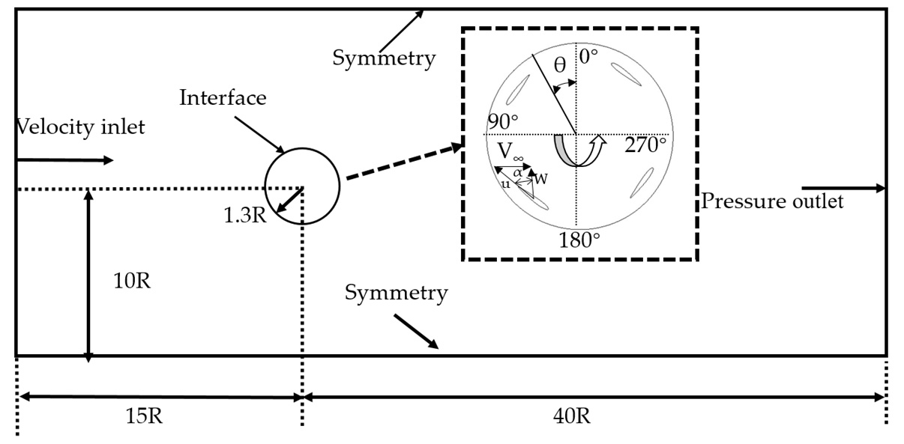

Figure 3: mesh density and time-step independence checks.


Figure 4: mesh adjacent to the blade in 2D and 3D.


Figure 5: wind-tunnel setup and measurement devices.
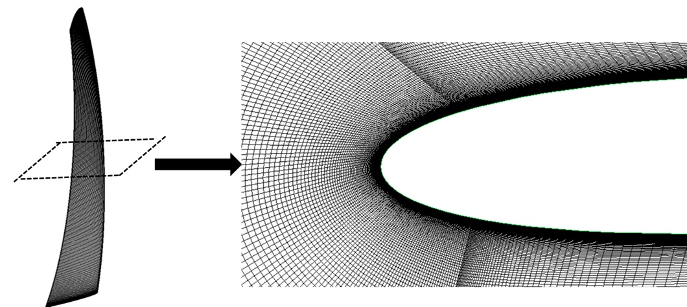

Figure 6: power coefficient versus TSR at Re = 60,800.


Figure 7: instantaneous power output at different TSR values.
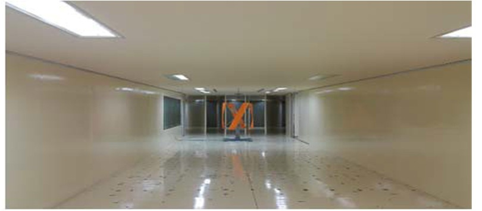

Figure 8: angle of attack and single-blade power over one revolution.
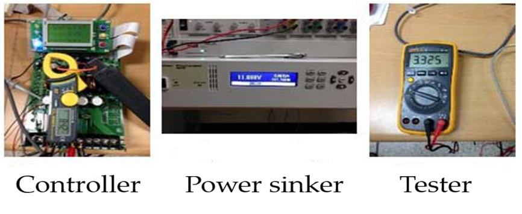

Figure 9: instantaneous blade torque at TSR 0.9, 1.46, and 2.3.
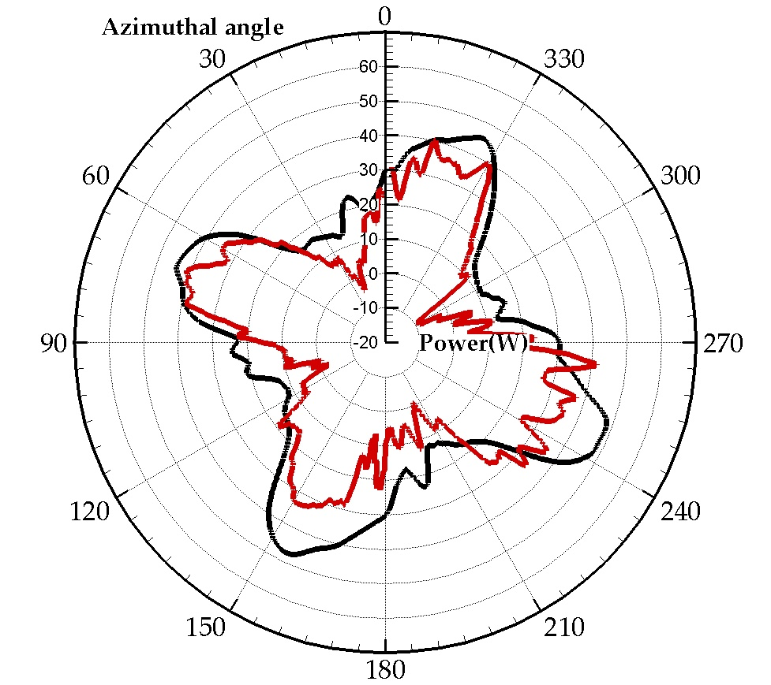

Figure 10: vorticity distributions at different azimuths.


Figure 11: streamlines showing wake-vortex interaction.


Figure 12: streamlines and pressure at azimuth 270 degrees.
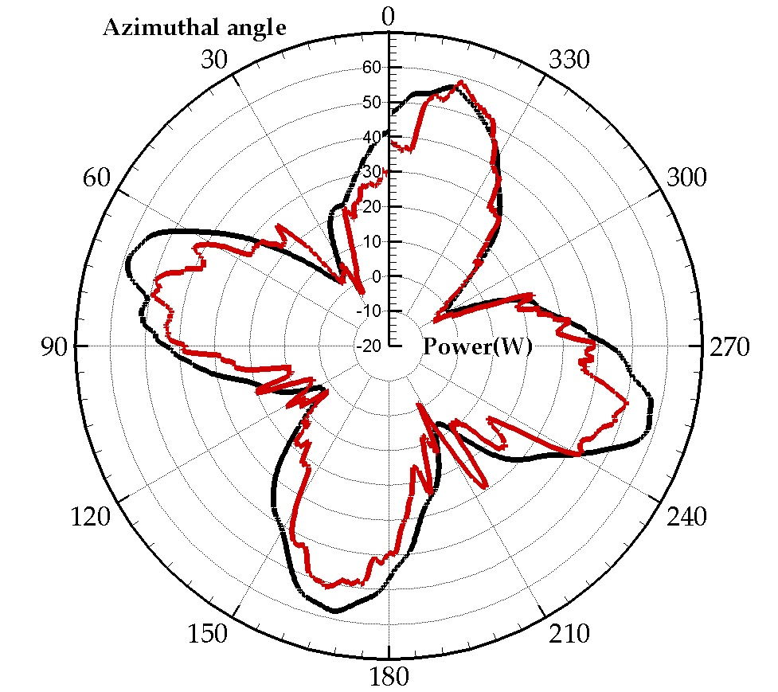

Figure 13: power-fluctuation coefficient map.
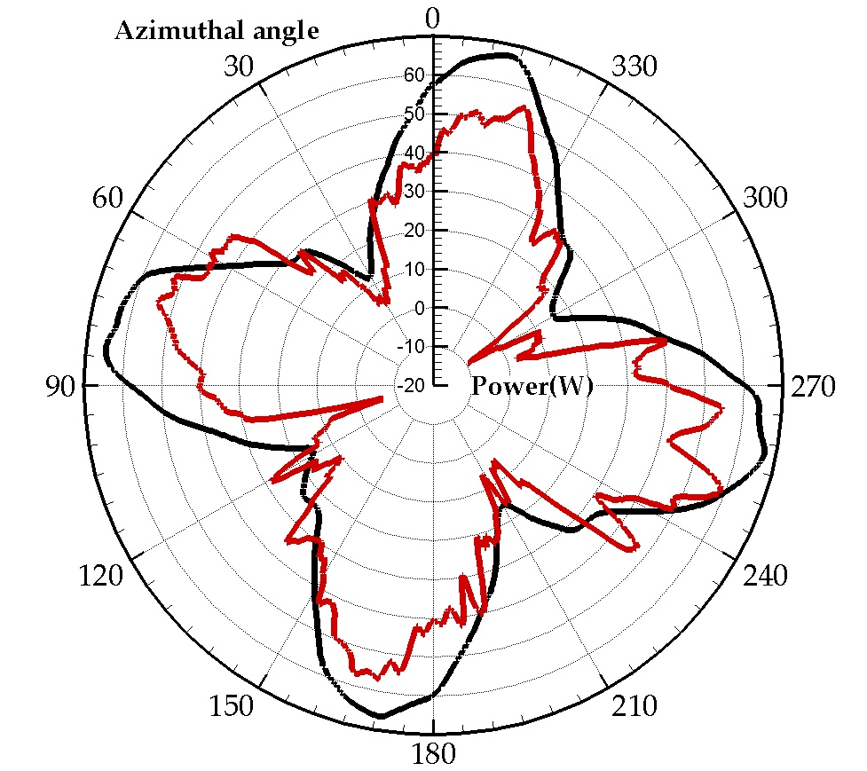

Figure 14: 2D LES versus 3D U-RANS power coefficient.


Figure 15: chord-position definition scheme.
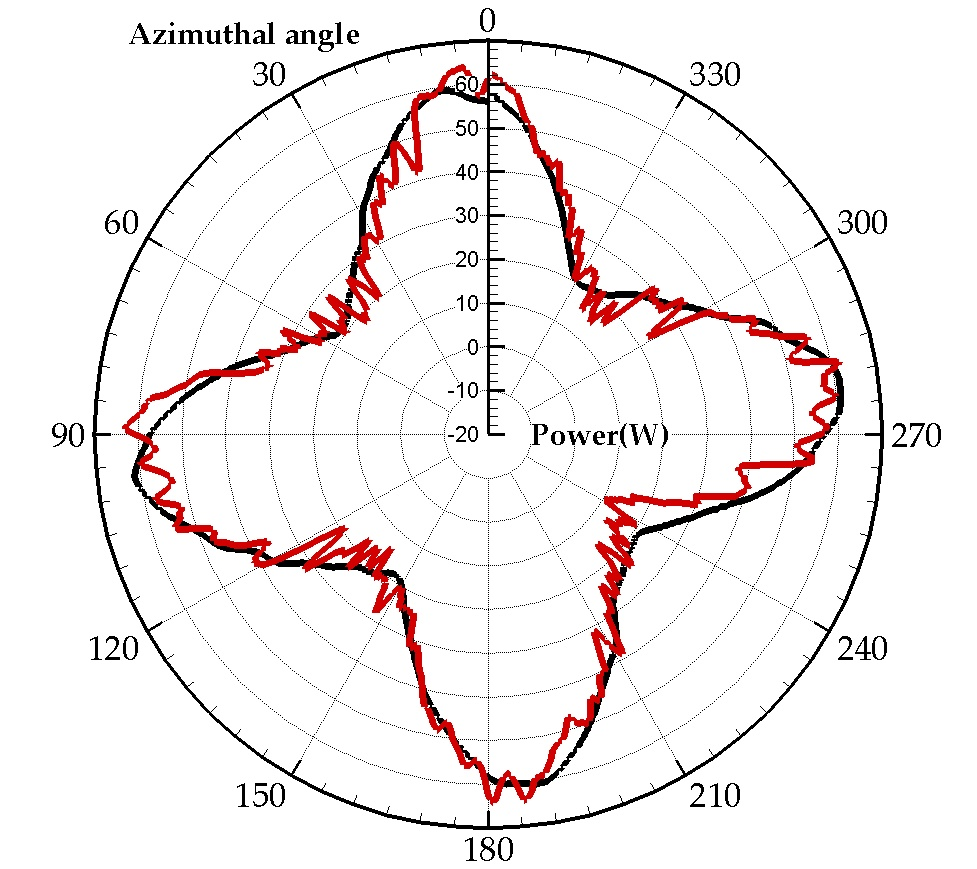

Figure 16: pressure distributions along the blade at multiple spanwise positions.
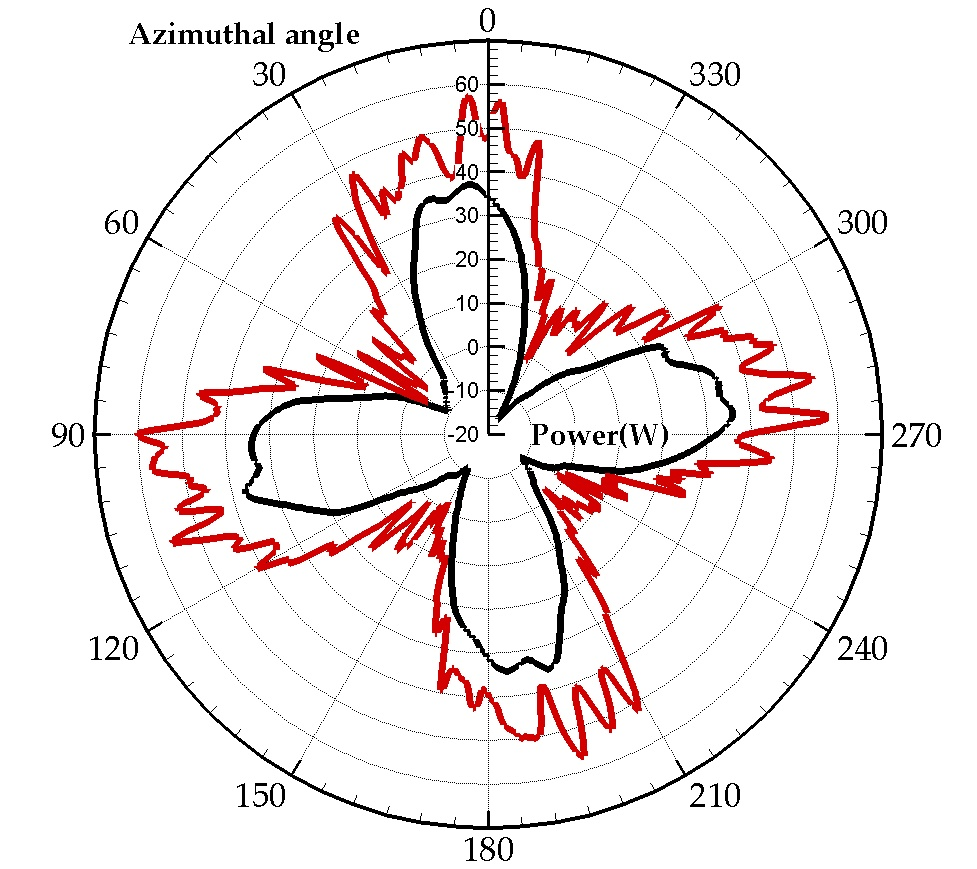

Figure 17: streamlines around blades at different azimuths.
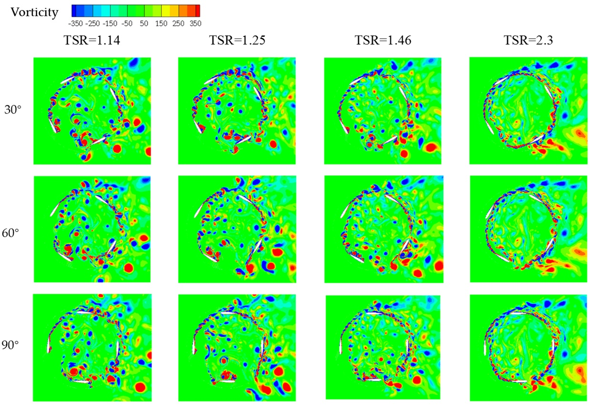

Figure 18: pressure distribution in the inner blade surface at 120 degrees.
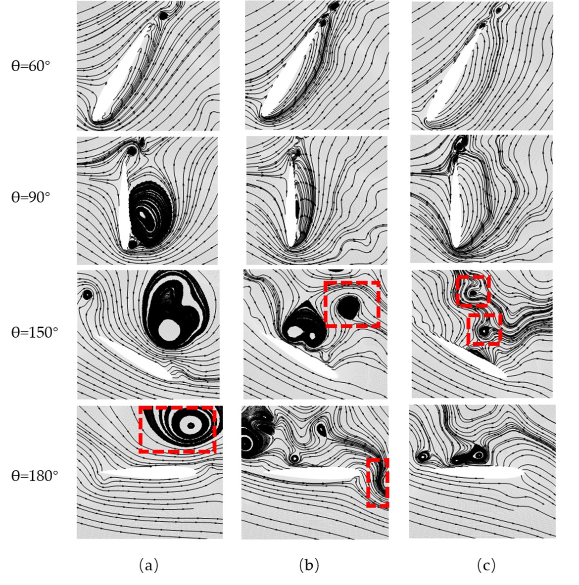

Figure 19: wake-vortex diffusion at TSR 2.3.


> Note: additional extracted panel crops from composite figures are saved as `images/va4-fig20.jpg` through `images/va4-fig42.jpg`.

## 5. Discussion
The 3D U-RANS model still differs from experiment, so the paper recommends higher-fidelity 3D LES in future work. At higher TSR, the flow behaves more like a rotating cylinder with a wake-vortex shedding pattern.

## 6. Conclusions
The paper concludes that TSR choice is critical. The best performance here occurs at TSR 1.8 with a power coefficient around 10%. The dominant mechanisms are angle-of-attack variation, blade-vortex interaction, tip vortex, and second flow. The authors suggest using tips or other geometry changes to reduce 3D losses.

## References
1. Ferreira et al. wind-tunnel hotwire measurements and thrust measurement of a VAWT in skew.
2. Rajagopalan and Fanucci, finite-difference model for VAWTs.
3. Strickland, multiple-streamtube performance model.
4. Dixon et al., 3D unsteady panel method for VAWTs.
5. Chen and Lian, vortex dynamics in an H-rotor VAWT.
6. Zhang et al., CFD of straight-bladed VAWT.
7. Li et al., 2.5D LES of VAWT at high angle of attack.
8. Howell et al., wind-tunnel and numerical study of a small VAWT.
9. Gorlov, unidirectional helical reaction turbine patent.
10. Alaimo et al., 3D CFD analysis of a VAWT.
11. Scheurich and Brown, aerodynamics of VAWTs in unsteady wind.
12. Scheurich and Brown, dynamic stall on VAWTs.
13. Yang and Shu, helical vertical axis turbine for marine current.
14. Kirke, helical and straight blade hydrokinetic turbines.
15. Qian et al., numerical study of airfoil dynamic stall.
16. Heo et al., CFD and experiment validation on small VAWT power output.
