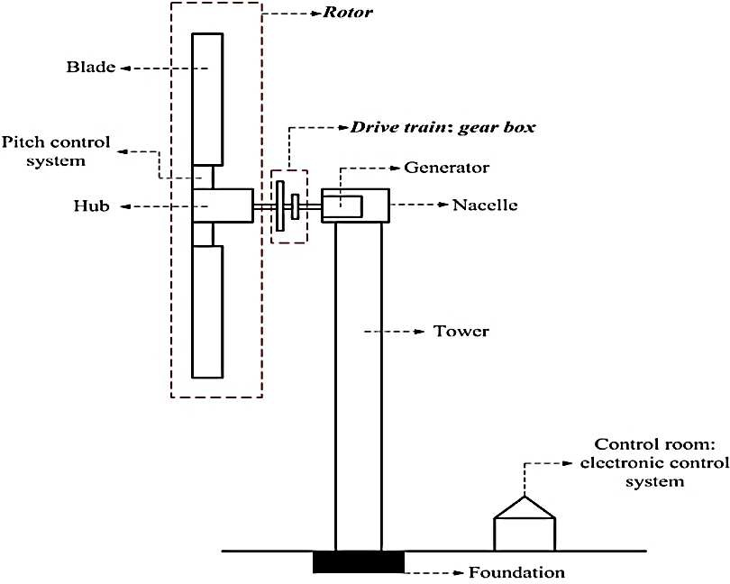
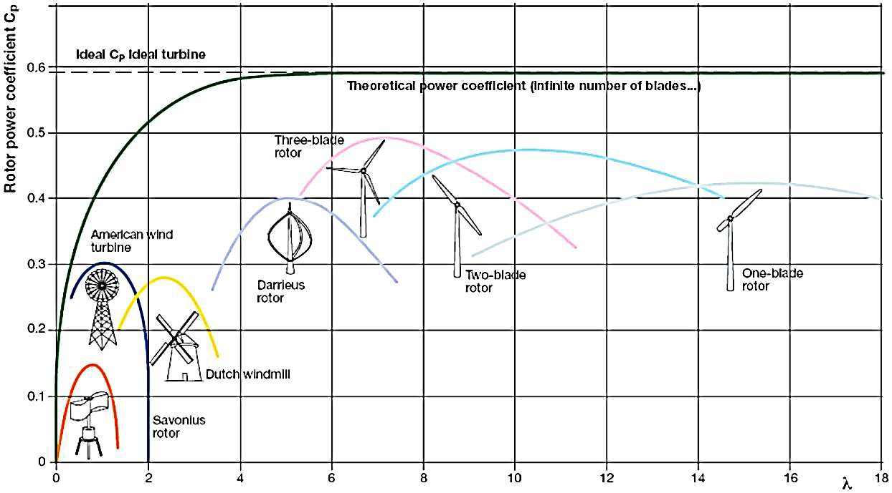
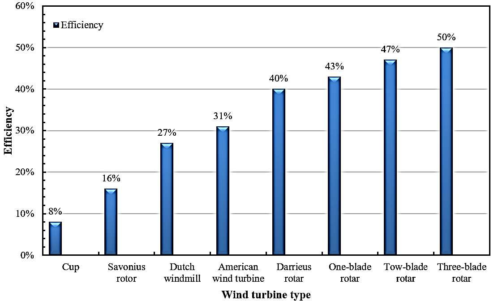
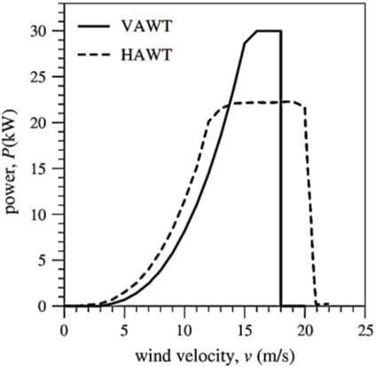
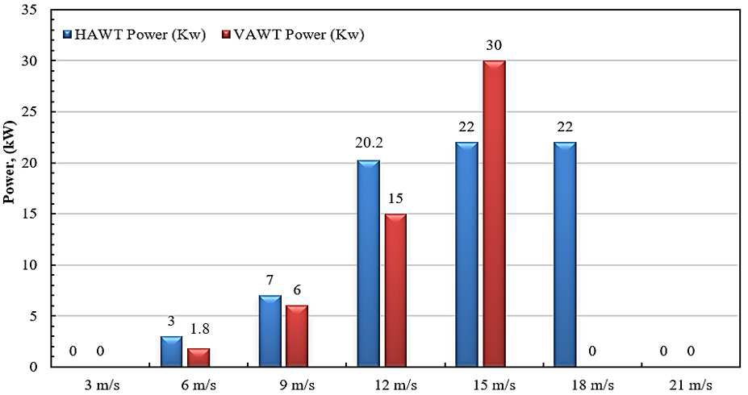

#sources
# Comparison between Horizontal and Vertical Axis Wind Turbine

Mohammad A. Al-Rawajfeh and Mohamed R. Gomaa

## Abstract
The paper compares HAWTs and VAWTs across efficiency, torque, noise, maintenance, capacity, aspect ratio, and operating environment. It argues that HAWTs are still more efficient, while VAWTs are quieter, more compact, and better suited to cities and marine applications. The paper also emphasizes that VAWTs can be practical for small-scale and low-noise deployment.

## 1. Introduction
Wind turbines convert kinetic energy in wind into mechanical and electrical energy. The paper notes that renewable-energy systems increasingly combine solar and wind.

## 2. Methodology

### 2.1 An overview of HAWT and VAWT
VAWT rotation is perpendicular to the wind direction and is typically driven by drag. HAWTs use lift, drag, or both and usually require yaw control. VAWTs can accept wind from any direction and may place the generator near the ground.

### 2.2 Characteristics of VAWT and HAWT
The paper states that HAWTs are more efficient, while VAWTs generate higher torque because they rotate more slowly. Fatigue damage affects both types and becomes worse in offshore conditions.

### 2.3 Wind turbine power theory

```math
KE = \frac{1}{2} m U^2
```

```math
P = \frac{1}{2}\rho A U^3
```

```math
C_P = \frac{P_T}{P_W}
```

The paper again cites the Betz limit at `Cp = 0.593`.

## 3. Results and Discussion

### 3.1 Rotor power coefficient and the tip speed ratio
The comparison plots show HAWT performance generally above VAWT performance. The paper states that lift-based turbines perform better than drag-based turbines as TSR increases.

### 3.2 Wind turbine efficiency
The table in the paper ranks peak efficiency from 8% for cup VAWTs up to 50% for three-blade HAWTs.

### 3.3 Properties of both type
The paper compares site selection, materials, durability, capacity, noise, maintenance, yaw control, fatigue, stress, power coefficient, tip-speed ratio, peak efficiency, altitude, and self-starting behavior.

### Appendix table summary
The appendix concludes that both types can be useful, but HAWTs dominate large-scale generation while VAWTs are favored where noise, compactness, and omnidirectional flow matter.

### Figures
Figure 1: VAWT and HAWT parts.


Figure 2: rotor power coefficient and tip speed ratio comparison.


Figure 3: power coefficient versus tip speed ratio.


Figure 4: peak efficiencies.


Figure 5: properties at the same nominal power.


Figure 6: power versus wind speed.


Figure 7: power according to wind velocity.


Figure 8: offshore VAWT site.


> Note: additional extracted crops are saved as `images/va6-fig9.jpg` through `images/va6-fig21.jpg`.

## 4. Conclusion
The paper concludes that HAWTs are better for large capacities and remote/offshore sites, while VAWTs are better for cities and small-scale use. HAWTs are more efficient, but VAWTs are cheaper to maintain, quieter, and more flexible in difficult siting conditions.

## References
The paper includes references on wind-energy fundamentals, offshore wind, VAWT design, and performance comparisons between HAWTs and VAWTs.
