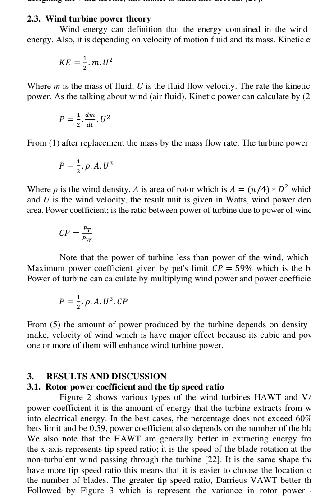

# Comparison between horizontal and vertical axis wind turbine

Mohammad A. Al-Rawajfeh, Mohamed R. Gomaa

Department of Mechanical Engineering, Faculty of Engineering, Al-Hussein Bin Talal University, Ma'an, Jordan

## Article Info

### Article history:

- Received Sep 27, 2022
- Revised Dec 2, 2022
- Accepted Dec 21, 2022

## ABSTRACT

Since ancient times, wind energy has been exploited in various fields, it was at the beginning used to rotate pumps for the purposes of agriculture and irrigation. At the beginning of the 18th century, wind turbines began to produce electricity with modest capacities. In the following years, the capacities of the turbines increased and it became necessary to deal with this increase by reducing losses and inventing new designs for turbines Suitable for working conditions and installation location. The rotor power coefficient in a wind turbine can reach 0.59 which is called the bets limit. The vertical axis wind turbine (VAWT) design was invented for working conditions, capacities, and places, in which it may be difficult to install older Horizontal axis wind turbines (HAWT). The efficiency of the HAWT is still higher than the VAWT, in addition, the amount of efficiency in the HAWT is greater than the VAWT by 25% but the VAWT has the amount of torque more than the HAWT. The main objective of this research is to compare the VAWT and the HAWT, taking into account several aspects which have been reviewed to try to understand the importance of the two designs.

### Keywords:

- Aspect ratio
- Drag machine
- Horizontal axis wind turbine
- Lift machine
- Power coefficient
- Tip speed ratio
- Vertical axis wind turbine

This is an open access article under the CC BY-SA license.

### Corresponding Author:

Mohamed R. Gomaa

Department of Mechanical Engineering, Faculty of Engineering, Al-Hussein Bin Talal University

71110 King Hussien Bin Talal University Str, Ma'an, Jordan

Email: Behiri@bhit.bu.edu.eg

## 1. INTRODUCTION

Wind turbines can be exploited as a direct source of mechanical energy, or as an indirect source of energy, which means converting the kinetic energy in the wind into the rotational energy in the turbines also converting it into electrical energy [1]-[4]. Wind turbine farm consist of a potentially large group of wind turbines covering an area of hundreds of square miles [5]. Also, wind power system components are turbines, capacitor bank, main transformer, transmission lines and bus bars [6]. All of renewable energy sources (solar and wind) with an energy storage system that leads to a diversity of energy sources and reduces greenhouse emissions [7]-[11]. The initial cost of construction is high, and for example there are very many countries, some of their energy production comes from wind energy, for example, Denmark in 2008 produced 8% of wind source [12]. Recently, the generation of electricity by wind turbines has become popular and economically feasible [13]. Among the most important renewable energy sources are the sun and wind, and the aspiration to increase energy production through them in the future is something that has actually been implemented [14]. Industry of wind turbine become looking to reduce production and maintenance costs [15]. Horizontal wind turbines are the oldest among their types and their advantages are that the torque is high, which makes them suitable for rotating water pumps. And even that the blades in them are not complicated and were for example made of wood [16]. Vertical axis wind turbines (VAWT) are more suitable for marine and urban applications due to their low noise, durability and cost reduction compared to others and their ability to expand. On the other hand their aerodynamic performance is weaker than horizontal axis wind turbines (HAWT) [12].

The aim of this comparison is to determine the basic differences between the two most popular designs of wind turbine, which in turn would be a good idea by describe many features, advantages, disadvantages, explain many characteristics and comparing of the subtypes that fall into one of the basic type of wind turbine.

## 2. METHODOLOGY

### 2.1. An overview of HAWT and VAWT

The wind turbine witch has vertical axis, that the rotation is perpendicular to the direction of the wind [17]. As the rotation is a result of the dragging force and is the most influential in VAWT [18]. Figure 1(a) shows the VAWT [19] parts and note that it is relatively simple compared to HAWT [20], in addition it contains supports between the rotor blades and rotates with it in order to achieve more balance, and the performance for the turbine is controlled by an engine at different rotation speeds. The motor can also be exploits as a rotating starter, as this type of turbine is not self-starting.

The motive power of a horizontal wind turbine is either the lift force, drag force or both [21]. Figure 1(b) shows the main parts of the wind turbine with a horizontal axis, the direction of wind attack the turbine from the hub side. The wind is perpendicular due to the blades. The rotating part find a lifting and dragging force, also from them to rotate the generator and produce electrical energy. Here there is pitch control to adjust the angle of inclination of the blades in order to increase or decrease the lifting or dragging force, according to the parameters of the control part.

Figure 1. Wind turbine diagram for (a) VAWT parts [19] and (b) HAWT parts [20]

### 2.2. Characteristics of VAWT and HAWT

In the production of electricity from wind energy, we have two types of turbines in use. VAWT and HAWT. HAWTs are the most efficient in extracting power from wind and converting it into rotational power then into electrical power [22]. Horizontal wind turbines can be upwind, meaning that the rotor is meets the wind direction, and it can also be downwind, so that the rotor is behind the Nacelle in some designs, but this type is the least efficient among the types of HAWT. The yaw controlling system can also be available in this type of wind turbine and is responsible for keeping the rotor in a perpendicular direction to the air flow [23]. The torque in the VAWT is higher relative than the HAWT ones, because the rotational speed is slower and therefore the torque is higher [24]. Fatigue damage negatively affects the life of the wind turbine of all kinds, whether HAWT or VAWT, and the resulting stresses deliberately affect all components of the wind turbine either directly, such as the tower, and blades, or indirectly, such as the generator and gearbox. Some components of the changes that occur and negatively affect the response time, then we can say that the offshore wind turbine is subjected to more stresses than the onshore, due to the waves crashing into it and the salts volatile from the seas that affect the paint and the tower in particular as well as the foundations [25].

With the passage of time, the capacity for wind turbines increases, as well as their sizes and masses. Therefore, these increases are offset by an increase in stress, repeatedly and periodically. Which leads with the passage of time and the repetition of stresses and vibrations to deformation in the structure. When designing the wind turbine, this matter is taken into account [26].

### 2.3. Wind turbine power theory

Wind energy can definition that the energy contained in the wind by motion, it is called kinetic energy. Also, it is depending on velocity of motion fluid and its mass. Kinetic energy can calculate by (1) [27].

From (5) the amount of power produced by the turbine depends on density of air, area of circle that rotor make, velocity of wind which is have major effect because its cubic and power coefficient. All increase of one or more of them will enhance wind turbine power.

## 3. RESULTS AND DISCUSSION

### 3.1. Rotor power coefficient and the tip speed ratio

Figure 2 shows various types of the wind turbines HAWT and VAWT. On the y-axis, it shows power coefficient it is the amount of energy that the turbine extracts from wind and converts it effectively into electrical energy. In the best cases, the percentage does not exceed 60%, the highest value is given as bets limit and be 0.59, power coefficient also depends on the number of the blades, turbine type and capacity.

We also note that the HAWT are generally better in extracting energy from wind than the VAWT. On the x-axis represents tip speed ratio; it is the speed of the blade rotation at the tip relative to the speed of the non-turbulent wind passing through the turbine [22]. It is the same shape that the HAWT modern turbines have more tip speed ratio this means that it is easier to choose the location of the wind farm and the lower the number of blades. The greater tip speed ratio, Darrieus VAWT better than the old designs of HAWT.

Followed by Figure 3 which is represent the variance in rotor power coefficient and the tip speed ratio between several wind turbines, as well as Figure 3 which is chart explains the values of rotor power coefficient and the tip speed ratio, as well is gives an idea of the difference between the types of wind turbine.

Figure 2. Diagram showing some types of wind turbines and their rotor power coefficient and tip speed ratio [22]

![Figure 2. Diagram showing some types of wind turbines and their rotor power coefficient and tip speed ratio [22]](../images/va6-fig3.jpg)

Figure 3. Wind turbines rotor power coefficient and the tip speed ratio for several wind turbines

### 3.2. Wind turbine efficiency

Table 1 shows some characteristics of a group of wind turbines also the characteristics are orientation, use, the main acting force, and peak efficiency. As shown in the following table and chart, there is a noticeable discrepancy in the efficiency of wind turbines based on the history of the industry. The more modern turbine the more efficient it is. The machines that work with lifting force have a higher efficiency, also, the increase in the number of rotor blades is offset by an increase in efficiency to a certain extent. On the other hand, increase in number of blades generates more stress in the turbine and must be taken into account when designing it. Here can deduce that the HAWT has a higher efficiency than the VAWT. Followed by Figure 4 which is chart explains the deferent peak efficiency for eight types of wind turbines.

Figure 4. Wind turbines peak efficiencies

Table 1. Comparison of efficiency between some types of HAWT and VAWT [28]

| Design | Orientation | Use | The main acting force | Peak efficiency% |
| --- | --- | --- | --- | --- |
| Cup | VAWT | Modern cup as Anemometer | Drag | 8% |
| Savonius rotor | VAWT | Flettner ventilator, cooling device in vehicles | Drag | 16% |
| Dutch windmill | HAWT | 16th century to pumping water | Lift | 27% |
| American wind turbine | HAWT | 18th century to pumping water and electricity generation | Lift | 31% |
| Darrieus rotor | VAWT | 20th century to electricity generation | Lift | 40% |
| One-blade rotor | HAWT | 20th century to electricity generation | Lift | 43% |
| Tow-blade rotor | HAWT | 20th century to electricity generation | Lift | 47% |
| Three-blade rotor | HAWT | 20th century to electricity generation | Lift | 50% |

### 3.3. Properties of both type

In this part of the research, some properties will be defined of each type and highlight the pros and cons and properties which distinguishes one from the other.

#### 3.3.1. Horizontal axis wind turbine (HAWT)

HAWT takes power of wind from one direction and works to convert it into rotational power then electricity in generator, but it needs a yaw system on the contrary that VAWT does not need yaw. VAWT is easier to maintenance than the HAWT because it is proximity to the surface of the earth and its lack of need for high-altitude equipment and because of its small capacity compared to HAWT [29]. In HAWT the generator is in the top of the tower in order to obtain the rotational force directly from the rotating part, and a gearbox may also be available to determine the speed of rotation of the generator and control it in order to maintain the integrity of the parts, especially the generator. In some cases, an increase in the altitude above the earth's surface of 10 meters is accompanied by an increase in wind speed of 2% which means an increase in electricity production by 34% [30]. HAWT Also, has developed very significantly and is used in large-scale wind farms [31]. HAWT has the advantage that it does not need external starting, which means that it is a self-starting machine, as well as the aerodynamic loads are fixed to a large extent, which facilitates handling and reduces their danger [32]. Many materials such as iron, aluminium, zinc, copper, titanium, nickel and fiberglass entering the turbine industry HAWT and VAWT as well as some natural biological compounds and thermoplastics are used in the manufacture of blades [33]. In fact, there are two main types of noise produced by wind turbines, which are tow mechanical, and aerodynamic noises. Work began a relatively long time ago to reduce this noise, which is considered a type of audio pollution, and determining the source of this noise is the first step to overcome [34].

Figure 5 shows some differences between the types of small capacity wind turbines 20 kW. Where notice that the differences start from the amount of power coming out of the turbine also here we mean the maximum value, VAWT work in this case at speeds of winds slightly higher than the HAWT the noise generated by the HAWT is 25% higher and this is the case in all turbines, synchronous a generator that was used in both cases in order to unify the characteristics of electricity between the grid and the output from the turbines, and it can be said that it is also in order to obtain electrical characteristics for specific devices and loads, followed by Figure 5 witch is chart represents of the table content and shows some deferent between two type of wind turbine [35].

Figure 6 shows power and wind speed curve for 20 Kw of power VAWT and same nominal capacity of the HAWT, the curve represents that the power begins to increase afterwards cut in speed and to reach the peak at rated wind speed (nominal wind speed). Note that the peak power value is higher in the HAWT. On the other hand, the HAWT operate at a prescribed speed with a lower range 15-18 m/s, on the contrary the VAWT operate at a rated wind speed 11-21 m/s. In both cases all access to cut out speed the turbine stops producing electricity in order to preserve the components from damage that may occur to them due to high temperature, friction, stress and other factors. VAWT is less exposed to storm delay, the control system has been modified to reach power up to 30 kW. Followed by Table 2 which is represent the variance in power production in kW by HAWT and VAWT, as well as Figure 7 which is chart explains the values of power production at several wind velocity.

Table 2. Comparison between the power, for the HAWT and the VAWT in several wind velocity

| Power of wind turbine (m/s) | HAWT Power (kW) | VAWT Power (kW) |
| --- | --- | --- |
| 3 | 0 | 0 |
| 6 | 3 | 1.8 |
| 9 | 7 | 6 |
| 12 | 20.2 | 15 |
| 15 | 22 | 30 |
| 18 | 22 | 0 |
| 21 | 0 | 0 |

Figure 5. Wind turbines properties at the same nominal power

Figure 6. Wind turbines power, and wind velocity for the HAWT and VAWT [35]

![Figure 6. Wind turbines power, and wind velocity for the HAWT and VAWT [35]](../images/va6-fig7.jpg)

Figure 7. Wind turbines power according wind velocity

#### 3.3.2. Vertical axis wind turbine VAWT

There is a topic that should be noted when studying wind turbines, which is aspect ratio AR. It is defined as that the ratio between length of the blade and the radius of the rotor [36]. In the case of the HAWT it has a fixed Aspect ratio since the rotor has a regular circular shape, on the contrary, VAWT can have a large blade length and a small radius, or vice versa, and this means that it has a different aspect ratio and is not necessarily equal to one, as is the case of the HAWT [37]. VAWT extracts wind energy that flows from every direction and is suitable for difficult working conditions and in urban areas and can also, be placed at a certain height without problems for pedestrians and vehicles [38]. VAWT is usually used for low load requirements, unlike the HAWT which is usually used for remote areas and in the offshore witch works in undisturbed wind conditions and clean [39]. Most of the research and experiments conducted on the VAWT began in the seventies and 80th of the last century [40]. The capacity of the VAWT can reach to 6 Mw of power as well as have total mass of 550 ton, it is compatible with an interactive pitch control system. Also, the VAWT is suitable for floating marine applications due to its low center of gravity, which gives it stability in those applications like boats [41]. Figure 8 shows VAWT installed in sea which it is did not need to yaw mechanism, it is catching the attack wind from any direction. VAWT maybe it has pitching control as the sea have no particle that impede movement of wind.

HAWT have more amount of energy production unlike VAWT it's until now use for small scale application, which can reach to 6 Mw of power [41]. HAWT can reach to 20 Mw of power. HAWT it is achieved great growth from the 80s until now [41]. Both types can be equipped with a power control system [35].

#### 3.3.3. HAWT and VAWT comparative

Table 3 shows many comparisons between (HAWT and VAWT). At the beginning the torque is greater in the HAWT than in the VAWT. The sites which can install the turbine on is the same but cannot install HAWT in cities due to noise and yawing is not easy in that, Blade material the same but oldest the HAWT blade made of wood. VAWT have ability of expanded more than the HAWT. Durability is higher in the VAWT than the HAWT. Capacity of the wind turbine become larger and larger but so far HAWT become the bigger, noise become from HAWT higher than once VAWT. Aerodynamic performance better in the HAWT than VAWT, all HAWT exploiting the lifting force as major force but in the VAWT become dragging force, not easily to do maintenance for HAWT due to altitude above ground, yaw control important in HAWT to catch the wind but not required in VAWT because the turbine facing wind direction at all time. Fatigue and stress in HAWT are higher than VAWT due to high and mass, power coefficient in the HAWT higher than VAWT rise to 0.5 facing 0.4 in the VAWT. Tip speed ratio in the HAWT higher than VAWT rise to 14.3 facing 5.1 in VAWT. Peak efficiency in HAWT higher than VAWT rise to 50% facing 40% in VAWT, altitude above ground level in the HAWT higher than the VAWT. Use of HAWT for pumping water and electricity generation but VAWT uses for anemometer device, cooling device in vehicles, flettner ventilator, and electricity generation. Self-starting in the HAWT is available facing VAWT is not suitable. Manufacture material in the HAWT is iron, aluminum, zinc, copper, titanium, nickel, fiberglass and wood. Nominal wind speed in the HAWT is lower, witch the increase in wind speed more danger due to capacity and stress, in the VAWT normal wind speed is higher, which increase in wind speed less danger due to capacity and stress. The HAWT have fixed aspect ratio (AR) equal to one, unlike VAWT have several AR due to dimension of rotor and it is radius. Yow and pitch control taken into account. The HAWT have higher mass than the VAWT. Also, all types have power control system.

Figure 8. VAWT in offshore site [41]

![Figure 8. VAWT in offshore site [41]](../images/va6-fig9.jpg)

## 4. CONCLUSION

The present work is focused on comparison between the HAWT and VAWT. The HAWT are more suitable for large capacities at remote areas and offshore areas, as well as it is efficiency reach to 50% comparing to the VAWT that can reach to 40% and it suitable for small capacities at cities sites and offshore areas. The power coefficient in the HAWT is 2% higher than the VAWT. On the other hand, the HAWT are usually more expensive than VAWT and it is difficult to maintenance because it is greater height above the ground. It is not possible to abandon either type. The modern HAWT can reach to 20 Mw capacity or higher comparing to the VAWT which is reach 6 Mw capacity with using active pitch control. The phenomena witch they occur to generate electricity from wind energy include valley, mountain breeze, sea breezes, land breezes, periods in which should be exploited.

## APPENDIX

Table 3. Comparison between HAWT and VAWT

| Ref. | Type of wind turbine | HAWT | VAWT | Main results |
| --- | --- | --- | --- | --- |
| [16], [24] | Torque | High torque as result of high power and blade length. | Higher torque as a result of lower rotational speed | Both have value of torque suitable for electricity generation, which the electricity generation is the main goal Currently for manufacturing of wind turbines. |
| [25], [35], [34], [35], [29], [41] | Site selection for install | - Onshore - Offshore - Remote area - Should stay away from the area s of buildings and cities | - Onshore - Offshore - Can install in cities due to less noise and did not need to yaw control mean that catch the wind from any direction | They can be installed in approximately the same areas with the superiority of the VAWT because it is calm and attracts winds from all directions. |
| [16], [33] | Blade material | - Fiberglass - Natural biological compounds - Thermoplastics - Wood - metallic | - Natural biological compounds - Thermoplastics - Fiberglass - metallic | The manufacturing materials are very similar because they are machines that generate electricity, and perhaps the difference is that the VAWT has a newer design, which means that it is made of the latest materials. |
| [12] | Ability of expanded | Lower | Higher | VAWT have ability of expanded more than the HAWT, because it is had low cost and easier to install than the HAWT. |
| [12] | Durability | Lower | Higher | The maintenance of the VAWT is easier and suitable for more working conditions. |
| [41], [42] | Capacity | Higher, rise to 20 Mw or higher | Lower, rise to 6 Mw | HAWT have higher capacity than the VAWT and it has large-capacity wind turbine farms. |
| [12], [34], [35] | Noise | Higher | Lower | VAWT is a quieter than the HAWT and it is suitable for working conditions within cities and over a wider range. |
| [29], [32], [41] | Aerodynamic performance | - Greater due to yawing and pitching. - Fixed aerodynamic load to a large extent. | - Weaker may have only pitching. - Non fixed aerodynamic load due to many winds direction attacking. | Pitching and yawing increases the amount of power produced, there are better in the HAWT, in addition the aerodynamic loads hindering power production and it is considered relatively constant in the HAWT. |
| [18], [20], [28] | The main acting force | Lift force | - Drag force most of them. - VAWT with Darrieus rotor it is lift force | HAWT exploits the lifting force mainly in order to generate the momentum force to rotate the rotor. As for the VAWT, the drag force is the most exploited. |
| [29] | Maintenance | Difficult to maintenance due to their higher height above the ground. | Easier to maintenance due to their lower height above the ground. | Maintenance is complicated in the HAWT due to highs above the ground, also it is need special elevators, and unlike the VAWT it is low highs above the ground as well it is easier to maintenance. |
| [23],[38], [41] | Yaw control mechanism | Available for this type and raise its efficiency of wind turbine. | It is not required because the rotation in rotor it is caused by any wind direction. | HAWT exploits yaw control to increase the intake of wind power, on the contrary, the VAWT does not need this feature because it exploits wind energy in any direction. |
| [25] | Fatigue | Negatively affects the lifetime. Larger due to high center of gravity. | Negatively affects the lifetime. Lower due to Low center of gravity. | Fatigue negatively affects the lifetime of both types, especially on HAWT because of the high center of gravity in it, which is the nacelle. |
| [25],[26], [28],[35], [29],[41], [42] | Stress | - Higher capacity, higher mass which mean larger stress - As it uses more in offshore witch stress is increase | - Lower capacity, lower mass which mean lower stress - As it uses less in offshore witch it is stress is decrease | The greater mass of HAWT due to its large capacity increases the stress it faces, as well use of the HAWT in offshore more than the VAWT It always makes it more affected by stress. |
| [22], [27] | Power coefficient | Higher rise to 0.5 approximately in three blade upwind turbine | Lower rise to 0.4 approximately in Darrieus rotor turbine | The power coefficient in the HAWT is 25% higher than the VAWT. |
| [22] | Tip speed ratio | Higher rise to 14.3 in one blade turbine | Lower rise to 5.1 in Darrieus rotor turbine | Tip speed ratio in the VAWT is 64.35% lower than the HAWT. |
| [27], [28] | Peak efficiency | Higher rise to 50% in three blade, upwind turbine | Lower rise to 40% in Darrieus rotor turbine | HAWT is more efficient than the VAWT by 25%. |
| [29] | Altitude above ground level | Higher | Lower | VAWT in general it has lower elevations than the earth's surface, compared with HAWT which is characterized by great heights. |
| [28],[31], [39], [41] | Use | - Grinding grain - Pumping water - Electricity generation | - Anemometer - Cooling device in vehicles - Flettner ventilator - Electricity generation | In addition to generating electricity, the uses depend on quietness, turbine capacity, and ease of maintenance. |
| [19], [32] | Self-starting | Yes | No, may have motor to starting | HAWT is self-starting machine which is does not need for external starting force, unlike the VAWT that need a specific mechanism to start the rotation. |
| [16], [33] | Manufacture material | Iron, aluminum, zinc, copper, titanium, nickel, fiberglass and wood | Iron, aluminum, zinc, copper, titanium, nickel and fiberglass | Very similar materials used in manufacturing of both wind turbines. |
| [35] | Nominal wind speed | Lower, witch the increase in wind speed more danger due to capacity and stress | Higher, which increase in wind speed less danger due to capacity and stress | In case was studied, which is small scale of wind turbines, the result was that the VAWT have higher normal wind speed than the HAWT. |
| [36], [37] | Aspect ratio | Always be one | The value varies based on the rotor length and radius | In fact, there are different values of aspect ratio in VAWT, due to due the difference in the ratio between the length of the rotor and the radius of rotation, unlike the HAWT which have fixed aspect ratio as a result of symmetry between rotation radius and rotor length. |
| [41] | Total mass (all component) | Higher | Lower | HAWT have a total mass higher than the VAWT, also the reasons are result of higher capacity, altitude and some mechanism that existing in the HAWT like yaw control which is not existing in the VAWT. |
| [21], [41] | Pitch control mechanism | Existing | Existing | Both types have mechanism that it is used to change the angle between the blade and the direction of the wind flow, which have name of (pitch control). |
| [35] | Power control system | Existing | Existing | For safe, monitoring and reporting, all types have power control system. |

## REFERENCES

[1] Y. Kumar et al., "Wind energy: Trends and enabling technologies," Renew. Sustain. Energy Rev., vol. 53, pp. 209-224, 2016, doi: 10.1016/j.rser.2015.07.200.

[2] M. R. Gomaa, H. Rezk, R. J. Mustafa, and M. Al-Dhaifallah, "Evaluating the environmental impacts and energy performance of a wind farm system utilizing the life-cycle assessment method: A practical case study," Energies, vol. 12, no. 17, 2019, doi: 10.3390/en12173263.

[3] M. Shalby, A. Abuseif, M. R. Gomaa, AhmadSalah, A. Marashli, and H. Al-Rawashdeh, "Assessment of Dust Properties in Ma'an Wind Farms in Southern Jordan," Jordan J. Mech. Ind. Eng., vol. 16, no. 4, pp. 645-652, 2022.

[4] M. R. Gomaa, W. Hammad, M. Al-Dhaifallah, and H. Rezk, "Performance enhancement of grid-tied PV system through proposed design cooling techniques: An experimental study and comparative analysis," Sol. Energy, vol. 211, pp. 1110-1127, 2020, doi: 10.1016/j.solener.2020.10.062.

[5] S. Bhongade and B. Tyagi, "Participation of Renewable Energy Sources in Restructured Power System," Int. J. Appl. Power Eng., vol. 2, no. 1, 2013, doi: 10.11591/ijape.v2i1.1625.

[6] F. Dastyar and H. Najafi, "Dynamic Modeling of Autonomous Wind-Diesel system with Fixed-Speed Wind Turbine," Int. J. Appl. Power Eng., vol. 1, no. 2, 2012, doi: 10.11591/ijape.v1i2.764.

[7] H. Benbouhenni, "A 24-sectors direct power control-feedforward neural network method of DFIG integrated to dual-rotor wind turbine," Int. J. Appl. Power Eng., vol. 10, no. 4, p. 291, 2021, doi: 10.11591/ijape.v10.i4.pp291-306.

[8] E. T. Sayed et al., "Application of Artificial Intelligence to Improve the Thermal Energy and Exergy of Nanofluid-Based PV Thermal/Nano-Enhanced Phase Change Material," Energies, vol. 15, no. 22, 2022, doi: 10.3390/en15228494.

[9] M. Alsboul, M. S. M. Ghazali, M. R. Gomaa, and A. Albani, "Experimental and theoretical investigations of temperature and solid volume fraction-dependent thermal conductivity of Erbium oxide/Ethylene Glycol (Er 2 O 3 /EG) nanofluid for thermal energy applications," Chem. Eng. Technol., 2022, doi: 10.1002/ceat.202200159.

[10] A. Marashli, E. Alfanatseh, M. Shalby, and M. R. Gomaa, "Modelling single-effect of Lithium Bromide-Water (LiBr-H2O) driven by an evacuated solar tube collector in Ma'an city (Jordan) case study," Case Stud. Therm. Eng., vol. 37, 2022, doi: 10.1016/j.csite.2022.102239.

[11] M. R. Gomaa, T. K. Murtadha, A. Abu-jrai, H. Rezk, M. A. Altarawneh, and A. Marashli, "Experimental Investigation on Waste Heat Recovery from a Cement Factory to Enhance Thermoelectric Generation," Sustain., vol. 14, no. 16, 2022, doi: 10.3390/su141610146.

[12] R. Best and P. J. Burke, "Adoption of solar and wind energy: The roles of carbon pricing and aggregate policy support," Energy Policy, vol. 118, pp. 404-417, 2018, doi: 10.1016/j.enpol.2018.03.050.

[13] K. Lenin, "Descending Viewer Method for Fault Tolerant Control," Int. J. Appl. Power Eng., vol. 7, no. 3, p. 199, 2018, doi: 10.11591/ijape.v7.i3.pp199-210.

[14] M. H. Alsharif, J. Kim, and J. H. Kim, "Opportunities and challenges of solar and wind energy in South Korea: A review," Sustain., vol. 10, no. 6, 2018, doi: 10.3390/su10061822.

[15] A. Bennouk, A. Nejmi, and M. Ramzi, "Performance and FMECA of a wind turbine based on SCADA and lidar data," Int. J. Appl. Power Eng., vol. 8, no. 2, p. 101, 2019, doi: 10.11591/ijape.v8.i2.pp101-109.

[16] H. J. Wagner, "Introduction to wind energy systems," EPJ Web Conf., vol. 54, 2013, doi: 10.1051/epjconf/20135401011.

[17] M. Abkar, "Theoretical modeling of vertical-axis wind turbine wakes," Energies, vol. 12, no. 1, 2019, doi: 10.3390/en12010010.

[18] B. Hand, G. Kelly, and A. Cashman, "Aerodynamic design and performance parameters of a lift-type vertical axis wind turbine: A comprehensive review," Renew. Sustain. Energy Rev., vol. 139, 2021, doi: 10.1016/j.rser.2020.110699.

[19] Y. Jiang, P. Zhao, T. Stoesser, K. Wang, and L. Zou, "Experimental and numerical investigation of twin vertical axis wind turbines with a deflector," Energy Convers. Manag., vol. 209, 2020, doi: 10.1016/j.enconman.2020.112588.

[20] C. J. Bai and W. C. Wang, "Review of computational and experimental approaches to analysis of aerodynamic performance in horizontal-axis wind turbines (HAWTs)," Renew. Sustain. Energy Rev., vol. 63, pp. 506-519, 2016, doi: 10.1016/j.rser.2016.05.078.

[21] M. Douak, Z. Aouachria, R. Rabehi, and N. Allam, "Wind energy systems: Analysis of the self-starting physics of vertical axis wind turbine," Renewable and Suistainable Energy Reviews, vol. 63, pp. 506-519, 2016, doi: 10.1016/j.rser.2016.05.078.

[22] M. Ebrahimpour, R. Shafaghat, R. Alamian, and M. S. Shadloo, "Numerical investigation of the Savonius vertical axis wind turbine and evaluation of the effect of the overlap parameter in both horizontal and vertical directions on its performance," Symmetry (Basel)., vol. 11, no. 6, 2019, doi: 10.3390/sym11060821.

[23] X. Wang, Z. Ye, S. Kang, and H. Hu, "Investigations on the unsteady aerodynamic characteristics of a horizontal-axis wind turbine during dynamic yaw processes," Energies, vol. 12, no. 16, 2019, doi: 10.3390/en12163124.

[24] C. Galinos, T. J. Larsen, H. A. Madsen, and U. S. Paulsen, "Vertical Axis Wind Turbine Design Load Cases Investigation and Comparison with Horizontal Axis Wind Turbine," Energy Procedia, vol. 94, pp. 319-328, 2016, doi: 10.1016/j.egypro.2016.09.190.

[25] C. Sun and V. Jahangiri, "Fatigue damage mitigation of offshore wind turbines under real wind and wave conditions," Eng. Struct., vol. 178, pp. 472-483, 2019, doi: 10.1016/j.engstruct.2018.10.053.

[26] B. Fu et al., "Fatigue reliability analysis of wind turbine tower under random wind load," Struct. Saf., vol. 87, 2020, doi: 10.1016/j.strusafe.2020.101982.

[27] A. Kalmikov, "Wind Power Fundamentals," Wind Energy Eng. A Handb. Onshore Offshore Wind Turbines, pp. 17-24, 2017, doi: 10.1016/B978-0-12-809451-8.00002-3.

[28] H. Meena, "Design and Construction of Vertical Axis Wind Turbine Blades," Int. J. Res. Appl. Sci. Eng. Technol., vol. 10, no. 6, pp. 2673-2675, 2022, doi: 10.22214/ijraset.2022.44170.

[29] J. Li, G. Wang, Z. Li, S. Yang, W. T. Chong, and X. Xiang, "A review on development of offshore wind energy conversion system," Int. J. Energy Res., vol. 44, no. 12, pp. 9283-9297, 2020, doi: 10.1002/er.5751.

[30] K. B. Tawfiq, A. S. Mansour, H. S. Ramadan, M. Becherif, and E. E. El-Kholy, "Wind energy conversion system topologies and converters: Comparative review," Energy Procedia, vol. 162, pp. 38-47, 2019, doi: 10.1016/j.egypro.2019.04.005.

[31] J. U. Parakkal, K. El Kadi, A. El-Sinawi, S. Elagroudy, and I. Janajreh, "Numerical analysis of VAWT wind turbines: Joukowski vs classical NACA rotor's blades," Energy Procedia, vol. 158, pp. 1194-1201, 2019, doi: 10.1016/j.egypro.2019.01.306.

[32] J. Liu, H. Lin, and J. Zhang, "Review on the technical perspectives and commercial viability of vertical axis wind turbines," Ocean Eng., vol. 182, pp. 608-626, 2019, doi: 10.1016/j.oceaneng.2019.04.086.

[33] D. M. Prabowoputra, A. R. Prabowo, A. Bahatmaka, and S. Hadi, "Analytical review of material criteria as supporting factors in horizontal axis wind turbines: Effect to structural responses," Procedia Struct. Integr., vol. 27, pp. 155-162, 2020, doi: 10.1016/j.prostr.2020.07.021.

[34] C. Q. Zhang et al., "Locating and tracking sound sources on a horizontal axis wind turbine using a compact microphone array based on beamforming," Appl. Acoust., vol. 146, pp. 295-309, 2019, doi: 10.1016/j.apacoust.2018.10.006.

[35] L. C. Pagnini, M. Burlando, and M. P. Repetto, "Experimental power curve of small-size wind turbines in turbulent urban environment," Appl. Energy, vol. 154, pp. 112-121, 2015, doi: 10.1016/j.apenergy.2015.04.117.

[36] S. Zanforlin and S. Deluca, "Effects of the Reynolds number and the tip losses on the optimal aspect ratio of straight-bladed Vertical Axis Wind Turbines," Energy, vol. 148, pp. 179-195, 2018, doi: 10.1016/j.energy.2018.01.132.

[37] S. Shamsoddin and F. Porte-Agel, "Effect of aspect ratio on vertical-axis wind turbine wakes," J. Fluid Mech., vol. 889, pp. R11-R112, 2020, doi: 10.1017/jfm.2020.93.

[38] W. Xu, Y. Li, G. Li, S. Li, C. Zhang, and F. Wang, "High-resolution numerical simulation of the performance of vertical axis wind turbines in urban area: Part II, array of vertical axis wind turbines between buildings," Renew. Energy, vol. 176, pp. 25-39, 2021, doi: 10.1016/j.renene.2021.05.011.

[39] S. R. Shah, R. Kumar, K. Raahemifar, and A. S. Fung, "Design, modeling and economic performance of a vertical axis wind turbine," Energy Reports, vol. 4, pp. 619-623, 2018, doi: 10.1016/j.egyr.2018.09.007.

[40] L. Battisti et al., "Experimental benchmark data for H-shaped and troposkien VAWT architectures," Renew. Energy, vol. 125, pp. 425-444, 2018, doi: 10.1016/j.renene.2018.02.098.

[41] F. Huijs et al., "Integrated design of a semi-submersible floating vertical axis wind turbine (VAWT) with active blade pitch control," J. Phys. Conf. Ser., vol. 1104, no. 1, 2018, doi: 10.1088/1742-6596/1104/1/012022.

[42] A. Tabassum, M. Premalatha, T. Abbasi, and S. A. Abbasi, "Wind energy: Increasing deployment, rising environmental concerns," Renewable and Sustainable Energy Reviews, vol. 31. Pergamon, pp. 270-288, Mar. 01, 2014, doi: 10.1016/j.rser.2013.11.019.

## BIOGRAPHIES OF AUTHORS

### Mohammad A. Al-Rawajfeh

Mohammad A. Al-Rawajfeh holds a Bachelor's degree in Renewable and Sustainable Energy Engineering from Al al-Bayt University, Al-Mafraq, Jordan, obtained in 2021. He is currently studying for a master's degree at Al-Hussein Bin Talal University, Maan, Jordan. Eng. Mohammad have a good knowledge of wind and solar energy. Also, he has experience in using of some renewable energy software. Can contact him via e-mail: Malrawajfeh97@gmail.com.

### Mohamed R. Gomaa

Mohamed R. Gomaa holds a PhD in Thermo-Fluid and Renewable Energy from State Engineering University of Armenia (Polytechnic), obtained in 2011. Dr. Behiri's specialization lies within Energy and Renewable energy system. He is currently an Assistant Professor of Mechanical Engineering at Al-Hussein Bin Talal University, Maan, Jordan. Also, Assistant Professor of Mechanical Power Engineering at Benha University, Benha, Egypt. He has previously published on merging Tubular Daylight Device with Solar Water Heater, Concentrating solar energy system and alternative and renewable energy sources. His research interests lie in Energy, Renewable Energy System, Solar Energy Systems (PV, Concentrating, Hybrid Solar System, Water and air Heater, Environmental Impact, and Solar bonds), Wind Energy systems, Absorption System and Thermal Power System. He can be contacted at email: Behiri@bhit.bu.edu.eg.
