# Effect of Helix Angle on the Performance of Helical Vertical Axis Wind Turbine

Article
Effect of Helix Angle on the Performance of Helical Vertical
Axis Wind Turbine
Unnikrishnan Divakaran 1
, Ajith Ramesh 1, Akram Mohammad 2 and Ratna Kishore Velamati 1,*
[unreadable]
[unreadable]
Citation: Divakaran, U.; Ramesh, A.;
Mohammad, A.; Velamati, R.K. Effect
of Helix Angle on the Performance of
Helical Vertical Axis Wind Turbine.
Energies 2021, 14, 393.
Received: 26 November 2020
Accepted: 8 January 2021
Published: 12 January 2021
Publisher’s Note: MDPI stays neutral with regard to jurisdictional claims in published maps and institutional affiliations.
Copyright: © 2021 by the authors. Licensee MDPI, Basel,
Switzerland.
This article is an open access article
distributed under the terms and conditions of the Creative Commons Attribution (CC BY)
license (https://
creativecommons.org/licenses/by/
4.0/).
Department of Mechanical Engineering, Amrita School of Engineering, Amrita Vishwa Vidyapeetham,
Coimbatore 641112, India; d_unnikrishnan@cb.amrita.edu (U.D.); r_ajith@cb.amrita.edu (A.R.)
Department of Aeronautical Engineering, Faculty of Engineeirng, King Abdulaziz University, Jeddah 21589,
Saudi Arabia; ammohamad4@kau.edu.sa
*
Correspondence: v_ratnakishore@cb.amrita.edu

## Abstract
The energy crisis has forced researchers to look for various non-conventional energy
sources. Wind energy is one of the potential sources, and researchers have invested resources in
developing different kinds of wind turbines. Vertical axis wind turbines (VAWT) have received less
attention than their horizontal-axis counterparts. A helical-bladed VAWT is preferred because it
makes perfect sense as an improvement in design, as they have higher azimuth angles of power
generation capabilities. This paper studies the effects of the helix angle of blades in the aerodynamic
performance of VAWT using 3D numerical simulations. Three different helix angles of 60◦, 90◦, and
120◦of a three-bladed VAWT operating across different tip speed ratios were studied. Turbulence is
modelled using a four-equation transition SST k-ω model (shear stress transport). The 60◦helicalbladed VAWT was found to be better performing in comparison with all other helical-bladed and
straight-bladed VAWT. The ripple effects on the shaft are also analysed using a standard deviation
plot of the moment coefficient generated by a single blade over one complete cycle of its rotation.
It was observed that the greater the helix angle, the lower the standard deviation. The paper also
tries to analyse the percentage of power generated by each quartile of flow and the contribution of
each section of the blade. Ansys FLUENT was employed for the entire study. A comparative study
between different helical-bladed VAWT and straight-bladed VAWT was carried out along with wake
structure analysis and flow contours for a better understanding of the flow field.

## Keywords
vertical axis wind turbine; wind energy; helical blade; CFD

## 1. Introduction
Unhindered access to electric power is one of the most important factors ensuring the
dynamic development of the countries and civilisations. Since the start of 20th century,
fossil fuels have been considered as the most common energy carrier, which has caused
a rapid growth of civilisation. However, due to ecological and economic issues, many
countries are introducing new regulations to cut down the utilisation of fossil fuels and
emission of CO2 [1–3]. According to these regulations, most of the states have committed
to increase their fraction of the generation of the renewable sources of energy of the total
installed electric power generation capacity. The wind energy can be a good alternative
for fossil fuels, as it can help reduce the consumption of fossil fuels and emission of flue
gases. The main disadvantage of using wind energy is its high sensitivity to the forecast
conditions [4,5]. This disadvantage makes it difficult to control and foresee wind energy
production. Other disadvantages are noise generated by wind turbines [6] as well as their
visual [7] and environmental [8] impact (behaviour of animals, especially birds) on the
surrounding. Some of the above problems can be overcome by decentralised application
of vertical axis wind turbines (VAWTs), which are less sensitive to the wind conditions
and have a broader range of operational wind speed. There are certain studies that prove

that the performance of VAWTs are not limited to Betz number [9,10]; hence, units with
efficiency higher than traditional horizontal axis wind turbines may be realised.
VAWTs are more suitable to be used in an urban environment because of the following
reasons: lower noise emission, higher cut-off wind speed, lower minimum operational
wind speed, low susceptibility to wind turbulence, omnidirectionality, and compact construction [11,12]. As a result of these reasons, there is growing interest for research (experimental and numerical) in VAWTs. However, there is still a lot to explore to attain the level
of development comparable to the HAWTs.
VAWTs are broadly classified based on their prime motive force: lift (Darrieus turbines)
and drag (Savonious turbines). Savoniuos turbines are suitable for low tip speed ratio
(TSR) conditions and better self-starting, but their power coefficient is low when compared
with similar Darrius turbines. On the other hand, Darrieus VAWTs are better performing at
higher TSRs and are unaffected by lateral winds but have self-starting issues and structural
loading problems due to cyclic forces. Different blade designs employed in lift-based
VAWTs are straight, Troposkien (egg-beater shape), helical, canted, tulip shaped, and
butterfly shaped, to name a few. These non-straight blade designs propose to improve the
structural issues of the turbine.
The fluid flow around an operating lift-based VAWT is complex. There are a couple of phenomena that co-occur such as dynamic stall, vortex shedding, and flow over
an airfoil with continuously changing attack angle. Understanding these phenomena
would help to comprehend the aerodynamics of the turbine and thereby improve its performance. The geometric parameters such as solidity, pitch angle, and airfoil shape, and
operational parameters such as the Reynolds number, turbulence intensity, and TSR affect
the turbine performance. Various researchers of straight blade VAWT have extensively
studied geometric parameters such as solidity [13–16], pitch angle [17–19], and airfoil
shape [20–22]. Similarly, the operational parameters of a straight blade VAWT such as
TSR [23,24], turbulence intensity [25,26], and Reynolds number of operation [15,24,27] have
been comprehensively studied also.
Recently, research in non-straight blade VAWT has been steadily growing. Blade
shapes such as helical [28–30], Troposkien [31–35], V-shaped [36], and hybrid [37] have
been studied by various researchers for their structural integrity. However, studies on the
effect of these geometrical parameters on the aerodynamic performance of non-straightbladed VAWTs are limited. An investigation by Battisti et al. [31] on the numerical and
experimental study of straight blade and Troposkien blade turbines of a similar swept area
resulted in benchmarking the performance of these turbines. The review, which was mostly
about the performance of the small-scale turbines in different operating conditions, resulted
in a better understanding of how the flow features affected the incoming blade. Lee and
Lim [38] in their numerical study of VAWT (chord of 150 mm) (height 600 mm) (rotor
diameter of 740 mm) with varying helical angles (0◦to 30◦), concluded that the helix angle
does not improve the performance of the turbine. In another study by Scheurich [39] on the
effect of blade curvature and helix angle, it was concluded that for a better understanding
of the aerodynamic effects of a non-straight blade, it is essential to analyse the interactions
of wakes of the non-straight blade of a VAWT. A numerical study on part blade VAWT in
comparison to helical VAWT by Karimian and Abdolahifar [40] focussed on the effect of
segmented blades that perform similar to the helical blade. The study on the performance
characterisation of these turbines operating under different TSRs concluded by defending
the three-part blade model to be more effective at lower TSR, giving better self-starting
capabilities. Bachant and Wosnik [41] studied the helical blade design for a cylindrical and
spherical turbine on a lab-scale hydrokinetic turbine for an overlap ratio of 0.5. Marsh
et al. [42] suggested that the straight-bladed VAWT could produce more power compared
to the helical-bladed VAWT. The study was conducted for a 60◦helical VAWT and tries to
prove that the load on the shaft reduces considerably because of the helicity of the blades.
The study on a helical-bladed small-scale (D = 0.5 m) VAWT by Pongduang et al. [43] for
different helical blades (120◦, 130◦, and 150◦) concludes that the turbine fails to generate

power at higher helix angles of the blade. However, the study on the helix angle is not
comprehensive enough in proving the effect of the same on large-scale turbines.
Although there have been studies on helical-bladed VAWT, the unavailability of
analytical research on commercial-scale VAWTs and the effect of change in helix angle on
the aerodynamic performance of a VAWT are the motivation behind this work. Researches
in helical-bladed VAWT focus most of their aerodynamic study on altering the TSR [28–30]
and changing helix angles [36,41–43]. However, those studies are limited to maximum helix
angles of 135◦and lab-scale models. A study based on commercial small-scale turbines
is essential, as it can help the development and implementation of VAWT in situ. The
objective of this work is to understand the effect of varying helix angles (60◦to 120◦) on the
performance of VAWT under different operating conditions of TSR. The study also tries
to compare the performance of these helical turbines to a straight blade VAWT of similar
swept area. The primary effects on the aerodynamic performance and the continuity of
power generated from the turbines are analysed. The effect of helix angle on the loads on
various sections of the blade is also studied in detail.
The purpose of the study is to investigate the effect of helical angles on the aerodynamic performance of a helical VAWT. Straight-bladed VAWT have a ripple effect on the
shaft. The ripple nature of the loading comes because of the limited operating zone of a
blade during its entire cycle. The cyclic nature of loading on the wind turbine shaft causes
critical failures in the structure. Hence, increasing the operating angle of each blade is
found to be a possible solution.

## 2. Numerical Model
For this study, blade geometry is generated by helically extruding NACA0015 airfoil
with no pitch. The airfoil is helically swept at 60◦, 90◦, and 120◦for obtaining the geometry.
A shaft of 200 mm diameter is considered essential for better prediction of the flow field.
At any cross-section of the turbine perpendicular to the axis of rotation, the cut section area
of the blade would be the standard airfoil with its centroid lying on the cylindrical surface
generated by the rotation of the turbine. Although the manufacturing of these helical blades
is difficult using conventional manufacturing processes, contemporary techniques such
as additive manufacturing have laid the foundation for manufacturing near-impossible
geometries with ease and perfection. The blades have a chord of 210 mm length and a
diameter of 1 m (leading to the solidity of 0.4), and the turbine has a height of 3 m. Since the
blade has a more extended azimuth angle of operation, the analysis of the turbine without
the central shaft would lead to a wrong prediction of the flow field.
Figure 1a shows the direction of rotation (θ) of the turbine and the definition of helix
angle (ψ). The blue airfoil represents the bottom plane, and the red airfoil represents
the top plane of the turbine. Figure 1b–d represents the geometry of 60◦, 90◦, and 120◦
helical-bladed VAWT, respectively.
The inlet wind velocity is in the positive y-direction. The wind velocity direction is
considered uniformly across all the analysis in this study.
Flow across the turbine is always in the low Mach number range; hence, it is a
reasonable assumption to consider the flow to be incompressible. The conservation of
mass (continuity) and momentum (Navier–Stokes) equations for a three-dimensional
incompressible isothermal flow are solved. The Reynolds number of the flow over the blade
ranges from 1.4 × 105 to 3.5 × 105. Therefore, the turbulence is modelled using transitional
SST k-ω model. Rezaeiha et al. [44] have concluded that among all the turbulence models,
transition SST k-ω works better for VAWT simulations. Transition SST k-ω is used because
the flow around VAWT is in a transition regime, and it is difficult to characterise the flow
as fully laminar or fully turbulent. The governing equations, i.e., conservation of mass
(continuity) and momentum (Navier–Stokes equations) used in the numerical modelling
are as follows:
∇.ρ
→
V = 0
(1)

ρ D
→
V
Dt = −∇p + µ∇2→
V
(2)
ρ
"
∂(k)
∂t + ∂(ρujk)
∂xj
#
= ˆPk −ˆDk + ∂
∂xj
"
(µ + σkµt) ∂k
∂xj
#
(3)
ρ
"
∂(ω)
∂t
+ ∂(ujω)
∂xj
#
= Pω −Dω + ∂
∂xj
"
(µ + σωµt) ∂ω
∂xj
#
+ 2(1 −F1)ρσω2
ω
∂k
∂xj
∂ω
∂xj
(4)
ρ
"
∂(γ)
∂t
+ ∂(ρujγ)
∂xj
#
= Pγ −Dγ + ∂
∂xj
"
(µ + µt
σf
) ∂γ
∂xj
#
(5)
ρ
"
∂( ˆReθt)
∂t
+ ∂(uj ˆReθt)
∂xj
#
= Pθt + ∂
∂xj
"
σθt(µ + µt)∂ˆReθt
∂xj
#
(6)
where ρ is the density, V is the velocity, µ is the dynamic viscosity, p is the pressure, ˆPk, Pω,
Pγ, Pθt are the production terms for respective quantities, ˆDk, Dω, Dγ are destruction terms
of the respective quantities.
Figure 1. Top view of (a) Helical blade vertical axis wind turbines (VAWT) with definition of direction of rotation (θ) and

helix angle (ψ); front view of helical blade VAWT (b) ψ = 60◦(c) ψ = 90◦(d) ψ = 120◦.

### 2.1. Computational Domain and Grid
The numerical domain is divided into two: a stationary and rotating domain with a
mesh interface defined for proper continuity. The rectangular stationary domain shown in
Figure 2 has been defined based on the reference value of turbine diameter D, with 15D
length in the upwind and 30D in the downwind measured from the shaft centre. A width

of 40D was defined to avoid any wall blockage effects. The height of 4.5 times that of the
turbine diameter was defined for the domain. The rotating domain with mesh motion was
defined to be three times the diameter of the turbine. Mesh in a section plane perpendicular
to the turbine axis (z-axis) is shown in Figure 3a. It can be noticed that the rotating
domain is given sufficient refinement to capture the flow fields near the blades and shaft.
Figure 3b shows the boundary layer of 2.5 × 10−5 m, which is defined near the blade walls.
The controlled growth of mesh farther away from the blade is ensured by using various
control volumes, as shown in Figure 3c. In Figure 3b, the velocity inlet and pressure outlets
are shown. The inlet velocity plane is at a distance from the centre of the turbine 15 times
that of the diameter of the turbine. The outlet pressure plane is 30 times the diameter from
the centre of the turbine at the downstream. The sidewalls and the top and bottom surfaces
are defined to be free shear walls.
Figure 2. Domain consisting of the stationary cuboidal domain and rotating cylindrical domain.

Figure 3. (a) Sectional view of the domain mesh: (b) mesh near the blade, (c) mesh growth surrounding the blade.
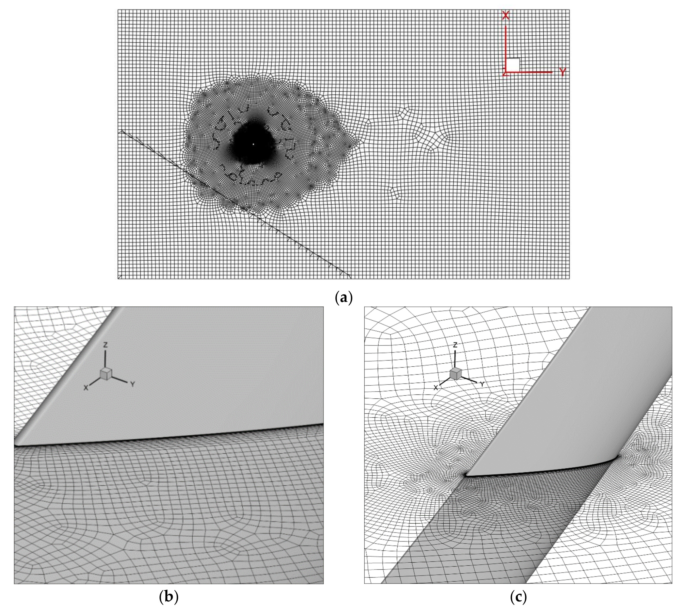

### 2.2. Boundary, Initial Conditions, and Computational Procedure
The rectangular numerical domain considered consists of two side walls and top
and bottom planes with zero shear. Inside the rectangular domain, we have a cylindrical

rotating domain which is interfaced with a sliding mesh interface. The rotating mesh is
allowed to rotate about the z-axis, and the rotation is defined based on the tip speed ratio
at which the simulations are run. It is determined by the formula: N = 60×TSR×U∞
2×π×R
where
N is the number of revolutions per second, TSR is the tip speed ratio, U∞is the free stream
velocity (10 m/s), and R is the radius of the turbine. It has to be noted that when the tip
speed ratio is fixed, then the corresponding rotation for the rotating interface is defined.
Hence the rotation of the domain for each simulation is defined depending on the TSR.
The blades and shaft surfaces are defined as no slip. The grid near to the top and bottom
surfaces of the turbine blades and shaft are refined to compute the tip effects. The flow
was initialised from the velocity inlet at 10 m/s. The rotation is initiated with and run for
10 cycles so that the results have converged. The time steps size is defined based on the
rotation angle. Hence for each TSR, the time step size is defined.
The algorithm used for pressure velocity coupling is COUPLED [45]. The convective
scheme employed for spatial discretisation is a second-order upwind scheme. The second
order in time is used for transient terms. The under relaxation factor for turbulent kinetic
energy, specific dissipation rate, intermittency, and momentum thickness Re was set to 0.4.
The turbulent viscosity under the relaxation factor was set to be 0.5. For each time step,
40 iterations were performed such that the residuals for all the variables would converge
to an order of 10−5.

### 2.3. Model Validation and Solution Independence
Grid independence study is conducted to maintain consistency in the solution and
reduce the computational effort. Three models of 9 million, 14 million, and 21 million
grid points were solved to get solution for 15 cyclic revolutions of the turbine. Figure 4a
represents the moment coefficients of a single blade, which predict similar results for the
above-mentioned three grids. Hence, for all the numerical calculations, the 9 million grid
mesh was employed. The solutions were found to be in an agreeable range. The time
resolution also plays a critical role. The time step was defined based on the azimuth angle
of rotation of the turbine. Three different resolutions (2◦, 1◦, and 0.5◦) were tried and tested
to make sure the results predicted are reasonable. From Figure 4b, it is evident that all
three-time step definitions are predicting similar solutions with significantly fewer errors.
Figure 4. Moment coefficient (Cm) plot for a single blade indicating (a) grid independence, (b) time step independence.
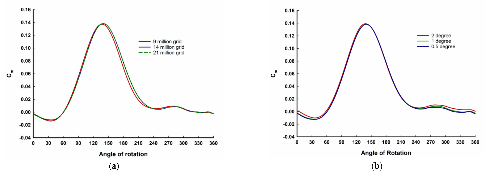
Figure 5 illustrates the cyclic convergence for a tip speed ratio of 2.3, 60◦helical-bladed
VAWT case. The solution has achieved a cyclic nature by the end of the 10th cycle itself,
which indicates that the solution has reached convergence. All the simulations were run
for 14 rotation cycles of the turbine to remove any non-cyclic behaviour in the solution.

Figure 5. Cyclic convergence of solution for a 60◦helical blade VAWT running at λ = 2.3.
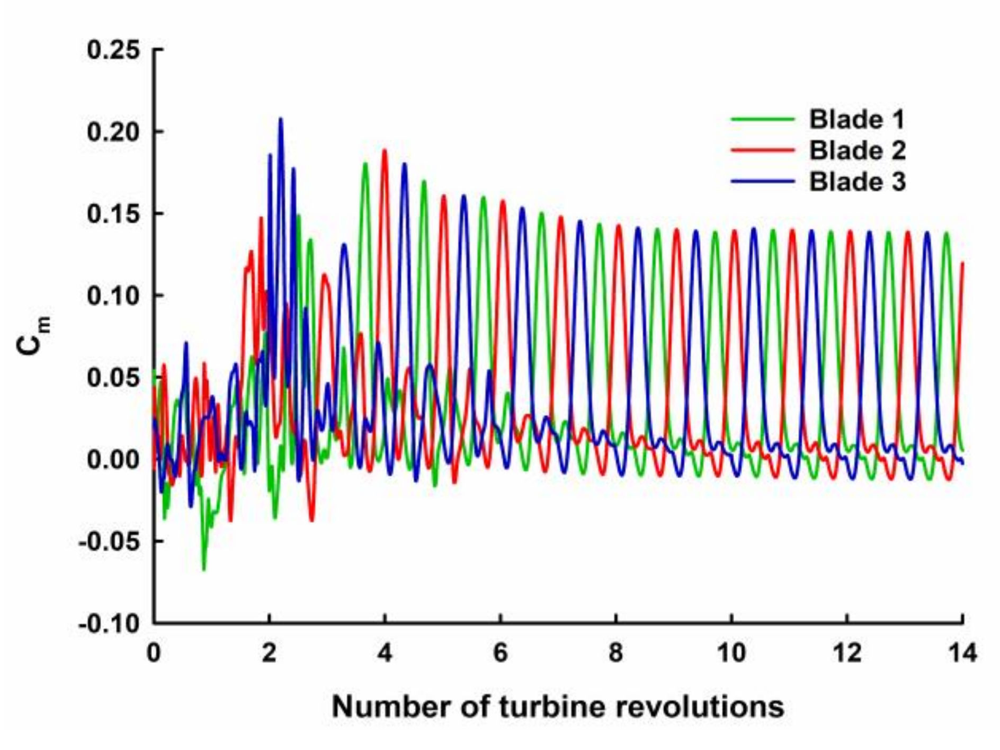
To validate the numerical model used in this study, McLaren’s experimental data [46]
were used. In the experimental study, a 420 mm chord three-bladed straight VAWT was
studied and tested in the wind tunnel. The numerical model with similar dimensions was
simulated. The numerical results of power coefficient deviated a maximum of 8% with
respect to experimental data, as shown in Figure 6. This gave considerable confidence
to the numerical model settings that are used in this study. Moreover, the experimental
uncertainity reported by McLaren was ±14.5%. It should also be noted that in the present
work, the helical turbine studied has same dimensions of McLaren’s straight VAWT.
Figure 6. Validation of numerical results to McLarens experimental results.
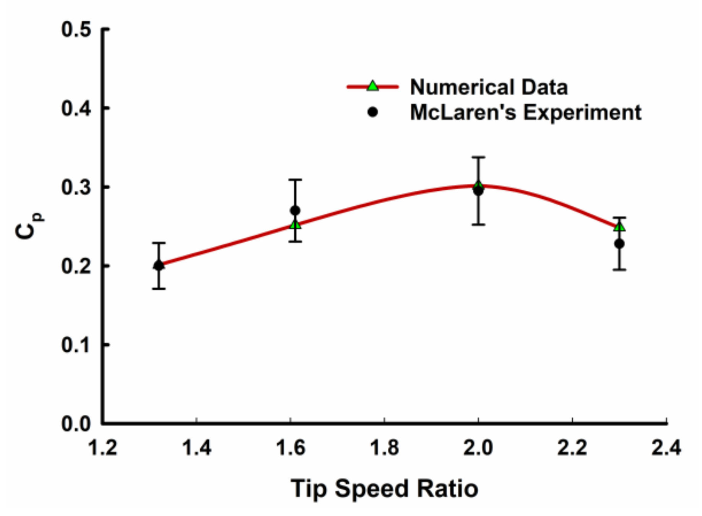

## 3. Results

### 3.1. Effect of Helix Angle on the Performance of VAWT
The performance of vertical axis wind turbines for various helix angles operating over
a range of tip speed ratios (TSRs) is plotted in Figure 7. The performance of straight blade
VAWT and different helical VAWTs are compared in this figure. It is seen that the straight
blade VAWT showcases its best performance in a lower TSR range (2.7–3), but when a helix
angle is introduced, the performance curve shows a shift in the peak, maintaining a similar
overall trend of the curve. For a helix angle of 60◦, the performance is maximum at a TSR
of 3.3, showcasing better performance compared to all other helical and straight blade
turbines. For helix angles 90◦and 120◦, the performance is comparable with a straight
blade turbine, but the performance is peaking at a higher TSR. It is evident that the best
performance is projected for the 60◦helical blade turbine, but the slope in the curve is too
large for a small variation of TSR. For a 120◦helical blade turbine, the performance curve
looks far inferior to any other turbines that are considered.

Figure 7. Coefficient of performance of VAWT for various helix angles.

The moment coefficient (Cm) of a single blade is plotted against the azimuthal angle of
rotation in Figure 8a–c for helix angles of 60◦, 90◦, and 120◦, respectively. The Cm curve at
different TSRs (λ) for different helix angles are plotted for each helical turbine. It should be
noted that the coefficient of performance is the product of TSR and average Cm. Irrespective
of helix angle, the peak performance of each blade keeps shifting to the higher azimuth
angle as the TSR increases. As the helix angle increases, the shift in occurence in peak Cm
is significant. For the 60◦helix angle, the peak of the Cm curve shifts in the range of 135◦to
180◦of the azimuth angle for a TSR range of 2.3 to 3.5, whereas for the 120◦helical blade
VAWT, the peak of the Cm curve shifts from 45◦to 135◦of the azimuth angle for the same
TSR range. This can be attributed to the reason that the increase in the helix angle would
lead to exposure of the blade to the incoming wind for a larger azimuth angle. It is also
interesting to see the secondary peaks, which may be due to the significant reduction in
wake interaction when the TSR goes higher. The slope of the curve also increases as the
helix angle decreases. This will have an adverse effect on the load that gets transmitted on
to the shaft. A cross-comparison of helix angles (Figure 9a–d) at λ = 2.3, 2.7, 3.1, 3.5, and
3.9 shows that the straight blade VAWT had the highest peak while the helical VAWT had
the lowest peak. It is interesting to look at the curve slope for each helix angle blade. The
curve is steep for lower helix angles. To further investigate the effect of the slope of the
curve on the performance, a normalised cumulative Cm was plotted.
Figure 8. Moment coefficient for various tip speed ratios (TSRs), (a) helix angle 60◦, (b) helix angle
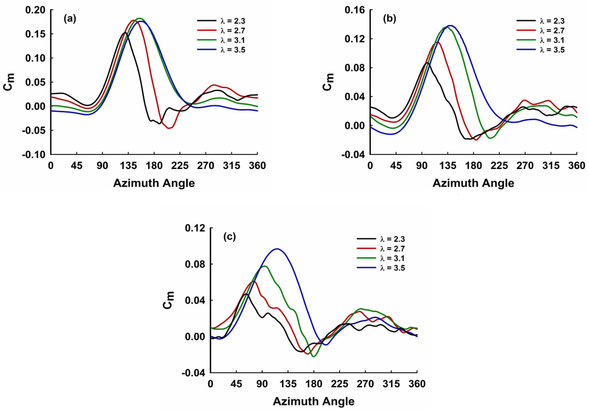
90◦, (c) helix angle 120◦.

Figure 9. Cm curve for the first blade of straight 60◦, 90◦, and 120◦helix angles of blades compared at (a) λ = 2.3, (b) λ = 2.7,
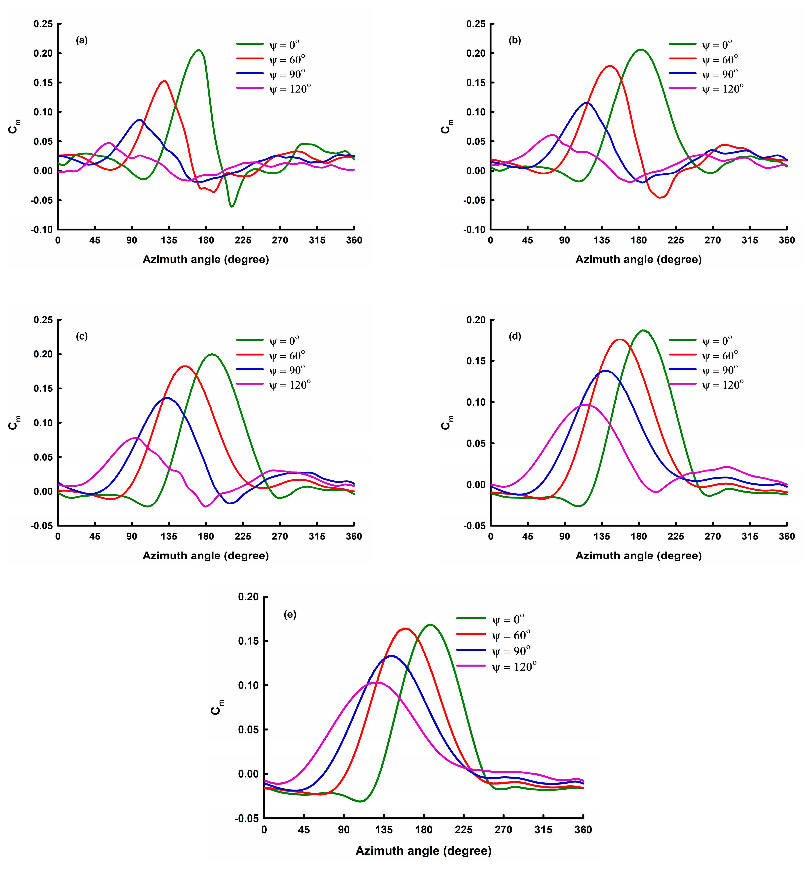
(c) λ = 3.1, (d) λ = 3.5, and (e) λ = 3.9.
In Figure 10, the normalised curve was plotted, which gave a better understanding
of the nature of energy generated. The trend of power generated in each of these cases
was similar except that the slope of the curve was decreasing as the helix angle increased.
This is attributed to the broader range of azimuth angle in which the power gets generated.
It must be noted that the normalised curve also gave an understanding of how the trend
behaved when the tip speed ratio was changed at different helix angles. When we compare
the slope of cumulative Cm for different helix angles performing at the same TSR, the slope
variation can be understood. The straight blade can be seen going to negative and then
going above 1. This is mainly because of the limited azimuth angle of positive operation.
In contrast, the curve for 120◦has a less steep curve, and most of the portion of the curve
is positive. The negative slope in the cases of 90◦and 120◦are impressive because they
represent the secondary wake interactions. It would be interesting to see the cumulative
effect of all three blades on the turbine power generation curve. Hence, the cumulative Cm
curve as plotted in Figure 11.

Figure 10. Normalised cumulative Cm Curve of blade 1 at different λ for (a) ψ = 0◦, (b) ψ = 60◦
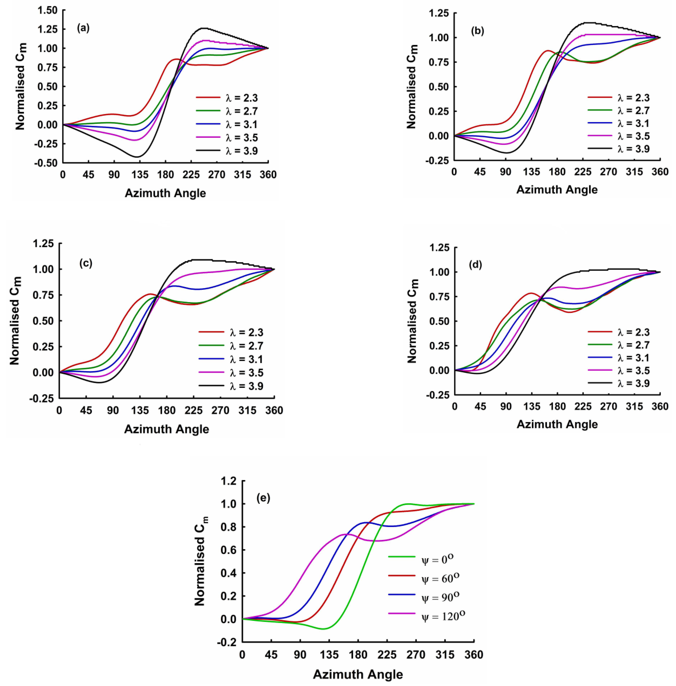
(c) ψ = 90◦, (d) ψ = 120◦, (e) Normalised curve of all helical-bladed turbines compared against straight
blade turbine at a TSR of 3.1.
Figure 11. Cumulative Cm plot for helical turbine having (a) ψ = 60◦, (b) ψ = 90◦, and (c) ψ = 120◦.
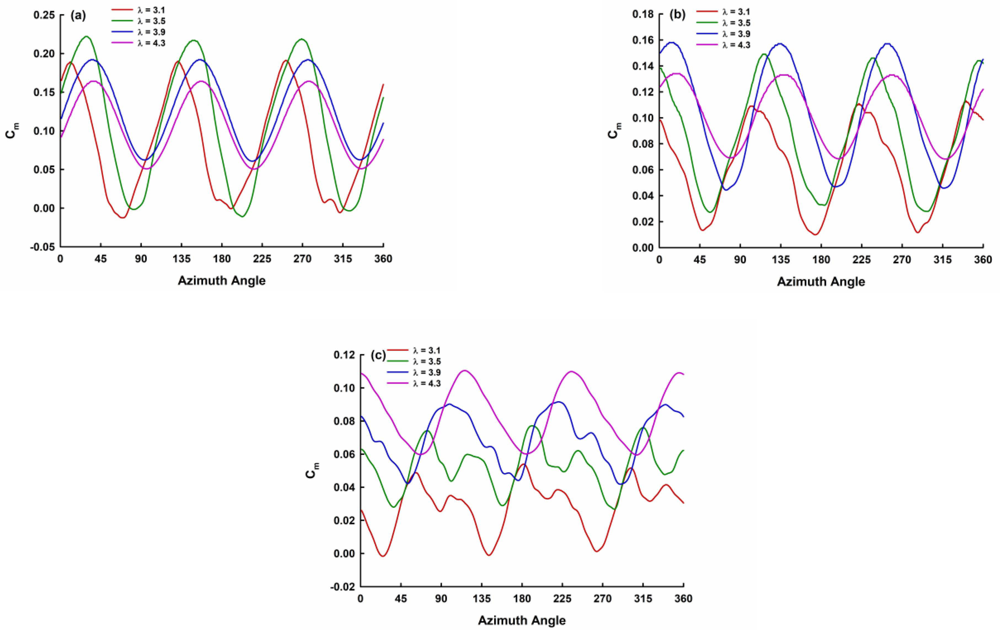

The cumulative Cm effect of each turbine was plotted for different tip speed ratios in
Figure 12. It was found that the Cm curve had a maximum point and a minimum point.
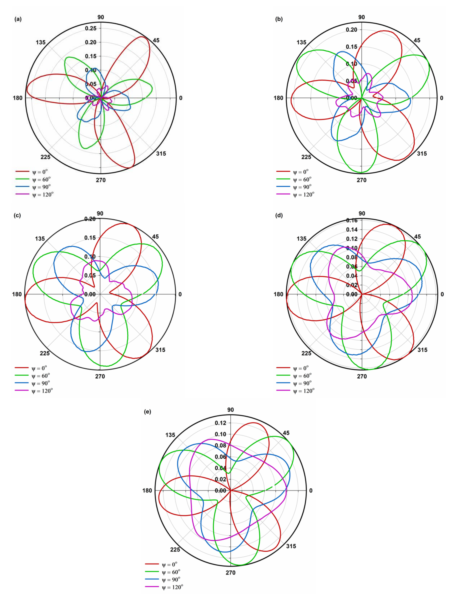
These fluctuations in maximum and minimum are large for lower TSRs for all the types of
turbines. For 60◦and 90◦helical-bladed turbines, it is noticed that the fluctuations minimise
as the TSR increases. It is seen that for lower TSRs, the Cm curve has a lot of instability for
a 120◦helical blade when operating at a lower TSR. The possibility of wake interaction is
higher, since the blades have higher overlap in the circumference of the turbine.
Figure 12. Cumulative polar plot of Cm comparing different helix angles and a straight blade at (a) TSR = 2.3, (b) TSR = 2.5,
(c) TSR = 3.1, (d) TSR = 3.5, (e) TSR = 3.9.

The plot is trying to compare the performance of different helical-bladed VAWTs
operating in the same TSR. However, the trends look quite similar for low and medium
TSR; at higher TSR, the turbine having 120 helical-bladed VAWT had a lesser deviation
from the mean performance curve over the cycle.
In Figure 13, the definition of quartile and the contribution of each turbine quartile
to the total moment generated is plotted to compare different helical turbines operating
at TSR 2.3 to 3.9. The contribution is calculated as the difference between the cumulative
sum of normalised Cm at the end and the start of each quartile. For several cases, it is
seen that the percentage of contribution crosses 100%. This is mainly due to transitions
from negative values of Cm at the beginning of the quartile to a more considerable positive
value of Cm by the end of the quartile. It is also noticed that for such cases, the percentage
contribution of the blades will go into negative values in other quartiles as the sum total
has to be 100%.
Figure 13. (a) Definition of quartile and percentage contribution by a blade in each quartile for all helical blades and straight
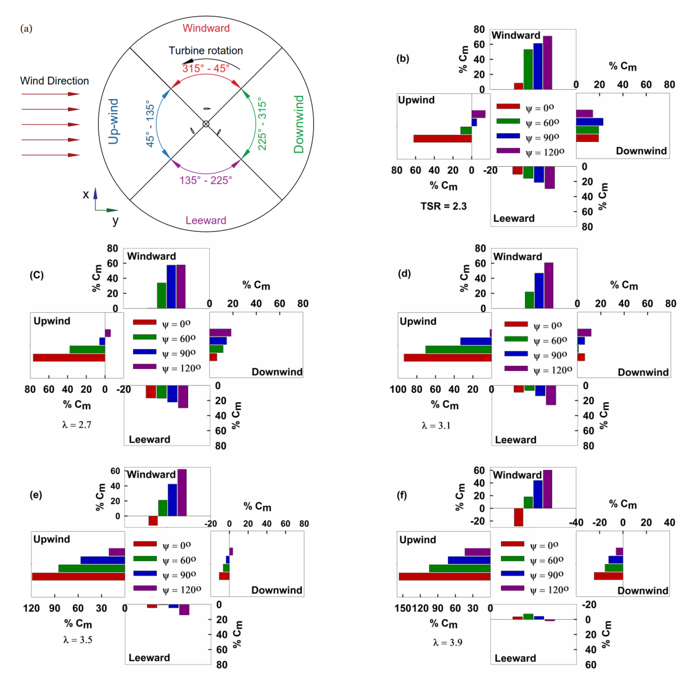
blades at (b) TSR = 2.3, (c) TSR = 2.7, (d) TSR = 3.1, (e) TSR = 3.5, and (f) TSR = 3.9.

It is interesting to note that the percentage contribution in the downwind side is
positive for lower TSR. However, as the TSR increases, the downwind quartile contribution
tends to go to negative contributions. This can be attributed to the secondary wake interaction at the downstream of the flow at a lower TSR. The leeward side of the flow also follows
a similar trend and results in interactions at a lower TSR. At a higher TSR, the difference
in the contribution of each quartile becomes large for straight-bladed VAWT, whereas the
cumulative contribution of 120◦helical blade VAWT shows positive contribution in all the
quartiles (add percentage difference in the quartiles between 60 and 120). If we compare
the contributions of each quartile for TSR = 2.3, it is observed that almost all quartiles
contribute positively except for 90◦and 120◦helical VAWT. Straight blade VAWT produce
more than 100% in the upwind quartile for TSR > 3.1. This explains the sudden increase
in the slope of the normalised cumulative Cm curve. It can be concluded that when the
helix angle is introduced, the nature of the power generated over the entire rotation of the
turbine changes its characteristics.
The ripple effect on the turbine shaft is understood with the help of standard deviation
of Cp plotted for different turbines operating at different TSRs. Figure 14 represents the
standard deviation of Cp of different types of helical-bladed turbines and straight-bladed
turbines. The standard deviation reduces as the helix angle increases. The maximum
deviation is for straight-bladed VAWT running at 2.3 TSR. For TSR 2.7, the standard
deviation of 60◦helical-bladed VAWT overshot the straight-bladed VAWT. The standard
deviation of Cp is much less for 120◦helical-bladed VAWT than any other configuration
of blades. The standard deviation is highest for the straight-bladed VAWT. A straight
blade shows the maximum variation, and it is approximately 85% higher than the 120◦
helical-bladed VAWT. The maximum standard deviation for a turbine is away from the
peak performance of that turbine.
Figure 14. The standard deviation of Cp of different helical-bladed and straight-bladed VAWT

operating at different TSR.

### 3.2. Effect of Helix Angle on Turbine Blade Loads
To understand the power generation distributed across different quartiles of a turbine,
it is essential to know how various parts of a helical blade generate the Cp. The blades were
divided into three sections of equal height. The sections are named as the leading, mid,
and trailing section, and they are represented in Figure 15 in red, green, and blue colours
respectively. The leading section enters any quartile first followed by the mid-section and
trailing section while the turbine is in rotation. A sectional analysis is essential in this case
the blade interacts with the flow continuously across different quadrants.

Figure 15. Sections of blades of a helical vertical axis wind turbine.
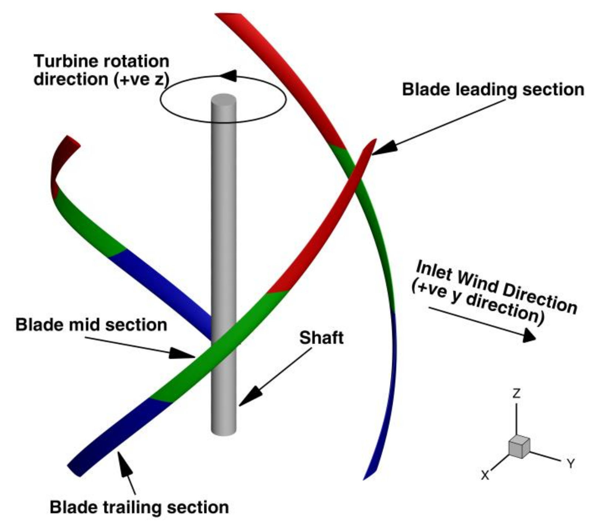
The Cm contribution of each blade segment was observed over a rotation of 360◦.
The leading section, mid-section, and trailing section Cm are plotted in red, green, and
blue colours, respectively in Figure 16. Figure 16a–c represents the contribution curves of
60◦, 90◦, and 120◦respectively. The cumulative Cm is also plotted in the same plot with
a different scale of y-axis in black colour. It is interesting to note that the mid-section of
the blade contributes marginally more than the other two sections in all helical-bladed
VAWT; for 90◦and 60◦helical-bladed VAWT, the trailing section contributes more to
the moment coefficient when compared to the leading section. On the contrary, in 120◦
helical-bladed VAWT, the leading segment contributes more than the trailing segment
when operated in the same TSR of 3.1. It can be noticed from the figure that all sections of
blades do not contribute uniformly to the moment coefficient. Drop lines are also plotted in
Figure 16 to highlight important azimuth angles. Corresponding to those azimuth angles,
the z-vorticity contours are plotted in Figures 17–19. These points are of importance as
they represent the peaks of individual segments of the same blade.
Figure 16. Section-wise Cm contribution of each segment of a single blade of (a) ϕ = 60◦, (b) ϕ = 90◦, and (c) ϕ = 120◦
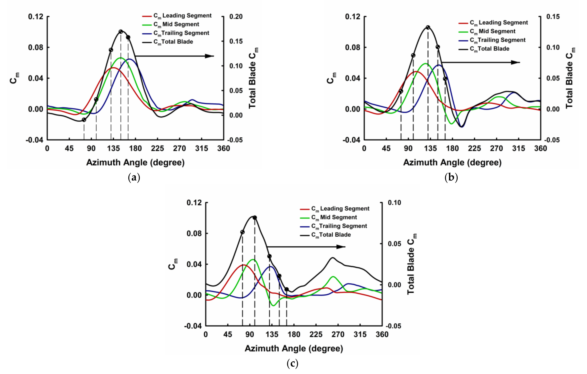
helical-bladed VAWT operating at a TSR of 3.1.

Figure 17. Z-vortex magnitude for 60◦helical VAWT at z planes at heights of −1.45 m, −0.75 m, 0 m, 0.75 m, and 1.45 m at
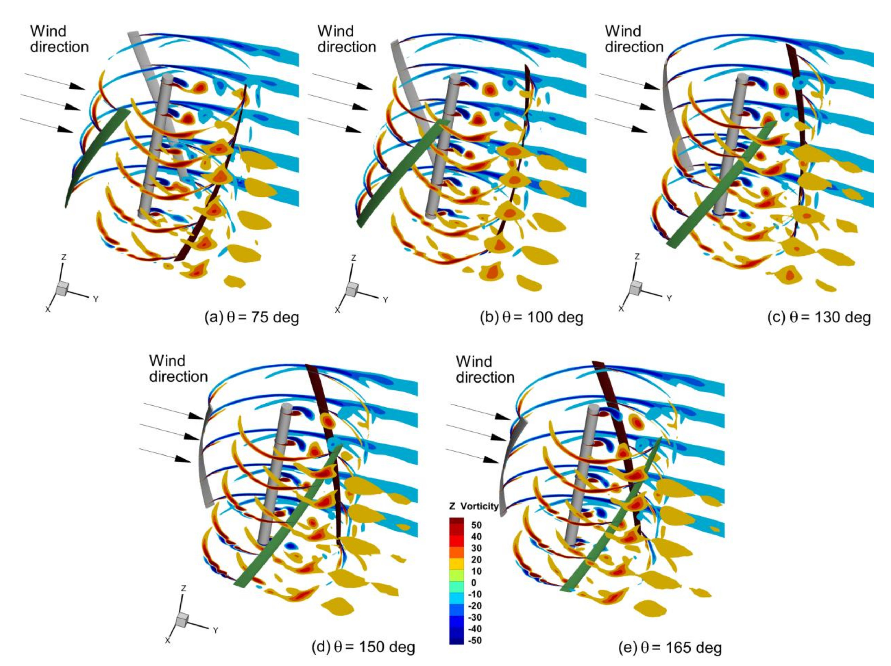
azimuth angles of rotation of (a) 75◦, (b) 100◦, (c) 135◦, (d) 150◦, and (e) 165◦.
Figure 18. Z-vortex magnitude for 90◦helical VAWT at z planes at heights of −1.45 m, −0.75 m, 0 m, 0.75 m, and 1.45 m at
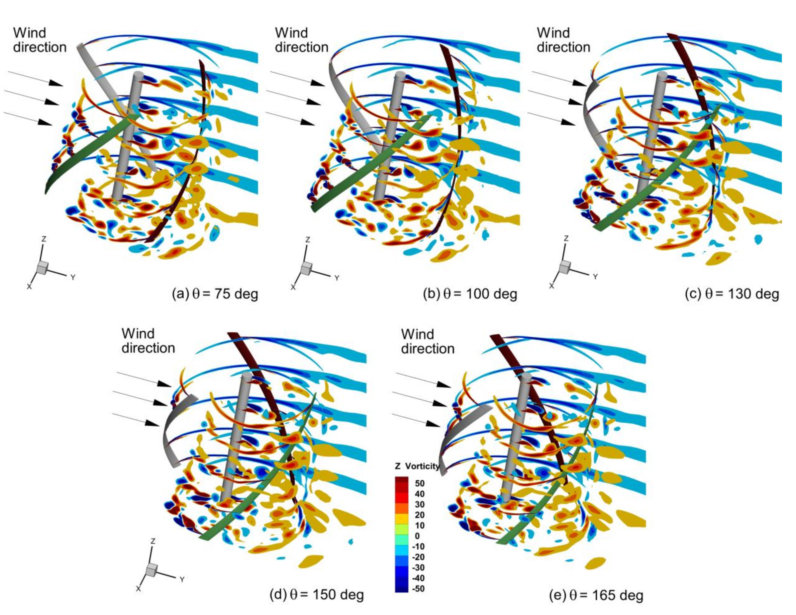
azimuth angles of rotation of (a) 75◦, (b) 100◦, (c) 135◦, (d) 150◦, and (e) 165◦.

Figure 19. Z-vortex magnitude for 120◦helical VAWT at z planes at heights of −1.45 m, −0.75 m, 0 m, 0.75 m, and 1.45 m at
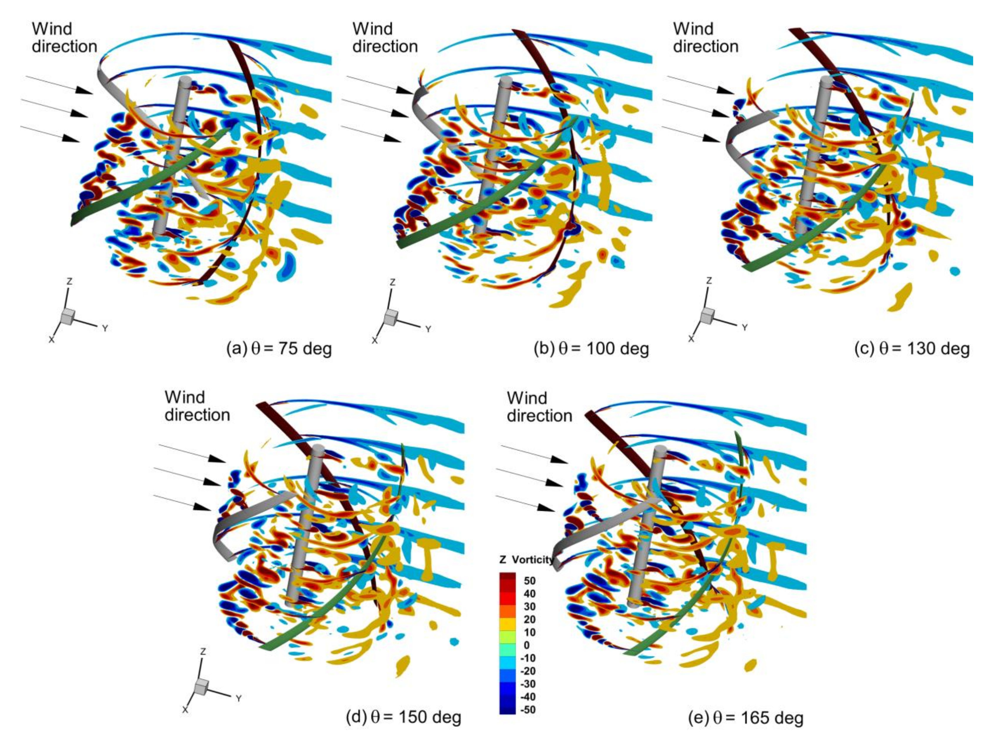
azimuth angles of rotation of (a) 75◦, (b) 100◦, (c) 135◦, (d) 150◦, and (e) 165◦.
Figures 17–19 represent the z-vorticity contours of 60◦(Figure 17), 90◦(Figure 18), and
120◦(Figure 19) helical blade VAWT at operating condition of TSR 3.1. It is essential to
analyse the flow at different heights of the turbine as the cross-section of the turbine varies
along the height. Hence, the flow at different heights (−1.45 m, −0.75 m, 0 m, 0.75 m, and
1.45 m) are analysed using these plots. Figure 16 represent the Cm curve of blade 1, which
is represented in grey colour for Figures 17–19. Blade 2 and Blade 3 are represented by
brown and green colour, respectively. At azimuth angles of 75◦, 100◦, 130◦, 150◦, and 165◦,
the contours are plotted. The vorticity levels are displayed to see the results of magnitude
range of −50 to 50 s−1. It is observed for a 60◦helical blade VAWT, at θ = 130◦, that the
leading edge of the leading segment of the blade starts forming vortices, and this explains
the peak for the leading segment of the blade observed in Figure 16. It is also observed that
the leading edge of blade 1 does not shed the vortices in any of the shown frames. The mid
segment and trailing segment of Blade 1 start developing leading edge vortices at θ = 150◦
and θ = 165◦, respectively, and the same can be observed in Figure 17d,e. Whereas it can be
seen that the leading segment of Blade 3 sheds the vortices in Figure 17a, and in Figure 17e,
the flow separation from Blade 3 can also be noticed. The separated flow from Blade 2 can
be seen in Figure 17a–e interacting with Blade 3, thereby creating the secondary peaks in
the Cm plot. The vortex shed by the shaft is also visible in the figure, and it combines with
the flow shed by Blade 2 in the downstream.
The z-vorticity plots of 90◦helical-bladed VAWT are plotted in Figure 18. At θ = 75◦,
the leading edge vortices can be noticed on the leading segment of Blade 1. This phenomenon happens to the trailing segment at a much higher azimuth angle when compared
to a 60◦helical-bladed turbine. The leading segment makes a peak at around θ = 100◦and
the interactions can be seen from Figure 18b that the entire leading segment has entered
the flow. The mid segment and trailing segment of the blade starts generating leading edge
vortices at θ = 150◦and θ = 160◦of the azimuth angle. Meanwhile, flow separation in the
leading segment of the blade is noticed in Figure 18d,e. Blade 2 can be seen interacting
with the vortex shed by Blade 1 at θ = 130◦. The flow separations from Blade 3 can be
seen from θ = 130◦(Figure 18c), which goes on to shed vortices for the trailing segment at

θ = 165◦(Figure 18e). The secondary interactions can be noticed by observing Blade 3. It
is seen interacting with the vortices shed by Blade 2 as early as θ = 100◦. The secondary
interactions happen for a longer azimuth angle of rotation, and hence, a wider secondary
peak is observed for the 90◦helical-bladed VAWT.
For a 120◦helical-bladed VAWT, it can be seen that the leading segment has already
entered the flow at θ = 75◦. The leading segment of the blade can be seen interacting
with the vortices of Blade 3 at θ = 130◦and starts shedding the vortices from the blade
surface. The vortex shed by Blade 2 interacts with Blade 3, and it can be seen that the flow
separation occurs at much earlier azimuth angles.
It can be seen from Figures 17–19 that the flow interactions are higher for the 120◦
helical blade when compared with other turbines. Blade 3 is coming under the secondary
wake interactions produced by Blade 2 at different sections of the blade. This explains
the secondary peak observed in the Cm plot. It would be interesting to see the flow
characteristics for various tip speed ratios. To study the same, a 90◦helical-bladed VAWT’s
performance was observed. In Figure 20, a 90◦helical-bladed VAWT was observed for
the performance of different sections of the blade. As already observed from Figure 7, the
performance of the 90◦helical-bladed VAWT improves from TSR 2.7 to 3.1.
Figure 20. Section-wise Cm contribution of different segments of a single blade of a 90◦helical VAWT operating at TSRs of
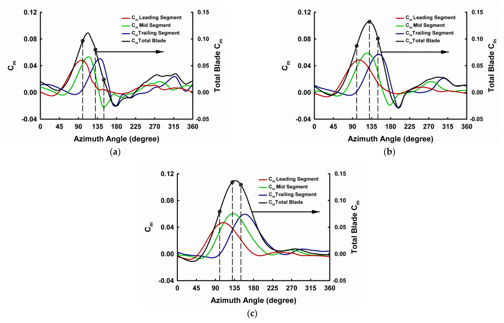
(a) 2.7, (b) 3.1, and (c) 3.5.
To have a better understanding of how the blade sections behave with a change in TSR,
a 90◦helical-bladed VAWT is studied for sectional contributions. From Figure 17, it can
be noted that the leading section is contributing less when compared to other sections of
the same blade. For a lower TSR, all three sections of the blade contribute an almost equal
amount to the cumulative performance of the blade. At TSRs of 2.7 and 3.1, the secondary
interactions are higher and seem to contribute positively toward the generation of power.
At a lower TSR, the secondary peak is generated. Drop lines are plotted near the peaks of
each segment and analysed for flow vortices at various heights. The characteristics of an

individual Cm plot can be better understood when we look at the blade vortex generation
and interaction.
Figure 21 represents the z-vorticity contours of a 90◦helical blade VAWT operating at
TSR 2.7 (Figure 21a–c), TSR 3.1 (Figure 21d–f), and TSR 3.5 (Figure 21g–i) at three different
azimuth angles (100◦, 130◦, and 150◦) of rotation of Blade 1. The colour notation used for
the blades in Figures 17–19 is used here as well. It can be seen that the flow separation
happens in lower tip speed ratio there by increasing the interaction of the shed vortex on
the receding blades. This substantiates the observation about the secondary peaks found
in Figure 20. The flow separations are found to be minimal in TSR3.5, thereby producing
better Cm when compared to other TSRs. It is also found that the z-vorticity generated by
the shaft reduces as the TSR increases.
Figure 21. Z-vorticity magnitude of 90◦helical-bladed VAWT at 100◦, 130◦, and 150◦of azimuth angles of rotation of a

turbine operating at (a–c) TSR = 2.7, (d–f) TSR = 3.1, and (g–i) TSR = 3.5.

### 3.3. Effect of Helix Angle on Turbine Wake
Figures 22 and 23 presents the time-averaged (over the last turbine revolution) normalised stream-wise velocity along the non-dimensionalised lateral line, −2 ≤X/D ≤2, at
different downstream locations in the turbine wake with Y/D = 2.0, 3.0, and 4.0, for λ = 3.1
(Figure 22) and 3.5 (Figure 23). The scaling of the wake was followed based on the work
done by Kadum et al. [47] The following points are observed:
•
The turbine wake gets weaker at TSR 3.1 for 120◦helical-bladed VAWT when compared with straight and other helical turbines.
•
The wake profile gets weaker when the helix angle is increased even from a closer
X/D rage of 2.
Figure 22. Wake structure of helical blade VAWT at Y/D of 2 (a,d,g,j), 3 (b,e,h,k), and 4 (c,f,i,l). For straight and helicalbladed VAWT at TSR = 3.1.

Figure 23. Wake structure of helical blade VAWT at Y/D of 2 (a,d,g), 3 (b,e,h), and 4 (c,f,i). For helical-bladed VAWT at
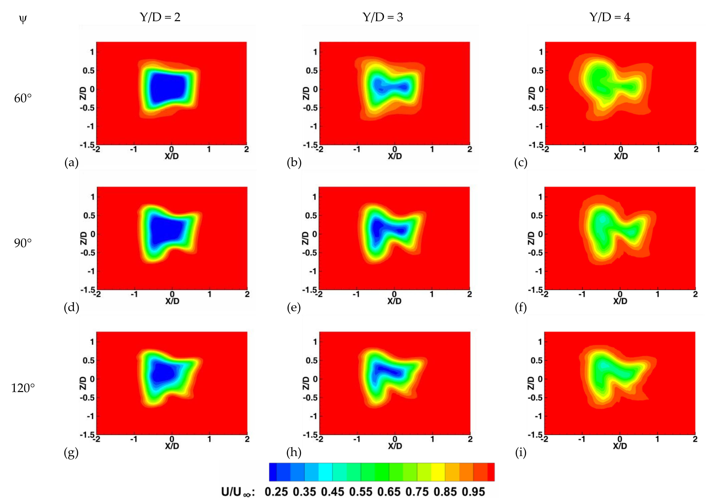
TSR = 3.5.
The wake of a helical-bladed VAWT unlike that with straight blades seems to be
dissipating quickly as the helix angle increases. It further degrades when the tip speed
ratio increases.
The turbine wake was studied in order to understand how the flow is going past
the turbine. It is interesting to see how the wake dissipates over the length. Hence, the
wake characteristic for a 90◦helical blade VAWT is studied to understand the wake better.
Figure 24 indicated the normalised wake characteristics for a 90◦helical blade VAWT
operating at TSR = 2.7, 3.1, and 3.5. This study is essential to understand how the flow
past the turbine will behave, as it also gives idea on how much residual energy is left. The
wake for a 3.9 TSR at a Y/D of 2, in comparison with other TSR, seems to have lost a lot
of energy. It is also noted that the wake characteristic shapes remain almost similar for a
given Y/D despite different TSR.

Figure 24. Wake structure for a 90◦helical-bladed VAWT at Y/D of 2 (a,d,g,j), 3 (b,e,h,k), and 4 (c, Figure 2. 7 (a–c), 3.1 (d–f),
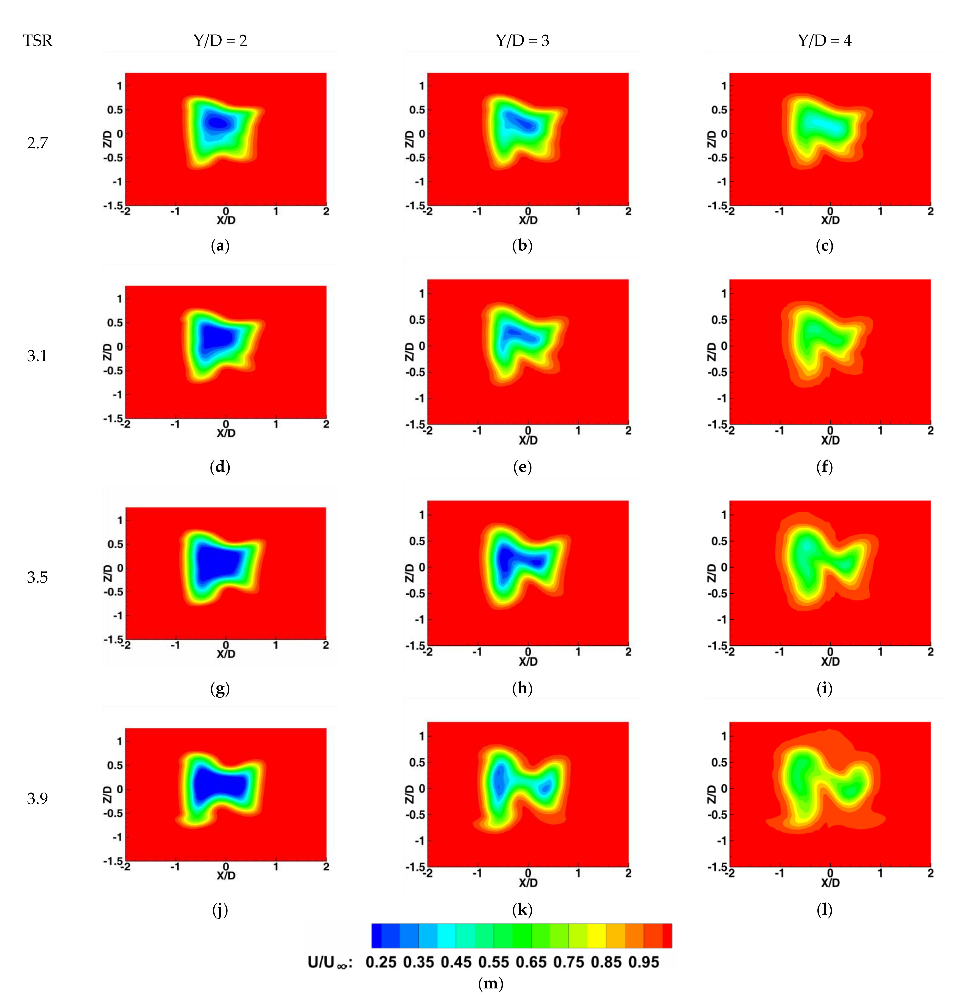
3.5 (g–i) and 3.9 (j–l).

## 4. Conclusions
In the present study, the effect of helix angles varying from 60◦to 90◦for helical VAWT
has been studied. The turbine diameter is 2.7 m and the height is 3 m. A 3D CFD model
has been used to analyse the performance of these turbines. The following are the major
conclusions derived from the work
•
The study on effect of helix angle of a vertical axis wind turbine has shown that the
performance, wake interaction, and the flow interaction are different from those of a
straight blade VAWT.

•
The performance of a 60◦helical blade VAWT was found to be outperforming all
the other VAWT blade shapes and had a peak at a moderate TSR. However, it had
the highest standard deviation from the average Cm produced by the turbine blade.
Normalised Cm plots will enable understanding the moment coefficient characteristics.
•
Analysing the quartile performance of the helical turbines gave more insights on
how the power production was distributed across the azimuth angle of rotation. The
variation in the quartile performance is backed by the standard deviation plot, which
suggests that the minimum deviation is for 120◦helical-bladed VAWT, since the power
production capabilities are spread across the quartiles
•
An essential detailed analysis of loads on the sections of blades revealed that the
leading segment, mid segment, and trailing segment of a single helical blade contributed different percentages of Cm to the cumulative blade Cm. Z-vorticity contours
at different heights of the turbine showed that the flow interference caused secondary
peaks and also lead to better understanding of when and where the flow separation
on the blade happens.
•
In order to better understand the energy extraction, a wake analysis was performed,
leading to the understanding that wakes dissipate quickly for non-straight blade VAWTs.
•
Analysis of the effect of TSR on the performance of the turbine was also done with
the help of a 90◦helical-bladed VAWT. Z-vorticity kept reducing as the TSR increased
from 2.7 to 3.5.

## Author Contributions
Conceptualisation, R.K.V. and U.D.; methodology, R.K.V., U.D.; software,
R.K.V., A.M.; validation, R.K.V. and U.D.; formal analysis, R.K.V.; investigation, R.K.V., A.R.; resources, A.M.; data curation, U.D.; writing—original draft preparation, U.D.; writing—review and
editing, R.K.V., A.R.; visualisation, U.D.; supervision, R.K.V. and A.R. All authors have read and
agreed to the published version of the manuscript.

## Funding
This research received no external funding.

## Acknowledgments
The authors would like to acknowledge the administration of Amrita Vishwa
Vidyapeetham and King Abdul Aziz University of Science and Technology for the support extended
for this work.

## Conflicts of Interest
The authors declare no conflict of interest.

## References
1.
Streck, C.; Keenlyside, P.; Von Unger, M. The Paris Agreement: A new beginning. J. Eur. Environ. Plan. Law 2016, 13, 3–29.
[CrossRef]
2.
Agreement, P. Report of The Conference of The Parties on Its Twenty-First Session, Held in Paris from 30 November to 13 December 2015;
FCCC/CP/2015/10/Add. 1; United Nations: New York, NY, USA; European Commision Secretariat: Bruxelles, Belgium, 2015.
3.
Savaresi, A. The Paris agreement: A new beginning? J. Energy Nat. Resour. Law 2016, 13, 3–29. [CrossRef]
4.
Delarue, E.D.; Luickx, P.J.; D’haeseleer, W.D. The actual effect of wind power on overall electricity generation costs and CO2
emissions. Energy Convers. Manag. 2009, 50, 1450–1456. [CrossRef]
5.
Kirthika, N.; Ramachandran, K.I.; Kottayil, S.K. Deep Quantile Regression Based Wind Generation and Demand Forecasts. In
Advances in Intelligent Systems and Computing, Proceedings of the International Conference on Soft Computing and Pattern Recognition,
Hyderabad, India, 13–15 December 2019; Abraham, A., Jabbar, M., Tiwari, S., Jesus, I., Eds.; Springer: Cham, Swizerland, 2019; pp.
112–122.
6.
Pedersen, E.; Persson Waye, K. Perception and annoyance due to wind turbine noise—a dose–response relationship. J. Acoust.
Soc. Am. 2004, 116, 3460–3470. [CrossRef] [PubMed]
7.
Wagner, S.; Bareiss, R.; Guidati, G. Wind Turbine Noise; Springer Science & Business Media: Berlin/Heidelberg, Germany, 2012;
ISBN 3642887104.
8.
Crockford, N.J. A Review of the Possible Impacts of Wind Farms on Birds and Other Wildlife; Joint Nature Conservation Committee:
Peterborough, UK, 1992.
9.
Thönnißen, F.; Marnett, M.; Roidl, B.; Schröder, W. A Numerical Analysis to Evaluate Betz’s Law for Vertical Axis Wind Turbines; IOP
Publishing: Briatol, UK, 2016; Volume 753, p. 22056.
10.
Madsen, H.A.; Paulsen, U.S.; Vitae, L. Analysis of VAWT Aerodynamics and Design Using the Actuator Cylinder Flow Model; IOP
Publishing: Bristol, UK, 2014; Volume 555, p. 12065.
11.
Gulve, P.; Barve, S.B. Design and construction of vertical axis wind turbine. Int. J. Mech. Eng. Technol. 2014, 5, 148–155.

12.
Tjiu, W.; Marnoto, T.; Mat, S.; Ruslan, M.H.; Sopian, K. Darrieus vertical axis wind turbine for power generation II: Challenges in
HAWT and the opportunity of multi-megawatt Darrieus VAWT development. Renew. Energy 2015, 75, 560–571. [CrossRef]
13.
Li, Q.; Maeda, T.; Kamada, Y.; Shimizu, K.; Ogasawara, T.; Nakai, A.; Kasuya, T. Effect of rotor aspect ratio and solidity on a
straight-bladed vertical axis wind turbine in three-dimensional analysis by the panel method. Energy 2017, 121, 1–9. [CrossRef]
14.
Li, Q.; Maeda, T.; Kamada, Y.; Murata, J.; Shimizu, K.; Ogasawara, T.; Nakai, A.; Kasuya, T. Effect of solidity on aerodynamic
forces around straight-bladed vertical axis wind turbine by wind tunnel experiments (depending on number of blades). Renew.
Energy 2016, 96, 928–939. [CrossRef]
15.
Eboibi, O.; Danao, L.A.M.; Howell, R.J. Experimental investigation of the influence of solidity on the performance and flow field
aerodynamics of vertical axis wind turbines at low Reynolds numbers. Renew. Energy 2016, 92, 474–483. [CrossRef]
16.
Mantravadi, B.; Unnikrishnan, D.; Sriram, K.; Mohammad, A.; Vaitla, L.; Velamati, R.K. Effect of solidity and airfoil on the
performance of vertical axis wind turbine under fluctuating wind conditions. Int. J. Green Energy 2019, 16. [CrossRef]
17.
Rezaeiha, A.; Kalkman, I.; Blocken, B. Effect of pitch angle on power performance and aerodynamics of a vertical axis wind
turbine. Appl. Energy 2017, 197, 132–150. [CrossRef]
18.
El-Samanoudy, M.; Ghorab, A.A.E.; Youssef, S.Z. Effect of some design parameters on the performance of a Giromill vertical axis
wind turbine. Ain Shams Eng. J. 2010, 1, 85–95. [CrossRef]
19.
Chandramouli, S.; Premsai, T.P.; Prithviraj, P.; Mugundhan, V.; Velamati, R.K. Numerical analysis of effect of pitch angle on a
small scale vertical axis wind turbine. Int. J. Renew. Energy Res. 2014, 4, 929–935.
20.
Ferreira, C.S.; Geurts, B. Aerofoil optimization for vertical-axis wind turbines. Wind Energy 2015, 18, 1371–1385. [CrossRef]
21.
Bedon, G.; De Betta, S.; Benini, E. Performance-optimized airfoil for Darrieus wind turbines. Renew. Energy 2016, 94, 328–340.
[CrossRef]
22.
Sengupta, A.R.; Biswas, A.; Gupta, R. Studies of some high solidity symmetrical and unsymmetrical blade H-Darrieus rotors
with respect to starting characteristics, dynamic performances and flow physics in low wind streams. Renew. Energy 2016, 93,
536–547. [CrossRef]
23.
Rezaeiha, A.; Kalkman, I.; Blocken, B. CFD simulation of a vertical axis wind turbine operating at a moderate tip speed ratio:
Guidelines for minimum domain size and azimuthal increment. Renew. Energy 2017, 107, 373–385. [CrossRef]
24.
Parker, C.M.; Leftwich, M.C. The effect of tip speed ratio on a vertical axis wind turbine at high Reynolds numbers. Exp. Fluids
2016, 57, 74. [CrossRef]
25.
Siddiqui, M.S.; Rasheed, A.; Kvamsdal, T.; Tabib, M. Effect of turbulence intensity on the performance of an offshore vertical axis
wind turbine. Energy Procedia 2015, 80, 312–320. [CrossRef]
26.
Wekesa, D.W.; Wang, C.; Wei, Y.; Zhu, W. Experimental and numerical study of turbulence effect on aerodynamic performance of
a small-scale vertical axis wind turbine. J. Wind Eng. Ind. Aerodyn. 2016, 157, 1–14. [CrossRef]
27.
Bhargav, M.; Kishore, V.R.; Laxman, V. Influence of fluctuating wind conditions on vertical axis wind turbine using a threedimensional CFD model. J. Wind Eng. Ind. Aerodyn. 2016, 158, 98–108. [CrossRef]
28.
Wang, Z.; Wang, Y.; Zhuang, M. Improvement of the aerodynamic performance of vertical axis wind turbines with leading-edge
serrations and helical blades using CFD and Taguchi method. Energy Convers. Manag. 2018, 177, 107–121. [CrossRef]
29.
Battisti, L.; Brighenti, A.; Benini, E.; Castelli, M.R. Analysis of Different Blade Architectures on Small VAWT Performance; IOP
Publishing: Bristol, UK, 2016; Volume 753, p. 62009.
30.
Han, D.; Heo, Y.G.; Choi, N.J.; Nam, S.H.; Choi, K.H.; Kim, K.C. Design, fabrication, and performance test of a 100-w helical-blade
vertical-axis wind turbine at low tip-speed ratio. Energies 2018, 11, 1517. [CrossRef]
31.
Battisti, L.; Persico, G.; Dossena, V.; Paradiso, B.; Castelli, M.R.; Brighenti, A.; Benini, E. Experimental benchmark data for
H-shaped and troposkien VAWT architectures. Renew. Energy 2018, 125, 425–444. [CrossRef]
32.
Bedon, G.; Castelli, M.R.; Benini, E. Proposal for an innovative chord distribution in the Troposkien vertical axis wind turbine
concept. Energy 2014, 66, 689–698. [CrossRef]
33.
Bedon, G.; Castelli, M.R.; Benini, E. Optimal spanwise chord and thickness distribution for a Troposkien Darrieus wind turbine. J.
Wind Eng. Ind. Aerodyn. 2014, 125, 13–21. [CrossRef]
34.
Persico, G.; Dossena, V.; Paradiso, B.; Battisti, L.; Brighenti, A.; Benini, E. Time-resolved experimental characterization of the
wakes shed by H-shaped and troposkien vertical axis wind turbines. J. Energy Resour. Technol. 2017, 139, 31203. [CrossRef]
35.
Divakaran, U.; Kishore, V.R.; Ramesh, A. Effect of wind speed on the performance of Troposkein vertical axis wind turbine. Int. J.
Renew. Energy Res. 2019, 9, 1510–1521.
36.
Tjiu, W.; Marnoto, T.; Mat, S.; Ruslan, M.H.; Sopian, K. Darrieus vertical axis wind turbine for power generation I: Assessment of
Darrieus VAWT configurations. Renew. Energy 2015, 75, 50–67.
37.
Bhuyan, S.; Biswas, A. Investigations on self-starting and performance characteristics of simple H and hybrid H-Savonius vertical
axis wind rotors. Energy Convers. Manag. 2014, 87, 859–867. [CrossRef]
38.
Lee, Y.-T.; Lim, H.-C. Numerical study of the aerodynamic performance of a 500 W Darrieus-type vertical-axis wind turbine.
Renew. Energy 2015, 83, 407–415. [CrossRef]
39.
Scheurish, F.; Fletcher, T.M.; Brown, R.E. The Influence of Blade Curvature and Helical Blade Twist on the Performance of a
Vertical-Axis Wind Turbine. In Proceedings of the 48th AIAA Aerospace Sciences Meeting Including the New Horizons Forum
and Aerospace Exposition, Orlando, FL, USA, 4–7 January 2010.

40.
Karimian, S.M.H.; Abdolahifar, A. Performance investigation of a new Darrieus Vertical Axis Wind Turbine. Energy 2020, 191,
116551. [CrossRef]
41.
Bachant, P.; Wosnik, M. Performance measurements of cylindrical- and spherical-helical cross-flow marine hydrokinetic turbines,
with estimates of exergy efficiency. Renew. Energy 2015, 74, 318–325. [CrossRef]
42.
Marsh, P.; Ranmuthugala, D.; Penesis, I.; Thomas, G. Numerical investigation of the influence of blade helicity on the performance
characteristics of vertical axis tidal turbines. Renew. Energy 2015, 81, 926–935. [CrossRef]
43.
Pongduang, S.; Kayankannavee, C.; Tiaple, Y. Experimental Investigation of Helical Tidal Turbine Characteristics with Different
Twists. Energy Procedia 2015, 79, 409–414. [CrossRef]
44.
Rezaeiha, A.; Montazeri, H.; Blocken, B. On the accuracy of turbulence models for CFD simulations of vertical axis wind turbines.
Energy 2019, 180, 838–857. [CrossRef]
45.
Ansys®. Academic Research FLUENT, Release 19.3, Help System, Fluent Theory Manual; ANSYS, Inc.: Canonsburg, PA, USA, 2020.
46.
Mclaren, K.W. A Numerical and Experimental Study of Unsteady Loading of High Solidity Vertical Axis Wind Turbines. Ph.D.
Thesis, McMaster University, Hamilton, ON, Canada, 2011.
47.
Kadum, H.; Friedman, S.; Camp, E.H.; Cal, R.B. Development and scaling of a vertical axis wind turbine wake. J. Wind Eng. Ind.
Aerodyn. 2018, 174, 303–311. [CrossRef]
