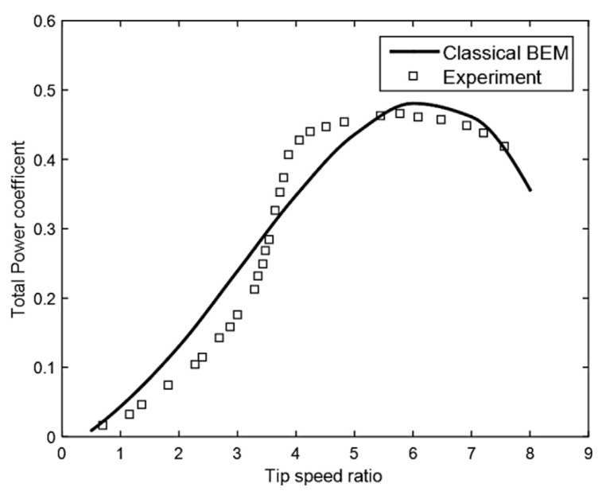
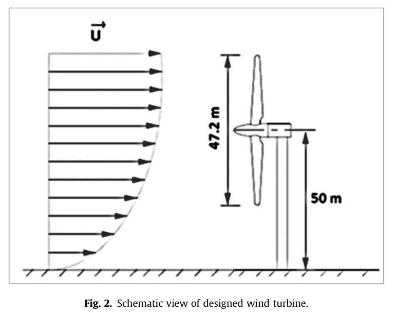
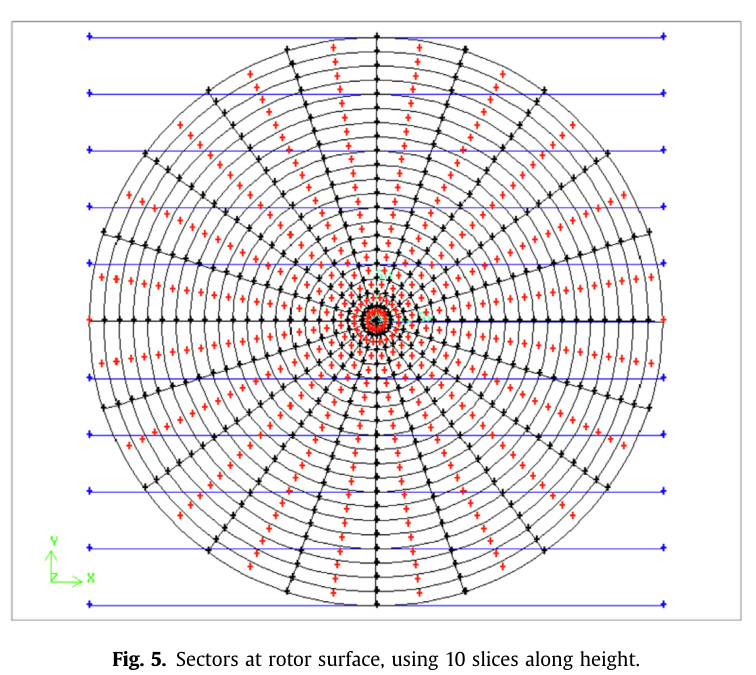
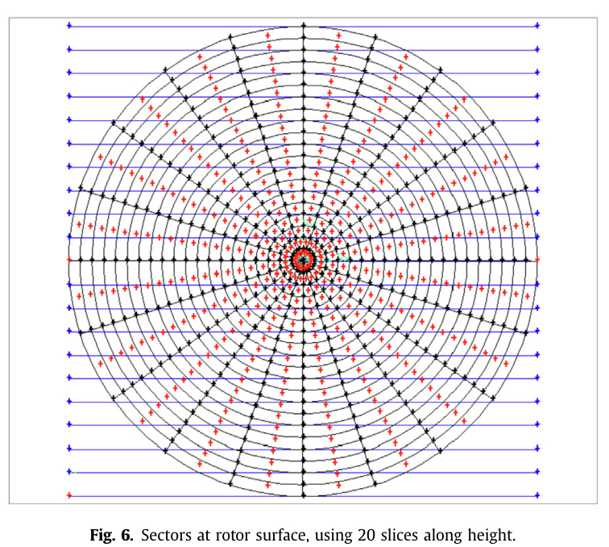
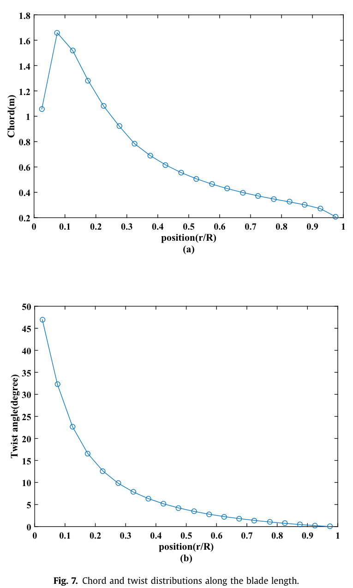
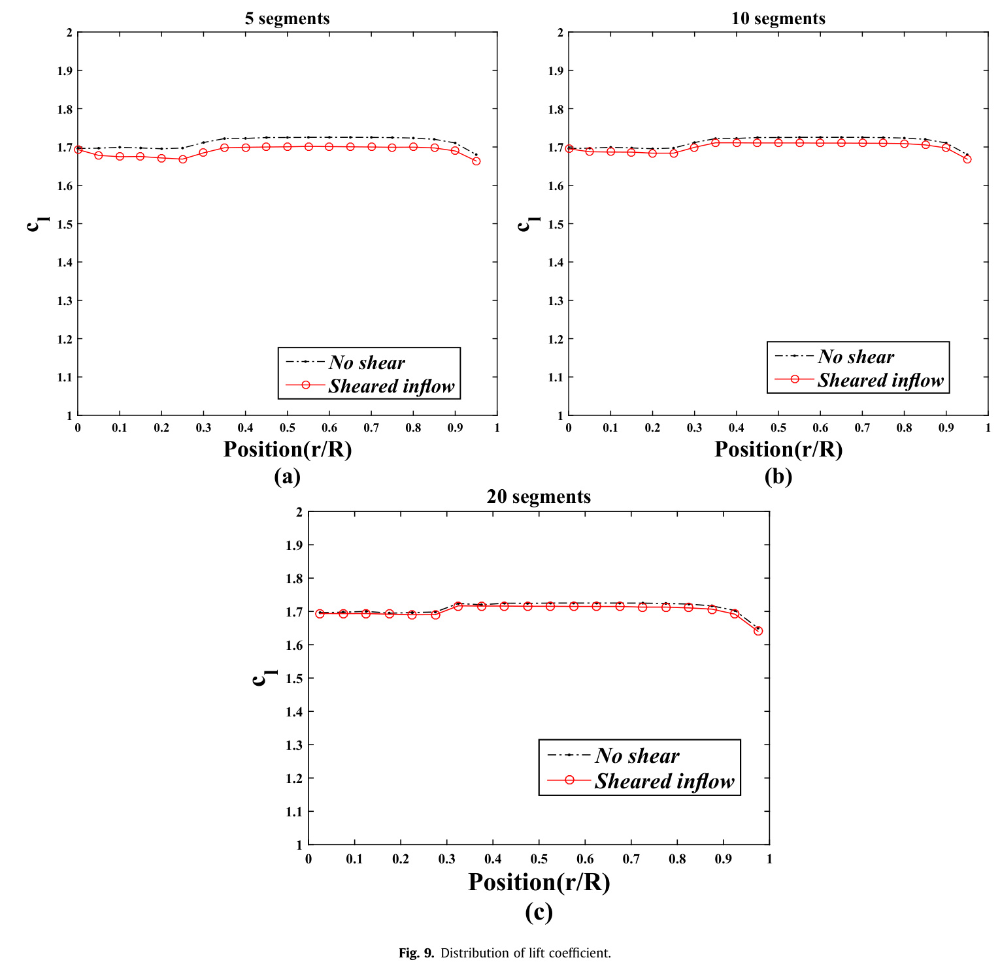

# Wind shear effect on aerodynamic performance and energy production of horizontal axis wind turbines with developing blade element momentum theory

<!-- Page 1 -->

Journal of Cleaner Production 219 (2019) 368 e 376
Contents lists available at ScienceDirect
Journal of Cleaner Production
j o u r n a l h o m e p a g e : w w w . e l s e v i e r . c o m / l o c a t e / j c l e p r o
Wind shear effect on aerodynamic performance and energy
production of horizontal axis wind turbines with developing blade
element momentum theory
a a, ** b, *
Ghazale Kavari , Mojtaba Tahani , Mojtaba Mirhosseini
a Faculty of New Sciences and Technologies, University of Tehran, Tehran, Iran
b Department of Energy Technology, Aalborg University, Pontoppidanstraede 111, 9220, Aalborg East, Denmark
a r t i c l e i n f o a b s t r a c t
Article history: Nowadays, the optimal use of energy is one of the most important things in energy engineering. Dis-
Received 23 September 2018 advantages of fossil fuels make renewable and cleaner energy sources more widely used. Wind energy is
Received in revised form a type of clean energies that will help humanity transition to a sustainable future. The power of wind
1 February 2019
turbine depends on many parameters such as wind pro fi le and blade geometry. In most studies, wind
Accepted 7 February 2019
speed is generally considered to be constant and uniform along the rotor blades. But in fact the nature of
Available online 10 February 2019
wind has irregularities in space and time. Moreover, wind shear leads to non-uniformity in wind vertical
pro fi le. Having a good understanding of these kinds of spatial and transient irregularities and also their
Keywords:
Wind energy in fl uence on wind turbine performance reduce uncertainty in design process. In the present study the
Horizontal axis wind turbine blade has been designed by blade element momentum (BEM) theory and aerodynamic coef fi cients have
Aerodynamics been calculated along the blade length. The effects of wind shear have been studied on the designed
BEM blade. Power law has been used to model wind shear. By merging this function with BEM theory, its
Wind shear effect effect can be calculated along the blade length. Results show that wind shear has little impact on
Power coef fi cient aerodynamic coef fi cients near the root region. Most of changes occur at 0.2 to 0.8 of the blade length.
Furthermore, existence of shear in wind pro fi le regarding the turbine designed for uniform in fl ow, re-
duces the kinetic energy fl ux, ability to extract the available potential and power generation.
© 2019 Elsevier Ltd. All rights reserved.
1. Introduction The most important factor affecting lifetime and reliability of wind
turbine is the blade aerodynamic forces. These forces are highly
The disadvantages caused by fossil fuels have made human to dependent on environmental conditions, especially wind condi-
use clean energy as an alternative for years. From renewable en- tions. Wind turbines spend most of their life time in non-uniform
ergies, wind energy has been used widely due to its availability. In winds (Leishman, 2002). This wind condition affects the turbine
recent years, researchers spend their time and knowledge on this performance (Lubitz, 2014). The problem of non-uniformity of
type of energy. Chen et al. (2018) tried to minimize the turbine cost wind conditions will be highlighted for urban wind turbines. In
of energy based on wind statistics. This aim was done by a math- these turbines, because of high level of disturbance, fl ow domain
ematical approach. The result of this study led to a guideline to will become complicated (Pourazarm et al., 2015). In the fi eld of
minimizing turbine cost of energy. One of the most in fl uential wind conditions studies, there is a standard published by
factors on wind turbine power production is rated wind speed. international electrotechnical commission (IEC). In accordance
Sedaghat et al. (2017) found a formulation between rated wind with this standard in order to ensure safety, turbine performance
speed and wind turbine power curve by introducing capacity value. should be studied under severe wind conditions. The two extreme
winds studied in this standard are extreme operating gusts (EOG)
and energy development corporation (EDC). In this context, Storey
et al. (2014) investigated aerodynamic loads on turbine under EOG
* Corresponding author. conditions. In this study, fl ow fi eld around turbine has been
** Corresponding author.
simulated by large eddy simulation (LES). Kim et al. (2014)
E-mail addresses: m.tahani@ut.ac.ir (M. Tahani), seh@et.aau.dk, mojtaba27900@
gmail.com (M. Mirhosseini). compared performance of two bladed turbine under normal and
https://doi.org/10.1016/j.jclepro.2019.02.073
0959-6526/ © 2019 Elsevier Ltd. All rights reserved.

<!-- Page 2 -->

G. Kavari et al. / Journal of Cleaner Production 219 (2019) 368 e 376 369
EOG condition by HAWC2 method. HAWC2 is based on blade turbine aeroelastic by considering shear fl ow. Predictions and cal-
element momentum (BEM) theory in which dynamic stall and culations were carried out in two modes: normal wind conditions
dynamic inlet fl ow have been investigated. and extreme wind conditions, and by using BEM method and free
Many research results show that wind turbine power diagram vortex method. Smith et al. (2015) experimentally studied wind
depends on a large number of meteorological and topographical pro fi les on an off-shore wind farm. In this study, the effects of
parameters. Wind shear, turbulence and wind direction are the turbulence and wind shear were investigated by measuring data
most important parameters that affect the uncertainty of the tur- during 6 months. Li et al. (2016) examined the effect of fl uctuations
bine power diagram. Tahani et al. (2017b) investigated the effect of and wind shear by using experimental research for a wind turbine
geometrical parameters of an optimized wind turbine blade in in a wind tunnel. Turbulence intensity was modeled by turbulence
turbulent fl ow. In this study different chord and twist distribution grids and wind shear by boundary layer production tool.
functions and also different sections were considered in the opti- In the present research, a turbine is fi rstly modeled by BEM
mization process. The base geometry and also the optimized ge- method. This method is widely used in the aerodynamic aspect of
ometry performance were analyzed using CFD at two turbulence wind turbine design (Bakirci and Yilmaz, 2018; Tahani and Moradi
intensities. The results indicated that by increasing the turbulence (2016)). It removes insigni fi cant amount of computational cost and
intensity, the wake turbulent kinetic energy also increases and time and is suf fi ciently precise. By designing turbine with this
therefore the wake recovery occurs faster. Also the results indicated method, chord and twist distributions for speci fi c power and uni-
that for optimized geometry the separation is delayed and there- form wind speed are calculated. Afterwards the aerodynamic co-
fore more power generation can be achieved. Li et al. (2018) studied ef fi cients such as lift, thrust and power coef fi cient are determined
the in fl uence of wind velocity fi eld on the performance of offshore along the blade length i.e. in different blade radius. After designing
fl oating wind turbine. In this research, several wind velocity fi elds turbine with BEM method, effect of wind shear is studied by using
have been investigated such as uniform wind velocity fi eld, sheared the de fi nition of power law. The swept area of the rotor is divided
wind velocity fi eld (with a smooth pro fi le) and turbulent wind into different slices (segments) in the vertical direction and each
velocity fi eld (with spatial and transient irregularities). The fi rst slice will be exposed to a speci fi c speed which is proportional to
two wind velocity fi elds were time-independent and the direction wind shear. The novelty of this study is to take into account the
of in fl ow was perpendicular to the rotor plane. Kaviani and Nejat effect of wind shear with BEM method which classically uses the
(2017) estimated wind turbine noise by implementing shear wind constant wind speed pro fi le. Therefore, the wind shear effect on
pro fi le. The method used in this study is Improved Delayed De- aerodynamic coef fi cients along each part of the blade length will be
tached Eddy Simulation in order to simulate the instantaneous fl ow considered.
fi eld around wind turbine. Rohatgi and Barbezier (1999) investi-
gated the effect of wind disturbances on the turbine output. They
also presented a summary of atmospheric stability and vertical 2. Aerodynamics of horizontal axis wind turbine
temperature gradients to enhance understanding of their effects.
Frandsen et al. (2000) examined the disadvantages of measuring BEM theory had been introduced by Glauert (Hansen, 2008) and
methods by replacing a new performance analysis method. The it combines momentum theory and blade element theory. In this
ACCUWIND project examined the effect of secondary parameters method, the blade is divided into several radial elements (usually
such as vertical in fl ow and turbulence intensity on wind turbine 10 e 20 (Manwell et al., 2009),). It is assumed that these elements do
performance, in order to obtain reliable power diagram. Kaiser et al. not have an aerodynamic interaction to each other. BEM is an
(2007) studied uncertainty in turbine power by estimating the ef- analytical method which needs some parameters as inputs. These
fect of turbulence intensity. In this study, effects of wind shear and parameters include power of turbine, free stream wind speed and
turbulence were studied separately. Schmidh Paulsen et al. (2006) airfoil type. It should be noted that by selecting airfoil type, design
performed simulations for tangential stresses and different turbu- angle of attack and also design lift/drag are determined. Identifying
lence intensities. In this research, the wind speed has been studied number of blades and using Eq. (1) (Manwell et al., 2009) will lead
only at the height of the hub. Maeda et al. (2006) experimentally to determining maximum power coef fi cient (CP, max) and optimum
investigated wind turbine which had a rotor with diameter of 10 m. tip speed ratio ( l ).
Pressure distribution on the rotary blade was measured by pressure
transducers and mean wind speed was measured by an anemom- 2   2 3  1
l  8 2
eter. Then, the relations between the aerodynamic forces resulting 16 6 1 : 32 þ 20 7 0 : 57 l
CP ¼ l 4 l þ 5    (1)
from the distribution of the pressure and the momentum on the ; max 27 B 2 3 Cl l þ 1
Cd 2 B
blade were investigated. The results indicated the fl uctuations in
aerodynamic forces are resulted from variation of wind speed and
B is number of blade which in the present study is equal to 3 and
direction. Maeda and Kawabuchi (2007) experimentally studied
Cl and Cd are lift and drag coef fi cients, respectively. Rotor radius is
wind turbine aerodynamics by considering wind shear. They
another parameter which can be calculated by Eq. (2).
measured the wind pro fi le using an anemometer. Wagner et al.
(2009) studied vertical wind pro fi le by experimental measure- 1
2 3
ments. They used the de fi nition of equivalent wind speed in order P ¼ 2 Cp h r p R U (2)
to simulate wind shear. Honrubia et al. (2010) measured and
analyzed the wind speed at nine different heights to investigate the where h is the electromechanical ef fi ciency and is assumed to be
effect of wind shear. They used power law and logarithmic law in 0.9, P is the turbine power, r is the air density and U is the mean
order to analyze measured data. Sezer-Uzol and Uzol (2013) wind speed.
investigated the effect of uniform and shear fl ow on 2 bladed tur- BEM is an iterative method which is based on guessing axial and
bine performance by Vortex-Lattice method. This method was also angular induction factor. By equating normal forces and torque
used by Jeon et al. (2014) to study unsteady aerodynamics of off- equations from momentum theory (Eqs. (3) and (4)) and also blade
shore wind turbines. In their study, effects of thickness and vis- element theory (Eqs. (5) and (6)), axial induction factor ( a ) and
cosity were considered by a correction in the unsteady vortex angular induction factor ( a 0 ) will be determined (Eqs. (7) and (8))
method. Jeong et al. (2014) investigated the effect of wake on wind (Manwell et al., 2009).

<!-- Page 3 -->

370 G. Kavari et al. / Journal of Cleaner Production 219 (2019) 368 e 376
2
dT ¼ r U 4 a ð 1  a Þ p rdr (3)
0 3
dQ ¼ 4 a ð 1  a Þ r U p r U dr (4)
1 2
dFn ¼ B r U rel ð Cl cos 4 þ Cd sin 4 Þ cdr (5)
2
1
dQ ¼ B r U 2 rel ð Cl sin 4  Cd cos 4 Þ crdr (6)
2
 
.
a ¼ 1 2 (7)
1 þ 4 sin 4 0
ð s Cl cos 4 Þ
  
0
a ¼ 1 (8)
4 cos 4 = 0  1
s Cl
Fig. 2. Schematic view of designed wind turbine.
where U is the rotational speed, r is the local radius, 4 is the angle of
relative wind and s 0 is the solidity ( s 0 ¼ 2 Bc p r ).
There are two modi fi cations on BEM which make it more real- 3. Considering wind shear and solution method
istic. The fi rst one is applied in order to take the effect of fl ow
behavior around the tip into account. Due to pressure difference The lowest atmospheric layer is a turbulence layer called at-
between suction side and pressure side of the blade, the air tends to mospheric boundary layer. In this layer, earth friction, climatic
fl ow around tip. Prandtl has introduced a correction factor called F conditions, and vertical gradients of temperature and pressure
which is calculated by Eq. (9) (Manwell et al., 2009). affect the air fl ow. The friction caused by the roughness of the earth
      absorbs energy from the air and creates a vertical wind velocity
2  1 ð B = 2 Þ½ 1  ð r = R ފ gradient (Mathew, 2006). Investigating the effect of wind speed
F ¼ cos exp  (9)
p ð r = R sin 4 Þ vertical gradient on turbine performance is important not only in
terms of aerodynamics, but also for fatigue life of rotor blades. In
Another modi fi cation is for turbulent wake state. At this con-
order to model the vertical gradient of wind velocity, one can use
dition, an empirical relation for axial induction factor has been
the power law or logarithm law. These functions are derived from
developed by Glauert (Manwell et al., 2009) for a > 0 : 4 or CT > 0 : 96.
experimental data collected by scientists in the fi eld of aero-
CT is the thrust coef fi cient.
dynamics and meteorology (Jha, 2017). Equation (11) expresses the
  h i power law (Tong, 2010).
p ffiffiffiffiffiffiffiffiffiffiffiffiffiffiffiffiffiffiffiffiffiffiffiffiffiffiffiffiffiffiffiffiffiffiffiffiffiffiffiffiffiffiffiffiffiffiffiffiffiffiffiffiffiffiffiffiffiffiffiffiffiffiffi
=
a ¼ 1 F 0 : 143 þ 0 : 0203  0 : 6427 ð 0 : 889  CT Þ (10)
  a
h
A comparison between classical BEM results obtained in the Uh ¼ UH (11)
H
present study and experimental data (Lee et al., 2016) is shown in
Fig. 1. Results show good agreement between two series of data H is the hub height, UH is the wind velocity at hub height and a is
somehow the maximum difference is equal to 11.6%. the wind shear coef fi cient. The logarithmic law is also de fi ned ac-
cording to Eq. (12) (Tong, 2010).
 
u * h
Uh ¼ ln (12)
k z 0
where u * is the friction velocity, z 0 is the roughness length and k is
K arm   an constant and is about 0.4 according to Elkinton et al.
(2006). In the present study, wind shear is modeled by power
law and using wind information in a speci fi c area.
In classical BEM theory, wind speed is considered to be constant
along the rotor height and swept area but in fact, velocity magni-
tude changes with height. In this research, the designed turbine has
100 kW output power, free stream wind velocity is 6 m/s and the
selected airfoil is RISO A1-21. Rotor diameter is 47.2 m (from Eq. (2))
Table 1
Wind velocity at different height.
Moalleman city Height (m) Velocity (m/s)
1 0 0
2 10 4.9
3 30 5.8
Fig. 1. Validation of classical BEM results with experimental results obtained from Lee
4 40 6.4
et al. (2016).

Fig. 2. Schematic view of designed wind turbine.

<!-- Page 4 -->

G. Kavari et al. / Journal of Cleaner Production 219 (2019) 368 e 376 371
80
70
60
50
Height(m)
40
Sheared inflow
30
No shear
20
5 5.2 5.4 5.6 5.8 6 6.2 6.4 6.6 6.8 7
Wind speed(m/s)
Fig. 3. Wind speed in the case of sheared in fl ow and no shear.

and hub height is 50 m. Schematic view of designed turbine is abundant, and inexhaustible which makes it a sustainable and
illustrated in Fig. 2. In order to apply power law for predicting wind large-scale alternative to fossil fuels. In this section, results of
speed pro fi le, wind shear component should be determined. In this
investigation, wind data from Moalleman city (Mirhosseini et al.,
2011) has been used at three different heights. This data is pre-
sented in Table 1. By applying curve fi tting process on the data,
wind shear coef fi cient ( a ) becomes 0.1092. In Fig. 3, difference
between the input velocities in the classical mode and shear fl ow
mode is observed.
In the classical BEM method, the rotor is considered as a disk
which is divided into a number of elements along the blade length
(20 radial elements in this study). As mentioned, in this method,
the aerodynamic coef fi cients are calculated along the blade. In or-
der to study the effect of vertical wind pro fi le on the rotor ’ s per-
formance, the swept area should be discretized by sectors (Fig. 4a).
With the aim of increasing accuracy, several slices (segments) in the
vertical direction of the rotor area are considered. From the colli-
sions of the rings (radial elements) and these slices, sectors are
created at the rotor surface. A sector is shown in Fig. 4b. To increase
the accuracy of solution and also with the aim of investigating
solutions dependency to the number of slices along the rotor
height, it is divided into 5, 10, and 20 slices which are shown in
Figs. 4a, 5 and 6, respectively.
The velocity of slices is calculated using power law and each
sector will be subjected to the velocity corresponding to its height.
It is obvious that in each slice along the rotor height, wind velocity
is assumed constant. The calculated velocities at different heights
for all three cases (considering 5, 10 and 20 slices) are presented in (a)
Tables 2 e 4. The slice numbering is from the bottom to top in the
rotor area and it does not change when the rotor moves around the
axis.
4. Results
As mentioned above, harnessing the wind power is one of the
(b)
cleanest ways to generate electrical energy without toxic pollution
and global warming emissions. Moreover, wind is affordable, Fig. 4. (a) Sectors on rotor swept area, (b) a sector on the rotor area.

<!-- Page 5 -->

372 G. Kavari et al. / Journal of Cleaner Production 219 (2019) 368 e 376
Table 3
Calculated velocity at different heights - 10 slices along the rotor height.
Slice number 1 2 3 4 5 6 7 8 9 10
Velocity (m/s) 5.59 5.62 5.78 5.86 5.93 6 6.06 6.11 6.16 6.21
Table 4
Calculated velocity at different heights - 20 slices along the rotor height.
Slice number 1 2 3 4 5 6 7 8 9 10
Velocity (m/s) 5.59 5.61 5.69 5.74 5.78 5.82 5.86 5.9 5.93 5.96
Slice number 11 12 13 14 15 16 17 18 19 20
Velocity (m/s) 6 6.03 6.06 6.09 6.11 6.14 6.16 6.19 6.21 6.24
shown along the blade. The angle of attack distribution is almost
constant along the blade length except in the tip region. In this
region, due to generated vortices, the angle of attack decreases. In
general, existence of shear in wind pro fi le reduces the angle of
relative wind. The angle of attack is obtained from the difference
between angle of relative wind and twist and pitch angle (Elkinton
Fig. 5. Sectors at rotor surface, using 10 slices along height.

et al., 2006). As can be seen from the fi gure, the reduction due to
wind shear is low at the fi rst 30% of the blade length from the root
1.8
1.6
1.4
1.2
1
Chord(m)
0.8
0.6
0.4
0.2
0 0.1 0.2 0.3 0.4 0.5 0.6 0.7 0.8 0.9 1
position(r/R)
(a)
Fig. 6. Sectors at rotor surface, using 20 slices along height.

50
aerodynamic design of wind turbine are presented and a compar-
ison between classical data and results from applying wind shear is 45
made. In the fi rst step of design, blade geometrical parameter
40
means the distributions of chord length and twist angle will be
determined. These distributions for designed turbine are presented 35
in Fig. 7. The r/R is the relative location from the blade root, which is
30
used to make the results clearer. The chord distribution has uptrend
from the fi rst to the second radial element and then it decreases. 25
The value of twist angle is decreasing along blade length. By
20
decreasing twist angle along the blade, the angle of attack at each
section remains approximately constant which leads to a constant Twist angle(degree) 15
lift coef fi cient. In Fig. 8, the distribution of the angle of attack is
10
5
Table 2 0
Calculated velocity at different heights - 5 slices along the rotor height. 0 0.1 0.2 0.3 0.4 0.5 0.6 0.7 0.8 0.9 1
position(r/R)
Slice number 1 2 3 4 5 (b)
Velocity (m/s) 5.59 5.78 5.93 6.06 6.16
Fig. 7. Chord and twist distributions along the blade length.

<!-- Page 6 -->

G. Kavari et al. / Journal of Cleaner Production 219 (2019) 368 e 376 373
20 segments and then this reduction increases in the rest of the blade length.
13 Distribution of lift coef fi cient is illustrated in Fig. 9. Lift coef fi -
No shear cient is almost constant along the blade length except at tip region.
12.5
Sheared inflow This trend is like to angle of attack distribution. With decreasing
12 angle of attack in sheared in fl ow compared to its classical value, lift
coef fi cient will decrease. This increase is negligible in the root re-
11.5 gion, however it has slightly grown. In order to make a better
comparison, results are indicated along the blade length for cases
11 with 5, 10 and 20 slices. These results show that by increasing
number of slices, results are closer to their classical values.
10.5
Fig. 10 demonstrates distribution of thrust coef fi cient along the
blade length for cases with 5, 10 and 20 slices (segments). Classical
10
value of thrust coef fi cient is almost constant and is about 0.88 along
9.5 blade length except at tip and root regions. This value for thrust
Angle of attack(Degree)
coef fi cient is related to maximum power coef fi cient. Wind shear
9 generally enhances thrust coef fi cient along the blade length. This
0 0.1 0.2 0.3 0.4 0.5 0.6 0.7 0.8 0.9 1 increase is negligible at tip and root regions but the difference
Position(r/R) between these two data series is higher for the other radial posi-
tions along the blade, particularly for case with 5 slices. Finally, in
Fig. 8. Distribution of angle of attack.

5 segments 10 segments
2 2
1.9 1.9
1.8 1.8
1.7 1.7
1.6 1.6
l l
c 1.5 c 1.5
1.4 1.4
1.3 1.3
1.2 1.2
No shear No shear
1.1 1.1 Sheared in fl ow
Sheared in fl ow
1 1
0 0.1 0.2 0.3 0.4 0.5 0.6 0.7 0.8 0.9 1 0 0.1 0.2 0.3 0.4 0.5 0.6 0.7 0.8 0.9 1
Position(r/R) Position(r/R)
(a) (b)
20 segments
2
1.9
1.8
1.7
1.6
l
c 1.5
1.4
1.3
No shear
1.2 Sheared in fl ow
1.1
1
0 0.1 0.2 0.3 0.4 0.5 0.6 0.7 0.8 0.9 1
Position(r/R)
(c)
Fig. 9. Distribution of lift coef fi cient.

<!-- Page 7 -->

374 G. Kavari et al. / Journal of Cleaner Production 219 (2019) 368 e 376
5 segments 10 segments
1 1
No shear No shear
0.95 Sheared in fl ow 0.95 Sheared in fl ow
0.9 0.9
0.85 0.85
t t
c 0.8 c 0.8
0.75 0.75
0.7 0.7
0.65 0.65
0.6 0.6
0 0.1 0.2 0.3 0.4 0.5 0.6 0.7 0.8 0.9 1 0 0.1 0.2 0.3 0.4 0.5 0.6 0.7 0.8 0.9 1
Position(r/R) Position(r/R)
(a) (b)
20 segments
1
No shear
0.95
Sheared in fl ow
0.9
0.85
t
c 0.8
0.75
0.7
0.65
0.6
0 0.1 0.2 0.3 0.4 0.5 0.6 0.7 0.8 0.9 1
Position(r/R)
(c)
Fig. 10. Distribution of thrust coef fi cient.

Fig. 11 effect of wind shear on local power coef fi cient is illustrated coef fi cient of each sector is different from the other sector placed in
along the blade for cases with 5, 10 and 20 slices. In classical design, the other slice with the same radial distance from the blade root.
rate of increasing local power coef fi cient is linear from the root to Therefore, all results represented in Figs. 8 e 11, for sheared in fl ow,
80% of the blade length. Then, it reaches its maximum value and are obtained by summation of aerodynamic coef fi cients of all sec-
after that it decreases due to tip vortices (Sedaghat and Mirhosseini, tors which are in the same radial bound. As observed, these results
2012; Sedaghat et al., 2014; Tahani et al., 2017a,b). By rotating are shown versus r/R.
blades in a sheared in fl ow, the blades pass through the variable As the blade moves upwards, free stream velocity and hence
wind speed pro fi le. The magnitude of the variations depends on the relative velocity and angle of attack will be increased, while by
shear coef fi cient and the blade radius. The relative velocity that moving downward everything will be reversed. These cyclic
blades will face, determines aerodynamic forces on the blade. It changes in the inlet fl ow reduce the turbine ’ s ability to extract
should be noted that all sectors in the swept area rotate (and should power from the wind. As can be seen from the fi gure at root region,
rotate) with a constant rotational speed, because they are assumed wind shear has no signi fi cant effect on power coef fi cient. Most
to be connected to each other, however by considering the non- changes occur in the 70 e 80% of the blade length from the root
uniform wind pro fi le, the wind velocity is different for each slice which shows at most 4.4% reduction in local power for the case
based on its height, so the power generation and aerodynamic with 20 slices.

<!-- Page 8 -->

G. Kavari et al. / Journal of Cleaner Production 219 (2019) 368 e 376 375
5 segments 10 segments
0.05 0.05
0.045 0.045
0.04 0.04
0.035 0.035
0.03 0.03
p p
c 0.025 c 0.025
0.02 0.02
0.015 0.015
0.01 0.01
No shear No shear
0.005 0.005 Sheared in fl ow
Sheared in fl ow
0 0
0 0.1 0.2 0.3 0.4 0.5 0.6 0.7 0.8 0.9 1 0 0.1 0.2 0.3 0.4 0.5 0.6 0.7 0.8 0.9 1
Position(r/R) Position(r/R)
(a) (b)
20 segments
0.05
0.045
0.04
0.035
0.03
p 0.025
c
0.02
0.015
0.01 No shear
Sheared in fl ow
0.005
0
0 0.1 0.2 0.3 0.4 0.5 0.6 0.7 0.8 0.9 1
Position(r/R)
(c)
Fig. 11. Distribution of power coef fi cient.

5. Conclusion and along the rotor height and wind shear is ignored. The aim of
this study was to investigate wind shear effect on aerodynamic
The presence of pollutant resulting from the excessive use of design of horizontal axis wind turbine. The approach implemented
fossil fuels and phenomena such as global warming has led human here was based on BEM theory. Hence, fi rst of all, a turbine was
to the use of renewable and clean energies such as wind energy. aerodynamically designed by this classic theory. Therefore, the
One of the most important aspects of wind turbine design is its blade shape i.e. chord and twist distribution was determined at
aerodynamics. More accurate design based on real operating con- different blade radius and aerodynamic coef fi cients were calcu-
ditions causes to increase reliability for power generation and lated along the blade length. The effect of wind shear was studied
techno-economical assessment. In most aerodynamic designs of on aerodynamic performance by dividing the rotor height into
wind turbines, wind speed is assumed constant on the swept area different slice numbers. In order to calculate velocity at each height,

<!-- Page 9 -->

376 G. Kavari et al. / Journal of Cleaner Production 219 (2019) 368 e 376
power law was used. So, the BEM theory was combined with wind aerodynamic performance of offshore fl oating wind turbines. Energy 157,
shear effect. Results showed that wind shear has no signi fi cant 379 e 390. https://doi.org/10.1016/j.energy.2018.05.183.
Li, Q., Murata, J., Endo, M., Maeda, T., Kamada, Y., 2016. Experimental and numerical
effect on aerodynamic coef fi cient in root region. Most of changes investigation of the effect of turbulent in fl ow on a Horizontal Axis Wind Tur-
occurred at 20% e 80% of the blade length. Existence of shear in wind bine (Part I: power performance). Energy 113, 713 e 722. https://doi.org/10.1016/
pro fi le led to reduction in angle of attack and hence lift coef fi cient. j.energy.2016.06.138.
Lubitz, W.D., 2014. Impact of ambient turbulence on performance of a small wind
Thereby, wind turbine power coef fi cient reduced; however, the turbine. Renew. Energy 61, 69 e 73. https://doi.org/10.1016/j.renene.2012.08.015.
thrust coef fi cient depicted an increment. This study has imple- Maeda, T., Kamada, Y., Tanaka, K., Naito, K., Ouchi, Y., 2006. Experimental studies on
mented an innovative method to combine the BEM theory and unsteady aerodynamics effect on the blade root load of HAWT fi eld rotor. In:
First International Symposium on Environment Identities and Mediterranean
wind shear effect that causes to increase the accuracy of classical Area. Corte-Ajaccio, France, pp. 206 e 210. https://doi.org/10.1109/
BEM method while it has almost the same calculation cost. As a ISEIMA.2006.344955.
future work, one can investigate the effect of wind shear combined Maeda, T., Kawabuchi, H., 2007. Effect of wind shear on the characteristics of a
rotating blade of a fi eld horizontal axis wind turbine. J. Fluid Sci. Technol. 2,
with wide range of turbulence intensity by using BEM theory to 152 e 162. https://doi.org/10.1299/jfst.2.152.
predict the aerodynamic coef fi cients along the blade length. Manwell, J.F., McGowan, J.G., Rogers, A.L., 2009. Wind Energy Explained: Theory,
Design and Application, second ed. John Wiley & Sons. ISBN 978-0-470-01500-
1.
References
Mathew, S., 2006. Wind Energy: Fundamentals, Resource Analysis and Economics,
fi rst ed. Springer-Verlag Berlin Heidelberg. ISBN 978-3-540-30906-2.
Bakirci, M., Yilmaz, S., 2018. Theoretical and computational investigations of the Mirhosseini, M., Shari fi , F., Sedaghat, A., 2011. Assessing the wind energy potential
optimal tip-speed ratio of horizontal-axis wind turbines. Eng. Sci. Technol. Int. J. locations in province of Semnan in Iran. Renew. Sustain. Energy Rev. 15,
21, 1128 e 1142. https://doi.org/10.1016/j.jestch.2018.05.006. 449 e 459. https://doi.org/10.1016/j.rser.2010.09.029.
Chen, J., Wang, F., Stelson, K.A., 2018. A mathematical approach to minimizing the Pourazarm, P., Caracoglia, L., Lackner, M., Modarres-Sadeghi, Y., 2015. Stochastic
cost of energy for large utility wind turbines. Appl. Energy 228, 1413 e 1422. analysis of fl ow-induced dynamic instabilities of wind turbine blades. J. Wind
https://doi.org/10.1016/j.apenergy.2018.06.150. Eng. Ind. Aerod. 137, 37 e 45. https://doi.org/10.1016/j.jweia.2014.11.013.
Elkinton, M.R., Rogers, A.L., McGowan, J.G., 2006. An investigation of wind-shear Rohatgi, J., Barbezier, G., 1999. Wind turbulence and atmospheric stability-their
models and experimental data trends for different terrains. Wind Eng. 30, effect on wind turbine output. Renew. Energy 16, 908 e 911. https://doi.org/10.
341 e 350. https://doi.org/10.1260/030952406779295417. 1016/S0960-1481(98)00308-5.
Frandsen, S., Antoniou, I., Hansen, J.C., Kristensen, L., Madsen, H.A., Schmidt Paulsen, U., Friis Pedersen, T., Ejsing Jørgensen, H., 2006. Sea e land inter-
Chaviaropoulos, B., Douvikas, D., Dahlberg, J.A., Derrick, A., Dunbabin, P., action in fl uence on wind turbine power performance. Geophys. Res. Abstr. 8
Hunter, R., Ruf fl e, R., Kanellopoulos, D., Kapsalis, G., 2000. Rede fi nition power (Abstr. EGU06-A-06548).
curve for more accurate performance assessment of wind farms. Wind Energy Sedaghat, A., Hassanzadeh, A., Jamali, J., Mostafaeipour, A., Chen, W.H., 2017.
3, 81 e 111. https://doi.org/10.1002/1099-1824(200004/06)3:2 < 81::AID- Determination of rated wind speed for maximum annual energy production of
WE31 > 3.0.CO;2-4. variable speed wind turbines. Appl. Energy 205, 781 e 789. https://doi.org/10.
Hansen, M.O.L., 2008. Aerodynamics of Wind Turbines, second ed. Earthscan. ISBN: 1016/j.apenergy.2017.08.079.
978-1-84407-438-9. Sedaghat, A., Mirhosseini, M., 2012. Aerodynamic design of a 300 kW horizontal
Honrubia, A., Vigueras-Rodríguez, A., Ǵ omez Lazaro, E., Rod   riguez- Sanchez, D.,  axis wind turbine for province of Semnan. Energy Convers. Manag. 63, 87 e 94.
2010. The in fl uence of wind shear in wind turbine power estimation. In: Eu- https://doi.org/10.1016/j.enconman.2012.01.033.
ropean Wind Energy Conference and Exhibition 2010, 6, pp. 4130 e 4139. http:// Sedaghat, A., Mirhosseini, M., Moghimi Zand, M., 2014. Aerodynamic design and
www.upct.es/hidrom/publicaciones/congresos/2010_The_in fl uence_of_wind_ economical evaluation of site speci fi c horizontal axis wind turbine (HAWT).
shear.pdf. Energy Equip. Syst. 2, 43 e 56. https://doi.org/10.22059/EES.2014.5009.
International Electrotechnical Commission (IEC), “ Wind Turbines-Part 1: Design Sezer-Uzol, N., Uzol, O., 2013. Effect of steady and transient wind shear on the wake
Requirements, ” IEC-61400-12007. structure and performance of a horizontal axis wind turbine rotor. Wind Energy
Jeong, M.S., Kim, S.W., Lee, I., Yoo, S.J., 2014. Wake impacts on aerodynamic and 16, 1 e 17. https://doi.org/10.1002/we.514.
aeroelastic behaviors of a horizontal axis wind turbine blade for sheared and Smith, J.C., Carriveau, R., Ting, D.S.K., 2015. Turbine power production sensitivity to
turbulent fl ow conditions. J. Fluid Struct. 50, 66 e 78. https://doi.org/10.1016/j. coastal sheared and turbulent in fl ows. Wind Eng. 39, 183 e 191. https://doi.org/
j fl uidstructs.2014.06.016. 10.1260/0309-524X.39.2.183.
Jeon, M., Lee, S., Lee, S., 2014. Unsteady aerodynamics of offshore floating wind Storey, R.C., Norris, S.E., Cater, J.E., 2014. Modelling turbine loads during an extreme
turbines in platform pitching motion using vortex lattice method. Renew. En- coherent gust using large eddy simulation. J. Phys. Conf. Ser. 524, 012177.
ergy 65, 207 e 212. https://doi.org/10.1016/j.renene.2013.09.009. https://doi.org/10.1088/1742-6596/524/1/012177.
Jha, A.R., 2017. Wind Turbine Technology, fi rst ed. CRC press. ISBN: 9781138115330. Tahani, M., Kavari, G., Masdari, M., Mirhosseini, M., 2017a. Aerodynamic design of
Kaiser, K., Langreder, W., Hohlen, H., Højstrup, J., 2007. Turbulence correction for horizontal axis wind turbine with innovative local linearization of chord and
power curves. In: Wind Energy. Springer, pp. 159 e 162. twist distributions. Energy 131, 78 e 91. https://doi.org/10.1016/j.energy.2017.05.
Kaviani, H.R., Nejat, A., 2017. Aerodynamic noise prediction of a MW-class HAWT 033.
using shear wind pro fi le. J. Wind Eng. Ind. Aerod. 168, 164 e 176. https://doi.org/ Tahani, M., Maeda, T., Babayan, N., Mehrnia, S., Shadmehri, M., Li, Q., Fahimi, R.,
10.1016/j.jweia.2017.06.003. Masdari, M., 2017b. Investigating the effect of geometrical parameters of an
Kim, T., Petersen, M.M., Larsen, T.J., 2014. A comparison study of the two-bladed optimized wind turbine blade in turbulent fl ow. Energy Convers. Manag. 153,
partial pitch turbine during normal operation and an extreme gust condi- 71 e 82. https://doi.org/10.1016/j.enconman.2017.09.073.
tions. J. Phys. Conf. Ser. 524, 012065. https://doi.org/10.1088/1742-6596/524/1/ Tahani, M., Moradi, M., 2016. Aerodynamic investigation of a wind turbine using
012065. CFD and modi fi ed BEM methods. J. Appl. Fluid Mech. 9, 107 e 111.
Lee, M.H., Shiah, Y.C., Bai, C.J., 2016. Experiments and numerical simulations of the Tong, W., 2010. Wind Power Generation and Wind Turbine Design. Wit Press. ISBN:
rotor-blade performance for a small-scale horizontal axis wind turbine. J. Wind 978-1-84564-205-1.
Eng. Ind. Aerod. 149, 17 e 29. https://doi.org/10.1016/j.jweia.2015.12.002. Wagner, R., Antoniou, I., Pedersen, S.M., Courtney, M.S., Jørgensen, H.E., 2009. The
Leishman, J.G., 2002. Challenges in modeling the unsteady aerodynamics of wind in fl uence of the wind speed pro fi le on wind turbine performance measure-
turbines. In: 21 st ASME Wind Energy Symposium, Reno, NV, USA, 14 e 17 January ments. Wind Energy 12, 348 e 362. https://doi.org/10.1002/we.297.
2002, pp. 141 e 167. https://doi.org/10.1002/we.62.
Li, L., Liu, Y., Yuan, Z., Gao, Y., 2018. Wind fi eld effect on the power generation and
