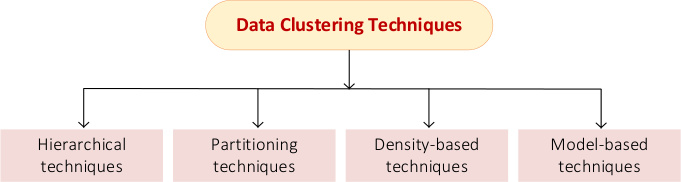
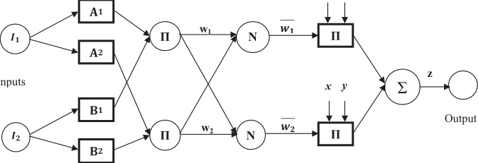
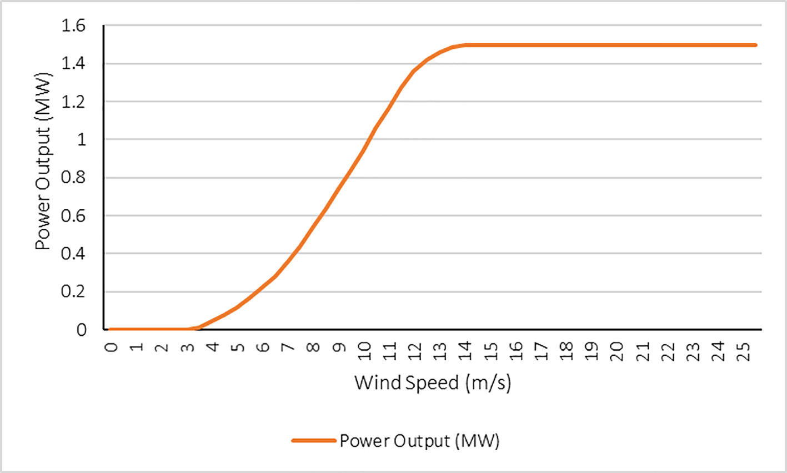
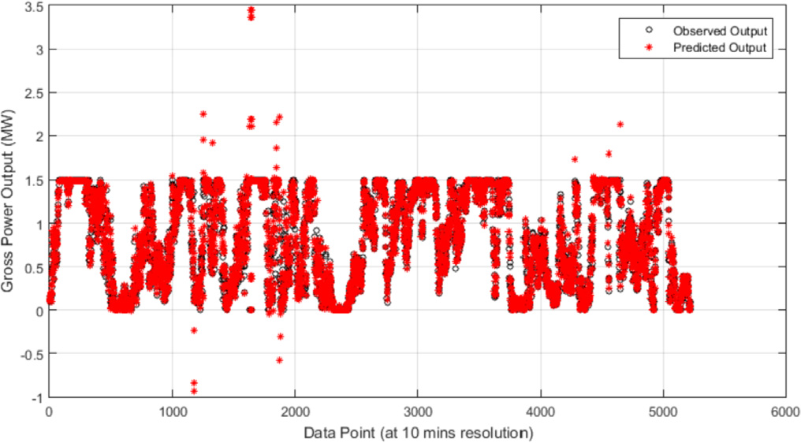
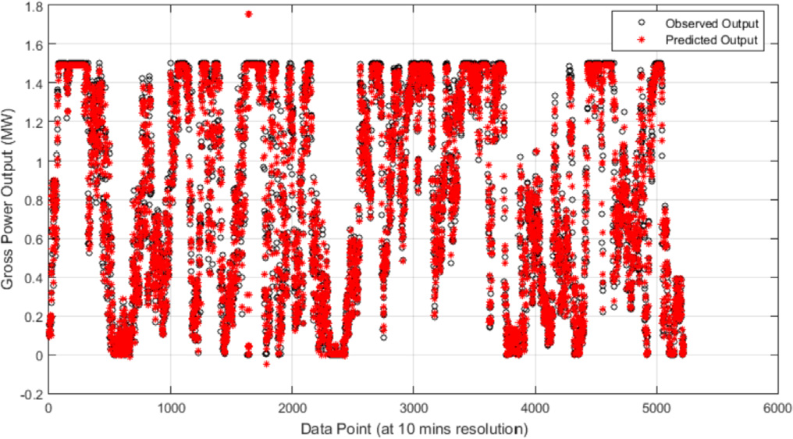
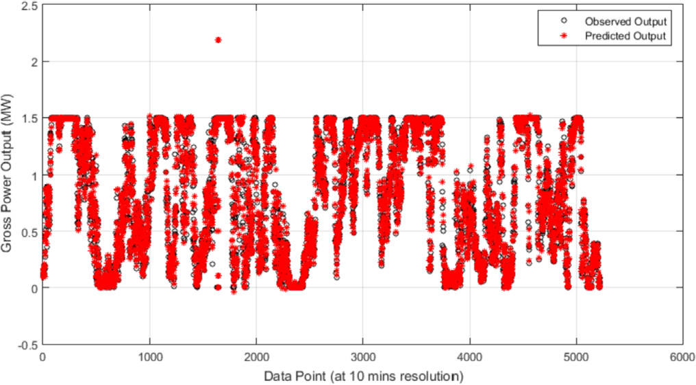
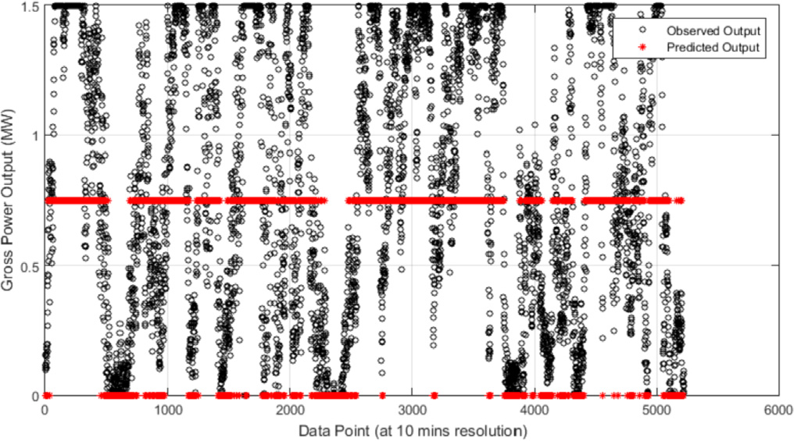
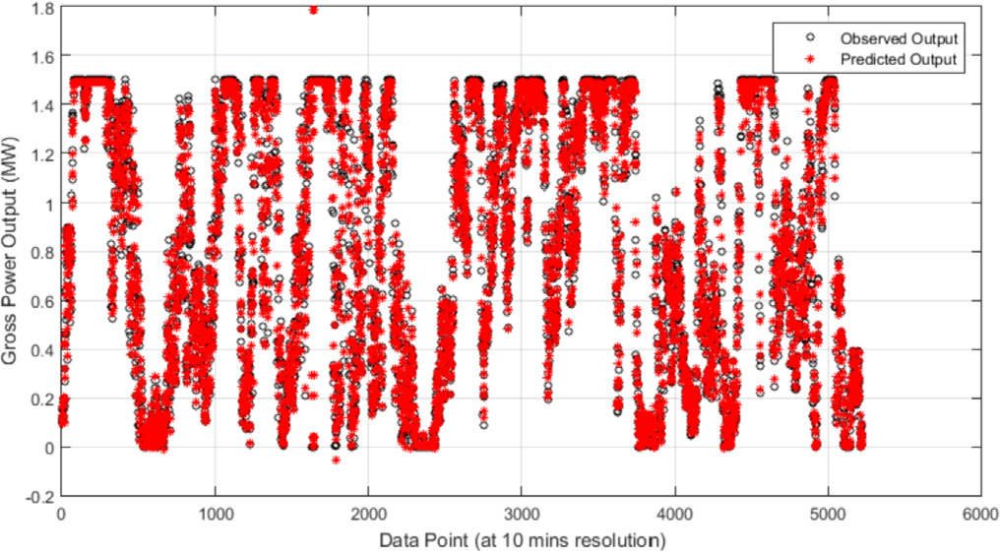
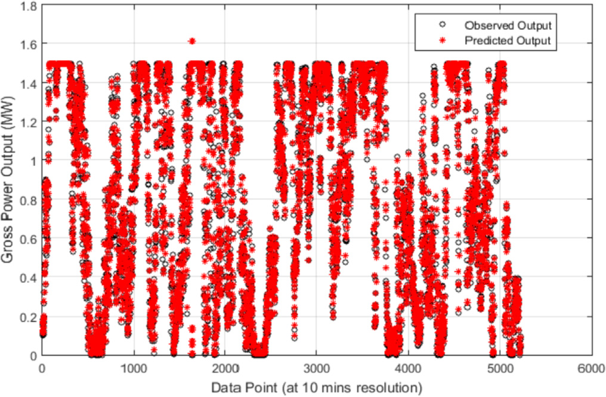

# Wind turbine power output very short-term forecast: A comparative study of data clustering techniques in a PSO-ANFIS model

===== PAGE 1 =====
Wind turbine power output very short-term forecast: A comparative
study of data clustering techniques in a PSO-ANFIS model
Paul A. Adedeji a, *, Stephen Akinlabi b, c, Nkosinathi Madushele a, Obafemi O. Olatunji a
a Department of Mechanical Engineering Science, University of Johannesburg, South Africa
b Department of Mechanical and Industrial Engineering, University of Johannesburg, South Africa
c Department of Mechanical Engineering, Covenant University, Ota, Nigeria
## Article Info
Article history:
Received 13 July 2019
Received in revised form
10 January 2020
Accepted 11 January 2020
Available online 13 January 2020
Handling editor: Bin Chen
Keywords:
ANFIS
Autoregressive model
Data clustering
Particle swarm optimization
Wind turbine
## Abstract
The emergence of new sites for wind energy exploration in South Africa requires an accurate prediction
of the potential power output of a typical utility-scale wind turbine in such areas. However, careful
selection of data clustering technique is very essential as it has a significant impact on the accuracy of the
prediction. Adaptive neurofuzzy inference system (ANFIS), both in its standalone and hybrid form has
been applied in offline and online forecast in wind energy studies, however, the effect of clustering
techniques has not been reported despite its significance. Therefore, this study investigates the effect of
the choice of clustering algorithm on the performance of a standalone ANFIS and ANFIS optimized with
particle swarm optimization (PSO) technique using a synthetic wind turbine power output data of a
potential site in the Eastern Cape, South Africa. In this study a wind resource map for the Eastern Cape
province was developed. Also, autoregressive ANFIS models and their hybrids with PSO were developed.
Each model was evaluated based on three clustering techniques (grid partitioning (GP), subtractive
clustering (SC), and fuzzy-c-means (FCM)). The gross wind power of the model wind turbine was esti-
mated from the wind speed data collected from the potential site at 10 min data resolution using
Windographer software. The standalone and hybrid models were trained and tested with 70% and 30% of
the dataset respectively. The performance of each clustering technique was compared for both stand-
alone and PSO-ANFIS models using known statistical metrics. From our findings, ANFIS standalone model
clustered with SC performed best among the standalone models with a root mean square error (RMSE) of
0.132, mean absolute percentage error (MAPE) of 30.94, a mean absolute deviation (MAD) of 0.077,
relative mean bias error (rMBE) of 0.190 and variance accounted for (VAF) of 94.307. Also, PSO-ANFIS
model clustered with SC technique performed the best among the three hybrid models with RMSE of
0.127, MAPE of 28.11, MAD of 0.078, rMBE of 0.190 and VAF of 94.311. The ANFIS-SC model recorded the
lowest computational time of 30.23secs among the standalone models. However, the PSO-ANFIS-SC
model recorded a computational time of 47.21secs. Based on our findings, a hybrid ANFIS model gives
better forecast accuracy compared to the standalone model, though with a trade-off in the computational
time. Since, the choice of clustering technique was observed to play a vital role in the forecast accuracy of
standalone and hybrid models, this study recommends SC technique for ANFIS modeling at both
standalone and hybrid models.
© 2020 Elsevier Ltd. All rights reserved.
## 1. Introduction
The need to diversify South Africa’s energy mix has necessitated
the development and deployment of renewable energy. Interest-
ingly, wind energy uptake has reasonably increased in the country,
thus making it one of the fastest growing renewable energy re-
sources. Studies have shown that the country has wind resource in
a harvestable amount sufficient for power generation in specific
areas (Ayodele and Ogunjuyigbe, 2016; Sørensen et al., 2018; Van
der Linde, 1996). However, South Africa is ranked the seventh
largest coal producer on the global scale (Dunmade et al., 2019) and
this has influenced her use of coal as primary source of fuel for
electricity generation, though this trend is changing since the
country has embraced the low-carbon economy mantra. The
* Corresponding author.
E-mail address: pauladedeji2k5@gmail.com (P.A. Adedeji).
Contents lists available at ScienceDirect
Journal of Cleaner Production
journal homepage: www.elsevier.com/locate/jclepro
https://doi.org/10.1016/j.jclepro.2020.120135
0959-6526/© 2020 Elsevier Ltd. All rights reserved.
Journal of Cleaner Production 254 (2020) 120135

===== PAGE 2 =====
decision to embrace low-carbon economy is an aftermath of the
Copenhagen climate change summit, where the president pledged
to reduce the country’s greenhouse gas emissions by 34% in 2020
and 44% by 2025 (Baker et al., 2014). This commitment was sup-
ported by the development of Renewable Energy Independent
Power Producer Procurement Programme (REI4P), a public-private
partnership programme, launched in 2011 (McEwan, 2017). Over 77
projects have been awarded to the private sector with a 20-year
power purchase agreement between Eskom, the country’s elec-
tricity management company, and the independent power pro-
ducers (IPPs) (McEwan, 2017). Five (5) rounds of the project have
been rolled out with the fifth round under development by de-
velopers. Each round consists of a nexus of renewable energy
sources (wind and solar resources) for power generation. Within
the past two decades, wind energy has been harnessed for power
generation at a micro-grid level by several investors and this has
consequentially increased with high uptake in the Northern,
Western, and Eastern Cape provinces. Based on the analysis carried
out by the South African National Energy Development Institute
(SANEDI) (Cape-ducluzeau and van der Westhuizen, 2015) to
identify renewable energy development zones (REDZs), the Eastern
Cape Province is one of the corridors identified with the abundance
of wind energy (SANEDI, 2016), though generally, harvestable wind
energy for power generation in South Africa is geospatially
dependent.
The age-long fossil fuels have directly and indirectly engendered
economic transformation, both at national and global levels. These
conventional sources of energy formed the basis of the first in-
dustrial revolution in the 1800’s (Nehrenheim, 2018). However,
these energy sources are fast being replaced with renewable energy
sources with the aim of reducing carbon emission and mitigating
global warming. Unfortunately, renewable energy sources are
notable for intermittency and variability, which consequentially
affect their reliability. However, despite these setbacks, solar and
wind energy have recorded significant successes at on-grid and off-
grid levels with renewed commitments to ensure optimality in the
system design and the selection of the system components (Khalili
et al., 2019). The off-grid systems, which comprise local loads with
distinct electrical boundaries, generation units and energy storage
system often rely on a nexus of renewable energy sources to
maximize energy availability (Erenoglu et al., 2019). In contrast, on-
grid systems consist of the interconnected power generation units,
the transformer and the substation through which they feed into to
the grid according to the specified grid code. The grid-connected
system leverages the aggregation of several power generation
units with the optimization of technological constraints and the
efficiency of generation. In term of pricing and availability, wind
energy is considered as highly naturally abundant, reasonably
priced, and evenly distributed. Wind energy has also been identi-
fied as the high spot of economical and efficient energy on earth,
with high potential for sustainability (Murthy and Rahi, 2017;
Shoaib et al., 2019). The wind energy is harvested using wind tur-
bine system (WTS) whose generation capacity varies depending on
the climatic condition of the location and the turbine power curve.
Thus, a WTS can be at its peak in an hour and generate its minimum
possible power at the following hour (Pelacchi and Poli, 2010). The
wind turbines are capable of generating electrical energy at opti-
mum wind conditions either during the day or at night as compared
to solar photovoltaic systems (Eminoglu and Turksoy, 2019; Keeley
and Ikeda, 2017). WTSs can be classified on the basis of the speed
and axis of rotation. Based on speed, the WTSs can be divided into
two: the constant speed and the variable speed wind turbines.
Power losses (in terms of aerodynamic, electrical and mechanical
losses) in these two types of WTS largely depend not only on the
wind speed but also on the size, structure and type of mechanical
and electrical system (Eminoglu and Turksoy, 2019). Based on axis
of rotation, the WTSs can be divided into the vertical and horizontal
axis wind turbines. The vertical axis wind turbines (VAWT) can
receive wind at any direction, thus eliminating the yawing mech-
anism as observed in the horizontal axis wind turbines (HAWT).
However, these types of turbines are not self-starting, which is
critical to the operation of the system and their overall efficiency is
lower than that of the HAWT (Mathew, 2006). The HAWTs on the
other hand have many drawbacks like sensitivity to wind direction,
low cut-in speed, design complexity and so on (Stathopoulos et al.,
2018). The integration of active energy generated from the WTSs
with the utility follows specific grid code within which these
generating units can be connected to the utility (Hagh and Khalili,
2019). The problem of spatiotemporal variability and intermit-
tency associated with renewable energy (Liu et al., 2019) have
necessitated
real-time
forecast
of
resource
availability
from
dependent variables. This helps in strategic and operational plan-
ning, in order to maximize energy availability.
Research in the field of forecasting has evolved from the use of
conventional linear models such as autoregressive integrated
moving average (ARIMA) to the intelligent non-linear forecasting
models like the artificial neural network (ANN), support vector
regression (SVR), ANFIS and so on (Adedeji et al., 2019a,b). Linear
models assume that data exhibits a linear relationship between
past data values and the errors (Box et al., 2013; de Oliveira and
Ludermir, 2016), however, real-world problems are non-linear.
Hence, the use of non-linear models for prediction is highly
essential in achieving robustness and model sensitivity to pertur-
bation. There are several standalone non-linear forecasting tech-
niques developed over the years, whose accuracy on new datasets
is highly reliable. Examples of these are the self-organizing ANN,
support vector machine (SVM), the k-nearest neighbour (k-NN),
ANFIS, probabilistic neural network (PNN), the random threshold
network (RTN) and so on. These techniques are not one-size-fits-
all; they possess peculiar characteristics, which makes them
applicable in each domain. Several non-linear forecasting models
have been employed in wind energy studies. For example, singular
spectrum analysis and ANFIS were used by Moreno and dos Santos
Coelho (2018) to forecast wind speed, thus decomposing the wind
Nomenclature
P
Wind turbine gross output power (MW)
t
Time
di
Delay (i ¼ 1; 2;…5)
n
Sample size
FðLÞyt
Lag polynomial
p
Polynomial order
f0
Mean constant
bfi
Coefficient of autoregressive equation
εt
Error term
yi
Mean gross power output at ith delay
k
ANFIS node
O1
k
Output of adaptive node k
mAi
Membership function of fuzzy set A
Vadj
Adjusted wind speed
vsite
Wind speed of the proposed site
yadj
Adjusted wind turbine output power
rsite
Air density at the proposed site (kg/m3)
ro
Nominal air density (kg/m3)
c
Number of clusters
Pr i
Potential of cluster i being a cluster centre
P.A. Adedeji et al. / Journal of Cleaner Production 254 (2020) 120135
2

===== PAGE 3 =====
speed into several additive components using singular spectrum
analysis and forecasting a step ahead using the ANFIS model. The
study evaluated the decomposed components to ensure that
influential elements from the decomposition are considered for the
next phase of the model. Also, Chang et al. (2017) investigated the
effectiveness of a radial basis function neural network improved
with an error feedback scheme in the short-term forecast of wind
speed and power of a typical wind farm near central Taiwan.
Another non-linear technique which has been used to forecast
wind power is the random forest technique (Lahouar and Hadj,
2017).
Soft computing techniques have helped in solving problems
related to model design complexity, accuracy, computational speed,
near abstraction of reality in intelligent prediction, modeling, and
the control of non-linear systems (Shihabudheen and Pillai, 2018),
though the efficiency and effectiveness of these techniques are
highly dependent on the optimal choice of parameters for the
model components (Adedeji et al., 2019a,b). ANFIS forms one of the
forecasting techniques in this domain, which have been explored
across several fields due to its non-linear input-output mapping
within a solution space such that local optimal value is avoided and
fuzzy variables are taken into consideration. ANFIS has been
applied in the fields like hydrological studies (Nourani and
Partoviyan, 2018; Pramanik and Panda, 2009), econometrics
(Najib et al., 2016), enterprise systems (Pan, 2009), molecular
studies (Barati-Harooni et al., 2016), energy systems (Adedeji et al.,
2018; Shabaan et al., 2018) and so on. The ANFIS technique, which
follows the Takagi-Sugeno fuzzy inference system, is a five-layered
network with two adaptive layers (the first and fourth layer) and
the others being fixed/nonadaptive layers. The output of the
adaptive layers is a function of node parameters which are modified
according to the learning rules in order to minimise the prescribed
error (Chahkoutahi and Khashei, 2017).
The relevance of ANFIS model, either as standalone or tuned
with other algorithms, in renewable energy space has been re-
ported in recent studies. As a standalone model, Stefanakos (2016)
used the fuzzy logic and ANFIS techniques in a point-wise and field-
wise forecasting of wind and wave parameters. Data of a decade
long at 3-h time interval with significant wave height, wind speed,
and peak wave period was used in the study. The study established
that the hybrid model outperforms the standalone models of FIS
and ANFIS. Similarly, Kassa et al. (2017) explored the use of
standalone ANFIS on short-term prediction of wind power of an
installed wind turbine in Beijing. The study compared the perfor-
mance of ANFIS with backpropagation neural network (BP-NN) and
its hybrid with genetic algorithm (BP-NN-GA). From their findings,
ANFIS model outperformed BP-NN and BP-NN-GA with a mean
absolute error of 28.39, a root mean square error (RMSE) value of
46.06 and a mean absolute percentage error (MAPE) of 4.45, thus
emphasising the reliability and accuracy of ANFIS model. Dong and
Shi (2019) also investigated the use of ANFIS for wind power
forecast in selected regions in China. The model takes as inputs the
outputs from an efficiency measuring technique (data envelopment
analysis-DEA) and a multi-criteria optimization technique (tech-
nique for order preference by similarity to an ideal solution- TOP-
SIS). An absolute error less than 1 and an RMSE of 2.7527 were
obtained from the test samples. The study further established key
factors affecting China’s exploration of wind energy, using a
regression model. Also, ANFIS optimized with other algorithms has
been investigated in the literature. Pousinho et al. (2011) optimized
ANFIS with particle swarm optimization (PSO) to predict wind
power. In the study, wind resource was divided based on the four
seasons experienced in Portugal and the accuracy of the model for
the four seasons were commendable. Asides in wind resource
forecast, the hybrid ANFIS models have also been explored in
predicting
other
renewable
energy
resources.
For
example,
Khosravi et al. (2018) investigated the performance of several
artificial intelligence techniques in estimating daily global solar
radiation. The study compared intelligent forecasting techniques
and the conventional methods. In the study, group method of data
handling (GMDH) neural network, multilayer feedforward neural
network (MLFFNN), ANN and ANFIS hybrids with PSO, genetic al-
gorithm (GA), and ant colony optimization (ACO) were investigated.
Of all the models in the study, the GMDH neural network out-
performed the other models with a RMSE of 0.2466 kWh/m2.
However, among the hybrid ANFIS models used, the ANFIS hybrid
with PSO recorded the least RMSE of 0.4412 kWh/m2. In all these
studies, despite the significant effectiveness demonstrated by PSO-
ANFIS
model,
the
effect
of
clustering
technique
was
not
investigated.
In recent times, the significant technological developments in
renewable energy harvesting technologies is now concomitant
with an avalanche of data generated from sensor technologies of
these systems towards improved system efficiency, thus making
data clustering to be of high importance. Most real-time systems
are built with data logging capabilities with a three-dimensional
data definition: the data velocity, complexity, and size (Tang and
Fong, 2018; Torrecilla and Romo, 2018). This tripartite nature of
the data has therefore made its analysis, retrieval, and processing
both challenging and time-consuming (Sassi Hidri et al., 2018). Data
clustering has recently been used in the data analysis problem
wherein the clustering process compacts the data while retaining
the data information. Clustering is an essential process in ANFIS
modeling. Clustering techniques are used to identify the group
where an observation belongs with a balance between homoge-
neity within the clusters and heterogeneity between the clusters
(Shamshirband et al., 2016; Sheikh et al., 2008). In reference to
South Africa, the development of allocated wind sites for the round
five is ongoing in Eastern Cape Province. The next bidding window
is on its way and more wind farms will be sited in the area, thus an
effective intelligent model, which effectively forecasts the expected
gross output power and better clusters the data is vital to optimal
plant operation and strategic decision-making.
Against this background, the motivation of this study is to bridge
the knowledge gap by investigating the significance of the clus-
tering technique in both standalone ANFIS and optimized ANFIS
models on a wind turbine output data of a potential site prior to the
wind turbine installation. The gross and not the net power output
of the proposed wind turbine is of interest in this study due to
variability in losses. Most feasibility studies often assume a loss
factor to calculate the net power output of the turbine. However, in
the reality, the loss factor is a geospatial variant. The selection of the
PSO-ANFIS hybrid model was due to its efficiency and robustness in
previous studies in forecasting. The use of PSO in ANFIS model
resolves one of the major problems called parameter tuning, which
is often associated with black box models. Asides optimality in the
model parameters, the type of clustering technique in the hybrid
model is hypothesized to plays an important role in ensuring model
effectiveness and efficiency. This study therefore (i) develops a
resource map for Eastern Cape Province and identified an area rich
in wind energy, (ii) develops three autoregressive standalone ANFIS
models (ANFIS-GP, ANFIS-SC, and ANFIS-FCM) using three different
clustering techniques: the grid partitioning (GP), the subtractive
clustering(SC), and the fuzzy c-means clustering(FCM), (iii) de-
velops PSO-ANFIS models with three clustering techniques (PSO-
ANFIS-GP, PSO-ANFIS-SC, and PSO-ANFIS-FCM) to forecast gross
power output of a wind turbine (iv) evaluates the relative perfor-
mance of the standalone and hybrid ANFIS models using relevant
statistical metrics and also tests the hypothesis that the choice of
clustering technique significantly affects the model effectiveness
P.A. Adedeji et al. / Journal of Cleaner Production 254 (2020) 120135
3

===== PAGE 4 =====
and efficiency. Based on the standalone and hybrid models, this
study therefore recommends the best clustering technique in ANFIS
modeling among the three clustering techniques considered.
The rest of the study is structured as follows: section 2 discusses
the mathematical tools used in this study, thus giving a background
knowledge of the concepts used in this study, ranging from data
clustering techniques, autoregressive and ANFIS models. The
method of data collection and the wind resource mapping of the
study area was also discussed. Section 3 presents the results of the
standalone and hybrid models on the case study, while section 4
concludes the study.
## 2. Mathematical tools
### 2.1. Data clustering
The advent of internet of things (IoT) have revolutionized the
data space with an increasing competition in both manufacturing
and service industries. Big data has helped to unravel the cause
behind events explained with traditional analytic techniques for
improved decision making both at strategic and operational level
(Ghasemaghaei et al., 2018; Ghasemaghaei and Calic, 2019; Horita
et al., 2017). Clustering techniques have formed significant part in
data mining algorithms. Clustering unveils the intrinsic relation-
ships that exist between a set of unlabelled data, thus ensuring a
high inter-similarity within same cluster and inter-similarity across
clusters (Tang and Fong, 2018). In clustering techniques, a dataset Y
is partitioned into a set of Ci clusters ð4i ¼ 1; 2; …cÞ often per-
formed in an unsupervised manner (Hernandez et al., 2012).
Clustering techniques used in data mining algorithms can be
categorized into four as shown in Fig. 1 and discussed briefly
follows:
a. The hierarchical techniques: the operation of these techniques
is based on a measure of distance between objects or features with
the premise that features are more related to the near features than
the far ones. Hierarchical techniques decompose a dataset Y, rep-
resenting it using a dendogram, a tree that iteratively divides the
dataset into smaller subsets till each subset contains only one
observation. A bottom-up approach (agglomerative approach),
merging the clusters at each step or a top-down approach (divisive
approach), diving the clusters at each step relative to the leaf
orientation can be used (Ester et al., 1996; Grün, 2016). In hierar-
chical clustering, the number of clusters are not determined in
advance, thus eliminating the challenges of local minima and
initialization (Kuwil et al., 2014).
b. The partitioning techniques: This technique partitions the
dataset Y consisting of n observations into c clusters proceeding
basically in a two-step manner. First, a k representative which
minimizes an objective function is determined and second, each
observation is assigned to a cluster with its representative with the
highest proximity to the observation in question. The partition is
synonymous to a Voronoi diagram where each Voronoi cell
contains each cluster thereby forming a convex shape, which is
highly restrictive (Awan and Bae, 2014; Ester et al., 1996; Nayak
et al., 2013). Basically, partition clustering techniques are catego-
rized into two: hard (crisp) and the soft (fuzzy) clustering. While an
observation can belong to one and only one cluster in hard clus-
tering, the observation can belong to more than one cluster to a
certain degree in soft clustering. Partitioning clustering techniques
are considered as dynamic with mobility of observations from one
cluster to another (Kuwil et al., 2014). One of the most common
algorithms in this space is the k-means algorithm. A modified form
of this algorithm is the fuzzy c-means clustering, which is an
improvement on the k-means technique.
c. The density-based techniques: The density-based clustering
technique was introduced with the Density-Based Spatial Clus-
tering of Applications with Noise (DBSCAN) by Martin et al. (Ester
et al., 1996). In this technique, each cluster point in its neighbour-
hood according to a given radius contains several points or obser-
vations
whose
density exceeds
a
threshold
either
in
a
2-
dimensional or 3-dimensional space. A multi-resolution grid is
used as a data structure to establish clusters. One of the advantages
of density-based clustering techniques is that it does not require
pre-specifications (Kuwil et al., 2014). It also performs well even
when the data is highly noisy. However, its efficiency is reduced in
data with high dimensionality. This technique is notable for speed
and the speed is not a function of the number of observations in the
dataset, though this is a function of the amount of cells in the so-
lution space (Kuwil et al., 2014; Verma et al., 2012).
d. Model-based techniques: these category of clustering tech-
nique is also an unsupervised learning model whose foundation is
in the probability theory (Csereklyei et al., 2017). Model-based
clustering techniques aim at optimizing the fit between a dataset
and specific mathematical models with an assumption that the
data originates from a mix of different probability distributions
(Tang and Fong, 2018). Model-based techniques can estimate the
number of classes present in a dataset as well as their parameters
(Melnykov and Zhu, 2018). Also, its mode of operation is fuzzy and
not crispy, hence a form of soft clustering technique. However,
model-based techniques accrue a high computational time espe-
cially when a large dataset is involved. Also, the fundamental
models on which the new model is built must be specified. A
common example of this technique is the Expectation Maximiza-
tion (EM) technique, often used in estimating maximum likelihood
of parameters and ensuring the convergence of the likelihood
function (Andrews and McNicholas, 2013; Sammaknejad et al.,
2019).
### 2.2. Autoregressive model
The conventional ANFIS model follows an input-output para-
digm. However, a univariate time series data of the gross power
output was used in this study. The autoregressive (AR) model was
selected in this study due to its simplicity parameter estimation
Data Clustering Techniques
Hierarchical
techniques
Partitioning
techniques
Density-based
techniques
Model-based
techniques
Fig. 1. Categories of data clustering techniques.

Original caption: Fig. 1. Categories of data clustering techniques. [[vj16|Source]]
P.A. Adedeji et al. / Journal of Cleaner Production 254 (2020) 120135
4

===== PAGE 5 =====
and explaining the current value of a series by a linear combination
of the past values with a random error in the series. Unlike the
moving average (MA) technique whose parameter estimation is not
simple and the autoregressive moving average (ARMA) model
associated with parameter redundancy and stationarity problems,
the AR model suffers less from these (Dinda and O’Hallaron., 2000;
Endo and Randall, 2007). To predict the gross energy output of the
selected wind turbine, the model was structured such that the next
gross power output Pðt þ1Þ minute along the trend can be pre-
dicted using lagged time vectors with a delay diði ¼ 1;…5Þ. Model
inputs were the time series data with the delays, while the output
forms the actual gross power output from the wind turbine. Given a
time series P1; P2; …Pn of a sample size n, the future values of the
series are predicted from the past values within the series ac-
cording to:
FðLÞPt ¼ 40 þ εt
εt  NID
h
0; s2
ε
i
(1)
where FðLÞPt ¼ 1  41L  … 4p Lp gives that the lag-polynomial
with model order p and 40 is a series mean constant. In autore-
gressive models, the stationarity condition must be satisfied rela-
tive to the restriction that εt is independent of Pt1; Pt2 ; … and
that s2
ε > 0 (Hillier, 2001; Wang et al., 2014). In that case, a sta-
tionary solution exists if and only if the autoregressive character-
istic equation has the absolute value of its root exceeding unity.
PðtÞ ¼ f ðPðt  1Þ; …Pðt  dÞÞ
(2)
From the least square method, the autoregressive model pa-
rameters were calculated using:
40 ¼ y0 
X
p
i¼1
4i Pi;
(3)
41 ; 42 ; …: ; 4p
T ¼ ðLhhÞ1
pp ðLhÞp1
(4)
where the observation mean, Pi;
i ¼ 0; 1; …; n can be calculated
using:
Pi ¼
1
n  p
X
n
t¼1þp
Ptp
i ¼ 0; 1; …p
(5)
and the Lhh ¼ ðSijÞpp is a matrix in the pth order, however,
Lh ¼ ðS1; S2 ; …; Sp ÞT is a column vector in the pth order, whose
constituting elements can be determined using:
Sij ¼
X
n
t¼pþ1
ðPti  PiÞ Ptj  Pj

i; j ¼ 1; 2; …; p
(6)
Si ¼
X
n
t¼pþ1
ðPt  P0Þ ðPti  PiÞ
i ¼ 1; 2; …; p
(7)
Estimating the coefficient of the autoregressive characteristic
equation (1), b40; b41; b42 ; …; b4p , the autoregressive prediction
model equation then becomes:
bynþljn ¼ b40 þ
X
p
i¼1
b4i ynþlijn
(8)
such that bynþljn is the l step-ahead prediction at a time n þ l.
### 2.3. Adaptive neuro-fuzzy inference system (ANFIS) model
ANFIS is a multi-layer feedforward network, which combines
the neural network and fuzzy logic modeling capabilities in an
adaptive manner to imitate an expert decision-making process
(Fattahi, 2016). The architectural framework of ANFIS consists of
five layers vis-a-vis the fuzzy, product, normalization, defuzzifica-
tion, and the summation layer in the order of layers from 1 to 5 as
shown in Fig. 2 (Adedeji et al., 2018; Jang,1993; Karaboga and Kaya,
2018). The ANFIS modeling technique is a variant of the Takagi-
Sugeno fuzzy system, which has two components: the antecedent
and the consequence.
This technique uses hybrid learning rule comprising of back-
propagation gradient descent and least square methods for model
premise and consequent parameter optimization. Shown in Fig. 2 is
the conventional model architecture of an ANFIS network while
Fig. 3 shows the integrated framework of the model with three
clustering techniques.
In Fig. 1, layer 1 consists of fuzzy membership functions with
output functions for each node represented as:
O1
k ¼ mAkðxÞ ; k ¼ 1; 2
(9)
O1
k ¼ mBkðyÞ ; k ¼ 1; 2
(10)
Layer 2 computes the firing strength of a rule using multipli-
cative operator as:
O2
k ¼ wk ¼ mAkðxÞ : mBkðyÞ
; k ¼ 1; 2
(11)
Layer 3 normalizes the firing strength at the kth node of the
structure using the ratio between the firing strength in the kth
node and the sum of all firing strengths from all the rules (Eqn.
(12)). Nodes in this layer are non-adaptive.
O3
k ¼ wi ¼
wk
w1 þ w2
k ¼ 1; 2
(12)
Layer 4 uses a nodal function to calculate the effect of kth rule
towards the output of the model using:
O4
k ¼ wið pkx þ qky þ rkÞ ¼ wizk
(13)
where pk; qk; and rk are parameter sets of the node and wi is the
normalized firing strength of the third (3) layer.
Layer 5 has a single non-adaptive node, which calculates the
overall output of the ANFIS model using a summation operation
(Suparta and Alhasa, 2016):
O5
k ¼
X
k
wizk ¼
P
kwkzk
P
kwk
(14)
### 2.4. Data collection
The wind speed data used in this study is the Wind Atlas of
South Africa (WASA 2) dataset collected with cup anemometers
mounted at 60 m over a period of 6months. The geographical
location of mounting is the Rhodes located in Eastern Cape, South
Africa. The meteorological mast from where the data was collected
is located at 28.07351oE, 30.81436oS as shown with a placemark in
Fig. 4. The location offers a high potential for wind energy gener-
ation owing to its associated high wind speed. The measuring in-
strument logs climatological data at a data resolution of 10 min,
which can be used for further analysis. The wind resource map of
P.A. Adedeji et al. / Journal of Cleaner Production 254 (2020) 120135
5

===== PAGE 6 =====
the proposed site was developed using ArcGIS 10.4 with a resolu-
tion of 30  30 m. Fig. 4 shows areas in the Eastern Cape province
with a wind speed of 5 m/s and above. The area is highly viable for
wind energy generation with prospect of wind speed up to 19 m/s.
Very short-term forecast in a time step of 10 min was performed
on the gross power output of a typical wind turbine. There are
several wind turbine manufacturers with each product different in
effectiveness, efficiency, and application. For this study, a utility
scale wind turbine was chosen without preferences or skewness to
manufacturer. The characteristics of the turbine are as presented in
Table 1.
### 2.5. Gross mean power output
Wind energy is harvested by converting the kinetic energy in a
wind stream to mechanical energy and then to electrical energy.
The gross mean power output of the turbine presents the total
power expected from the turbine. This depends basically on four
factors: the power curve of the wind turbine, the air density, the
wind speed at the hub height, and the blade swept area
(Hernandez-Escobedo et al., 2014; Lee et al., 2012). The net power
output can be estimated from the gross power output using the loss
factor. The power curve of the turbine model considered in this
study is shown in Fig. 4. Neglecting losses such as wakes, turbine
downtime, electrical losses and so on, the gross mean power output
can be determined using the time series datasets of wind speed and
air density collected at specific hub height. The power output was
calculated at the adjusted wind speed (Hernandez-Escobedo et al.,
2014). However, the adjusted wind speed was obtained using:
Vadj ¼ vsite
rsite
ro
1
3
(15)
where rsite represents the air density of the proposed site (in kg/m3)
and ro is the nominal air density (in kg/m3) for which the power
curve is described. For the utility scale wind turbine, the adjusted
power output of the wind turbine is estimated using:
Padj ¼ P
rsite
ro

(16)
where P is the turbine output power (in MW) for a specified speed
at nominal air density. The wind speed varies at different time in-
tervals across the period of measurement. This apparently makes
the gross power output of the turbine to vary periodically.
Shown in Fig. 5 is the power curve of the selected wind turbine.
.
N
N
Inputs
Layer 1
Layer 2
Layer 3
Layer 4
Layer 5
Output
w1
w2
z
x
y
x
y
Fig. 2. ANFIS model architecture showing the five layers.

Original caption: Fig. 2. ANFIS model architecture showing the five layers. [[vj16|Source]]
Gross Power Output
(Pd)
d=1
.
.
d=5
Gross Power Output
(P)
Subtractive
Clustering
Fuzzy C-Means
Clustering
Grid Partitioning
Adaptive Neuro-fuzzy
Inference System (ANFIS)
Particle Swarm Optimization
(PSO)
Fig. 3. Standalone and hybrid ANFIS model framework with the three clustering techniques. Each clustering technique was considered independently, resulting in six models in all.

Original caption: Fig. 3. Standalone and hybrid ANFIS model framework with the three clustering techniques. Each clustering technique was considered independently, resulting in six models in all. [[vj16|Source]]
P.A. Adedeji et al. / Journal of Cleaner Production 254 (2020) 120135
6

===== PAGE 7 =====
This illustrates the cut-in speed, the cut-out speed, the rated output
speed, and the rated output power as presented in Table 1. The
gross wind power for the selected turbine was estimated using the
professional edition of Windographer 4.1.14 software.
The six-month dataset was divided into training and testing
data in the ratio of 70% and 30% respectively. Three clustering
techniques were investigated on the data and their results
compared. These are grid partitioning (GP), subtractive clustering
(SC), and fuzzy c-means clustering (FCM) which are further dis-
cussed in subsection 2.6.
### 2.6. Clustering techniques
Determining membership function for each input is essential in
fuzzy processes. Data clustering is one of the essential processes of
the ANFIS modeling as it groups observed data into similar fuzzy
clusters for the purpose of assigning a fuzzy membership function.
It is used to establish representative behaviour of a multi-
dimensional non-linear system comprising a large time series
dataset (Çakit and Karwowski, 2015; Zare and Koch, 2018). Data
clustering is employed in image segmentation (Dhanachandra
et al., 2015; Gogoi and Sarma, 2012), pattern recognition (Rezaei
and Zarandi, 2011), fault diagnosis (Zuo et al., 2010), and so on.
Details of these clustering techniques are discussed as follow;
#### 2.6.1. Grid partitioning
Fuzzy partitioning techniques are useful in obtaining fuzzy
members from a dataset. There are three common fuzzy parti-
tioning techniques used in fuzzy modeling. These include grid, tree,
and scatter partitioning. Unlike the other two types, the GP tech-
nique uses similar membership functions on the input space to
generate equal partitions within the symmetric membership
function (Galindo, 2008). It divides the input space into different
fuzzy slices with each associated with a membership function.
Fuzzy rules can be generated from the input-output dataset used
for model training. The model performance is highly dependent on
the grid definition as better performance is obtained from a finer
grid. In the process, the antecedent parameters are optimized as the
grid is created (Ramon and Dopico, 2011). One associated drawback
of this technique is an exponential explosion of the number of
membership functions as the input variables increase. This setback
is called curse of dimensionality (Vasileva-Stojanovska et al., 2015).
In this study, the Gaussian membership function is selected and its
parameters were calculated as follows (Narayanan et al., 2015) and
the GP model parameters are as presented in Table 2.
Fig. 4. Wind speed distribution of Eastern Cape Province, South Africa. The location with a placemark is where the data was collected.

Original caption: Fig. 4. Wind speed distribution of Eastern Cape Province, South Africa. The location with a placemark is where the data was collected. [[vj16|Source]]
Table 1
Characteristics of the selected turbine.
Features
AW 70/1500
Rated Power (MW)
1.5
Cut-in wind speed (ms1)
4.0
Rated wind speed (ms1)
11.6
Cut-out wind speed (ms1)
25.0
Rotor Diameter (m)
70.0
Swept Area (m2)
3,848
Power density (W/m2)
389.8
Hub Height (m)
60/80
Onshore
Yes
P.A. Adedeji et al. / Journal of Cleaner Production 254 (2020) 120135
7

===== PAGE 8 =====
Data Matrix:
Number of clusters: c
Membership function type: Gaussian
Model input:
Model Output:
 for the Gaussian membership function (mf)
start
for each gross power output in
mf_n(j) = initialise the number of mfs for j
range(j,1) =
range(j,2) =
sigma=
S= sigma
end
end
#### 2.6.2. Subtractive clustering technique
The subtractive clustering technique identifies a data point with
the highest potential as a cluster centre. This is based on the dis-
tance function. The technique estimates the prospect of a data point
being a cluster centre using:
Pr i ¼
X
n
j¼
eaPiPj2
(17)
where a ¼
g
r2
a , Pr i represents the potential of the ith data point
being a cluster centre, n is total the number of data points, Pi and Pj
are data vectors within the observations including inputs and
output, g is a positive constant, ra is a positive constant which
defines radius of the hypercluster in the observation space. The
emergence of a new centre cluster attracts a penalty for clusters
within the neighbourhood of the new cluster. The potential for new
clusters is calculated by subtraction using:
Pr i ¼ Pr i  P*
r k z
(18)
where z ¼ ebPick2
; b ¼ 4
r2
b ; rb ¼ h*ra
Pr k
* represents the potential of kth cluster centre, xi is data
point subtracted, ck is the kth cluster centre, h is the squash factor
(>1). It is ensured that the constant rb > ra to prevent closely
spaced cluster centres. There are basically four parameters, which
influence the number of rules and error performance measures in
subtractive clustering technique. These are the accept ratio, the
reject ratio, the cluster radius, and the squash factor. One of the
main advantages of this technique is its ability to process many
input observations (Tien Bui et al., 2012), which is the case in this
study. More details on the technique can be obtained from (Demirli
et al., 2003). In this study, the following values were chosen for
these parameters as presented in Table 3.
#### 2.6.3. Fuzzy c-means clustering
The FCM clustering method is a fuzzified version of the k-means
algorithm. The technique originates from conventional Euclidean
distance
function
that
includes
hyper
spherical
clusters
(Küçükdeniz et al., 2012). The algorithm starts with an initial guess
of a cluster centre. This technique gives membership degree to each
data and guides the data centres through by continuously updating
the centres and the membership of each data point unlike the hard
clustering techniques where an observation can only belong to one
and only one cluster (Barak and Sadegh, 2016; Rezakazemi et al.,
2017; Ross, 2004; Shamshirband et al., 2016). In FCM, a goal
Fig. 5. The power curve of the model turbine.

Original caption: Fig. 5. The power curve of the model turbine. [[vj16|Source]]
Table 2
ANFIS parameters for ANFIS-GP model.
ANFIS Parameter
Value
Number of nodes
92
Number of nonlinear parameters
192
Total number of parameters
212
Training data pairs
12,197
Testing data pairs
5,227
Clustering Parameters
Input membership function
Gaussian
Output membership function
Linear
P.A. Adedeji et al. / Journal of Cleaner Production 254 (2020) 120135
8

===== PAGE 9 =====
function, which is the distance of each data point to the data centre
weighted by the degree of membership of the data point is mini-
mized using:
JmðU; vÞ ¼
X
N
i¼1
X
c
j¼1
Um
ij Pi  v2
jA;
1  m  ∞
where vj ¼ the centre of cluster j
c ¼ number of clusters | 2  c < n
Pi ¼ vector data of observations of power output
m ¼ weighting exponent
A ¼ positive definite ðn nÞ weight matrix
kk ¼ n  dimensional Euclidean space wherein sample data
belong.
The FCM technique was computed as follows:
a. Initialize randomly a mo membership matrix.
b. Calculate the prototype vectors ; vi such that
vi ¼
Pn
j¼1mm
ij yj
Pn
j¼1mm
ij
; 1  i  c
c. Evaluate the membership values of observations using:
mij ¼
1
Pc
k¼1

dij
dkj
!
2
m1
(20)
such that 1  i  c
; 1  j  n
d. Compare mðtþ1Þ with mðtÞ; where t ¼ number of iterations.
e. If mðtþ1Þ  mðtÞ < ε stop, else, return to step 2,
where ε is the convergence value.
The model parameters used in this study is as presented in
Table 4.
### 2.7. PSO-ANFIS hybrid multi-cluster model
The PSO algorithm is hails from its strong relationship with
artificial life but more closely related to the swarm methodology. In
its mode of operation, the PSO is similar to the genetic algorithm
(GA). However, it does not suffer the many difficulties as associated
with GA where a perturbation in genetic population results into a
destruction of the previous knowledge of the problem except in the
case of elitism. In contrast to this, PSO retains the knowledge of
good solutions within the particles (Eberhart and Kennedy, 2002).
The algorithm is based on five principles of swarm intelligence as
specified by Millonas (1994). They are the proximity, quality,
diverse response, stability, and adaptability principles, which
enhance its performance compared to GA.
In this study, PSO optimization model tunes the parameters of
the adaptive layers (first and fourth layers) of the three standalone
ANFIS models (ANFIS-GP, ANFIS-SC, and ANFIS-FCM) thus avoiding
local minima. A vector comprising the antecedent and consequent
parameters of the ANFIS model are optimized by the PSO algorithm.
Initialization into random values of the variables of all particles in
the swarm in performed with the error criterion as the fitness
function. Upon initialization, the PSO algorithm updates all particle
positions and velocities accordingly to set rules over stipulated
number of generations until convergence is achieved. In each
iteration, the values of the antecedent and the consequence pa-
rameters of the ANFIS model are considered such that a conse-
quential update of the personal and global best experiences is
performed. When the cost function of any particle is lower than the
Pbest obtained since the inception of the iteration, the present cost
function is set as the new Pbest. Similarly, the cost function of the
best particle is compared with the previously achieved costs. If the
cost function at the present iteration is better, the present cost is
made the new Gbest . The iterative process is repeated until spec-
ified convergence criterion is satisfied. The results of the PSO are
optimized values for the antecedent and the consequent of the
ANFIS model, which are assigned accordingly. The procedure for
the hybrid model is described as follows:
Step 1: Create a time series data of the model input
Step 2: Generate initial FIS structure using the three different
clustering techniques in the ANFIS standalone (GP, SC, and FCM)
Step 3: Generate initial swarm as follows:
(i) Generate random population size (Particles), P of length
Var Size each and positions pk;l 2ðPmin; PmaxÞ such that k ¼
1; 2; 3; …; PopSize; l ¼ 1; 2; 3;…;Var Size
(ii) Initialize the velocity of each particle ðInital Vel ¼ 0Þ.
(iii) Initialize the best cost at Gbest ðInital BestCost ¼ ∞Þ.
Step 4: Create next generation of particle with updated position,
velocity,
and
inertia
weight
according
to
the
equations
(21)e(23) respectively (Semero et al., 2018).
xiðtÞ ¼ xiðt  1Þ þ viðtÞ
(21)
Table 3
Model parameters for ANFIS-SC model.
ANFIS Parameter
Value
Number of nodes
44
Number of linear parameters
18
Number of nonlinear parameters
30
Total number of parameters
48
Training data pairs
12, 197
Test data pairs
5,227
Clustering Parameters
Computing radius
0.55
Epochs
100
Initial step size
0.01
Step size decrease rate
0.90
Step size increase rate
1.10
Table 4
Model parameters for ANFIS-FCM model.
ANFIS Parameter
Value
Number of nodes
44
Number of linear parameters
18
Number of nonlinear parameters
30
Total number of parameters
48
Training data pairs
12,197
Test data pairs
5,227
Clustering Parameters
Number of clusters
10
Partitioning matrix exponent
2
Maximum number of iterations
100
Minimum Improvement
1e-5
P.A. Adedeji et al. / Journal of Cleaner Production 254 (2020) 120135
9

===== PAGE 10 =====
ViðtÞ ¼ uviðt  1Þ þ r1ðPbest  xiðt  1Þ þ r2ðGbest  xiðt  1Þ
(22)
u ¼ udamp  u
(23)
such that the random variables r1 ¼ C1r1 and r2 ¼ C2r2 ; r1; r2 
Uð0; 1Þ;
C1 and C2 are positive cognitive and social acceleration
coefficients respectively of which stability of the algorithm is
ensured when C1 þ C2  4
(Kennedy, 1998), u is the weight
inertia, and udamp is the inertia weight damping ratio.
Step 5: Assign optimized particle parameters to the ANFIS
structure.
Step 6: Evaluate the cost of each particle using a conditional
statement, updating the Pbest and Gbest values, such that:
 If
 |
<

 |
=

 |
=

If
<

=

=

Step 7: Check if stopping criterion of maximum iteration is
satisfied. If not satisfied, the algorithm returns to step 4, else
proceed to step 8.
Step 8: Perform a very short-term forecast of the gross power
output of the wind turbine.
Step 9: Perform statistical performance evaluation on the
forecast.
Step 10: Plot a comparison between actual turbine output and
PSO-ANFIS forecast.
Step 11: Terminate the program.
The PSO optimization control parameters used for the three
PSO-ANFIS models are presented in Table 5. These parameters were
chosen based on literature (Engelbrecht et al., 2019). This procedure
was repeated for PSO-ANFIS-GP, PSO-ANFIS-SC, and PSO-ANFIS-
FCM models. A flow diagram of the model is as shown in Fig. 6.
## 3. Results and discussions
The ANFIS program was computed with MATLAB (R2015a)
installed on a desktop computer workstation with configuration 64
bits, 32 GB RAM Intel (R) Core (TM) i7 5960X. This was to ensure
lesser computational time because some clustering techniques like
grid partitioning can be computationally intensive. As previously
stated, 70% of the data was used for training while 30% of the data
was used at the model testing phase for both standalone and hybrid
models.
### 3.1. ANFIS standalone
Figs. 7e9 show comparison plots between the observed power
output of the utility scale wind turbine and the forecast produced
by standalone ANFIS models clustered with GP, SC and FCM
respectively. It is observed that a strong agreement exists between
the observed and the predicted power output for the three models.
Each plot demonstrates variability associated with the wind
resource which the predicted values closely approximates. Over-
predictions and under-predictions occurred more with the GP-
clustered model as shown in Fig. 7 compared to the SC and FCM-
clustered models as there are more over-predicted data points.
Similarly, the FCM-clustered model also exhibits overprediction
which is significant compared to the SC-based model. These over-
predictions and underpredictions are due to underestimation or
overestimation of the ANFIS model control parameters (Olatunji
et al., 2019b).
Among the three standalone models, the SC-clustered model
provides the most satisfactory agreement between the observed
and the predicted power output with the least number of miss-
predictions.
### 3.2. Hybrid ANFIS result
ANFIS hybridized with PSO for each of the three clustering
techniques was experimented. The forecast using 30% of the
observed data was used for the PSO-ANFIS-GP, PSO-ANFIS-SC, and
PSO-ANFIS-FCM. To ensure a basis for comparison with the ANFIS
standalone models, the same testing data was used for the hybrid
ANFIS model. Shown in Fig. 10 is the plot of the observed and the
predicted gross energy output for GP-clustered model with data
resolution being 10 min. The GP clustering technique performed
poorly on the data in the hybrid ANFIS compared with the stand-
alone ANFIS model. Many datapoints were underpredicted, thus
affecting the model accuracy. Several runs were performed with
different parameters, however, same trend of prediction existed,
thus, emphasising the preference of standalone GP-clustered model
over its hybrid. The GP clustering technique is often associated with
a large rule-base when used on a high-dimensional problem like
this study. This increases the model complexity and could lead to
curse of dimensionality. This performance shows that the optimi-
zation technique was not able to achieve global optimal values for
the model parameters to achieve a finer grid structure on which the
Table 5
Model parameters for the PSO algorithm.
Model Parameter
Value
Initial swarm size
20
Maximum iteration
600
Social acceleration coefficient (C2)
2
Cognitive acceleration coefficient (C1)
2
Inertia weight, u
0.5
Inertia weight damping ratio, udamp
0.8
P.A. Adedeji et al. / Journal of Cleaner Production 254 (2020) 120135
10

===== PAGE 11 =====
model performance largely depends.
Shown in Figs. 11e12 is the plot of the hybrid SC and FCM-
clustered ANFIS model respectively. A strong agreement between
the observed and the predicted power output is observed with less
underpredictions and over predictions. The SC clustering technique
(Fig. 11), however, performs better than the FCM and GP in the
hybrid ANFIS model with less variation between the observed and
the predicted values. Similar agreement between the observed and
predicted power output is observed in the FCM-clustered model as
shown in Fig. 12 except for its more mis-predictions. Asides visual
observation of the predicted against the actual gross power, a sta-
tistical measure of accuracy of the model was performed and pre-
sented in Table 6.
### 3.3. Model evaluation
The model was tested for reliability and capability by perform-
ing error analysis on the hold-out data set (30% of the observation
data) used for new prediction. Common statistical metrics for
model reliability measures were performed on the test data. These
include the root mean square error (RMSE), mean absolute devia-
tion (MAD), mean absolute percentage error (MAPE) and the rela-
tive mean bias error (rMBE) were used as performance metrics. As a
measure of capability of the models, the relative mean bias error
(rMBE) was introduced. This performance metric evaluates the
reliability of the model. The closer its value is to zero, the more
reliable the model is (Eminoglu and Turksoy, 2019) and a negative
value signifies model capability to underestimate (Kwon et al.,
Start
Generate
Autoregressive Model
of wind data
Initialize
PSO Parameters
Generate first
swarm
Compute fitness of
all particles
Record local optimal
fitness of all particles
Use global optimal value
for ANFIS-SC, ANFIS-GP
and ANFIS-FCM
parameters
End
Update positions
of allparticles
Update Velocity
of allparticles
Is
any stopping
criterion met?
Yes
No
Load Training Data
* Set initial input parameters and membership
function
* Choose FIS model optimization method
Select Clustering method (SC,
GP or FCM) and their
parameters
Train the ANFIS model
Testmodel with hold-out data
Compare predicted result with
observed.
Is
any stopping
criterion met?
PSO-ANFIS
ANFIS Standalone
Yes
No
Fig. 6. The flowchart of the standalone and hybrid ANFIS model.
P.A. Adedeji et al. / Journal of Cleaner Production 254 (2020) 120135
11

===== PAGE 12 =====
2019). These were calculated as follows:
Root Mean square Error (RMSE):
RMSE ¼
ffiffiffiffiffiffiffiffiffiffiffiffiffiffiffiffiffiffiffiffiffiffiffiffiffiffiffiffiffiffiffiffiffiffi
PN
k¼1½yk  c
yk2
N
s
(24)
Mean Absolute Deviation (MAD):
MAD ¼ 1
N
X
N
k¼1
jyk  yj
(25)
Mean Absolute Percentage Error (MAPE):
MAPE ¼ 1
N
X
N
k¼1

yk  c
yk
yk
  100%
(26)
relative Mean Bias Error (rMBE):
rMBE ¼ 1
N
X
N
k¼1
 c
yk  yk
yk

(27)
Variance Accounted for (VAF):
Fig. 7. Test results of ANFIS-GP model with new observations compared with the predicted results.

Original caption: Fig. 7. Test results of ANFIS-GP model with new observations compared with the predicted results. [[vj16|Source]]
Fig. 8. Plot of ANFIS-SC model with new observations compared with the predicted results.

Original caption: Fig. 8. Plot of ANFIS-SC model with new observations compared with the predicted results. [[vj16|Source]]
Fig. 9. Test plot for ANFIS-FCM model with new observations compared with the predicted results.

Original caption: Fig. 9. Test plot for ANFIS-FCM model with new observations compared with the predicted results. [[vj16|Source]]
Fig. 10. Plot of PSO-ANFIS-GP model with new observations compared with the predicted results.

Original caption: Fig. 10. Plot of PSO-ANFIS-GP model with new observations compared with the predicted results. [[vj16|Source]]
Fig. 11. Plot of PSO-ANFIS-SC model with new observations compared with the predicted results.

Original caption: Fig. 11. Plot of PSO-ANFIS-SC model with new observations compared with the predicted results. [[vj16|Source]]
Fig. 12. Plot of PSO-ANFIS-FCM model with new observations compared with the predicted results.

Original caption: Fig. 12. Plot of PSO-ANFIS-FCM model with new observations compared with the predicted results. [[vj16|Source]]
P.A. Adedeji et al. / Journal of Cleaner Production 254 (2020) 120135
12

===== PAGE 13 =====
VAF ¼ 1 
varð c
yk  ykÞ
varðykÞ

 100
(28)
Table 6 presents the performance evaluation results obtained
for the three clustering techniques and their hybrid models at
testing phase.
#### 3.3.1. Statistical performance metrics
From Table 6, MAD, MAPE, RMSE, VAF, and rMBE were used as
statistical performance measures for the standalone and hybrid
models to clearly evaluate the model performance. While the MAD
and RMSE measures the magnitude of the average error of pre-
diction and the eligibility of the model for prediction (Olatunji et al.,
2019a), the MAPE measures the models’ forecast accuracy/good-
ness of fit. Closeness of the value of these metrics to zero is more
preferred. However, to account for the asymmetric nature of the
MAPE, the VAF metric was introduced to account for the actual
variance between the observed power output and the predicted
that is explained by the model. A value close to 100% is highly
preferred.
In the standalone models, ANFIS clustered with SC technique
offered the best results with a lowest MAD and RMSE values of
0.077 and 0.132 respectively (Table 6), though these values are just
slightly lower compared to the results obtained from the FCM
clustered model. Hence, the average error of the prediction is lesser
in the SC-clustered standalone model compared to the FCM and GP-
clustered models. Similarly, the MAPE results obtained from the SC-
clustered model is lower compared to that obtained from the FCM
and GP-clustered models. However, despite the high values of
RMSE and MAD values obtained from the GP model ðRMSE ¼
0:189; MAD ¼ 0:085Þ, its MAPE value is lesser than the FCM-
clustered model i:e: MAPEANFISGPð33:16Þ < MAPEANFISFCMð48:19Þ.
Hence by implication the GP-based model can be accurate in pre-
diction, but the average error of the prediction can be higher than
that of the FCM-based model. Comparing the reliability of the
standalone models using their respective rMBE values, the SC-
clustered model has the least rMBE value ðrMBEANFISSC ¼ 0:19)
compared to the other two models. Although the prediction accu-
racy of the GP-clustered model is higher than the FCM-clustered
model, the model offers a lesser reliability compared to the FCM-
clustered model. From the values of the VAFs obtained for each
model, the SC-clustered model is capable of accounting for 94.307%
of the variance between the predicted and the observed gross po-
wer output of the models compared to the FCM and GP-based
models with VAF values of 93.63 and 89.41% respectively. This
further proves the effectiveness of the SC-clustered model.
Also, similar behaviour in the model performance was obtained
in the hybrid models. From Table 6, the SC-clustered model has the
least MAD and RMSE values of 0.078 and 0.127 respectively. How-
ever, a marginal difference exists between these values and that
obtained from the FCM-clustered model, thus presenting FCM-
based model as also effective with less prediction error. The
hybrid
SC-clustered
model
had
the
least
MAPE
value
ðMAPEANFISSC ¼ 28:11Þ among the six models, thus emphasising
the positive effects of clustering with SC technique and optimizing
the model control parameters. Based on the values of VAFs ob-
tained, the SC and FCM clustering techniques are capable of ac-
counting for a high percentage of variance in the model compared
to the GP-clustered model. From the rMBE values, the SC and FCM-
clustered models offer high reliability, while the GP-clustered
model has a high prospect for underestimation, hence unreliable
in this study.
#### 3.3.2. Computational time
Table 6 also presents the computational time of each of the six
models as standalone and hybrid. It can be observed that the SC and
FCM-clustered
models
requires
lower
computational
time
compared to the GP model. However, the computational time of the
SC and FCM-clustered model increased by 16.98secs and 278.59secs
respectively
with
model
hybridization while
an
unexpected
decrease was observed for GP-clustered model. Characteristic of the
GP technique is the high reliance of its learning time on the grid
definition process. A one-pass build-up of the grid definition pro-
cess reduces the learning time as described by Joo and Chen (2011),
which consequentially reduces the model’s computational time.
This probably describes the reduction in computational time of the
GP model when hybridized with PSO. However, this observation
was only limited to the standalone ANFIS but not in the hybrid
model. This could be due to optimization of one aspect of the curse
of dimensionality associated with GP clustering and not others.
Several aspects of curse of dimensionality exist in the GP clustering
technique. These include scalability of the grid construction, noise
and optimization of the density function across the data space to-
wards selecting relevant attributes (Aggarwal and Reddy, 2013).
The PSO function successfully achieved a one-pass build-up of the
grid structure in the ANFIS model, however, a finer grid, which
largely determines the model accuracy was not achieved. It is
recommended that the grid-based partitioning of the input space
be discarded in high-dimensional problems to minimise model
complexity which could lead to overestimation or underestimation
in the model (Nelles, 2001).
On the overall, FCM and SC are good clustering techniques,
however, a comparison between the FCM-based ANFIS and the SC-
based ANFIS models, at hybrid and standalone, shows that the SC-
clustered model exceeds the FCM-based model in accuracy. Also,
when computational time is to be minimized, the SC model is
desirable since lesser time translate to lower cost of machine uti-
lization. Similarly, parameter tuning of ANFIS model with PSO al-
gorithm increases the prediction accuracy of the SC clustered ANFIS
model, though at a higher computational time. The computational
time, however, depends on several factors among which is the
processor of the computing device, which can vary from one
computing device to another.
Table 6
Performance evaluation of models at the testing phase using new observations.
Metrics
Standalone Models
Hybrid Models
ANFIS-SC
ANFIS-GP
ANFIS-FCM
PSO-ANFIS-SC
PSO-ANFIS-GP
PSO-ANFIS-FCM
MAD
0.077
0.085
0.078
0.078
0.375
0.079
MAPE
30.940
33.160
48.190
28.110
54.570
35.000
RMSE
0.132
0.189
0.139
0.127
0.461
0.137
VAF
94.307
89.410
93.630
94.311
51.581
94.332
rMBE
0.190
0.250
0.220
0.190
0.063
0.250
CT (secs)
30.23
385.06
77.25
47.21
256.06
355.84
P.A. Adedeji et al. / Journal of Cleaner Production 254 (2020) 120135
13

===== PAGE 14 =====
## 4. Conclusions
Renewable energy is fast replacing the fossil fuels with wind and
solar energy harvesting increasing in dominance on a global scale.
The wind energy is much preferred due to its higher capacity factor
compared to the solar energy, though at a higher initial investment
cost, which gives credence to resource forecasting. This study
compares three data clustering techniques (SC, FCM, and GP tech-
niques) in ANFIS modeling involving very short-term forecasting of
the gross wind power output of a utility-scale wind turbine pro-
posed to be deployed to Rhodes, Eastern Cape, South Africa. These
clustering techniques were considered in standalone ANFIS and in
ANFIS tuned with PSO in an autoregressive manner. From our
findings, SC and FCM clustering techniques could be effective,
though computational time could be a trade-off. Both models are
reliable for the wind power forecast as observed from their rMBE
values. However, the SC clustering technique performed best on
both standalone and optimized ANFIS models compared to the FCM
and GP clustering technique. The SC-based ANFIS models recorded
the lowest RMSE, MAD, and MAPE values, though the variations
between these performance indices at its standalone and hybrid
models are not very significant. The closeness of the predicted test
data to the observed power output showed the potential of PSO-
ANFIS-SC model as an effective predictive model in wind energy
studies. However, model parameter underestimation occurred in
the hybrid GP-based model which lead to a low prediction accuracy
of the model.
The SC clustered ANFIS model performed best among the three
clustering techniques considered either as standalone or hybrid.
This validates its recommendation in the literature (Casalino et al.,
2014; Chang et al., 2014; Chang and Chang, 2006) for data clus-
tering. The accuracy of the SC-clustered model is hinged on an
optimal selection of the radius of influence. Parameter tuning of
ANFIS model with PSO algorithm, however, increases the model
accuracy though at the expense of the computational time, thus
resulting into a higher machine utilization cost to be accounted for.
However, the use of parallel computing in hybrid ANFIS models is
recommended for further studies to reduce the computational time
in hybrid ANFIS model.
## Declaration of competing interest
The authors hereby declare that there is no conflict of interest in
this article.
## CRediT authorship contribution statement
Paul A. Adedeji: Conceptualization, Formal analysis, Investiga-
tion, Methodology, Software, Visualization, Writing - original draft.
Stephen Akinlabi: Supervision, Writing - review & editing. Nko-
sinathi Madushele: Supervision, Writing - review & editing.
Obafemi O. Olatunji: Validation, Writing - review & editing.
## References
Adedeji, P., Madushele, N., Akinlabi, S., 2018. Adaptive Neuro-fuzzy Inference Sys-
tem ( ANFIS ) for a multi-campus institution energy consumption forecast in
South Africa. In: Proceedings of the International Conference on Industrial
Engineering and Operations Management Washington DC, USA. September 27-
29, 2018.
Adedeji, Paul A., Akinlabi, S., Ajayi, O., Madushele, N., 2019a. Non-linear autore-
gressive neural network (NARNET) with SSA filtering for a university enegy
consumption
forecast.
In:
16th
Global
Conference
on
Sustainable
Manufacturing-
Sustainable
Manufacturing
for
Global
Circular
Economy,
pp. 176e183. https://doi.org/10.1016/j.promfg.2019.04.022.
Adedeji, P.A., Masebinu, S.O., Akinlabi, S.A., Madushele, N., 2019b. Adaptive neuro-
fuzzy inference system (ANFIS) in energy system and water resources. In:
Kumar, K., Davim, J.P. (Eds.), Optimization Using Evolutionary Algorithms and
Metaheuristics:
Applications
in
Engineering.
CRC
Press,
Boca
Raton,
pp. 117e133.
Aggarwal, C.C., Reddy, C.K., 2013. DATA Custering Algorithms and Applications.
Taylor & Francis Group.
Andrews, J.L., McNicholas, P.D., 2013. Using evolutionary algorithms for model-
based clustering. Pattern Recognit. Lett. 34, 987e992. https://doi.org/10.1016/
j.patrec.2013.02.008.
Awan, J.A., Bae, D.H., 2014. Improving ANFIS based model for long-term dam inflow
prediction by incorporating monthly rainfall forecasts. Water Resour. Manag.
28, 1185e1199. https://doi.org/10.1007/s11269-014-0512-7.
Ayodele, T.R., Ogunjuyigbe, A.S.O., 2016. Wind energy potential of Vesleskarvet and
the feasibility of meeting the South African ’ s SANAE IV energy demand. Renew.
Sustain. Energy Rev. 56, 226e234. https://doi.org/10.1016/j.rser.2015.11.053.
Baker, L., Newell, P., Phillips, J., 2014. The political economy of energy transitions:
the case of South Africa. New Political Econ. 19, 791e818.
Barak, S., Sadegh, S.S., 2016. Forecasting energy consumption using ensemble
ARIMA-ANFIS hybrid algorithm. Int. J. Electr. Power Energy Syst. 82, 92e104.
https://doi.org/10.1016/j.ijepes.2016.03.012.
Barati-Harooni,
A.,
Najafi-Marghmaleki,
A.,
Mohammadi,
A.H.,
2016.
ANFIS
modeling of ionic liquids densities. J. Mol. Liq. 224, 965e975. https://doi.org/
10.1016/j.molliq.2016.10.050.
Box, G.E., Jenkins, G.M., Reinsel, G.C., 2013. Time Series Analysis: Forecasting and
Control. Wiley, New Jersey.
Çakit, E., Karwowski, W., 2015. Fuzzy inference modeling with the help of fuzzy
clustering for predicting the occurrence of adverse events in an active theater of
war. Appl. Artif. Intell. 29, 945e961.
Cape-ducluzeau, L., van der Westhuizen, C., 2015. Strategic environmental assess-
ment for renewable energy in South Africa - renewable energy development
zones ( REDZs ). In: 35th Annual Conference of the International Association for
Impact Assessment.
Casalino, G., Del, N., Mencar, C., 2014. Subtractive clustering for seeding non-
negative matrix factorizations. Inf. Sci. 257, 369e387. https://doi.org/10.1016/
j.ins.2013.05.038.
Chahkoutahi, F., Khashei, M., 2017. A seasonal direct optimal hybrid model of
computational intelligence and soft computing techniques for electricity load
forecasting.
Energy
140,
988e1004.
https://doi.org/10.1016/
j.energy.2017.09.009.
Chang, F.J., Chang, Y.T., 2006. Adaptive neuro-fuzzy inference system for prediction
of water level in reservoir. Adv. Water Resour. 29, 1e10. https://doi.org/10.1016/
j.advwatres.2005.04.015.
Chang, F.J., Chung, C.H., Chen, P.A., Liu, C.W., Coynel, A., Vachaud, G., 2014. Assess-
ment of arsenic concentration in stream water using neuro fuzzy networks with
factor analysis. Sci. Total Environ. 494e495, 202e210. https://doi.org/10.1016/
j.scitotenv.2014.06.133.
Chang, G.W., Lu, H.J., Chang, Y.R., Lee, Y.D., 2017. An improved neural network-based
approach for short-term wind speed and power forecast. Renew. Energy 105,
301e311. https://doi.org/10.1016/j.renene.2016.12.071.
Csereklyei, Z., Thurner, P.W., Langer, J., Küchenhoff, H., 2017. Energy paths in the
European Union: a model-based clustering approach. Energy Econ. 65,
442e457. https://doi.org/10.1016/j.eneco.2017.05.014.
de Oliveira, J.F.L., Ludermir, T.B., 2016. A hybrid evolutionary decomposition system
for time series forecasting. Neurocomputing 180, 27e34. https://doi.org/
10.1016/j.neucom.2015.07.113.
Demirli, K., Cheng, S.X., Muthukumaran, P., 2003. Subtractive clustering based
modeling of job sequencing with parametric search. Fuzzy Sets Syst. 137,
235e270. https://doi.org/10.1016/S0165-0114(02)00364-0.
Dhanachandra, N., Manglem, K., Chanu, Y.J., 2015. Image segmentation using K
-means clustering algorithm and subtractive clustering algorithm. Procedia -
Procedia Comput. Sci. 54, 764e771. https://doi.org/10.1016/j.procs.2015.06.090.
Dinda, P.A., O’Hallaron, D.R., 2000. Host load prediction using linear models. Clust.
Comput. 3, 265e280.
Dong, F., Shi, L., 2019. Regional differences study of renewable energy performance :
a case of wind power in China. J. Clean. Prod. 233, 490e500. https://doi.org/
10.1016/j.jclepro.2019.06.098.
Dunmade, I., Madushele, N., Adedeji, P.A., Akinlabi, E.T., 2019. A streamlined life
cycle assessment of a coal-fired power plant: the South African case study.
Environ. Sci. Pollut. Res. https://doi.org/10.1007/s11356-019-05227-6.
Eberhart, R., Kennedy, J., 2002. A new optimizer using particle swarm theory. In:
Sixth International Symposium on Micro Machine and Human Science,
pp. 39e43. https://doi.org/10.1109/mhs.1995.494215.
Eminoglu, U., Turksoy, O., 2019. Power curve modeling for wind turbine systems: a
comparison
study.
Int.
J.
Ambient
Energy
1e10.
https://doi.org/10.1080/
01430750.2019.1630302.
Endo, H.~A., Randall, R.B., 2007. Enhancement of autoregressive model based gear
tooth fault detection technique by the use of minimum entropy deconvolution
filter.
Mech.
Syst.
Signal
Process.
21,
906e919.
https://doi.org/10.1016/
j.ymssp.2006.02.005.
Engelbrecht, A.P., Cleghorn, C.W., Engelbrecht, A., 2019. Recent advances in particle
swarm optimization analysis and understanding. In: GECCO ’19: Proceedings of
the Genetic and Evolutionary Computation Conference Companion, pp. 1e28.
https://doi.org/10.1145/3319619.3323368.
Erenoglu, A.K., Erdinç, O., Tas¸ cıkaraoglu, A., 2019. History of electricity. In: Pathways
to a Smarter Power System, pp. 1e27. https://doi.org/10.1016/B978-0-08-
102592-5.00001-6.
Ester, M., Kriegel, H.-P., Jorg, S., Xu, X., 1996. A density-based clustering algorithms
P.A. Adedeji et al. / Journal of Cleaner Production 254 (2020) 120135
14

===== PAGE 15 =====
for discovering clusters in large spatial databases with noise. In: KDD-96 Pro-
ceedings, pp. 226e231. https://doi.org/10.1016/B978-044452701-1.00067-3.
Fattahi, H., 2016. Adaptive neuro fuzzy inference system based on fuzzy Cemeans
clustering algorithm, a technique for estimation of tbm penetration rate. Int.
J. Optim. Civ. Eng. 6, 159e171.
Galindo, J., 2008. Handbook of Research on Fuzzy Information Processing in Data-
bases. Information Science Reference. IGI Global, Hershey, New York, USA.
Ghasemaghaei, M., Calic, G., 2019. Can big data improve firm decision quality? The
role of data quality and data diagnosticity. Decis. Support Syst. 120, 38e49.
https://doi.org/10.1016/J.DSS.2019.03.008.
Ghasemaghaei, M., Ebrahimi, S., Hassanein, K., 2018. Data analytics competency for
improving firm decision making performance. J. Strateg. Inf. Syst. 27, 101e113.
Gogoi, R., Sarma, K.K., 2012. ANFIS based information extraction using K-means
clustering for application in satellite images. Int. J. Comput. Appl. 50, 13e18.
https://doi.org/10.5120/7782-0872.
Grün, B., 2016. Model-based clustering. In: Celeux, G., Frühwirth-Schnatter, S.,
Christian, P.R. (Eds.), Handbook of Mixture Analysis, pp. 331e373. https://
doi.org/10.1007/s00357-016-9211-9.
Hagh, M.T., Khalili, T., 2019. A review of fault ride through of PV and wind
renewable energies in grid codes. Int. J. Energy Res. 43, 1342e1356. https://
doi.org/10.1002/er.4247.
Hernandez-Escobedo, Q., Salda~na-Flores, R., Rodríguez-García, E.R., Manzano-
Agugliaro, F., 2014. Wind energy resource in Northern Mexico. Renew. Sustain.
Energy Rev. 32, 890e914. https://doi.org/10.1016/j.rser.2014.01.043.
Hernandez, L., Baladron, C., Aguiar, J.M., Carro, B., Sanchez-Esguevillas, A., 2012.
Classification and clustering of electricity demand patterns in industrial parks.
Energies 5, 5215e5228. https://doi.org/10.3390/en5125215.
Hillier, F.S., 2001. Principles of forecasting: A handbook for researchers and prac-
titioners. https://doi.org/10.1007/978-0-306-47630-3.
Horita, F.E., Albuquerque, J.P. de, Marchezini, V., Mendiondo, E.M., 2017. Bridging the
gap between decision-making and emerging big data sources: an application of
a model-based framework to disaster management in Brazil. Decis. Support
Syst. 97, 12e22.
Jang, J.S.R., 1993. ANFIS: adaptive-network-based fuzzy inference system. IEEE
Trans. Syst. Man. Cybern. 23, 665e685. https://doi.org/10.1109/21.256541.
Joo, Y.H., Chen, G., 2011. Fuzzy systems modeling: an introduction. In: Encyclopedia
of Artificial Intelligence, pp. 734e743.
Karaboga, D., Kaya, E., 2018. Adaptive network based fuzzy inference system
(ANFIS) training approaches: a comprehensive survey. Artif. Intell. Rev. 1e31.
https://doi.org/10.1007/s10462-017-9610-2.
Kassa, Y., Zhang, J.H., Zheng, D.H., Wei, D., 2017. Short term wind power prediction
using ANFIS. In: 2016 IEEE International Conference on Power and Renewable
Energy,
ICPRE
2016.
IEEE,
pp.
388e393.
https://doi.org/10.1109/
ICPRE.2016.7871238.
Keeley, A.R., Ikeda, Y., 2017. Determinants of foreign direct investment in wind
energy in developing countries. J. Clean. Prod. 161, 1451e1458. https://doi.org/
10.1016/j.jclepro.2017.05.106.
Kennedy, J., 1998. The behaviour of particles. In: Porto, V.W., Saravanan, N.,
Waagen, D., Eiben, A.E. (Eds.), Evolutionary Programming VII: Proceedings of
7th Annual Conference of Evolutionary Programming Conf. Springer-Verlag, San
Diego, pp. 581e589.
Khalili, T., Jafari, A., Abapour, M., Mohammadi-Ivatloo, B., 2019. Optimal battery
technology selection and incentive-based demand response program utilization
for reliability improvement of an insular microgrid. Energy 169, 92e104.
https://doi.org/10.1016/j.energy.2018.12.024.
Khosravi, A., Nunes, R.O., Assad, M.E.H., Machado, L., 2018. Comparison of artificial
intelligence methods in estimation of daily global solar radiation. J. Clean. Prod.
194, 342e358. https://doi.org/10.1016/j.jclepro.2018.05.147.
Küçükdeniz, T., Baray, A., Ecerkale, K., 2012. Expert Systems with Applications In-
tegrated use of fuzzy c-means and convex programming for capacitated multi-
facility
location
problem,
39,
pp.
4306e4314.
https://doi.org/10.1016/
j.eswa.2011.09.102.
Kuwil, F.H., Shaar, F.,T.,, Ercan Topcu, A., Murtagh, F., 2014. A new data clustering
algorithm based on critical distance methodology. Expert Syst. Appl. https://
doi.org/10.1016/j.eswa.2019.03.051.
Kwon, Y., Kwasinski, Alexis, Kwasinski, Andres, 2019. Solar irradiance forecast using
Naïve Bayes classifier based on publicly available weather forecasting variables.
Energies 12, 1e13.
Lahouar, A., Hadj, J. Ben, 2017. Hour-ahead wind power forecast based on random
forests.
Renew.
Energy
109,
529e541.
https://doi.org/10.1016/
j.renene.2017.03.064.
Lee, S., Kim, H., Son, E., Lee, S., 2012. Effects of design parameters on aerodynamic
performance of a counter-rotating wind turbine. Renew. Energy 140, 44e42.
Liu, F., Sun, F., Liu, W., Wang, T., Wang, H., Wang, X., Lim, W.H., 2019. On wind speed
pattern and energy potential in China. Appl. Energy 236, 867e876. https://
doi.org/10.1016/j.apenergy.2018.12.056.
Mathew, S., 2006. Wind Energy: Fundamentals, Resource Analysis and Economics.
Springer-Verlag Berlin Heidelberg, Netherlands.
McEwan, C., 2017. Spatial processes and politics of renewable energy transition:
land, zones and frictions in South Africa. Political Geogr. 56, 1e12. https://
doi.org/10.1016/j.polgeo.2016.10.001.
Melnykov, V., Zhu, X., 2018. On model-based clustering of skewed matrix data.
J. Multivar. Anal. 167, 181e194. https://doi.org/10.1016/j.jmva.2018.04.007.
Millonas, M., 1994. Swarms, Phase Transitions, and Collective Intelligence. Artificial
Lue Ill. Addison Wesley, Reading, MA.
Moreno, S.R., dos Santos Coelho, L., 2018. Wind speed forecasting approach based
on singular spectrum analysis and adaptive neuro fuzzy inference system.
Renew. Energy 126, 736e754. https://doi.org/10.1016/j.renene.2017.11.089.
Murthy, K.S.R., Rahi, O.P., 2017. A comprehensive review of wind resource assess-
ment. Renew. Sustain. Energy Rev. 72, 1320e1342. https://doi.org/10.1016/
j.rser.2016.10.038.
Najib, M., Salleh, M., Hussain, K., 2016. A review of training methods of ANFIS for
Applications in business and economics. Int. J. Univ. Tun Hussein Serv. Sci.
Technol. 9, 165e172.
Narayanan, S.J., Paramasivam, I., Bhatt, R.B., Khalid, M., 2015. A study on the
approximation of clustered data to parameterized family of fuzzy membership
functions for the induction of fuzzy decision. Trees (Berl.) 15, 75e96. https://
doi.org/10.1515/cait-2015-0030.
Nayak, G.K., Narayanan, S.J., Paramasivam, I., 2013. Development and Comparative
Analysis of Fuzzy Inference Systems for Predicting Customer Buying Behavior,
vol. 5, pp. 4093e4108.
Nehrenheim, E., 2018. Energy and natural resources. Encycl. Anthr. https://doi.org/
10.1016/B978-0-12-809665-9.05353-2.
Nelles, O., 2001. Nonlinear System Identification: from Classical Approaches to
Neural Networks and Fuzzy Models. Book. Springer-Verlag Berlin Heidelberg.
https://doi.org/10.1007/978-3-662-04323-3.
Nourani, V., Partoviyan, A., 2018. Hybrid denoising-jittering data pre-processing
approach to enhance multi-step-ahead rainfallerunoff modeling. Stoch. Envi-
ron. Res. Risk Assess. 32, 545e562. https://doi.org/10.1007/s00477-017-1400-5.
Olatunji, O., Akinlabi, S., Madushele, N., Adedeji, P.A., 2019a. Estimation of Municipal
Solid Waste (MSW) combustion enthalpy for energy recovery. EAI Endorsed
Trans. Energy Web 6.
Olatunji, O., Akinlabi, S., Nkosinathi, M., Adedeji, P.A., 2019b. Estimation of the
elemental composition of biomass using hybrid adaptive neuro-fuzzy inference
system. Bioenergy Res. 12, 642e652.
Pan, W.T., 2009. Forecasting classification of operating performance of enterprises
by zscore combining ANFIS and genetic algorithm. Neural Comput. Appl. 18,
1005e1011. https://doi.org/10.1007/s00521-009-0243-5.
Pelacchi, P., Poli, D., 2010. The influence of wind generation on power system
reliability and the possible use of hydrogen storages. Electr. Power Syst. Res. 80,
249e255. https://doi.org/10.1016/j.epsr.2009.09.007.
Pousinho, H.M.I., Mendes, V.M.F., Catal~ao, J.P.S., 2011. A hybrid pso-anfis approach
for short-term wind power prediction in Portugal. Energy Convers. Manag. 52,
397e402. https://doi.org/10.1016/j.enconman.2010.07.015.
Pramanik, N., Panda, R.K., 2009. Application of neural network and adaptive neuro-
fuzzy inference systems for river flow prediction. Hydrol. Sci. J. 54, 247e260.
https://doi.org/10.1623/hysj.54.2.247.
Ramon, J., Dopico, R., 2011. Encyclopedia of Artificial Intelligence, Encyclopedia of
Artificial Intelligence. Information Science Reference. IGI Global, Hershey, New
York, USA. https://doi.org/10.4018/978-1-59904-849-9.
Rezaei, M., Zarandi, M.H.F., 2011. Facility location via fuzzy modeling and simula-
tion. Appl. Soft Comput. 11, 5330e5340.
Rezakazemi, M., Dashti, A., Asghari, M., Shirazian, S., 2017. H2-selective mixed
matrix membranes modeling using ANFIS, PSO-ANFIS, GA-ANFIS. Int. J.
Hydrogen
Energy
42,
15211e15225.
https://doi.org/10.1016/
j.ijhydene.2017.04.044.
Ross, T.J., 2004. Fuzzy Logic with Engineering Applications. Wiley. https://doi.org/
10.1002/9781119994374.
Sammaknejad, N., Zhao, Y., Huang, B., 2019. A review of the Expectation Maximi-
zation algorithm in data-driven process identification. J. Process Control 73,
123e136. https://doi.org/10.1016/j.jprocont.2018.12.010.
SANEDI, 2016. Delivering Sustainable Energy Access.
Sassi Hidri, M., Zoghlami, M.A., Ben Ayed, R., 2018. Speeding up the large-scale
consensus fuzzy clustering for handling Big Data. Fuzzy Sets Syst. 348, 50e74.
https://doi.org/10.1016/j.fss.2017.11.003.
Semero, Y.K., Zheng, D., Zhang, J., 2018. A PSO-ANFIS based hybrid approach for
short term PV power prediction in microgrids. Electr. Power Compon. Syst. 46,
1e9. https://doi.org/10.1080/15325008.2018.1433733.
Shabaan, S., Abu El-Sebah, M.I., Bekhit, P., 2018. Maximum power point tracking for
photovoltaic solar pump based on ANFIS tuning system. J. Electr. Syst. Inf.
Technol. 5, 11e22. https://doi.org/10.1016/j.jesit.2018.02.002.
Shamshirband,
S.,
Cojbasic,
Z.,
Yee,
P.L.,
Al-Shammari,
E.T.,
Petkovic,
D.,
Zalnezhad, E., Taher, R.S., 2016. Comparative study of clustering methods for
wake effect analysis in wind farm. Energy 95, 573e579. https://doi.org/10.1016/
j.energy.2015.11.064.
Sheikh, R., Raghuwanshi, M., Jaiswal, A., 2008. Genetic algorithm based clustering: a
survey. In: First International Conference on Emerging Trends in Engineering
and Technology. ICETET ’08.
Shihabudheen, K.V., Pillai, G.N., 2018. Knowle dge-Base d Systems Recent advances
in neuro-fuzzy system : a survey. Knowl. Based Syst. 0, 1e27. https://doi.org/
10.1016/j.knosys.2018.04.014.
Shoaib, M., Siddiqui, I., Rehman, S., Khan, S., Alhems, L.M., 2019. Assessment of wind
energy potential using wind energy conversion system. J. Clean. Prod. 216,
346e360. https://doi.org/10.1016/j.jclepro.2019.01.128.
Sørensen, P., Litong-palima, M., Hahman, A.N., Heunis, S., Ntusi, M., Hansen, J.C.,
2018. Wind power variability and power system reserves in South Africa.
J. Energy 29, 59e71. https://doi.org/10.17159/2413-3051/2017/v29i1a2067.
Stathopoulos, T., Alrawashdeh, H., Al-quraan, A., Blocken, B., Dilimulati, A.,
Paraschivoiu, M., Pilay, P., 2018. Urban wind energy: some views on potential
and challenges. J. Wind Eng. Ind. Aerodyn. 179, 146e157. https://doi.org/
P.A. Adedeji et al. / Journal of Cleaner Production 254 (2020) 120135
15

===== PAGE 16 =====
10.1016/j.jweia.2018.05.018.
Stefanakos, C., 2016. Fuzzy time series forecasting of nonstationary wind and wave
data. Ocean Eng. 121, 1e12. https://doi.org/10.1016/j.oceaneng.2016.05.018.
Suparta, W., Alhasa, K.M., 2016. Adaptive neuro-fuzzy inference system. In:
Modeling of Tropospheric Delays Using ANFIS, pp. 5e19. https://doi.org/
10.1007/978-3-319-28437-8.
Tang, R., Fong, S., 2018. Clustering big IoT data by metaheuristic optimized mini-
batch and parallel partition-based DGC in Hadoop. Future Gener. Comput.
Syst. 86, 1395e1412. https://doi.org/10.1016/j.future.2018.03.006.
Tien Bui, D., Pradhan, B., Lofman, O., Revhaug, I., Dick, O.B., 2012. Landslide sus-
ceptibility mapping at Hoa Binh province (Vietnam) using an adaptive neuro-
fuzzy inference system and GIS. Comput. Geosci. 45, 199e211. https://doi.org/
10.1016/j.cageo.2011.10.031.
Torrecilla, J.L., Romo, J., 2018. Data learning from big data. Stat. Probab. Lett. 136,
15e19. https://doi.org/10.1016/j.spl.2018.02.038.
Van der Linde, H.A., 1996. Wind energy in South Africa. Renew. Energy 9, 880e883.
Vasileva-Stojanovska, T., Vasileva, M., Malinovski, T., Trajkovik, V., 2015. An ANFIS
model of quality of experience prediction in education. Appl. Soft Comput. J. 34,
129e138. https://doi.org/10.1016/j.asoc.2015.04.047.
Verma, M., Srivastava, M., Chack, N., Diswar, A.K., Gupta, N., 2012. A comparative
study of various clustering algorithms in data mining. Int. J. Eng. Res. Afr. 2,
1379e1384.
Wang, Z., Zhang, Y., Fu, H., 2014. Autoregressive prediction with rolling mechanism
for time series forecasting with small sample size. Math. Probl. Eng. 1e9 https://
doi.org/10.1155/2014/572173, 2014.
Zare, M., Koch, M., 2018. Groundwater level fluctuations simulation and prediction
by ANFIS- and hybrid Wavelet-ANFIS/Fuzzy C-Means (FCM) clustering models:
application to the Miandarband plain. J. Hydro Environ. Res. 18, 63e76. https://
doi.org/10.1016/j.jher.2017.11.004.
Zuo, L., Hou, L., Zhang, W., Geng, S., Wu, W., 2010. Application of PSO-adaptive
neural-fuzzy inference system (ANFIS) in analog circuit fault diagnosis. Lect.
Notes Comput. Sci. (Incl. Subser. Lect. Notes Artif. Intell. Lect. Notes Bioinfor-
matics) 6146 LNCS 51e57. https://doi.org/10.1007/978-3-642-13498-2_7.
P.A. Adedeji et al. / Journal of Cleaner Production 254 (2020) 120135
16

