# Variable designs of vertical axis wind turbines-a review

Variable designs of vertical axis wind turbines—a review Ken-Yeen Lee1, Andrew Cruden2, Jo-Han Ng1 and Kok-Hoe Wong1* 1Carbon Neutrality Research Group, University of Southampton Malaysia, Iskandar Puteri, Malaysia, 2Faculty of Engineering and Physical Sciences, University of Southampton, Southampton, United Kingdom

## Abstract

Omnidirectionality and simple design make VAWTs more attractive compared to HAWTs in highly turbulent and harsh operational environments including low wind speed conditions where this technology shines more.
However, the performance of VAWTs is lacking compared to HAWTs due to low turbine efficiency at downstream caused by large wake vortices generated by advancing blades in the upstream position.
Introducing variable design methods on VAWT provides better adaptability to the various oncoming wind conditions.
This paper presents state-of-the-art variable methods for performance enhancement of VAWTs to provide better direction for the wind industry.
The variable VAWT design can increase the lift and torque, especially at the downstream regions by managing the blade-to-wake interaction and blade angle of attack (AoA) well, hence contributing to the performance enhancement of VAWTs.
In addition, the self-starting capabilities have also been found to improve by employing variable methods with a better angle of attack on the turbine blades.
Nevertheless, the complexity of varying mechanisms and structural rigidity are the main challenges in adopting this idea.
Yet, it possesses great potential to develop higher-efficiency VAWT systems that can operate in a wide range of wind speeds.

KEYWORDS
 VAWT, variable design, coefficient of power, Darrieus turbine, Savonius turbine

## 1 Introduction

Vertical axis wind turbines (VAWTs) have gained renewed attention due to global efforts to reduce fossil fuel consumption and combat climate change.
Wind turbines are broadly categorized into two types based on their rotational axis: horizontal-axis wind turbines (HAWTs) and vertical axis wind turbines (VAWTs) (Li et al., 2015; Rezaeiha et al., 2018a; Sagharichi et al., 2018; Guo et al., 2019; Hand et al., 2021; McKenna et al., 2022; Zhu et al., 2022).
The HAWTs dominate the market (Manwell, 2009; Li et al., 2015; Santamaría et al., 2022) due to their higher efficiency compared to VAWTs (Hand et al., 2021; Peng et al., 2021).
The performance limitations of VAWTs arise from turbulent flow characteristics resulting from blade rotation (Zhu et al., 2022), including issues like tip vortices and dynamic stall (Rezaeiha et al., 2018a).
Despite these challenges, VAWTs possess several advantages:
(1) Omni-directional capabilities (Li et al., 2015; Rezaeiha et al., 2018a; Liu et al., 2019;
Zhao et al., 2022).
(2) Low wind speed capabilities.
(3) Lower manufacturing costs (Zhu et al., 2018a; Zhao et al., 2022).
Wen Zhong Shen, Yangzhou University, China Vedran Mrzljak, University of Rijeka, Croatia Xiangjun Wang, Yangzhou University, China Kok-Hoe Wong, k.h.wong@soton.ac.uk Lee K-Y, Cruden A, Ng J-H and Wong K-H (2024), Variable designs of vertical axis wind turbines—a review.
Front.
Energy Res.
12:1437800.
© 2024 Lee, Cruden, Ng and Wong.
This is an open-access article distributed under the terms of the Creative Commons Attribution License (CC BY).
The use, distribution or reproduction in other forums is permitted, provided the original author(s) and the copyright owner(s) are credited and that the original publication in this journal is cited, in accordance with accepted academic practice.
No use, distribution or reproduction is permitted which does not comply with these terms.

(4) Lower maintenance as yaw is absent in VAWTs (Li et al.,
2015; Zhu et al., 2018a; Zhao et al., 2022).
(5) Closer to energy storage centres, which helps reduce
transmission losses (Li et al., 2015).
(6) Lower noise emission (Li et al., 2015; Rezaeiha et al., 2018a;
Liu et al., 2019; Battisti, 2021; Zhao et al., 2022).
(7) Requires small operational area (Li et al., 2015; Rezaeiha et al.,
2018a; Zhao et al., 2022).
These advantages make VAWTs a viable option, particularly in confined and turbulent spaces such as urban environments (Hand et al., 2021) and areas with significant wake-to-wake turbine interactions (Whittlesey et al., 2010; Kinzel et al., 2012).
The simplistic design of VAWT offers better adaptability to changing wind conditions, providing increased reliability (Belabes and Paraschivoiu, 2021; Hand et al., 2021).
They are considered less intrusive in urban environments compared to HAWTs, contributing to their growing popularity (Hand et al., 2021).
Recent research efforts, such as studies (Islam et al., 2008a; Bianchini et al., 2015; Rezaeiha et al., 2017; Guo et al., 2019; Su et al., 2021; Sun et al., 2021; Zhang and Qu, 2021; Azadani and Saleh, 2022), indicate a renewed focus on optimizing the aerodynamic efficiency of VAWTs for improved power harnessing, despite being overshadowed by HAWTs in the past decade.
VAWTs can be classified into two main types: lift-based turbines, such as Darrieus VAWTs, and drag-based turbines, including Savonius rotors, cup-type turbines, and crossflow turbines.
Darrieus VAWTs feature aerofoil blades suspended at a distance from the shaft, generating lift through the interaction between the incoming wind and the aerofoils.
Whereas the Savonius turbines, with concave vanes resembling the letter “S,” rely on drag forces to rotate and are often chosen for low-wind applications due to their self-starting capabilities (Manwell, 2009; Mathew and Philip, 2012; Bouzaher and Guerira, 2022; Zhao et al., 2022).
As shown in Figure 1, improvements in VAWT power output can be achieved through aerodynamic enhancements.
Parametric and geometric studies, such as adjusting pitch angle (Fiedler and Tullis, 2009; Chen and Kuo, 2012; Guo et al., 2019), blade profile (Chen and Kuo, 2012; Danao et al., 2012; Roh and Kang, 2013; Mitchell et al., 2021; Ung et al., 2022; Abdalkarem et al., 2023), chord-to-radius ratio (Strickland et al., 1979; Rainbird et al., 2015; Bianchini et al., 2016), number of blades (Li et al., 2015; Qa et al., 2016; Rezaeiha et al., 2018b; Sarath Kumar et al., 2020), and rotor height (Brusca et al., 2014), contribute to optimizing turbine performance.
Additionally, power augmentation methods involve incorporating additional components like deflectors, shrouds, guide vanes, diffusers, and concentrators to accelerate the incoming wind and enhance power generation (Wong et al., 2017; Wong et al., 2018a; Wong et al., 2018b; Wang et al., 2020; Wang et al., 2022).
The next approach involves varying design parameters based on the oncoming wind speed.
Variable design in VAWTs refers to a method where a parameter or geometry of the turbine changes during operation to enhance performance.
This adaptive approach allows the turbine to adjust its parameters for optimal efficiency, expanding the range of freestream velocities it can capture.
Various variable design features have been implemented in VAWTs, including variable pitch (Kirke and Lazauskas, 2011; Sheng et al.,
FIGURE 1

Original caption: FIGURE 1.
VAWT performance studies.
[[vj18|Source]]
VAWT performance studies.

2013; Elkhoury et al., 2015; Zhang et al., 2015; Rezaeiha et al., 2017; Manfrida and Talluri, 2020; Aboelezz et al., 2022), variable gurney flaps at the trailing edge (Hao et al., 2017; Liu et al., 2022a), active flow control at the airfoil’s leading edge (Rezaeiha et al., 2019; Sun and Huang, 2021; Liu et al., 2022b), and variable oscillating flap blades (Xiao et al., 2013).
These variable features can be categorized into passive and active controls (Li et al., 2015; Santamaría et al., 2022), where passive flow control involves mechanisms that vary parameters without a motor or actuator, while active control employs additional input power, such as a motor (Burton et al., 2001).
The implementation of variable features in VAWTs has demonstrated an increase in the measured output coefficient of power (CP) by mitigating stall effects on the blades at specific azimuthal angles.
Review works have been done for VAWT parametric (Islam et al., 2008a; El-Samanoudy et al., 2010; Aslam Bhutta et al., 2012; Hand et al., 2021; Zhu et al., 2022) and power augmentation study (Ouro et al., 2018; Bianchini et al., 2019; Bontempo et al., 2021; Villeneuve et al., 2021).
However, there is a notable absence of review work specifically addressing the variable design of VAWTs.
A variable operation involves chosen parameters or shapes constantly adapting to the oncoming wind while completing a single rotation.
Therefore, this paper aims to provide a comprehensive review and evaluation of various variable designs for VAWTs from an aerodynamic perspective.
To commence, Section 2 outlines the fundamental principles and governing equations of a VAWT.
In Section 3, a detailed analysis of different variable systems employed in VAWTs is presented, highlighting their advantages, disadvantages, and other relevant findings.
Section 4 discusses the future outlook of variable designs for VAWTs, and the paper concludes with Section 5.

## 2 Principles of VAWT

The governing principles for all lift-type VAWTs are consistent (Zhao et al., 2022).
The upstream region consists of Quadrants 1 and 2, while the downstream region is referred to as quadrants 3 and 4 (Figure 2).
Figure 2A illustrates a simple two-bladed H-Darrieus VAWT, and the forces form the basis of VAWT mechanics.
As VAWTs are dependent on the freestream velocity (U∞), the resultant velocity (W) of the aerofoil can be expressed through the summation of vectors normal to the blade, VN and along the chord line of the blade, VC acting on the blade in Eq. 1 (Manwell JGMaALR, 2009; Mohamed, 2012; De Tavernier et al., 2019; Mohammed et al., 2019).
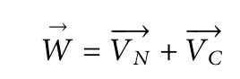
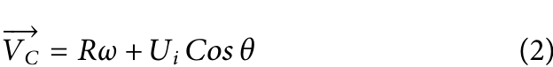
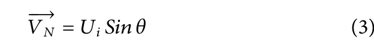
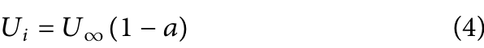
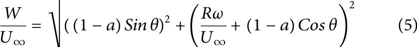
Here, R represents the rotor radius, ω is the angular velocity of the turbine and Ui is the axial flow velocity.
Velocity components acting on the blade change at every azimuthal position throughout a full cycle.
Therefore, to account for the varying magnitudes of velocity components, the azimuthal position of the blade, θ, is taken into consideration.
As illustrated in Figure 2, VC is the sum of two vectors, the blade tip speed and the velocity acting on the chord line of the blade profile.
Ui can be expressed in Eq. 4 as U∞ is the freestream wind velocity and a is the induction factor giving consideration of the deceleration of U∞ passing through the turbine (Manwell, 2009).
Tip speed ratio (TSR, λ) is expressed in Eq. 6 (Islam et al., 2008b; Manwell, 2009; Carrigan et al., 2012; Mohammed et al., 2019; Zhao
FIGURE 2
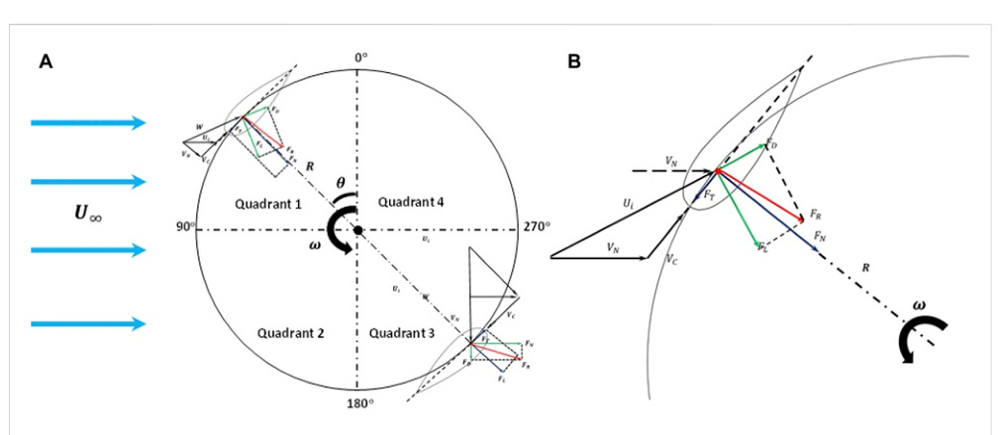
Original caption: FIGURE 2.
Principles of VAWT (A) Free-body diagram of a 2-bladed H-Darrieus turbine.
(B) Aerodynamics of a single aerofoil.
[[vj18|Source]]
Principles of VAWT (A) Free-body diagram of a 2-bladed H-Darrieus turbine.
(B) Aerodynamics of a single aerofoil.

et al., 2022).
It is the ratio comparing the velocity tip speed of the blade in relative to the incoming wind velocity.
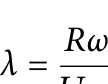
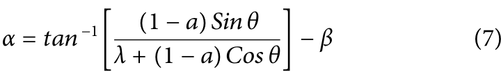
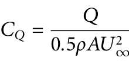
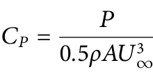
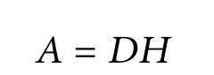
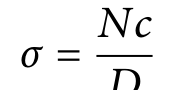
Solidity, σ, is define through Eq. 11, where N is the number of blades, c represents the blade chord length, and D is the turbine rotor diameter (Manwell, 2009; Carrigan et al., 2012; Li et al., 2015; Hassan et al., 2016; Sagharichi et al., 2018; Wang et al., 2021; Zhao et al., 2022).
This equation characterizes how tightly dense the rotors are when interacting with the oncoming wind (Rezaeiha et al., 2018b; Zhao et al., 2022).
In cases where the turbine has high solidity, less freestream wind can pass through the rotor, making the turbine more solid, and vice versa.
In contrast, low-solidity turbines are preferable in high-wind conditions for increased CP.

## 3 Variable design

This section comprehensively reviews variable designs for VAWT applications, encompassing H-Darrieus and Savonius turbines.
Each subchapter provides a detailed review, including
FIGURE 3

Original caption: FIGURE 3.
Anatomy of variable VAWT designs.
[[vj18|Source]]
Anatomy of variable VAWT designs.

variable control mechanisms.
Figure 3 illustrates the anatomy of variable designs in VAWTs.

### 3.1 Variable pitch (VP)

Studies on fixed-pitch vertical axis wind turbines (FP-VAWTs) have indicated an increase in power yield (Bianchini et al., 2015; Rezaeiha et al., 2017).
Rezaeiha et al.
(Rezaeiha et al., 2017), investigated a NACA 0018 3-bladed H-turbine and observed a 6% increase in CP and up to 2% increase in CQ with a pitch angle (β) of −2°.
Zhang et al.
(Zhang L.
et al., 2021) reported a 2.88% increase in power compared to a turbine with β = 0°.
The introduction of pitch angles led to spikes in lift and tangential forces in quadrant 2, contributing to an overall increase in generated power.
Studies by (Rezaeiha et al., 2017; Elsakka, 2020) concluded similarly on the impact of pitch angle on a turbine with a single blade across a cycle.
Pitched aerofoils can also serve as a preventive measure against structural failure under high mechanical fluctuation loadings at strong wind speeds (Islam et al., 2008a).
Additionally, simulated results showed a 26.3% reduction in resonance on the shaft compared to experimental findings (Zhang L.
et al., 2021).
variable pitch (VP) motions consist of sinusoidal (Figure 4A) and cycloidal (Figure 4B) methods (Zhao et al., 2018; Zhao et al., 2022).
In the sinusoidal VP method, the blades’ pitch angle varies in the shape of a sinusoidal function across azimuthal angles (Pawsey, 2002; Paraschivoiu et al., 2009).
This motion help keep the blades below stall conditions at critical azimuthal regions, particularly towards the downwind direction.
Although this variation improves lift forces by maintaining local angle of attack (AoA) below stall angles, the sudden change in pitch angle has the potential to induce mechanical fatigue loading, reducing the operational life of the turbine (Zhao et al., 2018).
Despite these potential disadvantages, research on VP-VAWT has demonstrated significant improvements, with a 30% increase in power generation compare to an FP-VAWT (Paraschivoiu et al., 2009).
Esfahani et al.
(2015) also show increase propulsion force using an elliptical motion trajectory base on a sinusoidal motion on a single aerofoil.
The cycloidal method depicted in Figure 4B was based on the Voith-Schneider system (Camporeale and Magi, 2000), commonly applied in hydro-turbines or vertical axis tidal turbines (VATT).
FIGURE 4
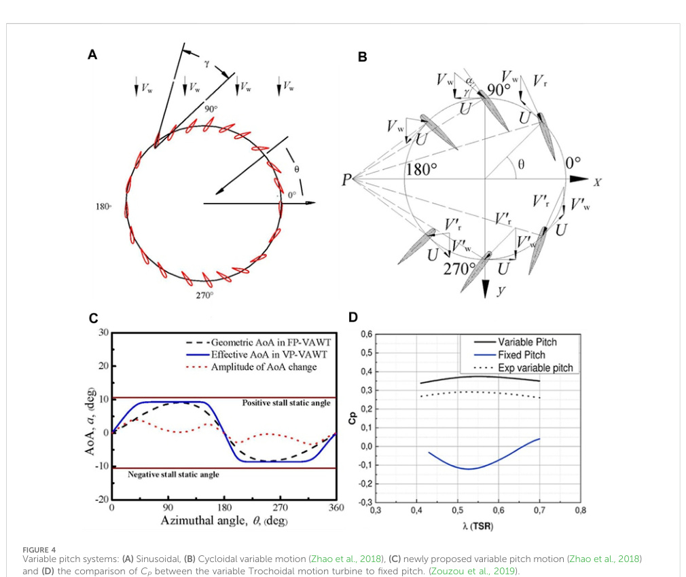
Original caption: FIGURE 4.
Variable pitch systems: (A) Sinusoidal, (B) Cycloidal variable motion (Zhao et al., 2018), (C) newly proposed variable pitch motion (Zhao et al., 2018) and (D) the comparison of Cp between the variable Trochoidal motion turbine to fixed pitch.
(Zouzou et al., 2019).
[[vj18|Source]]
Variable pitch systems: (A) Sinusoidal, (B) Cycloidal variable motion (Zhao et al., 2018), (C) newly proposed variable pitch motion (Zhao et al., 2018) and (D) the comparison of CP between the variable Trochoidal motion turbine to fixed pitch.
(Zouzou et al., 2019).

Performance studies for cycloidal actuation have shown a higher power yield than a fixed turbine.
Hwang et al.
(2009) reported a 25% increase in turbine performance with an active control cycloidal design.
However, the sinusoidal motion generally yields higher performance than the cycloidal motion.
Zhao et al., 2018 proposed a new variable pitch method that allowed the turbine to remain at maximum power output for an extended duration, this resulted an 18.9% increase in power at a TSR of 4.5.
This method outperformed an FP-VAWT, with a 50% surged in CP (Figure 4C).
A similar approach by Manfrida and Talluri (Manfrida and Talluri, 2020) introduced a dynamic pitching law, did not yield significant improvement compared to the sinusoidal VP motion.
Innovative control methods, such as the variable pitch trochoidal motion proposed by (Xu et al., 2019a; Zouzou et al., 2019), aimed to enhance variable pitch designs.
The trochoidal motion positions the blades at 0° pitch angles at 90° and 270° azimuthal positions, lead to significant improvements in CP.
Experimental results indicated an operational range for this turbine at lower TSRs between 0.4 and 0.7, similar to the operating range of a Savonius turbine in low wind conditions (Figure 4D).
Despite a 30% reduction in CP, attributed to mechanical inefficiencies during experiments, the VP H-VAWT in this study outperformed the Savonius turbine in low wind conditions.
Elkhoury et al.
(2015) also reported mechanical losses contributing to lower power generation at higher TSRs.
Eq. 12 proposed by Xu et al. (2019b) led to a 78.6% increase in maximum power compared to a fixed-pitch turbine.
In wind tunnel tests, the optimised control outperformed the sinusoidal variable pitch method by 45.5% in CPmax during the wind tunnel test.
This equation, linked pitch angle to azimuthal blade angle, allows researchers to determine the optimal blade pitch at various azimuthal positions.
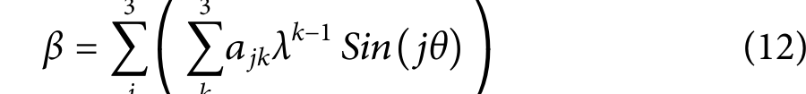
Where β is blade pitch; ajk (j = 1, 2, 3 and k = 1, 2, 3) are fitted coefficients; λ is tip speed ratio; θ is azimuthal angle measured in radians.
Several researchers (Paraschivoiu et al., 2009; Sheng et al., 2013; Jakubowski et al., 2017; Zhao et al., 2018; Manfrida and Talluri, 2020; Zhang L.
et al., 2021; Guevara et al., 2021) have propose various mathematical approaches to optimize pitch angles.
Numerical tools such as artificial neural networks (ANN) (Abdalrahman et al., 2017) and genetic algorithm (GA) (Li et al., 2018; De Tavernier et al., 2019) are used for optimising variable pitch settings.
However, these approaches are only simulated results, and experimental validation is yet to be conducted (Li et al., 2018).
Furthermore, the wind energy industry has not yet standardize to a singular equation that relates blade pitch angle, AoA, and azimuthal angle.
The benefits of VP control include delaying dynamic stall development by enlarging the leading-edge vortex (LEV) with optimal AoA, resulting in increased lift.
This approach mitigates vortex shedding, reducing blade wake-to-wake interactions and drag forces (Zouzou et al., 2019; Rainone et al., 2023).
Variable pitch designs also exhibit better self-starting capabilities (Erickson et al., 2012; Elkhoury et al., 2015; Zhang et al., 2015; Sagharichi et al., 2016; Sagharichi et al., 2018; Sagharichi et al., 2019; Guevara et al., 2021), widening the operational range of the turbine (Erickson et al., 2012).
Additionally, VP control proves useful for preventing damage from operation beyond the recommended wind working range through aerodynamic braking (Paraschivoiu et al., 2009; Kirke and Lazauskas, 2011; Lazauskas and Kirke, 2012; Jain and Abhishek, 2016; Sagharichi et al., 2016).
However, the developmental cost may outweigh the advantages (Paraschivoiu et al., 2009).
Simulation studies indicate that VP-Vertical Axis Wind Turbines (VAWTs) may lose omnidirectional abilities, especially when the wind comes from the advancing side.
The addition of a yawing mechanism may suggests its limitation (Jain and Abhishek, 2016).
Performance declines noticeably if the wind comes from the advancing side, and a yawing mechanism was suggested to be added.
Despite promising performance yields, mechanical control systems remain a significant challenge for market readiness.
Recommendations to install sensors on each blade to enhance turbine efficiency (Staelens et al., 2003).
Figure 5 illustrates various control mechanisms for variable pitch, employing rotational disks or cams mounted on the shaft to guide linkage bars.
The design by (Kiwata et al., 2010) using a 4bar linkage shows insignificant improvement in self-starting capabilities for the FP-VAWT but achieve higher rotational velocity.
Figure 5G depicts a collective pitch control system with a rubber belt linking the blades, controlled by a servo motor.
Experimental data evidence a 20%–30% lower output than simulation results, attributes to mechanical and aerodynamic losses such as friction and vortex shedding (Zhang et al., 2015).
Long-term fatigue stresses from abrupt dynamic loading during pitch changes could be a potential issue over time (Zhao et al., 2018).
Both active and passive control methods contribute to the total weight of the turbine, and an increase in moving parts introduces points of failure and friction.
Findings to skin friction to be influential in limiting the turbine’s predicted performance (Xu et al., 2019b).
The implementation of VP-VAWT, requires careful consideration of factors such as wind speed, control methods, and mechanisms.
For high TSRs, sinusoidal, cycloidal, or collective pitch motions have been applied effectively in highwind areas.
In contrast, the trochoidal system has shown effectiveness at low TSRs (Zouzou et al., 2019).
The 4-barred linkage mechanism, illustrated in Figures 5A–G, is a commonly employed method.
Less popular approaches, like the collective pitch system shown in Figure 5G, may be less suitable for practical applications.
For active control, a servo-controlled system is an option, but it comes with the drawback of consuming power, reducing the net power generated, especially in low-wind conditions.
In contrast, a passive mechanical control might be more suitable for low-wind scenarios, as it involves fewer moving parts, leading to reduce maintenance issues.
Active control methods are generally better suited for high-wind conditions.
While most studies have relied on simulations and control experiments, there is a need for real-world testing to gain a deeper understanding of this system.
Testing in open environments with actual wind scenarios could provide valuable insights.
Exploring the application of VP motion beyond H-VAWT to wind farming applications is a potential avenue for further development.
Establishing a standard

FIGURE 5
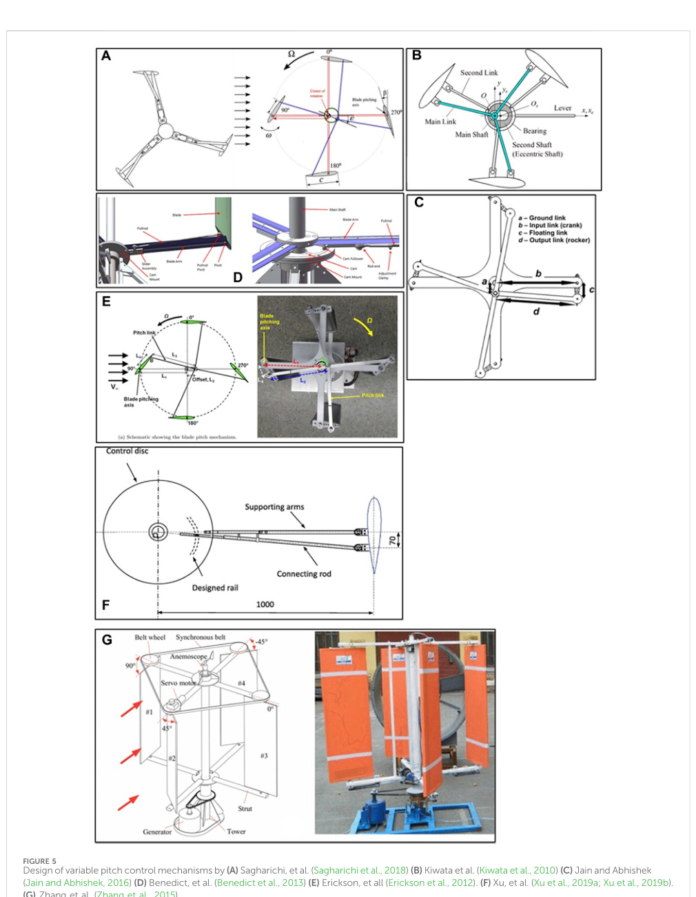
Original caption: FIGURE 5. Design of variable pitch control mechanisms by (A) Sagharichi, et al. (Sagharichi et al., 2018) (B) Kiwata et al. (Kiwata et al., 2010) (C) Jain and Abhishek (Jain and Abhishek, 2016) (D) Benedict, et al. (Benedict et al., 2013) (E) Erickson, et al (Erickson et al., 2012). (F) Xu, et al. (Xu et al., 2019a; Xu et al., 2019b). (G) Zhang et al. (Zhang et al., 2015). [[vj18|Source]]
Design of variable pitch control mechanisms by (A) Sagharichi, et al. (Sagharichi et al., 2018) (B) Kiwata et al. (Kiwata et al., 2010) (C) Jain and Abhishek (Jain and Abhishek, 2016) (D) Benedict, et al. (Benedict et al., 2013) (E) Erickson, et all (Erickson et al., 2012). (F) Xu, et al. (Xu et al., 2019a; Xu et al., 2019b). (G) Zhang et al. (Zhang et al., 2015).

TABLE 1 Summary of VP-VAWT methods.
Author(s) Wind turbine specifics Performance enhancement Findings
Exp/
Sim Abdalrahman et al. (2017) BP: NACA 0018 (3-Bladed) c: 0.246 m D: 1.7 m −6 ° ≤β ≤6 ° CP raised by 25% Studied on the variable pitch electrical control system. Aided with MLP-ANN. Sim Benedict et al. (2013) H-Darrieus BP: NACA 0015 (4-Bladed) c: 0.0635 m L: 0.264 m D: 0.254 m 15% increase in CP at the upstream section Passive control using a 4-bar linkage to control variable pitch motion Sim Chao et al. (2019) BP: NACA 0012 (1-bladed)
N/A
Non-sinusoidal pitching motion. Sawtooth and square motions were investigated Sim Elkhoury et al. (2015) H-Darrieus BP: NACA 0018, 0021, 634–221 (3-Bladed) c: 0.2 m D: 0.8 m L: 0.8 m σ: 0.75
N/A
Peak power achieved at lower λ. Overall improvement in CP but diminishes when λ increases. Thinner aerofoil profiles suggested to show better performance for VP turbines Sim Erickson et al. (2012) BP: NACA 0011 (3-Bladed) c: 0.153 m L: 1 m D: 1 m σ: 0.92 CP raised by 25% Capabilities of self-starting and widen operational range Sim Guevara et al. (2021) BP: NACA 0012 (3-Bladed) c: 0.25 m L: 5 m D: 6 m CP improved by 13% Active variable pitch system. Significant improvement in self-starting Sim Horb et al. (2018) Commercial offshore floating VAWT unit from NENUPHAR. BP: 3-bladed CP increased by 15% Improved performance of turbine by 15% implementing variable pitch control. Fail prevention to protect turbine from high winds Sim Hwang et al. (2009) Hydro-VAWT BP: NACA 0012 (3-Bladed) D: 1 m c: 0.14 m L: 0.4 m CP increased by 70% using cycloidal VP method. Optimised increased CP by additional 25% Conducted experimental and CFD work with proposed mechanical designs Sim Jain and Abhishek (2016) BP: NACA 0015 (4-Bladed) c: 0.0635 m L: 0254 m R: 0.127 m
N/A
Cycloidal method used. Active or passive variable pitch can be used as aerodynamic brakes Sim Jakubowski et al. (2017) BP: NACA 0012H c: 0.1 m L: 1 m D: 10 m CQ increased by 22.6% Proposed a formula relating the AoA to the torque output of a single blade Sim Kirke and Lazauskas (2011) BP: NACA 0018
N/A
Hydrokinetic Darrieus-VAWT produced large torque values increasing turbine’s performance. Downside of mechanical fatigue due to vibration from the high torques
N/A
Kiwata et al. (2010) H-Darrieus BP: NACA 634–221, MEL 081, E 193 flat plate (3-,4-,5-Bladed) c: 0.07 m, 0.2 m L: 0.23 m, 0.8 m D: 0.31 m, 0.8 m CP increased by 22% Mechanical bared linkages enhanced performance to a normal FP VAWT. Passive control Exp Li et al. (2018) H-Darrieus BP: NACA 0018 (3-Bladed) c: 0.1 m, 0.2 m D: 2 m σ: 0.15, 0.3
N/A
Used GA varying 5 parameters to determine optimum turbine pitching. Turbine performed better at higher TSR where the sinusoidal is the weakest Sim (Continued on following page)

equation or control for determining optimal pitch variations could be beneficial for VAWT designers (MacPhee D.
and Beyene A., 2016).
However, the commercial development of a reliable and affordable variable pitch system remains a challenge due to the complexity of the control mechanism (Zhu, 2007).
Table 1 provides a summary of VP-VAWT methods.
TABLE 1 (Continued) Summary of VP-VAWT methods.
Author(s) Wind turbine specifics Performance enhancement Findings
Exp/
Sim Manfrida and Talluri (2020) BP: NACA 0021 (3-Bladed) c: 0.21 m L: 3.5 m D: 3.2 m CP improved by 50% Smart pro-active variable pitch control is better than a FP-VAWT but little improvement to a sinusoidal pitch control VAWT.
Sim Paillard et al.
(2013), Paillard et al.
(2015) H-Darrieus 2-Bladed, NACA 0012, chord length 0.0914 m, span length 1.1 m, diameter 1.22 m, σ 0.3 CP increased by 52% Optimised sinusoidal pitch function with blade frequency and amplitude Sim Paraschivoiu et al.
(2009) H-Darrieus BP: NACA 0015 (2-Bladed) D: 6 m c: 0.2 m L: 6 m 30% annual energy production; CP increased by 70% With the optimised blade pitch control approach with study done against fixed, sinusoidal and optimised blade pitch control Sim Rainone et al.
(2023) H-Darrieus BP: NACA 0018 (3-Bladed) c: 0.05 m L: 1 m D: 1 m σ: 0.6 λ: 1.25
N/A
Applied variable-pitch law to VAWT simulation improved performance yield.
Expansion of LEV delaying stall effects Sim Sagharichi et al.
(2016), Sagharichi et al.
(2018), Sagharichi et al.
(2019) H-Darrieus BP: NACA 0021 (2-, 3-, 4-Bladed) D: 1.06 m 0.2 ≤σ ≤0.8
N/A
VP; Harmonic pitch motion; VP design works more efficiently at lower λ and has high σ turbine.
Reduces vortex shedding at downstream regions.
Overall, VP design improved in power generation than the fixed turbine Sim Schönborn and Chantzidakis (2007) N: 4 NACA 0018 Turbine efficiency increased by 20% Active hydraulic control of cyclic VP marine turbine.
Gain self-starting capabilities Exp Staelens et al.
(2003) H-Darrieus BP: NACA 0015 (2-Bladed) c: 0.2 m L: 6 m
N/A
Significant improvement in turbine performance.
Suggested to use sensors on blades to help vary the feathering Sim Sheng et al.
(2013) VATT BP: NACA 0018 (4-Bladed) c: 0.6 m D: 4 m L: 5.5 m β: ± 10°
N/A
VP turbine has better self-starting capabilities, created by high torque values.
Reduces potential mechanical failures.
Passive control was implemented on cycloidal motion technique Sim Xu et al.
(2019a), Xu et al.
(2019b) BP: NACA 0018 (3-Bladed) D: 1m, c: 0.3 m, CP−max increased by 78.6% from wind tunnel experiment to FP-VAWT.
45.5% CP−max to sinusoidal VP-VAWT.
Improves performance when turbulence intensity increases.
Proposed optimised control method
Exp/
Sim Zhang et al.
(2015) BP: 2-, 3-, 4-Blade c: 0.35 m, 0.2333 m, 0.175 m, σ = 1.26, 2.51 CP increased by 16% Variable collective pitch motion.
Dynamical stall and blade wake cortex shedding mitigation
Exp/
Sim Zhao et al.
(2018) H-Darrieus BP: NACA 0012 (2-Bladed) c: 0.09 m L: 2 m 18.9% increased power Proposed a new VP control strategy prolonging CP−max.
Maximum lift increased in both upwind and downwind with the blades positioned have higher AoA Sim Zouzou et al.
(2019) H-Darrieus BP: NACA 0018 (3-Bladed) c: 0.04 m D: 1 m L: 2 m σ: 1.2
N/A
Employed trochoidal motion.
Reduction in mechanical losses and had higher performance than a Savonius turbine at lower TSR between 0.4 and 0.7
Exp/
Sim BP (Blade profile), β (Blade pitch angle), N/A (Not applicable), Exp (Experiment), Sim (Simulation), c (Chord length), σ (Solidity), L (Blade span length), R (Radius).

FIGURE 6
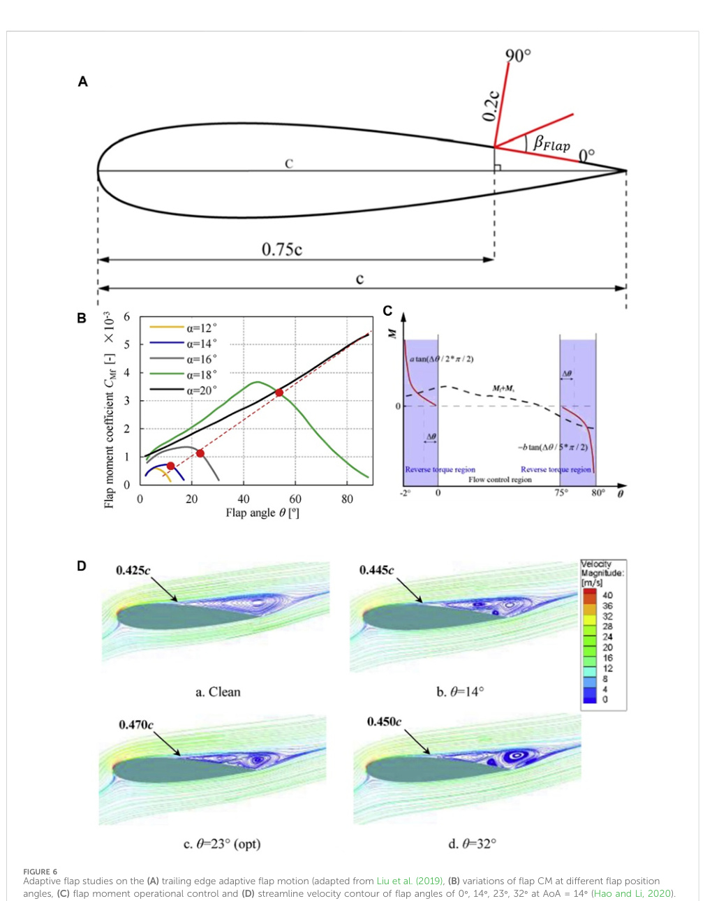
Original caption: FIGURE 6. Adaptive flap studies on the (A) trailing edge adaptive flap motion (adapted from Liu et al. (2019), (B) variations of flap CM at different flap position angles, (C) flap moment operational control and (D) streamline velocity contour of flap angles of 0?, 14?, 23?, 32? at AoA = 14? (Hao and Li, 2020). [[vj18|Source]]
Adaptive flap studies on the (A) trailing edge adaptive flap motion (adapted from Liu et al. (2019), (B) variations of flap CM at different flap position angles, (C) flap moment operational control and (D) streamline velocity contour of flap angles of 0°, 14°, 23°, 32° at AoA = 14° (Hao and Li, 2020).

3.2 Adaptive flap Inducing lift on an aerofoil can be achieved by adding flaps, a method commonly used in fixed-wing aircraft.
Trailing edge (TE) flaps on the suction side had been experimentally and numerically confirmed to improve lift by 10% on a glider (Meyer et al., 2007), preventing recirculation of flow towards the leading edge and delaying early flow separation (Meyer et al., 2007; Wang and Schlüter, 2012; Bechert et al., 1997; D and Singh, 2016; Schluter, 2010; Kernstine et al., 2008; Bramesfeld and Maughmer, 2002).
This section explores the different approaches to implementing variable adaptive flaps for VAWT.
In a numerical parametric study, Liu et al.
(2019) utilized a static TE flap positioned on the upper surface of an aerofoil to alleviate flow separation (Figure 6A).
At a flap angle of 23°, the flow separation region decreased by 12%, and the separation point was postponed to 0.407c from 0.425c.
This resulted in the elimination of recirculation flow at the TE.
Free flap pitching showed that moments on the flap initially increased and then decreased with increasing AoA.
Shown in Figure 6B, Hao et al.
(Hao et al., 2019; Hao and Li, 2020) introduced an adaptive flap method with a self-adjustable flap angle based on the blade’s (AoA).
In Figure 6B, the moment of the flap increased as flap angle reach its maximum.
The blade’s AoA rose to 20°, indicating significant boundary layer separation.
Figure 6C illustrates the operational conditions of the adaptive flap method, and Figure 6D shows velocity streamline plots at different flap angles.
Optimal flap angles delayed separation and reduced wak e interactions between blades.
The spring control system was explored, but potential mechanical failures and long-term fatigue loadings were identified as concerns.
Eq. 13 outlines the linear torque control approach, establishing a direct relationship between the coefficient of moment of the flap (CMf) and pitch angle (βFlap) (Hao et al., 2019; Hao and Li, 2020). Additionally, Eq. 14 is defined for a leading edge flap (Hao et al., 2019).
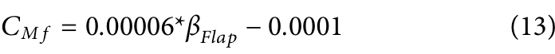
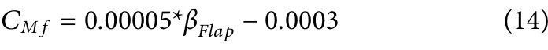
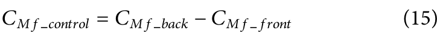
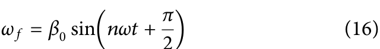
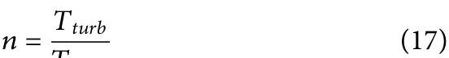
As pressure at the bottom surface of the flap remains constant, pressure on the upper side decreases slowly, preventing flow separation from moving toward the LE.
When βFlap is less than optimal, a higher-pressure difference is found at the end of the flap.
Conversely, when βFlap is higher than optimal, the pressure difference acts inversely in the negative direction for the second half of the flap length.
When βFlap is at the optimal angle, pressure difference at the end of the flap is equal to zero.
Therefore, the authors propose the composite torque method in Eq. 15 (Hao and Li, 2020).
Where CMf control is the difference between the coefficient of moment of back half of the flap CMf back and front half of the flap.
When the flap is below the optimal angle, CMf control is positive; when CMf control is negative, it means the flap is beyond optimal.
Eq. 15 adjusts the flap angle, with Eq. 14 offering consistency but limiting the lift-to-drag ratio.
Simulations show reduction in vortex shedding with flaps, lowering aerodynamic turbulence.
Contrasting aerofoils with and without flaps for VAWT, CP surged by 54% and 12.8% at low (λ = 0.6) and high (λ = 1.2) TSRs respectively.
The flap is most active at 90° ≤θ ≤180°.
At low TSR, θ = 120°, the flap is found to be ineffective; at high TSR, the flap angle increase to mitigate the recirculation.
Beyond 150°-180°, the flap fails to delay flow separation due to changing freestream velocity, reducing lift forces beyond optimal (Hao et al., 2019; Hao and Li, 2020).
Liu et al.
(Liu et al., 2019) simulated improvements in power yield by 24.2% (λ = 1.3) and 23.7% (λ = 1.4).
In a study investigating flap length, chordwise position, and the number of flaps, Hao et al., 2019 differentiated between medium BL separation (14°≤AoA ≤16°) and large BL separation (AoA = 20°).
For medium BL separation, the flap’s chordwise position was optimal towards the TE.
Conversely, at large BL separation, the flap position should be closer towards the leading edge (LE) for effectiveness, resulted in a 41% increase in the CL (Hao et al., 2019).
The flap length needed to be carefully selected to prevent flow recirculation spillage, as excessive backflow from the TE to the LE can lead to early flow separation.
Additionally, an overly long flap can be considered wasteful in manufacturing and may require more force and power to move.
The double flap configuration significantly outperformed the single flap, showing a 44% and 9.3% improvement at an AoA of 20° and 18° respectively.
This configuration addressed issues seen in the single flap setup, reducing the formation of turbulent eddies at high AoAs.
An added advantage was the lower noise emission of the adaptive flap system (Liu et al., 2019).
Figure 7A illustrates the second category of adaptive flap where the trailing edge moves independently to the main aerofoil body.
This concept is introduced by Xiao et al.
(Xiao et al., 2013) in VATT application and holds potential for performance enhancement in hydrofoil turbines (Zhou et al., 2021).
Simulation work discovers about 28% improvement in turbine’s performance.
In Figure 7A, w represents the slot width and γ means the slot angle.
This idea aims to mitigate BL separation and TE vortex (Xiao et al., 2013).
The oscillating motion is describe in Eq. 16 (Xiao et al., 2013), and the revolution of the oscillating flap (Tflap) is defined in Eq. 17 (Xiao et al., 2013).
A parametric study by (Xiao et al., 2013) revealed that the slot angle (γ) significantly influenced flow separation, delaying dynamic stall at high TSR and widening the operational range.
Torque performance increased notably between 100° < θ < 240° at γ = 60°, with a fixed flap angle improving torque at 180°.
Oscillation amplitude (β0) of 15° enhanced torque and power outputs by 12.98% and 23.72%, disrupting TE vortices.
Oscillation

frequency had the least impact on torque performance (Xiao et al., 2013).
This variable flap configuration showed benefits in improving lift forces, delaying dynamic stall, and providing self-starting abilities to the turbine.
Similar conclusions were reached by Zhou et al., 2021.
The discussed variable flap designs show promise for VAWT applications, but their implementation was relatively new and lacked real-world testing.
Recommendations included exploring doubleflap configurations with individual control and addressing challenges in control systems and sensor integration.
Passivecontrol designs needed attention to spring stiffness and damping.
Designs by (Xiao et al., 2013; Liu et al., 2019; Zhou et al., 2021) can mitigate flow separation but fell short of typical VAWT performance.
Advancements in control systems and physics, building upon Eqs 13–15, were needed for industry application readiness.
Long-term benefits were yet to be confirmed.
3.3 Gurney flap control A gurney flap (GF) is a short flap added at the end of the TE of an aerofoil, to be position on either the pressure side (Giguere et al., 1995; Myose et al., 1996; Li et al., 2002; Lee, 2009; Zhang et al., 2009; Motta et al., 2016; Bianchini et al., 2019) or the suction side (Bianchini et al., 2019; Ni et al., 2019; Li et al., 2021).
There are also configurations with double GFs on both sides (Zhu et al., 2018b; Bianchini et al., 2019; Zhu et al., 2019).
Early studies focus on GFs apply directly to the aerofoil (Giguere et al., 1995; Myose et al., 1996;
FIGURE 7
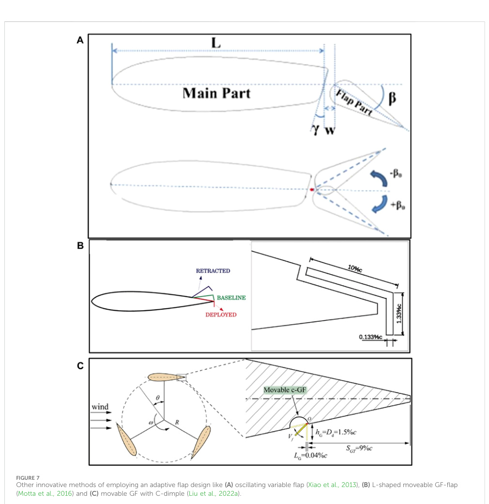
Original caption: FIGURE 7.
Other innovative methods of employing an adaptive flap design like (A) oscillating variable flap (Xiao et al., 2013), (B) L-shaped moveable GF-flap (Motta et al., 2016) and (C) movable GF with C-dimple (Liu et al., 2022a).
[[vj18|Source]]
Other innovative methods of employing an adaptive flap design like (A) oscillating variable flap (Xiao et al., 2013), (B) L-shaped moveable GF-flap (Motta et al., 2016) and (C) movable GF with C-dimple (Liu et al., 2022a).

Li et al., 2002; Lee, 2009; Zhang et al., 2009) with applications in racing vehicles demonstrating performance improvement (Liebeck, 1978).
The GF is typically oriented perpendicular to the chordline, although some instances feature angled GFs (Shukla and Kaviti, 2017; Masdari et al., 2020).
Liebeck (Liebeck, 1978) conducted the first study on GFs, revealing significant lift improvement with a slight increase in drag when the flap length.
Fixed GFs have been applied to VAWTs for performance enhancement (Chen et al., 2020; Masdari et al., 2020; Chakroun and Bangga, 2021; Li et al., 2021; Ni et al., 2021; Syawitri et al., 2022).
On the pressure side, GFs slow down flows, increasing pressure and creating a separation eddy before the flap leading edge, leading to higher pressure difference at the TE and increased lift force (Liebeck, 1978; Ismail and Vijayaraghavan, 2015).
In some instances, a combination of a variable gurney flap and a TE adaptive flap design was used to enhance the aerodynamic performance of a rotary aircraft and serve as a load control (Figure 7B) (Motta et al., 2016).
Hybrid designs combining GFs and dimples have shown the best performance improvement for VAWTs.
Studies preferred NACA 0012 and 0015 profiles, finding that NACA 0018 and 0021 fell short in achieving maximum lift.
In a study (Zhu et al., 2019), GF-dimples on the suction side (outboard) of the blade at λ = 3.1 increased maximum CP by 17.92% outperforming inboard GF-dimples (5.8% rise) and configurations with GF-dimples on both sides (2.7% rise).
Average torque output improve by 24.2% at the same TSR using a 3bladed, NACA 0021, H-VAWT with a solidity ratio (σ) of 0.25 (Zhu et al., 2018a).
The success of the GF-dimple combination lies in increasing pressure from the GF and reducing drag from the dimple, suitable for various TSR conditions and effective in protecting the turbine from gusts (Shukla and Kaviti, 2017).
Zhu et al.
(2019) found that outboard Gurney flap-dimple configurations improve turbine torque at low λ and high solidity conditions.
However, its suitability for H-Darrieus turbines is limited due to a drastic torque decline at high λ in the upwind section (Liu et al., 2022a).
In Figure 7C, a variable c-dimple-GF significantly enhanced power production by up to 37.5% (Liu et al., 2022a).
The actuated c-GF demonstrated higher performance and effective flow separation mitigation, particularly at θ = 60° during high TSRs.
Early activation of the flap can hinder self-starting capabilities and CP production, though the starting azimuthal angle has minor influence.
The trade-off with this variable system was the persistence of vortex shedding like with a fixed GF, as boundary layer separation is delayed.
Liu et al.
(Liu et al., 2022a), proposed an actuation motor to move the GF, requiring sensors for activation, but the associated costs and weight impact on the total turbine have not been investigated.
Comparatively, a fixed GF with a dimple cavity cut-out was simpler and more cost-effective (Zhu et al., 2019; Li et al., 2021), and a direct comparison between the two methods was yet to be conducted.
Liu et al.
(2022a) proposed implementing a variable gurney flap using a retractable flap with an actuator, similar to those on aircraft wings.
The actuator needed to be small enough to fit within the aerofoil, and for low wind speed conditions, a passive control with a contracting spring can be considered.
However, the impact on overall power generation and the need for rapid movement in low TSR turbines should be carefully evaluated.
It’s essential to note that only simulated results had been presented, and further experiments to be recommended to validate these findings.

### 3.4 Deforming aerofoil

Morphing blades made from flexible materials, such as rubber (Tavallaeinejad et al., 2022), silicon (Lachenal et al., 2013; Pohl and Riemenschneider, 2022), offers a passive alternative to complex variable pitch controls (Zhu, 2007; MacPhee D.
and Beyene A., 2016).
These blades respond to changing aerodynamic forces by flexing or deforming, improving lift and delaying boundary layer separation (Lachenal et al., 2013; Wolff et al., 2014a).
The technology, demonstrated in simplified models and studies on single aerofoils, has shown promising applications in HAWTs (Hoogedoorn et al., 2010; Wang et al., 2011; Wang et al., 2012; MacPhee and Beyene, 2013; Capuzzi et al., 2014; Mo et al., 2015; Dai et al., 2017; Pavese et al., 2017; MacPhee and Beyene, 2019; Cavens et al., 2020).
It can be controlled through active (Daynes and Weaver, 2012a; Daynes and Weaver, 2012b; Wang et al., 2012; Wang et al., 2019; Leonczuk Minetto and Paraschivoiu, 2020; Pohl and Riemenschneider, 2022; Tong et al., 2023) or passive (Castelli et al., 2013; MacPhee and Beyene, 2013; Liu and Xiao, 2015; MacPhee DW.
and Beyene A., 2016; Wang et al., 2016; MacPhee and Beyene, 2019; Cavens et al., 2020; Roy et al., 2021) methods by actuators and flexible materials.
A simplified model of a deformable TE using a foil was studied experimentally and numerically, showing enhanced thrust generation (Zhu, 2007).
The flat plate formed a curvature, resembling cambering effects.
Excessive flexibility negatively impacted turbine performance, but with the right amount of feathering, flow separation was effectively managed (Zhu, 2007; Liu and Xiao, 2015).
However, the turbine’s performance was limited due to chaotic flow characteristics downstream caused by flexing and twisting along the blade span (Liu and Xiao, 2015; Bouzaher et al., 2016).
At optimal settings, CP increased by 8% (Liu and Xiao, 2015).
Macphee and Beyene (MacPhee D.
and Beyene A., 2016; MacPhee DW.
and Beyene A., 2016) improved H-Darrieus turbine performance by 10% and reduced blade oscillation loads by 8.3% in a simulated study with a passively morphing VAWT.
Notable enhancements occurred at azimuthal positions of 10°, 130°, and 250°, attributed to decreased vortex shedding and dynamic stalling.
The morphing design also exhibited self-starting capabilities.
The maximum CP increase of 9.6% was achieved with a Young’s Modulus of 0.5 MPa, while raising the modulus led to decreased performance.
However, when Young’s Modulus (E) was raised turbine’s performance started decreasing.
This aligns with the observation in (Wolff et al., 2014a) suggested that the flexibility of the blade was correlated to the blade’s dimensions as mentioned in (MacPhee DW.
and Beyene A., 2016) emphasizing the correlation between blade flexibility and dimensions [146].
The passive pitch control system, governed by Eq. 18, showed the blade pitch angle (βP) correlated to (E) (MacPhee DW. and Beyene A., 2016).
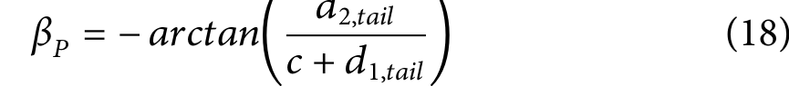
Where, di,tail represents the TE displacement in the i th direction positive (downward) or negative (upward) flexure of the TE (MacPhee DW. and Beyene A., 2016).
By (Roy et al., 2021), performed simulations and experimental investigations revealed a 90% increase in turbine performance and a 26.67% expansion of the

operational range with flexible blades.
The flexible blades lead to an enhanced lift-to-drag ratio by efficiently mitigating stalls at critical azimuthal positions.
Moreover, there is a 6.88% decrease in normal forces acting on the aerofoil, contributing to an extended operational lifespan.
The use of silicon rubbers for aerofoil tests, with specified material properties (ρ = 1,050 kg/m3, Poisson ratio ν = 0.45, and E = 0.4 MPa), is illustrated in Figure 8A.
Bouzaher et al.
(Bouzaher et al., 2016; Bouzaher and Hadid, 2017) investigated the effects of flexions at the LE and TE of an aerofoil for VAWT and VATT applications, employing active control of flexible pitch.
The study considered coefficients of moment, power, lift, and drag with varying oscillating frequency (zi) and amplitude (a0).
The group found that with a flexible blade torque and lift coefficient increased from 0.25 to 0.4 and 1.83 to 3, respectively compared to a non-flexible one.
The absence of vortex shedding at the trailing and leading edges, attributed to flexible TE, contributed to elevated lift forces.
This widened the pressure difference between upper and lower surfaces, reducing far TE vortices and lowering wake disturbances.
Similar findings were reported by (Huang and Wu, 2013; Wang et al., 2019; Leonczuk Minetto and Paraschivoiu, 2020).
Natural camber adjusted to changing local AoA during operation, resulting in improved aerodynamic performance and torque outputs (Figure 8B).
Figure 8C illustrated a substantial increase in CQ with external blade deformation, enhancing flow reattachment and reducing stall effects (Bouzaher et al., 2016).
From the parametric studies (Bouzaher et al., 2016; Bouzaher
and Hadid, 2017), proposed an implementation of zi = 2 and a0/c =
0.3 or 0.5 as value were very close.
The optimal setting was found to be zi = 2.
At lower TSRs, zi = 2 and 3 yielded higher efficiency, while
at higher TSRs, zi = 4 performed better with a 38.2% increase in
performance compared to the static bladed turbine (Figures 8D,E).
At this flapping frequency, it performed within a wider range of TSRs, but power input to the system also increased with rising TSR.
Beyond that, when zi = 8, there was a 50% drop in CP compared to
the rigid turbine.
In dealing with oscillating amplitude effects, CP
was at 25% in the upward trend when a0/c is at 0.3 and 0.5.
With this
parameter, an unforeseen delay in LE vortex expansion in the second
FIGURE 8
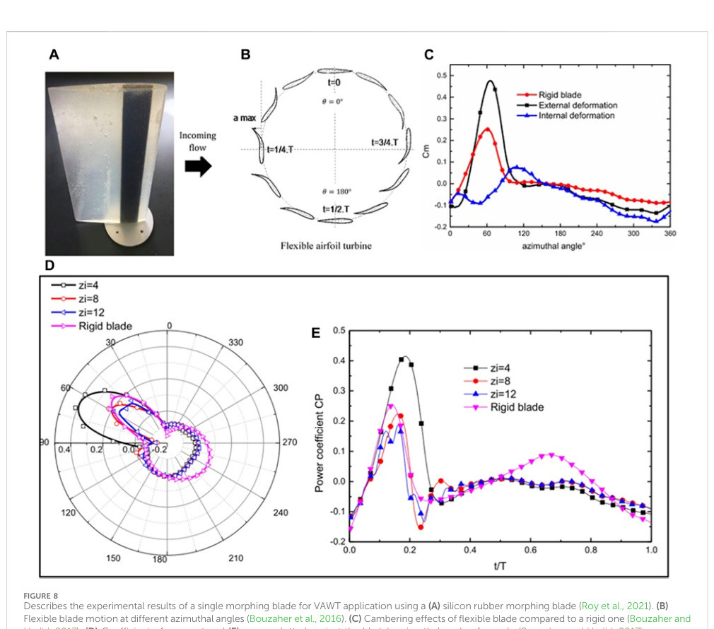
Original caption: FIGURE 8.
Describes the experimental results of a single morphing blade for VAWT application using a (A) silicon rubber morphing blade (Roy et al., 2021).
(B) Flexible blade motion at different azimuthal angles (Bouzaher et al., 2016).
(C) Cambering effects of flexible blade compared to a rigid one (Bouzaher and Hadid, 2017).
(D) Coefficient of moment and (E) power plotted against the blade?s azimuthal angle of a cycle (Bouzaher and Hadid, 2017).
[[vj18|Source]]
Describes the experimental results of a single morphing blade for VAWT application using a (A) silicon rubber morphing blade (Roy et al., 2021).
(B) Flexible blade motion at different azimuthal angles (Bouzaher et al., 2016).
(C) Cambering effects of flexible blade compared to a rigid one (Bouzaher and Hadid, 2017).
(D) Coefficient of moment and (E) power plotted against the blade’s azimuthal angle of a cycle (Bouzaher and Hadid, 2017).

quarter was observed after the blade had pass stall conditions which was not ideal.
This delay was caused by the lower flexing curvature of the blades; a higher flexing curvature might have initiated
enlargement earlier.
Another, huge downside was that at a0/c =
0.5, it consumed 5%–10% more input power than
a0/c
was 0.3 and 0.1.
Wang et al.
(2019) enhanced blade CL, L/D and delayed
dynamic stall effects through active blade morphing and increased cambering (Figure 9A).
Deformation ratio to blade chord length determined the amount of morphing, with significant lift enhancement observed as the deformation amplitude increased (Tong and Wang, 2021).
Polydimethylsiloxane membrane (PDMS), a rigid material, was used to avoid passive bending in the experimental and numerical study of a single NACA 0012 blade (Wang et al., 2019; Tong and Wang, 2021) (Figure 9B).
A synergistic smart morphing aerofoil proposed by (Pankonien et al., 2013; Pankonien et al., 2014a; Pankonien et al., 2014b; Pankonien et al., 2016) integrated with a flexible trailing edge, was investigated for H-VAWT application (Tan and Paraschivoiu, 2017; Leonczuk Minetto and Paraschivoiu, 2020) (Figure 9C).
Actively controlled by a flexure box, only quadrant 2 was morphed inwards while the trailing edge remained neutral.
This inward cambering at quadrant 2 enhanced CP by 46.2%, reduced dynamic stall effects, and limited wake vortex shedding (Leonczuk Minetto and Paraschivoiu, 2020).
Study by (Tan and Paraschivoiu, 2017) concluded that this morphing method outperformed a VP design.
In contrast, a study of a fixed VAWT by Elkhoury et al.
(Elkhoury et al., 2015) found that a cambered aerofoil had little
FIGURE 9
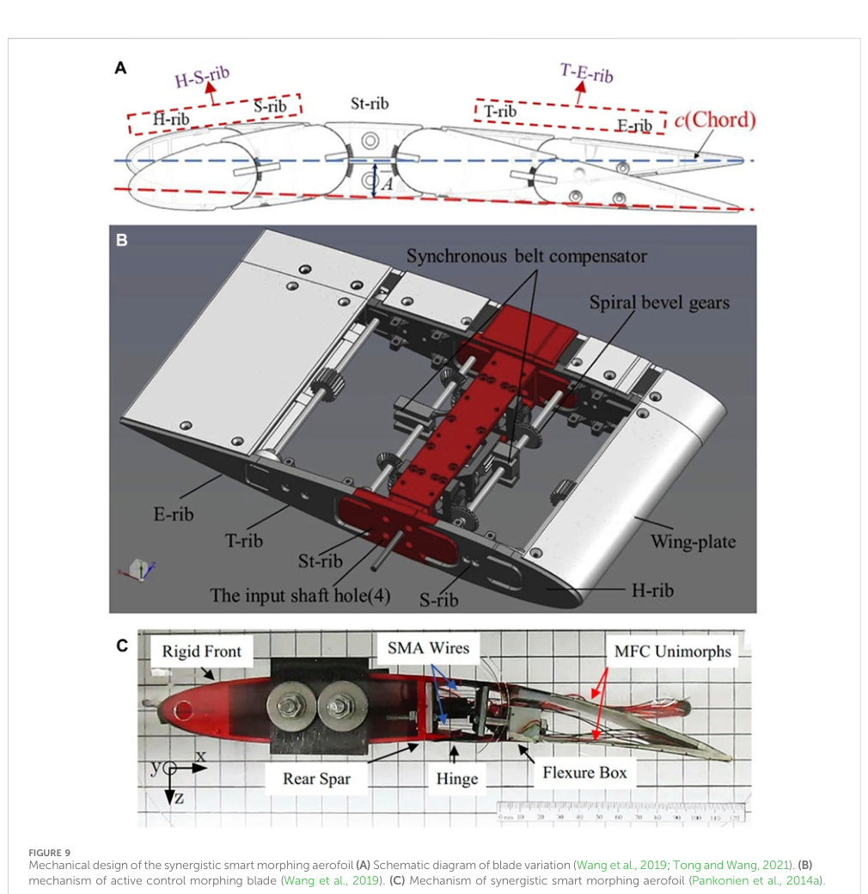
Original caption: FIGURE 9.
Mechanical design of the synergistic smart morphing aerofoil (A) Schematic diagram of blade variation (Wang et al., 2019; Tong and Wang, 2021).
(B) mechanism of active control morphing blade (Wang et al., 2019).
(C) Mechanism of synergistic smart morphing aerofoil (Pankonien et al., 2014a).
[[vj18|Source]]
Mechanical design of the synergistic smart morphing aerofoil (A) Schematic diagram of blade variation (Wang et al., 2019; Tong and Wang, 2021).
(B) mechanism of active control morphing blade (Wang et al., 2019).
(C) Mechanism of synergistic smart morphing aerofoil (Pankonien et al., 2014a).

impact on turbine performance, with a symmetric aerofoil producing better output.
To address this, implementing variable cambering, and leading edge camber, as used to mitigate dynamic stall effects, could be a potential solution (Kerho, 2007).
Active morphing VAWTs, exemplified in (Bouzaher and Hadid, 2017), achieved a 35% power gain through LEV amplification (Bouzaher et al., 2016; Bouzaher and Hadid, 2017).
Application examples of adaptable aerofoil morphing methods can be found in HAWT (Daynes and Weaver, 2012a; Daynes and Weaver, 2012b; Tripp et al., 2018; Cavens et al., 2020; Pohl and Riemenschneider, 2022), aerospace (Bornengo et al., 2005; Fichera et al., 2019) and motorsports (Bornengo et al., 2005).
Material properties significantly influenced flapping motion, with the starting positions on the aerofoil having minimal impact (Bouzaher et al., 2016; Bouzaher and Hadid, 2017).
Active morphing VAWT designs discussed in (Pankonien et al., 2014a; Wang et al., 2019) may not be suitable for small to medium-sized or low-wind VAWTs, potentially negating morphing aerofoil advantages (Wolff et al., 2014a; Wolff and Seume, 2016).
Incorporated morphing systems at specific span sections, seen in (Wang et al., 2012) or adopting configurations suitable for large morphing VAWTs, as suggested by Baghdadi et al., 2020 could offer alternative solutions.
Hoke et al., 2015 achieved a 37.3% thrust improvement by combining sinusoidal VP motion with a deforming aerofoil, broke down and delayed LEV formation to enhance suction forces on the blade.
TABLE 2 Summary of deforming aerofoils.
Author(s) Wind turbine specifics Findings Material Description(s)
Exp/
Sim Baghdadi et al.
(2020) BP: NACA 0021 (3bladed) c: 0.265 m D: 2 m Enhanced turbine performance is due to larger pressure differences produced by morphing blades - Sim Bouzaher et al.
(2016) H-Darrieus BP: NACA 0010 (2- Bladed) c: 0.05 m D: 0.44 m L: 1 m Flexible turbine with flapping frequency (zi) of 4 had the highest increase in performance to a fixed VAWT, 38.3% zi =1–8, 0.6 ≤λ ≤1.9 Sim Su et al.
(2021) BP: NACA 0012 Confirmed flow patterns of a passive deforming aerofoil is same as an active control blade.
Proposed fish bone internal aerofoil structure
E = 1 and 2 MPa
Sim Liu and Xiao (2015) BP: NACA 0012 c: R: 0.125 L: 0.3 m λ: 2.50–7.50 Two effective stiffness and strut locations were investigated.
Performance increased at low λ.
Proposed strut to be positioned in the middle of the blades Small and large effective stiffness of 9.37 × 102 and 3.19 × 103 respectively Sim MacPhee and Beyene (2016b) BP: NACA 0015 (3- Bladed) c: 0.4 m L: 3 m D: 2.5 m CP increased by 9.6% with flexible blades E = 0.5, 1.0, 5.0, 10.0 MPa, ] 0.4, ρ
100 kg/m3
Both Hwang et al.
(2009) BP: NACA 0012, c: 0.1524 m L: 2.5 m R: 1 m, 1.25 m, 1.5 m Delayed stall improving VAWT performance with higher σ by 90%.
Widen turbine’s operational range by 40.3% Silicon rubber, ρ 1,050 kg/m3, ] 0.45, E 0.4 MPa Both Somoano and Huera-Huarte (2022) H-Darrieus BP: NACA 0015 (3- Bladed) c: 0.12 m L: 0.75 m D: 0.75 m β: 6 ° CP rose by 10.3% with a K* of 1,404.
Too much flexibility can act in opposition depending on the turbine’s operational λ 21 ≤K* ≤2655 Exp Tavallaeinejad et al.
(2022) BP: NACA 0012 (2- Bladed) c: 4 cm L: 20 cm D: 40c σ: 0.4 Improved self-starting capabilities, opening torque at low λ and σ Rubber, width 10 cm, length 4 cm,
thickness 1.3 mm E = 2 MPa, ] 0.49
Sim Wang et al.
(2016), Wang et al.
(2019) BP: NACA 0015 (2-,3-,4-Bladed) D: 2.5 m A deformable 3-bladed turbine has the potential to perform beyond 14.56% in CP max than a VAWT.
- Sim Wang et al.
(2016) BP: NACA 0012 c: 0.4 m Mechanically driven deformation of leading- and trailingedge aerofoil - Exp Wolff et al.
(2014b), Wolff and Seume (2016) BP: DU08-W-180–6.5 Trailing edge deformation.
Significant effect on lift and highly dependent on aerofoil characteristics TE deflection between −10° to 10° with 5° step changes Sim BP (Blade profile), β (Blade pitch angle), N/A (Not applicable), Exp (Experiment), Sim (Simulation), c (Chord length), σ (Solidity), L (Blade span length), R (Radius), c:R (Chord to radius), E (Young’s Modulus).

In conclusion, actively morphing aerofoils is more suitable for large VAWTs and HAWTs.
Integrated morphing flat plates in VAWT designs also show potential applications (Tian et al., 2014; Tavallaeinejad et al., 2022).
However, potential downsides include wear and tear on joints and the complexity of actuation mechanisms.
Both actively and passively morphing blades require flexible materials with periodic loading.
Joining flexible and solid materials can be complex, requiring special adhesives and potentially impacting VAWT sustainability.
The recyclability of flexible materials is crucial for environmental friendliness.
Ultraviolet (UV) rays and heat from the sun can reduce the life expectancy of flexible materials by exciting the surface molecules, leading to the breaking of chemical bonds and the deterioration of the material’s properties (Awaja et al., 2011; Nasri et al., 2022).
Despite these challenges, there are opportunities for this design to enhance VAWT performance.
Exploring the internal structure for passive morphing VAWT and investigating other flow energy harvesters with morphing capabilities are potential avenues for improvement.
Table 2 provides a summary of deforming aerofoils.

### 3.5 Movable mass blocks

A passively variable movable mass block for VAWT was suggested by Zhang et al.
(Zhang LJ.
et al., 2021) to reduce shaft radial loadings and enhance the shaft’s lifespan.
The design relies on centrifugal forces of mass blocks to counteract radial loads on the rotating shaft, with a mass block placed on each strut.
Independent movement of the mass blocks along the arm is facilitated by a support rod (Figure 10A).
Eq. 19 allows the prediction of the required mass and traveling displacement of the mass blocks at specific azimuthal angles.
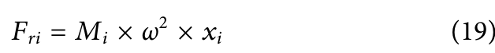
where Fri is centrifugal force produced by the i th mass block, the mass of the mass block (Mi) multiplies with turbine angular velocity (ω) and linear displacement of the block from the shaft (xi) (Figure 10B).
Figure 10C illustrates the motion of each mass block and its centrifugal forces in a complete cycle.
During operation, the mass blocks move linearly along the strut, compensating for forces pulling in opposing directions in a
FIGURE 10
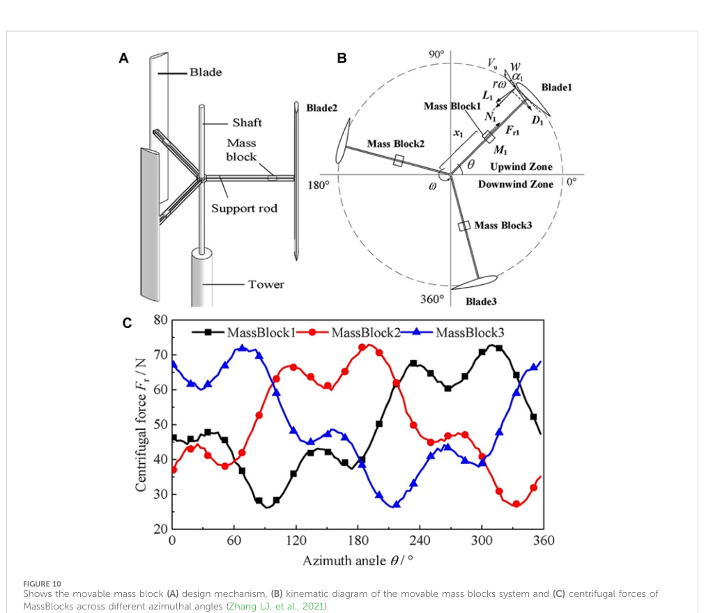
Original caption: FIGURE 10.
Shows the movable mass block (A) design mechanism, (B) kinematic diagram of the movable mass blocks system and (C) centrifugal forces of MassBlocks across different azimuthal angles (Zhang LJ.
et al., 2021).
[[vj18|Source]]
Shows the movable mass block (A) design mechanism, (B) kinematic diagram of the movable mass blocks system and (C) centrifugal forces of MassBlocks across different azimuthal angles (Zhang LJ.
et al., 2021).

predictable pattern.
This study determined a control method by investigating the mass and displacement of the blocks.
CFD simulations indicated a 52.4% reduction in radial loading, leading to a 51% decrease in total shaft deformation.
Increasing mass block weight to 0.075 kg resulted in only 1% shaft damage, with radial loading dropping by 97.1%.
The optimal mass for each block was determined to be 0.065 kg (Zhang LJ.
et al., 2021).
Since introducing mass blocks, the turbine’s performance remains uncompromised.
However, an unforeseen issue arises with the turbine’s self-starting capabilities and start-up wind velocity significantly impacted due to added weight, necessitating a larger moment of inertia for rotation.
Consequently, the turbine experiences an extended start-up duration.
Zhang et al.
(Zhang LJ.
et al., 2021) propose a solution by calibrating mass block displacement along the arms base on a displacement increment equation to increase the moment of inertia from 0.018 kgm2 to 0.036 kgm2, this shorten the start-up duration by 40.6%.
While this variable method shows promise in reducing radial loadings and extending the turbine shaft’s lifespan, concerns arise about the durability of the struts.
Higher loads may lead to bending over time, particularly affecting the struts along the track where the mass blocks oscillate (Zhang LJ.
et al., 2021).
Wear and tear on the struts could become a future issue as materials degrade, impacting bending deformation at the arms.
Notably, medium to large-scale H-Darrieus turbines typically have two supporting arms to the blade, unlike the single arm used in this study.
Further studies can explore the robustness of the equations.
Additionally, the control method for the wind turbine is yet to be explored, and its impacts on the shaft parameters in a final design should be carefully considered.

### 3.6 Synthetic jet

Rezaeiha et al.
(Rezaeiha et al., 2019) proposed an active control suction slot to be placed at the LE of the aerofoil in chordwise to enhance aerodynamic performance by delaying the flow separation with smaller laminar separation bubble (LSB).
It prevented turbulent flow and boundary layer detachment.
An increased in CL and a minimization of the CD were observed on the blade.
Thus, delaying dynamic stalls forming at higher AoAs.
At 50° ≤θ ≤160° showed clear aerodynamic advantages.
Flow separation was pushed down the blade chordwise towards the TE.
Significantly smaller vortex eddies at θ beyond 100° where usually large drag, flow separation and dynamic stalls were often present.
LSB notably reduced and suppressed dynamic stalls.
Optimal settings increased CP by 247% at a TSR of 2.5 with suction slots at 8.5% of the chord length.
TSR, turbulence intensity, and Reynold’s number were influential in governing slot positions.
Moving slots further down chordwise to 13.5%, 18.5%, and 28.5% resulted in decreasing power yield by 208%, 119%, and 81%, respectively.
Slots moving nearer to the trailing edge (TE) shifted the suction effect away from the leading edge, leading to a greater development of dynamic stall (Rezaeiha et al., 2019).
Sun and Huang (Sun and Huang, 2021) confirmed similar findings and extended their study to multi-suction slots on NACA-021 series aerofoils for an H-Darrieus turbine.
Tested different maximum thickness positions relative to a single suction slot and observed that as the maximum thickness of the aerofoil moved towards the TE, the optimum positions for the suction slots also moved down away from the LE.
Similar findings in (Yen and Ahmed, 2013), indicating that synthetic jet actuation had little influence on pressure distribution, particularly in the early stages of suction development along the LE when flow separation had not occurred.
Using lift and drag ratios as measured outputs (Sun and Huang, 2021), proposed a double suction slot along the chord at positions of 10% and 30% for low TSR turbines and, for high TSR turbines, positions at 30% and 50% of the aerofoil chordwise.
An earlier research report published by the National Advisory Committee for Aeronautics (NACA) concluded positively on the addition of a backward-opening slot to blow air from a single static aerofoil, showing improved maximum lift, reduced drag forces, and better control on stall effects (Knight and Bamber, 1929).
Liu et al.
(2022b) applied similar boundary layer control techniques and introduced a blow-suction synergy (BSS) method to address dynamic stall issues at lower TSRs.
The study focused on optimizing the LE suction slots and jet coefficient (Cμ), determining optimal settings through an orthogonal experimental design method (Cμ = 0.01 and suction slot at 0.2c).
Compared to fixed VAWT, three control strategies were explored, leading to a 166% increase in maximum lift and a postponed stall angle at θ = 14°–24°.
The BSS method effectively balanced sucking and blowing effects, addressing vortex development risks and reducing blade wake interactions.
Energy production improved from low to medium TSR (Liu et al., 2022b).
The BSS also enhanced turbine stability, decreased negative tangential forces and provided smaller vortex shedding with higher wake dissipation at the TE in upstream regions (Figure 11B).
The proposed control strategy involved intermittent blowing and suction, with suction at the inner side and blowing at the outer side between 0° and 180° azimuthal angles, and the opposite configuration (suction at the outer side and blowing at the inner side) from 180° to 360° azimuthal range.
Although no working models or experiments had been conducted, the suggested includes placing air pumps in the blades with valves at the slots to control fluid flow, emphasizing intermittent control for reduced power consumption (Liu et al., 2022b).
Zhu et al.
(Zhu et al., 2018a), explored suction slot numbers, jet momentum coefficients, and control strategies (Figure 12A).
Optimal power yield improvement was found with two suction orifices at the TE.
Contrary to the previous studies (Rezaeiha et al., 2019; Liu et al., 2022b).
This study demonstrated that double trailing-edge slots, upward-parabola control strategy, and a jet coefficient of 0.035 achieved a 15.2% increase in power coefficient (Figure 11).
The relationship between orifice slots and CP was suggested to be inversely proportional.
Conventional methods (Figure 11A) faced issues with uneven loading fluctuations, but alternative controls, particularly the upward parabola (Figure 11B), proved efficient with an 80.10% reduction in actuator energy consumption.
Synthetic jet flow control delayed flow separation and dynamic stalls, improving pressure distribution, lowering blade-wake interactions, and reducing trailing edge vortices.
The paper proposed a piezoelectric synthetic jet actuator (Figure 12B) (Liu et al., 2022b).

Concerns also arise about the total weight of the turbine, especially the blades.
For instance, in (Liu et al., 2022b), enclosing pumps within the blade could substantially increase the overall blade mass.
As discussed earlier in variable methods, mass is critical, impacting self-starting capabilities and reducing initial advantages.
Furthermore, more blade energy is necessary for the turbine’s self-starting.
The cost implications from design to fabrication of such a turbine must be thoroughly evaluated.

### 3.7 Variable swept area

The expandable Savonius, akin to morphing aerofoil VAWTs, uses rotating concave plates to alter its sweep area (Bouzaher, 2022; Bouzaher and Guerira, 2022).
In 2D CFD studies by Bouzaher et al.
(Bouzaher, 2022; Bouzaher and Guerira, 2022), torque increase by 90.6% at maximum expansion.
Figures 13A,B illustrates the design with three segments per concaved blade, connected by hinges, moving elliptically.
As the advancing blade expands, the concave
FIGURE 11
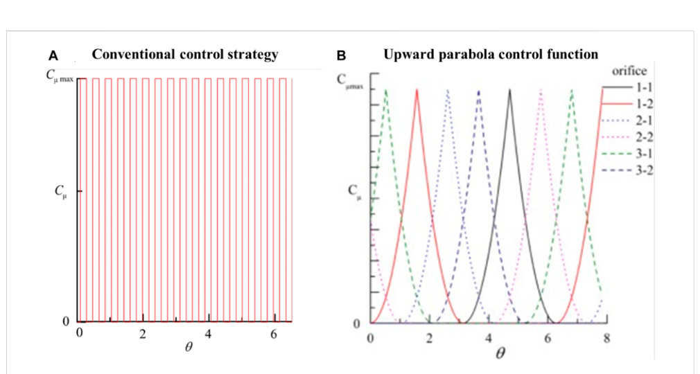
Original caption: FIGURE 11.
Comparison between (A) conventional to (B) upward parabola control functions (Zhu et al., 2018a).
[[vj18|Source]]
Comparison between (A) conventional to (B) upward parabola control functions (Zhu et al., 2018a).
FIGURE 12
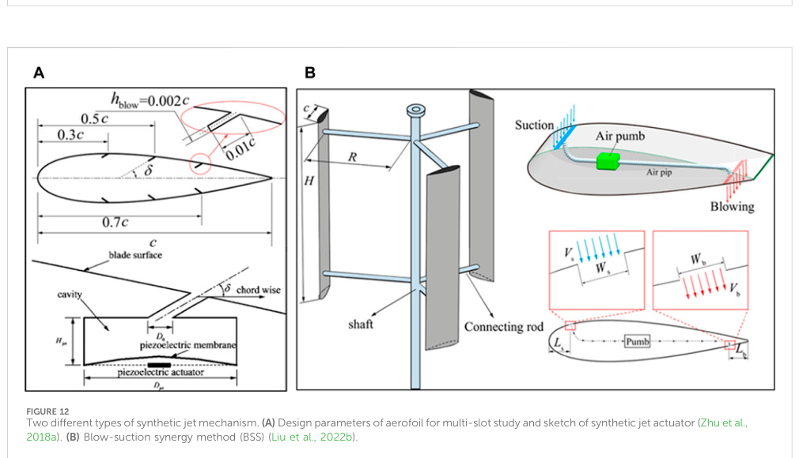
Original caption: FIGURE 12.
Two different types of synthetic jet mechanism.
(A) Design parameters of aerofoil for multi-slot study and sketch of synthetic jet actuator (Zhu et al., 2018a).
(B) Blow-suction synergy method (BSS) (Liu et al., 2022b).
[[vj18|Source]]
Two different types of synthetic jet mechanism.
(A) Design parameters of aerofoil for multi-slot study and sketch of synthetic jet actuator (Zhu et al., 2018a).
(B) Blow-suction synergy method (BSS) (Liu et al., 2022b).

curvature increases, accelerating fluid flow and improving selfstarting capabilities.
With a constant m diameter, improvements range from 6% to 112% across deformation amplitudes (Bouzaher, 2022).
Marinić-Kragić et al.
(Marinić-Kragić et al., 2019) achieved a 26% improvement (CP = 0.28) with a flexible system at TSR = 0.9.
In contrast to prior systems (Bouzaher, 2022; Bouzaher and Guerira, 2022), this study used an elastic material, allowing vanes to deform and create expansion and contraction.
Plastic reinforced with glass fibers was employed for flexibility, possessing mechanical properties of E = 30 GPa, ν = 0.28, and ρ = 1,600 kg/m³.
Vortex magnitudes remained constant, but CP increased due to a widened pressure difference at θ = 90°, where maximum deformation and power generation occurred.
The material’s mechanical properties were the main limiting factor, and a rotational speed modulator was proposed to maintain safe operational conditions beyond the material’s stress capacity.
Another similar concept of deformable variable Savonius investigated by (Sobczak et al., 2020; Marchewka et al., 2021), enhancing turbine power performance by 90% compared to a fixed Savonius (Figure 13C).
CFD results indicated maximum deformation between θ of 45° and 180°, with the highest CP recorded at θ = 105° and an eccentricity of 15%.
A maximum CP was recorded at θ = 105 ° with an eccentricity of 15%.
Like the previous study, increased pressure distribution resulted from the expansion of the advancing vane and contraction of the retreating vane.
Flow characteristics remained relatively stagnant (Marinić- Kragić et al., 2019; Sobczak et al., 2020; Marchewka et al., 2021).
Although, patented (Obidowski et al., 2019), experiments are pending.
For Darrieus VAWT, improvements were observed at low TSR conditions (Fadil et al., 2020; Abdolahifar et al., 2023; Pietrykowski et al., 2023; Abdolahifar et al., 2023) found a drop in performance at low and high TSRs (0.69≤λ ≤1.5) with a V-shaped blade turbine, attributing it to violent non-uniform vortex separation due to the aerofoil shape.
Helical and H-VAWTs exhibited 42% and 54.4% higher torque, respectively, than the V-shaped blade with twist.
However, Pietrykowski et al.
(Pietrykowski et al., 2023) reported improved power generation with a variable swept area design
(Figure 13D), showed an optimum CP = 0.08 at low TSR
(0.3–0.4).
The swept area increased at lower wind speeds (0.785 m2) and decreased at higher speeds (0.285 m2) with θ at 120° and 30°, respectively.
Operational TSR ranged from 0.1 to 0.6.
Manufacturing complexities are the main downside.
If costs are reasonable and materials durable, there is a potential for commercialisation.
Further studies on control can expedite implementations.
In comparison, the reviewed expandable Savonius design is currently more suitable for low wind conditions.

## 4 Analysis of variable designs

The review summarizes various designs in Table 3, comparing them based on CP increase.
The complexity is defined by the number
FIGURE 13
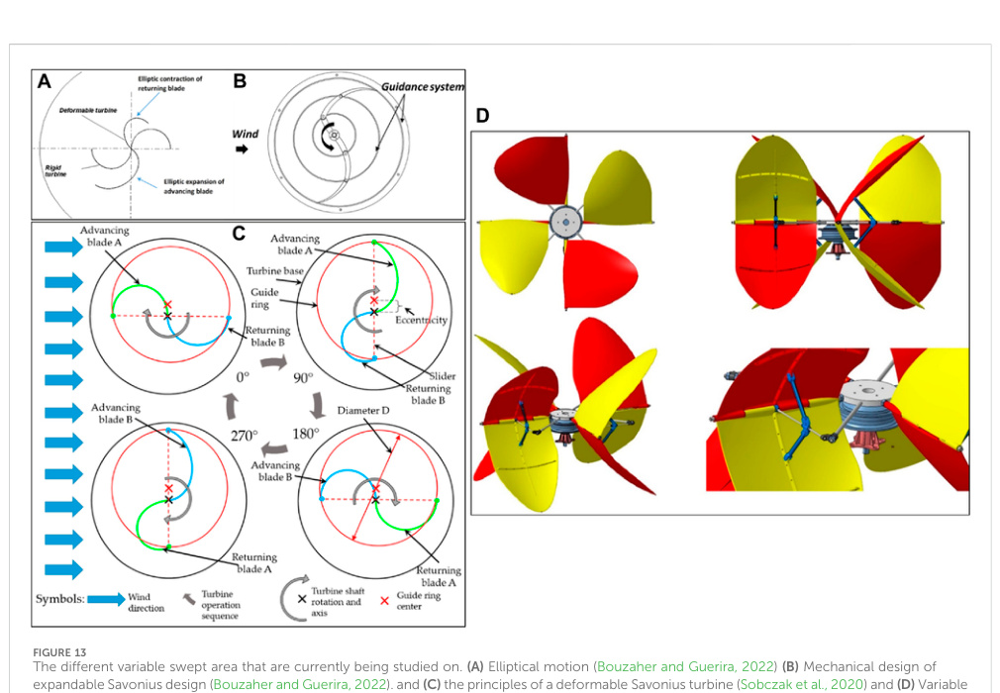
Original caption: FIGURE 13.
The different variable swept area that are currently being studied on.
(A) Elliptical motion (Bouzaher and Guerira, 2022) (B) Mechanical design of expandable Savonius design (Bouzaher and Guerira, 2022).
and (C) the principles of a deformable Savonius turbine (Sobczak et al., 2020) and (D) Variable swept area VAWT (Pietrykowski et al., 2023).
[[vj18|Source]]
The different variable swept area that are currently being studied on.
(A) Elliptical motion (Bouzaher and Guerira, 2022) (B) Mechanical design of expandable Savonius design (Bouzaher and Guerira, 2022).
and (C) the principles of a deformable Savonius turbine (Sobczak et al., 2020) and (D) Variable swept area VAWT (Pietrykowski et al., 2023).

of moving parts provided at the readers’ convenience.
However, to gauge the true productivity potential of these variable methods, a cost-benefit analysis will be conducted from production to end-oflife.
Realistic manufacturing processes are excluded due to the absence of attainable data on market preferences.
Nevertheless, this analysis provides engineers with a sufficient holistic overview and understanding of the developmental stages of these variable designs.

## 5 Future perspective

The review underscores performance improvements in VAWTs through variable designs, but commercialization awaits additional evidence.
Future research directions in variable methods for VAWTs are outlined in the conclusion.
• Numerical studies lack practical implementation details, omitting factors like mechanical losses and real-world challenges.
Future research, involving wind tunnel experiments and real-world implementation, is necessary to address the limitations of variable VAWTs comprehensively.
• Variable mechanism complexity will be highly influential for a variable method to realise commercialisation characterising the ease of implementation, manufacturing, maintenance and cost effectiveness.
It will be crucial for low wind turbines.
• Deforming aerofoil is a potential viable method as it requires no added mechanical control system for passive control designs.
However, material exploration should be conducted to determine the right material strengths and properties to be use for VAWT.
UV damage and material recyclability should be included in designing process.
• As for other variable methods too, should investigate alternative materials that can be lighter, higher stress tolerances and sustainable to be replaced.
• VP-VAWTs can be an effective method for turbine storm protection.
More studies can be done to investigate the efficiency passive aerodynamic braking with this method.
Integration of this variable method can be investigated for large VAWTs.
• Although, variable solidity by (Huang et al., 2023; Tong et al., 2023) found to have good potential due to its simplicity and had proven, but more evidence is required to deeper understand this variable method.
• Combination of variable methods can be investigated.
A passively deformable aerofoil coupled with a variable solidity can be seen as a good combination to optimise flow of the turbine whilst extracting the most energy from low to high wind speeds.
• Investigations to merry flow augmentation methods like (Wong et al., 2017; Wong et al., 2018a; Wong et al., 2018b; Wang et al., 2022) with variable designs to enhance power generation especially at low wind speed regions.
• Field testing and validation will give engineers a deeper understanding to the actual performance values when turbines are subjected to varying wind speeds and weather conditions.
Many unforeseen weaknesses can be rooted out during this process that may influence final costings and sustainability.
• The use of artificial intelligence can be implemented to shorten the duration of studies in improving and optimising the variable design factors like pitch control (Abdalrahman et al., 2017), design of a Savonius VAWT (Teksin et al., 2022) and pattern trends of blade designs on VAWT (Noman et al., 2022).

## 6 Conclusion

The increasing demand for VAWTs in the wind energy market suggests significant potential for variable designs to enhance turbine performance and reduce aerodynamic losses by minimising stall effects and size of vortex eddies.
The following outlines conclusions drawn from a review of methodologies in prior state-of-theart studies.
TABLE 3 Summary analysis of variable methods.
Variable designs TSR range Efficiency CP (%) No.
of joints Notes Variable Pitch 0.4 −4.5 13%–78.9% ≥10
- Better self-start
- Storm mitigation safety
- Complex control design
Adaptive Flap 0.25 −2.4 10%–54% 1 −5
- Enhanced self-starting
- Recirculation mitigation
Gurney Flap 0 – 3.29 2.7%–37.5% 1 −2
- c-dimple-GF is promising
- Delay BL separation
- Good for low wind conditions
Deforming Aerofoil 0.6 −1.9 8%–46.2% 0 −≥10
- Complex materials and composites
Movable Mass Blocks 0 – 3.5 - ≥3 −97.1% reduction of radial loading −40.6% decreased in self-starting Synthetic Jet 1.44 – 3.3 15.2%–32.16% 1 −2
- Delay flow separation
- Delay dynamic stalling
- Motor size concern
Swept Area 0.3 – 1.0 8%–90% 0 −≥10
- Good for low wind speeds

(1) VP-turbines hold strong commercialization potential due to
progressing from numerical studies to mechanical designs.
It demonstrates self-starting capabilities, significant aerodynamic improvements, and increased power generation.
There’s potential for use as a storm protection system, preventing the turbine from operating beyond its capabilities.
However, a downside is the potential for drastic and intrusive pitch changes during intervals, which may damage the turbine.
Performance improved between 20% and 50%.
Active and passive control shown great advantages with minimal differences.
As for passive controls, sinusoidal control method had shown to outperform other systems.
(2) Adaptive flaps break down trailing edge vortices, reducing
wake disturbances and improving power yield in the downwind section.
While common in aviation, this approach is relatively new in VAWT technology.
Active control may be more effective for this variable method, with multiple flaps towards the blade’s trailing edge proving more effective than a single flap.
Flap angle operational range should be between 20° and 50° depending on the AoA.
The maximum recorded improvement was mentioned to be 54%.
(3) GF control enhances pressure distribution at the trailing edge
by slowing incoming flow velocity, creating separation bubbles that reattach the flow.
Additional modifications, such as inward dimples, can be combined with GFs.
A small sensor initiates the motor and varies the GF, making a smaller flap a cost-effective method due to the reduced force needed to change the GF’s angle.
GF-dimple places at the outboard improved more by 5.8% than inboard dimples.
Early initiation of GF-dimples will inhibit self-starting capabilities.
(4) A deformable aerofoil offers promising passive control for
small, low wind speed turbines.
The use of elastic material reduces moving parts, increasing aerodynamic stall mitigation in investigations.
The properties of the elastic material play a crucial role in the turbine’s performance, flexibility, weight, durability, and potential costs.
Performance improvement was seen to be ranged between
9.6% and 90% with E = 0.5 MPa and 0.4 MPa.
Active control
deformation also seen an increase by 35% however, the significance from complexity of mechanism to power the control system and maintenance have not been explored.
(5) Moveable mass blocks, controlled by centrifugal forces,
reduce shaft fatigue to only 1% damage, extending the turbine’s operational life, without aerodynamic improvements.
The mass of the blocks used were 0.065 g on each of the turbine strut.
(6) The synthetic jet, with suction and blowing slots, prevents
flow separation, delays dynamic stall, and enhances turbine performance.
LE edge slots positioned around 8.5% of the chord had proven to have positive impact.
TE slots had an opposite effect reducing performance up to 208% recorded.
Control system development is ongoing.
(7) Expandable Savonius turbines, using elastic materials and
segmented vanes for adjustable operation, hold promise for boosting power generation in low wind speed conditions.
The working mechanics resemble those of a deformable aerofoil.
Author contributions K-YL: Formal Analysis, Investigation, Writing–original draft.
AC: Conceptualization, Methodology, Supervision, Writing–review and editing.
J-HN: Supervision, Writing–review and editing.
K-HW: Conceptualization, Funding acquisition, Project administration, Supervision, Writing–review and editing.
Funding The author(s) declare that financial support was received for the
research, authorship, and/or publication of this article.
This research
was funded by the Ministry of Higher Education Malaysia through the Fundamental Research Grant Scheme (FRGS), grant number
FRGS/1/2020/TK0/USMC/02/3.
Conflict of interest The authors declare that the research was conducted in the absence of any commercial or financial relationships that could be construed as a potential conflict of interest.
Publisher’s note All claims expressed in this article are solely those of the authors and do not necessarily represent those of their affiliated organizations, or those of the publisher, the editors and the reviewers.
Any product that may be evaluated in this article, or claim that may be made by its manufacturer, is not guaranteed or endorsed by the publisher.

## References

Abdalkarem, A.
A.
M., Abdullah, A.
F., Sopian, K., Haw, L.
C., Muzammil, W.
K., and Wong, K.
H.
(2023).
The effect of trailing-edge wedge-tails on the aerodynamic characteristics of wind turbine airfoil.
IOP Conf.
Ser.
Mater.
Sci.
Eng.
1278 (1),
012011.
doi:10.1088/1757-899x/1278/1/012011
Abdalrahman, G., Melek, W., and Lien, F.-S.
(2017).
Pitch angle control for a smallscale Darrieus vertical axis wind turbine with straight blades (H-Type VAWT).
Renew.
Energy 114, 1353–1362.
doi:10.1016/j.renene.2017.07.068 Abdolahifar, A., Azizi, M., and Zanj, A.
(2023).
Flow structure and performance analysis of Darrieus vertical axis turbines with swept blades: a critical case study
on V-shaped blades.
Ocean.
Eng.
280, 114857.
doi:10.1016/j.oceaneng.2023.
114857 Aboelezz, A., Ghali, H., Elbayomi, G., and Madboli, M.
(2022).
A novel VAWT passive flow control numerical and experimental investigations: guided Vane Airfoil
Wind Turbine.
Ocean.
Eng.
257, 111704.
doi:10.1016/j.oceaneng.2022.111704
Aslam Bhutta, M.
M., Hayat, N., Farooq, A.
U., Ali, Z., Jamil, S.
R., and Hussain, Z.
(2012).
Vertical axis wind turbine – a review of various configurations and design techniques.
Renew.
Sustain.
Energy Rev.
16 (4), 1926–1939.
doi:10.1016/j.rser.2011.
12.004 Awaja, F., Nguyen, M.-T., Zhang, S., and Arhatari, B.
(2011).
The investigation of inner structural damage of UV and heat degraded polymer composites using X-ray micro CT.
Compos.
Part A Appl.
Sci.
Manuf.
42 (4), 408–418.
doi:10.1016/j.compositesa.
2010.12.015

Azadani, L.
N., and Saleh, M.
(2022).
Effect of blade aspect ratio on the performance of a pair of vertical axis wind turbines.
Ocean.
Eng.
265, 112627.
doi:10.1016/j.oceaneng.
2022.112627 Baghdadi, M., Elkoush, S., Akle, B., and Elkhoury, M.
(2020).
Dynamic shape optimization of a vertical axis wind turbine via blade morphing technique.
Renew.
Energy 154, 239–251.
doi:10.1016/j.renene.2020.03.015 Battisti, L.
(2021).
Design options to improve the dynamic behavior and the
control of small H-Darrieus VAWTs.
Appl.
Sci.
11 (19), 9222.
doi:10.3390/
app11199222 Bechert, D., Bruse, M., Hage, W., Meyer, R., Bechert, D., Bruse, M., et al.
(1997).
“Biological surfaces and their technological application - laboratory and flight experiments on drag reduction and separation control,” in 28th Fluid Dynamics Conference (AIAA).
Belabes, B., and Paraschivoiu, M.
(2021).
Numerical study of the effect of turbulence intensity on VAWT performance.
Energy 233, 121139.
doi:10.1016/j.energy.2021.121139 Benedict, M., Lakshminarayan, V., Pino, J., and Chopra, I.
(2013).
“Fundamental understanding of the physics of a small-scale vertical Axis wind turbine with dynamic blade pitching: an experimental and computational approach,” in 54th AIAA/ASME/
ASCE/AHS/ASC Structures, Structural Dynamics, and Materials Conference
(AIAA).
Bianchini, A., Balduzzi, F., Di Rosa, D., and Ferrara, G.
(2019).
On the use of Gurney Flaps for the aerodynamic performance augmentation of Darrieus wind turbines.
Energy Convers.
Manag.
184, 402–415.
doi:10.1016/j.enconman.2019.01.068 Bianchini, A., Balduzzi, F., Ferrara, G., and Ferrari, L.
(2016).
Virtual incidence effect on rotating airfoils in Darrieus wind turbines.
Energy Convers.
Manag.
111, 329–338.
doi:10.1016/j.enconman.2015.12.056
Bianchini, A., Ferrara, G., and Ferrari, L.
(2015).
Pitch optimization in small-size Darrieus wind turbines.
Energy Procedia 81, 122–132.
doi:10.1016/j.egypro.2015.12.067 Bontempo, R., Carandente, R., and Manna, M.
(2021).
A design of experiment approach as applied to the analysis of diffuser-augmented wind turbines.
Energy
Convers.
Manag.
235, 113924.
doi:10.1016/j.enconman.2021.113924
Bornengo, D., Scarpa, F., and Remillat, C.
(2005).
Evaluation of hexagonal chiral structure for morphing airfoil concept.
Proc.
Institution Mech.
Eng.
Part G J.
Aerosp.
Eng.
219 (3), 185–192.
doi:10.1243/095441005x30216 Bouzaher, M.
T.
(2022).
Effect of flexible blades on the Savonius wind turbine performance.
J.
Braz.
Soc.
Mech.
Sci.
Eng.
44 (2), 60.
doi:10.1007/s40430-022-03374-5 Bouzaher, M.
T., and Guerira, B.
(2022).
Computational investigation on the influence of expandable blades on the performance of a Savonius wind turbine.
J.
Sol.
Energy Eng.
144 (6).
doi:10.1115/1.4054395
Bouzaher, M.
T., and Hadid, M.
(2017).
Numerical investigation of a vertical Axis tidal turbine with deforming blades.
Arabian J.
Sci.
Eng.
42 (5), 2167–2178.
doi:10.1007/ s13369-017-2511-5 Bouzaher, M.
T., Hadid, M., and Semch-Eddine, D.
(2016).
Flow control for the vertical axis wind turbine by means of flapping flexible foils.
J.
Braz.
Soc.
Mech.
Sci.
Eng.
39 (2), 457–470.
doi:10.1007/s40430-016-0618-3 Bramesfeld, G., and Maughmer, M.
D.
(2002).
Experimental investigation of selfactuating, upper-surface, high-lift-enhancing effectors.
J.
Aircr.
39 (1), 120–124.
doi:10.
2514/2.2905
Brusca, S., Lanzafame, R., and Messina, M.
(2014).
Design of a vertical axis wind turbine: how the aspect ratio affects the turbine’s performance.
Int.
J.
Energy Environ.
Eng.
5 (4), 333–340.
doi:10.1007/s40095-014-0129-x Burton, T., Sharpe, D., Jenkins, N., and Bossanyi, E.
(2001).
Wind energy handbook.
John Wiley and Sons.
Camporeale, S.
M., and Magi, V.
(2000).
Streamtube model for analysis of vertical axis variable pitch turbine for marine currents energy conversion.
Energy Convers.
Manag.
41 (16), 1811–1827.
doi:10.1016/s0196-8904(99)00183-1 Capuzzi, M., Pirrera, A., and Weaver, P.
M.
(2014).
A novel adaptive blade concept for large-scale wind turbines.
Part I: aeroelastic behaviour.
Energy 73, 15–24.
doi:10.1016/j.
energy.2014.06.044 Carrigan, T.
J., Dennis, B.
H., Han, Z.
X., and Wang, B.
P.
(2012).
Aerodynamic shape optimization of a vertical Axis wind turbine using differential evolution.
ISRN Renew.
Energy 2012, 1–16.
doi:10.5402/2012/528418 Castelli, M.
R., Dal Monte, A., Quaresimin, M., and Benini, E.
(2013).
Numerical evaluation of aerodynamic and inertial contributions to Darrieus wind turbine blade deformation.
Renew.
Energy 51, 101–112.
doi:10.1016/j.renene.2012.07.025 Cavens, W.
D.
K., Chopra, A., and Arrieta, A.
F.
(2020).
Passive load alleviation on wind turbine blades from aeroelastically driven selectively compliant morphing.
Wind Energy 24 (1), 24–38.
doi:10.1002/we.2555 Chakroun, Y., and Bangga, G.
(2021).
Aerodynamic characteristics of airfoil and vertical Axis wind turbine employed with gurney flaps.
Sustainability 13 (8), 4284.
doi:10.3390/su13084284
Chao, L.-M., Pan, G., Zhang, D., and Yan, G.-X.
(2019).
Numerical investigations on the force generation and wake structures of a nonsinusoidal pitching foil.
J.
Fluids Struct.
85, 27–39.
doi:10.1016/j.jfluidstructs.2018.12.002 Chen, C.-C., and Kuo, C.-H.
(2012).
Effects of pitch angle and blade camber on flow characteristics and performance of small-size Darrieus VAWT.
J.
Vis.
16 (1), 65–74.
doi:10.1007/s12650-012-0146-x
Chen, L., Xu, J., and Dai, R.
(2020).
Numerical prediction of switching gurney flap effects on straight bladed VAWT power performance.
J.
Mech.
Sci.
Technol.
34 (12), 4933–4940.
doi:10.1007/s12206-020-2106-z D, A., and Singh, I.
(2016).
Self-adaptive flaps on low aspect ratio wings at low Reynolds numbers.
Aerosp.
Sci.
Technol.
59, 78–93.
doi:10.1016/j.ast.2016.10.006 Dai, J., Hu, W., and Shen, X.
(2017).
Load and dynamic characteristic analysis of wind turbine flexible blades.
J.
Mech.
Sci.
Technol.
31 (4), 1569–1580.
doi:10.1007/s12206- 017-0304-0 Danao, L.
A., Qin, N., and Howell, R.
(2012).
A numerical study of blade thickness and camber effects on vertical axis wind turbines.
Proc.
Institution Mech.
Eng.
Part A J.
Power Energy 226 (7), 867–881.
doi:10.1177/0957650912454403 Daynes, S., and Weaver, P.
M.
(2012a).
A morphing trailing edge device for a wind turbine.
J.
Intelligent Material Syst.
Struct.
(6), 691–701.
doi:10.1177/
1045389x12438622 Daynes, S., and Weaver, P.
M.
(2012b).
Design and testing of a deformable wind turbine blade control surface.
Smart Mater.
Struct.
21 (10), 105019.
doi:10.1088/0964-
1726/21/10/105019
De Tavernier, D., Ferreira, C., and Bussel, G.
(2019).
Airfoil optimisation for verticalaxis wind turbines with variable pitch.
Wind Energy 22 (4), 547–562.
doi:10.1002/we.
2306 Elkhoury, M., Kiwata, T., and Aoun, E.
(2015).
Experimental and numerical investigation of a three-dimensional vertical axis wind turbine with variablepitch.
J.
Wind Eng.
Industrial Aerodynamics 139, 111–123.
doi:10.1016/j.jweia.
2015.01.004 Elsakka, M.
M.
(2020).
The aerodynamics of fixed and variable pitch vertical Axis wind turbines.
University of Sheiffield.
El-Samanoudy, M., Ghorab, A.
A.
E., and Youssef, S.
Z.
(2010).
Effect of some design parameters on the performance of a Giromill vertical axis wind turbine.
Ain Shams Eng.
J.
1 (1), 85–95.
doi:10.1016/j.asej.2010.09.012 Erickson, D., Wallace, J., and Peraire, J.
(2012).
Performance characterization of cyclic blade pitch variation on a vertical Axis wind turbine.
AIAA J.
49, 23.
doi:10.2514/6.
2011-638 Esfahani, J.
A., Barati, E., and Karbasian, H.
R.
(2015).
Fluid structures of flapping airfoil with elliptical motion trajectory.
Comput.
Fluids 108, 142–155.
doi:10.1016/j.
compfluid.2014.12.002 Fadil, J., Soedibyo, S., and Ashari, M.
(2020).
Novel of vertical Axis wind turbine with variable swept area using fuzzy logic controller.
Int.
J.
Intelligent Eng.
Syst.
13 (3), 256–267.
doi:10.22266/ijies2020.0630.24 Fichera, S., Isnardi, I., and Mottershead, J.
E.
(2019).
High-bandwidth morphing actuator for aeroelastic model control.
Aerospace (2), 13.
doi:10.3390/
aerospace6020013 Fiedler, A.
J., and Tullis, S.
(2009).
Blade offset and pitch effects on a high solidity vertical Axis wind turbine.
Wind Eng.
(3), 237–246.
doi:10.1260/
030952409789140955 Giguere, P., Lemay, J., and Dumas, G.
(1995).
“Gurney flap effects and scaling for lowspeed airfoils,” in 13th Applied Aerodynamics Conference (AIAA).
Guevara, P., Rochester, P., and Vijayaraghavan, K.
(2021).
Optimization of active blade pitching of a vertical axis wind turbine using analytical and CFD based
metamodel.
J.
Renew.
Sustain.
Energy 13 (2).
doi:10.1063/5.0026591
Guo, Y., Li, X., Sun, L., Gao, Y., Gao, Z., and Chen, L.
(2019).
Aerodynamic analysis of a step adjustment method for blade pitch of a VAWT.
J.
Wind Eng.
Industrial Aerodynamics 188, 90–101.
doi:10.1016/j.jweia.2019.02.023 Hand, B., Kelly, G., and Cashman, A.
(2021).
Aerodynamic design and performance parameters of a lift-type vertical axis wind turbine: a comprehensive review.
Renew.
Sustain.
Energy Rev.
139, 110699.
doi:10.1016/j.rser.2020.110699
Hao, W., Ding, Q., and Li, C.
(2019).
Optimal performance of adaptive flap on flow separation control.
Comput.
Fluids 179, 437–448.
doi:10.1016/j.compfluid.2018.
11.010 Hao, W., and Li, C.
(2020).
Performance improvement of adaptive flap on flow separation control and its effect on VAWT.
Energy 213, 118809.
doi:10.1016/j.energy.
2020.118809 Hao, W., Li, C., Ye, Z., Yang, J., and Ding, Q.
(2017).
Computational study on wind turbine airfoils based on active control for deformable flaps.
J.
Mech.
Sci.
Technol.
31 (2), 565–575.
doi:10.1007/s12206-017-0109-1 Hassan, S.
M.
R., Ali, M., and Islam, M.
Q.
(2016).
“The effect of solidity on the performance of H-rotor Darrieus turbine,” in AIP Conference Proceedings (AIP Publishing).
Hoke, C.
M., Young, J., and Lai, J.
C.
S.
(2015).
Effects of time-varying camber deformation on flapping foil propulsion and power extraction.
J.
Fluids Struct.
56, 152–176.
doi:10.1016/j.jfluidstructs.2015.05.001

Hoogedoorn, E., Jacobs, G.
B., and Beyene, A.
(2010).
Aero-elastic behavior of a flexible blade for wind turbine application: a 2D computational study.
Energy 35 (2), 778–785.
doi:10.1016/j.energy.2009.08.030 Horb, S., Fuchs, R., Immas, A., Silvert, F., and Deglaire, P.
(2018).
Variable pitch control for vertical axis wind turbines.
Wind Eng.
42 (2), 128–135.
doi:10.1177/ 0309524x18756972 Huang, D., and Wu, G.
(2013).
Preliminary study on the aerodynamic characteristics of an adaptive reconfigurable airfoil.
Aerosp.
Sci.
Technol.
27 (1), 44–48.
doi:10.1016/j.
ast.2012.06.005 Huang, H., Luo, J., and Li, G.
(2023).
Study on the optimal design of vertical axis wind turbine with novel variable solidity type for self-starting capability and aerodynamic
performance.
Energy 271, 127031.
doi:10.1016/j.energy.2023.127031
Hwang, I.
S., Lee, Y.
H., and Kim, S.
J.
(2009).
Optimization of cycloidal water turbine and the performance improvement by individual blade control.
Appl.
Energy 86 (9), 1532–1540.
doi:10.1016/j.apenergy.2008.11.009 Islam, M., Fartaj, A., and Carriveau, R.
(2008a).
Analysis of the design parameters related to a fixed-pitch straight-bladed vertical Axis wind turbine.
WIND Eng.
32, 491–507.
doi:10.1260/030952408786411903 Islam, M., Ting, D., and Fartaj, A.
(2008b).
Aerodynamic models for Darrieus-type straight-bladed vertical axis wind turbines.
Renew.
Sustain.
Energy Rev.
12 (4), 1087–1109.
doi:10.1016/j.rser.2006.10.023 Ismail, M.
F., and Vijayaraghavan, K.
(2015).
The effects of aerofoil profile modification on a vertical axis wind turbine performance.
Energy 80, 20–31.
doi:10.
1016/j.energy.2014.11.034
Jain, P., and Abhishek, A.
(2016).
Performance prediction and fundamental understanding of small scale vertical axis wind turbine with variable amplitude blade pitching.
Renew.
Energy 97, 97–113.
doi:10.1016/j.renene.2016.05.056 Jakubowski, M., Starosta, R., and Fritzkowski, P.
(2017).
Kinematics of a vertical axis wind turbine with a variable pitch angle in AIP Conference Proceedings (AIP Publishing).
Kerho, M.
(2007).
Adaptive airfoil dynamic stall control.
J.
Aircr.
44 (4), 1350–1360.
doi:10.2514/1.27050
Kernstine, K.
H., Moore, C.
J., Cutler, A., and Mittal, R.
(2008).
Initial characterization of self-activated movable flaps, pop-up feathers.
AIAA J.
46.
doi:10.2514/6.2008-369 Kinzel, M., Mulligan, Q., and Dabiri, J.
O.
(2012).
Energy exchange in an array of vertical axis wind turbines.
J.
Turbul.
13, N38.
doi:10.1080/14685248.2012.712698 Kirke, B.
K., and Lazauskas, L.
(2011).
Limitations of fixed pitch Darrieus hydrokinetic turbines and the challenge of variable pitch.
Renew.
Energy 36 (3), 893–897.
doi:10.1016/j.renene.2010.08.027 Kiwata, T., Yamada, T., Kita, T., Takata, S., Komatsu, N., and Kimura, S.
(2010).
Performance of a vertical Axis wind turbine with variable-pitch straight blades utilizing a linkage mechanism.
J.
Environ.
Eng.
5 (1), 213–225.
doi:10.1299/jee.5.213 Knight, M., and Bamber, M.
J.
(1929).
“Wind tunnel tests on airfoil boundary layer control using a backward-opening slot,”.
Report No.
385 in Nasional advisory committee for Aeronautics (NACA).
Lachenal, X., Daynes, S., and Weaver, P.
M.
(2013).
Review of morphing concepts and materials for wind turbine blade applications.
Wind Energy 16 (2), 283–307.
doi:10.
1002/we.531
Lazauskas, L., and Kirke, B.
K.
(2012).
Modeling passive variable pitch cross flow hydrokinetic turbines to maximize performance and smooth operation.
Renew.
Energy 45, 41–50.
doi:10.1016/j.renene.2012.02.005 Lee, T.
(2009).
Aerodynamic characteristics of airfoil with perforated gurney-type flaps.
J.
Aircr.
46 (2), 542–548.
doi:10.2514/1.38474 Leonczuk Minetto, R.
A., and Paraschivoiu, M.
(2020).
Simulation based analysis of morphing blades applied to a vertical axis wind turbine.
Energy 202, 117705.
doi:10.
1016/j.energy.2020.117705
Li, C., Xiao, Y., Xu, Y., Peng, Y., Hu, G., and Zhu, S.
(2018).
Optimization of blade pitch in H-rotor vertical axis wind turbines through computational fluid dynamics simulations.
Appl.
Energy 212, 1107–1125.
doi:10.1016/j.apenergy.2017.12.035 Li, D., Li, C., Zhang, W., and Zhu, H.
(2021).
Effect of building diffusers on aerodynamic performance for building augmented vertical axis wind turbine.
J.
Renew.
Sustain.
Energy 13 (2).
doi:10.1063/5.0025742
Li, Q., Maeda, T., Kamada, Y., Murata, J., Furukawa, K., and Yamamoto, M.
(2015).
Effect of number of blades on aerodynamic forces on a straight-bladed Vertical Axis Wind Turbine.
Energy 90, 784–795.
doi:10.1016/j.energy.2015.07.115 Li, Y., Wang, J., and Zhang, P.
(2002).
Effects of gurney flaps on a NACA0012 airfoil.
Flow, Turbul.
Combust.
68, 27–39.
doi:10.1023/a:1015679408150 Liebeck, R.
H.
(1978).
Design of subsonic airfoils for high lift.
J.
Aircr.
15 (9), 547–561.
doi:10.2514/3.58406
Liu, Q., Miao, W., Bashir, M., Xu, Z., Yu, N., Luo, S., et al.
(2022b).
Aerodynamic and aeroacoustic performance assessment of a vertical axis wind turbine by synergistic effect of blowing and suction.
Energy Convers.
Manag.
271, 116289.
doi:10.1016/j.enconman.
2022.116289 Liu, Q., Miao, W., Li, C., Hao, W., Zhu, H., and Deng, Y.
(2019).
Effects of trailingedge movable flap on aerodynamic performance and noise characteristics of VAWT.
Energy 189, 116271.
doi:10.1016/j.energy.2019.116271
Liu, Q., Miao, W., Ye, Q., and Li, C.
(2022a).
Performance assessment of an innovative Gurney flap for straight-bladed vertical axis wind turbine.
Renew.
Energy 185, 1124–1138.
doi:10.1016/j.renene.2021.12.098 Liu, W., and Xiao, Q.
(2015).
Investigation on Darrieus type straight blade vertical axis wind turbine with flexible blade.
Ocean.
Eng.
110, 339–356.
doi:10.1016/j.oceaneng.
2015.10.027 MacPhee, D., and Beyene, A.
(2013).
Fluid-structure interaction of a morphing symmetrical wind turbine blade subjected to variable load.
Int.
J.
Energy Res.
37 (1), 69–79.
doi:10.1002/er.1925 MacPhee, D., and Beyene, A.
(2016a).
“The straight bladed morphing vertical axis wind turbine,” in ASME 2016 Power Conference (Charlotte, North Carolina, USA: ASME).
MacPhee, D.
W., and Beyene, A.
(2016b).
Fluid–structure interaction analysis of a morphing vertical axis wind turbine.
J.
Fluids Struct.
60, 143–159.
doi:10.1016/j.
jfluidstructs.2015.10.010 MacPhee, D.
W., and Beyene, A.
(2019).
Performance analysis of a small wind turbine equipped with flexible blades.
Renew.
Energy 132, 497–508.
doi:10.1016/j.renene.2018.
08.014 Manfrida, G., and Talluri, L.
(2020).
Smart pro-active pitch adjustment for VAWT blades: potential for performance improvement.
Renew.
Energy 152, 867–875.
doi:10.
1016/j.renene.2020.01.021
Manwell, J.
F.
(2009).
Wind energy explained: theory, design and application.
2nd ed.
John Wiley and Sons, Inc.
Manwell JgmaALR, J.
F.
(2009).
Wind energy explained: theory, design and application.
Second Edition.
John Wiley and Sons.
Marchewka, E., Sobczak, K., Reorowicz, P., Obidowski, D.
S., and Jóźwik, K.
(2021).
Application of overset mesh approach in the investigation of the Savonius wind turbines with rigid and deformable blades.
Archives Thermodyn.
42 (4).
doi:10.24425/ather.2021.
139659 Marinić-Kragić, I., Vučina, D., and Milas, Z.
(2019).
Concept of flexible vertical axis wind turbine with numerical simulation and shape optimization.
Energy 167, 841–852.
doi:10.1016/j.energy.2018.11.026
Masdari, M., Mousavi, M., and Tahani, M.
(2020).
Dynamic stall of an airfoil with different mounting angle of gurney flap.
Aircr.
Eng.
Aerosp.
Technol.
92 (7), 1037–1048.
doi:10.1108/aeat-03-2019-0042
Mathew, S., and Philip, G.
S.
(2012).
“Wind turbines: evolution, basic principles, and classifications,” in Comprehensive renewable energy (Elsevier), 104–123.
McKenna, R., Pfenninger, S., Heinrichs, H., Schmidt, J., Staffell, I., Bauer, C., et al.
(2022).
High-resolution large-scale onshore wind energy assessments: a review of potential definitions, methodologies and future research needs.
Renew.
Energy 182, 659–684.
doi:10.1016/j.renene.2021.10.027 Meyer, R., Hage, W., Bechert, D.
W., Schatz, M., Knacke, T., and Thiele, F.
(2007).
Separation control by self-activated movable flaps.
AIAA J.
45 (1), 191–199.
doi:10.2514/ 1.23507 Mitchell, S., Ogbonna, I., and Volkov, K.
(2021).
Improvement of self-starting capabilities of vertical Axis wind turbines with new design of turbine blades.
Sustainability 13 (7), 3854.
doi:10.3390/su13073854
Mo, W., Li, D., Wang, X., and Zhong, C.
(2015).
Aeroelastic coupling analysis of the flexible blade of a wind turbine.
Energy 89, 1001–1009.
doi:10.1016/j.energy.2015.
06.046 Mohamed, M.
H.
(2012).
Performance investigation of H-rotor Darrieus turbine with new airfoil shapes.
Energy 47 (1), 522–530.
doi:10.1016/j.energy.2012.08.044 Mohammed, A.
A., Ouakad, H.
M., Sahin, A.
Z., and Bahaidarah, H.
M.
S.
(2019).
Vertical Axis wind turbine aerodynamics: summary and review of momentum models.
J.
Energy Resour.
Technol.
141 (5).
doi:10.1115/1.4042643
Motta, V., Zanotti, A., Gibertini, G., and Quaranta, G.
(2016).
Numerical assessment of an L-shaped Gurney flap for load control.
Proc.
Institution Mech.
Eng.
Part G J.
Aerosp.
Eng.
231 (5), 951–975.
doi:10.1177/0954410016646512 Myose, R., Heron, I., and Papadakis, M.
(1996).
“Effect of Gurney flaps on a NACA 0011 airfoil,” in 34th Aerospace Sciences Meeting and Exhibit (AIAA).
Nasri, K., Toubal, L., Loranger, É., and Koffi, D.
(2022).
Influence of UV irradiation on mechanical properties and drop-weight impact performance of polypropylene biocomposites reinforced with short flax and pine fibers.
Compos.
Part C.
Open
Access 9, 100296.
doi:10.1016/j.jcomc.2022.100296
Ni, L., Miao, W., Li, C., and Liu, Q.
(2021).
Impacts of Gurney flap and solidity on the aerodynamic performance of vertical axis wind turbines in array configurations.
Energy
215, 118915.
doi:10.1016/j.energy.2020.118915
Ni, Z., Dhanak, M., and Su, T.
(2019).
Improved performance of a slotted blade using a novel slot design.
J.
Wind Eng.
Industrial Aerodynamics 189, 34–44.
doi:10.1016/j.
jweia.2019.03.018

Noman, A.
A., Tasneem, Z., Sahed, M.
F., Muyeen, S.
M., Das, S.
K., and Alam, F.
(2022).
Towards next generation Savonius wind turbine: artificial intelligence in blade design trends and framework.
Renew.
Sustain.
Energy Rev.
168, 112531.
doi:10.1016/j.
rser.2022.112531 Obidowski, D., Sobczak, K., Jozwik, K., and Reorowicz, P.
(2019).
Vertical Axis wind turbine with A variable geometry of blades.
European Patent Application.
Ouro, P., Stoesser, T., and Ramírez, L.
(2018).
Effect of blade cambering on dynamic stall in view of designing vertical Axis turbines.
J.
Fluids Eng.
140 (6).
doi:10.1115/1.
4039235 Paillard, B., Astolfi, J.
A., and Hauville, F.
(2015).
URANSE simulation of an active variable-pitch cross-flow Darrieus tidal turbine: sinusoidal pitch function investigation.
Int.
J.
Mar.
Energy 11, 9–26.
doi:10.1016/j.ijome.2015.03.001 Paillard, B., Hauville, F., and Astolfi, J.
A.
(2013).
Simulating variable pitch crossflow water turbines: a coupled unsteady ONERA-EDLIN model and streamtube model.
Renew.
Energy 52, 209–217.
doi:10.1016/j.renene.2012.10.018 Pankonien, A., Faria, C.
T., and Inman, D.
(2013).
“Synergistic smart morphing aileron,” in 54th AIAA/ASME/ASCE/AHS/ASC Structures, Structural Dynamics, and Materials Conference (AIAA).
Pankonien, A.
M., Duraisamy, K., Faria, C.
T., and Inman, D.
(2014b).
“Synergistic smart morphing aileron: aero-structural performance analysis,” in 22nd AIAA/ASME/ AHS Adaptive Structures Conference (AIAA).
Pankonien, A.
M., Faria, C.
T., and Inman, D.
J.
(2014a).
Synergistic smart morphing aileron: experimental quasi-static performance characterization.
J.
Intelligent Material Syst.
Struct.
26 (10), 1179–1190.
doi:10.1177/1045389x14538530 Pankonien, A.
M., Gamble, L., Faria, C., and Inman, D.
J.
(2016).
“Synergistic smart morphing AIleron: capabilites identification,” in 24th AIAA/AHS Adaptive Structures Conference (AIAA).
Paraschivoiu, I., Trifu, O., and Saeed, F.
(2009).
H-darrieus wind turbine with blade pitch control.
Int.
J.
Rotating Mach.
2009, 1–7.
doi:10.1155/2009/505343 Pavese, C., Tibaldi, C., Zahle, F., and Kim, T.
(2017).
Aeroelastic multidisciplinary design optimization of a swept wind turbine blade.
Wind Energy 20 (12), 1941–1953.
doi:10.1002/we.2131
Pawsey, N.
C.
K.
(2002).
Development and evaluation of passive variable-pitch vertical axis wind turbines.
University of New South Wales.
Peng, H.
Y., Liu, H.
J., and Yang, J.
H.
(2021).
A review on the wake aerodynamics of H-rotor vertical axis wind turbines.
Energy 232, 121003.
doi:10.1016/j.energy.2021.
121003 Pietrykowski, K., Kasianantham, N., Ravi, D., Jan Gęca, M., Ramakrishnan, P., and Wendeker, M.
(2023).
Sustainable energy development technique of vertical axis wind turbine with variable swept area – an experimental investigation.
Appl.
Energy 329,
120262.
doi:10.1016/j.apenergy.2022.120262
Pohl, M., and Riemenschneider, J.
(2022).
Design and laboratory tests of flexible trailing edge demonstrators for wind turbine blades.
Wind Eng.
47, 283–298.
doi:10.
1177/0309524x221126743
Qa, L., Maeda, T., Kamada, Y., Murata, J., Shimizu, K., Ogasawara, T., et al.
(2016).
Effect of solidity on aerodynamic forces around straight-bladed vertical axis wind turbine by wind tunnel experiments (depending on number of blades).
Renew.
Energy 96, 928–939.
doi:10.1016/j.renene.2016.05.054 Rainbird, J.
M., Bianchini, A., Balduzzi, F., Peiró, J., Graham, J.
M.
R., Ferrara, G., et al.
(2015).
On the influence of virtual camber effect on airfoil polars for use in simulations of Darrieus wind turbines.
Energy Convers.
Manag.
106, 373–384.
doi:10.1016/j.
enconman.2015.09.053 Rainone, C., De Siero, D., Iuspa, L., Viviani, A., and Pezzella, G.
(2023).
A numerical procedure for variable-pitch law formulation of vertical Axis wind turbines.
Energies 16
(1), 536.
doi:10.3390/en16010536
Rezaeiha, A., Kalkman, I., and Blocken, B.
(2017).
Effect of pitch angle on power performance and aerodynamics of a vertical axis wind turbine.
Appl.
Energy 197, 132–150.
doi:10.1016/j.apenergy.2017.03.128 Rezaeiha, A., Montazeri, H., and Blocken, B.
(2018a).
Characterization of aerodynamic performance of vertical axis wind turbines: impact of operational parameters.
Energy Convers.
Manag.
169, 45–77.
doi:10.1016/j.enconman.2018.
05.042 Rezaeiha, A., Montazeri, H., and Blocken, B.
(2018b).
Towards optimal aerodynamic design of vertical axis wind turbines: impact of solidity and number of blades.
Energy 165, 1129–1148.
doi:10.1016/j.energy.2018.09.192 Rezaeiha, A., Montazeri, H., and Blocken, B.
(2019).
Active flow control for power enhancement of vertical axis wind turbines: leading-edge slot suction.
Energy 189,
116131.
doi:10.1016/j.energy.2019.116131
Roh, S.-C., and Kang, S.-H.
(2013).
Effects of a blade profile, the Reynolds number, and the solidity on the performance of a straight bladed vertical axis wind turbine.
J.
Mech.
Sci.
Technol.
27 (11), 3299–3307.
doi:10.1007/s12206-013-0852-x Roy, L., Kincaid, K., Mahmud, R., and MacPhee, D.
W.
(2021).
Double-multiple streamtube analysis of a flexible vertical Axis wind turbine.
Fluids 6 (3), 118.
doi:10.
3390/fluids6030118 Sagharichi, A., Ghaghelestani, T.
N., and Toudarbari, S.
(2019).
Impact of harmonic pitch functions on performance of Darrieus wind turbine.
J.
Clean.
Prod.
241, 118310.
doi:10.1016/j.jclepro.2019.118310
Sagharichi, A., Maghrebi, M.
J., and ArabGolarcheh, A.
(2016).
Variable pitch blades: an approach for improving performance of Darrieus wind turbine.
J.
Renew.
Sustain.
Energy 8 (5).
doi:10.1063/1.4964310
Sagharichi, A., Zamani, M., and Ghasemi, A.
(2018).
Effect of solidity on the performance of variable-pitch vertical axis wind turbine.
Energy 161, 753–775.
doi:10.1016/j.energy.2018.07.160
Santamaría, L., Fernández Oro, J.
M., Argüelles Díaz, K.
M., Meana-Fernández, A., Pereiras, B., and Velarde-Suárez, S.
(2022).
Novel methodology for performance characterization of vertical axis wind turbines (VAWT) prototypes through active
driving mode.
Energy Convers.
Manag.
258, 115530.
doi:10.1016/j.enconman.2022.
115530 Sarath Kumar, R., Micha Premkumar, T., Seralathan, S., Dominic Xavier, D., Elumalai, E.
S., Hariram, V., et al.
(2020).
Simulation studies on influence of shape and number of blades on the performance of vertical axis wind turbine.
Mater.
Today Proc.
33, 3616–3620.
doi:10.1016/j.matpr.2020.05.665 Schluter, J.
U.
(2010).
Lift enhancement at low Reynolds numbers using self-activated movable flaps.
J.
Aircr.
47 (1), 348–351.
doi:10.2514/1.46425 Schönborn, A., and Chantzidakis, M.
(2007).
Development of a hydraulic control mechanism for cyclic pitch marine current turbines.
Renew.
Energy 32 (4), 662–679.
doi:10.1016/j.renene.2006.02.004
Sheng, Q., Khalid, S.
S., Xiong, Z., Sahib, G., and Zhang, L.
(2013).
CFD simulation of fixed and variable pitch vertical axis tidal turbine.
J.
Mar.
Sci.
Appl.
12 (2), 185–192.
doi:10.1007/s11804-013-1184-z
Shukla, V., and Kaviti, A.
K.
(2017).
Performance evaluation of profile modifications on straight-bladed vertical axis wind turbine by energy and Spalart Allmaras models.
Energy 126, 766–795.
doi:10.1016/j.energy.2017.03.071 Sobczak, K., Obidowski, D., Reorowicz, P., and Marchewka, E.
(2020).
Numerical investigations of the Savonius turbine with deformable blades.
Energies 13 (14), 3717.
doi:10.3390/en13143717
Somoano, M., and Huera-Huarte, F.
J.
(2022).
Bio-inspired blades with local trailing edge flexibility increase the efficiency of vertical axis wind turbines.
Energy Rep.
8, 3244–3250.
doi:10.1016/j.egyr.2022.02.151 Staelens, Y., Saeed, F., and Paraschivoiu, I.
(2003).
A straight-bladed variable-pitch VAWT concept for improved power generation.
ASME, 9.
Strickland, J.
H., Webster, B.
T., and Nguyen, T.
(1979).
A vortex model of the Darrieus turbine: an analytical and experimental study.
J.
Fluids Eng.
101 (4), 500–505.
doi:10.1115/1.3449018
Su, J., Li, Y., Chen, Y., Han, Z., Zhou, D., Zhao, Y., et al.
(2021).
Aerodynamic performance assessment of φ-type vertical axis wind turbine under pitch motion.
Energy
225, 120202.
doi:10.1016/j.energy.2021.120202
Sun, J., and Huang, D.
(2021).
Numerical investigation of boundary layer suction control positions on airfoils for vertical axis wind turbine.
J.
Mech.
Sci.
Technol.
35 (7), 2903–2914.
doi:10.1007/s12206-021-0614-0 Sun, X., Zhu, J., Li, Z., and Sun, G.
(2021).
Rotation improvement of vertical axis wind turbine by offsetting pitching angles and changing blade numbers.
Energy 215, 119177.
doi:10.1016/j.energy.2020.119177
Syawitri, T.
P., Yao, Y., Yao, J., and Chandra, B.
(2022).
Geometry optimisation of vertical axis wind turbine with Gurney flap for performance enhancement at low, medium and high ranges of tip speed ratios.
Sustain.
Energy Technol.
Assessments 49,
101779.
doi:10.1016/j.seta.2021.101779
Tan, J., and Paraschivoiu, M.
(2017).
“CFD-Based performance analysis of morphing aileron for vertical Axis wind turbines,” in 35th AIAA Applied Aerodynamics Conference (AIAA).
Tavallaeinejad, M., Fereidoooni, A., Païdoussis, M.
P., Grewal, A., and Wickramasinghe, V.
(2022).
An application of cantilevered plates subjected to extremely large amplitude deformations: a self-starting mechanism for vertical axis wind turbines.
J.
Fluids Struct.
113, 103666.
doi:10.1016/j.jfluidstructs.2022.
103666 Teksin, S., Azginoglu, N., and Akansu, S.
O.
(2022).
Structure estimation of vertical axis wind turbine using artificial neural network.
Alexandria Eng.
J.
61 (1), 305–314.
doi:10.1016/j.aej.2021.05.002
Tian, F.-B., Young, J., and Lai, J.
C.
S.
(2014).
Improving power-extraction efficiency of a flapping plate: from passive deformation to active control.
J.
Fluids Struct.
51, 384–392.
doi:10.1016/j.jfluidstructs.2014.07.013 Tong, G., Li, Y., Tagawa, K., and Feng, F.
(2023).
Effects of blade airfoil chord length and rotor diameter on aerodynamic performance of straight-bladed vertical axis wind turbines by numerical simulation.
Energy 265, 126325.
doi:10.1016/j.energy.2022.
126325 Tong, H., and Wang, Y.
(2021).
Experimental study on unsteady aerodynamic characteristics of deformed blades for vertical axis wind turbine.
Renew.
Energy 173, 808–826.
doi:10.1016/j.renene.2021.02.139

Tripp, N.
G., Mirasso, A.
E., and Preidikman, S.
(2018).
Numerical analysis of the influence of inertial loading over morphing trailing edge devices.
J.
Intelligent Material Syst.
Struct.
29 (18), 3533–3549.
doi:10.1177/1045389x18783867 Ung, S.-K., Chong, W.-T., Mat, S., Ng, J.-H., Kok, Y.-H., and Wong, K.-H.
(2022).
Investigation into the aerodynamic performance of a vertical Axis wind turbine with
endplate design.
Energies 15 (19), 6925.
doi:10.3390/en15196925
Villeneuve, T., Winckelmans, G., and Dumas, G.
(2021).
Increasing the efficiency of vertical axis turbines through improved blade support structures.
Renew.
Energy 169, 1386–1401.
doi:10.1016/j.renene.2021.01.092 Wang, C.
H.
J., and Schlüter, J.
(2012).
Stall control with feathers: self-activated flaps on finite wings at low Reynolds numbers.
Comptes Rendus Mécanique 340 (1-2), 57–66.
doi:10.1016/j.crme.2011.11.001
Wang, K., Zou, L., Wang, A., Jiang, Y., and Zhao, P.
(2021).
Wind tunnel test on the effect of solidity on the wake evolution characteristics of twin counter rotating vertical
axis turbines.
J.
Renew.
Sustain.
Energy 13 (2).
doi:10.1063/5.0041419
Wang, W., Caro, S., Bennis, F., and Salinas Mejia, O.
R.
(2012).
“Optimal design of a simplified morphing blade for fixed-speed horizontal Axis wind turbines,” in Volume 3: 38th Design Automation Conference, Parts A and B (ASME), 233–242.
Wang, X.
D., Wang, L.
C., Zhang, X.
M., and Feng, J.
(2011).
Flexible and vibration characteristics simulation for the large megawatt size wind turbine blades.
Adv.
Mater.
Res.
217-218, 363–367.
10.4028/www.scientific.net/amr.217-218.363.
Wang, X.
H., Wong, K.
H., Chong, W.
T., Ng, J.
H., Qiu, C.
J., and Khor, C.
S.
(2022).
Performance evaluation of a downwind diffuser on vertical axis wind turbine.
Int.
J.
Energy Res.
46 (1), 351–369.
doi:10.1002/er.6890 Wang, X.
H., Wong, K.
H., Chong, W.
T., Ng, J.
H., Xiang, X.
B., and Wang, C.
T.
(2020).
Experimental investigation of a diffuser-integrated vertical axis wind turbine.
IOP Conf.
Ser.
Earth Environ.
Sci.
463 (1), 012153.
doi:10.1088/1755-1315/463/1/ 012153 Wang, Y., Sun, X., Dong, X., Zhu, B., Huang, D., and Zheng, Z.
(2016).
Numerical investigation on aerodynamic performance of a novel vertical axis wind turbine with adaptive blades.
Energy Convers.
Manag.
108, 275–286.
doi:10.1016/j.enconman.2015.
11.003 Wang, Y., Tong, H., Sima, H., Wang, J., Sun, J., and Huang, D.
(2019).
Experimental study on aerodynamic performance of deformable blade for vertical axis wind turbine.
Energy 181, 187–201.
doi:10.1016/j.energy.2019.03.181 Whittlesey, R.
W., Liska, S., and Dabiri, J.
O.
(2010).
Fish schooling as a basis for vertical axis wind turbine farm design.
Bioinspir Biomim.
5 (3), 035005.
doi:10.1088/
1748-3182/5/3/035005
Wolff, T., Ernst, B., and Seume, J.
R.
(2014a).
Aerodynamic behavior of an airfoil with morphing trailing edge for wind turbine applications.
J.
Phys.
Conf.
Ser.
524, 012018.
doi:10.1088/1742-6596/524/1/012018
Wolff, T., Ernst, B., and Seume, J.
R.
(2014b).
Aerodynamic behavior of an airfoil with morphing trailing edge for wind turbine applications.
J.
Phys.
Conf.
Ser.
524, 012018.
doi:10.1088/1742-6596/524/1/012018
Wolff, T., and Seume, J.
R.
(2016).
Modeling the transient aerodynamic effects during the motion of a flexible trailing edge.
J.
Phys.
Conf.
Ser.
753, 082038.
doi:10.1088/1742-
6596/753/8/082038
Wong, K.
H., Chong, W.
T., Poh, S.
C., Shiah, Y.-C., Sukiman, N.
L., and Wang, C.-T.
(2018a).
3D CFD simulation and parametric study of a flat plate deflector for vertical axis wind turbine.
Renew.
Energy 129, 32–55.
doi:10.1016/j.renene.2018.05.085 Wong, K.
H., Chong, W.
T., Sukiman, N.
L., Poh, S.
C., Shiah, Y.-C., and Wang, C.-T.
(2017).
Performance enhancements on vertical axis wind turbines using flow augmentation systems: a review.
Renew.
Sustain.
Energy Rev.
73, 904–921.
doi:10.
1016/j.rser.2017.01.160
Wong, K.
H., Chong, W.
T., Sukiman, N.
L., Shiah, Y.-C., Poh, S.
C., Sopian, K., et al.
(2018b).
Experimental and simulation investigation into the effects of a flat plate deflector on vertical axis wind turbine.
Energy Convers.
Manag.
160, 109–125.
doi:10.
1016/j.enconman.2018.01.029
Xiao, Q., Liu, W., and Incecik, A.
(2013).
Flow control for VATT by fixed and oscillating flap.
Renew.
Energy 51, 141–152.
doi:10.1016/j.renene.2012.09.021 Xu, Y.-L., Peng, Y.-X., and Zhan, S.
(2019a).
Variable pitch to high-solidity straightbladed VAWTs for power enhancement.
Energy Procedia 158, 382–387.
doi:10.1016/j.
egypro.2019.01.119 Xu, Y.-L., Peng, Y.-X., and Zhan, S.
(2019b).
Optimal blade pitch function and control device for high-solidity straight-bladed vertical axis wind turbines.
Appl.
Energy 242, 1613–1625.
doi:10.1016/j.apenergy.2019.03.151 Yen, J., and Ahmed, N.
A.
(2013).
Enhancing vertical axis wind turbine by dynamic stall control using synthetic jets.
J.
Wind Eng.
Industrial Aerodynamics 114, 12–17.
doi:10.1016/j.jweia.2012.12.015
Zhang, L., Gu, J., Zhu, H., Hu, K., Li, X., Jiao, L., et al.
(2021a).
Rationality research of the adjustment law for the blade pitch angle of H-type vertical axis wind turbines.
Renew.
Energy 167, 484–496.
doi:10.1016/j.renene.2020.11.104 Zhang, L., Liang, Y., Zhang, F., Wang, Y., Mengm, J., and Wang, H.
(2015).
Design and implementation of straight-bladed vertical axis wind turbine with collective pitch
control.
IEEE.
doi:10.1109/ICMA.2015.7237666
Zhang, L., and Qu, J.
(2021).
Study on aerodynamic performance of a combined vertical axis wind turbine based on blade element momentum theorem.
J.
Renew.
Sustain.
Energy 13 (3).
doi:10.1063/5.0031693
Zhang, L.
J., Miao, J.
J., Gu, J.
W., Li, X., Hu, K.
L., Zhu, H.
B., et al.
(2021b).
A method of reducing the radial load of the shaft of a vertical axis wind turbine based on movable mass blocks.
Renew.
Energy 175, 952–964.
doi:10.1016/j.renene.2021.05.012 Zhang, P.
F., Liu, A.
B., and Wang, J.
J.
(2009).
Aerodynamic modification of NACA 0012 airfoil by trailing-edge plasma gurney flap.
AIAA J.
47 (10), 2467–2474.
doi:10.
2514/1.43379
Zhao, Z., Wang, D., Wang, T., Shen, W., Liu, H., and Chen, M.
(2022).
A review: approaches for aerodynamic performance improvement of lift-type vertical axis wind turbine.
Sustain.
Energy Technol.
Assessments 49, 101789.
doi:10.1016/j.seta.2021.
101789 Zhao, Z., Wang, R., Shen, W., Wang, T., Xu, B., Zheng, Y., et al.
(2018).
Variable pitch approach for performance improving of straight-bladed VAWT at rated tip speed ratio.
Appl.
Sci.
8 (6), 957.
doi:10.3390/app8060957
Zhou, D., Cao, Y., and Sun, X.
(2021).
Numerical study on energy-extraction performance of a flapping hydrofoil with a trailing-edge flap.
Ocean.
Eng.
224,
108756.
doi:10.1016/j.oceaneng.2021.108756
Zhu, H., Hao, W., Li, C., and Ding, Q.
(2018a).
Simulation on flow control strategy of synthetic jet in an vertical axis wind turbine.
Aerosp.
Sci.
Technol.
77, 439–448.
doi:10.
1016/j.ast.2018.03.012
Zhu, H., Hao, W., Li, C., and Ding, Q.
(2019).
Numerical study of effect of solidity on vertical axis wind turbine with Gurney flap.
J.
Wind Eng.
Industrial Aerodynamics 186, 17–31.
doi:10.1016/j.jweia.2018.12.016 Zhu, H., Hao, W., Li, C., Ding, Q., and Wu, B.
(2018b).
A critical study on passive flow control techniques for straight-bladed vertical axis wind turbine.
Energy 165, 12–25.
doi:10.1016/j.energy.2018.09.072
Zhu, Q.
(2007).
Numerical simulation of a flapping foil with chordwise or spanwise flexibility.
AIAA J.
45 (10), 2448–2457.
doi:10.2514/1.28565 Zhu, X., Guo, Z., Zhang, Y., Song, X., Cai, C., Kamada, Y., et al.
(2022).
Numerical study of aerodynamic characteristics on a straight-bladed vertical axis wind turbine with
bionic blades.
Energy 239, 122453.
doi:10.1016/j.energy.2021.122453
Zouzou, B., Dobrev, I., Massouh, F., and Dizene, R.
(2019).
Experimental and numerical analysis of a novel Darrieus rotor with variable pitch mechanism at low
TSR.
Energy 186, 115832.
doi:10.1016/j.energy.2019.07.162

## Nomenclature

AoA Angle of attack BL Boundary layer CFD Computational fluid dynamics GF Gurney flap HAWT Horizontal axis wind turbine FP-VAWT Fixed pitch vertical axis wind turbine LE Leading edge LEV Leading-edge Vortex LSB Laminar separation bubble TE Trailing edge TSR Tip speed ratio VATT Vertical axis tidal turbine VAWT Vertical axis wind turbine VP-VAWT Variable pitch vertical axis wind turbine A Aspect ratio c Chord length CP Coefficient of Power CPave Average coefficient of power CPmax Maximum coefficient of power CQ Coefficient of Torque D Diameter of rotor E Young’s modulus FD Drag force FL Lift force FN Normal force FR Resultant force FT Tangential force H Height of rotor L Span of blades N Number of Blades P Power Q Torque R Radius of turbine U∞ Freestream velocity Ui Incident velocity v Poisson Ratio VC Chordwise velocity Vi Incident velocity VN Normal velocity Vx x-Direction velocity W Resultant velocity zi Oscillating frequency α Angle of attack β Pitch angle θ Azimuthal angle λ Tip speed ratio ρ Density σ Solidity ω Angular velocity
