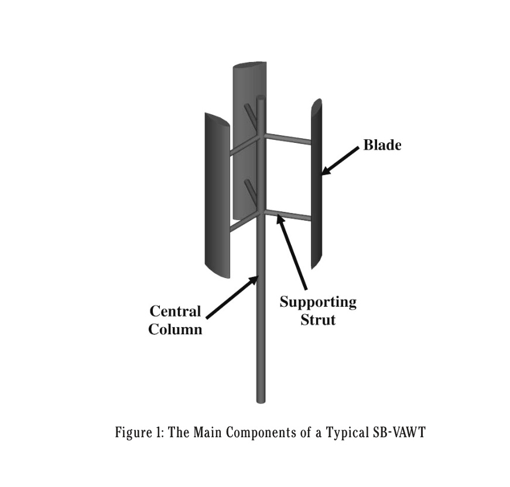
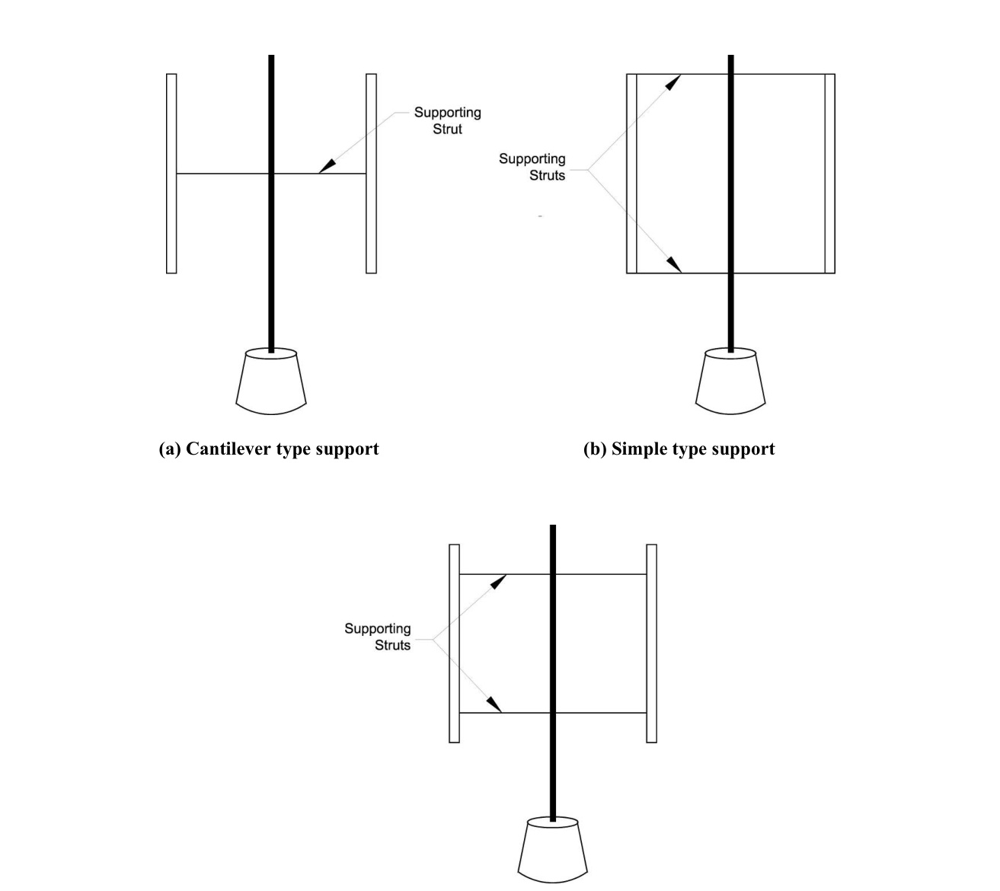
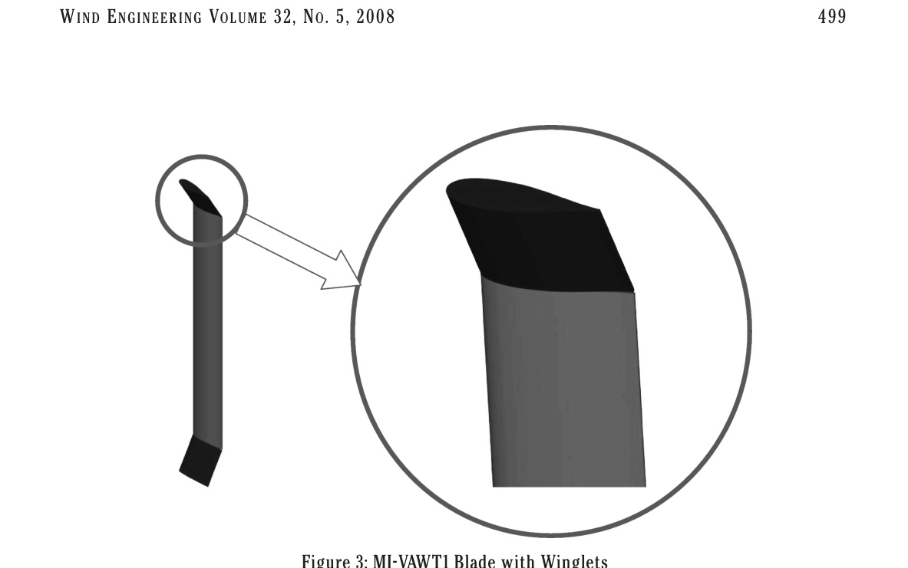
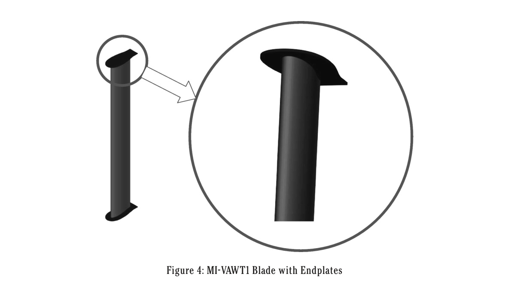
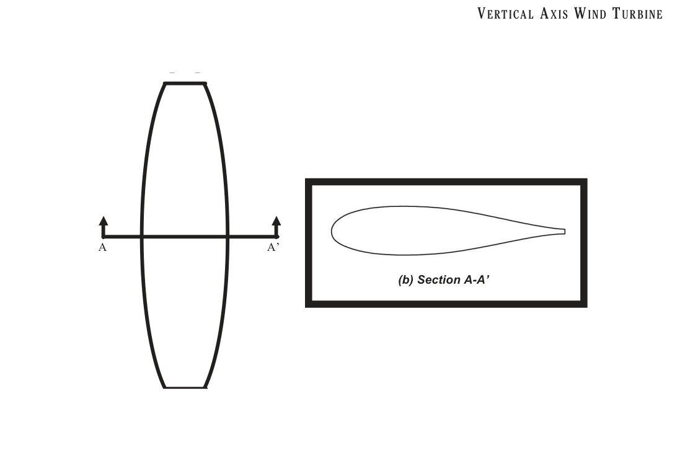
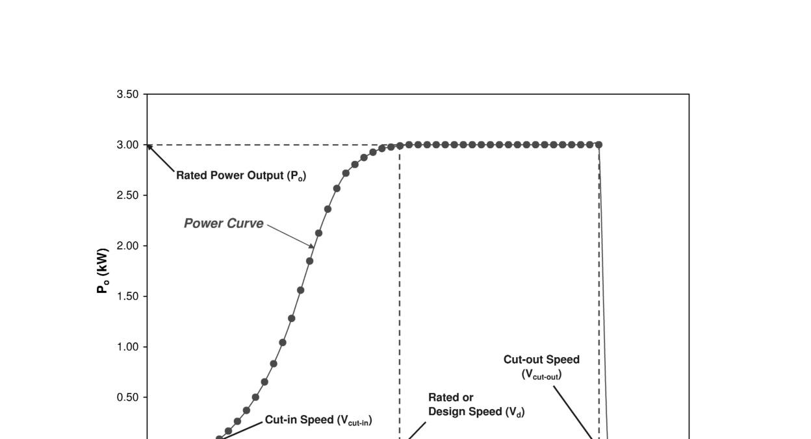
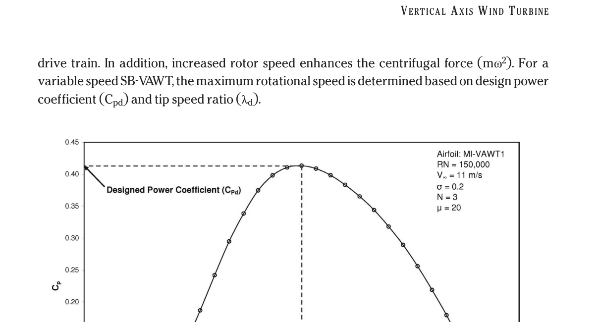

# Analysis of the Design Parameters related to a Fixed-pitch Straight-Bladed Vertical Axis Wind Turbine

Mazharul Islam, Amir Fartaj and Rupp Carriveau

1 Department of Mechanical Engineering, Taibah University, Al Medina Al Munawara, Kingdom of Saudi Arabia. P.O. Box: 344.

2 Department of Mechanical, Automotive and Materials Engineering, University of Windsor, Windsor, Ontario, Canada N9B 3P4.

3 Department of Civil and Environmental Engineering, University of Windsor, Windsor, Ontario, Canada N9B 3P4.

## Abstract

The fixed-pitch straight-bladed vertical axis wind turbine (SB-VAWT) is one of the simplest types of wind turbine. One of the main challenges of wide spread application of the smaller-capacity SB-VAWT is to design and develop it in a cost-effective manner. The overall cost of the SB-VAWT will mainly depend on judicious choice of multiple design parameters. An attempt has been made in this paper to identify and critically analyze the main design parameters related to smaller-capacity fixed-pitch SB-VAWT. It has been demonstrated in this paper that proper selections of these parameters are vital for a cost-effective smaller-capacity SB-VAWT which can be considered as a candidate for urban and off-grid rural applications.

## Nomenclature

- A: Area swept by turbine
- c: blade chord
- CP: gross turbine overall power coefficient = Po / 1/2 rho A Vinf^3
- CP,net: net turbine overall power coefficient
- D: diameter of turbine
- Ft: tangential force
- HAWT: horizontal axis wind turbines
- H: height of turbine
- N: number of blades
- NACA: National Advisory Committee for Aeronautics
- Po: overall power
- R: turbine radius
- RN: Reynolds number
- rpm: turbine speed in revolutions per minute
- SB-VAWT: straight-bladed vertical axis wind turbines
- VAWT: vertical axis wind turbines
- Vcut out: cut-out speed
- Vdesign: design wind speed
- Vinf: wind velocity
- gamma: blade pitch angle
- theta: azimuth angle
- lambda: tip speed ratio = R omega / Vinf
- mu: aspect ratio
- sigma: solidity = Nc / R
- omega: angular velocity of turbine in rad/sec

### Subscripts

- d: design point

## 1. Introduction

The fixed-pitch straight-bladed vertical axis wind turbine (SB-VAWT) is one of the simplest types of wind turbines with only three main physical components, namely (a) blade; (b) supporting strut; and (c) central column. A SB-VAWT, as shown in Figure 1, does not require additional components like yaw mechanics, pitch control mechanism, and wind-direction sensing devices as commonly required in horizontal axis wind turbines. Furthermore, almost all of the components requiring maintenance are located at the ground level, simplifying the maintenance work appreciably.

Figure 1: The Main Components of a Typical SB-VAWT

Original caption: Figure 1: The Main Components of a Typical SB-VAWT

One of the main challenges of wide spread application of the smaller-capacity SB-VAWT is to design and develop it in a cost-effective manner. The performance of HAWTs have increased considerably over the past decade which has resulted from improved airfoils, variable speed or multi-speed operation and more efficient drive trains [1]. For smaller-capacity fixed-pitch SB-VAWTs, all of these factors should also play an important role and merit significant research attention. The overall cost of the SB-VAWT will primarily depend on the proper choice of the design parameters which are critically analyzed in this paper.

## 2. Design Parameters

The main design parameters related to a smaller-capacity SB-VAWTs are categorized and listed in Table 1. It should be mentioned that not all of the parameters are of the identical importance for a successful final product. Some of the parameters (like choice of airfoil, supporting strut configuration and shape, solidity, material) are more sensitive and critical than others. The design parameters listed in Table 1 are discussed in the subsequent sub-headings.

Table 1: Different Design Parameters of a SB-VAWT Powered Application

| Category | Parameter |
| --- | --- |
| Physical Features | 1. Blade Shape (Airfoil) |
| Physical Features | 2. Number of Blade (N) |
| Physical Features | 3. Supporting Struts type and shape |
| Physical Features | 4. Central Column |
| Dimensional | 5. Swept Area (A=HD) |
| Dimensional | 6. Solidity (Nc/R) |
| Dimensional | 7. Aspect Ratio (H/c) |
| Dimensional | 8. Chord/Radius Ratio (c/R) |
| Operational | 9. Rated Power Output (Po) |
| Operational | 10. Rated Wind Speed (Vinf_d) |
| Operational | 11. Cut-in Speed (Vcut-in) |
| Operational | 12. Cut-out Speed (Vcut-out) |
| Operational | 13. Power Coefficient (CPd) |
| Operational | 14. Tip Speed Ratio (lambda_d) |
| Operational | 15. Rotational Speed (omega_d) |
| Operational | 16. Pitching of Blade (gamma_d) |
| Balance of System | 17. Tower |
| Balance of System | 18. Braking Mechanism |
| Balance of System | 19. Load |
| Others | 20. Material |
| Others | 21. Noise |
| Others | 22. Aesthetic |

### 2.1. Blade Airfoil

Among all the design parameters listed in Table 1, one of the most important one is the selection of an appropriate blade shape or airfoil to achieve desired aerodynamic performance and to optimize the overall dimensions of a SB-VAWT. Airfoil related design changes also have the potential for increasing the cost effectiveness of VAWTs [2]. The power produced by a SB-VAWT at different wind speeds are largely determined by its blade airfoil. Since its early stage of design and development, both the straight-bladed and curved-bladed Darrieus type VAWTs were mostly made with blades of the symmetric airfoils from the NACA 4-digit series, mostly NACA 0012, 0015, 0018, which were originally developed for high Reynolds number aviation applications [3]. These airfoils have presumably been used mainly because only for these airfoils was there sufficient information on performance and loading [4]. However, the main problem of utilizing these symmetric airfoils is their production of low starting torque at low speed. Though several contemporary variable pitch blade configurations have potential to overcome the starting torque problem; they are quite complex and impractical for smaller capacity applications [3].

Recently, a detailed systematic investigative analysis of several asymmetric airfoils appropriate for self-starting and improved performance of smaller capacity fixed-pitch SB-VAWT was performed by Islam et. al [3]. Several aerodynamic characteristics of the desirable airfoil were shortlisted by Islam et. al [3] and subsequently the required geometric features to achieve the short listed characteristics were also determined by them. They [3] have shown that the conventionally adopted NACA 4-digit symmetric airfoils are not suitable for smaller capacity SB-VAWTs. Rather, it is advantageous to utilize a high-lift and low-drag asymmetric thick airfoils suitable for the low speed operations typically encountered by SB-VAWTs. Subsequently, Islam et. al [5] designed and analyzed a special-purpose airfoil named "MI-VAWT1". It has been demonstrated [5] that its performance is superior to that of NACA 0015 at low Reynolds number (RN). Details of the performance of MI-VAWT1 can be found in the Reference [5].

### 2.2. Number of Blades

SB-VAWT with a single blade is technically feasible. However a counterweight would be required to balance the mass of the single blade and this counterweight would generate parasitic drag. Furthermore, because forward torque is not produced at all blade positions such a single blade turbine would not self-start [6]. The two-bladed SB-VAWT produces more torque than the single bladed ones, but it has been responsible for damaging fatigue stresses in a number of VAWT rotors [1]. However, a three-bladed VAWT rotor is structurally non directional and the response of three blades is more favorable than two blades of the same chord length [1]. The structural dynamics of two and three bladed VAWTs are quite distinct from each other [1]. Parashivoiu [1] made a comparative study of two and three bladed Darrieus type VAWTs and found that both of these turbines have some advantages and disadvantages.

The advantages of two blades VAWTs are: (i) construction cost is lower; (ii) assembly costs are lower; and (iii) strength to weight ratio is better. On the other hand, three-bladed VAWTs have the following advantages: (i) better choice of fabrication technique; (ii) better torque ripple, which is the amount of torque measured by subtracting the minimum torque during one revolution from the maximum torque from the same motor revolution; and (iii) better structural dynamics.

Furthermore, a turbine with three blades tends to run smoothly because of lower fluctuations of energy in each revolution. For three bladed SB-VAWTs, cyclic variations in both the torque and the magnitude and direction of the net force on the rotor due to the combined effects of lift and drag on all blades are very much reduced. This is the case because the aerodynamic forces on the blades of a SB-VAWT reach a peak twice per revolution. The aerodynamic forces on two blades 180 degrees apart will peak approximately in phase and will act in approximately the same direction on both blades, leading to potential problems with resonant vibrations in the tower, while those from three blades 120 degrees apart will tend to produce an almost steady force analogous to three phase electrical power [6]. Kirke [6] suggested that a SB-VAWT requiring greater low speed torque may be designed around three bladed systems at some sacrifice of high speed performance.

### 2.3. Supporting Struts

Supporting struts of SB-VAWTs connect the central rotating column to the blades and they are also important design parameters. They stabilize the blades during survival winds, transfer torque into the central column, reduce operating mean and fatigue stresses in the blades, and strongly influence some natural frequencies of the rotor [1]. However, they also add to the weight and cost; and generate parasitic drag which reduces the net power output. Supporting struts must be strong enough to carry weight, inertial and aerodynamic loads, and must also be stiff enough in both flexure and torsion to prevent excessive static and dynamic deflections. The design of supporting struts involves a trade-off between aerodynamic and structural requirements. The length of the supporting struts (i.e. the radius of the turbine) should be as low as possible to reduce the parasitic drag generated by these structures.

#### 2.3.1. Types of Blade-supports with Horizontal Struts

The blades of SB-VAWTs can be supported with the horizontal struts in different ways. As shown in Figure 2, the three main types of blades supports can be categorized as (i) simple support; (ii) overhang support; and (iii) cantilever support. To minimize the parasitic drag, cantilever or one horizontal supporting strut per blade is preferred. However, for smaller-capacity SB-VAWT with high blade bending moments due to centripetal acceleration, either simple or overhang supports (which utilize two struts per blade) are preferable. Furthermore, it will be shown later in Section 2.7 that blade performance deteriorates as its aspect ratio (mu) decreases. So, it is desirable to use long slender blades for high mu, such long blades generally require two points of support for structural reasons [6].

Figure 2: Three Different Types of Blade Supports of SB-VAWTs

Original caption: Figure 2: Three Different Types of Blade Supports of SB-VAWTs

#### 2.3.2. Shape of the Supporting Struts

Different shapes (like rectangular, circular, airfoil etc.) can be utilized as the profile of the supporting struts. However, for aerodynamic reasons a non-lifting airfoil is preferable with a low value of drag coefficient at zero lift (CDO). The value of CDO of the commonly used supporting struts is usually between 0.1 to 0.5 [6]. Eppler [8] designed and tested three thick airfoils dedicated for non-lifting struts. These three airfoils (namely E862, E863 and E864) were designed for Reynolds number of 400,000, 700,000 and 1,200,000 respectively. So, none of these airfoils were designed for applications of a typical smaller-capacity SB-VAWT which operates at RN below 300,000. The lowest RN airfoil among these three was E 862. In this context, Islam et. al [9] designed a thick non-lifting strut for the RN range below 300,000. Following a detailed analysis, a new airfoil was designed [9] and named as "MI-STRUT1". It has been found that CDO values of MI-STRUT1 are lower than E 862 for all the RN and the difference is much greater at RN<250,000 [9].

Islam et. al [9] also produced CP,net-lambda curves of a SB-VAWT with MI-VAWT1 blade with different shapes of supporting struts at RN=100,000 and 300,000. It has been found that, the CP,net values at different tip speed ratios (lambda) with MI-STRUT1 are higher than the other two types of strut shapes, namely blunt body and E862. So based on these findings, MI-STRUT1 can be considered as a potential candidate for the profile of supporting struts of SB-VAWTs for better performance.

### 2.4. Central Column

The central column of the SB-VAWT is connected with the blades for capturing the energy from the wind. Circular tubes are commonly used as the central column of SB-VAWTs. The diameter of the central column should be judiciously chosen. If the SB-VAWT is situated high above the ground to capture more energy from the wind by extending the rotating central column downwards, a larger column diameter may be required for optimum stiffness. The central column can be fabricated from steel tubular columns.

### 2.5. Swept Area

The cylindrical area through which the rotor blades of a SB-VAWT rotates, is called the swept area (A=2RH). The power output of a wind turbine is directly related to the swept area of its blades. The larger the diameter of the turbine, the more power it is capable of extracting from the wind. The larger the blades, the stronger they need to be to withstand the higher levels of centrifugal and cyclic varying gravitational loads. Furthermore, the bending moments across the swept area of the blade can vary considerably with a possible difference of several meters a second in wind speeds between the top and the bottom of the blades rotation. This can contribute to an increase in fatigue, not only in the blade structure but the machines hub, bearing, drive shaft and support tower. Subsequently, the swept area of a SB-VAWT should be carefully chosen after considering all these factors.

### 2.6. Solidity

The SB-VAWT rotor solidity (sigma) is defined as the ratio of blade surface area (NcH) to the frontal swept area (2RH) that the rotor passes through. It represents one of the key design parameters. It is evident from the definition of sigma that both the weight of the SB-VAWT and manufacturing costs increase with increasing sigma. In general, a high solidity SB-VAWT rotor turns slowly and produces high starting torque [6]. Thus, a high solidity turbine has an advantage in producing higher torque at low tip speed ratios. However, Kirke [6] found that an increase in solidity has the following drawbacks:

1. More material is needed to sweep a given area, so the material and installation costs per unit power output are higher than for a low sigma turbine.
2. Maximum efficiency is reached at lower lambda, so larger step-up gear ratios are needed for driving most loads, for example generators and centrifugal and helical rotor pumps. This low speed range would of course be an advantage for low speed loads.
3. Higher sigma fixed pitch VAWTs have a very "peaky" Cp/lambda curve, i.e. they operate efficiently over a very narrow range of lambda. This is a drawback because when the wind gusts and changes lambda the turbine will operate at low efficiency until it can speed up or slow down to track the change in wind velocity, even assuming a well-matched load which adjusts to seek optimum lambda (as described in Kirke 1996). Because of its greater blade area a high solidity rotor has greater inertia and will be slow to adjust to the changing wind speed.

### 2.7. Aspect Ratio (H/c)

It has been reported by Kirke [6] that to achieve an acceptable peak efficiency, a low blade aspect ratio should be avoided and it must be considerably higher than 7.5. It has been observed in the present study that consideration of a finite aspect ratio effect in the calculation reduces the lift/drag ratio, as a result tangential forces decrease, leading to lower power.

Increasing the aspect ratio is one way to increase the swept area for the same chord length and diameter of the SB-VAWT, enabling it to capture more energy, (at the expense of additional blade material). The chord length (c) of the SB-VAWT is related with the bending stresses and aerodynamic loads. The bending stresses are dependent on the square of the c and the aerodynamic loads are dependent on only the first power of c.

#### 2.7.1. Wing Tip Devices for SB-VAWT Blades

In recent times, wing tip devices have become a popular technique to increase the aerodynamic performances of lifting wings by reducing the induced drag. As the blades of SB-VAWTs are basically similar to wings, such tip devices have potential application for SB-VAWT blades to increase the aerodynamic performance. The principal premise of a wing tip device is to diffuse the strong vortices released at the tip and optimize the spanwise lift distribution, while maintaining the additional moments on the wing within certain limits [10]. Over the years, different types of wing tip devices have been investigated and applied in the aerodynamic applications, mainly in the aerospace industries. The common wing devices include:

- Winglets
- Endplates
- Hoerner Tips
- Tip Tanks
- Tip Sails
- Upswept and Drooped / Raised Wing Tips
- Elliptical Wingtips
- Wing Grids
- Spiroid Tips

Among these devices, the winglets and endplates are possible candidates for SB-VAWT blades based on their simplicity, effectiveness and state of development. It should however be acknowledged that prior to incorporating these devices with SB-VAWT blades, further detailed analyses should be performed to assess their applicable merit.

##### (a) Winglets

Winglets represent one of the few effective means of fighting induced drag [11]. The winglets, as shown in Figure 3, are usually mounted on the rear part of the wing (region of lowest pressure) to minimize interference effects. Several theoretical investigations, and later experiments, indicated that the use of vertical lifting surfaces placed at the wing tips produce a beneficial effect on both lift and drag characteristics at the expense of increased bending moment [10]. Winglets can be used to produce lower drag and extra lift. Drag reduction rates with winglets can be of the order of 5% [10]. According to Boeing [12], there is added advantage in using a blended winglet configuration that allows for the chord distribution to change smoothly from the wingtip to the winglet, which optimizes the distribution of the span load lift and minimizes any aerodynamic interference or airflow separation.

Figure 3: MI-VAWT1 Blade with Winglets

Original caption: Figure 3: MI-VAWT1 Blade with Winglets

##### (b) Endplates

Endplates are generally considered a more simple engineering solution than the winglets described above. They are widely used in the airfoil experimental setups to eliminate the wing tip losses. With the endplates attached, it is assumed in these experiments that the airfoil behaves like a two-dimensional wing. The endplates, as shown in Figure 4, are vertical surfaces added to a wing to redistribute the lift along the span and the effect is strongly increased lift coefficients, against a drag coefficient that decreases by a marginal amount [10]. The resulting efficiency of wing (Lift/Drag ratio) is generally greatly improved.

Figure 4: MI-VAWT1 Blade with Endplates

Original caption: Figure 4: MI-VAWT1 Blade with Endplates

#### 2.7.2. Elliptical Wings

Apart from the above-mentioned wing tip devices, the induced drag of a wing can also be reduced by fabricating the wing in elliptical shape. An elliptical wing is a wing planform shape (as shown in Figure 5), first seen on aircraft in the 1930s, which minimizes induced drag [13]. Elliptical taper shortens the chord near the wingtips in such a way that all parts of the wing experience equivalent downwash, and lift at the wing tips is essentially zero, improving aerodynamic efficiency due to a greater Oswald efficiency number in the induced drag equation [13]. One of the main barriers of elliptical wings is that the compound curves involved are difficult and more expensive to construct than the rectangular wings of SB-VAWTs. Before concluding about the viability of elliptical wings, further aerodynamic and economic analyses are required.

Figure 5: Elliptical MI-VAWT1 Blade with Sectional View

Original caption: Figure 5: Elliptical MI-VAWT1 Blade with Sectional View

### 2.8. Chord-Radius Ratio (c/R)

By definition, the solidity of a SB-VAWT is proportional to its chord to radius. Furthermore, the flow curvature effect of a SB-VAWT increases with its chord to radius ratio and under most circumstances it has a detrimental influence on the blade aerodynamic efficiency [14]. So, a much larger c would result in higher c/r (which will increase flow curvature effect) and lead to heavier blades that may be expensive to build and difficult to handle.

### 2.9. Rated Power Output

The wind turbines like SB-VAWTs are usually designed based on a rated power output which is the nameplate value attained at certain rated wind speed as defined later. The swept area of the turbine is based on the required rated power output. The power curve of a wind turbine is a graph that indicates how large the power output will be for the turbine at different wind speeds. A wind turbine power curve is, by international convention, determined by averaging power and wind speed measurements over a fixed time interval, typically ten minutes. The results are then "binned" to produce a graph. The concept of rated power output can be better understood from an illustration of a typical power curve of a 3kW SB-VAWT shown in Figure 6.

### 2.10. Rated Wind Speed (Design Wind Speed)

The wind speed at which the SB-VAWT produces the rated amount of power is usually defined as the rated or designed wind speed as shown in Figure 6. The rated wind speed generally corresponds to the point at which the conversion efficiency is near its maximum. Because of the variability of the wind, the amount of energy a wind turbine actually produces is a function of the capacity factor. The rated wind speed of the typical smaller-capacity SB-VAWTs can vary between 10 to 15 m/s.

Figure 6: Illustration of a Typical Power Curve of a 3kW SB-VAWT

Original caption: Figure 6: Illustration of a Typical Power Curve of a 3kW SB-VAWT

### 2.11. Cut-in Speed

Cut-in speed is identified as the lowest speed at which power is produced in the turbine power curve as shown in Figure 6. A SB-VAWT should be able to generate enough starting torque up to the operating tip speed ratios to avoid incorporation of complicated devices used during start-up operation.

### 2.12. Cut-out Speed

The cut-out speed (as illustrated in Figure 6) is the wind speed at which the turbine may be shut down to protect the rotor and drive train machinery from damage or high wind stalling characteristics [15]. A wind turbine should be able to withstand the blade stresses at cut-out speed. Normally, the maximum wind speed for operation of the wind turbine is about 25 m/s, i.e., storm conditions, beyond which the rotor is brought to a standstill [16]. Based on this, the typical cut-out speed of a smaller-capacity SB-VAWT can be set around 25 m/s.

### 2.13. Tip Speed Ratio

For wind turbines, the ratio between the rotational speed of the tip of the blade and the actual velocity of the wind is called the tip speed ratio (lambda). Typically higher tip speed ratios are better, but the value should not be too high so that the machine becomes noisy and highly stressed. The design tip-speed ratio (lambda_d) for a wind turbine is usually the ratio of the speed of the tip of a turbine blade for which the power coefficient is at maximum as illustrated in Figure 7. The lambda_d will determine the desired wind turbine rotation rate and thus has implications for the load (alternator or other mechanical device) that can be used.

### 2.14. Rotor Speed

The rotor speed is mainly controlled by the wind regime, the solidity, and the machine power rating [1]. Increasing rotor speed decreases low-speed torque and hence reduces the cost of the drive train. In addition, increased rotor speed enhances the centrifugal force (m omega^2). For a variable speed SB-VAWT, the maximum rotational speed is determined based on design power coefficient (Cp_d) and tip speed ratio (lambda_d).

Figure 7: Illustration of a Design Power Coefficient and Tip Speed Ratio

Original caption: Figure 7: Illustration of a Design Power Coefficient and Tip Speed Ratio

### 2.15. Blade Pitching

Blade pitching is mostly used to reduce the turbine overspeed thereby preventing structural failure of the turbine at high wind speeds. The pitching mechanism may be of various types: fixed pitching, sinusoidal pitching, combination of fixed and sinusoidal pitching etc. Pitching controls the performance of a turbine significantly.

### 2.16. Braking Mechanism

Different types of braking mechanisms can be applied to SB-VAWTs, including (i) mechanical brake and aerodynamic spoiler. Some of the researchers, like Kirke [6] used an automotive brake drum, shoes and a mechanical (handbrake) linkage which were connected via a cable to a "panic handle" at the base of the tower of his variable-pitch SB-VAWT so the turbine could be stopped and left stationary when required. Both electrical and mechanical breaking systems can be utilized with smaller-capacity SB-VAWTs to allow a controlled emergency stop. For variable speed VAWTs, electrical braking is normally employed [1].

### 2.17. Type of Loads

SB-VAWT can be utilized through different configurations to deliver useful electrical or mechanical energies. Technical aspects of both electric and mechanical loads are analyzed by Islam et. al [18]. Islam et. al [18] also identified and discussed pros and cons of different types of applications of SB-VAWTs. It has been found that, cost-effective small-capacity straight-bladed VAWTs can be utilized for an array of applications to provide mechanical, electrical and heat energy. Some of the marketable environmentally benign applications are [18]:

- Electrification of remote communities
- Electrification of urban cities (or built environment)
- Pumping water
- Remote telecommunication
- Heating, ventilation and air-conditioning
- Mechanical aeration for ponds, lakes & wastewater treatment plants
- Desalination and water purification

### 2.18. Blade Material

One of the most important and critical design parameters for successful smaller-capacity SB-VAWTs is the selection of the blade material. SB-VAWT blades must be produced at moderate cost for the resulting energy to be competitive in price and the blade should last during the predicted service life. Though there are many articles and reports available in the public domain on material aspect of HAWTs or curved-bladed VAWTs blades, no such literature was discovered for SB-VAWTs.

The aerodynamic contours of wind turbine blades are formed by the (outer) relatively thin shells and they are supported structurally by a longitudinal beam or by webs, which carry a substantial part of the load on the blade [16]. In the subsequent headings, the required materials properties and the available popular materials usually used for wind turbine blades are discussed.

#### 2.18.1. Required Properties of the Blade Materials

SB-VAWT blades are exposed to diversified load conditions and dynamic stresses are considerably more severe than many mechanical applications. Based on the operational parameters and the surrounding conditions of a typical SB-VAWT for delivering electrical or mechanical energy, the following properties of the SB-VAWT blade materials are required:

- It should have adequately high yield strength for longer life;
- It must endure a very large number of fatigue cycles during the service lifetime to reduce material degradation;
- It should have high material stiffness to maintain optimal aerodynamic performance;
- It should have low density for reduced gravity and normal force components;
- It should be corrosion resistant;
- It should be suitable for low-cost fabrication methods.
- It must be efficiently manufactured into its final form;
- It should provide a long-term mechanical performance per unit cost;

Among these requirements, fatigue remains the major problem facing both HAWTs and VAWTs. An operating turbine is exposed to many alternating stress cycles and can easily be exposed to more than 10^8 cycles during a 30 year life time [19]. The sources of alternating stresses are due to the dynamics of the wind turbine structure itself as well as periodic variations of input forces [19]. An extensive review on the fatigue properties of materials for wind turbines has been provided by Sutherland [20].

#### 2.18.2. Prospective Materials

The smaller-capacity wind turbine blades are usually made of aluminum, or laminated wood [21]. Metals were initially a popular material because they yield a low-cost blade and can be manufactured with a high degree of reliability, however most metallic blades (like steel) proved to be relatively heavy which limits their application in commercial turbines [20].

In the past, attempts were made to utilize laminated wood as a blade material on early machines in 1977 [22]. At present, the most popular materials for design of different types of wind turbines are wood, aluminum and fiberglass composites that are briefly discussed below.

##### (a) Wood and Wood Epoxy

Wood, a naturally occurring composite material, is readily available as an inexpensive blade material with good fatigue properties [19]. Wood was a popular wind turbine blade material since ancient times. Wood has relatively high strength-to-weight ratio, good stiffness and high resilience [20]. Wood and wood epoxy blades have been used extensively by the designer of small and medium sized HAWTs. However, wood does have an inherent problem with moisture stability. This problem can be controlled with good design procedures and quality controlled manufacturing processes. The application of wood to large blades is hindered by its joining efficiency which in many cases has forced designers to examine other materials [20].

##### (b) Aluminum

Aluminum blades fabricated by extrusion and bending are the most common type of VAWT materials. The early blades of Darrieus type VAWTs were made from stretches and formed steel sheets or from helicopter like combinations of aluminum alloy extrusions and fiberglass [1]. It has been reported by Parashivoiu [1] that the former were difficult to shape into a smooth airfoil, while the latter were expensive. The major problem that aluminum alloy poses for wind turbine application is its poor fatigue properties; and its allowable stress levels in dynamic application decreases quite markedly at increasing numbers of cyclic stress applications when compared to other materials such as steel, wood or fiberglass reinforced plastics [19].

##### (c) Fibreglass Composites

Composites constructed with fibreglass reinforcements are currently the blade materials of choice for wind turbine blades [20] of HAWT types. This class of materials is called fibreglass composites or fibre reinforced plastics (FRP). In turbine designs they are usually composed of E-glass in a polyester, vinyl ester or epoxy matrix and blades are typically produced using hand-layup techniques. Recent advances in resin transfer molding and pultrusion technology have provided the blade manufacturers to examine new procedures for increasing the quality of the final product and reducing manufacturing costs [20]. The characteristics that make composites, especially glass fiber-reinforced and wood/epoxy composites, suitable for wind turbine blades are [23]:

- low density;
- good mechanical properties;
- excellent corrosion resistance;
- tailorability of material properties; and
- versatility of fabrication methods.

#### 2.18.3. Comparative Analysis between Available Materials

In mid nineties, a comprehensive investigation on alternative materials for use in medium-size VAWT blades was conducted by W. R. Davis Engineering Ltd for the CANMET Energy Technology Centre (CETC) of Canada [19]. It seems that the main focus of this study was curved-type VAWTs. However, significant insight regarding different blade materials can be understood from this study. In this study, consideration was given to parameters of aerodynamic performance, structural capabilities, corrosion, erosion and cost. Six types of blade materials, namely (i) aluminum; (ii) stainless steel; (iii) low carbon steel; (iv) titanium; (v) fibre reinforced composites; and (vi) wood and wood epoxy, were considered in the study. It was found that pultruded FRP is economically more viable than all the materials considered in the study.

### 2.19. Noise

As SB-VAWTs have prospects to operate in urban environments, noise emission ought to be minimized. The laminar separation bubbles that can extend over the trailing edge of the airfoil cause the blades to vibrate and are a frequent source of such noise. Conceptually, as the blade speed of SB-VAWTs is lower than similar capacity HAWTs, the noise generated by them is expected to be lower. This has been validated by a study of Iida et al. [24] and Iida & Mizuno [25], who have modelled the aerodynamic sound of a SB-VAWT numerically by using discrete vortex methods. They managed to capture the complicated wake structure using this method and showed that the SB-VAWT produces less sound than a horizontal axis wind turbine with the same power coefficient at normal operating speed [24-25].

### 2.20. Aesthetics

What is aesthetically pleasing is, by definition, an emotional issue [26]. Sense of appeal can vary from person to person. However, every effort should be made by the SB-VAWT designers to design the turbine in an attractive fashion. They should be visually unobtrusive and they should be painted in such a manner that they blend in with the environment as much as possible. In recent times, it is becoming very trendy in urban centres to have architecturally integrated wind turbines with the new building design or retrofitted to an existing one. SB-VAWT has potential to become a candidate for building integrated wind turbine in the urban landscape due to its simplistic design features.

## 3. Conclusions

The aim of this paper was to identify and critically analyze the main design features related to smaller-capacity SB-VAWTs. Twenty design parameters have been identified in this paper, which are: (i) blade shape, (ii) number of blades, (iii) supporting struts type and shape, (iv) central column, (v) swept area, (vi) solidity, (vii) aspect ratio, (viii) chord/radius ratio, (ix) rated power output, (x) rated wind speed, (xi) cut-in speed, (xii) cut-out speed, (xiii) tip speed ratio, (xiv) rotational speed, (xv) pitching of blade, (xvi) braking mechanism, (xvii) load, (xviii) material, (xix) noise, and (xx) aesthetic. Some of the parameters (like choice of blade airfoil, supporting strut configuration and shape, solidity, blade material) are more sensitive and critical than the others ones. It has been demonstrated in this paper that proper selections of these parameters are vital for cost-effective smaller-capacity SB-VAWT which can be considered as a candidate for urban and off-grid rural applications.

## 4. Acknowledgment

The authors would also like to acknowledge the works of the individuals and organizations that are listed in the following reference section.

## 5. References

[1] Paraschivoiu, I. Wind Turbine Design: With Emphasis on Darrieus Concept. Polytechnic International Press. Montreal, Canada. 2002.

[2] Klimas, P.C. Airfoil Treatments for Vertical Axis Wind Turbines. WINDPOWER `85, San Francisco, CA, USA. August, 1985.

[3] Islam, M., Ting, D. S-K. and Fartaj, A. Desirable Airfoil Features for Smaller-Capacity Straight-Bladed VAWT. Wind Engineering, 2007, Vol 31, No 3, pp 165-196.

[4] Zervos, A. Aerodynamic Design and Testing of Blade Profiles for Vertical Axis Wind Turbines. Commission of the European Communities. Contractors' meeting, Brussels. pp 309-320. 1988.

[5] Islam, M., Ting, D. S-K. and Fartaj, A. Design of a Special-purpose Airfoil for Smaller-Capacity Straight-Bladed VAWT. Wind Engineering, 2007, Vol 31, No 6, pp 401-424.

[6] Kirke, B.K. Evaluation of Self-Starting Vertical Axis Wind Turbines for Stand-Alone Applications. PhD Thesis, Griffith University, Australia. 1998.

[7] Mandal, A.C. Aerodynamics and Design Analysis of Vertical Axis Darrieus Wind Turbines. Ph.D. Dissertation, Vrije Universiteit, Brussel, Belgium. 1986.

[8] Eppler, R. Airfoil Design and Data. Springer-Verlag, Heidelberg, Germany. 1990.

[9] Mazharul Islam, M. Ruhul Amin, David S-K. Ting and Amir Fartaj. A New Airfoil for the Supporting Struts of Smaller-capacity Straight-Bladed VAWT. 12th AIAA/ISSMO Multidisciplinary Analysis and Optimization Conference, 10-12 September, 2008, Victoria, British Columbia, Canada.

[10] Advanced Topics in Aerodynamics (Aerodyn). Wing Tip Devices. URL: http://aerodyn.org/Drag/tip_devices.html (cited December 29, 2007)

[11] Aviation Intranet. Reducing Induced Drag. URL: http://selair.selkirk.bc.ca/aerodynamics1/Drag/Page8.html (cited December 29, 2007)

[12] Boeing. Blended Winglets. URL: http://www.boeing.com/commercial/aeromagazine/aero_17/winglet_story.html (cited December 29, 2007)

[13] Wikipedia. Elliptical wing. URL: http://en.wikipedia.org/wiki/Elliptical_wing (cited December 29, 2007)

[14] Migliore, P.G., Wolfe, W.P. and Fanucci, J. B. Flow Curvature Effects on Darrieus Turbine Blade Aerodynamics. Journal of Energy, 1980, Vol 4, No 2, pp 49-55.

[15] Americal Wind Energy Association (AWEA). How Does A Wind Turbine's Energy Production Differ from Its Power Production?. URL: http://www.awea.org/faq/basicen.html#Energy%20output. (cited December 22, 2007).

[16] Brondsted, P., Lilholt, H. and Lystrup, A. Composite Materials For Wind Power Turbine Blades. Annual Review Material Res. 2005. Vol 35, pp 505-538.

[17] Danish Wind Industry Association (DWIA). Wind Turbine Towers. URL: http://www.windpower.org/en/tour/wtrb/tower.htm. (cited December 27, 2007).

[18] Islam, M., Ting, D. S-K. and Fartaj, A. Assessment of Small-Capacity Straight-bladed VAWT for Sustainable Development of Canada. International Journal of Environment Studies, 2007, Vol 64, No 4, pp 489-500.

[19] CANMET Energy Technology Centre (CETC). Investigation of Alternative Materials for Use in Mid-Size Vertical Axis Wind Turbine Blades: Materials Assessment. Ontario, Canada. 2001.

[20] Sutherland, H.J. A Summary of the Fatigue Properties of Wind Turbine Materials. Wind Energy, 2000, Vol 3, pp 1-34.

[21] The Encyclopedia of Alternative Energy and Sustainable Living. Wind Turbine Blades. URL: http://www.daviddarling.info/encyclopedia/B/AE_blades.html (cited January 1, 2008)

[22] Butler, B.L. and Blackwell, B.F. The Application of Laminated Wooden Blades to a 2-Meter Darrieus type Vertical-Axis Wind Turbine. SAMPE Quarterly, Vol 8, No 2, January, 1977.

[23] National Research Council (NRC), Committee on Assessment of Research Needs for Wind Turbine Rotor Materials Technology, Assessment of Research Needs for Wind Turbine Rotor Materials Technology. 1991. URL: http://www.nap.edu/openbook.php?record_id=1824&page=R1 (cited December 22, 2007).

[24] Iida, A., Mizuno, A., and Fukudome, K. Numerical Simulation of Aerodynamic Noise Radiated From Vertical Axis Wind Turbines. Technical report, Department of Mechanical Engineering, Kogakuin University, Japan. 2004

[25] Iida, A. and Mizuno, A. Prediction Of Aerodynamic Noise Radiated From A Vertical-Axis Wind Turbine. Proceedings of the 4TH ASME/JSME Joint Fluids Engineering Conference July 6-10, 2003, Honolulu, Hawaii. pp 1-7.

[26] Sagrillo, M. Aesthetics Issues and Residential Wind Turbines. URL: http://www.awea.org/faq/sagrillo/ms_aesthetics_0405.html (cited December 31, 2007)
