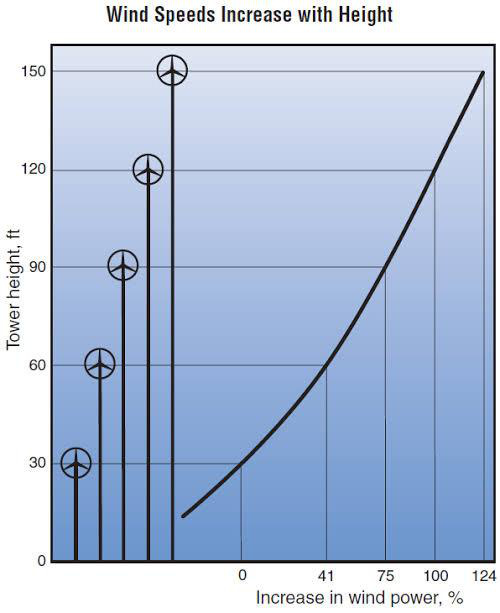
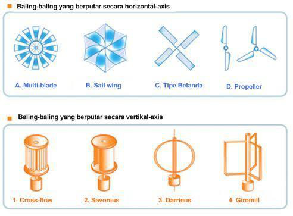
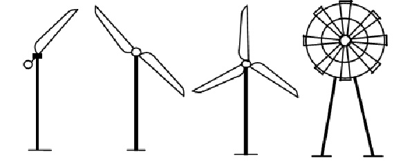
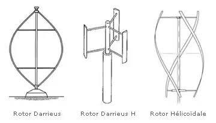
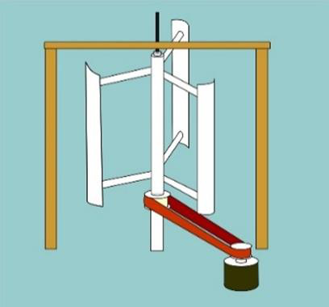
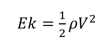

# Darrieus type vertical axis wind turbine (VAWT) design

S W Wasiati, F A Augusta, V R P Purwanto, P Wulandari, and A Syahrirar

Department of Electrical Engineering, Faculty of Science and Technology, Al-Azhar University of Indonesia

## Abstract

The potential of wind energy in Indonesia is generally relatively less compared to other countries in the subtropical region. With the Darrieus VAWT Type Vertical Axis Wind Turbine, the turbine does not have to be directed to the wind to be effective. Mill with vertical axis, generator and gearbox can be placed near the ground, so the tower does not need to support it and is more accessible for maintenance purposes. Gearbox or transmission is one of the main components of the motor which is referred to as a power transfer system, the transmission functions to move and change the power of the rotating motor. To get a large turbine torque, a gearbox design (large size on the turbine, and a smaller size on the rotor generator) is needed. The number of blades used will also affect the effectiveness of the turbine in capturing the wind. With the number of 3 blades, get torque above 40 rpm, at wind speeds of 4.5 to 5 m/s.

## 1. Introduction

The potential of wind energy in Indonesia is generally relatively less compared to other countries in the subtropical region. This is indeed a reality that must be accepted because Indonesia's geographical area is in the equator region and lacks or has no wind energy potential. In wind generator there are many things that must be considered, because in designing the wind speed turbine for the initial rotation of the turbine is determined. Solutions that can be used as an energy source an alternative to assisting the government in electricity supply is by making a simple and economical wind turbine but according to the condition of the highway that is crowded with vehicles passing by. In this case Vertical shaped wind turbines can be a solution because it functions at low wind speeds, can be installed not far from the ground so it's easy in installation and maintenance and economical. One of the turbines that are often used is Darrieus VAWT Type Vertical Axis Wind Turbine [1]. Darrieus turbine, designed by George Darrieus on the 1920s. Is one type of vertical wind turbines that move on principle lift force, which can produce energy which is far greater than with most other wind turbines. Though produce considerable efficiency, Turbine Darrieus has a weakness that is needed external energy to initiate movement enough to accelerate turbine in generating power output. For example a place for the establishment of a wind turbine must be in an area where the wind speed is constant, namely wind speed which is said to be stable if evenly distributed.

In the coastal and mountainous areas are areas with large and abundant sources of wind. With the physical shape of Indonesian islands, it is very suitable for the installation of wind turbines. Because many of the small communities in Indonesia, especially in the border areas, have not felt the energy source. As is the case with other renewable energy, the use of wind energy as a renewable energy source and has not yet fully reached the commercial stage compared to conventional fossil sources that have long been utilized by the community. Wind is a potential and renewable energy source. Wind is considered as one of the most practical and perfect energy sources because it is emission free and free. The best side is that wind can reduce electricity loads by 50% to 80% [2]. Vertical/upright axis (or VAWT) wind turbines have the main rotor axis/axis arranged perpendicular. The main advantage of this arrangement is that the turbine does not have to be directed to the wind to be effective. This advantage is very useful in places where the wind direction varies greatly. VAWT is able to utilize wind from various directions. Mill with vertical axis, generator and gearbox can be placed near the ground, so the tower does not need to support it and is more accessible for maintenance purposes [3].

## 2. Literature Review

### 2.1. Wind

Wind is energy that occurs because of the temperature difference between cold and hot air. (Kadir, 1995) Wind is air that moves so that it has speed, power, and direction. The cause of this movement is the warming of the earth by solar radiation. This wind movement has kinetic energy; therefore, wind energy can be converted into other energy such as electricity using windmills or wind turbines.

### 2.2. Wind Velocity

The thing that is usually used as a benchmark for knowing wind potential is its speed. Usually the problem is the stability of the wind speed. As is known, wind speed will fluctuate with time and place. For example, in Indonesia, the wind speed during the day can be faster than night. In some locations even at night there is no significant air movement. For situations like this, the calculation of the average speed can be done by noting the measurement of wind speed is carried out continuously. For air that moves too close to the ground, the wind speed obtained will be small so that the power produced is very little. The higher the better. In ideal conditions, to obtain wind speeds in the range of 5-7 m/s, generally a height of 5-12 m is required [4].

Figure 1. Relationship of wind speed to a to a certain height [5]

Original caption: Figure 1. Relationship of wind speed to a to a certain height [5]

In Figure 1, it is explained about the relationship of wind speed certain height. That is the higher the place where the turbine is placed, the higher the speed of the wind, the higher the intensity. Another factor to note for conventional wind turbines is the propeller design. For large propellers (for example with a diameter of 20 m), the wind speed at the top of the propeller is approximately 1.2 times the wind speed of the bottom of the propeller. That is, the tip of the propeller. At the moment the top will be exposed to a push force that is greater than when it is below. This needs to be considered when designing the power of propellers and masts, especially in large wind turbines. If the wind speed in the upper and lower propellers is significantly different.

### 2.3. Wind Turbine

Wind power plants began to be used in 1975 by the United States with the help of NASA (National Aeronautics Space and Construction) and NSF (National Science Foundation) with the discovery of wind turbines with MOD-0 models producing around 100 Kw of power to create MOD-5B by producing power to 7.2 MW in 1980. Most wind turbines used are horizontal wind turbines with three or two angles. Wind turbines are windmills used to generate electricity. The power produced by the wind turbine depends on the diameter of the blade, the longer the diameter, the greater the power produced [6].

Figure 2. Type of Wind Turbine [7]

Original caption: Figure 2. Type of Wind Turbine [7]

In Figure 2 describes two types of windmills, first (blue part) is a type of Horizontal Axis Wind Turbine, and the second (orange part) is a type of Vertical Axis Wind.

a. Horizontal Axis Wind Turbine

b. Vertical Axis Wind Turbine

#### 2.3.1. Horizontal Axis Wind Turbine

Horizontal axis wind turbines are the most widely used types of wind turbines. This turbine consists of a tower which at its peak there is a propeller which functions as a rotor and faces or turns away from the wind direction. Most wind turbines of this type have two or three propeller blades even though there are also turbines with less or more propeller blades than those mentioned above.

Figure 3. Horizontal Axis Wind Turbine [8]

Original caption: Figure 3. Horizontal Axis Wind Turbine [8]

#### 2.3.2. Vertical Axis Wind Turbine

Vertical axis turbines are divided into two types, namely is Savonius and Darrieus. Darrieus turbines were first introduced in France around the 1920s. and reflected by G.J.M. Darrieus in the United States in 1931, a few moments later, this turbine was renewed again in 1974 by producing 64 Kw of power, the advantages of this wind turbine that is because it is vertical, this wind turbine does not require high wind speed to produce power, because it is shaped troposkein found in Greece, so it is suitable for everywhere, besides that, the efficiency of this turbine is almost the same as the efficiency of a horizontal wind turbine, and it does not need to cost a lot to make this turbine. In figure 4 is a portrait of the Vertical Axis Wind Turbine of the Darrieus type. This vertical axis wind turbine has vertical blades that rotate in and out of the wind direction.

Figure 4. Darrieus Turbine [9]

Original caption: Figure 4. Darrieus Turbine [9]

### 2.4. Gearbox

#### 2.4.1. Definition of Gearbox

Gearbox or transmission is one of the main components of the motor which is referred to as a power transfer system, the transmission functions to move and change the power of the rotating motor, which is used to rotate the engine spindle or feed. Transmission also functions to adjust the motion speed and torque and turn around, so that it can move forward and backward.

#### 2.4.2. Gearbox Function

Manual transmission, or better known as the gearbox, has several functions, including changing the twisting moment which will be forwarded to the engine spindle, providing a gear ratio that matches the engine load, and producing engine rotation without slipping.

## 3. Results and Analysis

Darrieus VAWT Wind Turbine (Vertical Axis Wind Turbine) is a wind turbine whose blade is arranged in a symmetrical position with blade blades arranged relative to the shaft. Can be seen in Figure 5.

Figure 5. Vertical Axis Wind Turbine Type of Darrieus

Original caption: Figure 5. Vertical Axis Wind Turbine Type of Darrieus

Figure 5 shows the design of the wind turbine that Turbine designed. Use 3 blades, and the gearbox on the turbine is connected to the generator chain. The basic principle of the work of a wind turbine is to change the mechanical energy from the wind to rotating energy on the windmill, then the spinning wheel is used to rotate the generator, which will eventually produce electricity. When the propeller moves to rotate because the wind will move the gearbox which turns the low rotation on the windmill into high rotation. Usually Gearbox is used around 1:60, then forwarded to a generator which is one of the important components that can convert motion energy into electrical energy the principle of work can be studied using electromagnetic field theory. Due to the limited availability of wind energy (not all days the wind will always be available) the availability of electricity is also uncertain. Therefore, energy storage devices are used which serve as a back-up of electrical energy. When the burden of people's electric power usage increases or when the wind speed of a region is declining, the demand for electric power cannot be fulfilled.

The advantages of vertical turbines are:

a. Effective in capturing wind direction from various angles.

b. Does not require a large tower structure.

c. A TASV can be placed closer to the ground, making maintenance of moving parts easier.

d. It has a higher airfoil angle (the shape of a blade that looks transversely), giving high aerodynamics while reducing drag at low and high pressures.

e. Straight-bladed TASV designs with rectangular or rectangular cross sections have a larger blow area for a certain diameter than TASV circular circle area.

Deficiency:

a. Most TASV produces energy only 50% of TASH efficiency because of the additional drag it has when the wheel rotates.

b. TASV does not take advantage of faster winds at higher elevations.

c. Most TASVs have low initial torque and require energy to start spinning.

d. A TASV that uses a cable to connect puts pressure on the base bearing because all rotor weights are charged to the impact.

e. Cables connected to the top of the bearing increase thrust downward when the wind is blown.

The wind turbine forms a cycle of increasing the total torque value when rotating at multiples of 120 degrees for three-blade turbines and 90 degrees for four-blade turbines, starting after the wind turbine through 90 degrees rotation. The total torque value is higher as the wind speed increases, and the maximum total torque value of the three-blade turbine is greater than the four-blade turbine, but the total four-blade turbine torque graph profile is more stable. This happens because the more blades used in the Darrieus wind turbine, the more "blocking" blades with a small or minus torque value will reduce the performance of the wind turbine.

Referring to Anang Prasetyo's paper [7], certain times have a major impact on the voltage and current produced by the generator. Wind is one form of energy available in nature. Wind power plants convert wind energy into electrical energy using wind turbines or windmills. The way it works is quite simple, the wind energy that rotates the wind turbine, is continued to rotate the rotor in the generator at the bottom of the wind turbine, so that it will produce electrical energy. Based on this principle, the calculation of kinetic energy can be done by referring to wind speed.

Where:

Ek = Wind kinetic energy (joule)

rho = wind density (kg/m3)

V = wind speed (m/s)

The torque value (rotational speed) also increases. However, referring back to Anang Prasetyo's paper regarding the number of blades (blades) on the turbine can also affect the rotational speed of the turbine. It was explained in Anang Prasetyo's paper that the 4 blade (turbine) turbine has greater torque compared to 3 blades (blades), because the more blades, the more effective the turbine is to catch the wind. Then the gearbox on the turbine also affects the output of the turbine. If the turbine is bigger than the generator rotor part, the greater the torque in the rotor and the greater the output.

## 4. Conclusion

Based on the results of the research, it can be concluded as follows: The Vertical Axis Wind Turbine (VAWT) has a smaller efficiency compared to horizontal axis wind turbines, because most VAWTs have a low initial torque and require energy to start rotating. However, TASV has the advantage of not needing a large tower structure and not having to change its position if the wind direction changes. The smaller the diameter accompanied by the greater number of blades, the greater the rotational speed of the pinwheel, the smaller the torque of the wheel and the potential power (Pk) produced on the pinwheel also increases. To generate large torque on the generator, the gearbox on the turbine is bigger than the gearbox on the generator, so the energy generated by the generator is even greater.

## References

[1] Bagar, H. d. (2013). Pembangkit Listrik Tenaga Angin dengan inovasi turbin heliks vertikal untuk kemandirian energi sekolah daerah pesisir. Jakarta: Pekan Ilmiah Mahasiswa Nasional Program Kreatifitas Mahasiswa.

[2] Daryanto, Y. (2007). Kajian Potensi Angin Untuk Pembangkit Listrik Tenaga Bayu. Yogyakarta.

[3] Eren, D. (2014). Design and Analysis of a Vertical Axis Water Turbine for River Applications using Computational Fluid Dynamicsi. Middle East Technical University.

[4] Gymnastiar, M. (2018). BAB II. Tinjauan Pustaka dan Landasan Teori. Universitas Muhammadiyah Yogyakarta.

[5] Ikhwanul, I. (2011). Analisis pengaruh pembebanan terhadap kinerja kincir angin tipe propeller pada wind tunnel sederhana. Makassar: Jurusan Mesin Fakultas Teknik Universitas Hasanuddin.

[6] Patel Hardik, D. S. (2013). Performance Prediction of Horizontal Axis Wind Turbine. Semantic Scholar.

[7] Prasetya D, A. (2012). Perancangan PLTB Sumbu Vertical Tipe Savonius. Universitas Muhammadiyah Surakarta.

[8] Prasetyo., Y. (n.d.). Pemanfaatan Turbin Vertikal Axis Tipe H Pada Pembangkit Listrik Tenaga Bayu (PLTB) Dalam Skala Kecil. 2011, Universitas Muhammadiyah Surakarta.

[9] S, Prasetyo. (2012). Studi Awal Pengaruh Jumlah Sudu Terhadap Daya Keluaran Turbin Angin Tipe Horizontal Berdiameter 1,6 Meter Sebagai Sumber Penyedia Listrik Pada Proyek Rumah Dc Di Fmipa. UNJ, Universitas Negri Jakarta.
