# Design of a vertical-axis wind turbine: how the aspect ratio affects the turbine's performance

S. Brusca, R. Lanzafame, and M. Messina

Received: 1 April 2014 / Accepted: 24 May 2014 / Published online: 2 August 2014

Department of Electronic Engineering, Chemical and Industrial Engineering, University of Messina, Contrada Di Dio, 98166 Messina, Italy

Department of Industrial Engineering, University of Catania, Viale A. Doria, 6, 95125 Catania, Italy

Corresponding author email: mmessina@dii.unict.it

## Abstract

This work analyses the link between the aspect ratio of a vertical-axis straight-bladed (H-Rotor) wind turbine and its performance (power coefficient). The aspect ratio of this particular wind turbine is defined as the ratio between blade length and rotor radius. Since the aspect ratio variations of a vertical-axis wind turbine cause Reynolds number variations, any changes in the power coefficient can also be studied to derive how aspect ratio variations affect turbine performance. Using a calculation code based on the Multiple Stream Tube Model, symmetrical straight-bladed wind turbine performance was evaluated as aspect ratio varied. This numerical analysis highlighted how turbine performance is strongly influenced by the Reynolds number of the rotor blade. From a geometrical point of view, as aspect ratio falls, the Reynolds number rises which improves wind turbine performance.

Keywords: VAWT, MSTM, H-Rotor, Reynolds number, Aspect ratio

## Nomenclature

- `a` Interference factor (-)
- `V0` Free stream wind speed (m/s)
- `R` Rotor radius (m)
- `omega` Rotor angular velocity (s^-1)
- `h` Blade length (m)
- `w` Relative airfoil wind speed (m/s)
- `alpha` Angle of attack (deg)
- `L` Lift (N)
- `D` Drag (N)
- `R*` Resultant force (N)
- `theta` Blade angular position (deg)
- `P` Power (W)
- `Nb` Number of blades (-)
- `n` Rotor rotational velocity (rpm)
- `Re` Reynolds number (-)
- `rho` Air density (kg/m^3)
- `nu` Kinematic air viscosity (m^2/s)
- `cp` Power coefficient (-)
- `lambda` Tip speed ratio (-)
- `sigma` Rotor solidity (-)
- `sigma_cpmax` `sigma` that maximizes `cp` (-)
- `lambda_cpmax` `lambda` that maximizes `cp` (-)
- `cpmax` Maximum `cp` (-)
- `c` Airfoil chord (m)
- `CL` Lift coefficient (-)
- `CD` Drag coefficient (-)

## Abbreviations

- `NACA` National Advisory Committee for Aeronautics
- `VAWT` Vertical-axis wind turbine
- `H-Rotor` VAWT with straight blades
- `TSR` Tip speed ratio
- `MSTM` Multiple Stream Tube Model
- `AR` Aspect ratio

## Highlights

- This paper evaluates VAWT performance;
- How Reynolds number influences rotor performance has been studied;
- How Reynolds number is linked to rotor aspect ratio has been investigated;
- A new design procedure governing the rotor's aspect ratio has been presented;
- The new design procedure maximizes wind turbine efficiency.

## Introduction

There are two types of wind turbine which produce electrical energy from the wind: they are horizontal-axis wind turbines (HAWTs) and vertical-axis wind turbines (VAWTs). The second, and in particular straight-bladed VAWTs, have a simplified geometry with no yaw mechanism or pitch regulation, and have neither twisted nor tapered blades [1]. VAWTs may be utilized to generate electricity and pump water, as well as in many other applications [1]. Furthermore, they can handle the wind from any direction regardless of orientation and are inexpensive and quiet [2]. Wind turbines have aroused the interest of both industry and the academic community [3-15, 29-31], which have developed different numerical codes for designing and evaluating wind rotor performance. Recent studies [16-20] have highlighted that VAWTs can achieve significant improvements in efficiency.

VAWT can work even when the wind is very unstable making them suitable for urban and small-scale applications [21]. Their particular axial symmetry means they can obtain energy where there is high turbulence.

Their optimum operating conditions (maximum power coefficient) depend on rotor solidity and tip speed ratio [22]. For a VAWT rotor solidity depends on the number of blades, airfoil chord and rotor radius. Tip speed ratio is a function of angular velocity, undisturbed wind speed and rotor radius.

In the design process of a vertical-axis wind turbine it is crucial to maximize the aerodynamic performance [22, 26]. The aim is to maximize the annual energy production by optimizing the curve of the power coefficient varying with the tip speed ratio [25]. For a fixed cross-sectional area of the turbine, to optimize the curve of the power coefficient it is possible to use different airfoil sections and/or rotors with different solidity [26].

To maximize energy extraction, other authors introduced guide vanes [27] and/or blade with a variable pitch angle [28] in vertical-axis wind turbines.

In the design process of a vertical-axis wind turbine, a wrong choice of the aspect ratio of the wind turbine may cause a low value of the power coefficient (wind turbine efficiency). This parameter (the aspect ratio) is often chosen empirically on the basis of the experience of the designer, and not on scientific considerations.

In this work, the link between the aspect ratio of a wind turbine and its performance has been studied, and a correlation between the aspect ratio and the turbine's performance has been found.

## Designing an H-Rotor

Designing a vertical-axis wind turbine with straight blades requires plotting power coefficient `cp` against tip speed ratio `lambda`, as a function of rotor solidity `sigma` (Fig. 1).

Figure 1 shows the behaviour of the power coefficient for a wind turbine with straight blades and a `NACA 0018` airfoil.

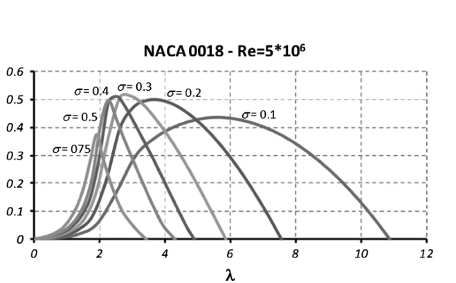
Original caption: Fig. 1 Power coefficient for a VAWT, straight blades and symmetric airfoil

Figure 1 curves were obtained using a calculation code based on MSTM theory [23].

From the graph in Fig. 1, the solidity which maximizes power coefficient `sigma = 0.3` can be identified, which has a `cpmax = 0.51` corresponding to `lambda = 3.0`.

Since solidity `sigma` equals:

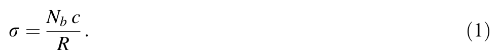

chord `c` can be expressed as a function of solidity, rotor radius and blade number `Nb`, as per Eq. 2:

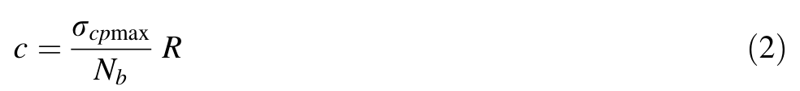

The power of a wind turbine with a vertical axis can be expressed as per Eq. 3:

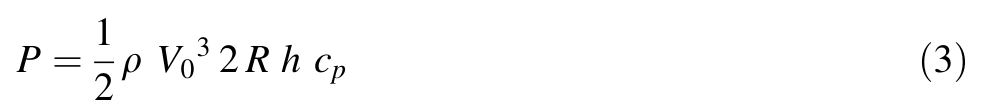

Having defined the turbine's aspect ratio (`AR = h/R`) as the ratio between blade height and rotor radius, rotor radius can be derived from Eq. 3:

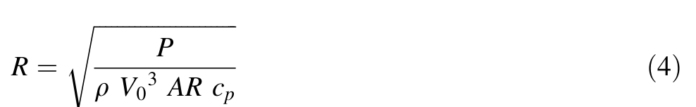

(in Eq. 4 power `P` and wind velocity `V0` are design data and `rho` is air volume mass).

This design approach is iterative and from time to time it will be necessary to re-evaluate the blade's Reynolds number and if necessary repeat the procedure with new power coefficient curves.

The local Reynolds number is:

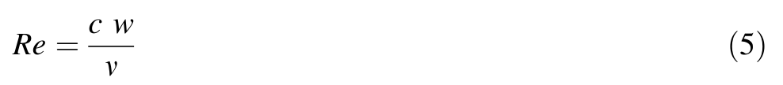

where `c` is the chord from Eq. 2, `nu` is the kinematic air viscosity, and `w` is the air speed relative to the airfoil as Fig. 2 shows.

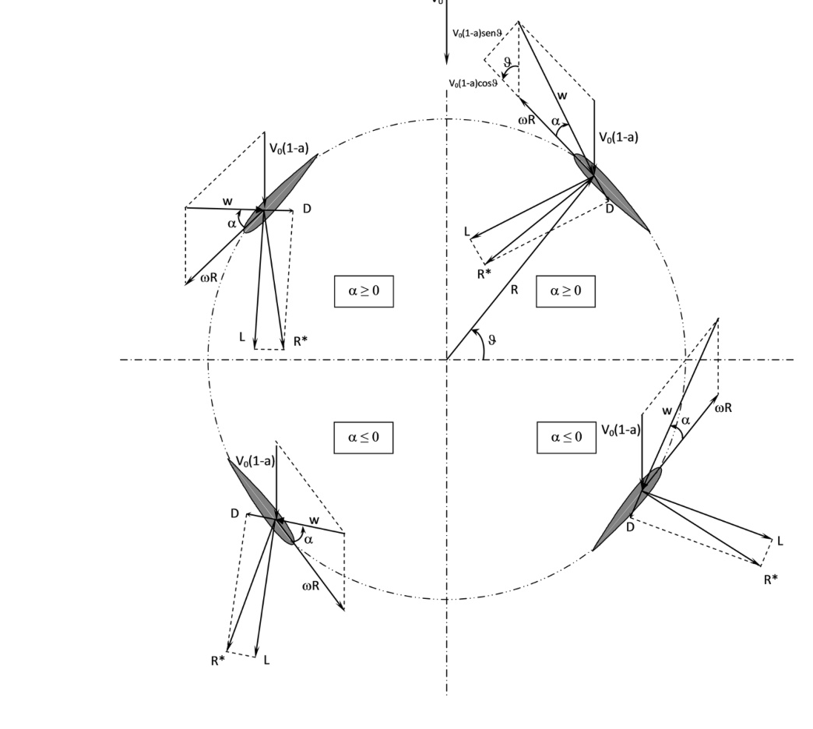
Original caption: Fig. 2 Wind rotor rotational plane

Adopting a mathematical approximation, to evaluate the Reynolds number, `w` can be substituted by `omega R` with the advantage of having a mean Reynolds number independent of the angle `theta` of rotation (see Fig. 2).

To conclude the design cycle, simply calculate `omega R` directly from TSR relative to `cpmax` identifiable in Fig. 1,

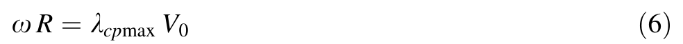

and combining Eqs. 5 and 6:

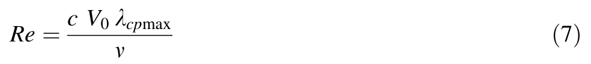

If the Reynolds number thus calculated is different to the one for the power coefficient curve adopted initially (Fig. 1), a new power coefficient curve should be plotted for a different Reynolds number (second attempt). Usually, the iterative design process needs only 2 or 3 iterations.

Figure 3 shows the power coefficient curves for the wind turbine with the `NACA 0018` airfoil, at high Reynolds numbers.

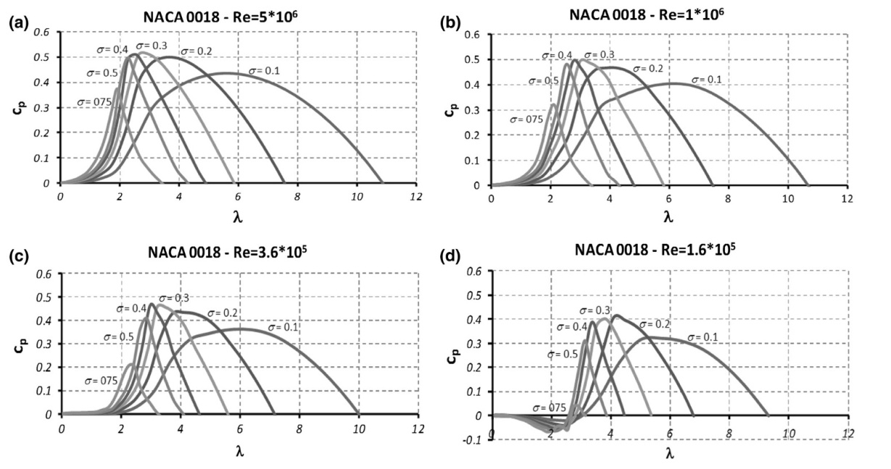
Original caption: Fig. 3 Characteristic curves for high Reynolds numbers

In conclusion, the Reynolds number strongly influences the power coefficient of a vertical-axis wind turbine. Furthermore, it changes as the main dimensions of the turbine rotor change. Increasing rotor diameter rises the Reynolds number of the blade.

## The importance of aspect ratio

In Eq. 4 note how radius `R` increases as ratio `AR` decreases. In Eq. 2 if `R` increases, chord `c` increases too, and in Eq. 7 note how increasing the chord rises the Reynolds number. Finally, Fig. 3 shows how the power coefficient increases as the Reynolds number rises.

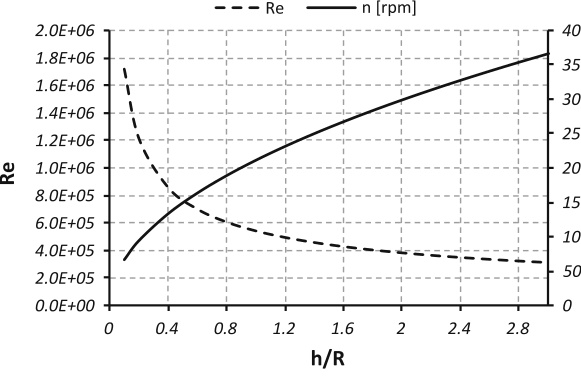
Original caption: Fig. 4 Effect of aspect ratio (h/R) on VAWT performance

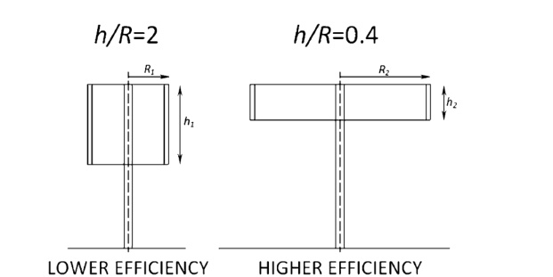
Original caption: Fig. 5 Wind turbines with different aspect ratios

Moreover, the rotational velocity `omega` can be derived from Eq. 6:

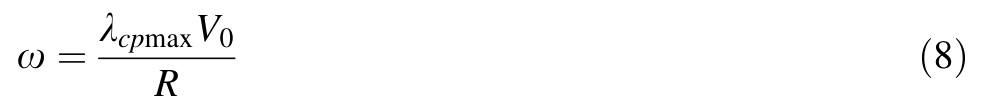

Equation (8) shows how `omega` is inversely proportional to `R`. From the Fig. 3 graph, note how `lambda_cpmax` decreases as Reynolds number rises.

So, to maximize the power coefficient, the rotor's aspect ratio should be as small as possible. As aspect ratio diminishes there are two advantages: the local Reynolds number rises and simultaneously the rotational velocity diminishes. The effect of the rotor's aspect ratio on Reynolds number and rotational velocity are shown in Fig. 4 for a twin-bladed `1 kW` turbine in a wind velocity of `10 m/s`.

Figure 5 shows two vertical-axis turbines with identical design power, blade number and aerodynamic profile (`NACA 0018`) but with two different aspect ratios (`AR1 = 2`; `AR2 = 0.4`). As stated above, the turbine with the lowest `AR` will have the highest power coefficient and the lowest rotational velocity. This turbine will display two further advantages: firstly, a structural one (thicker blades are more stress resistant) and secondly, in-service stability (greater rotor inertia).

Figure 6 shows the same graphs as Fig. 4 but parameterized for design power variation. Note how the turbines with the highest power have higher Reynolds numbers and lower rotational velocity.

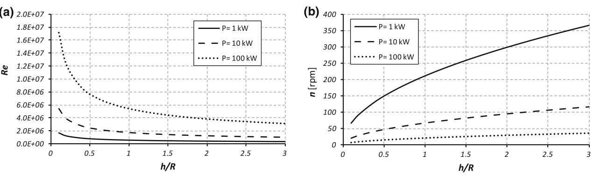
Original caption: Fig. 6 How aspect ratio influences Reynolds number and rotational velocity, for different design powers

To conclude, VAWT performance is directly related to the blade's Reynolds number. The higher this is, the better the turbine's performance. This is because as the Reynolds number increases, the blade's lift coefficient [24] rises and the drag coefficients decrease (Fig. 7a, b) thus providing greater torque.

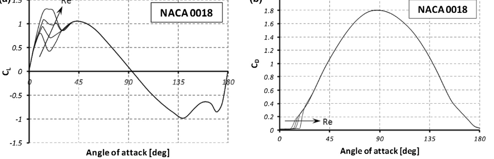
Original caption: Fig. 7 a Lift coefficient for NACA 0018. b Drag coefficient for NACA 0018

## Application for a case study

To better explain the design procedure investigated in this work, a case study is presented. From Fig. 4, it is possible to notice that the lower the `AR`, the higher the Reynolds number; this can improve wind turbine performance. In the design procedure, a choice of a low value for the `AR` is therefore suitable. In this case study, a comparison between two wind rotors, designed with two different `AR` values (`AR = 2` and `AR = 0.4`), will be presented.

Suppose, for simplicity, we want to design a VAWT with a rated power of `1 kW`, with only two straight blades with symmetrical aerodynamic profile (`NACA 0018`), and that the installation site is characterized from a mean wind speed of `10 m/s`. The design procedure is showed in the Fig. 8. In this figure a flowchart for designing the wind turbine is adopted. In this design procedure, first of all, a Reynolds number must be supposed. This Reynolds number will be called: "the first attempt Reynolds number". Supposed a first attempt Reynolds number equal to `5 x 10^6`, from the graph in Fig. 3a it is possible to read the highest performance (`cpmax = 0.51`) in correspondence of a particular rotor solidity and tip speed ratio: `sigma_cpmax = 0.3` and `lambda_cpmax = 3.0`. For an aspect ratio of `2` (`h/R = 2`) (square VAWT cross section), Eq. 4 will provide the rotor radius `R = 0.904 m` (`rho = 1.2 kg/m^3`). From Eq. 2, we obtain a chord `c = 0.136 m`, and from Eq. 8 we obtain a rotational velocity of `317 rpm`. Now a new Reynolds number (second attempt) must be evaluated from Eq. 7: `Re = 2.8 x 10^5`.

Now the design procedure should be repeated with the new value of the Reynolds number. This Reynolds number will be called: "the second attempt Reynolds number". Taking into account Fig. 3c, we will obtain the new geometric values for the wind turbine. These values are reported in Table 1. The design procedure will end when the Reynolds number does not change in a meaningful manner. The design procedure goes to numerical convergence with only two iterations.

From the data reported in Table 1 for `h/R = 2`, the design procedure gives rise to a power coefficient of `0.464`. Repeating the procedure described above for `h/R = 0.4`, we will obtain a higher efficiency: `cpmax = 0.475` (see Table 2).

Original caption: Fig. 8 VAWT design flowchart

Table 1. VAWT - straight blade's design procedure (`h/R = 2`)

| Reference | 1st attempt | 2nd attempt |
| --- | --- | --- |
| Power (kW) | 1 | 1 |
| Airfoil | NACA 0018 | NACA 0018 |
| Wind speed (m/s) | 10 | 10 |
| Air density (kg/m^3) | 1.2 | 1.2 |
| Kinematic air viscosity (m^2/s) | 1.46 x 10^-5 | 1.46 x 10^-5 |
| Rotor aspect ratio (h/R) | 2 | 2 |
| Number of blades (Nb) | 2 | 2 |
| First attempt Reynolds | 5 x 10^6 | 2.8 x 10^5 |
| `cpmax`; `sigma_cpmax`; `lambda_cpmax` | 0.51; 0.3; 3.0 (Fig. 3a) | 0.464; 0.4; 2.96 (Fig. 3c) |
| Rotor radius (m) | 0.904 | 0.947 |
| Airfoil chord (m) | 0.136 | 0.189 |
| Rotational speed (rpm) | 317 | 299 |
| Second attempt Reynolds | 2.8 x 10^5 | 3.8 x 10^5 |
| Next step | Go to the 2nd attempt | END |

Table 2. VAWT - straight blade's design procedure (`h/R = 0.4`)

| Reference | 1st attempt | 2nd attempt |
| --- | --- | --- |
| Power (kW) | 1 | 1 |
| Airfoil | NACA 0018 | NACA 0018 |
| Wind speed (m/s) | 10 | 10 |
| Air density (kg/m^3) | 1.2 | 1.2 |
| Kinematic air viscosity (m^2/s) | 1.46 x 10^-5 | 1.46 x 10^-5 |
| Rotor aspect ratio (h/R) | 0.4 | 0.4 |
| Number of blades (Nb) | 2 | 2 |
| First attempt Reynolds | 5 x 10^6 | 6.2 x 10^5 |
| `cpmax`; `sigma_cpmax`; `lambda_cpmax` | 0.51; 0.3; 3.0 (Fig. 3a) | 0.475; 0.3; 3.01 (Fig. 3c) |
| Rotor radius (m) | 2.021 | 2.094 |
| Airfoil chord (m) | 0.303 | 0.314 |
| Rotational speed (rpm) | 142 | 137 |
| Second attempt Reynolds | 6.2 x 10^5 | 6.5 x 10^5 |
| Next step | Go to the 2nd attempt | END |

## Conclusion

This work looks at designing a vertical-axis wind turbine to maximize its power coefficient. It has been seen that the power coefficient of a wind turbine increases as the blade's Reynolds number rises. Using a calculation code based on the Multiple Stream Tube Model, it was highlighted that the power coefficient is influenced by both rotor solidity and Reynolds number.

By analysing the factors which influence the Reynolds number, it was found that the ratio between blade height and rotor radius (aspect ratio) influences the Reynolds number and as a consequence the power coefficient.

It has been highlighted that a turbine with a lower aspect ratio has several advantages over one with a higher value.

The advantages of a turbine with a lower aspect ratio are: higher power coefficients, a structural advantage by having a thicker blade (less height and greater chord), greater in-service stability from the greater inertia moment of the turbine rotor.

## Open Access

This article is distributed under the terms of the Creative Commons Attribution License which permits any use, distribution, and reproduction in any medium, provided the original author(s) and the source are credited.

## References

1. Islam, M., Ting, D.S.K., Fartaj, A.: Aerodynamic models for Darrieus-type straight-bladed vertical axis wind turbines. Renew. Sustain. Energy Rev. 12, 1087-1109 (2008)
2. Pope, K., Naterer, G.F., Dincer, I., Tsang, E.: Power correlation for vertical axis wind turbines with varying geometries. Int. J. Energy Res. 35, 423-435 (2011)
3. Eriksson, S., Bernhoff, H., Leijon, M.: Evaluation of different turbine concepts for wind power. Renew. Sustain. Energy Rev. 12, 1419-1434 (2008)
4. Riegler, H.: HAWT versus VAWT small VAWTs find a clear niche, pp. 44-46. Elsevier Refocus, New York (2003)
5. Rohatgi, J., Barbezier, G.: Wind turbulence and atmospheric stability-their effect on wind turbine output. Renew. Energy 16, 908-911 (1999)
6. Castro, I.P., Cheng, H., Reynolds, R.: Turbulence over urban-type roughness: deductions from wind-tunnel measurements. Bound.-Layer Meteorol. 118, 109-131 (2006)
7. Gayev, Y.A., Savory, E.: Influence of street obstructions on flow processes within urban canyons. J. Wind Eng. Ind. Aerodyn. 82, 89-103 (1999)
8. Akhmatov, V.: Influence of wind direction on intense power fluctuations in large offshore windfarms in the North Sea. Wind Eng. 31(1), 59-64 (2007)
9. Sahin, A.D., Dincer, I., Rosen, M.A.: Thermodynamic analysis of wind energy. Int. J. Energy Res. 30, 553-566 (2006)
10. Wright, A.K., Wood, D.H.: The starting and low wind speed behaviour of a small horizontal axis wind turbine. J. Wind Eng. Ind. Aerodyn. 92, 1265-1279 (2004)
11. Sahin, A.D., Dincer, I., Rosen, M.A.: Development of new spatio-temporal wind exergy maps. Proceedings of ASME2006 Mechanical Engineering Congress and Exposition, Chicago, IL, USA, 5-10 November 2006
12. Center for Sustainable Energy: Ealing Urban Wind Study, Ealing Borough Council Urban Wind Study. The CREATE Centre, Bristol (2003)
13. Biswas, A., Gupta, R., Sharma, K.K.: Experimental investigation of overlap and blockage effects on three-bucket Savonius rotors. Wind Eng. 31(5), 313-368 (2007)
14. Bontempo, R., Manna, M.: Solution of the flow over a non-uniform heavily loaded ducted actuator disk. J. Fluid Mech. 728, 1469-7645 (2013)
15. Bontempo, R., Cardone, M., Manna, M., Vorraro, G.: Ducted propeller flow analysis by means of a generalized actuator disk model. Energy Procedia 45, 1107-1115 (2014)
16. Saha, U.: Optimum design configuration of Savonius rotor through wind tunnel experiments. J. Wind Eng. Ind. Aerodyn. 96(8), 1359-1375 (2008)
17. Hiraharaa, H., Hossainb, M.Z., Kawahashia, M., Nonomurac, Y.: Testing basic performance of a very small wind turbine designed for multi-purposes. Renew. Energy 30, 1279-1297 (2005)
18. Wakui, T., Tanzawa, Y., Hashizume, T., Nagao, T.: Hybrid configuration of Darrieus and Savonius rotors for stand-alone wind turbine-generator systems. Electr. Eng. Jpn. 150(4), 13-22 (2005)
19. Gupta, R., Biswas, A., Sharma, K.K.: Comparative study of a three-bucket Savonius rotor with a combined three-bucket Savonius-three-bladed Darrieus rotor. Renew. Energy 33, 1974-1981 (2008)
20. Ale, J.A.V., Petry, M.R., Garcia, S.B., Simioni, G.C.S., Konzen, G.: Performance evaluation of the next generation of small vertical axis wind turbine, European Wind Energy Conference and Exhibition, 7-10 May, Milano Convention Centre, Milan, Italy (2007)
21. Armstrong, S., Fiedler, A., Tullis, S.: Flow separation on a high Reynolds number, high solidity vertical axis wind turbine with straight and canted blades and canted blades with fences. Renew. Energy 41, 13-22 (2012)
22. Paraschivoiu, I.: Wind Turbine Design with Emphasis on Darrieus Concept. Polytechnic International, Canada (2002)
23. Strickland, J.H.: The Darrieus Turbine: A Performance Prediction Model Using Multiple Streamtubes, pp. 1-36. SANDIA Report SAND75-0431 (1975)
24. Robert, E., Sheldahl, Klimas, P.C.: Aerodynamic characteristics of seven symmetrical airfoil sections through 180-degree angle of attack for use in aerodynamic analysis of vertical axis wind turbines. Sandia National Laboratories. Report SAND80-2114. 1981 (1980)
25. Bhutta, M.M.A., Hayat, N., Farooq, A.U., Ali, Z., Jamil, ShR., Hussain, Z.: Vertical axis wind turbine-a review of various configurations and design techniques. Renew. Sustain. Energy Rev. 16, 1926-1939 (2012)
26. Hameed, M.S., Afaq, S.K.: Design and analysis of a straight bladed vertical axis wind turbine blade using analytical and numerical techniques. Ocean Eng. 57, 248-255 (2013)
27. Chong, W.T., Fazlizan, A., Poh, S.C., Pan, K.C., Hew, W.P., Hsiao, F.B.: The design, simulation and testing of an urban vertical axis wind turbine with the omni-direction-guide-vane. Appl. Energy 112, 601-609 (2013)
28. Cooper, P., Kennedy, O.C.: Development and analysis of a novel vertical axis wind turbine. Proceedings Solar 2004-Life, The Universe and Renewables 1-9 (2004)
29. Ajayi, O., Fagbenle, R., Katende, J., Aasa, S.A., Okeniyi, J.: Wind profile characteristics and turbine performance analysis in Kano, north-western Nigeria. Int. J. Energy Environ. Eng. 4, 27 (2013)
30. Morshed, K., Rahman, M., Molina, G., Ahmed, M.: Wind tunnel testing and numerical simulation on aerodynamic performance of a three-bladed Savonius wind turbine. Int. J. Energy Environ. Eng. 4, 18 (2013)
31. Liu, S., Janajreh, I.: Development and application of an improved blade element momentum method model on horizontal axis wind turbines. Int. J. Energy Environ. Eng. 3, 30 (2012)
