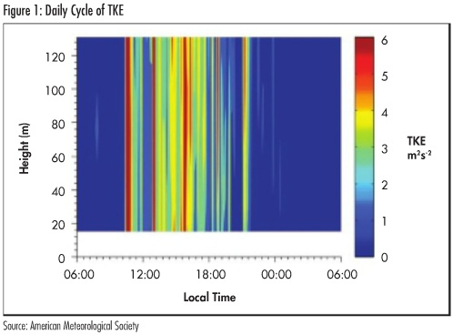

#sources
# How turbulence can impact power performance

Author: Lundquist, Julie; and Clifton, Andrew

Source: North American Windpower, September 2012

Source URL: https://www.wind-watch.org/documents/how-turbulence-can-impact-power-performance/

Atmospheric turbulence is the set of seemingly random and continuously changing air motions that are superimposed on the wind's average motion. Atmospheric turbulence impacts wind energy in several ways, specifically through power performance effects, impacts on turbine loads, fatigue and wake effects, and noise propagation.

As an example, consider water flow: steady flow is a river flowing downstream, while turbulent flow consists of the irregular swirls, or fluctuations, embedded in the steady flow. Turbulent fluctuations occur in three dimensions: along-flow (stream-wise), across flow (cross-stream) and vertically.

Individual turbulent motions are essentially unpredictable, but some properties of turbulence can be profitably analyzed in a statistical sense. Accordingly, suitable characterizations of turbulence can aid in predicting wind turbine power production. Turbulence statistics also may be extracted from simulations such as fine-scale, numerical weather-prediction models or large eddy simulations.

In the wind energy industry, turbulence is quantified with a metric called turbulence intensity, the standard deviation of the horizontal wind speed divided by the average wind speed over some time period, typically 10 minutes. If the wind fluctuates rapidly, then the turbulence intensity will be high. Conversely, steady winds have a lower turbulence intensity. Typical values of horizontal turbulence intensity, measured with a cup anemometer, range from 3% to 20%.

It can be difficult to compare turbulence intensities from one location or instrument to another. One challenge is that some types of anemometers measure a horizontal wind speed, while others measure the two horizontal components of the flow. When two components of the horizontal-flow fluctuations are measured, they cannot be simply added together to estimate the total horizontal fluctuation. Furthermore, by focusing only on the horizontal standard deviation, the vertical contribution of turbulence is ignored. The vertical component can be very strong, particularly during the day, and likely affects wind turbine productivity.

For these reasons, turbulence kinetic energy (TKE) is often a more useful metric. Just as kinetic energy is one-half the product of mass and velocity squared, TKE is based on the squares of the variations in velocities. The standard deviations of all three components of the flow are squared, summed together and divided by two. Typical values of TKE range from 0.05 m²/s² at night to 4 m²/s² or greater during the day. Therefore, both the horizontal and vertical components of the flow are represented in TKE.

## What causes atmospheric turbulence?

Turbulence occurs for many reasons. In the lowest kilometer or two of the atmosphere, known as the planetary boundary layer, turbulence is generated by friction and interactions with the surface of the earth.

On sunny days, solar radiation heats the surface, which warms the air just above, thus causing thermals to rise from the surface. This convectively generated turbulence can be intense. Convective eddies can propagate throughout the entire daytime boundary layer up to a depth of 2 km or more. Moving air near the ground slows via friction with the surface. This drag can happen both during the day and at night. Faster air flowing over slower air causes wind shear, which, in turn, causes turbulence. This shear-generated turbulence can be strong, but it tends to have shorter length and time scales than convectively driven turbulence.

Obstacles such as trees, buildings, wind turbines and terrain can deflect flow, causing turbulent wakes next to and downwind of the obstacle. This mechanically induced turbulence decays as it moves downwind of the obstacle. Although it is very strong near the obstacle, this turbulence is not as widespread as convectively generated or shear-generated turbulence, and eddies are no larger than the obstacles.

Within the lowest 200 meters of the atmosphere, turbulence experiences a daily cycle. Intense daytime solar heating triggers convection, so maximum values occur between 10 a.m. and 6 p.m. In the evening, turbulence drops to very low levels. At night, wind shear or flow obstructions may generate turbulence, or levels may remain small.

This daily cycle is due to a strong relationship between turbulence and atmospheric stability. When the atmosphere is stably stratified at night, turbulence tends to be minimal, because the buoyant heating forces from daytime heating are gone. When the atmosphere is well mixed or unstable over a warm surface, usually during the heat of the day, turbulence tends to be high. There are well-known exceptions to this rule, such as nighttime turbulence generated by strong shear of a low-level jet (LLJ).

Characterizing turbulence over differing types of terrain is useful. For example, because flow offshore is generally over a smoother (water) surface than onshore, and because the marine atmospheric boundary layer is usually more stable, the atmosphere is generally less turbulent offshore than onshore. Exceptions include the occurrence of strong turbulence-producing events, such as hurricanes, tropical storms and deep tropical convection. On the other hand, flow in complex or mountainous terrain is usually more turbulent than flow over flat terrain.

Turbulence also tends to be higher near the surface, where it typically originates, than at high altitudes. An exception occurs at night, when high shear due to the LLJ at about 100 to 400 meters above the surface can generate intermittent turbulence "bursting" events.

## Measuring turbulence

Measurements of turbulence are often made by using instruments located within the flow or in situ, such as with cup, propeller or sonic anemometers. If three-dimensional anemometers are not employed, then the vertical component of turbulence is not measured. The International Electrotechnical Commission (IEC) standard for turbine power performance measurements, IEC 61400-12-1, explicitly requires that only horizontal components be measured. Cup, propeller and sonic anemometers can all be calibrated to internationally recognized standards.

Recent advances in remote sensing technology allow for estimates of wind speed and atmospheric turbulence within large volumes. These remote sensing instruments, such as SODAR and LIDAR, send waves into the atmosphere, and then measure the Doppler shift of the backscattered signal to estimate the wind speed within a volume. Variations of the wind speed over an averaged time can provide estimates of turbulence within the measurement volume. The measurement volumes can have shapes ranging from cone-shaped to long, thin and "pencil-like" volumes up to approximately 20 meters deep.

However, atmospheric variability makes it challenging to compare volume-averaged measurements from remote sensing instruments to point-based measurements. The International Energy Agency (IEA) and the IEC are developing new guidance for the use of LIDAR and SODAR for resource assessment and power performance testing.

## Power performance and impacts

Atmospheric turbulence impacts wind energy in several ways: through power performance effects on individual turbines, through impacts on turbine loads and fatigue, and by determining how wind turbines will impact their local environment through wake effects and noise propagation. Summarizing the effects of atmospheric turbulence on power performance can be difficult because of the difficulty in characterizing wind shear and atmospheric stability.

When an individual turbine is being considered, performance is typically expressed in terms of a power curve, which relates power production to hub-height wind speed and assumes that there is one value of turbulence intensity. If there is no change in wind direction with height, high turbulence will lower the power curve near the rated speed. Conversely, high turbulence will enhance power performance near cut-in speed due to the wind-speed distribution and the shape of the power curve.

It is important to note that the effect of atmospheric turbulence can be enhanced or undermined by other factors, such as wind shear. As shown in Figure 2, power production during wind speeds of around 8 m/s can vary by up to 20% depending on turbulence intensity. Therefore, generalizations such as "turbulence undermines performance" or "turbulence enhances performance" should be avoided.

For instance, stable conditions, in which turbulence is generally suppressed, are accompanied by changes in wind direction with height. This directional shear, or "veer," will undermine turbine performance, regardless of the role of atmospheric turbulence. If measurements of turbulence at a particular site are not available, then the expected atmospheric stability, roughness and wind shear should be compared to those at other sites where turbulence impacts on power curves have been studied.

The turbulence of the inflow to a turbine will impact the loads on the turbine and, ultimately, its life span. Certain scales of turbulence have very large impacts on loads. Even if the first row of turbines on a wind farm experiences smooth or non-turbulent flow, turbines themselves generate turbulence in their wakes, and the enhanced turbulence in turbine wakes increases the loads on downwind turbines.

Furthermore, turbines located in the center of large arrays experience more faults and damaging loads than turbines located at the edge of wind farms. Aggregations of wake effects from multiple turbines are thought to be more significant at sites with lower "background" turbulence.

Additionally, enhanced mixing caused by turbine wakes can affect downwind microclimates, primarily by mixing warm air down to the surface at night. However, these effects are likely to be minor compared to atmospheric variability due to migratory weather systems.

Finally, atmospheric turbulence can affect the propagation of noise from wind turbines. During daytime conditions, strong turbulence generates background noise near the Earth's surface, masking noise from turbines. During nighttime stable conditions, low levels of turbulence near the surface enable sounds to be discerned more clearly. Also, the presence of a stably stratified layer can create a "duct," transmitting noise over long distances.

## Recommended measurement tactics

Atmospheric turbulence can have a measurable effect on turbine power production and on the loads that cause wind turbine component fatigue. Turbulence can be generated from atmospheric processes, including convection, shear stratification and friction.

Understanding the impact of turbulence is possible only if measurements of turbulence are collected. Appropriate measurements for understanding the impact of turbulence on wind energy would assess three-dimensional turbulence at altitudes within, above and below a turbine rotor disk.

There are important practical uses of this knowledge. For example, if turbine manufacturers could provide power curves for different turbulence levels, those power curves could be combined with site observations to create more accurate power production estimates.

Julie Lundquist is an assistant professor at the University of Colorado's Department of Atmospheric and Oceanic Sciences. She can be reached at julie.lundquist/colorado.edu. Andrew Clifton is a senior engineer at the National Renewable Energy Laboratory. He can be reached at andrew.clifton/nrel.gov.

This material is the work of the author(s) indicated. Any opinions expressed in it are not necessarily those of National Wind Watch.

The copyright of this material resides with the author(s). As part of its noncommercial educational effort to present the environmental, social, scientific, and economic issues of large-scale wind power development to a global audience seeking such information, National Wind Watch endeavors to observe "fair use" as provided for in section 107 of U.S. Copyright Law and similar "fair dealing" provisions of the copyright laws of other nations.

## References

- North American Windpower, September 2012. (source: sources/vj3.md)
