#sources
## Analysis of Different Blade Architectures on small VAWT Performance

L. Battisti, A. Brighenti, E. Benini, M. Raciti Castelli

University of Trento; University of Padova

E-mail: lorenzo.battisti@unitn.it

## Abstract

The present paper aims at describing and comparing different small Vertical Axis Wind Turbine (VAWT) architectures, in terms of performance and loads. These characteristics can be highlighted by resorting to the Blade Element-Momentum (BE-M) model, commonly adopted for rotor pre-design and controller assessment. After validating the model with experimental data, the paper focuses on the analysis of VAWT loads depending on some relevant rotor features: blade number (2 and 3), airfoil camber line (comparing symmetrical and asymmetrical profiles) and blade inclination (straight versus helical blade). The effect of such characteristics on both power and thrusts (in the streamwise direction and in the crosswise one) as a function of both the blades azimuthal position and their Tip Speed Ratio (TSR) are presented and widely discussed.

Keywords: small VAWT design, BE-M method, Darrieus turbine, Gorlov turbine.

## 1. Introduction

Wind energy conversion has experienced an important growth worldwide in the last two decades. This achievement has been supported by the development of the Horizontal Axis Wind Turbine (HAWT) technology, which is now the undisputed market leader. Nevertheless, the interest on wind energy harvesting in novel environments has prompted new research activities on alternative turbine technology; examples are rotors for deep-water off-shore sites (with floating foundations [1]) and building augmented wind turbines (roof installations) in the urban environment [2, 3]. In these cases, lift-driven Vertical Axis Wind Turbine (VAWT) technology offers a number of advantages, as insensitivity to yaw angle, low noise due to low tip speed ratios and, for large turbines, ground positioning of mechanical and electrical heavy parts [4]. There is a plurality of VAWT architectures (for example H-shaped, V-shaped, Troposkien-shaped and Gorlov type with helical blades, as shown in Figure 1) that introduces a complexity in the set-up of general VAWT design criteria, also considering the potential optimization of such geometries [5].

The Darrieus wind turbine was patented by G. J. M. Darrieus in 1931 [6] with Troposkien, H and V-shaped rotors, but other blade geometries have since been developed (modified Troposkien, Sandia type, etc.), with the aim of optimizing both aerodynamic and structural performances. For this reason, the curved blade shape was mainly used in large turbines. An important aerodynamic disadvantage of this architecture is the decreasing radius close to the top and the bottom of the rotor, where blades experience low peripheral speeds and therefore generate very little torque. In order to overcome this limit, a different concept was introduced: in 1986 the first H-Darrieus, or Musgrove VAWT (Figure 1, a), was prototyped. In this case, the blades are straight and therefore the radius is the same over the whole length of the blade. On the other hand, in contrast to the Troposkien blade, extra strength is necessary to cope with the centrifugal force causing bending moment, blade support struts have to be considered and should be designed in order to limit the aerodynamic drag loss.

The Darrieus turbine is usually characterized by a periodic variation of the aerodynamic forces during every rotation cycle. A straightforward method to get rid of the resulting pulsating loads is to incline the blade, as proposed by A. Gorlov [8], which lead to a helical shaped Darrieus turbine design (Figure 1, d), patented in the mid-1990s for hydro applications and adapted for wind energy exploitation since the early to mid-2000s.

In the present paper, the performances of H-shaped and helical-shaped architectures are compared on the basis of the aerodynamic loads predicted with a Blade Element-Momentum (BE-M) model. After the description and the validation of the load prediction model with experimental data, the results of simulations carried out on four different rotor architectures are presented: the here analysed rotor features are the blade number (2 and 3), the airfoil camber line (comparing symmetrical with asymmetrical profiles) and blade axis inclination (determining a straight-bladed rotor or a helical one). The effect of these layouts on power and thrusts (in the streamwise direction and in the crosswise one) as a function of blade azimuthal position and Tip Speed Ratio (TSR = w R / V0) are given and discussed, allowing the collection of some helpful pre-design considerations.

### Figure 1

Possible variants of Darrieus VAWT: H-type (a), V-type (b), Troposkien type (c), and Gorlov (helical type, d) [7].
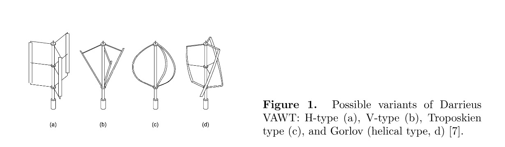

## 2. The loads predictor model

The loads predictor model used in this analysis is based on the BE-M theory, a computational approach commonly adopted for rotor pre-design and controller assessment. As well known, it does not take into account ambient turbulence; nevertheless, even though field operations in stochastic wind will of course have an impact on both turbine aerodynamic and structural behaviour (that can partially alter the here presented results), such approach can still highlight basic differences among the here proposed architectures, especially as far as the relative forces induced by their layout and their blade profiles are concerned.

The present predictor code is a Double Disk - Multiple Streamtube as developed by Templin [9] and modified by Strickland [10] and Paraschivoiu [4]: it can be considered reliable enough to capture the most relevant VAWT aerodynamic behaviour. The Boeing-Vetrol model, as modified by Strickland and Paraschivoiu [4], was also implemented to consider the effects of dynamic stall in the operation at low TSRs (or medium-high wind speeds, being all the present rotors operated at constant angular speed), where the rotor experiments the so called "low loading region" and its blades mainly stall. Moreover, three-dimensional effects, as blade tip vortices, were incorporated into the present BE-M code as an additional induced drag, computed on the basis of the Prandtl correction, which considers the effect of tip vorticity on finite wings [11].

Small VAWTs present specific features that cannot be neglected in the design process, as the effect of support structures (struts and shaft). As a matter of fact, the parasitic losses introduced by these additional components may have a significant influence on the net torque production [4] and they should usually be considered in the design phase.

Being easily achievable and characterized by fast response times, BE-M codes are very widespread, but the reliability of their results is strongly dependent on the quality and the extension of the adopted aerodynamic database [12, 13]. Moreover, most of the experimental profile databases available in literature, originally derived for aeronautical applications, exhibit a limited compass of the angle of attack (usually up to the stall condition) and medium-high Reynolds numbers, which are unsuitable for small rotor applications. An appropriate choice of the airfoils database at low Reynolds numbers (NACA 0012 and 0015 airfoils at Reynolds numbers of 3.5 x 10^5, 5.0 x 10^5 and 7.0 x 10^5 [15]) was made, and the extension to high angles of attack (by resorting to the Viterna-Corrigan model [14]) was implemented.

To validate the load predictor model here described, the power coefficient of the 5-meter diameter three-bladed Darrieus wind turbine of the Sandia National Laboratories [16] was recalculated: the predictor nicely replicated the experimental data at constant rotational speed, as Figure 2 shows. A second validation is presented in Figure 3, where the local tangential force coefficient CT, calculated with the present code, is compared with the experimental results from Strickland et al. [17, 18]: a quite good agreement with experimental data is found in the upwind path crossed by the blade, although a general shift of the peaks at some azimuthal blade positions is visible. This behaviour was observed also by Paraschivoiu [4] and could be ascribed to an erroneous calculation of the angle of attack, which is altered by the dynamic stall model.

### Figure 2

Predicted (blue line) and experimental (grey square markers) power coefficients for the SANDIA wind turbine [16].
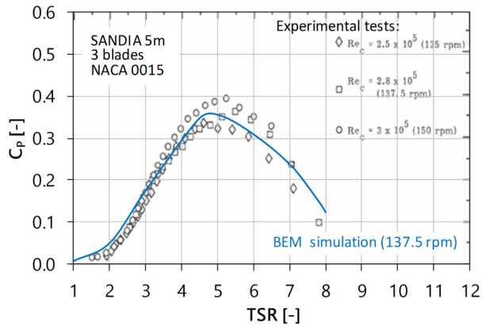

### Figure 3

Predicted (blue dashed line) and experimental (black line) tangential force coefficients during a rotor revolution [18].
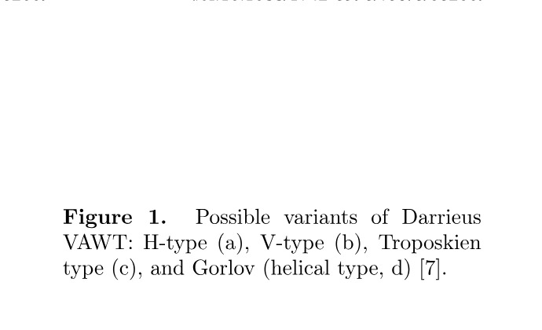

## 3. Results and Comments

The main results of simulations carried out on four different VAWT architectures are here presented. Table 1 collects the most relevant geometrical characteristics of the analysed stall-regulated rotors, as well as their operating conditions.

The H-shaped rotor was chosen as an alternative of the "eggbeaters" Darrieus-type (where the decreasing radius near the top and the bottom of the rotor drives some blade sections with low tangential speeds, hence leading to very little contribution to the torque generation): as a matter of fact, the H-Darrieus rotor involves almost the full blade length into torque generation (with the partial exception of the blade tips) and this simple shape permits a strong reduction of the blade manufacturing costs (both using the injection moulding and, much more, by resorting to the pultrusion production process). Nevertheless, the H-Darrieus rotor requires aerodynamic support struts for the blades and a careful blade design, with potential drawbacks on costs due to the required adoption of high strength material.

As already known, rotor solidity has a great impact on the CP-TSR curve. The proposed architectures present the same rotor solidity to permit a fair aerodynamic rotor comparison, avoiding the solidity effect. A high solidity VAWT design permits to keep the optimum turbine rotational velocity relatively low, minimizing rotor vibrations and maximizing the aerodynamic efficiency. Decreasing the solidity, the maximum CP value decreases, but the useful operating TSR range at about maximum CP increases, helping the turbine controllability and the energy harvesting. In the presented study, the rotor solidity (sigma, defined as the developed surface area of all blades divided by the swept area of the rotor) was fixed at 0.15, as a good compromise between rotor efficiency and controllability. Moreover, all computations were performed assuming a constant swept area (A) which, determining the turbine size, is one of the main rotor design parameters.

Following the design adopted in classical Sandia Darrieus turbines, the rotor aspect ratio (the ratio of height to diameter) was set to 1 for all the considered architectures. Also the same Reynolds number (w R c / nu) was maintained for all the considered rotors, varying the rotational speed (Omega) where necessary (see e.g. the case E, Table 1). In the case of the two-bladed rotor, two operational conditions were analysed: a first comparison was performed maintaining the same Reynolds number (case A), and a second comparison (case B) was carried out adopting the same rotational speed of three-bladed rotors, in order to reach a similar peak power.

The choice of the blade number is mainly driven by structural, aerodynamic and cost considerations. Early Sandia studies, mainly focused on large VAWTs, indicated that the capital and installation costs associated with a three-bladed rotor were significantly higher than those of a two-bladed one [19]. In the following, two versus three bladed rotors are compared, with the aim of providing some design indication also for small VAWTs.

In the past, Darrieus VAWTs were typically manufactured using NACA symmetrical airfoils (mostly 0015 and 0018). In order to have an appropriate structural performance (bending stiffness), the airfoil thickness to chord ratio had to be increased as much as possible. As a consequence, the NACA 0018 airfoil was chosen for the present comparison, as well as the DU 06-W-200, a laminar airfoil designed specifically for VAWT applications by Delft University [20]: it is a 20% thick airfoil (to improve structural strength) with a 0.8% camber. A comparison between the two profiles is provided, in terms of coordinates (in Figure 4) as well as polar characteristics (Figure 5).

As already mentioned, the present comparison was made on the basis of rotor aerodynamic loads, also leading to some considerations about both rotor performance and main structural characteristics. No parasitic torque losses generated by the support structure (struts) and no thrust acting on the shaft were taken into account, with the aim of focusing only on the effect of the blade architecture.

As far as rotor performance aspects are concerned, the power coefficient (Figure 6) is here analysed. The number of blades has a marked effect on the maximum aerodynamic CP: as a matter of fact, for a 15% solidity and Reynolds number of 2.17 x 10^5, the two-bladed rotor (case A) shows the smallest power coefficient if compared to three-bladed rotors (cases C, D and E). This is due to the increased blade chord, lower aspect ratio and, as a consequence, increased blade tip losses. Such result could appear in contrast to Sandia experiments [21] on eggbeater small VAWTs, where the power coefficient achieved by any of the tested VAWTs resulted the same if rotor solidity and chord Reynolds number were kept fixed; this could be ascribed to the Sandia blade shape [4, 21], a "closed" configuration with respect to the H-shaped one, and therefore less inclined to promote large tip vortices, as shown during some experimental tests carried out by the authors at the Politecnico of Milan (IT) [22]. Moreover, as expected, when the tangential blade speed (U = Omega R) is increased (see case B vs case A), the relative local flow speed at the blade (W) increases too, thus promoting a growth in the instantaneous blade tangential force (FT = 1/2 rho W^2 CT Ab), torque (Q = FT R) and power (P = Q Omega). A matter of fact, this represents a practical solution to enhance average performance efficiency (for all TSRs, as shown in Figure 6) and power (Figure 7).

Focusing on the airfoil shape, all rotors using the symmetrical NACA 0018 profile (case A, B, C and D) show a similar behaviour at low TSRs, while the laminar DU profile (case E) allows better performances at starting TSRs (i.e. at low rotor speed). Darrieus turbines are notoriously bad starters, but the choice of a profile with good performances at high angles of attack (typically reached during low TSR operation) could mitigate such characteristic and more experimental investigations on VAWT dedicated cambered airfoils are to be encouraged. In contrast, the DU profile performs worse than the NACA 0018 at high TSRs, and the corresponding rated wind speed (as shown in Table 2) appears to be the highest. Nevertheless, probably as a consequence of better polar characteristics (Figure 5), the rotor with the DU profile outperforms all the other considered rotors at Re = 2.17 x 10^5, in terms of both maximum power coefficient (Figure 6) and power exchange (Figure 7).

The effect of blade axis inclination is analysed comparing the H-shaped rotor (case C) with the helical one (case D). A twisted blade geometry (case D) ensures that there is always a blade section at each possible angle of attack, averaging and smoothing out the loads oscillations. As a consequence, it clearly appears that the helical-bladed configuration presents a larger TSR range very close to the maximum power coefficient (a less narrow curve in Figure 6), a more beneficial condition in both power exchange (Figure 7) and controller requirements.

In addition to the performance characteristics collected in Table 2, a wind energy exploitation is simulated and the corresponding annual energy outputs (AEOs) are reported in Figure 8, in accordance with the power curves of Figure 7.

On the basis of both the performance and energetic considerations presented above, and excluding the rotor with increased Reynolds number (case B), it appears that a three-bladed configuration is better than the corresponding two-bladed one. Moreover, the rotor with the DU profile (case E) appears to be strongly limited in exploiting the wind resource at medium-low wind speeds, as is typical of the urban environment. Finally, the helical shaped configuration (case D) clearly appears as an improved rotor architecture.

### Table 1. Geometrical characteristics and operating conditions of the analysed VAWTs

| Parameter | case A | case B | case C | case D | case E |
|---|---:|---:|---:|---:|---:|
| Rotor type | H-Darrieus | H-Darrieus | H-Darrieus | Gorlov | H-Darrieus |
| Blade shape | Straight | Straight | Straight | Helical | Straight |
| Blade number (N) | 2 | 2 | 3 | 3 | 3 |
| Height (H) | 2.0 m | 2.0 m | 2.0 m | 2.0 m | 2.0 m |
| Diameter (D) | 2.0 m | 2.0 m | 2.0 m | 2.0 m | 2.0 m |
| Chord (c) | 0.150 m | 0.150 m | 0.100 m | 0.094 m | 0.100 m |
| Blade length (L) | 2.000 m | 2.000 m | 2.000 m | 2.135 m | 2.000 m |
| Blade inclination (gamma) | 0 deg | 0 deg | 0 deg | 20.5 deg | 0 deg |
| Blade profile | NACA0018 | NACA0018 | NACA0018 | NACA0018 | DU06W200 |
| Rotor swept area (A) | 4.0 m^2 | 4.0 m^2 | 4.0 m^2 | 4.0 m^2 | 4.0 m^2 |
| Solidity (sigma) | 0.150 | 0.150 | 0.150 | 0.150 | 0.150 |
| Rotor speed (Omega) | 200 rpm | 300 rpm | 300 rpm | 320 rpm | 300 rpm |
| Reynolds number (Rec) | 2.17 x 10^5 | 3.25 x 10^5 | 2.17 x 10^5 | 2.17 x 10^5 | 2.17 x 10^5 |

### Figure 4

Shape profile comparison between the DU 06-W-200 and the NACA 0018 airfoils [20].
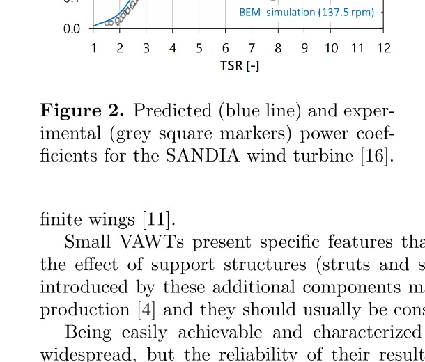

### Figure 5

Clean wind tunnel data comparison between the DU 06-W-200 and the NACA 0018 airfoils [20] at Re = 300 000.
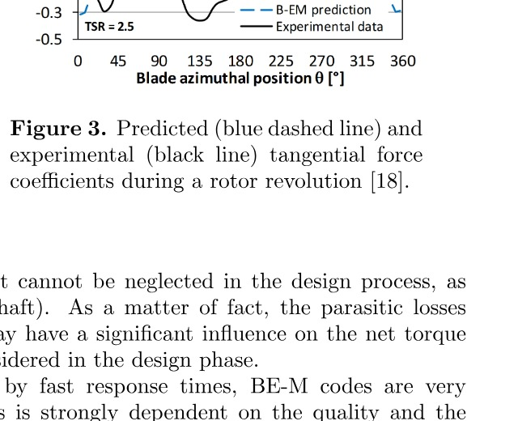

### Figure 6

Power coefficient CP curves at different TSRs.
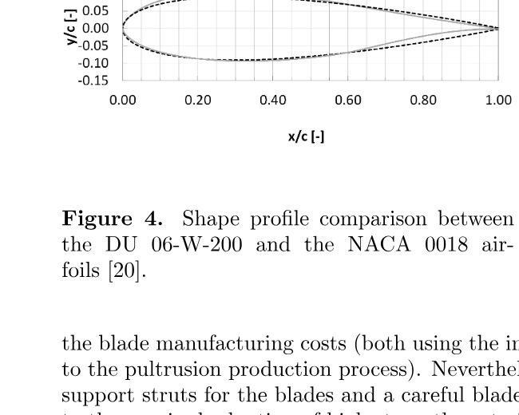

### Figure 7

Power curves at different wind speeds V0 for the considered turbines.
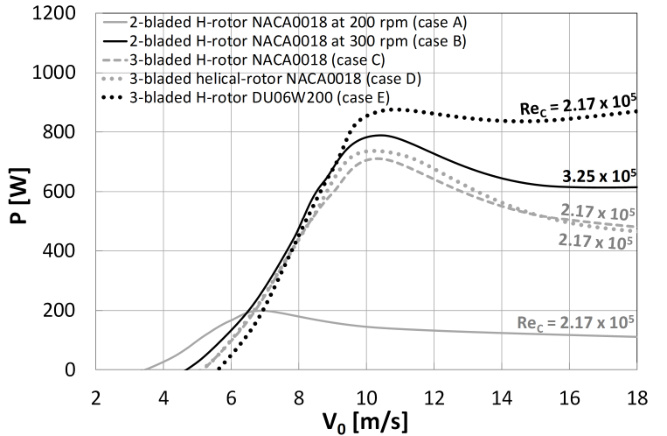

### Table 2. Performance characteristics of the analysed VAWTs

| Parameter | case A | case B | case C | case D | case E |
|---|---:|---:|---:|---:|---:|
| Rated power (PR) | 200 W | 790 W | 710 W | 750 W | 880 W |
| SRO (PR/A) | 0.05 kW/m^2 | 0.20 kW/m^2 | 0.18 kW/m^2 | 0.14 W/m^2 | 0.22 W/m^2 |
| Rated wind speed (VR) | 7.0 m/s | 10.5 m/s | 10.5 m/s | 9.0 m/s | 11.0 m/s |
| Cut-in wind speed (Vcut,in) | 3.5 m/s | 4.7 m/s | 5.2 m/s | 5.2 m/s | 5.6 m/s |
| CP,opt | 0.34 | 0.41 | 0.37 | 0.36 | 0.40 |

### Figure 8

Annual energy output (AEO) at different wind speeds V0 for the considered turbines (the Weibull shape parameter is set to 1.7). All the presented rotors operate at fixed angular speed; the chord Reynolds number is 2.17 x 10^5, except for the case B (Re = 3.25 x 10^5).
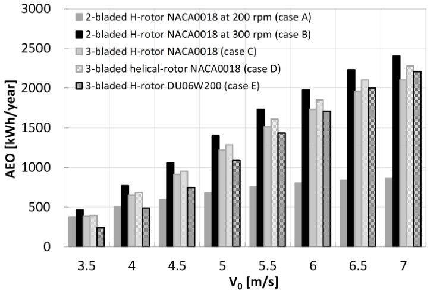

### Streamwise thrust

The streamwise thrust is given in Figure 9 (as a force coefficient CTX versus TSR) and in Figure 10 (as a force TX versus V0). Contrarily to the case of the power coefficient curves, very similar thrust coefficient curves are experienced by the tested architectures, despite the quite different rotor configurations. Thrust curves (Figure 10), instead, clearly show a direct correlation with the aerodynamic power.

It is here the case of recalling that VAWT aerodynamic forces can strongly vary during a rotation cycle, due to the continuous change in the angles of attack, reducing the fatigue life of various components of the drive train (such as shafts, couplings and transmissions) and also affecting the output power quality. Of course, other events (such as changes in wind magnitude and direction) also contribute to determine a variation of the aerodynamic loads with time.

Figures 11 and 12 show a further comparison based on both torque and thrust (in the X-Y plane) variation during a rotor revolution. The selected working condition is at the optimum status (i.e. at the maximum power coefficient), reached at different TSRs by the considered turbines, as shown in Table 3. The comparison is performed maintaining fixed both wind speed and rotor angular velocity. An harmonic oscillation of aerodynamic loads is considered and a parameter R is defined as the ratio between mean-to-peak values and the mean value; a low R value means small loads oscillation. Table 3 provides the R-parameter for both torque and thrust data.

The simulation results collected in Figures 11 and 12 show, as expected, that the Reynolds number and the number of blades have the major effect on the pulsating loads. Hence, in general, a higher number of blades decreases both torque and thrust oscillations (see again Table 3). Designs with fewer blades and larger chords (and hence thickness, cases A and B) are structurally more effective, but the symmetrical loading of a two-bladed rotor provides very challenging design problems, as rotor instability. The airfoil camber modified mainly the mean value of torque and thrust (case E), with no beneficial effects on the R-parameter reduction and, hence, in the loads variation. According to the presented results, it can be concluded that a straightforward method to strongly reduce both the pulsating torque and thrust is to include a third blade (cases C, D and E) and, even more, to resort to helical blades (case D). As a matter of fact, blade inclination seems to reduce some of VAWT most challenging design problems, extending the turbine fatigue life and reducing its vibrations (with beneficial effects on bearings, bolts, etc.). Nevertheless, it is here recognized that more experimental tests have to be performed on the Gorlov wind turbine, in order to further investigate such promising rotor architecture.

### Figure 9

Streamwise thrust coefficient CTX curves at different TSRs.
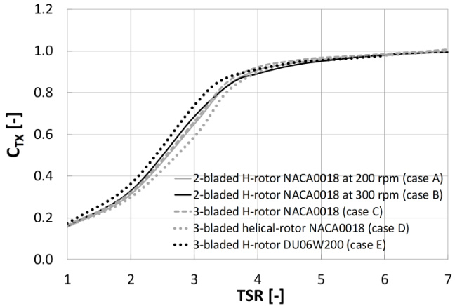

### Figure 10

Streamwise thrust curves at different wind speeds V0 for the considered turbines.
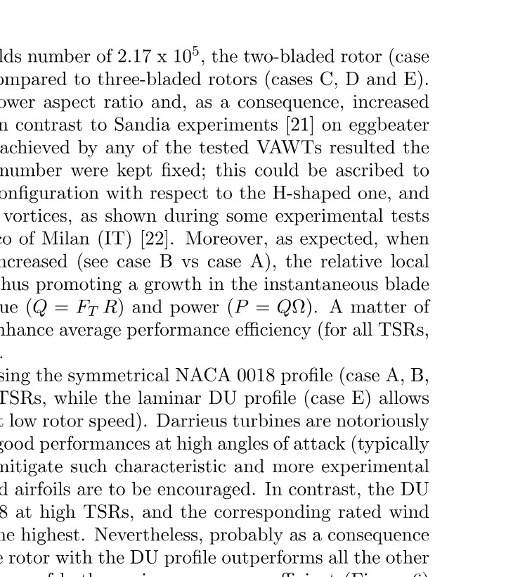

### Figure 11

Torque curves during a rotor revolution at the maximum CP (reached at different TSRs by the considered turbines).
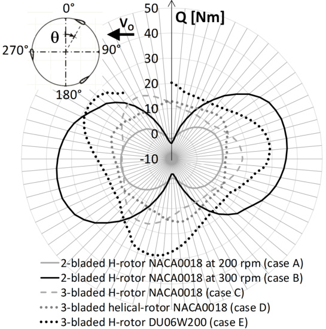

### Figure 12

Thrust curves during a rotor revolution at the maximum CP (reached at different TSRs by the considered turbines).
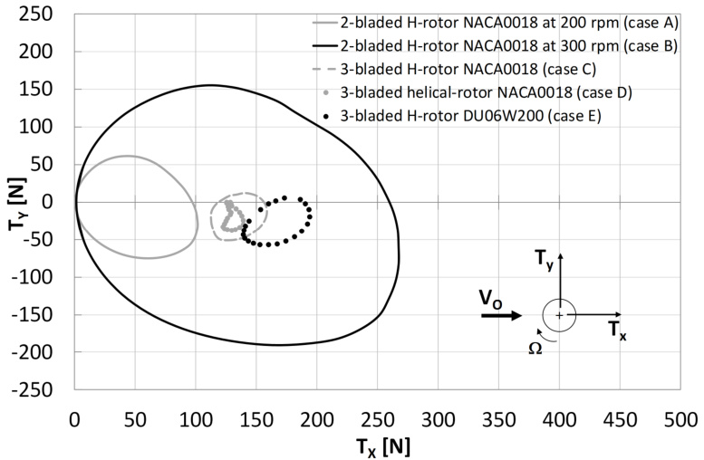

### Table 3. Relevant characteristics of the VAWT loads analysed at the maximum power coefficient (CP,opt)

| Parameter | case A | case B | case C | case D | case E |
|---|---:|---:|---:|---:|---:|
| Q | 5.5 Nm | 20.1 Nm | 13.2 Nm | 12.9 Nm | 21.9 Nm |
| RQ | 1.47 | 1.23 | 0.29 | 0.16 | 0.28 |
| TX | 58.2 N | 151.1 N | 132.9 N | 129.6 N | 164.9 N |
| RTx | 0.98 | 0.98 | 0.17 | 0.06 | 0.16 |
| TSRopt | 3.9 | 3.7 | 3.9 | 4.0 | 3.4 |
| Vopt | 5.4 m/s | 8.1 m/s | 8.1 m/s | 7.8 m/s | 9.2 m/s |
| Omega | 200 rpm | 300 rpm | 300 rpm | 300 rpm | 300 rpm |

Note: R = max - min / max + min

## 4. Conclusions

An aerodynamic analysis is presented with the aim of comparing the performances of different small VAWT architectures with the same swept area and rotor solidity. The comparison was also made in terms of loads, changing some rotor features as blade number (2 and 3), airfoil camber line (using both symmetrical or asymmetrical profiles) and blade axis inclination (straight versus helical blades). A Blade Element-Momentum (BE-M) model was used to obtain the relevant aerodynamic loads.

As expected, three-bladed wind turbines exhibit a better performance if compared to two-bladed ones. As a consequence, a higher thrust is also registered. A lower variation of both torque and thrust also emerges when compared to a two-bladed rotor. Such behaviour could represent a great advantage for three-bladed small VAWT architectures, for which the increased manufacturer and installation costs are not so important as for large rotors.

Moreover, the here proposed computations using the DU 06-W-200 cambered airfoil suggest an increased rotor performance at starting TSRs (at low rotor speed, mitigating VAWT start-up problems), but also a marked limitation in exploiting the wind resource at medium to low wind speeds, which are typical of the urban environment.

Because the fatigue life of VAWTs is often considered as important as power production, of great interest also appears the helical shaped rotor, which further reduces the cyclic oscillation of the aerodynamic loads, thus extending the turbine long-term life and reducing its vibrations during operation. Moreover, it shows an enlarged performance curve, resulting more suitable for power controller purposes. It also appears as the most efficient architecture for the wind energy exploitation. However, the operation of the helical turbine at starting TSRs appears less efficient, the blade manufacturing cost is actually higher than the straight blade type and more experimental tests have still to be encouraged, in order to clarify the actual potential and limits of Gorlov wind turbines.

## List of symbols

### Latin

- A rotor swept area [m2]
- AoA Angle-of-Attack [deg]
- B rotor blade number [-]
- c airfoil chord length [m]
- CD drag coefficient [-]
- CL lift coefficient [-]
- CTX rotor streamwise thrust coefficient [-]
- CP aerodynamic power coefficient [-]
- CP,opt maximum aerodynamic power coefficient [-]
- H rotor height [m]
- L blade length [m]
- P aerodynamic power [W]
- Q aerodynamic torque [Nm]
- Rec chord Reynolds number = w R c/nu [-]
- t airfoil thickness [m]
- Q average torque for a rotation [Nm]
- RQ Qmax-Qmin / Qmax+Qmin
- RTx Tx,max-Tx,min / Tx,max+Tx,min
- TSR tip-speed-ratio = w R / V0 [-]
- TSRopt tip-speed-ratio at maximum CP [-]
- TX rotor streamwise thrust [N]
- V0 freestream speed [m/s]
- Vopt wind speed at maximum CP [m/s]

### Greek

- gamma axis blade inclination in respect of the axis rotation [deg]
- Theta azimuthal blade position [deg]
- nu freestream kinematic viscosity [m2/s]
- rho freestream density [kg/m3]
- sigma rotor solidity = B L c/A [-]
- Omega rotor angular velocity [rpm]
- w rotor angular velocity [s-1]

### Acronyms

- AEO Annual Energy Output
- BE-M Blade Element-Momentum
- HAWT Horizontal Axis Wind Turbine
- VAWT Vertical Axis Wind Turbine

## References

[1] Paulsen U.S. et al. (2011) DeepWind-an innovative wind turbine concept for offshore. EWEA 2011 Conf. Proc.

[2] Mertens S. et al. (2003) Performance of an H-Darrieus in the skewed flow on a roof. J.of Sol.En.Eng., 125:433-440.

[3] Balduzzi A. et al. (2012) Feasibility analysis of a Darrieus vertical-axis wind turbine installation in the rooftop of a building. Applied Energy, 97, pp. 921-929.

[4] Paraschivoiu I. (2002) Wind Turbine Design - With Emphasis on Darrieus Concept. Polytechnic International Press: Montral, Canada, 2002.

[5] Bhutta M.A. et al. (2012) Vertical axis wind turbine-A review of various configurations and design techniques, Ren.& Sust.En.Rev.,16:1926-1939.

[6] Darrieus G.J.M. (1931) Turbine Having its Rotating shaft Transverse to the Flow of the Current. US patent 1,835,018, 8-12-1931.

[7] Battisti L. (2012) Gli impianti motori eolici, Battisti Editore, 2012.

[8] Gorlov A.M. (1998) Development of the helical reaction hydraulic turbine. Technical Report, US Department of Energy, DE-FG01-96EE 15669.

[9] Templin R.S. (1974) Aerodynamic Performance Theory for the NRC Vertical-Axis Wind Turbine. National research Council of Canada, Ottawa, LTR-160, 1974.

[10] Strickland J.H. (1975) The Darrieus Turbine: A Performance Prediction Model Using Multiple Streamtubes. Sandia National Laboratories, Albuquerque, New Mexico, SAND75-0460, 1975.

[11] Prandtl L., Tietjens O.G. (1957) Applied Hydro and Aeromechanics. Dover Publications, New York, 1957.

[12] Tangler J., Kocurek J.K. (2005) Wind Turbine Post-Stall Airfoil Performance Characteristics Guidelines for Blade-Element Momentum Methods. National Renewable Energy Laboratory, NREL/CP-500-36900.

[13] Bedon G. et al. (2014) Evaluation of the different aerodynamic databases for vertical axis wind turbine simulations. Renewable and Sustainable Energy Reviews, 40(2014): 386-399.

[14] Viterna L.A., Corrigan R.D. (1982) Fixed pitch rotor performance of large horizontal axis wind turbines. Technical report CP-2230, NASA, USA, 1982.

[15] Sheldahl R.E., Klimas P.C. (1981) Aerodynamic characteristics of seven symmetrical airfoil sections through 180-degree angle of attack for use in aerodynamic analysis of vertical axis wind turbines. No. SAND-80-2114. Sandia National Labs., Albuquerque, NM (USA), 1981.

[16] Sheldahl R.E., Klimas P.C., Feltz L.V. (1980) Aerodynamic Performance of a 5-Metre-Diameter Darrieus Turbine with Extruded NACA 0015 Blades. SAND80-0179, March 1980.

[17] Strickland J.H., Webster B.T., Nguyen T. (1979) A vortex model of the Darrieus turbine: an analytical and experimental study. Sandia National Laboratories, Albuquerque, New Mexico, SAND79-7058, 1979.

[18] Strickland J.H., Smith T., Sun K. (1981) A vortex model of the Darrieus turbine: an analytical and experimental study. Sandia National Laboratories, Albuquerque, New Mexico, SAND81-7017, 1981.

[19] Sutherland H.J, Berg D.E., Ashwill T.D. (2012) A Retrospective of VAWT Technology. Sandia National Laboratories, Albuquerque, New Mexico, SAND2012-0304, 2012.

[20] Claessens M.C. (2006) The Design and Testing of Airfoils for Application in Small Vertical Axis Wind Turbines. Master of Science Thesis, Delft University of Technology, 2006.

[21] Blackwell B.F., Sheldahl R.E., Feltz L.V. (1976) Wind Tunnel Performance Data for the Darrieus Wind Turbine with NACA 0012 Blades, Sandia National Laboratories, SAND76-0130, 1976.

[22] Dossena V., Persico G., Paradiso B., Battisti L., Brighenti A., Benini E. (2016) Three dimensional character of VAWT wakes: an experimental investigation for H-shaped and Troposkien architectures in Proceedings of the ASME Turbo Expo 2016, Seoul, South Korea, June 13-17, 2016.
