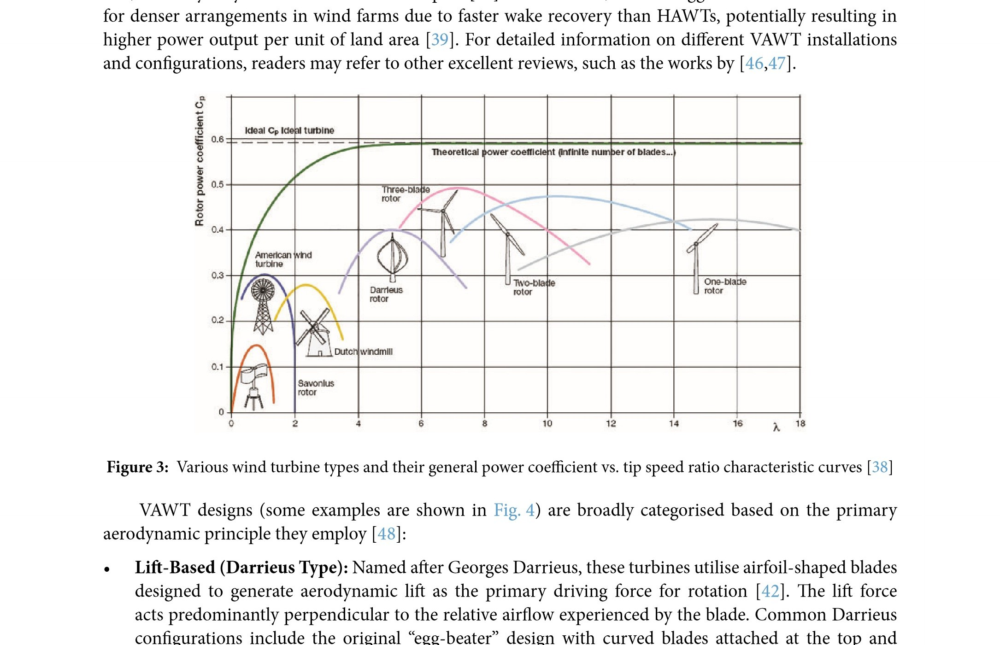
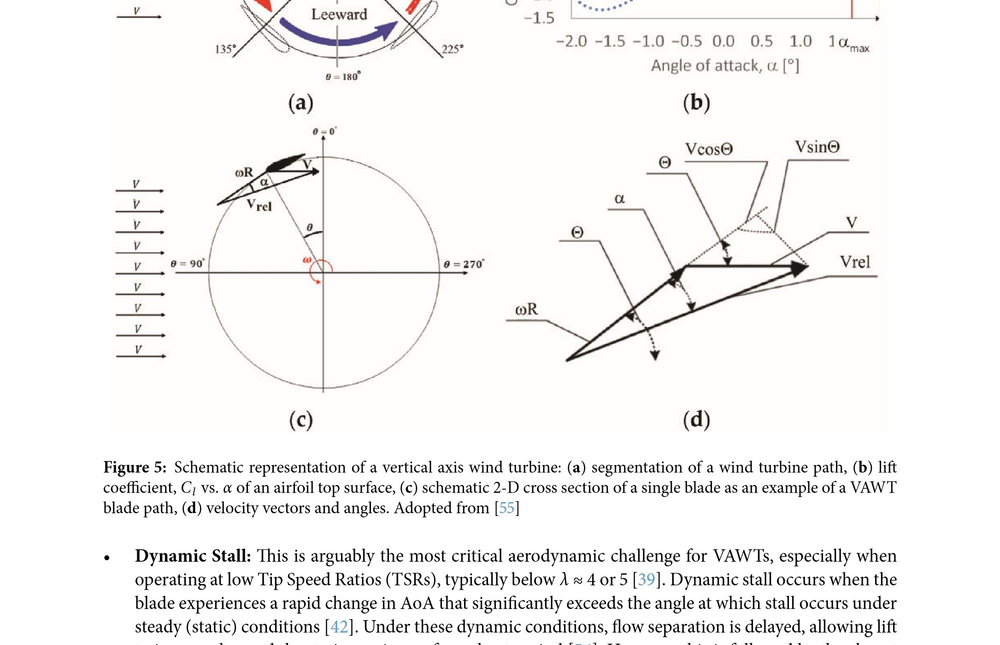
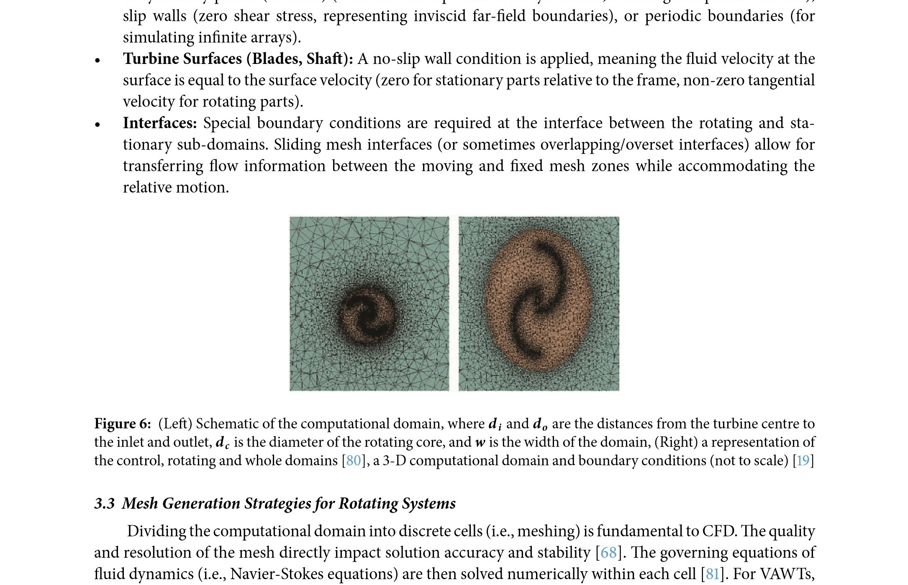
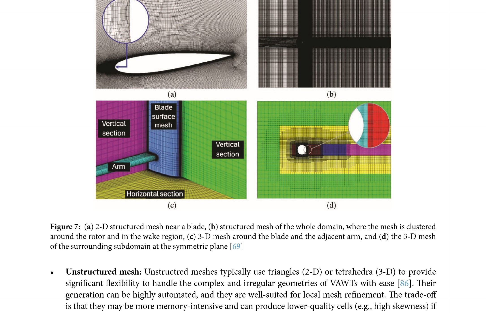
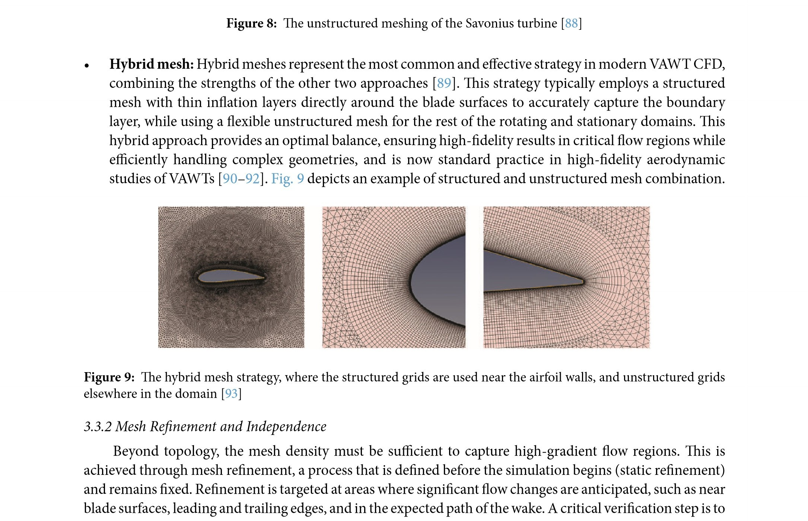
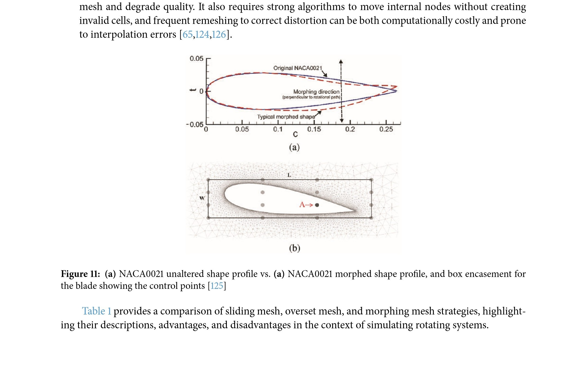
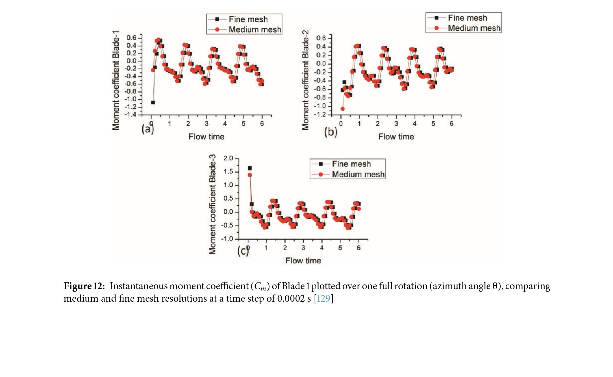
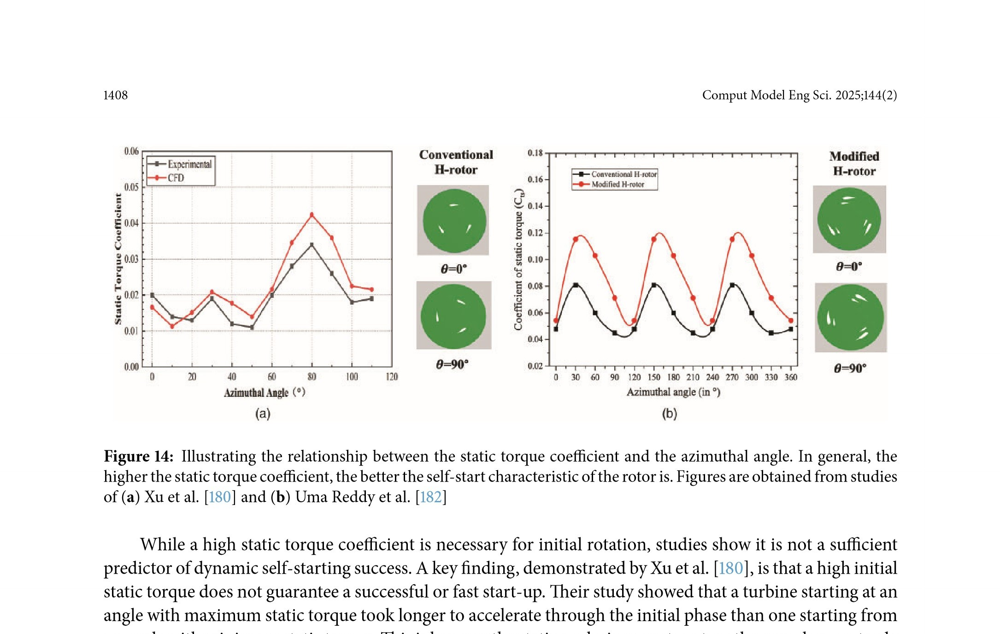
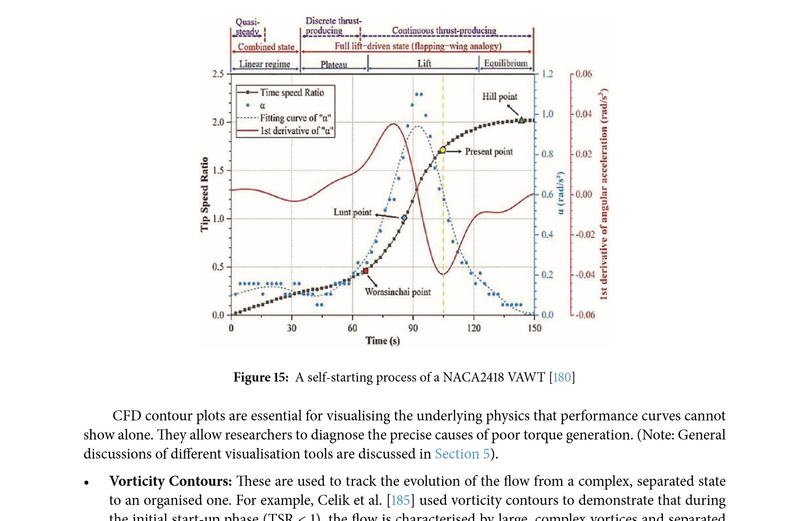
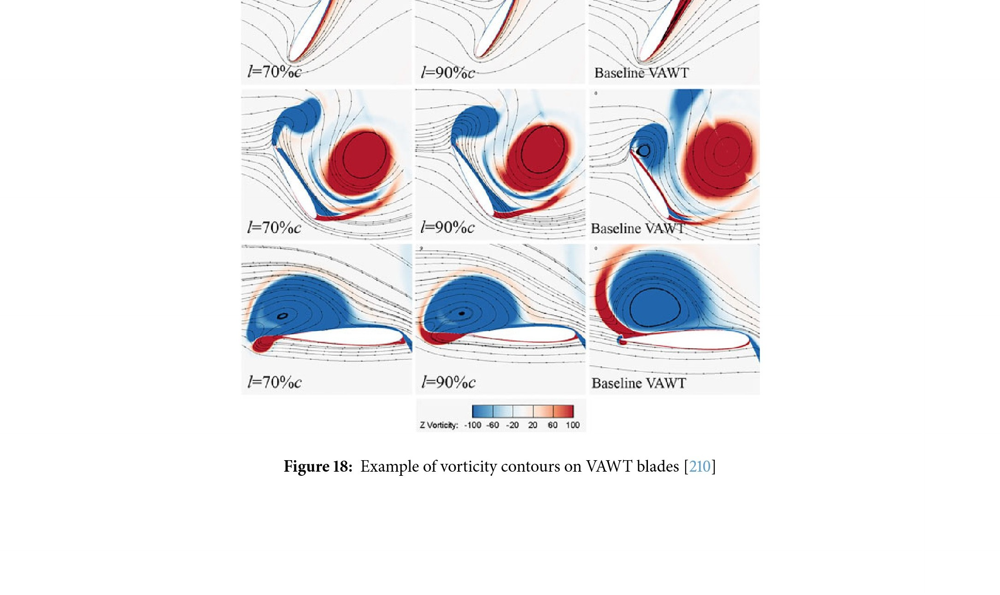

# A Review of Computational Fluid Dynamics Techniques and Methodologies in Vertical Axis Wind Turbine Development

Ahmad Fazlizan, Wan Khairul Muzammil, and Najm Addin Al-Khawlani

## Abstract
This review provides a comprehensive and systematic examination of Computational Fluid Dynamics

(CFD) techniques and methodologies applied to the development of Vertical Axis Wind Turbines (VAWTs). Although

VAWTs offer significant advantages for urban wind applications, such as omnidirectional wind capture and a com-

pact, ground-accessible design, they face substantial aerodynamic challenges, including dynamic stall, blade—wake

interactions, and continuously varying angles of attack throughout their rotation. The review critically evaluates how

CFD has been leveraged to address these challenges, detailing the modelling frameworks, simulation setups, mesh

strategies, turbulence models, and boundary condition treatments adopted in the literature. Special attention is given

to the comparative performance of 2-D vs. 3-D simulations, static and dynamic meshing techniques (sliding, overset,

morphing), and the impact of near-wall resolution on prediction fidelity. Moreover, this review maps the evolution

of CFD tools in capturing key performance indicators including power coefficient, torque, flow separation, and wake

dynamics, while highlighting both achievements and current limitations. The synthesis of studies reveals best practices,

identifies gaps in simulation fidelity and validation strategies, and outlines critical directions for future research,

particularly in high-fidelity modelling and cost-effective simulation of urban-scale VAWTs. By synthesizing insights

from over a hundred referenced studies, this review serves as a consolidated resource to advance VAWT design and

performance optimization through CFD. These include studies on various aspects such as blade geometry refinement,

turbulence modeling, wake interaction mitigation, tip-loss reduction, dynamic stall control, and other aerodynamic

and structural improvements. This, in turn, supports their broader integration into sustainable energy systems.

**Keywords:** Computational fluid dynamics; vertical axis wind turbine; turbulence models; airfoils; urban wind

## 1 Introduction

### 1.1 Background on Vertical Axis Wind Turbines

Vertical axis wind turbines (VAWTs) offer a compelling alternative to the dominant horizontal axis

wind turbines (HAWTs), especially in urban environments where wind conditions are highly turbulent

and unpredictable. Unlike HAWTs, which require constant reorientation to face the wind, VAWTs operate

efficiently regardless of wind direction, eliminating the need for complex yaw mechanisms and reducing

mechanical wear. Their design thrives in the chaotic airflow of cities, where HAWTs often underperform, and

their compact, visually distinct form fits better within dense urban settings. Though typically less efficient at

converting wind energy, VAWTs trade raw performance for adaptability, lower noise, aesthetic compatibility,

and simpler integration into existing infrastructure [1-3]. Additionally, VAWTs can be designed with visually

appealing shapes, such as helical or spiral blades, allowing them to blend into architectural designs rather

than standing out as industrial intrusions. And therefore, unlike HAWTs, which require tall towers and large

rotor diameters, VAWTs can be incorporated into streetlights [4—6] installed on rooftops, along highways,

or even integrated into building facades [7 11] (examples are as shown in

Solar Panel

Generator

Compartment

Light Source

Upper Wall Duct

VAWT

Lower Wall Duct

(a)

(b)

Figure 1: (a) Eco-GreenergyTM hybrid wind-solar energy generation system design and general arrangement [6], (b)

![Figure 1: (a) Eco-GreenergyTM hybrid wind-solar energy generation system design and general arrangement [6], (b)](../images/vj6-fig1.jpg)

Crossflex wind turbine blended into a corner of a building [11]

VAWTs are omnidirectional, meaning they can capture wind from any direction without needing

complex yaw systems, making them well-suited for the changing wind conditions in urban areas [

Recent CFD-based works have demonstrated the urban viability of VAWTs. Yu et al. (2025) analyzed gusty

inflow effects typical of street-level environments using transient CFD [14]. Saleh et al. (2025) employed

ANSYS Fluent to assess helical and IceWind turbines mounted on residential buildings, quantifying both

aerodynamic and energy-saving benefits [15]. Their vertical orientation means they occupy less space while

still harnessing wind energy effectively. Maintenance becomes easier and safer because their generators and

gearboxes are typically located at ground level, which is an essential consideration in densely populated

urban areas. Furthermore, VAWTs can operate at lower wind speeds, making them viable even in areas

where conventional turbines would be ineffective. Recent advancements in design, such as helical and

hybrid models, have improved their emciency by up to 30% in such environments [

]. In other studies,

12,16

VAWTs arranged in clusters have been shown to have enhanced power output, a promising development

that underscores their potential in urban settings [17]. This configuration allows for effcient operation even

in turbulent wind conditions typical in urban areas.

Despite their advantages, VAWTs face challenges such as optimising start-up performance and reducing

production costs. The future of vertical axis wind turbines (VAWTs) hinges on advancing computational

fluid dynamics (CFD) to optimise rotor design, mitigate aerodynamic ineffciencies like dynamic stall, and

enhance performance in turbulent urban flows. CFD plays a crucial role in VAWT development by enabling

precise simulation of complex blade-wind interactions, allowing for innovations such as helical blades and

flow control devices to reduce torque fluctuations and noise [

l. However, challenges persist in scaling

## 18 19

CFD models from 2-D to 3-D analyses to capture real-world effects like blade tip vortices and structural

fatigue, requiring high-fidelity simulations and validation against experimental data [20,21]. While AI-

assisted design and hybrid configurations show promise for effciency gains, standardised methodologies

and cost-effective computational frameworks remain critical to overcoming VAWTs' lower efficiency and

durability concerns, particularly in large-scale applications [

## 18 19

### 1.2 Fundamentals of Computational Fluid Dynamics

Computational Fluid Dynamics (CFD) is a branch of fluid mechanics that uses numerical methods

and computational algorithms to simulate and predict fluid flow behaviour, including properties such as

velocity, pressure, temperature, density, and viscosity under defined conditions [22] Acting as a virtual

laboratory, CFD allows researchers and engineers to mathematically model fluid dynamics by solving com-

plex governing equations, often replacing or complementing physical experiments [22]. It is widely applied

across industries such as aerospace, automotive, energy, environmental, and biomedical engineering—

for example, predicting aircraft aerodynamics to reduce wind tunnel testing or improving electric vehicle

cooling systems [23]. The foundation of CFD lies in the conservation laws of physics, mathematically

expressed through partial differential equations like the Navier-Stokes equations [24], which are typically

too complex and non-linear to solve analytically for real-world problems. This complexity necessitates

the use of numerical approximation techniques and substantial computing power to generate practical

solutions [

## 25 26

The cornerstone of CFD simulations lies in the mathematical representation of fundamental physical

principles governing fluid motion. These principles, universally applied, ensure the conservation of mass,

momentum, and energy within a fluid system [24]. The conservation of mass (continuity equation) dictates

that the mass within a defined fluid volume must remain constant over time unless there is a net flow

of mass across the volume's boundaries. Mathematically, it relates the rate of change of fluid density (p)

over time (t) to the divergence of the mass flux [27]. For incompressible flows, where density is assumed

constant, this equation simplifies significantly, often relating the divergence of the velocity field to zero. The

conservation of momentum, based on Newton's Second Law, relates the change in momentum of a fluid to

forces acting on it, such as pressure, viscosity, and gravity—and is mathematically expressed through the

Navier-Stokes equations [27]. They are a set of coupled, non-linear partial differential equations describing

the relationship between fluid acceleration, pressure gradients, viscous stresses (often related to velocity

gradients via viscosity, g), and external body forces (fb). Lastly, the conservation of energy (First Law of

Thermodynamics) accounts for the transfer and conversion of energy within the fluid system, including heat

transfer (conduction, convection, radiation) and work done by or on the fluid [27]: This principle accounts

for the transfer and conversion of energy within the fluid system, including heat transfer (conduction,

convection, radiation) and work done by or on the fluid. The energy equation is often solved simultaneously

with the mass and momentum equations, particularly when temperature variations or heat transfer effects

are significant, allowing for the determination of the temperature field alongside velocity and pressure [26

These governing equations form a closed system when supplemented by appropriate equations of state that

relate to thermodynamic properties like pressure, density, and temperature [25

The development of CFD has closely followed the progress of high-performance computing (HPC).

Early CFD work in the mid-20th century relied on simplified equations, but digital computing enabled

basic simulations using methods from pioneers like Richardson and Harlow [

]. As computer power

## 28 32

grew, more advanced techniques and commercial CFD software emerged. Despite these advances, CFD

remains computationally intensive, particularly for the complex, three-dimensional turbulent flows that

characterize VAWTs [33]. Future advancements, such as widespread use of Direct Numerical Simulation

(DNS), will continue to rely on HPC progress [34]. It is crucial to recognise that CFD is fundamentally

a modelling process where each step introduces assumptions and potential errors [25,35]. The results are

approximations of reality, necessitating a rigorous process of verification and validation against experimental

data to build confidence and understand their limitations. As shown in

the practical application of

Fig. 2

CFD systematically translates a physical fluid problem into a solvable numerical framework through six

key stages: problem definition, meshing, equation discretisation, boundary condition application, numerical

solution, and post-processing [25].

Problem Definition

Meshing (Discretisation

of Space)

Discretisation of

Equations

Boundary Condition

Application

Numerical Solution

Post-Procassing

Defining the geometry of interest, extracting the fluid volume (domain), and specifying the

physical models (e.g., turbulence model, heat 'transfer model).

Dividing the continuous fluid domain into a finite number of discrete cells or elements,

collectively known as the mesh or grid. The mesh can be structured or unstructured, comprising

various element types Like hexahedra, tetrahedra, prisms, or polyhedra. Mesh quality is

paramount for accuracy.

Transforming the continuous governing PDEs into a system of algebraic equations applicable to

each cell in the mesh. This crucial step bridges the gap between the mathematical model and the

computer. Common discretisation methods include finite difference method, finite volume

methodi and finite element method.

Specifying the behaviour of the fluid et the boundaries of the computational domain (inlets,

outlets, walls). For transient problems, initial conditions must also be defined throughout tha

domain.

Employing numerical solvers to solve the large system of algebraic equations for the unknown

flow variables at each cell or node. Convergence is achieved when the changes in the solution

between iterations become negligible, indicating a stable numerical result.

Analysing and visualiSing the computed solution data to extract meaningful information, such as

performance metrics, flow patterns, pressure distributions, and vortex structures.

Figure 2: A typical numerical framework consists of problem definition, meshing, discretisation of equations,

boundary condition application, numerical solution and finally post-processing

### 1.3 Contribution of the Current Review

The current review aims to map the evolution and current state of CFD analysis in the context of vertical

axis wind turbines, which involves a critical comparison of the different computational approaches applied

to VAWT analysis to synthesise insights from the review to highlight areas that may or may not require

further exploration. Therefore, the review's objectives are to identify key studies and trends in CFD analysis

ofVAWTs, and to analyse the effectiveness of various CFD models and methods.

To identify key studies and trends in CFD analysis of VAWTs.

To analyse the effectiveness of various CFD models and methods.

To identify gaps and future research directions.

## 2 Vertical Axis Wind Turbines: Designs and Aerodynamic Complexities

Vertical axis wind turbines are characterised by their main rotor shaft being oriented vertically,

perpendicular to the ground [36,37]. This fundamental design distinguishes them from the more common

Horizontal Axis Wind Turbines (HAWTs) and endows them with inherent advantages.

Although the efficiency of horizontal axis turbines is better than that of vertical axis turbines in wind

power extraction (as shown in

), there are still a lot of significant benefits in deploying vertical axis

Fig. 3

wind turbines as part of a renewable energy generation strategy [38]. A primary benefit of the vertical

axis wind turbine (VAWT) configuration is its omnidirectional capability, allowing it to capture wind from

any direction without requiring complex yaw mechanisms to align the rotor with the wind [39,40]. This

simplifies the design and control systems, making VAWTs particularly suitable for environments with

variable wind directions, such as urban areas or offshore locations [

]. Other advantages include

placing heavy components at ground level, like the generator and gearbox, facilitating easier installation

and maintenance [36]. Additionally, VAWTs are often perceived as producing lower noise emissions because

they typically operate at lower tip speeds compared to horizontal axis wind turbines (HAWTs) of similar

size, and they may have a reduced visual impact [45]. Furthermore, studies suggest that VAWTs can allow

for denser arrangements in wind farms due to faster wake recovery than HAWTs, potentially resulting in

higher power output per unit of land area [39]. For detailed information on different VAWT installations

and configurations, readers may refer to other excellent reviews, such as the works by [

## 46 47

### 2.1 Common VAWT Designs

0.5

Ideal Cp

0.4

turbine

0.1

turbine

Theoretical

rotor

D rneus

Savon lus

coem

t (Infinite

r of blades-

rotor

rotor

Figure 3: Various wind turbine types and their general power coefficient vs. tip speed ratio characteristic curves [

38]

VAWT designs (some examples are shown in

4) are broadly categorised based on the primary

aerodynamic principle they employ [48] :

Lift-Based (Darrieus Type): Named after Georges Darrieus, these turbines utilise airfoil-shaped blades

designed to generate aerodynamic lift as the primary driving force for rotation [42]. The lift force

acts predominantly perpendicular to the relative airflow experienced by the blade. Common Darrieus

configurations include the original "egg-beater" design with curved blades attached at the top and

bottom of the shaft, and the H-rotor (or H-Darrieus) design featuring straight, vertical blades attached

to the central shaft via support arms or struts [

l. Darrieus turbines can achieve relatively high

## 36 41

aerodynamic efficiencies. While large-scale HAWTs can exceed power coefficient, Cp values of 0.45, well-

designed research VAWTs typically achieve maximum power coefficients in the 0.35 to 0.42 range

[47].

CFD analysis is critical for the blade and rotor optimisation required to reach these higher efficiencies.

However, a significant drawback is their typically poor self-starting capability; they often require an

external impulse or operate at very low torque at low wind speeds, making it diffcult for them to begin

rotating from a standstill without assistance [36]. Nonetheless, over the years, research into VAWT has

produced a particular novel design based on the Darrieus concept called the cross-axis wind turbine

that has improved on the self-starting capabilities of the VAWT [2,49]. Another novel design utilising

a vented airfoil based on the NACA0012 profile has been developed to improve torque generation

at low tip-speed ratios (TSRs or 1), enhancing self-starting capabilities without significantly affecting

performance at high TSRs [50]. Varying the solidity of the Darrieus-type VAWT has also been shown

to enhance self-starting. By adjusting solidity, the turbine can self-start in under 30 s at wind speeds of

### 7.9 m/s, with improved power generation efficiency [51].

Drag-Based (Savonius Type): Invented by Sigurd Savonius, these turbines primarily rely on aerody-

namic drag forces to generate torque [45]. They typically consist of two or more curved, scoop-like

vanes (often resembling an "S" shape in cross-section) [43]. The difference in drag experienced by the

advancing (concave) side vs. the returning (convex) side creates a net rotational torque [41]. Savonius

turbines are known for their simplicity, robustness, and excellent self-starting characteristics, even at

low wind speeds [40]. Their main limitation is significantly lower aerodynamic efficiency compared

to Darrieus or HAWT designs [39], where the returning blade generates a counter-acting drag force,

limiting the maximum achievable TSR to around unity (1 l) and thus capping the potential power

extraction [41]•

Hybrid Designs: Attempts have been made to combine the strengths of both types, most commonly by

integrating a Savonius rotor within a Darrieus rotor [40]. The Savonius component intends to provide

the necessary starting torque at low speeds, while the Darrieus component delivers higher efficiency at

operational speeds. However, the aerodynamic interactions between the two rotor types are complex.

The wake shed by the inner Savonius rotor can negatively impact the performance of the outer Darrieus

blades, potentially leading to transient load fluctuations and a lower overall peak efficiency compared to

an equivalent standalone Darrieus turbine [52

Savonius Rotor

Darrieus Rotor

Straight-bla ded

Darrieus Rotor

Figure 4: From left to right—Savonius rotor, Darrieus rotor, H-rotor Darrieus (images from [48])

![Figure 4: From left to right—Savonius rotor, Darrieus rotor, H-rotor Darrieus (images from [48])](../images/vj6-fig4.jpg)

### 2.2 Inherent Aerodynamic Challenges ofVAWTs

The operation of VAWTs, particularly the lift-driven Darrieus type, involves highly complex and

inherently unsteady aerodynamic phenomena [

]. As a blade traverses its circular path (i.e., the

azimuthal angle), the interaction between the freestream wind velocity (U 00 or V) and the blade's rotational

velocity (OR) causes both the angle of attack (AOA or a)—the angle between the blade chord line and the

incoming relative wind—and the magnitude of the relative wind velocity (UT or Vrel) continuously vary

throughout each revolution [39 54 Fig. 5 illustrates this principle. The turbine's rotation is typically analysed

by dividing it into an upwind region (where the blade moves against the incoming wind) and a downwind

region (where the blade moves with the wind), as shown in

. As indicated by the velocity triangles

Fig. 5a

Fig. 5c,d, the changing vector sum of V and wR, lead to significant variations in a, which in turn influence

in

the lift (or drag) coefficient in the blades (as shown in

). This cyclic variation is the root cause of several

Fig. 5b

significant aerodynamic challenges that complicate analysis and can limit performance.

0.5

o = 270

135'

Windward

Upwind

0)

Downwind

225'

Imax

1.0

0.0

-0.5

-1.0

1.5

c

-2.0 -1.5 -1.0 -0.5 0.0 0.5 1.0

Angle of attack, CL [01

stall

u

max

Leeward

(a)

Vrel

(c)

(b)

Vcos@

(d)

Vsin@

Vrel

Figure 5: Schematic representation of a vertical axis wind turbine: (a) segmentation of a wind turbine path, (b) lift

coefficient, Cl vs. a of an airfoil top surface, (c) schematic 2-D cross section of a single blade as an example of a VAWT

blade path, (d) velocity vectors and angles. Adopted from [55]

Dynamic Stall: This is arguably the most critical aerodynamic challenge for VAWTs, especially when

operating at low Tip Speed Ratios (TSRs), typically below 4 or 5 [39]. Dynamic stall occurs when the

blade experiences a rapid change in AOA that significantly exceeds the angle at which stall occurs under

steady (static) conditions [42]. Under these dynamic conditions, flow separation is delayed, allowing lift

to increase beyond the static maximum for a short period [56]. However, this is followed by the abrupt

formation and shedding of large-scale, energetic vortices, primarily the Dynamic Stall Vortex (DSV),

often originating near the leading edge [

l. The shedding of the DSV causes an abrupt loss

## 39 42,57 58

of lift and a sharp increase in drag. This event is directly responsible for the significant torque ripple

observed in VAWTs, where the instantaneous torque can fluctuate by over 100% of the mean torque

throughout a single revolution [59]. These fluctuations not only reduce the average power output but also

induce damaging fatigue loads on the drivetrain and support structure, which can be 2 to 4 times greater

than the mean aerodynamic loads [41]. As a result, the overall efficiency and reliability of the turbine are

compromised, highlighting the importance of accurate stall prediction and control for advancing VAWT

performance [

39].

Blade-Wake Interactions: As VAWT blades rotate, they inevitably pass through the turbulent wakes

generated by the preceding blades and interact with their wake shed during the previous revolu-

tion [

]. This interaction occurs primarily in the downstream half of the rotor's rotation (leeward

41,42 60

side). The blades encounter lower velocity, higher turbulence, and potentially structured vortices

within these wakes [58]. This complex interaction further modifies the instantaneous AOA and relative

velocity experienced by the blades, impacting their aerodynamic loads and contributing to torque

fluctuations and reduced energy extraction in the downstream pass [61]. Current turbulence models

used in simulations often struggle to accurately predict the wake characteristics of VAWTs, which can

lead to suboptimal design and placement of turbines. Improvements in these models are necessary

to better understand and mitigate the effects of blade-wake interactions on efficiency [62]. However,

advanced simulation methods have been developed to better capture complex vortex dynamics and

wake interactions, which more accurate predictions of wake behaviour and its impact on turbine

efficiency [63]

Other Complexities: Additional factors contribute to the complex aerodynamics, including the curva-

ture of the flow path experienced by the blades [42], the generation of tip vortices at the blade ends in

three-dimensional flows (which influence loads and wake development) [

] , the effects of operating

## 19 64

in skewed or highly turbulent inflow conditions, often found in urban or offshore environments [65

and potentially significant Reynolds number effects, especially for smaller turbines or specific parts of

the blade operating at lower relative speeds [

66].

Historically, the aerodynamic complexities associated with VAWTs, particularly dynamic stall and

wake interactions, have presented significant barriers to their analysis using simpler theoretical models and

contributed to their slower commercial development than HAWTs [53,67]. While VAWTs possess attractive

characteristics for specific applications, realising their potential hinges on overcoming these aerodynamic

challenges. This requires sophisticated analysis tools to capture the unsteady, separated, and vortical flow

features inherent to their operation. Advanced computational methods like CFD and targeted experimental

validation provide the necessary capabilities to unravel these complexities and guide the development of

more efficient and robust VAWT designs [

68].

## 3 An Overview of Setting up CFD Simulations for VAWT Analysis

Conducting meaningful CFD analysis of VAWTs requires careful consideration of the simulation

setup, including the computational domain, boundary conditions, mesh generation strategy, turbulence

modelling, and solver configuration. These choices significantly impact the simulation's accuracy, stability,

and computational cost.

### 3.1 Significance of2-D vs. 3-D Modelling in VAWT CFD Simulations and Analysis

Simulation dimensionality is critical when evaluating turbulence model performance in VAWT CFD

applications. Two-dimensional (2-D) simulations have been extensively employed, particularly in earlier

research and parametric analysis studies, primarily due to their reduced computational requirements

]. This approach provides a reasonable computational cost while delivering an accurate estimation of

69-73

turbine performance [73]. However, empirical evidence demonstrates that 2-D simulations inherently fail to

capture essential three-dimensional (3-D) flow phenomena that substantially impact VAWT aerodynamic

performance and behaviour, especially for configurations with low aspect ratios that characterise numerous

contemporary designs [69]. These 3-D effects encompass blade tip vortices, spanwise flow divergence,

structural element interference, and associated aerodynamic losses [73,74]. The neglect of these phenomena

in 2-D simulations results in a systematic overestimation of VAWT performance metrics. Specifically, by

ignoring tip losses and the parasitic drag from support struts, 2-D models can overpredict the peak power

coeffcient by 30% to 50% compared to validated 3-D simulations and experimental data. This makes 3-D

analysis essential for any performance prediction intended for real-world application [

## 69 72,75

While quantitatively accurate performance predictions generally necessitate 3-D simulations, 2-D

analyses may retain utility for qualitative trend identification or preliminary design comparative assessments,

provided their inherent limitations are appropriately acknowledged and considered [

]. It should

## 19 72,73 76

also be noted that with recent advancements in computational resources, an increasing number of 3-D studies

have been published, enabling more accurate representation of complex flow physics generated by VAWTs.

These 3-D CFD simulations can effectively capture detailed flow characteristics through appropriate turbu-

lence modelling, with the Spalart-Allmaras (S-A) turbulence model demonstrating a favourable compromise

between model fidelity and computational requirements [19

### 3.2 Computational Domain and Boundary Conditions

The first step in simulation involves defining the computational domain, the region of fluid flow

to be simulated, which typically encompasses the VAWT and a significant portion of its surrounding

Fig. 6a b

shows the common overall computational domain for 2-D and 3-D simulations,

environment.

respectively. The geometry is usually imported from CAD software. To handle the turbine's rotation, the

domain is commonly divided into at least two zones: an inner, rotating sub-domain that encloses the turbine

blades and shaft, and an outer, stationary sub-domain representing the far-field flow [68].

The size of the outer domain is critical to minimise the influence of artificial boundaries on the

flow around the turbine and its wake development [68]. Inadequate domain size can lead to unrealistic

flow acceleration or blockage, affecting performance predictions. Based on systematic sensitivity studies,

recommended minimum distances from the turbine centre (or axis) to the domain boundaries are:

Upstream Inlet (di) : Studies suggest that the minimum distance from the turbine centre to the domain

inlet should be IO to 15 times the turbine diameter (D) [

]. A distance of 151) appears necessary to

77,78

fully contain the upstream induction zone across various operating conditions [

68].

Downstream Outlet (do) : IO to 14 times the turbine diameter [77]. However, a distance of IOD is often

suffcient for adequate wake development [

68].

Domain Width (W) (for 2-D or 3-D): A width ofat least 20D is recommended to ensure the blockage

ratio (turbine frontal area divided by the domain cross-sectional area) remains below 5%, minimising

confinement effects [

68].

Domain Height (for 3-D): Sufficient height is needed to avoid boundary influence; for example, 2.5D

was used in one large-scale VAWT study [19].

Boundary conditions (BCs) define the fluid behaviour at the edges of this computational domain. For

typical VAWT simulations, these include [

Inlet: Specifies the incoming flow conditions. This can be a uniform velocity (U 00) with prescribed

turbulence intensity (T I) and turbulent length scale, or a more complex velocity profile (e.g., representing

the atmospheric boundary layer for realistic site simulations).

Outlet: Usually defined as a pressure outlet condition, often set to zero-gauge pressure, allowing flow to

exit the domain naturally. Another possibility is an outflow condition (imposing zero gradient for flow

variables).

Side Boundaries (and Top/Bottom in 3-D): Depending on the simulation setup, these can be defined

as symmetry planes (or walls) (if the flow is expected to be symmetric, reducing computational cost),

slip walls (zero shear stress, representing inviscid far-field boundaries), or periodic boundaries (for

simulating infinite arrays).

Turbine Surfaces (Blades, Shaft): A no-slip wall condition is applied, meaning the fluid velocity at the

surface is equal to the surface velocity (zero for stationary parts relative to the frame, non-zero tangential

velocity for rotating parts).

Interfaces: Special boundary conditions are required at the interface between the rotating and sta-

tionary sub-domains. Sliding mesh interfaces (or sometimes overlapping/overset interfaces) allow for

transferring flow information between the moving and fixed mesh zones while accommodating the

relative motion.

Figure 6: (Left) Schematic of the computational domain, where di and do are the distances from the turbine centre to

the inlet and outlet, dc is the diameter ofthe rotating core, and w is the width of the domain, (Right) a representation of

the control, rotating and whole domains [80], a 3-D computational domain and boundary conditions (not to scale) [19

### 3.3 Mesh Generation Strategies for Rotating Systems

Dividing the computational domain into discrete cells (i.e., meshing) is fundamental to CFD. The quality

and resolution of the mesh directly impact solution accuracy and stability [68]. The governing equations of

fluid dynamics (i.e., Navier-Stokes equations) are then solved numerically within each cell [81]. For VAWTs,

CFD aims to predict [

## 82 83

Aerodynamic forces (lift and drag) on the blades.

Torque and power generation.

Flow patterns, including wake structures and blade-wake interactions.

Effects of design changes (airfoil shape, solidity, number of blades, and others).

Dynamic stall phenomena.

Many researchers employ strategies that suit their requirements and objectives to predict the many

inherent characteristics of a VAWT in CFD. An overview of the strategy is discussed as follows:

#### 3.3.1 Mesh Types and Strategies for VAWT

The choice of mesh topology is a critical decision in VAWT simulations, balancing geometric complex-

ity, solution accuracy, and computational cost. The main strategies are structured, unstructured, and hybrid

meshing, as follows:

Structured mesh: Structured meshes are characterized by a regular grid pattern (quadrilaterals in 2-D,

hexahedra in 3-D), which offer high computational efficiency and allow for precise control of cell quality.

This makes them ideal for resolving the critical boundary layer region around VAWT airfoils, where

high orthogonality and smooth cell transitions are paramount for accuracy [69]. However, generating

structured meshes for complex geometries like a complete VAWT system with curved blades and support

struts can be diffcult and time-consuming [

illustrates the variation of structured mesh for

84,85 Fig. 7

the 2-D and 3-D simulation of VAWT.

i iii iii 'i i ii t iii 'i i i i'

Vertical

section

(a)

Blade

surface

mesh

HO section

(c)

Vertical

section

(b)

(d)

Figure 7: (a) 2-D structured mesh near a blade, (b) structured mesh of the whole domain, where the mesh is clustered

around the rotor and in the wake region, (c) 3-D mesh around the blade and the adjacent arm, and (d) the 3-D mesh

of the surrounding subdomain at the symmetric plane [

69]

Unstructured mesh: Unstructred meshes typically use triangles (2-D) or tetrahedra (3-D) to provide

significant flexibility to handle the complex and irregular geometries of VAWTs with ease [86]. Their

generation can be highly automated, and they are well-suited for local mesh refinement. The trade-off

is that they may be more memory-intensive and can produce lower-quality cells (e.g., high skewness) if

not generated carefully, which can impact solver convergence and solution accuracy [ l.

shows

## 87 Fig. 8

an example of unstructured mesh on a Savonius turbine simulation.

Figure 8: The unstructured meshing of the Savonius turbine [88]

![Figure 8: The unstructured meshing of the Savonius turbine [88]](../images/vj6-fig8.jpg)

Hybrid mesh: Hybrid meshes represent the most common and effective strategy in modern VAWT CFD,

combining the strengths of the other two approaches [89]. This strategy typically employs a structured

mesh with thin inflation layers directly around the blade surfaces to accurately capture the boundary

layer, while using a flexible unstructured mesh for the rest of the rotating and stationary domains. This

hybrid approach provides an optimal balance, ensuring high-fidelity results in critical flow regions while

efficiently handling complex geometries, and is now standard practice in high-fidelity aerodynamic

studies ofVAWTs [

90-92] Fig. 9

depicts an example of structured and unstructured mesh combination.

Figure 9: The hybrid mesh strategy, where the structured grids are used near the airfoil walls, and unstructured grids

elsewhere in the domain [93]

#### 3.3.2 Mesh Refinement and Independence

Beyond topology, the mesh density must be sufficient to capture high-gradient flow regions. This is

achieved through mesh refinement, a process that is defined before the simulation begins (static refinement)

and remains fixed. Refinement is targeted at areas where significant flow changes are anticipated, such as near

blade surfaces, leading and trailing edges, and in the expected path of the wake. A critical verification step is to

perform a mesh independence study, where simulations are run on a series of progressively finer meshes (e.g.,

coarse, medium, fine) to ensure that the solution (e.g., the power coeffcient) no longer changes significantly

with further refinement. This process is vital for quantifying the discretization error in the simulation. Several

formal methods are used to assess this convergence:

General Richardson Extrapolation (GRE): GRE is a numerical method used to improve the accuracy of

numerical solutions by combining results from solutions with different discretisation sizes. It effectively

removes leading-order error terms, leading to higher-order accuracy [94]. In a study by [95], the GRE

was applied to a regime of 2-D CFD simulations of VAWTs to monitor the power coefficient across

different mesh resolutions. The technique provided a reliable measure of mesh convergence and helped

identify flow phenomena such as vortex shedding and viscous losses, which are critical to turbine

performance evaluation. In another study, GRE offered encouraging results for determining mesh-

independent power coeffcients in simulations of straight-blade VAWTs. Compared to exhaustive mesh

refinement, GRE provided reliable results with lower computational cost [85]. Additionally, the GRE was

successfully used to confirm mesh independence in dynamic stall simulations of a straight-blade VAWT.

The study emphasised the importance of transition models for accurately capturing laminar separation

bubbles, which significantly affect stall behaviour and turbine torque prediction [85].

Grid Convergence Index (GCI): GCI is a method used in CFD to estimate the accuracy of numerical

results and assess their sensitivity to mesh discretisation. It helps to determine how much uncertainty

is present in a simulation due to the mesh used, and if the results are converging towards a stable

solution [96]. One of the most detailed studies by Almohammadi et al. evaluated four mesh indepen-

dency techniques, i.e., mesh refinement, General Richardson Extrapolation (GRE), GCI, and a fitting

method for a straight-blade VAWT. They found that while GRE was promising, GCI often failed to yield

consistent results due to oscillations in the power coeffcient convergence, making it unreliable in this

context [85]. Despite its limitations, some studies still use GCI for initial mesh sensitivity analysis. For

example, Liu et al. used GCI in assessing mesh convergence before evaluating aerodynamic performance

improvements from a novel movable Gurney flap design on a VAWT [97].

#### 3.3.3 Boundary Layer Meshing (i.e., Near-Wall Mesh Resolution, y+)

Accurately capturing the flow behaviour very close to the blade surfaces (the boundary layer) is critical

for predicting forces (lift, drag, torque) and phenomena like separation and stall. This requires careful control

of the mesh resolution perpendicular to the wall, often quantified by the non-dimensional wall distance, y

It represents the distance of the first mesh cell centre from the wall, normalised by the viscous scales [

98], as

defined by

Eq. (1)

where ur is the friction velocity as defined as

(1)

(2)

where y is the distance from the wall to the first cell center, v is the kinematic viscosity, and Tw is the wall

shear stress.

The value of y + needed depends heavily on the chosen turbulence model [68] or Low-RE models, such

as Sheer Stress Transport (SST) k-w or Transition SST (TSST), the turbulence model is designed to resolve

flow structures down to the viscous sublayer, where viscous effects dominate [83]. Accurate application of

these models typically requires very fine mesh resolution near the wall, with y+ values ideally around I or even

below. Numerous VAWT CFD studies, considered as a general best practice, explicitly target y + < 1 or y + 1

to ensure the boundary layer structure is adequately captured [71]. On the other hand, high-RE models using

wall functions, commonly with standard k-e models, coarser near-wall meshes with higher y + values (e.g.,

y + > 30) might be acceptable, but this approach models rather than resolves the near-wall flow, potentially

reducing accuracy for separated flows [68]. Achieving the target y + often requires generating multiple layers

of thin, high-aspect-ratio cells (inflation layers or prism layers) adjacent to the wall surfaces [83]. Multiple

studies use a y + value greater than 30 in combination with wall treatment models like Spalart-Allmaras (SA)

or URANS to balance accuracy and computational cost. This approach captures the near-wall flow structures

without needing a fine mesh close to the wall, which would increase simulation time drastically [

## 99 100

VAWT simulations, especially those involving dynamic stall have shown that accurate capture of

boundary layer development and separation requires finer near-wall resolution (y + 1) for reliable torque and

Cp prediction [

]. This is because boundary layer separation, and its timing during the blade's azimuthal

84,101

cycle, has a direct impact on the onset and intensity of dynamic stall [102]. Generating meshes that satisfy the

stringent y + 1 requirement necessitates using multiple thin, highly stretched "inflation" or "prism" layers

adjacent to the wall. This significantly increases the total cell count, particularly in 3-D simulations, and

contributes substantially to the overall computational cost. The choice between a low-Re approach (higher

accuracy potential, higher cost) and a wall function approach (lower cost, potential accuracy limitations)

represents a key decision in the simulation setup, driven by the specific goals and available resources [

54,103

#### 3.3.4 Moving Mesh Techniques

As discussed, VAWTs operate in a complex aerodynamic environment, where the angle of attack on

VAWT blades changes continuously throughout each rotation. Capturing the transient effects associated with

VAWTs requires time-accurate CFD simulations where the turbine's rotation is explicitly modelled [104]. One

of the key parameters influencing the stability and accuracy of such unsteady simulations is the Courant—

Friedrichs-Lewy (CFL) number, defined as:

uAt

CFL

Ax

(3)

where u is the local flow velocity, At is the time step, and Ax is the characteristic mesh length scale. In transient

VAWT simulations, maintaining CFL 1 is typically recommended to ensure numerical stability, particularly

when resolving sharp gradients near blade surfaces and wake regions. Lower CFL values (e.g., 0.1-0.5) are

often necessary for accurate prediction of dynamic stall and vortex shedding phenomena, especially when

using sliding mesh methods. This stability criterion is well established in CFD literature [105]. Numerical

studies focusing on rotating and sliding mesh in VAWTs, such as the work by Trivellato and Raciti Castelli

(2014), have emphasized the importance of strict CFL control at interface zones to ensure accurate torque

and power coefficient estimation

]. This is where moving mesh techniques come in. Three common mesh

motion strategies used in simulating rotating components like wind turbine blades are sliding mesh, overset

mesh, and morphing mesh, each offering distinct approaches to handling relative motion between rotating

and stationary domains.

Sliding mesh (or sliding grid): The most common technique for simulating rotating machinery is the

sliding mesh approach [83]. This technique is designed to handle the relative motion between rotating

and stationary components, making it highly suitable for VAWT simulations. The computational domain

is explicitly divided into at least two cell zones: a rotating zone containing the turbine rotor and a

stationary zone representing the surrounding environment (as shown in

and 7). These zones

Figs. 6

meet at one or more interface boundaries. The mesh within the rotating zone is physically rotated at the

specified turbine speed relative to the stationary zone mesh at each time step. Specialised CFD algorithms

are required to identify intersecting faces and accurately interpolate values between non-matching cells

to compute mass, momentum, and energy fluxes across the interface at each time step [

77,107] The

sliding mesh technique has proven effective for simulating VAWT rotation, showing good agreement

with experiments in studies using models like the straight-bladed NACA0021, VAWT with flat plate

deflectors [108], twin VAWT configurations validated against experiments [

109] and variable blade

pitching increasing performance by 81% at certain tip speed ratios [110] with satisfactory alignment

with experimental data. Advanced applications of the sliding mesh technique include the integration of

passive flow control mechanisms [111] and the effects of dielectric barrier discharge plasma actuators,

which improved the power coeffcient by 38% compared to conventional fixed-pitch VAWTs [112]. The

sliding mesh technique offers several advantages for CFD simulations, including ease of implementation

in most codes, natural handling of large rotational motions, and the ability to maintain good mesh

quality within each rotating zone through rigid body motion [113]. However, it requires careful setup

of interface boundaries, and interpolation across the non-conformal interface can introduce numerical

errors, though these are generally minimal with adequate mesh resolution. Maintaining mesh quality

near the interface is crucial, and since the method relies on an unsteady simulation framework with

time-step interface calculations, it is more computationally demanding than steady-state approaches

like the Multiple Reference Frame (MRF) method, which is less suited to the inherent unsteadiness of

VAWTs [114].

Overset mesh (or Chimaera mesh/overlapping grid): The overset mesh technique, also known as

Chimaera grids, offers an alternative approach for handling relative motion and complex geometries.

This technique uses multiple independent meshes that overlap geometrically. A "component" mesh

containing the VAWT blades moves through a stationary "background" mesh representing the far-field.

Cells in the overlapping regions communicate via interpolation (graphically shown in

). Special

Fig. 10

algorithms identify active cells, inactive cells within the background mesh covered by the component

mesh, and interpolation cells at the overlap boundary [115]. The overset mesh technique is prominently

used to simulate the dynamic motion of floating vertical axis wind turbines (OF-VAWTs) under various

degrees of freedom. This approach helps in understanding how surge motion affects the aerodynamic

performance and stability of the turbines [116]. The overset mesh allows for capturing complex flow

interactions around the rotor blades, which are crucial for optimising turbine design and performance

under varying wave loads [117]. In the context of Savonius wind turbines, the overset mesh framework

has been used to simulate wind-driven rotation and assess modifications in blade design. This approach

has demonstrated potential improvements in power effciency by 10%—28% [118]. While sliding mesh

is often more efficient in simpler cases, overset mesh handles more complex and flexible movements

better [91]. It also simplifies meshing by allowing separate meshing of complex components like blades,

independent of the background mesh, enabling non-traditional blade motion [119]. However, it requires

careful setup of overlapping regions and interpolation schemes, with accuracy depending on mesh

resolution in these areas. Poor overlap or resolution can cause significant errors or conservation issues,

and robust algorithms are needed to manage potential orphan cells that lack interpolation data [

120].

Overlap

region

Overset

region

Background

(a)

Stationary fluid grid

Overset

region i

(b)

Figure 10: (a) Computational mesh topology showing the overset and overlap regions (image cropped from [116]), and

![Figure 10: (a) Computational mesh topology showing the overset and overlap regions (image cropped from [116]), and](../images/vj6-fig10.jpg)

(b) a structured background mesh overlapping with an unstructured but layered mesh around the turbine in the overset

region (image cropped from [118])

Morphing mesh (or deforming mesh/dynamic mesh): This strategy involves adapting the mesh to

accommodate boundary motion or deformation beyond the rigid body rotation handled by sliding

or overset methods. They are particularly relevant for simulating Fluid-Structure Interaction (FSI) or

turbines with actively deforming components like morphing blades [

l. The mesh connectivity

## 65 121-123

(or the topology) of the morphing mesh technique remains constant during rotation of the blades,

but the nodes of the mesh move to accommodate the boundary motion. The motion of the internal

mesh nodes is typically calculated using algorithms like spring-based smoothing, diffusion-based

smoothing, or remeshing techniques when distortion becomes too severe [

l. In a study that

## 123 124

introduced a novel design for VAWTs that employs a blade morphing technique, the researchers

dynamically adjust the blade shape based on azimuthal angle and TSR. This approach uses a Free-Form

Deformation (FFD) algorithm combined with a mesh morpher and optimisation methods, leading to

significant improvements in power output compared to fixed-blade designs [125]. As shown in

Fig. 11

the researchers created control points to set the scale and direction of deformations. These points keep

proper connectivity between deforming and non-deforming regions. The morphing mesh technique's

main advantage is that it preserves mesh topology, avoiding interpolation errors common in sliding or

overset methods. It is especially well-suited for modelling structural deformations and fluid-structure

interaction (FSI) problems where boundary movements are small relative to cell size [

]. However,

65,121

it is not suitable for large, rigid body motions like full VAWT rotation, as this can severely distort the

mesh and degrade quality. It also requires strong algorithms to move internal nodes without creating

invalid cells, and frequent remeshing to correct distortion can be both computationally costly and prone

to interpolation errors [

65,124 126

0.05

-0.05

o

Original NACAOOZ t

Morphing direction

Typical morphed sha

0.05

0.1

0.15

c

(a)

(b)

0.25

Figure 11: (a) NACA0021 unaltered shape profile vs. (a) NACA0021 morphed shape profile, and box encasement for

the blade showing the control points [125

provides a comparison of sliding mesh, overset mesh, and morphing mesh strategies, highlight-

Table 1

ing their descriptions, advantages, and disadvantages in the context of simulating rotating systems.

Table 1: Comparison of rotating domain techniques for VAWT CFD

Strategy

Sliding

mesh

Overset

mesh

Morphing

mesh

Description

Domain is divided into

rotating/stationary

zones with

non-conformal

interfaces. Rotating

zone mesh physically

rotates.

Multiple overlapping,

independent grids.

Component grids move

through background

grid.

Mesh nodes

move/mesh topology

changes (remeshing) to

accommodate

boundary deformation.

Uses smoothing.

Typical application in

VAWT CFD

Standard method for

unsteady simulation of

VAWT rotation.

Emerging for complex

motions, complex

geometries, potentially

morphing blades.

Evaluated for

horizontal axis wind

turbine aerodynamics.

Simplifies models with

deflection/ remeshing.

Fluid-Structure

Interaction (FSI),

flexible blades,

morphing blades,

blades with flaps.

Advantages

Accurate

representation of

rigid rotation

handles large

displacements,

robust, widely

available and

validated. Avoid

mesh deformation.

Simplifies meshing

for complex

geome-

tries/motions,

avoids mesh

deformation,

flexible for

arbitrary motions.

Necessary for

simulating

boundary

deformation and

two-way FSI.

Captures

aeroelastic effects.

Limitations

Requires interface

setup, interpolation

errors at interface,

needs careful mesh

quality near interface,

computationally

demanding.

Increased solver

complexity,

interpolation errors

between grids, requires

careful overlap

management,

potentially higher

overhead than sliding

mesh for simple

rotation.

Computationally

expensive, maintaining

mesh quality during

large deformation is

challenging, complex

setup.

Key references

[91,115-117,119,120

#### 3.3.5 Mesh Quality Metrics

Beyond mesh density and near-wall resolution, the overall quality of the mesh elements significantly

impacts simulation stability, convergence speed, and solution accuracy. Poorly shaped cells can introduce

large discretisation errors [

]. Key metrics used to assess mesh quality include:

77,127

Skewness: Measures the deviation of a cell from its ideal shape (e.g., equilateral triangle, square, regular

tetrahedron/hexahedron). High skewness is generally undesirable. A maximum skewness target might

be set during meshing [77].

Aspect ratio: The ratio of the longest edge or dimension of a cell to its shortest. High aspect ratios are

acceptable and often necessary in boundary layers (where cells are stretched parallel to the wall) but can

be problematic in isotropic flow regions.

Orthogonality: Measures the angle between cell faces and the vectors connecting cell centroids.

Low orthogonality (high non-orthogonality) can degrade accuracy, especially for pressure-velocity

coupling schemes.

Smoothness/growth rate: Refers to the rate at which cell size changes between adjacent cells. Abrupt

changes in cell size can lead to numerical errors. A gradual transition is preferred [

128].

Mesh size: The total number of cells can vary widely depending on the dimensionality (2-D vs. 3-D),

geometric complexity, required resolution, and simulation type (Reynolds-averaged Navier-Stokes, or

RANS vs. SRS). There is no standard for determining the most optimal mesh size for a VAWT CFD, since

every numerical model will differ. Examples range from hundreds of thousands for 2-D Unsteady-RANS

## 36 to over 10 million for detailed 3-D RANS/SRS simulations [83]. Farm simulations involving multiple

turbines naturally require even larger meshes [

CFD software packages typically provide tools to diagnose mesh quality based on these metrics. It

is standard practice to check and improve mesh quality during the generation process to ensure it meets

acceptable standards before proceeding with the simulation. The selection of domain size, mesh topology,

near-wall resolution strategy, and turbulence model is intrinsically linked. For example, opting for a low-

Re turbulence model necessitates achieving y + 1, which significantly increases the mesh density near

walls. This heightened cell count might compel the modeller to reduce the overall domain size or limit the

simulation to 2D or 2.5D to maintain a manageable total computational cost, despite the known importance

of 3-D effects and large domains for minimising boundary influence. Conversely, choosing a wall function

approach relaxes the y + constraint, potentially enabling larger domains or 3-D simulations within the same

cost envelope, but at the risk of lower accuracy for boundary layer dominated phenomena like stall. While

general guidelines for parameters like domain size (e.g., IOD upstream/downstream, 20D width) and y +

(e.g., < I for low-Re models) are valuable starting points and represent emerging best practices, the optimal

configuration is highly dependent on the specific VAWT geometry, its operating regime (TSR), the physical

phenomena under investigation (e.g., peak performance vs. dynamic stall vs. wake interactions), and the

chosen numerical schemes.

Consequently, sensitivity studies examining the impact of these parameters remain crucial for ensuring

the reliability of VAWT CFD simulations. To further illustrate mesh sensitivity,

presents the variation

Fig. 12

of the moment coefficient (Cm) over one turbine revolution, comparing medium and fine mesh resolutions

at a fixed time step of 0.0002 s. The figure is taken from Naidu et al. (2019), demonstrate that both mesh

levels yield consistent aerodynamic behavior, with the fine mesh producing a smoother Cm profile [

129].

This supports the mesh convergence assumption and confirms that medium mesh resolution is sufficient for

capturing key unsteady flow features in 2-D VAWT simulations.

0.4

0.2

0.0

-0.2

-1.4

Fine mesh

Medium mesh

Fine mesh

e Medium mesh

(a)

Flow time

0.4

0.2

0.0

-1.0

-12

(b)

Flow time

2.0

1.5

1.0

0.5

0.0

-1.0

Fine mesh

• Medium mesh

Flow time

Figure 12: Instantaneous moment coefficient (Cm) of Blade 1 plotted over one full rotation (azimuth angle 0), comparing

medium and fine mesh resolutions at a time step of 0.0002 s [

129]

### 3.4 Turbulence Modelling Approaches in CFD and Their Applications in VAWT Analysis

#### 3.4.1 lhe Nature of Turbulence in VAWT Flows

Turbulence represents a pervasive phenomenon within fluid dynamics, characterised by chaotic,

irregular, and stochastic fluid motion occurring across diverse spatial and temporal scales [130]. Within

the operational context of VAWTs, turbulence manifests through multiple mechanisms. The ambient

atmospheric wind frequently exhibits turbulent properties, particularly in urban environments or complex

topographical settings where VAWTs are commonly deployed [65,69]. This upstream turbulence subse-

quently interacts with the turbine rotor structure. Furthermore, the fluid flow surrounding the rotating blades

develops turbulent characteristics as boundary layers form, potentially separate, and undergo transition

from laminar to turbulent regimes [

]. The wakes generated by the blades, structural components,

## 70 131

and the complete rotor assembly inherently display turbulent properties, containing complex vortical

structures [

## 68 71

A fundamental attribute of turbulent flows is the energy cascade mechanism: large-scale eddies,

which contain the majority of kinetic energy, progressively fragment into smaller eddies, facilitating energy

transfer across scales until reaching the Kolmogorov microscales, where viscous dissipation transforms

kinetic energy into thermal energy [132]. The principal challenge in Computational Fluid Dynamics

(CFD) turbulence modelling accurately represents the effects of this multi-scale phenomenon on mean

flow properties, including velocity distributions, pressure fields, and aerodynamic force coefficients [133

Although Direct Numerical Simulation (DNS), which resolves all turbulent scales to the Kolmogorov scale,

provides a comprehensive characterisation of turbulent flow behaviour, its computational requirements

increase prohibitively with Reynolds number, rendering it impractical for applied engineering applications

such as VAWT simulation [95]. Consequently, alternative modelling methodologies are implemented to

render turbulent flow simulations computationally feasible.

The transition from laminar to turbulent flow can be predicted through analysis of the dimensionless

Reynolds number (Re), which quantifies the ratio between inertial and viscous forces within a fluid (i.e., Re —

pvL/g, where p represents fluid density,v denotes characteristic velocity, L indicates characteristic length,

and g is the dynamic viscosity of the fluid). Turbulent flow typically emerges when the Re exceeds critical

thresholds specific to the flow configuration and boundary conditions [134

#### 3.4.2 Reynolds-Averaged Navier-Stokes (RANS/URANS)

The most widely used approach for industrial CFD simulations is based on the Reynolds-Averaged

This method decomposes the instantaneous flow

Navier-Stokes (RANS) equations, as shown in

Eq. (4)

variables into a mean (time-averaged or ensemble-averaged) component and a fluctuating component.

Substituting these into the Navier-Stokes equations and averaging leads to equations for the mean flow that

resemble the original equations but contain an additional term known as the Reynolds stress tensor [

135,136

This tensor represents the effects of turbulent fluctuations on the mean flow.

j

(4)

ax? ax

j

The core task of RANS turbulence modelling is to provide a mathematical model for the unknown

Reynolds stresses to close the system of mean flow equations. The most common approach relies on the

Boussinesq hypothesis, which relates the Reynolds stresses to the mean velocity gradients via an eddy

or turbulent viscosity [135]. Models that use this hypothesis are called eddy viscosity models. Among

these, two-equation models are prevalent, which solve transport equations for two turbulence quantities to

determine the eddy viscosity. The most common pairs are k-e models and k-w models [

]. For inherently

95,135

unsteady flows like those around VAWTs, the Unsteady RANS (URANS) formulation is used, where the

averaging is performed over ensembles rather than time, but the fundamental modelling challenge remains

the same [

136-139

A fundamental limitation of the RANS/URANS approach is that it models the effect of all turbulent

scales on the mean flow. It does not resolve any part of the turbulence spectrum directly. This time- or

ensemble-averaging process can inherently smear out large-scale, unsteady turbulent structures that might

be physically important, particularly in flows with massive separation or strong vortex shedding, such as

those encountered during dynamic stall on VAWT blades [

l. While computationally efficient, this

## 70 140

limitation can compromise the accuracy of RANS/URANS models for flows where the dynamics of large

turbulent eddies play a dominant role. This section delves into the performance and applicability of specific

RANS/URANS turbulence models commonly encountered in VAWT CFD simulations, evaluating them

based on findings from the literature.

k-c family: The k- € family of two-equation models solves transport equations for the turbulent kinetic

energy (k) and its rate of dissipation (e). While historically popular in CFD due to their robustness and

computational efficiency for certain classes of flows, their suitability for VAWT simulations is highly

questionable. The standard k- € model, the oldest and simplest in this family, uses wall functions to bridge

the viscous sublayer near walls, thus avoiding the need for extremely fine mesh resolution close to the

wall. It is governed by the following transport equations:

Turbulent kinetic energy (k) equation:

at

Turbulent dissipation rate (e) equation:

7,)

j

j

at

¯ Cel—Pk — C €2 — +

(5)

(6)

Despite this computational convenience, it is generally regarded as unsuitable for accurately simulat-

ing VAWT aerodynamics due to poor performance in flows with strong adverse pressure gradients,

inaccurate prediction of flow separation, and the limitations of standard wall functions [

## 62 95 135

Extensive comparative studies consistently show that it fails to reproduce VAWT performance metrics

accurately [

While the model is computationally effcient, it provides low accuracy in the context

137,141

of VAWT applications.

RNG k-e model: The model was developed using Renormalisation Group (RNG) theory, modifies the

e-equation and adjusts model constants to enhance performance in swirling flows and to accommodate

low-Re effects. While intended to offer improvements over the standard model, the RNG k-c model

is also generally found to perform poorly in VAWT simulations, particularly in predicting the power

coefficient (Cp) [137

Realisable k-e model: The model introduces a modified transport equation for e based on the mean

square vorticity fluctuation and incorporates mathematical constraints (realizability) to ensure the

positivity of normal stresses and adherence to the Schwarz inequality for shear stresses, which are not

guaranteed in the standard model. Despite these theoretical advancements, the Realisable k- e model

continues to struggle with the aerodynamic complexities of VAWT flows [137]. Comparative studies

have shown that it yields substantial errors in Cp prediction, sometimes underestimating and sometimes

overestimating, with high root mean square errors and mean average percentage errors compared to

experimental data or transitional models [

l. Overall, it offers low to moderate accuracy at a

138,142

similarly low computational cost [

137,142]

k-w family: The k-w family of models solves transport equations for turbulent kinetic energy (k) and

the specific dissipation rate (w, proportional to elk). These models generally offer advantages over k- e

models, particularly in the near-wall region. The one originally developed by Wilcox [143], the standard

model can be integrated directly to the wall without the use of wall functions, providing improved near-

wall accuracy. However, it is sensitive to freestream w values and less robust than its more commonly

used variant, the SST k-w model. While less frequently applied in VAWT studies, it forms the foundation

for advanced models like the Scale Adaptive Simulation (SAS) and the Stress-Blended Eddy Simulation

(SBES) [

]. To mathematically describe the model, the governing equations of the standard

k-w formulation are:

Turbulent kinetic energy (k) equation:

(v + ffkVt) 0k

Specific dissipation rate (e) equation:

a (v + owvt) aw

(7)

(8)

at

axj

axj

axj

SST k-w model: The model introduced by Menter [145], is a highly popular and effective two-equation

model that blends the strengths of k-w and k-e models using a blending function to achieve accurate

near-wall predictions and robust freestream behavior [

]. It includes a shear stress transport limiter

69,136

that helps simulate adverse pressure gradients and flow separation more accurately [69]. The SST k-w

model is widely regarded as one of the most suitable and reliable RANS/URANS models for VAWT

simulations [

] , which demonstrated the capability to predict power coeffcients and

62,69 83 131 142

torque accurately, which are critical for turbine design and optimisation [

]. Its formulation

108,146-148

provides good performance for both attached and separated flows, offering significantly better prediction

of flow separation compared to k-€ models [

l. Numerous studies report that SST k-a can

92,131,137

provide reasonable agreement with experimental data for Cp, Ct, and wake characteristics across

various TSRs, although the level of accuracy can vary depending on the specific case and simulation

setup [

While it generally performs well without explicit transition modelling [69] ,

61,68 131,136 142,149

its accuracy in low-to-moderate TSR regimes can be improved by incorporating transition mod-

els [

l. It may also underpredict the severity of deep dynamic stall compared to transitional or

hybrid models [

] and results can vary with simulation dimensionality (2-D vs. 3-D) [

## 69 130,131

Spalart-Allmaras (SA): The SA model is a one-equation turbulence model that solves a single transport

equation for a modified turbulent kinematic viscosity (i) [

]. Originally developed for external

## 95 135,136

aerodynamic flows in the aerospace industry, particularly for attached boundary layers on airfoils and

wings. The model computes the eddy viscosity from 13 using the relation:

Vt = V vl

wherefvl is a viscous damping function,and defined as:

x

(9)

(10)

where v is a molecular kinematic viscosity, and Cvi is a model constant. The governing equation for is

given by:

= Cbl — +

at

axj

axj

axj

+ Cb2

axj

- cwlfw

(11)

where the constants Cbl, Cb2, Cwl, and o are model coefficients.

The SA model is significantly more computationally effcient than two-equation models. This efficiency

has led to its occasional use in vertical axis wind turbine (VAWT) simulations, where some studies have

reported reasonable agreement in capturing dynamic stall behavior despite the model's simplicity [83].

However, its overall performance in VAWT applications is limited. Validation studies consistently show

that the SA model performs poorly in predicting key aerodynamic outputs such as power and torque

coemcients (Cp, q ) and wake development [

]. It is generally less accurate than more advanced

95,135 137

two-equation models like SST k-w, particularly in resolving flow separation

[135]. Overall, it offers very

low computational cost but at the expense of low predictive accuracy for VAWT performance [

## 95 137

Transitional models (focusing on SST variants): Boundary layer transition plays a critical role in

the aerodynamics of small to medium-sized VAWTs, especially at low tip speed ratios (TSRs), where

local Reynolds numbers typically range from 105 to 106 [

l. In this regime, much of the blade

surface may remain laminar before transitioning to turbulence, influencing separation, dynamic stall,

and aerodynamic performance. Standard RANS models like k-e and SST k-c assume fully turbulent flow

and cannot capture the gradual laminar-to-turbulent transition [

]. This limitation motivates

the use of specialised transitional turbulence models. The most widely used is the Transition SST (TSST)

or y-Reet model, a four-equation model that combines SST k-w with two additional equations for

intermittency (y) and transition momentum thickness Reynolds number (Reot) [

The

62,68 137 138 142

y variable triggers turbulence generation only downstream of the predicted transition point, enabling

more realistic boundary layer modeling [142]. T SST improves predictions of power and torque coeff-

cients, especially at low-to-moderate TSRs, and captures phenomena like laminar separation bubbles and

dynamic stall vortices more effectively than standard SST k-w [

]. Additionally, the transi-

tion SST model's performance is also affected by the uncertainty in wall distance calculations, which can

impact the accuracy of turbulence/transition predictions [150]. However, its performance is sensitive to

simulation parameters such as mesh resolution, azimuthal increment, and inlet turbulence conditions.

A related approach, SST k- w with intermittency (SSTI), uses a y equation within a slightly simplified

formulation. While offering similar transitional modeling capabilities, results can vary depending on

implementation. In some cases, SSTI predicted laminar separation bubbles but showed unphysical

behavior or poorer agreement with pressure data compared to SST k-w [

l. Another transitional

## 62 137

model, the k-kl- w, solves for transport turbulent kinetic energy, laminar kinetic energy, and w, aiming

to capture transition via Tollmien-Schlichting instabilities. However, it has shown poor performance for

VAWTs in comparative studies.

The literature evidence indicates that the Transition Shear Stress Transport (TSST) model and its variants

demonstrate enhanced predictive capability compared to conventional Reynolds-Averaged Navier-

Stokes (RANS) models for Vertical Axis Wind Turbine (VAWT) simulations [

l. Phenomena like

78,137

dynamic stall, which significantly influence VAWT torque production, involve complex boundary layer

dynamics where the state of the boundary layer prior to separation plays a crucial role. By assuming

fully turbulent flow, Standard RANS models inherently miss this critical piece of physics. The TSST

model, by explicitly modelling intermittency and transition onset, provides a more physically realistic

representation of the boundary layer development, leading to improved predictions of stall onset, vortex

shedding dynamics, and overall turbine performance [

78,137 142,151 152

#### 3.4.3 Scale-Resolving Simulation (SRS) Models

Scale-Resolving Simulation (SRS) models offer a higher-fidelity approach. Unlike RANS, which models

the effect of all turbulent scales on the mean flow, SRS models aim to directly resolve the larger, energy-

containing turbulent eddies while modelling only the smaller, more universal scales. This category includes

Large Eddy Simulation (LES), Detached Eddy Simulation (DES), and related hybrid RANS-LES approaches

like Scale-Adaptive Simulation (SAS), Improved Delayed DES (IDDES), and Stress-Blended Eddy Simulation

(SBES).

Large Eddy Simulation (LES): LES offers a higher-fidelity approach than RANS/URANS. The

fundamental idea behind LES is to directly resolve the large, energy-containing turbulent eddies

in the flow field while modelling the effects of the smaller, more universal sub-grid scale (SGS)

eddies [

l. This is achieved by applying a spatial filter to the Navier-Stokes equations,

## 70 83 95 138 139

which separates the large, resolved scales from the small, unresolved (sub-grid) scales [153]. The main

advantage of LES is its potential to capture the unsteady dynamics of large turbulent structures much

more accurately than RANS/URANS [70]. This is particularly relevant for VAWTs, where dynamic

stall vortex shedding and wake evolution involve large, coherent turbulent structures. However, this

increased fidelity comes at a significantly higher computational cost [

]. LES requires much

## 70 138,139

finer computational meshes than RANS/URANS to resolve a sufficient range of turbulent scales.

Additionally, LES simulations must be run as unsteady calculations with small time steps to capture the

temporal evolution of the resolved eddies [154]. Due to these high costs, pure LES is often restricted to

fundamental research, benchmarking studies, or simulations of relatively simple geometries or low-Re

flows [

70,140

Hybrid RANS-LES models: Hybrid RANS-LES models have emerged as a pragmatic approach seeking

to bridge the gap between the computational effciency of RANS/URANS and the high fidelity of

LES [

The core idea is to combine the strengths of both methods: use the computationally

95,138-140 155

cheaper RANS approach to model the flow in regions where it performs adequately (typically attached

boundary layers near walls, where LES is most expensive) and switch to an LES-like approach to

resolve the large, unsteady turbulent structures in regions where RANS struggles (typically separated

flow regions, wakes, and free shear layers) [

]. Several hybrid strategies have been developed,

138-140

i.e., Detached Eddy Simulation (DES) [

95,140], Delayed DES (DDES) and Improved DDES (IDDES)

DES [

] , Scale-Adaptive Simulation (SAS) [95], and Stress-Blended Eddy Simulation

## 64 82 137,139 140,155

(SBES) [

l. This aims to provide a more robust and rapid transition between the RANS and

138,139

LES zones compared to DES-type switching mechanisms. These models aim to efficiently capture

complex, separated turbulent flows typical in VAWTs, where standard RANS lacks fidelity and LES

is often too costly [

]. The evolution from DES to SBES reflects ongoing efforts to balance

## 70 140

accuracy and computational cost while resolving key unsteady features like dynamic stall and wake

dynamics [

## 95 138,140]

#### 3.4.4 Summary and Recommendations

This section synthesises the findings of the previous analyses, directly comparing the turbulence models

and offering guidance for model selection based on specific simulation objectives and constraints.

Table 2

summarises the turbulence models discussed, evaluating them against key criteria relevant to VAWT CFD

simulations. Accuracy ratings are qualitative (Poor, Fair, Good, Very Good, Excellent) based on the consensus

from the reviewed literature for predicting overall performance (c p, Ct) and key flow features (stall, wake).

Cost ratings are relative (Low, Medium, High, Very High).

Table 2: Comparison of turbulence models for VAWT CFD simulations

Turbulence model

Standard k-e

RNG k-c

Realisable k-€

Standard

k-w

SST k-a

Spalart-Allmaras

Transition SST

(TSST)

SST k-a +

Intermittency

(SSTI)

k-kl-w

LES

DES

Key strengths

Robust (historically)

Potential

improvement over

Std. k-e (swirl)

Better for separation

than Std. k-c

Good near-wall

behaviour

Good baseline.

Handles separation

better than k-G.

Robust. Widely

used [

131,137]

Computationally

cheap

Often the best RANS.

Captures transition,

Laminar Separation

Bubbles (LSBs).

Better dynamic stall

prediction [137

Similar potential to

TSST [13

Alternative transition

approach

Highest potential

fidelity for unsteady

turbulence, detailed

physics [70

Compromise

accuracy/cost

Key weaknesses

RANS/URANS

Poor for adverse pressure

gradients, separation,

near-wall flow,

transition, stall.

Unsuitable [137

Still poor for separation,

stall, transition.

Unsuitable [137

(But,

read [69]).

Often poor Cp

prediction, sensitive to

wall treatment. Struggles

significantly [137

Sensitive to freestream

w, less robust than SST

away from wall

May struggle with deep

dynamic stall, ignores

transition unless

coupled. Accuracy

varies [137

Poor accuracy for VAWT

Cp & separation.

Generally

unsuitable [95

Can be sensitive (e.g.,

inflow turbulence), may

over-predict separation

sometimes [69].

Performance may vary vs

TSST, potential

sensitivities [69

Poor accuracy reported

for VAWTs [137].

SRS Models

Extremely high cost.

Impractical for most

engineering design [69]

Prone to grid-induced

separation (GIS), less

robust than

variants [138

Typical accuracy

range

(Cp/Ct/Wake)

Poor

Poor

Poor to Fair

Fair to Good

Good

Poor

Good to Very good

Good to Very good

Poor

Excellent

(potential)

Good to very good

Relative

comp. cost

Low

Low

Low

Low

Medium

Low

Medium

Medium

Medium

Very high

High

Primary

application area

Not recommended

Not recommended

Not recommended

Basis for SAS/SBES,

less used directly

than SST

Initial design,

parametric studies,

baseline RANS

Not recommended

(except Actuator

models)

Detailed RANS

analysis (esp. low

Re/TSR),

Performance

Prediction

Detailed RANS

analysis (esp. low

Re/TSR)

Not recommended

Fundamental

research,

benchmarking

Early Hybrid

approach,

superseded mainly

by DDES/IDDES

(Continued)

Table 2 (continued)

Turbulence model

DDES/IDDES

SAS

SBES

Key strengths

High accuracy for

dynamic stall, wakes.

Robust vs. GIS.

DDES-TSST is very

effective [138

Resolves turbulence

without an explicit

grid switch

High accuracy across

TSRs. Potentially

better accuracy/cost

than DDES,

SBES-TSST

promising [138

Key weaknesses

High cost (significantly >

URANS). Requires

careful meshing [95].

High-cost vs URANS,

less common in recent

VAWT studies vs

DES/SBES [95

Moderate-High cost ( >

URANS, potentially <

DDES). Newer model,

less extensive validation

history [138

Typical accuracy

range

(Cp/Ct/Wake)

Very good to

excellent

Very good

(potential)

Very good to

excellent

Relative

comp. cost

High

High

Moderate

to High

Primary

application area

Detailed physics

analysis,

high-fidelity

validation

Detailed physics

analysis

Detailed physics

analysis,

high-fidelity

validation

Note: Accuracy and Cost ratings are relative and qualitative, based on the reviewed literature for typical VAWT

applications. Actual performance depends heavily on implementation, setup, and the specific case.

The selection of a turbulence model for VAWT CFD invariably involves a trade-off between the desired

level of predictive accuracy and the available computational resources (time and hardware).

illustrates

Fig. 13

this relationship conceptually. At the lower end of the cost spectrum lie the standard RANS/URANS models.

While computationally inexpensive, models like the k-€ family and Spalart-Allmaras generally offer poor

accuracy for VAWTs [137]. The SST k-w model represents a significant increase in accuracy for a moderate

increase in cost, providing a reasonable baseline. Incorporating transition modelling, primarily through the

T SST model, further enhances accuracy, particularly for capturing stall and transitional effects critical at

lower Re/TSRs, at the cost of solving additional transport equations (roughly 25%—35% cost increase over

SST k-w as reported by [138]). Moving towards higher fidelity requires resolving parts of the turbulent

spectrum, leading to significantly increased computational demands. Hybrid RANS-LES models like DDES,

IDDES, SAS, and SBES offer substantial improvements in capturing unsteady flow physics, dynamic stall

intricacies, and wake structures compared to URANS [

]. However, this comes at a considerable

138-140,155

cost premium. DDES/IDDES simulations, for instance, have been reported to require roughly 4.5 times

the computational time of a TSST simulation [138]. SBES appears potentially more efficient, with reported

costs closer to 1.5 times that of T SST in one study, while still delivering accuracy comparable to or better

than DDES/IDDES [138]. At the far end of the spectrum, LES offers the highest potential fidelity but with

computational costs that are often prohibitive for practical engineering timescales [

70].

Different turbulence models exhibit varying capabilities in capturing the specific aerodynamic phe-

nomena crucial to VAWT operation, e.g., dynamic stall, flow separation, tip vortices and 3-D effects, wake

characteristics and transitional flow. The optimal choice of turbulence model depends heavily on the CFD

simulation's specific goals, the required accuracy level, and the available computational resources. The

following

Table 3

encapsulates the general guidance on turbulence model selection.

Excellent

Very Good

Good

Poor

DDES'IDDES/SBES .SAS x LES

SST TSST

O

Medium

High

x

Very High

Relative Computational Cost

Figure 13: Conceptual illustration of the Accuracy vs. Computational Cost trade-off for turbulence models in VAWT

CFD

Requirements

Initial design

exploration &

parametric studies

Detailed aerodynamic

analysis &

understanding flow

physics

Table 3: General guidance on turbulence model selection

Goal

Rapidly evaluate

design variations,

understand

performance trends,

and compare

concepts. Focus is

often on relative

performance rather

than absolute

accuracy. Cost is a

major driver.

Accurately capture

specific phenomena

like dynamic stall,

vortex shedding

patterns, detailed

boundary layer

behaviour, and

unsteady loads.

Higher fidelity is

required.

Recommendation

SST offers a robust and computationally

effcient baseline [137

Transition SST (TSST) should be considered if

operation is expected primarily in low Re/TSR

regimes where transition significantly impacts

performance, and if the moderate cost increase is

acceptable [137

URANS is generally suffcient [138

2-D simulations might be used cautiously for initial

screening, but quantitative results require

transitioning to 3-D early in the process due to

known over-prediction issues [

## 69 72

Transition SST (TSST) provides the most detailed

view achievable with standard RANS, particularly

for transition and stall onset [137

For resolving the large-scale unsteady structures

inherent in dynamic stall and complex wakes,

hybrid models are preferred.

SBES (especially SBES-TSST) or DDES (especially

DDES-TSST) offer significantly higher fidelity if

computational resources permit [

## 138 140 155]

3-D simulations are essential for capturing the

actual physics.

(Continued)

Table 3 (continued)

Requirements

Final performance

validation &

high-fidelity

benchmarking

Wake interaction &

wind farm layout

Goal

Achieve the highest

possible accuracy for

comparison with

experimental data,

generate precise

unsteady load data for

structural analysis, or

provide detailed flow

field data for

aeroacoustics

modelling. Cost is

secondary to accuracy.

Predict the evolution

of the turbine wake

and its interaction

with downstream

turbines in an array.

Requires balancing

wake structure

accuracy with the cost

of simulating multiple

turbines.

Recommendation

High-fidelity hybrid models like DDES, SBES, or

potentially IDDES are the most appropriate

choices [

138-140 155

Coupling them with a transitional RANS model

(e.g., TSST) is recommended for enhanced

accuracy, especially at lower Re [

## 138 140

LES may be considered for specific benchmarking

cases if the extreme computational cost is

justifiable [

70].

Rigorous validation against detailed experimental

measurements is paramount [

68,135

3-D simulations are mandatory.

While T SST might provide a baseline for mean

wake properties [137], its tendency for excessive

dissipation makes it less ideal for accurately

capturing wake recovery and unsteady

interactions [62

Hybrid models like SBES or DDES are strongly

preferred for resolving the unsteady wake dynamics

crucial for predicting interaction effects [

## 138 142

For vast arrays where resolving every blade

becomes computationally infeasible, alternative

approaches like coupling CFD with simplified rotor

models (e.g., Actuator Line Model (ALM) or

Actuator Cylinder Model) might be necessary,

although these sacrifice blade-level detail [

72,136

Even with simplified models, the choice of

underlying turbulence model (e.g., SA or SST used

with Actuator Cylinder [136]) still influences the

background flow prediction.

### 3.5 Solver Configuration and Convergence Practices

Appropriate solver settings are crucial for obtaining stable and accurate transient solutions for VAWTs.

Solver Type: For the relatively low Mach numbers typical of wind turbine applications, pressure-based

solvers are commonly employed [82].

Discretisation Schemes: Using at least second-order accurate schemes for both spatial and temporal dis-

cretisation is generally recommended to minimise numerical diffusion and accurately capture transient

phenomena [

68,83

Pressure-Velocity Coupling: Algorithms like SIMPLE (Semi-Implicit Method for Pressure Linked

Equations) [

l, SIMPLEC (SIMPLE-Consistent) [

158], or PISO (Pressure-Implicit with Splitting

## 156 157

of Operators) [159] are used to handle the interdependence of pressure and velocity in the govern-

ing equations [

## 68 83] Table 4

summarises the key characteristics and comparative aspects between

these algorithms.

Time Stepping: Transient simulations are required since VAWT flow is inherently unsteady. The time

step size (A t) must be small enough to resolve the relevant timescales of the flow, including blade passage,

vortex shedding, and dynamic stall evolution. It is often convenient to define the time step based on the

desired azimuthal increment (d0), i.e., the turbine rotates per step (At = d0/O, where O is the rotational

speed in rad/s) [68

o The required d0 is highly dependent on the TSR and the complexity of the flow [68]. Studies indicate

that for moderate to high TSRs (e.g., 1 > 3.5-4.5) where flow is largely attached, d0 = 0.50 or even

### 1.00 might suffice [68]. However, for low to moderate TSRs where dynamic stall and complex blade-

wake interactions dominate, or for low Reynolds number flows, a much finer resolution of d0 = 0.10

is often necessary to accurately capture these phenomena [

## 68 76

o Within each time step, multiple inner iterations (e.g., 10-50) are typically needed to converge the

nonlinear algebraic equations before advancing to the next time step [

68,83

Initialisation and Convergence: Transient simulations are often initialised using a converged steady-

state RANS solution to provide a reasonable starting flow field and potentially reduce the time needed to

reach a periodic state [68]. The simulation must then be run suffciently long to allow initial transients

to dissipate. Monitoring key performance indicators like blade torque or overall power coefficient over

successive revolutions is crucial. A statistically steady (periodic) state is typically considered reached

when these metrics exhibit consistent cycle-to-cycle behaviour [68]. Studies suggest that 20 to 30

complete turbine revolutions may be required to achieve this state before meaningful time-averaged

performance data can be extracted [160], with convergence criteria of between 10-4 to 10-5 [137

Table 4: SIMPLE vs. SIMPLEC vs. PISO

Metric/Feature

Formulation basis

Primary goal

Approach type

Core idea

Pressure correction

SIMPLE

Guess-and-Correct [156

Handle pressure-velocity

coupling for steady-state flows.

Iterative (within a steady-state

iteration or time step).

Guess pressure, solve

momentum, derive & solve

pressure correction eq., correct

velocity & pressure, repeat.

Neglects the influence of

neighbour velocity corrections

when deriving the pressure

correction equation. Solves (p')

eqn. derived from continuity &

approx. momentum.

SIMPLEC

Consistent velocity

correction [158

Improve convergence rate and

stability over SIMPLE.

Iterative (within a steady-state

iteration or time step).

Similar to SIMPLE, but derives

the pressure correction

equation more consistently.

Includes an approximation of

the influence of neighbour

velocity corrections, making

the relation between pressure

and velocity corrections more

direct (i.e., consistent). Solves

(p') eqn., similar to SIMPLE.

PISO

Predictor-Corrector, Operator

Splitting [159

Handle pressure-velocity

coupling efficiently for

transient flows.

Non-iterative within a time

step (Predictor + 2 (or more)

Corrector steps).

The predictor step is followed

by multiple corrector steps to

enforce continuity and

momentum balance more

closely within one time step.

Includes neighbour correction

terms and often mesh skewness

correction terms explicitly

during the corrector steps.

Solves pressure eqn(s). in

corrector steps.

(Continued)

Table 4 (continued)

Metric/Feature

Velocity correction

Pressure

under-relaxation

factor (URF) need

Velocity URF need

Suitability

Typical

convergence speed

Stability (Time

Step)

Stability

(Skewness)

Cost per

iteration/Step

Key advantage

Key disadvantage

SIMPLE

Corrected based on the

pressure correction gradient.

Uses (p') gradient, based on

approximations.

Required ((a < 1), typ.

—0.3—0.7), for stability.

Required ((a < 1), typ.

—0.7—0.9), for stability.

Primarily steady-state

problems. Can be used for

transient, but often requires

small time steps.

Can be slow, especially for

complex flows or fine meshes.

Generally robust but sensitive

to under-relaxation factors.

Can be unstable on skewed

meshes, especially with high

Courant numbers or complex

flow scenarios. Adjust URF if

needed.

Lower cost per iteration.

Simplicity, robustness for many

steady problems.

Slow convergence, needs

careful under-relaxation

tuning.

SIMPLEC

Corrected similarly to SIMPLE,

but often requires less

relaxation due to the improved

pressure correction equation.

Uses (p') gradient, more

consistent formulation (omits

fewer terms).

Generally not required ((a

approx. 1.0) possible).

Required ((a < 1), typ.

-0.7-0.95).

Primarily steady-state

problems, often preferred over

SIMPLE.

Generally faster convergence

per iteration than SIMPLE for

many problems.

Often more stable than

SIMPLE for the same

relaxation factors.

Can be unstable with (a = 1) on

the skewed mesh. Adjust URF

if needed.

Slightly higher cost per

iteration than SIMPLE (due to

modified coefficients).

Faster convergence and better

stability than SIMPLE for

steady problems.

Slightly more complex

formulation than SIMPLE.

PISO

Corrected multiple times

within a time step based on the

pressure corrections from each

corrector step. Uses the

pressure field from the

Corrector steps.

Generally not required ((a

approx. 1.0) often used).

Often not required ((a approx.

1.0) possible, esp. transient).

Primarily transient problems. It

can be used for steady-state

use, but may not be the most

efficient.

Converges quickly per time

step for transient problems.

May be less effcient than

SIMPLE/SIMPLEC for purely

steady-state problems if run

iteratively.

It can be very stable for

transient simulations, allowing

for larger time steps (CFL > 1).

Stability can sometimes be an

issue on highly skewed meshes.

Can handle via the Skewness

Correction option.

Higher (due to corrector steps).

Allows larger time steps for

transient simulations,

computationally effcient per

time step.

Higher computational cost per

iteration/time step. Can be less

robust for complex steady-state

problems compared to

SIMPLE/SIMPLEC.

Note: 1. Choice depends on application. For steady-state problems, SIMPLEC is often preferred over SIMPLE due to

faster convergence and better stability. For transient problems, PISO is generally the preferred choice as it allows for

larger, stable time steps, leading to faster overall simulation times despite the higher cost per time step. 2. Many modern

CFD solvers offer variants or combinations of these methods (e.g., SIMPLE-merged, PIMPLE which combines PISO

and SIMPLE ideas). 3. The actual performance and stability can also depend significantly on mesh quality, flow

complexity, boundary conditions, and the specific implementation within the CFD software.

Achieving reliable CFD results for VAWTs demands a careful, integrated approach. The choices of

turbulence model, mesh resolution (particularly y + ), and time step size are interconnected [68]. For instance,

resolving the boundary layer with a low-y + mesh using an appropriate turbulence model (like SST) often

necessitates smaller time steps to maintain stability and capture unsteady near-wall events accurately. While

guidelines and best practices exist (summarised in

Table 5

), significant expertise is required for proper

setup, execution, monitoring of convergence, and subsequent validation against experimental data. The

apparent ease of using modern CFD software can mask the considerable underlying effort needed to produce

trustworthy results for these challenging flow problems.

Table 5: Recommended CFD setup parameters for accurate VAWT URANS simulations

Parameter

Domain inlet distance, dl

Domain outlet distance, do

Domain width (W)

Rotating interface diameter

Mesh type

Near-wall Y+

Azimuthal increment, d 0

Turbulence model

Temporal discretisation scheme

Spatial discretisation scheme

Convergence revolutions

Recommended value/Guideline

## 215 D (turbine diameters) upstream

## 210 D downstream

## 220 D (to maintain blockage <5%)

—1.5 D (negligible impact if sufficiently large)

Quadrilateral/hexahedral is preferred near walls and in

the wake; unstructured (Tet/Poly) or hybrid is acceptable

overall. Ensure high-quality mesh (i.e., low skewness, high

orthogonality).

Y+ 1 (average) for wall-resolved models (e.g., SST,

Transition SST). Requires inflation/prism layers.

Low/Med TSR (e.g., 1 3.5-4.5) or Complex Flow (Stall,

Low Re, Transition): 0.10. Med/High TSR (e.g., >

3.5-4.5) or Attached Flow: 0.50-1.00

URANS: SST k-w or Transition SST (y-Re0) is often

recommended for accuracy, especially with low Y+. SRS

(Higher Fidelity): LES, DES, DDES, SAS for detailed

physics (more costly).

Second-order implicit

Second-order (e.g., Second Order Upwind)

Minimum 20-30 revolutions after initialisation to reach

statistically steady state before data sampling. Monitor

residuals and integrated quantities (e.g., torque).

References

[68]

[68]

[162

[83]

[83]

Note: These are general guidelines based primarily on URANS studies. Specific requirements may vary depending on

the exact turbine geometry, operating conditions, flow physics of interest, and chosen simulation approach (e.g., SRS

methods may have different requirements).

### 3.6 Summary of Methodological Choices

The selection of an appropriate CFD methodology for VAWT analysis involves a series of critical

decisions, each with a trade-off between computational cost, setup complexity, and physical fidelity.

Table 6

provides a consolidated overview of the primary techniques discussed in this review, comparing their relative

advantages, disadvantages, and most suitable applications for VAWT research and development.

Comparative summary of key CFD techniques for VAWT analysis

Analysis

aspect

Simulation

dimension-

ality

Turbulence

modelling

Mesh

motion

Table 6:

Technique

2-1)

3-D

RANS/URANS

(e.g., SST k-w,

TSST)

Hybrid RANS-LES

(e.g., DDES, SBES)

LES

Sliding mesh

Key strengths

• Lower computational

cost.

• Suitable for initial

parametric analysis and

qualitative trend

identification.

• Captures essential

three-dimensional flow

physics, including tip

vortices and support

structure effects.

Necessary for

quantitatively accurate

performance predictions.

• Low computational cost,

robust, and efflcient.

The SST k-w model is a

good baseline for

separation prediction.

Transitional models

(TSST) can capture

laminar-turbulent

transition and improve

dynamic stall prediction.

Balances accuracy and

cost by resolving large

eddies and modelling small

ones.

Significantly higher

fidelity than URANS for

dynamic stall and wake

dynamics.

SBES shows high

accuracy with potentially

lower cost than DDES.

Highest potential fidelity

for resolving unsteady

turbulence and detailed

flow physics.

• Can provide detailed

data for aeroacoustics or

aeroelastics analysis.

Accurate, robust, and

widely validated for rigid

body rotation.

Maintains high mesh

quality as zones undergo

rigid motion without

deformation.

Limitations

• Fails to capture key 3-D

phenomena like tip

vortices and spanwise flow.

Systematically

overestimates power

performance, sometimes

by over 30%.

• Substantially higher

computational demand in

terms of time and

resources.

Models all turbulent

scales, leading to excessive

dissipation of wake

structures.

Struggles to accurately

capture deep dynamic stall

and large-scale vortex

shedding.

Significantly higher

computational cost than

URANS.

Requires finer meshes

and smaller time steps.

More complex setup.

• Extremely high

computational cost,

making it impractical for

most engineering design

cycles.

Requires very fine

meshes and significant

computational resources.

Requires careful setup of

non-conformal interfaces.

Can be computationally

demanding due to interface

calculations at each time

step.

Best use case for VAWT

analysis

Preliminary design

screening and comparative

assessments where absolute

accuracy is not the primary

goal.

Final design analysis,

validation against

experimental data, and any

study requiring accurate

performance metrics or

wake analysis.

Initial Design & Parametric

Studies: Rapidly evaluate

design variations and

performance trends where

cost is a major driver.

Detailed Physics Analysis

& High-Fidelity Validation:

Accurately capture complex

phenomena like dynamic

stall vortex shedding and

unsteady wake interactions.

Fundamental Research &

Benchmarking: To

understand flow physics at

a fundamental level or to

create high-fidelity

benchmark data for other

models.

The standard and most

common method for

simulating the primary

rotation of a VAWT in both

2-D and 3-D.

(Continued)

Table 6 (continued)

Analysis

aspect

Technique

Overset mesh

•

Key strengths

Extremely flexible for

complex or multiple

moving bodies (e.g.,

floating platforms).

Simplifies meshing, as

components can be meshed

independently.

Morphing/Dynamic

• Essential for simulating

mesh

deforming boundaries.

Captures aeroelastic

effects and fluid-structure

interaction (FSI).

Limitations

More complex setup and

solver requirements.

• Interpolation between

overlapping grids can

introduce errors and

overhead.

• Cannot handle large,

continuous rotation

without severe mesh

distortion.

• Computationally

expensive, especially if

frequent remeshing is

needed.

Best use case for VAWT

analysis

Complex, Multi-Body

Motion: Ideal for

simulating floating offshore

VAWTs (OF-VAWTs) or

turbines with multiple,

independently moving

parts.

Fluid-Structure Interaction

(FSI): Used to model blade

deformation or morphing,

typically in combination

with a sliding or overset

mesh that handles the main

rotation.

## 4 Predicting and Analysing VAWT Aerodynamic Performance via CFD

A primary application of CFD in VAWT research is the prediction and detailed analysis of aerodynamic

performance under various conditions. CFD simulations provide access to key metrics characterising the

turbine's effciency and loading.

### 4.1 Key Performance Metrics-Important Parameters for VAWT Analysis in CFD

CFD solvers calculate the forces and moments acting on the turbine blades by integrating the pressure

and viscous shear stress distributions over the blade surfaces [163]. From these fundamental quantities,

several critical performance metrics are derived:

Torque (T): The rotational moment generated by the aerodynamic forces on the blades around the

turbine's axis of rotation. Due to the constantly changing AOA and phenomena like dynamic stall, the

instantaneous torque produced by a VAWT blade varies significantly throughout each revolution [42].

CFD calculates both the instantaneous torque and, by averaging over one or more full cycles (after

reaching a periodic state), the mean torque, which is essential for power calculation [68]. Torque is often

non-dimensionalised into a Torque Coeffcient (Ct or Cm) using reference parameters: Ct = T /(0.5 x

p x A x R x V Z), where p is air density, A is a reference area (typically rotor swept area D x H), R is the

rotor radius, and V 2 is the freestream wind speed [80]. Note that Cm is sometimes used interchangeably

or to denote a moment coeffcient based on chord length [68].

Power (P): The rate at which the turbine extracts kinetic energy from the wind and converts it into

mechanical rotational energy. It is calculated directly from the mean torque (Tavg) and the rotational

speed (w, in radians per second): P = T avg x w [80]. Additionally, the primary measure of aerodynamic

efficiency is the power coefficient (c p), defined as the ratio of the extracted power to the total power

available in the wind passing through the rotor's swept area: Cp = P/(0.5 x p x A x V 2) [80]. Cp is

related to the torque coefficient by Cp = Ct x 1, where A is the Tip Speed Ratio [80]. Cp is the most

common metric used to compare the performance of different wind turbine designs [41

Aerodynamic Forces: CFD calculates the fundamental aerodynamic forces acting on the blades. These

can be resolved into components parallel and perpendicular to the relative wind (Lift, Cl, and Drag,

c d) or components normal and tangential to the blade chord (Normal Force, Fn, and Tangential Force,

Ft) [42]. The tangential force component is directly responsible for generating torque [56]. These forces

are also non-dimensionalised into various coeffcients (Cl, c d, Cn, Ct_force using the dynamic pressure

of the relative wind and a reference area (usually blade chord times span) [164

Tip Speed Ratio (TSR or 1): This dimensionless parameter relates the speed of the blade tips (wR)

to the freestream wind speed (V 00): 1 = wR/Voo. Plotting performance metrics like Cp and Ct as a

function of TSR (i.e., generating Cp — 1 and Ct — curves) is the standard way to characterise a VAWT's

aerodynamic performance across its operating range [

The ability of CFD to provide not just average performance metrics like c p, but also the instantaneous

variation of forces and torque throughout a rotation cycle, is a significant advantage [42]. This time-resolved

data is invaluable for understanding the underlying physics responsible for performance characteristics.

For example, plotting instantaneous torque vs. azimuthal angle can clearly show the detrimental impact of

dynamic stall (manifesting as sharp drops or negative torque contributions) or the effects of blade-wake

interactions [83]. Furthermore, these instantaneous load fluctuations are critical inputs for structural analysis

and fatigue life assessment, aspects that cannot be evaluated using average performance values alone.

### 4.2 Parametric Analysis—What Can Be Expected from the Obtained CFD Data

CFD enables the virtual testing of numerous geometric modifications, such as solidity, which is the ratio

ofblade area to the rotor's swept area. CFD-based parametric studies show that increasing solidity generally

increases the maximum power coefficient but shifts the optimal performance to a lower TSR. For example,

one study found that increasing the rotor solidity from 0.24 to 0.48 increased the peak Cp by approximately

15%, but the TSR at which this peak occurred dropped from 3.1 to 2.5 [60]. This type of analysis is critical for

tuning a turbine's design to match the expected wind conditions of a specific site.

Effect of Tip Speed Ratio (TSR): By running simulations at various rotational speeds (O) for a given

wind speed ( V 00), CFD generates the fundamental Cp — 1 and Ct — A curves [53]. These curves reveal

the optimal TSR at which the turbine achieves maximum effciency (peak Cp) and map the performance

across the operational range [56]. They also clearly illustrate the performance degradation at low T SRs

due to effects like dynamic stall [42

Effect of Wind Conditions: CFD allows analysis under varying freestream wind speeds (Voo) and can

incorporate realistic atmospheric conditions, such as specific turbulence intensity levels, turbulent length

scales, or skewed inflow profiles characteristic of urban or complex terrain environments [44]. This helps

predict performance in real-world deployment scenarios.

Effect of Design Parameters: CFD enables the virtual testing of numerous geometric modifications:

Solidity: Investigating the impact of changing the number of blades (N) or the blade chord length

(c) relative to the diameter (D) [162].

Blade Pitch Angle: Assessing the effect of fixed pitch angles or evaluating the potential benefits of

complex variable pitch schedules.

Airfoil Profile: Comparing the performance of different standard airfoil shapes (e.g., NACA series)

or evaluating novel, custom-designed profiles [36

Aspect Ratio (Height/Diameter): Studying its influence on performance and flow structures [67

Other Geometric Features: Analysing the impact of support strut design, tower presence, blade

endplates, or helical twist [

56].

The performance of a VAWT is sensitive to a complex interplay of these parameters. For example, the

optimal TSR often changes with solidity, and the effectiveness of a particular airfoil shape can depend on the

Reynolds number and TSR range [53]. Exploring this multi-dimensional design space experimentally would

be highly costly and time-consuming [

]. CFD provides a uniquely powerful and cost-effective means to

perform these extensive parametric sweeps, identify key sensitivities, and guide the design towards optimal

configurations for specific applications [162

#### 4.2.1 Performance Enhancement via Blade Modifications: Some Case Studies of CFD Application

A primary application of CFD in VAWT development is to investigate and optimize blade modifications

designed to improve aerodynamic performance by addressing issues like poor self-starting and dynamic

stall. As categorized by recent reviews, these solutions can be broadly classified as either passive or active

techniques.

Passive techniques involve geometric modifications that do not require external energy. They alter the

flow based on their fixed shape and include features like slats, winglets, dimples, and leading-edge

serrations [

Active techniques require external energy and control systems to dynamically manipulate the flow.

Examples include variable-pitch systems, morphing blades, and plasma actuators [

112,167 168

CFD is instrumental in quantifying the effectiveness of both types of modifications.

Table 7

provides

a summary of various advancements, categorized as active or passive, and highlights their principles and

reported outcomes from numerical and experimental studies.

Table 7: Summary of VAWT blade modifications and enhancements analysed with CFD

Category Modification

Variable pitching

Active

Morphing/Flexible

blades

Plasma actuators

Blowing-suction

jets

Leading edge slats

Passive

Example of aerodynamic

principle/Goal

Optimizes the blade's angle of

attack (AOA) during rotation to

mitigate dynamic stall and

maximize torque.

Deforms the blade's trailing

edge to adapt to changing flow

conditions in the upwind and

downwind regions, improving

lift.

Uses ionized air (plasma) to

energize the boundary layer and

control flow separation without

moving parts.

Actively removes

low-momentum fluid (suction)

or injects high-momentum fluid

(blowing) to delay stall.

A small, fixed slat ahead of the

main blade energizes the

boundary layer, delaying flow

separation at high AOA.

Example of potential

improvement

Resulted in an 81%

enhancement in the

performance coefficient at

specific tip speed ratios [122

A 3-D morphing blade showed

a Cp increase of 69% at TSR 1%

and 20.2% at TSR 1.5 [125]

Can improve Cp by 38% over a

baseline case and demonstrated

a 128% torque enhancement at

TSR 0.5 [

Combined jets improved Cp by

170% at TSR 0.8 [169

Delayed stall and improved

performance, with one study

showing a 15% power coeffcient

improvement at the optimal

TSR [

(Continued)

Table 7 (continued)

Category Modification

Gurney flaps (GFs)

Slotted blades

Leading-edge

serrations

Example of aerodynamic

principle/Goal

A small tab at the trailing edge

increases effective camber,

boosting lift.

Allows high-pressure air from

the pressure side to energize the

suction side, mitigating flow

separation.

Leading-edge serrations on

wind turbine blades improve

performance by creating

counter-rotating vortices that

prevent airflow separation,

thereby mitigating dynamic

stall.

Example of potential

improvement

Outboard GFS improved Cp by

10.9%, while dimple-GFs

improved it by 17.9% at TSR

### 3.1 [

170].

Improves self-starting and

low-TSR performance but can

reduce high-TSR efficiency due

to flow reversal through the slot

in the downwind pass. Higher

torque coefficient reported at

low TSR of 0.5 by up to

93% [

171]

Can improve Cp by up to 18.7%

at low TSRs with sinusoidal

wave serrations [172

As the findings in

Table 7

indicate (coupled with the discussions found in

Section 3 and Table 1), there is

often a trade-off between performance and practicality. Active solutions like variable pitching and morphing

blades the highest potential performance gains by adapting to the flow, but at the cost of increased complexity,

maintenance, and system cost. Passive solutions are simpler and more robust, but their benefits are often

confined to specific operating ranges, sometimes leading to performance penalties at off-design conditions.

The ongoing challenge, which CFD is uniquely suited to address, is the development of solutions that

bridge this gap, offering significant aerodynamic improvement without compromising practical viability. For

additional work on blade modifications—beyond CFD-focused studies—see [41

#### 4.2.2 Performance Enhancement via Flow Augmentation Systems: Some Case Studies of CFD Application

Beyond modifying the turbine blades themselves, a significant area of VAWT research involves using

external structures to augment the flow entering the rotor. These flow augmentation techniques aim to

increase the local wind velocity, guide the flow onto the blades at more favorable angles, and shield the

returning blades from negative torque. Because these systems create complex aerodynamic interactions

between the stationary structure and the rotating turbine, CFD is the primary tool for their design

and analysis.

CFD simulations are essential for modelling the flow acceleration through ducts or nozzles, the

pressure changes induced by diffusers, and the shielding effects of deflectors. Such analyses allow for the

optimization of the augmentation device's geometry and its placement relative to the rotor to maximize power

Table 8

summarizes several common flow augmentation techniques for both Darrieus and Savonius

output.

rotors that have been evaluated using CFD.

Table 8: Summary of flow augmentation techniques for VAWTs analysed with CFD

Augmentation

technique

Guide

vanes/Stator

Duct/Diffuser

Wind-Lens

Deflector

plate/Curtain

Wind concen-

trator/Collector

Rotor

type

Darrieus

Darrieus

Savonius

Darrieus

Darrieus

Savonius

Darrieus

Savonius

Example of aerodynamic

principle/goal

To guide and accelerate the

incoming flow towards the rotor

blades at an optimal angle.

To create a low-pressure region

behind the turbine, pulling more

mass flow through the rotor and

increasing its power output.

A specific type of ducted system

with a shroud and a flanged

diffuser that creates strong vortices

to draw air through the turbine.

To shield the returning blade from

adverse wind, reducing negative

torque, and to channel more flow

onto the advancing blade.

A large upstream structure

designed to capture and accelerate

wind into the turbine.

Example of potential

improvement

An omnidirectional guide vane

system was shown to increase

the turbine's output power by

### 3.48 times and reduce the

self-starting wind speed from

### 7.35 to 4.0 m/s [173].

For a Darrieus turbine, a duct

increased power by 125% at

## 8 m/s [174]. For a Savonius

turbine, a nozzle-diffuser

configuration increased the

power coefficient by up to

64.5% [

An optimized wind-lens was

found to increase the power

coeffcient by 82% at the

optimal TSR [1 6].

For a Darrieus turbine, a flat

plate deflector improved the

torque coefficient by 47% [103

For a Savonius turbine, an

optimized axisymmetric

deflector improves the power

coefficient in all wind directions

and over the entire operating

range of the turbine. The

deflector also increased the

average starting torque by

[177

For a Darrieus turbine, a

concentrator increased the

maximum power coeffcient by

52.7% [178

]. For a Savonius

turbine, a wind collector

improved the power coefficient

by about 54% [

179].

### 4.3 Post-Processingfor Performance Evaluation

Once a CFD simulation has converged and run for a sufficient number of cycles, specialised post-

processing tools within the CFD software are used to extract and analyse the performance data [80

Calculating Forces and Torque: The solver directly computes the net forces (e.g., lift, drag) and moments

(torque) acting on specified surfaces (like the turbine blades) by integrating the pressure and viscous

shear stress distributions over the mesh faces defining those surfaces [163]. The underlying calculation

involves summing the contributions from each face element, considering both pressure forces (pressure

* area * moment arm) and viscous forces (shear stress * area * moment arm) [163].

Calculating Coemcients: To obtain non-dimensional coefficients like Cp and Ct, the computed forces

and torques must be divided by appropriate reference quantities involving fluid density (p), a reference

area (A), a reference length (like rotor radius R or chord c), and the freestream velocity (Voo) or relative

velocity [80]. It is imperative that the definitions used for these reference parameters (especially the

reference area A, e.g., rotor swept area DH vs. blade planform area Nc * H) are clearly stated and

consistently applied, as inconsistencies can lead to misleading comparisons between different studies

or simulations.

Averaging: For unsteady (URANS or SRS) simulations, the instantaneous torque and power values

fluctuate over a rotation cycle. To obtain the mean performance metrics (average Cp, average CD

representative of the turbine's overall output, these instantaneous values must be averaged over one or

more complete revolutions after the simulation has reached a statistically steady, periodic state [

68].

Validation: A critical step in post-processing is comparing the CFD-predicted performance charac-

teristics (e.g., the Cp — curve) against available experimental data from wind tunnel tests or field

measurements [83]. Good agreement provides confidence in the simulation setup and results, while

significant discrepancies may indicate issues with the CFD model (e.g., mesh, turbulence model) or the

experimental data.

### 4.4 CFD Analysis of Self-Starting Capability of VAWTs

A significant historical and ongoing challenge for Darrieus-type VAWTs is their inherently poor self-

starting capability. At low rotational speeds (or from a standstill), the blades experience very high angles

of attack, leading to massive flow separation and dynamic stall. This often produces negative torque over

parts of the rotation, preventing the turbine from accelerating on its own. CFD is an indispensable tool for

diagnosing the root causes of this issue and for evaluating the effectiveness of strategies designed to overcome

it [

## 41 180 181

#### 4.4.1 Diagnosing Starting Problems with CFD: Performance Curves and Flow Visualisation

To understand the self-starting problem, a combination of quantitative performance curves and detailed

flow visualization is required. A static CFD analysis can generate a static torque coeffcient (CTS, or Cts,

or Cms) vs. azimuthal angle curve (examples are as shown in Fig. 14a b). The static torque performance of

a VAWT refers to the amount of torque produced by the rotor when it is stationary and wind is blowing.

In CFD, to obtain the static torque of the rotor, one could run a numerical simulation at steady state (i.e.,

rotor is fixed) at different rotor azimuthal positions. A turbine is considered to have starting potential only

if the average static torque is positive, allowing it to overcome initial bearing friction and begin to turn. This

method is helpful for a preliminary assessment. For instance, Uma Reddy et al. [182] used static torque curves

to show that adding auxiliary blades increased the maximum static torque by 84%, indicating a significantly

stronger initial turning force.

Experimental

CFD

Conventional

H-rotor

(118

(104

0.02

godified

E IJ04

OOI

o

Azimuthal Angle (0)

L

u

Modified

H-rotor

0-900

## 120 150 180 210 240 mo 300 330 360

Azimuthal angle (in

(b)

Figure 14: Illustrating the relationship between the static torque coeffcient and the azimuthal angle. In general, the

higher the static torque coeffcient, the better the self-start characteristic of the rotor is. Figures are obtained from studies

of (a) xu et al. [180

] and (b) Uma Reddy et al. [

182]

While a high static torque coefficient is necessary for initial rotation, studies show it is not a sufficient

predictor of dynamic self-starting success. A key finding, demonstrated by Xu et al. [180], is that a high initial

static torque does not guarantee a successful or fast start-up. Their study showed that a turbine starting at an

angle with maximum static torque took longer to accelerate through the initial phase than one starting from

an angle with minimum static torque. This is because the static analysis cannot capture the complex, unsteady

aerodynamic effects that occur once the rotor begins to move, particularly as it enters the low-TSR "dead

band" or "plateau state" where dynamic stall and blade-wake interactions can generate significant negative

torque and stall the acceleration. Furthermore, reference [180] shows that a dynamic start-up analysis via TSR

vs. time curve, which visualises the entire journey of the turbine from rest (TSR = 0) to its final operational

speed, would be a better choice of analysis tool. This curve clearly reveals the initial rotation (which is often

a slow rotation), the critical plateau state (or "dead band", where acceleration may stagnate), and whether

the turbine successfully accelerates to its final operating speed (i.e., lift acceleration state towards stable

operating TSR, where the aerodynamic torque balances any resistive loads). For example, to better showcase

the self-starting characteristics ofa VAWT rotor,

was developed by [180] based on the insights into the

Fig. 15

self-starting characteristics of VAWT rotors from [

]. Worasinchai et al. [183] divide the self-starting

183,184

process into a "combined state" and a "full lift-driven state". The "full lift-driven state" is further divided into

two thrust generation states: "discrete" and "continuous". They considered reaching the "continuous thrust-

producing state" to be the completion of the self-starting process, as indicated by the red dot in the figure. In

a similar study, Hill et al. [184] divided the self-starting process into four states: a "linear regime", a "plateau"

state, a "lift" state, and an "equilibrium" state. Celik et al. [185] came to a similar conclusion to [184], in which

they considered the wind turbine reaching a stable condition as the completion of the self-starting process, as

. The Lunt point (i.e., blue dot) refers to the conclusion made by Lunt [186

indicated by the green dot in

Fig. 15

in which they adopted a TSR of I as the self-starting point.

Discrete thrust-

Full lifi-dn•ven state (fla in

in analo

Combined state

2.5

2.0

0.5

0.0

Time speed Ratio

_ Fitting curve

1st derivative or "u"

Lunt

Equilibrium

1.2

Hill point

Present point

0.6

0.2

0.06

0.04

0.02

0.00

.0.02 e

-0.04

.0.06

Worasinchai point

Time (s)

0.0

Figure 15: A self-starting process ofa NACA2418 VAWT [1

CFD contour plots are essential for visualising the underlying physics that performance curves cannot

show alone. They allow researchers to diagnose the precise causes of poor torque generation. (Note: General

discussions of different visualisation tools are discussed in Section 5

Vorticity Contours: These are used to track the evolution of the flow from a complex, separated state

to an organised one. For example, Celik et al. [185] used vorticity contours to demonstrate that during

the initial start-up phase (TSR < l), the flow is characterised by large, complex vortices and separated

flow. As the turbine successfully accelerates to its operational speed, the same contours indicate that the

blade vortices become smaller, more organised, and the flow becomes more attached, which is essential

for generating the higher lift force required for efficient operation.

Pressure Contours: These plots diagnose the sources of positive and negative torque at specific blade

positions. Xu et al. [180] used static pressure contours to analyse why a turbine failed to start at 5.5 m/s

but succeeded at 6 m/s. The contours revealed that at lower wind speeds, the pressure distribution on the

blades at azimuthal angles between 600 and 1200 generated a significant negative torque that offset any

positive torque gained elsewhere. This level of detailed, localised diagnostic information is only possible

through CFD.

Streamline Plots: Streamlines are highly effective for visualising flow separation and the efficacy of flow

control devices. For instance, Uma Reddy et al. [182] used streamline plots to compare a conventional

H-rotor with one modified with auxiliary blades. The visualisations clearly showed significant flow

separation near the trailing edge of the conventional blade. In contrast, for the modified rotor, the

streamlines remained "more attached to the surface of the main blade". This directly illustrates the

physical mechanism by which the auxiliary blades improve performance.

#### 4.4.2 Aerodynamic Factors and Improvement Strategies

While Darrieus turbines are lift-driven at operational speeds, CFD analysis has revealed that in the

critical start-up region (TSR < 1), the drag force can have a significant positive contribution to the overall

torque. Numerous strategies, both passive and active, leverage CFD for their design and aim to optimise the

torque profile at low TSRs. Some examples are discussed below:

Passive Flow Control Devices: The effect of modifying blade surfaces to enhance VAWT performance

has been explored through various design strategies. One such approach involves adding cavities to the

blade surface, as demonstrated by Yousefi Roshan et al. [187], who used CFD to show that strategically

placed cavities can trap vortices and significantly boost performance. A single cavity located on the

upper surface near the trailing edge was found to increase the static torque coefficient by 5 to 7 times

compared to a smooth blade at certain angles, greatly improving the self-starting potential. Another

strategy involves the addition of fixed auxiliary blades positioned ahead of the main blades. In this

approach, Uma Reddy et al. [182] showed that the auxiliary blades act as passive flow control devices,

reducing separation on the main blade. Their experimental and numerical results indicated that this

configuration enhanced the maximum static torque coefficient by 84% compared to a conventional

H-rotor.

Blade and Rotor Modifications: The selection of airfoil type and pitch angle plays a crucial role in

determining a VAWT's self-starting capability. CFD simulations have shown that cambered airfoils, such

as the NACA2418, outperform symmetric profiles like the NACA0018 in terms of starting performance.

In particular, Xu et al. [180] demonstrated that increasing the pitch angle of a NACA2418 blade to 100

reduced its start-up time by 20% compared to a 00 pitch angle. Another innovative design involves the

use of J-shaped blades, which feature a concave profile to harness drag more effectively and generate

a stronger starting torque. Farzadi and Bazargan [188], using 3-D CFD analysis, found that at a wind

speed of 5 m/s, J-type blades increased the average self-starting torque by 37.6% compared to traditional

straight blades, highlighting their potential for use in low-wind environments.

Turbine Pair and Farm Optimisation: The self-starting of a VAWT is further complicated when it is

part of an array. Fatahian et al. [181] used a CFD-Taguchi optimisation method to study the start-up of

VAWT pairs. They found that the angle between adjacent rotors was the most significant factor affecting

start-up and that a downstream rotor in an optimised layout could benefit from the wake of the upstream

rotor, starting faster and at a lower TSR.

### 4.5 Advanced CFD Optimisation Using Design of Experiments (DoE) and Surrogate Models

While traditional parametric studies are helpful, they can be computationally prohibitive for exploring

designs with many variables. Modern VAWT optimisation overcomes this challenge by coupling CFD with

Design of Experiments (DoE) methodologies. DoE provides a statistical framework for intelligently selecting

a small, representative set of CFD simulations to run. The data from these runs is then used to create a

"surrogate model" (or metamodel) that approximates the whole performance landscape, allowing for efficient

optimisation without the cost of a brute-force CFD approach. Key techniques prominent in recent VAWT

research include:

Taguchi Method: This robust DoE approach uses orthogonal arrays to drastically reduce the number

of required simulations, making it highly efficient for screening a large number of design parameters.

In other words, it is highly effective for sensitivity analysis, determining which design parameters have

the most significant impact on performance. Recent studies have demonstrated the effectiveness of the

DoE and Taguchi approaches in optimising blade geometry, pitch, overlap ratio, and other key variables,

leading to significant improvements in power coemcients (with reported increases of up to 22.8% to

177%) and self-starting capabilities [

l. For instance, Fatahian et al. [181] employed a CFD-

Taguchi approach combined with Analysis of Variance (ANOVA) to optimise the layout of VAWT pairs.

The methodology enabled them not only to find an optimal configuration but also to quantify the impact

of each parameter. They concluded that the angle between adjacent rotors was the most critical factor,

accounting for 55.3% of the variation in start-up time. The Taguchi method has also been proven to

enhance computational effciency. Peng et al. [191] used the Taguchi method to optimise the layout of

twin VAWTs. By using an L16 orthogonal array, they were able to investigate 5 different parameters

at 4 levels each on the twin-VAWT power output, reducing the number of required high-fidelity CFD

simulations from a potential 1024 to just 16. Additionally, the method has proven versatile, being applied

not only to Darrieus turbines but also to hydrokinetic turbines, as shown by Al-Gburi et al. [189] and for

design and optimisation of VAWT airfoil blades in a study by Cheng et al. [192]. However, such methods

cannot quantificationally provide predictions (i.e., the response) for other input combinations, therefore

they were often used to diagnose the most influential parameters or offer more reasonable searching

domains for additional optimization approaches [193]. The comparative studies suggest that DoE and

Taguchi methods offer a good balance between efficiency and accuracy, though hybrid approaches (e.g.,

combining DoE with genetic algorithms or adjoint methods) may yield further improvements.

Response Surface Methodology (RSM): RSM uses the results from a planned set of CFD simulations

to fit a polynomial equation, creating a "response surface". This surface acts as a fast surrogate that maps

design inputs (e.g., blade solidity, pitch angle, chord length, solidity, airfoil shape) to a performance

output (e.g., c p). The optimal design can then be found mathematically from this surface, as demon-

strated in various turbine optimization studies, in which improvements in power coefficient (up to 70%

in some cases) and torque have been reported [

] Studies based on RSM have shown that

181,194-196

slotted and morphing blades, as well as the addition of flow control features like boundary layer suction

slots, can further enhance aerodynamic performance [

l. Sensitivity analyses using RSM

and methods like Morris' method or ANOVA have identified the most influential design variables, with

pitch angle, chord length, and solidity often having the greatest impact on performance [

These analyses enable targeted optimization and reduce the dimensionality of the design space, making

high-fidelity simulations more tractable.

Kriging Surrogate Models: Kriging has become a particularly powerful technique for VAWT opti-

mization due to its high accuracy with small sample sizes. It is a geostatistical interpolation method

that provides not only a prediction but also an estimate of the prediction's uncertainty. Additionally,

Kriging is widely used to build accurate surrogate models for VAWT performance, enabling rapid

optimization and sensitivity analysis with reduced CFD runs [

]. Kriging-based models can

201-203

achieve high prediction accuracy (R2 > 0.98) and are often more stable and efficient than artificial

neural network (ANN)-based surrogates [203]. Studies employ variance-based methods (e.g., ANOVA,

Morris method, Sobol indices) to quantify the impact of each design variable on performance outcomes.

Pitch angle and tip speed ratio consistently emerge as the most critical parameters for aerodynamic

performance, while structural parameters (e.g., blade thickness, material layup) are crucial for reliability

and fatigue life [

]. As demonstrated by Wang & Zhang [205], the typical optimisation

## 196 199 202,204

workflow involves parameterizing the airfoil geometry using a method like the Classification and Shape

Transformation (CST) function, generating a limited number of sample designs across the design space

using Latin Hypercube Sampling (LHS), running high-fidelity CFD simulations for these sample points

to build a training dataset, and lastly, constructing a high-precision Kriging model, which is then

validated [205] achieved a coefficient of determination (R2) of 0.91368, indicating excellent accuracy.

205] found that Kriging models for twin-VAWTs reached R2 values over 0.98. Furthermore,

Similarly, [

this method allows for coupling with an efficient optimisation algorithm, such as a Multi-lsland Genetic

Algorithm (MIGA), to search for the global optimum.

By integrating these DoE and surrogate modelling techniques, researchers can leverage the detailed

physics from CFD to conduct sophisticated multi-parameter optimizations that would otherwise be

computationally impossible.

## 5 Visualising and Understanding the Flow Field around VAWT Using CFD

Beyond predicting overall performance metrics, one of the most significant contributions of CFD to

VAWT analysis is its ability to provide detailed visualisations of the complex flow field surrounding the

turbine. These visualisations offer invaluable insights into the underlying aerodynamic phenomena that

govern turbine behaviour, often revealing details inaccessible through experimental measurements alone.

The following subsections discuss the many visualisation tools that can help researchers further understand

what is happening to the vertical axis wind rotor.

### 5.1 Flow Pattern Visualisation

The flow pattern visualisation is used to illustrate the general flow patterns in and around vertical axis

wind turbines. The standard post-processing techniques include:

Streamlines (e.g.,

): Lines that are instantaneously tangent to the velocity vector, illustrating

Fig. 16a

the path fluid particles would take. Streamlines can clearly show areas of flow attachment, separation,

recirculation zones (e.g., behind the shaft or stalled blades), and the overall deflection of the flow by the

turbine [206

Velocity Vectors (e.g.,

Fig. 16b

): Arrows indicating the direction and magnitude of velocity at various

points in the domain. Vector plots provide a direct view of the flow field, highlighting regions of high

and low velocity and flow direction changes around the blades and in the wake.

esoo;c.-tgo

(b)

Figure 16: Examples of (a) streamline plot [207], and (b) velocity vector plot [

![Figure 16: Examples of (a) streamline plot [207], and (b) velocity vector plot 

### 5.2 Pressure and Velocity Field Analysis

Quantitative information about the flow field is often presented using contour plots:

Pressure Contours (e.g.,

): Display the distribution of static or total pressure on the blade

Fig. 17a

surfaces and in the surrounding fluid [206]. High pressure on the windward side and low pressure on

the leeward (suction) side of an airfoil generate lift. Visualising pressure distributions helps understand

how forces are generated at different points in the rotation cycle and identify pressure gradients driving

the flow [44].

): Show the spatial variation of flow speed [83]. These plots depict

Velocity Contours (e.g.,

Fig. 17b

flow acceleration over the suction surfaces of the blades, regions of low velocity associated with flow

separation or stall, and the characteristic velocity deficit in the turbine's wake.

.0-5

-0.5

x/dr

(a)

0.5

1.5

(b)

Figure 17: Examples of (a) pressure contour plot [83], and (b) velocity contour plot [209

![Figure 17: Examples of (a) pressure contour plot [83], and (b) velocity contour plot [209](../images/vj6-fig17.jpg)

### 5.3 Analysis of Vortex Dynamics and Dynamic Stall

CFD particularly excels at capturing and visualising the complex vortical structures inherent to VAWT

operation:

Vorticity Contours/Magnitude (e.g.,

): Vorticity is a measure of local fluid rotation. Contour

Fig. 18

plots of vorticity magnitude highlight regions where the fluid is swirling, effectively identifying shed

vortices from blade leading edges (during dynamic stall), trailing edges, and blade tips (in 3-D simula-

tions) [42]. Analysing the strength, location, and convection of these vortices is crucial for understanding

unsteady loads, energy losses, and wake behaviour [64

1=7 00

1=700/oC

1=700/oc

1=900

1=900/oc

ZVorticty-- -too -60 -20 20 00 100

Base e AWT

Baseline

Baseline VAWT

Figure 18: Example of vorticity contours on VAWT blades [210

Dynamic Stall Visualisation (e.g.,

): CFD allows for a detailed, time-resolved visualisation of

Fig. 19

the entire dynamic stall process [42], which would be very beneficial in understanding the complex and

chaotic wake-blade interaction. CFD simulations can show:

The initial boundary layer separation often starts near the trailing edge and progresses forward as

AOA increases.

The formation ofa Laminar Separation Bubble (LSB) near the leading edge and its potential bursting.

The roll-up of the shear layer into the distinct Dynamic Stall Vortex (DSV) near the leading edge.

The convection of the DSV across the airfoil's suction surface.

The eventual shedding of the DSV (and potentially secondary or trailing edge vortices) into the

wake. The timing, size, and trajectory of these vortical structures, which depend strongly on TSR

and Reynolds number, can be meticulously tracked in CFD visualisations [

## 42 56 206

Vortex Identification Criteria (3-D) (e.g.,

): In three-dimensional simulations, scalar criteria

Fig. 20

like the Q-criterion or Lambda2 are often used to generate iso-surfaces that identify and visualise

coherent vortical structures (like tip vortices or complex wake eddies) more clearly than simple vorticity

magnitude plots [

71,206

a

go

- CoP

b

o.as -0.05

- CoP

-CoP

0.4

0.6

0.8

0.2

### 0.05 -oos

0.6

0.6

0.8

0.2

0.4

0.6

## 0 05

2D transst

sv

IBO

2.SD transst

TE separation

I-SB bursting

2.5D SAS-transst

go

## 02 0.4

TE separation

0.6

0.8

0.4

0.8

Figure 19: Example of dynamic stall visualisation, with LSB and separation of flows [211]

![Figure 19: Example of dynamic stall visualisation, with LSB and separation of flows [211]](../images/vj6-fig19.jpg)

$2

(b)

Figure 20: Example of Q-criterion representation of eddies on VAWT's (a) bottom view, and (b) isometric view [83]

![Figure 20: Example of Q-criterion representation of eddies on VAWT's (a) bottom view, and (b) isometric view [83]](../images/vj6-fig20.jpg)

### 5.4 Wake Structure Characterisation

CFD is used to quantify the wake recovery distance, a key parameter for wind farm spacing, as listed

below. While HAWT wakes can persist for over 10 rotor diameters (D), VAWT wakes tend to recover faster

due to enhanced mixing from large-scale turbulence structures. CFD studies often show VAWT wake velocity

deficits recovering to less than 5% of the freestream value within [

] 6 to 9 rotor diameters. This is a

74,107

critical advantage for densely packed wind farms [212].

Wake Visualisation: Plots of velocity deficit (difference from freestream velocity), turbulence intensity,

or vorticity contours in cross-sections downstream of the turbine reveal the wake's size, shape, intensity,

and how it evolves with distance [

## 35 40,42 83

Wake Asymmetry and Convection: VAWT wakes are often asymmetric due to the differing aerody-

namic experiences of the blades in the upwind vs. downwind passes, particularly when dynamic stall

occurs [19]. In skewed inflow conditions, the wake convects downstream at an oblique angle [

162,213

CFD captures these effects.

Vortex Interaction in Wake: Visualisations can track the convection and interaction of vortices shed

from the blades (DSV, trailing edge, tip vortices) as they move downstream within the wake [

## 19 40,42 83

These interactions significantly influence the wake's turbulence characteristics and recovery rate, which

is critical for predicting the performance of downstream turbines in a wind farm.

Wake Recovery: CFD simulations can predict the downstream distance required for the velocity deficit

in the wake to recover towards the freestream value [

l. Studies often quantify this distance to

## 19 35 83

help future researchers best understand the effect of vertical blades in the downstream region of the

rotor (e.g., wake recovery observed around 9 turbine diameters downstream in [83]). VAWT wakes are

generally observed to recover more quickly than HAWT wakes, a phenomenon potentially linked to the

enhanced mixing induced by strong tip vortices and large-scale wake structures [65

The powerful visualisation capabilities of CFD transform it from a mere performance prediction tool

into a crucial diagnostic instrument. By allowing engineers and researchers to "see" intricate and transient

flow phenomena like the birth and shedding of a dynamic stall vortex or the complex interactions within

the turbine wake, CFD provides a depth of understanding that is often unattainable through experiments

or analytical models alone [71,77]. This visual insight is key to diagnosing the root causes of performance

limitations or detrimental structural loads.

Furthermore, CFD bridges the gap between microscopic flow details and macroscopic outcomes. It

allows researchers to connect local phenomena, such as the state of the boundary layer on a small section

of the blade, the pressure within a vortex core, or the local rate of vorticity generation, directly to global

performance metrics like Cp and q, or to overall structural loads [

l. This ability to link scales is

64,163

fundamental for developing a causal understanding of how subtle changes in flow physics translate into

overall turbine behaviour, which in turn guides effective optimisation strategies.

It is also important to note the distinction between 2-D and 3-D visualisations. While 2-D CFD can

effectively visualise spanwise-averaged or mid-span structures like the primary dynamic stall vortex, it

inherently misses three-dimensional effects such as tip vortices, spanwise flow variations, and the complex

breakdown of vortices in the wake [

]. 3-D visualisations, often employing techniques like Q-criterion

## 19 64,71

iso-surfaces, reveal a significantly more intricate vortical structure and wake evolution [

]. Relying

## 19 206

solely on 2-D visualisations can therefore provide an incomplete or potentially misleading picture of the

full flow physics, reinforcing the need for 3-D simulations for comprehensive understanding, particularly of

wake dynamics and recovery mechanisms, despite the associated increase in computational cost [71

## 6 Comparing CFD Analysis with Other Methods

While CFD is a powerful tool for VAWT analysis, it exists alongside other established methods, namely

physical wind tunnel experiments and lower-fidelity analytical or semi-empirical models. Understanding

each approach's relative strengths and weaknesses is crucial for selecting the appropriate tool(s) for a given

task in the research and development process.

### 6.1 CFD Model Validation Against Experimental Data

The validation of computational fluid dynamics (CFD) models for Savonius and Darrieus vertical axis

wind turbines (VAWTs) is a critical step in ensuring the reliability of numerical predictions for turbine

performance and flow physics. Both 2-D and 3-D CFD approaches are widely used, with each offering

distinct advantages and limitations. For Savonius turbines, 2-D models are often employed due to their

simpler geometry and lower computational cost, but 3-D models are increasingly used to capture complex

flow phenomena such as tip vortices and three-dimensional wake effects [

]. Darrieus turbines,

118,214-216

with their lift-based operation and more intricate blade interactions, often require 3-D modelling for

accurate prediction, especially at higher tip speed ratios and for capturing dynamic stall and blade-vortex

interactions [

l. Validation is typically performed by comparing CFD results—such as the power

40,217-220

coeffcient (Cp) vs. tip speed ratio (TSR), torque, and flow fields—against experimental data obtained

from wind tunnel tests, theoretical models, or field measurements [

presents examples of

221,222 Fig. 21

these comparisons. As discussed extensively throughout the article, the choice of turbulence model, mesh

resolution, and boundary conditions are key factors influencing the accuracy of CFD predictions. Sensitivity

analyses are often conducted to ensure robustness. Overall, the literature demonstrates a trend toward more

sophisticated 3-D simulations and multi-physics validation strategies, but also highlights ongoing challenges

in bridging the gap between numerical and experimental results, particularly for complex hybrid and urban

VAWT applications.

0.7

0.6

0.5

0.4

0.3

0.2

0.1

1.23

TSR

(b)

Castelli et al. IExp1

Castelli et 13D-CFD1

our

our results 13D-CFDl

Xiaojing et ICFDI

et al. ICFDI

M" etui. ICFDI

-A

•.7-Ck„

### 1.5 1.75

3D DMST

### 2.25 2.73

Tip speed ratio (I)

(a)

5.0

o

0.15

o

### 3.25 3.5 3.75

Experimental k-€

—— Standard Transition SST

### 0.25 0+5 0.75 1.0 125 1.5 1.75 20

Tip Speed Ratio

Figure 21: Examples of CFD validation for various VAWT types and CFD models. (a) URANS CFD validations for

2-D and 3-D Darrieus CFD models [223

] , (b) comparison of Darrieus power coefficient vs. TSR between 3-D DMST,

3-D CFD and experimental data [217], and (c) validation of Savonius rotor using different turbulence models with

experimental data [214

2-D CFD models are commonly used for initial validation of Savonius turbines due to their drag-based,

symmetric geometry, and for Darrieus turbines at low computational cost. However, a consistent finding

across the literature is that 2-D CFD simulations systematically over-predict the performance of Darrieus

turbines. While 2-D models are computationally cheaper and practical for preliminary analysis, their results

often exhibit significant quantitative disparities when compared to experimental data. 2-D models often fail

to capture three-dimensional effects such as tip losses, secondary flows, and complex wake structures, which

are significant in Darrieus turbines and at higher tip speed ratios. 3-D CFD models, while computationally

intensive and requiring careful experimental design, provide more accurate predictions of performance

metrics (c p, torque) and flow features, especially for Darrieus and hybrid turbines.

As previously discussed, significant challenges in CFD validation include selecting the appropriate

turbulence model (e.g., RANS, SST k-w, LES), mesh sensitivity, and accurately representing boundary

conditions. Discrepancies between CFD and experiments are often within 5%—15% for well-validated

models but can be higher for complex or novel configurations [

]. The primary sources for the

## 220 221 223

discrepancies often found in CFD models are:

Neglect of 3-D aerodynamic effects: 2-D simulations are fundamentally unable to capture three-

dimensional flow phenomena that cause significant power loss. This includes the formation of blade tip

vortices and spanwise flow along the blade, which are substantial sources of induced drag and are not

present in a 2-D plane.

Absence of parasitic drag: The 2-D model does not account for the drag produced by physical

components like the rotor's central shaft, support arms, and connection points. This parasitic drag

consumes a portion of the generated torque in a real-world turbine, resulting in overly optimistic

performance predictions in the simulation.

Unaccounted experimental losses: Experimental test rigs have inherent losses that are typically not

modelled in CFD, such as bearing friction and resistance from the generator or dynamometer. These

factors further contribute to the performance gap between the idealised CFD models (2-D or 3-D) and

the physical experiment.

Moreover, the value of using a 3-D approach is clearly demonstrated in validation studies. For example,

Celik et al. [185] found that while their 2-D model could predict the general trend of the start-up process, its

final steady-state TSR had a deviation of 21.95% from the experimental value. When they performed a 3-D

simulation, this deviation was reduced to just 8.57%, highlighting the significantly improved accuracy of the

3-D approach.

### 6.2 Comparison with Physical Wind Tunnel Experiments

Wind tunnel testing involves placing a scaled physical model of the VAWT in a controlled airflow envi-

ronment to measure its performance and, sometimes, visualise the flow. Experiments provide data grounded

in real-world physics and serve as the essential benchmark for validating simulation models [

77,224

Techniques like Particle Image Velocimetry (PIV) in a wind tunnel experiment can be used to obtain velocity

field measurements for comparison with CFD flow structures. However, there are some advantages and

disadvantages when comparing these two methods.

#### 6.2.1 Advantages of CFD over Wind Tunnels

Parametric studies using CFD are usually more cost-effective. Exploring numerous design variations

(e.g., different airfoil shapes, solidities, pitch angles) or operating conditions (TSRs, wind speeds) is generally

significantly cheaper and faster using CFD compared to fabricating multiple physical models and conducting

extensive wind tunnel campaigns [213]. Moreover, CFD simulations provide detailed information (velocity,

pressure, turbulence quantities, vorticity, etc.) throughout the entire computational domain simultane-

ously [71]. Experimental measurements are often limited to specific points (probes) or planes (PIV) and

achieving the same level of spatial resolution as CFD can be diffcult or impossible. In some ways, CFD is a

non-intrusive measurement technique. CFD analysis does not physically interfere with the measured flow,

unlike probes used in experiments that can slightly alter the flow field. Additionally, CFD allows for perfect

control over boundary conditions (e.g., uniform inflow, specific turbulence levels) and the easy isolation of

specific physical effects, which can be challenging to achieve perfectly in an experimental setup.

#### 6.2.2 Disadvantages of CFD Compared to Wind Tunnels

Although CFD offer huge advantages compared to the physical testing of VAWTs in wind tunnels,

fundamentally, CFD results are based on mathematical models and numerical approximations. They inher-

ently contain assumptions (e.g., turbulence modelling) and potential sources of error (e.g., discretisation,

convergence) [25,35]. Therefore, validation against reliable experimental data is crucial to establish the

accuracy and credibility of the CFD predictions. Without validation, the reliability of CFD for critical design

decisions is uncertain. Moreover, CFD techniques, especially 2-D numerical models, are mostly developed

using assumptions/simplifications and therefore have some limitations. Accurately capturing all relevant

real-world physics (e.g., complex atmospheric turbulence, fluid-structure interaction, laminar-turbulent

transition under all conditions) within a CFD model can be challenging and may require sophisticated (and

computationally expensive) modelling approaches [35]. Simplifications made for computational tractability

can lead to inaccuracies. Finally, while cheaper per variation than experiments, high-fidelity 3-D CFD

simulations, especially scale-resolving simulations (LES/DES), can still require substantial computational

resources (HPC clusters) and significant run times [

37,71

### 6.3 Comparison with Analytical and Semi-Empirical Models

Lower-fidelity models provide simplified representations of VAWT aerodynamics, aiming for rapid

performance prediction with minimal computational effort. Common examples include Blade Element

Momentum (BEM) theory and its variants developed for VAWTs (Single Streamtube—SST, Multiple

Streamtube—MST, Double Multiple Streamtube—DMST), vortex lattice or vortex particle methods, and

cascade models [

224-226]

#### 6.3.1 Advantages of CFD over Lower-Fidelity Models

CFD directly solves (or models approximations of) the fundamental Navier-Stokes equations, enabling

it to capture complex flow phenomena like dynamic stall, significant flow separation, intricate vortex

interactions, and three-dimensional effects that are often poorly represented or entirely neglected by the

simplifying assumptions inherent in BEM or vortex models [

## 37 45 71,160 225]. BEM/DMST models, for

instance, typically struggle to accurately predict performance under heavily stalled conditions or account for

complex wake interactions. Moreover, BEM/DMST models fundamentally rely on pre-defined 2-D airfoil

aerodynamic coeffcient data (Cl, Cd vs. AOA) as input [35,371. This data, often obtained from steady-

state 2-D experiments or simulations, may not accurately represent the airfoil's behaviour under the highly

unsteady, three-dimensional, and often low-Reynolds-number conditions experienced by a VAWT blade.

Their accuracy is fundamentally limited by their underlying simplifying assumptions (e.g., momentum

balance in independent streamtubes, neglect of radial flow, simplified wake models, reliance on static 2-

D airfoil data, inadequate dynamic stall modelling). These assumptions often break down, especially at

low TSRs (high stall), high solidities, or for complex geometries, frequently leading to over-prediction of

performance. CFD, particularly with advanced turbulence/transition models, can compute the aerodynamic

forces more directly from the resolved flow field. In addition, CFD provides comprehensive data on the entire

flow field (velocity, pressure, vorticity, etc.), offering deep physical insight. Lower-fidelity models typically

only provide integrated quantities like overall rotor torque and power, offering little information about the

underlying flow structures or local blade loading.

#### 6.3.2 Disadvantages of CFD Compared to Lower-Fidelity Models

CFD simulations are orders of magnitude more computationally expensive and time-consuming than

running BEM or vortex codes [

]. Furthermore, setting up, running, and post-processing CFD simulations

requires significantly more user expertise, time, and effort than lower-fidelity models' relative simplicity.

Lower-fidelity models' primary advantage is computational speed, allowing for extremely rapid calculations.

This makes them suitable for initial design iterations, quick parametric sweeps involving many variables,

or integration into real-time control algorithms. Moreover, lower-fidelity models are generally easier to

implement and understand, providing insights into the basic momentum exchange and aerodynamic

principles governing turbine operation.

### 6.4 Summary of CFD vs. Lower-Fidelity Models

These comparisons reveal that CFD, wind tunnel experiments, and lower-fidelity models occupy distinct

but complementary roles in the VAWT development process. Analytical/BEM models offer speed for initial

conceptual design and broad parametric exploration. CFD provides the necessary detail and physical fidelity

for in-depth analysis, understanding complex phenomena, and performing targeted optimisation, acting

as a virtual wind tunnel. Wind tunnel experiments remain the gold standard for validating simulation

results and assessing the performance of physical prototypes under real (or closely simulated) conditions.

An effective research and design workflow often involves leveraging the strengths of each method iteratively:

using BEM for initial sizing, employing CFD for detailed design refinement and understanding, and utilising

wind tunnel tests for crucial validation and final performance verification. The critical link is validation;

without comparison to reliable experimental data, the predictions from both CFD and lower-fidelity models

carry inherent uncertainty [25]. However, CFD's unique strength lies in its ability to provide compre-

hensive, detailed insight into the reasons behind observed performance characteristics, enabling a deeper

understanding of the complex flow physics that ultimately guides innovation in VAWT design [ l.

## 71 Table 9

summarises the comparisons between different VAWT analysis methods.

Table 9: Comparative overview of VAWT analysis methods

Feature/method

Accuracy potential

Typical setup cost

Typical cost per

run/variation

Level of flow detail

provided

Ability to capture

complex physics

Computational fluid

dynamics (CFD)

High (with proper setup,

validation, and advanced

models like SRS/Transition

SST)

Moderate to High (Software

licenses, HPC access, user

expertise/time)

Moderate (Computationally

intensive, but cheaper than new

physical models)

Very High (Full field data:

velocity, pressure, turbulence,

vorticity, etc.)

High (Can model/resolve

dynamic stall, 3-D wakes,

vortex dynamics, transition

with appropriate models)

Wind tunnel experiments

High (Benchmark for

validation)

Very high (Model fabrication,

facility time, instrumentation)

High (Facility time, potential

model modifications)

Low to moderate (Point probes,

surface pressures, PIV on

planes)

High (Represents real physics)

Analytical/BEM models

Low to moderate (Limited by

simplifying assumptions,

especially for

stall/unsteady/3-D effects)

Low (Code

development/acquisition)

Very low (Extremely fast

computation)

Very low (Integrated

loads/performance only)

Low (Struggles with dynamic

stall, complex wake

interactions, 3-D effects; relies

on simplified physics)

(Continued)

Table 9 (continued)

Feature/method

Reliance on

empirical input

Key limitations

Primary role in

Computational fluid

dynamics (CFD)

Low to Moderate (Requires

turbulence model

calibration/validation; can

compute forces directly)

Computational cost, setup

complexity, modelling

assumptions (turbulence, etc.),

and numerical errors require

validation.

Detailed analysis,

understanding complex

physics, virtual prototyping &

optimisation, parametric

studies, supporting

experiments.

Wind tunnel experiments

N/A (Directly measures

physical phenomena)

Cost, time, scaling effects (Re,

aeroelasticity), facility effects

(blockage), measurement

accessibility/intrusion.

Validation of simulations, final

performance verification of

prototypes, and measuring

real-world behaviour.

Analytical/BEM models

High (Requires 2-D airfoil

coeffcient data as input)

Limited accuracy due to

simplified physics, poor

prediction in stall/complex

flows, lack of detailed flow

insight.

Rapid conceptual design, initial

sizing, broad parametric

sweeps (early stage), real-time

control model development.

## 7 Gaps and Future Directions in VAWT CFD Research

While CFD modelling of VAWTs has advanced significantly, several challenges persist that define the

future trajectory of research in this field. This section explicitly outlines the current limitations in VAWT

CFD and identifies the emerging research directions aimed at overcoming these hurdles. The identified key

gaps and limitations in current CFD modelling, and emerging and future research directions are outline

in Tables 10

and 11, respectively.

Table 10: Key gaps and limitations in current CFD modelling

Identified

gaps/limitations

Turbulence and dynamic

stall modelling

3-D flow effects and

dimensional constraints

Wake modelling for wind

farms

Explanation

A primary challenge is the inadequate performance of conventional

turbulence models in capturing the complex, unsteady aerodynamics of

VAWTs. URANS models, while common, often fail to accurately predict

flows with high angles of attack and large-scale separation, which are

characteristic of VAWTs operating at lower tip speed ratios. Accurately

capturing dynamic stall remains a significant hurdle for many models.

The majority of VAWT CFD studies use 2-D simulations for computational

emciency, but this approach is known to significantly overpredict

performance by neglecting crucial 3-D effects like blade tip vortices,

support structure wakes, and spanwise flow. Studies have found that 2-D

models can overpredict power coemcients by over 30% compared to 3-D

simulations that provide much better agreement with experimental data.

The complex, asymmetric wakes of VAWTs are less understood than those

of HAWTs. A knowledge gap exists in predicting the cumulative wake

interactions and performance of turbines within large-scale arrays and

clusters, which is critical for optimizing wind farm layouts.

(Continued)

Table 10 (continued)

Identified

gaps/limitations

Fluid-structure

interaction (FSI)

Computational cost

Validation data scarcity

Future research

directions

Adoption of advanced

simulation techniques

Comprehensive wind

farm and wake

modelling

Integrated FSI and

aeroelastic analysis

Coupling CFD with

AI and machine

learning

Explanation

Accurately modelling the two-way coupling between aerodynamic forces

and the turbine's structural deformation is computationally demanding.

This is a critical limitation, as FSI analysis is essential for predicting fatigue

life and avoiding aeroelastic instabilities, especially for large and flexible

VAWT designs.

High-fidelity 3-D simulations, particularly those using scale-resolving

models (LES/DES) or incorporating FSI, still require prohibitive

computational resources. This cost makes them impractical for routine

design optimization or extensive parametric studies, especially for

multi-turbine farms.

There remains a challenge in obtaining high-quality, detailed experimental

data—especially for instantaneous loads and 3-D flow fields—across a

wide range of operating conditions and scales needed to rigorously

validate advanced 3-D CFD simulations.

Table 11: Emerging and future research directions

Explanation

To improve accuracy, there is a clear trend towards using higher-fidelity

turbulence models. Scale-resolving simulations like IDDES (Improved

Delayed Detached Eddy Simulation) and 2.5D LES have shown significant

promise in capturing blade tip vortices and reproducing complex 3-D

separated flows more realistically than URANS models.

Future work must move beyond single turbines to focus on high-fidelity

simulation of large, realistic VAWT arrays. The goal is to develop and validate

CFD methodologies for optimizing farm layouts, including turbine spacing

and the use of counter-rotating pairs, to maximize power density and

minimize wake losses.

A critical future direction is the development of efficient and robust FSI

modelling frameworks to enable the comprehensive assessment of structural

integrity, fatigue, and aeroelastic stability, particularly for large-scale offshore

VAWTs operating under complex wind and wave conditions.

An emerging frontier is the integration of CFD with machine learning and

AI. This can lead to the development of fast surrogate models for rapid design

optimization, smart control strategies, and real-time prediction of wake fields,

mitigating the high computational cost of traditional simulations.

(Continued)

Table 11 (continued)

Future research

directions

Focus on novel

designs and urban

environments

Standardisation of

best practices

## 8 Conclusion

Explanation

CFD will continue to be a key tool for optimizing innovative VAWT concepts

(e.g., helical blades, J-shaped profiles, flow augmentation devices) and for

developing tailored CFD frameworks to assess turbine performance in the

complex, turbulent inflow conditions found in urban settings.

Finally, there is a continued need to refine and standardize best-practice

guidelines for VAWT CFD—covering domain size, mesh resolution,

time-step selection, and turbulence model choice—to ensure that results are

reliable and comparable across the research community.

Computational fluid dynamics, firmly rooted in the fundamental laws of fluid motion has emerged as an

indispensable technology for advancing the understanding and performance of vertical axis wind tur-bines.

The inherent aerodynamic complexities of VAWTs, particularly the challenges posed by dynamic stall and

intricate blade-wake interactions, often render traditional analytical methods insufficient and make purely

experimental approaches costly and limited in scope. This review consolidates findings from over a hundred

studies, providing a detailed account of how CFD has been utilized to address aerodynamic challenges such

as dynamic stall, blade-wake interactions, unsteady loading, and low Reynolds number effects. Through

improvements in meshing techniques, turbulence modeling, and transient simulation frameworks, CFD has

enabled deeper insights into rotor aerodynamics, performance prediction, and design innovations.

Despite its advantages, CFD still faces several critical limitations when applied to VAWT analysis. One of

the most prominent challenges is the high computational cost, particularly for three-dimensional, transient

simulations required to accurately model complex flow phenomena such as dynamic stall, blade-wake

interactions, and vortex shedding. These simulations demand significant processing time and memory, often

limiting their feasibility to academic or small-scale investigations. Additionally, CFD outcomes are highly

sensitive to mesh quality and domain size. Inadequate mesh resolution, especially near blade surfaces and in

the wake region can result in inaccurate predictions of aerodynamic forces and power output. Furthermore,

turbulence model selection remains a major source of uncertainty, as standard RANS models often struggle

to capture unsteady flow separation, vortex dynamics, and tip losses accurately. While some progress has been

made with hybrid and transition models, CFD simulations of VAWTs still require cautious interpretation

and validation against experimental data to ensure reliability and confidence in the results.

To overcome current limitations and further enhance CFD's role in VAWT research, future efforts

should focus on incorporating high-fidelity turbulence models such as Large Eddy Simulation (LES) and

Detached Eddy Simulation (DES). These models can resolve large-scale unsteady structures more accurately

than RANS, improving the prediction of dynamic stall, wake recovery, and rotor—wake interactions. How-

ever, their adoption remains limited due to computational intensity, making hybrid RANS—LES approaches

a promising compromise. Another significant research direction involves the integration of CFD with AI-

driven optimization tools, including surrogate modeling, machine learning, and evolutionary algorithms.

These frameworks can drastically reduce simulation time by guiding design iterations intelligently, enabling

rapid evaluation of airfoil shapes, pitch angles, and array configurations. Finally, multidisciplinary co-

simulation environments that couple CFD with structural dynamics, control systems, and even energy

storage models could lead to comprehensive optimization of VAWT systems, particularly in urban or offshore

applications where aerodynamic performance and structural robustness are equally critical.

In summary, while CFD has proven invaluable for VAWT development, further advancements in

modeling strategies, computational efficiency, and intelligent automation are essential to fully unlock its

potential in real-world applications.

Acknowledgement: The authors would like to acknowledge Universiti Kebangsaan Malaysia and Universiti Malaysia

Sabah for providing the facilities used in this research.

Funding Statement: This research was funded by Ministry of Higher Education Malaysia under the Fundamental

Research Grant Scheme (FRGS/1/2024/TKIO/UKM/02/7).

Author Contributions: The authors confirm contribution to the paper as follows: Conceptualization,

Wan Khairul Muzammil and Ahmad Fazlizan; methodology, Wan Khairul Muzammil; validation, data

curation, Wan Khairul Muzammil; writing—review and editing, Ahmad Fazlizan, Najm Addin Al-Khawlani;

visualization, Wan Khairul Muzammil and Ahmad Fazlizan; supervision, Wan Khairul Muzammil and Ahmad

Fazlizan; project administration, Ahmad Fazlizan; funding acquisition, Ahmad Fazlizan. All authors reviewed the

results and approved the final version of the manuscript.

Availability of Data and Materials: All data generated or analyzed during this study are included in this published

article.

Ethics Approval: Not applicable.

Conflicts of Interest: The authors declare no conflicts of interest to report regarding the present study.

Nomenclature

3-D

AMR

AOA

BEM

c

-FORCE

DES

DDES

DMST

DNS

DSV

EWT

FSI

Two-Dimension

Three-dimension

Rotor swept area

Adaptive Mesh Refinement

Angle of Attack

Blade element momentum

Chord length

Drag coefficient

Lift coeffcient

Moment coefficient

Normal coeffcient

Torque coefficient

Tangential force coeffcient

Coefficient of power

Diameter

Detached Eddy Simulation

Delayed DES

Double Multiple Streamtube Theory

Direct Numerical Simulation

Dynamic Stall Vortex

Enhanced Wall Treatment

External body forces

Fluid-Structure Interaction

GCI

GRE

HAWT

HPC

IDDES

LES

LSB

MST

PDE

PIV

POD

RANS

RNG

SAS

SBES

t

TSR

URANS

URF

VAWT

Grid Convergence Index

General Richardson Extrapolation

Height

Horizontal axis wind turbine

High-Performance Computing

Improved Delayed DES

Large Eddy Simulation

Laminar Separation Bubble

Multiple Streamtube Theory

Number of Blades

Power

Partial Differential Equation

Particle Image Velocimetry

Proper Orthogonal Decomposition

Radius of rotor

Reynolds number

Momentum thickness Re number

Reynolds-Averaged Navier-Stokes

Renormalisation Group

Scale Adaptive Simulation

Stress-Blended Eddy Simulation

Torque

Time

Turbulence intensity

Tip Speed Ratio

Unsteady RANS

Under-Relaxation Factor

Wind speed

Vertical axis wind turbine

Near-wall mesh resolution

Greek Symbols

p

References

Under-Relaxation Factor

Intermittency

Viscosity

Density

Kinetic energy

Laminar kinetic energy

Tip speed ratio (TSR)

Dissipation rate

Angular speed (turbine)

1.

2.

Seifi Davari H, Seify Davari M, Botez RM, Chowdhury H. Advancements in vertical axis wind turbine

technologies: a comprehensive review. Arab J Sci Eng. 2025;50(4):2169-216. doi:10.1007/s13369-024-09723-x.

Chong W T, Muzammil W K, Ong HC, Sopian K, Gwani M, Fazlizan A, et al. Performance analysis of the deflector

integrated cross axis wind turbine. Renew Energy. 2019;138(1):675—90. doi:10.1016/j.renene.2019.02.005.

3.

4.

5.

6.

7.

8.

9.

10.

11.

12.

13.

14.

15.

16.

17.

18.

19.

20.

21.

22.

23.

Chong W T, Yip SY, Fazlizan A, Poh SC, Hew W P, Tan EP, et al. Design of an exhaust air energy recovery wind

turbine generator for energy conservation in commercial buildings. Renew Energy. 2014;67:252—6. doi:10.1016/j.

renene.2013.11.028.

Muralidhar Singh M, Hebbale AM, Durga Prasad C, Harish H, Kumar M, Shanthala K. Design and simulation

of vertical axis windmill for streetlights. Mater Today Proc. 2023;92:73—7. doi:10.1016/j.matpr.2023.03.729.

Vitali D, Garbuglia F, D'Alessandro V, Ricci R. The renewable energy in a led standalone streetlight. Int J Energy

Prod Manag. doi:10.2495/EQ- V2-N1-118-128.

Chong W T, Muzammil W K, Fazlizan A, Hassan MR, Taheri H, Gwani M, et al. Urban Eco-GreenergyTM hybrid

wind-solar photovoltaic energy system and its applications. Int J Precis Eng Manuf. 2015;16(7):1263—8. doi:10.

1007/s12541-015-0165-3.

Kumar R, Raahemifar K, Fung AS. A critical review of vertical axis wind turbines for urban applications. Renew

Sustain Energ doi:10.1016/J.RSER.2018.03.033.

Li S, Chen Q, Li Y, Pröbsting S, Yang C, Zheng X, et al. Experimental investigation on noise characteristics of

small scale vertical axis wind turbines in urban environments. Renew Energy. 2022;200(1):970—82. doi:10.1016/j.

renene.2022.09.099.

Hui I, Cain BE, Dabiri JO. Public receptiveness of vertical axis wind turbines. Energy Policy. 2018;112(4):258—71.

doi:10.1016/j.enp01.2017.10.028.

Ngouani Siewe MM, Chen Y K, Day R, David-West O. CFD and experimental investigations of a novel vertical

axis omni-flow wind turbine shroud system operating at low Reynolds numbers, typical urban flow conditions.

Energy Convers Manag. doi:10.1016/J.ENCONMAN.2025.119514.

Sharpe T, Proven G. Crossflex: concept and early development of a true building integrated wind turbine. Energy

Build. doi:10.1016/j.enbui1d.2010.07.032.

Lawal R, Ige O, Adebayo S. Optimizing vertical axis wind turbines for urban environments: overcoming design

challenges and maximizing effciency in low-wind conditions. GSC Adv Res Rev. 2024;21(1):246—56. doi:10.30574/

gscarr.2024.21.1.0384.

Ibrahim AK, Saeed RI. A comprehensive review of vertical axis wind turbines for urban usage. Int J Novel Res

Develop.

Yu H, Shao M, Jiang H. Numerical study on the time-harmonic gust response of a vertical axis wind turbine. Phys

Fluids. doi:10.1063/5.0244400.

Saleh YAS, Durak M, Turhan C. Enhancing urban sustainability with novel vertical-axis wind turbines: a study

on residential buildings in geyne. Sustainability. 2025;17(9):3859. doi:10.3390/su17093859.

Frunzulica F, Cismilianu A, Boros A, Dumitrache A, Suatean B. A new vertical axis wind turbine design for urban

areas. AIP Conf Proc. doi:10.1063/1.4952209.

Azadani LN. Vertical axis wind turbines in cluster configurations. Ocean Eng. 2023;272(4):113855. doi:10.1016/j.

oceaneng.2023.113855.

Barnes A, Marshall-Cross D, Hughes BR. Towards a standard approach for future Vertical Axis Wind Turbine

aerodynamics research and development. Renew Sustain Energ Rev. 2021;148(4):111221. doi:10.1016/j.rser.2021.

111221.

Hand B. "Ihree-dimensional computational fluid dynamic analysis ofa large-scale vertical axis wind turbine. Wind

Eng. doi:10.1177/0309524X211037911.

Geng F, Suiker ASJ, Rezaeiha A, Montazeri H, Blocken B. A computational framework for the lifetime pre-

diction of vertical-axis wind turbines: CFD simulations and high-cycle fatigue modeling. Int J Solids Struct.

doi:10.1016/j.ijs01str.2023.112504.

Tominaga Y. CFD prediction for wind power generation by a small vertical axis wind turbine: a case study for a

university campus. Energies. 2023;16(13):4912. doi:10.3390/en16134912.

Tu J, Yeoh GH, Liu C, Tao Y. Computational fluid dynamics: a practical approach. 4th ed. Oxford, UK: Elsevier;

2023.

Tinoco E. The role of computational fluid dynamics in aircraft design. In: Aerospace Engineering Conference and

Show; 1990 Feb 13-15; Los Angela, CA, USA.

24.

25.

26.

27.

28.

29.

30.

31.

32.

33.

34.

35.

36.

37.

38.

39.

40.

41.

42.

43.

44.

45.

46.

Anderson JD. Governing equations of fluid dynamics. In: Computational fluid dynamics. Berlin/Heidelberg,

Germany: Springer; 1992. p. 15-51

Ashgriz N, Mostaghimi J. An introduction to computational fluid dynamics. Fluid Flow Handbook. 2002;1:1-49.

Cadence CFD Solution. CFD simulation types: discretization, approximation, and algorithms [Internet].

## 2020 [cited 2025 May 14]. Available from: https://resources.pcb.cadence.com/blog/2020-cfd-simulation-types-

discretization- approximation- and- algorithms

Sharma A. Introduction to computational fluid dynamics. In: Development, application and analysis. Cham,

Switzerland: Springer; 2021.

Hunt JCR. Lewis fry richardson and his contributions to mathematics, meteorology, and models of conflict. Annu

Rev Fluid Mech. 1998;30(1):xiii—xxxvi. doi:10.1146/annurev.fluid.30.1.0.

Johnson NL. The legacy and future of CFD at Los Alamos. Los Alamos, NM, USA: Los Alamos National Lab;

1996.

Harlow FH. Fluid dynamics in group T-3 Los Alamos national laboratory: (LA-UR-03-3852). J Comput Phys.

Milne-Thomson LM. Theoretical aerodynamics. New York, NY, USA: Dover Publications; 1973.

McMurtry PA, Gansauge TC, Kerstein AR, Krueger SK. Linear eddy simulations of mixing in a homogeneous

turbulent flow. Physics of Fluids A. 1992;5(4):1023—34. doi:10.1063/1.858667.

Fimbres-Weihs GA, Wiley DE. Review of 3D CFD modeling of flow and mass transfer in narrow spacer-filled

channels in membrane modules. Chem Eng Process Process Intensif. 2010;49(7):759—81. doi:10.1016/J.CEP.2010.

01.007.

Fang J, Brown C, Feng J, Li M, Bolotnov I. DNS of two-phase flow and growing HPC performance: review

of capabilities and future outlook. In: 2017 Japan-US Seminar on Two-Phase Flow Dynamics; 2017 Jun 22—24;

Hokkaido, Japan.

Sanderse B, Van der Pijl SP, Koren B. Review of computational fluid dynamics for wind turbine wake aerodynam-

ics. Wind Energy. doi:10.1002/we.458.

Miliket TA, Ageze MB, Tigabu MT. Aerodynamic performance enhancement and computational methods for H-

Darrieus vertical axis wind turbines: review. Int J Green Energy. 2022;19(13):1428-65. doi:10.1080/15435075.2021.

2005605.

Menasri N, Zergane S, Aimeur N, Amour A. 3D CFD model for the analysis of the flow field through a horizontal

axis wind turbine (HAW T). Acta Polytechnica. 2023;63(4). doi:10.14311/AP.2023.63.0250.

Ajayi OA. Application of automotive alternators in small wind turbines [master's thesis]. Delft, The Netherlands:

Delft University of Technology; 2012.

Buchner AJ, Soria J, Honnery D, Smits AJ. Dynamic stall in vertical axis wind turbines: scaling and topological

considerations. J Fluid Mech. 2018;841:746. doi:10.1017/jfm.2018.112.

Pan J, Ferreira C, van Zuijlen A. A numerical study on the blade-vortex interaction ofa two-dimensional Darrieus-

Savonius combined vertical axis wind turbine. Phys Fluids. 2023;35(12):125152. doi:10.1063/5.0174394.

Abdolahifar A, Zanj A. Addressing VAWT aerodynamic challenges as the key to unlocking their potential in the

wind energy sector. Energies. 2024;17(20):5052. doi:10.3390/en17205052.

Fujisawa N, Shibuya S. Observations of dynamic stall on turbine blades. J Wind Eng Ind Aerodynamics.

Lee K-Y, Cruden A, Ng J-H, Wong K-H. Variable designs of vertical axis wind turbines—a review. Front Energy

Res. doi:10.3389/fenrg.2024.1437800.

Rodriguez C V, Rios A, Luyo JE. CFD design of urban wind turbines: a review and critical analysis. Int J Renew

Ene Res. doi:10.20508/ijrer.v11i2.11899.g8183.

Gupta A, Ali U, Abderrahmane HA, Janajreh I. Blade pitching in vertical axis wind turbines: a double mul

tiple stream tube theoretical approach to performance enhancement. Heliyon. 2025;11(3):e42101. doi:10.1016/J.

HELIYON.2025.E42101.

Tjiu W, Marnoto T, Mat S, Ruslan MH, Sopian K. Darrieus vertical axis wind turbine for power generation I:

assessment of Darrieus VAWT configurations. Renew Energy. 2015;75:50-67. doi:10.1016/j.renene.2014.09.038.

47.

48.

49.

50.

51.

52.

53.

54.

55.

56.

57.

58.

59.

60.

61.

62.

63.

64.

65.

66.

Murad N, Kamarudin MN, Rozali SM, Shaharudin NM. Review on wind turbine technology and control. J Adv

Manufact Technol. 2017;11:87—100.

Eriksson S, BernhoffH, Leijon M. Evaluation of different turbine concepts for wind power. Renew Sustain Energ

Rev. doi:10.1016/j.rser.2006.05.017.

Chong W-T, Muzammil W K, Wong K-H, Wang C-T, Gwani M, Chu Y-J, et al. Cross axis wind turbine: pushing

the limit of wind turbine technology with complementary design. Appl Energy. 2017;207(045306):78—95. doi:10.

1016/j.apenergy.2017.06.099.

Mitchell S, Ogbonna I, Volkov K. Improvement of self-starting capabilities ofvertical axis wind turbines with new

design of turbine blades. Sustainability. 2021;13(7):3854. doi:10.3390/su13073854.

Huang H, Luo J, Li G. Study on the optimal design of vertical axis wind turbine with novel variable solidity type

for self-starting capability and aerodynamic performance. Energy. 2023;271(1):127031. doi:10.1016/j.energy.2023.

127031.

Chegini S, Asadbeigi M, Ghafoorian F, Mehrpooya M. An investigation into the self-starting of Darrieus-savonius

hybrid wind turbine and performance enhancement through innovative deflectors: a CFD approach. Ocean Eng.

doi:10.1016/j.oceaneng.2023.115910.

Redchyts D, Portal-Porras K, Tarasov S, Moiseienko S, Tuchyna U, Starun N, et al. Aerodynamic performance of

vertical-axis wind turbines. J Mar Sci Eng. 2023;11(7):1367. doi:10.3390/jmse11071367.

Nobile R, Vahdati M, Barlow J, Mewburn-Crook A. Dynamic stall for a vertical axis wind turbine in a two-

dimensional study. In: Proceedings of the World Renewable Energy Congress-Sweden; 2011 May 8—13; Linköping,

Sweden. doi:10.3384/ecp110574225.

Szczerba Z, Szczerba P, Szczerba K, Szumski M, Pytel K. Wind tunnel experimental study on the effciency of

vertical-axis wind turbines via analysis of blade pitch angle influence. Energies. 2023;16(13):4903. doi:10.3390/

en16134903.

Laneville A, Vittecoq P. Dynamic stall: the case of the vertical axis wind turbine. J Sol Energy Eng.

doi:10.1115/1.3268081.

Dunne R. Dynamic stall on vertical axis wind turbines [dissertation]. Pasadena, CA, USA: California Institute of

Technology; 2016.

Simäo Ferreira C, Van Kuik G, Van Bussel G, Scarano F. Visualization by PIV of dynamic stall on a vertical axis

wind turbine. Exp Fluids. doi:10.1007/s00348-008-0543-z.

Paraschivoiu I. Wind turbine design: with emphasis on Darrieus concept. Montréal, Canada: Presses Interna-

tionales Polytechnique; 2002.

Rezaeiha A, Montazeri H, Blocken B. Towards optimal aerodynamic design of vertical axis wind turbines: impact

of solidity and number of blades. Energy. 2018;165(2):1129—48. doi:10.1016/j.energy.2018.09.192.

Rolin V, Porté-Agel F. Wind-tunnel study ofthe wake behind a vertical axis wind turbine in a boundary layer flow

using stereoscopic particle image velocimetry. J Phys Conf Ser. 2015;625(1):012012. doi:10.1088/1742-6596/625/1/

012012.

Barnes A, Marshall-Cross D, Hughes BR. Validation and comparison of turbulence models for predicting wakes

of vertical axis wind turbines. J Ocean Eng Mar Energy. 2021;7(4):339—62. doi:10.1007/s40722-021-00204-z.

Caprace DG, Winckelmans G, Chatelain P. An immersed lifting and dragging line model for the vortex particle-

mesh method. Theor Comput Fluid Dyn. 2020;34(1—2):21-48. doi:10.1007/s00162-019-00510-1.

Escudero Romero A, Blasetti AP, Acosta-L6pez JG, Gomez-Garcia M-Å, de Lasa H. Vorticity and its relationship

to vortex separation, dynamic stall, and performance, in an H-Darrieus vertical-axis wind turbine using CFD

simulations. Processes. 2024;12(8):1556. doi:10.3390/pr12081556.

Zamre P, Lutz T. Computational-fluid-dynamics analysis ofa Darrieus vertical-axis wind turbine installation on

the rooftop of buildings under turbulent-inflow conditions. Wind Energy Sci. 2022;7(4):1661-77. doi:10.5194/wes-

7-1661-2022.

Wang Q, Liu B, Hu C, Wang F, Yang S. Aerodynamic shape optimization of H-VAWT blade airfoils considering a

wide range of angles of attack. Int J Low Carbon Technol. 2022;17:147—59. doi:10.1093/ijlct/ctab092.

67.

68.

69.

70.

71.

72.

73.

74.

75.

76.

77.

78.

79.

80.

81.

82.

83.

84.

85.

86.

Didane DH, Behery MR, Al-Ghriybah M, Manshoor B. Recent progress in design and performance analysis of

vertical-axis wind turbines—a comprehensive review. Processes. 2024;12(6):1094. doi:10.3390/pr12061094.

Rezaeiha A, Montazeri H, Blocken B. Towards accurate CFD simulations of vertical axis wind turbines at different

tip speed ratios and solidities: guidelines for azimuthal increment, domain size and convergence. Energy Convers

Manag. doi:10.1016/j.enconman.2017.11.026.

Elsakka MM, Ingham DB, Ma L, Pourkashanian M. Comparison of the computational fluid dynamics predictions

of vertical axis wind turbine performance against detailed pressure measurements. Int J Renew Energy Res.

doi:10.20508/ijrer.v11i1.11755.g8131.

Li C, Zhu S, Xu Y L, Xiao Y. 2.5D large eddy simulation of vertical axis wind turbine in consideration ofhigh angle

of attack flow. Renew Energy. 2013;51(4):317—30. doi:10.1016/j.renene.2012.09.011.

ed Fertahi SD, Belhadad T, Kanna A, Samaouali A, Kadiri I, Benini E. A critical review of CFD modeling

approaches for Darrieus turbines: assessing discrepancies in power coeffcient estimation and wake vortex

development. Fluids. 2023;8(9):242. doi:10.3390/fluids8090242.

Aihara A, Mendoza V, Goude A, BernhoffH. Comparison of three-dimensional numerical methods for modeling

of strut effect on the performance of a vertical axis wind turbine. Energies. 2022;15(7):2361. doi:10.3390/

en15072361.

Bianchini A, Balduzzi F, Bachant P, Ferrara G, Ferrari L. Effectiveness of two-dimensional CFD simula-

tions for Darrieus VAWTs: a combined numerical and experimental assessment. Energy Convers Manag.

doi:10.1016/j.enconman.2017.01.026.

Giri Ajay A, Morgan L, Wu Y, Bretos D, Cascales A, Pires O, et al. Aerodynamic model comparison for an X-

shaped vertical-axis wind turbine. Wind Energy Sci. 2024;9(2):453-70. doi:10.5194/wes-9-453-2024.

Alaimo A, Esposito A, Messineo A, Orlando C, Tumino D. 3D CFD analysis of a vertical axis wind turbine.

Energies. doi:10.3390/en8043013.

Belabes B, Paraschivoiu M. CFD modeling of vertical-axis wind turbine wake interaction. Transact Canadian Soc

Mech Eng. doi:10.1139/tcsme-2022-0149.

Simäo Ferreira CJ, Bijl H, Van Bussel G, Van Kuik G. Simulating dynamic stall in a 2D VAWT: modeling strategy,

verification and validation with Particle Image Velocimetry data. J Phys Conf Ser. 2007;75(1):012023. doi:10.1088/

1742-6596/75/1/012023.

Rezaeiha A, Kalkman I, Blocken B. CFD simulation of a vertical axis wind turbine operating at a moderate tip

speed ratio: guidelines for minimum domain size and azimuthal increment. Renew Energy. 2017;107(1):373—85.

doi:10.1016/j.renene.2017.02.006.

Mo Q, Guan H, He S, Liu Y, Guo R. Guidelines for the computational domain size on an urban-scale VAWT. J

Phys Conf Ser. doi:10.1088/1742-6596/1820/1/012177.

kee Go W, Muhammad Hairi NB, Fazlizan A, Wong KH, Muzammil WK. Numerical analysis ofthe aerodynamic

and geometric relationship of a vertical axis wind turbine. Transact Sci Technol. 2024;11:97—102.

Trebotich D, Graves DT. An adaptive finite volume method for the incompressible navier-stokes equations in

complex geometries. Comm App Math Comp Sci. 2015;10(1):43-82. doi:10.2140/camcos.2015.10.43.

Ma L, Wang X, Zhu J, Kang S. Dynamic stall ofa vertical-axis wind turbine and its control using plasma actuation.

Energies. doi:10.3390/en12193738.

Bang CS, Rana ZA, Prince SA. CFD analysis on novel vertical axis wind turbine (VAWT). Machines.

doi:10.3390/machines12110800.

Lam HF, Peng HY. Study of wake characteristics of a vertical axis wind turbine by two- and three-dimensional

computational fluid dynamics simulations. Renew Energy. 2016;90:386—98. doi:10.1016/j.renene.2016.01.011.

Almohammadi KM, Ingham DB, Ma L, Pourkashan M. Computational fluid dynamics (CFD) mesh indepen-

dency techniques for a straight blade vertical axis wind turbine. Energy. 2013;58(1):483—93. doi:10.1016/j.energy.

2013.06.012.

Nobile R, Vahdati M, Barlow JF, Mewburn-Crook A. Unsteady flow simulation of a vertical axis augmented wind

turbine: a two-dimensional study. J Wind Eng Ind Aerodyn. 2014;125:168—79. doi:10.1016/J.JWEIA.2013.12.005.

87.

88.

89.

90.

91.

92.

93.

94.

95.

96.

97.

98.

99.

100.

101.

102.

103.

105.

106.

Castelli MR, Masi M, Battisti L, Benini E, Brighenti A, Dossena V, et al. Reliability of numerical wind tunnels for

VAWT simulation. J Phys Conf Ser. doi:10.1088/1742-6596/753/8/082025.

Elmekawy AMN, Saeed HAH, Kassab SZ. Performance enhancement of Savonius wind turbine by blade shape

and twisted angle modifications. Proc Institut Mech Eng Part A J Pow Energy. 2021;235(6):1487-500. doi:10.1177/

0957650920987942.

Carrigan T J, Dennis BH, Han ZX, Wang BP. Aerodynamic shape optimization of a vertical-axis wind turbine

using differential evolution. ISRN Renew Energy. 2012;2012(1):528418. doi:10.5402/2012/528418.

Bianchini A, Balduzzi F, Haack L, Bigalli S, Müller B, Ferrara G. Development and validation of a hybrid sim-

ulation model for Darrieus vertical-axis wind turbines. In: ASME Turbo Expo 2019: Turbomachinery Technical

Conference and Exposition; 2017 Jul 17—21; Phoenix, AZ, USA. doi:10.1115/GT2019-91218.

Mejia ODL, Mejia OE, Escorcia KM, Suarez F, Lain S. Comparison of sliding and overset mesh techniques in

the simulation of a vertical axis turbine for hydrokinetic applications. Processes. 2021;9(11):1933. doi:10.3390/

pr9111933.

Song C, Zheng Y, Zhao Z, Zhang Y, Li C, Jiang H. Investigation of meshing strategies and turbulence models of

computational fluid dynamics simulations of vertical axis wind turbines. J Renew Sustain Energy. 2015;7(3):033111.

doi:10.1063/1.4921578.

Balduzzi F, Bianchini A, Maleci R, Ferrara G, Ferrari L. Critical issues in the CFD simulation of Darrieus wind

turbines. Renew Energy. 2016;85(1):419—35. doi:10.1016/j.renene.2015.06.048.

Burg C, Erwin T. Application of Richardson extrapolation to the numerical solution of partial differential

equations. Numer Methods Partial Differ Equ. 2009;25(4):810—32. doi:10.1002/num.20375.

Meana-Fernåndez A, Fernåndez Oro JM, Argüelles Diaz KM, Velarde-Suårez S. Turbulence-model comparison

for aerodynamic-performance prediction of a typical vertical-axis wind-turbine airfoil. Energies. 2019;12(3):488.

doi:10.3390/en12030488.

Baker N, Kelly G, O'Sullivan PD. A grid convergence index study of mesh style effect on the accuracy of the

numerical results for an indoor airflow profile. Int J Vent. 2020;19(4):300—14. doi:10.1080/14733315.2019.1667558.

Liu Q, Miao W, Ye Q, Li C. Performance assessment of an innovative Gurney flap for straight-bladed vertical axis

wind turbine. Renew Energy. 2022;185(117):1124-38. doi:10.1016/j.renene.2021.12.098.

Krålik J. CFD simulation of air flow over an object with gable roof, revised with Y + approach. Trans VSB.

doi:10.1515/tvsb-2016-0018.

Zadeh SN, Komeili M, Paraschivoiu M. Mesh convergence study for 2-D straight-blade vertical axis wind turbine

simulations and estimation for 3-D simulations. Trans Can Soc Mech Eng. 2014;38(4):487-504. doi:10.1139/tcsme-

2014-0032.

Zadeh MN, Pourfallah M, Sabet SS, Gholinia M, Mouloodi S, Ahangar AT. Performance assessment and

optimization ofa helical Savonius wind turbine by modifying the Bach's section. SN Appl Sci. 2021;3(8):739. doi:10.

1007/s42452-021-04731-o.

Priyadumkol J, Muangput B, Namchanthra S, Zin T, Phengpom T, Chookaew W, et al. CFD modelling of vertical-

axis wind turbines using transient dynamic mesh towards lateral vortices capturing and Strouhal number. Energy

Convers Manag X. doi:10.1016/j.ecmx.2025.101022.

Bangga G, Lutz T, Dessoky A, Krämer E. Unsteady Navier-Stokes studies on loads, wake, and dynamic stall

characteristics of a two-bladed vertical axis wind turbine. J Renew Sustain Energy. 2017;9(5):053303. doi:10.1063/

1.5003772.

Almohammadi KM, Ingham DB, Ma L, Pourkashanian M. Modeling dynamic stall of a straight blade vertical

axis wind turbine. J Fluids Struct. 2015;57:144—58. doi:10.1016/j.jfluidstructs.2015.06.003.

Hansen MOL, Sørensen JN, Voutsinas S, Sørensen N, Madsen HA. State of the art in wind turbine aerodynamics

and aeroelasticity. Prog Aerosp Sci. 2006;42(4):285-330. doi:10.1016/j.paerosci.2006.10.002.

Ferziger JH, Perié M, Street RL. Computational methods for fluid dynamics. Berlin/Heidelberg, Germany:

Springer; 1996.

Trivellato F, Raciti Castelli M. On the Courant-Friedrichs—Lewy criterion of rotating grids in 2D vertical-axis

wind turbine analysis. Renew Energy. 2014;62(3):53-62. doi:10.1016/j.renene.2013.06.022.

107.

108.

109.

110.

111.

112.

113.

114.

115.

116.

117.

118.

119.

120.

121.

122.

123.

125.

126.

Scheurich F, Brown RE. Modelling the aerodynamics of vertical-axis wind turbines in unsteady wind conditions.

Wind Energy. doi:10.1002/we.532.

wong KH, Chong WT, Poh SC, Shiah YC, Sukiman NL, wang CT. 3D CFD simulation and parametric study of

a flat plate deflector for vertical axis wind turbine. Renew Energy. 2018;129(2):32-55. doi:10.1016/j.renene.2018.05.

085.

Jin G, Zong Z, Jiang Y, Zou L. Aerodynamic analysis of side-by-side placed twin vertical-axis wind turbines. Ocean

Eng. doi:10.1016/j.oceaneng.2020.107296.

Gupta A, Abderrahmane HA, Janajreh I. Flow analysis and sensitivity study of vertical-axis wind turbine under

variable pitching. Appl Energy. 2024;358(8):122648. doi:10.1016/j.apenergy.2024.122648.

Ullah T, Javed A, Abdullah A, Ali M, Uddin E. Computational evaluation of an optimum leading-edge slat

deflection angle for dynamic stall control in a novel urban-scale vertical axis wind turbine for low wind speed

operation. Sustain Energy Technol Assess. 2020;40(9):100748. doi:10.1016/j.seta.2020.100748.

Benmoussa A, Påscoa JC. Enhancement of a cycloidal self-pitch vertical axis wind turbine performance through

DBD plasma actuators at low tip speed ratio. Int J Thermofluids. 2023;17(8):100258. doi:10.1016/j.ijft.2022.100258.

McLaren K, Tullis S, Ziada S. Computational fluid dynamics simulation of the aerodynamics of a high solidity,

small-scale vertical axis wind turbine. Wind Energy. 2012;15(3):349—61. doi:10.1002/we.472.

Zereg A, Lebaal N, Aksas M, Derradji B, Chabani I, Mebarek-Oudina F. CFD analysis of a vertical axis wind

turbine. In: Mathematical modelling of fluid dynamics and nanofluids. Boca Raton, FL, USA: CRC Press; 2023.

p. 184-96. doi:10.1201/9781003299608-12.

Lin Z, Qian L, Campobasso MS, Bai W, Zhou Y, Ma Z. Modelling aerodynamics ofa floating offshore wind turbine

using the overset mesh solver in OpenFOAM. In: ASME 2022 41st International Conference on Ocean, Offshore

and Arctic Engineering; 2022 Jun 5-10; Hamburg, Germany. doi:10.1115/omae2022-79230.

Lei H, Zhou D, Bao Y, Chen C, Ma N, Han Z. Numerical simulations of the unsteady aerodynamics of a floating

vertical axis wind turbine in surge motion. Energy. 2017;127(3):1—17. doi:10.1016/j.energy.2017.03.087.

Lei H, Zhou D, Lu J, Chen C, Han Z, Bao Y. The impact of pitch motion of a platform on the aerodynamic

performance of a floating vertical axis wind turbine. Energy. 2017;119(2-3):369-83. doi:10.1016/j.energy.2016.12.

086.

Laws P, Saini JS, Kumar A, Mitra S. Improvement in savonius wind turbines effciency by modification of blade

designs—a numerical study. J Energy Resour Technol. 2020;142(6):061303. doi:10.1115/1.4045476.

Leonczuk Minetto RA, Paraschivoiu M. Simulation based analysis of morphing blades applied to a vertical axis

wind turbine. Energy doi:10.1016/j.energy.2020.117705.

Gomes T, Lemaire S, Vaz G. Code and solution verification of sliding and overset grid methods on wind turbine

flows. In: ASME 2022 41st International Conference on Ocean, Offshore and Arctic Engineering; 2022 Jun 5—10;

Hamburg, Germany. doi:10.1115/omae2022-81337.

Marchewka E, Sobczak K, Reorowicz P, Obidowski D, Krzysztof J. Application of overset mesh approach

in the investigation of the Savonius wind turbines with rigid and deformable blades. Arch Thermodyn.

doi:10.24425/ather.2021.139659.

Elbeji T, Ben Amira W, Souaissa K, Ghiss M, Bentaher H, Ben Fredj N. Three-dimensional aeroelastic investiga-

tion ofa novel convex bladed H-Darrieus wind turbine based on a two-way coupled computational fluid dynamics

and finite element analysis approach. Fluids. 2025;10(1):17. doi:10.3390/fluids10010017.

Abd-Elhay MSE. Fluid-structure interaction of NREL 5-MW wind turbine [master's thesis]. Cairo, Egypt: The

American University in Cairo; 2021.

Zhang X, Wang Z, Li W. Structural optimization of H-type VAWT blade under fluid-structure interaction

conditions. J Vibroeng. 2021;23(5):1207—18. doi:10.21595/jve.2021.21766.

Baghdadi M, Elkoush S, Akle B, Elkhoury M. Dynamic shape optimization of a vertical-axis wind turbine via

blade morphing technique. Renew Energy. 2020;154(9):239-51. doi:10.1016/j.renene.2020.03.015.

Nunez EE, Garcia Gonzålez D, L6pez OD, Casas Rodriguez JP, Lain S. Fluid-structure interaction of a Darrieus-

type hydrokinetic turbine modified with winglets. J Mar Sci Eng. 2025;13(3):548. doi:10.3390/jmse13030548.

127.

128.

129.

130.

131.

132.

133.

134.

135.

136.

137.

138.

139.

140.

141.

142.

143.

144.

145.

146.

Franchina N, Kouaissah O, Persico G, Savini M. Three-dimensional CFD simulation and experimental assessment

of the performance of a H-shape vertical-axis wind turbine at design and off-design conditions. Int J Turbomach

Propuls Power. 2019;4(3):30. doi:10.3390/ijtpp4030030.

Buchner AJ, Lohry M W, Martinelli L, Soria J, Smits AJ. Dynamic stall in vertical axis wind turbines: comparing

experiments and computations. J Wind Eng Ind Aerodyn. 2015;146(1):163—71. doi:10.1016/j.jweia.2015.09.001.

Ashwindran S, Azizuddin AA, Oumer AN. Computational fluid dynamic (CFD) of vertical-axis wind turbine:

mesh and time-step sensitivity study. J Mech Eng Sci. 2019;13(3):5604-24. doi:10.15282/jmes.13.3.2019.24.0450.

Pandey A, Scheel JD, Schumacher J. Turbulent superstructures in Rayleigh-Bénard convection. Nat Commun.

doi:10.1038/s41467-018-04478-O.

Elsakka MM, Ingham DB, Ma L, Pourkashanian M. Effects of turbulence modelling on the predictions of the

pressure distribution around the wing of a small scale vertical axis wind turbine. In: Proceedings of the 6th

European Conference on Computational Mechanics: Solids, Structures and Coupled Problems, ECCM 2018 and

7th European Conference on Computational Fluid Dynamics, ECFD 2018; 2018 Jun 11-15; Glasgow, UK.

Rosa RMS. Turbulence theories. In: Encyclopedia of mathematical physics. Amsterdam, The Netherlands:

Elsevier; 2006. p. 295-303. doi:10.1016/bO-12-512666-2/00111-5.

Zhang C, Bounds CP, Foster L, Uddin M. Turbulence modeling effects on the CFD predictions of flow over a

detailed full-scale Sedan vehicle. Fluids. 2019;4(3):148. doi:10.3390/fluids4030148.

Rands C, Webb BW, Maynes D. Characterization of transition to turbulence in microchannels. Int J Heat Mass

Transf. 2006;49(17—18):2924—30. doi:10.1016/j.ijheatmasstransfer.2006.02.032.

Santamaria L, Galdo Vega M, Pandal A, Gonzålez Pérez J, Velarde-Suårez S, Fernåndez Oro JM. Aerodynamic

performance of VAWT airfoils: comparison between wind tunnel testing using a new three-component strain

gauge balance and CFD modelling. Energies. 2022;15(24):9351. doi:10.3390/en15249351.

Schovanec C, Agarwal RK. CFD modeling of a vertical axis wind turbine near highway traffc using actuator

cylinder theory. In: AIAA AVIATION 2021 FORUM; 2021 Aug 2-6; Reston, VA, USA. doi:10.2514/6.2021-2593.

Rezaeiha A, Montazeri H, Blocken B. On the accuracy of turbulence models for CFD simulations of vertical axis

wind turbines. Energy. 2019;180(8):838-57. doi:10.1016/j.energy.2019.05.053.

Syawitri TP, Yao Y F, Chandra B, Yao J. Comparison study of URANS and hybrid RANS-LES models on

predicting vertical axis wind turbine performance at low, medium and high tip speed ratio ranges. Renew Energy.

doi:10.1016/j.renene.2020.12.045.

Syawitri TP, Yao Y, Yao J, Chandra B. Assessment of stress-blended eddy simulation model for accurate

performance prediction of vertical axis wind turbine. Int J Numer Meth Heat Fluid Flow. 2021;31(2):655-73. doi:10.

1108/hff-09-2019-0689.

Mauro S, Brusca S, Lanzafame R, Messina M. Micro H-Darrieus wind turbines: CFD modeling and experimental

validation. In: AIP Conference Proceedings. Erode, India: AIP Publishing; 2019. doi:10.1063/1.5138842.

Li QA, Maeda T, Kamada Y, Murata J, Kawabata T, Shimizu K, et al. Wind tunnel and numerical study of a

straight-bladed vertical axis wind turbine in three-dimensional analysis (Part I: for predicting aerodynamic loads

and performance). Energy. 2016;106(4):443-52. doi:10.1016/j.energy.2016.03.089.

Rashed MR, Abdellatif OE, Abd Rabbo MF, Khalil EE, Shahin I. Turbulence modeling comparative analysis for

vertical axis wind turbines. Eng Res J Fac Eng Shoubra. 2020;44(1):71—9. doi:10.21608/erjsh.2020.290027.

Wilcox D. A half century historical review of the k-omega model. In: 29th Aerospace Sciences Meeting; 1991 Jan

7-10; Reston, VA, USA. doi:10.2514/6.1991-615.

Syawitri TP, Yao Y, Yao J, Chandra B. A review on the use of passive flow control devices as performance

enhancement of lift-type vertical axis wind turbines. Wires Energy Environ. 2022;11(4):e435. doi:10.1002/wene.

435.

Menter FR. Two-equation eddy-viscosity turbulence models for engineering applications. AIAA J.

Jafaryar M, Kamrani R, Gorji-Bandpy M, Hatami M, Ganji DD. Numerical optimization of the asymmetric blades

mounted on a vertical axis cross-flow wind turbine. Int Commun Heat Mass Transf. 2016;70(2):93—104. doi:10.

1016/j.icheatmasstransfer.2015.12.003.

147.

150.

151.

152.

153.

154.

155.

156.

157.

158.

159.

160.

161.

162.

163.

164.

165.

166.

Abdalkarem AAM, Fazlizan A, Muzammil W K, Lim CH, Ibrahim A, Wong KH, et al. The effect of various

wedge flap configurations on the performance of wind turbine airfoil. Iran J Sci Technol Trans Mech Eng.

doi:10.1007/s40997-023-00743-w.

Yamin M, Putra A, Firmansyah R. 2D CFD simulation on the aerodynamic performance enhancement of H-

Darrieus VAWT utilized with flaps. Eng Sci Lett. 2024;3(3):91—9. doi:10.56741/esl.v3i03.564.

Rezaeiha A, Montazeri H, Blocken B. Numerical simulations of vertical axis wind turbines using different

turbulence models. In: International Symposium on Computational Wind Engineering (CWE2018); 2018 Jun

18-22; Seoul, Republic of Korea.

Tan W, Zhang H, Wang L, Nie S, Jiao J, Zuo Y. Effects of the uncertainty of wall distance on the simulation of

Galetta M. Impact of dynamic stall on VAWT performance: implementation into a double multiple stream-tube

tool and quantification of model uncertainty [master's thesis]. Milan, Italy: Politecnico di Milano; 2019.

Liu B, Vanierschot M, Buysschaert F. Comparison study of the k-kL-w and y-Reo transition model in the open-

water performance prediction of a rim-driven thruster. Int J Turbomach Propuls Power. 2024;9(1):2. doi:10.3390/

ijtpp9010002.

Khani S, Porté-Agel F. A gradient tensor-based subgrid-scale parameterization for large-eddy simulations of

stratified shear layers using the weather research and forecasting model. Mon Weather Rev. 2022;150(9):2279-98.

doi:10.1175/mwr-d-21- 0217.1.

Amalia E, Moelyadi MA, Ihsan M. Effects of turbulence model and numerical time steps on von karman flow

behavior and drag accuracy of circular cylinder. J Phys Conf Ser. 2018;1005:012012. doi:10.1088/1742-6596/1005/1/

012012.

Lanzafame R, Mauro S, Messina M, Brusca S. Development and validation of CFD 2D models for the simulation

of micro H-Darrieus turbines subjected to high boundary layer instabilities. Energies. 2020;13(21):5564. doi:10.

3390/en13215564.

Patankar S V, Spalding DB. A calculation procedure for heat, mass and momentum transfer in three-dimensional

parabolic flows. Int J Heat Mass Transf.

Hsu CJ. Numerical heat transfer and fluid flow. Nucl Sci Eng. 1981;78(2):196—7. doi:10.13182/nse81-a20112.

Van Doormaal JP, Raithby GD. Enhancements of the simple method for predicting incompressible fluid flows.

Numer Heat Transf. doi:10.1080/01495728408961817.

Issa RI. Solution of the implicitly discretised fluid flow equations by operator-splitting. J Comput Phys.

Rezaeiha A, Kalkman I, Blocken B. Effect of pitch angle on power performance and aerodynamics of a vertical

axis wind turbine. Appl Energy. 2017;197(8):132—50. doi:10.1016/j.apenergy.2017.03.128.

Simäo Ferreira CJ, van Zuijlen A, Bijl H, van Bussel G, van Kuik G. Simulating dynamic stall in a two-dimensional

vertical-axis wind turbine: verification and validation with particle image velocimetry data. Wind Energy.

doi:10.1002/we.330.

Chowdhury AM, Akimoto H, Hara Y. Comparative CFD analysis of vertical axis wind turbine in upright and

tilted configuration. Renew Energy. 2016;85(1):327—37. doi:10.1016/j.renene.2015.06.037.

Concli F, Gorla C, Della Torre A, Montenegro G. Churning power losses of ordinary gears: a new approach based

on the internal fluid dynamics simulations. Lubr Sci. 2015;27(5):313-26. doi:10.1002/ls.1280.

Branlard E. Wind turbine aerodynamics and vorticity-based methods: fundamentals and recent applications.

Cham, Switzerland: Springer International Publishing; 2017.

Rahman M, Salyers T E, El-Shahat A, Ilie M, Ahmed M, Soloiu V. Numerical and experimental investigation of

aerodynamic performance of vertical-axis wind turbine models with various blade designs. J Power Energy Eng.

doi:10.4236/jpee.2018.65003.

Hosseini Rad S, Ghafoorian F, Taraghi M, Moghimi M, Ghoveisi Asl F, Mehrpooya M. A systematic study on

the aerodynamic performance enhancement in H-type Darrieus vertical axis wind turbines using Vortex cavity

layouts and deflectors. Phys Fluids. 2024;36(12):125170. doi:10.1063/5.0243164.

167.

168.

169.

170.

171.

172.

173.

174.

175.

176.

177.

178.

179.

180.

181.

182.

183.

184.

185.

186.

Kong Z, Zhou D, Sun X. Improvement of self-starting and power extraction performance of an H-type vertical-

axis hydrokinetic turbine by partial deflection of its blades. Ocean Eng. 2024;296:116855. doi:10.1016/j.oceaneng.

2024.116855.

Wisner KS, Yu M. Vertical-axis turbine performance enhancement with physics-informed blade pitch con-

trol. Basic principles and proof of concept with high-fidelity numerical simulation. J Renew Sustain Energy.

doi:10.1063/5.0178535.

Sun X, Xu Y, Huang D. Numerical simulation and research on improving aerodynamic performance of vertical

axis wind turbine by co-flow jet. J Renew Sustain Energy. 2019;11(1):013303. doi:10.1063/1.5052378.

Zhu H, Hao W, Li C, Ding Q. Numerical study of effect of solidity on vertical axis wind turbine with Gurney flap.

J Wind Eng Ind Aerodyn. 2019;186(1):17—31. doi:10.1016/j.jweia.2018.12.016.

Abdolahifar A, Karimian SMH. A comprehensive three-dimensional study on Darrieus vertical axis wind turbine

with slotted blade to reduce flow separation. Energy. 2022;248(6):123632. doi:10.1016/j.energy.2022.123632.

Wang Z, Zhuang M. Leading-edge serrations for performance improvement on a vertical-axis wind turbine at

low tip-speed-ratios. Appl Energy. 2017;208:1184—97. doi:10.1016/j.apenergy.2017.09.034.

Chong W T, Fazlizan A, Poh SC, Pan KC, Hew W P, Hsiao FB. The design, simulation and testing of an

urban vertical axis wind turbine with the omni-direction-guide-vane. Appl Energy. 2013;112:601—9. doi:10.1016/j.

apenergy.2012.12.064.

de Santoli L, Albo A, Astiaso Garcia D, Bruschi D, Cumo F. A preliminary energy and environmental assessment

of a micro wind turbine prototype in natural protected areas. Sustain Energy Technol Assess. 2014;8(2):42—56.

doi:10.1016/j.seta.2014.07.002.

Singh SV, Kumar P. Study of flow characteristics of a savonius turbine inside nozzle diffuser duct. J Eng Res. 2022.

doi:10.36909/jer.15977.

Dessoky A, Bangga G, Lutz T, Krämer E. Aerodynamic and aeroacoustic performance assessment of H-rotor

Darrieus VAWT equipped with wind-lens technology. Energy. 2019;175(1):76—97. doi:10.1016/j.energy.2019.03.066.

Aboujaoude H, Beaumont F, Murer S, Polidori G, Bogard F. Aerodynamic performance enhancement of a

Savonius wind turbine using an axisymmetric deflector. J Wind Eng Ind Aerodyn. 2022;220(5):104882. doi:10.

1016/j.jweia.2021.104882.

Li Y, Tong G, Ma Y, Feng F, Tagawa K. Numerical study on aerodynamic performance improvement of the straight-

bladed vertical axis wind turbine by using wind concentrators. Renew Energy. 2023;219(4):119545. doi:10.1016/j.

renene.2023.119545.

Deda Altan B, Gungor A. Improvement of Savonius wind turbine performance with using wind collector. Sci

Iran. 2023. doi:10.24200/sci.2023.60454.6809.

Xu Z, Dong X, Li K, Zhou Q, Zhao Y. Study of the self-starting performance of a vertical-axis wind turbine.

J Appl Fluid Mech. doi:10.47176/jafm.17.6.2295.

Fatahian E, Mishra R, Jackson FF, Fatahian H. Optimization and analysis of self-starting capabilities of vertical

axis wind turbine pairs: a CFD-Taguchi approach. Ocean Eng. 2024;302(1-3):117614. doi:10.1016/j.oceaneng.2024.

117614.

Uma Reddy K, Deb B, Roy B. A numerical and experimental study on the performance of a conventional H-

Darrieus wind rotor with auxiliary blades. Ocean Eng. 2023;280:114697. doi:10.1016/j.oceaneng.2023.114697.

Worasinchai S, Ingram GL, Dominy RG. The physics of H-Darrieus turbine starting behavior. J Eng Gas Turbines

Power.

Hill N, Dominy R, Ingram G, Dominy J. Darrieus turbines: the physics of self-starting. Proc Inst Mech Eng Part

A J Power Energy. doi:10.1243/09576509jpe615.

Celik Y, Ma L, Ingham D, Pourkashanian M. Aerodynamic investigation of the start-up process ofH-type vertical

axis wind turbines using CFD. J Wind Eng Ind Aerodyn. 2020;204:104252. doi:10.1016/j.jweia.2020.104252.

Lunt PAV . An aerodynamic model for a vertical-axis wind turbine. MEng Project Report. Durham, UK: School

of Engineering, Durham University; 2005.

188.

189.

190.

191.

192.

193.

194.

195.

196.

197.

198.

199.

200.

201.

202.

203.

204.

Yousefi Roshan M, Khaleghinia J, Eshagh Nimvari M, Salarian H. Performance improvement of Darrieus wind

turbine using different cavity layouts. Energy Convers Manag. 2021;246(4):114693. doi:10.1016/j.enconman.2021.

114693.

Farzadi R, Bazargan M. 3D numerical simulation of the Darrieus vertical axis wind turbine with J-type and

straight blades under various operating conditions including self-starting mode. Energy. 2023;278(1):128040.

doi:10.1016/j.energy.2023.128040.

Al-Gburi KAH, Alnaimi FBI, Al-quraishi BAJ, Tan ES, Kareem AK. Enhancing savonius vertical axis wind turbine

performance: a comprehensive approach with numerical analysis and experimental investigations. Energies.

doi:10.3390/en16104204.

Fatahian H, Mishra R, Jackson FF, Fatahian E. Design optimization of an innovative deflector with bleed jets

to enhance the performance of dual Savonius turbines using CFD-Taguchi method. Energy Convers Manag.

doi:10.1016/j.enconman.2023.117655.

Peng HY, Han ZD, Liu HJ, Lin K, Lam HF. Assessment and optimization ofthe power performance of twin vertical

axis wind turbines via numerical simulations. Renew Energy. 2020;147:43—54. doi:10.1016/j.renene.2019.08.124.

Cheng B, Du J, Yao Y. Power prediction formula for blade design and optimization of dual Darrieus wind turbines

based on taguchi method and genetic expression programming model. Renew Energy. 2022;192(10):583—605.

doi:10.1016/j.renene.2022.04.111.

Shrestha S, Manogharan G. Optimization of binder jetting using taguchi method. JOM. 2017;69(3):491-7. doi:10.

1007/s11837-016-2231-4.

Suprianto FD, Chern MJ, Wang CC. Parametric study of passive flow enhancement on a Magnus VAWT blade

using response surface methodology and direct-forcing immersed boundary method. J Renewable Sustainable

Energy doi:10.1063/5.0189589.

Sarkar D, Shukla S, Alom N, Sharma P, Bora BJ. Investigation of a newly developed slotted bladed Darrieus

vertical axis wind turbine: a numerical and response surface methodology analysis. J Energy Resour Technol.

doi:10.1115/1.4056331.

Trentin PFS, de Barros Martinez PHB, dos Santos GB, Gasparin EE, Salviano LO. Screening analysis and

unconstrained optimization of a small-scale vertical axis wind turbine. Energy. 2022;240:122782. doi:10.1016/j.

energy.2021.122782.

Zhang R, Kuang L, Tu Y, Dong Z, Ping H, Zhang K, et al. Multiple boundary layer suction slots technique for

performance improvement of vertical-axis wind turbines: conceptual design and parametric analysis. Phys Fluids.

doi:10.1063/5.0214013.

El Maani R, Radi B, El Hami A. Numerical study and optimization-based sensitivity analysis of a vertical-axis

wind turbine. Energies. 2024;17(24):6300. doi:10.3390/en17246300.

Ghoneam S, Hamada A, SherifT. Modeling and optimization for the dynamic performance of vertical-axis wind

turbine composite blades. J Sol Energy Eng. 2021;143(2):021005. doi:10.1115/1.4048159.

Ahmad M, Shahzad A, Akram F, Qadri MNM. Determination of efficient configurations of vertical axis wind

turbine using design of experiments. Proc Inst Mech Eng Part A J Power Energy. 2022;236(8):1558-81. doi:10.1177/

09576509221095347.

Asadbeigi M, Ghafoorian F, Mehrpooya M, Chegini S, Jarrahian A. A 3D study of the Darrieus wind turbine with

auxiliary blades and economic analysis based on an optimal design from a parametric investigation. Sustainability.

doi:10.3390/su15054684.

Lu X, Xu S. Performance optimization of vertical axis wind turbine based on Taguchi method, improved

differential evolution algorithm and Kriging model. Energy Sources Part A Recovery Util Environ Eff.

doi:10.1080/15567036.2024.2308655.

Chen Y, Zhang D, Li X, Peng Y, Zhang X, Han Z, et al. Surrogate models for twin-VAWT performance based on

Kriging and artificial neural networks. Ocean Eng. 2023;273(2):113947. doi:10.1016/j.oceaneng.2023.113947.

Ghoneam SM, Hamada AA, Sherif T S. Fatigue-life estimation of vertical-axis wind turbine composite blades

using modal analysis. J Energy Resour Technol. 2024;146(3):031301. doi:10.1115/1.4064178.

205.

206.

207.

208.

209.

210.

211.

212.

213.

214.

215.

216.

218.

219.

220.

221.

222.

223.

224.

Wang Q, Zhang Z. Airfoil optimization design of vertical-axis wind turbine based on Kriging surrogate model

and MIGA. Energies. doi:10.3390/en18112927.

Rezaeiha A, Montazeri H, Blocken B. CFD analysis of dynamic stall on vertical axis wind turbines using

Scale-Adaptive Simulation (SAS): comparison against URANS and hybrid RANS/LES. Energy Convers Manag.

doi:10.1016/j.enconman.2019.06.081.

Wilberforce T, Alaswad A. Performance analysis of a vertical axis wind turbine using computational fluid

dynamics. Energy. 2023;263(4):125892. doi:10.1016/j.energy.2022.125892.

Li Z, Han R, Gao P, Wang C. Analysis and implementation of a drag-type vertical-axis wind turbine for small

distributed wind energy systems. Adv Mech Eng. doi:10.1177/1687814019825709.

Franchina N, Persico G, Savini M. 2D-3D computations of a vertical axis wind turbine flow field: modeling issues

and physical interpretations. Renew Energy. 2019;136(8):1170—89. doi:10.1016/j.renene.2018.09.086.

Zhang X, Sun X. Performance enhancement of an H-Darrieus vertical axis wind turbine via moving surface

boundary-layer control. Energy Sci Eng. 2023;11(3):1180—201. doi:10.1002/ese3.1384.

Rezaeiha A, Montazeri H, Blocken B. CFD simulations of a vertical axis wind turbine in dynamic stall: URANS

vs. scale-adaptive simulation (SAS). In: 7th Symposium on Hybrid RANS/LES Methods (HRLM2018); 2018 Sep

17—21; Berlin, Germany.

Dabiri JO. Potential order-of-magnitude enhancement of wind farm power density via counter-rotating vertical

axis wind turbine arrays. J Renew Sustain Energy. 2011;3(4):043104. doi:10.1063/1.3608170.

Kouaissah O, Franchina N, Persico G. A computational fluid dynamics study on the performance of modified

H-shaped VAWTs for tilted operation condition. J Eng Gas Turbines Power. 2025;147(5):051017. doi:10.1115/1.

4066615.

Dewan A, Tomar SS, Bishnoi AK, Singh TP. Computational fluid dynamics and turbulence modelling in various

blades of Savonius turbines for wind and hydro energy: progress and perspectives. Ocean Eng. 2023;283(1):115168.

doi:10.1016/j.oceaneng.2023.115168.

Tian W, Song B, VanZwieten J, Pyakurel P. Computational fluid dynamics prediction ofa modified savonius wind

turbine with novel blade shapes. Energies. 2015;8(8):7915-29. doi:10.3390/en8087915.

Tian W, Ni X, Mao Z, Wang Y F. Study on the performance ofa new VAWT with overlapped side-by-side Savonius

rotors. Energy Convers Manag. 2022;264(1):115746. doi:10.1016/j.enconman.2022.115746.

Akhlaghi M, Asadbeigi M, Ghafoorian F. Novel CFD and DMST dual method parametric study and optimization

of a Darrieus vertical axis wind turbine. J Appl Fluid Mech. 2024;17(1). doi:10.47176/jafm.17.1.1985.

Arpino F, Cortellessa G, Massarotti N, Mauro A, Scungio M. Numerical performance assessment of a novel

Darrieus-style VAWT with auxiliary straight blades. J Phys Conf Ser. 2020;1589(1):012020. doi:10.1088/1742-6596/

1589/1/012020.

Acosta-L6pez JG, Blasetti AP, Lopez-Zamora S, de Lasa H. CFD modeling of an H-type Darrieus VAWT under

high winds: the vorticity index and the imminent Vortex separation condition. Processes. 2023;11(2):644. doi:10.

3390/pr11020644.

Arpino F, Cortellessa G, Scungio M, Fresilli G, Facci A, Frattolillo A. PIV measurements over a double bladed

Darrieus-type vertical axis wind turbine: a validation benchmark. Flow Meas Instrum. 2021;82(5):102064. doi:10.

1016/j.flowmeasinst.2021.102064.

Ahmad M, Rehman I. Investigating aerodynamic performance ofvertical axis wind turbines using computational

techniques. J Power Gener Technol. 2023;1(1):20. doi:10.61369/jpgt.0568.

Farajyar S, Ghafoorian F, Mehrpooya M, Asadbeigi M. CFD investigation and optimization on the aerodynamic

performance of a savonius vertical axis wind turbine and its installation in a hybrid power supply system: a case

study in Iran. Sustainability. 2023;15(6):5318. doi:10.3390/su15065318.

Fertahi SE, Samaouali A, Kadiri I. CFD comparison of 2D and 3D aerodynamics in H-Darrieus prototype wake.

E Prime Adv Electr Eng Electron Energy. 2023;4(4):100178. doi:10.1016/j.prime.2023.100178.

Ferreira CS, van Bussel G, Van Kuik G. 2D CFD simulation of dynamic stall on a vertical axis wind turbine:

verification and validation with PIV measurements. In: 45th AIAA Aerospace Sciences Meeting and Exhibit; 2007

Jan 8-11; Reno, Nevada. doi:10.2514/6.2007-1367.

225.

226.

Chen Y, Lian Y. Numerical investigation of Vortex dynamics in an H-rotor vertical axis wind turbine. Eng Appl

Comput Fluid Mech. doi:10.1080/19942060.2015.1004790.

Eftekhari H, Al-Obaidi ASM, Eftekhari S. Aerodynamic performance of vertical and horizontal axis wind

turbines: a comparison review. Indonesian J Sci Technol. 2021;7(1):65—88. doi:10.17509/ijost.v7i1.43161.

