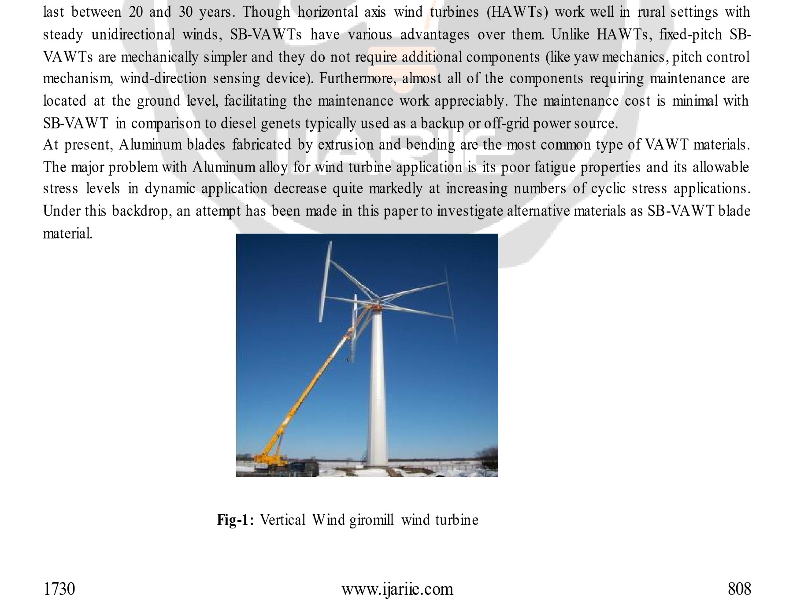
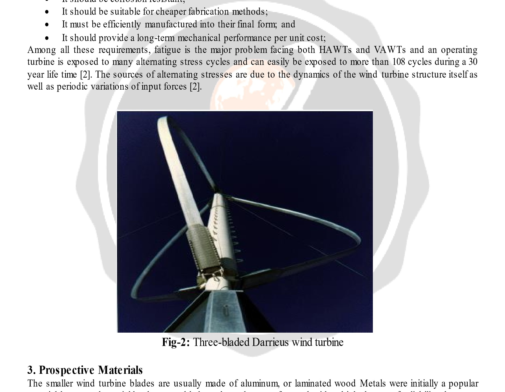
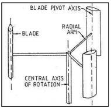

# Review of Straight Bladed Vertical Axis Wind Turbine

Prakhar Dube1, Amit Ray Chowdhary2, Alok Verma3

1, 2 U G Student Mechanical Department, School of Engg. & IT. MATS UNIVERSITY Raipur (C.G.) India
3 Asst. Prof, Mechanical Department, School of Engg. & IT. MATS UNIVERSITY Raipur (C.G.) India

## Abstract
This paper presents the study of straight bladed vertical axis wind turbine and their component. The focus of this paper is about the blade material. SB-VAWT blades must be produced at moderate cost for resulting energy to be competitive in price and the blade should last during the predicted life time. At present, Aluminum blades fabricated by extrusion and bending are the most common type of problem with VAWT materials. The major problem with Aluminum alloy for wind turbine application is its poor fatigue properties and allowable stress levels in dynamic application decrease quite markedly at increasing numbers of cyclic stress applications.

Keyword: - SB-VAWT1, Material2, Stress3, and Properties4.

## 1. Introduction
Straight-bladed vertical axis wind turbine (SB-VAWT) is the simplest types of Turbo machines which are mechanically easy to construct. Design parameters for cost-effective SB-VAWT are selection of blade material. SB-VAWT blades must be produced at moderate cost so that the energy to be competitive in price and the blade should last between 20 and 30 years. Though horizontal axis wind turbines (HAWTs) work well in rural settings with steady unidirectional winds, SB-VAWTs have various advantages over them. Unlike HAWTs, fixed-pitch SB-VAWTs are mechanically simpler and they do not require additional components (like yaw mechanics, pitch control mechanism, wind-direction sensing device). Furthermore, almost all of the components requiring maintenance are located at the ground level, facilitating the maintenance work appreciably. The maintenance cost is minimal with SB-VAWT in comparison to diesel genets typically used as a backup or off-grid power source.

At present, Aluminum blades fabricated by extrusion and bending are the most common type of VAWT materials. The major problem with Aluminum alloy for wind turbine application is its poor fatigue properties and its allowable stress levels in dynamic application decrease quite markedly at increasing numbers of cyclic stress applications. Under this backdrop, an attempt has been made in this paper to investigate alternative materials as SB-VAWT blade material.

Fig-1: Vertical Wind giromill wind turbine

## 2. Required Properties of the Blade Materials
SB-VAWT blades are exposed to diversified load conditions and dynamic stresses are considerably more severe than many mechanical applications. Based on the operational parameters and the surrounding conditions of a typical SB-VAWT for delivering electrical or mechanical energy, the following properties of the SB-VAWT blade materials are required [1]:

- It should have adequately high yield strength for longer life;
- It must endure a very large number of fatigue cycles during their service lifetime to reduce material degradation;
- It should have high material stiffness to maintain optimal aerodynamic performance;
- It should have low density for reduced amount of gravity and normal force component;
- It should be corrosion resistant;
- It should be suitable for cheaper fabrication methods;
- It must be efficiently manufactured into their final form; and
- It should provide a long-term mechanical performance per unit cost;

Among all these requirements, fatigue is the major problem facing both HAWTs and VAWTs and an operating turbine is exposed to many alternating stress cycles and can easily be exposed to more than 10^8 cycles during a 30 year life time [2]. The sources of alternating stresses are due to the dynamics of the wind turbine structure itself as well as periodic variations of input forces [2].

Fig-2: Three-bladed Darrieus wind turbine

## 3. Prospective Materials
The smaller wind turbine blades are usually made of aluminum, or laminated wood. Metals were initially a popular material because they yield a low-cost blade and can be manufactured with a high degree of reliability, however most metallic blades (like steel) proved to be relatively heavy which limits their application in commercial turbines [4]. In the past, laminated wood was also tried on early machines in 1977. At present, the most popular materials for design of different types of wind turbines are wood, aluminum and fiberglass composites that are briefly discussed below.

### 3.1 Wood and Wood Epoxy
Wood, a naturally occurring composite material, is readily available as an inexpensive blade material with good fatigue properties [2]. Wood has been a popular wind turbine blade material since ancient time. Wood has relatively high strength-to-weight ratio, good stiffness and high resilience [4]. Wood and wood epoxy blades have been used extensively by the designer of small and medium sized HAWTs. However, wood does have an inherent problem with moisture stability. This problem can be controlled with good design procedures and quality controlled manufacturing processes. The application of wood to large blades is hindered by its joining efficiency which in many cases has forced designers to examine other materials [4].

### 3.2 Aluminum
Aluminum blades fabricated by extrusion and bending are the most common type of VAWT materials. The early blades of Darrieus type VAWTs were made from stretches and formed steel sheets or from helicopter like combinations of aluminum alloy extrusions and fiberglass [6]. It has been reported by Parashivoiu [6] that the former were difficult to shape into smooth airfoil, while the latter were expensive. The major problem that aluminum alloy for wind turbine application is its poor fatigue properties and its allowable stress levels in dynamic application decreases quite markedly at increasing numbers of cyclic stress applications when compared to other materials such as steel, wood or fiberglass reinforced plastics.

### 3.3 Fiberglass Composites
Composites constructed with fiberglass reinforcements are currently the blade materials of choice for wind turbine blades [4] of HAWT types. This class of materials is called fiberglass composites or fibre reinforced plastics (FRP). In turbine designs they are usually composed of E-glass in polyester, vinyl ester or epoxy matrix and blades are typically produced using hand-layup techniques. Recent advances in resin transfer molding and pultrusion technology have provided the blade manufacturers to examine new procedures for increasing the quality of the final product and reducing manufacturing costs. The characteristics that make composites, especially glass fiber-reinforced and wood/epoxy composites, suitable for wind turbine blades are:

- low density;
- good mechanical properties;
- excellent corrosion resistance;
- tailorability of material properties; and
- versatility of fabrication methods.

The most significant advancement over this decade is the development of an extensive database for fibreglass composite materials. This database not only provides the designer with basic material properties, it provides guidance into engineering the material to achieve better performance without significantly increasing costs. Some questions have yet to be answered, but research is ongoing. The primary ones are the effects of spectral loading on fatigue behavior, scaling the properties of non-metallic materials from coupons to actual structures, and environmental degradation of typical blade materials.

Fig-3: Cycloturbine Rotor

## 4. Literature Survey
MicolChigliaro [12] The authors presented the effect of shaft diameter of darrieus wind turbine performance and marked reduction of overall rotor performance with increment of shaft diameter.

### 4.1
M. Jamil et al. [13] presented Experimental Study of a Combined Three Bucket H-Rotor with Savonius Wind Turbine. In this paper an experimental work have conducted to study the performance of a hybrid vertical axis wind turbine. A savonius wind turbine (WT) is combined with a three bucket H-rotor WT with DUW200 airfoils.

### 4.2
Agni mitra biswas et al. [14] presented performance study of a three bladed airfoil shaped H-rotor made from fiber glass rain forced plastics (FRP). In this study Wind rotor blades made from Fibre glass Reinforced Plastics (FRP) have got many advantages over the conventional rotor blades, such as light in weight, less bending stress on the supports, less chances of fatigue failure etc.

### 4.3
Franklyn Kanyako et al. [15] presented Vertical Axis Wind Turbine Performance Prediction, High and Low Fidelity Analysis. In this study the authors highlighted the progress made in the development of aerodynamic.

### 4.4
Ryan McGowan et al. [16] Optimization of a Vertical Axis Micro Wind Turbine for Low Tip Speed Ratio Operation and authors concluded that the vertical axis wind turbine must operate at a tip speed ratio substantially greater than one.

## 5. Conclusions
In this paper, required properties of the SB-VAWT blade materials are first identified. Then available prospective materials are shortlisted and assessed. Subsequently, comparisons are made between the available materials based on their mechanical properties and costs. The pultruded FRP has been found as a prospective alternative blade material for SB-VAWTs. Then detailed design analyses have been conducted with two materials, namely (a) Aluminum and (b) FRP. The results of the design analysis demonstrate the superiority of pultruded FRP over conventionally used Aluminum.

## 6. References
1. National Research Council (NRC), Committee on Assessment of Research Needs for Wind Turbine Rotor Materials Technology, 1991.
2. Abramovich, H. 1987. Vertical Axis Wind Turbines: A Survey And Bibliography. Wind Engineering. Vol 11, No 6, pp 334-343.
3. Blackwell, B. F., & Reis, G. E. (1974). Blade Shape for a Troposkien Type of Vertical-Axis Wind Turbine. Sandia Laboratories.
4. Brahimi, M. T., Allet, A., & Paraschivoiu, I. (1995). Aerodynamic Analysis Models for Vertical-Axis Wind Turbines. International Journal of Rotating Machinery, Vol. 2 No. 1 pp. 15-21.
5. Claessens, M. C. (2006). The Design and Testing of Airfoils for Application in Small Vertical Axis Wind Turbines. Delft: Delft University of Technology-Faculty of Aerospace Engineering.
6. Cooper, P. (2010). Development and analysis of vertical-axis wind turbines. In W. Tong, Wind power generation and wind turbine design (pp. 289-296). WIT Press.
7. Paraschivoiu, I. (2002). Wind Turbine Design With Emphasis on Darrieus Concept. Presses internationals Polytechnique.
8. Paraschivoiu, I., Trifu, O., & Saeed, F. (2009). H-Darrieus Wind Turbine with Blade Pitch Control. International Journal of Rotating Machinery, Article ID 505343.
9. MicolChigliaro, Effect of shaft diameter on darrieus wind turbine performance.
10. M. Rassoulinejad-Mousavi, M. Jamil and M. Layeghi, Experimental Study of a Combined Three Bucket H-Rotor with Savonius Wind Turbine.
11. Agni mitra Biswas, Performance Study of a Three-bladed Airfoil-Shaped H-rotor made from Fibreglass Reinforced Plastics (FRP).
12. Franklyn Kanyako, Vertical Axis Wind Turbine Performance Prediction, High and Low Fidelity Analysis.
13. Ryan McGowan, Kevin Morillas, Akshay Pendharkar, and Mark Pinder, Optimization of a Vertical Axis Micro Wind Turbine for Low Tip Speed Ratio Operation.
