# Computational analysis of Savonius wind turbine modifications including novel scooplet-based design attained via smart numerical optimization

**Authors:** Ivo Marinic-Kragic; Damir Vucina; Zoran Milas

**Affiliations:** University of Split, Faculty of Electrical Engineering, Mechanical Engineering and Naval Architecture, Group for Numerical Modeling and Computer Application, R. Boskovica 32, 21000, Split, Croatia; University of Split, Faculty of Electrical Engineering, Mechanical Engineering and Naval Architecture, Group for Fluid Mechanics, R. Boskovica 32, 21000, Split, Croatia

## Article Info

- Received 14 December 2019
- Received in revised form 12 February 2020
- Accepted 23 March 2020
- Available online 4 April 2020
- Handling editor: Cecilia Maria Villas Boas de Almeida
- Keywords: Savonius-style wind turbine; Engineering shape optimization; Vertical axis wind turbines; Computational fluid dynamics; 3D CFD Savonius wind turbine analysis

## Abstract

Simple design and low power coefficient of Savonius-style wind turbines make them attractive in experimental and computational fluid dynamics (CFD) based optimization studies. Still, after numerous studies the power coefficient is low, and the single optimal Savonius-style wind turbine shape and configuration is not known. This leaves room for improving the power coefficient, and the objective of this paper is to find an improved solution with application of smart numerical optimization. Several Savonius blade improvements proposed by other researchers were initially analyzed. The numerical (3D CFD) analysis has shown that simple modifications of the blades can be better than more complicated shapes such as spline or elliptical curve. This has encouraged the investigation on what is the limit to the optimized design which used only simple circular-arc based blades. Thus, we perform a global optimization of Savonius blade pair where each pair is composed of two circular arc segments. The smart numerical optimization was performed using 2D CFD and the results were verified and compared with the previous designs using the 3D CFD. The selected optimization operating conditions were tip speed ratio 0.9 and wind speed 12 m/s. The novel optimized design achieved 39% improvement of the maximum power coefficient relative to the classical Savonius design. © 2020 Elsevier Ltd. All rights reserved.

## 1. Introduction

Energy efficiency of renewable energy sources is constantly being improved by utilization of smart technologies (Nizetic et al., 2019). Among renewable energy sources, conventional Savonius wind turbine (SWT) is a common research topic as the simple design and currently low power coefficient (cP) leave opportunity for optimization. A conventional SWT is a low-cost wind turbine and a moderate rotor modification keep the technological cost down. These are the basic advantages of SWT alongside the vertical arrangement of the axis of rotation which simplifies the turbine vertical placement. No additional sub-systems are required for the start-up and for pivoting the rotor to wind speed direction as it is with horizontal axis wind turbines HAWT. The range of SWT design tip speed ratios (TSR) is between 0.8 and 1.2. This results in a low tip speed of SWT rotor compared to the HAWT of the same swept area which has much higher design TSR ¼ 7 (Eriksson et al., 2008). This contributes to the noiseless turbine operation and makes SWT publicly more acceptable for placement in the residential and commercial areas. SWT is considered a drag driven turbine and has a rotor of high solidity (area of blades/rotor swept area). A high TSR (¼l ¼ Ru=v∞ ) of the lift driven modern HAWT provides much higher relative wind velocity ð1 þ l2Þ1=2v∞; v∞being the free wind speed. This yields a much smaller HAWT rotor solidity, i.e. the smaller area of HAWT blades compared to those of SWT for the same swept rotor area. The advantages for SWT are currently in the range of small power units for decentralized power systems.

Smart optimization technologies for application in renewable energy optimization systems commonly utilize combination of genetic algorithms (Vucina et al., 2015), neural networks (Marinic-Kragic et al., 2019a; Nizetic et al., 2016) and intelligent shape parameterization (Marinic-Kragic et al., 2019b). The optimization of SWT parameters is aiming to increase the peak energy conversion efficiency i.e. power coefficient cP of from cP ¼ 0.2 in order to bring it closer to the peak cP of horizontal axis wind turbines HAWT (cP ¼ 0.4e0.5). Savonius turbine optimization studies can be classified by modification of: the blades overlap ratio (Fujisawa and Gotoh, 2008; Roy et al., 2018), the end plate diameter (Alexander and Holownia, 1978), the rotor aspect ratio (Kamoji et al., 2009; Roy et al., 2018), the semicircular blades shape (Wang and Yeung, 2016), blade thickness (Masdari et al., 2019; Tian et al., 2018a), the number of blades in different configurations (Ostos et al., 2019), the guide vanes (Gr€onman et al., 2019; Manganhar et al., 2019), wind farm positioning (Bai and Chan, 2019; Patel et al., 2017) and blade deformation during rotation (Hassanzadeh et al., 2018; Marinic-Kragic et al., 2019c) and active control (Novaes Menezes et al., 2018). Among these categories, the largest increase in the power production can be achieved by using the guide vanes, for example in (Alom and Saha, 2018) the cP,max ¼ 0.34 and in (Roy et al., 2014) cP,max ¼ 0.41 were achieved using numerical and experimental tests respectively. These are the highest power coefficients achieved for STW, but this is at the cost of additional stationary vanes and is only valid for a single wind direction. Despite of higher energy conversion efficiency, these facts make them more difficult for actual on-site application. This paper considers the optimization of the rotor blades so the remaining modification categories are of greater interest for this paper.

Fig. 1. Schematic of Savonius-type VAWT.
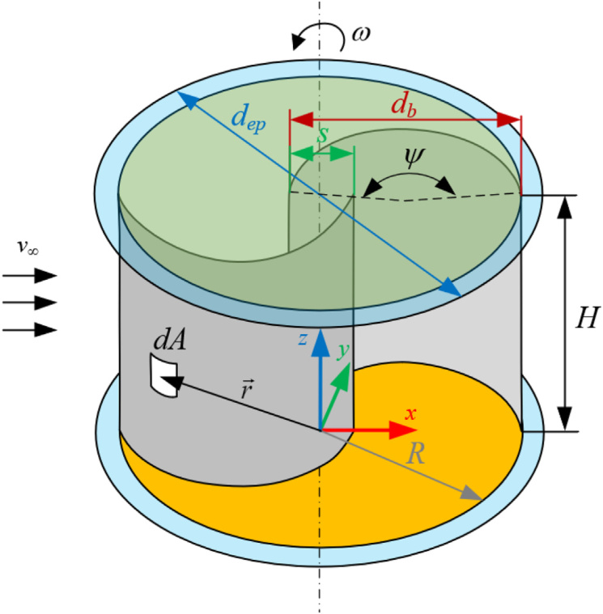

The simplest modification of the original Savonius semicircular blade is changing the blade overlap defined as s/db or s/d (see Fig. 1). Moderate overlap ratio of semicircular blades s/db ¼ 0.1e0.15 increases the peak power coefficient roughly about 10% and more (e.g. from cP ¼ 0.22 to 0.25 (Fujisawa and Gotoh, 2008; Sheldahl et al., 1978)). The favorable effect of overlap was determined by the experiments first and later confirmed by CFD prediction, mostly

using 2(2.5 D) modeling (Akwa et al., 2012). The mentioned experiments used circular end plates on both rotors ends in vertical direction. The end plate with a slightly larger end plate diameter in comparison with the blade tip diameter, about 10% (dep ¼ 1.1d, see Fig. 1), favorably affects the power coefficient (Alexander and Holownia, 1978) and is used in practically all Savonius related studies. Another modification which influences the rotor power coefficient regardless of the blade shape is the rotor aspect ratio AR ¼ H/2R (SWT rotor height, i.e. distance between rotor end plates/rotor diameter). The rotor aspect ratio has a moderate effect on the power coefficient. According to experiments (Sheldahl et al., 1978) an increase of aspect ratio from AR ¼ 1 to 1.5 resulted in less than 10% increase of peak power coefficient but only for rotors with 0.1 overlap ratio. For zero overlap or those larger than 0.15 there was no experimental evidence of the favorable effect of aspect ratio. However, the experimental results for Bach like blades (Kamoji et al., 2009) indicate that the best cP is achieved with AR ¼ 0.7 at zero overlap. On the other hand, in (Alexander and Holownia,1978) the experimental tests were conducted and aspect ratio was varied from 1 to 5 where the power coefficient increased almost linearly up to AR ¼ 5.0 for all of the considered cases. Nevertheless, recent aspect ratio optimization studies such as (Roy et al., 2018) use the aspect ratio values near AR ¼ 1.

Previous modifications can be regarded as classical or conventional. Modifications to the conventional SWT semicircular blades inspired by Bach and Benesh blades in (Wang and Yeung, 2016) further improve the SWT performance. Introduction of a short straight inner part of blade profile and reduction of the blade arc angle j from 180 to 124 (see Fig. 1) results in the increase of initially low power coefficient of conventional SWT from 0.17 to 0.21 (for optimized AR ¼ 0.7 and s/d ¼ 0). Almost the same relative gain in power coefficient was obtained experimentally in (Roy and Saha, 2015) with slightly different modifications of the blade profile parameters j ¼ 135, s/db ¼ 0.4, AR ¼ 1; the peak cP of conventional Savonius increased from 0.22 to 0.275. Higher Reynolds number ðRe ¼ v∞R =nÞ of the SWT rotor, according to the experiments in the range of Re¼(0.6e1.2) 105, yields higher peak power coefficients (10e11% for conventional Savonius and modified Bach blades). This effect was hardly discernible in the range of values Re¼(2.15e4.3) 105 (Sheldahl et al., 1978). Usage of more complex curves such as spline (Mari et al., 2017) and elliptical (Kacprzak et al., 2013) does offer promising range of different blade shapes. However, improvements in these studies are not significant when compared with relatively simple modified Bach blade. The elliptical design in (Kacprzak et al., 2013) shows 10% improvement while the spline in (Mari et al., 2017) achieves 12% improvement relative to the Savonius considered in the respective research paper. Both results were obtained through numerical analysis. A further step towards more complicated shapes is the usage of variable blade thickness. In these cases, the current achievements are an additional small step in improving the SWT performance. For example in (Tian et al., 2018b) the maximum power coefficient cP,max ¼ 0.258 was achieved, what was a 4% increase compared to the classical Savonius considered in the mentioned research paper. The problem here is that the slight increase of the energy conversion efficiency comes at a price of significant additional production cost so the application of these shapes for SWT rotors would have to be justified only if a significant improvement is achieved.

The novelty of this paper is related to multi-blade SWT design which was already investigated by several authors. Addition of multiple quarter blades (two pairs of one large semicircular blade and several smaller quarter blades) was considered in (Ostos et al.,

2019; Sharma and Sharma, 2016) and analyzed using 2D CFD. In (Ostos et al., 2019), the multiple quarter blades were considered with different spacing and in combination with variable thickness among which the optimal case was the one with constant thickness. The maximum power coefficient was again near 0.25, but this showed 17% relative improvement over the conventional Savonius. This shows that a constant thickness blade with a simple circular-arc based shape can achieve significant improvements. These achievements together with the modified Bach in (Roy and Saha, 2015) are currently the most promising SWT modifications because they show significant gain in the power coefficient using only simple geometrical shapes of constant thickness which are also simple to produce. The current paper addresses the same topic at the previously mentioned paper. The main problem in the previous papers was that the improvements were relatively modest, but (as it will be shown) the simple design modification proposed in this paper achieves considerably better improvement over the conventional Savonius.

This main novelty of this paper is the novel scooplet-based SWT blade design. The objective of the paper was to obtain a numerically synthetized SWT blades based on straight lines and circular arc segments of constant thickness which are easy to manufacture. The current paper performs a systematic search for optimal shape using global optimization methods. This way, thousands of different SWT shapes were analyzed and as it will be shown the optimal novel shape achieved a more significant improvement. The novel numerically synthesized shape together with several previous SWT modifications were analyzed in detail using 3D CFD. This detailed analysis of 3D flow field using 3D CFD and comparison with the 2D CFD is another novelty.

## 2. Savonius-style wind turbine modeling

This section describes general definitions and the numerical model used in the rest of the paper. In the numerical optimization performed in this paper, the most important value was the vertical axis wind turbine (VAWT) power coefficient cP ¼ P/(rv3 A/2), where P is the generated power, r is the air density (r ¼ 1.225 kg/m3), the rotor swept area is A ¼ d,H, where d is the diameter of the VAWT (d ¼ 2R) and H the rotor height. To calculate the power coefficient, CFD analysis was used. The starting point are the forces along the rotor blades surface (dA in Fig. 1). The dominant forces are generated by the pressure (pw) while the shear stress forces tw have a lesser influence for the case of SWT. The important forces are only the ones that generate the torque around the VAWT axis, and the average torque is calculated for averaging over a single rotor rotation. The torque as a function of azimuthal position 4 is defined as:

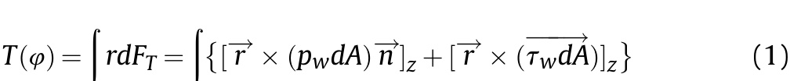

where the toque along the blade surface is calculated by multiplying the local radial distance r and the differential force in the normal direction FN. Blade surface element dA is shown schematically in Fig. 1. In CFD, the torque is calculated by vector multiplication of the position vector r! and separately both forces (pressure and tangential) acting on the blade surface, taking into account only the z-axis projection since the z-axis was defied as the rotational axis. The blade area A in the case of the 2D CFD includes only the blades while in 3D CFD it includes also the end plates (selected diameter was dep ¼ 1.1d). The average torque (Tave) is calculated by

averaging the instantaneous torque over a single rotor revolution. And finally, the power is calculated as P ¼ u Tave.

Commonly used numerical models for modeling VAWTs are CFD, vortex models and blade element momentum theory models (Paraschivoiu et al., 2002; Ribeiro et al., 2012). Because of the large flow interaction between the blades, the most suitable method for modeling the SWT is 2D or 3D CFD. The only practical CFD models for studies which include extensive optimization are obtained by modeling the flow turbulence with Reynolds averaged Navier- Stokes (RANS) equations. Incompressible flow equations in Cartesian coordinates and using index notation are:

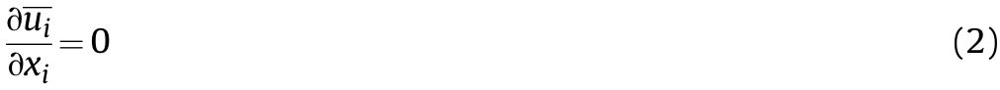

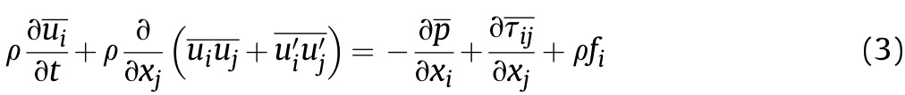

where ui, r andp are the mean flow velocity components, density and pressure respectively, xi is the Cartesian coordinate and t is time. For the case of rotating reference the centrifugal and Coriolis are incorporated in the specific body force fi The time-averaged viscous stress tensor components tijare:

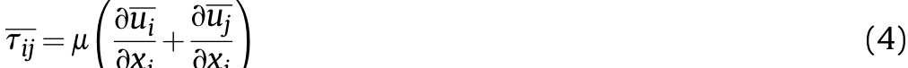

where m is the molecular viscosity. The Boussinesq eddy-viscosity assumption was used for modeling Reynolds stresses Rij:

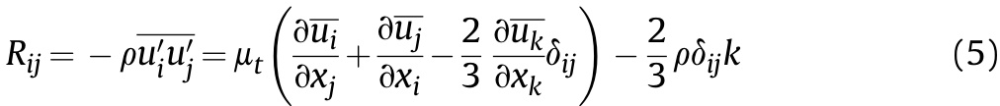

The turbulence model is used to obtain the kinetic energy k and the turbulent viscosity mt. Among the turbulence models, the SST two-equation model using ANSYS FLUENT 17.2 software (ANSYS Inc, 2016) is implemented in the current research. This turbulence model has shown robustness in a variety of applications, from small turbomachine applications (Milas et al., 2014) to large solar plant concept analysis (Nizetic et al., 2017; Penga et al., 2019). It was also the most commonly used model in previous VAWT CFD studies for both Darrieus WT (Lanzafame et al., 2014; Rezaeiha et al., 2018) and SWT (Marinic-Kragic et al., 2018b). A slightly better agreement with the experimental data for Darrieus-type VAWT is achieved by the 4-equation transitional SST model (Rezaeiha et al., 2019), but the two-equation SST model is preferred due to faster convergence. The selected numerical discretization scheme for the momentum and turbulence-related quantities was blending of the first-order upwind with the second-order upwind with the selected blending factor 0.75. The results achieved by this high blending factor are almost equal to those using pure second-order upwind, while the results regarding transient convergence are more stable.

### 2.1. 2D CFD

The computational domain for the 2D CFD was divided in three zones of which one is the rotational zone (RZ) while the remaining two are stationary (SZ and SZH) as shown in Fig. 2. The SZH zone is located in the wake of the SWT and accommodates finer mesh in order to provide better resolution of the wake vortical structure. The rotor diameter of d ¼ 0.68m corresponds to that of a physical

Fig. 2. Computational domain for 2D CFD analysis.
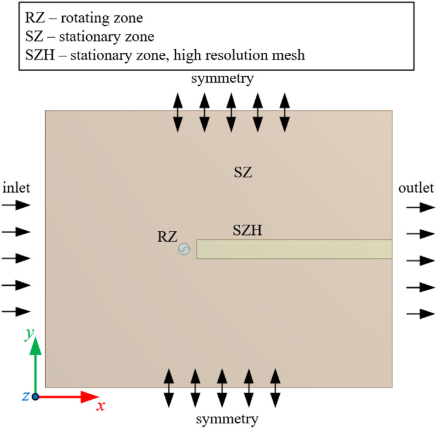

model for wind tunnel testing. The rotational zone has a diameter 1.2d, the stationary zone is 35d 30d, of which 25d is in the downstream direction and 15d in the remaining directions. The size of the computational domain was determined according to the recommendations by (Rezaeiha et al., 2018) and by testing the sensitivity of the power coefficient such that further increase in the computational domain size does not influence the solution. The width of the SZH zone is equal to 2d and it starts 1.5d downwind from the VAWT center.

The following boundary conditions were applied to the faces shown in Fig. 2. At the inlet section, velocity was set to v∞¼ 12 m/s as this is a common design velocity for the small SWT of this size. The rotational velocity was set to u ¼ 31.4 rad/s so that the tip speed ratio is equal to TSR ¼ 0.9. No-slip boundary condition was applied to the SWT blade walls. On the remaining boundaries the symmetry conditions were used. The uniform pressure (p ¼ 0) was imposed at the outlet. For the solution initialization, the values of inlet velocity and outlet pressure were used.

The selected mesh type in RZ and SZ was unstructured quadrilateral mesh while the SZH was composed of structured quadrilateral mesh which had a conformal connection to the SZ domain mesh. In the bulk stationary zone (SZ, see Fig. 3a) the element length was 300 mm and 45 mm in the wake region (SZH). For a smooth transition, the element growth rate was set to 1.05. In the bulk rotational zone (RZ, see Fig. 3b) the mesh size was set to 6 mm. To achieve yþz1 at the blade walls (BL, see Fig. 3c), a prismatic layer was constructed at the blade wall. The prismatic mesh near the blade wall includes 21 layers where the first layer thickness was set to 0.01 mm and growth rate 1.16 was assigned. The element length at the blade was set to 4 mm with a gradual reduction to 0.3 mm towards both blade edges (LTE). In total, this mesh contains ~105 elements, depending on the number of blades and blade shape. In order to increase the simulation computational efficiency, the timestep was gradually decreased from 12 to the final value in the way as shown in Fig. 4.

Fig. 3. Computational mesh for 2D CFD: a) full view, b) near rotor and c) zoom on the blade edge.
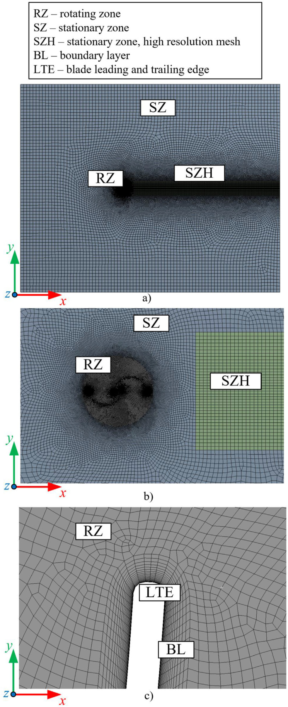

Fig. 4. Comparison of instantaneous and averaged torque coefficients for design from initial optimization.
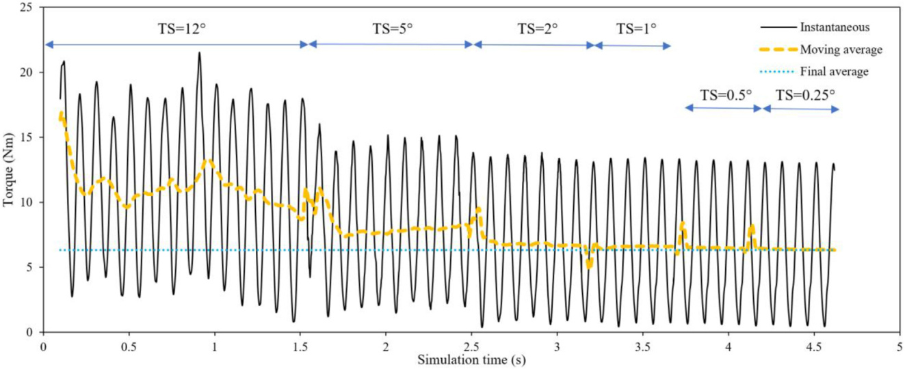

In a single CFD, several full rotations are simulated with gradually decreasing timestep sizes. The case shown in Fig. 4 is for an arbitrarily selected 4-bladed design from an initial optimization with high resolution mesh (~400k elements). It can be noted that the difference (error) from the final average torque coefficient is steadily decreasing for smaller time steps. At 1 timestep, the error is 2.5% while for 0.5 the error is 1%.

To investigate the error when both the mesh size and the timestep were varied, the following tests were conducted. The mesh was investigated with the number of elements in the range from ~50k to ~400k elements. In the mesh tests, the timestep was also varied from 4 to 0.25 equivalent rotation angle. The mesh independence test was first performed using two designs that were obtained from an initial optimization run, and then verified using the final optimized designs. The error for the mesh with ~105 elements was again ~2.5%. This means that most of the error is due to the timestep and that the selected mesh is adequate. However, the timestep cannot be reduced much since the required optimization time would increase to unpractical timescales.

### 2.2. 3D CFD

The importance of the 3D CFD simulation in this paper is: (i) the validation of the results obtained in the optimization which uses 2D CFD by modeling 3D flow effects which exist in reality, (ii) comparison to the previous designs for better assessment of achieved improvements, (iii) identify the causes of prediction errors in 2D CFD and (iv) as a by-product, novel detailed analysis of 3D flow field around SWT. The domain in the 3D CFD was the same size as the previous, while the size in the z direction was set to 10 times the VAWT height. Aspect ratio AR ¼ 3 was selected, and the numerical model used only one half of the SWT rotor with symmetry conditions in the symmetry plane. The larger aspect ratio was used so that the simulation results are easier to compare with the 2D CFD. It is important mention that it would be ideal if the 3D CFD simulation could be used in the shape optimization. The problem is that the 3D CFD using the previously selected mesh resolution requires about 2*107 polyhedral mesh elements (see Fig. 5) which means about two orders of magnitude more demanding simulation. For comparison, 2D CFD simulation requires about 4 core-hours while the 3D CFD requires about 2000 core-hours. The used mesh has the same element size as the 2D mesh and polyhedral elements were

Fig. 5. Part of the mesh for 3D CFD in x-y, x-z and y-x planes: a) near VAWT rotor and b) near the blades.
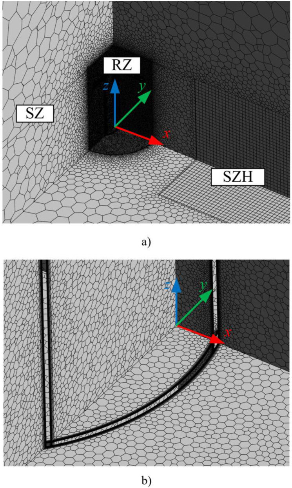

Fig. 6. Power coefficient curve for 2D CFD compared to experiment (Sheldahl et al., 1978) (s e overlap and d e VAWT diameter).
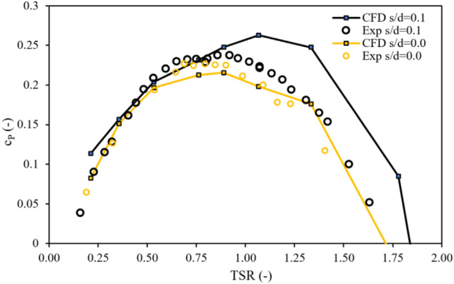

generated from tetrahedral mesh (~5*107 elements) using ANSYS Fluent 17.2. The mesh independency test was also performed for the 3D CFD model, using 1 timestep with similar results to the previous 2D CFD model and the expected error is again ~2%.

### 2.3. Model validation using experimental data

2-bladed SWT with (s/d ¼ 0.1) and without (s/d ¼ 0.0) blade overlap was simulated and compared against the experimental wind tunnel data from (Sheldahl et al., 1978) and the results are shown in Fig. 6. 2D CFD models, as one expects, overpredict the SWT power coefficient, particularly in the range of TSR values above the design one (Ferrari et al., 2017). In this paper, the optimization used a fixed TSR ¼ 0.9, which is the area near the optimum TSR in both cases. It should be noted that at this point the CFD has the least deviation from the experimental data for both of the tested geometries.

### 2.4. Model validation using 3D CFD

The results of the 3D and 2D CFD simulations for the classical

Fig. 7. Savonius s/d ¼ 0.1, comparison of 3D CFD with 2D CFD and experimental data (EPDcP e effect of end plate friction torque on cP in 3D CFD).
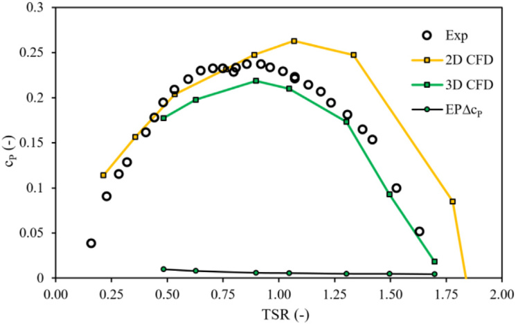

Fig. 8. Half-revolution averaged x-direction velocity component at several sections upstream of VAWT rotor.
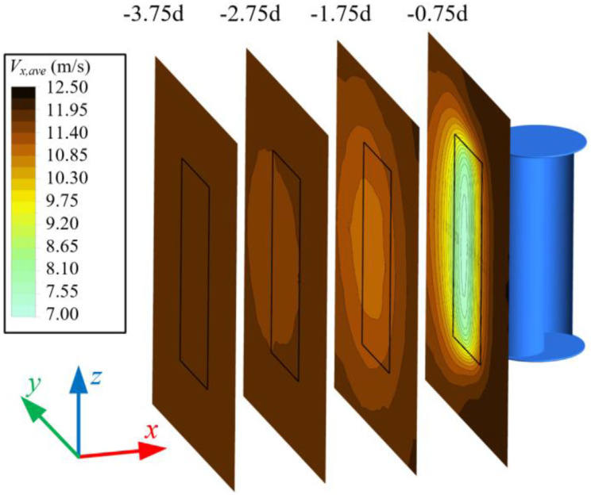

Savonius with overlap s/d ¼ 0.1 are shown in Fig. 7 and compared to the experimental data. From this, it can be concluded that the 3D CFD predicts lower power coefficient than the 2D CFD, while the performance curve has a better qualitative agreement with the experimental data. Addition of the end plates has an overall positive effect in actual designs. But when comparing the 2D and 3D CFD results, the effect is negative since the 2D CFD does not model the 3D aspects of the flow, neither the end plate friction. The negative effect of the end plates torque due to friction on the power coefficient is marked in the figure as EPDcP.It is obvious that the friction along the end plates has only a small effect (max DcP ¼ 0.01) and thus is only a smaller part of the reason for the reduced power coefficient in the 3D CFD simulation.

In order to explain the 3D effects which reduce the power coefficient, Fig. 8 illustrates the velocity in the wind direction (x) in several y-z sections upwind from the VAWT rotor. As opposed to 2D simulation, the 3D simulation reduces the flow velocity at the VAWT inlet section since the flow is directed both up and down from the rotor. This effect cannot be simulated in the 2D CFD. Also, it is important to observe is that the upstream influence of the rotor on the flow extends to about 4d. This confirms that the selected inlet boundary section distance is adequate and should be at least 4d. Also, it is interesting to note that the flow is slightly asymmetrical. The inlet wind speed is reduced on the returning half of the rotor and increased on the advancing half.

Fig. 9 shows the x-direction velocity component for rotor angle a ¼ 45 downstream of the rotor. The figure shows the comparison between 2D and 3D CFD simulation. As expected, the 2D CFD results in a larger downwind trail. The 3D streamlines for the 3D CFD show that the trail has a larger deviation from the wind direction (x-axis). Note that in Fig. 9d (2D CFD) the trail closely follows the wind direction with slight sinusoidal deviations. Meanwhile for 3D (Fig. 9c), after the rotor, the streamlines linearly deviate from the wind direction.

Fig. 10 shows the instantaneous torque coefficient contribution

Fig. 9. X-direction velocity component at a ¼ 45 rotor angle in: a) 3D CFD, several sections b) 3D CFD, vertical plane with 3D streamlines c) 3D CFD in symmetry plane and d) 2D CFD.
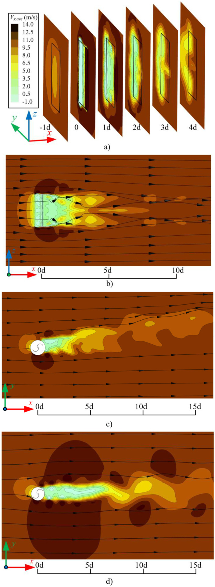

Fig. 10. Rotor rotation: a) comparison of 3D and 2D CFD torque coefficient contribution of the concave and convex side of the blade; b) schematically defined rotor angle.
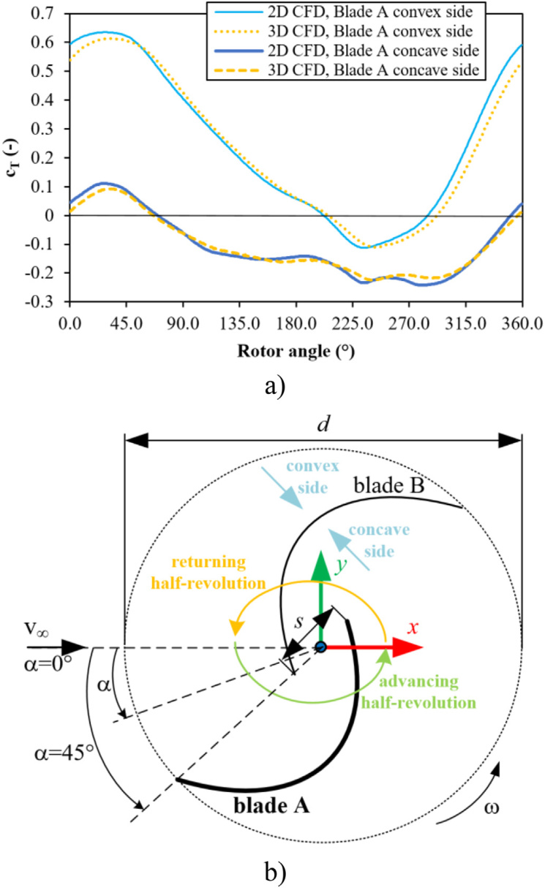

of a single blade for the concave and the convex side separately. As it can be seen, the largest part of the useful torque is generated by the convex side of the blades, mostly at the advancing halfrevolution. The difference between the 2D and 3D CFD is more notable on the convex side of the blade. The 2D CFD produces notably (~10%) larger cT at angles from a ¼ 270 (i.e. 90) to 45. This can be explained by the decreased flow velocity at the VAWT inlet section (Fig. 8). There is a similar difference on the pressure side but to a lesser degree. The 3D CFD produces slightly larger cT at angles around a ¼ 60e225 but this is only a slight positive effect of the 3D, which is negligible compared to the previous. As the main difference is in the part of the rotor revolution when the blade is closer to the inlet section (a ¼ 270-45), the main cause of the 2D CFD overprediction is probably due to the decreased flow velocity at the inlet section.

### 2.5. Analysis of previously proposed designs using 3D CFD

This section analyzes designs from previous studies compared to classical Savonius with overlap ratio s/d ¼ 10%. Several designs

which represent an improvement with respect to classical Savonius design were selected: spline (Mari et al., 2017), elliptical (Kacprzak et al., 2013), modified Bach (Roy et al., 2014) and multiple quarter blades (Sharma and Sharma, 2016) as shown in the following figure.

Among the variations, the modified Bach seems to have the largest maximum power coefficient (cP,max ¼ 0.24) with maximum occurring at TSR ¼ 0.9, see Fig. 12. At larger TSRs, most modified designs have a larger power coefficient than the standard designs. Meanwhile the multiple quarter blade design has the lowest power coefficient in the currently selected range.

Previous studies obtained slightly different results since different kinds of analyses were used. In experimental study (Roy et al., 2014), the modified Bach design obtains cP ¼ 0.30 and they also propose a slight modification to obtain cP ¼ 0.31 at TSR ¼ 0.8. In (Mari et al., 2017), the spline type Savonius was investigated and cP ¼ 0.25 was achieved using 2D CFD, while in the current paper 3D CFD has shown that maximum power is cP ¼ 0.23. These results seem to be in good agreement, considering that the 3D CFD is expected to slightly reduce the power coefficient. In paper (Sharma and Sharma, 2016), the multiple quarter blades designs achieves power coefficient up to cP ¼ 0.22 using 3D CFD, while the current 3D CFD used in this paper obtains cP ¼ 0.19. The difference can be explained by the too small distance of the rotor from the velocity inlet and too few simulated rotor revolutions in (Sharma and Sharma, 2016). In (Kacprzak et al., 2013) elliptical type Savonius is compared to the classical Savonius design. They used 2D CFD and obtained maximum power coefficient at TSR ¼ 0.8 for all examined designs. The classical Savonius with overlap ratio ~0.1 achieved cP ¼ 0.15, while the elliptical design with the same overlap ratio achieved cP ¼ 0.17. Meanwhile, in our study both designs have significantly larger power coefficient, and both have almost equal power coefficient curve. The reason for difference in the results can be since the simulation in (Roy et al., 2014) is conducted in very tight computational domain. Also, from the transient instantaneous torque curves, it could be concluded that the transient convergence was not obtained.

For slightly more detailed analysis, Fig. 13 shows the comparison of the instantaneous rotor torque coefficient for TSR ¼ 0.9. The spline based design (without overlap) has the largest torque variations, with the largest peak in both positive and negative torque. Other designs have about the same low and high points, among which the multiple quarter design has the lowest peak value as expected from the lowest power coefficient. The large negative torque of a design could be an indicator that the design will have more difficult self-starting. In this regard, the classical Savonius with the overlap s/d ¼ 0.1 seams as the most appropriate design, but only by a small amount in comparison to the elliptical and the modified Bach blades. When comparing the modified Bach to the classical Savonius, the 10% improvement in the power coefficient comes at the price of a slight increase of the torque variations. Note that the phase change of the torque coefficient curve for the modified Bach is mainly due to the definition of the zero angle (Fig. 11).

## 3. Optimization results

### 3.1. Shape parameterization

To reduce the optimization time and the number of design evaluations, the shape should be parameterized by a small number of shape variables. A more complex shape parameterizations, such as B-spline based surface parameterizations, permit large shape

Fig. 11. Selected blade designs at rotor angle a ¼ 0: a) multiple quarter blades (Sharma and Sharma, 2016), b) modified Bach (Roy et al., 2014), c) spline (Mari et al., 2017) and d) elliptical (Kacprzak et al., 2013).
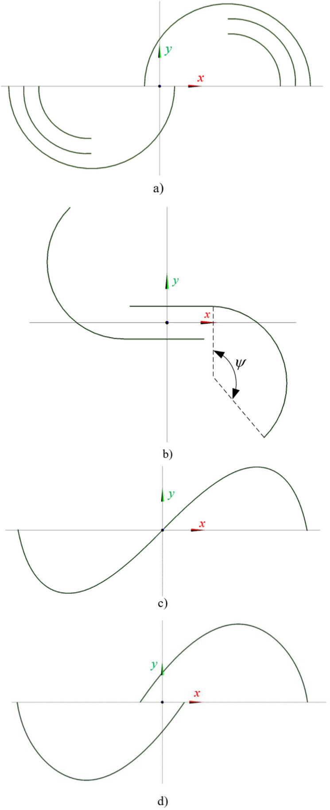

Fig. 12. Comparison of power coefficient calculated by 3D CFD for selected Savonius modifications.
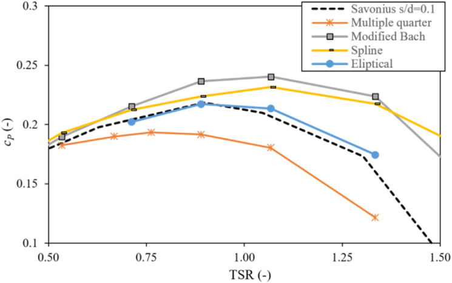

Fig. 13. Comparison (3D CFD) of instantaneous torque coefficient for selected designs at TSR ¼ 0.9.
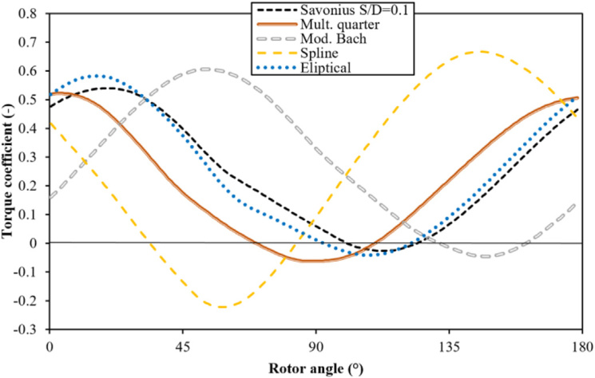

Fig. 14. Shape parameterization of rotor blades.
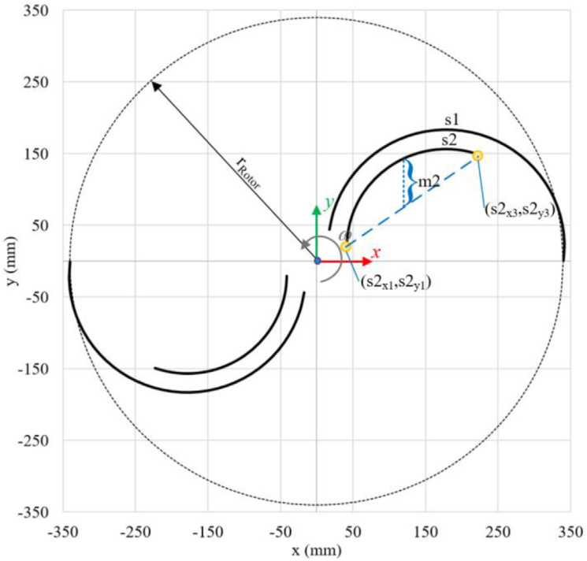

generality while reducing the number of shape variables in shape optimization (M. M. Curkovic et al., 2017; Milan Milan Curkovic et al., 2017; Marinic-Kragic et al., 2016, 2018a). These complex shape optimization procedures are appropriate for further improvement once an initial starting point is known. In this paper we aim at simple SWT blade design while leaving room for further optimization depending on the technological and construction constraints. Compared to the previous studies related to SWT optimization which use complex curves (Marinic-Kragic et al., 2018b; Zhang et al., 2017)), the current research uses only circular arcs to describe the blade shape. Up to 2 “primary” blades (labeled s1 and s2 in Fig. 14a) are independent in the optimization. The remaining set of blades is constructed by rotating primary blades by 180. Primary blade is described by 5 shape parameters: coordinates (x,y) of the blade edges and the blade deflection from the central line (parameter mi). The outermost blade point lies on the rotor circumference with fixed azimuthal position in order to prevent rotated identical shapes. Another constraint was that the blades do not intersect each other.

### 3.2. Optimization procedure

A single-objective optimization was conducted in order to maximize the power coefficient at the selected design TSR ¼ 0.9. The optimization variables were only the geometric parameters as explained earlier (Section 3.1). NSGA-II (Esteco s.p.a, 2016) algorithm with steady-state population was used. The optimization was conducted by parallelization of simulations on 10 PC computers, and totally 20 parallel CFD simulations were performed. Mode- Frontier was used for data communication and the optimization algorithm. In some cases, it can happen that for various reasons the simulation stalls for long time. This is the reason why the steady-state population algorithm was used. This algorithm does not wait for the whole population of the genetic algorithm (GA), but uses all available cores. The results of two optimization runs are shown in Fig. 15. The initial population was 50 and 200 designs for the cases with 2 and 4 blades respectively. The optimization run was continuously monitored, and it was stopped when there was no noticeable change in the optimized shape. The optimization was repeated 2 times with different initial populations to confirm the results.

Fig. 15. Optimization history of the power coefficient.
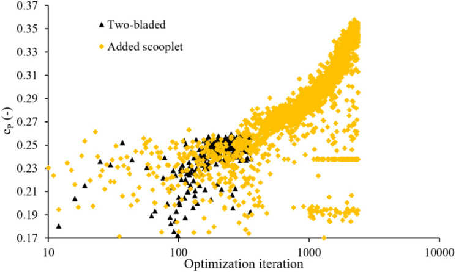

Table 1 Summary of analyzed designs.

Design Num. opt. variables 2D CFD cP,max [-] 3D CFD cP,max [-]

Classical Savonius s/d ¼ 0.1 (CS) N/A 0.262 TSR ¼ 1

0.218 TSR ¼ 0.9 Modified Classical Savonius (MCS) 3 0.274 TSR ¼ 1

0.243 TSR ¼ 1 Scooplet-based design 8 0.359 TSR ¼ 0.9

## 4. Results and discussion

### 4.1. Optimal designs

The power coefficient was first investigated as a function of temporal and mesh resolution to confirm the final optimum designs. As it was the case in the initial tests, again the difference between the high- and low-resolution tests is still ~2% for both the obtained designs. For brevity, only the high-resolution analysis results are shown. Summary of the optimization results compared to classical Savonius is given in Table 1. The optimization used only the 2D CFD while the 3D CFD was used only to confirm the results. The first part of the section is devoted to the analysis of the 2D CFD results.

Fig. 16 shows the geometry of the optimized designs: Fig. 16a e Classical Savonius with optimized blade rotor radius, gap and overlap; Fig. 16b e the scooplet based design and Fig. 16c e the design with the scoop alone which is taken from the scooplet-based design. The scoop alone design was used merely for comparison and analysis of the scooplet based design. It is interesting that the simple 1-blade optimization converges almost to classical Savonius with overlap ratio s/d ¼ 0.1. The radius of curvature of the blade is 193 mm and it spans the angle of 167. The scooplet-based optimized design changes drastically the shape of the larger scoop blade so that there is no distance between the opposite blades (no overlap). At the same time the scoop blade is drastically flattened i.e. the radius of curvature is increased. The scoop has radius 226 mm and spans 106 arc. The scooplet in this design is also fairly large, it has 144 mm radius and spans 102arc. The outermost point of the scooplet A is at distance 105 mm from the scoop A and it gradually decreases to practically constant distance 65 mm.

The power coefficient curves of the optimized designs are shown in Fig. 17. Although the designs were optimized for TSR ¼ 0.9, it can be noted that a higher power coefficient is obtained near TSR ¼ 1.0. This is common to both designs. When comparing two-bladed with scooplet-based design, the scoopletbased one has a higher power coefficient over the entire range of TSR. The increase in power coefficient with added scooplets is 39% a significant improvement. The modified classical design is only slightly better than the original Savonius design with overlap ratio s/d ¼ 0.1.

Total torque coefficient for rotor is shown in Fig. 18 for both optimized designs. The classical optimized design has very similar torque coefficient curve to the classical s/d ¼ 0.1 design. In comparison, the scooplet-based design has a significantly larger maximum torque but also more negative torque. For better analysis Fig. 16c shows the results for the rotor with scoop-alone. This is the separated scoop from the scooplet-based optimized design. The scoop-alone design on its own achieves higher peak value than the modified classical design. However, the scoop-alone design has

0.304 TSR ¼ 0.9

significantly larger negative torque (for rotor angles 90e135).

### 4.2. Modified classical Savonius

The slight shape modification of the classical Savonius has improved the power coefficient by 4.5%. To analyze the improvement, Fig. 19 shows the torque coefficient of the concave and convex side of each blade. It can be noted that the concave side provides most of the useful torque (i.e. power) while the convex side provides with almost no average net-torque. Furthermore, the torque of the concave side is mostly negative. The results are also compared to the standard Savonius with blade overlap s/d ¼ 0.1. The improvement of the optimized design (MCS) can be seen on the advancing part of the blade rotation and just on the blade convex side. It is interesting to note that at the same time the optimized geometry contributes to a decreased torque coefficient during the retreating part of the blade rotation. So far as the contribution of the optimized blade concave side is considered, the original design is almost always better than the optimized. However, this side has a much smaller effect on the resulting power coefficient. These results also encourage the usage of constant thickness blades, as the changes in the blade convex side have a small negative effect on the concave side contribution to the overall energy generation. In (Tian et al., 2018a), the authors present a 4.4% improvement of the SWT performance by using different blade convex and concave side, which is the same as in this paper with the constant thickness blade.

### 4.3. Scooplet-based design

To analyze the scooplet-based design, it is interesting to compare it with the design which contains the scoop alone (see Fig. 16c). The following figure (Fig. 20) shows the instantaneous torque coefficient during the rotation for individual blades. When observing the scooplet contribution, it introduces an additional positive torque for full rotation range, with practically no generation of the negative torque. This is somewhat expected, as in the advancing half-revolution the scooplet is exposed to the wind and provides a positive torque, while it is shielded in the typically undesirably retreating part of the revolution. Comparing the scoop to the scoop-alone design, their performance curves look quite similar. The scoop generates less torque in comparison to the scoop-alone in the advancing half-revolution and a slightly less negative torque in the retreating part of the rotation. Overall, the main contribution is due to the positive torque of the scooplet.

Fig. 21 shows the differences in the pressure field between the two designs. As expected, the largest difference is on the concave side of the scoop, where the scooplet blade is located. The pressure on the scoop is slightly reduced, but the pressure gained by scooplet is more important. This is most easily observed at a ¼ 135.

Fig. 16. Optimization results: a) modified classical Savonius b) the scooplet-based design c) separated scoop from the scooplet-based design.

Fig. 17. Comparison of power coefficient curves for optimized designs (2D CFD).
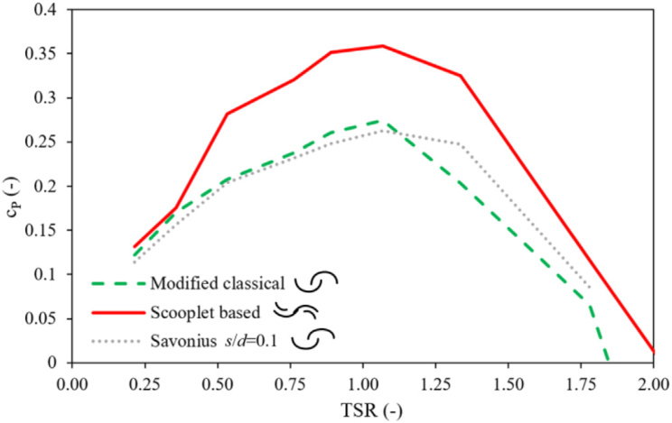

The pressure gradient in the channel between the scoop and the scooplet (labeled by “B”) is directed towards the scoop blade. This makes a positive contribution to the instantaneous torque coefficient which can also be noticed in Fig. 20. A small region of negative pressure pointed by “B”, suggests that there exists a small flow separation, which is probably the cause of the observed pressure gradient. It can also be noted that the peak of negative pressure (vortex region, labeled “A”) on the convex side of scoop A is higher than in the scoop A-alone design. This has a slight negative effect on the scooplet-based design. In future work, these negative effects might be reduced by using a B-spline curve instead of semicircular design which might be investigated in future work.

Fig. 22 shows instantaneous torque coefficient for the concave and the convex side of the scoop for the optimized design with and without the scooplet. As it can be seen, the major factor of the improvement is caused by the convex side of the scooplet. This was also the case with the classical optimized Savonius where the convex side provided for most of the torque.

For the completeness of the presentation, Fig. 23 is shown with the relative velocity streamlines and relative velocity magnitude for different rotor azimuthal positions. At the tip of the scoop at azimuthal angle of a ¼ 45 (labeled “A” in Fig. 23b), one can observe the generation of a large vortex on convex side, and it keeps growing until a ¼ 90. This is the same vortex that can be observed as an area of low pressure in Fig. 21 at the respective angles. At the point “B” which was also observed in Fig. 21, a small flow separation region can be observed. This region is small, but it is probably the cause of the pressure gradient (Fig. 21) which leads to a net positive instantaneous torque coefficient (see Fig. 24).

### 4.4. Validation of optimized designs using 3D CFD

Previous analysis was based on the 2D CFD, which was used in the optimization run. To validate the results in actual 3D flow a 3D CFD analysis is performed. The following figure shows the comparison of the optimized designs to previous designs. The figure concentrates to the area near the design point (TSR ¼ 0.9). It can be observed that the optimized designs have a peak power coefficient exactly at the design point, while the peak power coefficient of the modified Bach design is at a slightly higher TSR. The modified Bach design in comparison to the scooplet design has a flatter curve, but still the peak power of our design is 28% better than the modified Bach design and 39% compared to the classical Savonius design. The peak power coefficient of the simply optimized modified classical Savonius is about the same as for the modified Bach design. The differences in the flow field between 2D CFD and 3D CFD were

Fig. 18. Comparison of instantaneous rotor torque coefficient (2D CFD) for both optimized designs and the scoop-alone design.
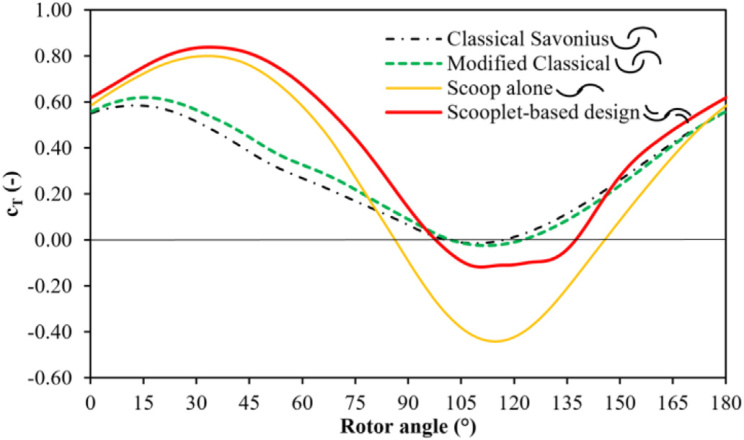

Fig. 19. Instantaneous torque coefficient for modified classical Savonius (MCS) and classical Savonius with overlap s/d ¼ 0.1 (CS) using 2D CFD.
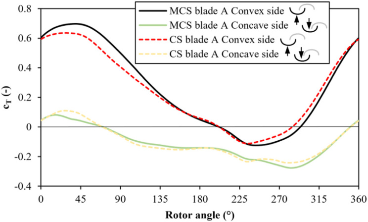

Fig. 20. Contribution of individual blades to instantaneous torque coefficient for scooplet-based design and scoop-alone design (2D CFD).
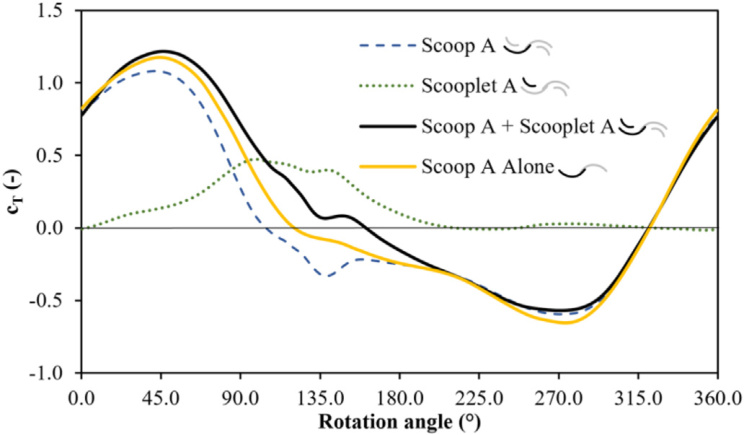

investigated in more detail and they have the same character as in the reference example in section 2.4., so they are not repeated.

## 5. Conclusions

In the first part of the paper, many previously proposed Savonius-type wind turbine (SWT) designs were analyzed. It was concluded that the Bach-type design achieves the highest peak power coefficient, with ~10% improvement over the optimized classical Savonius with overlap ratio s/d ¼ 0.1. Since the Bach-type design uses only simple geometric shapes such as the circular arc and a straight segment, it was decided to continue with this approach in the development of novel shapes. An appropriate optimization procedure was devised based on 2D CFD with 3D CFD results validation. In the first optimization run, SWT with one “primary” blade was investigated. In the second optimization run, two primary blades were used. The remaining set of blades is constructed by rotating primary blades by 180. First resulting design is named the modified classical Savonius design and the second is named the scooplet-based design.

The first optimization run has achieved the results which are comparable to the Bach-type optimized designs, with ~10% improvement over the classical Savonius. The prime result of the paper is the optimized scooplet-based design. Very promising results were accomplished with 39% improvement in power coefficient in comparison to the classical Savonius design. The results were also compared with optimized SWT designs from previous research in which 2D CFD or experiments were used for parametric optimization. When comparing various SWT designs using either 2D or 3D CFD, the scooplet based design achieves the highest peak power coefficient exceeding the next best design (Bach-type) by 27%. As the optimization with large number of shape variables requires large number of shape evaluations, it was concluded that 2D CFD is the only viable option for optimization. The 3D CFD was used to analyze and confirm the optimization results. The results were confirmed by the 3D CFD, but still experimental verification is required in future work. Also, the 2D optimization did not consider all the 3D effects so a further improved design might be obtained in near future using the 3D CFD-based optimization.

The proposed design has relevance regarding cleaner energy aspects in several ways. In addition to achieving higher energy efficiency, the optimized design has a relatively simple construction as it is composed only of circular segments. This means that existing production facilities can be adopted to produce the newly developed shape and use it in arrangement with the same or eventually with larger electric generator. This can finally increase the electricity production at almost the same production costs, thereby supporting cleaner energy production aspects and ultimately aids in decreasing CO2 emissions.

Declaration of competing interest

The authors declare that they have no known competing financial interests or personal relationships that could have appeared to influence the work reported in this paper.

CRediT authorship contribution statement

Fig. 21. Pressure field p (2D CFD) for: a) optimized scooplet-based design, b) scoop-alone design and c) pressure difference Dp between designs.
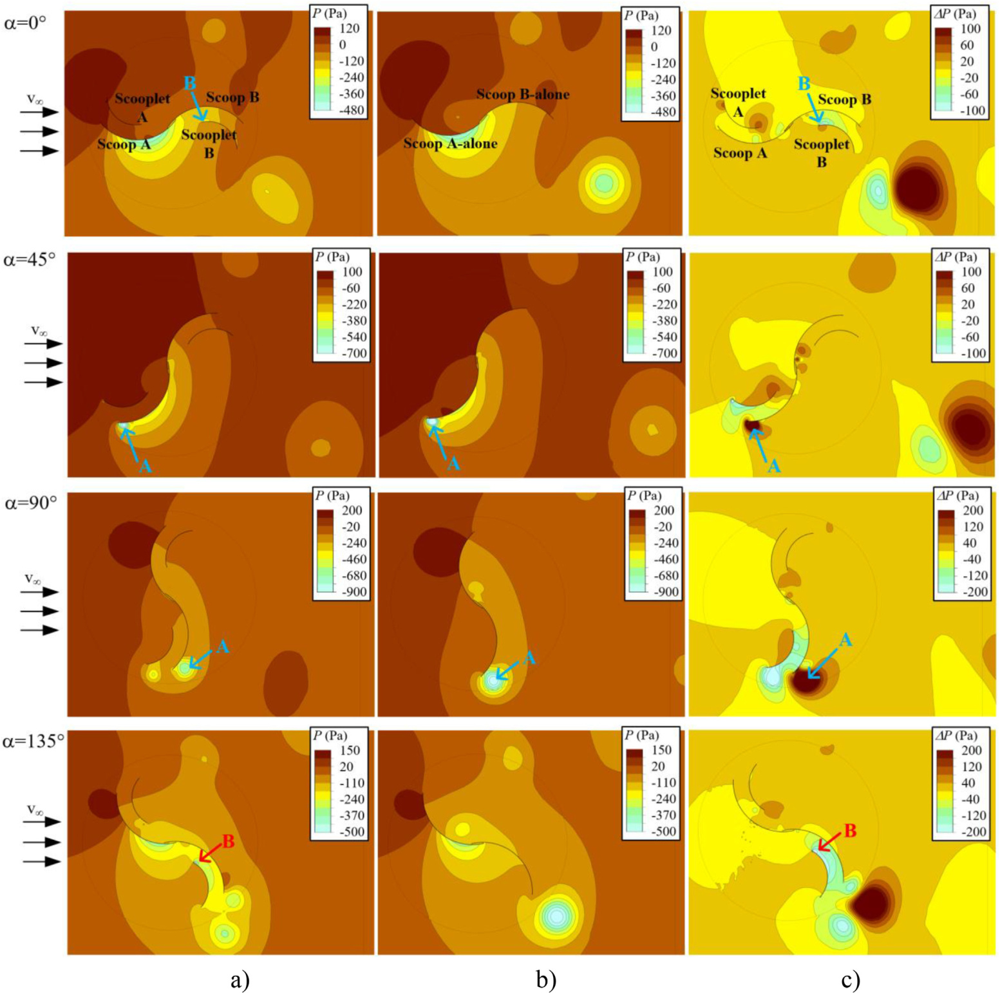

Fig. 22. Instantaneous torque coefficient (2D CFD): difference between optimized scooplet-based design and scoop-alone design.
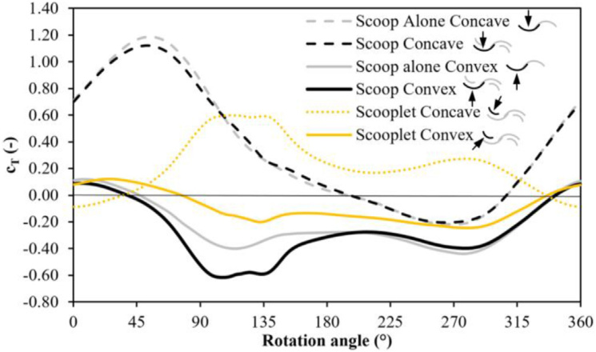

Fig. 23. Streamlines and magnitude of relative velocity in the rotor domain for azimuthal rotor positions: a) a ¼ 0 b) a ¼ 45 c) a ¼ 90 and d) a ¼ 135.
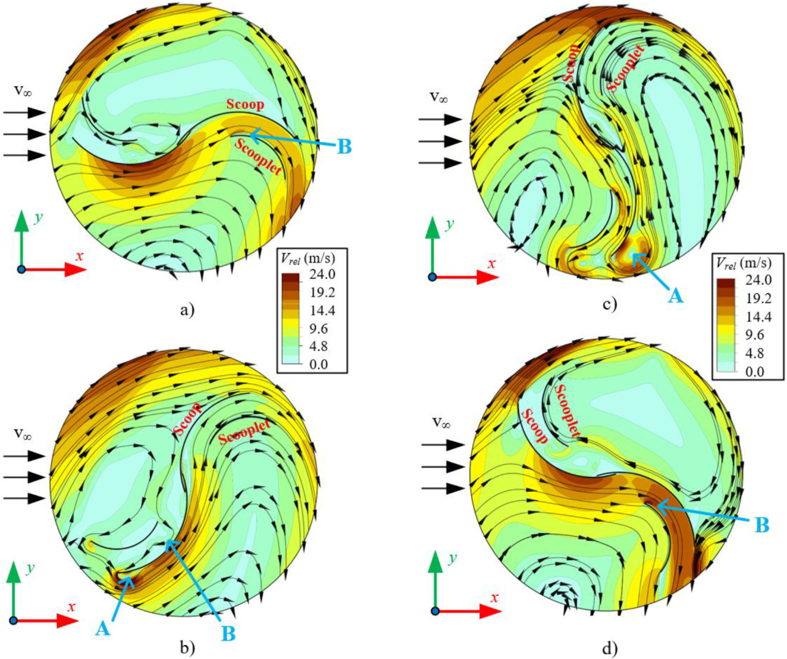

Fig. 24. Comparison of power coefficient of SWT with optimized blade designs as predicted by 3D CFD.
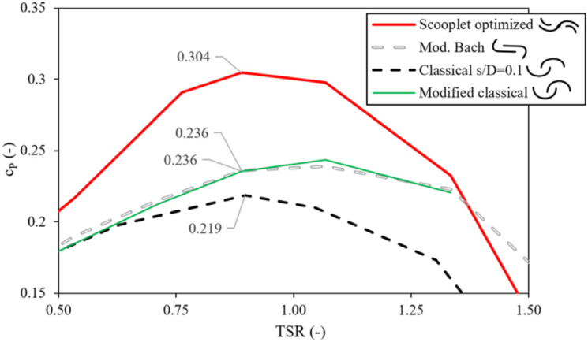

## Acknowledgements

This work was supported by the Croatian Science Foundation [HRZZ-IP-2018-01-6774].

## References

Akwa, J.V., Alves Da Silva Júnior, G., Petry, A.P., 2012. Discussion on the verification

of the overlap ratio influence on performance coefficients of a Savonius wind rotor using computational fluid dynamics. Renew. Energy. https://doi.org/ 10.1016/j.renene.2011.07.013. Alexander, A.J., Holownia, B.P., 1978. Wind tunnel tests on a Savonius rotor. J. Wind

Eng. Ind. Aerod. 3, 343e351. https://doi.org/10.1016/0167-6105(78)90037-5. Alom, N., Saha, U.K., 2018. Performance evaluation of vent-augmented elliptical-

bladed savonius rotors by numerical simulation and wind tunnel experiments. Energy 152, 277e290. https://doi.org/10.1016/j.energy.2018.03.136. ANSYS Inc, 2016. ANSYS (Computer Program). Bai, H., Chan, C., 2019. Positive interactions of two Savonius-type vertical-axis wind

turbines for performance improvement. Energy Procedia 158, 625e630. https:// doi.org/10.1016/j.egypro.2019.01.165. Curkovic, M., Marinic-Kragic, I., Vucina, D., 2017. A novel projection of open ge-

ometry into rectangular domain for 3D shape parameterization. Integrated Comput. Aided Eng. 25 https://doi.org/10.3233/ICA-170553. Curkovic, Milan, Vucina, D., Curkovic, A., 2017. Enhanced 3D parameterization for

integrated shape synthesis by fitting parameter values to point sets. Integrated Comput. Aided Eng. 24, 241e260. https://doi.org/10.3233/ICA-170541. Eriksson, S., Bernhoff, H., Leijon, M., 2008. Evaluation of different turbine concepts

for wind power. Renew. Sustain. Energy Rev. 12, 1419e1434. https://doi.org/ 10.1016/j.rser.2006.05.017. Esteco s.p.a, 2016. modeFRONTIER (Computer Program). Ferrari, G., Federici, D., Schito, P., Inzoli, F., Mereu, R., 2017. CFD study of Savonius

wind turbine: 3D model validation and parametric analysis. Renew. Energy. https://doi.org/10.1016/j.renene.2016.12.077. Fujisawa, N., Gotoh, F., 2008. Experimental study on the aerodynamic performance

of a savonius rotor. J. Sol. Energy Eng. https://doi.org/10.1115/1.2930074. Gr€onman, A., Tiainen, J., Jaatinen-V€arri, A., 2019. Experimental and analytical

analysis of vaned savonius turbine performance under different operating conditions. Appl. Energy 250, 864e872. https://doi.org/10.1016/ j.apenergy.2019.05.105. Hassanzadeh, R., Yaakob, O. bin, Taheri, M.M., Hosseinzadeh, M., Ahmed, Y.M., 2018.

An innovative configuration for new marine current turbine. Renew. Energy 120, 413e422. https://doi.org/10.1016/j.renene.2017.11.095. Kacprzak, K., Liskiewicz, G., Sobczak, K., 2013. Numerical investigation of conven-

tional and modified Savonius wind turbines. Renew. Energy 60, 578e585. https://doi.org/10.1016/j.renene.2013.06.009. Kamoji, M.A., Kedare, S.B., Prabhu, S.V., 2009. Experimental investigations on single

stage modified Savonius rotor. Appl. Energy. https://doi.org/10.1016/ j.apenergy.2008.09.019. Lanzafame, R., Mauro, S., Messina, M., 2014. 2D CFD modeling of H-Darrieus wind

turbines using a transition turbulence model. Energy Procedia 45, 131e140. https://doi.org/10.1016/j.egypro.2014.01.015. Manganhar, A.L., Rajpar, A.H., Luhur, M.R., Samo, S.R., Manganhar, M., 2019. Per-

formance analysis of a savonius vertical axis wind turbine integrated with wind accelerating and guiding rotor house. Renew. Energy 136, 512e520. https:// doi.org/10.1016/j.renene.2018.12.124. Mari, M., Venturini, M., Beyene, A., 2017. A novel geometry for vertical Axis wind

turbines based on the savonius concept. J. Energy Resour. Technol. 139, 061202 https://doi.org/10.1115/1.4036964. Marinic-Kragic, I., Curkovic, M., Vucina, D., 2018a. Adaptive re-parameterization

based on arbitrary scalar fields for shape optimization and surface fitting. Eng. Appl. Artif. Intell. 67, 39e51. https://doi.org/10.1016/ j.engappai.2017.09.004. Marinic-Kragic, I., Nizetic, S., Grubisic-Cabo, F., Coko, D., 2019. Analysis and opti-

mization of passive cooling approach for free-standing photovoltaic panel: introduction of slits. Energy Convers. Manag. 112277 https://doi.org/10.1016/ j.enconman.2019.112277. Marinic-Kragic, I., Perisic, S., Vucina, D., Curkovic, M., 2019. Superimposed RBF and

B-spline parametric surface for reverse engineering applications. Integrated Comput. Aided Eng. 27, 17e35. https://doi.org/10.3233/ICA-190611. Marinic-Kragic, I., Vucina, D., Curkovic, M., 2016. Efficient shape parameterization

method for multidisciplinary global optimization and application to integrated ship hull shape optimization workflow. Comput. Des. 80, 61e75. https://doi.org/ 10.1016/j.cad.2016.08.001. Marinic-Kragic, I., Vucina, D., Milas, Z., 2019. Concept of flexible vertical-axis wind

turbine with numerical simulation and shape optimization. Energy 167, 841e852. https://doi.org/10.1016/j.energy.2018.11.026. Marinic-Kragic, I., Vucina, D., Milas, Z., 2018. Numerical workflow for 3D shape

optimization and synthesis of vertical-axis wind turbines for specified operating regimes. Renewable Energy, Paris, pp. 113e127. https://doi.org/10.1016/ j.renene.2017.08.030. Masdari, M., Tahani, M., Naderi, M.H., Babayan, N., 2019. Optimization of airfoil

Based Savonius wind turbine using coupled discrete vortex method and salp swarm algorithm. J. Clean. Prod. 222, 47e56. https://doi.org/10.1016/

j.jclepro.2019.02.237. Milas, Z., Vucina, D., Marinic-Kragic, I., 2014. Multi-regime shape optimization of fan

vanes for energy conversion efficiency using CFD, 3D optical scanning and parameterization. Eng. Appl. Comput. Fluid Mech. 8, 407e421. Nizetic, S., Djilali, N., Papadopoulos, A., Rodrigues, J.J.P.C., 2019. Smart technologies

for promotion of energy efficiency, utilization of sustainable resources and waste management. J. Clean. Prod. 231, 565e591. https://doi.org/10.1016/ j.jclepro.2019.04.397. Nizetic, S., Grubisic- Cabo, F., Marinic-Kragic, I., Papadopoulos, A.M., 2016. Experi-

mental and numerical investigation of a backside convective cooling mechanism on photovoltaic panels. Energy 111, 211e225. https://doi.org/10.1016/ j.energy.2016.05.103. Nizetic, S., Penga, Z., Arıcı, M., 2017. Contribution to the research of an alternative

energy concept for carbon free electricity production: concept of solar power plant with short diffuser. Energy Convers. Manag. 148, 533e553. https:// doi.org/10.1016/j.enconman.2017.05.062. Novaes Menezes, E.J., Araújo, A.M., Bouchonneau da Silva, N.S., 2018. A review on

wind turbine control and its associated methods. J. Clean. Prod. 174, 945e953. https://doi.org/10.1016/j.jclepro.2017.10.297. Ostos, I., Ruiz, I., Gajic, M., Gomez, W., Bonilla, A., Collazos, C., 2019. A modified novel

blade configuration proposal for a more efficient VAWT using CFD tools. Energy Convers. Manag. 180, 733e746. https://doi.org/10.1016/j.enconman.2018.11.025. Paraschivoiu, I., Saeed, F., Desobry, V., 2002. Prediction capabilities in vertical-axis

wind turbine aerodynamics. In: Proceeding of the World Wind Energy Conference and Exhibition. Berlin. Patel, J., Savsani, V., Patel, V., Patel, R., 2017. Layout optimization of a wind farm to

maximize the power output using enhanced teaching learning based optimization technique. J. Clean. Prod. 158, 81e94. https://doi.org/10.1016/ j.jclepro.2017.04.132. Penga, Z., Nizetic, S., Arıcı, M., 2019. Solar plant with short diffuser concept: further

improvement of numerical model by included influence of guide vane topology on shape and stability of gravitational vortex. J. Clean. Prod. 212, 353e361. https://doi.org/10.1016/j.jclepro.2018.12.021. Rezaeiha, A., Montazeri, H., Blocken, B., 2019. On the accuracy of turbulence models

for CFD simulations of vertical axis wind turbines. Energy. https://doi.org/ 10.1016/j.energy.2019.05.053. Rezaeiha, A., Montazeri, H., Blocken, B., 2018. Towards accurate CFD simulations of

vertical axis wind turbines at different tip speed ratios and solidities: guidelines for azimuthal increment, domain size and convergence. Energy Convers. Manag. https://doi.org/10.1016/j.enconman.2017.11.026. Ribeiro, A.F.P., Awruch, A.M., Gomes, H.M., 2012. An airfoil optimization technique

for wind turbines. Appl. Math. Model. 36, 4898e4907. https://doi.org/10.1016/ j.apm.2011.12.026. Roy, S., Das, R., Saha, U.K., 2018. An inverse method for optimization of geometric

parameters of a Savonius-style wind turbine. Energy Convers. Manag. 155, 116e127. https://doi.org/10.1016/J.ENCONMAN.2017.10.088. Roy, S., Mukherjee, P., Saha, U.K., 2014. Aerodynamic performance evaluation of a

novel savonius-style wind turbine under an oriented jet. ASME 2014 Gas Turbine India Conference. ASME. https://doi.org/10.1115/GTINDIA2014-8152. V001T08A001. Roy, S., Saha, U.K., 2015. Wind tunnel experiments of a newly developed two-bladed

Savonius-style wind turbine. Appl. Energy 137, 117e125. https://doi.org/ 10.1016/j.apenergy.2014.10.022. Sharma, S., Sharma, R.K., 2016. Performance improvement of Savonius rotor using

multiple quarter blades e a CFD investigation. Energy Convers. Manag. 127, 43e54. https://doi.org/10.1016/j.enconman.2016.08.087. Sheldahl, R.E., Feltz, L.V., Blackwell, B.F., 1978. Wind tunnel performance data for

two- and three-bucket Savonius rotors. J. Energy 2, 160e164. https://doi.org/ 10.2514/3.47966. Tian, W., Mao, Z., Zhang, B., Li, Y., 2018a. Shape optimization of a Savonius wind

rotor with different convex and concave sides. Renew. Energy 117, 287e299. https://doi.org/10.1016/j.renene.2017.10.067. Tian, W., Mao, Z., Zhang, B., Li, Y., 2018b. Shape optimization of a Savonius wind

rotor with different convex and concave sides. Renew. Energy 117, 287e299. https://doi.org/10.1016/j.renene.2017.10.067. Vucina, D., Marinic-Kragic, I., Milas, Z., 2015. Numerical models for robust shape

optimization of wind turbine blades. Renew. Energy, Optimization Methods in Renewable Energy Systems Design 87, 849e862. https://doi.org/10.1016/ j.renene.2015.10.040. Wang, L., Yeung, R.W., 2016. On the performance of a micro-scale Bach-type turbine

as predicted by discrete-vortex simulations. Appl. Energy 183, 823e836. https://doi.org/10.1016/j.apenergy.2016.08.185. Zhang, B., Song, B., Mao, Z., Tian, W., Li, Boyang, Li, Bo, 2017. A novel parametric

modeling method and optimal design for savonius wind turbines. Energies 10, 301. https://doi.org/10.3390/en10030301.

## Glossary

A: - rotor swept area (A ¼ d,H ) AR: - aspect ratio ¼ H/2R CS: -Classical Savonius turbine with overlap ratio s/d ¼ 0.1 cP: - power coefficient cP,max: - maximum power coefficient

cT: - torque coefficient db: - blade (chord) length d: - rotor diameter dep: - rotor end plates diameter fi: - specific body force (Cartesian components) 4: - azimuthal position H: - rotor height HAWT: - Horizontal axis wind turbine k: - turbulence kinetic energy MCS: -Modified classical Savonius turbine (optimized design) m: - molecular viscosity mt: - turbulent viscosity u: - rotational velocity rotor speed p: - mean flow pressure P: - aerodynamic power of rotor

pw: - pressure acting on blade R: - rotor radius Rij: - Reynolds stress tensor r: - mean flow density s/db: - ratio of overlap and blade (chord) length s/d: - ratio of overlap and rotor diameter SWT: - Savonius wind turbine t: - time T: - aerodynamic torque of rotor TSR: - tip speed ratio ¼ l ¼ Ru=v∞ tw: - wall shear stress ui: - mean flow velocity in i-th direction (Cartesian velocity components) v∞: - free wind velocity VAWT: - Vertical axis wind turbine xi: - Cartesian coordinate
