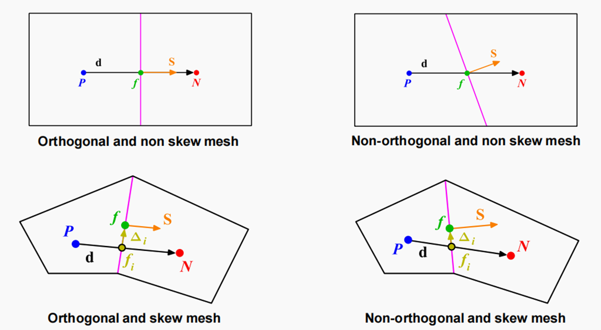

# SimScale VAWT Mesh and Quality

## Start with a mesh you can inspect

Incompressible analysis supports standard, hex-dominant, and hex-dominant parametric meshers. (source: sources/ca6.md)

Hex-dominant automatic meshing reduces the number of manual controls and is intended for a quick preliminary CFD mesh. Its external mode is intended for aerodynamic flows around bodies. (source: sources/ca21.md)

The `cj10` validation case adds one documented airfoil pattern: use Standard meshing plus single-cell extrusion for a pseudo-`2D` external-airfoil case rather than relying on a full 3D span. (source: sources/cj10.md)

Use the first mesh to expose CAD and setup problems, then refine deliberately. SimScale describes global fineness `2 - coarse` as a typical first-trial compromise and recommends later refinement for mesh-independence or convergence studies. (source: sources/ca21.md)

## Local refinement tools

- Feature refinement targets geometry edges. (source: sources/ca21.md)
- Region refinement can refine inside, outside, or at specified distances from selected volumes. (source: sources/ca21.md)
- Surface refinement refines selected faces or volumes. (source: sources/ca21.md)
- Boundary-layer inflation creates surface-aligned cells using layer count, expansion ratio, minimum thickness, and first-layer thickness. (source: sources/ca21.md)
- The `cj8` forum note adds a practical failure mode: in hex-dominant meshing, boundary layers can be deleted if the near-wall layers transition too abruptly into a much larger surface mesh. (source: sources/cj8.md)

Local settings override global mesh settings. Avoid overlapping refinements of the same type on the same entity because SimScale warns they can conflict. (source: sources/ca21.md)

The same forum guidance says the standard mesher can sometimes maintain boundary layers more consistently than the hex-dominant mesher in difficult aerodynamic cases. (source: sources/cj8.md)

## Mesh-quality review

Mesh density and quality materially affect simulation accuracy and stability. (source: sources/ca22.md)

Figure: Visual aid distinguishing orthogonality from skewness. User-provided image; original source is not recorded. SimScale defines non-orthogonality as the angle between the line connecting adjacent cell centers and the normal of their shared face. (source: sources/ca22.md)

- Non-orthogonality ranges from `0` (ideal) to `90` (worst); SimScale recommends keeping it below `70`, improving the mesh above `80`, and warns that meshes above `85` likely diverge. (source: sources/ca22.md)
- The documented maximum CFD non-orthogonality metric is `88`, but this is a divergence-risk threshold rather than a target for a trustworthy design comparison. (source: sources/ca22.md)
- Use the Mesh Quality viewer and Isovolume to locate poor cells, then address the CAD or mesh settings causing them. (source: sources/ca22.md)
- The forum troubleshooting note adds a practical drag-focused check: inspect the `y+` field and deliberately choose either about `y+ ~ 1` for direct near-wall resolution or a log-law wall-function regime around `30 < y+ < 300`. (source: sources/cj8.md)
- The `cj10` validation case reinforces the direct-resolution option by explicitly targeting `y+ ~ 1` and using full near-wall resolution with `k-omega SST`. (source: sources/cj10.md)

## What to compare

For each mesh version, preserve the same geometry, operating condition, and result controls, then compare the output that will drive the design decision. > Inference: mesh refinement is only informative when other influential inputs are held constant; SimScale recommends later refinement for independence studies but does not state a VAWT-specific comparison protocol. (source: sources/ca19.md, sources/ca21.md)

> Unverified: A VAWT-specific cell count, blade-surface size, boundary-layer layer count, first-layer height, or y-plus target. The captured documentation offers tools and general quality guidance but not those VAWT mesh targets. (source: sources/ca21.md, sources/ca22.md, sources/ca32.md)

Related pages: [[SimScale VAWT CFD Learning Path]], [[SimScale VAWT Domain and Boundaries]], [[SimScale VAWT Rotating Region]].
