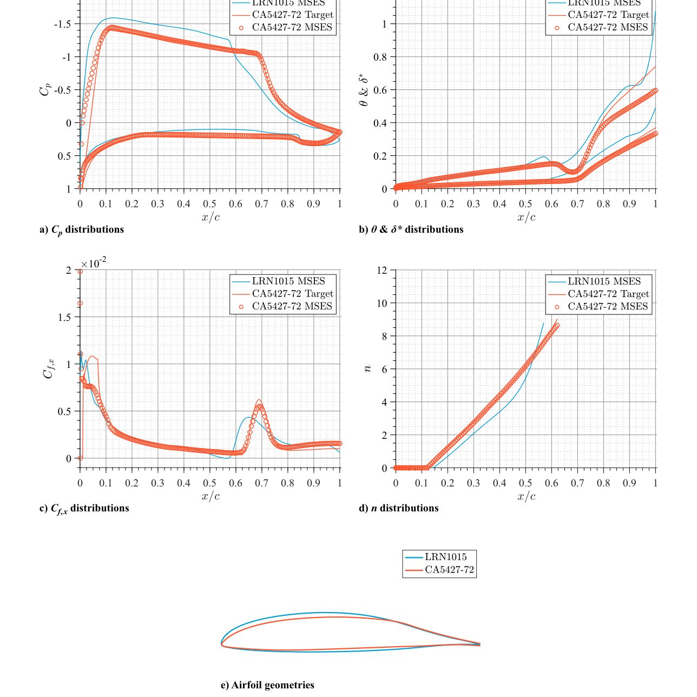

# ca36 Boundary-Layer-Informed Airfoil Design and Validation

## Design workflow

- The paper parameterizes the upper-surface pressure distribution as favorable-pressure-gradient, linear, and concave pressure-recovery segments, holding the lower-surface distribution fixed for each design. (source: sources/ca36.md)
- Its MATLAB boundary-layer solver integrates momentum, kinetic-energy shape, and transition-amplification equations with a second-order implicit Crank-Nicolson scheme; it requires edge velocity plus initial `theta`, displacement thickness, and shear-stress coefficient. (source: sources/ca36.md)
- The solver evaluates distributions over candidate recovery onset positions. The selected CA5427-72 used `x0 = 0.72c`, the lowest predicted trailing-edge momentum thickness in the stated sweep. (source: sources/ca36.md)
- Transition is modeled with the `e^n` method. The nominal `ncrit = 9` assumption was later adjusted to `ncrit = 3.05` to better represent the tunnel's inferred turbulence intensity. (source: sources/ca36.md)

Original caption: Fig. 6 CA5427-72 airfoil characteristics for minimum theta_TE at the L/Dmax design point. [[ca36|Source]]

## Validation lessons

- The wind-tunnel model filled the test-section span to mitigate finite-wing effects and used pressure taps plus a downstream pitot-static wake traverse. Profile drag came from wake pressure using the Betz method. (source: sources/ca36.md)
- The tunnel had porous walls, so the authors emphasize aerodynamic polars rather than the nominal effective angle of attack. (source: sources/ca36.md)
- Match the actual Mach number, Reynolds number, lift coefficient, and tunnel turbulence when comparing an integral-boundary-layer prediction with measurements: the paper attributes differences in natural transition and drag partly to the experimental environment's higher turbulence. (source: sources/ca36.md)

> Uncertainty: MSES overpredicted maximum lift and underpredicted drag in parts of this study. The result supports using pressure distributions and wake drag together for validation, not treating an inverse-design convergence result as sufficient verification. (source: sources/ca36.md)

Related: [[MSES]], [[CFD and Validation]], [[Finite Wing Aerodynamics]].
