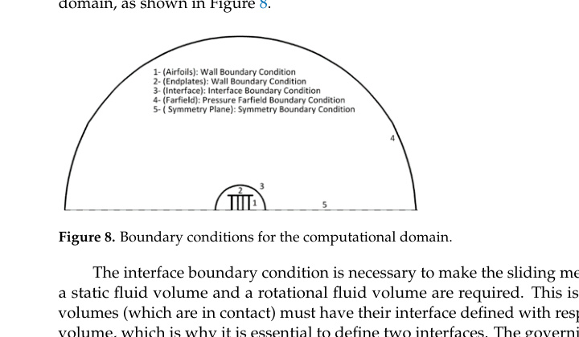
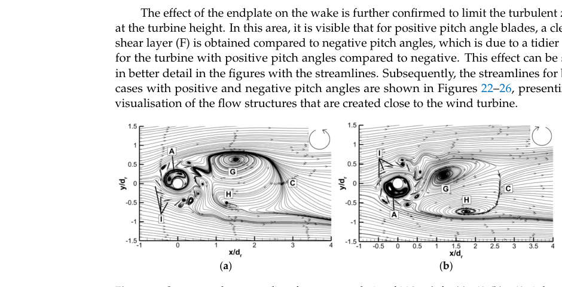

# cj2 Farrah VAWT CFD Setup

## Setup

- The model is 3D, transient, pressure-based Fluent CFD using Menter `k-omega SST`, with a sliding mesh and matching interface between rotating and static volumes. (source: sources/cj2.md)
- It uses a 14,438,984-cell fine tetrahedral mesh, `y+ = 1`, 20 inflation layers, second-order discretisation, `SIMPLEC`, 0.3-degree time increments, 50 iterations per step, and four revolutions. (source: sources/cj2.md)
- The air condition is a pressure farfield at `101,325 Pa` and `293.15 K`; the study uses Mach `0.06` and treats compressibility effects as negligible. (source: sources/cj2.md)
- The model represents half the turbine with a symmetry plane, then mirrors it for post-processing. (source: sources/cj2.md)

Original caption: Figure 8. Boundary conditions for the computational domain. [[cj2|Source]]

## Verification And Validation

Defining the 12 airfoils as separate wall boundaries is consequential in this model: the fine-mesh `k-omega SST` result is 4.77 W with multiple walls but 2.64 W with one connected wall, compared with 4.97 W experimental power. (source: sources/cj2.md)

The authors report that Spalart-Allmaras fails to reproduce the expected sinusoidal torque and has a minimum 43.25% fine-mesh error. (source: sources/cj2.md)

The validation comparison applies assumed mechanical losses of 50% or 20%; treat the reported agreement as calibrated trend agreement, not direct validation of raw CFD power. (source: sources/cj2.md)

## Wake Findings

The source reports wake recovery at 9D and a near-wake recirculation region to 2.6D. It identifies pitch-dependent quasi-symmetric recirculation and large vortical structures for the plus and minus 40-degree cases. (source: sources/cj2.md)

Original caption: Figure 22. Symmetry plane streamlines for a stream velocity of 16.8 m/s for (a) +40; (b) -40 pitch angles. [[cj2|Source]]

> Uncertainty: the paper itself recommends transition SST for future work because the fully turbulent model can overestimate power in its transitional Reynolds-number regime. (source: sources/cj2.md)

Related pages: [[cj2-summary]], [[CFD]], [[CFD and Validation]]

#cfd
