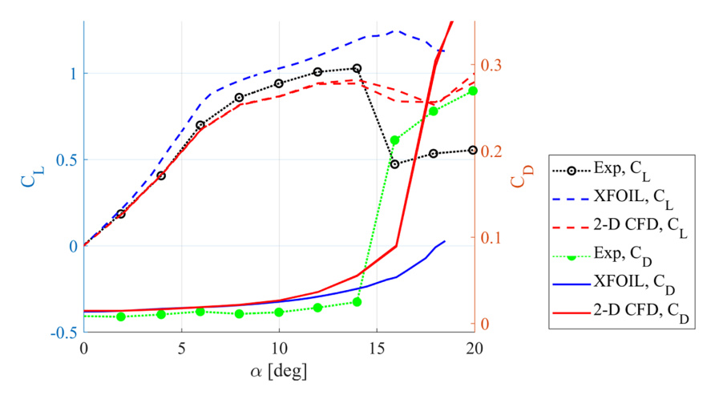

# cj9 NACA0018 Low-Re Validation Data

## Why this source is useful

- The source provides rare experimental `NACA0018` data down to `Re = 30,000`, which is directly useful when checking low-Re airfoil CFD or `XFOIL` predictions for small-scale VAWT work. (source: sources/cj9.md)
- It uses two independent lift-measurement techniques and reports strong agreement across most of the tested range. (source: sources/cj9.md)

## Main validation takeaways

- At `Re = 100,000`, the paper reports a maximum lift coefficient of `0.948` during increasing angle of attack, with about `12%` reduction on the return path because of hysteresis. (source: sources/cj9.md)
- At `Re = 160,000`, the reported maximum lift coefficient is `1.012` at about `14.02` degrees, while the return-path lift at the same angle drops to `0.421`, indicating a lift loss of about `58.4%`. (source: sources/cj9.md)
- At `Re = 160,000`, the drag coefficient at zero angle of attack is `0.0084`; at `Re = 30,000`, the same quantity is reported as `586%` higher. (source: sources/cj9.md)
- At `Re = 50,000`, the maximum lift coefficient is only `0.435` at `3` degrees, and at `Re = 30,000` the lift is described as practically negligible. (source: sources/cj9.md)

## Comparison with models

- The paper says `XFOIL` reproduces the overall low-Re trends reasonably well, including the nearly linear lift curve at the lowest Reynolds number, but overestimates the maximum lift coefficient. (source: sources/cj9.md)
- It reports that `2-D` CFD with the Transition SST model predicts the drag increase more accurately than `XFOIL` at `Re = 160,000`, but underestimates lift. (source: sources/cj9.md)

Original caption: Figure 15. Comparison of airfoil characteristics at Re = 160 k obtained from experiments and 2-D CFD using the Transition SST model. [[cj9|Source]]

## Setup and measurement caveats

- The drag measurements are only reported over `-20` to `+20` degrees because the wake rake was not wide enough for the full large-wake range. (source: sources/cj9.md)
- The study uses a low-turbulence tunnel with turbulence intensity below `0.1%` and notes that very low-Re load measurement is difficult and can be sensitive to technique and tunnel conditions. (source: sources/cj9.md)

> Uncertainty: use this source as an isolated-airfoil validation target, not as a direct predictor of rotating VAWT blade loads or startup behaviour. The paper itself highlights the difficulty of calibrating turbulence models in this regime. (source: sources/cj9.md)

Related pages: [[cj9-summary]], [[CFD and Validation]], [[XFOIL]], [[Airfoil Selection for Small Straight-Bladed VAWTs]]

#cfd
