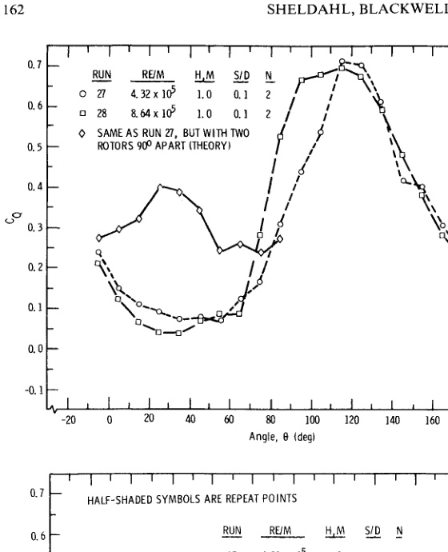

# va30 Savonius Wind-Tunnel Benchmark

## Geometry for CFD comparison

For a directly supported two-bucket benchmark, use two `180-degree` semicircular buckets of radius `0.25 m`, nominal rotor diameter `1 m`, and rotor height `1 m`; compare gap ratios `S/D = 0.10` and `0.15`. (source: sources/va30.md)

The experiments tested this family at nominal `7 m/s` (`Re/m = 4.32 x 10^5`) and `14 m/s` (`Re/m = 8.67 x 10^5`). (source: sources/va30.md)

## Quantities to compare

- Match the cP-versus-TSR curve, including its approximate peak near cP `0.24` and TSR `0.7` for the plotted 1-m, two-bucket `S/D = 0.10-0.15` cases at 7 m/s. This peak is graph-read, not a tabulated target. (source: sources/va30.md)
- Compare static torque coefficient across 10-degree rotor-angle increments, not just mean power. (source: sources/va30.md)
- Subtract or otherwise account for mechanical friction only when comparing with the paper's corrected aerodynamic coefficients: the test measured a friction tare of about `0.7 N m` and added it during coefficient calculation. (source: sources/va30.md)
- Apply the published blockage correction only as a sensitivity case. The authors used factors `0.0125` for 1-m height and `0.0162` for 1.5-m height, but explicitly state that no proven Savonius blockage correction exists. (source: sources/va30.md)

Original caption: Figure 4. The static torque coefficient as a function of angular position for a two-bucket Savonius rotor with a gap width ratio of 0.10 for Re/m of 4.32 x 10^5 and 8.64 x 10^5. [[va30|Source]]

## Limits

The paper does not report blade/endplate thickness, shaft diameter, turbulence intensity, detailed tunnel boundary-layer conditions, or tabulated point data. These omissions prevent an exact numerical replication without digitizing the figures and selecting documented assumptions. (source: sources/va30.md)

Related pages: [[va30 Two-Bucket Semicircular Savonius Benchmark]], [[va30 Gap Ratio]], [[Wind Tunnel Testing]], [[CFD]].

#CFD
