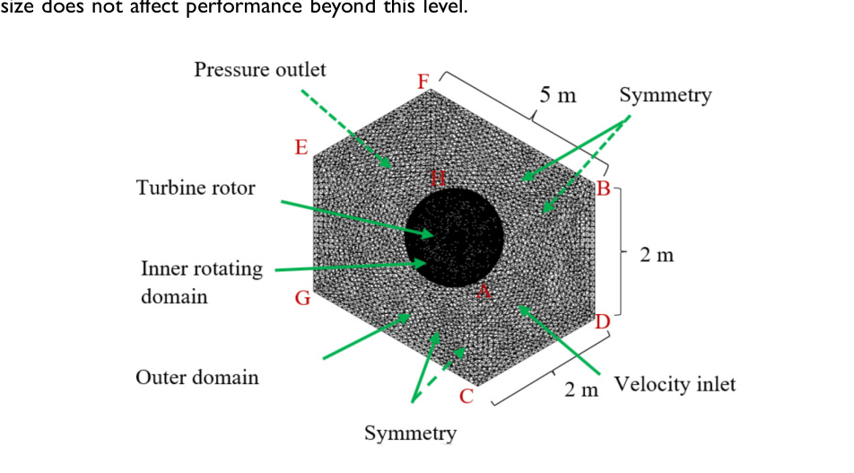

# vj20 Scaled Hybrid VAWT CFD Setup

## Reported Reproduction Settings

Use the following only as the paper-reported baseline. It is not a complete Fluent case because several required controls were not reported.

| Category          | Setting                                  | Reported value                                                                                                |
| ----------------- | ---------------------------------------- | ------------------------------------------------------------------------------------------------------------- |
| Software          | Meshing and CFD package                  | ANSYS Fluent                                                                                                  |
| Geometry          | Model                                    | Scaled-down hybrid VAWT with three outer NACA0018 blades, three inner DU 06-W-200 blades, and a central shaft |
| Domain            | Outer stationary domain                  | `5 m x 2 m x 2 m` (`5 m` streamwise); described as about `14.5D` over the outer rotor diameter                |
| Motion            | Method                                   | Transient sliding mesh with a rotating inner zone and stationary outer zone                                   |
| Boundaries        | Inlet / outlet                           | Velocity inlet / pressure outlet                                                                              |
| Boundaries        | Side, top, and bottom faces              | Symmetry                                                                                                      |
| Boundaries        | Blades and shaft                         | Wall                                                                                                          |
| Flow model        | Formulation                              | URANS                                                                                                         |
| Turbulence        | Model stated in formulation              | `k-epsilon`                                                                                                   |
| Discretisation    | Convective momentum and turbulence terms | Second order                                                                                                  |
| Mesh              | Type                                     | Unstructured hybrid mesh with prismatic boundary-layer cells                                                  |
| Mesh              | Size function                            | Advanced proximity-and-curvature sizing                                                                       |
| Mesh              | Wall element size                        | `0.004 m`                                                                                                     |
| Mesh              | Interface element length                 | `0.005 m`                                                                                                     |
| Mesh              | Inflation layers / transition / growth   | `15` / `1:1` / `1.4`                                                                                          |
| Mesh              | Near-wall criterion                      | Stated as `y+ < 5` for the viscous sublayer                                                                   |
| Mesh              | Reported final mesh                      | More than `2 million` elements                                                                                |
| Mesh independence | Selected refinement                      | Level `2`, `321,189` nodes; no significant `Cp` change at finer levels                                        |
| Time              | Selected time step                       | `0.05 s` at `TSR = 3`                                                                                         |
| Run duration      | Shown quasi-steady response              | About `1.9 s` before moment fluctuations ceased in the illustrated case                                       |

> Uncertainty: the paper uses `k-epsilon` as its selected turbulence model but also includes unclear wording that attributes near-wall/wake treatment to SST. It does not identify a specific `k-epsilon` variant, wall treatment, or SST activation; do not set an SST model solely from that prose. (source: sources/vj20.md)

## Scope And Geometry

This is a three-dimensional transient CFD model of the scaled-down hybrid VAWT, created after the wind-tunnel campaign and using the scaled geometry from the similarity analysis. It models three outer `NACA0018` blades and three inner `DU 06-W-200` asymmetric blades, plus the central shaft. (source: sources/vj20.md)

| Scaled-model parameter | Value |
| --- | --- |
| Outer rotor diameter / height / chord | `0.350 m` / `0.283 m` / `49.6 mm` |
| Inner rotor diameter / height / chord | `0.143 m` / `0.146 m` / `49.7 mm` |
| Outer / inner blade count | `3` / `3` |
| Outer / inner pitch | `-2.82 degrees` / `-3.41 degrees` |
| Inner-to-outer blade offset | `60 degrees` |

## Domain And Boundary Conditions

The CFD field contains a central rotating zone inside a stationary outer domain. Figure 10 labels the outer-domain dimensions as `5 m` streamwise by `2 m` by `2 m`; the source describes the streamwise extent as about `14.5D`, consistent with the `0.350 m` outer diameter. (source: sources/vj20.md)

- Upstream face: velocity inlet. (source: sources/vj20.md)
- Downstream face: pressure outlet. (source: sources/vj20.md)
- Lateral, top, and bottom faces: symmetry. (source: sources/vj20.md)
- Rotor blades and central shaft: wall conditions. (source: sources/vj20.md)

Original caption: Figure 10. The mesh created in the rotating, stationary zones and around the rotor blades. [[vj20|Source]]

## Flow And Motion Conditions

The simulations cover inlet speeds from `1` to `6 m/s` and several imposed TSRs. The main reported CFD comparisons use `3`, `3.64`, and `5 m/s`; the maximum reported computational `Cp` is `0.486` at `3.64 m/s` and `TSR = 3`. (source: sources/vj20.md)

The scaled similarity table lists a rated inflow of `3.652 m/s`, scaled cut-in speed of `1.405 m/s`, and rotational speed of `37.06 rad/s`. The source separately reports Reynolds-number cases of `1.02 x 10^4`, `1.23 x 10^4`, `1.70 x 10^4`, and `2.04 x 10^4` for `3`, `3.63`, `5`, and `6 m/s`, respectively. (source: sources/vj20.md)

> Discrepancy: using the documented outer radius (`0.175 m`), `TSR = 3` and `V = 3.652 m/s` imply approximately `62.6 rad/s`, not the tabulated `37.06 rad/s`. The source does not resolve this mismatch, so the tabulated rotational speed should not be assumed to be the `TSR = 3` condition. (source: sources/vj20.md)

The source does not state CFD inlet turbulence intensity, turbulence length scale, air properties, temperature, pressure reference, or an exact rotational-speed schedule for each simulated TSR. Its wind-tunnel flow-uniformity statement is not sufficient to establish a CFD turbulence boundary condition. (source: sources/vj20.md)

## Numerics And Turbulence Modelling

The authors use unsteady Reynolds-averaged Navier-Stokes (URANS) with a sliding mesh: the rotating-zone mesh moves relative to the stationary outer-domain mesh through interfaces. They use a `k-epsilon` turbulence model and second-order discretisation for the convective momentum and turbulence terms. Moment is recorded at every time step; the shown moment history becomes quasi-steady after about `1.9 s`. (source: sources/vj20.md)

> Uncertainty: the source calls the selected model `k-epsilon` but also contains unclear prose about SST wake treatment. It does not report enough solver detail to establish whether an SST model or a specific near-wall treatment was actually enabled. (source: sources/vj20.md)

## Mesh Details

The mesh is described as an unstructured hybrid grid with prismatic boundary-layer cells. An advanced size function based on proximity and curvature was used to refine curved blade surfaces, small regions, and near-wall areas. (source: sources/vj20.md)

| Mesh setting | Reported value |
| --- | --- |
| Inflation layers | `15` |
| Inflation transition pattern | `1:1` |
| Inflation growth rate | `1.4` |
| Near-wall element size | `0.004 m` |
| Stated near-wall target | `y+ < 5` |
| Interface element length | `0.005 m` |
| Total elements | More than `2 million` |

The mesh-independence test evaluated `Cp` over refinement levels `0` through `5`. The authors selected refinement level `2`, reported as `321,189` nodes, because further refinement produced no significant `Cp` change. The paper does not provide the full node/element counts or `Cp` values for every refinement level. (source: sources/vj20.md)

## Time-Step Study

At `TSR = 3`, the authors tested time steps from `1 s` to `0.005 s`. They selected `0.05 s` because reducing it further produced no material `Cp` change. (source: sources/vj20.md)

| Time step | `Cp` |
| --- | --- |
| `1 s` | `0.441` |
| `0.5 s` | `0.454` |
| `0.1 s` | `0.463` |
| `0.05 s` | `0.474` |
| `0.01 s` | `0.473` |
| `0.005 s` | `0.474` |

## Settings The Paper Does Not Report

The paper provides a useful source-matched validation target, but not a fully reproducible solver recipe. It omits the following controls:

- Pressure-velocity coupling scheme.
- Residual convergence thresholds and monitoring criteria.
- Iterations per time step.
- Total simulated revolutions or a formal time-averaging window.
- Air density, viscosity, temperature, and pressure reference used in CFD.
- Inlet turbulence intensity, turbulence length scale, and turbulence quantities.
- Exact rotational-speed schedule at each inlet speed and TSR.
- Rotating-zone diameter, height, and interface topology.
- Complete nodes, elements, and `Cp` results for each mesh-refinement level.

Any reconstruction should first match the published geometry, inlet speed, TSR, mesh/time-step sensitivity, and coefficient definitions, then document each omitted control as a new assumption. (source: sources/vj20.md)

Related pages: [[vj20-summary]], [[vj20 Proposed Hybrid VAWT]], [[CFD]], [[VAWT CFD Study Setup Checklist]], [[Scaling Effects]].

#cfd
