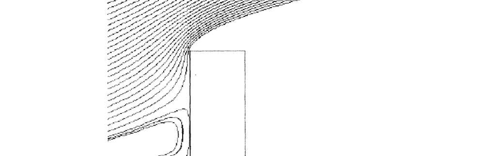
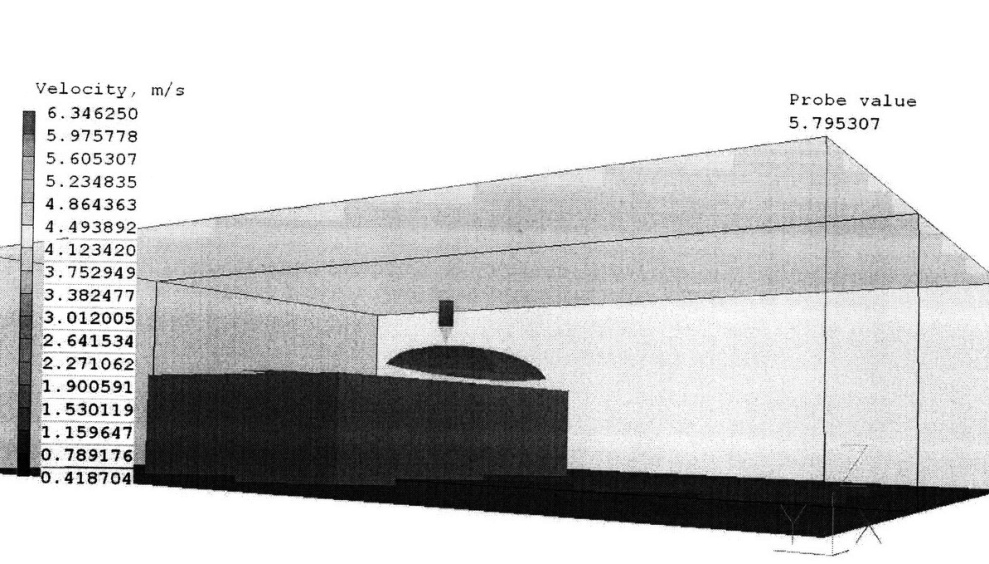
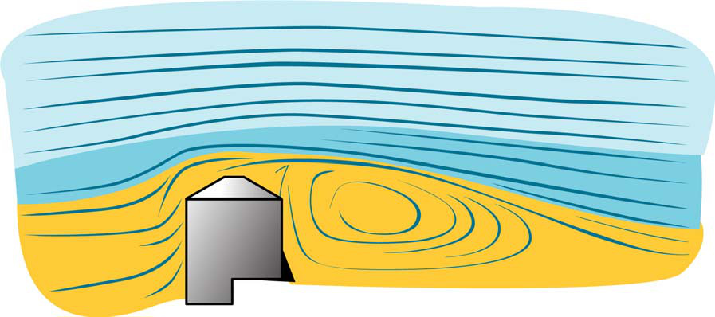
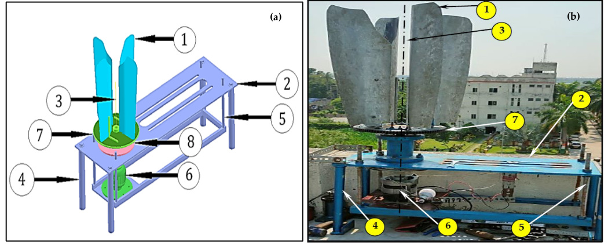

## Architectural Wind Turbines

Small wind turbines installed over the edges of building rooftops to use locally accelerated flow rather than open-field tower siting. (source: sources/va17.md)

- The va17 thesis presents them as a possible way to incorporate wind energy into a dense urban campus where large MW-scale turbines are not practical. (source: sources/va17.md)
- Its explanation is that airflow speeds up as it is forced around or over a building, creating a high-velocity region near the roof edge through the Venturi effect. (source: sources/va17.md)
- The same source makes clear that edge acceleration alone is not enough; the location of the accelerated region has to be practical for installation, not just high in magnitude. (source: sources/va17.md)
- In its MIT case study, Eastgate showed only a limited practical fit because the strongest region was about 15 m above the roof and away from the edge. (source: sources/va17.md)
- Johnson Athletic Center looked more favorable in the same thesis because the peak region was near the roof edge and about 5 m above the roof. (source: sources/va17.md)
- The source still recommends direct follow-up measurements with anemometers before installation. (source: sources/va17.md)
- The earlier va19 MIT report adds a different rooftop strategy: a parapet-mounted turbine designed specifically to exploit roof-edge updraft rather than a conventional freestanding rooftop turbine. (source: sources/va19.md)
- That source compares a conventional `Skystream 3.7` against the parapet-specific `AVX1000`, and says the dedicated roof-edge concept still failed its economics on the tested MIT buildings. (source: sources/va19.md)
- It also says the conventional Skystream was not originally designed for rooftops and would need additional roof-mount engineering before implementation. (source: sources/va19.md)
- The `va21` paper adds a built prototype case rather than only a siting screen or product comparison: a four-bladed rooftop VAWT was installed on the south-west corner of a Kolkata building roof, on a parapet-supported brick pillar about `21 m` above ground. (source: sources/va21.md)
- That source frames rooftop VAWTs as compact building-integrated systems that must balance limited space, low and unsteady wind, noise, vibration, architectural fit, and biodiversity concerns. (source: sources/va21.md)
- It also makes clear that the demonstrated electrical output is supplementary rather than a full replacement for household supply, even when the prototype operates satisfactorily at low to moderate wind speeds. (source: sources/va21.md)

Original caption: Figure 2. Diagram showing wind acceleration over edge of building. [[va17|Source]]

Original caption: Figure 12. Region of peak wind velocity surrounding Johnson Athletic Center. [[va17|Source]]

Original caption: Figure 5. Diagram from AV proposal illustrating wind shear effect on the top of a building parapet. [[va19|Source]]

Original caption: Figure 3. Major components of the WT: (a) isometric view and (b) photographic view. Legends: 1. Blades (04 in count); 2. Holding table; 3. Vertical axis of rotation; 4. Table legs (04 in count); 5. Threaded stud (04 in number); 6. Electrical motor (DC to AC); 7. Large spur gear; 8. Hollow flanged attachment (source: Shantanu Dutta). [[va21|Source]]

Related:
- [[Urban Wind Conditions]]
- [[CFD]]
- [[Turbine Concept Selection]]
- [[va19 Skystream 3.7]]
- [[va19 AeroVironment AVX1000]]
- [[va21 Rooftop Vertical-Axis Wind Turbine]]

#concepts
