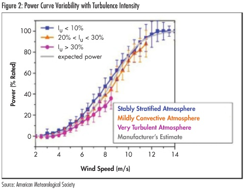

---
Created:
Updated: 2026-07-02
Sources:
- [[vj10]]
- [[vj11]]
- [[vj3]]
Source_count: 3
Tags:
- concepts
---
## Atmospheric Turbulence

Random, continuously changing air motions superimposed on the mean wind. (source: sources/vj3.md)

Core measures:
- Turbulence intensity: horizontal wind-speed standard deviation divided by mean wind speed over a 10-minute period. Typical values in the article range from 3% to 20%. (source: sources/vj3.md)
- Turbulence kinetic energy (TKE): the squared standard deviations of all three velocity components summed and divided by two. The article gives typical values from 0.05 m²/s² at night to 4 m²/s² or greater during the day. (source: sources/vj3.md)

Causes and patterns:
- Convection from solar heating can produce intense daytime turbulence. (source: sources/vj3.md)
- Wind shear and surface friction generate turbulence both day and night. (source: sources/vj3.md)
- Wind shear, turbulence, and wind direction are identified as major parameters affecting uncertainty in wind turbine power diagrams. (source: sources/vj10.md)
- Obstacles such as trees, buildings, wind turbines, and terrain create mechanically induced wakes. (source: sources/vj3.md)
- Offshore flow is usually less turbulent than onshore flow, while complex or mountainous terrain is usually more turbulent than flat terrain. (source: sources/vj3.md)

The VAWT review says urban rooftop turbulence intensity is often high enough to affect startup, dynamic stall, and wake recovery. (source: sources/vj11.md)
It notes that turbulence can improve low-to-moderate TSR power by delaying separation, while also reducing cyclic loading and helping wake recovery. (source: sources/vj11.md)

Measurement:
- Cup, propeller, and sonic anemometers are used for point measurements. (source: sources/vj3.md)
- IEC 61400-12-1 requires horizontal components for turbine power-performance measurements. (source: sources/vj3.md)
- SODAR and LIDAR can estimate volume-averaged turbulence, but comparing them directly with point measurements is difficult. (source: sources/vj3.md)

Wind-energy effects:
- Turbulence can lower power near rated speed and improve power near cut-in speed. (source: sources/vj3.md)
- Around 8 m/s, power production can vary by up to 20% depending on turbulence intensity. (source: sources/vj3.md)
- Turbulence increases loads, wake interactions, fatigue, and noise propagation. (source: sources/vj3.md)
- In the HAWT wind-shear study, non-uniform vertical wind profile reduces power coefficient and changes lift and thrust coefficients along the blade. (source: sources/vj10.md)

Original caption: Figure 2: Power Curve Variability with Turbulence Intensity [Source](../../sources/vj3.md)

Related:
- [[Urban Wind Conditions]]
- [[HAWT vs VAWT]]
- [[VAWT]]
- [[Wind Shear]]

#concepts 
