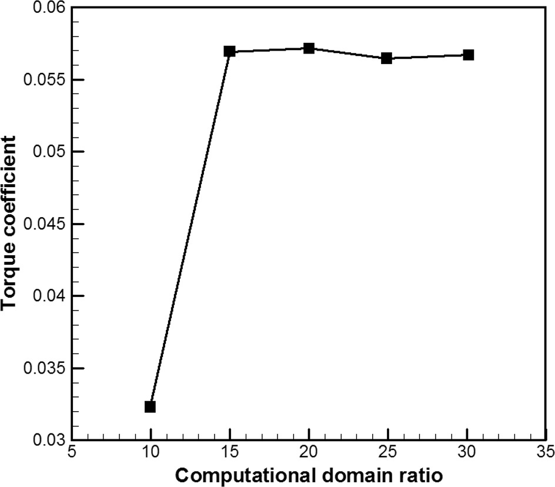
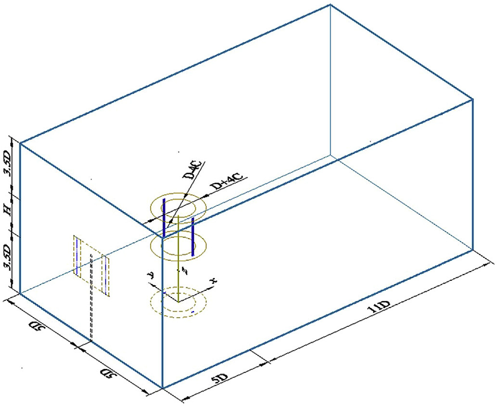
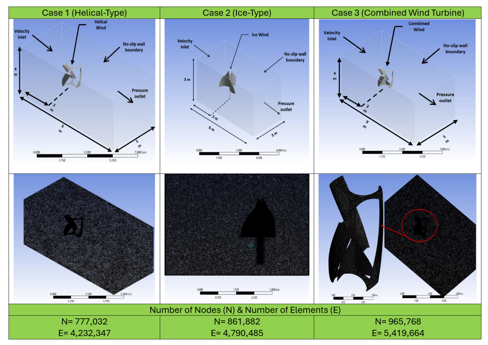
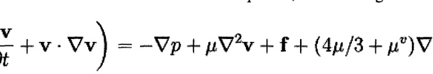
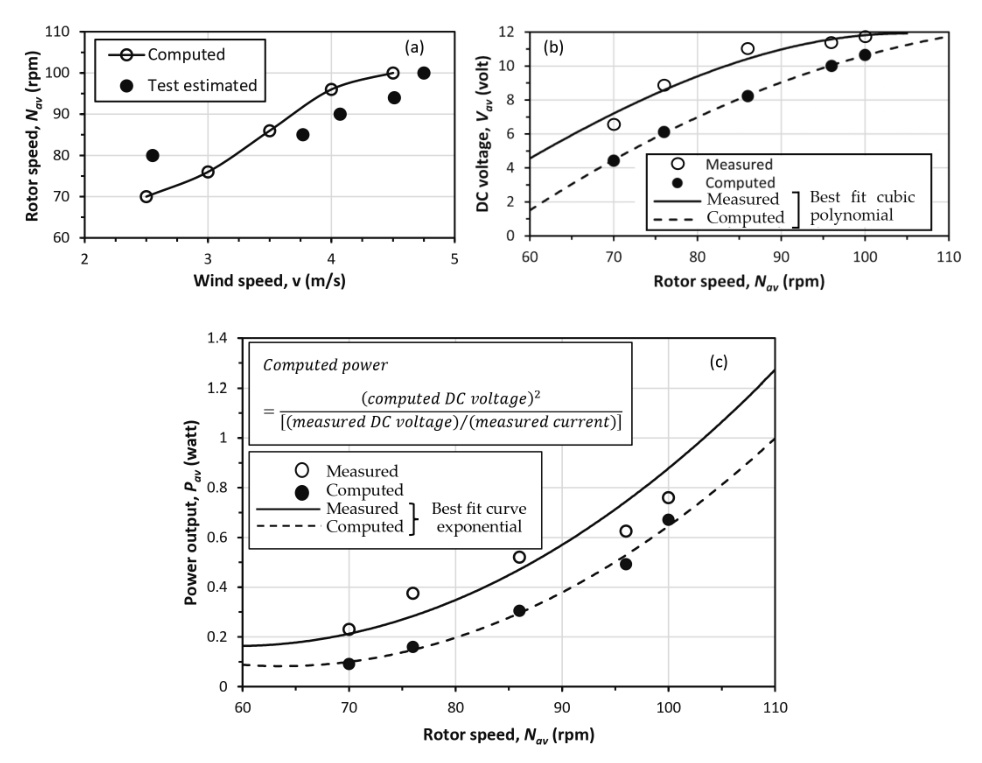
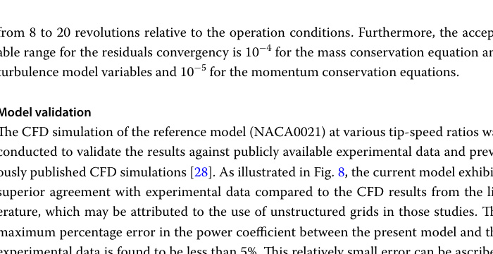

---
Created:
Updated: 2026-07-06
Sources:
- [[va10]]
- [[va13]]
- [[va15]]
- [[va14]]
- [[va17]]
- [[va18]]
- [[va21]]
- [[va25]]
- [[va11]]
- [[va9]]
- [[vj11]]
- [[vj2]]
- [[vj5]]
- [[vj6]]
- [[vj13]]
- [[vj15]]
- [[vj17]]
Source_count: 14
Tags:
- concepts
---
## CFD and Validation

This page covers the simulation workflow used to check a VAWT before hardware is built.

- CFD is used to compare concepts, test geometry changes, and estimate torque and power coefficient. (source: sources/vj2.md, sources/vj5.md, sources/vj6.md)
- Mesh refinement matters. (source: sources/vj5.md, sources/vj6.md)
- The va10 review recommends explicit grid-independence and domain-size sensitivity checks before trusting performance outputs. (source: sources/va10.md)
- It says cells should be clustered near the blade and wake, with wall-adjacent resolution chosen to match the turbulence model's wall treatment. (source: sources/va10.md)
- PIV data is a useful validation target for VAWT CFD. (source: sources/vj5.md)
- The CFD review says 3-D models usually capture losses better than 2-D models. (source: sources/vj6.md)
- The review also uses torque, power coefficient, flow separation, and wake dynamics as key outputs. (source: sources/vj6.md)
- It reports that PISO outperformed SIMPLE and COUPLED in one reviewed Darrieus CFD comparison. (source: sources/va10.md)
- It also treats transition SST, LES, and hybrid RANS-LES as important when separation and unsteady wake fidelity matter more than design-stage speed. (source: sources/va10.md)
- The va11 wake review adds that PIV-validated 2-D and 3-D CFD were both used for wake studies, but 3-D simulation was needed to capture blade-tip vortices and avoid over-predicting H-rotor performance. (source: sources/va11.md)
- It also reviews RANS, LES, DES, and analytical wake-model development as complementary validation layers for wake prediction. (source: sources/va11.md)
- The va13 building-integration study uses ANSYS Fluent with the SST `k-ω` model to compare rooftop turbine cases, but it explicitly says mesh sensitivity and experimental validation were not included in that study. (source: sources/va13.md)
- The va15 experiment adds scarce low-`lambda`, time-accurate startup data that the paper explicitly positions as future validation material for numerical models. (source: sources/va15.md)
- The va14 study adds a validated 2D URANS parameter sweep using transition SST (`γ-Reθ`), sliding mesh, grid-sensitivity analysis, and two separate experimental comparisons. (source: sources/va14.md)
- The vj13 study uses 2-D transient CFD in Fluent with `k-ω SST`, grid and time-step independence checks, and validation against wind-tunnel data within about 5% error. (source: sources/vj13.md)
- It also implements the variable rotational speed strategy through a UDF and a pressure-based coupled solver with second-order upwind discretization. (source: sources/vj13.md)
- The vj15 study uses 2-D transient CFD with SST `k-omega` and a UDF-driven variable-pitch motion law to compare harmonic pitch functions. (source: sources/vj15.md)
- The vj17 study verifies its optimized Savonius geometry with CFD after DVM/SSA optimization and uses a 3D domain with SST `k-omega` for the final comparison. (source: sources/vj17.md)
- The va17 rooftop-siting thesis adds a building-scale CFD use case: screening candidate roof edges and then recommending follow-up anemometer measurements instead of treating the simulation alone as sufficient validation. (source: sources/va17.md)
- The va18 urban-resource paper validates a CFD-based siting workflow against two local met towers, comparing mean wind speed, wind power density, and Weibull-based wind-distribution shape between measured and reconstructed site statistics. (source: sources/va18.md)
- It reports that local climatology assimilation best matched the measured site-to-site ratios, while background assimilation, TopoWind transfer, and MCP normalization still preserved the ranking of the two sites. (source: sources/va18.md)
- The va21 rooftop prototype paper adds a direct experiment-versus-simulation comparison for an installed machine, using ANSYS Fluent `16.2`, a transient double-precision parallel solver, and a `k-epsilon` turbulence model on a simplified rotor section. (source: sources/va21.md)
- It reports a mesh-sensitivity check across coarse, fine, and extra-fine meshes, and says the fine and extra-fine meshes produced nearly identical rotor speed, angular velocity, and torque at `3.5 m/s`, so the fine mesh was retained. (source: sources/va21.md)
- The same source reports less than `10%` deviation in rotor speed and less than `20%` deviation in voltage and power relative to measured data, while explicitly attributing part of the remaining error to simplified blade geometry and `2D` modeling of a `3D` turbine. (source: sources/va21.md)
- The va25 airfoil study adds a `2D` URANS CFD workflow with SST `k-omega`, sliding mesh, grid-independence analysis, and GCI, validated against published experimental data with less than `5%` maximum `Cp` error for the reference rotor. (source: sources/va25.md)
- It also places the inlet and outlet much farther from the rotor than many wind-tunnel-style setups, explicitly to suppress solid blockage and allow more open-field-like wake development. (source: sources/va25.md)

The VAWT review says URANS with `k-ω SST` is the main design-stage tool, while transition SST and DES/LES are preferred when dynamic stall fidelity matters most. (source: sources/vj11.md)
It reports that 2-D URANS can overpredict Cp by 15-30% relative to validated 3-D simulations. (source: sources/vj11.md)
It also recommends practical setup ranges of about 15D upstream, 10D downstream, 20D lateral extent, and 20-30 revolutions before sampling. (source: sources/vj11.md)

The va9 paper says its sliced DMS approach can be integrated into existing CFD and CAD tools to improve analysis of complex Darrieus blade-form designs. (source: sources/va9.md)
It also compares streamtube, vortex, and cascade models, noting that vortex models have high experimental correlation with the latest improvements but take the highest computation time among the listed prediction models. (source: sources/va9.md)

The hybrid-rotor CFD paper in `vj2` uses 3D SolidWorks Flow Simulation rather than 2D analysis because the authors say the vortex-like structures in the rotor require a full 3D domain. (source: sources/vj2.md)
It reports a computational domain of 15 m by 12 m by 12 m, 7 m/s inlet wind speed, 5% turbulence intensity, and torque samples at nine attack angles from 0 degrees to 120 degrees. (source: sources/vj2.md)

Original caption: Fig. 5. Computational grid independency study [31]. [[va10|Source]]

Original caption: Fig. 25. Vorticity magnitudes in the blade mid-span and vertical planes (units, 1/s) [52]. [[va11|Source]]

Original caption: Figure 7. Computational domain and mesh setup. [[va13|Source]]

Original caption: Figure 6. Navier-Stokes Equations employed by the CFD program. [[va17|Source]]

Original caption: Figure 13: Mean Wind Power Density (W/m2), Horizontal section 20m above the ground; Mean Wind Power Density (W/m2), Vertical cross-section through MT1 and MT2; Mean Turbulence Intensity, Vertical cross-section through MT1 and MT2. [[va18|Source]]

Original caption: Table 2. Comparison between the measured CP [81] and simulated CP (present CFD study). [[va14|Source]]

Original caption: Figure 22. Comparison between computed and measured parameters: (a) rotor speed, (b) DC voltage and (c) power (source: Authors' elaboration). [[va21|Source]]

Original caption: Fig. 8 Reference model (NACA0021) validation and verification. [[va25|Source]]

Related:
- [[Optimization]]
- [[Dynamic Stall]]
- [[Wind Tunnel Testing]]
- [[Double-Multiple Streamtube Model]]
- [[Architectural Wind Turbines]]
- [[Climatology Assimilation]]
- [[va21 Rooftop Vertical-Axis Wind Turbine]]
- [[va25 Reference H-Rotor Darrieus VAWT]]
