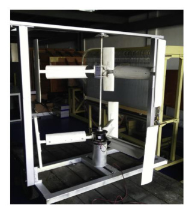

---
Created:
Updated: 2026-07-02
Sources:
- [[sources/vj12.md]]
- [[sources/vj8.md]]
Source_count: 2
Tags:
- concepts
---
## Contra-rotating VAWT

A VAWT concept that uses rotors spinning in opposite directions. (source: sources/vj8.md)

- Geometry:
  - The study treats pitch angle, airfoil thickness, rotor spacing, and included angle as the main geometry variables. (source: sources/vj8.md)
- Performance:
  - The paper says the concept improves wind-energy recovery and stability versus the isolated VAWT. (source: sources/vj8.md)
  - After optimization, Cp reached 0.1837 and total torque dropped by 96.96%. (source: sources/vj8.md)
  - The review says a CRVAWT stacks two rotors on the same vertical axis, often with a single shaft and generator, and opposite rotation is required to avoid output cancellation. (source: sources/vj12.md)
  - It reports one study found an optimum top-to-bottom spacing of about 10 cm and that smaller spacing improved performance. (source: sources/vj12.md)
  - The review says CRVAWTs can keep producing power even if only one rotor is spinning. (source: sources/vj12.md)
- Tradeoffs:
  - The paper reports lower pre-optimization Cp than the isolated VAWT, so the stability gain comes with an initial efficiency penalty. (source: sources/vj8.md)

- The contra-rotating paper treats this as a way to improve stability and wind-energy recovery. (source: sources/vj8.md)
- The source reports a lower pre-optimization power coefficient than the isolated VAWT, but a much lower total torque after optimization. (source: sources/vj8.md)

Related:
- [[Hybrid VAWT]]
- [[VAWT Types]]
- [[Optimization]]
