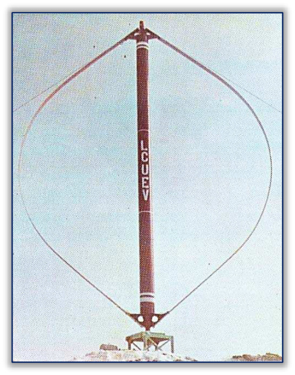
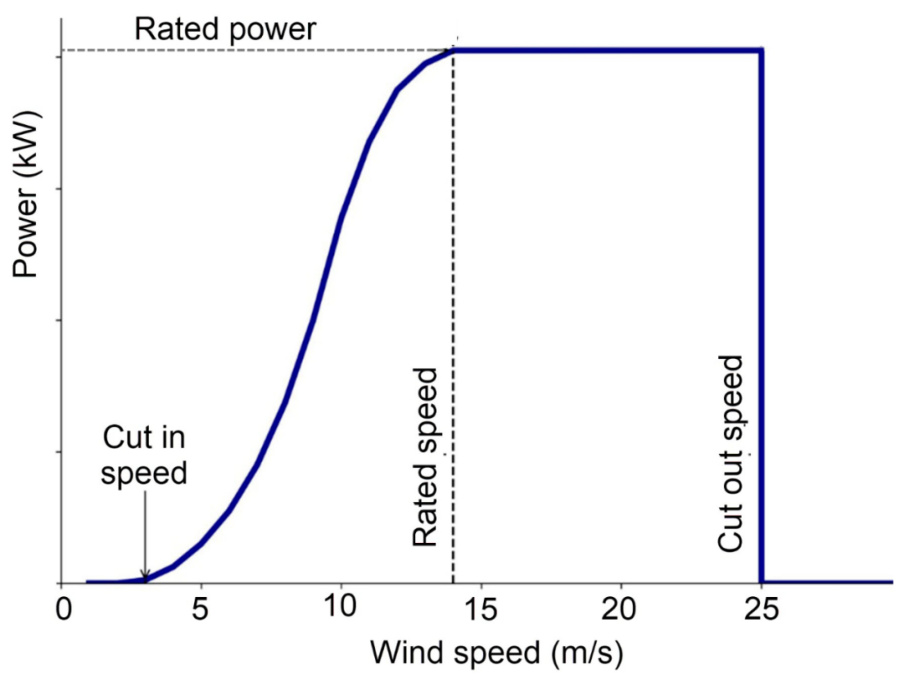
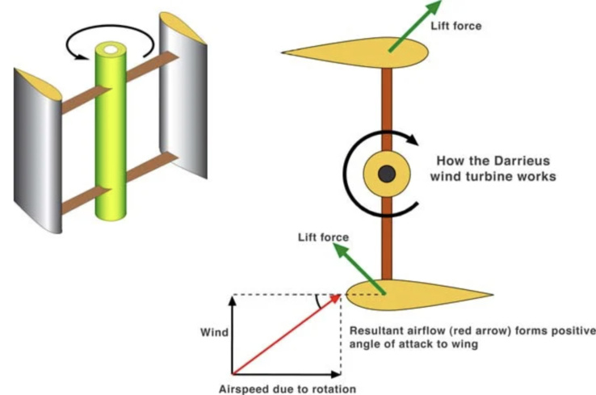

---
Created:
Updated: 2026-07-02
Sources:
- [[HRI2526]]
- [[n1]]
- [[va1]]
- [[va3]]
- [[va8]]
- [[va9]]
- [[vj11]]
- [[vj4]]
- [[vj5]]
Source_count: 9
Tags:
- concepts
---
## Darrieus Turbine

Lift-based VAWT using airfoil blades to generate lift and rotation. (source: sources/n1.md, sources/va1.md)

- Geometry:
  - Uses airfoil blades creating pressure differences to generate lift. (source: sources/HRI2526.md)
  - Main variants include D-rotor/eggbeater, H-rotor, and helical. (source: sources/HRI2526.md)
- Performance:
  - Can rotate at TSR greater than 1 and is effective at higher wind speeds. (source: sources/HRI2526.md)
  - Typical efficiency is 30% to 40%. (source: sources/HRI2526.md)
- Tradeoffs:
  - More efficient than Savonius, but usually needs external starting assistance. (source: sources/HRI2526.md)
  - Curved variants vary in self-starting, torque consistency, and manufacturability. (source: sources/HRI2526.md)

- Higher efficiency (~30–40%) but poor self-starting capability. (source: sources/n1.md)
- Performs better at higher wind speeds. (source: sources/va1.md)

- Uses airfoil blades creating pressure differences to generate lift. (source: sources/HRI2526.md)
- Can operate at tip speed ratios greater than 1. (source: sources/HRI2526.md)
- Includes variants: H-rotor, eggbeater (D-rotor), and helical designs. (source: sources/HRI2526.md)
- Produces relatively smooth and consistent power output. (source: sources/HRI2526.md)
- Typically requires external assistance to start rotating. (source: sources/HRI2526.md)
- The source identifies the Darrieus concept as a 1931 lift-based VAWT introduced by George J. M. Darrieus. (source: sources/va3.md)
- It uses two or more flexible airfoil blades attached to the top and bottom of a rotating vertical shaft. (source: sources/va3.md)
- Helical Darrieus-style rotors are treated separately in [[Helical VAWT]].
- In a small-VAWT BE-M study, three-bladed and helical Darrieus variants reduced pulsating loads compared with two-bladed and straight-bladed variants. (source: sources/vj4.md)
- The same study found the cambered DU 06-W-200 profile improved low-TSR start-up but underperformed in medium-low wind exploitation. (source: sources/vj4.md)
- A dynamic-stall CFD study modeled a 2D single-bladed Darrieus rotor at Re = 50,000 and λ = 2, and found DES gave the best validation against PIV data. (source: sources/vj5.md)
- The paper emphasizes that leading-edge shedding and trailing-edge wake roll-up are the key unsteady features to match. (source: sources/vj5.md)

The review gives typical Darrieus ranges of TSR 2.5-5.0, solidity 0.1-0.4, chord Reynolds number 10^5-10^6, and peak Cp 0.35-0.45 for optimized H-Darrieus designs. (source: sources/vj11.md)
It says H-Darrieus rotors can reach the highest peak Cp among the main VAWT families, but self-starting remains the main weakness. (source: sources/vj11.md)
It treats helical Darrieus as a tradeoff: smoother torque and lower ripple, but added manufacturing complexity and some Cp penalty. (source: sources/vj11.md)

The va8 patent defines Darrieus-type VAWTs as lift-producing turbines and argues that large, smoothly created path difference between top and bottom streamlines increases lift force; it uses this rationale to motivate an asymmetrical blade profile in a hybrid turbine. (source: sources/va8.md)
The same source uses wind tunnel observations of blade lift coefficient versus angle of attack to support its selected 25-degree blade mounting angle. (source: sources/va8.md)

The va9 paper treats startup as a core Darrieus weakness and lists external electricity feed-in, guide vanes, Savonius-Darrieus hybrids, pitch optimization, blade-form optimization, and specific blade-profile design as approaches to overcome it. (source: sources/va9.md)
It presents the EN0005 blade profile as a Darrieus-specific self-start design that avoids extra components or external electricity feed-in while retaining high-TSR performance in the authors' model and tests. (source: sources/va9.md)
The field-test prototype reported self-start at 1.25 m/s, stable behavior in a 25 m/s wind-tunnel stress test, and no audible noise emission in the tested urban environment. (source: sources/va9.md)

Related:
- [[VAWT]]
- [[Eggbeater Darrieus]]
- [[H-VAWT]]
- [[Straight-bladed Darrieus]]
- [[Troposkien Darrieus]]
- [[Helical Darrieus]]
- [[Savonius Turbine]]
- [[Hybrid VAWT]]
- [[Wind Turbine Parameters]]
- [[Dynamic Stall]]
- [[Aerodynamic Design Parameters]]
- [[Wind Tunnel Testing]]
- [[Double-Multiple Streamtube Model]]
- [[EN0005 Self-start Darrieus VAWT]]
- [[EN0005 Blade Profile]]

#concepts 
