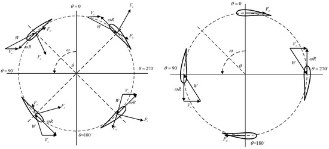

## H-Type Vertical-Axis Wind Turbine (H-VAWT)

Vertical-axis wind turbine with straight blades arranged around the rotor, often used as a benchmark for aerodynamic modeling and optimization. (source: sources/va2.md)

- The paper validates an H-VAWT CFD model against the Musgrove wind-tunnel experiment. (source: sources/va2.md)
- The study uses a NACA0015 baseline airfoil and evaluates performance across tip-speed ratios. (source: sources/va2.md)
- H-VAWT flow loading varies strongly with azimuth angle, with lift and drag contributing differently across a full rotation. (source: sources/va2.md)
- The paper also treats H-VAWT as a VAWT subtype suited to optimization with surrogate models. (source: sources/va2.md)
- In the small-VAWT architecture study, the straight-bladed H-Darrieus case had larger pulsating loads than the helical case. (source: sources/vj4.md)
- The helical configuration widened the range near maximum CP and reduced fatigue-driving oscillations. (source: sources/vj4.md)

Related: [[VAWT]], [[Darrieus Turbine]], [[HAWT vs VAWT]], [[Kriging Surrogate Model]], [[CST Parameterization]], [[Multi-Island Genetic Algorithm]], [[Straight-bladed Darrieus]]
 
#concepts 
